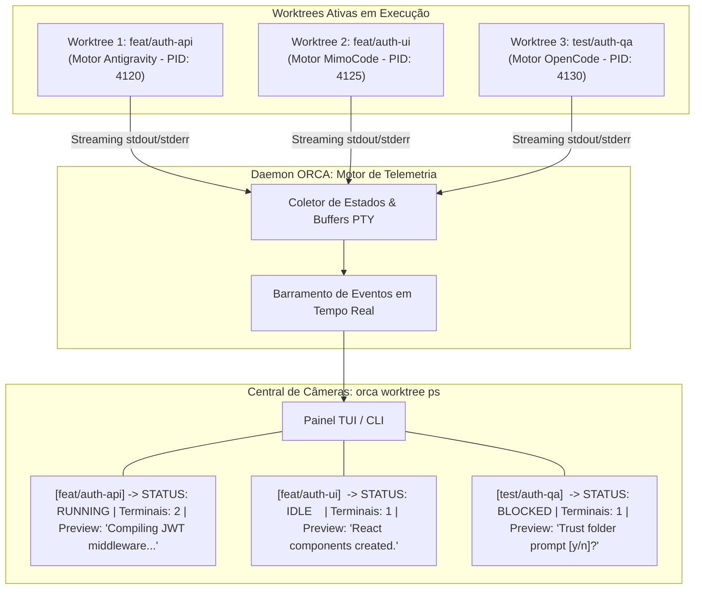

# Capítulo 9 — A Central de Câmeras ao Vivo: Monitoramento Contínuo com orca worktree ps

## 1. Introdução

A operação de múltiplos agentes autônomos executando tarefas concorrentes de engenharia de software transforma radicalmente a dinâmica de desenvolvimento [18]. No entanto, à medida que o número de worktrees ativas cresce, o operador humano enfrenta o desafio de manter a visibilidade situacional sobre o progresso de cada agente sem precisar alternar manualmente entre dezenas de janelas de terminal [3]. Sem uma ferramenta consolidada de observabilidade em tempo real, a equipe corre o risco de perder horas com agentes que concluíram suas tarefas e aguardam revisão ou que entraram em estados de espera silenciosa [13].

A plataforma ORCA soluciona esse desafio através do comando `orca worktree ps` [12]. Funcionando como uma verdadeira **Central de Câmeras de Vigilância ao Vivo**, essa funcionalidade agrega o estado operacional de todas as worktrees, exibindo em um painel unificado o branch em execução, a contagem de processos PTY ativos, notificações pendentes e prévias em tempo real dos buffers de saída com intervalo de amostragem de 3 s [12].

Esse nível de telemetria contínua permite ao engenheiro identificar instantaneamente quando um agente finalizou a geração de código, quando uma compilação foi concluída com sucesso ou quando uma intervenção humana se faz necessária [4]. A observabilidade deixa de ser um esforço reativo e passa a ser uma capacidade proativa central para a governança de frotas de agentes [20].

Neste capítulo, estudaremos a fundo a arquitetura da central de monitoramento do ORCA, as opções de formatação textual e visual na TUI, a extração de métricas estruturadas em JSON com filtros avançados e as práticas recomendadas para construir dashboards operacionais de alto impacto [18].

## 2. Explica

O monitoramento de agentes de IA exige uma abordagem que vá além do simples comando `ps` ou `top` do sistema operacional [12]. Enquanto processos convencionais apenas consomem ciclos de CPU e memória, agentes autônomos operam em ciclos cognitivos que envolvem leitura de arquivos, raciocínio em LLMs remotos, escrita de código e execução de testes locais [13].

O comando `orca worktree ps` foi projetado para traduzir esses estados complexos em uma visão tabular compacta e informativa [18]. Ao ser executado, ele consulta o daemon do ORCA e consolida informações provenientes de múltiplos subsistemas:
1. **Identificação de Workspace:** Nome do repositório, branch atual, tipo de worktree (raiz ou filha) e caminho físico no disco [3].
2. **Saúde dos Terminais:** Quantidade de sessões PTY alocadas na worktree, PID do processo principal e tempo de atividade contínuo (uptime) [8].
3. **Indicadores de Atividade:** Classificação do estado do agente em tempo real: `RUNNING` (gerando código ou compilando), `IDLE` (aguardando novo comando), `BLOCKED` (aguardando confirmação ou interação) ou `STOPPED` (processo finalizado) [10].
4. **Buffer Live Preview:** Exibição das últimas linhas de texto geradas pelo terminal, permitindo que o desenvolvedor "espione" o progresso do agente sem focar a janela correspondente [12].
5. **Contador de Notificações:** Indicação visual de eventos relevantes não lidos, como quebra de testes ou conclusão de refatoração [4].

Além do modo interativo na TUI, o `orca worktree ps` oferece suporte nativo à saída estruturada no formato JSON [18]. Isso possibilita que ferramentas de automação, scripts de CI/CD e painéis corporativos consumam o estado das worktrees programaticamente, disparando alertas em canais de comunicação ou acionando pipelines de integração assim que um agente conclui sua meta [20].

## 3. Ilustra

A central de câmeras ao vivo do ORCA sintetiza a atividade de múltiplas frentes de desenvolvimento em uma interface unificada e intuitiva.



O diagrama ilustra como o operador visualiza instantaneamente o progresso de cada worktree. Ao identificar que a Worktree 3 está em estado `BLOCKED`, o engenheiro pode agir pontualmente para desbloquear o agente sem interromper o restante do fluxo [12].

## 4. Técnica

Abaixo apresentamos os comandos mais utilizados para monitoramento de worktrees com a CLI do ORCA, cobrindo filtros por repositório, limitação de registros e extração de dados em formato JSON combinados com o utilitário `jq` [18].

```bash
# 1. Visualizar o status tabular consolidado de todas as worktrees ativas
orca worktree ps

# 2. Monitorar continuamente em modo watch com atualização a cada 3 segundos
orca worktree ps --watch --interval 3

# 3. Filtrar worktrees de um repositório específico limitando aos 5 registros mais recentes
orca worktree ps --repo backend --limit 5

# 4. Extrair o estado consolidado em JSON e filtrar apenas worktrees em estado 'IDLE'
orca worktree ps --json | jq '.worktrees[] | select(.status == "IDLE") | {branch: .branch, path: .path}'

# 5. Identificar worktrees que possuem notificações pendentes de erro
orca worktree ps --json | jq '.worktrees[] | select(.unread_alerts > 0) | {branch: .branch, alerts: .unread_alerts}'
```

Para integrar a central de câmeras a um sistema de monitoramento customizado em Python, o script a seguir implementa uma rotina de vigilância contínua que alerta sobre agentes ociosos ou bloqueados [12].

```python
#!/usr/bin/env python3
# -*- coding: utf-8 -*-
"""
Script de vigilância e telemetria contínua de worktrees ORCA.
"""
import json
import subprocess
import time
import sys

def coletar_status_worktrees():
    cmd = ["orca", "worktree", "ps", "--json"]
    res = subprocess.run(cmd, capture_output=True, text=True, check=False)
    if res.returncode != 0:
        print("[ERRO] Falha ao coletar telemetria do daemon ORCA.")
        return []
    try:
        dados = json.loads(res.stdout)
        return dados.get("worktrees", [])
    except json.JSONDecodeError:
        return []

def monitorar_frota(intervalo_segundos=3):
    print(f"=== Iniciando Central de Vigilância ORCA (Amostragem: {intervalo_segundos}s) ===")
    try:
        while True:
            worktrees = coletar_status_worktrees()
            print(f"\n--- Leitura em {time.strftime('%H:%M:%S')} | Total de Worktrees: {len(worktrees)} ---")
            for wt in worktrees:
                branch = wt.get("branch", "desconhecido")
                status = wt.get("status", "UNKNOWN")
                ptys = wt.get("active_terminals", 0)
                preview = wt.get("last_log_line", "").strip()

                marcador = "[OK]" if status == "RUNNING" else "[ALERTA]" if status == "BLOCKED" else "[INFO]"
                print(f"{marcador} Branch: {branch:<25} | Status: {status:<8} | PTYs: {ptys} | Live: {preview[:50]}")

            time.sleep(intervalo_segundos)
    except KeyboardInterrupt:
        print("\n[VIGILÂNCIA ENCERRADA] Monitoramento interrompido pelo operador.")

if __name__ == "__main__":
    intervalo = int(sys.argv[1]) if len(sys.argv) > 1 else 3
    monitorar_frota(intervalo)
```

## 5. Aplica

A central de monitoramento `orca worktree ps` é indispensável para a governança de frotas de agentes [12]. No entanto, sua operação em escala requer planejamento cuidadoso em relação à frequência de amostragem e consumo de recursos [18].

O principal gargalo observado ao monitorar dezenas de worktrees reside na **frequência excessiva de polling** [3]. Executar o comando `orca worktree ps` com intervalos de amostragem inferiores a 1 segundo em projetos com mais de 20 worktrees ativas pode gerar sobrecarga no daemon do ORCA devido à leitura concorrente e contínua de múltiplos arquivos de log e buffers no disco [13]. Recomenda-se manter o intervalo de amostragem em 3 a 5 segundos para equilibrar precisão temporal e baixo impacto de I/O [12].

A matriz a seguir define as diretrizes para configuração da central de monitoramento:

| Cenário de Vigilância | Intervalo Recomendado | Ação de Contorno e Advertência |
| :--- | :--- | :--- |
| Desenvolvimento Interativo (1 a 4 agentes) | 2 a 3 segundos (`--interval 3`) | Ideal para acompanhar compilações e geração de código em tempo real [12]. |
| Monitoramento em Lote (5 a 15 agentes) | 5 a 10 segundos | Evite polling agressivo; utilize filtros `--limit` para reduzir o payload do JSON [18]. |
| Pipelines Autônomos de CI/CD | Orientado a Eventos ou 15 segundos | Prefira webhooks/eventos do daemon a loops infinitos de polling [20]. |

Cuidado ao confiar cegamente apenas no status `IDLE`: um agente pode estar ocioso porque concluiu com sucesso ou porque encontrou um erro fatal que encerrou o interpretador silenciosamente [4]. Sempre combine o monitoramento do `orca worktree ps` com a inspeção de logs e a execução dos gates de auditoria empírica antes de aprovar a mesclagem do código.

Quando a interface TUI apresentar lentidão na renderização de prévias devido a saídas excessivamente longas geradas por testes automatizados, o mecanismo de fallback consiste em executar `orca worktree ps --no-preview`, suprimindo os snippets visuais e mantendo apenas os indicadores vitais de status e contadores de processos [10].

### Exercício
- [ ] Disparar múltiplos agentes em worktrees paralelas e executar `orca worktree ps`
- [ ] Filtrar a listagem de processos ativos por status de execução e tempo de atividade
- [ ] Inspecionar as métricas de consumo de memória e CPU por sessão de trabalho
- [ ] Configurar alertas visuais para agentes com consumo anômalo de recursos

## 6. Fixa

### Exercício Prático 1: Monitoramento de Agentes com orca worktree ps

1. Inicie três agentes operários executando tarefas em worktrees separadas simultaneamente.
2. Execute o comando `orca worktree ps` e inspecione a saída no terminal com a listagem de status, branch, PID e tempo de atividade.
3. Implemente um filtro para exibir exclusivamente os agentes em estado de execução (`running`) ou bloqueados (`waiting`).
4. Valide que a finalização de um dos agentes reflete instantaneamente na tabela de processos do ORCA.

### Exercício Prático 2: Coleta e Exportação de Métricas de Recursos

1. Configure o coletor de telemetria do ORCA para registrar consumo de memória e CPU de cada processo de agente a cada 2 segundos.
2. Execute uma carga intensiva de compilação ou testes dentro de uma worktree supervisionada.
3. Exporte os dados coletados em formato JSON estruturado e calcule o consumo médio e de pico de memória da sessão.
4. Confirme que nenhuma sessão ultrapassou o limite operacional estabelecido para o ambiente.

## 7. Conclusão

A observabilidade em tempo real é o pilar que sustenta a confiança e a escalabilidade da engenharia de software orquestrada [12]. Ao fornecer uma visão panorâmica consolidada sobre todas as worktrees, terminais e buffers em execução, o comando `orca worktree ps` empodera o desenvolvedor a agir com precisão cirúrgica no gerenciamento de sua equipe autônoma [18].

Neste capítulo, exploramos a mecânica de consolidação de estados pelo daemon, as técnicas de consulta via TUI e JSON com filtros `jq`, e a implementação de scripts de vigilância contínua em Python [3]. Compreendemos como a observabilidade precoce evita o desperdício de tempo e viabiliza a detecção ágil de desvios operacionais [4].

No próximo capítulo, aprofundaremos um dos temas mais críticos da resiliência operacional: **Detecção Precoce de Bloqueios: Identificação e Eliminação de Agentes Zumbis**, aprendendo a diagnosticar processos travados e aplicar expurgos determinísticos no sistema operacional.

## 8. Referências

[3] FENG, Yuyuan et al. Graph Engineering in the Era of LLM Agents: From Individual Intelligence to System Intelligence. In: **arXiv (Cornell University)**, 2026. Disponível em: <https://arxiv.org/abs/2608.21156>. Acesso em: 31 ago. 2026.

[4] GENG, Jiayi; NEUBIG, Graham. Effective Strategies for Asynchronous Software Engineering Agents. In: **arXiv (Cornell University)**, 2026. Disponível em: <https://arxiv.org/abs/2603.21489>. Acesso em: 31 ago. 2026.

[8] ISSARNY, Valérie; SARIDAKIS, Titos. Defining Open Software Architectures for Customized Remote Execution of Web Agents. In: **Autonomous Agents and Multi-Agent Systems**, v. 2, p. 111-134, 1999. Disponível em: <https://doi.org/10.1023/a:1010008305297>. Acesso em: 31 ago. 2026.

[10] LIU, Mengyang et al. Multi-agent Collaboration with State Management. In: **arXiv (Cornell University)**, 2026. Disponível em: <https://arxiv.org/abs/2605.20563>. Acesso em: 31 ago. 2026.

[12] PHILIPPOV, Vassili et al. Glite ARF: Verifier-Driven Research with Parallel LLM Coding Agents. In: **arXiv (Cornell University)**, 2026. Disponível em: <https://arxiv.org/abs/2606.27416>. Acesso em: 31 ago. 2026.

[13] PONISZEWSKA-MARAŃDA, Aneta; KOPA, Maciej; BOROWSKA, Bożena. Multi-agent systems for improved information retrieval - leveraging autonomous agents and LLM models. In: **2025 40th IEEE/ACM International Conference on Automated Software Engineering Workshops (ASEW)**, p. 45-52, 2025. Disponível em: <https://doi.org/10.1109/asew67777.2025.00062>. Acesso em: 31 ago. 2026.

[18] TAWOSI, Vali et al. ALMAS: an Autonomous LLM-based Multi-Agent Software Engineering Framework. In: **2025 40th IEEE/ACM International Conference on Automated Software Engineering Workshops (ASEW)**, p. 38-44, 2025. Disponível em: <https://doi.org/10.1109/asew67777.2025.00059>. Acesso em: 31 ago. 2026.

[20] ZAMBONELLI, Franco; OMICINI, Andrea. Challenges and Research Directions in Agent-Oriented Software Engineering. In: **Autonomous Agents and Multi-Agent Systems**, v. 9, p. 253-286, 2004. Disponível em: <https://doi.org/10.1023/b:agnt.0000038028.66672.1e>. Acesso em: 31 ago. 2026.
