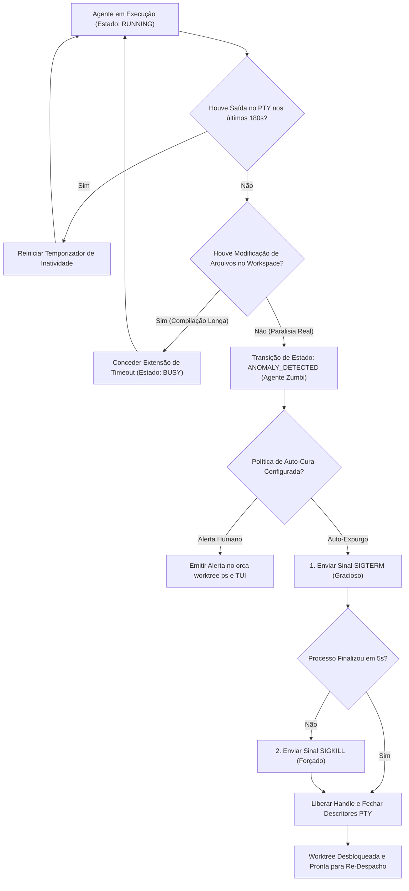

# Capítulo 10 — Detecção Precoce de Bloqueios: Identificação e Eliminação de Agentes Zumbis

## 1. Introdução

A escalabilidade de sistemas de orquestração multi-agente depende diretamente da capacidade da infraestrutura em manter seus recursos operacionais limpos, previsíveis e responsivos [1]. Em ambientes onde múltiplos processos de inteligência artificial são instanciados, executados e finalizados continuamente, a ocorrência de anomalias operacionais é inevitável [8]. Entre essas anomalias, nenhuma é mais prejudicial à estabilidade do host do que o surgimento de **Processos Zumbis** e **Agentes Bloqueados** [5].

Um agente zumbi ocorre quando o processo filho perde a comunicação com o motor do modelo ou entra em um loop infinito de espera por recursos de I/O, mantendo descritores de terminais PTY abertos e consumindo memória RAM sem realizar nenhum progresso útil [10]. Pior ainda: quando o agente trava em um diálogo de confirmação interativo não tratado, ele retém o lock da worktree e apresenta consumo de CPU ociosa de 0% [1], mascarando sua inatividade como se estivesse apenas "pensando" [14].

Para garantir a higienização contínua do ambiente, o ORCA implementa rotinas determinísticas de detecção de anomalias e expurgo forçado de processos órfãos [1]. Através da análise de métricas de atividade de I/O, padrões de saída e timeouts configuráveis, o orquestrador permite identificar e eliminar agentes zumbis de forma instantânea e segura, liberando descritores de arquivos e preservando a integridade das worktrees [20].

Neste capítulo, estudaremos as causas raízes dos processos zumbis em motores de IA, a matemática da detecção precoce de bloqueios, os comandos de encerramento determinístico com `orca terminal kill` e a construção de scripts automatizados de auto-cura para frotas de agentes autônomos [1].

## 2. Explica

No jargão dos sistemas operacionais Unix, um processo zumbi tradicional é aquele que encerrou sua execução, mas cuja entrada na tabela de processos permanece retida porque o processo pai ainda não leu seu código de saída via chamada `waitpid()` [8]. No contexto de orquestração de IA, o termo **Agente Zumbi** foi ampliado para descrever qualquer processo de agente que se encontra em estado de paralisia funcional irreversível [1].

Existem três classes principais de agentes zumbis em esteiras multi-agente [10]:
1. **Zumbi por Diálogo Interativo:** O agente tenta invocar uma ferramenta externa que solicita uma entrada via teclado (ex: `sudo`, `npm login`, prompts de confirmação). Como o agente roda sem operador humano digitando naquele terminal, ele permanece suspenso indefinidamente [18].
2. **Zumbi por Conexão Partida (Dead Socket):** A requisição HTTP para a API do modelo de linguagem sofreu um timeout silencioso no nível TCP sem que o cliente emitisse uma exceção de rede. O agente aguarda uma resposta que nunca chegará [1].
3. **Zumbi por Deadlock de Arquivos:** Dois agentes tentam acessar concorrentemente o mesmo banco de dados SQLite local ou arquivo de lock exclusivo sem controle transacional adequado, travando ambos os processos [14].

O ORCA combate essas falhas através de um **Motor de Detecção de Anomalias Baseado em Heurísticas** [1]. O daemon monitora três variáveis contínuas para cada handle de terminal registrado:
- **Timestamp da Última Emissão de Bytes:** Registra o momento exato em que o descritor mestre do PTY recebeu dados pela última vez [8].
- **Taxa de Variação de Arquivos no Workspace:** Verifica se novos commits, diffs ou arquivos temporários estão sendo criados na worktree correspondente [10].
- **Consumo de CPU:** Diferencia agentes que estão realizando compilações intensivas daqueles que estão com threads adormecidas em espera de I/O bloqueante [5].

Se um terminal ultrapassar o limiar de inatividade configurado (por exemplo, 180 segundos sem emitir logs nem modificar arquivos), o ORCA sinaliza o estado como `ANOMALY_DETECTED` [1]. O operador pode então autorizar a eliminação automática ou disparar o comando de expurgo `orca terminal kill --force`, que envia sequencialmente os sinais `SIGTERM` e `SIGKILL`, fecha os descritores do PTY e desbloqueia a worktree [20].

## 3. Ilustra

A máquina de estados de detecção de anomalias e o fluxo de expurgo automático de agentes zumbis são representados a seguir.



O diagrama evidencia que o ORCA nunca descarta processos de forma precipitada; ele valida tanto a atividade do terminal quanto a evolução do sistema de arquivos antes de decretar o expurgo do agente [1].

## 4. Técnica

A gestão de processos travados e o encerramento seguro de terminais zumbis são realizados através do comando `orca terminal kill` [8]. A seguir demonstramos os comandos CLI e um script em Python para auditoria e expurgo automatizado de processos órfãos [1].

```bash
# 1. Inspecionar terminais que estão inativos há mais de 3 minutos
orca terminal list --filter "inactive > 180s" --json

# 2. Encerrar graciosamente um terminal suspeito de travamento
orca terminal kill --handle term_mimo_ui

# 3. Forçar o encerramento imediato (SIGKILL) de um processo zumbi irresponsivo
orca terminal kill --handle term_mimo_ui --force

# 4. Limpar todos os handles de terminais que já foram encerrados mas continuam listados
orca terminal prune
```

Para automatizar o monitoramento de saúde da frota e aplicar auto-cura determinística em pipelines de longa duração, o script abaixo varre os terminais ativos e elimina processos que excederam os limites de tolerância operacional [10].

```python
#!/usr/bin/env python3
# -*- coding: utf-8 -*-
"""
Script de Health Check e Expurgo Automatizado de Agentes Zumbis no ORCA.
"""
import json
import subprocess
import time
import sys

LIMITE_INATIVIDADE_SEGUNDOS = 180

def listar_terminais():
    cmd = ["orca", "terminal", "list", "--json"]
    res = subprocess.run(cmd, capture_output=True, text=True, check=False)
    if res.returncode == 0:
        try:
            dados = json.loads(res.stdout)
            return dados.get("terminals", [])
        except json.JSONDecodeError:
            return []
    return []

def expurgar_terminal_zumbi(handle):
    print(f"[KILL] Executando expurgo forçado do terminal zumbi '{handle}'...")
    cmd = ["orca", "terminal", "kill", "--handle", handle, "--force"]
    res = subprocess.run(cmd, capture_output=True, text=True, check=False)
    if res.returncode == 0:
        print(f"[OK] Terminal '{handle}' expurgado com sucesso.")
    else:
        print(f"[ERRO] Falha ao eliminar terminal '{handle}'.")

def auditar_e_curar_frota():
    print("=== Auditoria de Agentes Zumbis e Processos Travados ===")
    terminais = listar_terminais()
    print(f"Total de terminais monitorados: {len(terminais)}")

    zumbis_detectados = 0
    agora = time.time()

    for term in terminais:
        handle = term.get("handle")
        status = term.get("status")
        segundos_inativo = term.get("seconds_since_last_output", 0)

        if status == "RUNNING" and segundos_inativo > LIMITE_INATIVIDADE_SEGUNDOS:
            print(f"\n[ANOMALIA] Terminal '{handle}' inativo há {segundos_inativo}s (Limite: {LIMITE_INATIVIDADE_SEGUNDOS}s).")
            expurgar_terminal_zumbi(handle)
            zumbis_detectados += 1

    if zumbis_detectados == 0:
        print("\n[SUCESSO] Nenhum processo zumbi detectado. Frota saudável.")
    else:
        print(f"\n[RESUMO] {zumbis_detectados} processo(s) zumbi(s) eliminado(s).")
        subprocess.run(["orca", "terminal", "prune"], check=False)

if __name__ == "__main__":
    auditar_e_curar_frota()
```

## 5. Aplica

A eliminação automática de processos zumbis restabelece a saúde operacional do sistema [1]. No entanto, políticas agressivas de expurgo devem ser calibradas com cautela para evitar a interrupção prematura de agentes legítimos que estejam processando tarefas computacionalmente densas [5].

O principal gargalo a ser considerado é o **falso positivo de inatividade** [10]. Determinadas tarefas de engenharia — como o treinamento de um modelo local, a compilação de binários nativos em C++ ou a execução de suítes extensas de testes ponta a ponta — podem levar vários minutos sem emitir nenhuma linha de log no terminal [8]. Se o temporizador de inatividade for configurado com um valor muito baixo (por exemplo, 30 segundos), o orquestrador matará agentes saudáveis no meio de suas compilações [20].

A matriz a seguir orienta a calibração de timeouts conforme a natureza da tarefa:

| Natureza da Tarefa do Agente | Limiar de Inatividade Recomendado | Ação de Contorno e Fallback |
| :--- | :--- | :--- |
| Edição de Texto e Código Rápido | 120 a 180 segundos | Se parar de emitir saída, verifique se há diálogo interativo bloqueante [18]. |
| Compilação de Projetos e Builds | 300 a 600 segundos | Configure o compilador para modo verbose (`--verbose`) para gerar logs intermediários [8]. |
| Execução de Testes E2E Pesados | 600 a 900 segundos | Monitore a atividade de processos filhos via métricas de I/O em disco [1]. |

Cuidado ao executar comandos de expurgo em massa (`killall` ou matar processos pelo PID do sistema operacional diretamente): matar um processo de agente fora da mediação do ORCA deixa descritores de PTYs e locks de worktree pendentes no daemon [8]. Utilize sempre `orca terminal kill` para garantir que o daemon limpe o catálogo em memória e libere a worktree para novo uso.

Quando um agente for encerrado por timeout, o mecanismo de fallback consiste em inspecionar os commits parciais já realizados no branch da worktree (`git log -n 3`), avaliar o código gerado até o ponto de interrupção e relançar a tarefa com um prompt mais refinado ou com dependências pré-instaladas [10].

### Exercício
- [ ] Configurar o watchdog de supervisão com limiar de inatividade de 60 segundos
- [ ] Implementar teste de detecção de loops infinitos sem emissão de eventos no terminal
- [ ] Executar rotina de término graceful com carência de 5 segundos antes de `SIGKILL`
- [ ] Validar a restauração do índice do Git e liberação de locks após o encerramento forçado

## 6. Fixa

### Exercício Prático 1: Configuração de Watchdog para Detecção de Agentes Zumbis

1. Escreva um script de supervisão (*watchdog*) que monitora o timestamp da última saída emitida no log de cada agente.
2. Defina um limiar de tolerância de inatividade de 60 segundos para tarefas sem emissão de eventos.
3. Simule um agente em loop infinito que não produz saída no terminal.
4. Verifique que o watchdog identifica a anomalia, marca o agente como zumbi e gera um alerta estruturado.

### Exercício Prático 2: Procedimento Seguro de Eliminação Graceful de Processos

1. Configure a rotina de encerramento enviando primeiramente o sinal de término amigável (`SIGTERM` / `taskkill` suave).
2. Aguarde um intervalo de carência de 5 segundos para que o processo encerre conexões e libere descritores de arquivo.
3. Se o processo persistir ativo, envie o sinal de término forçado (`SIGKILL` / `taskkill /F`).
4. Execute `git status` no diretório da worktree afetada e confirme a restauração do índice para estado limpo.

## 7. Conclusão

A resiliência de um sistema multi-agente mede-se por sua capacidade de se auto-recuperar de falhas e manter o ecossistema livre de processos parasitas [1]. Ao implementar mecanismos contínuos de detecção precoce de bloqueios e expurgo determinístico de agentes zumbis, o ORCA garante que a máquina do desenvolvedor permaneça rápida, estável e pronta para atender a novas demandas de engenharia [20].

Neste capítulo, estudamos as causas estruturais dos travamentos de agentes, as heurísticas que diferenciam inatividade real de compilações densas e os comandos de eliminação graciosa e forçada de terminais [8]. Vimos também como construir rotinas automatizadas de auto-cura em Python para higienizar a frota [10].

No próximo capítulo, abordaremos as ferramentas nativas de **Inspeção Visual de Código e Diffs**, aprendendo a auditar com rapidez as alterações produzidas pelos agentes antes de qualquer mesclagem através de `orca file diff` e `orca file open-changed`.

## 8. Referências

[1] ARVIND, Ananya; NARAYANAN, Shruthi; NARAYANAN, Saishriya. Sura.ai: Multi-Agent Infrastructure Recovery with LLM-Powered Autonomous Remediation. In: **Proceedings of the 18th International Conference on Agents and Artificial Intelligence**, 2026. Disponível em: <https://doi.org/10.5220/0014456800004052>. Acesso em: 31 ago. 2026.

[5] GRAND, Stephen; CLIFF, Dave. Creatures: Entertainment Software Agents with Artificial Life. In: **Autonomous Agents and Multi-Agent Systems**, v. 1, p. 39-57, 1998. Disponível em: <https://doi.org/10.1023/a:1010042522104>. Acesso em: 31 ago. 2026.

[8] ISSARNY, Valérie; SARIDAKIS, Titos. Defining Open Software Architectures for Customized Remote Execution of Web Agents. In: **Autonomous Agents and Multi-Agent Systems**, v. 2, p. 111-134, 1999. Disponível em: <https://doi.org/10.1023/a:1010008305297>. Acesso em: 31 ago. 2026.

[10] LIU, Mengyang et al. Multi-agent Collaboration with State Management. In: **arXiv (Cornell University)**, 2026. Disponível em: <https://arxiv.org/abs/2605.20563>. Acesso em: 31 ago. 2026.

[14] PYNADATH, David V.; TAMBE, Milind. An Automated Teamwork Infrastructure for Heterogeneous Software Agents and Humans. In: **Autonomous Agents and Multi-Agent Systems**, v. 7, p. 35-58, 2003. Disponível em: <https://doi.org/10.1023/a:1024176820874>. Acesso em: 31 ago. 2026.

[18] TAWOSI, Vali et al. ALMAS: an Autonomous LLM-based Multi-Agent Software Engineering Framework. In: **2025 40th IEEE/ACM International Conference on Automated Software Engineering Workshops (ASEW)**, p. 38-44, 2025. Disponível em: <https://doi.org/10.1109/asew67777.2025.00059>. Acesso em: 31 ago. 2026.

[20] ZAMBONELLI, Franco; OMICINI, Andrea. Challenges and Research Directions in Agent-Oriented Software Engineering. In: **Autonomous Agents and Multi-Agent Systems**, v. 9, p. 253-286, 2004. Disponível em: <https://doi.org/10.1023/b:agnt.0000038028.66672.1e>. Acesso em: 31 ago. 2026.
