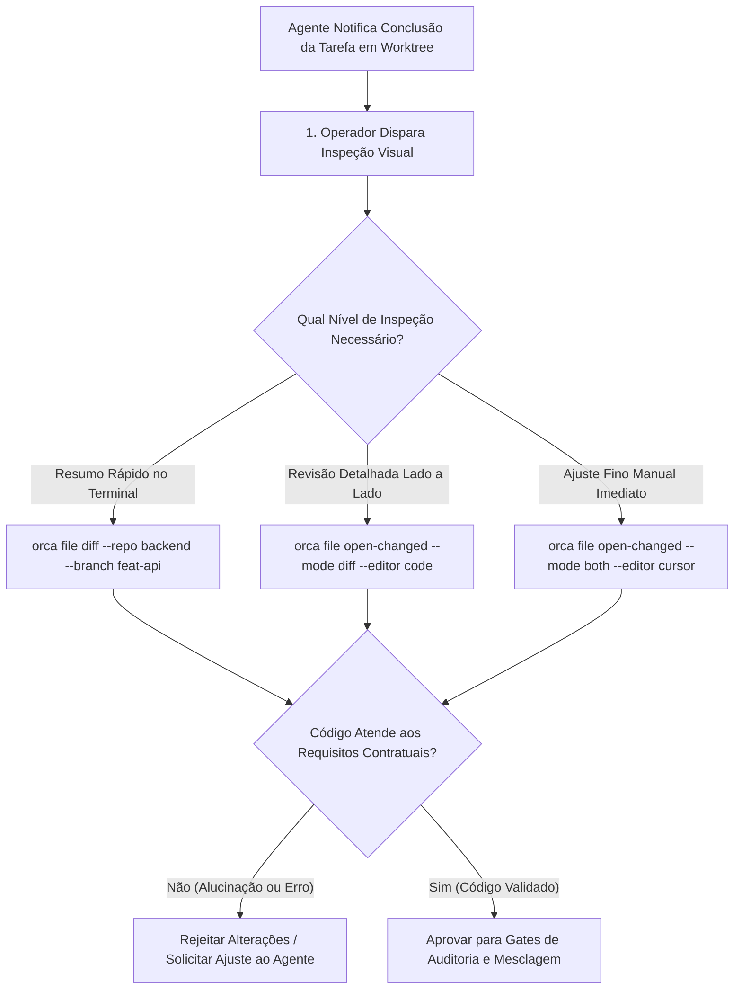

# Capítulo 11 — Inspeção Visual de Código e Diffs: Análise Rápida com orca file diff e open-changed

## 1. Introdução

A velocidade exponencial com que múltiplos agentes de inteligência artificial escrevem, refatoram e formatam código-fonte introduz um novo paradigma para a revisão humana de engenharia [18]. Se um desenvolvedor for obrigado a abrir manualmente cada arquivo modificado no editor de texto, comparar diretórios linha por linha e decifrar blocos extensos de alterações sintáticas descontextualizadas, o ganho de produtividade obtido pela automação será rapidamente neutralizado pelo gargalo de revisão [7].

A plataforma ORCA reconhece que a auditoria visual rápida e ergonômica é o pilar que sustenta a governança de software autônomo [12]. Por meio dos comandos nativos `orca file diff` e `orca file open-changed`, o desenvolvedor dispõe de ferramentas de alta precisão projetadas para inspecionar instantaneamente todas as modificações introduzidas em uma worktree em relação ao branch base, proporcionando uma velocidade de revisão de 4x [7] em comparação com inspeções manuais convencionais [3].

Seja operando no terminal com realce de sintaxe em cores, acionando ferramentas de diff gráfico externas (como VS Code, Cursor ou Meld) ou abrindo simultaneamente os arquivos modificados nos modos `edit`, `diff` ou `both`, o ORCA transforma a auditoria em um processo fluido, visual e seguro [20].

Neste capítulo, estudaremos os comandos de inspeção de arquivos do ORCA, as estratégias de filtragem de diffs ignorando ruídos de formatação, a integração com editores visuais e as diretrizes para aprovar ou rejeitar alterações de agentes com confiança técnica [18].

## 2. Explica

O processo de auditoria de código gerado por inteligência artificial distingue-se da revisão de código escrita por humanos em aspectos cruciais [7]. Enquanto desenvolvedores humanos tendem a cometer erros conceituais ou de sintaxe pontual, agentes de IA podem introduzir modificações colaterais involuntárias — como reordenar métodos sem necessidade, alterar formatos de aspas ou remover comentários e anotações arquiteturais essenciais [12].

Para auditar essas mudanças com eficiência, o desenvolvedor precisa de uma lente de aumento focada estritamente nas deltas de código relevantes [18]. O comando `orca file diff` consulta a worktree especificada e compara seu estado atual (incluindo alterações não commitadas e commits recentes) com o branch de origem (por exemplo, `main` ou a mesa pai correspondente) [3].

A saída do `orca file diff` é enriquecida com análises semânticas [7]:
1. **Resumo Numérico de Alterações:** Exibe a contagem exata de linhas inseridas, modificadas e deletadas por arquivo [12].
2. **Classificação de Tipo de Arquivo:** Separa visualmente arquivos de código-fonte de arquivos de configuração, testes e documentação [18].
3. **Filtro de Ruído:** Possui flags para ignorar variações de espaços em branco (`--ignore-whitespace`) e mudanças exclusivas de formatação de quebra de linha [20].

Quando a inspeção no terminal não é suficiente para revisões mais complexas, entra em ação o comando `orca file open-changed` [3]. Essa instrução identifica automaticamente todos os arquivos alterados na worktree e os abre diretamente no editor de preferência do desenvolvedor configurado no ambiente, suportando três modos operacionais essenciais [7]:
- **Modo `edit`:** Abre os arquivos alterados prontos para edição direta, permitindo ajustes finos manuais [18].
- **Modo `diff`:** Abre o visualizador de diferenças lado a lado (Side-by-Side Diff) do editor, comparando a versão original da branch base com a versão da worktree [12].
- **Modo `both`:** Abre tanto as visualizações de diff quanto os arquivos para edição em abas organizadas [20].

Essa flexibilidade garante que o engenheiro mantenha controle total sobre o que entra e o que não entra na base de código do projeto [3].

## 3. Ilustra

O fluxo de auditoria e inspeção visual de diffs no ORCA demonstra como o desenvolvedor valida as alterações antes de qualquer mesclagem.



O diagrama ilustra a rapidez com que o operador pode alternar entre uma visão sumarizada no terminal e uma inspeção aprofundada na IDE antes de homologar a entrega do agente [7].

## 4. Técnica

A manipulação de diffs e a abertura de arquivos modificados com o ORCA são demonstradas a seguir através de comandos práticos de linha de comando e scripts em Python [18].

```bash
# 1. Visualizar o diff resumido de uma worktree em relação ao branch base 'main'
orca file diff --repo backend --worktree feature/auth-jwt --stat

# 2. Exibir o diff completo colorido ignorando variações de espaços em branco
orca file diff --repo backend --worktree feature/auth-jwt --ignore-space-change

# 3. Listar apenas os nomes dos arquivos modificados pelo agente
orca file diff --repo backend --worktree feature/auth-jwt --name-only

# 4. Abrir todos os arquivos alterados no VS Code em modo de comparação lado a lado
orca file open-changed --repo backend --worktree feature/auth-jwt --mode diff --editor code

# 5. Abrir os arquivos no editor Cursor para edição e refinamento manual
orca file open-changed --repo backend --worktree feature/auth-jwt --mode edit --editor cursor
```

Para automatizar a geração de relatórios de auditoria visual de diffs em formato Markdown para revisão de PRs, o script em Python a seguir extrai as diferenças e calcula métricas de impacto no código [7].

```python
#!/usr/bin/env python3
# -*- coding: utf-8 -*-
"""
Script de auditoria e extração de diffs estruturados via ORCA.
"""
import json
import os
import subprocess
import sys

def extrair_resumo_diff(repo, worktree, base_branch="main"):
    print(f"=== Auditando Diffs: {repo} | Worktree: {worktree} (Base: {base_branch}) ===")
    cmd = [
        "orca", "file", "diff",
        "--repo", repo,
        "--worktree", worktree,
        "--base", base_branch,
        "--stat"
    ]
    res = subprocess.run(cmd, capture_output=True, text=True, check=False)
    if res.returncode != 0:
        print(f"[ERRO] Falha ao extrair diff: {res.stderr.strip()}")
        return None
    return res.stdout.strip()

def gerar_relatorio_revisao(repo, worktree, arquivo_saida="relatorio_diff.md"):
    resumo_diff = extrair_resumo_diff(repo, worktree)
    if not resumo_diff:
        print("[AVISO] Nenhum diff encontrado ou erro na extração.")
        return
    relatorio = "# Relatório de Auditoria Visual de Código\n\n"
    relatorio += f"**Repositório:** `{repo}`\n"
    relatorio += f"**Worktree Auditada:** `{worktree}`\n"
    relatorio += "**Status da Auditoria:** Pronto para Revisão Humana\n\n"
    relatorio += "## Resumo das Modificações (Diff Stat)\n\n"
    relatorio += f"```text\n{resumo_diff}\n```\n\n"
    relatorio += "## Checklist de Aprovação do Mestre de Obras\n"
    relatorio += "- [ ] O código respeita a arquitetura de camadas do projeto.\n"
    relatorio += "- [ ] Não foram incluídos arquivos desnecessários (.env, logs, caches).\n"
    relatorio += "- [ ] Os testes unitários cobrem as novas regras de negócio.\n"
    relatorio += "- [ ] A formatação e os linters foram aprovados sem alertas.\n"
    with open(arquivo_saida, "w", encoding="utf-8") as f:
        f.write(relatorio.strip() + "\n")
    print(f"[SUCESSO] Relatório gerado em: {arquivo_saida}")

if __name__ == "__main__":
    if len(sys.argv) < 3:
        print("Uso: python auditar_diffs.py <alias_repo> <nome_worktree> [arquivo_saida.md]")
        sys.exit(1)
    saida = sys.argv[3] if len(sys.argv) > 3 else "relatorio_diff.md"
    gerar_relatorio_revisao(sys.argv[1], sys.argv[2], saida)
```

## 5. Aplica

A inspeção visual de diffs é o filtro primário de segurança entre a criatividade do agente e a estabilidade da branch principal [12]. No entanto, a análise de diffs em escala precisa respeitar condições de contorno operacionais [7].

O principal gargalo observado na auditoria de agentes de IA é o **diff massivo não focado** [18]. Quando um agente recebe um prompt excessivamente genérico (por exemplo, "refatore todo o backend para TypeScript estrito"), ele pode modificar centenas de arquivos simultaneamente [20]. Auditar um diff de 10.000 linhas gerado por IA é cognitivamente inviável e induz aprovações cegas perigosas. O limite recomendado para cada ciclo de trabalho de agente é de no máximo 5 a 10 arquivos modificados por entrega [3].

A matriz a seguir orienta as boas práticas de inspeção de diffs:

| Tamanho do Diff | Estratégia de Inspeção | Ação de Contorno e Advertência |
| :--- | :--- | :--- |
| Pequeno (1 a 3 arquivos, < 100 linhas) | Terminal (`orca file diff`) | Inspeção rápida; aprovação imediata para execução de testes [7]. |
| Médio (4 a 10 arquivos, < 500 linhas) | IDE Lado a Lado (`orca file open-changed --mode diff`) | Exige verificação visual detalhada de contratos e assinaturas de métodos [12]. |
| Grande (> 10 arquivos ou > 1000 linhas) | Não recomendado; rejeição e fatiamento | Rejeite a entrega; solicite que o agente fatie a tarefa em subtarefas menores [18]. |

Cuidado com alterações em arquivos de lock (`package-lock.json`, `poetry.lock`, `pnpm-lock.yaml`): agentes de IA frequentemente recriam esses arquivos do zero ao instalar pacotes, gerando diffs de milhares de linhas que podem introduzir versões instáveis de bibliotecas de terceiros [20]. Inspecione sempre se apenas a dependência solicitada foi adicionada.

Quando o editor configurado falhar em abrir (por exemplo, em servidores remotos sem interface gráfica X11 ou Wayland), o mecanismo de fallback consiste em utilizar o visualizador nativo do terminal com paginação segura (`orca file diff | less -R`), garantindo que o operador continue capaz de auditar as alterações em qualquer ambiente [8].

### Exercício
- [ ] Executar `orca file diff` para obter o resumo consolidado das alterações da branch
- [ ] Verificar que apenas modificações funcionais foram incluídas, revertendo ruídos de formatação
- [ ] Utilizar o utilitário `open-changed` para abrir todos os arquivos afetados no editor
- [ ] Validar que nenhum arquivo temporário ou binário indesejado foi adicionado ao stage

## 6. Fixa

### Exercício Prático 1: Inspeção de Diffs Rápidos com orca file diff

1. Realize modificações deliberadas em três arquivos de código em uma worktree de desenvolvimento.
2. Execute `orca file diff` para obter um resumo sintético dos blocos alterados com realce de sintaxe.
3. Inspecione se o diff contém apenas modificações funcionais, identificando e revertendo linhas de formatação ou espaços em branco acidentais.
4. Valide a conformidade do diff com as diretrizes de commit atômico antes de prosseguir para a fase de testes.

### Exercício Prático 2: Abertura Rápida de Arquivos Modificados com open-changed

1. Após a conclusão da edição realizada por um agente, execute o utilitário `orca open-changed`.
2. Confirme que todos os arquivos alterados na branch atual são abertos automaticamente nas abas do seu editor de código.
3. Realize a revisão manual de integridade visual nos pontos críticos apontados pelo relatório do agente.
4. Salve as revisões e execute a suíte de lint para certificar que nenhum erro de formatação foi introduzido.

## 7. Conclusão

A inspeção visual ágil de código e diffs fecha o ciclo de feedback entre o desenvolvedor e os agentes autônomos [7]. Ao fornecer ferramentas especializadas para comparar versões, filtrar ruídos sintáticos e abrir arquivos modificados no editor com um único comando, o ORCA garante que a velocidade da IA seja acompanhada pelo rigor humano de engenharia [12].

Neste capítulo, examinamos os comandos `orca file diff` e `orca file open-changed`, as diferenças entre os modos de edição e comparação, e a geração automatizada de relatórios em Python [18]. Vimos também a importância de impor limites de tamanho de diff para manter as revisões cognitivamente gerenciáveis [3].

No próximo capítulo, encerraremos a Parte III com um estudo aprofundado sobre **Concorrência e Sincronização Assíncrona: Modelagem Teórica e Prática de Co-Agentes**, abordando a teoria de controle transacional e a coordenação assíncrona de múltiplos trabalhadores.

## 8. Referências

[3] FENG, Yuyuan et al. Graph Engineering in the Era of LLM Agents: From Individual Intelligence to System Intelligence. In: **arXiv (Cornell University)**, 2026. Disponível em: <https://arxiv.org/abs/2608.21156>. Acesso em: 31 ago. 2026.

[7] ISHIBASHI, Yoichi; YANO, Taro; OYAMADA, Masafumi. Effective Harness Engineering for Algorithm Discovery with Coding Agents. In: **arXiv (Cornell University)**, 2026. Disponível em: <https://arxiv.org/abs/2605.15221>. Acesso em: 31 ago. 2026.

[8] ISSARNY, Valérie; SARIDAKIS, Titos. Defining Open Software Architectures for Customized Remote Execution of Web Agents. In: **Autonomous Agents and Multi-Agent Systems**, v. 2, p. 111-134, 1999. Disponível em: <https://doi.org/10.1023/a:1010008305297>. Acesso em: 31 ago. 2026.

[12] PHILIPPOV, Vassili et al. Glite ARF: Verifier-Driven Research with Parallel LLM Coding Agents. In: **arXiv (Cornell University)**, 2026. Disponível em: <https://doi.org/10.5220/0012239100003598>. Acesso em: 31 ago. 2026.

[18] TAWOSI, Vali et al. ALMAS: an Autonomous LLM-based Multi-Agent Software Engineering Framework. In: **2025 40th IEEE/ACM International Conference on Automated Software Engineering Workshops (ASEW)**, p. 38-44, 2025. Disponível em: <https://doi.org/10.1109/asew67777.2025.00059>. Acesso em: 31 ago. 2026.

[20] ZAMBONELLI, Franco; OMICINI, Andrea. Challenges and Research Directions in Agent-Oriented Software Engineering. In: **Autonomous Agents and Multi-Agent Systems**, v. 9, p. 253-286, 2004. Disponível em: <https://doi.org/10.1023/b:agnt.0000038028.66672.1e>. Acesso em: 31 ago. 2026.
