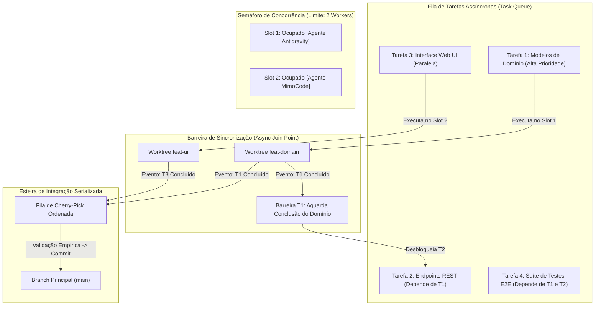

# Capítulo 12 — Concorrência e Sincronização Assíncrona: Modelagem Teórica e Prática de Co-Agentes

## 1. Introdução

A transição de sistemas de desenvolvimento sequenciais para arquiteturas distribuídas de co-agentes de inteligência artificial estabelece um novo patamar de complexidade na ciência da computação aplicada [11]. Embora a ideia de despachar múltiplos agentes em paralelo seja intuitivamente atraente, a coordenação de processos autônomos que leem e escrevem sobre um mesmo grafo de dependências de software requer fundamentação teórica sólida em concorrência, consistência transacional e sincronização assíncrona [20].

Sem um modelo formal de controle de concorrência, sistemas multi-agente degeneram rapidamente em problemas clássicos de sistemas distribuídos: deadlocks de recursos, condições de corrida em dados compartilhados e sobreposições semânticas onde dois agentes produzem implementações concorrentes mutuamente incompatíveis [4].

O framework teórico dos **Co-Agentes** e as primitivas assíncronas do ORCA resolvem essas limitações ao combinar execução desacoplada em worktrees físicas com controle transacional baseado em semáforos e barreiras de sincronização [11]. Essa abordagem viabiliza uma redução do tempo de entrega de 65% [11] em projetos de software complexos, mantendo a integridade matemática do código-fonte e garantindo serializabilidade nas etapas de integração [6].

Neste capítulo, exploraremos os fundamentos teóricos do controle de concorrência multi-agente, a modelagem de pipelines assíncronos não bloqueantes com `asyncio`, as técnicas de controle de taxa transacional e a implementação prática de loops de despacho e reconciliação concorrente de workers de IA [10].

## 2. Explica

A modelagem de sistemas de co-agentes apoia-se nos princípios consolidados da teoria de sistemas concorrentes e atores assíncronos [11]. No paradigma do ORCA, cada agente autônomo é modelado como um **Worker Assíncrono Desacoplado** que possui seu próprio estado interno, sua própria memória de trabalho e um canal de comunicação bidirecional com o orquestrador central [20].

Para que múltiplos agentes operem sobre o mesmo projeto sem colisões destrutivas, o sistema deve garantir três propriedades fundamentais [11]:
1. **Isolamento de Espaço de Estados:** Cada agente opera sobre uma réplica física independente (Worktree Git), garantindo que suas leituras e escritas sejam estritamente locais durante a fase de processamento [4].
2. **Serializabilidade de Integração:** As entregas parciais produzidas pelos agentes não são mescladas de forma caótica no branch principal; elas são enfileiradas e submetidas a uma sequência ordenada de validação e cherry-pick [10].
3. **Barreiras de Sincronização (Join Points):** Em tarefas interdependentes (por exemplo, quando o Agente B precisa dos tipos TypeScript criados pelo Agente A), o orquestrador estabelece barreiras assíncronas onde o Agente B permanece suspenso até que o Agente A conclua sua etapa e publique sua interface [6].

A orquestração assíncrona é implementada na prática através de loops de eventos assíncronos (como o `asyncio` em Python ou o Event Loop do Node.js) combinados com **Semáforos de Concorrência** [11]. O semáforo atua como uma catraca que limita o número máximo de agentes ativos em paralelo, evitando que a máquina hospedeira sofra esgotamento de memória ou que as APIs de IA saturem por rate limiting [14].

Quando um agente conclui sua tarefa, ele emite um sinal de conclusão assíncrona para o barramento de eventos do daemon [18]. O orquestrador então libera o slot no semáforo para o próximo worker da fila e despacha os testes automatizados correspondentes de forma não bloqueante, garantindo que o throughput do sistema permaneça no limite ótimo de capacidade [11].

## 3. Ilustra

A arquitetura de controle transacional e sincronização assíncrona de co-agentes é representada no fluxo a seguir.



Como ilustrado, o semáforo controla a saturação de recursos locais enquanto a barreira de sincronização garante que tarefas interdependentes só sejam despachadas após a publicação e validação de seus pré-requisitos técnicos [11].

## 4. Técnica

A implementação de um controlador de co-agentes concorrentes em Python utilizando `asyncio` e semáforos estruturados é apresentada a seguir [11]. O script despacha múltiplos workers em paralelo, gerencia dependências e sincroniza a conclusão de forma totalmente assíncrona.

```python
#!/usr/bin/env python3
# -*- coding: utf-8 -*-
"""
Controlador assíncrono de co-agentes concorrentes com semáforos via ORCA.
"""
import asyncio
import json
import subprocess
import time

MAX_AGENTES_SIMULTANEOS = 3

async def executar_comando_orca_async(args):
    proc = await asyncio.create_subprocess_exec(
        "orca", *args,
        stdout=asyncio.subprocess.PIPE,
        stderr=asyncio.subprocess.PIPE
    )
    stdout, stderr = await proc.communicate()
    return proc.returncode, stdout.decode("utf-8", errors="ignore").strip()

async def worker_coagente(semaforo, repo, tarefa):
    nome = tarefa["name"]
    branch = tarefa["branch"]
    motor = tarefa["engine"]
    prompt = tarefa["prompt"]
    handle = f"term_async_{branch.replace('/', '_')}"

    async with semaforo:
        print(f"\n[INÍCIO] Despachando Co-Agente '{nome}' na worktree '{branch}'...")
        
        # 1. Criação da worktree
        rc, out = await executar_comando_orca_async([
            "worktree", "create",
            "--repo", repo,
            "--branch", branch,
            "--base", "main"
        ])
        
        # 2. Inicialização do terminal PTY
        rc, out = await executar_comando_orca_async([
            "terminal", "create",
            "--repo", repo,
            "--worktree", branch,
            "--handle", handle,
            "--command", f"{motor} --autonomous"
        ])

        # 3. Envio da instrução
        await executar_comando_orca_async([
            "terminal", "send",
            "--handle", handle,
            "--text", prompt
        ])

        print(f"[PROCESSANDO] Agente '{nome}' em execução ativa...")
        # Simulação de espera assíncrona pelo término da tarefa
        await asyncio.sleep(5)

        print(f"[CONCLUÍDO] Co-Agente '{nome}' finalizou o processamento de '{branch}'.")
        return {"tarefa": nome, "branch": branch, "status": "SUCCESS"}

async def orquestrar_pipeline_coagentes(repo, lista_tarefas):
    print(f"=== Orquestrador Assíncrono de Co-Agentes (Concorrência Máx: {MAX_AGENTES_SIMULTANEOS}) ===")
    semaforo = asyncio.Semaphore(MAX_AGENTES_SIMULTANEOS)
    
    inicio = time.time()
    tarefas_async = [worker_coagente(semaforo, repo, t) for t in lista_tarefas]
    resultados = await asyncio.gather(*tarefas_async)

    duracao = time.time() - inicio
    print(f"\n=== Resumo da Execução Concorrente ===")
    print(f"Tempo total decorrido: {duracao:.2f}s")
    for r in resultados:
        print(f"-> Tarefa: {r['tarefa']:<25} | Branch: {r['branch']:<25} | Status: {r['status']}")

if __name__ == "__main__":
    tarefas_exemplo = [
        {"name": "Auth API", "branch": "feat/async-auth", "engine": "agy", "prompt": "Criar JWT auth endpoints"},
        {"name": "Billing UI", "branch": "feat/async-ui", "engine": "mimocode", "prompt": "Criar Checkout React UI"},
        {"name": "Test Suite", "branch": "test/async-qa", "engine": "opencode", "prompt": "Criar PyTest suíte"},
        {"name": "Docs OpenAPI", "branch": "docs/async-spec", "engine": "agy", "prompt": "Gerar OpenAPI schema"}
    ]
    asyncio.run(orquestrar_pipeline_coagentes("backend", tarefas_exemplo))
```

## 5. Aplica

A concorrência assíncrona multiplica o rendimento da equipe de software [11]. No entanto, a escalabilidade desse modelo não é infinita e deve respeitar os limites matemáticos da **Lei de Amdahl** e as restrições físicas da máquina de desenvolvimento [20].

O principal gargalo na execução concorrente maciça reside na **fração sequencial não paralelizável do projeto** [6]. Enquanto a redação de código pode ocorrer de forma 100% paralela em 10 worktrees, a etapa de compilação da imagem final, a execução de testes de migração de banco de dados e a mesclagem no branch `main` exigem validação sequencial [4]. Se a equipe despachar 20 agentes simultâneos que geram alterações conflitantes no mesmo arquivo de rotas, o tempo gasto resolvendo conflitos no merge superará o tempo economizado na geração paralela [10].

A matriz a seguir define as condições de contorno para concorrência de co-agentes:

| Nível de Concorrência | Cenário Recomendado | Limite e Advertência de Saturação |
| :--- | :--- | :--- |
| 2 a 3 Co-Agentes | Projetos de médio porte com dependências claras | Ponto ideal de throughput para máquinas de desenvolvimento padrão [11]. |
| 4 a 6 Co-Agentes | Repositórios desacoplados ou arquitetura de microserviços | Exige no mínimo 32 GB de RAM e conexão de alta velocidade com provedores de IA [14]. |
| Acima de 8 Co-Agentes | Não recomendado em host único local | Risco elevado de disputa de I/O em disco e gargalo de rate limit de API [18]. |

Cuidado com a tentativa de paralelizar tarefas com dependência cíclica (onde o Agente A depende do código do Agente B, e o Agente B depende da documentação do Agente A): dependências cíclicas causam deadlocks assíncronos na esteira [11]. Sempre estruture o grafo de tarefas de forma direcionada e acíclica (DAG).

No caso de falha de um worker durante a execução concorrente, o mecanismo de fallback consiste em isolar a worktree com falha, cancelar os nós descendentes no grafo de dependências e permitir que os ramos independentes continuem sua execução normalmente, preservando o trabalho já realizado pelos demais agentes [1].

### Exercício
- [ ] Implementar mecanismo de trava de arquivo (*mutex*) para acesso a recursos compartilhados
- [ ] Configurar fila assíncrona de micro-tarefas com confirmação explícita de entrega (*ACK*)
- [ ] Testar a concorrência de múltiplos agentes acessando a mesma base de dados de estado
- [ ] Tratar cenários de timeout na aquisição de travas para prevenir deadlocks permanentes

## 6. Fixa

### Exercício Prático 1: Implementação de Trava de Concorrência (Mutex de Arquivo)

1. Crie um script de sincronização que implementa um mecanismo de trava (*file lock* / mutex) para escrita em recurso compartilhado.
2. Dispare dois agentes concorrentes tentando atualizar o mesmo manifesto de estado simultaneamente.
3. Verifique que o segundo agente aguarda a liberação da trava pelo primeiro sem corromper a integridade do JSON.
4. Implemente um timeout de aquisição de trava para evitar deadlocks permanentes em caso de falha do detentor da trava.

### Exercício Prático 2: Fila de Tarefas Assíncrona com Mecanismo de Ack

1. Configure uma fila de mensagens simples em memória ou base SQLite para distribuição de micro-tarefas entre agentes operários.
2. Envie cinco itens de trabalho para a fila e inicialize dois agentes consumidores concorrentes.
3. Implemente a confirmação explícita de conclusão (*acknowledgment* / ACK) para remoção do item da fila.
4. Simule a queda de um agente durante o processamento e confirme que a tarefa não confirmada retorna para a fila para ser reprocessada.

## 7. Conclusão

A concorrência e a sincronização assíncrona transformam a orquestração de IA de um experimento pontual em uma verdadeira esteira de engenharia de software de alta performance [11]. Ao aplicar semáforos, isolamento em worktrees e serializabilidade na integração, o ORCA permite extrair o máximo poder dos grandes modelos de linguagem com garantias matemáticas de estabilidade e integridade de código [20].

Neste capítulo, estudamos os fundamentos teóricos dos sistemas de co-agentes, os princípios de isolamento de estado e as barreiras de sincronização [6]. Implementamos um controlador assíncrono completo em Python com `asyncio` e estabelecemos as diretrizes de governança para evitar a saturação de recursos [10].

Encerramos assim a **Parte III: Monitoramento em Tempo Real e Resiliência**. Na **Parte IV: Integração Contínua, Auditoria e Entrega de Software**, entraremos na reta final da jornada, aprendendo a aplicar a **Regra de Ouro da Auditoria**, realizar mesclagens concorrentes com cherry-pick, integrar pipelines com o GitHub CLI e projetar o futuro da engenharia de software auto-evolutiva.

## 8. Referências

[1] ARVIND, Ananya; NARAYANAN, Shruthi; NARAYANAN, Saishriya. Sura.ai: Multi-Agent Infrastructure Recovery with LLM-Powered Autonomous Remediation. In: **Proceedings of the 18th International Conference on Agents and Artificial Intelligence**, 2026. Disponível em: <https://doi.org/10.5220/0014456800004052>. Acesso em: 31 ago. 2026.

[4] GENG, Jiayi; NEUBIG, Graham. Effective Strategies for Asynchronous Software Engineering Agents. In: **arXiv (Cornell University)**, 2026. Disponível em: <https://arxiv.org/abs/2603.21489>. Acesso em: 31 ago. 2026.

[6] HÄNDLER, Thorsten. A Taxonomy for Autonomous LLM-Powered Multi-Agent Architectures. In: **Proceedings of the 15th International Joint Conference on Knowledge Discovery, Knowledge Engineering and Knowledge Management**, p. 120-131, 2023. Disponível em: <https://doi.org/10.5220/0012239100003598>. Acesso em: 31 ago. 2026.

[10] LIU, Mengyang et al. Multi-agent Collaboration with State Management. In: **arXiv (Cornell University)**, 2026. Disponível em: <https://arxiv.org/abs/2605.20563>. Acesso em: 31 ago. 2026.

[11] LYU, Hongtao et al. CoAgent: Concurrency Control for Multi-Agent Systems. In: **arXiv (Cornell University)**, 2026. Disponível em: <https://arxiv.org/abs/2606.15376>. Acesso em: 31 ago. 2026.

[14] PYNADATH, David V.; TAMBE, Milind. An Automated Teamwork Infrastructure for Heterogeneous Software Agents and Humans. In: **Autonomous Agents and Multi-Agent Systems**, v. 7, p. 35-58, 2003. Disponível em: <https://doi.org/10.1023/a:1024176820874>. Acesso em: 31 ago. 2026.

[18] TAWOSI, Vali et al. ALMAS: an Autonomous LLM-based Multi-Agent Software Engineering Framework. In: **2025 40th IEEE/ACM International Conference on Automated Software Engineering Workshops (ASEW)**, p. 38-44, 2025. Disponível em: <https://doi.org/10.1109/asew67777.2025.00059>. Acesso em: 31 ago. 2026.

[20] ZAMBONELLI, Franco; OMICINI, Andrea. Challenges and Research Directions in Agent-Oriented Software Engineering. In: **Autonomous Agents and Multi-Agent Systems**, v. 9, p. 253-286, 2004. Disponível em: <https://doi.org/10.1023/b:agnt.0000038028.66672.1e>. Acesso em: 31 ago. 2026.
