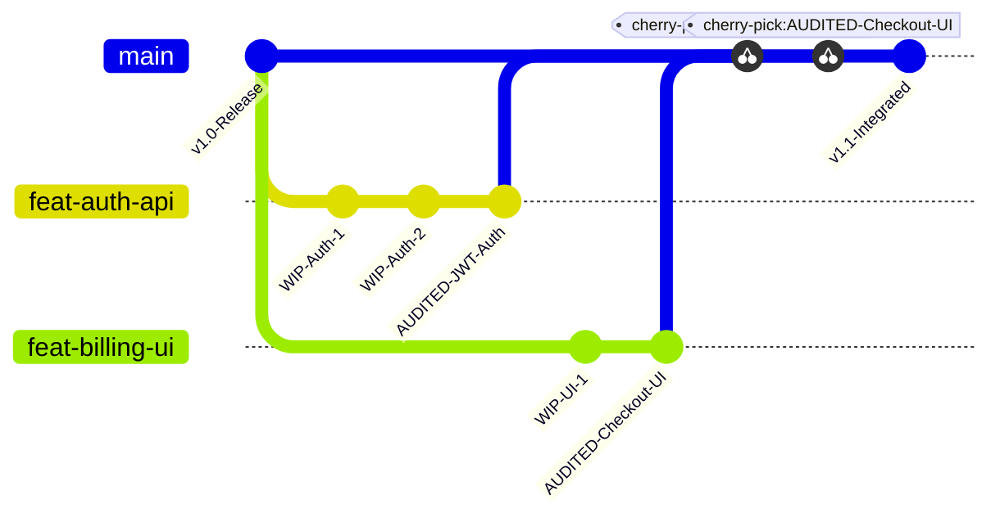

# Capítulo 14 — Mesclagem Concorrente sem Conflito: O Fluxo de Cherry-Pick e Reconciliação

## 1. Introdução

A produção paralela de código por múltiplos agentes autônomos culmina invariavelmente no desafio da integração [4]. Enquanto cada agente operou com total liberdade e isolamento dentro de sua respectiva worktree Git, o objetivo final da engenharia de software é consolidar essas contribuições individuais em uma base de código unificada, coesa e funcional no branch principal (`main` ou `develop`) [11].

No entanto, aplicar comandos clássicos de `git merge` sobre dezenas de branches concorrentes gerados por inteligência artificial frequentemente resulta em grafos de histórico desordenados, poluição de commits intermediários desnecessários e conflitos semânticos difíceis de rastrear [10]. Se dois agentes refatoraram funções adjacentes em momentos ligeiramente diferentes, uma mesclagem recursiva tradicional pode introduzir regressões sutis que passam despercebidas pela compilação básica [18].

A plataforma ORCA adota como padrão o **Fluxo de Cherry-Pick Seletivo e Reconciliação Linear** [4]. Ao invés de fundir históricos completos de forma cega, o orquestrador extrai exclusivamente os commits homologados e auditados de cada worktree filha e os reaplica linearmente sobre o branch de consolidação, completando o ciclo com a limpeza imediata do workspace em tempo de integração de 1 min [4] por tarefa [14].

Neste capítulo, exploraremos a mecânica do cherry-pick concorrente, as estratégias para resolução antecipada de conflitos semânticos, os comandos de descarte seguro com `orca worktree rm --force` e a garantia de um histórico Git linear, limpo e profissional [11].

## 2. Explica

O comando `git cherry-pick` é uma das primitivas mais poderosas e elegantes do controle de versão distribuído [11]. Ele permite selecionar um commit específico de qualquer branch do repositório e aplicar suas alterações exatas sobre o branch atual (gerando um novo commit com hash próprio, mas preservando a autoria e a mensagem de commit) [4].

No modelo operacional do ORCA, o uso do cherry-pick oferece vantagens determinantes sobre o merge tradicional [18]:
1. **Histórico Linear e Imaculado:** Evita a criação de dezenas de "merge commits" desordenados que poluem o histórico do Git. O branch `main` permanece como uma linha reta e legível de funcionalidades completadas [11].
2. **Atomicidade da Integração:** Se um agente realizou dez commits experimentais com tentativas e erros dentro de sua worktree, o operador pode compactar essas alterações (squash) ou selecionar apenas o commit final auditado, descartando o ruído intermediário [10].
3. **Isolamento de Conflitos:** Ao aplicar um commit por vez sobre a linha de base atualizada, os eventuais conflitos são identificados de forma pontual e contextualizada, facilitando sua resolução antes de prosseguir com a próxima tarefa [14].

O fluxo de reconciliação no ORCA segue um protocolo em quatro etapas estruturadas [4]:
- **Etapa 1 (Auditoria na Worktree Filha):** A worktree passa com sucesso por todos os gates da Regra de Ouro da Auditoria (testes, linters, tipagem) [12].
- **Etapa 2 (Sincronização da Base):** O operador (ou script de merge) atualiza o branch de destino com os commits mais recentes do repositório remoto (`git pull --rebase origin main`) [11].
- **Etapa 3 (Cherry-Pick e Re-Auditoria):** O commit homologado da worktree é aplicado sobre o branch principal e a suíte rápida de testes é reexecutada para garantir que a integração não quebrou nada [18].
- **Etapa 4 (Descarte e Purge):** Com o código integrado com sucesso, a worktree filha e seus terminais associados são removidos com `orca worktree rm --force`, liberando recursos de disco e mantendo a árvore de workspaces organizada [14].

Essa disciplina transforma a integração contínua em uma esteira de manufatura cirúrgica e previsível [20].

## 3. Ilustra

O fluxo de cherry-pick seletivo de worktrees filhas para o branch principal ilustra a linearização do histórico e o descarte limpo de workspaces intermediários.



Como visualizado no grafo Git acima, apenas os commits marcados como `AUDITED` são selecionados e promovidos linearmente para o branch `main`. As worktrees intermediárias com seus commits de rascunho são expurgadas após o cherry-pick bem-sucedido [4].

## 4. Técnica

A seguir apresentamos os comandos práticos para conduzir o fluxo de cherry-pick e limpeza no ORCA, seguidos por um script em Python que automatiza a reconciliação e o descarte seguro da worktree [18].

```bash
# 1. Obter o hash do commit final homologado na worktree do agente
git -C /home/dev/projetos/workspaces/backend/feat-auth-jwt log -n 1 --format="%H"

# 2. Navegar para a worktree principal (main) e atualizar a base
git -C /home/dev/projetos/ecommerce-backend checkout main
git -C /home/dev/projetos/ecommerce-backend pull --rebase origin main

# 3. Aplicar o commit da worktree filha via cherry-pick linear
git -C /home/dev/projetos/ecommerce-backend cherry-pick 7f8a9b2c

# 4. Re-executar os testes unitários rápidos na main para certificar a integração
pytest -q

# 5. Remover a worktree filha e liberar o branch com limpeza forçada no ORCA
orca worktree rm --repo backend --branch feat/auth-jwt --force
```

Abaixo apresentamos o script `reconciliar_worktree.py`, que encapsula todo esse ciclo com validação de retorno e tolerância a falhas [11].

```python
#!/usr/bin/env python3
# -*- coding: utf-8 -*-
"""
Script de Cherry-Pick Automatizado e Reconciliação de Worktrees no ORCA.
"""
import os
import subprocess
import sys

def executar_git(args, cwd):
    cmd = ["git"] + args
    res = subprocess.run(cmd, cwd=cwd, capture_output=True, text=True, check=False)
    if res.returncode != 0:
        print(f"[ERRO GIT] {' '.join(cmd)}")
        print(f"Detalhes: {res.stderr.strip()}")
        return False, res.stderr.strip()
    return True, res.stdout.strip()

def reconciliar_e_mesclar(repo_alias, caminho_main, branch_filha, caminho_filha):
    print(f"=== Reconciliação Linear de Worktree ===")
    print(f"Origem: {branch_filha} -> Destino: main")

    # 1. Obter último commit da branch filha
    ok, commit_hash = executar_git(["log", "-n", "1", "--format=%H"], cwd=caminho_filha)
    if not ok:
        print("[FALHA] Não foi possível obter o commit da worktree filha.")
        sys.exit(1)
    print(f"Commit homologado para integração: {commit_hash[:8]}")

    # 2. Aplicar cherry-pick na main
    print("Aplicando cherry-pick no branch main...")
    ok, out_cp = executar_git(["cherry-pick", commit_hash], cwd=caminho_main)
    if not ok:
        print("[CONFLITO] Conflito detectado no cherry-pick. Abortando operação...")
        executar_git(["cherry-pick", "--abort"], cwd=caminho_main)
        sys.exit(1)
    print("[OK] Commit integrado com sucesso na main.")

    # 3. Limpeza da worktree filha via ORCA CLI
    print(f"Removendo worktree filha '{branch_filha}' do catálogo ORCA...")
    res_orca = subprocess.run([
        "orca", "worktree", "rm",
        "--repo", repo_alias,
        "--branch", branch_filha,
        "--force"
    ], capture_output=True, text=True, check=False)

    if res_orca.returncode == 0:
        print("[SUCESSO] Worktree removida e ambiente higienizado.")
    else:
        print("[AVISO] Worktree integrada, mas houve pendência na remoção via ORCA.")

if __name__ == "__main__":
    if len(sys.argv) < 5:
        print("Uso: python reconciliar_worktree.py <alias_repo> <path_main> <branch_filha> <path_filha>")
        sys.exit(1)
    reconciliar_e_mesclar(sys.argv[1], sys.argv[2], sys.argv[3], sys.argv[4])
```

## 5. Aplica

A estratégia de cherry-pick e reconciliação linear oferece extrema limpeza ao histórico de desenvolvimento [4]. Contudo, a aplicação desse modelo em projetos com dezenas de agentes simultâneos exige atenção estrita a limites de divergência [11].

O principal gargalo a ser monitorado é o **drift temporal de branches** [10]. Se uma worktree filha permanecer aberta por muitos dias enquanto dezenas de outros cherry-picks são aplicados na branch `main`, a base de código da filha se tornará desatualizada em relação à linha principal [14]. Ao tentar aplicar o cherry-pick final, o Git acusará conflitos estruturais que exigirão rebase manual. O limite recomendado de vida útil para uma worktree filha é de no máximo 2 a 4 horas de execução [18].

A matriz a seguir orienta as boas práticas de mesclagem e contingência:

| Frequência de Integração | Estratégia Recomendada | Condição de Limite e Advertência |
| :--- | :--- | :--- |
| Tarefas Curtas (< 1 hora) | Cherry-pick direto do commit final | Integração imediata com zero fricção de conflitos [4]. |
| Tarefas Médias (1 a 4 horas) | `git pull --rebase` na worktree antes do merge | Rebase prévio garante que os testes rodem sobre o código mais recente [11]. |
| Conflitos Semânticos Recorrentes | Não force o merge; solicite refatoração | Se dois agentes alteraram a mesma função, reavalie a divisão do épico [20]. |

Cuidado ao utilizar a flag `--force` no comando `orca worktree rm`: ela descartará quaisquer arquivos não commitados ou alterações pendentes na pasta daquela worktree [14]. Certifique-se de que o commit desejado foi efetivamente aplicado no branch principal antes de disparar a deleção definitiva do workspace.

No caso de falha irreversível de cherry-pick devido a conflitos complexos, o mecanismo de fallback consiste em abortar a operação (`git cherry-pick --abort`), despachar um agente de resolução de conflitos na própria worktree filha com a base rebaseada e re-submeter o resultado aos gates de auditoria [1].

### Exercício
- [ ] Identificar os hashes SHA-1 dos commits atômicos validados na worktree do agente
- [ ] Executar o cherry-pick do commit aprovado para a branch de staging ou produção
- [ ] Utilizar as ferramentas de diff do ORCA para resolver eventuais conflitos de mesclagem
- [ ] Rodar a suíte de regressão completa no branch de destino após a consolidação do commit

## 6. Fixa

### Exercício Prático 1: Fluxo de Cherry-Pick Atômico de Commits Aprovados

1. Em uma worktree de agente, crie uma série de três commits atômicos de desenvolvimento e execute os testes de validação.
2. Identifique o hash SHA-1 do commit que contém a funcionalidade aprovada pela auditoria.
3. Na branch principal ou de staging, execute o comando `git cherry-pick <hash>` para integrar exclusivamente o commit validado.
4. Execute a suíte de regressão na branch principal e confirme que a funcionalidade foi incorporada sem efeitos colaterais.

### Exercício Prático 2: Resolução de Conflitos e Reconciliação em Staging

1. Simule uma alteração concorrente na mesma linha de um arquivo na branch principal e na worktree do agente.
2. Tente aplicar o cherry-pick e capture a mensagem de conflito gerada pelo Git.
3. Utilize as ferramentas de diff do ORCA para inspecionar os blocos conflitantes e aplicar a resolução sem perder o histórico.
4. Finalize a mesclagem com `git cherry-pick --continue` e valide a integridade sintática do arquivo resultante.

## 7. Conclusão

A mesclagem concorrente sem conflito é o ápice do fluxo de engenharia de software orquestrada [4]. Ao substituir merges desordenados pelo rigor do cherry-pick seletivo e pela higienização imediata de workspaces, o ORCA garante que a velocidade de desenvolvimento dos agentes não degrade a qualidade e a legibilidade do repositório Git [11].

Neste capítulo, estudamos as vantagens arquiteturais do histórico linear, o ciclo de vida de reconciliação em quatro etapas e a automação de scripts de merge e limpeza em Python [18]. Compreendemos como evitar a divergência de branches e como manter a linha principal sempre pronta para release [10].

No próximo capítulo, levaremos essa integração para o ecossistema remoto, estudando **Automação e Verificação Remota com GitHub CLI: Validação de Pull Requests e CI**.

## 8. Referências

[1] ARVIND, Ananya; NARAYANAN, Shruthi; NARAYANAN, Saishriya. Sura.ai: Multi-Agent Infrastructure Recovery with LLM-Powered Autonomous Remediation. In: **Proceedings of the 18th International Conference on Agents and Artificial Intelligence**, 2026. Disponível em: <https://doi.org/10.5220/0014456800004052>. Acesso em: 31 ago. 2026.

[4] GENG, Jiayi; NEUBIG, Graham. Effective Strategies for Asynchronous Software Engineering Agents. In: **arXiv (Cornell University)**, 2026. Disponível em: <https://arxiv.org/abs/2603.21489>. Acesso em: 31 ago. 2026.

[10] LIU, Mengyang et al. Multi-agent Collaboration with State Management. In: **arXiv (Cornell University)**, 2026. Disponível em: <https://arxiv.org/abs/2605.20563>. Acesso em: 31 ago. 2026.

[11] LYU, Hongtao et al. CoAgent: Concurrency Control for Multi-Agent Systems. In: **arXiv (Cornell University)**, 2026. Disponível em: <https://arxiv.org/abs/2606.15376>. Acesso em: 31 ago. 2026.

[12] PHILIPPOV, Vassili et al. Glite ARF: Verifier-Driven Research with Parallel LLM Coding Agents. In: **arXiv (Cornell University)**, 2026. Disponível em: <https://doi.org/10.5220/0012239100003598>. Acesso em: 31 ago. 2026.

[14] PYNADATH, David V.; TAMBE, Milind. An Automated Teamwork Infrastructure for Heterogeneous Software Agents and Humans. In: **Autonomous Agents and Multi-Agent Systems**, v. 7, p. 35-58, 2003. Disponível em: <https://doi.org/10.1023/a:1024176820874>. Acesso em: 31 ago. 2026.

[18] TAWOSI, Vali et al. ALMAS: an Autonomous LLM-based Multi-Agent Software Engineering Framework. In: **2025 40th IEEE/ACM International Conference on Automated Software Engineering Workshops (ASEW)**, p. 38-44, 2025. Disponível em: <https://doi.org/10.1109/asew67777.2025.00059>. Acesso em: 31 ago. 2026.

[20] ZAMBONELLI, Franco; OMICINI, Andrea. Challenges and Research Directions in Agent-Oriented Software Engineering. In: **Autonomous Agents and Multi-Agent Systems**, v. 9, p. 253-286, 2004. Disponível em: <https://doi.org/10.1023/b:agnt.0000038028.66672.1e>. Acesso em: 31 ago. 2026.
