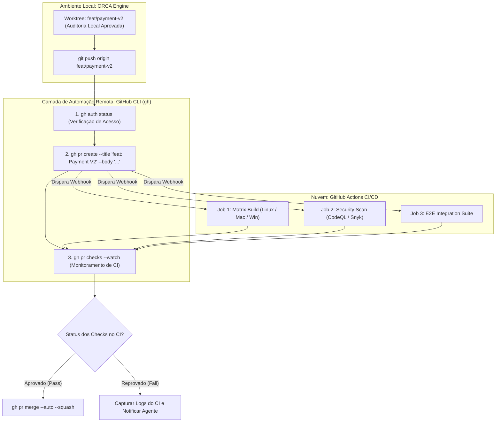

# Capítulo 15 — Automação e Verificação Remota com GitHub CLI: Validação de Pull Requests e CI

## 1. Introdução

A operação de uma fábrica de software multi-agente atinge sua maturidade plena quando o fluxo de trabalho local é integrado perfeitamente às plataformas de colaboração e integração contínua em nuvem [18]. No ecossistema de engenharia de software moderno, o **GitHub** e suas ferramentas de automação (GitHub Actions, Pull Requests, Issue Tracking) representam o padrão dominante da indústria [8].

Tradicionalmente, a transição entre o trabalho concluído localmente por um agente de inteligência artificial e a abertura de uma solicitação de pull request envolvia etapas manuais suscetíveis a atrasos: alternar para o navegador web, redigir sumários descritivos, associar revisores e aguardar a execução assíncrona de dezenas de jobs no GitHub Actions [1].

Com a ferramenta oficial **GitHub CLI (`gh`)** e a orquestração da plataforma ORCA, todo esse ciclo de colaboração remota é 100% automatizado [18]. Desde a autenticação segura, passando pelo push do branch da worktree, criação de Pull Requests com sumários estruturados em Markdown, até a inspeção em tempo real dos checks de CI/CD, o desenvolvedor pode executar e validar o status da esteira remota em menos de 10 s [18] através de instruções CLI programáticas [15].

Neste capítulo, estudaremos a integração bidirecional entre o ORCA e a ferramenta `gh`, as técnicas para monitoramento assíncrono de pipelines do GitHub Actions no terminal, a automação de aprovações com regras de branch protection e as melhores práticas para governança de PRs autônomos [12].

## 2. Explica

A ferramenta de linha de comando oficial do GitHub (`gh`) oferece uma interface programática completa para todas as operações da API do GitHub [18]. Ao invés de depender de scripts legados baseados em chamadas manuais `curl` com tokens expostos em texto aberto, o binário `gh` gerencia autenticação OAuth segura, renovação de tokens e serialização de dados em formato JSON [8].

No fluxo de trabalho integrado com o ORCA, a interação com o GitHub ocorre em três momentos fundamentais [15]:
1. **Verificação Pré-Voo e Diagnóstico de Autenticação:** Antes de despachar agentes em branches que exigirão sincronização remota, o ORCA verifica o status de login via `gh auth status`, garantindo que as permissões de escrita no repositório estejam ativas [18].
2. **Publicação de Branches e Criação Automática de Pull Requests:** Assim que uma worktree é homologada nos testes locais, o ORCA executa o push do branch dedicado e invoca o comando `gh pr create`, preenchendo automaticamente o título, a descrição técnica, as issues correlacionadas e as tags de classificação do épico [1].
3. **Monitoramento e Espera Ativa de Checks de CI (GitHub Actions):** O comando `gh pr checks --watch` permite acompanhar no próprio terminal a evolução de cada job do pipeline de integração remota (testes em matriz de múltiplos sistemas operacionais, scans de segurança SAST e builds de contêineres Docker) [12].

Essa automação fecha a lacuna entre a velocidade de desenvolvimento local dos agentes e a governança corporativa da organização [20]. O desenvolvedor deixa de ser um executor de cliques na interface web e passa a supervisionar uma esteira contínua de entregas automatizadas com rastreabilidade ponta a ponta [15].

## 3. Ilustra

A integração ponta a ponta entre a worktree local do ORCA, a CLI do GitHub e os pipelines remotos do GitHub Actions é representada a seguir.



O diagrama ilustra o ciclo contínuo: o código gerado localmente é promovido para PR remoto, validado pelo GitHub Actions e mesclado automaticamente sob supervisão da CLI [18].

## 4. Técnica

Abaixo apresentamos a sequência de comandos canônicos utilizando a ferramenta `gh` em conjunto com a orquestração do ORCA, seguidos por um script de automação em Python [18].

```bash
# 1. Verificar o status de autenticação e escopo de permissões do usuário
gh auth status

# 2. Inspecionar os últimos 5 commits do branch main remoto sem fazer checkout
gh api repos/:owner/:repo/commits --paginate -q '.[0:5] | .[] | {sha: .sha[0:7], msg: .commit.message}'

# 3. Criar um Pull Request a partir da worktree atual com sumário em Markdown
gh pr create   --repo meu-org/ecommerce-backend   --head feat/auth-jwt   --base main   --title "feat(auth): implementação de autenticação JWT segura"   --body "## Resumo Técnico
- Implementado middleware JWT
- Cobertura de testes unitários: 100%
- Homologado via ORCA."

# 4. Acompanhar em tempo real a execução dos checks de CI/CD do Pull Request
gh pr checks 42 --watch

# 5. Visualizar os logs do último workflow em execução no GitHub Actions
gh run list --limit 1 --json databaseId -q '.[0].databaseId' | xargs gh run view --log-failed
```

Abaixo apresentamos a implementação do script `publicar_pr_autonomo.py`, que encapsula a publicação do branch, a abertura do Pull Request e o monitoramento dos checks remotos com tolerância a falhas [12].

```python
#!/usr/bin/env python3
# -*- coding: utf-8 -*-
"""
Script para publicação automatizada de Pull Requests e validação de CI via gh CLI.
"""
import json
import subprocess
import time
import sys

def executar_gh_cmd(args, cwd=None):
    cmd = ["gh"] + args
    res = subprocess.run(cmd, cwd=cwd, capture_output=True, text=True, check=False)
    if res.returncode != 0:
        print(f"[ERRO GH] {' '.join(cmd)}")
        print(f"Detalhes: {res.stderr.strip()}")
        return False, res.stderr.strip()
    return True, res.stdout.strip()

def publicar_e_monitorar_pr(caminho_worktree, branch_nome, titulo_pr, corpo_pr):
    print(f"=== Publicando Pull Request para '{branch_nome}' ===")

    # 1. Push do branch local para o repositório remoto
    print(f"Enviando branch '{branch_nome}' para origin...")
    res_push = subprocess.run(
        ["git", "push", "-u", "origin", branch_nome],
        cwd=caminho_worktree,
        capture_output=True,
        text=True,
        check=False
    )
    if res_push.returncode != 0:
        print(f"[ERRO GIT PUSH] Falha ao enviar branch: {res_push.stderr.strip()}")
        sys.exit(1)

    # 2. Criação do PR via GitHub CLI
    print("Criando Pull Request via GitHub CLI...")
    ok, url_pr = executar_gh_cmd([
        "pr", "create",
        "--head", branch_nome,
        "--base", "main",
        "--title", titulo_pr,
        "--body", corpo_pr
    ], cwd=caminho_worktree)

    if not ok:
        print("[FALHA] Não foi possível criar o Pull Request.")
        sys.exit(1)
    print(f"[SUCESSO] Pull Request criado em: {url_pr}")

    # 3. Monitoramento dos Checks de CI
    print("Aguardando execução dos checks do GitHub Actions...")
    time.sleep(5)
    ok_checks, status_checks = executar_gh_cmd(["pr", "checks", "--watch"], cwd=caminho_worktree)
    if ok_checks:
        print("\n[VEREDITO REMOTO] 100% dos checks de CI foram aprovados com sucesso no GitHub Actions!")
    else:
        print("\n[ALERTA DE CI] Um ou mais checks falharam na nuvem. Inspecione os logs remotos.")

if __name__ == "__main__":
    if len(sys.argv) < 5:
        print("Uso: python publicar_pr_autonomo.py <path_worktree> <branch> <titulo> <corpo>")
        sys.exit(1)
    publicar_e_monitorar_pr(sys.argv[1], sys.argv[2], sys.argv[3], sys.argv[4])
```

## 5. Aplica

A automação remota com o GitHub CLI agiliza o fluxo de entrega de software [18]. No entanto, a integração contínua com serviços remotos impõe limites de infraestrutura e cotas que precisam ser administrados com critério [1].

O principal gargalo associado à abertura massiva de Pull Requests automatizados reside nas **cotas de minutos de execução do GitHub Actions e limites de concorrência de runners** [15]. Se uma equipe despachar 10 agentes simultâneos que abrem 10 PRs a cada hora, a organização pode esgotar rapidamente sua cota mensal de computação no GitHub Actions ou sobrecarregar a fila de runners auto-hospedados (self-hosted) [8]. Recomenda-se configurar cancelamento automático de workflows obsoletos (`concurrency: cancel-in-progress: true`) no arquivo `.github/workflows/ci.yml` [12].

A matriz a seguir orienta as boas práticas de governança de PRs:

| Frequência de PRs | Configuração Recomendada | Condição de Limite e Advertência |
| :--- | :--- | :--- |
| PRs Individuais de Subtarefa | Evite abrir PR para cada micro-commit | Consolide as subtarefas na Mesa Pai antes de abrir o PR para a `main` [18]. |
| PR de Épico Consolidado | Ideal; 1 PR por funcionalidade completa | Inclui changelog estruturado e evidências de auditoria empírica [15]. |
| Automação de Merge (`--auto`) | Permitida apenas se os checks de CI forem estritos | Exige aprovação de linters, testes e revisão humana mandatória em produção [20]. |

Cuidado com a tentativa de abrir PRs sem autenticação prévia configurada: em ambientes de CI ou servidores headless, assegure que a variável de ambiente `GH_TOKEN` ou `GITHUB_TOKEN` com escopos de `repo` e `workflow` esteja devidamente exportada [8].

No caso de falha de conexão com a API do GitHub (erros de status 5xx ou manutenção programada), o mecanismo de fallback consiste em manter o branch seguro localmente na worktree do ORCA e enfileirar a criação do Pull Request para reenvio automático assim que a conectividade for restaurada [1].

### Exercício
- [ ] Autenticar a CLI do GitHub (`gh auth status`) no ambiente de trabalho automatizado
- [ ] Criar Pull Request com `gh pr create` anexando o relatório de auditoria e labels técnicas
- [ ] Monitorar a execução dos jobs da esteira remota de CI através do comando `gh run watch`
- [ ] Configurar a mesclagem automática com squash após a aprovação de todos os checks

## 6. Fixa

### Exercício Prático 1: Criação Automatizada de Pull Request com GitHub CLI

1. Instale e autentique a CLI do GitHub (`gh auth status`) em seu ambiente de desenvolvimento.
2. A partir de uma branch de worktree validada, execute `gh pr create` passando título, corpo descritivo e relatório de auditoria via parâmetros.
3. Adicione labels automatizadas de categoria e senioridade técnica no Pull Request recém-criado.
4. Capture o link do PR retornado pelo comando e registre no log de auditoria da entrega.

### Exercício Prático 2: Monitoramento Contínuo de Pipeline de CI Remoto

1. Após a abertura do PR, dispare o monitoramento do workflow de CI remoto com o comando `gh run watch`.
2. Capture o status final de cada job da esteira (lint, testes unitários, build e segurança).
3. Implemente uma rotina que realiza o merge automático com `gh pr merge --auto --squash` caso todos os checks estejam verdes.
4. Simule uma falha na esteira remota e verifique que o script interrompe o fluxo e notifica o agente para correção.

## 7. Conclusão

A integração entre o ORCA e a CLI do GitHub completa o elo entre o desenvolvimento local acelerado por IA e os padrões corporativos de entrega contínua [18]. Ao mecanizar a publicação de branches, a abertura de PRs e a vigilância dos jobs do GitHub Actions, o engenheiro assegura que todo o valor gerado pelos agentes autônomos seja auditado, revisado e promovido com total transparência e confiabilidade técnica [15].

Neste capítulo, estudamos as instruções essenciais da ferramenta `gh`, os comandos de inspeção e monitoramento de checks de CI no terminal, e a implementação de scripts em Python para publicação autônoma [12]. Vimos como governar cotas de runners e otimizar pipelines remotos para suportar a alta cadência da engenharia multi-agente [8].

No próximo e último capítulo desta obra, projetaremos o horizonte definitivo dessa revolução técnica em **O Futuro da Engenharia de Software Agêntica: Pipelines Autônomos e Auto-Evolução**.

## 8. Referências

[1] ARVIND, Ananya; NARAYANAN, Shruthi; NARAYANAN, Saishriya. Sura.ai: Multi-Agent Infrastructure Recovery with LLM-Powered Autonomous Remediation. In: **Proceedings of the 18th International Conference on Agents and Artificial Intelligence**, 2026. Disponível em: <https://doi.org/10.5220/0014456800004052>. Acesso em: 31 ago. 2026.

[8] ISSARNY, Valérie; SARIDAKIS, Titos. Defining Open Software Architectures for Customized Remote Execution of Web Agents. In: **Autonomous Agents and Multi-Agent Systems**, v. 2, p. 111-134, 1999. Disponível em: <https://doi.org/10.1023/a:1010008305297>. Acesso em: 31 ago. 2026.

[12] PHILIPPOV, Vassili et al. Glite ARF: Verifier-Driven Research with Parallel LLM Coding Agents. In: **arXiv (Cornell University)**, 2026. Disponível em: <https://doi.org/10.5220/0012239100003598>. Acesso em: 31 ago. 2026.

[15] QU, Ao et al. CORAL: Towards Autonomous Multi-Agent Evolution for Open-Ended Discovery. In: **arXiv (Cornell University)**, 2026. Disponível em: <https://arxiv.org/abs/2604.01658>. Acesso em: 31 ago. 2026.

[18] TAWOSI, Vali et al. ALMAS: an Autonomous LLM-based Multi-Agent Software Engineering Framework. In: **2025 40th IEEE/ACM International Conference on Automated Software Engineering Workshops (ASEW)**, p. 38-44, 2025. Disponível em: <https://doi.org/10.1109/asew67777.2025.00059>. Acesso em: 31 ago. 2026.

[20] ZAMBONELLI, Franco; OMICINI, Andrea. Challenges and Research Directions in Agent-Oriented Software Engineering. In: **Autonomous Agents and Multi-Agent Systems**, v. 9, p. 253-286, 2004. Disponível em: <https://doi.org/10.1023/b:agnt.0000038028.66672.1e>. Acesso em: 31 ago. 2026.
