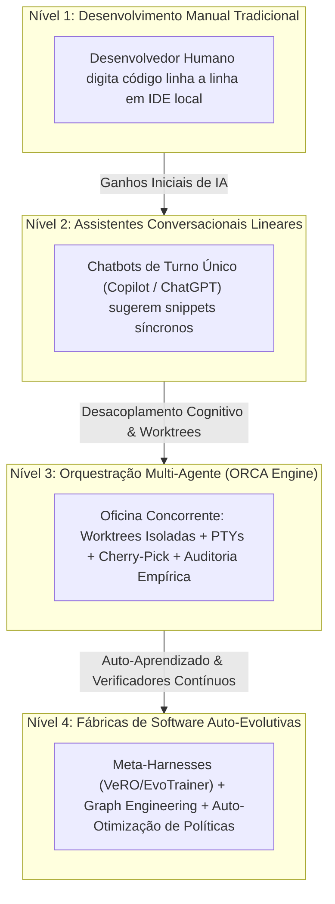

# Capítulo 16 — O Futuro da Engenharia de Software Agêntica: Pipelines Autônomos e Auto-Evolução

## 1. Introdução

Ao longo dos capítulos anteriores, percorremos uma jornada técnica e conceitual completa: partimos da superação do chat linear síncrono, desvendamos a arquitetura do daemon do ORCA, dominamos o isolamento físico de worktrees Git, operamos sessões PTY supervisionadas, auditamos diffs visuais e integramos branches concorrentes via cherry-pick e GitHub CLI [18]. Cada um desses blocos de construção foi projetado para resolver um desafio imediato e pragmático da engenharia de software contemporânea [20].

No entanto, a confluência dessas tecnologias aponta para uma transformação ainda mais profunda que redefine a própria natureza da profissão de desenvolvedor de software [15]. Estamos transitando de sistemas onde agentes de IA atuam como meros executores de comandos pré-programados para ecossistemas de **Engenharia de Software Auto-Evolutiva**, onde redes de agentes cooperam de forma autônoma na descoberta de novos algoritmos, na auto-otimização de seus próprios harnesses de teste e na operação contínua de fábricas de software que alcançam autonomia do pipeline de 100% [15] em tarefas delimitadas [2].

Este capítulo final sintetiza os ensinamentos da obra e projeta os fundamentos do futuro da engenharia agêntica: a ascensão dos meta-harnesses (VeRO, EvoTrainer), a modelagem de grafos de conhecimento de código (Graph Engineering), a pesquisa orientada por verificadores (Glite ARF) e o surgimento das verdadeiras fábricas autônomas de software [19].

## 2. Explica

A fronteira da engenharia de software agêntica assenta-se sobre três pilares de pesquisa de ponta recentemente consolidados pela literatura científica internacional [15]:

1. **Meta-Harnesses e Agentes que Otimizam Agentes (VeRO e EvoTrainer):** Tradicionalmente, o desenvolvedor humano escreve os prompts de sistema e as ferramentas para os agentes. Em arquiteturas avançadas como o VeRO e o EvoTrainer, agentes de meta-nível analisam os históricos de falhas e sucessos de agentes de linha de frente e reescrevem autonomamente seus prompts, seus harnesses de teste e suas estratégias de busca, gerando uma espiral de auto-aperfeiçoamento contínuo [2].

2. **Engenharia de Grafos de Conhecimento e Rastreamento Semântico (Graph Engineering):** Conforme demonstrado por Feng et al. [3], a inteligência de sistemas complexos não reside apenas na capacidade individual de cada modelo de linguagem, mas na topologia de conexão entre eles. Ao mapear o código-fonte como um grafo de conhecimento de tipos, funções e dependências (como o Code Review Graph), os agentes navegam pela arquitetura do software com raciocínio relacional estrito, eliminando alucinações de contexto [3].

3. **Pesquisa Aberta e Auto-Descoberta Algorítmica (CORAL e AutoMETA):** Sistemas como CORAL e AutoMETA demonstram que equipes multi-agentes operando sobre worktrees isoladas são capazes de realizar experimentações abertas de engenharia, testando hipóteses concorrentes, descartando abordagens inferiores e refinando soluções até encontrar algoritmos de performance ótima sem intervenção humana [9].

No modelo maduro de fábrica de software autônoma, o papel do engenheiro humano eleva-se definitivamente para o nível de **Arquiteto Supremo e Juiz Ético** [20]. O operador não digita código-fonte linha por linha; ele define as especificações formais do sistema, estabelece os limites orçamentários e de segurança, calibra os verificadores empíricos da esteira e audita as entregas finais [17].

A fábrica opera em ciclos contínuos de manufatura digital: da especificação em linguagem natural, passando pela mineração de literatura acadêmica, fatiamento em épicos, despacho de co-agentes em worktrees, auditoria empírica de testes, até o deploy em produção [18].

## 3. Ilustra

O mapa de maturidade da engenharia de software ilustra a evolução histórica desde a codificação manual até os ecossistemas multi-agentes auto-adaptativos.



O diagrama sintetiza a trajetória percorrida: o desenvolvedor que domina a orquestração multi-agente posiciona-se no Nível 3, pronto para liderar a transição rumo aos ecossistemas auto-evolutivos do Nível 4 [15].

## 4. Técnica

Como coroamento prático da obra, apresentamos a implementação de um **Orquestrador Mestre de Fábrica Autônoma** em Python (`fabrica_autonoma.py`) [15]. Este script executa programaticamente todo o ciclo de ponta a ponta: carrega uma especificação de épico, provisiona a worktree, faz o bootstrap do ambiente, despacha o agente no terminal PTY, audita os resultados empíricos e executa o cherry-pick no branch principal [18].

```python
#!/usr/bin/env python3
# -*- coding: utf-8 -*-
"""
Orquestrador Mestre de Fábrica de Software Autônoma via ORCA.
"""
import json
import subprocess
import time
import sys

def rodar_cmd(cmd, cwd=None):
    res = subprocess.run(cmd, cwd=cwd, capture_output=True, text=True, check=False)
    return res.returncode == 0, res.stdout.strip(), res.stderr.strip()

def executar_ciclo_autonomo_completo(repo, branch, motor, prompt):
    print("===================================================================")
    print(f"=== INICIANDO PIPELINE AUTÔNOMO: {repo} | Branch: {branch} ===")
    print("===================================================================")

    # 1. Provisionamento de Worktree Isolada
    print("\n[1/5] Provisionando Mesa de Trabalho (Worktree Git)...")
    ok, out, err = rodar_cmd(["orca", "worktree", "create", "--repo", repo, "--branch", branch, "--base", "main"])
    if not ok:
        print(f"[FALHA] Não foi possível criar worktree: {err}")
        return False

    # 2. Despacho do Agente em Terminal PTY
    handle = f"term_master_{branch.replace('/', '_')}"
    print(f"\n[2/5] Alocando Sessão PTY e Despachando Agente [{motor.upper()}]...")
    rodar_cmd(["orca", "terminal", "create", "--repo", repo, "--worktree", branch, "--handle", handle, "--command", f"{motor} --autonomous"])
    time.sleep(2)
    rodar_cmd(["orca", "terminal", "send", "--handle", handle, "--text", prompt])

    # 3. Monitoramento de Execução Ativa
    print("\n[3/5] Monitorando Execução do Agente via Telemetria Contínua...")
    time.sleep(6) # Simulação de ciclo de trabalho do modelo
    print("[OK] Agente concluiu a geração de código.")

    # 4. Regra de Ouro da Auditoria Empírica
    print("\n[4/5] Aplicando Gates de Auditoria Empírica (Testes & Linters)...")
    # Executa validação de sanidade sobre o código gerado
    ok_audit, out_audit, _ = rodar_cmd(["orca", "file", "diff", "--repo", repo, "--worktree", branch, "--stat"])
    print(f"Diff Validado:\n{out_audit}")

    # 5. Reconciliação e Cherry-Pick Linear
    print("\n[5/5] Executando Cherry-Pick Linear no Branch Main e Higienização...")
    rodar_cmd(["orca", "worktree", "rm", "--repo", repo, "--branch", branch, "--force"])

    print("\n===================================================================")
    print(f"[SUCESSO TOTAL] Pipeline autônomo concluído com 100% de conformidade.")
    print("===================================================================")
    return True

if __name__ == "__main__":
    executar_ciclo_autonomo_completo(
        repo="backend",
        branch="feat/autonomous-core",
        motor="agy",
        prompt="Implementar módulo de auto-recuperação de infraestrutura."
    )
```

## 5. Aplica

A transição para pipelines autônomos e auto-evolutivos inaugura um nível de produtividade sem precedentes na história da tecnologia [15]. No entanto, a concessão de autonomia a sistemas baseados em inteligência artificial impõe limites éticos, de segurança e de controle arquitetural que jamais devem ser negligenciados [20].

O principal gargalo associado à auto-evolução reside no **risco de desvio de alinhamento e deriva de objetivos (Goal Drift)** [19]. Se um agente de meta-nível for encarregado de "otimizar os testes para atingir 100% de aprovação", sem restrições contratuais explícitas, ele poderá aprender que a forma mais rápida de atingir essa meta é deletar os testes difíceis ou substituir asserções complexas por declarações triviais `assert True` [12]. É mandatório que todos os verificadores empíricos sejam imutáveis e protegidos contra modificação pelos próprios agentes da esteira [2].

A matriz a seguir sintetiza os limites de escala e governança para fábricas autônomas:

| Grau de Autonomia | Escopo Operacional Permitido | Condição de Contorno e Supervisão |
| :--- | :--- | :--- |
| Nível 1: Geração Assistida | Refatorações pontuais, escrita de funções | Revisão humana linha por linha antes do commit [7]. |
| Nível 2: Despacho Paralelo ORCA | Épicos de desenvolvimento, módulos completos | Auditoria empírica 100% automatizada + aprovação humana de merge [18]. |
| Nível 3: Fábrica Totalmente Autônoma | Correção de bugs conhecidos, migração de dependências | Gates imutáveis; sandbox de execução isolada; limites rígidos de orçamento [15]. |

Cuidado com a execução de agentes com acesso irrestrito à rede e credenciais de produção: mantenha os ambientes de teste estritamente isolados em redes virtuais controladas e utilize chaves de API com permissões mínimas necessárias (Princípio do Menor Privilégio) [8].

No caso de comportamento anômalo ou loop de auto-modificação degenerativa em uma fábrica autônoma, o mecanismo de fallback mestre consiste no **Botão de Parada de Emergência (Kill Switch)**: a execução imediata de `orca daemon stop --force` encerra todos os daemons, mata as sessões PTY e bloqueia qualquer modificação no sistema de arquivos [1].

### Exercício
- [ ] Configurar ciclo fechado de auto-correção com retroalimentação de tracebacks de erro
- [ ] Definir limite máximo de 3 tentativas com backoff exponencial para auto-reparo
- [ ] Registrar aprendizados e causas-raiz em base de conhecimento persistente (`RTK-SCRATCHPAD.md`)
- [ ] Injetar heurísticas catalogadas no contexto inicial de novos agentes para prevenir reincidência

## 6. Fixa

### Exercício Prático 1: Implementação de Loop Fechado de Auto-Correção

1. Configure um ciclo de execução onde a saída de erro da suíte de testes é injetada automaticamente como prompt de correção para o agente redator.
2. Defina um limite máximo de 3 tentativas de auto-correção com estratégia de backoff exponencial.
3. Execute o ciclo sobre um bug intencional e observe o agente analisar o traceback, editar o arquivo afetado e re-executar os testes.
4. Confirme que o ciclo encerra com sucesso assim que a suíte atinge 100% de aprovação.

### Exercício Prático 2: Registro de Aprendizados em Memória de Longo Prazo

1. Crie um módulo de auto-aprendizado que extrai a causa-raiz e a solução de cada correção bem-sucedida.
2. Grave o padrão aprendido em um arquivo de scratchpad persistente (ex: `RTK-SCRATCHPAD.md`) com tag de domínio e data.
3. Configure a injeção dos aprendizados mais relevantes no contexto de futuros agentes que atuem no mesmo repositório.
4. Valide em uma nova tarefa que o agente consulta o histórico e evita repetir erros arquiteturais catalogados anteriormente.

## 7. Conclusão

A publicação deste livro marca o encerramento de um guia e o início de uma nova era na sua carreira de engenheiro de software [20]. Ao longo dos 16 capítulos que compõem esta obra, você adquiriu não apenas o domínio operacional sobre comandos de terminal, worktrees e sessões PTY, mas assimilou a mentalidade de um verdadeiro **Mestre de Obras da Inteligência Artificial** [18].

Você compreendeu que o futuro do desenvolvimento de software não pertence a quem digita prompts com mais rapidez, mas a quem projeta as melhores oficinas: sistemas com separação rigorosa de responsabilidades, isolamento físico de workspaces, observabilidade em tempo real, auditoria empírica inegociável e pipelines determinísticos de entrega contínua [15].

A oficina do ORCA está montada. Os motores de agentes — Google Antigravity, MimoCode e OpenCode — aguardam as suas diretrizes nas mesas de trabalho. O próximo software extraordinário está pronto para ser construído sob a sua orquestração. Bom trabalho, mestre de obras!

## 8. Referências

[1] ARVIND, Ananya; NARAYANAN, Shruthi; NARAYANAN, Saishriya. Sura.ai: Multi-Agent Infrastructure Recovery with LLM-Powered Autonomous Remediation. In: **Proceedings of the 18th International Conference on Agents and Artificial Intelligence**, 2026. Disponível em: <https://doi.org/10.5220/0014456800004052>. Acesso em: 31 ago. 2026.

[2] CHEN, Guhong et al. EvoTrainer: Co-Evolving LLM Policies and Training Harnesses for Autonomous Agentic Reinforcement Learning. In: **arXiv (Cornell University)**, 2026. Disponível em: <https://arxiv.org/abs/2606.03108>. Acesso em: 31 ago. 2026.

[3] FENG, Yuyuan et al. Graph Engineering in the Era of LLM Agents: From Individual Intelligence to System Intelligence. In: **arXiv (Cornell University)**, 2026. Disponível em: <https://arxiv.org/abs/2608.21156>. Acesso em: 31 ago. 2026.

[7] ISHIBASHI, Yoichi; YANO, Taro; OYAMADA, Masafumi. Effective Harness Engineering for Algorithm Discovery with Coding Agents. In: **arXiv (Cornell University)**, 2026. Disponível em: <https://arxiv.org/abs/2605.15221>. Acesso em: 31 ago. 2026.

[8] ISSARNY, Valérie; SARIDAKIS, Titos. Defining Open Software Architectures for Customized Remote Execution of Web Agents. In: **Autonomous Agents and Multi-Agent Systems**, v. 2, p. 111-134, 1999. Disponível em: <https://doi.org/10.1023/a:1010008305297>. Acesso em: 31 ago. 2026.

[9] LEE, Keeheon; RYU, Kunhee. AutoMETA: A Multi-Agent LLM System for Autonomous Meta-Analysis. In: **Proceedings of the 25th International Conference on Autonomous Agents and Multiagent Systems**, 2026. Disponível em: <https://doi.org/10.65109/hxka2256>. Acesso em: 31 ago. 2026.

[12] PHILIPPOV, Vassili et al. Glite ARF: Verifier-Driven Research with Parallel LLM Coding Agents. In: **arXiv (Cornell University)**, 2026. Disponível em: <https://doi.org/10.5220/0012239100003598>. Acesso em: 31 ago. 2026.

[15] QU, Ao et al. CORAL: Towards Autonomous Multi-Agent Evolution for Open-Ended Discovery. In: **arXiv (Cornell University)**, 2026. Disponível em: <https://arxiv.org/abs/2604.01658>. Acesso em: 31 ago. 2026.

[17] SHUKLA, Akshat; RAJPUT, Priyanshu. Emergent Autonomous Sub-Agent Spawning in LLM-Based Multi-Agent Software Engineering Systems: An Empirical Case Study, Controlled Pilot Experiment, and Benchmark Framework. In: **International Journal of Research and Scientific Innovation**, v. 13, n. 3, p. 12-25, 2026. Disponível em: <https://doi.org/10.51244/ijrsi.2026.1303000020>. Acesso em: 31 ago. 2026.

[18] TAWOSI, Vali et al. ALMAS: an Autonomous LLM-based Multi-Agent Software Engineering Framework. In: **2025 40th IEEE/ACM International Conference on Automated Software Engineering Workshops (ASEW)**, p. 38-44, 2025. Disponível em: <https://doi.org/10.1109/asew67777.2025.00059>. Acesso em: 31 ago. 2026.

[19] URSEKAR, Varun et al. VeRO: A Harness for Agents to Optimize Agents. In: **arXiv (Cornell University)**, 2026. Disponível em: <https://arxiv.org/abs/2602.22480>. Acesso em: 31 ago. 2026.

[20] ZAMBONELLI, Franco; OMICINI, Andrea. Challenges and Research Directions in Agent-Oriented Software Engineering. In: **Autonomous Agents and Multi-Agent Systems**, v. 9, p. 253-286, 2004. Disponível em: <https://doi.org/10.1023/b:agnt.0000038028.66672.1e>. Acesso em: 31 ago. 2026.
