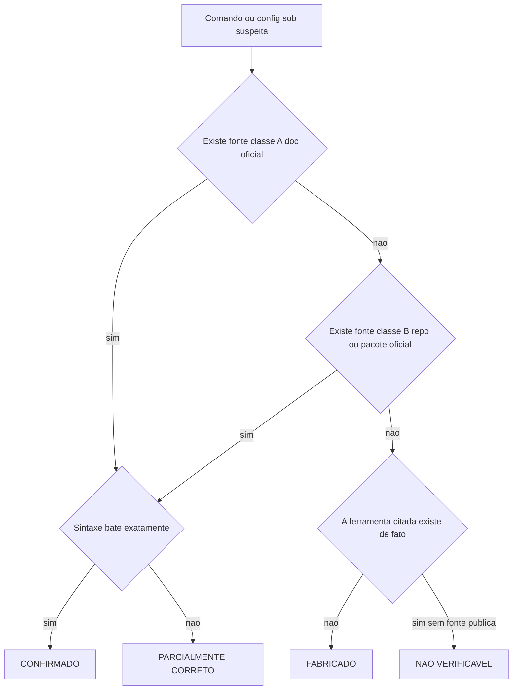

# Capítulo 1: O Manual Suspeito: Por Que Comandos Bonitos Enganam

## 1. Introdução

Um manual de 15 laboratórios chega até você prometendo cortar o gasto de tokens das suas IDEs agênticas — Claude Code, OpenCode, Aider, Codex e mais uma dezena de ferramentas. Ele tem tom técnico, comandos formatados, caminhos de arquivo exatos, nomes de modelo específicos. Tudo nele parece ter passado por um revisor experiente. E é exatamente essa aparência de rigor que faz o operador baixar a guarda e colar o primeiro bloco de código no terminal sem checar nada.

Este capítulo abre o processo pericial que sustenta o livro inteiro. Você vai ver, lado a lado, dois casos reais em que uma ferramenta genuína foi descrita com uma sintaxe que nunca existiu — e vai sair daqui com o método de verificação que vai aplicar, capítulo após capítulo, a cada comando, config e nome de modelo que cruzar seu caminho. Ao final, você não vai mais ler manuais técnicos como consumidor: vai lê-los como perito.

## 2. Explica

O erro central deste manual não é o que a maioria dos leitores esperaria. Não é uma lista de ferramentas inventadas do zero — boa parte das ferramentas citadas existe de verdade. O erro sistemático é outro, mais sutil e mais perigoso: **ferramenta real, sintaxe fabricada**. O nome do produto é autêntico; o comando exato para operá-lo foi escrito de memória, por aproximação, sem checagem final contra a fonte que o próprio fornecedor pública.

Pegue o primeiro caso, logo no laboratório de setup do manual: o comando `pipx install ccusage`. O `ccusage` existe — é uma ferramenta real e amplamente usada para analisar o consumo de tokens do Claude Code a partir dos arquivos JSONL que a própria ferramenta já grava localmente [1]. O problema é que `ccusage` é um pacote **Node/npm**, não um pacote Python — e `pipx` só instala pacotes Python. O comando do manual simplesmente não tem como funcionar: o pacote nunca vai aparecer no índice que o `pipx` consulta. A forma real e documentada de rodar a ferramenta é `npx ccusage@latest <subcomando>`, sem instalação prévia necessária — o mesmo caminho confirmado por fontes independentes que documentam o uso diário da ferramenta, sem qualquer menção a `pipx` [2]. Repare no padrão: a ferramenta é 100% real, a confiança que o nome desperta é justificada — só a sintaxe de instalação está errada.

O segundo caso aparece pouco depois, e vale entender por que ele dói tanto: o cache de prompt real da Anthropic pode cortar até 90% do custo de leitura do prefixo repetido — tecnicamente, a leitura de cache custa 0,1x o preço padrão de input [3]. É um mecanismo caro demais para ficar inoperante por causa de um caminho de arquivo errado. Ainda assim, é exatamente isso que o manual descreve: configurar esse cache em um arquivo `~/.config/claude-code/settings.json`, com campos `systemPrompt` e `cacheControl`. Nenhuma parte disso existe. O caminho real, documentado pela própria Anthropic, é `~/.claude/settings.json` (configuração de usuário) ou `.claude/settings.json`/`.claude/settings.local.json` (configuração de projeto) [4]. Os campos aceitos nesse arquivo incluem `model`, `permissions`, `env`, `hooks` e outras dezenas de chaves — mas não existe `cacheControl` nem `systemPrompt` expostos ao usuário nesse schema. O cache de prompt do Claude Code é automático, gerenciado internamente pela ferramenta junto da API; não há toggle manual para ele. Se o operador copiar esse trecho e colocá-lo no arquivo certo, o Claude Code simplesmente ignora as chaves desconhecidas — falha silenciosa, sem mensagem de erro, sem cache extra nenhum sendo ativado.

Esse é o padrão que se repete, com pequenas variações, ao longo de todo o manual. Nesta perícia — a auditoria própria que sustenta está obra —, mapeamos 61 itens tecnicamente verificáveis do documento inteiro contra a documentação oficial de cada fornecedor: 26 bateram exatamente com a fonte primária (CONFIRMADO), 13 descreviam uma ferramenta real com nome de comando ou caminho de arquivo errado (PARCIALMENTE CORRETO), 18 eram fabricação pura (FABRICADO) e 4 não puderam ser confirmados nem refutados por falta de fonte pública (NÃO VERIFICÁVEL). O núcleo técnico do manual é genuíno e vale a pena aprender — é por isso que este livro existe, em vez de simplesmente descartar o material inteiro. O que falta é o filtro.

Vale demorar-se num detalhe que a contagem acima esconde: a hierarquia de fontes deste livro tem três degraus, não dois. O primeiro — fonte classe A — é a documentação oficial publicada pelo próprio fornecedor do produto, como o guia de `settings.json` da Anthropic. O segundo — classe B — é o repositório ou pacote oficial do projeto, quando não existe um manual de referência formal, mas o código-fonte e o `README` do próprio mantenedor já bastam para confirmar a sintaxe, como o repositório do `ccusage` no GitHub. O terceiro degrau — classe C — é o material de terceiros: post de blog, tutorial independente, guia de comunidade. Uma fonte classe C nunca decide sozinha um veredicto de CONFIRMADO; ela serve como corroboração adicional quando já existe A ou B, e como pista provisória quando não existe nenhuma das duas. No caso do `ccusage`, o guia independente do ClaudeLog [2] é exatamente isso: uma fonte classe C que reforça o que o repositório oficial (classe B) já mostrava, nunca a autoridade que decidiu o veredicto sozinha. Confundir uma fonte classe C bem escrita — com capturas de tela, tom técnico seguro, formatação impecável — com uma fonte classe A é o mesmo erro de fundo que abre este capítulo: aparência de rigor substituindo verificação de fato.

## 3. Ilustra

Pense em como um perito documental trabalha. Um documento chega à mesa dele com **letra timbrada** de uma instituição conhecida — logotipo, papel timbrado, assinatura no rodapé. A reação automática de quem não é perito é aceitar: "reconheço essa instituição, então o documento deve ser válido". O perito faz o oposto: reconhecer a instituição é só o primeiro passo. O que ele confirma de fato é se **aquela assinatura específica** bate com a assinatura de referência arquivada, se o número do documento existe no cadastro oficial, se o timbre não foi escaneado e colado por cima de outro texto. Como **Perito de Configuração Agêntica**, seu trabalho com um manual técnico é idêntico: reconhecer o nome da ferramenta (`ccusage`, `Claude Code`, `Hermes`) é só a letra timbrada. A perícia de verdade é conferir se o comando específico bate com a fonte primária.

Essa é a primeira camada da analogia — a mecânica geral de desconfiar da aparência. Mas o ponto mais difícil deste capítulo pede uma segunda camada, porque ele contraria a intuição: um comando classificado como **NÃO VERIFICÁVEL** não é o mesmo que um comando **aprovado**. Pense num inquérito policial em que não se encontra prova suficiente para indiciar ninguém: o inquérito não vira, por causa disso, um atestado de inocência — ele simplesmente permanece aberto, pendente de mais evidência. Da mesma forma, quando você não encontra nenhuma fonte primária pública que confirme uma variável de ambiente ou uma flag de CLI, a conclusão correta não é "deve estar certo, ninguém provou o contrário" — é "fica pendente até eu conseguir testar com `--help` na minha própria máquina". Tratar ausência de prova como prova de inocência é exatamente o erro que deixa comando fabricado passar despercebido.



O diagrama acima é o laudo-padrão que você vai preencher, mentalmente ou por escrito, para cada comando que aparecer no resto deste livro — e no resto da sua carreira lidando com manuais de terceiros.

## 4. Técnica

A perícia não é um exercício de opinião — ela vira código quando você a transforma em checklist reproduzível. Abaixo estão os dois artefatos que sustentam o método deste capítulo: um script de diagnóstico para os dois casos apresentados na Introdução, e a função de classificação que formaliza a árvore de decisão da seção anterior.

### Diagnosticando os dois casos de abertura

O primeiro artefato não instala nada e não depende de rede — ele apenas expõe, de forma segura, por que o comando do manual falha e qual é o comando real:

```bash
#!/usr/bin/env bash
# Diagnostico dos dois casos de abertura do Capitulo 1.
# Nao depende de rede: usa apenas checagens locais (command -v, teste de path).

echo "=== CASO 1: instalar o ccusage ==="
echo "Comando do manual (fabricado): pipx install ccusage"
if command -v pipx >/dev/null 2>&1; then
  echo "pipx esta presente, mas ccusage e' um pacote Node/npm -- pipx so instala pacotes Python."
  echo "O comando do manual falharia com 'No matching distribution found'."
else
  echo "pipx nao esta instalado neste ambiente; de qualquer forma o comando falharia (pacote errado)."
fi

echo "Comando real (documentado pelo projeto): npx ccusage@latest daily"
if command -v npx >/dev/null 2>&1; then
  echo "npx disponivel -- este e' o caminho real, sem instalacao previa necessaria."
else
  echo "npx nao esta instalado neste ambiente, mas e' o comando correto segundo a documentacao do projeto."
fi

echo ""
echo "=== CASO 2: onde mora a config de cache do Claude Code ==="
CAMINHO_FABRICADO="$HOME/.config/claude-code/settings.json"
CAMINHO_REAL="$HOME/.claude/settings.json"

echo "Caminho citado pelo manual (fabricado): ${CAMINHO_FABRICADO}"
echo "Caminho real documentado pela Anthropic:  ${CAMINHO_REAL}"

if [ -f "${CAMINHO_REAL}" ]; then
  echo "Arquivo real encontrado. Campos validos: model, permissions, env, hooks -- nao cacheControl."
else
  echo "Arquivo real ainda nao existe neste ambiente, mas o caminho e' o unico documentado oficialmente."
fi
```

Rodar esse tipo de script antes de automatizar qualquer coisa é barato e determinístico: ele não depende de você "confiar" em nada, só de checar o que já existe no seu próprio ambiente contra o que a documentação afirma.

### Formalizando a árvore de decisão

O segundo artefato transforma o fluxograma da seção Ilustra em uma função que você pode reaproveitar — literalmente — em qualquer manual novo que chegar até você daqui em diante:

```python
"""
Perito de Configuracao Agentica -- classificador de evidencia (Capitulo 1).

Checklist antes de aceitar qualquer comando/config de um manual de terceiros:
  1. Existe documentacao oficial do proprio fornecedor (fonte classe A)?
  2. Existe repositorio ou pacote oficial do projeto -- GitHub/PyPI/npm (fonte classe B)?
  3. A sintaxe do manual bate exatamente com o que a fonte A ou B documenta?
  4. Antes de automatizar, rode "<comando> --help" (ou equivalente) e compare
     com o que o manual afirma -- nunca depois de automatizar.
"""

from dataclasses import dataclass


@dataclass
class Evidencia:
    existe_doc_oficial: bool     # fonte classe A
    existe_repo_pacote: bool     # fonte classe B
    ferramenta_existe: bool      # a ferramenta/produto citado existe de fato
    bate_com_manual: bool        # a sintaxe do manual confere com a fonte encontrada


def classificar_fonte(evidencia: Evidencia) -> str:
    """Aplica a hierarquia de fontes A/B/C e devolve um dos 4 veredictos.

    Regra central deste capitulo: NAO_VERIFICAVEL nunca e' sinonimo de
    aprovado. Sem fonte primaria (classe A ou B), o comando fica pendente
    ate confirmacao manual -- nunca entra em producao so porque "parece
    plausivel".
    """
    tem_fonte_primaria = evidencia.existe_doc_oficial or evidencia.existe_repo_pacote

    if not tem_fonte_primaria:
        if evidencia.ferramenta_existe:
            return "NAO_VERIFICAVEL"
        return "FABRICADO"

    return "CONFIRMADO" if evidencia.bate_com_manual else "PARCIALMENTE_CORRETO"


if __name__ == "__main__":
    casos = {
        "pipx install ccusage": Evidencia(
            existe_doc_oficial=False,
            existe_repo_pacote=True,   # ccusage existe, mas via npm, nao pipx
            ferramenta_existe=True,
            bate_com_manual=False,
        ),
        "npx ccusage@latest daily": Evidencia(
            existe_doc_oficial=False,
            existe_repo_pacote=True,
            ferramenta_existe=True,
            bate_com_manual=True,
        ),
        "~/.config/claude-code/settings.json com cacheControl": Evidencia(
            existe_doc_oficial=True,   # existe doc oficial de settings do Claude Code
            existe_repo_pacote=False,
            ferramenta_existe=True,
            bate_com_manual=False,     # caminho e campo nao batem com a doc real
        ),
    }

    for comando, evidencia in casos.items():
        veredicto = classificar_fonte(evidencia)
        classe = classe_predominante(evidencia)
        print(f"{comando}: {veredicto} (fonte classe {classe})")
```

### Registrando a classe da fonte no laudo

O classificador `classificar_fonte` decide entre os quatro veredictos, mas ele esconde uma informação que vale registrar explicitamente em qualquer laudo real: qual classe de fonte sustentou a decisão. A função abaixo formaliza o terceiro degrau da hierarquia — a fonte classe C, apresentada na seção Explica — como um rótulo auditável, sem alterar o veredicto final calculado por `classificar_fonte`:

```python
def classe_predominante(evidencia: Evidencia) -> str:
    """Retorna o rotulo de classe (A/B/C) que sustenta o veredicto.

    Uma fonte classe C (blog, guia de comunidade) nunca aparece aqui como
    suficiente sozinha -- ela so recebe o rotulo "C" quando nem A nem B
    existem, para deixar explicito no laudo que aquela evidencia e'
    corroborativa, nunca primaria.
    """
    if evidencia.existe_doc_oficial:
        return "A"
    if evidencia.existe_repo_pacote:
        return "B"
    return "C" if evidencia.ferramenta_existe else "sem_fonte"
```

Aplicado aos três casos deste capítulo, o rótulo de classe expõe uma assimetria que o veredicto sozinho esconde: tanto `pipx install ccusage` quanto `npx ccusage@latest daily` apoiam-se em classe B — o próprio repositório do projeto, sem manual de referência formal — e a diferença entre PARCIALMENTE_CORRETO e CONFIRMADO não vem da classe da fonte, vem de o comando bater ou não com o que essa fonte documenta. Já o terceiro caso, o `settings.json` do Claude Code, apoia-se em classe A — documentação oficial da Anthropic — e ainda assim erra por caminho e campo, prova de que nem toda fonte classe A impede erro humano na hora de aplicar o que ela diz. Guardar essa distinção no laudo evita um vício comum: tratar "a fonte é boa" e "o comando bate com a fonte" como se fossem a mesma pergunta.

### O padrão se repete em todo o manual

O mesmo par "produto real, sintaxe imprecisa" reaparece em praticamente todo laboratório do manual. Isso reforça por que este não é um problema isolado de dois comandos, mas um padrão sistemático que os próximos sete capítulos vão dissecar um a um, tema por tema. O gateway de modelos gratuitos do OpenCode, chamado Zen, existe de fato [5]. O que não existe é a tabela de sete modelos com nomes como `opencode-zen-free-medium`: o catálogo real segue o padrão `opencode/<model-id>` e muda de composição com frequência, então não vale a pena memorizar nomes fixos [6]. As bibliotecas de compressão de prompt e cache semântico seguem o mesmo roteiro. LLMLingua é um pacote Python genuíno, mantido pela Microsoft Research [7], e também está publicado oficialmente no índice do Python [8]. GPTCache também é real e bem documentado — mas nenhuma das duas ferramentas tem uma CLI de terminal com os subcomandos que o manual descreve; ambas são operadas via API Python [9]. `agenttrace`, hospedado no PyPI, é real [10]. `agentlytics`, hospedado no npm, também é real, mas é um projeto totalmente diferente, mantido por outra equipe [11]. O manual trata os dois como se fossem o mesmo pacote instalado de duas formas.

Nem tudo no manual está errado, e vale destacar isso com a mesma precisão que se aplica ao erro. `asyncio.gather` com semáforo é usado exatamente como a biblioteca padrão do Python documenta [12]. O mesmo vale para o GNU parallel, aplicado com a sintaxe real de paralelismo de shell [13]. O circuit breaker também é descrito sem erro, seguindo o padrão de arquitetura de resiliência amplamente documentado [14]. O backoff exponencial com jitter para retry em rate limit segue a mesma régua de precisão [15]. O fallback para modelos locais via Ollama, incluindo a lista de modelos testados, também confere com a biblioteca oficial [16]. A única ressalva de nomenclatura nesse bloco é que o binário do `llama.cpp` foi renomeado para `llama-cli` [17], e que o `vLLM` usa `vllm serve` em vez do módulo `python -m vllm.server` citado pelo manual [18]. Até o Hermes Agent, que a primeira leitura deste dossiê suspeitou ser uma IDE inventada, revelou-se um produto real da NousResearch, com CLI, memória e cron scheduler documentados [19]. Só a sintaxe exata dos comandos de skill está incorreta [20], assim como a dos comandos de memória e sessão [21]. Fecham este levantamento dois casos quase perfeitos: o chezmoi, ferramenta de dotfiles usada no capítulo final deste livro, está quase inteiramente correto, com uma única ressalva no instalador legado [22]; e o 1Password CLI, citado no mesmo laboratório, bate exatamente com a sintaxe documentada pelo fornecedor, sem nenhuma correção necessária [23].

## 5. Aplica

Você acabou de configurar um notebook novo. O manual está aberto ao lado do terminal, e você segue o roteiro do Laboratório 4: criar um hook de pré-processamento em `~/.config/claude-code/hooks.json` para acionar o cache semântico do GPTCache antes de cada chamada. Você cria o diretório, escreve o JSON com o campo `preProcess` exatamente como o manual mostra, salva, reinicia o Claude Code e... nada muda. Sem erro. Sem aviso. O cache simplesmente nunca é chamado, e você gasta a tarde seguinte tentando descobrir por que sua "otimização" não fez diferença nenhuma na fatura.

O diagnóstico, à luz da seção Explica deste capítulo, é direto: hooks do Claude Code não vivem em um arquivo separado `hooks.json` — eles vivem dentro do próprio `~/.claude/settings.json`, na chave `hooks`, amarrados a eventos nomeados como `PreToolUse` e `PostToolUse` [24]. O arquivo que você criou é, para a ferramenta, um arquivo qualquer sem significado nenhum — por isso o silêncio, sem erro. A correção tem duas partes: mover a configuração de hook para dentro do `settings.json` real, usando o evento correto, e — separadamente — implementar o cache semântico como o que ele de fato é. O GPTCache é uma biblioteca Python chamada programaticamente (`cache.init(...)`), nunca um serviço acionado por um hook de terceiro que não existe com esse nome [9].

Esse tipo de falha silenciosa é o risco central de todo o método deste livro, e por isso a perícia tem um limite conhecido que você precisa carregar consigo: catálogos de modelo mudam de uma semana para a outra (o catálogo Zen do OpenCode é o exemplo mais volátil), produtos lançados depois de qualquer corte de conhecimento exigem reconferência pontual, e mesmo uma fonte classe A pode estar temporariamente desatualizada em relação à versão que você instalou localmente. A perícia reduz o risco de forma drástica — não o elimina. "Fonte classe A" é o melhor sinal disponível no momento da checagem, nunca uma garantia perpétua.

Armadilhas recorrentes que valem registrar antes de avançar:

- Confiar no nome da ferramenta como se fosse prova da sintaxe exata do comando.
- Tratar "não encontrei fonte que desminta" como "está confirmado".
- Copiar caminho de arquivo de configuração sem abrir a documentação oficial da versão instalada.
- Automatizar (cron, script, hook) antes de rodar `--help` uma única vez que seja.

Erro comum vs. prática correta, aplicado à fonte classe C: encontrar um post de blog bem escrito, com prints de tela e comandos formatados, e tratá-lo como equivalente à documentação oficial é o erro mais comum entre operadores que já ouviram falar em "verificar a fonte", mas nunca aplicaram a hierarquia até o fim — o erro comum é parar na pergunta "essa fonte parece confiável?". A prática correta troca essa pergunta por outra, mais estreita: essa fonte é o próprio fornecedor (classe A), o repositório ou pacote oficial do projeto (classe B), ou alguém de fora comentando sobre o produto (classe C)? Um post de blog pode estar certo — o ClaudeLog está, por exemplo [2] — mas ele só vira evidência suficiente quando corrobora uma fonte A ou B já encontrada, nunca quando é a única fonte disponível para confirmar uma flag de CLI ou um caminho de arquivo de configuração.

### Exercício
- [ ] Escolha 1 comando de qualquer manual, tutorial ou post de blog que você usou nas últimas semanas sem checar a fonte oficial
- [ ] Rode `<comando> --help` (ou o equivalente da ferramenta) e compare linha a linha com o que você havia copiado
- [ ] Classifique o comando usando os 4 veredictos deste capítulo: CONFIRMADO, PARCIALMENTE CORRETO, FABRICADO ou NÃO VERIFICÁVEL
- [ ] Se for PARCIALMENTE CORRETO ou FABRICADO, escreva a versão corrigida ao lado da original, com a fonte primária anotada

## 6. Conclusão

Três pontos sustentam tudo que vem a seguir neste livro: primeiro, o erro mais perigoso de um manual técnico não é a fabricação total, mas a ferramenta real vestida de sintaxe inventada — porque o nome familiar desarma exatamente a checagem que evitaria o problema. Segundo, existe um protocolo reproduzível para separar as duas coisas: hierarquia de fontes classe A/B/C, os quatro veredictos (CONFIRMADO, PARCIALMENTE CORRETO, FABRICADO, NÃO VERIFICÁVEL) e a regra de nunca tratar ausência de prova como aprovação. Terceiro, esse protocolo já foi aplicado às 61 afirmações verificáveis do manual auditado — o resultado é o mapa que guia cada um dos sete capítulos seguintes.

No Capítulo 2, você vai aplicar esse mesmo laudo pericial ao mecanismo mais lucrativo do manual — o cache de prompt — e vai descobrir exatamente onde o desconto real de 90% se configura [3], e onde o manual inventou um caminho de arquivo que nunca existiu.

## 7. Referências Bibliográficas

[1] RYOPPIPPI. *ccusage: A CLI tool for analyzing Claude Code/Codex CLI usage from local JSONL files*. Disponível em: https://github.com/ryoppippi/ccusage. Acesso em: 20 ago. 2026.

[2] CLAUDELOG. *What is ccusage tool for Claude Code*. Disponível em: https://claudelog.com/faqs/what-is-ccusage-tool/. Acesso em: 20 ago. 2026.

[3] ANTHROPIC. *Prompt caching*. Disponível em: https://platform.claude.com/docs/en/build-with-claude/prompt-caching. Acesso em: 20 ago. 2026.

[4] ANTHROPIC. *Claude Code settings*. Disponível em: https://code.claude.com/docs/en/settings. Acesso em: 20 ago. 2026.

[5] OPENCODE. *Zen*. Disponível em: https://opencode.ai/docs/zen/. Acesso em: 20 ago. 2026.

[6] OPENCODE. *Config*. Disponível em: https://opencode.ai/v2/docs/config. Acesso em: 20 ago. 2026.

[7] MICROSOFT. *LLMLingua* (repositório oficial). Disponível em: https://github.com/microsoft/LLMLingua. Acesso em: 20 ago. 2026.

[8] PYTHON PACKAGE INDEX. *llmlingua*. Disponível em: https://pypi.org/project/llmlingua/. Acesso em: 20 ago. 2026.

[9] ZILLIZTECH. *GPTCache: A Library for Creating Semantic Cache for LLM Queries* (docs/usage.md). Disponível em: https://github.com/zilliztech/GPTCache/blob/main/docs/usage.md. Acesso em: 20 ago. 2026.

[10] TENSORSTAX. *agenttrace: lightweight observability library to trace and evaluate agentic systems*. Disponível em: https://github.com/tensorstax/agenttrace. Acesso em: 20 ago. 2026.

[11] F. *agentlytics: Comprehensive analytics dashboard for AI coding agents*. Disponível em: https://github.com/f/agentlytics. Acesso em: 20 ago. 2026.

[12] PYTHON SOFTWARE FOUNDATION. *asyncio — Asynchronous I/O*. Disponível em: https://docs.python.org/3/library/asyncio.html. Acesso em: 20 ago. 2026.

[13] GNU. *GNU Parallel*. Disponível em: https://www.gnu.org/software/parallel/. Acesso em: 20 ago. 2026.

[14] MICROSOFT. *Circuit Breaker pattern — Azure Architecture Center*. Disponível em: https://learn.microsoft.com/en-us/azure/architecture/patterns/circuit-breaker. Acesso em: 20 ago. 2026.

[15] AMAZON WEB SERVICES. *Timeouts, retries and backoff with jitter — Builders' Library*. Disponível em: https://aws.amazon.com/builders-library/timeouts-retries-and-backoff-with-jitter/. Acesso em: 20 ago. 2026.

[16] OLLAMA. *ollama/ollama*. Disponível em: https://github.com/ollama/ollama. Acesso em: 20 ago. 2026.

[17] GGML-ORG. *llama.cpp*. Disponível em: https://github.com/ggml-org/llama.cpp. Acesso em: 20 ago. 2026.

[18] VLLM PROJECT. *CLI Reference — serve*. Disponível em: https://docs.vllm.ai/en/stable/cli/serve/. Acesso em: 20 ago. 2026.

[19] NOUSRESEARCH. *hermes-agent*. Disponível em: https://github.com/NousResearch/hermes-agent. Acesso em: 20 ago. 2026.

[20] NOUSRESEARCH. *CLI Interface — Hermes Agent*. Disponível em: https://hermes-agent.nousresearch.com/docs/user-guide/cli. Acesso em: 20 ago. 2026.

[21] NOUSRESEARCH. *Configuration — Hermes Agent*. Disponível em: https://hermes-agent.nousresearch.com/docs/user-guide/configuration. Acesso em: 20 ago. 2026.

[22] CHEZMOI. *Install* e *Daily operations*. Disponível em: https://www.chezmoi.io/install/. Acesso em: 20 ago. 2026.

[23] 1PASSWORD. *op signin — CLI command reference*. Disponível em: https://developer.1password.com/docs/cli/reference/commands/signin. Acesso em: 20 ago. 2026.

[24] ANTHROPIC. *Hooks reference*. Disponível em: https://code.claude.com/docs/en/hooks. Acesso em: 20 ago. 2026.
