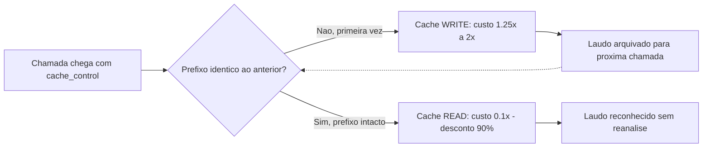

# Capítulo 2: Prompt Caching de Verdade: Como o Provedor Cobra Menos por Repetição

## 1. Introdução

No Capítulo 1, você aprendeu o método de perícia que vai carregar pelo resto deste livro: nunca aceitar um comando só porque o nome da ferramenta é familiar, sempre exigir a hierarquia de fontes A/B/C e rodar `--help` ou abrir a documentação oficial antes de confiar em qualquer sintaxe. Você também viu o gatilho psicológico que o manual explora — o nome real destrava a confiança, e é exatamente aí que a sintaxe fabricada se esconde. Este capítulo aplica esse método ao primeiro item da mesa de perícia: o LAB 1 do manual, que promete cortar seu gasto com tokens "em até 90%" ativando um cache de prompt através de um arquivo de configuração — o percentual tem lastro na documentação oficial do próprio fornecedor [1], mas o arquivo de configuração citado, como você vai ver, não.

Como Perito de Configuração Agêntica, seu trabalho agora é separar o que é mecanismo real de cobrança — porque o desconto de cache existe e é documentado pelo próprio fornecedor — do que é caminho de arquivo forjado. Ao dominar isso, você deixa de copiar blocos de configuração de manuais de terceiros e passa a exigir o documento com fonte primária antes de tocar em qualquer `settings.json`, `.yml` ou `.toml` do seu ambiente de trabalho.

## 2. Explica

O cache de prompt da Anthropic é real, documentado e funciona por um princípio simples: se o início de uma chamada de API for **byte-a-byte idêntico** a uma chamada anterior, o provedor reaproveita o processamento já feito daquele trecho em vez de refazê-lo do zero [1]. Esse mecanismo entra no payload da chamada — não em um arquivo de configuração de IDE — através do campo `cache_control` com o valor `{"type": "ephemeral"}`, que pode ser colocado no bloco `system`, em mensagens específicas, ou no último item de uma lista de `tools` [1].

Existem duas operações distintas, e confundi-las é o primeiro erro que a perícia precisa evitar. Uma chamada que cria um trecho de cache pela primeira vez é uma operação de **escrita** (write); uma chamada posterior que encontra o mesmo prefixo já cacheado é uma operação de **leitura** (read) [1]. A cobrança dessas duas operações é oposta ao que a intuição sugere: escrever no cache custa **mais caro** que uma chamada normal (1,25 vezes o preço de input padrão para um cache de 5 minutos de validade, ou 2 vezes para um cache de 1 hora), enquanto ler de um cache já existente custa **90% mais barato** — apenas 0,1 vez o preço de input padrão [1]. Esse é o número real por trás do "desconto de até 90%" citado pelo manual: ele é verdadeiro, mas só se aplica à leitura, e a documentação oficial não pública um percentual fixo de ganho de latência equivalente — apenas menciona melhora de tempo até o primeiro token em documentos longos, sem uma cifra fechada [1]. Análises externas que tentam quantificar esse ganho de latência tratam o número como estimativa de mercado, não como métrica publicada pelo fornecedor [2].

Duas regras adicionais fecham o mecanismo. Primeiro, existe um piso: blocos com menos de 1024 tokens não são cacheados, mesmo que o campo `cache_control` esteja presente [1]. Segundo, o cache é frágil por natureza — qualquer alteração de um único caractere no prefixo (um timestamp dinâmico, uma ordem de bloco trocada) invalida o cache a partir daquele ponto, forçando uma nova escrita [1]. É esse comportamento que explica por que ferramentas como o Aider organizam deliberadamente o histórico de chat (prompt de sistema, arquivos somente leitura, mapa do repositório, arquivos editáveis) em uma ordem fixa: manter o prefixo estável é a única forma de manter o cache "quente" [3].

Vale entender também onde exatamente o marcador `cache_control` pode ser colocado dentro do payload, porque essa é outra camada que o manual auditado simplesmente ignora. Existem duas formas de posicionamento documentadas pela própria Anthropic: (a) no nível raiz do request, caso em que o provedor aplica cache automático ao bloco elegível mais recente sem exigir marcação explícita em cada trecho; e (b) em blocos de conteúdo individuais — o array `system`, mensagens específicas dentro de `messages`, ou o último item de uma lista de `tools` — como um breakpoint explícito que você escolhe [1]. Um agente que injeta o mapa do repositório e o histórico de arquivos editáveis como blocos separados de `messages`, por exemplo, pode marcar cada um com seu próprio breakpoint, em vez de depender de um único cache automático no topo do payload. Essa granularidade é o que permite a ferramentas como o Aider manter partes do prompt "frias" (o pedido do usuário, que muda a cada turno) e partes "quentes" (o mapa do repositório, que muda raramente) na mesma chamada, sem que a parte volátil invalide o cache da parte estável [1].

## 3. Ilustra

Pense no cache de prompt como um laudo pericial que precisa ser reautenticado toda vez que um único traço da assinatura muda. A primeira vez que um documento — no nosso caso, o prefixo da sua conversa com o modelo — passa pela mesa do perito, ele exige análise completa: comparação de traços, verificação de tinta, autenticação formal. Esse trabalho completo é a operação de **escrita** no cache, e por isso custa mais caro (1,25x a 2x) — você está pagando pelo trabalho pericial extra de deixar aquele documento pronto para reconhecimento futuro [1].

Mas se o mesmo documento, byte-a-byte idêntico, voltar à mesa depois, o perito não repete a análise inteira: ele reconhece a assinatura já catalogada e emite o laudo em segundos. Essa é a operação de **leitura**, e por isso ela custa apenas 10% do preço normal — 90% de desconto [1]. Agora, se um único traço mudar — uma vírgula a mais, uma data diferente no cabeçalho —, o documento deixa de ser "o mesmo" para efeitos de cadeia de custódia, e o perito precisa recomeçar a autenticação do zero. É exatamente assim que uma linha de timestamp dinâmico dentro do seu prompt de sistema destrói silenciosamente todo o benefício do cache [1].

A segunda analogia cobre o ponto mais contraintuitivo do mecanismo: por que a Anthropic cobra **mais** para criar o cache. Pense em uma perícia que precisa deixar uma cópia autenticada arquivada para consultas futuras — abrir uma pasta nova, catalogar, indexar. Esse trabalho extra de preparo é o que você paga no cache write; o retorno vem depois, em todas as consultas de leitura que reaproveitam aquela pasta já pronta [1]. Quem faz uma única chamada e nunca repete o prefixo paga o preço da abertura da pasta sem nunca colher o desconto — por isso o cache só compensa quando o mesmo prefixo é reaproveitado diversas vezes na mesma janela de validade.



Como veterano nessa mesa de perícia, você passa a olhar para qualquer alegação de "economia automática de tokens" com a mesma pergunta: o prefixo está realmente estável entre chamadas, ou algo está sutilmente mudando a assinatura do documento a cada requisição?

## 4. Técnica

O primeiro artefato de evidência é o próprio payload da Messages API. Ele mostra onde o campo `cache_control` realmente vive — dentro da chamada, não em um arquivo de configuração de IDE [1].

```json
{
  "model": "claude-sonnet-4-5",
  "system": [
    {
      "type": "text",
      "text": "Voce e um assistente de codigo especializado em Python. Regras do projeto: use type hints, docstrings no padrao Google, e nunca escreva codigo sem tratamento de erro.",
      "cache_control": { "type": "ephemeral" }
    }
  ],
  "messages": [
    { "role": "user", "content": "Refatore a funcao calcular_total abaixo." }
  ]
}
```

Nessa primeira chamada, o bloco `system` inteiro é marcado com `cache_control` — isso dispara uma operação de **escrita** (custo 1,25x, TTL padrão de 5 minutos) [1]. Se a próxima chamada, dentro da janela de 5 minutos, reenviar esse mesmo bloco `system` **byte-a-byte idêntico**, a Anthropic reconhece o prefixo e cobra apenas 0,1x por aquele trecho — a operação de **leitura** [1]. Qualquer edição no texto do `system` (mesmo um espaço a mais) recomeça o ciclo em uma nova escrita.

### Onde a configuração de verdade mora, por ferramenta

Este é o ponto em que o manual auditado comete a fabricação mais perigosa do capítulo: ele descreve um arquivo `~/.config/claude-code/settings.json` com campos `systemPrompt` e `cacheControl` como se fosse o botão de ativação do cache no Claude Code. Esse caminho e esses campos **não existem** [4]. O arquivo real de configuração do Claude Code fica em `~/.claude/settings.json` (escopo de usuário) ou `.claude/settings.json` / `.claude/settings.local.json` (escopo de projeto), e os campos documentados são outros — `model`, `permissions`, `env`, `hooks`, `apiKeyHelper`, `cleanupPeriodDays`, entre dezenas de outros [4]. Não existe campo `cacheControl` nem `systemPrompt` exposto ao usuário: o cache de prompt do Claude Code é **automático**, gerenciado internamente pela ferramenta e pela API, sem toggle manual [4].

```json
{
  "model": "claude-sonnet-4-5",
  "env": {
    "ANTHROPIC_MODEL": "claude-sonnet-4-5"
  },
  "permissions": {
    "allow": ["Bash(git log:*)", "Read(**)"]
  },
  "cleanupPeriodDays": 30
}
```

Esse é o formato real de `~/.claude/settings.json` — repare que não há nenhum campo relacionado a cache. O que existe, e que o manual acerta, é o arquivo `CLAUDE.md` na raiz do projeto: ele é lido e incluído automaticamente no contexto de cada sessão, funcionando como o prefixo estável ideal para maximizar cache hit, desde que seu conteúdo não mude a cada execução [4].

O Aider segue outro caminho, também real: o arquivo `~/.aider.conf.yml` aceita o campo `cache-prompts`, que por padrão vem `false` e precisa ser ligado explicitamente [5].

```yaml
# ~/.aider.conf.yml
cache-prompts: true
cache-keepalive-pings: 6
```

`cache-prompts: true` ativa o cache automático do provedor (a mesma mecânica de escrita/leitura da Anthropic descrita acima) para as chamadas feitas pelo Aider [5]. Já `cache-keepalive-pings` envia pings periódicos para manter o cache "quente" além da janela padrão de 5 minutos, evitando reescritas desnecessárias em sessões longas de edição [3].

O terceiro documento sob perícia é o Codex CLI, da OpenAI. O manual auditado erra de um jeito mais sutil aqui: acerta o **caminho** do arquivo (`~/.codex/config.toml`), mas erra a **estrutura interna**, colocando os campos de modelo dentro de uma seção `[codex]` que o repositório oficial do projeto não documenta em lugar nenhum [6].

```toml
# ~/.codex/config.toml
model = "gpt-5-codex"
model_provider = "openai"
model_reasoning_effort = "high"
wire_api = "responses"

[model_providers.meu_provedor_customizado]
name = "Meu Provedor"
base_url = "https://api.exemplo.com/v1"
```

Os campos reais (`model`, `model_provider`, `model_reasoning_effort`, `model_context_window`, `wire_api`) ficam no **nível raiz** do arquivo; provedores customizados vão em uma seção `[model_providers.<id>]`, não em `[codex]` [6]. A referência de configuração publicada pela própria OpenAI confirma esse formato plano e não documenta nenhum campo `cache_prompts` — quando aplicável, o cache da OpenAI também é automático [7].

Vale registrar, para efeito de cadeia de custódia, que mesmo dentro do próprio Claude Code existe outro documento fácil de confundir: hooks reais não vivem em um arquivo separado `hooks.json` com campo `preProcess`, mas dentro da própria chave `hooks` de `~/.claude/settings.json`, disparados em eventos nomeados como `PreToolUse`/`PostToolUse`/`SessionStart`/`Stop` [8]. Guarde esse detalhe: ele volta a importar quando você for automatizar qualquer verificação em torno do cache no seu próprio fluxo de trabalho.

### Verificando a estabilidade do prefixo com sha256sum

Se o cache depende de o prefixo permanecer byte-a-byte idêntico [1], então o passo de perícia mais barato antes de investigar qualquer queda de cache hit é confirmar que o seu próprio `CLAUDE.md` não está mudando de uma execução para outra sem você perceber — um espaço a mais inserido por um editor, uma linha de metadado gerada automaticamente, um timestamp de "última atualização" injetado por outra automação. Essa checagem não depende de nenhuma ferramenta fabricada: um hash SHA-256 do arquivo, comparado entre execuções, é o suficiente [4].

```bash
# Grava o hash atual do CLAUDE.md e compara com o hash da execucao anterior.
# Se os hashes diferem, o prefixo mudou e o cache sera reescrito na proxima chamada.
ARQUIVO="CLAUDE.md"
HASH_ANTERIOR_ARQ=".claude_md.sha256"

HASH_ATUAL=$(sha256sum "$ARQUIVO" | cut -d ' ' -f1)

if [ -f "$HASH_ANTERIOR_ARQ" ]; then
  HASH_ANTERIOR=$(cat "$HASH_ANTERIOR_ARQ")
  if [ "$HASH_ATUAL" = "$HASH_ANTERIOR" ]; then
    echo "CLAUDE.md estavel -- prefixo intacto, cache elegivel para READ."
  else
    echo "CLAUDE.md mudou desde a ultima execucao -- proxima chamada sera WRITE."
  fi
else
  echo "Primeira execucao registrada -- sem baseline para comparar ainda."
fi

echo "$HASH_ATUAL" > "$HASH_ANTERIOR_ARQ"
```

Rodar esse script antes de cada sessão longa custa nada e responde, de forma determinística, a pergunta que normalmente vira suposição: "meu cache caiu porque o provedor mudou algo, ou porque eu mesmo alterei o prefixo sem perceber?" Na esmagadora maioria dos casos reais, a segunda hipótese é a correta — e o hash prova isso em uma linha, sem depender de nenhum campo de telemetria exposto pelo fornecedor.

### As outras seis frentes: Hermes e o restante do catálogo

O manual não para em quatro ferramentas — ele estende a mesma tabela de cache para Hermes e mais seis IDEs agênticas. Aqui a perícia encontra o padrão mais traiçoeiro do capítulo: **o produto é genuíno em todos os sete casos**, mas o caminho de configuração citado raramente resiste à checagem contra fonte primária.

O Hermes Agent, da NousResearch, existe de fato como agente pessoal com CLI, memória persistente e delegação para subagentes — e o caminho `~/.hermes/config.yaml` citado pelo manual está correto [9]. O problema é o conteúdo: a documentação oficial lista campos reais como `model`, `memory`, `skills`, `prompt_caching`, `agent`, `terminal`, `runtime` e `worktree`, mas **não** existe `system_prompt` nem `cache_control: {type: ephemeral}` dentro desse arquivo — são nomes emprestados da API da Anthropic e colados em um documento que não os define [9]. O verbo real para gerenciar extensões do agente também diverge do manual: o guia oficial de CLI documenta `hermes skills install`/`browse`/`list`, sempre no plural [10]. O próprio repositório do projeto, aberto para inspeção pública, não registra nenhuma variante no singular equivalente à forma que o manual apresenta [11].

Das outras seis ferramentas citadas, quatro merecem registro individual antes da conclusão desta seção. MiMo Code, da Xiaomi, é um CLI real de codificação por agente, com repositório próprio aberto ao público [12]. Google Antigravity também é real: foi anunciada em preview público em novembro de 2025 como plataforma de desenvolvimento agent-first construída sobre um fork do VS Code [13]. Oh My Pi (o binário `omp`) é outro produto confirmado, um fork do framework Pi voltado a agentes de terminal [14]. Orca ADE, por fim, é um ambiente open-source real para rodar múltiplos agentes de codificação em worktrees paralelos [15]. Em todos os quatro casos, contudo, o caminho de arquivo de configuração citado pela tabela do manual não tem confirmação em documentação primária até o fechamento desta perícia. A única exceção verificável entre as sete é a Gemini CLI, do Google: o produto correto se chama Gemini CLI (não "Google CLI", como o manual escreve), e sua configuração real fica documentada em `~/.gemini/settings.json` [16]. A própria documentação de referência do Google confirma esse caminho e a lista de campos aceitos [17]. Diante de um caminho "não confirmado", o protocolo de perícia é simples: trate como evidência pendente, nunca como fato — não incorpore o caminho em automação alguma até checar a documentação oficial daquele produto específico no momento em que for usá-lo.

### Medindo cache hit de verdade

Depois de configurar corretamente, o passo seguinte da perícia é medir se o cache está mesmo funcionando — e aqui o manual comete outra fabricação: ele instrui `pipx install ccusage` e o subcomando `ccusage log --date`. O `ccusage` é real e muito útil, mas é uma ferramenta **Node/npm**, não um pacote Python instalável via `pipx` [18]. Ele lê diretamente os arquivos JSONL que o Claude Code (e, em versões recentes, o Codex CLI) já gravam localmente, sem precisar de chamadas de API externas [18].

```bash
# instalacao/uso real: sem instalar nada, via npx
npx ccusage@latest session --json
```

A saída real desse comando traz os campos que você deve usar como evidência de cache hit — e não os nomes inventados pelo manual (`cache_hit_ratio`, `cache_hit`):

```json
{
  "sessionId": "abc123",
  "inputTokens": 1520,
  "outputTokens": 340,
  "cacheCreationTokens": 4800,
  "cacheReadTokens": 38200,
  "cacheHitRate": 0.89,
  "costUSD": 0.412
}
```

O campo real é `cacheHitRate` — não `cache_hit_ratio` nem `cache_hit` — e ele vem acompanhado de `cacheCreationTokens` (tokens gastos em operações de escrita) e `cacheReadTokens` (tokens que se beneficiaram do desconto de leitura) [18]. Os subcomandos reais do `ccusage` são `daily`, `weekly`, `monthly`, `session` e `blocks` (janelas de 5 horas) — o comando `log --date` citado pelo manual não existe no repositório oficial da ferramenta [18]. Um guia independente de uso cotidiano da ferramenta confirma a mesma lista de subcomandos reais, sem qualquer menção a `log --date` [19].

```bash
# extraindo so a taxa de acerto de cache com jq
npx ccusage@latest session --json | jq '.[] | {sessionId, cacheHitRate}'
```

Uma nota final de cadeia de custódia: o manual também confunde dois produtos ao tentar verificar a instalação do `agenttrace`. `agenttrace` existe de verdade no PyPI, mantido pela Tensorstax, como biblioteca de observabilidade para agentes [20]. `agentlytics` também existe de verdade, mas é um projeto **diferente**, distribuído via npm, que lê o histórico local de várias IDEs agênticas para montar um dashboard de custo [21]. Tratar os dois como o mesmo produto — instalar um e verificar com o comando do outro — é o mesmo padrão de erro que você vai encontrar de novo neste livro: nome parecido, produtos distintos, sintaxe cruzada por engano.

## 5. Aplica

Imagine a seguinte cena. Você termina de ler o manual de terceiros na sexta à noite, animado com a promessa de cortar 90% do seu gasto em tokens — o número que a documentação oficial confirma para cache read [1]. Ainda no mesmo terminal, você cria a pasta `~/.config/claude-code/`, escreve um `settings.json` com `"systemPrompt"` e `"cacheControl": {"type": "ephemeral"}`, salva o arquivo e abre o Claude Code na segunda-feira esperando ver a fatura despencar. Nada muda. Você olha o extrato de uso no fim da semana e o custo está idêntico ao de sempre — nenhum sinal de cache read em lugar nenhum.

O diagnóstico, à luz do que você acabou de examinar na seção Técnica, é direto: o Claude Code nunca leu aquele arquivo, porque ele não olha para `~/.config/claude-code/settings.json` — esse caminho simplesmente não existe no software real [4]. Você não cometeu um erro de sintaxe dentro do arquivo; você entregou o laudo ao endereço errado. A correção é mover a configuração para `~/.claude/settings.json` (ou `.claude/settings.json` na raiz do projeto) — o documento com fonte primária confirmada [4] — e, mais importante, entender que não existe campo `cacheControl` para ativar: o cache já está ligado, automaticamente, sempre que o prefixo da chamada permanecer estável byte-a-byte entre requisições, exatamente como a documentação oficial de cache descreve [1]. O ganho real não vem de um toggle: vem de manter seu `CLAUDE.md` e seu prompt de sistema estáveis, sem timestamps dinâmicos ou blocos que mudam de ordem a cada execução [1].

Esse é o tipo de armadilha que separa quem apenas cópia configuração de quem audita antes de aplicar. Como síntese, guarde três sinais de alerta recorrentes: (1) caminho de arquivo com estrutura "bonita demais" (`~/.config/<nome-da-ferramenta>/settings.json` é um padrão genérico, não uma confirmação); (2) campo de configuração que promete controlar um mecanismo que a documentação descreve como automático; (3) métrica de sucesso com nome que "faz sentido" (`cache_hit_ratio`) mas que você nunca viu literalmente na saída real da ferramenta.

Em termos de escala, o cache de prompt da Anthropic compensa quando o mesmo prefixo é reaproveitado várias vezes dentro da janela de validade (5 minutos no padrão, 1 hora na variante premium) [1] — em um agente que processa uma tarefa isolada por chamada, sem reaproveitar contexto, o custo de escrita (1,25x a 2x) pode superar o benefício, e o cache deixa de compensar. Da mesma forma, blocos abaixo de 1024 tokens nunca são cacheados, então textos curtos de sistema não geram economia nenhuma, por mais estáveis que sejam [1]. Conhecer esse contorno evita a armadilha oposta: prometer para o seu time um ganho de cache que a arquitetura do seu agente não tem estrutura para capturar.

Erro comum vs. prática correta, aplicado à variante de 1 hora: o erro comum é ignorá-la por completo, assumindo que o TTL padrão de 5 minutos é a única opção e que qualquer sessão mais longa está condenada a pagar escrita repetida. Isso é especialmente caro em fluxos de revisão de código ou depuração, onde o operador lê um trecho de log, pensa por alguns minutos, faz uma pergunta de acompanhamento, e só então volta ao agente — um intervalo comum de 6 a 10 minutos que estoura a janela padrão e força uma nova escrita a cada rodada [1]. A prática correta é fazer a conta antes de decidir: se o mesmo prefixo — o `CLAUDE.md`, o mapa do repositório, as instruções de sistema — vai ser reaproveitado várias vezes ao longo de uma sessão que naturalmente ultrapassa 5 minutos entre chamadas, pagar o premium mais alto de escrita (2x em vez de 1,25x) para destravar 1 hora de validade tende a compensar, porque cada leitura subsequente dentro dessa janela mais longa continua custando os mesmos 0,1x do preço padrão [1]. A régua não muda: o benefício só existe se o prefixo permanecer byte-a-byte estável durante toda a janela escolhida — os 5 minutos do padrão ou a 1 hora da variante premium.

### Exercício
- [ ] Localize o arquivo real de configuração do Claude Code na sua máquina (`~/.claude/settings.json`) e liste os campos existentes — confirme que não há `cacheControl` nem `systemPrompt`
- [ ] Rode `npx ccusage@latest session --json` em um projeto com Claude Code já usado e identifique os valores de `cacheCreationTokens`, `cacheReadTokens` e `cacheHitRate`
- [ ] Se você usa Aider, adicione `cache-prompts: true` ao `~/.aider.conf.yml` e rode duas chamadas seguidas sobre o mesmo arquivo para observar a diferença de custo
- [ ] Escreva, para o seu próprio `CLAUDE.md`, uma lista dos elementos que poderiam variar de uma execução para outra (data, hora, IDs aleatórios) e remova qualquer um deles do topo do arquivo

## 6. Conclusão

Você fechou este capítulo com três evidências autenticadas: o mecanismo real de cache de prompt cobra 90% menos na leitura e um premium de 1,25x a 2x na escrita, sempre condicionado a um prefixo idêntico byte-a-byte [1]; a configuração de verdade mora em caminhos e campos específicos e documentados, nunca no arquivo fantasma `~/.config/claude-code/settings.json` com campos `systemPrompt`/`cacheControl` do manual auditado — Claude Code usa `~/.claude/settings.json` [4], Aider usa `cache-prompts: true` dentro de `~/.aider.conf.yml` [5], e Codex usa campos soltos no nível raiz de `~/.codex/config.toml` [6]; e a medição de cache hit de verdade passa pelo `ccusage` via `npx`, lendo os campos reais `cacheCreationTokens`, `cacheReadTokens` e `cacheHitRate` — nunca os nomes inventados pelo manual [18].

O padrão que você aprendeu a reconhecer aqui — ferramenta real, caminho de arquivo fabricado — vai se repetir, em outras variações, em praticamente todo capítulo restante deste livro. No Capítulo 3, você vai aplicar a mesma régua pericial a um problema ainda mais traiçoeiro: um catálogo inteiro de "modelos gratuitos" com nomes plausíveis, tabelas de especificação bem formatadas e nenhum deles existindo de verdade no gateway real.

## 7. Referências Bibliográficas

[1] ANTHROPIC. *Prompt caching*. Disponível em: https://platform.claude.com/docs/en/build-with-claude/prompt-caching. Acesso em: 20 ago. 2026.

[2] AGENTBRISK. *Prompt Caching Deep Dive: How to Cut Anthropic API Costs by 90%*. Disponível em: https://agentbrisk.com/blog/prompt-caching-deep-dive-2026/. Acesso em: 20 ago. 2026.

[3] AIDER. *Prompt caching*. Disponível em: https://aider.chat/docs/usage/caching.html. Acesso em: 20 ago. 2026.

[4] ANTHROPIC. *Claude Code settings*. Disponível em: https://code.claude.com/docs/en/settings. Acesso em: 20 ago. 2026.

[5] AIDER. *YAML config file*. Disponível em: https://aider.chat/docs/config/aider_conf.html. Acesso em: 20 ago. 2026.

[6] OPENAI. *codex/docs/config.md*. Disponível em: https://github.com/openai/codex/blob/main/docs/config.md. Acesso em: 20 ago. 2026.

[7] OPENAI. *Configuration Reference — Codex CLI*. Disponível em: https://developers.openai.com/codex/config-basic. Acesso em: 20 ago. 2026.

[8] ANTHROPIC. *Hooks reference*. Disponível em: https://code.claude.com/docs/en/hooks. Acesso em: 20 ago. 2026.

[9] NOUSRESEARCH. *Configuration — Hermes Agent*. Disponível em: https://hermes-agent.nousresearch.com/docs/user-guide/configuration. Acesso em: 20 ago. 2026.

[10] NOUSRESEARCH. *CLI Interface — Hermes Agent*. Disponível em: https://hermes-agent.nousresearch.com/docs/user-guide/cli. Acesso em: 20 ago. 2026.

[11] NOUSRESEARCH. *hermes-agent*. Disponível em: https://github.com/NousResearch/hermes-agent. Acesso em: 20 ago. 2026.

[12] XIAOMIMIMO. *MiMo-Code*. Disponível em: https://github.com/XiaomiMiMo/MiMo-Code. Acesso em: 20 ago. 2026.

[13] GOOGLE. *Build with Google Antigravity — our new agentic development platform*. Disponível em: https://developers.googleblog.com/build-with-google-antigravity-our-new-agentic-development-platform/. Acesso em: 20 ago. 2026.

[14] OH MY PI. *omp.sh*. Disponível em: https://omp.sh/. Acesso em: 20 ago. 2026.

[15] ORCA. *Orca ADE*. Disponível em: https://www.onorca.dev/. Acesso em: 20 ago. 2026.

[16] GOOGLE-GEMINI. *gemini-cli*. Disponível em: https://github.com/google-gemini/gemini-cli. Acesso em: 20 ago. 2026.

[17] GOOGLE. *Gemini CLI — Configuration*. Disponível em: https://geminicli.com/docs/reference/configuration/. Acesso em: 20 ago. 2026.

[18] RYOPPIPPI. *ccusage: A CLI tool for analyzing Claude Code/Codex CLI usage from local JSONL files*. Disponível em: https://github.com/ryoppippi/ccusage. Acesso em: 20 ago. 2026.

[19] CLAUDELOG. *What is ccusage tool for Claude Code*. Disponível em: https://claudelog.com/faqs/what-is-ccusage-tool/. Acesso em: 20 ago. 2026.

[20] TENSORSTAX. *agenttrace: lightweight observability library to trace and evaluate agentic systems*. Disponível em: https://github.com/tensorstax/agenttrace. Acesso em: 20 ago. 2026.

[21] F. *agentlytics: Comprehensive analytics dashboard for AI coding agents*. Disponível em: https://github.com/f/agentlytics. Acesso em: 20 ago. 2026.
