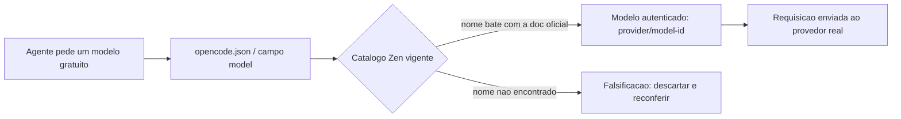

# Capítulo 3: Modelos Gratuitos Sem Lenda: o Catálogo Real Por Trás do Gateway

## 1. Introdução

No Capítulo 2, você autenticou o caminho de configuração fantasma do cache de prompt: o manual auditado apontava para `~/.config/claude-code/settings.json` com um campo `cacheControl` que simplesmente não existe nesse arquivo. Você aprendeu que o real é `~/.claude/settings.json`, sem esse campo, e que o cache de leitura é automático — não um toggle de usuário. Neste capítulo, o mesmo instinto de perito vai examinar um documento mais traiçoeiro: uma lista de modelos gratuitos com nomes que soam profissionais demais para serem verdade.

O caso de hoje envolve o OpenCode Zen, um gateway real de modelos de IA. Isso não é uma fabricação total — é o padrão mais perigoso deste livro: produto real, sintaxe inventada. Como Perito de Configuração Agêntica, você vai aprender a diferença entre confiar no nome de uma empresa (a letra timbrada) e confiar em cada linha da lista de nomes que ela supostamente assina (a assinatura). Ao final, você terá um protocolo repetível para checar qualquer catálogo de modelo antes de colar o nome dele num script de automação.

## 2. Explica

OpenCode é uma IDE Agêntica real, com repositório e documentação públicos, e "Zen" é o nome verdadeiro do gateway de modelos que o próprio time do OpenCode mantém: uma camada curada, com opção gratuita sem exigir cartão de crédito [1]. Até aqui, o manual auditado não errou nada — a ferramenta existe, o nome do gateway existe, e a proposta (acesso gratuito a modelos de terceiros através de um único ponto de entrada) também é real.

O problema aparece na hora de nomear os modelos. O catálogo de modelos gratuitos de um gateway como esse é **rotativo por natureza**: provedores oferecem acesso promocional a modelos novos para ganhar adoção, e essa oferta muda de mês a mês. Levantamentos de terceiros feitos ao vivo confirmam isso na prática — comparações publicadas em datas diferentes de 2026 já mostram catálogos de modelos gratuitos distintos entre si [2], e outro levantamento independente reforça o mesmo padrão de rotatividade [3]. Isso significa uma coisa incômoda para quem escreve documentação estática: qualquer lista de nomes de modelo impressa num manual (ou num livro) tem prazo de validade.

Vale abrir o catálogo por completo para entender o tamanho real da fabricação, porque o gateway não é uma lista plana — ele mistura dois andares na mesma estante. O andar pago reúne modelos de ponta mantidos por grandes laboratórios, com nomes de família reconhecíveis: GPT-5.x, a linha Claude (Opus, Sonnet, Haiku), Gemini 3.x, Grok, Qwen3.x, DeepSeek-v4 e Kimi-k. O andar gratuito rotativo é outro andar: acesso promocional de prazo curto, oferecido pelo laboratório de origem para ganhar adoção antes de cobrar por uso pleno. É nesse segundo andar que moram os nomes reais que deveriam ter substituído a tabela fabricada do manual: "Big Pickle" — descrito por ambos os levantamentos independentes como um modelo stealth voltado a agentes de código —, "MiMo-V2 Flash Free" (modelo aberto publicado pela Xiaomi) e a dupla "Nemotron 3 Super Free"/"Nemotron 3 Ultra Free" (linhagem NVIDIA) [2][3]. Repare no detalhe que denuncia a fabricação por si só: nenhum desses nomes carrega um sufixo de porte (tiny/small/medium/large/xlarge). Cada um carrega a marca do laboratório que o publicou, porque é assim que o catálogo real se organiza — por origem e por janela promocional, nunca por uma escala de tamanho padronizada entre fornecedores diferentes.

É exatamente aqui que mora a diferença entre o real e o fabricado. A configuração de modelo do OpenCode não vive num campo `defaultModel` dentro de um arquivo `config.json` genérico — ela vive no arquivo `opencode.json` (ou `opencode.jsonc`), num campo chamado simplesmente `model`, no formato `provider/model-id` [4]. Não existe `cacheControl` nem `maxTokens` no nível raiz desse schema. Note como esse é o mesmo tipo de erro do Capítulo 2: um caminho de arquivo plausível, com campos que parecem razoáveis, mas que não correspondem a nada que o fornecedor realmente documenta.

O achado central deste capítulo é que a Anthropic documenta o mecanismo real de configuração de modelo do Claude Code de forma parecida — por meio de um arquivo de settings versionável, não de variáveis soltas [5] — e a documentação de cache de prompt da própria Anthropic reforça que a seleção de modelo e o comportamento de cache são coisas tratadas separadamente, cada uma com seu próprio mecanismo documentado [6]. Perceber esse paralelo é o que separa quem só decorou um comando de quem entende a lógica por trás dele.

## 3. Ilustra

Pense no OpenCode Zen como uma escrivaninha de cartório: o balcão existe, o carimbo é real, mas cada nome digitado na lista de "modelos reconhecidos" precisa ser conferido contra o livro de registro oficial antes de virar evidência aceita em qualquer automação. É essa cadeia de custódia — da requisição do seu agente até o `provider/model-id` autenticado — que o diagrama abaixo representa.



Agora, a parte mais densa do caso: por que a tabela de 7 modelos do manual auditado (`opencode-zen-free-tiny/small/medium/large/xlarge/prompt/coder`) não pode ser simplesmente "corrigida" — ela precisa ser jogada fora inteira. Duas analogias ajudam a entender isso em camadas diferentes.

Primeiro, pense em uma carta com **letra timbrada de um cartório real, mas assinatura falsificada**. O timbre é autêntico — o papel, o cartório, o carimbo, tudo bate. Mas a assinatura do funcionário no rodapé foi desenhada por alguém que nunca trabalhou lá. Você não "conserta" essa assinatura comparando com outras cartas do mesmo cartório — você a rejeita inteira, porque não existe versão autêntica dela para recuperar. É o que acontece com `opencode-zen-free-medium`: o cartório (OpenCode Zen) existe, mas nenhum funcionário (modelo) assinou com esse nome.

Segundo, pense num **cardápio de restaurante real com um prato que nunca esteve no cardápio**. O restaurante existe, a mesa existe, o garçom é gentil e anota seu pedido — mas quando a cozinha procura a receita do "file Especial da Casa", ela não existe em lugar nenhum, porque ninguém nunca a criou. Pedir de novo, com um nome ligeiramente diferente, não resolve: o prato inventado não tem receita porque nunca existiu, e a tabela de preço/calorias que alguém imprimiu ao lado dele também nunca podia ser real. É o mesmo raciocínio da tabela de benchmarks (latência, contexto, qualidade) que o manual auditado associou aos 7 nomes fabricados: não há como ajustar os números, porque não há objeto real por trás deles.

O padrão de nomenclatura fabricado (`tiny/small/medium/large/xlarge`) imita convenções reais de porte que você já viu em outros lugares — e é exatamente essa familiaridade que baixa sua guarda. Os nomes reais do catálogo Zen não seguem esse padrão limpo: um levantamento independente publicado em 2026 lista apelidos como "Big Pickle", "Grok Code Fast 1" e "MiMo-V2 Flash Free" entre os modelos gratuitos vigentes [2], e outro guia de comunidade, feito na mesma época, confirma o mesmo catálogo instável incluindo variantes como "Nemotron 3 Free" [3]. Paradoxalmente, a falta de um padrão elegante é um sinal de autenticidade — catálogos reais raramente são tão arrumadinhos quanto uma fabricação.

## 4. Técnica

Como Perito de Configuração Agêntica, sua entrega técnica neste capítulo tem duas partes: a configuração correta do OpenCode apontando para um modelo real, e um protocolo reutilizável de verificação de catálogo — porque o problema que você acabou de investigar não é exclusivo do OpenCode Zen.

### A configuração real: opencode.json

O arquivo `opencode.json` pode viver em `~/.config/opencode/opencode.json` (global) ou na raiz do projeto (`./opencode.json`) [4]. O schema documentado inclui campos como `$schema`, `model`, `agent`, `permission` e `mcp` — não existe `defaultModel`, `cacheControl` nem `maxTokens` no nível raiz [4].

```json
{
  "$schema": "https://opencode.ai/config.json",
  "model": "opencode/big-pickle",
  "agent": {
    "build": {
      "model": "opencode/grok-code-fast-1"
    }
  }
}
```

Note o formato `provider/model-id`: o provedor vem antes da barra, o identificador do modelo vem depois. O nome `big-pickle` usado aqui reflete o catálogo gratuito descrito no levantamento independente já citado [2], e o segundo exemplo (`grok-code-fast-1`) aparece de forma equivalente no guia de comunidade que confirma a mesma safra de modelos rotativos [3] — e é exatamente por isso que o próximo bloco desta seção existe: nomes de modelo gratuito mudam, então essa configuração precisa ser reconferida, não copiada e esquecida.

### O erro que você não vai cometer: config fabricada vs. config real

```bash
# ERRADO — nome de modelo fabricado, imitando o padrao de "porte" do manual auditado.
# opencode.json nao tem campo defaultModel nem cacheControl no nivel raiz.
cat > opencode-errado.json <<'EOF'
{
  "defaultModel": "opencode-zen-free-medium",
  "cacheControl": { "type": "ephemeral" },
  "maxTokens": 4096
}
EOF

# CORRETO — campo real "model", formato provider/model-id confirmado na doc oficial.
cat > opencode-correto.json <<'EOF'
{
  "$schema": "https://opencode.ai/config.json",
  "model": "opencode/big-pickle"
}
EOF

echo "Config fabricada gravada em opencode-errado.json (referencia de erro, nao use)."
echo "Config real gravada em opencode-correto.json."
```

Rodar o arquivo errado contra o OpenCode real não trava seu terminal com uma mensagem clara e didática — ele simplesmente falha ao resolver um modelo que não existe no catálogo, ou é ignorado silenciosamente pelo parser de schema. É esse silêncio que torna a fabricação perigosa: nada grita "isso está errado" até você depender daquele modelo em produção.

### O protocolo de verificação de catálogo (aplicável a qualquer CLI nova)

A causa-raiz do erro deste capítulo não é exclusiva do OpenCode: é nomear um modelo, comando ou campo de configuração **de memória**, em vez de copiar da documentação oficial vigente no momento em que você escreve o script. O checklist abaixo é o que você aplica antes de automatizar qualquer escolha de modelo:

1. Abra a documentação oficial vigente do catálogo — nunca confie em uma tabela impressa num manual antigo ou num post de blog sem data.
2. Copie o `model-id` exato dali, caractere por caractere — não "arredonde" o nome para algo que pareça mais limpo.
3. Registre a data da checagem junto da configuração (comentário no arquivo, ou commit com data no dotfile) — assim, na próxima auditoria, você sabe se aquele nome ainda é válido.
4. Trate qualquer tabela de benchmark "bonita demais" sem link rastreável para a medição original como não verificada até prova em contrário.

Esse protocolo generaliza para qualquer ferramenta Agêntica nova que você adotar, porque cada uma documenta seu próprio mecanismo de configuração de modelo — nenhuma delas usa uma convenção universal:

| Ferramenta | Onde checar o catálogo/config real | Fonte oficial |
|---|---|---|
| Aider | arquivo `~/.aider.conf.yml`, campo de modelo documentado na doc de config | YAML config file [7] |
| Codex CLI | `~/.codex/config.toml`, campos no nível raiz do documento | codex/docs/config.md [8]; Configuration Reference — Codex CLI [9] |
| ccusage | subcomandos reais de medição de uso, não flags inventadas | ccusage [10] |
| agenttrace | pacote real de observabilidade, API própria | agenttrace [11] |
| agentlytics | produto distinto de agenttrace, comandos próprios | agentlytics [12] |
| Ollama | biblioteca de modelos com tags versionadas | ollama/ollama [13] |
| llama.cpp | binário e flags do próprio repositório (ex.: `llama-cli`) | llama.cpp [14] |
| vLLM | subcomando `serve` documentado, flags reais | CLI Reference — serve [15] |
| Hermes Agent | comandos de skill, cron e memória documentados pelo próprio projeto | hermes-agent [16]; CLI Interface — Hermes Agent [17]; Configuration — Hermes Agent [18] |
| Gemini CLI | arquivo de configuração e schema documentados pela Google | gemini-cli [19]; Gemini CLI — Configuration [20] |
| Grok Build | repositório e anúncio oficial do produto | grok-build [21]; Introducing Grok Build [22] |
| chezmoi | subcomandos reais de instalação e operação diária | Install e Daily operations [23] |
| Orca ADE | documentação própria do produto | Orca ADE [24] |

Cada linha dessa tabela representa uma ferramenta que este livro trata em outros capítulos — e em todas elas, o manual auditado errou pelo mesmo motivo: documentou de memória em vez de conferir na fonte no momento da escrita.

### Detectando quando o catálogo mudou

A mesma técnica de hash usada no capítulo anterior para detectar mudança no `CLAUDE.md` serve para sinalizar quando uma página de catálogo mudou e precisa ser reconferida:

```bash
#!/usr/bin/env bash
# verificar-catalogo.sh — sinaliza quando a pagina de doc do catalogo mudou
# desde a ultima checagem, para voce reconferir o nome do modelo antes de usar.
set -euo pipefail

URL="https://opencode.ai/docs/zen/"
CACHE_DIR="$HOME/.cache/pericia-catalogo"
HASH_FILE="$CACHE_DIR/opencode-zen.sha256"

mkdir -p "$CACHE_DIR"

hash_atual=$(curl -fsSL "$URL" | sha256sum | awk '{print $1}')

if [[ -f "$HASH_FILE" ]]; then
  hash_anterior=$(cat "$HASH_FILE")
  if [[ "$hash_atual" != "$hash_anterior" ]]; then
    echo "ALERTA: o catalogo do OpenCode Zen mudou desde a ultima checagem."
    echo "Reconfira os model-id antes de publicar ou automatizar."
  else
    echo "Catalogo sem mudanca detectada desde a ultima checagem."
  fi
else
  echo "Primeira checagem registrada."
fi

echo "$hash_atual" > "$HASH_FILE"
```

Esse script não substitui a leitura humana da documentação — ele só evita que você confie numa cópia mental desatualizada. O sinal de "mudou" é o gatilho para voltar ao passo 1 do checklist, nunca para presumir que o nome antigo ainda funciona.

### Bônus: o script de benchmark que já estava certo

Nem tudo no laudo do manual auditado é fabricação. A tabela de latência/contexto/qualidade por modelo é irrecuperável — já vimos por quê —, mas a técnica de cronometragem usada para medir essa latência é engenharia genérica válida, e vale reaproveitá-la depois de trocar os nomes de modelo pelos reais. O princípio é simples: capturar um timestamp em nanossegundos antes e depois da chamada, e calcular a diferença em milissegundos.

```bash
#!/usr/bin/env bash
# benchmark-model.sh -- mede a latencia real de uma chamada a um model-id do
# catalogo Zen. A tecnica de cronometragem (date +%s%N, nanossegundos) e
# generica e valida -- o erro do manual auditado nunca foi o cronometro,
# foi aplicar essa tecnica a nomes de modelo que nao existem [2][3].
set -euo pipefail

MODELO="${1:?informe um model-id conferido em opencode.ai/docs/zen/}"  # ex.: opencode/big-pickle [1]
PROMPT="${2:-Explique em uma frase o que e cache semantico.}"

chamada_ao_modelo() {
  # Substitua esta funcao pela chamada real ao SDK ou ao endpoint HTTP
  # autenticado do seu gateway -- este script nao inventa uma sintaxe de CLI
  # que o OpenCode nao documenta.
  echo "[integre aqui a chamada real ao modelo $MODELO]"
}

inicio_ns=$(date +%s%N)
resposta=$(chamada_ao_modelo)
fim_ns=$(date +%s%N)

latencia_ms=$(( (fim_ns - inicio_ns) / 1000000 ))
echo "Modelo testado: $MODELO"
echo "Latencia medida: ${latencia_ms}ms"
echo "Resposta: $resposta"
```

A lição para o seu protocolo de perícia é dupla: descartar a tabela fabricada não significa descartar a metodologia de medição por trás dela. Uma tabela de benchmark só vira evidência aceita quando (a) o modelo citado existe no catálogo vigente, checado pelo protocolo acima, e (b) o número foi de fato produzido por um script como este, rodado contra a chamada real — nunca estimado de memória e formatado para parecer uma medição.

## 5. Aplica

Imagine a cena: é sexta-feira à tarde, você está automatizando um script de fallback que troca o modelo do seu agente quando o principal está sobrecarregado, e lembra de ter visto, num manual salvo há meses, uma lista de nomes de modelo gratuitos "tiny/small/medium/large". Você cola `opencode-zen-free-medium` direto no `opencode.json`, sem abrir a documentação, porque o nome parece exatamente com o tipo de convenção que outras ferramentas usam.

O erro acontece assim: o script roda, o parser de config não reconhece nenhum modelo com esse identificador, e a chamada cai num comportamento indefinido — silêncio, erro genérico de provedor, ou pior, uma resposta de um modelo default que você nunca escolheu conscientemente. Você perde tempo depurando um "bug de rede" que na verdade é um nome de modelo que nunca existiu.

O diagnóstico, à luz da seção Explica: você tratou um nome fabricado como se fosse autenticado só porque o produto por trás dele (OpenCode Zen) é real. É exatamente o padrão "letra timbrada real, assinatura falsificada" da seção Ilustra — o erro mais perigoso, porque o nome do gateway te deu confiança emprestada.

A correção é o protocolo do checklist: você abre `opencode.ai/docs/zen/` [1], confirma o `model-id` vigente naquele momento, atualiza o campo `model` do seu `opencode.json` com o valor exato copiado dali, e registra a data da checagem num comentário do commit. Da próxima vez que o script de fallback disparar, ele aponta para um modelo que de fato existe.

Armadilhas comuns que reforçam essa cena, para revisar rapidamente:

- Confiar em tabelas de benchmark encontradas em posts sem link para a medição original — trate como não verificado até achar a fonte primária.
- Presumir que uma convenção de nome "bonita" (tiny/small/medium) é sinal de autenticidade — muitas vezes é o oposto.
- Automatizar a escolha de modelo sem registrar a data da última checagem de catálogo — sem isso, você não sabe quando reconferir.

Resumindo a cena inteira em par de erro e correção, para consulta rápida na próxima vez que você configurar um fallback:

| Situação | Prática errada (o que causou o incidente) | Prática correta (o protocolo deste capítulo) |
|---|---|---|
| Nome de modelo no `opencode.json` | Colar `opencode-zen-free-medium` de memória, confiando no nome do gateway | Copiar o `model-id` exato de `opencode.ai/docs/zen/` [1] no momento do uso |
| Tabela de benchmark associada | Aceitar latência/contexto/qualidade "bonitos demais" sem link para a medição | Rodar o script de cronometragem da seção Técnica contra o modelo real |
| Validade da configuração | Tratar a lista de nomes como permanente, sem data de checagem | Registrar a data da checagem junto do commit e reconferir a cada rotação |

Como Perito de Configuração Agêntica, seu trabalho não termina em identificar a fabricação uma vez — é manter o hábito de reconferência, porque o catálogo de amanhã não é o catálogo de hoje.

## 6. Conclusão

Você fechou a perícia do Capítulo 3 com três achados: o OpenCode Zen é um gateway real e gratuito de modelos, mas os 7 nomes `opencode-zen-free-*` do manual auditado são fabricados e sua tabela de specs é irrecuperável — não há como corrigi-la, só descartá-la e reconferir no catálogo vigente; e o protocolo de verificação que você construiu (checar a fonte oficial, copiar o `model-id` exato, registrar a data, desconfiar de benchmark sem link rastreável) se aplica a qualquer CLI Agêntica nova que cruzar seu caminho, não só ao OpenCode.

Como desafio, escolha uma ferramenta Agêntica que você usa hoje e rode o checklist completo nela: abra a doc oficial, confirme o nome exato do modelo ou comando que você usa de memória, e anote a data da checagem. No Capítulo 4, você vai aplicar essa mesma lupa a bibliotecas de compressão e cache semântico — onde o erro muda de forma: não é mais nome de modelo fabricado, é comando de terminal inventado para uma biblioteca que nunca teve interface de linha de comando.

## 7. Referências Bibliográficas

[1] OPENCODE. *Zen*. Disponível em: https://opencode.ai/docs/zen/. Acesso em: 20 ago. 2026.

[2] MAXIMAL STUDIO. *OpenCode Zen Free Models 2026: Every Free Provider and How to Use Them*. Disponível em: https://www.maximalstudio.in/blog/opencode-zen-free-models. Acesso em: 20 ago. 2026.

[3] BSWEN. *What Free AI Models Are Available in OpenCode and Which One Should You Use*. Disponível em: https://docs.bswen.com/blog/2026-04-21-free-models-opencode/. Acesso em: 20 ago. 2026.

[4] OPENCODE. *Config*. Disponível em: https://opencode.ai/v2/docs/config. Acesso em: 20 ago. 2026.

[5] ANTHROPIC. *Claude Code settings*. Disponível em: https://code.claude.com/docs/en/settings. Acesso em: 20 ago. 2026.

[6] ANTHROPIC. *Prompt caching*. Disponível em: https://platform.claude.com/docs/en/build-with-claude/prompt-caching. Acesso em: 20 ago. 2026.

[7] AIDER. *YAML config file*. Disponível em: https://aider.chat/docs/config/aider_conf.html. Acesso em: 20 ago. 2026.

[8] OPENAI. *codex/docs/config.md*. Disponível em: https://github.com/openai/codex/blob/main/docs/config.md. Acesso em: 20 ago. 2026.

[9] OPENAI. *Configuration Reference — Codex CLI*. Disponível em: https://developers.openai.com/codex/config-basic. Acesso em: 20 ago. 2026.

[10] RYOPPIPPI. *ccusage: A CLI tool for analyzing Claude Code/Codex CLI usage from local JSONL files*. Disponível em: https://github.com/ryoppippi/ccusage. Acesso em: 20 ago. 2026.

[11] TENSORSTAX. *agenttrace: lightweight observability library to trace and evaluate agentic systems*. Disponível em: https://github.com/tensorstax/agenttrace. Acesso em: 20 ago. 2026.

[12] F. *agentlytics: Comprehensive analytics dashboard for AI coding agents*. Disponível em: https://github.com/f/agentlytics. Acesso em: 20 ago. 2026.

[13] OLLAMA. *ollama/ollama*. Disponível em: https://github.com/ollama/ollama. Acesso em: 20 ago. 2026.

[14] GGML-ORG. *llama.cpp*. Disponível em: https://github.com/ggml-org/llama.cpp. Acesso em: 20 ago. 2026.

[15] VLLM PROJECT. *CLI Reference — serve*. Disponível em: https://docs.vllm.ai/en/stable/cli/serve/. Acesso em: 20 ago. 2026.

[16] NOUSRESEARCH. *hermes-agent*. Disponível em: https://github.com/NousResearch/hermes-agent. Acesso em: 20 ago. 2026.

[17] NOUSRESEARCH. *CLI Interface — Hermes Agent*. Disponível em: https://hermes-agent.nousresearch.com/docs/user-guide/cli. Acesso em: 20 ago. 2026.

[18] NOUSRESEARCH. *Configuration — Hermes Agent*. Disponível em: https://hermes-agent.nousresearch.com/docs/user-guide/configuration. Acesso em: 20 ago. 2026.

[19] GOOGLE-GEMINI. *gemini-cli*. Disponível em: https://github.com/google-gemini/gemini-cli. Acesso em: 20 ago. 2026.

[20] GOOGLE. *Gemini CLI — Configuration*. Disponível em: https://geminicli.com/docs/reference/configuration/. Acesso em: 20 ago. 2026.

[21] XAI-ORG. *grok-build*. Disponível em: https://github.com/xai-org/grok-build. Acesso em: 20 ago. 2026.

[22] XAI. *Introducing Grok Build*. Disponível em: https://x.ai/news/grok-build-cli. Acesso em: 20 ago. 2026.

[23] CHEZMOI. *Install* e *Daily operations*. Disponível em: https://www.chezmoi.io/install/. Acesso em: 20 ago. 2026.

[24] ORCA. *Orca ADE*. Disponível em: https://www.onorca.dev/. Acesso em: 20 ago. 2026.
