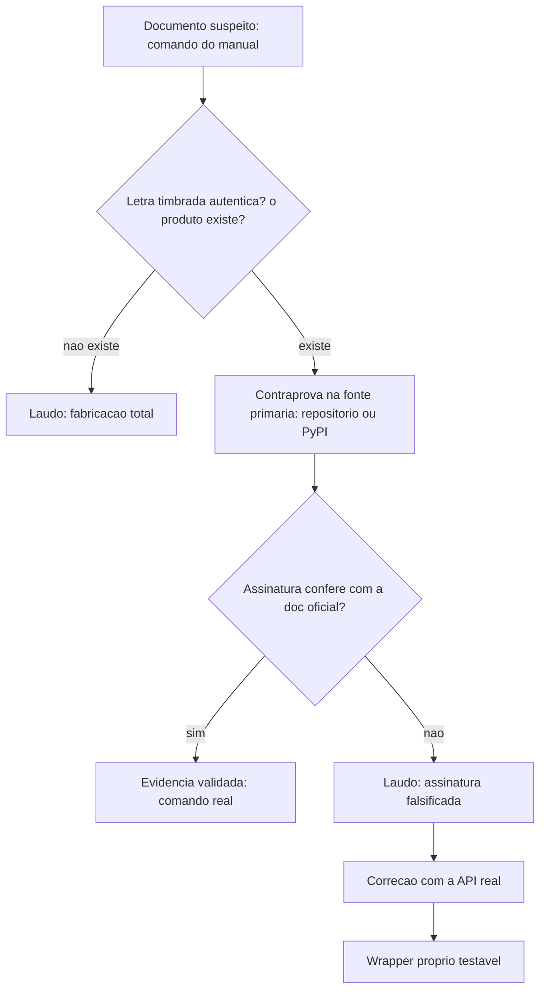

# Capítulo 4: Compressão e Cache Semântico Sob a Lupa: Bibliotecas, Não Comandos

## 1. Introdução

No Capítulo 3, você já aplicou o protocolo de verificação de catálogo para desmontar a tabela de sete modelos gratuitos que o manual atribuía ao gateway OpenCode Zen — nomes plausíveis, especificações bem formatadas, e nenhuma correspondência real no catálogo vigente [1]. A composição desse catálogo muda de nome e de oferta com frequência, o que a cobertura especializada do próprio ecossistema já registrou em mais de uma ocasião [2][3]. Você aprendeu, ali, que uma tabela pode ter toda a aparência de um laudo técnico e ainda assim ser ficção com formatação de fato: a autópsia da tabela fabricada mostrou que basta um nome convincente para destravar a confiança de quem só olha por cima.

Neste capítulo você aponta a mesma lente forense para um alvo mais traiçoeiro. LLMLingua, da Microsoft Research, e GPTCache, da Zilliztech, são duas bibliotecas Python que **existem de verdade** — mas a forma como o manual descreve seu uso tem letra timbrada real (o nome do pacote é genuíno) e assinatura falsificada (a API e a CLI descritas nunca existiram). Como Perito de Configuração Agêntica, você vai confirmar a classe certa, o parâmetro certo, e sair deste capítulo com dois artefatos próprios — um wrapper de compressão de prompt e um hook de cache semântico — inteiramente construídos sobre a API real, testável linha a linha.

## 2. Explica

Compressão de prompt ataca o problema da economia de tokens por outro ângulo do que o cache de prompt que você já periciou no Capítulo 2. Lembre que ali você confirmou que o cache de leitura da Anthropic só se aplica a partir de 1024 tokens de prefixo idêntico [4] — compressão de prompt não depende de repetição alguma: ela reduz o próprio texto enviado ao modelo, preservando o essencial do significado antes mesmo de a chamada sair da sua máquina. O projeto oficial LLMLingua, mantido pela Microsoft Research e publicado em conferências revisadas por pares (EMNLP 2023 e ACL 2024), documenta compressões de **até 20 vezes** sobre o prompt original, com perda mínima de desempenho em tarefas de raciocínio [5][6]. É esse teto oficial — não os percentuais soltos por categoria de conteúdo que o manual tabula sem nenhuma fonte por trás — que este capítulo usa como métrica de referência.

Cache semântico ataca um terceiro problema, diferente dos dois anteriores. Perguntas diferentes na forma, mas equivalentes no significado, hoje disparam duas chamadas completas e pagas ao modelo. O GPTCache resolve isso guardando pares de pergunta-resposta como vetores de embedding e comparando a distância semântica da nova pergunta contra o que já foi respondido antes: se a distância ficar abaixo de um limiar configurado, a resposta arquivada é devolvida sem gerar uma nova chamada [7]. Na prática, é memória associativa — não é preciso perguntar palavra por palavra igual para reaproveitar uma resposta já dada.

Vale fixar o padrão antes de seguir: cada ferramenta que você já periciou neste livro tem a sua própria superfície real de configuração, e nenhuma delas se parece com a das outras. O Aider expõe cache real através da flag `--cache-prompts` no seu `~/.aider.conf.yml` [8], documentada ao lado de pings periódicos para manter o cache "quente" [9]. O Codex CLI grava seus campos reais de modelo no nível raiz do `~/.codex/config.toml`, não numa seção `[codex]` inventada [10][11]. O OpenCode versiona um catálogo de modelos gratuitos que muda de composição com o tempo, sob o arquivo real `opencode.json` [12][1]. Nenhuma dessas três superfícies parece com a de LLMLingua ou GPTCache — porque nenhuma das duas é uma ferramenta de configuração: são bibliotecas.

A causa raiz do erro do manual, nos dois casos, é a mesma, e é o núcleo deste capítulo: **um pacote instalável não é sinônimo de um comando de terminal**. `pip install llmlingua` e `pip install gptcache` instalam bibliotecas Python — código para você **importar** dentro de um script próprio — e não ferramentas com interface de linha de comando completa. Isso não é uma falha de design das duas bibliotecas: é uma escolha legítima e comum em boa parte do ecossistema Python de machine learning, o mesmo padrão, aliás, que separa o `pip install llmlingua` de um utilitário como o `ccusage`, que de fato expõe subcomandos de terminal reais porque foi construído para isso desde o início [13]. O manual erra ao tratar LLMLingua e GPTCache como utilitários de terminal completos, com subcomandos, flags e arquivos de configuração externos — nenhum dos quais existe [5][7].

## 3. Ilustra

Pense num laudo pericial que precisa caber numa única lauda: você não reescreve o depoimento inteiro, extrai só o que sustenta a conclusão e descarta o floreio — isso é compressão de prompt. E pense em duas testemunhas que contam praticamente a mesma história com palavras diferentes: um perito experiente reconhece que é o mesmo fato e não abre um segundo processo do zero — isso é cache semântico. As duas técnicas fazem o trabalho pericial de menos texto processado gerar a mesma conclusão.

O ponto mais traiçoeiro deste capítulo, porém, exige uma segunda analogia. Rodar `pipx install llmlingua` é como receber uma caixa lacrada, com etiqueta oficial e nota fiscal legítima, mas que guarda peças soltas de reposição — não uma ferramenta pronta para pegar da prateleira e usar. O `pipx` monta uma prateleira isolada esperando encontrar, dentro da caixa, um executável já pronto (o que o ecossistema Python chama de *entry point* de console). Quando a caixa só contém peças importáveis — como é o caso de LLMLingua e GPTCache — a prateleira fica perfeitamente instalada e completamente vazia de qualquer coisa que você possa digitar no terminal. Nada quebrou; simplesmente não havia ferramenta de terminal ali para começo de conversa.



## 4. Técnica

### A Classe Certa: PromptCompressor em Vez de Llmlingua

O manual descreve `from llmlingua import Llmlingua; Llmlingua().compress_prompt(prompt, preservation_rate=0.5)`. Rode isso e você recebe um `ImportError` na primeira linha: a classe exportada pelo pacote real chama-se `PromptCompressor`, e o parâmetro do método `compress_prompt` é `rate` — não `preservation_rate` [5][6]. "LongLLMLingua", citado pelo manual como um pacote separado (`pipx install longllmlingua`), também não existe como distribuição própria: é um modo de uso da mesma classe, ativado pelo parâmetro `rank_method="longllmlingua"`, pensado para reordenar contexto longo e mitigar o efeito de "perder informação no meio do prompt" [5].

```python
#!/usr/bin/env python3
"""compress_prompt.py -- wrapper real de compressao de prompt via LLMLingua.

O manual descreve `Llmlingua().compress_prompt(prompt, preservation_rate=0.5)`
e uma CLI `python -m llmlingua --preserve`. Nenhuma das duas existe: a classe
real e o parametro real sao outros -- ver [5][6].

Uso:
    python compress_prompt.py --rate 0.5 < prompt_bruto.txt > prompt_comprimido.txt
Requisito:
    pip install llmlingua
"""
import argparse
import sys

from llmlingua import PromptCompressor  # classe real; nao "Llmlingua"


def comprimir(texto: str, rate: float, contexto_longo: bool = False) -> dict:
    """Comprime um prompt usando a API real do LLMLingua."""
    compressor = PromptCompressor()
    kwargs = {"rate": rate}
    if contexto_longo:
        # LongLLMLingua nao e pacote separado: e este parametro do metodo real [5]
        kwargs["rank_method"] = "longllmlingua"
    return compressor.compress_prompt(texto, **kwargs)


def main() -> int:
    parser = argparse.ArgumentParser(
        description="Comprime um prompt via LLMLingua (API real, sem CLI oficial)."
    )
    parser.add_argument("--rate", type=float, default=0.5,
                         help="fracao de tokens a preservar, 0 a 1")
    parser.add_argument("--contexto-longo", action="store_true",
                         help="ativa o modo longllmlingua para prompts extensos")
    args = parser.parse_args()

    bruto = sys.stdin.read()
    if not bruto.strip():
        print("erro: nenhum prompt recebido via stdin", file=sys.stderr)
        return 1

    resultado = comprimir(bruto, args.rate, args.contexto_longo)
    print(resultado["compressed_prompt"])

    origem = resultado["origin_tokens"]
    final = resultado["compressed_tokens"]
    economia = 1 - (final / origem) if origem else 0
    print(f"# economia: {economia:.1%} ({origem} -> {final} tokens)", file=sys.stderr)
    return 0


if __name__ == "__main__":
    raise SystemExit(main())
```

### Por Que pipx Não Cria um Comando Que Não Existe

Antes de escrever o hook de cache, vale fechar o diagnóstico do Pilar 2. `pipx` foi desenhado para instalar **CLIs isoladas** — pacotes que declaram um *entry point* de console no seu empacotamento. Quando você roda `pipx install llmlingua`, a instalação termina sem erro (o pacote é real e válido), mas nenhum comando novo aparece no seu `PATH`, porque o próprio pacote nunca declarou um. É por isso que `python -m llmlingua --help` também falha: não há um `__main__.py` documentado que responda por essa chamada [5][6]. Compare com `ccusage`, que expõe de fato subcomandos de terminal (`daily`, `weekly`, `session`) porque foi construído desde o início como ferramenta de linha de comando, distribuída via npm — não Python [13]. Esse mesmo comportamento de CLI real, com subcomandos documentados e reconhecíveis, é descrito de forma independente por quem usa a ferramenta no dia a dia [14]. A diferença não é sobre qual gerenciador de pacote você usa; é sobre o que o pacote se propôs a ser.

### O Hook de Cache Semântico Completo (semantic_cache.py)

O mesmo padrão de erro se repete no GPTCache, em escala maior: o manual descreve subcomandos `gptcache init/list/add/query/stats/clear` e um arquivo `~/.gptcache/config.yaml`. Nenhum dos dois existe. A configuração real é inteiramente programática — você monta o cache dentro do seu próprio script Python, com `cache.init(...)` e um objeto `Config`, e o único processo de linha de comando real do projeto é o `gptcache_server`, que sobe um servidor HTTP com endpoints `/put` e `/get` — não uma CLI de gestão do cache [7].

```python
"""semantic_cache.py -- hook real de cache semantico via GPTCache.

O manual descreve `gptcache init/list/add/query/stats/clear` como CLI e um
arquivo `~/.gptcache/config.yaml`. Nenhum dos dois existe: a configuracao do
GPTCache e inteiramente programatica [7].
"""
from gptcache import cache
from gptcache.manager import get_data_manager, CacheBase, VectorBase
from gptcache.embedding import Onnx
from gptcache.similarity_evaluation.distance import SearchDistanceEvaluation
from gptcache.adapter.api import get, put

_onnx = Onnx()
_data_manager = get_data_manager(
    CacheBase("sqlite"),
    VectorBase("faiss", dimension=_onnx.dimension),
)


def inicializar(limiar_similaridade: float = 0.8) -> None:
    """Substitui o YAML fabricado por chamadas reais de inicializacao [7]."""
    cache.init(
        embedding_func=_onnx.to_embeddings,
        data_manager=_data_manager,
        similarity_evaluation=SearchDistanceEvaluation(),
    )
    cache.config.similarity_threshold = limiar_similaridade


def consultar_ou_gerar(pergunta: str, gerar_resposta) -> str:
    """Consulta o cache semantico; so chama o modelo se nao houver hit."""
    resposta_em_cache = get(pergunta)
    if resposta_em_cache is not None:
        return resposta_em_cache

    resposta = gerar_resposta(pergunta)
    put(pergunta, resposta)
    return resposta


if __name__ == "__main__":
    inicializar(limiar_similaridade=0.8)

    def chamada_simulada(pergunta: str) -> str:
        return f"resposta gerada para: {pergunta}"

    print(consultar_ou_gerar("como configurar cache de prompt no claude code", chamada_simulada))
```

### A Segunda Forma Real de Configurar o Limiar: Objeto Config

O `semantic_cache.py` acima seta o limiar de similaridade depois do `init`, via `cache.config.similarity_threshold`. Essa não é a única forma documentada — existe uma segunda, igualmente real, que passa um objeto `Config` já na chamada de inicialização, útil quando você quer declarar todos os parâmetros num único lugar em vez de configurar atributo por atributo depois [7]:

```python
from gptcache import cache
from gptcache.config import Config

cache.init(
    embedding_func=_onnx.to_embeddings,
    data_manager=_data_manager,
    similarity_evaluation=SearchDistanceEvaluation(),
    config=Config(similarity_threshold=0.8),  # forma alternativa, mesmo efeito
)
```

Note o que **não** existe em nenhuma das duas formas: um parâmetro `namespace` no construtor do cache, como o manual descreve em `gptcache.GPTCache(namespace=..., similarity_threshold=...)`. A classe exportada pelo pacote real chama-se `Cache`, não `GPTCache`, e ela não nasce pronta — é inicializada através do método `.init(...)` mostrado acima [7]. Confundir a classe com o namespace do seu projeto é outro sintoma do mesmo padrão de erro: nomear um parâmetro que soa razoável, sem checar a assinatura real do método.

### O Modo Servidor: gptcache_server, Para Quando Você Não Quer Embutir o Cache no Script

O `semantic_cache.py` roda o cache **dentro** do processo Python que faz as chamadas ao modelo — é o padrão certo quando um único script ou serviço concentra todo o tráfego. Mas o GPTCache também documenta um segundo modo de operação, para quando vários clientes (potencialmente em linguagens diferentes) precisam compartilhar o mesmo cache: o binário `gptcache_server`, que sobe um servidor HTTP com endpoints `/put` e `/get` [7].

```bash
# unico binario real de linha de comando do projeto -- nao existem os
# subcomandos init/list/add/query/stats/clear que o manual descreve [7].
gptcache_server -s 127.0.0.1 -p 8000
```

Antes de integrar esse modo servidor num pipeline de produção, confira o schema exato de payload dos endpoints `/put` e `/get` na documentação oficial do projeto [7] — este capítulo confirma que o binário e as duas rotas existem, mas não fixa aqui o corpo exato da requisição, para não repetir o mesmo erro que está corrigindo: publicar uma sintaxe sem conferência direta na fonte.

### Onde Isso Se Encaixa na Cadeia Real de Hooks

O manual também erra o mecanismo de disparo automático: ele descreve um arquivo separado `~/.config/claude-code/hooks.json` com um campo `preProcess`. Isso não existe. Hooks reais do Claude Code vivem dentro do mesmo `~/.claude/settings.json` que você já periciou no Capítulo 2, sob a chave `hooks`, associados a eventos documentados como `PreToolUse`, `PostToolUse`, `SessionStart` e `Stop` [15][16]. Para acionar o `semantic_cache.py` antes de uma ferramenta específica rodar, a configuração fica assim:

```json
{
  "hooks": {
    "PreToolUse": [
      {
        "matcher": "*",
        "hooks": [
          { "type": "command", "command": "python3 /caminho/semantic_cache.py" }
        ]
      }
    ]
  }
}
```

Não existe evento `preProcess`, nem arquivo `hooks.json` isolado — a evidência aceita é o par chave/evento documentado oficialmente [15][16].

### Blindando o Wrapper Contra Falha em Cascata

Um cache semântico que depende de gerar embeddings a cada consulta introduz um novo ponto de falha: se o provedor de embeddings ficar lento ou indisponível, cada chamada de `consultar_ou_gerar` pode travar em série. O padrão de engenharia correto — que você vai formalizar por completo no Capítulo 5 — é envolver a chamada de geração num backoff exponencial com jitter, para não amplificar um rate limit já em curso [17], e, em produção, um circuit breaker que interrompe novas tentativas depois de falhas consecutivas em vez de insistir indefinidamente [18]. Se o seu wrapper precisar consultar várias perguntas ao mesmo tempo, o mecanismo real para paralelizar sem estourar limite de concorrência é `asyncio.gather` com um `asyncio.Semaphore` [19] — o mesmo princípio por trás de um `xargs -P`/GNU parallel na linha de comando [20], que você também vai auditar formalmente no próximo capítulo. Nenhum desses padrões depende de sintaxe fabricada — são práticas de resiliência amplamente documentadas, prontas para plugar em cima do `gerar_resposta` do wrapper acima.

### Observando o Resultado em Produção

Depois de trocar a CLI fabricada pela API real, ainda falta medir se a compressão e o cache estão de fato economizando tokens. Para isso, instrumente o wrapper com uma lib de observabilidade real, como o `agenttrace` [21] — sem confundi-la com o `agentlytics`, que é outro produto, de outro ecossistema (npm, não PyPI), focado num painel de custo por IDE, não em tracing de chamadas [22]. São dois nomes parecidos e dois laudos diferentes — a mesma armadilha de confusão categorial que você já viu no Capítulo 3.

## 5. Aplica

Você decide seguir o manual à risca. Abre o terminal, roda `pipx install llmlingua`, e a instalação termina em segundos, sem nenhum erro visível. Animado, você digita `python -m llmlingua --help` esperando ver a lista de flags prometida — e recebe `No module named llmlingua.__main__`. Você tenta de novo com `llmlingua --help` puro: `command not found`. A reação mais comum, nesse ponto, é concluir que a instalação falhou silenciosamente, ou que falta alguma variável de ambiente. Nenhuma das duas coisas é verdade.

O diagnóstico correto é o que você já viu na seção Técnica: `pipx` fez exatamente o que deveria fazer — instalou o pacote real, isolado, sem conflito com outras dependências. O que faltava nunca existiu: LLMLingua não declara um *entry point* de console, então não há comando de terminal para "aparecer". A correção não é reinstalar nem depurar o `PATH` — é abandonar a expectativa de CLI e escrever o wrapper `compress_prompt.py` que você acabou de construir, importando `PromptCompressor` dentro do seu próprio script Python. O mesmo raciocínio vale, ponto a ponto, para `gptcache init` e para o restante da lista de subcomandos fabricados: a correção é sempre a mesma classe de ação — trocar a expectativa de CLI pela chamada de API real.

Essa técnica tem limites que você precisa declarar antes de colocá-la em produção. A compressão do LLMLingua preserva o significado geral do texto, não a sintaxe exata: em prompts que colam trechos de código-fonte, caminhos de arquivo ou identificadores exatos, uma taxa agressiva (`rate` abaixo de 0.3, por exemplo) pode cortar justamente o token que carregava a informação crítica. Para esse tipo de prompt, mantenha uma taxa mais conservadora (0.6 a 0.8) ou comprima apenas a prosa ao redor do bloco de código, preservando o bloco intacto. O cache semântico tem uma fronteira diferente: ele escala bem para bases de perguntas recorrentes — documentação interna, comandos repetidos, dúvidas de suporte — mas quebra quando cada pergunta feita ao sistema é genuinamente única. Nesse regime, o custo de gerar um embedding e consultar o índice FAISS a cada chamada passa a superar a economia de nunca ter um cache hit, porque não há repetição semântica nenhuma para explorar.

Isso também esclarece uma dúvida prática que fica em aberto depois de ler a seção Técnica: quando escolher `cache.init()` embutido em vez do `gptcache_server`? A resposta é sobre topologia, não sobre qual dos dois é "mais real" — os dois são [7]. Se um único processo Python concentra todas as chamadas ao modelo, embuta o cache no próprio script, como em `semantic_cache.py`: menos uma peça de infraestrutura para operar. Se múltiplos serviços, possivelmente em linguagens diferentes, precisam consultar o mesmo cache compartilhado, o `gptcache_server` isola essa responsabilidade atrás de um endpoint HTTP comum — o preço é mais uma peça rodando e mais uma rede a monitorar.

### Exercício
- [ ] Rode `pip show llmlingua` no seu ambiente e confirme que não aparece nenhum "Console Scripts" na saída
- [ ] Escreva e teste `compress_prompt.py` com um prompt real de pelo menos 500 tokens, comparando o texto antes e depois
- [ ] Inicialize `cache.init()` do GPTCache localmente e force um cache hit repetindo a mesma pergunta duas vezes seguidas
- [ ] Ajuste `similarity_threshold` para 0.9 e depois para 0.6 e registre a diferença de comportamento em duas perguntas parecidas, mas não idênticas
- [ ] Suba `gptcache_server -s 127.0.0.1 -p 8000` localmente e confirme, consultando a doc oficial [7], o schema de payload real dos endpoints `/put` e `/get` antes de integrá-lo a qualquer script

## 6. Conclusão

Você fechou este capítulo com três evidências assentadas: a classe real por trás de uma API inventada (`PromptCompressor`, não `Llmlingua`), o motivo técnico exato pelo qual instalar uma biblioteca com `pipx` não cria magicamente um comando de terminal, e dois artefatos próprios — `compress_prompt.py` e `semantic_cache.py` — construídos sobre a API real do LLMLingua e do GPTCache, prontos para rodar sem depender de nenhum subcomando fabricado. O padrão que você reconheceu aqui é o mesmo do Capítulo 3, aplicado a um nível mais fino: produto real, sintaxe inventada, e a única defesa é a contraprova direta na fonte primária.

No Capítulo 5, você leva a perícia para outro terreno: paralelismo e resiliência, onde o manual finalmente acerta quase tudo — e você vai entender por quê, formalizando o backoff exponencial e o circuit breaker que só foram mencionados de passagem aqui.

## 7. Referências Bibliográficas

[1] OPENCODE. *Zen*. Disponível em: https://opencode.ai/docs/zen/. Acesso em: 20 ago. 2026.

[2] BSWEN. *What Free AI Models Are Available in OpenCode and Which One Should You Use*. Disponível em: https://docs.bswen.com/blog/2026-04-21-free-models-opencode/. Acesso em: 20 ago. 2026.

[3] MAXIMAL STUDIO. *OpenCode Zen Free Models 2026: Every Free Provider and How to Use Them*. Disponível em: https://www.maximalstudio.in/blog/opencode-zen-free-models. Acesso em: 20 ago. 2026.

[4] ANTHROPIC. *Prompt caching*. Disponível em: https://platform.claude.com/docs/en/build-with-claude/prompt-caching. Acesso em: 20 ago. 2026.

[5] MICROSOFT. *LLMLingua* (repositório oficial). Disponível em: https://github.com/microsoft/LLMLingua. Acesso em: 20 ago. 2026.

[6] PYTHON PACKAGE INDEX. *llmlingua*. Disponível em: https://pypi.org/project/llmlingua/. Acesso em: 20 ago. 2026.

[7] ZILLIZTECH. *GPTCache: A Library for Creating Semantic Cache for LLM Queries* (docs/usage.md). Disponível em: https://github.com/zilliztech/GPTCache/blob/main/docs/usage.md. Acesso em: 20 ago. 2026.

[8] AIDER. *Prompt caching*. Disponível em: https://aider.chat/docs/usage/caching.html. Acesso em: 20 ago. 2026.

[9] AIDER. *YAML config file*. Disponível em: https://aider.chat/docs/config/aider_conf.html. Acesso em: 20 ago. 2026.

[10] OPENAI. *Configuration Reference — Codex CLI*. Disponível em: https://developers.openai.com/codex/config-basic. Acesso em: 20 ago. 2026.

[11] OPENAI. *codex/docs/config.md*. Disponível em: https://github.com/openai/codex/blob/main/docs/config.md. Acesso em: 20 ago. 2026.

[12] OPENCODE. *Config*. Disponível em: https://opencode.ai/v2/docs/config. Acesso em: 20 ago. 2026.

[13] RYOPPIPPI. *ccusage: A CLI tool for analyzing Claude Code/Codex CLI usage from local JSONL files*. Disponível em: https://github.com/ryoppippi/ccusage. Acesso em: 20 ago. 2026.

[14] CLAUDELOG. *What is ccusage tool for Claude Code*. Disponível em: https://claudelog.com/faqs/what-is-ccusage-tool/. Acesso em: 20 ago. 2026.

[15] ANTHROPIC. *Claude Code settings*. Disponível em: https://code.claude.com/docs/en/settings. Acesso em: 20 ago. 2026.

[16] ANTHROPIC. *Hooks reference*. Disponível em: https://code.claude.com/docs/en/hooks. Acesso em: 20 ago. 2026.

[17] AMAZON WEB SERVICES. *Timeouts, retries and backoff with jitter — Builders' Library*. Disponível em: https://aws.amazon.com/builders-library/timeouts-retries-and-backoff-with-jitter/. Acesso em: 20 ago. 2026.

[18] MICROSOFT. *Circuit Breaker pattern — Azure Architecture Center*. Disponível em: https://learn.microsoft.com/en-us/azure/architecture/patterns/circuit-breaker. Acesso em: 20 ago. 2026.

[19] PYTHON SOFTWARE FOUNDATION. *asyncio — Asynchronous I/O*. Disponível em: https://docs.python.org/3/library/asyncio.html. Acesso em: 20 ago. 2026.

[20] GNU. *GNU Parallel*. Disponível em: https://www.gnu.org/software/parallel/. Acesso em: 20 ago. 2026.

[21] TENSORSTAX. *agenttrace: lightweight observability library to trace and evaluate agentic systems*. Disponível em: https://github.com/tensorstax/agenttrace. Acesso em: 20 ago. 2026.

[22] F. *agentlytics: Comprehensive analytics dashboard for AI coding agents*. Disponível em: https://github.com/f/agentlytics. Acesso em: 20 ago. 2026.
