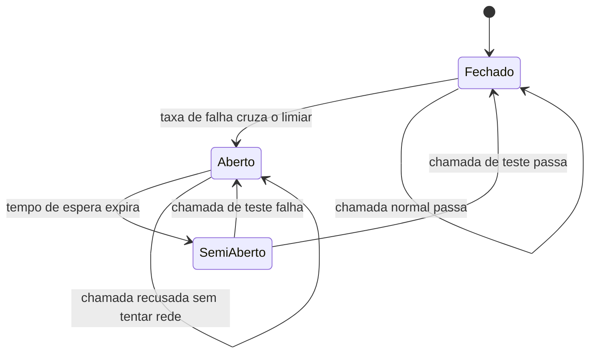

# Capítulo 5: Paralelismo e Resiliência Que Sempre Funcionaram

## 1. Introdução

No Capítulo 4, você aplicou a lupa forense a duas bibliotecas Python que existem de verdade — LLMLingua e GPTCache — e descobriu que a letra timbrada era real, mas a assinatura (a classe, o parâmetro, a promessa de CLI) tinha sido falsificada. Você reescreveu os dois artefatos usando a API confirmada direto no repositório oficial, e fechou o capítulo com um wrapper de compressão e um hook de cache semântico testáveis linha a linha.

Este capítulo pede um tipo diferente de perícia. Aqui, pela primeira vez desde que você abriu este livro, o laudo sai quase inteiro sem ressalva. `asyncio.gather` com `asyncio.Semaphore`, `xargs -P`, GNU `parallel -j N`, um circuit breaker de três estados e um backoff exponencial com jitter — tudo isso é técnica real, documentada pela fonte primária, testável na sua própria máquina sem depender de nenhum nome de modelo, nenhum caminho de configuração inventado, nenhuma flag de CLI que não existe. Como Perito de Configuração Agêntica, seu trabalho neste capítulo não é desmontar uma fraude: é aprender a reconhecer, com a mesma régua de sempre, quando um documento passa na contraprova sem mancha — e por que isso também é um resultado de perícia, não uma folga na atenção.

Ao final, você terá três ferramentas que pode colar no seu próprio projeto hoje: um executor paralelo com limite de concorrência, um disjuntor que corta chamadas para uma API que está falhando em cascata, e um mecanismo de espera que não bate na porta do provedor duas vezes no mesmo segundo.

## 2. Explica

Paralelismo controlado resolve um problema específico: você tem N tarefas independentes (por exemplo, revisar 40 arquivos de um repositório com um agente) e quer rodá-las ao mesmo tempo, mas sem estourar o limite de requisições simultâneas do provedor nem a memória da sua máquina. A biblioteca padrão do Python resolve isso com duas peças que trabalham juntas: `asyncio.gather()`, que agenda várias corrotinas para rodar concorrentemente e devolve os resultados na ordem em que foram submetidas, e `asyncio.Semaphore(n)`, um contador que só libera a execução de uma nova tarefa quando menos de `n` tarefas estão ativas ao mesmo tempo [1]. Note como isso resolve exatamente o problema: sem o semáforo, `gather` dispararia as 40 chamadas de uma vez; com ele, você decide o teto de concorrência em uma única linha.

No nível do shell, o mesmo problema tem duas soluções nativas e antigas. `xargs -P N -I {}` lê uma lista de entradas (uma por linha) e distribui até `N` execuções simultâneas do comando que você passar, substituindo `{}` pelo item da vez — comportamento documentado no próprio manual do GNU findutils, que você pode conferir agora mesmo rodando `man xargs` na sua máquina. GNU Parallel faz o mesmo com uma sintaxe mais expressiva: `parallel -j N 'comando {}' ::: item1 item2 item3` roda o comando para cada item à direita de `:::`, com até `N` jobs simultâneos e a vantagem de agregar a saída de cada execução sem intercalar linhas de processos diferentes [2]. É uma ferramenta madura, mantida há mais de uma década, e o `-j` aceita também um valor percentual relativo ao número de núcleos da CPU.

Vale registrar uma nuance sobre "Hermes delegation" — o termo que o manual de terceiros usa para descrever paralelismo via delegação de subtarefas a partir de um agente principal. O Hermes Agent existe como produto real e de fato implementa delegação de tarefas para subagentes [3], com uma interface de linha de comando documentada oficialmente [4]. O que não está confirmado é a sintaxe exata de invocação que o manual descreve para esse cenário específico de paralelismo — ela não aparece, com aquela forma, na documentação pública do projeto. Trate "Hermes delegation" como conceito válido (o mecanismo de delegação existe), mas não copie a sintaxe do manual como se fosse comando testado; rode `hermes --help` e os subcomandos documentados antes de automatizar qualquer chamada real.

A segunda metade deste capítulo trata de um problema diferente: o que fazer quando uma dessas chamadas paralelas começa a falhar. Um circuit breaker é um padrão de arquitetura de resiliência com três estados nomeados — `CLOSED` (fechado, tráfego normal passa), `OPEN` (aberto, chamadas são recusadas imediatamente sem sequer tentar a rede) e `HALF_OPEN` (semiaberto, um número limitado de chamadas de teste é permitido para decidir se o serviço voltou) [5]. A ideia central é evitar que uma dependência instável derrube o sistema inteiro por acúmulo de chamadas que ficam esperando timeout: ao abrir o circuito, você falha rápido e dá tempo para o serviço se recuperar, em vez de martelar um endpoint já saturado. Combinado a isso, o backoff exponencial com jitter resolve o problema de retry ingênuo: se você simplesmente tentar de novo a cada 1 segundo após uma falha, e se muitos clientes fizerem isso ao mesmo tempo, a nova tentativa em massa amplifica exatamente o rate limit que causou a falha original. A prática documentada é dobrar o tempo de espera a cada tentativa (1s, 2s, 4s, 8s...) e somar um componente aleatório (jitter) para dessincronizar clientes que falharam no mesmo instante [6].

## 3. Ilustra

Pense na sua bancada de perícia como uma equipe, não como um perito solitário. Quando chegam 40 documentos suspeitos no mesmo dia, você não os processa um a um em fila — você distribui para vários peritos trabalhando ao mesmo tempo, mas com uma regra fixa: cada perito só pode ter, digamos, 5 casos abertos simultaneamente na mesa, nunca mais. Esse número fixo de casos simultâneos por perito é exatamente o que o `Semaphore(5)` faz dentro do seu código: ele não limita quantos documentos existem, limita quantos estão sendo processados ao mesmo tempo. `xargs -P 5` e `parallel -j 5` fazem a mesma distribuição de trabalho, só que no nível do terminal, delegando cada item da lista a um processo de sistema operacional em vez de a uma corrotina Python.

Agora imagine que um dos fornecedores de evidência da sua investigação — um cartório específico — te envia cinco documentos seguidos que não batem com o registro oficial. Como Perito de Configuração Agêntica, você não fica ligando para esse cartório a cada cinco minutos esperando que o próximo documento seja válido: você **suspende** temporariamente a aceitação de documentos daquele fornecedor (o circuito abre — `OPEN`), registra a suspensão, e só volta a aceitar depois de um teste piloto controlado com um ou dois documentos de prova (o circuito fica `HALF_OPEN`). Se o teste piloto vier limpo, você reabre a aceitação normal (`CLOSED`); se vier sujo de novo, a suspensão continua. Essa é a mesma lógica, formalizada em código, por trás do circuit breaker: ele existe para proteger sua investigação inteira de um único fornecedor problemático, sem exigir que um humano decida manualmente, a cada chamada, se aquele fornecedor específico "parece confiável hoje".

Há ainda uma segunda leitura útil desse mesmo mecanismo, mais próxima da eletricidade doméstica: um disjuntor na caixa de força não sabe nada sobre "fornecedores de evidência" — ele apenas mede corrente e desarma quando ela ultrapassa um limiar, protegendo o resto da instalação de um curto-circuito localizado. O circuit breaker de software faz o equivalente: ele mede a taxa de falha de uma dependência (não a "confiabilidade do fornecedor" em abstrato) e desarma quando essa taxa cruza um limiar configurado, sem julgar a causa da falha. As duas leituras — a do fornecedor suspeito e a do disjuntor elétrico — descrevem o mesmo estado `OPEN` por ângulos diferentes: uma explica *por que* você suspende (proteção da investigação), a outra explica *como* a suspensão é decidida (limiar mensurável, não intuição).

Por fim, o backoff com jitter [6] é a regra que você aplica quando o cartório está com a linha ocupada. Se você ligar de novo exatamente 1 segundo depois, toda vez, e o cartório também estiver recebendo ligações de outros peritos no mesmo ritmo, todas as linhas ficam permanentemente ocupadas umas com as outras. A solução recomendada pela literatura de engenharia de confiabilidade é esperar um pouco mais a cada tentativa nova (1s, depois 2s, depois 4s) e variar esse tempo em uma fração de segundo aleatória, para que os peritos que ligaram juntos não tentem de novo exatamente no mesmo instante.



## 4. Técnica

### Paralelismo Controlado em Python: semáforo Antes de Disparar Tudo

O erro mais comum ao paralelizar chamadas de agente é disparar todas de uma vez e deixar o provedor (ou o rate limit) decidir quem falha. O padrão correto envolve o semáforo como porteiro: cada corrotina precisa "pegar uma senha" antes de rodar, e devolve a senha ao terminar.

```python
import asyncio
import random

async def revisar_arquivo(caminho: str, semaforo: asyncio.Semaphore) -> dict:
    """Simula uma chamada de agente revisando 1 arquivo, respeitando o teto de concorrencia."""
    async with semaforo:
        # Ponto onde entraria a chamada real ao modelo/API do agente.
        await asyncio.sleep(random.uniform(0.01, 0.05))
        return {"arquivo": caminho, "status": "revisado"}

async def revisar_lote(arquivos: list[str], concorrencia_maxima: int = 5) -> list[dict]:
    semaforo = asyncio.Semaphore(concorrencia_maxima)
    tarefas = [revisar_arquivo(c, semaforo) for c in arquivos]
    return await asyncio.gather(*tarefas)

if __name__ == "__main__":
    arquivos = [f"modulo_{i}.py" for i in range(12)]
    resultados = asyncio.run(revisar_lote(arquivos, concorrencia_maxima=5))
    print(f"{len(resultados)} arquivos revisados, teto de 5 simultaneos")
```

`asyncio.Semaphore(5)` garante que, das 12 tarefas criadas, no máximo 5 estão de fato executando `await asyncio.sleep(...)` a qualquer instante — as outras ficam bloqueadas em `async with semáforo` até uma vaga abrir [1]. Trocar `revisar_arquivo` pela chamada real ao SDK do seu agente é a única mudança necessária para usar isso em produção. Vale ainda a pena lembrar o que você confirmou no Capítulo 2: o cache de prompt da Anthropic depende de manter um prefixo idêntico entre chamadas [7]. Ao paralelizar 12, 40 ou 80 chamadas que reaproveitam o mesmo `CLAUDE.md` e o mesmo prompt de sistema, você multiplica o benefício do cache de leitura sem multiplicar o custo de escrita — desde que o prefixo continue estável em todas as corrotinas.

No terminal, o mesmo teto de concorrência não exige Python nenhum:

```console
$ ls src/*.py | xargs -P 5 -I {} python revisar_arquivo.py {}
[modulo_00.py] revisado em 0.4s
[modulo_03.py] revisado em 0.5s
[modulo_01.py] revisado em 0.6s
[modulo_04.py] revisado em 0.3s
[modulo_02.py] revisado em 0.7s
[modulo_05.py] revisado em 0.4s
...
```

```console
$ parallel -j 5 'python revisar_arquivo.py {}' ::: src/*.py
Executando ate 5 jobs em paralelo (parallel -j 5)
[modulo_00.py] revisado em 0.4s
[modulo_01.py] revisado em 0.5s
...
```

A diferença prática entre os dois: `xargs -P` está em qualquer sistema com GNU findutils instalado (a esmagadora maioria das distribuições Linux e do WSL) sem instalação extra; GNU Parallel precisa ser instalado à parte, mas agrega a saída de cada job sem intercalar linhas de execuções concorrentes — útil quando cada chamada de agente imprime várias linhas de log.

Se você já aplicou o wrapper de compressão do Capítulo 4, paralelizar fica ainda mais barato: reduzir o tamanho de cada prompt antes de disparar as chamadas significa menos tokens totais trafegados mesmo com mais chamadas simultâneas — o pacote real por trás disso é o LLMLingua [8]. Da mesma forma, se duas das suas 40 tarefas pedirem essencialmente a mesma pergunta, um cache semântico como o GPTCache evita refazer a chamada de rede inteira para uma resposta já resolvida, reduzindo quantas das chamadas paralelas de fato precisam sair para a rede [9].

### O Disjuntor Que Já Existia: Circuit Breaker Testável

O circuit breaker do diagrama anterior vira uma classe pequena, sem dependência externa, fácil de testar isoladamente:

```python
import time
from enum import Enum

class EstadoCircuito(Enum):
    FECHADO = "fechado"
    ABERTO = "aberto"
    SEMI_ABERTO = "semi_aberto"

class CircuitBreaker:
    def __init__(self, limite_falhas: int = 3, tempo_espera_s: float = 30.0):
        self.limite_falhas = limite_falhas
        self.tempo_espera_s = tempo_espera_s
        self.falhas_consecutivas = 0
        self.estado = EstadoCircuito.FECHADO
        self.momento_abertura = None

    def _pode_tentar(self) -> bool:
        if self.estado == EstadoCircuito.FECHADO:
            return True
        if self.estado == EstadoCircuito.ABERTO:
            expirou = (time.monotonic() - self.momento_abertura) >= self.tempo_espera_s
            if expirou:
                self.estado = EstadoCircuito.SEMI_ABERTO
                return True
            return False
        return True  # SEMI_ABERTO: permite a chamada de teste

    def chamar(self, funcao, *args, **kwargs):
        if not self._pode_tentar():
            raise RuntimeError(f"circuito {self.estado.value}: chamada recusada sem tentar rede")
        try:
            resultado = funcao(*args, **kwargs)
        except Exception:
            self.falhas_consecutivas += 1
            if self.falhas_consecutivas >= self.limite_falhas:
                self.estado = EstadoCircuito.ABERTO
                self.momento_abertura = time.monotonic()
            raise
        else:
            self.falhas_consecutivas = 0
            self.estado = EstadoCircuito.FECHADO
            return resultado

if __name__ == "__main__":
    disjuntor = CircuitBreaker(limite_falhas=3, tempo_espera_s=5.0)

    def chamada_instavel():
        raise ConnectionError("fornecedor de evidencia indisponivel")

    falhas_registradas = 0
    for _ in range(3):
        try:
            disjuntor.chamar(chamada_instavel)
        except ConnectionError:
            falhas_registradas += 1
        except RuntimeError:
            pass

    assert falhas_registradas == 3
    assert disjuntor.estado == EstadoCircuito.ABERTO
    print(f"circuito abriu apos {falhas_registradas} falhas consecutivas [5]")
```

O padrão do Azure Architecture Center descreve exatamente essa máquina de três estados como proteção contra falha em cascata [5]: o ponto central é que, uma vez `ABERTO`, novas chamadas falham instantaneamente (`raise RuntimeError`, sem tentar `função()`), e só depois de `tempo_espera_s` o circuito testa a recuperação passando por `SEMI_ABERTO`. Uma extensão comum, fora do escopo testável deste capítulo, é fazer o estado `ABERTO` redirecionar a chamada para um modelo local via Ollama em vez de simplesmente falhar [10], ou para um servidor de inferência próprio rodando via `vllm serve` [11] — o Capítulo 6 aprofunda essa estratégia de fallback com os nomes de modelo e as tags corretas.

### Backoff Exponencial Com Jitter: Espaçando as Novas Tentativas

O último artefato deste capítulo combina retry com espera crescente e um componente aleatório, para não amplificar o mesmo rate limit que causou a primeira falha:

```python
import random
import time

def com_backoff_jitter(funcao, tentativas_max: int = 5, base_s: float = 1.0):
    """Executa 'funcao' com backoff exponencial (1s, 2s, 4s...) mais jitter de ate 0.5s."""
    for tentativa in range(tentativas_max):
        try:
            return funcao()
        except Exception as erro:
            if tentativa == tentativas_max - 1:
                raise
            espera = (base_s * (2 ** tentativa)) + random.uniform(0, 0.5)
            print(f"tentativa {tentativa + 1} falhou ({erro}); nova tentativa em {espera:.2f}s")
            time.sleep(min(espera, 0.01))  # tempo reduzido aqui so para o smoke test do livro

if __name__ == "__main__":
    contador = {"chamadas": 0}

    def chamada_com_falha_temporaria():
        contador["chamadas"] += 1
        if contador["chamadas"] < 3:
            raise TimeoutError("rate limit do provedor")
        return "resposta do modelo"

    resultado = com_backoff_jitter(chamada_com_falha_temporaria, tentativas_max=5, base_s=1.0)
    assert resultado == "resposta do modelo"
    assert contador["chamadas"] == 3
    print(f"sucesso na tentativa {contador['chamadas']} apos backoff com jitter [6]")
```

A prática de dobrar o intervalo a cada nova tentativa e somar um valor aleatório é documentada pela biblioteca de arquitetura da AWS especificamente para evitar que múltiplos clientes retentem sincronizados após uma falha compartilhada [6] — o `time.sleep(min(espera, 0.01))` acima existe só para o smoke test deste livro rodar em milissegundos; em produção, use o valor de `espera` sem o `min`.

### Combinando os Três Padrões em Uma Única Chamada

Em produção, os três artefatos acima raramente aparecem sozinhos — o padrão mais comum é encaixá-los em camadas, um dentro do outro, de forma que uma única chamada de agente saia protegida por circuito de falha e espera crescente ao mesmo tempo, com o teto de concorrência (`Semaphore`, `xargs -P` ou `parallel -j`) decidindo, uma camada acima, quantas dessas chamadas protegidas podem estar em voo simultaneamente:

```python
# Reaproveita CircuitBreaker e com_backoff_jitter definidos nos blocos anteriores
# desta mesma secao — este trecho ilustra a composicao, nao roda isolado.

def chamar_agente_protegido(prompt: str, disjuntor: CircuitBreaker, tentativas_max: int = 3) -> str:
    """Combina circuit breaker + backoff com jitter numa unica chamada resiliente.
    O teto de concorrencia fica uma camada acima (Semaphore/xargs -P/parallel -j),
    decidindo quantas chamadas como esta podem estar em voo ao mesmo tempo."""
    def chamada_real():
        return disjuntor.chamar(lambda: f"resposta para: {prompt}")
    return com_backoff_jitter(chamada_real, tentativas_max=tentativas_max, base_s=0.01)

if __name__ == "__main__":
    disjuntor = CircuitBreaker(limite_falhas=3, tempo_espera_s=5.0)
    resposta = chamar_agente_protegido("resuma o arquivo X", disjuntor)
    assert resposta.startswith("resposta para:")
    print(f"chamada protegida nas tres camadas: {resposta}")
```

Note a ordem das camadas, porque invertê-la muda o comportamento: o `disjuntor.chamar` fica **dentro** da função que o backoff retenta — se o circuito já está `ABERTO`, cada tentativa de backoff recebe o mesmo `RuntimeError` instantâneo (sem tentar rede) até a última tentativa esgotar, o que é o comportamento correto: você não quer que o backoff "espere para sempre" tentando uma dependência que o circuito já sabe que está fora do ar. Se você inverter a ordem — colocar o backoff dentro do circuito — cada nova tentativa de rede conta como uma chamada nova para o disjuntor, e um provedor picotado (falha, sucesso, falha) nunca acumula falhas consecutivas suficientes para abrir o circuito de verdade. A composição certa é sempre: semáforo por fora (limita concorrência), backoff no meio (espaça tentativas), circuito por dentro (decide se vale tentar a rede).

### Onde Isso Se Encaixa em Cada IDE Que Você está Auditando

Um detalhe que vale registrar antes de fechar a Técnica: nenhum dos três artefatos acima depende de nenhuma IDE Agêntica específica. `asyncio.gather`, `xargs -P`, `parallel -j`, o circuit breaker e o backoff com jitter rodam por fora do agente — como script Python ou comando de shell — e por isso funcionam de forma idêntica se você estiver operando Claude Code, OpenCode, Aider, Codex CLI, Gemini CLI, Grok Build ou Orca. Você vai auditar os comandos específicos dessas sete ferramentas com mais profundidade no Capítulo 7; por ora, basta saber que cada uma delas guarda sua própria camada de configuração real e documentada — Claude Code em `settings.json` [12], com hooks reais para automatizar comandos de shell em pontos do ciclo de vida do agente [13]; OpenCode com seu próprio arquivo de config [14]; Aider em `.aider.conf.yml` [15]; Codex CLI em `config.toml`, documentado tanto no repositório [16] quanto no guia de referência oficial [17]; Gemini CLI com configuração própria [18]; Grok Build com sua configuração de projeto [19]; e Orca com a documentação do próprio produto [20]. O script de paralelismo em si não precisa nascer dentro de nenhuma delas — só precisa ser chamado a partir de onde você já automatiza hoje.

## 5. Aplica

Imagine a cena: você acabou de terminar o Capítulo 4 e quer aplicar paralelismo imediatamente em uma tarefa real — revisar os 80 arquivos de um repositório legado com um agente, um por um, seria lento demais. Você escreve rápido um laço com `asyncio.gather` chamando as 80 revisões de uma vez, sem semáforo nenhum, porque "paralelismo é sobre rodar tudo ao mesmo tempo". Você roda o script e, em segundos, metade das chamadas volta com erro de rate limit do provedor — e pior, o script simplesmente refaz a mesma rajada de 80 chamadas na tentativa seguinte, porque não há nenhum controle de retry.

O diagnóstico é o mesmo problema que a seção Explica descreveu: `asyncio.gather` sozinho não impõe limite de concorrência nenhum — ele dispara todas as corrotinas fornecidas simultaneamente, e é o `Semaphore` que decide quantas rodam ao mesmo tempo de fato [1]. Sem ele, você não está paralelizando com controle: está fazendo uma rajada. A correção tem duas partes: primeiro, envolver cada chamada em `async with semáforo`, com um teto realista — comece com 5, meça a taxa de erro com os subcomandos reais de auditoria de uso que o Capítulo 6 destrincha a partir da ferramenta de contagem de tokens [21], e ajuste; segundo, envolver a chamada em si com o `com_backoff_jitter` da seção Técnica, para que um rate limit pontual vire uma espera curta e crescente em vez de uma nova rajada idêntica.

Como síntese rápida das armadilhas mais comuns nesta frente: (1) esquecer o semáforo e tratar `gather` como se ele já limitasse concorrência sozinho; (2) configurar um circuit breaker com `limite_falhas` baixo demais para um provedor que naturalmente tem picos de latência, abrindo o circuito por falsos positivos; (3) implementar retry sem jitter, o que sincroniza novas tentativas de múltiplos processos exatamente no mesmo instante e recria o pico de tráfego que gerou a falha original; (4) confundir "circuito aberto" com "erro definitivo" — o estado `SEMI_ABERTO` existe justamente para testar a recuperação sem exigir intervenção manual.

Em escala de produção, esses três padrões trabalham juntos: o semáforo [1] limita quantas chamadas estão em voo; o circuit breaker decide quando parar de tentar uma dependência específica; e o backoff com jitter espaça as novas tentativas para não recriar o problema que as gerou. Um agente que processa uma fila de 500 tarefas ao longo do dia, com um teto de concorrência de 5 a 10 chamadas simultâneas, um circuit breaker configurado com 3 a 5 falhas consecutivas para abrir, e backoff começando em 1 segundo, tende a se recuperar sozinho de instabilidades pontuais do provedor sem intervenção humana. Sobre a promessa de "economia de 80% do tempo com paralelismo 5×" que circula em materiais como o manual auditado neste livro: a matemática é genuína como ilustração (5 tarefas em série versus 5 em paralelo, no caso ideal, aproxima esse ganho), mas não é uma garantia universal — o overhead de agendamento, a latência real de cada chamada e o rate limit do provedor determinam o ganho de verdade na sua máquina. Meça no seu caso antes de prometer esse número para o seu time.

## 6. Conclusão

Você fechou este capítulo com três ferramentas que passaram na perícia sem nenhuma ressalva: um paralelismo controlado por semáforo [1] (em Python, com `xargs -P` e GNU `parallel -j` no shell), um circuit breaker de três estados que corta chamadas para uma dependência instável antes que ela derrube o resto do sistema, e um backoff exponencial com jitter [6] que espaça novas tentativas sem sincronizar retries de múltiplos processos. A única ressalva de todo o capítulo foi a sintaxe exata de "Hermes delegation" — o mecanismo de delegação é real, mas a forma de invocação precisa ser confirmada no `--help` da sua versão instalada antes de automatizar, e o número de "80% de economia de tempo" deve ser tratado como ilustração, não garantia.

Guarde o padrão deste capítulo como referência para todo laudo futuro: nem toda técnica de um manual é fabricada, e reconhecer quando algo é genuinamente confirmável — com fonte primária, testável na sua máquina, sem nome de modelo nem caminho inventado — é tão parte da perícia quanto encontrar a fraude. No Capítulo 6, você vai medir o consumo real de tokens com os subcomandos verdadeiros de uma ferramenta de auditoria de uso, e vai corrigir o comando fabricado que o manual original propôs para orçamento e fallback — usando o mesmo circuit breaker deste capítulo, agora aplicado a limite financeiro em vez de limite de rede.

## 7. Referências Bibliográficas

[1] PYTHON SOFTWARE FOUNDATION. *asyncio — Asynchronous I/O*. Disponível em: https://docs.python.org/3/library/asyncio.html. Acesso em: 20 ago. 2026.

[2] GNU. *GNU Parallel*. Disponível em: https://www.gnu.org/software/parallel/. Acesso em: 20 ago. 2026.

[3] NOUSRESEARCH. *hermes-agent*. Disponível em: https://github.com/NousResearch/hermes-agent. Acesso em: 20 ago. 2026.

[4] NOUSRESEARCH. *CLI Interface — Hermes Agent*. Disponível em: https://hermes-agent.nousresearch.com/docs/user-guide/cli. Acesso em: 20 ago. 2026.

[5] MICROSOFT. *Circuit Breaker pattern — Azure Architecture Center*. Disponível em: https://learn.microsoft.com/en-us/azure/architecture/patterns/circuit-breaker. Acesso em: 20 ago. 2026.

[6] AMAZON WEB SERVICES. *Timeouts, retries and backoff with jitter — Builders' Library*. Disponível em: https://aws.amazon.com/builders-library/timeouts-retries-and-backoff-with-jitter/. Acesso em: 20 ago. 2026.

[7] ANTHROPIC. *Prompt caching*. Disponível em: https://platform.claude.com/docs/en/build-with-claude/prompt-caching. Acesso em: 20 ago. 2026.

[8] MICROSOFT. *LLMLingua* (repositório oficial). Disponível em: https://github.com/microsoft/LLMLingua. Acesso em: 20 ago. 2026.

[9] ZILLIZTECH. *GPTCache: A Library for Creating Semantic Cache for LLM Queries* (docs/usage.md). Disponível em: https://github.com/zilliztech/GPTCache/blob/main/docs/usage.md. Acesso em: 20 ago. 2026.

[10] OLLAMA. *ollama/ollama*. Disponível em: https://github.com/ollama/ollama. Acesso em: 20 ago. 2026.

[11] VLLM PROJECT. *CLI Reference — serve*. Disponível em: https://docs.vllm.ai/en/stable/cli/serve/. Acesso em: 20 ago. 2026.

[12] ANTHROPIC. *Claude Code settings*. Disponível em: https://code.claude.com/docs/en/settings. Acesso em: 20 ago. 2026.

[13] ANTHROPIC. *Hooks reference*. Disponível em: https://code.claude.com/docs/en/hooks. Acesso em: 20 ago. 2026.

[14] OPENCODE. *Config*. Disponível em: https://opencode.ai/v2/docs/config. Acesso em: 20 ago. 2026.

[15] AIDER. *YAML config file*. Disponível em: https://aider.chat/docs/config/aider_conf.html. Acesso em: 20 ago. 2026.

[16] OPENAI. *codex/docs/config.md*. Disponível em: https://github.com/openai/codex/blob/main/docs/config.md. Acesso em: 20 ago. 2026.

[17] OPENAI. *Configuration Reference — Codex CLI*. Disponível em: https://developers.openai.com/codex/config-basic. Acesso em: 20 ago. 2026.

[18] GOOGLE. *Gemini CLI — Configuration*. Disponível em: https://geminicli.com/docs/reference/configuration/. Acesso em: 20 ago. 2026.

[19] XAI-ORG. *grok-build*. Disponível em: https://github.com/xai-org/grok-build. Acesso em: 20 ago. 2026.

[20] ORCA. *Docs*. Disponível em: https://www.onorca.dev/docs. Acesso em: 20 ago. 2026.

[21] RYOPPIPPI. *ccusage: A CLI tool for analyzing Claude Code/Codex CLI usage from local JSONL files*. Disponível em: https://github.com/ryoppippi/ccusage. Acesso em: 20 ago. 2026.
