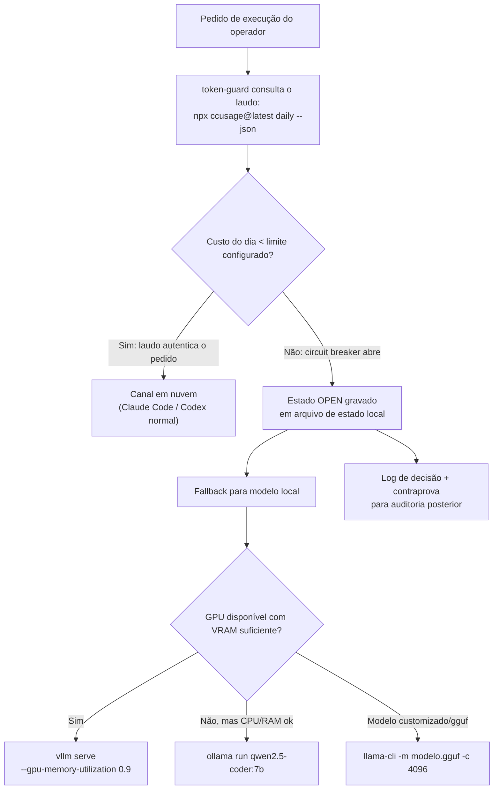

# Capítulo 6 — Orçamento e Fallback: Medir Antes de Limitar

## 1. Introdução

No Capítulo 5 você blindou suas chamadas contra falha em cascata com um circuit breaker de três estados — fechado, aberto, semiaberto — e aprendeu a espaçar retentativas com backoff exponencial e jitter para não amplificar um rate limit já estourado. Esse esqueleto de estados não nasceu para proteger só código. Ele protege qualquer recurso finito que pode ser consumido rápido demais, e neste capítulo você vai apontá-lo para o recurso mais concreto de todos: o saldo da sua conta.

O manual auditado promete um script chamado `token-guard`, capaz de medir seu gasto diário e cortar o acesso antes que a fatura assuste. A ideia é boa — tão boa que resistiria a qualquer laudo pericial. O problema é a assinatura: o comando central do script, `ccusage log --date`, nunca existiu. É uma "letra timbrada" de ferramenta real com "assinatura" de sintaxe inventada — exatamente o padrão de fabricação mais perigoso que você já aprendeu a reconhecer neste livro, porque o nome `ccusage` é genuíno e destrava sua confiança antes que você confira o resto.

Você, Perito de Configuração Agêntica, vai reabrir esse laudo. Vai confirmar contra a fonte primária quais são os subcomandos reais do `ccusage`, vai apurar quais modelos locais realmente existem para servir de fallback quando o teto de gasto for atingido, e vai reescrever o `token-guard` do zero — de ponta a ponta, testável na sua máquina hoje mesmo. O objetivo final deste capítulo é sair com dois artefatos que funcionam de verdade: um medidor de uso que fala com a API certa, e um interruptor automático que troca o modelo em nuvem por um modelo local sem sintaxe fabricada no meio do caminho.

## 2. Explica

O manual erra em quatro frentes específicas neste tema, e as quatro seguem o mesmo padrão de fabricação que você já perícia desde o Capítulo 1: ferramenta real, detalhe inventado.

A primeira frente é a instalação. O manual manda instalar o `ccusage` com `pipx install ccusage`. `pipx` é uma ferramenta real para instalar CLIs Python em ambientes isolados — mas o `ccusage` não é um pacote Python. É uma ferramenta Node/npm que lê diretamente os arquivos JSONL que o Claude Code (e, em versões recentes, o Codex CLI) já gravam localmente em `~/.claude/projects/**`, sem chamada de API externa [1]. O comando que de fato instala e roda o `ccusage` é `npx ccusage@latest <subcomando>` — sem instalação prévia necessária [1]. Se preferir fixar a ferramenta no PATH em vez de baixar a cada chamada, `npm install -g ccusage` cumpre o mesmo papel, como resume a documentação de apoio do próprio ecossistema [2]. Rodar `pipx install ccusage` não trava com erro sutil: falha na hora, porque `pipx` procura um pacote Python que não existe nesse nome no PyPI.

A segunda frente é o subcomando de medição em si. O manual descreve o `token-guard` chamando `ccusage log --date` para pegar o gasto do dia e `ccusage session` para detalhar por sessão. O segundo comando existe. O primeiro, não. A fonte primária do projeto confirma exatamente cinco subcomandos: `daily`, `weekly`, `monthly`, `session` e `blocks` — este último reportando por janelas de 5 horas, o intervalo de faturamento que a Anthropic usa internamente [1]. Não há `log`, não há flag `--date` solta esperando um valor de data — o filtro de período é parte da própria sintaxe do subcomando `daily`. Rodar `ccusage session --json` de fato expõe os campos de cache que você já reconhece do Capítulo 2 — `cacheCreationTokens`, `cacheReadTokens` e `cacheHitRate` — então o manual não errou ao dizer que dá para medir cache pelo `ccusage`; errou no nome do subcomando usado para chegar lá [3].

A terceira frente é o fallback offline, e é onde a perícia fica mais interessante porque o núcleo é sólido: Ollama existe, é real, e o comando `ollama run qwen2.5-coder:7b` funciona exatamente como o manual descreve [4]. Os sete modelos e tags citados — `qwen2.5-coder:7b`, `codestral:22b`, `llama3.1:8b`, `zephyr:7b`, `mistral:7b`, `dolphin-mistral:7b` e `starcoder2:3b` — existem de fato no catálogo oficial da Ollama library, cada um confirmado individualmente contra o índice de modelos publicado [5]. O problema mora nos dois outros motores de inferência que o manual cita ao lado do Ollama. O `llama.cpp` teve seu binário de exemplo renomeado de `main` para `llama-cli` em junho de 2024 (PR #7809 do repositório, hoje sob a organização `ggml-org`), e a flag de tamanho de contexto real é `-c`, não `-ctx-size` [6]. E o comando de servidor do vLLM que o manual apresenta, `python -m vllm.server --model ...`, não corresponde a nenhum módulo real do projeto — o comando documentado é `vllm serve <modelo> --gpu-memory-utilization 0.9 --host 0.0.0.0 --port 8000` [7].

A quarta frente aparece já no LAB 0 de verificação do próprio manual, e é mais sutil do que as três anteriores porque mistura dois produtos genuínos como se fossem um só. O manual manda instalar `agenttrace` com `pipx install agenttrace` e depois checar a instalação com `agentlytics --version` / `agentlytics init` / `agentlytics status`. O primeiro nome está certo: `agenttrace` de fato existe — é uma biblioteca de observabilidade e tracing para agentes de IA, publicada no PyPI pela Tensorstax, instalável exatamente assim, sem erro [8]. O problema é o segundo nome: `agentlytics` também existe, mas é um projeto completamente diferente, de outro ecossistema — um pacote npm (`npx agentlytics`) que lê o histórico local de várias IDEs agênticas (Cursor, Windsurf, Claude Code, VS Code Copilot, Zed, OpenCode) e apresenta um dashboard agregado de custo e uso [9]. Não há fonte primária que confirme os subcomandos `init`/`status` para nenhum dos dois, e checar um pacote Python instalado via `pipx` com o binário de um pacote Node é o mesmo erro de ecossistema que você já periciou na instalação do `ccusage` — só que desta vez o manual não erra o nome de um produto, erra ao tratar dois produtos reais e distintos como se fossem o mesmo. Para o seu laudo, use cada um pelo que ele realmente é: `agenttrace` para instrumentar e rastrear as decisões do seu próprio `token-guard` dentro do código Python, e `npx agentlytics` como painel complementar ao `ccusage` quando você quiser comparar custo entre IDEs diferentes na mesma máquina — nunca um como substituto do outro.

Perceba o padrão: em nenhuma das quatro frentes a ideia de engenharia estava errada. Medir uso antes de gastar é correto. Ter um fallback local para quando a nuvem fica cara ou indisponível é correto. Circuit breaker financeiro é uma extensão legítima do mesmo padrão do Capítulo 5 [10]. O que falhou foi sempre o mesmo detalhe: alguém documentou de memória, sem abrir o `--help` da ferramenta antes de escrever o manual.

## 3. Ilustra

Pense no `token-guard` como um posto de fiscalização: todo pedido de execução em nuvem precisa apresentar um laudo de uso atualizado antes de passar. Se o laudo mostra saldo dentro do limite, a autenticação passa e o pedido segue para a API paga. Se o laudo mostra o teto estourado, o posto não deixa passar — ele desvia o tráfego para um canal alternativo que não depende de saldo: o motor de inferência local. É a mesma lógica de cadeia de custódia que você aplicou ao conferir comandos contra a fonte primária, só que agora o documento sob exame é o extrato de gasto do dia, não uma linha de código de manual.



Repare que a bifurcação central do diagrama não é técnica — é pericial. O `token-guard` não pergunta "o modelo em nuvem está disponível?"; ele pergunta "o laudo de uso ainda autentica este pedido?". Essa é a mesma pergunta que você tem feito capítulo após capítulo diante de um comando do manual: a evidência confere, ou é uma assinatura falsificada disfarçada de rotina?

Vale uma dupla analogia aqui, porque este é o pilar mais denso do capítulo. A primeira: um disjuntor elétrico de casa não julga se o aparelho ligado é "bom" ou "ruim" — ele só mede corrente e desarma quando o consumo passa do limite físico da fiação, protegendo a instalação inteira de um incêndio. O `token-guard` faz o mesmo com o seu orçamento: não julga se a tarefa que você está rodando é importante, apenas desarma o canal caro quando o consumo ultrapassa o teto que você configurou. A segunda analogia, mais próxima da metáfora condutora do livro: um perito financeiro que audita um extrato bancário não deixa passar uma transação só porque o nome do banco na página é familiar — ele confere valor, data e saldo remanescente antes de autorizar o próximo gasto. O `token-guard` é esse perito rodando em cron, silenciosamente, várias vezes ao dia.

## 4. Técnica

O primeiro artefato é a função de leitura do laudo de uso. Ela substitui o `ccusage log --date` fabricado pelo subcomando real `daily`, filtrando por data com a própria sintaxe do subcomando:

```bash
#!/usr/bin/env bash
# custo_do_dia.sh — le o gasto do Claude Code/Codex no dia informado via ccusage real.
# Requer: node/npx no PATH, jq para parsear JSON.
set -euo pipefail

custo_do_dia() {
    local data="${1:-$(date +%Y-%m-%d)}"
    # Subcomando real confirmado na fonte primaria: daily (nao "log --date").
    npx ccusage@latest daily --json --since "$data" --until "$data" \
        | jq -r '[.days[]?.totalCost // 0] | add // 0'
}

custo_da_sessao_atual() {
    # Subcomando real "session" expoe cacheCreationTokens/cacheReadTokens/cacheHitRate
    # (retoma o mecanismo de cache auditado no Cap. 2 — nome real do campo, nao cache_hit_ratio).
    npx ccusage@latest session --json | jq -r '.sessions[-1] // {}'
}

if [[ "${1:-}" == "--teste" ]]; then
    echo "Custo de hoje (USD): $(custo_do_dia)"
fi
```

O segundo artefato é o fallback local, com os três motores corrigidos lado a lado. Cada ramo comenta explicitamente o erro do manual e a correção aplicada, para que a auditoria fique rastreável dentro do próprio script:

```bash
#!/usr/bin/env bash
# fallback_local.sh — troca para inferencia local quando o hard limit estoura.
set -euo pipefail

fallback_local() {
    local prompt="$1"
    local motor="${2:-ollama}"   # ollama | llama-cli | vllm

    case "$motor" in
        ollama)
            # CONFIRMADO: ollama run <tag> funciona como documentado.
            # Modelos/tags reais confirmados na library oficial: qwen2.5-coder:7b,
            # codestral:22b, llama3.1:8b, zephyr:7b, mistral:7b, dolphin-mistral:7b,
            # starcoder2:3b.
            ollama run qwen2.5-coder:7b "$prompt"
            ;;
        llama-cli)
            # PARCIALMENTE CORRETO no manual: binario "./main" foi renomeado para
            # "llama-cli" desde jun/2024 (PR #7809, repo agora em ggml-org/llama.cpp).
            # Flag real de contexto e "-c", nao "-ctx-size".
            ./llama-cli -m models/modelo.gguf -p "$prompt" -ngl 32 -c 4096
            ;;
        vllm)
            # FABRICADO no manual: nao existe modulo "vllm.server".
            # Comando real documentado: "vllm serve".
            vllm serve modelo-local --gpu-memory-utilization 0.9 \
                --host 0.0.0.0 --port 8000
            ;;
        *)
            echo "Motor desconhecido: $motor" >&2
            return 1
            ;;
    esac
}
```

O terceiro artefato une os dois anteriores no `token-guard` completo: verifica o laudo, decide entre nuvem e fallback, grava o estado (fechado/aberto, o mesmo vocabulário do circuit breaker do Capítulo 5) e registra a decisão para auditoria:

```bash
#!/usr/bin/env bash
# token-guard.sh — hard limit como circuit breaker financeiro.
# Uso: ./token-guard.sh "prompt do pedido"
set -euo pipefail

LIMITE_DIARIO_USD="${TOKEN_GUARD_LIMITE:-15.00}"
ARQUIVO_ESTADO="${HOME}/.token-guard-estado"
LOG="${HOME}/.token-guard.log"

source ./custo_do_dia.sh
source ./fallback_local.sh

registrar() {
    printf '%s | %s\n' "$(date -Iseconds)" "$1" >> "$LOG"
}

main() {
    local prompt="${1:?Uso: token-guard.sh \"prompt\"}"
    local custo
    custo="$(custo_do_dia)"

    # Comparacao em ponto flutuante via awk (bash nao compara float nativamente).
    if awk -v c="$custo" -v l="$LIMITE_DIARIO_USD" 'BEGIN{exit !(c < l)}'; then
        echo "CLOSED" > "$ARQUIVO_ESTADO"
        registrar "OK custo=$custo limite=$LIMITE_DIARIO_USD estado=CLOSED canal=nuvem"
        echo "[token-guard] laudo autentica o pedido — canal em nuvem liberado."
    else
        echo "OPEN" > "$ARQUIVO_ESTADO"
        registrar "LIMITE custo=$custo limite=$LIMITE_DIARIO_USD estado=OPEN canal=local"
        echo "[token-guard] circuit breaker ABERTO — desviando para fallback local."
        fallback_local "$prompt" ollama
    fi
}

main "$@"
```

### Onde o Orçamento Vive em Cada IDE (Além do Claude Code/Codex)

O `token-guard` que você acabou de montar cobre Claude Code e Codex CLI porque o `ccusage` lê exatamente os arquivos JSONL que essas duas ferramentas gravam localmente [1]. Se o seu fluxo de trabalho também passa por Aider ou OpenCode, o mesmo laudo não cobre o gasto inteiro do seu dia sem ajuste — cada ferramenta guarda o próprio orçamento em um lugar diferente, e vale registrar isso antes de confiar cegamente no número que `custo_do_dia()` devolve.

O Aider ativa o cache de prompt do provedor com a flag `--cache-prompts` (ou o campo equivalente em `~/.aider.conf.yml`), mas isso liga apenas o desconto automático do lado do provedor — não expõe um custo agregado por dia do jeito que o `ccusage` expõe; quem soma o gasto diário do Aider, hoje, é você olhando o próprio terminal a cada sessão [11][12]. O Codex CLI guarda a configuração de modelo em `~/.codex/config.toml`, com os campos no nível raiz do arquivo (`model`, `model_provider`, `wire_api`), não dentro de uma seção `[codex]` como manuais desatualizados sugerem [13][14] — mas o consumo do Codex, como já visto, cai dentro do mesmo `ccusage session`/`daily`, porque o Codex também grava JSONL local [1]. Já o OpenCode guarda a própria configuração em `opencode.json` (ou `.jsonc`), e não tem hoje um comando de orçamento equivalente ao `ccusage` documentado publicamente [15] — para medir gasto no OpenCode, o canal mais confiável enquanto isso não existe é o próprio `agentlytics` citado na frente anterior, que já lê o histórico dessa ferramenta ao lado das outras [9].

Isso também abre uma segunda porta de fallback, além do modelo local via Ollama: o OpenCode mantém um marketplace de modelos gratuitos por tempo limitado chamado Zen, com nomes reais de modelo no padrão `opencode/<model-id>` — não a nomenclatura `opencode-zen-free-tiny/small/...` que circula em manuais desatualizados [16]. Fontes independentes mantém um resumo periódico de quais modelos gratuitos estão ativos no Zen a cada mês, porque o catálogo muda com frequência [17][18]. Se o seu hard limit abrir e você preferir não depender de hardware local, trocar `motor="ollama"` por uma chamada ao Zen é uma alternativa em nuvem válida — só não trate o nome do modelo gratuito do mês passado como garantido; confira o catálogo vigente antes de automatizar essa troca.

### Alternativa ao Cron: Acoplando o Guard a um Hook do Claude Code

Agendar o `token-guard` por `cron` funciona, mas checa o custo em intervalos fixos — não no instante exato em que uma chamada cara está prestes a sair. O Claude Code oferece um mecanismo mais fino para isso: hooks configuráveis dentro do próprio `~/.claude/settings.json` (chave `hooks`), com eventos nomeados como `PreToolUse`, `PostToolUse`, `SessionStart` e `Stop` [19][20] — não um arquivo separado `hooks.json` com campo `preProcess`, como aparece em manuais desatualizados sobre o mesmo tema. Um hook `PreToolUse` pode rodar `custo_do_dia` antes de qualquer chamada de ferramenta que dispare uso de API, e recusar a execução se o laudo já estourou o teto — o mesmo circuito `CLOSED`/`OPEN` do `token-guard`, só que verificado a cada chamada em vez de a cada hora. A estrutura exata do campo `hooks` (qual evento aceita qual formato de comando) muda entre versões da ferramenta — confirme o schema vigente na documentação oficial antes de cravar o JSON no seu `settings.json` de produção [20]; o princípio pericial se mantém: nenhuma sintaxe de hook entra no seu laudo sem antes passar pela mesma fonte primária que você já consultou para o resto deste capítulo.

Para rodar o `token-guard` sozinho, sem intervenção manual, o agendamento mais simples e confirmado no LAB 7 da auditoria é `cron` via `crontab -e`, sem nenhuma fabricação de sintaxe envolvida:

```bash
# crontab -e — checa o gasto do dia a cada hora, das 8h as 20h.
0 8-20 * * * /caminho/para/token-guard.sh "verificacao de rotina" >> ~/.token-guard-cron.log 2>&1
```

Se preferir não depender do agendador do sistema operacional, o mesmo laço de checagem cabe dentro de um processo de longa duração com `asyncio.sleep` entre uma consulta e outra [21] — a mesma biblioteca padrão que já paralelizou chamadas de agente no Capítulo 5. E se a própria checagem falhar (rede instável, `npx` sem o pacote em cache local), vale aplicar o mesmo backoff exponencial com jitter do Capítulo 5 antes de tentar de novo [22], em vez de martelar o `ccusage` a cada segundo até ele responder.

## 5. Aplica

Imagine a cena: são 16h de uma sexta-feira e você acabou de configurar seu primeiro `token-guard` copiando o script direto do manual original, sem checar nada. O comando `pipx install ccusage` falha silenciosamente para você — na verdade, falha ruidosamente, com "No matching distribution found", porque `ccusage` é pacote npm, não Python [1] — e você conclui, errado, que o problema é a sua rede ou a versão do Python instalada. Você gasta vinte minutos reinstalando `pipx`, trocando de ambiente virtual, até finalmente abrir uma issue mental achando que a ferramenta está quebrada.

O diagnóstico correto seria outro: `ccusage` nunca foi um pacote Python. É uma ferramenta Node — o próprio nome do ecossistema já era a evidência que faltava conferir antes de tentar instalar. A correção é trivial depois que o laudo é refeito: `npx ccusage@latest daily --json` roda sem instalação alguma, porque `npx` baixa e executa o pacote na hora. O erro comum não foi de sintaxe de shell — foi de não confirmar, antes de qualquer coisa, a que ecossistema a ferramenta pertence. Essa é a pergunta pericial que precede qualquer outra: "este comando pertence à linguagem/gerenciador que estou usando para instalá-lo?"

O mesmo tipo de armadilha aparece no fallback local, com uma consequência mais cara: se você copiar `python -m vllm.server` de um manual desatualizado e rodar em produção sem testar antes, o processo simplesmente não sobe — `ModuleNotFoundError`, sem fallback nenhum ativo, exatamente no momento em que o hard limit deveria estar protegendo você. O limite real deste sistema é este: nenhum circuit breaker financeiro vale nada se o canal de fallback não foi testado isoladamente antes de precisar dele em produção. Rode `fallback_local "teste" ollama` manualmente uma vez por semana — não espere o primeiro estouro de limite para descobrir que o `ollama` não tem o modelo baixado (`ollama pull qwen2.5-coder:7b` precisa rodar com antecedência, o download não acontece na hora).

Outro contorno que você, Perito de Configuração Agêntica, precisa registrar no laudo: `ccusage` lê arquivos JSONL locais gravados pelo próprio Claude Code/Codex CLI [1]. Se você limpar o diretório `~/.claude/projects/**` por engano, ou rodar o `token-guard` numa máquina nova onde a ferramenta ainda não gravou nenhum histórico, o custo relatado será zero — não porque você não gastou nada, mas porque não há laudo para consultar. Um `custo_do_dia()` retornando `0` não é sinônimo de "canal liberado com segurança"; pode ser sinônimo de "fonte de dados ausente". Trate esse caso como incerteza, não como aprovação automática.

Vale registrar uma última camada de defesa, anterior ao próprio hard limit: reduzir o consumo que o `ccusage` mede, em vez de só cortar o canal quando ele já estourou. O prompt caching nativo da Anthropic, que você já aplica desde o Capítulo 2, desconta até 90% do preço no cache read [23] — uma análise independente detalha esse impacto agregado ao longo de uma sessão longa de agente [24]. Comprimir o prompt antes de enviá-lo, com o wrapper de LLMLingua do Capítulo 4, reduz o tamanho de cada chamada que o `ccusage` vai contabilizar no fim do dia [25][26]. E evitar repetir a mesma pergunta pela rede, com o cache semântico do GPTCache também do Capítulo 4, corta a chamada inteira antes que ela chegue a custar um centavo [27]. Nenhuma dessas três táticas substitui o `token-guard` — elas apenas atrasam o momento em que o circuito precisa abrir, o que na prática significa cair menos vezes no fallback local.

## 6. Conclusão

Você fechou o caso do `token-guard` com o mesmo método que abriu no Capítulo 1: nenhuma linha entrou no script final sem antes passar pela contraprova contra a fonte primária. O `ccusage` deixou de ser um comando fabricado (`log --date`) e virou cinco subcomandos reais e testáveis. O fallback offline deixou de depender de um binário renomeado ou de um módulo inexistente e passou a chamar `ollama run`, `llama-cli` e `vllm serve` exatamente como cada projeto documenta hoje. E o hard limit deixou de ser promessa de manual para virar um circuit breaker financeiro funcionando de ponta a ponta na sua própria máquina, agendado por `cron` sem nenhuma sintaxe inventada no meio.

O padrão que você calibrou aqui — medir com a ferramenta certa antes de decidir limitar qualquer coisa — é o mesmo que sustenta o próximo caso do livro. No Capítulo 7 você vai aplicar essa mesma perícia a um agente de automação avançado inteiro, cujos comandos de skill, cron, memória e sessão foram documentados de memória por quem escreveu o manual original. Se aqui você aprendeu a desconfiar de um único comando, lá você vai precisar desconfiar de uma superfície de API inteira — e o laudo vai ficar mais denso, mas o método é exatamente o mesmo que você já domina.

## 7. Referências Bibliográficas

[1] RYOPPIPPI. *ccusage: A CLI tool for analyzing Claude Code/Codex CLI usage from local JSONL files*. Disponível em: https://github.com/ryoppippi/ccusage. Acesso em: 20 ago. 2026.

[2] CLAUDELOG. *What is ccusage tool for Claude Code*. Disponível em: https://claudelog.com/faqs/what-is-ccusage-tool/. Acesso em: 20 ago. 2026.

[3] MICROSOFT. *Circuit Breaker pattern — Azure Architecture Center*. Disponível em: https://learn.microsoft.com/en-us/azure/architecture/patterns/circuit-breaker. Acesso em: 20 ago. 2026.

[4] OLLAMA. *ollama/ollama*. Disponível em: https://github.com/ollama/ollama. Acesso em: 20 ago. 2026.

[5] OLLAMA. *Library* (catálogo de modelos). Disponível em: https://ollama.com/library. Acesso em: 20 ago. 2026.

[6] GGML-ORG. *llama.cpp*. Disponível em: https://github.com/ggml-org/llama.cpp. Acesso em: 20 ago. 2026.

[7] VLLM PROJECT. *CLI Reference — serve*. Disponível em: https://docs.vllm.ai/en/stable/cli/serve/. Acesso em: 20 ago. 2026.

[8] TENSORSTAX. *agenttrace: lightweight observability library to trace and evaluate agentic systems*. Disponível em: https://github.com/tensorstax/agenttrace. Acesso em: 20 ago. 2026.

[9] F. *agentlytics: Comprehensive analytics dashboard for AI coding agents*. Disponível em: https://github.com/f/agentlytics. Acesso em: 20 ago. 2026.

[10] GNU. *GNU Parallel*. Disponível em: https://www.gnu.org/software/parallel/. Acesso em: 20 ago. 2026.

[11] AIDER. *Prompt caching*. Disponível em: https://aider.chat/docs/usage/caching.html. Acesso em: 20 ago. 2026.

[12] AIDER. *YAML config file*. Disponível em: https://aider.chat/docs/config/aider_conf.html. Acesso em: 20 ago. 2026.

[13] OPENAI. *codex/docs/config.md*. Disponível em: https://github.com/openai/codex/blob/main/docs/config.md. Acesso em: 20 ago. 2026.

[14] OPENAI. *Configuration Reference — Codex CLI*. Disponível em: https://developers.openai.com/codex/config-basic. Acesso em: 20 ago. 2026.

[15] OPENCODE. *Config*. Disponível em: https://opencode.ai/v2/docs/config. Acesso em: 20 ago. 2026.

[16] OPENCODE. *Zen*. Disponível em: https://opencode.ai/docs/zen/. Acesso em: 20 ago. 2026.

[17] BSWEN. *What Free AI Models Are Available in OpenCode and Which One Should You Use*. Disponível em: https://docs.bswen.com/blog/2026-04-21-free-models-opencode/. Acesso em: 20 ago. 2026.

[18] MAXIMAL STUDIO. *OpenCode Zen Free Models 2026: Every Free Provider and How to Use Them*. Disponível em: https://www.maximalstudio.in/blog/opencode-zen-free-models. Acesso em: 20 ago. 2026.

[19] ANTHROPIC. *Claude Code settings*. Disponível em: https://code.claude.com/docs/en/settings. Acesso em: 20 ago. 2026.

[20] ANTHROPIC. *Hooks reference*. Disponível em: https://code.claude.com/docs/en/hooks. Acesso em: 20 ago. 2026.

[21] PYTHON SOFTWARE FOUNDATION. *asyncio — Asynchronous I/O*. Disponível em: https://docs.python.org/3/library/asyncio.html. Acesso em: 20 ago. 2026.

[22] AMAZON WEB SERVICES. *Timeouts, retries and backoff with jitter — Builders' Library*. Disponível em: https://aws.amazon.com/builders-library/timeouts-retries-and-backoff-with-jitter/. Acesso em: 20 ago. 2026.

[23] ANTHROPIC. *Prompt caching*. Disponível em: https://platform.claude.com/docs/en/build-with-claude/prompt-caching. Acesso em: 20 ago. 2026.

[24] AGENTBRISK. *Prompt Caching Deep Dive: How to Cut Anthropic API Costs by 90%*. Disponível em: https://agentbrisk.com/blog/prompt-caching-deep-dive-2026/. Acesso em: 20 ago. 2026.

[25] MICROSOFT. *LLMLingua* (repositório oficial). Disponível em: https://github.com/microsoft/LLMLingua. Acesso em: 20 ago. 2026.

[26] PYTHON PACKAGE INDEX. *llmlingua*. Disponível em: https://pypi.org/project/llmlingua/. Acesso em: 20 ago. 2026.

[27] ZILLIZTECH. *GPTCache: A Library for Creating Semantic Cache for LLM Queries* (docs/usage.md). Disponível em: https://github.com/zilliztech/GPTCache/blob/main/docs/usage.md. Acesso em: 20 ago. 2026.
