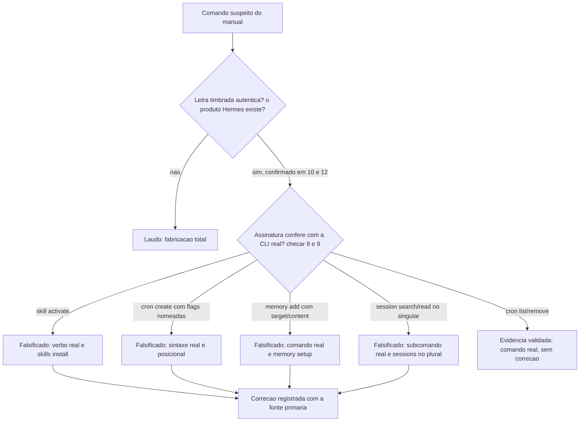

# Capítulo 7: O Agente Avançado e as Outras Sete Ferramentas: Produto Real, Sintaxe Fabricada

## 1. Introdução

No Capítulo 6, você já tinha corrigido os subcomandos reais de medição do `ccusage` (`daily`/`weekly`/`session`, nunca o `log --date` que o manual inventou) [1] para montar, de ponta a ponta, o **circuit breaker financeiro** que interrompe a automação antes que o gasto saia do controle. Você aprendeu ali que "medir antes de limitar" só funciona se a medição em si for real — o mesmo princípio que te fez confirmar as tags exatas do Ollama (`ollama pull qwen2.5-coder:7b`, entre outras) [2] como fallback local antes de confiar num nome de modelo copiado sem checagem. Este capítulo pega esse mesmo instinto pericial e aponta para o caso mais denso do livro inteiro.

O manual de terceiros descreve o "Hermes" como uma IDE Agêntica completa: skills instaláveis, cron scheduler, delegação para subagentes, memória persistente e busca em sessões antigas. Depois de seis capítulos vendo produto inventado atrás de produto inventado — ou nome real atrás de caminho de config fabricado — a reação natural do Perito de Configuração Agêntica é presumir que "Hermes" também é ficção. Não é. Hermes Agent, da NousResearch, existe de verdade: é open-source, tem CLI documentada, TUI, integração com editores via ACP e gateway multiplataforma [3]. A existência do produto está **confirmada**. O que não está confirmado — e é o motivo deste capítulo existir — é a sintaxe exata de cada comando que o manual mostra na tela.

Essa combinação é o achado mais perigoso do livro: quando o nome do produto é real, a sua guarda cai. Você reconhece "Hermes", reconhece "cron", reconhece "memory", e o cérebro completa o resto como familiar. É exatamente esse ponto cego que este capítulo audita, comando por comando, antes de fechar com um panorama mais rápido das outras sete ferramentas que o manual cita de passagem — e com uma regra única, replicável para qualquer CLI nova que aparecer na sua frente depois deste livro. Ao dominar esse tipo específico de laudo — produto autenticado, assinatura sob suspeita —, você adquire o diferencial que separa quem só cópia comando de manual de quem primeiro exige a contraprova na fonte primária.

## 2. Explica

Hermes Agent não é um copiloto de IDE tradicional — a própria documentação da NousResearch o descreve como um agente pessoal de propósito geral, que também sabe programar, acessível por CLI e TUI [3]. Antes de entrar nos quatro subsistemas que o manual audita, vale registrar duas superfícies que ele também expõe e que explicam por que a confusão com "IDE completa" é tão fácil de cometer: de um lado, integrações de mensageria multiplataforma — Telegram, Discord, Slack, WhatsApp — que levam o mesmo agente para fora do terminal [3]; de outro, integração de editor via protocolo ACP (Agent Client Protocol), documentada para VS Code, Zed e JetBrains, somada à capacidade nativa de delegar parte do trabalho para subagentes paralelos dentro da própria sessão [4]. Nenhuma dessas duas superfícies aparece no manual auditado — o que já é, por si só, um indício de que quem escreveu o texto original conhecia o produto de forma superficial, não pela documentação completa do projeto. Ele tem quatro subsistemas relevantes para a economia de tokens que este livro persegue: um sistema de **skills** que se auto-gera a cada aproximadamente 15 chamadas de ferramenta, um **cron scheduler** nativo para rotinas agendadas, **memória persistente** entre sessões, e um mecanismo de **retomada de sessões** antigas — os quatro citados pelo manual, e os quatro com pelo menos uma linha de comando fabricada.

O padrão de erro é sempre o mesmo, e vale nomeá-lo antes de entrar em cada subsistema: o manual documentou a *ideia* de cada comando de memória, provavelmente por analogia com outras ferramentas parecidas — mas nunca rodou `hermes --help` para confirmar o verbo exato, a ordem dos argumentos ou o nome real da flag. Isso é diferente de uma fabricação total (um produto que simplesmente não existe, como você já viu antes). Aqui existe letra timbrada genuína — o cabeçalho do documento é real — mas a assinatura no rodapé foi falsificada. É a categoria de erro que engana até quem já desconfia, porque a desconfiança correta ("isso existe?") já foi respondida com "sim" antes mesmo de você chegar na sintaxe.

Para o subsistema de **skills**, a documentação oficial da CLI descreve os verbos `install`, `browse` e `list`, no plural (`hermes skills install <id>`) — a maior parte das skills, aliás, é auto-gerada pelo próprio agente, não escrita manualmente pelo operador [4]. Não existe `hermes skill activate <nome>` no singular. Para o **cron**, a sintaxe real é posicional: `hermes cron create "<prompt>"`, com uma flag opcional `--skill NOME` para vincular a rotina a uma skill específica, e subcomandos de gestão documentados como `list`, `edit`, `pause`, `resume`, `run`, `remove` e `status` — a lista completa aparece tanto na referência de CLI [4] quanto na página de configuração que descreve os mesmos verbos do lado do arquivo [5]. As flags `--name`, `--schedule` e `--deliver` do manual simplesmente não existem nessa forma — o que confirma, e nisso o manual acerta, são os subcomandos `hermes cron list` e `hermes cron remove <id>` [4].

Para a **memória**, o comando real de configuração é `hermes memory setup` (com variações `status` e `off` para consultar ou desligar o provedor) — não existe `hermes memory add --target user --content "..."` [4]. A gestão fina de memória é interna ao próprio agente, não uma operação manual via flags de terminal. E para **sessões**, o erro do manual é ainda mais sutil: ele usa o singular (`session search`, `session read`), enquanto o subcomando real é `sessions`, no plural, com a família `list/browse/export/delete/prune/rename/stats`, e a retomada de uma sessão específica acontece por `hermes --resume <id>` (ou o atalho `-r`), não por um "read" dedicado — de novo, confirmado pela CLI [4] e reforçado pela documentação de configuração correspondente [5]. Fechando o quadro, o arquivo de configuração `~/.hermes/config.yaml` **é** real — o manual acerta o caminho — mas os campos documentados são `model`, `terminal`, `memory`, `skills`, `agent`, `prompt_caching`, `runtime` e `worktree`, nunca `system_prompt` nem `cache_control: {type: ephemeral}` como o texto original afirma [5].

Depois de fechar o caso Hermes, o Pilar 2 abre um panorama mais rápido das outras sete ferramentas que o manual lista lado a lado, numa única tabela de caminhos de configuração. Nenhuma das sete é fabricada como produto — mas seis dos sete caminhos de config citados **não foram confirmados** em fonte primária durante está auditoria, e dois dos sete nomes estão imprecisos. "MiMo", por exemplo, é na verdade **MiMo Code**, da Xiaomi, com configuração real observada em `mimocode.json` por projeto — não o `~/.mimo/config.yaml` do manual [6]. "Google CLI" não existe como nome de produto: a ferramenta real do Google chama-se **Gemini CLI** [7], com configuração confirmada em `~/.gemini/settings.json` na própria documentação oficial [8] — o manual erra tanto o nome quanto o caminho fabricado (`~/.google-ai/configurerc`). "Grok" sozinho é nome de modelo de chat, não do CLI de codificação; o produto real de código da xAI chama-se **Grok Build**, anunciado pela própria empresa [9] e com repositório público confirmando a existência e a sintaxe de comando [10].

Vale registrar o motivo estrutural por trás da lacuna de confirmação nas outras quatro ferramentas, porque ele não é acidente de pesquisa malfeita: MiMo Code, Gemini CLI, Grok Build e as quatro que seguem foram lançadas ou tiveram atualização relevante num intervalo estreito, entre novembro de 2025 e maio de 2026 — posterior ao corte de conhecimento de boa parte dos modelos de linguagem que poderiam ter redigido o manual original. Isso significa que qualquer afirmação sobre essas sete ferramentas, neste capítulo, veio de busca web ao vivo na data desta perícia (20 ago. 2026), nunca de memória treinada de antemão — e explica por que a lacuna de confirmação é bem mais frequente aqui do que nos capítulos anteriores, que tratavam de produtos mais maduros e já com documentação primária indexada há mais tempo pelos buscadores.

Google Antigravity é o caso mais ilustrativo desse recorte temporal: a IDE agent-first da Google entrou em preview público em 18 de novembro de 2025, lançada junto do modelo Gemini 3 Pro, e é construída sobre um fork do VS Code por uma equipe que veio da Windsurf, segundo o próprio anúncio oficial do lançamento [11] — dado que a cobertura enciclopédica independente também confirma [12]. É um produto jovem o suficiente para que o guia de referência de campos de configuração ainda esteja fragmentado entre o anúncio e a imprensa especializada, sem uma página única de configuração equivalente à do Gemini CLI. Oh My Pi segue documentado principalmente no próprio site do projeto [13], com cobertura técnica independente reforçando a existência do produto sem fechar o caminho exato de config [14]; Freebuff CLI tem a mesma lacuna, com a página oficial confirmando o produto [15] e o perfil da empresa no Y Combinator confirmando o time por trás dela, não o schema do arquivo [16]; e Orca ADE fecha a lista no mesmo padrão — produto real, com documentação pública própria [17][18], caminho de configuração ainda não fechado nesta perícia.

## 3. Ilustra

Retome a metáfora que sustenta este livro inteiro: cada comando que chega até você é um documento, e sua tarefa é decidir se ele tem cadeia de custódia intacta antes de confiar nele. Um documento pode ter **letra timbrada real** — o papel timbrado de uma empresa que de fato existe — e ainda assim carregar uma **assinatura falsificada** no rodapé. É exatamente isso que acontece com cada linha de comando do Hermes citada no manual: o timbre (o nome "Hermes", o produto, a empresa por trás) é genuíno; a assinatura (a sequência exata de flags, o verbo, a ordem dos argumentos) foi forjada por quem escreveu de memória, sem consultar a fonte primária.

Você, Perito de Configuração Agêntica, já sabe que autenticar o timbre não é o mesmo que autenticar a assinatura — são duas perguntas diferentes, feitas em ordem. A primeira pergunta ("esse produto existe de verdade?") você já respondeu nos capítulos anteriores, quase sempre com "não" ou "parcialmente". Neste capítulo, pela primeira vez, a resposta à primeira pergunta é um "sim" limpo — e é justamente esse "sim" que torna a segunda pergunta ("a assinatura confere?") mais fácil de pular. Um perito de verdade nunca pula a segunda pergunta só porque a primeira deu certo; é aí, aliás, que mora o golpe mais eficaz contra qualquer processo de verificação — a falsificação parcial, escondida atrás de uma autenticação real.



## 4. Técnica

### Checklist de Terminal: `hermes_pericia.sh`

O primeiro artefato deste capítulo não é um programa que você roda contra o Hermes instalado — é um checklist executável que confronta, lado a lado, cada linha fabricada do manual com o verbo real documentado, para você consultar antes de escrever qualquer automação em cima da CLI.

```bash
#!/usr/bin/env bash
# hermes_pericia.sh -- checklist de pericia dos comandos do Hermes Agent.
#
# O manual de referencia descreve `hermes skill activate`, `hermes cron create
# --name/--schedule/--deliver`, `hermes memory add --target/--content` e
# `hermes session search/read`. Nenhum dos quatro existe na CLI real -- ver
# a documentacao oficial de CLI/Configuration da NousResearch [4][5].
#
# Uso: ./hermes_pericia.sh  (sem argumentos -- imprime o laudo comparativo)

set -euo pipefail

echo "== LAUDO PERICIAL: Hermes Agent =="
echo

printf "%-45s | %-45s\n" "FABRICADO (manual)" "REAL (doc oficial)"
printf "%-45s-+-%-45s\n" "$(printf -- '-%.0s' {1..45})" "$(printf -- '-%.0s' {1..45})"
printf "%-45s | %-45s\n" "hermes skill activate <nome>"        "hermes skills install <id> | browse | list"
printf "%-45s | %-45s\n" "hermes cron create --name --schedule" "hermes cron create \"<prompt>\" [--skill NOME]"
printf "%-45s | %-45s\n" "hermes memory add --target --content"  "hermes memory setup | status | off"
printf "%-45s | %-45s\n" "hermes session search --query"        "hermes sessions list | browse | export"
printf "%-45s | %-45s\n" "hermes session read --session-id"     "hermes --resume <id>  (ou -r)"
echo
echo "Confirmados sem correcao: hermes cron list | hermes cron remove <id>"
echo "Config real (caminho confere): ~/.hermes/config.yaml"
echo "  campos reais: model, terminal, memory, skills, agent, prompt_caching, runtime, worktree"
echo "  campos fabricados: system_prompt, cache_control.type"
```

Rode esse checklist mentalmente (ou literalmente, no terminal) antes de copiar qualquer trecho do manual original. Ele não substitui o `--help` — é o registro do laudo já fechado, para você não repetir a perícia do zero.

### Tabela de Campo: As Outras Sete Ferramentas

Para o Pilar 2, o artefato é uma tabela de checklist rápido — o formato que você vai carregar para qualquer manual novo que citar uma dessas sete ferramentas:

| Nome no manual | Produto real confirmado | Caminho de config no manual | Status do caminho nesta perícia |
|---|---|---|---|
| MiMo | MiMo Code (Xiaomi) [6] | `~/.mimo/config.yaml` | Não confirmado — real observado é `mimocode.json` por projeto [6] |
| Antigravity | Google Antigravity [11][12] | `~/.antigravity/settings.json` | Não confirmado em fonte primária |
| Google CLI | Gemini CLI [8][7] | `~/.google-ai/configurerc` | Nome e caminho incorretos — real é `~/.gemini/settings.json` [7] |
| Oh My Pi | omp — Oh My Pi [13][14] | `~/.oh-my-pi/config.toml` | Não confirmado em fonte primária |
| Freebuff | Freebuff CLI [15][16] | `~/.freebuff/config.json` | Não confirmado em fonte primária |
| Grok | Grok Build (xAI) [9][10] | `~/.grok/config.yaml` | Nome impreciso ("Grok" é o chat, não o CLI) e caminho não confirmado |
| Orca | Orca ADE [17][18] | `~/.orca/config.json` | Não confirmado em fonte primária |

Note o padrão: em nenhuma das sete linhas o produto é ficção. O que varia é o grau de precisão do nome e a solidez da fonte para o caminho de arquivo — e é essa granularidade, "existe mas não está confirmado", que separa este capítulo de um veredito binário simples de real-ou-falso.

### Regra Geral: `verificar_cli` Antes de Automatizar

O Pilar 3 fecha com o protocolo mínimo que você vai levar para qualquer CLI nova, Hermes ou não. A ideia é simples: antes de escrever um script que chama subcomandos de uma ferramenta nova, rode o `--help` dela programaticamente e confira se os subcomandos que você pretende usar realmente aparecem na saída. Repare que essa regra não é exclusividade do Hermes: cada CLI que você já periciou neste livro tem a sua própria superfície real de configuração e de comando, documentada num lugar diferente — o Claude Code expõe as chaves reais em `~/.claude/settings.json` [19], o Codex CLI grava seus campos no nível raiz do `~/.codex/config.toml` [20], e o GNU Parallel documenta cada flag de paralelismo na própria man page do projeto [21]. Nenhuma dessas três documentações se parece com a das outras, e é exatamente por isso que rodar `--help` (ou abrir a doc oficial da versão instalada) tem que ser o primeiro passo, nunca o último, de qualquer automação nova.

```python
#!/usr/bin/env python3
"""verificar_cli.py -- protocolo minimo de pericia para qualquer CLI nova.

Regra do capitulo: rodar --help ANTES de automatizar, nunca depois. Este
script generico roda `<binario> --help` (ou `<binario> <subcomando> --help`)
e verifica se os comandos que voce pretende automatizar aparecem de fato na
saida oficial -- a mesma verificacao que teria barrado `hermes skill activate`
antes de ir parar em um script de producao.

Uso:
    python verificar_cli.py hermes --comandos-esperados "skills,cron,memory,sessions"
"""
import argparse
import subprocess
import sys


def rodar_help(binario: str, subcomando: str | None = None) -> str:
    """Executa `<binario> [subcomando] --help` e devolve a saida combinada."""
    comando = [binario] + ([subcomando] if subcomando else []) + ["--help"]
    resultado = subprocess.run(
        comando, capture_output=True, text=True, timeout=15, check=False
    )
    return (resultado.stdout or "") + (resultado.stderr or "")


def verificar(binario: str, comandos_esperados: list[str]) -> dict:
    """Confere quais comandos esperados aparecem na saida real de --help."""
    try:
        saida = rodar_help(binario)
    except (FileNotFoundError, subprocess.TimeoutExpired) as erro:
        return {"erro": f"nao foi possivel rodar '{binario} --help': {erro}"}

    saida_lower = saida.lower()
    confirmados = [c for c in comandos_esperados if c.lower() in saida_lower]
    nao_confirmados = [c for c in comandos_esperados if c.lower() not in saida_lower]
    return {
        "binario": binario,
        "confirmados_na_saida_do_help": confirmados,
        "nao_confirmados_pedem_pericia_manual": nao_confirmados,
    }


def main() -> int:
    parser = argparse.ArgumentParser(description="Protocolo minimo: --help antes de automatizar.")
    parser.add_argument("binario", help="nome do executavel a periciar, ex.: hermes")
    parser.add_argument("--comandos-esperados", required=True,
                         help="lista separada por virgula dos subcomandos que voce pretende usar")
    args = parser.parse_args()

    esperados = [c.strip() for c in args.comandos_esperados.split(",") if c.strip()]
    laudo = verificar(args.binario, esperados)

    if "erro" in laudo:
        print(f"ERRO: {laudo['erro']}", file=sys.stderr)
        return 1

    print(f"Laudo de pericia para '{laudo['binario']}':")
    print(f"  confirmados no --help : {laudo['confirmados_na_saida_do_help']}")
    print(f"  pedem pericia manual  : {laudo['nao_confirmados_pedem_pericia_manual']}")
    return 0 if not laudo["nao_confirmados_pedem_pericia_manual"] else 2


if __name__ == "__main__":
    raise SystemExit(main())
```

Repare que `verificar_cli.py` não tenta adivinhar a sintaxe certa — ele só confirma se o termo que você pretende automatizar aparece na documentação oficial embutida no próprio binário. Isso já teria sinalizado, em segundos, que "skill activate" nunca aparece na saída real do `--help` do Hermes — muito antes de você colar o comando fabricado num cron de produção.

Uma extensão natural desse protocolo, para produtos tão recentes quanto os sete que fecham este capítulo, é registrar também a data de lançamento ou da última atualização documentada ao lado de cada veredito — não porque a data prove nada sozinha, mas porque ela explica o padrão "produto real, caminho pendente" sem exigir que você reabra a perícia inteira a cada nova versão instalada. Um caminho de configuração marcado como pendente em maio de 2026, como o do Oh My Pi ou da Freebuff CLI neste capítulo, pode estar plenamente documentado numa atualização de outubro do mesmo ano; sem a data ao lado do veredito, você não tem como saber se vale a pena checar de novo ou se a pendência é a mesma de meses atrás.

## 5. Aplica

Você está automatizando uma rotina noturna: quer que o Hermes ative uma skill de resumo de commits sempre que o repositório receber um push. cópia do manual `hermes skill activate resumo-commits`, cola no seu script de cron, e roda. A resposta do terminal é seca: `error: unrecognized subcommand 'skill'`. Sua primeira reação é pensar que a versão do Hermes está desatualizada, ou que falta algum plugin. Você tenta reinstalar o pacote inteiro. O erro persiste, idêntico.

O diagnóstico correto não está na instalação — está na sua fonte. Você abre `hermes skills --help` (no plural, dessa vez) e vê, na primeira linha da saída, os subcomandos reais: `install`, `browse`, `list` [4]. Não existe `activate`, porque skills no Hermes não são "ativadas" por comando externo — a maior parte delas nasce da própria observação do agente sobre o seu padrão de uso, gerada automaticamente a cada ciclo de chamadas [4]. A correção é reescrever o script com `hermes skills install resumo-commits` (se a skill já existir empacotada) ou, mais frequentemente, deixar o agente gerar a skill sozinho depois de repetir o padrão de trabalho algumas vezes — não forçar uma "ativação" manual que a ferramenta nunca ofereceu.

O mesmo golpe se repete, com uma variação, no cron. Você tenta `hermes cron create --name resumo-noturno --schedule "0 22 * * *" --prompt "resuma os commits do dia" --deliver origin`, esperando que as flags nomeadas — familiares de outras ferramentas de agendamento — funcionem aqui também. O parser da CLI simplesmente ignora ou rejeita as flags desconhecidas, porque a sintaxe real é posicional: `hermes cron create "resuma os commits do dia às 22h" --skill resumo-commits` [4][5]. Não há flag `--deliver`; a entrega do resultado é definida pela configuração do próprio agente, não por um parâmetro avulso do comando de criação.

A mesma armadilha se repete, numa forma mais silenciosa, com a tabela de campo das outras sete ferramentas. **Erro comum:** você lê a linha "Antigravity" na tabela do manual, reconhece o nome de uma IDE que apareceu em toda cobertura de lançamento recente, vê o caminho `~/.antigravity/settings.json` ao lado, e assume que o caminho também foi confirmado só porque o nome estava certo — afinal, "o produto é real, então o caminho provavelmente também é". **Prática correta:** trate nome confirmado e caminho confirmado como dois vereditos independentes, em colunas separadas da mesma tabela de campo — nunca deduza um a partir do outro, mesmo quando os dois vêm juntos na mesma linha do manual. Se o objetivo for automatizar leitura ou escrita naquele arquivo específico, o único caminho responsável é abrir a própria ferramenta instalada e localizar o arquivo de configuração real no disco, ou aguardar a publicação de uma referência oficial de configuração equivalente à que já existe para o Gemini CLI — nunca codificar contra um caminho hipotético só porque ele "parece plausível" ao lado de um nome real.

Essa técnica de perícia tem um limite explícito que vale declarar antes de você fechar o capítulo: "não confirmado em fonte primária" **não é sinônimo de "aprovado"**, nem de "reprovado". Para os seis caminhos de configuração sem confirmação pública das outras sete ferramentas — MiMo Code, Google Antigravity, Oh My Pi, Freebuff CLI, Grok Build e Orca ADE —, o veredito correto é suspender o julgamento até você mesmo rodar `--help` ou abrir o changelog oficial daquela versão específica instalada na sua máquina. Documentação de terceiros muda de versão para versão; um caminho confirmado hoje pode ter sido renomeado na próxima release, e um caminho hoje "não confirmado" pode estar corretíssimo na versão que você instalou — a perícia deste capítulo tem validade na data em que foi feita, nunca permanente.

### Exercício
- [ ] Rode `hermes skills --help`, `hermes cron --help`, `hermes memory --help` e `hermes sessions --help` na sua instalação e confira se os subcomandos batem com o laudo deste capítulo
- [ ] Execute `hermes_pericia.sh` e adicione uma linha nova para o próximo comando do Hermes que você pretende automatizar, antes de escrevê-lo em produção
- [ ] Escolha uma das sete ferramentas da tabela de campo (a que você já usa ou pretende testar) e confirme o caminho real de configuração na documentação oficial dela, registrando o resultado
- [ ] Rode `verificar_cli.py` contra uma CLI Agêntica qualquer que você já tenha instalada, com uma lista de 3 a 5 subcomandos que você pretende automatizar

## 6. Conclusão

Este foi o capítulo mais denso da perícia inteira, e por um motivo específico: pela primeira vez, você confirmou a existência do produto de ponta a ponta — Hermes Agent é real — e mesmo assim encontrou quatro subsistemas inteiros de sintaxe fabricada por trás dessa confirmação. Você aprendeu que "o produto existe" e "a sintaxe confere" são dois laudos separados, e que o primeiro nunca dispensa o segundo. O panorama das outras sete ferramentas reforçou a mesma lição em escala menor: produto real, nome às vezes impreciso, caminho de configuração quase sempre pendente de confirmação — e a regra final, `verificar_cli` antes de automatizar, é o protocolo que você carrega para qualquer CLI nova que aparecer depois deste livro.

No Capítulo 8, você fecha o arco do livro consolidando tudo isso num checklist pessoal de perícia — o protocolo permanente que você aplica a qualquer manual novo, sem depender mais de um livro terceiro para separar fato de fabricação.

## 7. Referências Bibliográficas

[1] RYOPPIPPI. *ccusage: A CLI tool for analyzing Claude Code/Codex CLI usage from local JSONL files*. Disponível em: https://github.com/ryoppippi/ccusage. Acesso em: 20 ago. 2026.

[2] OLLAMA. *ollama/ollama*. Disponível em: https://github.com/ollama/ollama. Acesso em: 20 ago. 2026.

[3] NOUSRESEARCH. *hermes-agent*. Disponível em: https://github.com/NousResearch/hermes-agent. Acesso em: 20 ago. 2026.

[4] NOUSRESEARCH. *CLI Interface — Hermes Agent*. Disponível em: https://hermes-agent.nousresearch.com/docs/user-guide/cli. Acesso em: 20 ago. 2026.

[5] NOUSRESEARCH. *Configuration — Hermes Agent*. Disponível em: https://hermes-agent.nousresearch.com/docs/user-guide/configuration. Acesso em: 20 ago. 2026.

[6] XIAOMIMIMO. *MiMo-Code*. Disponível em: https://github.com/XiaomiMiMo/MiMo-Code. Acesso em: 20 ago. 2026.

[7] GOOGLE-GEMINI. *gemini-cli*. Disponível em: https://github.com/google-gemini/gemini-cli. Acesso em: 20 ago. 2026.

[8] GOOGLE. *Gemini CLI — Configuration*. Disponível em: https://geminicli.com/docs/reference/configuration/. Acesso em: 20 ago. 2026.

[9] XAI. *Introducing Grok Build*. Disponível em: https://x.ai/news/grok-build-cli. Acesso em: 20 ago. 2026.

[10] XAI-ORG. *grok-build*. Disponível em: https://github.com/xai-org/grok-build. Acesso em: 20 ago. 2026.

[11] GOOGLE. *Build with Google Antigravity — our new agentic development platform*. Disponível em: https://developers.googleblog.com/build-with-google-antigravity-our-new-agentic-development-platform/. Acesso em: 20 ago. 2026.

[12] WIKIPEDIA. *Google Antigravity*. Disponível em: https://en.wikipedia.org/wiki/Google_Antigravity. Acesso em: 20 ago. 2026.

[13] OH MY PI. *omp.sh*. Disponível em: https://omp.sh/. Acesso em: 20 ago. 2026.

[14] BETTERSTACK. *Oh My Pi: a deep dive into the AI coding agent*. Disponível em: https://betterstack.com/community/guides/ai/oh-my-pi-ai-coding-agent/. Acesso em: 20 ago. 2026.

[15] FREEBUFF. *Freebuff CLI*. Disponível em: https://freebuff.com/cli. Acesso em: 20 ago. 2026.

[16] Y COMBINATOR. *Freebuff*. Disponível em: https://www.ycombinator.com/companies/freebuff. Acesso em: 20 ago. 2026.

[17] ORCA. *Docs*. Disponível em: https://www.onorca.dev/docs. Acesso em: 20 ago. 2026.

[18] ORCA. *Orca ADE*. Disponível em: https://www.onorca.dev/. Acesso em: 20 ago. 2026.

[19] ANTHROPIC. *Claude Code settings*. Disponível em: https://code.claude.com/docs/en/settings. Acesso em: 20 ago. 2026.

[20] OPENAI. *Configuration Reference — Codex CLI*. Disponível em: https://developers.openai.com/codex/config-basic. Acesso em: 20 ago. 2026.

[21] GNU. *GNU Parallel*. Disponível em: https://www.gnu.org/software/parallel/. Acesso em: 20 ago. 2026.
