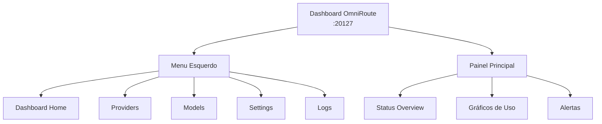

# Capítulo 2: Acessando e Navegando o Dashboard

## 1. Introdução

No Capítulo 1, você entendeu a **arquitetura** de OmniRoute. Agora vamos explorar o **painel de controle** — o lugar onde você configura provedores, monitora credenciais e ajusta prioridades. O dashboard é sua sala de máquinas: sem ele, nenhuma configuração é possível.

## 2. Explica

O Dashboard OmniRoute é uma **interface web centralizada** que expõe três funções principais:

1. **Provider Registry**: Gerenciar conexões com provedores (adicionar, remover, ativar/desativar)
2. **Model Inventory**: Ver quais modelos estão disponíveis após conectar os provedores
3. **Operations**: API Keys, logs, billing, rate limiting

Diferente de cada provedor ter seu próprio console (Google Cloud, OpenAI, Anthropic), aqui você tem tudo em um lugar. Isso reduz tempo de administração drasticamente — em vez de clicar em 5 consoles diferentes para ver status, você abre um dashboard.

## 3. Ilustra

Imagine o dashboard como um **painel de controle de um avião**, onde cada gauge representa um provedor:

- **Velocidade (modelo)**: Qual modelo está ativo agora? (gpt-4, gemini-pro, llama-70b)
- **Altitude (créditos)**: Quantos créditos sobraram? (300/300 Vertex, $5.00 Anthropic)
- **Combustível (rate limit)**: Quantas requisições por minuto você pode fazer?
- **Alarmes (status)**: Algum provedor está desconectado? (vermelho = OFF, verde = ON)



## 4. Técnica

### Acessar o Dashboard — Passo a Passo

**URL:**
```
http://81.17.103.186:20127
```

**Credenciais padrão:**
- Usuário: `admin`
- Senha: `omniroute_2026`

**Procedimento:**

1. Abra seu navegador (Chrome, Firefox, Safari, Edge)
2. Digite a URL na barra de endereços
3. Você verá uma tela de login
4. Insira as credenciais
5. Clique em **LOGIN** ou pressione ENTER
6. Você será redirecionado para o Dashboard

### Estrutura do Menu

Após login, você verá o menu esquerdo com as seguintes opções:

| Seção | Para quê | Acesso |
|---|---|---|
| **Dashboard** | Ver visão geral, status dos provedores, gráficos de uso | Home do dashboard |
| **Providers** | Adicionar, remover, ativar/desativar provedores | Gerenciar conexões |
| **Models** | Ver modelos disponíveis, testar cada um | Descobrir capacidades |
| **Settings** | Gerar API Keys, configurar rate limits, preferências | Administração |
| **Logs** | Ver histórico de requisições, erros, latência | Debugging |

### Tela Principal — Dashboard Home

Após fazer login, você vê um painel com:

- **Status Overview**: Quantos provedores estão ON/OFF
- **Total Requests**: Número de requisições processadas no período
- **Models Available**: Contagem de modelos únicos conectados
- **Credits Remaining**: Barra de progresso dos créditos (por provedor)

### Testando Conexão — Health Check

Se tiver problema ao acessar:

```bash
# Verificar se o container está rodando
ssh root@81.17.103.186 "docker ps | grep omniroute"

# Resultado esperado:
# aaaa1111 omniroute:latest ... Up 5 hours 0.0.0.0:20127->8080/tcp
```

Se houver erro, aguarde 30 segundos (pode estar iniciando) ou reinicie:

```bash
ssh root@81.17.103.186 "docker restart omniroute"
```

## 5. Aplica

### Cenário: Seu time precisa de acesso ao OmniRoute

**Situação:** Você é DevOps em uma startup de 10 pessoas. Apenas você tem a senha do OmniRoute, mas agora a equipe de ML quer monitorar os créditos e o time de produto quer testar modelos diferentes. Você diz "não posso compartilhar a senha admin com todos".

**Erro plausível:** Você mantém tudo centralizado em uma única conta admin. Quando você sai de férias, ninguém consegue adicionar um novo provedor ou investigar um erro.

**Diagnóstico:** Falta de **separação de privilégios**. Produção robusto exige granularidade: alguns usuários só podem ler logs, outros podem adicionar provedores, apenas admin pode mudar rate limits.

**Correção:** 

Crie usuários adicionais via **Settings → Users**:
- Malte (ML team): Acesso apenas para ver Models e Logs (leitura)
- Clara (Product): Acesso para testar Models, sem poder mudar Provider
- Você (DevOps): Acesso total (admin)

Cada um acessa o mesmo dashboard em `http://81.17.103.186:20127` com suas credenciais próprias.

### Armadilhas Comuns

1. **Compartilhar a senha admin** — Crie usuários em vez disso; nunca espalhe credenciais.
2. **Deixar o navegador aberto no computador compartilhado** — Logout sempre quando terminar.
3. **Usar credenciais default em produção** — Após primeiro acesso, mude a senha em **Settings → Account**.

## 6. Conclusão

O dashboard é seu espaço seguro de administração. Você explorará suas abas (Providers, Models, Logs) nos próximos capítulos. Por enquanto, a lição é simples: **você deve conseguir fazer login sem erros**. Se não conseguir, investigue antes de prosseguir.

## 7. Referências Bibliográficas

[1] OWASP. *Authentication Cheat Sheet*. Disponível em: https://cheatsheetseries.owasp.org/cheatsheets/Authentication_Cheat_Sheet.html. Acesso em: 24 ago. 2026.

[2] Docker Logs Documentation. *Docker Logging Driver*. Disponível em: https://docs.docker.com/config/containers/logging/. Acesso em: 24 ago. 2026.
