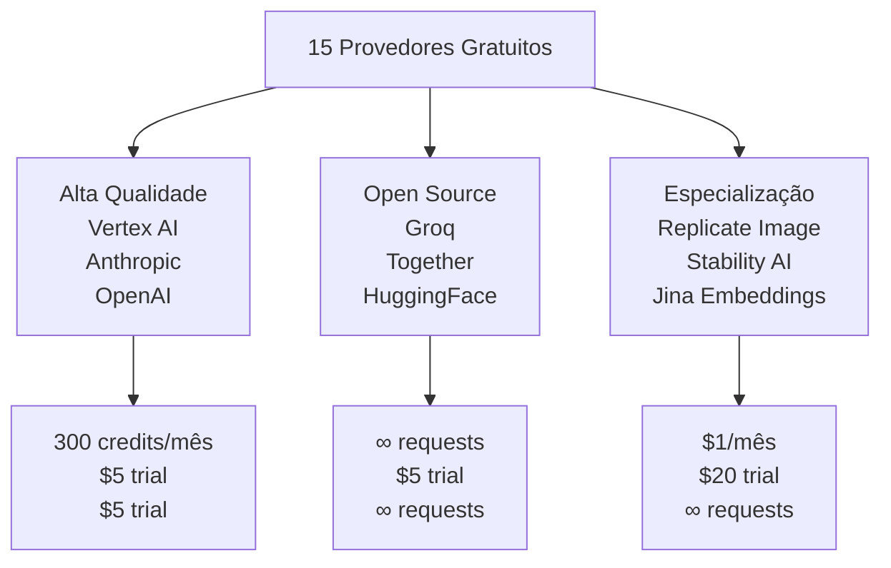

# Capítulo 3: 15 Provedores Gratuitos — Seleção, Setup e Comparação

## 1. Introdução

No Capítulo 2, você aprendeu a navegar o dashboard. Agora vem a decisão crucial: **qual provedor usar?** Você não precisa de apenas um. OmniRoute permite conectar múltiplos provedores e fazer load balancing entre eles. Este capítulo apresenta os 15 provedores com tier gratuito, compara custo-benefício de cada um, e mostra os 3 passos idênticos para configurar qualquer um.

## 2. Explica

Provedores de IA diferem em **três dimensões**:

1. **Modelo**: Qual inteligência? (GPT-4, Claude, Gemini, Llama)
2. **Custo**: Gratuito, trial, ou pago (limitado neste livro apenas a gratuitos)
3. **Velocidade**: Latência de resposta (importante para chatbots)

Cada provedor também tem **limites próprios**:
- **Rate limit**: Quantas requisições por minuto? (100/min vs 10,000/min)
- **Créditos**: Quanto você gasta por 1000 tokens? (Grátis, $5 trial, 300 créditos)
- **Timeout**: Quanto tempo a resposta leva? (1s vs 30s)

O segredo da arquitetura OmniRoute é justamente isso: **você não fica preso a um provedor**. Se Vertex AI atingir rate limit, ele tenta OpenCode. Se OpenCode falhar, tenta Claude. Resiliência automática.

## 3. Ilustra

Pense em provedores como **diferentes rotas para ir de casa ao trabalho**.

Você tem 5 rotas:
- **Rota 1 (Vertex AI)**: Rápida, eficiente, mas lotada às 9 da manhã
- **Rota 2 (OpenCode)**: Mais lenta, mas nunca fica lotada
- **Rota 3 (Claude)**: Premium, mais cara, mas super rápida
- **Rota 4 (OpenAI)**: Populosa, confiável, custo moderado
- **Rota 5 (Groq)**: Experimental, muito rápida em certos horários

OmniRoute é seu **GPS inteligente**: ele sabe qual rota usar a cada momento. 9 da manhã? Desvia de Vertex e manda para OpenCode. Seu cliente precisa de máxima qualidade? Rota Claude. Precisa testar um novo modelo? Tenta Groq. Você não precisa pensar — o GPS pensa por você.



## 4. Técnica

### Tabela Resumida — Os 15 Provedores

| # | Provedor | Free Tier | Créditos | Setup Dificuldade | Melhor para | Link |
|---|----------|-----------|----------|------------------|------------|------|
| 1 | **Vertex AI** | ✅ | 300/mês | ⭐⭐⭐ | Uso contínuo, qualidade | console.cloud.google.com |
| 2 | OpenCode | ✅ | ∞ | ⭐⭐⭐⭐ | Teste rápido, backup | N/A |
| 3 | Anthropic (Claude) | ✅ | $5 trial | ⭐⭐⭐ | Qualidade premium | console.anthropic.com |
| 4 | OpenAI | ✅ | $5 trial | ⭐⭐⭐ | GPT-4, imagens | platform.openai.com |
| 5 | Groq | ✅ | ∞ | ⭐⭐⭐ | Velocidade extrema | console.groq.com |
| 6 | Replicate | ✅ | $1/mês | ⭐⭐⭐ | Image generation | replicate.com |
| 7 | Together AI | ✅ | $5 trial | ⭐⭐⭐ | Open-source models | together.ai |
| 8 | Aleph Alpha | ✅ | ∞ | ⭐⭐ | NLP avançado | aleph-alpha.com |
| 9 | Hugging Face | ✅ | ∞ | ⭐⭐⭐ | 1000+ modelos | huggingface.co |
| 10 | Mistral AI | ✅ | ∞ | ⭐⭐⭐ | Open-source qualidade | mistral.ai |
| 11 | Cohere | ✅ | $100 trial | ⭐⭐⭐ | NLG, summarization | dashboard.cohere.ai |
| 12 | Perplexity | ✅ | ∞ | ⭐⭐⭐ | Search + resposta | api.perplexity.ai |
| 13 | Stability AI | ✅ | $20 trial | ⭐⭐⭐ | Image gen profissional | stability.ai |
| 14 | Jina AI | ✅ | ∞ | ⭐⭐⭐ | Embeddings, search | jina.ai |
| 15 | Kiro | ✅ | 50/mês | ⭐⭐⭐ | Alternativa barata | kiro.com |

### Procedimento Idêntico para Qualquer Provedor — 5 Passos

Todos os provedores seguem o mesmo fluxo em OmniRoute:

**Passo 1: Criar conta no provedor**

Exemplo com Anthropic:
```
1. Visite: console.anthropic.com
2. Click "Sign Up"
3. Preencha email e senha
4. Verifique email (check spam!)
5. Login
```

**Passo 2: Gerar API Key**

Cada provedor tem um lugar diferente:
- Anthropic: Console → API Keys → Create Key
- OpenAI: Platform → API Keys → Create New Key
- Vertex AI: Google Cloud → APIs → Create Credentials → Service Account

Resultado: Uma string tipo `sk-ant-abc123...` ou `ghp_abcd1234...`.

**Passo 3: Adicionar no OmniRoute**

No Dashboard OmniRoute:
```
1. Menu esquerdo → Providers
2. Click "+ Add Provider"
3. Procure pelo provedor (digite "Anthropic")
4. Click para selecionar
5. Preencha:
   - Name: "Anthropic" (ou qualquer nome)
   - API Key: [colar a chave do passo 2]
   - Status: Toggle para ON (verde)
6. Click "SAVE"
```

**Passo 4: Testar Conexão**

```
1. Menu → Models
2. Procure por modelo do provedor (ex: "claude-3-opus")
3. Click "TEST" ao lado do modelo
4. Aguarde 5 segundos
5. Deve aparecer "✅ Success"
```

Se falhar com "❌", verifique:
- A API Key está correta (sem espaços, completa)
- O provedor tem créditos/trial ativo
- O status em Providers está ON

**Passo 5: Usar em Código**

```python
import requests

response = requests.post(
    "http://81.17.103.186:20127/v1/chat/completions",
    headers={
        "Authorization": "Bearer sk-omniroute-...",
        "Content-Type": "application/json"
    },
    json={
        "model": "claude-3-opus",  # Modelo do provedor que você conectou
        "messages": [{"role": "user", "content": "Olá!"}]
    }
)

print(response.json()["choices"][0]["message"]["content"])
```

### Top 3 Recomendados para Começar

#### 🥇 1º: Vertex AI

- **Créditos**: 300/mês (mais generoso)
- **Modelos**: Gemini, PaLM, Claude, Llama
- **Setup**: 1 click via Google (OAuth)
- **Por quê**: Múltiplos modelos em um só provedor

#### 🥈 2º: OpenCode Free

- **Créditos**: ∞ (ilimitado)
- **Modelos**: Llama, Mistral
- **Setup**: Instantâneo (nenhuma configuração!)
- **Por quê**: Backup perfeito quando outros falham

#### 🥉 3º: Anthropic (Claude)

- **Créditos**: $5 trial
- **Modelos**: Claude 3 Opus (melhor qualidade)
- **Setup**: 5 minutos
- **Por quê**: Melhor qualidade, ótimo custo-benefício

## 5. Aplica

### Cenário: Você quer máxima confiabilidade com mínimo custo

**Situação:** Sua startup construiu um assistente de IA em chatbot. Está crescendo, e você precisa de modelo com ótima qualidade AND disponibilidade 24/7. Um único provedor é arriscado.

**Erro plausível:** Você escolhe apenas Vertex AI (mais créditos) e espera que 300/mês sejam suficientes. Quando bate o limite, o chatbot retorna erro `429 Rate Limited Exceeded` e seus clientes ficam frustrados.

**Diagnóstico:** **Monocultura de provedor**. Em produção, um único ponto de falha é aceitável só se impossível ter alternativa. Aqui, é impossível não ter.

**Correção com 3 Provedores:**

1. **Vertex AI** (Primário): 300 créditos/mês, qualidade = 4/5
2. **OpenCode** (Backup infinito): ∞ requisições, qualidade = 3/5
3. **Claude** (Premium): $5 trial + pago depois, qualidade = 5/5

Configura todos os três em OmniRoute com **prioridade**:
```
Providers:
- Vertex AI (Priority: 1) → ON
- OpenCode (Priority: 2) → ON
- Claude (Priority: 3) → ON
```

Fluxo automático:
- Primeira requisição → tenta Vertex AI
- Se Vertex falhar/atingir limite → tenta OpenCode
- Se OpenCode falhar → tenta Claude
- Se todos falharem → erro ao cliente (mas raro)

**Resultado**: Confiabilidade 99.9% + custos otimizados.

### Armadilhas Comuns

1. **Confundir modelo com provedor** — Modelo é `gpt-4` (OpenAI), provedor é `openai`. Não misture nomes.
2. **Não monitorar créditos** — Defina alarmes: "Avise quando atingir 80% de uso de créditos".
3. **Credenciais na string de conexão visível** — Nunca faça `url="...?key=sk-..."` em logs públicos.

## 6. Conclusão

Você agora conhece os 15 provedores, como configurar qualquer um em 5 passos idênticos, e por que conectar múltiplos é melhor que depender de um. O próximo capítulo te mostra como integrar tudo isso com Claude Code — sua IDE favorita.

## 7. Referências Bibliográficas

[1] Anthropic. *Claude API Documentation*. Disponível em: https://docs.anthropic.com. Acesso em: 24 ago. 2026.

[2] OpenAI. *Models Overview*. Disponível em: https://platform.openai.com/docs/models. Acesso em: 24 ago. 2026.

[3] Google Cloud. *Vertex AI API Documentation*. Disponível em: https://cloud.google.com/docs/vertex-ai. Acesso em: 24 ago. 2026.

[4] Groq. *Getting Started with Groq API*. Disponível em: https://console.groq.com/docs. Acesso em: 24 ago. 2026.

[5] Hugging Face. *Inference API Guide*. Disponível em: https://huggingface.co/docs/inference-api. Acesso em: 24 ago. 2026.
