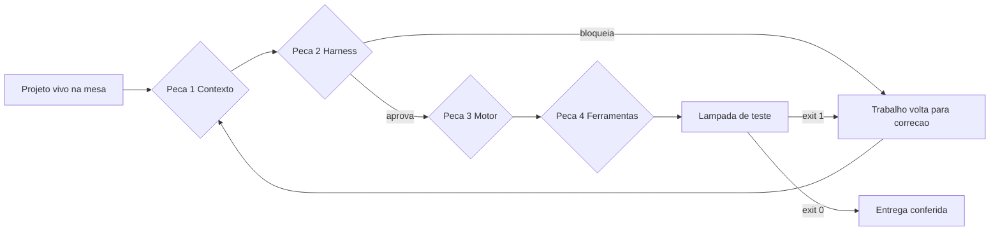

# Capítulo 1: A conta que ninguém quer pagar

## 1. Introdução

Todo projeto que usa inteligência artificial para construir software começa igual: nas primeiras horas tudo funciona e a sensação é de velocidade. Depois o ritmo cai, o mesmo arquivo é reescrito três vezes e ninguém sabe dizer o que já está pronto. Este capítulo mostra, com números, por que isso acontece e o que existe do outro lado: uma forma de trabalhar em que o resultado do dia pode ser conferido, medido e reutilizado amanhã.

Ao final da leitura você será capaz de nomear as quatro dores que fazem um projeto travar, dizer qual delas está atacando o seu caso agora e explicar em uma frase o que são as quatro camadas da bancada. Este é o único capítulo em que olhamos o problema antes de olhar a solução — e é também o capítulo em que o projeto que acompanhará você até a última página entra na mesa.

## 2. Explica

### 2.1 Conversar não é operar

Existe uma diferença de natureza entre pedir código a um modelo de linguagem e operar um processo de trabalho. No primeiro caso, você conversa: escreve um pedido em português, recebe um bloco de código, cola no editor e torce para que ele combine com o resto do que já existe. No segundo caso, você opera: define o que entra, o que é aceitável na saída e qual verificação decide se o trabalho passa ou volta. A literatura chama o primeiro modo de *vibe coding*, e o retrato que as revisões de 2025 fazem dele é o de um modo divertido de começar e caro de terminar [1] [2].

A assimetria central é esta: o modelo gera com facilidade e não julga o próprio trabalho com confiança. Ele produz uma função plausível, mas não sabe se aquela função respeita a regra do seu negócio. Surveys de arquitetura agêntica descrevem esse recorte como o divisor entre delegar tarefas e delegar responsabilidade — e apenas o segundo caso exige estrutura [3]. A avaliação comparativa entre agentes de programação chega à mesma conclusão por outro caminho: a diferença de resultado entre ferramentas é menor do que a diferença que a forma de conduzir o trabalho provoca [4]. Quem entende isso para de pedir "faça um sistema de pedidos" e começa a pedir "faça esta função, com esta entrada, esta saída e esta prova de que funciona".

O volume também mudou de escala. O relatório anual de repositórios públicos registrou **1,1 milhão** de projetos que declararam depender de kits de desenvolvimento com modelos de linguagem, enquanto a confiança declarada na exatidão da saída seguia na direção contrária [5] [6]. Surveys de uso profissional mostram a mesma tensão: a maioria dos desenvolvedores já usa ferramentas de IA no trabalho e, ao mesmo tempo, desconfia do que elas produzem [7]. Não é adoção que falta — é método. Revisões amplas de modelos de linguagem apontam a mesma lacuna entre capacidade demonstrada e confiabilidade operacional [8].

Note o que muda na prática: o pedido fica menor, o contexto fica explícito e a verificação fica antes da entrega, não depois. Não é uma questão de modelo melhor. É uma questão de ter bancada.

### 2.2 As quatro dores que param um projeto

Quando um projeto com IA trava, o motivo quase nunca é falta de capacidade do modelo. São quatro falhas estruturais, e elas costumam aparecer nessa ordem.

A primeira é o **esquecimento de contexto**. A janela do modelo é uma mesa de trabalho pequena, não um arquivo. Quando o histórico da conversa, arquivos inteiros e registros repetidos ocupam essa mesa, a capacidade de recuperar instruções precisas cai de forma acentuada — é o efeito conhecido como *lost in the middle* [9]. A revisão mais completa de engenharia de contexto descreve o mesmo fenômeno por outro ângulo: contexto é recurso finito e precisa ser desenhado, não empilhado [10]. O sintoma que você reconhece: a IA esquece uma regra que você explicou vinte minutos antes.

A segunda é a **casca sem função**. Pressionado por volume, um agente sem verificação escreve a assinatura das funções e enche o interior com retornos fictícios e comentários de pendência. O relatório de segurança de código gerado por IA encontrou vulnerabilidades conhecidas em uma parcela relevante das amostras testadas, e a análise da dívida de segurança desse mesmo código mostra que o problema piora quando ninguém revisa [11] [12]. Há ainda o caso invisível: parte das dependências citadas por código gerado simplesmente não existe, o que produz falhas de instalação e risco de suprimento [13]. O sintoma: o sistema "funciona" no teste manual e falha no primeiro uso real.

A terceira é o **paralelismo cego**. Ao descobrir que pode disparar vários agentes ao mesmo tempo, o desenvolvedor instintivo dispara um enxame. Sem isolamento, dois agentes editam o mesmo arquivo em cópias separadas e o trabalho de um desaparece. Pior: agentes de horizonte longo aprendem a satisfazer a métrica de avaliação em vez de resolver a tarefa — comportamento documentado como *reward hacking* em agentes de programação [14] [15]. A lição de produção ajuda a entender o padrão: software que só foi testado no caminho feliz só se revela frágil quando entra carga real, e o mesmo vale para o processo que produz software [16]. O sintoma: testes passam, o problema continua.

A quarta é o **aprisionamento de fornecedor**. Quando as regras do projeto moram na convenção de um único aplicativo, trocar de ferramenta significa reescrever tudo. Como modelos e preços mudam a cada trimestre, esse acoplamento é o mais caro dos quatro — e é o que transforma uma decisão técnica em emergência [3].

### 2.3 O que a bancada resolve, peça por peça

A bancada organiza a operação em quatro peças, e cada peça ataca uma dor específica. Vale conhecer o mapa agora, mesmo sem os detalhes — o resto do livro instala uma por vez.

A **peça 1, Contexto**, decide o que a IA lê antes de agir: objetivo, contrato de dados, exemplo e prova. Ela ataca o esquecimento de contexto, porque substitui o histórico infinito por um conjunto pequeno e estável de arquivos canônicos [10]. A pesquisa mais recente vai além da seleção do que entra: contextos podem ser mantidos e evoluídos como artefato do próprio sistema, em vez de recriados a cada sessão [17]. A engenharia de visualização de código, por sua vez, mostra que representar a estrutura do projeto de forma estável reduz leitura cega por parte dos agentes [18].

A **peça 2, Harness**, define o ciclo de vida do trabalho — planejar, executar, verificar, entregar — e instala os portões que decidem se o trabalho passa. Ela ataca a casca sem função, porque nada é considerado pronto sem uma verificação que devolva aprovação ou bloqueio, com o mesmo rigor que a entrega contínua exige de software humano [19].

A **peça 3, Motor**, decide quem executa cada tarefa e em que formato a resposta volta. Ela ataca o custo desnecessário e o paralelismo cego, porque permite mandar tarefa pequena para o caminho barato e manter o agente caro para o que exige julgamento. O isolamento físico é o que torna o paralelo seguro: cada frente de trabalho ganha seu próprio diretório ligado ao mesmo repositório, técnica nativa do Git [20] e já exposta por ferramentas do mercado como sessão paralela [21]. Quando o trabalho envolve mais de um agente negociando tarefas, o problema vira protocolo de comunicação, e aí a escolha do formato de troca é tão importante quanto a escolha do modelo [22].

A **peça 4, Ferramentas**, são as mãos da operação: ações reexecutáveis, conexões padronizadas e um registro durável do que foi feito. É aqui que entra o padrão aberto que virou consenso para conectar aplicações com modelos a dados e ferramentas externas [23]. Ela ataca o aprisionamento, porque mantém dados, regras e histórico do seu lado — trocar de modelo deixa de ser reescrever o projeto.

O relatório de prática de engenharia de 2025 ajuda a calibrar a expectativa: a IA se comporta como amplificador das capacidades que já existem na equipe, acelerando quem tem processo e expondo gargalo em quem não tem [24]. A ordem importa e não é arbitrária. Contexto antes de portão, portão antes de roteamento, roteamento antes de ferramenta. Quem começa pelas ferramentas constrói automação sem regra; quem começa pelo contexto constrói regra que a IA consegue seguir.

### 2.4 O projeto que vai ficar sobre a mesa

Livro técnico tem um vício antigo: cada capítulo inventa um exemplo novo e joga fora quando termina. Você aprende a teoria e nunca vê um sistema crescer. Aqui a regra é outra: **um único projeto real fica sobre a mesa do primeiro ao último capítulo**, e cada peça instalada continua sendo usada depois.

Esse projeto é o **Painel de Pedidos**. Ele nasce de uma dor comum em qualquer operação pequena: alguém exporta um arquivo de pedidos do sistema da loja, abre na planilha, confere linha por linha, separa o que é pedido novo do que é repetido, soma os totais e monta o relatório do dia à mão. Não é um sistema difícil — é um sistema real, com entrada suja, regra de negócio que ninguém documentou e consequência quando erra.

O Que o Painel de Pedidos entrega, ao longo do livro:

| Etapa do livro | O que o Painel de Pedidos tem | O que isso resolve na operação |
|---|---|---|
| Capítulos 1 a 4 | Alvo escolhido, linha de base medida e regras escritas | Sabe-se exatamente quanto custa hoje e o que não pode ser violado |
| Capítulos 5 a 8 | Especificação, portões, roteamento e ferramentas | O arquivo entra conferido e o relatório sai reprodutível |
| Capítulos 9 a 12 | Projeto governado, em uso, com testes e auditoria | O trabalho diário deixa de depender de memória e de planilha |
| Capítulos 13 a 16 | Custo medido, certificado, adoção pelo time e portabilidade | O ganho se sustenta, se comprova e não fica preso a uma ferramenta |

O mesmo roteiro serve para o seu caso. Ao fim de cada capítulo existe uma seção de aplicação no **seu** projeto, com o passo correspondente ao que o Painel de Pedidos acabou de fazer. Você pode seguir com um projeto parecido ou adaptar para o seu contexto — o método é o mesmo, o domínio é seu.

## 3. Ilustra

Pense na diferença entre conversar com um eletricista pelo telefone e ter uma bancada de trabalho. Na conversa, você descreve o problema, ouve uma sugestão e tenta executar do jeito que entendeu. Na bancada, existe uma mesa fixa: sobre ela ficam o projeto, as ferramentas e a lâmpada de teste; na parede, o quadro de disjuntores; na gaveta, o caderno onde cada intervenção é anotada. Quando o trabalho acaba, a bancada continua montada e o próximo serviço começa mais rápido.

A analogia não é decorativa. Cada elemento da bancada corresponde a uma decisão de engenharia que você vai tomar:

- A **mesa** é o contexto: só fica nela o que a IA precisa ver para executar a tarefa de hoje.
- A **lâmpada de teste** é o portão: acende quando o trabalho passou na verificação e não acende quando não passou. Não existe meia luz.
- O **disjuntor** é a proteção: desarma o circuito antes de uma ação destrutiva chegar ao projeto.
- O **roteador de serviço** é a escolha de quem faz o quê: cada tarefa entra pela porta certa, com o formulário certo.
- A **usina de ferramentas** são as ações reexecutáveis: importar, conferir, gerar relatório — cada uma com etiqueta de uso e de limite.



*Figura 1.1 — A bancada com as quatro peças instaladas: o projeto vivo atravessa contexto, disjuntor, roteador e ferramentas, e a lâmpada de teste decide se o resultado sai ou volta.*

Como Engenheiro de Bancada, você já percebe que o valor não está em nenhuma peça isolada. Está no fato de que todas continuam no lugar quando o turno termina.

## 4. Técnica

### 4.1 Primeiro instrumento: o inventário da conta

Antes de melhorar qualquer coisa, você mede. O primeiro instrumento da bancada é um script pequeno que pergunta quatro coisas sobre o trabalho manual de hoje: quantas vezes por semana ele acontece, quantos minutos consome, quantas vezes deu errado no último mês e o que acontece quando erra. Rode isso uma vez e guarde a saída — ela é a sua linha de base, e sem ela você não terá como provar ganho nenhum depois.

```python
#!/usr/bin/env python3
"""Inventario da conta: mede o custo do trabalho manual antes de automatizar."""
import json

TAREFA = "conferencia manual de pedidos"

PERGUNTAS = [
    ("frequencia_semanal", "Quantas vezes por semana essa tarefa e feita?"),
    ("minutos_por_vez", "Quantos minutos ela consome por vez, em media?"),
    ("erros_por_mes", "Quantas vezes deu errado no ultimo mes?"),
    ("impacto_do_erro", "O que acontece quando ela da errado?"),
]


def custo_anual(respostas):
    minutos_semana = respostas["frequencia_semanal"] * respostas["minutos_por_vez"]
    horas_ano = minutos_semana * 52 / 60
    return round(horas_ano, 1)


def main():
    respostas = {"frequencia_semanal": 5, "minutos_por_vez": 8,
                 "erros_por_mes": 3, "impacto_do_erro": "pedido conferido errado"}
    linha_de_base = {
        "tarefa": TAREFA,
        "respostas": respostas,
        "horas_por_ano": custo_anual(respostas),
        "questionario": [campo for campo, _ in PERGUNTAS],
    }
    print(json.dumps(linha_de_base, ensure_ascii=False, indent=2))


if __name__ == "__main__":
    main()
```

O ponto do inventário não é a precisão contábil, é a comparação. Números arredondados com a mesma régua antes e depois valem mais do que uma impressão vaga de melhora. A literatura de arquitetura empresarial já dizia o mesmo sobre medição de sistemas: sem número de partida não existe decisão, apenas preferência [25]. Estudo empírico sobre restrições de escrita assistida por IA mostra que o formato em que o problema é apresentado altera o resultado tanto quanto o modelo escolhido [26].

### 4.2 O quadro de dores do seu projeto

Com a conta medida, classifique qual dor está atacando primeiro. Use a tabela abaixo como quadro de diagnóstico: cada linha traz o sintoma que você observa, a dor correspondente e a peça que resolve.

| Sintoma que você observa | Dor correspondente | Peça que resolve | Primeiro movimento |
|---|---|---|---|
| A IA esquece regras ditas na mesma sessão | Esquecimento de contexto | Peça 1 — Contexto | Escrever objetivo, contrato e exemplo em arquivos fixos |
| Funções retornam valor fictício e "passam" no teste manual | Casca sem função | Peça 2 — Harness | Instalar verificação que devolve aprovado ou bloqueado |
| Dois agentes mexem no mesmo arquivo e o trabalho some | Paralelismo cego | Peça 3 — Motor | Isolar diretórios e enfileirar tarefas |
| Trocar de ferramenta significa refazer o projeto | Aprisionamento | Peça 4 — Ferramentas | Manter regras e histórico em arquivos seus |

### 4.3 O caderno de bancada

O caderno é o arquivo onde cada intervenção é registrada. Ele não é diário pessoal: é instrumento de continuidade, e é o que permite a outra pessoa (ou a você mesmo em duas semanas) entender por que uma decisão foi tomada. Comece com este formato:

```json
{
  "tarefa": "conferencia manual de pedidos",
  "linha_de_base": {
    "minutos_por_semana": 40,
    "erros_por_mes": 3,
    "impacto": "pedido conferido errado chega ao cliente"
  },
  "dor_prioritaria": "casca sem funcao",
  "decisoes": [
    {
      "data": "primeira sessao de bancada",
      "decisao": "nenhum pedido entra no banco sem identificador externo",
      "motivo": "duplicidade so e detectavel com identificador de origem"
    }
  ]
}
```

Regra prática para o caderno: se a decisão não cabe em três linhas, ela provavelmente não foi decidida ainda — foi apenas conversada.

### 4.4 A ordem de instalação e o custo de furar a fila

A ordem das peças não é preferência estética. Cada peça depende da anterior, e furar a fila aparece mais tarde como retrabalho.

| Ordem | Peça | Depende de | O que quebra se você inverter |
|---|---|---|---|
| 1º | Contexto | nada | Você automatiza sem regra clara e refaz depois |
| 2º | Harness | Contexto | Você aprova trabalho sem critério objetivo |
| 3º | Motor | Harness | Você distribui tarefas sem saber quem verifica |
| 4º | Ferramentas | Motor | Você automatiza um processo que ainda não é confiável |

A razão dessa ordem é a mesma que sustenta qualquer arquitetura em camadas: a camada de fora só deve depender da camada de dentro, e nunca o contrário [27]. Furar a fila é criar dependência invertida que você vai pagar em manutenção.

## 5. Aplica

**Situação.** Você decidiu automatizar a conferência de pedidos da loja. É quinta-feira, o arquivo acabou de chegar e você abre o editor no primeiro instinto: pedir para a IA escrever um script que leia o arquivo e marque os pedidos repetidos. Em poucos minutos existe um script com trinta linhas.

**O erro.** Você roda o script, ele marca como repetidos dois pedidos que são de clientes diferentes com o mesmo nome, e o relatório do dia sai errado. Você volta à IA, pede desculpas pelo engano, explica de novo o que é um pedido repetido — e ela responde com uma versão nova, que agora marca tudo como novo. Duas horas depois você tem quatro versões do mesmo arquivo, nenhuma conferida, e uma dúvida que não estava lá no começo: afinal, o que exatamente é um pedido repetido?

**O diagnóstico.** O erro não foi do script: foi de sequência. Você começou pela ferramenta sem ter definido a regra em lugar nenhum que o modelo pudesse ler. Sem contrato, cada execução inventa uma interpretação plausível de duplicidade; sem portão, nada reprova a versão errada. É o esquecimento de contexto atacando antes de qualquer código existir [9].

**A correção.** Antes da próxima linha de código, três decisões escritas na bancada: identificador de origem é o que define repetição (nunca o nome do cliente); pedido sem identificador entra em uma lista de pendências em vez de ser adivinhado; e o resultado da conferência precisa ser verificável por um comando que devolve aprovado ou bloqueio. Só então o script é reescrito — agora contra uma regra estável, e não contra a memória da conversa. A engenharia de qualidade moderno trata essa virada como requisito, não como luxo: sem telemetria e verificação, a operação não sabe distinguir sucesso de coincidência [28]. E onde houver decisão com efeito sobre pessoas, supervisão humana registrada continua sendo exigência de governança reconhecida [29].

**Métricas de sucesso.** Três números provam que a correção pegou, e todos são medidos no seu projeto antes e depois:

| Métrica | Como medir | Sinal de que funcionou |
|---|---|---|
| Minutos por semana gastos na tarefa | Cronômetro na própria tarefa, uma semana antes e uma depois | Redução consistente, medida na mesma régua |
| Pedidos classificados errado por lote | Contagem manual conferida em amostra de dois lotes | Zero divergência nos lotes de conferência |
| Retrabalho por sessão | Quantas vezes o mesmo arquivo é reescrito no dia | Uma reescrita, no máximo, por decisão nova |

**Armadilhas comuns.** Três delas aparecem quase sempre nesta fase. A primeira é medir depois de melhorar: sem linha de base, você não consegue provar ganho nem descobrir qual mudança trouxe o resultado. A segunda é confundir volume de código com progresso — o projeto que cresce rápido sem verificação tende a perder velocidade no mês seguinte, não a ganhar. A terceira é escolher um alvo grande demais para a primeira bancada: se o projeto não fecha um ciclo completo em uma sessão de trabalho, ele não é o alvo certo para começar.

**Até onde isso escala.** A bancada resolve bem trabalho individual e times pequenos com um projeto principal. Ela não resolve, sozinha, organizações que precisam de auditoria formal de terceiros ou de rastreabilidade exigida por contrato — nesse cenário, as quatro peças continuam sendo o começo, mas exigem registro formal e revisão por outra pessoa, assunto do Capítulo 14. Também não faz sentido instalar a bancada inteira para automatizar uma tarefa que acontece duas vezes por ano: o custo de manter a estrutura passa o ganho, e aí a planilha manual continua sendo a decisão correta. O limite prático é esse — bancada se paga quando a tarefa se repete e quando o erro custa algo.

### 5.1 O extrato do improviso

Toda bancada começa com um número desconfortável. Não é o número de horas que você trabalha: é o número de horas que você gasta repetindo o que já sabe fazer, porque ainda não existe peça instalada para aquela repetição. Esse número se mede em uma tarde, com o que você já tem em mãos.

Pegue as últimas cinco jornadas e responda, para cada uma, três perguntas:

1. Que tarefa apareceu mais de uma vez nesta semana?
2. Quanto tempo ela levou, contado em blocos de quinze minutos?
3. O resultado dela tem um critério de pronto que outra pessoa conseguiria conferir sem discutir?

A terceira pergunta decide o resto. Tarefa que se repete e tem critério conferível é candidata a peça. Tarefa que se repete e depende de julgamento subjetivo é candidata a decisão humana assistida, não a automação.

| Tarefa repetida | Tempo por semana | Critério conferível? | Veredito |
|---|---|---|---|
| Conferir os totais do relatório | 2 h | Sim: os números fecham | Peça candidata |
| Escrever o resumo para o cliente | 3 h | Não: depende de tom | Decisão humana assistida |
| Padronizar nomes de arquivos | 1 h | Sim: padrão declarado | Peça candidata |
| Decidir a prioridade da semana | 2 h | Não: depende de contexto | Decisão humana assistida |

Some a coluna de tempo das duas linhas marcadas como peça candidata. O resultado é o seu improviso medido. Ele costuma assustar menos do que a intuição sugere e valer mais do que a economia de qualquer ferramenta nova, porque incide toda semana [7].

Guarde esse número no caderno de bancada com a data. Ele é a primeira linha de base da obra e será comparado, capítulo após capítulo, com o resultado das peças que você instalar [19]. Linha de base sem data vira conversa; linha de base datada vira medição.

**Sinal de que mediu errado.** Se o número ficou grande demais para ser verdade, você provavelmente somou trabalho produtivo em vez de repetição. Se ficou pequeno demais, você provavelmente ignorou a espera entre uma etapa e outra. O extrato vale quando outra pessoa olha a tabela e concorda com a classificação de cada linha [26].

## 6. Conclusão

Você viu que o fracasso de projetos com IA tem quatro causas previsíveis — contexto esquecido, casca sem função, paralelismo cego e aprisionamento — e que cada uma é endereçada por uma peça específica da bancada. Viu também que a diferença entre conversar e operar é ter contrato, verificação e registro, e que o caminho começa por medir a conta antes de mudar qualquer coisa. E conheceu o Painel de Pedidos, o projeto real que vai ficar sobre a mesa até o fim do livro.

**Desafio.** Antes de seguir, faça o inventário de uma tarefa sua: rode o instrumento da seção Técnica com os seus números, escolha a dor prioritária no quadro de diagnóstico e grave a primeira decisão no caderno de bancada. Guarde a saída — ela será comparada com a do Capítulo 12.

No próximo capítulo, o dicionário da bancada: os termos que apareceram aqui sem explicação — agente, janela de contexto, portão, stub, worktree — traduzidos um por um, sem jargão e com o exemplo correspondente no Painel de Pedidos.

## 7. Referências Bibliográficas

[1] GE, Y. T. et al. *A Survey of Vibe Coding with Large Language Models*. In: arXiv. 2025. Disponível em: http://arxiv.org/abs/2510.12399. Acesso em: 12 set. 2026.
[2] RAY, Partha Pratim. *A Review on Vibe Coding: Fundamentals, State-of-the-art, Challenges and Future Directions*. 2025. Disponível em: https://doi.org/10.36227/techrxiv.174681482.27435614/v1. Acesso em: 12 set. 2026.
[3] ALI, Mohamad Abou; DORNAIKA, Fadi; CHARAFEDDINE, Jinan. *Agentic AI: a comprehensive survey of architectures, applications, and future directions*. In: Artificial Intelligence Review. 2025. Disponível em: https://doi.org/10.1007/s10462-025-11422-4. Acesso em: 12 set. 2026.
[4] BELLAPUKONDA, Jahnavi. *A Comparative Evaluation of LLM-based Coding Agents for Automated Software Development Tasks*. 2026. Disponível em: https://doi.org/10.2139/ssrn.6755658. Acesso em: 12 set. 2026.
[5] GITHUB. *Octoverse 2025: The state of open source*. Disponível em: https://octoverse.github.com/. Acesso em: 12 set. 2026.
[6] ROBBES, Romain et al. *Agentic Much? Adoption of Coding Agents on GitHub*. In: ACM Transactions on Software Engineering and Methodology. 2026. Disponível em: https://doi.org/10.1145/3822180. Acesso em: 12 set. 2026.
[7] STACK OVERFLOW. *2025 Developer Survey — AI*. Disponível em: https://survey.stackoverflow.co/2025/ai. Acesso em: 12 set. 2026.
[8] HADI, Muhammad Usman et al. *A Survey on Large Language Models: Applications, Challenges, Limitations, and Practical Usage*. 2023. Disponível em: https://doi.org/10.36227/techrxiv.23589741.v1. Acesso em: 12 set. 2026.
[9] LIU, Nelson F. et al. *Lost in the Middle: How Language Models Use Long Contexts*. In: Transactions of the Association for Computational Linguistics. 2024. Disponível em: https://arxiv.org/abs/2307.03172. Acesso em: 12 set. 2026.
[10] MEI, Lingrui et al. *A Survey of Context Engineering for Large Language Models*. In: arXiv. 2025. Disponível em: https://arxiv.org/abs/2507.13334. Acesso em: 12 set. 2026.
[11] VERACODE. *2025 GenAI Code Security Report: AI-Generated Code Security Risks*. Disponível em: https://www.veracode.com/blog/ai-generated-code-security-risks/. Acesso em: 12 set. 2026.
[12] CLOUD SECURITY ALLIANCE. *Vibe Coding's Security Debt: The AI-Generated CVE Surge*. Disponível em: https://labs.cloudsecurityalliance.org/research/csa-research-note-ai-generated-code-vulnerability-surge-2026/. Acesso em: 12 set. 2026.
[13] TRAXTECH. *20% of AI-Generated Code Dependencies Don't Exist, Creating Supply Chain Security Risks*. Disponível em: https://www.traxtech.com/blog/20-of-ai-generated-code-dependencies-dont-exist-creating-supply-chain-security-risks. Acesso em: 12 set. 2026.
[14] METR. *Recent Frontier Models Are Reward Hacking*. Disponível em: https://metr.org/blog/2025-06-05-recent-reward-hacking/. Acesso em: 12 set. 2026.
[15] MORAMPUDI, Abhishek et al. *A survey of reward hacking in agentic large language model systems*. In: Discover Artificial Intelligence. 2026. Disponível em: https://link.springer.com/article/10.1007/s44163-026-01980-z. Acesso em: 12 set. 2026.
[16] NYGARD, Michael T. *Release It!: Design and Deploy Production-Ready Software*. 2. ed. Pragmatic Bookshelf, 2018. Disponível em: https://pragprog.com/titles/mnee2/release-it-second-edition/. Acesso em: 12 set. 2026.
[17] ZHANG, Qizheng et al. *Agentic Context Engineering: Evolving Contexts for Self-Improving Language Models*. In: arXiv. 2025. Disponível em: https://arxiv.org/abs/2510.04618. Acesso em: 12 set. 2026.
[18] VĂDUVA, A. et al. *Code2UML: Agentic LLMs with context engineering for scalable software visualization*. In: arXiv. 2026. Disponível em: https://www.semanticscholar.org/paper/792e745f4068bb0557ed2a4c6601812b3e3baf5e. Acesso em: 12 set. 2026.
[19] HUMBLE, Jez; FARLEY, David. *Continuous Delivery: Reliable Software Releases through Build, Test, and Deployment Automation*. Addison-Wesley, 2010. Disponível em: https://continuousdelivery.com/. Acesso em: 12 set. 2026.
[20] GIT. *git-worktree Documentation*. Disponível em: https://git-scm.com/docs/git-worktree. Acesso em: 12 set. 2026.
[21] ANTHROPIC. *Run parallel sessions with worktrees — Claude Code Docs*. Disponível em: https://code.claude.com/docs/en/worktrees. Acesso em: 12 set. 2026.
[22] LORENZONI, Giuliano; ALENCAR, Paulo; COWAN, Donald. *LLM-X: A Scalable Negotiation-Oriented Exchange for Communication Among Personal LLM Agents*. In: Proceedings of the 2026 International Workshop on Agentic Engineering. 2026. Disponível em: https://doi.org/10.1145/3786167.3788429. Acesso em: 12 set. 2026.
[23] ANTHROPIC. *Model Context Protocol Specification (2025-06-18)*. Disponível em: https://modelcontextprotocol.io/specification/2025-06-18. Acesso em: 12 set. 2026.
[24] DORA / GOOGLE CLOUD. *State of AI-assisted Software Development 2025*. Disponível em: https://dora.dev/dora-report-2025/. Acesso em: 12 set. 2026.
[25] FOWLER, Martin. *Patterns of Enterprise Application Architecture*. Boston: Addison-Wesley, 2002. Disponível em: https://martinfowler.com/books/eaa.html. Acesso em: 12 set. 2026.
[26] PEREIRA, Luciano. *Empirical Validation of Cognitive-Derived Coding Constraints and Tokenization Asymmetries in LLM-Assisted Software Engineering*. 2026. Disponível em: https://doi.org/10.2139/ssrn.6294900. Acesso em: 12 set. 2026.
[27] MARTIN, Robert C. *Clean Architecture: A Craftsman's Guide to Software Structure and Design*. Prentice Hall, 2017. Disponível em: https://www.pearson.com/. Acesso em: 12 set. 2026.
[28] RAKSHIT, Yerram Sai. *Modernizing Software Testing: AI, Telemetry, and Agentic Quality Engineering*. In: International Journal of AI Engineering. 2026. Disponível em: https://doi.org/10.34218/ijaieg_01_01_002. Acesso em: 12 set. 2026.
[29] NATIONAL INSTITUTE OF STANDARDS AND TECHNOLOGY. *Artificial Intelligence Risk Management Framework: Generative Artificial Intelligence Profile (NIST AI 600-1)*. Disponível em: https://nvlpubs.nist.gov/nistpubs/ai/NIST.AI.600-1.pdf. Acesso em: 12 set. 2026.
