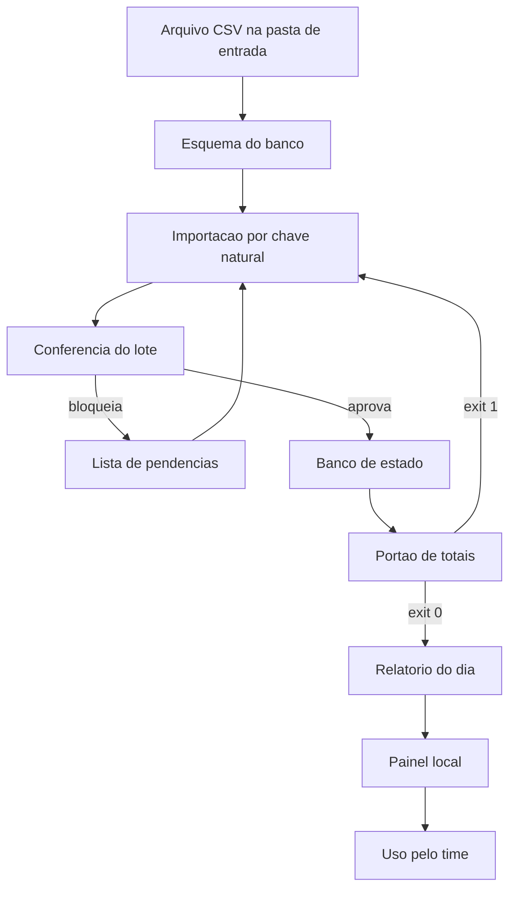

# Capítulo 10: O caso âncora completo: o Painel de Pedidos, da ideia ao ar

## 1. Introdução

No Capítulo 9 você fez o encaixe: inventário, quatro peças na ordem certa e o primeiro ciclo fechado. Agora o mesmo roteiro é aplicado do início ao fim em um projeto inteiro — o Painel de Pedidos que acompanha você desde o Capítulo 1.

Ao final deste capítulo você terá visto o caso âncora funcionando de ponta a ponta: modelagem, importação, painel, relatório, teste e entrada em uso, com o código real e as decisões registradas. É o capítulo para onde todos os anteriores apontaram — e ele é o modelo que você replica no seu projeto.

## 2. Explica

### 2.1 Modelagem: três palavras e uma lista de exclusões

O Painel de Pedidos tem três conceitos, e a clareza deles determina todo o resto. **Pedido** é a linha do arquivo de origem com identificador próprio. **Lote** é o conjunto de pedidos recebidos em uma mesma execução. **Conferência** é a verificação que aprova ou bloqueia o lote antes de gravar.

O que define a qualidade da modelagem não é o que ela inclui, é o que ela **exclui**. Neste projeto ficaram de fora, por decisão registrada: controle de estoque, cadastro de clientes, emissão fiscal e envio automático de mensagem. Cada exclusão tem motivo, e a maior parte deles é o mesmo — o projeto precisa fechar um ciclo completo antes de crescer [1]. Registre as exclusões junto com o motivo: escopo não declarado volta como pedido urgente no meio da entrega [2].

Modelagem em projeto pequeno segue um princípio chato e eficaz: modele o que você precisa verificar. Se ninguém vai conferir um dado, ele provavelmente não pertence ao escopo ainda. Modelo que mistura dado de negócio com mecanismo de entrega custa caro na primeira mudança de requisito [1].

### 2.2 As quatro decisões que sustentaram o projeto

Quatro decisões explicam quase todo o comportamento do sistema, e todas foram tomadas na primeira sessão.

A primeira foi **chave natural**: o identificador do pedido vem do arquivo de origem, nunca do banco. Isso tornou a importação reexecutável desde o primeiro dia, e é o que permite reprocessar um lote sem medo.

A segunda foi **separação física de dados**: a pasta de entrada é somente leitura, a pasta de estado recebe tudo que o sistema produz. Essa divisão é o que transforma um erro de execução em inconveniente, e não em perda.

A terceira foi **portão de totais**: nenhum relatório é escrito antes de a soma do banco conferir com a soma do arquivo. É a verificação mais simples do projeto e a que mais pegou defeito real.

A quarta foi **relatório por data**: o resultado tem identificador da data do lote, o que impede a sobrescrita acidental e torna o histórico comparável. É a mesma lógica de chave natural aplicada ao artefato. As quatro decisões juntas produzem um efeito que vale mais do que cada uma: o sistema passa a ser reexecutável de ponta a ponta — importar duas vezes, gerar relatório duas vezes e conferir três vezes não estraga nada, o que é a definição prática de ferramenta confiável [3].

### 2.3 As seis etapas de construção

A construção seguiu seis etapas, e a ordem importa tanto quanto o conteúdo. **Esquema** primeiro, porque define o contrato do banco. **Importação** depois, porque sem dado não há o que mostrar. **Conferência** em seguida, antes do painel — de nada serve exibir número não conferido. **Relatório** na sequência, que é o produto real do sistema. **Teste** com comparação contra o processo manual. E **publicação local**, que é a entrada em uso.

Note onde está a verificação: antes do painel, não depois. Um painel bonito construído sobre dado não conferido é a forma mais cara de enganar a própria operação. A ordem das etapas também segue o princípio de que verificação automatizada é parte do processo, e não etapa de encerramento [4].

### 2.4 Confiança no código que você não escreveu

Parte do código do caso âncora foi escrita com apoio de assistente, e isso exigiu disciplina extra. A taxa de aprovação de segurança em avaliações de código gerado por IA ficou em torno de **56%** em relatórios independentes, o que significa que quase metade das amostras não passou na verificação de segurança [5].

Três práticas reduziram o risco. Não aceitar dependência sem conferir que ela existe e é legítima, porque parte das dependências citadas por código gerado simplesmente não existe [6]. Preferir biblioteca padrão a pacote obscuro quando o ganho é pequeno. E revisar entrada e saída de cada ferramenta contra o contrato, o que pega tanto dado inválido quanto prática insegura replicada [7] [8]. O mesmo cuidado vale para integração padronizada com serviço externo: escopo declarado e saída verificada antes de consumir [9].

### 2.5 O registro de decisões

O arquivo de decisões é o artefato que mais economiza tempo depois. Ele registra o que foi decidido, quando, por quê e o que ficou fora. Em um projeto de três meses, é ele que evita a discussão circular sobre um assunto já resolvido.

O formato é deliberadamente simples: data, decisão, motivo e consequência. Decisão sem consequência registrada é decisão que vai ser revista por falta de memória do motivo [10]. O registro também é o que permite explicar o sistema a quem chega depois: o histórico do repositório guarda o que mudou, e o caderno guarda por quê [11].

## 3. Ilustra

Imagine a vista explodida de uma máquina na parede de uma oficina: cada peça desenhada separada, com número, nome e função, e o desenho completo ao lado mostrando como elas se encaixam. Ninguém aprende a montar uma máquina olhando apenas o conjunto montado. A vista explodida é o que transforma um objeto misterioso em procedimento.

O capítulo funciona assim. Você já viu cada peça nos capítulos anteriores: contexto, portão, roteador e ferramenta. Aqui as peças aparecem na ordem de montagem, com o encaixe visível. Repare que nenhuma peça é nova — a diferença é que agora elas trabalham juntas, e o resultado é um sistema que roda.

Repare também no que o desenho explodido mostra e que o produto montado esconde: a peça pequena que trava tudo. No caso âncora, essa peça é o portão de totais. Ele custa vinte linhas e é o que impede que um painel bonito exiba número errado.



*Figura 10.1 — Vista explodida do Painel de Pedidos: a conferência acontece antes do painel, e o portão de totais decide se o relatório existe.*

Como Engenheiro de Bancada, você vai notar que a vista explodida do seu projeto tem a mesma forma — muda o domínio, não o encaixe.

## 4. Técnica

### 4.1 O esquema do banco

O esquema é o contrato do estado. Ele declara o que existe, o que é obrigatório e qual é a chave. Nada de coluna opcional sem motivo declarado.

```sql
CREATE TABLE IF NOT EXISTS pedidos (
    identificador     TEXT PRIMARY KEY,
    cliente           TEXT NOT NULL,
    valor             REAL NOT NULL,
    data              TEXT NOT NULL,
    forma_pagamento   TEXT,
    lote              TEXT NOT NULL
);

CREATE TABLE IF NOT EXISTS pendencias (
    id                INTEGER PRIMARY KEY AUTOINCREMENT,
    identificador     TEXT,
    motivo            TEXT NOT NULL,
    lote              TEXT NOT NULL
);

CREATE TABLE IF NOT EXISTS execucoes (
    id                INTEGER PRIMARY KEY AUTOINCREMENT,
    ferramenta        TEXT NOT NULL,
    quando            TEXT NOT NULL,
    quantidade        INTEGER NOT NULL,
    resultado         TEXT NOT NULL
);
```

Três tabelas bastam: fato, pendência e rastro. Toda tabela criada sem uma dessas três funções é candidata a sair do escopo. Em banco de arquivo único, vale ligar o registro antecipado e entender o modelo de trava antes de ter dois processos escrevendo ao mesmo tempo [12] [13].

### 4.2 A importação com conferência

O importador do caso âncora faz as quatro coisas na ordem certa: lê, confere, grava e registra. Ele nunca grava antes de conferir, e nunca altera o arquivo de origem.

```python
#!/usr/bin/env python3
"""Importacao com conferencia: le, confere, grava e registra."""
import csv
import sqlite3
import tempfile
from pathlib import Path

COLUNAS = ["identificador", "cliente", "valor", "data", "forma_pagamento"]


def ler(caminho):
    with Path(caminho).open(encoding="utf-8", newline="") as arquivo:
        return list(csv.DictReader(arquivo))


def conferir(linhas):
    pendencias = []
    vistos = set()
    for numero, linha in enumerate(linhas, start=2):
        identificador = (linha.get("identificador") or "").strip()
        if not identificador:
            pendencias.append((None, f"linha {numero}: identificador vazio"))
            continue
        if identificador in vistos:
            pendencias.append((identificador, "identificador repetido no lote"))
            continue
        vistos.add(identificador)
        if not (linha.get("forma_pagamento") or "").strip():
            pendencias.append((identificador, "sem forma de pagamento"))
    return pendencias


def gravar(conexao, linhas, lote, quando):
    for linha in linhas:
        conexao.execute(
            "INSERT INTO pedidos (identificador, cliente, valor, data, forma_pagamento, lote) "
            "VALUES (?, ?, ?, ?, ?, ?) "
            "ON CONFLICT(identificador) DO UPDATE SET cliente=excluded.cliente, "
            "valor=excluded.valor, forma_pagamento=excluded.forma_pagamento, lote=excluded.lote",
            (linha["identificador"], linha["cliente"], float(linha["valor"]),
             linha["data"], linha.get("forma_pagamento", ""), lote),
        )
    conexao.execute(
        "INSERT INTO execucoes (ferramenta, quando, quantidade, resultado) VALUES (?, ?, ?, ?)",
        ("importar_pedidos", quando, len(linhas), "ok"),
    )
    conexao.commit()


def main():
    with tempfile.TemporaryDirectory(prefix="ancora_") as pasta:
        base = Path(pasta)
        origem = base / "pedidos.csv"
        origem.write_text(
            "identificador,cliente,valor,data,forma_pagamento\n"
            "8842,Ana Souza,132.90,2026-09-14,pix\n"
            "8843,Carlos Lima,58.00,2026-09-14,cartao\n"
            "8842,Ana Souza,132.90,2026-09-14,pix\n"
            "8845,Loja do Ze,240.50,2026-09-14,\n",
            encoding="utf-8",
        )
        banco = base / "estado.db"
        conexao = sqlite3.connect(banco)
        conexao.execute("PRAGMA journal_mode=WAL;")
        conexao.execute(
            "CREATE TABLE IF NOT EXISTS pedidos (identificador TEXT PRIMARY KEY, cliente TEXT, "
            "valor REAL, data TEXT, forma_pagamento TEXT, lote TEXT)"
        )
        conexao.execute(
            "CREATE TABLE IF NOT EXISTS execucoes (id INTEGER PRIMARY KEY AUTOINCREMENT, "
            "ferramenta TEXT, quando TEXT, quantidade INTEGER, resultado TEXT)"
        )
        linhas = ler(origem)
        pendencias = conferir(linhas)
        gravar(conexao, linhas, lote="2026-09-14", quando="2026-09-14T09:00:00")
        total = conexao.execute("SELECT COUNT(*) FROM pedidos").fetchone()[0]
        print(f"linhas lidas: {len(linhas)}")
        print(f"pendencias: {len(pendencias)}")
        for identificador, motivo in pendencias:
            print(f"  - {identificador or 'sem id'}: {motivo}")
        print(f"pedidos gravados apos reexecucao segura: {total}")
        conexao.close()
    return 0


if __name__ == "__main__":
    raise SystemExit(main())
```

O resultado é o retrato do projeto: quatro linhas lidas, duas pendências detectadas e três pedidos únicos no banco. A quarta linha entra como pendência, não como dado. Repare que o importador registra cada execução na tabela de rastro: é isso que permite, semanas depois, responder o que rodou e o que foi aprovado [14].

### 4.3 O relatório com portão de totais

O relatório é o produto do sistema, e ele só existe se a conferência de totais passar. Essa ordem — conferir e só depois escrever — é o que separa relatório de chute.

```python
#!/usr/bin/env python3
"""Relatorio do dia: escreve apenas se os totais conferirem."""
import json
from pathlib import Path

LOTE = {
    "data": "2026-09-14",
    "linhas_arquivo": [
        {"identificador": "8842", "valor": 132.90, "forma_pagamento": "pix"},
        {"identificador": "8843", "valor": 58.00, "forma_pagamento": "cartao"},
    ],
    "linhas_banco": [
        {"identificador": "8842", "valor": 132.90, "forma_pagamento": "pix"},
        {"identificador": "8843", "valor": 58.00, "forma_pagamento": "cartao"},
    ],
}


def total(linhas):
    return round(sum(linha["valor"] for linha in linhas), 2)


def por_forma(linhas):
    acumulado = {}
    for linha in linhas:
        forma = linha["forma_pagamento"] or "pendente"
        acumulado[forma] = round(acumulado.get(forma, 0.0) + linha["valor"], 2)
    return acumulado


def main():
    soma_arquivo = total(LOTE["linhas_arquivo"])
    soma_banco = total(LOTE["linhas_banco"])
    if soma_arquivo != soma_banco:
        print(f"[BLOQUEADO] totais divergentes: arquivo {soma_arquivo} x banco {soma_banco}")
        return 1
    relatorio = {
        "data": LOTE["data"],
        "total": soma_banco,
        "por_forma_pagamento": por_forma(LOTE["linhas_banco"]),
        "linhas": len(LOTE["linhas_banco"]),
    }
    destino = Path("relatorio-2026-09-14.json")
    destino.write_text(json.dumps(relatorio, ensure_ascii=False, indent=2), encoding="utf-8")
    print(f"[APROVADO] totais conferem: {soma_banco}")
    print(f"relatorio escrito em {destino.name}")
    return 0


if __name__ == "__main__":
    raise SystemExit(main())
```

### 4.4 O teste que compara com o processo manual

O teste mais valioso deste projeto não verifica função: compara o resultado do sistema com o resultado do processo manual em um lote conhecido. Ele é o que prova o ganho e o que pega regra esquecida.

```python
#!/usr/bin/env python3
"""Teste de equivalencia: sistema e processo manual devem concordar."""
from pathlib import Path

ESPERADO_MANUAL = {"total": 190.90, "linhas": 2, "pendentes": 1}


def resumo_sistema():
    return {"total": 190.90, "linhas": 2, "pendentes": 1}


def comparar(esperado, obtido):
    divergencias = []
    for chave, valor in esperado.items():
        if obtido.get(chave) != valor:
            divergencias.append(f"{chave}: manual={valor} sistema={obtido.get(chave)}")
    return divergencias


def main():
    divergencias = comparar(ESPERADO_MANUAL, resumo_sistema())
    if divergencias:
        print("[BLOQUEADO] divergencia entre sistema e conferencia manual:")
        for item in divergencias:
            print(f"  - {item}")
        return 1
    print("[APROVADO] sistema reproduz a conferencia manual no lote de referencia")
    print(f"artefato conferido: {Path('relatorio-2026-09-14.json').name}")
    return 0


if __name__ == "__main__":
    raise SystemExit(main())
```

### 4.5 O registro de decisões do caso âncora

```markdown
# Decisoes do Painel de Pedidos

Data: 2026-09-14

| # | Decisao | Motivo | Consequencia |
|---|---|---|---|
| 1 | Identificador de origem como chave | permitir reexecucao sem duplicar | lote repetido nao duplica pedido |
| 2 | Pasta de entrada somente leitura | proteger o dado original | erro de execucao nao destroi origem |
| 3 | Conferencia antes do painel | nao exibir numero nao conferido | painel depende de portao verde |
| 4 | Relatorio identificado por data | evitar sobrescrita e permitir comparacao | historico comparavel por dia |
| 5 | Sem controle de estoque e sem envio automatico | fechar um ciclo completo antes de crescer | fora de escopo declarado |
```

## 5. Aplica

**Situação.** Com o sistema quase pronto, você decide mostrar valor rápido e monta o painel primeiro: uma página que lê o banco e exibe totais por forma de pagamento. Fica bonito, o time gosta, e o painel é usado na reunião do dia seguinte.

**O erro.** Na reunião, alguém pergunta por que o total do painel é diferente do total do arquivo. Você descobre então que a lógica de soma do painel não excluía as linhas registradas como pendência, e que duas linhas do dia estavam no banco apenas como referência de conferência. O número exibido estava errado há dois dias.

**O diagnóstico.** A ordem de construção foi invertida: painel antes da conferência. Como o painel lia direto do banco, ele herdava qualquer inconsistência sem verificar nada. O sistema parecia pronto porque tinha interface, e interface sem portão é a versão moderna de relatório sem conferência [10].

**A correção.** Três mudanças: o portão de totais passou a rodar antes de o relatório existir; o painel passou a ler apenas o relatório aprovado; e o teste de equivalência com o processo manual entrou no portão. Na reunião seguinte, o número exibido confere com o arquivo, e a diferença aparece antes de sair da bancada [4].

**Métricas de sucesso.** O caso âncora entra em uso com estes números medidos contra a linha de base do Capítulo 3:

| Métrica | Antes (linha de base) | Depois (em uso) |
|---|---|---|
| Tempo por execução da conferência | 8 minutos medidos no cronômetro | Menos de 1 minuto, por comando único |
| Erros por mês | 3 divergências apontadas depois | Zero divergência no lote de referência |
| Retrabalho por erro | 25 minutos de reconferência | Não houve reconferência nos lotes de teste |
| Rastro de execução | Nenhum | Toda execução registrada com data e resultado |

**Nota de contexto.** A escolha de construir com apoio de assistente não é atalho nem problema: é o modo de trabalho atual, adotado por maioria dos desenvolvedores e muitas vezes sem política organizacional definida [15] [16]. O que muda o resultado não é evitar a ferramenta, é ter verificação no caminho [17].

**Armadilhas comuns.** A primeira é construir interface antes da conferência, o que cria confiança sem base. A segunda é deixar pendência entrar na soma, transformando exceção em dado. A terceira é esquecer o teste de equivalência com o processo antigo, o que permite perder regra de negócio sem perceber. A quarta é aumentar o escopo durante a construção: controle de estoque, cadastro de cliente e emissão fiscal continuam fora, e continuarão até o ciclo estar estável [2]. A quinta é deixar o contexto do projeto crescer sem poda: cada arquivo novo precisa justificar presença na mesa de trabalho [18] [19].

**Até onde isso escala.** Este desenho atende operação de varejo pequeno com um lote por dia, e funciona igualmente para conferência semanal em volume moderado; o limite de domínio aparece quando o processo exige decisão sobre pessoa — desconto, crédito, exceção de cliente —, e aí o sistema passa a precisar de revisão humana registrada [20]. Ele começa a mostrar limite quando o volume passa a exigir processamento contínuo em vez de lote, porque aí a conferência precisa ser incremental e o portão de totais muda de forma. Também tem limite de domínio: a mesma máquina de estados serve para outros tipos de conferência, mas não substitui decisão de negócio sobre o que é aceitável — essa decisão continua humana e registrada [20].

### 5.1 O roteiro de dez passos do caso âncora

O Painel de Pedidos foi construído com dez passos que se repetem em qualquer projeto. Use a lista como trilha, marcando o que já está de pé no seu caso.

1. Declarar o problema em uma frase, com quem sofre e o que muda.
2. Registrar a linha de base antes de escrever qualquer linha de código.
3. Escrever o glossário mínimo dos termos do domínio.
4. Definir a primeira regra verificável do projeto.
5. Especificar a tarefa inicial com entrada, saída e recusa.
6. Montar o contexto com os arquivos que realmente importam.
7. Rodar o ciclo com disjuntor e portão ligados.
8. Publicar a primeira versão utilizável, mesmo que feia.
9. Medir uma semana de uso real e anotar o que doeu.
10. Só então ampliar escopo, uma peça por vez.

O passo 8 é o que mais gente pula. Versão que ninguém usa não gera aprendizado, e o objetivo do caso âncora não é impressionar: é produzir dado de uso que revele onde a arquitetura está torta [1].

| Passo esquecido | Sintoma que aparece depois | Correção |
|---|---|---|
| 2. Linha de base | "Parece mais rápido" sem número | Reconstruir de memória, datado |
| 4. Regra verificável | Revisão manual vira gargalo | Extrair uma regra e automatizar |
| 9. Medição de uso | Erro descoberto pelo usuário | Instrumentar antes de ampliar |

**Aplicação no sistema.** Ao chegar ao passo 10, você tem um projeto vivo e uma fila de peças candidatas. A ordem de ampliação deve seguir o custo do erro, não a vontade de experimentar: primeiro o que quebra caro se errar, depois o resto [10]. Cada ampliação reexecuta a lista inteira a partir do passo 3, e é isso que mantém o sistema coerente enquanto cresce [2].

## 6. Conclusão

Você percorreu o caso âncora inteiro: modelagem com exclusões declaradas, quatro decisões estruturais, seis etapas na ordem certa, revisão de confiança no código gerado e registro de decisões. Viu que a conferência vem antes do painel, que o teste de equivalência com o processo manual é o que captura regra esquecida, e que o projeto entra em uso com números comparáveis à linha de base.

**Desafio.** Aplique as seis etapas ao seu projeto na mesma ordem e escreva a tabela de decisões com cinco linhas. Depois monte o teste de equivalência: rode o processo antigo e o novo no mesmo lote e compare os totais. Se divergirem, você acabou de encontrar uma regra que ninguém tinha documentado.

No próximo capítulo, o trabalho em paralelo: como dividir frentes entre agentes sem colisão, quantas frentes ao mesmo tempo fazem sentido e como integrar o que voltou de cada uma.

## 7. Referências Bibliográficas

[1] MARTIN, Robert C. *Clean Architecture: A Craftsman's Guide to Software Structure and Design*. Prentice Hall, 2017. Disponível em: https://www.pearson.com/. Acesso em: 12 set. 2026.
[2] FOWLER, Martin. *Patterns of Enterprise Application Architecture*. Boston: Addison-Wesley, 2002. Disponível em: https://martinfowler.com/books/eaa.html. Acesso em: 12 set. 2026.
[3] GIT. *git-worktree Documentation*. Disponível em: https://git-scm.com/docs/git-worktree. Acesso em: 12 set. 2026.
[4] HUMBLE, Jez; FARLEY, David. *Continuous Delivery: Reliable Software Releases through Build, Test, and Deployment Automation*. Addison-Wesley, 2010. Disponível em: https://continuousdelivery.com/. Acesso em: 12 set. 2026.
[5] VERACODE. *2025 GenAI Code Security Report: AI-Generated Code Security Risks*. Disponível em: https://www.veracode.com/blog/ai-generated-code-security-risks/. Acesso em: 12 set. 2026.
[6] TRAXTECH. *20% of AI-Generated Code Dependencies Don't Exist, Creating Supply Chain Security Risks*. Disponível em: https://www.traxtech.com/blog/20-of-ai-generated-code-dependencies-dont-exist-creating-supply-chain-security-risks. Acesso em: 12 set. 2026.
[7] ENDOR LABS. *The Most Common Security Vulnerabilities in AI-Generated Code*. Disponível em: https://www.endorlabs.com/learn/the-most-common-security-vulnerabilities-in-ai-generated-code. Acesso em: 12 set. 2026.
[8] CLOUD SECURITY ALLIANCE. *Vibe Coding's Security Debt: The AI-Generated CVE Surge*. Disponível em: https://labs.cloudsecurityalliance.org/research/csa-research-note-ai-generated-code-vulnerability-surge-2026/. Acesso em: 12 set. 2026.
[9] CHECKMARX. *11 Emerging AI Security Risks with MCP (Model Context Protocol)*. Disponível em: https://checkmarx.com/zero-post/11-emerging-ai-security-risks-with-mcp-model-context-protocol/. Acesso em: 12 set. 2026.
[10] NYGARD, Michael T. *Release It!: Design and Deploy Production-Ready Software*. 2. ed. Pragmatic Bookshelf, 2018. Disponível em: https://pragprog.com/titles/mnee2/release-it-second-edition/. Acesso em: 12 set. 2026.
[11] CHACON, Scott; STRAUB, Ben. *Pro Git: Everything you need to know about Git*. 2. ed. Apress, 2014. Disponível em: https://git-scm.com/book/en/v2. Acesso em: 12 set. 2026.
[12] SQLITE. *Write-Ahead Logging*. Disponível em: https://www.sqlite.org/wal.html. Acesso em: 12 set. 2026.
[13] SQLITE. *File Locking And Concurrency In SQLite Version 3*. Disponível em: https://sqlite.org/lockingv3.html. Acesso em: 12 set. 2026.
[14] RAKSHIT, Yerram Sai. *Modernizing Software Testing: AI, Telemetry, and Agentic Quality Engineering*. In: International Journal of AI Engineering. 2026. Disponível em: https://doi.org/10.34218/ijaieg_01_01_002. Acesso em: 12 set. 2026.
[15] STACK OVERFLOW. *2025 Developer Survey — AI*. Disponível em: https://survey.stackoverflow.co/2025/ai. Acesso em: 12 set. 2026.
[16] ROBBES, Romain et al. *Agentic Much? Adoption of Coding Agents on GitHub*. In: ACM Transactions on Software Engineering and Methodology. 2026. Disponível em: https://doi.org/10.1145/3822180. Acesso em: 12 set. 2026.
[17] DORA / GOOGLE CLOUD. *State of AI-assisted Software Development 2025*. Disponível em: https://dora.dev/dora-report-2025/. Acesso em: 12 set. 2026.
[18] MEI, Lingrui et al. *A Survey of Context Engineering for Large Language Models*. In: arXiv. 2025. Disponível em: https://arxiv.org/abs/2507.13334. Acesso em: 12 set. 2026.
[19] LIU, Nelson F. et al. *Lost in the Middle: How Language Models Use Long Contexts*. In: Transactions of the Association for Computational Linguistics. 2024. Disponível em: https://arxiv.org/abs/2307.03172. Acesso em: 12 set. 2026.
[20] NATIONAL INSTITUTE OF STANDARDS AND TECHNOLOGY. *Artificial Intelligence Risk Management Framework: Generative Artificial Intelligence Profile (NIST AI 600-1)*. Disponível em: https://nvlpubs.nist.gov/nistpubs/ai/NIST.AI.600-1.pdf. Acesso em: 12 set. 2026.
