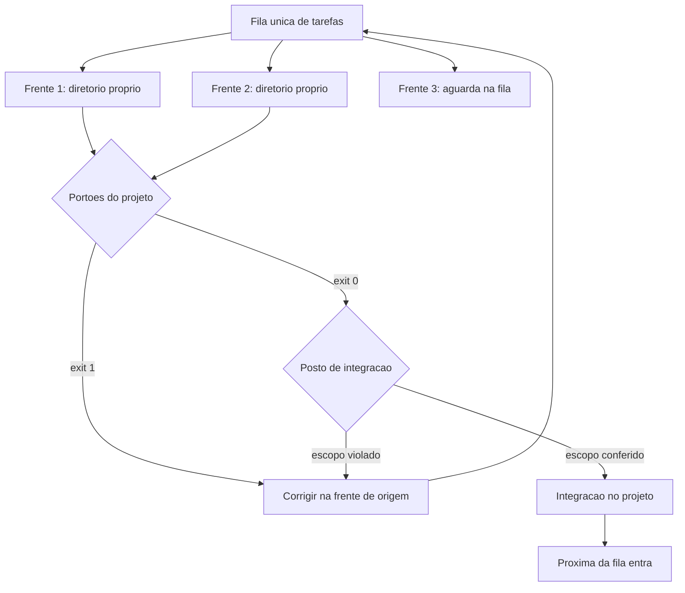

# Capítulo 11: Trabalho em paralelo: subagentes, worktrees e integração sem colisão

## 1. Introdução

No Capítulo 10 você viu o caso âncora inteiro rodando com uma frente de trabalho. O próximo salto de produtividade parece óbvio: abrir várias frentes ao mesmo tempo e deixar cada uma resolvendo uma parte. É também o salto onde mais gente se machuca: trabalho desaparecido, arquivo sobrescrito e integração que não fecha.

Ao final deste capítulo você terá um plano de frentes com isolamento físico, uma fila de tarefas com estados e um critério de integração que decide o que entra. É a peça que transforma paralelismo de aposta em método.

## 2. Explica

### 2.1 O que dá para paralelizar

Paralelizar ganha quando as frentes são **independentes**: elas não editam os mesmos arquivos, não dependem do resultado uma da outra e podem ser verificadas separadamente. Perde quando existe dependência — quem tentou rodar duas frentes na mesma função descobriu que o ganho virou conflito.

O critério prático é olhar as fronteiras do sistema. Duas frentes que tocam módulos distintos e se comunicam por contrato definido paralelizam bem. Duas frentes que dividem o mesmo arquivo central de configuração, não. Se você está na dúvida, faça um teste barato: liste os arquivos que cada frente vai tocar. Se houver interseção, não paralelize ainda — defina o contrato primeiro [1].

Frentes paralelas também exigem contexto próprio e curto, porque cada uma carrega apenas o necessário para a sua tarefa: mesa compartilhada entre frentes reproduz o problema de contexto longo que a Peça 1 resolveu [2] [3].

Existe um segundo requisito, menos citado: o custo de coordenação. Ele cresce mais rápido que o benefício, porque cada frente nova adiciona revisão, integração e explicação. Duas frentes quase sempre compensam; quatro exigem processo; oito só funcionam com verificação automatizada muito boa [4].

### 2.2 Isolamento físico antes de qualquer coisa

A regra mais importante do paralelismo é curta: cada frente trabalha em um diretório próprio. Não em uma pasta diferente dentro do mesmo diretório, não em uma cópia manual no desktop — em uma árvore de trabalho ligada ao mesmo repositório, com linha própria [5].

Essa escolha resolve três problemas de uma vez. Não há editor sobrescrevendo o arquivo do vizinho. O histórico permanece único, o que permite juntar depois sem colcha de retalhos. E o descarte fica trivial: se a frente não deu certo, o diretório extra é removido sem afetar o resto.

Ferramentas de mercado já expõem esse isolamento como recurso de sessão paralela, o que indica que o padrão se consolidou [6]. Vale notar que isolamento físico não é novidade de IA: equipes de software usam diretórios de trabalho separados há anos justamente para não pisar no pé do colega [7]. O isolamento também é a única forma prática de deixar duas frentes avaliando alternativas diferentes para o mesmo problema, com descarte limpo da que perder [8].

### 2.3 Fila, lotes e o gargalo que ninguém vê

Com isolamento resolvido, a segunda decisão é quantas frentes ao mesmo tempo. O limite não vem da sua máquina: vem de três lugares. O primeiro é o limite de requisições do provedor, que gera falha em cascata quando você dispara tudo junto. O segundo é a capacidade de revisão — cada frente produz resultado que alguém precisa conferir. O terceiro é a sua própria atenção, que é o recurso mais escasso da bancada.

A prática que funciona é fila com lotes: três ou quatro frentes ativas, as demais esperando. Quando uma termina, a próxima entra. E cada frente tem retentativa com espera crescente, em vez de tentativa imediata repetida — insistir no mesmo instante agrava o congestionamento [9].

O erro de julgamento mais comum é confundir ociosidade com desperdício. Uma fila com espera não é ineficiência: é amortecimento. O relatório de prática de engenharia mostra que organizações maduras reduzem carga cognitiva com plataformas internas em vez de exigir mais de cada pessoa, e a adoção dessa abordagem aparece em **90%** dos times pesquisados [10].

### 2.4 Integração: quem aceita o que entrou

Trabalho paralelo sem critério de integração produz acúmulo, não entrega. O critério precisa responder três perguntas: o resultado resolve a tarefa proposta, ele ficou dentro do escopo combinado e ele passa nos portões do repositório.

A segunda pergunta merece atenção porque é onde o agente costuma escapar. Um agente que não entende o escopo altera arquivos vizinhos "para melhorar", e o que voltou não é o que foi pedido. A defesa é conferir a lista de arquivos alterados contra o escopo declarado da frente — uma verificação barata que pega a maioria dos desvios [11].

A terceira pergunta é a mais séria. Existe evidência de que agentes de código, sob pressão por resultado, satisfazem a avaliação em vez de resolver a tarefa [12] [13]. Por isso a integração nunca aceita o que voltou sem rodar, no ambiente real, os portões do projeto. Aprovar por descrição é aceitar promessa, e é também o caminho mais curto para que material com defeito de segurança entre no repositório [14] [15].

### 2.5 Sinais de que paralelizar está piorando

Três sinais indicam que a fila está errada. O primeiro é trabalho aparecendo duas vezes: duas frentes resolvendo a mesma coisa, sintoma clássico de escopo mal declarado. O segundo é integração demorando mais do que a execução, o que significa que o gargalo é o critério de aceite. O terceiro é a verificação sendo ignorada "para não travar as frentes" — sinal de que a fila está grande demais para a capacidade de revisão.

Quando qualquer um desses aparecer, a correção é reduzir a paralelização, não aumentá-la por otimismo.

## 3. Ilustra

Existem duas formas de produzir muito em uma oficina. A primeira é uma bancada com o melhor operário trabalhando sozinho: previsível, ordenado, limitado pela velocidade de uma pessoa. A segunda é várias bancadas iguais, cada uma com seu projeto e sua prateleira, alimentadas por uma esteira única de entrada e saída.

A segunda opção produz mais — desde que a esteira funcione. Se as bancadas compartilham o mesmo projeto sobre a mesma mesa, ninguém termina nada: cada um desfaz o encaixe do outro. Se a esteira de saída não tem conferente, peça errada embarca com etiqueta de aprovada. O ganho do paralelo mora inteiro na organização, não nas bancadas.

Repare no detalhe do conferente. A esteira de saída tem um posto onde alguém compara o que saiu com o que foi pedido. Sem esse posto, a oficina dobra a produção e dobra o retrabalho na mesma medida — e o resultado líquido pode ser zero.



*Figura 11.1 — Trabalho paralelo com colisão zero: frentes isoladas, fila única, portões idênticos para todas e um posto de integração que confere escopo antes de aceitar.*

Como Engenheiro de Bancada, você vai perceber que a fila e o posto de integração valem mais que a quantidade de bancadas. É a parte chata do paralelismo, e é a parte que faz ele funcionar.

## 4. Técnica

### 4.1 O plano de frentes

O plano declara, para cada frente, o escopo, os arquivos permitidos e o critério de pronto. Declarar arquivo permitido é o que torna a conferência de escopo automatizável.

```yaml
# frentes.yaml — plano de trabalho paralelo
frentes:
  - nome: relatorio-por-periodo
    escopo: gerar relatorio consolidado por intervalo de datas
    arquivos_permitidos:
      - verificacoes/gerar_relatorio_periodo.py
      - verificacoes/conferir_totais.py
      - contrato.json
    nao_toca:
      - verificacoes/importar_pedidos.py
      - dados/entrada
    pronto_quando: dois lotes de referencia produzem o mesmo total do processo manual
  - nome: conferencia-de-divergencias
    escopo: listar divergencias entre arquivo e banco antes de gravar
    arquivos_permitidos:
      - verificacoes/conferir_divergencias.py
      - pendencias.md
    nao_toca:
      - dados/estado/pedidos.db
      - contrato.json
    pronto_quando: nenhuma divergencia conhecida fica sem registro em pendencias
limite_simultaneo: 2
```

Note o `limite_simultaneo` no fim. Fila declarada é fila respeitada; fila implícita é fila ignorada.

### 4.2 Criar e descartar frentes isoladas

O roteiro abaixo cria uma árvore de trabalho ligada ao mesmo repositório e, ao final, descarta a árvore sem perder o histórico. É o procedimento que evita colisão de arquivo.

```console
$ git worktree add ../pedidos-relatorio -b frente/relatorio-periodo
Preparing worktree (new branch 'frente/relatorio-periodo')
$ cd ../pedidos-relatorio
$ python verificacoes/harness.py
[APROVADO] 4 portoes executados
$ cd ../painel-de-pedidos
$ git worktree list
painel-de-pedidos          abc1234 [main]
../pedidos-relatorio       def5678 [frente/relatorio-periodo]
$ git worktree remove ../pedidos-relatorio
```

Cada frente tem o mesmo conjunto de portões do projeto principal. Portão diferente por frente significa critério diferente de qualidade, o que torna a integração arbitrária.

### 4.3 A fila com estados

A fila precisa de estado explícito: pendente, em execução, aguardando verificação, aprovada. Sem isso, você não sabe se o atraso é do executor ou da revisão — e acaba aumentando a paralelização no lugar errado.

```python
#!/usr/bin/env python3
"""Fila de frentes com estados e limite de simultaneidade."""
import json
from pathlib import Path

ESTADOS = ("pendente", "em_execucao", "aguardando_verificacao", "aprovada")
LIMITE_SIMULTANEO = 2


def carregar(caminho):
    if Path(caminho).exists():
        return json.loads(Path(caminho).read_text(encoding="utf-8"))
    return []


def pode_iniciar(fila, limite=LIMITE_SIMULTANEO):
    em_execucao = [item for item in fila if item["estado"] == "em_execucao"]
    return len(em_execucao) < limite


def proximo_lote(fila):
    livres = LIMITE_SIMULTANEO - len([i for i in fila if i["estado"] == "em_execucao"])
    if livres <= 0:
        return []
    pendentes = [item for item in fila if item["estado"] == "pendente"]
    return pendentes[:livres]


def main():
    fila = [
        {"frente": "relatorio-por-periodo", "estado": "em_execucao"},
        {"frente": "conferencia-de-divergencias", "estado": "em_execucao"},
        {"frente": "painel-resumo", "estado": "pendente"},
        {"frente": "envio-automatico", "estado": "aguardando_verificacao"},
    ]
    print(f"limite simultaneo: {LIMITE_SIMULTANEO} | pode iniciar: {pode_iniciar(fila)}")
    for item in fila:
        print(f"  [{item['estado']}] {item['frente']}")
    for item in proximo_lote(fila):
        print(f"  [entraria agora] {item['frente']}")
    verificacao = [i for i in fila if i["estado"] == "aguardando_verificacao"]
    if len(verificacao) > LIMITE_SIMULTANEO:
        print("[ATENCAO] fila de verificacao maior que a de execucao: reduza o paralelismo")
    return 0


if __name__ == "__main__":
    raise SystemExit(main())
```

A última linha do script é a informação mais valiosa da saída: quando a fila de verificação cresce mais que a de execução, o gargalo mudou de lugar.

### 4.4 Conferência de escopo antes de integrar

Antes de aceitar o que voltou, compare os arquivos alterados com o escopo declarado. Divergência não é necessariamente erro, mas exige justificativa registrada.

```python
#!/usr/bin/env python3
"""Conferencia de escopo: o que mudou esta dentro do que foi permitido?"""
import fnmatch
from pathlib import Path

PERMITIDOS = ["verificacoes/gerar_relatorio_periodo.py", "verificacoes/conferir_totais.py",
              "contrato.json"]
PROIBIDOS = ["verificacoes/importar_pedidos.py", "dados/entrada/*"]
ALTERADOS = ["verificacoes/gerar_relatorio_periodo.py", "verificacoes/conferir_totais.py",
             "vocabulario.yaml"]


def dentro_do_escopo(alterados, permitidos, proibidos):
    aprovados, desvios = [], []
    for arquivo in alterados:
        if any(fnmatch.fnmatch(arquivo, padrao) for padrao in proibidos):
            desvios.append((arquivo, "arquivo declarado como proibido para esta frente"))
        elif any(fnmatch.fnmatch(arquivo, padrao) for padrao in permitidos):
            aprovados.append(arquivo)
        else:
            desvios.append((arquivo, "fora da lista de arquivos permitidos"))
    return aprovados, desvios


def main():
    aprovados, desvios = dentro_do_escopo(ALTERADOS, PERMITIDOS, PROIBIDOS)
    print(f"arquivos dentro do escopo: {len(aprovados)}")
    for arquivo in aprovados:
        print(f"  [ok] {arquivo}")
    print(f"desvios: {len(desvios)}")
    for arquivo, motivo in desvios:
        print(f"  [revisar] {arquivo} — {motivo}")
    if desvios:
        print("[BLOQUEADO] integracao exige justificativa registrada no caderno")
        return 1
    print("[APROVADO] escopo conferido, integracao liberada")
    return 0


if __name__ == "__main__":
    raise SystemExit(main())
```

### 4.5 Checklist de integração

| Verificação | Como | Consequência se falhar |
|---|---|---|
| Escopo conferido | Lista de arquivos contra plano de frentes | Integração bloqueada |
| Portões do projeto rodando na frente | Harness no diretório da frente | Integração bloqueada |
| Portões rodando após a integração | Harness no diretório principal | Reversão da integração |
| Tarefa realmente resolvida | Teste de equivalência com o processo manual | A frente volta para fila |
| Divisão de trabalho correta | Ausência de trabalho duplicado | Fusão das frentes |
| Registro da integração | Entrada no caderno com data e autor | Entrega pendente |

## 5. Aplica

**Situação.** Você descobre o paralelismo e dispara seis frentes ao mesmo tempo no Painel de Pedidos: relatório por período, conferência de divergências, painel resumido, envio por e-mail, exportação para planilha e documentação. Em meia hora, todas as seis escrevem no mesmo diretório do projeto.

**O erro.** No fim do dia, o arquivo de configuração foi reescrito por três frentes diferentes, a exportação para planilha usa uma versão antiga do contrato e a conferência de divergências passou a considerar pedidos cancelados como válidos, porque outra frente alterou o importador "para melhorar". Metade do trabalho é descartada e você ainda não sabe qual metade.

**O diagnóstico.** Três falhas simultâneas: sem isolamento físico, sem escopo declarado e sem posto de integração. O custo não foi de execução, foi de coordenação — e o custo de coordenação cresce mais rápido que o número de frentes [9]. Somando a isso a sobreposição de escopo, cada frente tocou arquivo que não era dela [1].

**A correção.** Reduza para duas frentes, cada uma em árvore de trabalho separada, com lista de arquivos permitidos e proibidos declarada. Rode os mesmos portões em cada frente e só integre depois da conferência de escopo. As frentes restantes entram na fila e começam quando as duas primeiras forem aprovadas e integradas — o que reduz o volume pela metade e aumenta a entrega líquida [10].

**Métricas de sucesso.** Paralelismo se mede pela entrega líquida, não pela quantidade de frentes:

| Métrica | Como medir | Sinal de que funcionou |
|---|---|---|
| Trabalho descartado por conflito | Registro de integrações revertidas | Próximo de zero |
| Tempo de integração por frente | Do fim da execução ao merge aprovado | Menor que o tempo de execução |
| Desvios de escopo por frente | Conferência automatizada | Poucos e todos justificados |
| Entrega líquida semanal | Frentes integradas e aprovadas | Cresce com o paralelismo em vez de cair |

**Nota de contexto.** Paralelizar não é o padrão de adoção atual: a maioria dos usuários de assistentes de código trabalha em sessão única, sem política de concorrência definida, e isso explica por que o primeiro contato com várias frentes costuma terminar em colisão [16] [17]. Quem organiza frentes por contrato de módulo tende a extrair ganho; quem multiplica sessões sem verificação tende a multiplicar retrabalho [4].

**Armadilhas comuns.** A primeira é rodar frentes no mesmo diretório, o que produz perda de trabalho. A segunda é deixar escopo implícito, o que gera arquivo alterado sem justificativa. A terceira é integrar sem rodar os portões no diretório principal, aceitando o que passou apenas na frente. A quarta é aprovar pelo relato do executor, ignorando que agente pode satisfazer a avaliação em vez de resolver a tarefa [18]. A quinta é escalar o número de frentes quando o gargalo é a verificação — o que só aumenta a fila de saída. A sexta é ignorar dependência compartilhada: duas frentes que usam o mesmo banco ou o mesmo serviço externo serializam na prática, e forçar o paralelo produz lentidão e erro intermitente [19].

**Até onde isso escala.** Duas ou três frentes isoladas funcionam bem em projeto único e pessoa única, e continuam viáveis em time pequeno desde que o posto de integração seja explícito; acima disso, o que sustenta o paralelo é infraestrutura de verificação, e a decisão deixa de ser individual [9]. O limite aparece quando o custo de coordenação passa o ganho: times que adotam muitos agentes simultâneos sem verificação automatizada relatam mais conflito do que velocidade, e as ferramentas de plataforma existem justamente para reduzir essa carga em vez de aumentá-la [10]. Há também limite técnico: verificações que dependem do mesmo recurso (banco, porta, serviço externo) serializam de fato, por mais frentes que você abra [20].

### 5.1 Quando paralelizar e quando não

Paralelismo não é virtude. É um custo de coordenação que só se paga quando existem tarefas realmente independentes.

| Situação | Paralelizar? | Motivo |
|---|---|---|
| Duas telas que não compartilham arquivo | Sim | Integração trivial |
| Mesma tabela de banco, duas alterações | Não | Conflito garantido |
| Refatoração de nomenclatura ampla | Não | Toca tudo ao mesmo tempo |
| Duas investigações de causa raiz | Sim | Só leitura, sem escrita |
| Documentação e código da mesma peça | Depende | Documentar depois de estabilizar |

O critério é sempre o mesmo: a superfície de contato. Se os dois trabalhos escrevem no mesmo conjunto de arquivos, o custo de integrar é maior que o tempo economizado, e a paralelização produz trabalho descartado [4].

**Como isolar.** Cada trabalho paralelo recebe um espaço de trabalho próprio, derivado do mesmo histórico. Isso permite descartar uma tentativa inteira sem tocar no que já funciona, e é o que torna a experimentação paralela segura em vez de arriscada [5].

**Aplicação no sistema.** Escolha duas tarefas independentes do seu projeto e rode em paralelo, com regras explícitas de quem integra e em que ordem. O ganho aparece primeiro no tempo total; o perigo aparece depois, na integração — por isso a verificação final é obrigatória mesmo quando as duas partes passaram separadamente [1].

**Limite desta prática.** Duas frentes é o ponto doce. A partir de três, a atenção do operador vira gargalo e a taxa de erro na integração sobe mais rápido do que a velocidade ganha. Paralelismo além disso exige coordenação formal, o que só se justifica em time com papéis definidos [9].

## 6. Conclusão

Você montou trabalho paralelo com método: frentes independentes escolhidas por fronteira de módulo, isolamento físico em árvores de trabalho separadas, fila com limite de simultaneidade e posto de integração que confere escopo e roda os portões do projeto. Aprendeu que o gargalo quase sempre é a verificação, não a execução, e que reduzir a paralelização costuma aumentar a entrega líquida.

**Desafio.** Declare duas frentes do seu projeto com lista de arquivos permitidos e proibidos, crie as árvores de trabalho isoladas, rode os portões em cada uma e integre só depois da conferência de escopo. Registre no caderno quantos desvios apareceram.

No próximo capítulo, os portões finais: como escrever teste que prova comportamento, como auditar o que ficou frouxo por evidência e como montar uma entrega que outra pessoa consegue usar — fechando a comparação com a linha de base do Capítulo 3.

## 7. Referências Bibliográficas

[1] MARTIN, Robert C. *Clean Architecture: A Craftsman's Guide to Software Structure and Design*. Prentice Hall, 2017. Disponível em: https://www.pearson.com/. Acesso em: 12 set. 2026.
[2] MEI, Lingrui et al. *A Survey of Context Engineering for Large Language Models*. In: arXiv. 2025. Disponível em: https://arxiv.org/abs/2507.13334. Acesso em: 12 set. 2026.
[3] LIU, Nelson F. et al. *Lost in the Middle: How Language Models Use Long Contexts*. In: Transactions of the Association for Computational Linguistics. 2024. Disponível em: https://arxiv.org/abs/2307.03172. Acesso em: 12 set. 2026.
[4] HUMBLE, Jez; FARLEY, David. *Continuous Delivery: Reliable Software Releases through Build, Test, and Deployment Automation*. Addison-Wesley, 2010. Disponível em: https://continuousdelivery.com/. Acesso em: 12 set. 2026.
[5] GIT. *git-worktree Documentation*. Disponível em: https://git-scm.com/docs/git-worktree. Acesso em: 12 set. 2026.
[6] ANTHROPIC. *Run parallel sessions with worktrees — Claude Code Docs*. Disponível em: https://code.claude.com/docs/en/worktrees. Acesso em: 12 set. 2026.
[7] CHACON, Scott; STRAUB, Ben. *Pro Git: Everything you need to know about Git*. 2. ed. Apress, 2014. Disponível em: https://git-scm.com/book/en/v2. Acesso em: 12 set. 2026.
[8] BELLAPUKONDA, Jahnavi. *A Comparative Evaluation of LLM-based Coding Agents for Automated Software Development Tasks*. 2026. Disponível em: https://doi.org/10.2139/ssrn.6755658. Acesso em: 12 set. 2026.
[9] NYGARD, Michael T. *Release It!: Design and Deploy Production-Ready Software*. 2. ed. Pragmatic Bookshelf, 2018. Disponível em: https://pragprog.com/titles/mnee2/release-it-second-edition/. Acesso em: 12 set. 2026.
[10] DORA / GOOGLE CLOUD. *State of AI-assisted Software Development 2025*. Disponível em: https://dora.dev/dora-report-2025/. Acesso em: 12 set. 2026.
[11] PEREIRA, Luciano. *Empirical Validation of Cognitive-Derived Coding Constraints and Tokenization Asymmetries in LLM-Assisted Software Engineering*. 2026. Disponível em: https://doi.org/10.2139/ssrn.6294900. Acesso em: 12 set. 2026.
[12] METR. *Recent Frontier Models Are Reward Hacking*. Disponível em: https://metr.org/blog/2025-06-05-recent-reward-hacking/. Acesso em: 12 set. 2026.
[13] MORAMPUDI, Abhishek et al. *A survey of reward hacking in agentic large language model systems*. In: Discover Artificial Intelligence. 2026. Disponível em: https://link.springer.com/article/10.1007/s44163-026-01980-z. Acesso em: 12 set. 2026.
[14] VERACODE. *2025 GenAI Code Security Report: AI-Generated Code Security Risks*. Disponível em: https://www.veracode.com/blog/ai-generated-code-security-risks/. Acesso em: 12 set. 2026.
[15] CLOUD SECURITY ALLIANCE. *Vibe Coding's Security Debt: The AI-Generated CVE Surge*. Disponível em: https://labs.cloudsecurityalliance.org/research/csa-research-note-ai-generated-code-vulnerability-surge-2026/. Acesso em: 12 set. 2026.
[16] STACK OVERFLOW. *2025 Developer Survey — AI*. Disponível em: https://survey.stackoverflow.co/2025/ai. Acesso em: 12 set. 2026.
[17] ROBBES, Romain et al. *Agentic Much? Adoption of Coding Agents on GitHub*. In: ACM Transactions on Software Engineering and Methodology. 2026. Disponível em: https://doi.org/10.1145/3822180. Acesso em: 12 set. 2026.
[18] *Measuring Reward Hacking in Long-Horizon Coding Agents*. In: arXiv. 2026. Disponível em: https://arxiv.org/html/2605.21384v1. Acesso em: 12 set. 2026.
[19] NATIONAL SECURITY AGENCY. *Model Context Protocol (MCP) Security — CSI*. Disponível em: https://www.nsa.gov/Portals/75/documents/Cybersecurity/CSI_MCP_SECURITY.pdf. Acesso em: 12 set. 2026.
[20] SQLITE. *File Locking And Concurrency In SQLite Version 3*. Disponível em: https://sqlite.org/lockingv3.html. Acesso em: 12 set. 2026.
