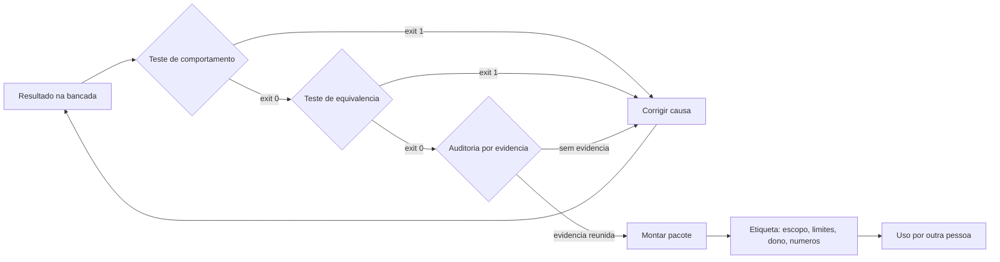

# Capítulo 12: Os portões finais: teste, auditoria e entrega

## 1. Introdução

No Capítulo 11 você aprendeu a dividir frentes e integrar sem colisão. Falta a última etapa antes de a entrega sair da bancada: provar que o resultado faz o que promete, auditar o que ficou frouxo e montar um pacote que outra pessoa consiga usar sem você ao lado.

Ao final deste capítulo você terá uma suíte de testes que prova comportamento, um roteiro de auditoria guiado por evidência e o pacote de entrega do seu projeto. É também o capítulo em que a linha de base do Capítulo 3 é reutilizada — e o ganho deixa de ser sensação para ser comparação.

## 2. Explica

### 2.1 Teste que prova comportamento

Existem quatro testes que valem em um projeto como o seu. O **teste de comportamento** verifica o que o sistema entrega, não como foi escrito: dado um arquivo com um caso difícil, o total tem que sair certo. O **teste de equivalência** compara o resultado novo com o resultado do processo antigo em um lote conhecido — é o que pega regra de negócio esquecida. O **teste de regressão** protege um defeito já corrigido de voltar. E o **teste de dados** verifica que arquivo malformado é recusado, e não silenciosamente aceito.

O teste que não vale é o que repete a implementação. Ele passa sempre porque verifica o mesmo que o código pressupõe, e não o que o negócio precisa. A diferença é a mesma entre conferir que a soma fechou e conferir que o código de hoje é idêntico ao de ontem [1].

Um critério prático para julgar a suíte: cada teste deve poder falhar por um motivo que alguém se importa. Se nenhum caso do projeto consegue reprovar um teste específico, ele está medindo o que é fácil, não o que protege. Plataformas de avaliação de agentes seguem a mesma lógica ao padronizar tarefas de referência: sem forma fixa de julgar, comparação entre execuções vira impressão [11].

### 2.2 Auditoria por evidência

Auditoria não é reler tudo com atenção. É reunir evidência verificável sobre o que foi feito. Ela responde a quatro perguntas: os portões rodaram e passaram, o resultado é reproduzível, os limites estão declarados e existe dono.

A necessidade dessa abordagem tem base em números desconfortáveis. Mesmo em avaliações maduras de agentes de programação, correções aceitas como corretas não resolviam a tarefa em **7,2%** dos casos, segundo a comparação entre conjuntos públicos e privados [2]. Ou seja: aprovação não é o mesmo que resolução, e a única forma de separar as duas coisas é verificar o resultado na tarefa real, não no teste que o próprio agente vê [3] [4].

Há um terceiro motivo para auditar por evidência, e ele é prático: auditoria que depende de leitura integral não sobrevive ao crescimento do projeto. Verificação por amostra — reabrir uma fonte por capítulo, conferir um lote por semana — mantém a confiança sem exigir releitura total [5].

### 2.3 Entrega utilizável

Entrega que não pode ser usada sem o autor não é entrega. Quatro elementos fazem a diferença. O **procedimento de uso**, escrito na linguagem de quem vai operar. Os **limites declarados**: o que o sistema não faz, onde não deve ser usado e o que acontece quando falha. A **evidência**, com os números medidos e como reproduzi-los. E o **dono**, a pessoa que responde quando algo sai errado.

O item mais esquecido é o terceiro. Projeto entregue sem limite declarado é usado fora do escopo na primeira semana — e quando quebra, a culpa recai sobre o sistema, não sobre o uso. Declarar limite é parte da entrega, não sinal de fragilidade [6].

### 2.4 Fechar o ciclo com a linha de base

No Capítulo 3 você mediu o antes: frequência, tempo, erros e retrabalho. Agora, com o projeto em uso, mede-se o depois com a mesma régua. Essa comparação é o único argumento honesto de ganho — e ela exige que o método de medição seja idêntico, não aproximado.

Se a régua mudou no meio do caminho, o número perde valor. Vale registrar no certificado como o número foi obtido, para que outra pessoa possa repetir a medição depois [7].

## 3. Ilustra

Toda oficina séria tem uma esteira de saída com portões em sequência. No primeiro, mede-se a peça. No segundo, confere-se contra o desenho. No terceiro, dá-se o acabamento. No quarto, embala-se com etiqueta de conferido — e a etiqueta traz data, responsável e número de série. Repare que nenhum desses postos acelera a produção; todos garantem que o que sai presta.

A bancada de software tem a mesma esteira, com quatro postos: teste de comportamento, teste de equivalência, auditoria por evidência e montagem do pacote. Nenhum posto é opcional, e a ordem importa: auditar antes de testar é conferir desenho sobre peça sem acabamento.

Repare no detalhe da etiqueta. Ela não diz "aprovado" apenas: diz o que foi conferido, quando e por quem. É essa informação que, seis meses depois, permite saber se a peça pode ser reusada — e é o mesmo princípio que faz um certificado de entrega ter valor.



*Figura 12.1 — A esteira de saída: quatro postos em sequência, correção sempre voltando para a bancada, e a etiqueta final declarando escopo, limites e responsável.*

Como Engenheiro de Bancada, você vai tratar a etiqueta como parte do produto. Ela é o que permite que o trabalho continue sem você.

## 4. Técnica

### 4.1 A suíte de testes de comportamento

A suíte abaixo é pequena e honesta: cada teste falha por um motivo que importa. Note que os casos difíceis estão representados — linha sem forma de pagamento, valor negativo, duplicidade.

```python
#!/usr/bin/env python3
"""Suite de comportamento: casos dificeis do dominio, sem depender do ambiente."""
import unittest


def conferir_lote(linhas):
    """Aprova ou reprova o lote e devolve pendencias."""
    pendencias = []
    vistos = set()
    total = 0.0
    for linha in linhas:
        identificador = str(linha.get("identificador", "")).strip()
        if not identificador:
            pendencias.append("identificador vazio")
            continue
        if identificador in vistos:
            pendencias.append(f"duplicidade: {identificador}")
            continue
        vistos.add(identificador)
        if not str(linha.get("forma_pagamento", "")).strip():
            pendencias.append(f"sem forma de pagamento: {identificador}")
        valor = float(linha.get("valor", 0))
        if valor < 0:
            pendencias.append(f"valor negativo: {identificador}")
            continue
        total += valor
    return {"total": round(total, 2), "pendencias": pendencias, "aprovado": not pendencias}


class TestConferenciaDeLote(unittest.TestCase):
    def test_lote_valido_soma_corretamente(self):
        lote = [{"identificador": "1", "valor": 100.0, "forma_pagamento": "pix"},
                {"identificador": "2", "valor": 50.5, "forma_pagamento": "cartao"}]
        self.assertEqual(conferir_lote(lote), {"total": 150.5, "pendencias": [], "aprovado": True})

    def test_duplicidade_reprova_o_lote(self):
        lote = [{"identificador": "1", "valor": 10.0, "forma_pagamento": "pix"},
                {"identificador": "1", "valor": 10.0, "forma_pagamento": "pix"}]
        resultado = conferir_lote(lote)
        self.assertFalse(resultado["aprovado"])
        self.assertIn("duplicidade: 1", resultado["pendencias"])

    def test_valor_negativo_nao_entra_no_total(self):
        lote = [{"identificador": "1", "valor": 10.0, "forma_pagamento": "pix"},
                {"identificador": "2", "valor": -5.0, "forma_pagamento": "pix"}]
        resultado = conferir_lote(lote)
        self.assertEqual(resultado["total"], 10.0)
        self.assertIn("valor negativo: 2", resultado["pendencias"])

    def test_linha_sem_forma_de_pagamento_vira_pendencia(self):
        lote = [{"identificador": "9", "valor": 20.0, "forma_pagamento": ""}]
        self.assertFalse(conferir_lote(lote)["aprovado"])


if __name__ == "__main__":
    unittest.main(verbosity=2)
```

Quatro testes desse tipo pegam a maior parte dos defeitos reais do domínio sem exigir infraestrutura: são rápidos, rodam em qualquer máquina e não dependem de rede. Quando o sistema passar a ter várias frentes de trabalho, o mesmo conjunto precisa rodar em cada uma antes da integração [12].

### 4.2 O teste de equivalência com o processo manual

O teste mais valioso do projeto compara o sistema com o processo que ele substitui. Ele exige um lote de referência com resultado conhecido — obtido à mão no início do projeto.

```python
#!/usr/bin/env python3
"""Teste de equivalencia: o sistema reproduz a conferencia manual no lote de referencia?"""
REFERENCIA = {
    "lote": "2026-09-14",
    "total_manual": 190.90,
    "linhas_validas": 2,
    "pendencias_manuais": 1,
}


def resultado_do_sistema():
    return {"total_manual": 190.90, "linhas_validas": 2, "pendencias_manuais": 1}


def comparar(referencia, obtido):
    return {chave: (referencia[chave], obtido.get(chave))
            for chave in referencia if chave != "lote" and referencia[chave] != obtido.get(chave)}


def main():
    divergencias = comparar(REFERENCIA, resultado_do_sistema())
    if divergencias:
        print("[BLOQUEADO] divergencia com a conferencia manual:")
        for chave, (esperado, obtido) in divergencias.items():
            print(f"  - {chave}: manual={esperado} sistema={obtido}")
        return 1
    print(f"[APROVADO] lote {REFERENCIA['lote']} reproduzido sem divergencia")
    return 0


if __name__ == "__main__":
    raise SystemExit(main())
```

Quando esse teste reprova, a causa quase sempre é uma regra de negócio que não foi documentada. Encontrar isso antes do uso é o retorno do investimento: é mais barato descobrir a regra no teste do que no relatório entregue [13].

### 4.3 A auditoria por evidência

A auditoria reúne, em um relatório único, o que foi verificado. Ela não substitui o julgamento: ela garante que a decisão seja tomada com base em fato registrado.

```python
#!/usr/bin/env python3
"""Auditoria por evidencia: portoes, reprodutibilidade, limites e responsavel."""
from pathlib import Path

EVIDENCIAS = {
    "portoes_executados": True,
    "totais_conferidos": True,
    "equivalencia_manual": True,
    "limites_declarados": True,
    "responsavel_definido": True,
    "amostra_reconferida": False,
}
LIMITES = [
    "nao controla estoque nem cadastro de cliente",
    "nao envia relatorio por e-mail de forma automatica",
]


def auditar(evidencias, limites):
    falhas = [nome for nome, ok in evidencias.items() if not ok]
    avisos = [] if limites else ["nenhum limite declarado: risco de uso fora do escopo"]
    return falhas, avisos


def main():
    falhas, avisos = auditar(EVIDENCIAS, LIMITES)
    relatorio = Path("revisao") / "relatorio-auditoria.md"
    relatorio.parent.mkdir(parents=True, exist_ok=True)
    linhas = ["# Relatorio de auditoria", ""]
    linhas += [f"- {nome}: {'ok' if ok else 'pendente'}" for nome, ok in EVIDENCIAS.items()]
    linhas += ["", "## Limites declarados"] + [f"- {item}" for item in LIMITES]
    relatorio.write_text("\n".join(linhas) + "\n", encoding="utf-8")
    print(f"evidencias pendentes: {len(falhas)}")
    for nome in falhas:
        print(f"  - {nome}")
    for aviso in avisos:
        print(f"  [aviso] {aviso}")
    if falhas:
        print("[BLOQUEADO] entrega nao sai com evidencia pendente")
        return 1
    print("[APROVADO] evidencia completa, entrega liberada")
    return 0


if __name__ == "__main__":
    raise SystemExit(main())
```

Repare que a amostra reconferida aparece como pendência declarada. Auditoria honesta mostra o que ainda não foi conferido, em vez de esconder.

### 4.4 O pacote de entrega

| Item | Conteúdo | Por que está no pacote |
|---|---|---|
| Procedimento de uso | Passo a passo de operação em linguagem simples | Permite uso sem o autor |
| Limites declarados | O que não faz e onde não usar | Impede uso fora do escopo |
| Evidência | Números medidos e como reproduzir | Torna o ganho verificável |
| Registro de decisões | O que foi decidido e por quê | Evita discussão circular |
| Responsável | Quem responde quando falha | Dá dono ao processo |
| Fora de escopo | O que ficou de fora e por quê | Explicita o que a entrega não cobre |

### 4.5 Comparação com a linha de base

| Métrica | Antes | Depois | Como foi medido |
|---|---|---|---|
| Frequência da tarefa | 5 vezes por semana | 5 vezes por semana | Contagem dos arquivos recebidos |
| Tempo por execução | 8 minutos | 1 minuto | Cronômetro, cinco execuções |
| Erros por mês | 3 divergências | 0 no lote de referência | Conferência manual em amostra |
| Retrabalho por erro | 25 minutos | Não houve | Registro no caderno |
| Rastro de execução | Inexistente | Toda execução registrada | Consulta ao banco de estado |

## 5. Aplica

**Situação.** A suíte está verde: quatorze testes passando, portões aprovados, relatório gerado. Você entrega o projeto para a equipe e considera o trabalho encerrado. Três semanas depois, alguém reclama que o total do painel não bate com a planilha em um dia específico.

**O erro.** Você investiga e descobre que o dia reclamado teve um lote com arquivo recebido em dois horários diferentes — situação que nunca apareceu nos seus testes, porque todos os casos usavam um único lote por data. O sistema somou o primeiro lote como se fosse o dia inteiro e descartou o segundo por considerar duplicidade de data. Todos os testes passaram, e nenhum deles cobria o caso real.

**O diagnóstico.** A suíte media o que era fácil de testar, não o que acontece na operação. É exatamente o modo de falha que aparece nas avaliações de agentes de código: aprovação alta no teste que o executor vê não garante resolução do problema real [2]. A ausência do caso de múltiplos lotes por dia era uma lacuna de domínio, não de código.

**A correção.** Três medidas. O caso de dois lotes no mesmo dia entra na suíte como teste de regressão. A auditoria passa a incluir conferência por amostra: um dia por semana é reconciliação com a planilha manual. E o limite declarado ganha uma linha explícita — o relatório é por lote, e a consolidação diária exige conferência [5]. Na medição seguinte, a divergência aparece no dia em que acontece, não três semanas depois.

**Métricas de sucesso.** A entrega final se avalia com seis números:

| Métrica | Como medir | Sinal de que funcionou |
|---|---|---|
| Casos difíceis cobertos por teste | Lista de casos do domínio contra a suíte | Todos os casos conhecidos com teste |
| Taxa de reprovação útil da suíte | Testes que já falharam por defeito real | Pelo menos um por ciclo de mudança |
| Tempo de reconciliação semanal | Comparação com o processo manual | Cabe em uma sessão curta |
| Divergências encontradas após a entrega | Registro de reclamações | Zero em quatro semanas |
| Itens da etiqueta completos | Conferência do pacote | Todos os seis itens preenchidos |
| Ganho medido contra a linha de base | Comparação direta | Redução de tempo sem aumento de erro |

**Nota de contexto.** Duas observações ajudam a calibrar a expectativa desta etapa. A primeira é que o código que chega à suíte costuma ter passado por apoio de modelo, e a verificação é justamente o que separa o que serve do que apenas parece servir [14] [15]. A segunda é que a adoção ampla sem política organizacional explica por que cada projeto precisa montar a própria esteira de saída [16] [17].

**Armadilhas comuns.** A primeira é suíte verde com caso de negócio ausente, o que dá confiança falsa. A segunda é auditar por releitura total, método que não sobrevive ao crescimento do projeto. A terceira é entregar sem limite declarado, o que garante uso fora do escopo. A quarta é comparar o antes e o depois com réguas diferentes, o que invalida o argumento de ganho. A quinta é aceitar aprovação de teste como prova de resolução, ignorando que aprovação e resolução são coisas distintas [8].

**Até onde isso escala.** Quatro a quatorze testes com auditoria por amostra funcionam bem para projeto de uma equipe, e o desenho aguenta crescimento moderado desde que a suíte seja executada por automação e não por lembrança [18]; quando o sistema passa a sustentar operação crítica, a verificação precisa de pipeline dedicado, cobertura declarada e rastreabilidade de cada versão entregue [1]. O limite da auditoria por amostra é estatístico: amostra pequena dá confiança limitada, e sistemas que movimentam valor alto exigem verificação integral, com custo proporcional [9]. E existe limite de escopo: nenhuma suíte substitui o julgamento de negócio sobre o que é aceitável — teste verifica o que foi decidido, não decide [10].

### 5.1 O teste que falha antes e passa depois

Esse é o teste que vale a pena escrever, e ele é mais simples do que parece. A sequência tem quatro movimentos e não aceita atalho.

1. **Escreva o teste no estado atual.** Ele deve falhar, porque a correção ainda não existe.
2. **Anote a mensagem de falha.** Ela é a prova de que o teste mede a coisa certa e não passa por acidente.
3. **Aplique a correção mínima.** Sem melhorias de carona junto — misturar as duas coisas impede saber o que corrigiu.
4. **Rode a suíte inteira.** O teste novo passa e nenhum antigo quebrou.

| Erro comum | O que esconde | Correção |
|---|---|---|
| Teste escrito depois do código | Não prova que reproduzia o defeito | Refazer na ordem certa |
| Falha genérica | Não distingue causa de sintoma | Afirmar o valor esperado |
| Correção grande no mesmo passo | Mistura refatoração com correção | Separar em duas entregas |

**Aplicação no sistema.** Faça isso uma vez nesta semana, em um defeito real e pequeno, e guarde a mensagem de falha no pacote de entrega. Ela é a evidência mais barata de que existe método, porque mostra que a correção foi direcionada, não improvisada [1].

**Limite desta prática.** Teste automatizado não substitui a auditoria de entrega. Ele cobre o que foi previsto; a auditoria cobre o que ninguém previu. Os dois juntos, mais a declaração honesta do que ficou fora, formam o conjunto mínimo que o capítulo 14 transforma em certificado [6].

## 6. Conclusão

Você fechou a Parte III com a esteira completa: quatro tipos de teste que provam comportamento, teste de equivalência com o processo manual, auditoria por evidência com pendências declaradas e pacote de entrega com limites e responsável. Aprendeu que aprovação não é resolução, que auditoria por amostra mantém a confiança sem releitura total e que o ganho só vale quando medido com a mesma régua da linha de base do Capítulo 3.

**Desafio.** Escreva os quatro testes de comportamento do seu projeto, incluindo pelo menos um caso difícil que você já viu acontecer na operação. Rode a auditoria, monte o pacote de entrega e compare os números com a linha de base — declarando, com honestidade, o que ainda não foi conferido.

Na Parte IV o assunto muda de escala: economia de custo sem perda de qualidade, certificado de confiabilidade, adoção no time e soberania sobre ferramentas e fornecedores. Começamos pelo dinheiro, porque é o que decide se o projeto continua rodando no próximo trimestre.

## 7. Referências Bibliográficas

[1] HUMBLE, Jez; FARLEY, David. *Continuous Delivery: Reliable Software Releases through Build, Test, and Deployment Automation*. Addison-Wesley, 2010. Disponível em: https://continuousdelivery.com/. Acesso em: 12 set. 2026.
[2] SCALE LABS. *SWE-Bench Pro (Public Dataset) — Leaderboard*. Disponível em: https://labs.scale.com/leaderboard/swe_bench_pro_public. Acesso em: 12 set. 2026.
[3] METR. *Recent Frontier Models Are Reward Hacking*. Disponível em: https://metr.org/blog/2025-06-05-recent-reward-hacking/. Acesso em: 12 set. 2026.
[4] MORAMPUDI, Abhishek et al. *A survey of reward hacking in agentic large language model systems*. In: Discover Artificial Intelligence. 2026. Disponível em: https://link.springer.com/article/10.1007/s44163-026-01980-z. Acesso em: 12 set. 2026.
[5] RAKSHIT, Yerram Sai. *Modernizing Software Testing: AI, Telemetry, and Agentic Quality Engineering*. In: International Journal of AI Engineering. 2026. Disponível em: https://doi.org/10.34218/ijaieg_01_01_002. Acesso em: 12 set. 2026.
[6] NYGARD, Michael T. *Release It!: Design and Deploy Production-Ready Software*. 2. ed. Pragmatic Bookshelf, 2018. Disponível em: https://pragprog.com/titles/mnee2/release-it-second-edition/. Acesso em: 12 set. 2026.
[7] FOWLER, Martin. *Patterns of Enterprise Application Architecture*. Boston: Addison-Wesley, 2002. Disponível em: https://martinfowler.com/books/eaa.html. Acesso em: 12 set. 2026.
[8] *Measuring Reward Hacking in Long-Horizon Coding Agents*. In: arXiv. 2026. Disponível em: https://arxiv.org/html/2605.21384v1. Acesso em: 12 set. 2026.
[9] NATIONAL INSTITUTE OF STANDARDS AND TECHNOLOGY. *Artificial Intelligence Risk Management Framework: Generative Artificial Intelligence Profile (NIST AI 600-1)*. Disponível em: https://nvlpubs.nist.gov/nistpubs/ai/NIST.AI.600-1.pdf. Acesso em: 12 set. 2026.
[10] MARTIN, Robert C. *Clean Architecture: A Craftsman's Guide to Software Structure and Design*. Prentice Hall, 2017. Disponível em: https://www.pearson.com/. Acesso em: 12 set. 2026.
[11] OPENAI. *Introducing SWE-bench Verified*. Disponível em: https://openai.com/index/introducing-swe-bench-verified/. Acesso em: 12 set. 2026.
[12] GIT. *git-worktree Documentation*. Disponível em: https://git-scm.com/docs/git-worktree. Acesso em: 12 set. 2026.
[13] HUMBLE, Jez; FARLEY, David. *Continuous Delivery: Reliable Software Releases through Build, Test, and Deployment Automation*. Addison-Wesley, 2010. Disponível em: https://continuousdelivery.com/. Acesso em: 12 set. 2026.
[14] VERACODE. *2025 GenAI Code Security Report: AI-Generated Code Security Risks*. Disponível em: https://www.veracode.com/blog/ai-generated-code-security-risks/. Acesso em: 12 set. 2026.
[15] TRAXTECH. *20% of AI-Generated Code Dependencies Don't Exist, Creating Supply Chain Security Risks*. Disponível em: https://www.traxtech.com/blog/20-of-ai-generated-code-dependencies-dont-exist-creating-supply-chain-security-risks. Acesso em: 12 set. 2026.
[16] ROBBES, Romain et al. *Agentic Much? Adoption of Coding Agents on GitHub*. In: ACM Transactions on Software Engineering and Methodology. 2026. Disponível em: https://doi.org/10.1145/3822180. Acesso em: 12 set. 2026.
[17] STACK OVERFLOW. *2025 Developer Survey — AI*. Disponível em: https://survey.stackoverflow.co/2025/ai. Acesso em: 12 set. 2026.
[18] ENDOR LABS. *The Most Common Security Vulnerabilities in AI-Generated Code*. Disponível em: https://www.endorlabs.com/learn/the-most-common-security-vulnerabilities-in-ai-generated-code. Acesso em: 12 set. 2026.
[19] CLOUD SECURITY ALLIANCE. *Vibe Coding's Security Debt: The AI-Generated CVE Surge*. Disponível em: https://labs.cloudsecurityalliance.org/research/csa-research-note-ai-generated-code-vulnerability-surge-2026/. Acesso em: 12 set. 2026.
[20] DORA / GOOGLE CLOUD. *State of AI-assisted Software Development 2025*. Disponível em: https://dora.dev/dora-report-2025/. Acesso em: 12 set. 2026.
