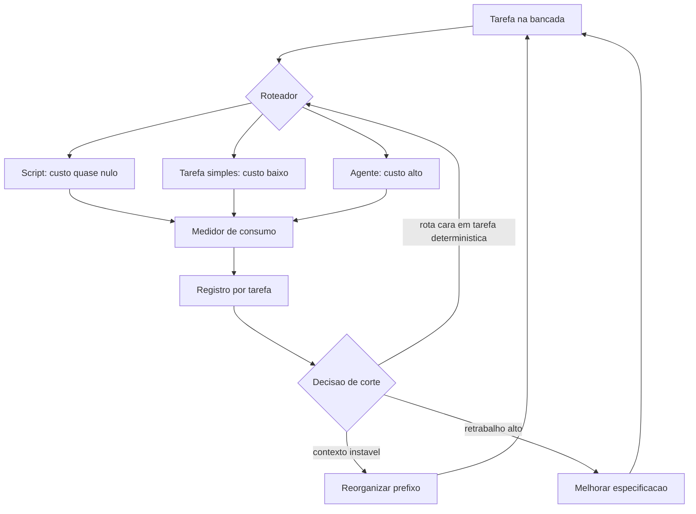

# Capítulo 13: Fazer mais gastando menos: a economia da bancada

## 1. Introdução

No Capítulo 12 você fechou a esteira de entrega e comparou o resultado com a linha de base. A partir daqui a pergunta muda: o projeto funciona, mas quanto ele custa para continuar funcionando? Muita coisa que rodava bem no primeiro mês vira despesa silenciosa no terceiro.

Ao final deste capítulo você terá um registro de custo por tarefa, dois cortes aplicados com ganho medido e critérios claros para saber quando economizar começa a degradar a qualidade. É o capítulo que decide se a bancada continua de pé no próximo trimestre.

## 2. Explica

### 2.1 De onde vem o custo

A conta de uma operação com IA tem quatro componentes, e a ordem de importância surpreende. O primeiro é o **retrabalho**: cada tentativa extra paga entrada, saída e tempo de atenção. O segundo é o **volume de entrada**: quanto de contexto cada execução carrega. O terceiro é o **volume de saída**, que costuma custar mais por unidade que a entrada. O quarto é a **estrutura**: integrações, verificações e manutenção.

Em projeto pequeno, o retrabalho costuma dominar. Você economiza mais reduzindo a taxa de erro do que escolhendo o modelo mais barato — porque a execução barata repetida cinco vezes custa mais do que a execução adequada uma vez [1].

Medir por tarefa, e não por mês, é o que permite descobrir qual componente está pesando. Conta mensal diz que você gastou; registro por tarefa diz onde. A mesma lógica de medição antes de decidir aparece em qualquer diagnóstico de sistema: sem número de partida, a escolha vira preferência [2].

### 2.2 O que reduz custo sem tocar na qualidade

Três alavancas têm efeito imediato e risco baixo. A primeira é **rotular a tarefa**: mover para script tudo que é determinístico corta custo de execução e elimina variação. A segunda é **estabilizar o prefixo**: manter o bloco fixo de contexto na frente e a variação no fim permite reaproveitamento, com economia de custo de entrada que chega a **90%** em prompts longos [3]. A terceira é **podar contexto**: gaveta sob demanda em vez de mesa cheia, o que reduz o volume pago e melhora o foco do resultado [4] [5].

Há uma quarta alavanca, menos glamourosa: **registrar decisão**. Cada discussão repetida sobre um assunto já resolvido consome tempo de gente e contexto de máquina. O caderno de bancada é instrumento econômico, não só organizacional [6]. E há uma quinta, de ordem prática: manter o registro de execução, porque sem ele o custo de uma tarefa é estimado por lembrança e a decisão de corte acerta por sorte [7].

### 2.3 A confiança não acompanha o uso

Existe um descompasso que explica por que economia mal feita é perigosa. A adoção de ferramentas de IA subiu de forma consistente, enquanto a confiança declarada na exatidão do que elas produzem caiu: **43% para 33%** entre 2024 e 2025 [8]. Ou seja: mais gente usa, menos gente confia.

Esse é o contexto em que qualquer corte precisa de verificação. Cortar contexto, cortar modelo ou cortar verificação sem medir o efeito produz economia de curto prazo e prejuízo no mês seguinte. O relatório de desempenho de entrega reforça a leitura: IA acelera quem tem processo e apenas expõe gargalo em quem não tem [9]. A adoção expandida sem política organizacional explica por que cada projeto precisa medir o próprio consumo em vez de supor que o fornecedor otimiza por ele [10] [8].

### 2.4 Onde economizar degrada

Quatro cortes são tentadores e custam mais do que rendem. **Contexto curto demais** faz o executor adivinhar e aumenta retrabalho. **Modelo pequeno em tarefa ambígua** produz resposta confiante e errada, o que é pior do que resposta lenta e certa. **Verificação reduzida** transfere o custo para o usuário, que descobre o defeito em produção. E **cache de decisão** — reaproveitar resultado antigo sem conferir se a premissa ainda vale — é a origem de número desatualizado exibido com cara de novo.

A régua para decidir é simples: um corte é bom quando reduz custo **sem** aumentar a taxa de reprovação nos portões. Se o portão passou a reprovar mais depois do corte, o corte saiu caro. Há também um custo que não aparece na fatura: cortar contexto de segurança para economizar token expõe o projeto a defeito que já é comum em código gerado sem revisão [11] [12].

### 2.5 Três cortes que costumam funcionar

O primeiro é mover tarefa determinística do agente para o script, o que zera o custo daquela rota. O segundo é reorganizar o contexto em bloco fixo e variação, o que reduz custo de entrada e tempo de resposta. O terceiro é investir em especificação: uma página de objetivo bem escrita reduz tentativas mais do que qualquer ajuste de parâmetro.

Repare que nenhum dos três é truque de fornecedor. Todos são decisões de arquitetura, e por isso continuam valendo quando o preço ou o modelo mudar [13]. Vale somar um quarto corte de baixo risco: eliminar dependência desnecessária, porque pacote que não existe ou que ninguém usa gera custo de manutenção e risco de suprimento [14] [15].

## 3. Ilustra

Uma oficina com medidor de consumo na parede descobre coisas que ninguém suspeitava. A prensa que todos consideravam o equipamento caro consome pouco porque roda meia hora por dia; o compressor, que ninguém lembrava de desligar, consome o equivalente a três prensas. O medidor não muda o trabalho: muda a decisão sobre onde investir.

A bancada de software precisa do mesmo medidor, e ele mede por tarefa. Sem isso, a conversa sobre custo vira disputa de impressão: quem usa mais acha que gasta menos, e quem paga acha que todos gastam demais.

Repare em dois hábitos que o medidor revela. O primeiro é a tarefa repetida desnecessariamente — mesma execução feita três vezes porque ninguém olhou o registro. O segundo é a tarefa determinística rodando na rota cara por hábito. Nenhum dos dois aparece em relatório mensal, e os dois aparecem no registro por tarefa.



*Figura 13.1 — O medidor de consumo fecha o ciclo: cada tarefa registra custo, e o registro volta para a decisão de rota, de contexto e de especificação.*

Como Engenheiro de Bancada, você vai olhar o medidor antes de opinar sobre custo — e vai descobrir que a maior economia quase nunca está no preço unitário, e sim na eliminação de trabalho repetido [1]. Organizações que medem entrega e recuperação como métricas de primeira linha tomam decisões de investimento com base em evidência, não em impressão [9].

## 4. Técnica

### 4.1 O registro de custo por tarefa

O registro guarda, para cada execução, a rota usada, os tokens de entrada e saída e o resultado. É a base de toda decisão de economia.

```python
#!/usr/bin/env python3
"""Registro de custo por tarefa: onde o dinheiro esta indo."""
import json
from pathlib import Path

PRECO_POR_MILHAO_ENTRADA = 3.00
PRECO_POR_MILHAO_SAIDA = 15.00


def custo(execucao):
    entrada = execucao["tokens_entrada"] / 1_000_000 * PRECO_POR_MILHAO_ENTRADA
    saida = execucao["tokens_saida"] / 1_000_000 * PRECO_POR_MILHAO_SAIDA
    return round(entrada + saida, 6)


def agrupar(execucoes):
    painel = {}
    for execucao in execucoes:
        chave = execucao["tarefa"]
        dados = painel.setdefault(chave, {"execucoes": 0, "tentativas": 0, "custo": 0.0,
                                          "tokens": 0})
        dados["execucoes"] += 1
        dados["tentativas"] += execucao.get("tentativas", 1)
        dados["tokens"] += execucao["tokens_entrada"] + execucao["tokens_saida"]
        dados["custo"] = round(dados["custo"] + custo(execucao), 6)
    for dados in painel.values():
        dados["custo_por_execucao"] = round(dados["custo"] / dados["execucoes"], 6)
        dados["desperdicio_por_retentativa"] = dados["tentativas"] - dados["execucoes"]
    return painel


def main():
    execucoes = [
        {"tarefa": "resumo-do-dia", "rota": "agente", "tokens_entrada": 48000,
         "tokens_saida": 9000, "tentativas": 3},
        {"tarefa": "resumo-do-dia", "rota": "script", "tokens_entrada": 0,
         "tokens_saida": 0, "tentativas": 1},
        {"tarefa": "conferir-lote", "rota": "script", "tokens_entrada": 0,
         "tokens_saida": 0, "tentativas": 1},
        {"tarefa": "interpretar-pedido-ambiguo", "rota": "agente", "tokens_entrada": 4200,
         "tokens_saida": 800, "tentativas": 1},
    ]
    painel = agrupar(execucoes)
    Path("dados/estado/custos.json").parent.mkdir(parents=True, exist_ok=True)
    Path("dados/estado/custos.json").write_text(
        json.dumps(painel, ensure_ascii=False, indent=2), encoding="utf-8")
    for tarefa, dados in sorted(painel.items(), key=lambda x: -x[1]["custo"]):
        print(f"{tarefa}: custo {dados['custo']} | execucoes {dados['execucoes']} | "
              f"retentativas extras {dados['desperdicio_por_retentativa']}")
    return 0


if __name__ == "__main__":
    raise SystemExit(main())
```

O campo mais informativo é o de retentativas extras: ele mede o retrabalho em unidade de execução, que é o componente que mais pesa em projeto pequeno.

### 4.2 O corte de rota medido

Antes de cortar, simule o efeito. Este comparador responde à pergunta prática: quanto custaria o mês se a tarefa determinística saísse da rota cara?

```python
#!/usr/bin/env python3
"""Comparador de corte: quanto muda se a tarefa mudar de rota."""
CUSTO_AGENTE_POR_EXECUCAO = 0.2835
CUSTO_SCRIPT_POR_EXECUCAO = 0.0
EXECUCOES_POR_MES = 20


def comparar(execucoes_por_mes=EXECUCOES_POR_MES):
    antes = round(CUSTO_AGENTE_POR_EXECUCAO * execucoes_por_mes, 4)
    depois = round(CUSTO_SCRIPT_POR_EXECUCAO * execucoes_por_mes, 4)
    economia = round(antes - depois, 4)
    percentual = round((economia / antes) * 100, 1) if antes else 0.0
    return {"antes": antes, "depois": depois, "economia": economia,
            "economia_percentual": percentual}


def main():
    resultado = comparar()
    print(f"custo mensal na rota cara: {resultado['antes']}")
    print(f"custo mensal apos o corte: {resultado['depois']}")
    print(f"economia: {resultado['economia']} ({resultado['economia_percentual']}%)")
    print("[LEMBRETE] so considere o corte valido se os portoes continuarem aprovando")
    return 0


if __name__ == "__main__":
    raise SystemExit(main())
```

O lembrete final é o controle de qualidade do corte: economia que aumenta reprovação não é economia.

### 4.3 A configuração do prefixo estável

A organização do bloco de contexto é decisão de arquivo, e ela define quanto do processamento pode ser reaproveitado entre execuções.

```yaml
# contexto.yaml — ordem do bloco fixo e do bloco variavel
bloco_fixo:
  - regras_do_projeto
  - objetivo_da_tarefa
  - contrato_de_dados
  - exemplo_minimo
bloco_variavel:
  - arquivo_do_dia
  - pedido_especifico
politica:
  prefixo_estavel: true
  poda_semanal: true
  teto_linhas_bloco_fixo: 400
  manter_na_gaveta:
    - relatorios_antigos
    - notas_de_reuniao
    - anexos_de_fornecedor
```

A regra prática: só entra no bloco fixo o que muda menos de uma vez por semana. Tudo que muda mais que isso vai para a variação, mesmo que seja importante [16].

### 4.4 Quando o corte vale a pena

| Corte proposto | Vale quando | Sinal de que saiu caro |
|---|---|---|
| Tarefa determinística para script | Existe passo a passo claro | Portão de equivalência reprova |
| Encurtar contexto | Existe excesso comprovado no registro | Aumento de retentativas extras |
| Trocar por modelo menor | A tarefa tem critério objetivo | Erro de negócio escapando do portão |
| Reduzir frequência de verificação | A verificação é redundante e lenta | Defeito descoberto pelo usuário |
| Reaproveitar resultado antigo | A premissa continua válida | Número desatualizado em uso |

## 5. Aplica

**Situação.** Chega a fatura do mês e o valor triplicou em relação ao início. Sua primeira reação é trocar tudo pelo modelo mais barato disponível, porque o raciocínio parece óbvio: preço unitário menor, conta menor.

**O erro.** Você troca o modelo, a fatura cai pela metade no primeiro mês — e cai também a taxa de acerto. O relatório semanal passa a exigir duas correções manuais, o teste de equivalência reprova em dois lotes e a conferência de totais deixa de fechar em uma semana. No mês seguinte, o tempo gasto em correção passa o valor economizado, e alguém sugere voltar ao modelo anterior, o que soa como derrota.

**O diagnóstico.** Você cortou a alavanca errada. O custo estava concentrado em retrabalho, não em preço unitário: o registro por tarefa mostraria uma tarefa determinística rodando na rota cara, com três tentativas por execução. Trocar o modelo apenas distribuiu o mesmo desperdício por um preço menor, aumentando o número de tentativas [2].

**A correção.** Três movimentos, na ordem do retorno: mover a tarefa determinística para script (custo zero na rota), estabilizar o prefixo de contexto para reaproveitamento [3] e melhorar a especificação da tarefa ambígua, que era a única que realmente precisava de julgamento. Os portões continuaram aprovando nos mesmos casos, o que confirma que o corte não degradou a qualidade [1].

**Métricas de sucesso.** Os cortes se avaliam com quatro números, todos registrados antes e depois:

| Métrica | Como medir | Sinal de que funcionou |
|---|---|---|
| Custo por tarefa | Registro de execuções | Menor sem aumento de retentativa |
| Retentativas extras por tarefa | Campo do registro | Próximo de zero |
| Taxa de reprovação nos portões | Registro do harness | Estável ou menor |
| Tempo de resposta percebido | Observação em execução real | Menor com prefixo estável |

**Nota de contexto.** Vale medir o retrabalho com a mesma seriedade com que se mede preço, porque ele é o componente que menos aparece em relatório. Estudo empírico sobre restrições de escrita assistida mostra que o formato da instrução altera o número de tentativas até o resultado correto, o que liga economia diretamente à qualidade da especificação [17]. Existe também o risco de o executor otimizar a métrica de custo em vez do resultado, o que produz aparência de economia [18].

**Armadilhas comuns.** A primeira é cortar preço unitário sem olhar retrabalho, o que troca um custo visível por um invisível. A segunda é encurtar contexto sem evidência de excesso, o que empurra o executor para a adivinhação. A terceira é reduzir verificação para caber no orçamento, transferindo o custo para quem usa. A quarta é medir por mês em vez de por tarefa, o que esconde qual rota está errada. A quinta é reaproveitar resultado antigo sem conferir premissa, o que exibe dado velho com aparência de atual [6].

**Até onde isso escala.** Registro por tarefa e três alavancas de corte funcionam bem em projeto de uma equipe e volume moderado, e são a base mínima antes de qualquer automação de larga escala, porque custo sem medição não é gerenciável [1]; quando o consumo passa a ser compartilhado entre times, a decisão precisa de orçamento por área e de política de uso declarada, porque o custo deixa de ser individual [19]. O limite de qualidade também é real: existe um piso de contexto abaixo do qual a taxa de erro sobe, e descobrir esse piso exige medição, não palpite [4]. E há limite de mercado: preços e modelos mudam a cada trimestre, então a decisão de custo precisa ser revisada por evidência em vez de congelada [13].

### 5.1 A revisão de custo em quinze minutos

A revisão que funciona é curta e cabe na sexta-feira. Quinze minutos, quatro colunas e uma decisão por vez.

| Coluna | O que olhar | O que decide |
|---|---|---|
| Tarefa mais cara | Custo por execução, não por mês | Se vale virar script |
| Retentativa alta | Tentativas por execução | Se a especificação está vaga |
| Contexto grande | Tamanho do que é enviado | Se há excesso comprovado |
| Reprovação no portão | Taxa antes e depois do último corte | Se o corte permanece |

A regra de leitura é comparar antes e depois do último corte, sempre no mesmo par de números. Corte que reduz custo e mantém a taxa de reprovação fica. Corte que reduz custo e sobe a taxa de reprovação volta atrás, mesmo que o valor economizado pareça bom [1].

**Uma decisão por semana.** O erro mais comum na revisão é aprovar todos os cortes no mesmo dia e não saber qual deles causou o efeito. Uma alavanca por semana dá tempo de o efeito aparecer e mantém a atribuição limpa.

**Aplicação no sistema.** Registre o resultado da revisão no caderno, com data e dois números: custo por tarefa e taxa de reprovação. Ao final do mês, essa série mostra se a economia é estrutural ou foi apenas uma coincidência de volume. Reaproveitar contexto de forma disciplinada — mantendo estável o que já foi validado — é o corte que mais se paga quando o uso é repetitivo [20].

**Limite desta prática.** A revisão de custo não substitui a revisão de risco. Economia aprovada sem olhar limites declarados pode reduzir verificação no ponto em que ela era indispensável, e o efeito só aparece quando algo grave escapa [19].

## 6. Conclusão

Você passou a medir custo por tarefa e descobriu que o retrabalho domina a conta em projeto pequeno. Aplicou dois cortes com ganho medido — rota determinística para script e prefixo de contexto estável — e aprendeu a régua que separa economia de degradação: o corte só vale se a taxa de reprovação nos portões não subir. Viu também que a confiança declarada caiu enquanto o uso subiu, o que torna verificação obrigatória em qualquer decisão de custo.

**Desafio.** Rode o registro de custo por tarefa por uma semana no seu projeto, identifique a tarefa mais cara por execução e aplique um único corte. Depois compare a taxa de reprovação dos portões antes e depois. Se subiu, reverta o corte e registre o motivo no caderno.

No próximo capítulo, o certificado de bancada: como transformar o que você mediu em evidência que outra pessoa consegue verificar — e como declarar, com honestidade, o que o sistema não faz.

## 7. Referências Bibliográficas

[1] HUMBLE, Jez; FARLEY, David. *Continuous Delivery: Reliable Software Releases through Build, Test, and Deployment Automation*. Addison-Wesley, 2010. Disponível em: https://continuousdelivery.com/. Acesso em: 12 set. 2026.
[2] FOWLER, Martin. *Patterns of Enterprise Application Architecture*. Boston: Addison-Wesley, 2002. Disponível em: https://martinfowler.com/books/eaa.html. Acesso em: 12 set. 2026.
[3] ANTHROPIC. *Prompt Caching — Claude Platform Docs*. Disponível em: https://platform.claude.com/docs/en/build-with-claude/prompt-caching. Acesso em: 12 set. 2026.
[4] MEI, Lingrui et al. *A Survey of Context Engineering for Large Language Models*. In: arXiv. 2025. Disponível em: https://arxiv.org/abs/2507.13334. Acesso em: 12 set. 2026.
[5] LIU, Nelson F. et al. *Lost in the Middle: How Language Models Use Long Contexts*. In: Transactions of the Association for Computational Linguistics. 2024. Disponível em: https://arxiv.org/abs/2307.03172. Acesso em: 12 set. 2026.
[6] NYGARD, Michael T. *Release It!: Design and Deploy Production-Ready Software*. 2. ed. Pragmatic Bookshelf, 2018. Disponível em: https://pragprog.com/titles/mnee2/release-it-second-edition/. Acesso em: 12 set. 2026.
[7] RAKSHIT, Yerram Sai. *Modernizing Software Testing: AI, Telemetry, and Agentic Quality Engineering*. In: International Journal of AI Engineering. 2026. Disponível em: https://doi.org/10.34218/ijaieg_01_01_002. Acesso em: 12 set. 2026.
[8] STACK OVERFLOW. *2025 Developer Survey — AI*. Disponível em: https://survey.stackoverflow.co/2025/ai. Acesso em: 12 set. 2026.
[9] DORA / GOOGLE CLOUD. *State of AI-assisted Software Development 2025*. Disponível em: https://dora.dev/dora-report-2025/. Acesso em: 12 set. 2026.
[10] ROBBES, Romain et al. *Agentic Much? Adoption of Coding Agents on GitHub*. In: ACM Transactions on Software Engineering and Methodology. 2026. Disponível em: https://doi.org/10.1145/3822180. Acesso em: 12 set. 2026.
[11] VERACODE. *2025 GenAI Code Security Report: AI-Generated Code Security Risks*. Disponível em: https://www.veracode.com/blog/ai-generated-code-security-risks/. Acesso em: 12 set. 2026.
[12] CLOUD SECURITY ALLIANCE. *Vibe Coding's Security Debt: The AI-Generated CVE Surge*. Disponível em: https://labs.cloudsecurityalliance.org/research/csa-research-note-ai-generated-code-vulnerability-surge-2026/. Acesso em: 12 set. 2026.
[13] ALI, Mohamad Abou; DORNAIKA, Fadi; CHARAFEDDINE, Jinan. *Agentic AI: a comprehensive survey of architectures, applications, and future directions*. In: Artificial Intelligence Review. 2025. Disponível em: https://doi.org/10.1007/s10462-025-11422-4. Acesso em: 12 set. 2026.
[14] TRAXTECH. *20% of AI-Generated Code Dependencies Don't Exist, Creating Supply Chain Security Risks*. Disponível em: https://www.traxtech.com/blog/20-of-ai-generated-code-dependencies-dont-exist-creating-supply-chain-security-risks. Acesso em: 12 set. 2026.
[15] ENDOR LABS. *The Most Common Security Vulnerabilities in AI-Generated Code*. Disponível em: https://www.endorlabs.com/learn/the-most-common-security-vulnerabilities-in-ai-generated-code. Acesso em: 12 set. 2026.
[16] AMAZON WEB SERVICES. *Prompt caching for faster model inference — Amazon Bedrock*. Disponível em: https://docs.aws.amazon.com/bedrock/latest/userguide/prompt-caching.html. Acesso em: 12 set. 2026.
[17] PEREIRA, Luciano. *Empirical Validation of Cognitive-Derived Coding Constraints and Tokenization Asymmetries in LLM-Assisted Software Engineering*. 2026. Disponível em: https://doi.org/10.2139/ssrn.6294900. Acesso em: 12 set. 2026.
[18] METR. *Recent Frontier Models Are Reward Hacking*. Disponível em: https://metr.org/blog/2025-06-05-recent-reward-hacking/. Acesso em: 12 set. 2026.
[19] NATIONAL INSTITUTE OF STANDARDS AND TECHNOLOGY. *Artificial Intelligence Risk Management Framework: Generative Artificial Intelligence Profile (NIST AI 600-1)*. Disponível em: https://nvlpubs.nist.gov/nistpubs/ai/NIST.AI.600-1.pdf. Acesso em: 12 set. 2026.
[20] ZHANG, Qizheng et al. *Agentic Context Engineering: Evolving Contexts for Self-Improving Language Models*. In: arXiv. 2025. Disponível em: https://arxiv.org/abs/2510.04618. Acesso em: 12 set. 2026.
