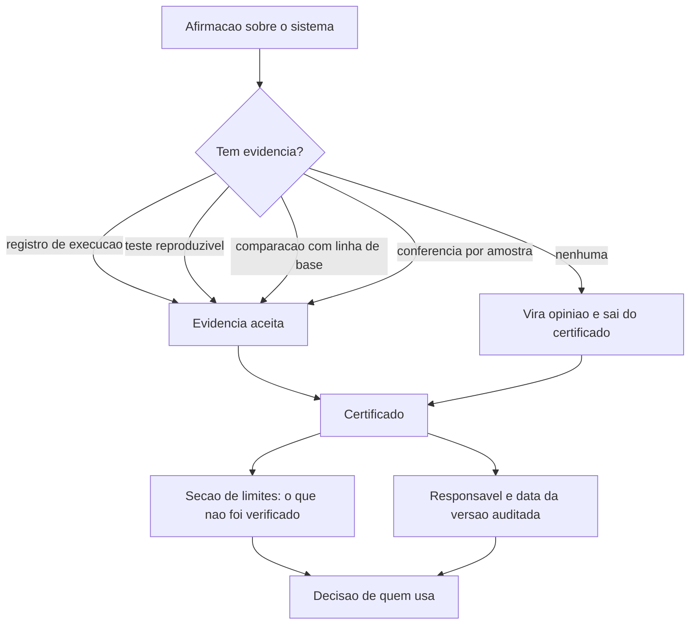

# Capítulo 14: O certificado de bancada: provar que funciona

## 1. Introdução

No Capítulo 13 você reduziu o custo e manteve a qualidade verificando os portões. Agora falta a parte que separa trabalho sério de promessa: provar. Não basta o sistema funcionar enquanto você olha — é preciso que outra pessoa consiga verificar o resultado sem depender da sua palavra.

Ao final deste capítulo você terá o certificado do seu projeto: um documento curto com escopo, números, procedimento de reprodução, limites declarados e responsável. É o artefato que sobrevive à saída da pessoa que construiu o sistema.

## 2. Explica

### 2.1 Evidência contra opinião

Existem quatro tipos de evidência aceitáveis em uma entrega de software. O **registro de execução**, que mostra o que rodou, quando e com qual resultado. O **teste reproduzível**, que qualquer pessoa pode rodar na própria máquina. A **comparação com a linha de base**, que mostra ganho medido com a mesma régua. E a **conferência por amostra**, em que alguém reabre um caso e confere contra a fonte original.

Tudo o que não é um desses quatro é opinião, mesmo quando é opinião bem informada. "Rodei aqui e funcionou" não conta, porque não descreve como repetir. "O time gostou" também não, porque mede satisfação, não resultado [1]. A distinção tem valor prático: entrega com evidência sobrevive a mudança de pessoa, entrega por confiança não sobrevive nem à primeira semana de férias [2].

A exigência de evidência não vem de desconfiança das pessoas: vem da natureza probabilística dos executores. Como a mesma instrução produz resultados diferentes em execuções diferentes, verificar uma vez não autoriza afirmar sobre todas [3].

### 2.2 Reprodutibilidade: a mesma entrada, a mesma saída

Reprodutibilidade é a propriedade mais subestimada e a mais fácil de verificar: rode duas vezes com a mesma entrada e compare. Se os resultados divergirem, o sistema tem uma fonte de variação que ninguém declarou — ordem de processamento, data do sistema, dependência externa.

Boa parte dos projetos já registra evidência junto ao próprio dado, e essa prática se consolidou: o relatório anual de repositórios públicos registrou crescimento expressivo de projetos que passaram a usar notebooks como registro de análise, chegando a **2,4 milhões** de repositórios [4]. A ideia por trás disso é a mesma do certificado: o resultado precisa vir acompanhado do caminho que levou até ele.

A reprodutibilidade também depende de ambiente declarado. Versão de dependência, versão de dado e versão de regra formam o conjunto que permite replicar o resultado [5]. Declarar o ambiente é o que evita o clássico "na minha máquina funciona": sem essa declaração, o certificado descreve um conjunto de circunstâncias irrepetível [6].

### 2.3 Limites declarados: o que o certificado não pode afirmar

Um certificado honesto declara o que **não** prova. Quatro declarações são obrigatórias. Primeira: ele não prova ausência de defeito, apenas que os casos verificados passaram. Segunda: a cobertura é limitada aos casos representados, e caso não representado é caso não verificado. Terceira: o certificado vale para a versão auditada e para o ambiente declarado, não para sempre. Quarta: aprovação de teste não equivale a resolução de tarefa — existe uma diferença mensurável entre as duas coisas em avaliações de agentes de código [7].

A ausência dessa seção é o sinal mais confiável de certificado inflado. Documento que só lista sucessos está vendendo, não provando [2].

### 2.4 O custo de provar e o limite da amostra

Provar tem preço, e o preço certo depende do risco. Verificação integral serve para operação que movimenta valor alto ou dado sensível. Amostragem serve para operação de rotina, desde que a amostra seja declarada e o critério de seleção seja aleatório — amostra escolhida a dedo mede o que você já esperava encontrar.

Governança de IA trata essa proporcionalidade como princípio: controle proporcional ao risco, com rastreabilidade e supervisão declaradas [8]. Em projeto pequeno, isso se traduz em algo muito concreto: registrar quem conferiu, quando e em qual amostra [9].

## 3. Ilustra

Toda oficina que vende peça para outra indústria emite um certificado. Ele não diz "a peça é boa". Diz a norma aplicada, os ensaios realizados, os valores medidos, o lote conferido, a data e o responsável pela liberação. Diz também, na mesma folha, o que **não** foi ensaiado — porque o comprador precisa saber onde o risco permanece.

É essa segunda parte que a maioria dos projetos de software esquece. Entregar sem declarar limite é entregar um certificado de uma lauda, sem a seção de ressalvas. Quem recebe supõe cobertura total, usa fora do escopo e descobre o limite da pior forma possível.

Repare em outro detalhe do certificado físico: ele acompanha a peça, não o projeto. Cada lote tem o seu. A tradução para software é direta: o certificado vale para a versão entregue, com a data e o conjunto de casos verificados — não para o sistema "de modo geral".



*Figura 14.1 — O caminho do certificado: cada afirmação precisa de evidência correspondente, o que não tem evidência sai, e a seção de limites decide como o sistema deve ser usado.*

Como Engenheiro de Bancada, você vai escrever a seção de limites primeiro. Ela é a parte que protege quem usa e quem construiu.

## 4. Técnica

### 4.1 O certificado

O formato abaixo é curto de propósito. Certificado que ninguém lê não cumpre função; o que importa é a rastreabilidade entre afirmação e evidência.

```markdown
# Certificado de Bancada — Painel de Pedidos

- Versao auditada: v1.0 (lote de referencia 2026-09-14)
- Ambiente: Python 3.11, banco local em arquivo, sem dependencia externa de rede
- Responsavel pela liberacao: operacao

## Afirmacoes com evidencia

| Afirmacao | Evidencia | Como reproduzir |
|---|---|---|
| Conferencia de lote aprova dados validos | 4 testes de comportamento | `python -m unittest discover` |
| Sistema reproduz o processo manual | Teste de equivalencia no lote 2026-09-14 | `python verificacoes/teste_equivalencia.py` |
| Reexecucao nao duplica pedido | Importacao rodada duas vezes no lote de referencia | `python verificacoes/importar_pedidos.py` (2x) |
| Ganho de tempo medido | Linha de base x uso em producao | Planilha de medicao, seção Anexos |
| Toda execucao fica registrada | Tabela de execucoes | `python verificacoes/ler_registro.py` |

## Limites declarados

- Nao controla estoque, cadastro de cliente ou emissao fiscal.
- Nao envia relatorio por e-mail de forma automatica.
- Consolidacao diaria com mais de um lote por data exige conferencia manual.
- Verificacao por amostra semanal, nao integral: divergencia fora da amostra pode existir.
- Vale para a versao auditada; mudanca de contrato invalida este certificado.
```

### 4.2 O teste de reprodutibilidade

A verificação de reprodutibilidade é simples e pega problemas reais: rode a mesma entrada duas vezes e compare o resultado normatizado.

```python
#!/usr/bin/env python3
"""Teste de reprodutibilidade: a mesma entrada produz a mesma saida?"""
import json
from pathlib import Path

ENTRADA = [
    {"identificador": "8842", "valor": 132.90, "forma_pagamento": "pix"},
    {"identificador": "8843", "valor": 58.00, "forma_pagamento": "cartao"},
]


def processar(linhas):
    """Processa em ordem estavel e ignora dados volatil ao resultado."""
    por_forma = {}
    total = 0.0
    for linha in sorted(linhas, key=lambda item: item["identificador"]):
        por_forma[linha["forma_pagamento"]] = round(
            por_forma.get(linha["forma_pagamento"], 0.0) + linha["valor"], 2)
        total += linha["valor"]
    return {"total": round(total, 2), "por_forma": por_forma}


def main():
    primeira = processar(ENTRADA)
    segunda = processar(list(reversed(ENTRADA)))
    iguais = json.dumps(primeira, sort_keys=True) == json.dumps(segunda, sort_keys=True)
    destino = Path("dados/estado/certificado-reprodutibilidade.json")
    destino.parent.mkdir(parents=True, exist_ok=True)
    destino.write_text(json.dumps({"primeira": primeira, "segunda": segunda,
                                   "reproduzivel": iguais}, ensure_ascii=False, indent=2),
                       encoding="utf-8")
    print(f"total: {primeira['total']} | reproduzivel: {iguais}")
    if not iguais:
        print("[BLOQUEADO] resultado varia entre execucoes: investigar ordem ou data")
        return 1
    print("[APROVADO] resultado reproduzivel no lote de referencia")
    return 0


if __name__ == "__main__":
    raise SystemExit(main())
```

Note o detalhe do processamento em ordem estável. Boa parte das não reprodutibilidades vem justamente de depender da ordem de chegada dos dados.

### 4.3 A conferência por amostra

A amostra precisa de critério declarado e registro. Este verificador seleciona o caso por regra determinística e grava o resultado da conferência.

```python
#!/usr/bin/env python3
"""Conferencia por amostra: selecao declarada e registro do que foi conferido."""
import json
from pathlib import Path

LOTES = ["2026-09-08", "2026-09-09", "2026-09-10", "2026-09-11", "2026-09-12",
         "2026-09-13", "2026-09-14"]
CRITERIO = "um lote a cada cinco, sempre o quinto da lista ordenada"


def escolher(lotes, posicao=4):
    ordenados = sorted(lotes)
    if len(ordenados) <= posicao:
        posicao = len(ordenados) - 1
    return ordenados[posicao]


def main():
    escolhido = escolher(LOTES)
    registro = {
        "criterio": CRITERIO,
        "lote_conferido": escolhido,
        "conferido_contra": "planilha manual do dia",
        "resultado": "conforme",
        "responsavel": "operacao",
    }
    destino = Path("dados/estado/amostra-conferida.json")
    destino.parent.mkdir(parents=True, exist_ok=True)
    destino.write_text(json.dumps(registro, ensure_ascii=False, indent=2), encoding="utf-8")
    print(f"criterio: {CRITERIO}")
    print(f"lote conferido: {escolhido} — resultado: conforme")
    return 0


if __name__ == "__main__":
    raise SystemExit(main())
```

A amostra não precisa ser grande: precisa ser declarada e verificável. Três conferências bem registradas valem mais que trinta sem critério. O mesmo vale para revisão de segurança: conferência periódica de dependência e de saída encontra defeito que já é frequente em código gerado sem verificação [10] [11].

### 4.4 A matriz de evidência

| Afirmação comum | Evidência que a sustenta | Se não houver |
|---|---|---|
| "O sistema está pronto" | Testes de comportamento aprovados | Sai do certificado |
| "Não duplica pedido" | Reexecução no lote de referência | Sai do certificado |
| "Ficou mais rápido" | Comparação com linha de base | Vira impressão |
| "É seguro" | Revisão de dependência e saída verificada | Texto substituído por limites |
| "Funciona em produção" | Registro de execução em uso real | Vira observação |
| "Ninguém teve problema" | Registro de reclamações e amostra conferida | Vira opinião |

## 5. Aplica

**Situação.** Você precisa apresentar resultados para a diretoria. Monta um documento com os pontos fortes: quatorze testes passando, integração com o sistema da loja, ganho de tempo estimado, adoção por duas pessoas. O documento tem quatro páginas e nenhuma ressalva.

**O erro.** Na apresentação, alguém pergunta o que acontece quando chega arquivo com mais de um lote por data. Você responde que "não deve acontecer". Na semana seguinte acontece — e exatamente no dia da apresentação de resultado para o cliente. O sistema soma o primeiro lote como se fosse o dia inteiro e o relatório sai errado.

**O diagnóstico.** O documento afirmava cobertura que não existia, porque não declarava limite. O problema não foi o defeito: foi a confiança indevida gerada por um certificado que só listava sucesso. A diferença entre aprovação e resolução é mensurável e conhecida em avaliações de agentes [7] [12].

**A correção.** Refaça o certificado com duas metades: afirmações com evidência e limites declarados, incluindo o caso de múltiplos lotes por data. Acrescente a conferência por amostra com critério registrado e o responsável pela liberação [8]. O documento fica mais curto e mais útil, e a próxima pergunta difícil já tem resposta no papel.

**Métricas de sucesso.** O certificado se avalia pela sua utilidade prática:

| Métrica | Como medir | Sinal de que funcionou |
|---|---|---|
| Afirmações sem evidência | Conferência do documento | Zero afirmações sem evidência |
| Limites declarados | Contagem na seção de limites | Pelo menos três limites explícitos |
| Reprodutibilidade verificada | Teste de reprodutibilidade | Aprovado no lote de referência |
| Amostra conferida e registrada | Registro de amostra | Uma por semana, com responsável |
| Dúvidas respondidas pelo documento | Perguntas abertas na entrega | Nenhuma pergunta sem resposta escrita |

**Nota de contexto.** Certificado serve também para quem chega depois. A adoção ampla de assistentes sem política organizacional produziu muitos projetos que funcionam sem documentar por quê, e o certificado é a forma mais barata de reconstruir esse conhecimento [13] [14]. Organizações que tratam verificação como parte do processo extraem ganho mais consistente da IA [15].

**Armadilhas comuns.** A primeira é listar só sucessos, o que gera confiança indevida. A segunda é amostra escolhida a dedo, que mede o que já se sabia. A terceira é certificar sem versão declarada, o que torna o documento inválido na primeira mudança. A quarta é tratar aprovação de teste como prova de resolução de tarefa [16]. A quinta é certificar uma vez e nunca revisar: certificado vencido é pior que certificado ausente, porque transmite segurança falsa [2]. A sexta é certificar a ferramenta e esquecer o processo: o certificado descreve um sistema em uso, com dono e rotina, e não apenas um programa [17].

**Até onde isso escala.** Certificado de uma lauda com amostra semanal funciona bem para projeto de uma equipe e operação de risco moderado, e continua sendo o nível mínimo aceitável quando o sistema passa a ser usado por outras pessoas — a diferença não é o tamanho do documento, é a existência dele [1]; quando o sistema passa a sustentar decisão financeira ou dado pessoal, a evidência precisa ser integral, com rastreabilidade por versão e retenção declarada [8]. O limite de custo é explícito: verificação total de operação de grande volume tem preço alto, e a decisão de quanto provar é proporcional ao dano possível. E existe limite de tempo: prova tem validade — mudança de contrato, de dependência ou de dado invalida o certificado anterior [5]. Também existe o limite de escopo do que a evidência alcança: verificação cobre o que foi especificado, e requisito que ninguém escreveu permanece não verificado [18].

### 5.1 A conferência de mesa

Certificado se prova na mesa de outra pessoa. A conferência tem cinco passos e precisa ser feita por quem não participou da entrega — ou por você, dois dias depois, lendo só os documentos.

1. **Reproduza o procedimento.** Rode como está escrito, sem consultar quem fez.
2. **Confira três números por amostra.** Escolha três afirmações e vá até a fonte de cada uma.
3. **Procure o limite declarado.** Se a seção de limites estiver vazia, a entrega reprova.
4. **Compare com a linha de base.** Sem comparação, o número não significa nada.
5. **Assine o resultado.** Quem conferiu, quando e com qual versão do artefato.

| Falha na conferência | Onde ela aparece | Correção |
|---|---|---|
| Procedimento depende de quem fez | Passo 1 trava | Reescrever com o caminho completo |
| Número sem fonte | Passo 2 trava | Amarrar cada número a uma citação |
| Limite declarado genérico | Passo 3 não reprova nada | Nomear o que não funciona |
| Sem data de versão | Passo 5 vira opinião | Registrar versão do artefato |

**Aplicação no sistema.** Peça que alguém de fora tente conferir a sua última entrega usando apenas os documentos. O tempo que a pessoa leva até concluir é a medida real de qualidade do certificado — e não o tamanho da seção de resultados [1].

**Limite desta prática.** Amostra não é censo. Conferir três afirmações reduz a chance de erro grave, não elimina a existência de erro. O certificado deve dizer isso em letras claras, porque declarar o alcance do que foi verificado é parte de ser verificável [2]. Referências públicas de comparação, como conjuntos de tarefas abertos e seus painéis de resultado, existem para isso: permitem situar um número sem transformar a comparação em promessa [19].

## 6. Conclusão

Você escreveu o certificado da bancada: afirmações ligadas a evidência verificável, reprodutibilidade testada com o mesmo lote, conferência por amostra com critério declarado e uma seção de limites que protege quem usa. Aprendeu que aprovação não é resolução, que amostra escolhida a dedo não mede nada e que certificado sem limites é venda disfarçada de prova.

**Desafio.** Escreva o certificado do seu projeto com as duas seções, rode o teste de reprodutibilidade e registre uma conferência por amostra com critério explícito. Se alguma afirmação não tiver evidência correspondente, remova-a do documento — ou produza a evidência antes de afirmar.

No próximo capítulo, a bancada deixa de ser individual: adoção em equipe, convivência com código herdado e os acordos que fazem o método sobreviver a férias, troca de pessoa e aumento de escopo.

## 7. Referências Bibliográficas

[1] HUMBLE, Jez; FARLEY, David. *Continuous Delivery: Reliable Software Releases through Build, Test, and Deployment Automation*. Addison-Wesley, 2010. Disponível em: https://continuousdelivery.com/. Acesso em: 12 set. 2026.
[2] NYGARD, Michael T. *Release It!: Design and Deploy Production-Ready Software*. 2. ed. Pragmatic Bookshelf, 2018. Disponível em: https://pragprog.com/titles/mnee2/release-it-second-edition/. Acesso em: 12 set. 2026.
[3] PEREIRA, Luciano. *Empirical Validation of Cognitive-Derived Coding Constraints and Tokenization Asymmetries in LLM-Assisted Software Engineering*. 2026. Disponível em: https://doi.org/10.2139/ssrn.6294900. Acesso em: 12 set. 2026.
[4] GITHUB. *Octoverse 2025: The state of open source*. Disponível em: https://octoverse.github.com/. Acesso em: 12 set. 2026.
[5] CHACON, Scott; STRAUB, Ben. *Pro Git: Everything you need to know about Git*. 2. ed. Apress, 2014. Disponível em: https://git-scm.com/book/en/v2. Acesso em: 12 set. 2026.
[6] FOWLER, Martin. *Patterns of Enterprise Application Architecture*. Boston: Addison-Wesley, 2002. Disponível em: https://martinfowler.com/books/eaa.html. Acesso em: 12 set. 2026.
[7] SCALE LABS. *SWE-Bench Pro (Public Dataset) — Leaderboard*. Disponível em: https://labs.scale.com/leaderboard/swe_bench_pro_public. Acesso em: 12 set. 2026.
[8] NATIONAL INSTITUTE OF STANDARDS AND TECHNOLOGY. *Artificial Intelligence Risk Management Framework: Generative Artificial Intelligence Profile (NIST AI 600-1)*. Disponível em: https://nvlpubs.nist.gov/nistpubs/ai/NIST.AI.600-1.pdf. Acesso em: 12 set. 2026.
[9] RAKSHIT, Yerram Sai. *Modernizing Software Testing: AI, Telemetry, and Agentic Quality Engineering*. In: International Journal of AI Engineering. 2026. Disponível em: https://doi.org/10.34218/ijaieg_01_01_002. Acesso em: 12 set. 2026.
[10] VERACODE. *2025 GenAI Code Security Report: AI-Generated Code Security Risks*. Disponível em: https://www.veracode.com/blog/ai-generated-code-security-risks/. Acesso em: 12 set. 2026.
[11] ENDOR LABS. *The Most Common Security Vulnerabilities in AI-Generated Code*. Disponível em: https://www.endorlabs.com/learn/the-most-common-security-vulnerabilities-in-ai-generated-code. Acesso em: 12 set. 2026.
[12] *Measuring Reward Hacking in Long-Horizon Coding Agents*. In: arXiv. 2026. Disponível em: https://arxiv.org/html/2605.21384v1. Acesso em: 12 set. 2026.
[13] ROBBES, Romain et al. *Agentic Much? Adoption of Coding Agents on GitHub*. In: ACM Transactions on Software Engineering and Methodology. 2026. Disponível em: https://doi.org/10.1145/3822180. Acesso em: 12 set. 2026.
[14] STACK OVERFLOW. *2025 Developer Survey — AI*. Disponível em: https://survey.stackoverflow.co/2025/ai. Acesso em: 12 set. 2026.
[15] DORA / GOOGLE CLOUD. *State of AI-assisted Software Development 2025*. Disponível em: https://dora.dev/dora-report-2025/. Acesso em: 12 set. 2026.
[16] METR. *Recent Frontier Models Are Reward Hacking*. Disponível em: https://metr.org/blog/2025-06-05-recent-reward-hacking/. Acesso em: 12 set. 2026.
[17] ALI, Mohamad Abou; DORNAIKA, Fadi; CHARAFEDDINE, Jinan. *Agentic AI: a comprehensive survey of architectures, applications, and future directions*. In: Artificial Intelligence Review. 2025. Disponível em: https://doi.org/10.1007/s10462-025-11422-4. Acesso em: 12 set. 2026.
[18] MEI, Lingrui et al. *A Survey of Context Engineering for Large Language Models*. In: arXiv. 2025. Disponível em: https://arxiv.org/abs/2507.13334. Acesso em: 12 set. 2026.
[19] OPENAI. *Introducing SWE-bench Verified*. Disponível em: https://openai.com/index/introducing-swe-bench-verified/. Acesso em: 12 set. 2026.
[20] SWE-BENCH. *SWE-bench Leaderboards*. Disponível em: https://www.swebench.com/. Acesso em: 12 set. 2026.
