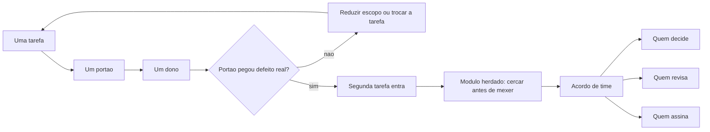

# Capítulo 15: Levando a bancada para o time (e para o código que já existe)

## 1. Introdução

No Capítulo 14 você produziu o certificado: evidência, limites e responsável. Até aqui, porém, tudo foi trabalho de uma pessoa em um projeto. O próximo passo é o mais difícil de todos — levar o método para outras pessoas sem transformar a bancada em burocracia.

Ao final deste capítulo você terá um plano de adoção em três etapas, uma cerca de proteção para o módulo herdado e um acordo de time que define quem decide, quem revisa e quem assina. É o capítulo que decide se o método sobrevive à sua ausência.

## 2. Explica

### 2.1 Adoção sem revolução

Método novo morre de duas formas: por rejeição e por excesso. A rejeição acontece quando alguém tenta impor a bancada inteira de uma vez, com quatro camadas, dez leis e doze arquivos de configuração. O excesso acontece quando o método vira fim em si mesmo e o time passa mais tempo mantendo a estrutura do que entregando.

Considere o ponto de partida real do time: **84% dos desenvolvedores** já usam ferramentas de IA no trabalho, e a maior parte decidiu isso individualmente, sem processo comum [1]. O que falta não é ferramenta, é método compartilhado — e método compartilhado se instala por demonstração, não por anúncio [2].

A adoção que funciona começa pequena: **uma tarefa, um portão e um dono**. Escolha um processo que dá dor conhecida, escreva o portão que o verifica e nomeie alguém responsável por ele. Rode por duas semanas. Se o portão pegar um defeito real nesse período, o time adota por conta própria; se não pegar nada, você provavelmente escolheu a tarefa errada [3].

Esse encadeamento tem apoio em dados de prática: a IA tende a amplificar o que já existe na organização, acelerando quem tem processo e apenas expondo gargalo em quem não tem [4]. Levar bancada para o time não é introduzir uma ferramenta nova — é instalar o processo que faltava, na dose mínima. E a dose mínima tem base em evidência: restrição explícita muda comportamento de forma mais confiável do que recomendação genérica [5].

### 2.2 Código herdado: cercar antes de julgar

Todo time tem um módulo que ninguém quer tocar. A tentação é reescrever. A regra da bancada é outra: **medir antes de julgar, cercar antes de mexer**. Meça quanto tempo aquele módulo consome em manutenção e quantos incidentes ele causa. Se o custo é baixo, cercar é suficiente; se é alto, a substituição entra na fila com justificativa registrada.

A cerca tem três partes. O **teste de comportamento** atual, capturado a partir do que o módulo faz hoje. A **restrição de escopo**, que impede alteração fora do combinado. E o **registro do que ninguém entende**, porque parte do comportamento herdado é conhecimento tácito que só aparece quando algo quebra [6]. Capturar o teste antes de mexer é a diferença entre modernizar e apagar regra sem perceber [7].

Há um detalhe de risco que muda de escala em código herdado: dependência antiga sem manutenção e ausência de verificação de segurança. Boa parte da dívida herdada é desse tipo, e ela não aparece em teste funcional [8] [9]. Dependência que não existe mais no registro público é outro caso frequente, e ele só se revela na instalação em máquina limpa [10].

### 2.3 O acordo de time

Sem acordo explícito, a bancada vira preferência de quem a criou. Três definições precisam existir por escrito, e são curtas: **quem decide** mudança de regra, **quem revisa** entrega que atravessa módulo compartilhado e **quem assina** a liberação para uso. Sem essas três, o portão vira sugestão na primeira semana cheia.

O acordo também define o que não é negociável. As leis da constituição do Capítulo 4 pertencem a esse conjunto: dado de origem intocável, entrega sem portão não avança, registro obrigatório. Regra que pode ser suspensa por conveniência individual não é regra, é hábito.

### 2.4 O que mede adoção de verdade

Adoção não se mede por quantas pessoas criaram conta ou quantas abriram o repositório. Mede-se por três sinais bem específicos: o portão **está bloqueando** entregas de vez em quando; o caderno **tem decisões novas** sem a sua participação; e outra pessoa **consegue operar** o sistema sem te chamar. Os três indicam que o método saiu da sua mão.

Se nenhum dos três aparece em dois meses, o problema não é resistência do time: é que a estrutura não entrou na rotina. Nesse caso, reduza o escopo em vez de aumentar a cobrança [4]. Vale considerar também o desenho dos papéis: governança sem dono explícito não sustenta verificação ao longo do tempo [11].

## 3. Ilustra

Existem dois jeitos de instalar um processo em uma oficina grande. O primeiro é reunir todos, apresentar o manual completo e exigir cumprimento a partir de segunda. O segundo é escolher uma bancada, montar o quadro de normas só nela, rodar duas semanas e deixar que os outros vejam o resultado.

O segundo funciona porque ninguém discute método abstrato: discute resultado visível. Quando a bancada vizinha deixa de devolver peça errada, a pergunta "como vocês fazem isso" aparece sozinha — e a resposta já está montada na parede, pronta para ser copiada.

Repare no papel das diferentes bancadas. A que tem projeto antigo e mal documentado precisa de mais apreciação e menos reescrita, porque o conhecimento do sistema herdado mora no comportamento dele. A que tem projeto novo aceita instalação completa. Exigir o mesmo nível das duas é o erro que faz times abandonarem processo bom.



*Figura 15.1 — Adoção em três etapas: começa com uma tarefa que prova valor, avança para o código herdado com cerca e termina no acordo explícito de papéis.*

Como Engenheiro de Bancada, você vai resistir à pressa de instalar tudo. A bancada que cresce por evidência de valor dura mais do que a que cresce por decreto.

## 4. Técnica

### 4.1 O plano de adoção

O plano declara as etapas, o responsável e o critério de avanço. Critério de avanço explícito é o que impede que a adoção vire campanha permanente.

```yaml
# adocao.yaml — plano de adocao da bancada
etapas:
  - ordem: 1
    escopo: conferencia de pedidos do dia
    portao: totais_conferem
    responsavel: operacao
    prazo: duas semanas
    criterio_de_avanco: o portao bloqueou pelo menos uma entrega com defeito real
  - ordem: 2
    escopo: modulo legado de exportacao
    portao: equivalencia_manual
    responsavel: operacao
    prazo: tres semanas
    criterio_de_avanco: teste de comportamento capturado e cerca aplicada
  - ordem: 3
    escopo: acordo de time
    portao: revisao_por_outra_pessoa
    responsavel: lideranca_tecnica
    prazo: uma reuniao
    criterio_de_avanco: papeis de decisao, revisao e assinatura registrados
papeis:
  decide: lideranca_tecnica
  revisa: par_tecnico
  assina: responsavel_pela_operacao
nao_negociavel:
  - dado de origem intocavel
  - entrega sem portao nao avanca
  - registro de decisao obrigatorio
```

### 4.2 A cerca do módulo herdado

A cerca é um documento curto que declara o que está protegido e o que não pode ser tocado sem verificação prévia.

```markdown
# Cerca — modulo de exportacao (herdado)

## O que o modulo faz hoje
- Le a tabela de pedidos do dia e gera arquivo de exportacao.
- Exclui pedidos cancelados do cliente cadastrado como parceiro interno.

## Regras nao documentadas descobertas
- A exclusao acima nao esta escrita em lugar nenhum; foi descoberta por comparacao de saida.

## Teste capturado
- Entrada: lote de referencia 2026-09-14. Saida esperada: arquivo com 2 linhas.
- Comando: `python verificacoes/teste_equivalencia.py`

## Restricoes
- Alteracao apenas em `verificacoes/exportacao/`.
- Proibido alterar `dados/entrada/`.
- Qualquer mudanca exige rodar o teste capturado antes e depois.
```

### 4.3 O painel de adoção

O painel mostra se o método realmente entrou na rotina, com os três sinais do capítulo.

```python
#!/usr/bin/env python3
"""Painel de adocao: o metodo saiu da mao do autor?"""
import json
from pathlib import Path

REGISTRO = {
    "bloqueios_por_portao": 3,
    "decisoes_registradas_por_outras_pessoas": 4,
    "execucoes_por_outras_pessoas": 11,
    "duvidas_respondidas_por_documento": 5,
    "chamadas_diretas_ao_autor": 2,
}
MINIMOS = {"bloqueios_por_portao": 1,
           "decisoes_registradas_por_outras_pessoas": 1,
           "execucoes_por_outras_pessoas": 1}


def avaliar(registro, minimos):
    sinais = {chave: registro.get(chave, 0) >= valor for chave, valor in minimos.items()}
    travado = not any(sinais.values())
    return sinais, travado


def main():
    sinais, travado = avaliar(REGISTRO, MINIMOS)
    for chave, atendido in sinais.items():
        print(f"[{'ok' if atendido else 'pendente'}] {chave}")
    print(f"chamadas diretas ao autor: {REGISTRO['chamadas_diretas_ao_autor']}")
    Path("dados/estado/adocao.json").parent.mkdir(parents=True, exist_ok=True)
    Path("dados/estado/adocao.json").write_text(
        json.dumps({"sinais": sinais, "registro": REGISTRO}, ensure_ascii=False, indent=2),
        encoding="utf-8")
    if travado:
        print("[ATENCAO] nenhum sinal de adocao: reduza o escopo em vez de cobrar mais")
        return 0
    print("[OK] metodo em uso por mais de uma pessoa")
    return 0


if __name__ == "__main__":
    raise SystemExit(main())
```

### 4.4 O checklist do acordo de time

| Item | Pergunta a responder | Onde fica registrado |
|---|---|---|
| Decisão de regra | Quem pode mudar uma lei da constituição? | Constituição do projeto |
| Revisão de entrega | Quem revisa mudança em módulo compartilhado? | Acordo de time |
| Assinatura de liberação | Quem autoriza uso em produção? | Certificado do projeto |
| Adoção de nova tarefa | Qual o critério para incluir a tarefa seguinte? | Plano de adoção |
| Retirada de portão | Quem pode desativar verificação e por qual motivo? | Acordo de time |
| Registro de exceção | Onde ficam registradas as exceções aceitas? | Caderno de bancada |

## 5. Aplica

**Situação.** Você decide apresentar a bancada na reunião semanal. Prepara quarenta slides com as quatro camadas, as dez leis, o certificado e a arquitetura completa. A recepção é educada, e ninguém adota nada. Na semana seguinte, alguém sugere "criar um grupo de trabalho para estudar o processo".

**O erro.** Você insiste: monta um repositório-modelo completo, escreve treinamento de duas horas e pede que cada pessoa aplique o método em seu projeto. Duas semanas depois, metade do time tem estrutura e nenhuma entrega nova; a outra metade abandonou, dizendo que "o processo dá mais trabalho do que o problema".

**O diagnóstico.** Você apresentou método sem demonstrar resultado, e método abstrato compete mal com tarefa urgente. O time não era resistente: era ocupado. Adoção de plataforma funciona quando existe caminho claro com valor visível, não quando se instala estrutura e se espera mudança de comportamento [4]. Somando a isso, metade do código do time é herdado e nem pergunta se beneficia — cercar era a resposta certa para ele, não instalar [12].

**A correção.** Uma única tarefa, um portão, um dono. Você escolhe a conferência de pedidos, que já tem dor conhecida, e roda por duas semanas com o portão bloqueando o que não passa. No terceiro bloqueio real, outra pessoa pergunta como funciona — e aí a adoção começa. O módulo herdado ganha cerca, não reescrita; o acordo de time entra na reunião seguinte, com três definições de papel [3].

**Métricas de sucesso.** Adoção se mede por comportamento, não por opinião:

| Métrica | Como medir | Sinal de que funcionou |
|---|---|---|
| Bloqueios reais do portão | Registro do harness | Pelo menos um no período |
| Decisões registradas por outras pessoas | Caderno de bancada | Existe registro sem o autor |
| Execuções por outras pessoas | Registro de execução | Mais de uma pessoa operando |
| Chamadas diretas ao autor | Contagem simples | Em queda |
| Módulos herdados cercados | Lista de cercas | Todo módulo crítico com cerca |

**Nota de contexto.** Dois lembretes ajudam a manter o pé no chão. O primeiro é que o método chega em um time que já usa assistentes por conta própria, o que significa que a discussão não é sobre adotar ou não, mas sobre como organizar [1] [13]. O segundo é que verificação precisa continuar valendo depois da empolgação inicial, e é aí que o acordo de papéis faz diferença [3].

**Armadilhas comuns.** A primeira é apresentar o método completo antes de mostrar resultado, o que gera rejeição educada. A segunda é instalar estrutura em módulo herdado sem cerca, o que produz perda de comportamento oculto. A terceira é não definir quem decide, o que faz a regra valer até a primeira urgência. A quarta é medir adoção por entusiasmo declarado, que não prevê uso. A quinta é cobrar mais quando a adoção não acontece, em vez de reduzir escopo [6]. A sexta é deixar o conhecimento do módulo herdado só na cabeça de quem mantém: registro de decisão é o que permite outra pessoa assumir sem arqueologia [14].

**Até onde isso escala.** Uma tarefa, um portão e um dono funcionam bem em time pequeno e em um projeto principal, e continuam válidos como degrau inicial em organização maior, desde que exista caminho comum para as regras do núcleo [12]; em organização com vários times, o que escala é o núcleo comum de regras e o caminho de plataforma, com cada time mantendo seus portões locais [4]. O limite aparece quando o acordo de papéis não existe: sem decisão, revisão e assinatura definidas, a bancada depende de uma pessoa e não sobrevive à sua saída. E há limite cultural: organização que pune bloqueio de entrega aprende a desligar verificação, independentemente do método — e aí o problema é de gestão, não de ferramenta [11].

### 5.1 O plano de duas semanas para o time

Adoção não se anuncia: se demonstra em uma tarefa com nome de dono e um portão que roda. O plano cabe em duas semanas e em cinco linhas.

| Semana | O que acontece | Evidência produzida |
|---|---|---|
| 1, dias 1-2 | Escolher uma tarefa do time | Tarefa nomeada e dono |
| 1, dias 3-5 | Escrever especificação e contexto | Documento de uma página |
| 2, dias 1-3 | Rodar com portão ligado | Registro de execução |
| 2, dias 4-5 | Revisar e decidir continuar | Comparação com a linha de base |

**O papel do responsável.** Ter um dono nomeado muda o resultado mais do que qualquer ferramenta. Tarefa sem responsável vira iniciativa compartilhada, e iniciativa compartilhada sem dono é a forma mais comum de não acontecer. O dono não precisa ser quem entende mais do assunto; precisa ser quem responde pelo resultado e tem autoridade para reprovar entrega [4]. Em ambiente com agentes, responsabilidade vem acompanhada de permissão declarada: vale registrar quais ferramentas cada pessoa pode acionar, porque governança que só existe no discurso não resiste ao primeiro descuido [15]. Framework de orquestração com governança embutida serve exatamente para isso, transformando permissão em configuração verificável em vez de acordo verbal [16].

**Código que já existe.** Quando a tarefa cai em módulo herdado, comece descrevendo o comportamento atual antes de propor mudanças. Esse retrato escrito é o que permite diferenciar defeito antigo de defeito novo e evita refatoração às cegas em área sem teste. Documentação viva do que o módulo faz é insumo para quem chega depois e para o próprio executor, que passa a ter vocabulário compartilhado em vez de adivinhação [12]. Quando o módulo é grande demais para ser lido arquivo por arquivo, gerar o retrato estrutural de forma assistida reduz o tempo até o primeiro entendimento útil e dá base objetiva para a conversa sobre o que mexer primeiro [17].

**Aplicação no sistema.** Escolha a tarefa, o responsável e o portão, e rode por duas semanas antes de ampliar. Ampliar escopo sem essa prova é o caminho mais rápido para o projeto virar mais uma ferramenta abandonada no inventário do time [3].

**Como saber se pegou.** Mede-se adoção por uso observado, não por declaração de intenção. Telemetria de execução, mesmo simples, é o que permite ver quem rodou o quê e quantas vezes [20]. Sem isso, a decisão de continuar se apoia em percepção, e percepção em time costuma favorecer quem fala mais alto.

**Limite desta prática.** Duas semanas provam viabilidade, não sustentabilidade. Manutenção contínua exige acordo explícito sobre quem cuida das regras, quem revisa e o que acontece quando o dono muda — e isso o plano de duas semanas não resolve sozinho [6]. Em organizações maiores, o desenho explícito da solução, com papéis e critérios de sucesso definidos antes da execução, é o que costuma separar projeto institucionalizado de experimento isolado [18]. E vale lembrar que coordenação entre agentes exige protocolo de negociação, não apenas boa vontade de quem opera: quanto mais partes envolvidas, mais formal precisa ser o combinado [19].

## 6. Conclusão

Você montou o caminho de adoção: uma tarefa com um portão e um dono, módulo herdado cercado em vez de reescrito, e acordo explícito de papéis. Aprendeu a medir adoção por três sinais concretos — bloqueio real, decisão registrada por outra pessoa e operação sem você — e que reduzir escopo funciona melhor que cobrar mais.

**Desafio.** Escolha uma tarefa do seu time, escreva o portão que a verifica e nomeie o responsável. Rode por duas semanas e registre os três sinais de adoção. Depois escreva a cerca do módulo mais temido do repositório, com o teste de comportamento capturado.

No último capítulo, a soberania: manter dados, regras e histórico do seu lado, trocar de modelo sem reescrever o processo e decidir por evidência quando ficar ou quando sair — fechando a bancada que você montou capítulo a capítulo.

## 7. Referências Bibliográficas

[1] STACK OVERFLOW. *2025 Developer Survey — AI*. Disponível em: https://survey.stackoverflow.co/2025/ai. Acesso em: 12 set. 2026.
[2] ROBBES, Romain et al. *Agentic Much? Adoption of Coding Agents on GitHub*. In: ACM Transactions on Software Engineering and Methodology. 2026. Disponível em: https://doi.org/10.1145/3822180. Acesso em: 12 set. 2026.
[3] HUMBLE, Jez; FARLEY, David. *Continuous Delivery: Reliable Software Releases through Build, Test, and Deployment Automation*. Addison-Wesley, 2010. Disponível em: https://continuousdelivery.com/. Acesso em: 12 set. 2026.
[4] DORA / GOOGLE CLOUD. *State of AI-assisted Software Development 2025*. Disponível em: https://dora.dev/dora-report-2025/. Acesso em: 12 set. 2026.
[5] PEREIRA, Luciano. *Empirical Validation of Cognitive-Derived Coding Constraints and Tokenization Asymmetries in LLM-Assisted Software Engineering*. 2026. Disponível em: https://doi.org/10.2139/ssrn.6294900. Acesso em: 12 set. 2026.
[6] NYGARD, Michael T. *Release It!: Design and Deploy Production-Ready Software*. 2. ed. Pragmatic Bookshelf, 2018. Disponível em: https://pragprog.com/titles/mnee2/release-it-second-edition/. Acesso em: 12 set. 2026.
[7] FOWLER, Martin. *Patterns of Enterprise Application Architecture*. Boston: Addison-Wesley, 2002. Disponível em: https://martinfowler.com/books/eaa.html. Acesso em: 12 set. 2026.
[8] ENDOR LABS. *The Most Common Security Vulnerabilities in AI-Generated Code*. Disponível em: https://www.endorlabs.com/learn/the-most-common-security-vulnerabilities-in-ai-generated-code. Acesso em: 12 set. 2026.
[9] CLOUD SECURITY ALLIANCE. *Vibe Coding's Security Debt: The AI-Generated CVE Surge*. Disponível em: https://labs.cloudsecurityalliance.org/research/csa-research-note-ai-generated-code-vulnerability-surge-2026/. Acesso em: 12 set. 2026.
[10] TRAXTECH. *20% of AI-Generated Code Dependencies Don't Exist, Creating Supply Chain Security Risks*. Disponível em: https://www.traxtech.com/blog/20-of-ai-generated-code-dependencies-dont-exist-creating-supply-chain-security-risks. Acesso em: 12 set. 2026.
[11] NATIONAL INSTITUTE OF STANDARDS AND TECHNOLOGY. *Artificial Intelligence Risk Management Framework: Generative Artificial Intelligence Profile (NIST AI 600-1)*. Disponível em: https://nvlpubs.nist.gov/nistpubs/ai/NIST.AI.600-1.pdf. Acesso em: 12 set. 2026.
[12] MARTIN, Robert C. *Clean Architecture: A Craftsman's Guide to Software Structure and Design*. Prentice Hall, 2017. Disponível em: https://www.pearson.com/. Acesso em: 12 set. 2026.
[13] GITHUB. *Octoverse 2025: The state of open source*. Disponível em: https://octoverse.github.com/. Acesso em: 12 set. 2026.
[14] CHACON, Scott; STRAUB, Ben. *Pro Git: Everything you need to know about Git*. 2. ed. Apress, 2014. Disponível em: https://git-scm.com/book/en/v2. Acesso em: 12 set. 2026.
[15] NATIONAL SECURITY AGENCY. *Model Context Protocol (MCP) Security — CSI*. Disponível em: https://www.nsa.gov/Portals/75/documents/Cybersecurity/CSI_MCP_SECURITY.pdf. Acesso em: 12 set. 2026.
[16] PRUDVI SAISARAN PONDURU. *AgentMesh-MCP: A Secure and Governed Framework for Agentic AI Systems Using LLM Agents and Model Context Protocol Servers*. In: International Journal of Scientific Research in Engineering and Management. 2026. Disponível em: https://doi.org/10.55041/ijsrem62689. Acesso em: 12 set. 2026.
[17] VĂDUVA, A. et al. *Code2UML: Agentic LLMs with context engineering for scalable software visualization*. In: arXiv. 2026. Disponível em: https://www.semanticscholar.org/paper/792e745f4068bb0557ed2a4c6601812b3e3baf5e. Acesso em: 12 set. 2026.
[18] OKULA, Oghenekeno Hilkiah; NEERANJAN, Chitare. *A Design Science Approach for Agentic AI in Network Engineering: Autonomous Network Management Using AI Agents, LLMs and Model Context Protocol (MCP) Mechanisms*. 2026. Disponível em: https://doi.org/10.36227/techrxiv.176978431.15223796/v1. Acesso em: 12 set. 2026.
[19] LORENZONI, Giuliano; ALENCAR, Paulo; COWAN, Donald. *LLM-X: A Scalable Negotiation-Oriented Exchange for Communication Among Personal LLM Agents*. In: Proceedings of the 2026 International Workshop on Agentic Engineering. 2026. Disponível em: https://doi.org/10.1145/3786167.3788429. Acesso em: 12 set. 2026.
[20] RAKSHIT, Yerram Sai. *Modernizing Software Testing: AI, Telemetry, and Agentic Quality Engineering*. In: International Journal of AI Engineering. 2026. Disponível em: https://doi.org/10.34218/ijaieg_01_01_002. Acesso em: 12 set. 2026.
