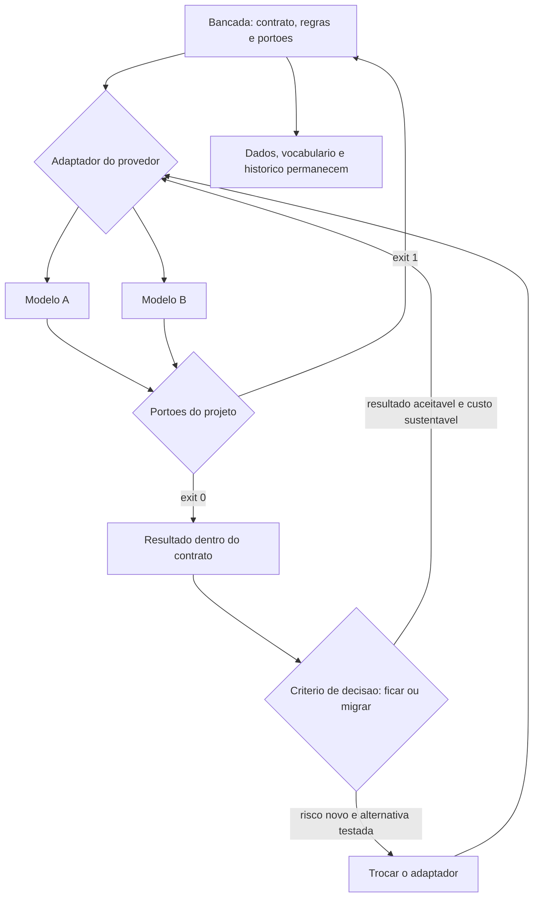

# Capítulo 16: Soberania: não ficar preso a fornecedor, modelo ou plataforma

## 1. Introdução

No Capítulo 15 você levou a bancada para o time e cercou o código herdado. Falta a última proteção, e ela é a mais estratégica: garantir que tudo o que você construiu continue seu, independentemente de qual fornecedor estiver na moda no próximo trimestre.

Ao final deste capítulo você terá o contrato de portabilidade do seu projeto, um teste que comprova a troca de provedor sem reescrever regra de negócio e um critério de decisão para quando ficar e quando sair. É também o capítulo que fecha a bancada montada do primeiro ao último capítulo.

## 2. Explica

### 2.1 O que precisa ser seu

A soberania de um projeto se resume a cinco ativos que não podem depender de fornecedor. **Os dados**, na sua estrutura e no seu formato. **As regras de negócio**, escritas em arquivo seu. **Os portões**, que definem o que é aceitável. **O histórico de execução**, que prova o que aconteceu. E **o vocabulário**, que descreve o domínio na sua linguagem.

O teste prático é direto: imagine que o fornecedor dobre o preço amanhã ou encerre o serviço. O que você perde? Se a resposta inclui regra de negócio, o projeto não é seu — está alugado. Se a resposta é "troco a peça do motor", você construiu soberania [1].

Esse cuidado parece paranoia e é gestão de risco comum: mudança de preço, de política de uso e de disponibilidade de modelo acontece em intervalos curtos, e o custo de trocar não deveria incluir reescrever o processo [2]. A adoção ampla de assistentes, feita em grande parte fora de política organizacional, tornou essa exposição comum em vez de excepcional [3] [4].

### 2.2 Trocar modelo sem reescrever o processo

A troca é suportável quando o sistema está organizado em três partes: o **contrato** (o que a tarefa precisa receber e devolver), o **adaptador** (quem conversa com o provedor) e a **regra** (o que o negócio exige). Nesse desenho, trocar de modelo altera o adaptador e nada mais.

Um detalhe que muita gente descobre tarde: contratos de resposta e formato de contexto são ativos próprios, não detalhes do fornecedor. Se a instrução principal do seu sistema está escrita no formato específico de uma plataforma, você acoplou o processo à ferramenta. Escrever a especificação em arquivo neutro é o que permite rodar o mesmo teste em dois provedores diferentes [5].

Esse é o mesmo princípio que sustenta a padronização de integração de ferramentas: quando a conexão segue um formato comum, a implementação pode ser substituída sem reescrever o consumidor [6]. A diferença é que aqui você aplica o princípio também ao modelo, e não só às ferramentas. Note o ganho colateral: contexto neutro e prefixo estável também rendem economia de custo e de tempo, porque o processamento reaproveitável não depende de sintaxe de plataforma [7] [8].

### 2.3 O custo real da troca

Trocar não é gratuito: envolve migração de contexto, ajuste de contrato, reinserção de casos de referência, retrabalho de prompts e tempo de reaprendizado. O erro comum é comparar apenas o preço unitário e esquecer o custo de migração.

A decisão honesta compara três cenários: custo de ficar no próximo período, custo total da troca e risco de cada opção. Aqui a mesma disciplina do certificado se aplica: decisão por evidência, com teste comparativo no seu lote de referência, em vez de comparar número de fornecedor [9].

Vale lembrar que a variação de desempenho entre ferramentas é real, e ela aparece em avaliações comparativas: o mesmo tipo de tarefa produz resultado diferente em ferramentas diferentes [10]. Isso argumenta a favor de testar antes de migrar, não de migrar por desconforto.

### 2.4 Riscos que precisam de decisão explícita

Governança de IA catalogou **12 riscos** específicos de IA generativa, cobrindo desde vazamento de informação até uso indevido de dado e decisão sem supervisão [11]. Em projeto pequeno, três deles merecem decisão escrita.

O primeiro é **dado pessoal na mesa de trabalho**: nome, telefone e documento não precisam entrar no contexto se a tarefa pode ser feita com identificador. O segundo é **decisão com efeito sobre pessoa**: desconto, crédito e exceção de cliente exigem revisão humana registrada. O terceiro é **retenção**: por quanto tempo o registro de execução fica guardado e como é descartado.

Anotar as três decisões, mesmo em três linhas, muda o patamar de risco do projeto. É a diferença entre uso consciente e uso por acidente [12] [13]. Vale acrescentar um quarto cuidado, de qualidade: revisar dependência e saída de ferramenta, porque código gerado sem verificação concentra defeito conhecido [14] [15].

### 2.5 Decidir por evidência: ficar ou sair

A regra de decisão que funciona tem quatro perguntas: o resultado no meu lote de referência continua aceitável, o custo por tarefa continua sustentável, o fornecedor mudou algo que afeta risco e existe alternativa testada. Quatro respostas positivas significam ficar; duas respostas negativas na mesma direção significam migrar com plano.

O que não funciona é decidir por novidade. Trocar por trocar produz semanas de retrabalho e nenhum ganho medido — e a bancada existe justamente para impedir esse tipo de decisão por impulso [16]. Vale lembrar que o executante também pode otimizar a própria avaliação: verificar o resultado no lote de referência é o que impede aceitar como ganho algo que apenas mudou de forma [17] [18].

## 3. Ilustra

Numa bancada bem montada, as ferramentas são intercambiáveis. A furadeira quebra e outra entra na mesma tomada, faz o mesmo furo e o operador continua o serviço. Ninguém precisa desmontar a oficina porque a ferramenta mudou de marca — o que permanece é a bancada, a tomada padrão, o procedimento e o projeto na mesa.

A soberania é isso aplicado ao motor cognitivo. O modelo é a furadeira: importante, substituível, e não dono do processo. O que faz a oficina funcionar é o conjunto — contrato, regra, portão, registro —, e todo ele é seu.

Repare num detalhe da analogia: para a ferramenta ser intercambiável, a tomada precisa ser padrão. No projeto de software, a tomada padrão é o contrato: formato de entrada, formato de saída e critério de pronto. Sem ele, cada troca vira desmontagem. Com ele, a troca é manutenção.



*Figura 16.1 — Soberania na bancada: o adaptador conecta qualquer provedor, os portões conferem o resultado, e dados, regras, vocabulário e histórico permanecem do seu lado.*

Como Engenheiro de Bancada, você vai tratar o fornecedor como peça de manutenção, e não como alicerce. É essa distância que mantém o projeto de pé quando o mercado muda.

## 4. Técnica

### 4.1 O contrato de portabilidade

O contrato declara o que troca, o que permanece e o que precisa ser testado antes da troca. Ele é a versão de projeto do princípio de substituição.

```yaml
# portabilidade.yaml — contrato de portabilidade
permanece:
  - dados/entrada e dados/estado
  - contrato.json (formato de entrada e saida)
  - portoes.yaml e verificacoes/
  - vocabulario.yaml e caderno.json
troca:
  - adaptador do provedor de modelo
  - parametros de chamada (modelo, temperatura, limite)
  - credencial de acesso
precisa_testar_antes:
  - teste de equivalencia no lote de referencia
  - custo por tarefa no lote de referencia
  - formato de resposta conforme o contrato
  - limite de contexto declarado pelo provedor
criterio_de_migracao:
  ficar: resultado aceitavel e custo sustentavel
  migrar: risco novo declarado e alternativa com teste aprovado
  nunca: trocar sem teste no lote de referencia
```

### 4.2 O teste de portabilidade

O teste roda o mesmo caso contra dois adaptadores diferentes e compara o resultado com o contrato. Ele é o que transforma "acreditamos que dá para trocar" em "está provado que dá".

```python
#!/usr/bin/env python3
"""Teste de portabilidade: o mesmo caso passa pelos portoes em dois provedores."""
import json
from pathlib import Path

CASO = [
    {"identificador": "8842", "valor": 132.90, "forma_pagamento": "pix"},
    {"identificador": "8843", "valor": 58.00, "forma_pagamento": "cartao"},
]


def provedor_a(linhas):
    """Simula resposta do provedor A, com campos extras proprios."""
    return {"formato": "a", "total": round(sum(i["valor"] for i in linhas), 2),
            "por_forma": {"pix": 132.90, "cartao": 58.00}, "meta": {"tokens": 1200}}


def provedor_b(linhas):
    """Simula resposta do provedor B, com nome de campo diferente."""
    return {"formato": "b", "soma": round(sum(i["valor"] for i in linhas), 2),
            "resumo": {"pix": 132.90, "cartao": 58.00}, "uso": {"tokens": 1450}}


def normalizar(resposta):
    """Traduz qualquer resposta para o contrato do projeto."""
    total = resposta.get("total", resposta.get("soma"))
    por_forma = resposta.get("por_forma", resposta.get("resumo"))
    return {"total": total, "por_forma": por_forma}


def main():
    contrato = {"total": 190.90, "por_forma": {"pix": 132.90, "cartao": 58.00}}
    conformes = {}
    for nome, adaptador in (("A", provedor_a), ("B", provedor_b)):
        normalizado = normalizar(adaptador(CASO))
        conformes[nome] = normalizado == contrato
        print(f"provedor {nome}: {'conforme' if conformes[nome] else 'divergente'} "
              f"| total {normalizado['total']}")
    Path("dados/estado/portabilidade.json").parent.mkdir(parents=True, exist_ok=True)
    Path("dados/estado/portabilidade.json").write_text(
        json.dumps(conformes, ensure_ascii=False, indent=2), encoding="utf-8")
    if all(conformes.values()):
        print("[APROVADO] contrato respeitado nos dois provedores: troca e manutencao")
        return 0
    print("[BLOQUEADO] algum provedor nao respeita o contrato: migracao exige adaptacao")
    return 1


if __name__ == "__main__":
    raise SystemExit(main())
```

Repare que o teste não compara os provedores entre si: compara cada um contra o contrato do projeto. É essa inversão que mantém o projeto no centro e o fornecedor na periferia.

### 4.3 O inventário de dependência de fornecedor

| Dependência | Onde está acoplada | Como reduzir risco |
|---|---|---|
| Modelo e parâmetros | Adaptador do provedor | Manter dois adaptadores testados |
| Formato de resposta | Camada de normalização | Normalizar para o contrato do projeto |
| Instrução principal | Arquivo de contexto neutro | Evitar sintaxe específica de plataforma |
| Ferramenta de integração | Configuração de protocolo | Preferir padrão aberto documentado |
| Credencial e limite | Variável de ambiente | Não deixar credencial em código |
| Registro de execução | Banco local do projeto | Nunca depender do histórico do provedor |

### 4.4 As decisões de risco em três linhas

```markdown
## Decisoes de risco

- Dado pessoal: cliente entra no contexto apenas por identificador; nome e telefone ficam fora.
- Decisao com efeito sobre pessoa: desconto e excecao de cliente exigem aprovacao humana registrada.
- Retencao: registro de execucao guardado por 12 meses e depois expurgado por script agendado.
```

### 4.5 A bancada completa: checklist final

| Peça | Artefato | Está no seu projeto? |
|---|---|---|
| Contexto | objetivo, contrato, exemplo e prova na mesa | |
| Harness | ciclo de quatro passos, manifesto de portões e disjuntor | |
| Motor | tabela de roteamento e contrato de resposta | |
| Ferramentas | catálogo com etiqueta, chave natural e registro | |
| Governança | constituição com fiscalização declarada | |
| Evidência | certificado com limites e responsável | |
| Time | plano de adoção, cerca e acordo de papéis | |
| Soberania | contrato de portabilidade e teste de troca | |

## 5. Aplica

**Situação.** O provedor que você usa anuncia mudança de preço e novo limite de contexto no mesmo mês. A reação natural é abrir o editor e trocar tudo de uma vez, aproveitando para "limpar o código".

**O erro.** Você troca provedor, parâmetros e formato de resposta na mesma semana, sem rodar o lote de referência. Duas semanas depois descobre que o total do relatório mudou em lotes com valor negativo, porque o novo modelo interpretou de forma diferente uma instrução ambígua que estava no contexto desde o primeiro dia. Para achar a causa, você precisa refazer o caminho de mudança sem saber o que mudou.

**O diagnóstico.** Três trocas simultâneas eliminam a capacidade de atribuir causa. Além disso, a instrução ambígua nunca foi um problema do provedor: era um defeito do seu contexto, que só apareceu quando o motor mudou [19]. Migração sem teste no lote de referência transforma manutenção em aposta [16].

**A correção.** Ordem correta: primeiro rodar o teste de portabilidade no lote de referência com o provedor atual, para registrar o comportamento esperado; depois implementar o adaptador novo mantendo o contrato; depois rodar o mesmo teste; só então trocar por padrão. A instrução ambígua é corrigida no contexto do projeto, o que beneficia qualquer provedor [5].

**Métricas de sucesso.** Portabilidade se mede pela capacidade de trocar com risco conhecido:

| Métrica | Como medir | Sinal de que funcionou |
|---|---|---|
| Provedores que passam no lote de referência | Teste de portabilidade | Pelo menos dois testados |
| Itens acoplados ao fornecedor | Inventário de dependência | Redução ao longo do tempo |
| Tempo de migração | Da decisão até o portão verde | Medido, não estimado |
| Decisões de risco registradas | Documento de decisões | Dado pessoal, decisão sobre pessoa e retenção declaradas |
| Custo por tarefa antes e depois | Registro de execução | Sem piora relevante |

**Nota de contexto.** Antes de trocar, vale olhar o próprio projeto: processo com contexto neutro e contrato claro troca de peça sem drama, e processo descrito informalmente troca de ferramenta recolocando o problema [20]. Registro de execução e histórico também precisam viver do seu lado, para que a evidência não vá embora junto com o fornecedor [21].

**Armadilhas comuns.** A primeira é trocar provedor sem teste no lote de referência, o que elimina a atribuição de causa. A segunda é escrever instrução principal em sintaxe específica de plataforma, o que acopla o processo à ferramenta [7]. A terceira é guardar o histórico de execução apenas no painel do fornecedor, o que significa perder o rastro ao migrar. A quarta é tratar risco de IA como assunto corporativo distante, deixando dado pessoal e decisão sobre pessoa sem decisão escrita [11]. A quinta é migrar por novidade, sem número, o que custa semanas e não muda resultado [16].

**Até onde isso escala.** Dois adaptadores testados e contrato neutro atendem bem projeto de uma equipe e são o mínimo razoável em qualquer cenário; em organização maior, o que escala é a plataforma interna com adaptadores mantidos de forma central e regras de uso comuns [22]. O limite da neutralidade é real: recursos específicos de um provedor podem ser necessários para desempenho ou para funções que os outros não têm, e a decisão consciente de usar um recurso exclusivo é legítima — desde que registrada com a consequência de acoplamento [1]. E existe limite de tempo: contrato de portabilidade precisa ser revalidado quando o mercado mudar, porque preço e capacidade são móveis [2]. Existe, por fim, o limite da própria verificação: o contrato garante forma e regra, não julgamento de negócio — decisão com efeito sobre pessoa continua exigindo supervisão declarada [11].

### 5.1 O teste de troca

Soberania se prova trocando, uma vez, em um lugar pequeno. O teste tem cinco passos e não exige reescrever o projeto.

1. **Escolha uma tarefa de rotina.** Não a mais crítica, nem a mais fácil: uma que roda toda semana.
2. **Congele a especificação e o contexto.** Eles não mudam durante o teste.
3. **Rode no recurso novo.** Mesma entrada, mesmo critério de pronto.
4. **Compare três números.** Taxa de aprovação no portão, custo por execução e tempo até o resultado.
5. **Registre o veredito.** Fica, volta ou vale como plano B declarado.

| Item do teste | O que separa troca real de impressão |
|---|---|
| Especificação congelada | Sem isso, você mediu outra tarefa |
| Mesmo critério de pronto | Sem isso, o resultado é incomparável |
| Custo por execução | Não por mês, que esconde o volume |
| Tempo até o resultado | Inclui o retrabalho, não só a resposta |

**O que se ganha mesmo quando o veredito é voltar.** O projeto passa a ter um segundo caminho validado e um registro do custo da mudança. Isso muda a negociação com qualquer fornecedor, porque você deixa de ser dependente de uma única oferta e passa a saber, com número, quanto custa sair.

**Aplicação no sistema.** Guarde o resultado do teste no caderno de bancada junto com a data. Repita a cada seis meses, ou sempre que houver mudança relevante de preço ou de capacidade — a cada trimestre o cenário de modelos e preços se move o suficiente para invalidar a decisão anterior [4]. Portabilidade de verdade também depende de o projeto não estar amarrado a um detalhe proprietário, e isso é decisão de arquitetura, tomada antes da troca, não durante [5].

**Limite desta prática.** Dois caminhos validados não significam dois fornecedores mantidos ao mesmo tempo. Manter duas rotas em produção dobra a superfície de manutenção e de verificação; o normal é uma rota ativa e outra declarada como reserva, com o procedimento de troca escrito [9].

## 6. Conclusão

Você fechou a bancada com a peça estratégica: dados, regras, portões, vocabulário e histórico do seu lado; contrato de portabilidade declarado; teste que comprova a troca de provedor; e decisões de risco registradas em três linhas. Aprendeu que o modelo é peça de manutenção e não alicerce, e que migração só é decisão quando existe teste no lote de referência.

**Desafio final.** Rode o teste de portabilidade implementando um segundo adaptador, mesmo que seja para o mesmo provedor com parâmetros diferentes. Depois preencha o checklist da bancada completa e marque honestamente o que falta. O que estiver desmarcado é a sua próxima tarefa — e agora você tem o método para executá-la sem depender de ninguém.

Esta é a bancada completa: um projeto real funcionando, quatro camadas instaladas, evidência de resultado, limites declarados e portabilidade garantida. O próximo projeto começa mais rápido, porque a bancada já está montada. E quando o modelo, o preço ou a ferramenta mudarem — o que vai acontecer — você troca a peça, não o trabalho.

## 7. Referências Bibliográficas

[1] ALI, Mohamad Abou; DORNAIKA, Fadi; CHARAFEDDINE, Jinan. *Agentic AI: a comprehensive survey of architectures, applications, and future directions*. In: Artificial Intelligence Review. 2025. Disponível em: https://doi.org/10.1007/s10462-025-11422-4. Acesso em: 12 set. 2026.
[2] HADI, Muhammad Usman et al. *A Survey on Large Language Models: Applications, Challenges, Limitations, and Practical Usage*. 2023. Disponível em: https://doi.org/10.36227/techrxiv.23589741.v1. Acesso em: 12 set. 2026.
[3] ROBBES, Romain et al. *Agentic Much? Adoption of Coding Agents on GitHub*. In: ACM Transactions on Software Engineering and Methodology. 2026. Disponível em: https://doi.org/10.1145/3822180. Acesso em: 12 set. 2026.
[4] STACK OVERFLOW. *2025 Developer Survey — AI*. Disponível em: https://survey.stackoverflow.co/2025/ai. Acesso em: 12 set. 2026.
[5] MARTIN, Robert C. *Clean Architecture: A Craftsman's Guide to Software Structure and Design*. Prentice Hall, 2017. Disponível em: https://www.pearson.com/. Acesso em: 12 set. 2026.
[6] ANTHROPIC. *Model Context Protocol Specification (2025-06-18)*. Disponível em: https://modelcontextprotocol.io/specification/2025-06-18. Acesso em: 12 set. 2026.
[7] ANTHROPIC. *Prompt Caching — Claude Platform Docs*. Disponível em: https://platform.claude.com/docs/en/build-with-claude/prompt-caching. Acesso em: 12 set. 2026.
[8] AMAZON WEB SERVICES. *Prompt caching for faster model inference — Amazon Bedrock*. Disponível em: https://docs.aws.amazon.com/bedrock/latest/userguide/prompt-caching.html. Acesso em: 12 set. 2026.
[9] HUMBLE, Jez; FARLEY, David. *Continuous Delivery: Reliable Software Releases through Build, Test, and Deployment Automation*. Addison-Wesley, 2010. Disponível em: https://continuousdelivery.com/. Acesso em: 12 set. 2026.
[10] BELLAPUKONDA, Jahnavi. *A Comparative Evaluation of LLM-based Coding Agents for Automated Software Development Tasks*. 2026. Disponível em: https://doi.org/10.2139/ssrn.6755658. Acesso em: 12 set. 2026.
[11] NATIONAL INSTITUTE OF STANDARDS AND TECHNOLOGY. *Artificial Intelligence Risk Management Framework: Generative Artificial Intelligence Profile (NIST AI 600-1)*. Disponível em: https://nvlpubs.nist.gov/nistpubs/ai/NIST.AI.600-1.pdf. Acesso em: 12 set. 2026.
[12] NATIONAL SECURITY AGENCY. *Model Context Protocol (MCP) Security — CSI*. Disponível em: https://www.nsa.gov/Portals/75/documents/Cybersecurity/CSI_MCP_SECURITY.pdf. Acesso em: 12 set. 2026.
[13] CHECKMARX. *11 Emerging AI Security Risks with MCP (Model Context Protocol)*. Disponível em: https://checkmarx.com/zero-post/11-emerging-ai-security-risks-with-mcp-model-context-protocol/. Acesso em: 12 set. 2026.
[14] VERACODE. *2025 GenAI Code Security Report: AI-Generated Code Security Risks*. Disponível em: https://www.veracode.com/blog/ai-generated-code-security-risks/. Acesso em: 12 set. 2026.
[15] ENDOR LABS. *The Most Common Security Vulnerabilities in AI-Generated Code*. Disponível em: https://www.endorlabs.com/learn/the-most-common-security-vulnerabilities-in-ai-generated-code. Acesso em: 12 set. 2026.
[16] NYGARD, Michael T. *Release It!: Design and Deploy Production-Ready Software*. 2. ed. Pragmatic Bookshelf, 2018. Disponível em: https://pragprog.com/titles/mnee2/release-it-second-edition/. Acesso em: 12 set. 2026.
[17] METR. *Recent Frontier Models Are Reward Hacking*. Disponível em: https://metr.org/blog/2025-06-05-recent-reward-hacking/. Acesso em: 12 set. 2026.
[18] SWE-BENCH. *SWE-bench Leaderboards*. Disponível em: https://www.swebench.com/. Acesso em: 12 set. 2026.
[19] PEREIRA, Luciano. *Empirical Validation of Cognitive-Derived Coding Constraints and Tokenization Asymmetries in LLM-Assisted Software Engineering*. 2026. Disponível em: https://doi.org/10.2139/ssrn.6294900. Acesso em: 12 set. 2026.
[20] FOWLER, Martin. *Patterns of Enterprise Application Architecture*. Boston: Addison-Wesley, 2002. Disponível em: https://martinfowler.com/books/eaa.html. Acesso em: 12 set. 2026.
[21] CHACON, Scott; STRAUB, Ben. *Pro Git: Everything you need to know about Git*. 2. ed. Apress, 2014. Disponível em: https://git-scm.com/book/en/v2. Acesso em: 12 set. 2026.
[22] DORA / GOOGLE CLOUD. *State of AI-assisted Software Development 2025*. Disponível em: https://dora.dev/dora-report-2025/. Acesso em: 12 set. 2026.
