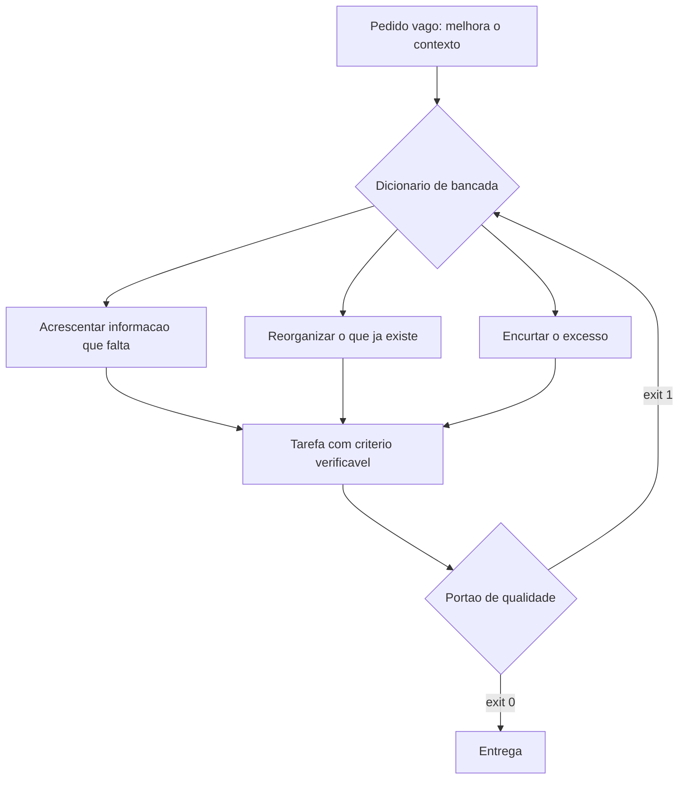

# Capítulo 2: O dicionário de bancada

## 1. Introdução

No Capítulo 1 você viu as quatro dores que param um projeto e o mapa das quatro peças — mas alguns termos passaram sem tradução: agente, harness, janela de contexto, stub, portão, worktree. Ninguém opera uma bancada sem saber o nome das ferramentas, e a maior parte da confusão em projetos com IA não vem de dificuldade técnica: vem de duas pessoas usando a mesma palavra para coisas diferentes.

Ao final deste capítulo você será capaz de explicar cada termo em uma frase, sem jargão, usando uma analogia de bancada e um exemplo do Painel de Pedidos. Isso parece pouco até você precisar dizer a alguém — ou a um modelo — exatamente o que quer dizer por "contexto".

## 2. Explica

### 2.1 Por que vocabulário é infraestrutura

Vocabulário não é enfeite de comunicação: é infraestrutura. Uma instrução ambígua custa uma execução errada, e cada execução errada custa contexto, tempo e confiança — os três recursos que a bancada existe para proteger. Estudo empírico sobre restrições de escrita assistida aponta que a forma de nomear e restringir a tarefa altera o resultado entregue, algo que qualquer pessoa que já pediu "um relatório" — e recebeu outro relatório — reconhece na prática [1].

Há um motivo estrutural para isso. A comunicação entre você e o modelo é comprimida em unidades discretas de texto, os tokens, e a informação que não couber na mensagem simplesmente não existe do outro lado. A teoria clássica da comunicação já descrevia esse limite: o que não é transmitido não pode ser recebido [2]. Na bancada, a consequência é direta: nomear bem é a primeira economia de token que você faz no dia.

### 2.2 Termos de IA e de contexto

**Agente.** É um programa que decide a sequência de passos para cumprir uma tarefa, usando um modelo de linguagem como motor de decisão e ferramentas para agir. Na bancada, é o operário: competente para executar o que entende, incapaz de julgar se deveria. A diferença entre um agente e um chatbot é que o agente tem ferramentas e idade para usá-las — o que também significa que tem como causar dano [3].

Capacidade de agir e capacidade de julgar crescem em ritmos diferentes, e as revisões amplas de modelos de linguagem registram essa defasagem como característica do estado atual da tecnologia, não como defeito a ser corrigido na próxima versão [17].

**Subagente.** É um agente despachado dentro de uma tarefa maior, com escopo estreito e contexto próprio. Na bancada, é o especialista chamado para um serviço específico: ele não conhece a obra inteira e não precisa conhecer.

**Janela de contexto.** É o limite físico de texto que o modelo mantém na memória de trabalho em uma única execução. Cheia, ela degrada: a recuperação de instruções no meio de um contexto longo é pior do que no começo — o efeito documentado como *lost in the middle* [4]. Na bancada, é a mesa: se você empilha tudo, ela deixa de caber trabalho.

**Contexto canônico.** É o conjunto de arquivos que descreve o projeto e é lido antes de cada tarefa: objetivo, contrato de dados, exemplo e critério de pronto. A diferença para "um monte de documentos" é que o contexto canônico é pequeno, versionado e estável. A revisão de engenharia de contexto trata esse desenho como disciplina própria, não como consequência natural do trabalho [5].

**Alucinação.** É a resposta plausível e falsa — uma função que parece correta, uma biblioteca que não existe. Na bancada, é o operário respondendo com confiança sobre uma peça que ele não tem em mãos. Parte das dependências citadas por código gerado não existe de fato, o que aparece como erro de instalação e risco de suprimento [6]. O levantamento das vulnerabilidades mais comuns nesse tipo de código mostra que a alucinação não é só sobre bibliotecas: ela também aparece na escolha de práticas inseguras [18].

**Prompt.** É a mensagem enviada ao modelo. Deixou de ser "a pergunta" e passou a ser um artefato de projeto: no contexto canônico, ele é composto por instruções fixas, contrato e dados da tarefa.

**Prompt drift.** É o desvio gradual: cada rodada de correção acrescenta uma instrução nova e remove outra, e depois de dez rodadas ninguém sabe qual é a regra vigente. Na bancada, é o manual que foi corrigido à caneta por tanta gente que ninguém mais consegue lê-lo.

### 2.3 Termos de engenharia

**Harness.** É o programa hospedeiro que media a conversa entre você, o sistema operacional e o modelo — quem de fato possui as chaves do terminal e do disco. O modelo sugere; o harness executa. Entender isso muda o que você culpa quando algo dá errado [7].

**Orquestração.** É coordenar vários agentes e passos: decidir ordem, dependência, isolamento e integração. Na bancada, é o encarregado que distribui serviço e confere o que voltou.

**Portão de qualidade.** É uma verificação automática que aprova ou bloqueia. Sem meio-termo. A prática de entrega contínua estabeleceu esse princípio há mais de uma década: ou o artefato atende ao critério, ou não avança [8]. A pesquisa de desempenho de entrega associa exatamente esse rigor a melhores resultados organizacionais, e não o contrário [19].

**Exit code.** É o número que o comando devolve ao terminar. Zero significa aprovado; qualquer outro valor significa bloqueio. É o idioma em que as ferramentas conversam com a automação e a razão pela qual um portão precisa ser um comando, e não uma opinião.

**Stub.** É a casca de função que finge funcionar: devolve valor fixo, levanta exceção de pendência ou simplesmente não faz nada. É útil como andaime em fase de projeto e perigoso quando sobrevive à entrega, porque se disfarça de código pronto [9].

**Worktree.** É um diretório de trabalho adicional ligado ao mesmo repositório, cada um na sua linha de trabalho. Isolar duas frentes em vez de duas cópias do projeto evita conflito de arquivo e mantém histórico único [10] [11].

**Teste de comportamento.** É o teste que verifica o que o sistema faz, não como ele foi escrito. O contrário — o teste que apenas repete a implementação — passa sempre e não prova nada. A diferença é a mesma entre conferir que a conta fechou e conferir que o código de hoje é igual ao de ontem. A própria avaliação de agentes de programação depende de suítes de tarefas padronizadas, criadas justamente porque "parece que funciona" não é evidência suficiente [20] [21].

**Regressão.** É o defeito que volta: algo que funcionava deixa de funcionar por causa de uma mudança. Na bancada, é a peça que você trocou e afetou o circuito vizinho.

### 2.4 Termos de operação

**Token.** É a unidade de texto com que o modelo trabalha; custo, limite e tempo de resposta são medidos nela. A conta da bancada é, na prática, uma conta de tokens.

**Cache de prefixo.** É o reaproveitamento da parte estável do contexto entre execuções. Quando a primeira parte da mensagem não muda, o provedor não precisa reprocessá-la: a economia de custo de entrada pode chegar a **90%** [12]. O mesmo mecanismo existe em outras plataformas de nuvem com o mesmo propósito [13].

**Protocolo de ferramentas (MCP).** É o padrão aberto que define como uma aplicação com modelo se conecta a ferramentas e dados externos, em vez de cada integração inventar seu próprio formato [7]. Como todo padrão de acesso, ele amplia a superfície de risco e exige verificação: relatórios de segurança apontam classes de ataque em que a descrição de uma ferramenta é alterada para induzir o agente a agir fora do escopo [14] [15].

**Persistência.** É onde o estado do trabalho vive entre uma sessão e outra: banco local, arquivo de registro, fila. Na bancada, é o caderno e a gaveta de peças — o que não persiste não existe amanhã. Banco de estado local exige entender o próprio modelo de concorrência antes de confiar nele: o registro antecipado em arquivo permite leitura simultânea com um único escritor, e o mecanismo de trava determina o que acontece quando dois processos chegam juntos [22] [23].

**Idempotência.** É a propriedade de uma ação que pode ser repetida sem efeito colateral: rodar duas vezes produz o mesmo resultado de rodar uma. Importar o mesmo arquivo de pedidos duas vezes não pode duplicar pedido.

**Ambiente reversível.** É poder desfazer: cópia antes da mudança, transação, diretório descartável. A literatura de produção ensina que o custo de errar é proporcional à dificuldade de voltar atrás [16].

**Linha de base.** É a medição do estado atual, antes de qualquer melhoria. Sem ela, ganho é opinião.

**Caderno de bancada.** É o registro das decisões: o que foi decidido, quando e por quê. A função é continuidade — sobreviver à sua própria memória e à troca de quem opera.

## 3. Ilustra

Imagine a parede de uma oficina onde cada ferramenta tem seu gancho, com uma etiqueta de três linhas: o nome, para que serve e o que ela não deve fazer. O visitante entende a oficina em dois minutos, e o dono não perde tempo procurando chave de fenda na gaveta de alicate. É exatamente isso que um dicionário de bancada faz por um projeto: transforma vocabulário em mapa de utilização.

Repare no que a etiqueta resolve. Sem ela, dois operários pedem "a chave" e cada um pega uma ferramenta diferente — e depois discutem sobre o resultado, não sobre o pedido. Com ela, "a chave" continua sendo ambiguidade, mas ninguém precisa usá-la: existem nomes precisos disponíveis. Nos projetos com IA acontece igual. Quando alguém diz "melhora o contexto", pode significar três coisas diferentes: acrescentar informação, reorganizar o que já existe ou encurtar o excesso. Cada uma leva a um resultado distinto, e a conversa só avança quando o termo está definido.



*Figura 2.1 — O dicionário de bancada não ensina palavras novas: ele reduz o número de pedidos que podem ser interpretados de duas formas.*

Como Engenheiro de Bancada, você vai notar que a maior parte dos "erros da IA" desaparece quando o pedido tem nome preciso. O dicionário é meio de produção, não glossário decorativo.

## 4. Técnica

### 4.1 O glossário como arquivo do projeto

Glossário que vive na cabeça não serve para nada. O primeiro artefato técnico deste capítulo é o arquivo de vocabulário do projeto, versionado junto com o código. Ele é pequeno de propósito: só entram termos que aparecem em decisões, e cada entrada tem definição curta, o que não é e o exemplo no domínio.

```yaml
# vocabulario.yaml — dicionario de bancada do projeto
versao: 1
termos:
  - termo: pedido
    definicao: linha do arquivo de origem que representa uma compra
    nao_e: nao e o cliente, nao e o item, nao e o pagamento
    exemplo: "identificador 8842, cliente Ana, total 132,90"
  - termo: lote
    definicao: conjunto de linhas importadas em uma mesma execucao
    nao_e: nao e o dia de calendario
    exemplo: "arquivo de 12 de setembro com 480 linhas"
  - termo: duplicidade
    definicao: mesmo identificador de origem em duas linhas
    nao_e: mesmo cliente ou mesmo valor repetido
    exemplo: "identificador 8842 aparecendo no lote de hoje e no de ontem"
  - termo: conferencia
    definicao: verificacao automatica que aprova ou bloqueia um lote
    nao_e: revisao manual por amostragem
    exemplo: "colunas obrigatorias, totais e duplicidades"
```

O campo `nao_e` é o mais valioso do arquivo. Quase todo retrabalho nasce de uma definição que todo mundo acha que compartilha e ninguém escreveu.

### 4.2 A verificação que impede o glossário de apodrecer

Vocabulário sem verificação morre em duas semanas: alguém cria um termo novo no código e o arquivo não acompanha. A defesa é um comando simples que roda junto com os outros portões e reprova quando o código usa um termo que o vocabulário não conhece.

```python
#!/usr/bin/env python3
"""Portao do vocabulario: reprova quando o codigo usa termo fora do dicionario."""
import re
import sys
from pathlib import Path

TERMOS_DO_CODIGO = re.compile(r"\b(pedido|lote|duplicidade|conferencia)\w*\b", re.IGNORECASE)


def carregar_termos(caminho):
    termos = set()
    for linha in caminho.read_text(encoding="utf-8").splitlines():
        achado = re.match(r"\s*-?\s*termo:\s*(\S+)", linha)
        if achado:
            termos.add(achado.group(1).lower())
    return termos


def auditar(pasta, termos_conhecidos):
    desconhecidos = {}
    for arquivo in pasta.rglob("*.py"):
        texto = arquivo.read_text(encoding="utf-8", errors="replace")
        for achado in TERMOS_DO_CODIGO.finditer(texto):
            palavra = achado.group(1).lower()
            if palavra not in termos_conhecidos:
                desconhecidos.setdefault(palavra, arquivo.name)
    return desconhecidos


def main():
    base = Path("vocabulario.yaml")
    termos = carregar_termos(base) if base.exists() else {"pedido", "lote", "duplicidade", "conferencia"}
    desconhecidos = auditar(Path("."), termos)
    if desconhecidos:
        print("[BLOQUEADO] termos fora do vocabulario:")
        for termo, arquivo in sorted(desconhecidos.items()):
            print(f"  - {termo}: usado em {arquivo}")
        return 1
    print("[APROVADO] vocabulario em dia")
    return 0


if __name__ == "__main__":
    sys.exit(main())
```

Repare no formato da saída: aprovado ou bloqueado, e no segundo caso a lista do que corrigir. Portão que só diz "falhou" obriga a pessoa a investigar; portão que diz onde falhou permite corrigir em trinta segundos.

### 4.3 O quadro de tradução por área

O dicionário é genérico, o domínio não. A tabela abaixo mostra como traduzir os termos para três áreas comuns — use a coluna mais próxima do seu caso como ponto de partida.

| Termo da bancada | Em um time de produto | Em operações e logística | Em uma área administrativa |
|---|---|---|---|
| Contexto canônico | Especificação da funcionalidade | Instrução de trabalho padrão | Manual do procedimento |
| Portão de qualidade | Critério de aceite automatizado | Checklist de conferência de carga | Conferência antes do envio |
| Contrato de dados | Modelo de dados da API | Layout do arquivo do coletor | Formulário padronizado |
| Roteamento | Triagem de chamados | Separação por tipo de carga | Encaminhamento por assunto |
| Idempotência | Requisição repetida não duplica registro | Releitura de romaneio não duplica nota | Reenvio de e-mail não gera dois protocolos |
| Linha de base | Métrica atual do produto | Tempo atual de conferência | Tempo atual de fechamento |

### 4.4 Quando o dicionário deixa de ser útil

O dicionário tem limite. Ele serve para alinhar vocabulário entre pessoas e entre projeto e modelo; não substitui a especificação da tarefa nem o contrato de dados. Se um termo precisa de mais de quatro linhas para ser explicado, o problema provavelmente não é o termo: é o conceito que ainda não foi decidido. Nesse caso, a decisão vai para o caderno de bancada e o termo fica no dicionário apenas como marcador de onde parar.

## 5. Aplica

**Situação.** Você assume a continuidade de um projeto de relatórios que outra pessoa começou. Existe um arquivo de instruções com um termo que aparece dezenove vezes: "consolidar". Você pede ao agente para "consolidar os pedidos do dia" e recebe três comportamentos diferentes em três execuções: uma soma por cliente, outra por dia e outra que remove duplicidades.

**O erro.** Você culpa o modelo e reescreve o pedido com mais detalhe em cada nova tentativa. Cada resposta mantém o mesmo termo ambíguo; você apenas adiciona qualificadores em volta dele. Ao final do dia, existem quatro versões do relatório e nenhuma decisão sobre o que "consolidar" significa.

**O diagnóstico.** O problema nunca foi o modelo: era o vocabulário. "Consolidar" carregava três significados plausíveis, e nenhum deles estava escrito. O dicionário teria resolvido em cinco minutos o que custou um dia — e isso é o efeito prático da compressão de informação descrita pela teoria da comunicação: o que não foi transmitido com precisão é preenchido por suposição do outro lado [2].

**A correção.** Três entradas no vocabulário do projeto: `pedido`, `lote` e `fechamento do dia`. A palavra "consolidar" sai das instruções e é substituída por "somar totais por identificador de origem, sem remover linhas". A partir daí, o mesmo pedido produz o mesmo relatório três vezes seguidas — e é isso que significa estar pronto.

**Métricas de sucesso.** O dicionário tem resultado mensurável; três indicadores mostram se ele pegou:

| Métrica | Como medir | Sinal de que funcionou |
|---|---|---|
| Termos ambíguos por arquivo de instruções | Contagem de termos sem entrada no vocabulário | Próximo de zero nos arquivos ativos |
| Retrabalho por pedido | Quantas execuções até o resultado correto | Sem queda, ainda há sinal de vocabulário faltando |
| Tempo de integração de pessoa nova | Quanto tempo até a pessoa entregar a primeira tarefa | Menor que antes, com menos perguntas básicas |

**Armadilhas comuns.** Três tropeços aparecem quase sempre. O primeiro é fazer glossário de livro: cinquenta termos, doze usados, e nenhuma revisão — em um mês o arquivo é decorativo. O segundo é definir o que o termo é e esquecer o que ele não é: a parte negativa da definição é justamente a que impede a interpretação errada. O terceiro é escrever o dicionário no chat e não no projeto, onde ninguém encontra depois.

**Até onde isso escala.** O dicionário funciona bem em um projeto e em um time pequeno, e continua útil em vários times desde que cada um mantenha os termos do seu domínio com um núcleo comum compartilhado. Ele não resolve, porém, divergência de significado entre áreas distintas que usam a mesma palavra para processos diferentes — ali é preciso um acordo explícito, e não apenas registro. Também não vale o esforço em trabalho exploratório, de um único uso: quando a tarefa não vai se repetir, o vocabulário é custo sem retorno.

### 5.1 A prova de três frases

Um glossário só existe quando resiste a três usos seguidos. A prova é barata e se faz com o seu próprio material, sem consultar ninguém.

**Primeira frase: a definição em uma linha.** Escreva o termo e, ao lado, a explicação do que ele significa no seu domínio. Se a explicação precisou de duas orações subordinadas para ficar correta, o termo ainda não está resolvido.

**Segunda frase: a frase de uso real.** Pegue a última vez em que o termo apareceu no seu projeto — em um e-mail, em uma descrição de tarefa, em um erro de tela — e reescreva aquela frase usando o glossário. Se a frase ficou mais longa, o termo está no caminho errado.

**Terceira frase: a frase de desambiguação.** Diga, em uma linha, o que não é aquele termo. É aqui que o dicionário ganha valor, porque a maior parte dos pedidos mal atendidos nasce de dois sentidos convivendo no mesmo nome [1].

| Termo | Definição em uma linha | O que não é |
|---|---|---|
| Lote | Conjunto de itens processados juntos | Não é um pedido isolado |
| Fechamento | Conferência que libera um lote | Não é a correção de erro |
| Trilha | Histórico de quem mudou o quê | Não é o backup dos dados |

Repare no que a terceira coluna faz: ela impede que o executor traduza o seu problema para o problema dele. Reduzir ambiguidade é reduzir entropia, e reduzir entropia é reduzir o número de vezes que a resposta precisa ser refeita [2].

**Aplicação no sistema.** Depois de rodar a prova, os termos aprovados viram a primeira seção do arquivo de contexto do projeto. A partir daí, eles não são mais vocabulário solto: são restrição declarada. A regra prática é manter o glossário pequeno e estável, porque contexto longo com termo mal definido piora o resultado em vez de melhorar [4].

## 6. Conclusão

Você agora tem nome preciso para o essencial: agente e subagente são operários com escopo, contexto é mesa de trabalho e não depósito, portão é decisão binária em forma de comando, worktree é isolamento físico, idempotência é a garantia de que repetir não estraga. Viu que vocabulário é infraestrutura porque a ambiguidade cobra em retrabalho, e que o dicionário se mantém vivo quando existe um portão que o fiscaliza. E viu como traduzir os termos da bancada para a linguagem do seu domínio.

**Desafio.** Escreva o arquivo de vocabulário do seu projeto com cinco termos, cada um com definição, a parte "não é" e um exemplo real do seu dia. Depois rode o portão da seção Técnica apontando para uma pasta do seu código e veja o que ele acusa.

No próximo capítulo, o alvo: você vai escolher o projeto que fica na bancada, medir a linha de base em números e preparar o repositório mínimo — o mesmo passo que o Painel de Pedidos deu antes de ter uma linha de automação.

## 7. Referências Bibliográficas

[1] PEREIRA, Luciano. *Empirical Validation of Cognitive-Derived Coding Constraints and Tokenization Asymmetries in LLM-Assisted Software Engineering*. 2026. Disponível em: https://doi.org/10.2139/ssrn.6294900. Acesso em: 12 set. 2026.
[2] SHANNON, Claude E. *A Mathematical Theory of Communication*. Bell System Technical Journal, 1948. Disponível em: https://doi.org/10.1002/j.1538-7305.1948.tb01338.x. Acesso em: 12 set. 2026.
[3] ALI, Mohamad Abou; DORNAIKA, Fadi; CHARAFEDDINE, Jinan. *Agentic AI: a comprehensive survey of architectures, applications, and future directions*. In: Artificial Intelligence Review. 2025. Disponível em: https://doi.org/10.1007/s10462-025-11422-4. Acesso em: 12 set. 2026.
[4] LIU, Nelson F. et al. *Lost in the Middle: How Language Models Use Long Contexts*. In: Transactions of the Association for Computational Linguistics. 2024. Disponível em: https://arxiv.org/abs/2307.03172. Acesso em: 12 set. 2026.
[5] MEI, Lingrui et al. *A Survey of Context Engineering for Large Language Models*. In: arXiv. 2025. Disponível em: https://arxiv.org/abs/2507.13334. Acesso em: 12 set. 2026.
[6] TRAXTECH. *20% of AI-Generated Code Dependencies Don't Exist, Creating Supply Chain Security Risks*. Disponível em: https://www.traxtech.com/blog/20-of-ai-generated-code-dependencies-dont-exist-creating-supply-chain-security-risks. Acesso em: 12 set. 2026.
[7] ANTHROPIC. *Model Context Protocol Specification (2025-06-18)*. Disponível em: https://modelcontextprotocol.io/specification/2025-06-18. Acesso em: 12 set. 2026.
[8] HUMBLE, Jez; FARLEY, David. *Continuous Delivery: Reliable Software Releases through Build, Test, and Deployment Automation*. Addison-Wesley, 2010. Disponível em: https://continuousdelivery.com/. Acesso em: 12 set. 2026.
[9] VERACODE. *2025 GenAI Code Security Report: AI-Generated Code Security Risks*. Disponível em: https://www.veracode.com/blog/ai-generated-code-security-risks/. Acesso em: 12 set. 2026.
[10] GIT. *git-worktree Documentation*. Disponível em: https://git-scm.com/docs/git-worktree. Acesso em: 12 set. 2026.
[11] CHACON, Scott; STRAUB, Ben. *Pro Git: Everything you need to know about Git*. 2. ed. Apress, 2014. Disponível em: https://git-scm.com/book/en/v2. Acesso em: 12 set. 2026.
[12] ANTHROPIC. *Prompt Caching — Claude Platform Docs*. Disponível em: https://platform.claude.com/docs/en/build-with-claude/prompt-caching. Acesso em: 12 set. 2026.
[13] AMAZON WEB SERVICES. *Prompt caching for faster model inference — Amazon Bedrock*. Disponível em: https://docs.aws.amazon.com/bedrock/latest/userguide/prompt-caching.html. Acesso em: 12 set. 2026.
[14] NATIONAL SECURITY AGENCY. *Model Context Protocol (MCP) Security — CSI*. Disponível em: https://www.nsa.gov/Portals/75/documents/Cybersecurity/CSI_MCP_SECURITY.pdf. Acesso em: 12 set. 2026.
[15] CHECKMARX. *11 Emerging AI Security Risks with MCP (Model Context Protocol)*. Disponível em: https://checkmarx.com/zero-post/11-emerging-ai-security-risks-with-mcp-model-context-protocol/. Acesso em: 12 set. 2026.
[16] NYGARD, Michael T. *Release It!: Design and Deploy Production-Ready Software*. 2. ed. Pragmatic Bookshelf, 2018. Disponível em: https://pragprog.com/titles/mnee2/release-it-second-edition/. Acesso em: 12 set. 2026.
[17] HADI, Muhammad Usman et al. *A Survey on Large Language Models: Applications, Challenges, Limitations, and Practical Usage*. 2023. Disponível em: https://doi.org/10.36227/techrxiv.23589741.v1. Acesso em: 12 set. 2026.
[18] ENDOR LABS. *The Most Common Security Vulnerabilities in AI-Generated Code*. Disponível em: https://www.endorlabs.com/learn/the-most-common-security-vulnerabilities-in-ai-generated-code. Acesso em: 12 set. 2026.
[19] DORA / GOOGLE CLOUD. *State of AI-assisted Software Development 2025*. Disponível em: https://dora.dev/dora-report-2025/. Acesso em: 12 set. 2026.
[20] RAKSHIT, Yerram Sai. *Modernizing Software Testing: AI, Telemetry, and Agentic Quality Engineering*. In: International Journal of AI Engineering. 2026. Disponível em: https://doi.org/10.34218/ijaieg_01_01_002. Acesso em: 12 set. 2026.
[21] OPENAI. *Introducing SWE-bench Verified*. Disponível em: https://openai.com/index/introducing-swe-bench-verified/. Acesso em: 12 set. 2026.
[22] SQLITE. *Write-Ahead Logging*. Disponível em: https://www.sqlite.org/wal.html. Acesso em: 12 set. 2026.
[23] SQLITE. *File Locking And Concurrency In SQLite Version 3*. Disponível em: https://sqlite.org/lockingv3.html. Acesso em: 12 set. 2026.
