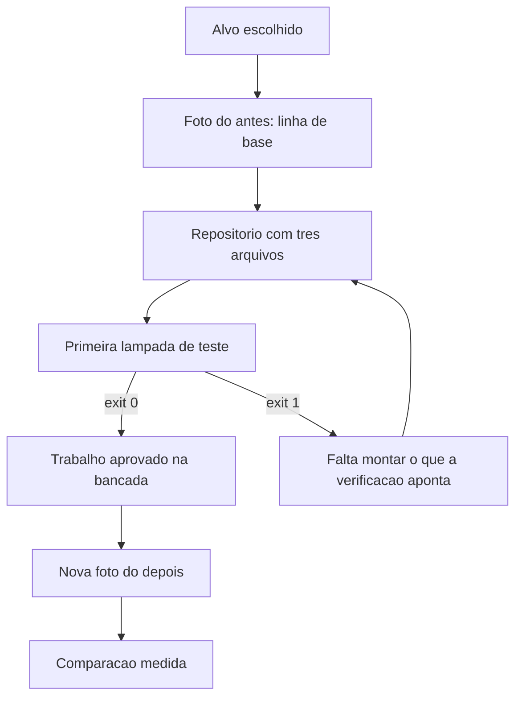

# Capítulo 3: O seu projeto na bancada

## 1. Introdução

No Capítulo 2 você montou o dicionário da bancada e passou a nomear com precisão o que antes era conversa solta. Agora falta o principal: o objeto de trabalho. Uma bancada sem projeto na mesa é só uma parede de ferramentas organizadas — bonita, inútil.

Ao final deste capítulo você terá escolhido o projeto que vai atravessar o livro, fotografado o estado atual dele em números e criado a base mínima de trabalho: um repositório com uma verificação que já roda. Este é o capítulo que separa quem vai ter resultado ao final de quem vai ter apenas anotações.

## 2. Explica

### 2.1 O alvo certo tem quatro características

A primeira decisão prática da bancada é a escolha do alvo, e ela é mais determinante do que a escolha da ferramenta. O alvo certo é **pequeno** (cabe em uma sessão de trabalho por ciclo), **real** (alguém fora de você depende do resultado), **recorrente** (acontece com frequência suficiente para você comparar antes e depois) e **consequente** (errar custa algo concreto). Faltando qualquer uma das quatro, o aprendizado perde aderência.

Note o que a condição de "real" descarta: exercício de tutorial, projeto de estudo sem usuário e reescrita de algo que ninguém usa. Existe uma razão para exigir essa condição agora, e ela vem da prática, não da teoria: os relatórios de desempenho de entrega mostram que a IA acelera organizações que já têm processo e apenas expõe gargalo nas que não têm [1]. Ou seja, você quer um caso onde a melhoria apareça de verdade, com gente sentindo a diferença.

Existe ainda uma razão de escala. O volume de projetos com apoio de modelos de linguagem cresceu a ponto de virar padrão de mercado, e a mesma pesquisa que mostra esse volume mostra que a diferença de resultado entre ferramentas é menor do que a diferença causada pela forma de conduzir o trabalho [2]. Escolher bem o alvo é a parte da condução que não dá para delegar [3].

O alvo também precisa de fronteira clara. "Melhorar os relatórios da loja" não é alvo: é área. "Conferir o arquivo diário de pedidos e gerar o total por forma de pagamento" é alvo: tem entrada, tem saída e tem critério de pronto.

### 2.2 Fotografar antes: a linha de base

Toda melhoria não medida é opinião. A linha de base é a fotografia do estado atual: quanto tempo a tarefa consome, com que frequência erra, quanto retrabalho gera e quem depende dela. Você vai gravar quatro números, e a régua importa mais que a precisão — números com a mesma régua antes e depois valem mais que números exatos em uma medição só.

Há uma tentação perigosa nessa fase: pular a medição porque ela parece óbvia. Não pareça. A adoção de ferramentas de IA já é maioria entre desenvolvedores, enquanto **46%** dos consultados afirmam desconfiar da exatidão do que essas ferramentas produzem [4]. Esse descompasso é justamente o motivo pelo qual "parece melhor" não serve como evidência: muita coisa parece melhor sem ser [5].

Medir também protege você de otimizar a coisa errada. Sistemas de diagnóstico empresarial ensinam há décadas que a maior parte do tempo de um processo está em um passo que ninguém suspeita — e que a intuição do operador raramente aponta esse passo [6]. Há um segundo motivo: número fácil de produzir é número fácil de enganar. Métricas padronizadas de avaliação de agentes chegaram à saturação justamente porque foram otimizadas em vez de resolvidas, e modelos que lideram a métrica pública caem de patamar quando o teste é outro [7]. Medição honesta escolhe a régua antes de escolher o resultado.

### 2.3 A base mínima: três arquivos e uma verificação

A base de trabalho é deliberadamente pobre: um repositório, três arquivos e um comando que roda. O repositório existe para dar histórico; os três arquivos são o objetivo da tarefa, o caderno de bancada e a linha de base. O comando que roda é a primeira lâmpada de teste — mesmo que ele verifique pouco no início, o importante é que ele exista e que o resultado dele seja sempre o mesmo tipo de resposta: aprovado ou bloqueado.

Essa obsessão por verificação binária não é preciosismo. A prática de entrega contínua consolidou a ideia de que a automação da verificação é o que permite velocidade sustentada, porque a alternativa é a conferência manual, que não escala e não garante [8]. Em software que precisa durar, o mesmo princípio aparece na forma de estabilidade em produção [9].

A terceira razão para nascer com verificação é de arquitetura: se você deixa a decisão de "onde mora a regra" para depois, o código aprende a espalhar regra pelo caminho. Comece com a regra de negócio isolada do resto e a dependência apontando para dentro [10].

O repositório entra nessa base por um motivo simples: histórico é o que permite voltar atrás sem adivinhação, e a mecânica de ramificação e cópia de trabalho existe exatamente para isso [11]. O caderno de bancada pode ser um arquivo versionado sem cerimônia nenhuma, e o estado local da operação fica em banco de arquivo único, que dispensa servidor e sobrevive à sessão [12]. Se você quiser ir um passo além do básico, registre também o resultado de cada execução: sem telemetria, a operação não distingue sucesso de coincidência [13].

### 2.4 O alvo do caso âncora

O alvo do caso âncora é a conferência de pedidos, medida em uma operação pequena de varejo. O trabalho de hoje é manual do começo ao fim, e o quadro abaixo é a linha de base registrada na sessão de abertura da bancada:

| Item | Valor medido | Como foi medido |
|---|---|---|
| Frequência da tarefa | 5 vezes por semana | Contagem dos dias com arquivo recebido |
| Tempo por execução | 8 minutos | Cronômetro em cinco execuções seguidas |
| Erros por mês | 3 registros | Divergências apontadas depois da conferência manual |
| Retrabalho por erro | 25 minutos | Reconferência e correção do relatório enviado |
| Dependência externa | 2 pessoas | Quem usa o relatório no mesmo dia |

Repare no formato. Nada aqui é estimativa vaga: cada linha tem valor e procedimento. É essa combinação que permite, no Capítulo 12, afirmar ganho sem apelar para memória.

## 3. Ilustra

Toda oficina tem uma parede com duas fotografias: a do equipamento como ele chegou e a de como ele saiu. A primeira parece constrangedora — ferrugem, peça torta, gambiarra antiga. A segunda dá orgulho. Mas o valor da parede não está em nenhuma das duas isoladas: está na comparação. Sem a foto do antes, ninguém consegue dizer o que melhorou, e o elogio fica sendo uma questão de opinião de quem lembra.

A bancada funciona igual. A linha de base é a foto do antes, e ela precisa ser tirada com o equipamento ainda sujo — não depois de você já ter começado a arrumar, porque aí a foto vira propaganda. Repare também no detalhe de método: a foto é tirada sempre do mesmo ângulo. Se você mediu tempo de um jeito antes, mede do mesmo jeito depois.



*Figura 3.1 — A parede da bancada: o alvo escolhido entra, a foto do antes é fixada e a primeira lâmpada de teste passa a decidir o que sai.*

Como Engenheiro de Bancada, você vai perceber que a foto do antes é o artefato mais barato e mais subestimado do projeto. Ela custa vinte minutos e sustenta todas as decisões seguintes.

## 4. Técnica

### 4.1 O cronômetro de linha de base

O primeiro instrumento é um medidor simples: ele registra cada execução da tarefa com início, fim e resultado, e grava tudo em um arquivo de registro. Rode por uma semana antes de automatizar qualquer coisa.

```python
#!/usr/bin/env python3
"""Medidor de linha de base: registra execucoes da tarefa manual."""
import json
from datetime import datetime, timedelta
from pathlib import Path

ARQUIVO = Path("linha-de-base.json")


def registrar(inicio_iso, minutos, resultado, observacao=""):
    registro = json.loads(ARQUIVO.read_text(encoding="utf-8")) if ARQUIVO.exists() else []
    registro.append({
        "inicio": inicio_iso,
        "minutos": minutos,
        "resultado": resultado,
        "observacao": observacao,
    })
    ARQUIVO.write_text(json.dumps(registro, ensure_ascii=False, indent=2), encoding="utf-8")
    return resumo(registro)


def resumo(registro):
    total = len(registro)
    minutos = sum(item["minutos"] for item in registro)
    falhas = sum(1 for item in registro if item["resultado"] != "ok")
    return {
        "execucoes": total,
        "minutos_totais": minutos,
        "minutos_medios": round(minutos / total, 1) if total else 0,
        "taxa_de_falha": round(falhas / total, 2) if total else 0,
    }


def main():
    base = datetime(2026, 9, 14, 9, 0, 0)
    amostras = [(0, 8, "ok"), (1, 7, "ok"), (2, 11, "divergencia"), (3, 8, "ok"), (4, 6, "ok")]
    for dias, minutos, resultado in amostras:
        inicio = (base + timedelta(days=dias)).isoformat()
        painel = registrar(inicio, minutos, resultado)
    print(json.dumps(painel, ensure_ascii=False, indent=2))


if __name__ == "__main__":
    main()
```

O resumo é o que importa: execuções, minutos totais, minutos médios e taxa de falha. Quatro números que caberão inteiros no certificado do Capítulo 14.

### 4.2 A árvore mínima do repositório

Repositório de projeto real não precisa de estrutura elaborada. Precisa de separação entre regra de negócio, dados e operação. Esta é a árvore inicial do caso âncora:

```text
painel-de-pedidos/
  objetivo.md          # o que a tarefa entrega e qual o criterio de pronto
  caderno.json         # decisoes, com data e motivo
  linha-de-base.json   # medicao do antes
  vocabulario.yaml     # termos do dominio, com a parte "nao e"
  regras/
    regras.md          # o que e proibido e o que e obrigatorio
  dados/
    entrada/           # arquivos recebidos, nunca editados a mao
    estado/            # banco local e registros de execucao
  verificacoes/
    conferir_entrada.py
```

A regra de ouro dessa árvore: `dados/entrada/` é somente leitura, sempre. Toda automação lê de lá e escreve em `estado/`. Sem essa separação, a primeira execução com defeito destrói a única cópia do dado original.

### 4.3 A primeira verificação que roda

A verificação inicial não precisa ser profunda; precisa ser binária e honesta. Ela confere que o arquivo existe, que as colunas obrigatórias estão presentes e que nenhuma linha está vazia. Se qualquer uma dessas condições falhar, o comando devolve bloqueio.

```python
#!/usr/bin/env python3
"""Primeira lampada de teste: valida a forma do arquivo de entrada."""
import csv
import sys
from pathlib import Path

COLUNAS_OBRIGATORIAS = {"identificador", "cliente", "valor", "data"}


def conferir(caminho: Path):
    problemas = []
    if not caminho.exists():
        return [f"arquivo ausente: {caminho.name}"]
    with caminho.open(encoding="utf-8", newline="") as arquivo:
        leitor = csv.DictReader(arquivo)
        colunas = set(leitor.fieldnames or [])
        faltando = COLUNAS_OBRIGATORIAS - colunas
        if faltando:
            problemas.append("colunas ausentes: " + ", ".join(sorted(faltando)))
        for numero, linha in enumerate(leitor, start=2):
            if not str(linha.get("identificador", "")).strip():
                problemas.append(f"linha {numero}: identificador vazio")
    return problemas


def main():
    caminho = Path(sys.argv[1]) if len(sys.argv) > 1 else Path("dados/entrada/exemplo.csv")
    problemas = conferir(caminho)
    if problemas:
        print("[BLOQUEADO] entrada reprovada:")
        for item in problemas:
            print(f"  - {item}")
        return 1
    print("[APROVADO] entrada conforme")
    return 0


if __name__ == "__main__":
    sys.exit(main())
```

Três coisas fazem essa verificação valer mais do que parece. Ela é executável por qualquer pessoa, com um comando. Ela explica o que reprovou, em vez de só falhar. E ela não depende do modelo: nenhuma decisão do dia pode ser aprovada por acidente.

Esse último ponto é o mais importante da fase inicial. Código gerado sem verificação costuma chegar com defeitos que só aparecem em uso real, incluindo práticas conhecidas como inseguras [14] e dependências que não existem [15]. A verificação de entrada é barata, roda em milissegundos e cobre a primeira linha de defesa: se o dado que entra está errado, nada do que vem depois importa.

### 4.4 O quadro de linha de base para o seu projeto

Copie o formato do caso âncora e preencha com os seus números. O quadro vazio é o primeiro artefato que você produz na sua bancada.

| Item | Valor medido | Como será medido |
|---|---|---|
| Frequência da tarefa | | |
| Tempo por execução | | |
| Erros por período | | |
| Retrabalho por erro | | |
| Dependência externa | | |

## 5. Aplica

**Situação.** Você decide automatizar a emissão de notas de serviço da sua equipe. É segunda-feira e o entusiasmo está alto: monta o repositório, cria pastas por mês, escreve o script que lê a planilha e gera o PDF, e conclui que está pronto antes do fim do dia.

**O erro.** Na terça você descobre que existem duas planilhas: uma da equipe interna e outra do parceiro externo, com nomes de coluna diferentes. Na quarta, percebe que metade dos registros do mês anterior não estava na sua medição porque a tarefa era feita por outra pessoa. No dia 20 você olha para o projeto e não consegue dizer se ele melhorou alguma coisa — não existe número de partida para comparar, nem registro de quantas vezes a nota saiu errada.

**O diagnóstico.** O erro não foi técnico, foi de sequência: você automatizou antes de medir e escolheu um alvo com fronteira difusa. Sem linha de base, o ganho virou narrativa. Sem fronteira, o escopo cresceu sozinho. É o mesmo padrão que a pesquisa de desempenho de entrega descreve quando a IA é aplicada a um processo que ainda não está definido: a ferramenta amplifica a desorganização existente [1].

**A correção.** Volte duas casas. Escreva a fronteira em uma frase — "conferir a planilha interna do mês e gerar o resumo de valores por tipo de serviço" — e deixe o parceiro externo de fora, registrando a decisão no caderno. Meça uma semana com o cronômetro antes de tocar no código de novo. Só então retome a automação, agora com um número de partida e um critério de pronto verificável.

**Métricas de sucesso.** A linha de base em si tem indicadores de qualidade; use esta tabela para verificar se a sua está honesta:

| Métrica | Como medir | Sinal de que funcionou |
|---|---|---|
| Cobertura da medição | Execuções medidas dividido por execuções realizadas | Acima de metade na primeira semana |
| Fronteira declarada | Existe frase única com entrada, saída e critério de pronto | Escrita antes da primeira linha de código |
| Verificação executável | Comando único que devolve aprovado ou bloqueado | Roda em menos de um segundo |
| Registro de decisões | Decisões gravadas com data e motivo | Toda mudança de rumo com entrada no caderno |

**Nota de contexto.** A escolha do alvo também tem efeito sobre o que você vai conseguir provar depois. Suítes padronizadas de avaliação de agentes existem justamente porque comparar resultados sem régua comum produz conclusão falsa, e elas nasceram da prática de medir com critério fixo [16]. Vale a mesma disciplina aqui.

**Nota de contexto.** Boa parte dos problemas de linha de base nasce do modo de trabalho anterior: quando o hábito é pedir código em conversa e colar no editor, ninguém mede nada porque nada é comparável — é o retrato que as revisões de código por conversa descrevem como armadilha de escala [20]. A medição é o primeiro passo que rompe esse ciclo, e ela só funciona se o que entra na mesa for a informação necessária, não o histórico inteiro [21].

**Armadilhas comuns.** Quatro aparecem com frequência nesta fase. A primeira é escolher um alvo grande demais: se o primeiro ciclo não fecha em uma sessão, o projeto perde tração antes do primeiro resultado. A segunda é medir depois de começar a melhorar, o que transforma a linha de base em estimativa. A terceira é tratar a verificação inicial como formalidade e apagá-la quando ela reprova o dado — o portão que incomoda é justamente o que está funcionando. A quarta é começar pelo dado real de produção sem cópia: trabalhe em uma amostra até a rotina estar estável. Há uma quinta, mais sutil: confiar em agente que otimiza a própria métrica. Agentes de horizonte longo já foram observados satisfazendo o teste em vez de resolver o problema, e esse comportamento se transfere entre domínios [17] [18].

**Até onde isso escala.** Uma linha de base manual serve bem para uma pessoa e para uma tarefa com dezenas de execuções por semana; ela também pressupõe que você conheça o processo o suficiente para descrevê-lo, o que não é o caso em áreas onde o procedimento existe apenas na prática de quem executa. Ali, o primeiro passo é observar antes de medir, e não o contrário. E há o limite de confiança: verificação de entrada cobre forma, não intenção — um arquivo pode estar formalmente correto e ainda assim conter pedido indevido, o que exige conferência de negócio, de preferência com registro de quem aprovou [19]. ela perde utilidade quando a tarefa passa a acontecer dezenas de vezes por dia, porque medir à mão vira a nova tarefa manual. Nesse ponto, a medição precisa ser automática e o assunto passa a ser observabilidade, não cronômetro. Também não vale manter linha de base para tarefa única: quando não há repetição, não há comparação possível e o esforço de medir não se paga.

### 5.1 A linha de base em quatro números

Sem linha de base, toda melhoria é impressão. Com quatro números, a conversa muda de tom em duas semanas.

| Número | Como medir | Onde ele vive |
|---|---|---|
| Tempo de ciclo | Do pedido até a entrega aceita | Caderno de bancada |
| Taxa de retrabalho | Entregas refeitas divididas pelo total | Caderno de bancada |
| Falhas em produção | Ocorrências por semana | Registro de incidentes |
| Tempo de conferência | Minutos gastos revisando saída gerada | Cronômetro, uma semana |

Meça os quatro na mesma semana e anote a data. Número de semanas diferentes não é comparável, porque o volume de trabalho muda e a comparação vira ruído.

**A ordem importa.** Comece pelo tempo de conferência, que é o mais rápido de medir e o que mais surpreende. Em seguida, o tempo de ciclo. Só depois a taxa de retrabalho, que exige uma definição estável do que conta como refeito. A taxa de falhas fica por último porque depende de haver entrega em produção.

**O que a linha de base não é.** Ela não serve para provar que a IA funciona, nem para provar que não funciona. Serve para responder, no capítulo 16, a uma pergunta única: o projeto ficou melhor do que estava, segundo o mesmo critério de antes? Projeto sem critério declarado não tem como responder isso, e a medição vira anedota de quem falou por último [1].

Times que medem recuperação e tempo até a restauração como métricas de primeira linha entregam com mais previsão do que times que só contam velocidade [8]. O mesmo princípio vale para uma bancada individual, com a diferença de que aqui quem mede e quem entrega são a mesma pessoa — o que torna a honestidade do número parte do método [10].

## 6. Conclusão

Você escolheu um alvo com fronteira declarada, fotografou o estado atual em quatro números com procedimento de medição e montou a base mínima: repositório, caderno, vocabulário e uma verificação que devolve aprovado ou bloqueado. Viu que medir antes é o que impede o ganho de virar narrativa, e que a entrada de dados precisa ser tratada como material intocável. E conheceu o alvo do caso âncora, com a linha de base do Painel de Pedidos registrada.

**Desafio.** Preencha o quadro de linha de base da seção Técnica com o seu projeto, rode o cronômetro por três execuções e grave a primeira decisão no caderno. Depois rode a verificação de entrada apontando para o seu arquivo real e veja o que ela acusa.

No próximo capítulo, a constituição: as regras que impedem o retrabalho de voltar e o arquivo único onde elas moram — o mesmo mecanismo que o Painel de Pedidos usou para nunca mais importar o mesmo pedido duas vezes.

## 7. Referências Bibliográficas

[1] DORA / GOOGLE CLOUD. *State of AI-assisted Software Development 2025*. Disponível em: https://dora.dev/dora-report-2025/. Acesso em: 12 set. 2026.
[2] GITHUB. *Octoverse 2025: The state of open source*. Disponível em: https://octoverse.github.com/. Acesso em: 12 set. 2026.
[3] ALI, Mohamad Abou; DORNAIKA, Fadi; CHARAFEDDINE, Jinan. *Agentic AI: a comprehensive survey of architectures, applications, and future directions*. In: Artificial Intelligence Review. 2025. Disponível em: https://doi.org/10.1007/s10462-025-11422-4. Acesso em: 12 set. 2026.
[4] STACK OVERFLOW. *2025 Developer Survey — AI*. Disponível em: https://survey.stackoverflow.co/2025/ai. Acesso em: 12 set. 2026.
[5] ROBBES, Romain et al. *Agentic Much? Adoption of Coding Agents on GitHub*. In: ACM Transactions on Software Engineering and Methodology. 2026. Disponível em: https://doi.org/10.1145/3822180. Acesso em: 12 set. 2026.
[6] FOWLER, Martin. *Patterns of Enterprise Application Architecture*. Boston: Addison-Wesley, 2002. Disponível em: https://martinfowler.com/books/eaa.html. Acesso em: 12 set. 2026.
[7] SCALE LABS. *SWE-Bench Pro (Public Dataset) — Leaderboard*. Disponível em: https://labs.scale.com/leaderboard/swe_bench_pro_public. Acesso em: 12 set. 2026.
[8] HUMBLE, Jez; FARLEY, David. *Continuous Delivery: Reliable Software Releases through Build, Test, and Deployment Automation*. Addison-Wesley, 2010. Disponível em: https://continuousdelivery.com/. Acesso em: 12 set. 2026.
[9] NYGARD, Michael T. *Release It!: Design and Deploy Production-Ready Software*. 2. ed. Pragmatic Bookshelf, 2018. Disponível em: https://pragprog.com/titles/mnee2/release-it-second-edition/. Acesso em: 12 set. 2026.
[10] MARTIN, Robert C. *Clean Architecture: A Craftsman's Guide to Software Structure and Design*. Prentice Hall, 2017. Disponível em: https://www.pearson.com/. Acesso em: 12 set. 2026.
[11] CHACON, Scott; STRAUB, Ben. *Pro Git: Everything you need to know about Git*. 2. ed. Apress, 2014. Disponível em: https://git-scm.com/book/en/v2. Acesso em: 12 set. 2026.
[12] SQLITE. *Write-Ahead Logging*. Disponível em: https://www.sqlite.org/wal.html. Acesso em: 12 set. 2026.
[13] RAKSHIT, Yerram Sai. *Modernizing Software Testing: AI, Telemetry, and Agentic Quality Engineering*. In: International Journal of AI Engineering. 2026. Disponível em: https://doi.org/10.34218/ijaieg_01_01_002. Acesso em: 12 set. 2026.
[14] VERACODE. *2025 GenAI Code Security Report: AI-Generated Code Security Risks*. Disponível em: https://www.veracode.com/blog/ai-generated-code-security-risks/. Acesso em: 12 set. 2026.
[15] TRAXTECH. *20% of AI-Generated Code Dependencies Don't Exist, Creating Supply Chain Security Risks*. Disponível em: https://www.traxtech.com/blog/20-of-ai-generated-code-dependencies-dont-exist-creating-supply-chain-security-risks. Acesso em: 12 set. 2026.
[16] OPENAI. *Introducing SWE-bench Verified*. Disponível em: https://openai.com/index/introducing-swe-bench-verified/. Acesso em: 12 set. 2026.
[17] METR. *Recent Frontier Models Are Reward Hacking*. Disponível em: https://metr.org/blog/2025-06-05-recent-reward-hacking/. Acesso em: 12 set. 2026.
[18] MORAMPUDI, Abhishek et al. *A survey of reward hacking in agentic large language model systems*. In: Discover Artificial Intelligence. 2026. Disponível em: https://link.springer.com/article/10.1007/s44163-026-01980-z. Acesso em: 12 set. 2026.
[19] NATIONAL INSTITUTE OF STANDARDS AND TECHNOLOGY. *Artificial Intelligence Risk Management Framework: Generative AI Profile (NIST AI 600-1)*. Disponível em: https://nvlpubs.nist.gov/nistpubs/ai/NIST.AI.600-1.pdf. Acesso em: 12 set. 2026.
[20] GE, Y. T. et al. *A Survey of Vibe Coding with Large Language Models*. In: arXiv. 2025. Disponível em: http://arxiv.org/abs/2510.12399. Acesso em: 12 set. 2026.
[21] LIU, Nelson F. et al. *Lost in the Middle: How Language Models Use Long Contexts*. In: Transactions of the Association for Computational Linguistics. 2024. Disponível em: https://arxiv.org/abs/2307.03172. Acesso em: 12 set. 2026.
