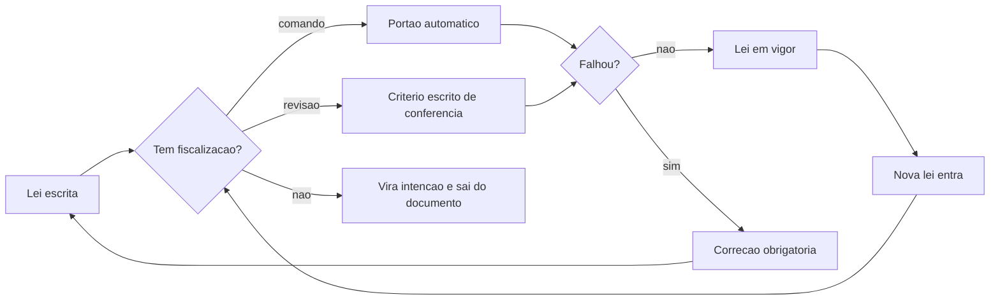

# Capítulo 4: A Constituição da bancada

## 1. Introdução

No Capítulo 3 você escolheu o alvo, mediu a linha de base e montou a base mínima — inclusive a primeira verificação. O que ainda não existe é o que impede o trabalho de voltar a desandar: um conjunto pequeno de regras que valem sempre e que ninguém precisa lembrar de cabeça.

Ao final deste capítulo você terá escrito a constituição do seu projeto: regras curtas, com responsável e, sempre que possível, um comando que as fiscalize. Vai entender por que a maioria dos projetos com IA não falha por falta de regra, e sim por ter regra que ninguém consegue verificar.

## 2. Explica

### 2.1 Por que regra combinada de cabeça não sobrevive

Toda equipe tem regras. A diferença entre uma equipe que sustenta qualidade e outra que recomeça toda semana é onde essas regras moram. Regra na cabeça depende de memória humana, e memória humana sob pressão é o recurso mais escasso do projeto. Regra em arquivo, lida antes de cada tarefa, depende apenas de alguém executar o passo de leitura.

Há ainda um público que não estava no projeto de software clássico: o agente. Ele lê o repositório, não a reunião, e trata tudo que encontra com o mesmo peso — arquivo de regra, comentário antigo e rascunho esquecido valem igual para ele [1]. Delegar execução sem delegar responsabilidade é a origem da maior parte dos incidentes com agentes [2].

O argumento ganha peso quando o executor não é humano. Um modelo não tem acesso ao que foi combinado verbalmente na reunião de ontem e não distingue regra de sugestão se as duas estiverem escritas no mesmo tom. A revisão de engenharia de contexto trata exatamente essa fronteira: instrução que não foi explicitada não existe como restrição, existe como sugestão a ser reinterpretada a cada execução [3].

Há ainda um efeito de escala que torna a informalidade insustentável. A adoção já é maioria: 84% dos desenvolvedores consultados afirmam usar ferramentas de IA no trabalho [4]. Com esse volume, o que antes era uma conversa entre duas pessoas passou a ser um processo coletivo — e processo coletivo sem regra escrita degenera em costume local.

### 2.2 A diferença entre intenção e regra

Uma regra só é regra quando é possível dizer, sem discussão, se ela foi cumprida. "Escrever código de qualidade" é intenção. "Nenhum pedido entra no banco sem identificador de origem" é regra: existe um caso claro de violação e uma verificação possível.

Essa distinção é o coração da constituição, e ela tem consequência prática. A prática de entrega contínua converteu essa ideia em mecanismo: critério de aceite automatizado, execução repetível e bloqueio do que não passa [5]. O relatório de desempenho de entrega de 2025 reforça a mesma direção ao associar rigor de processo a melhor resultado organizacional [6]. Em governança de IA, a exigência é explícita: política sem controle técnico não é governança, é declaração de intenção [7].

Na prática, cada regra da constituição recebe um de três graus: **verificável por comando** (o melhor), **verificável por revisão humana com critério escrito** (aceitável) ou **intenção** (que deve sair do documento ou ser convertida em algo verificável).

A razão pela qual o grau importa tem base empírica. Instruções em formato explícito e restritivo alteram o resultado entregue mais do que instruções em formato de recomendação, o que é o mesmo fenômeno observado em estudos de restrição de escrita assistida [8]. E a experiência de produção ensina que restrição é o que permite escala: sistemas que aguentam carga real são os que têm limites explícitos em vez de tolerância implícita [9].

### 2.3 As dez leis da bancada

Estas são as dez leis do caso âncora. Elas são curtas de propósito: uma lei que precisa de parágrafo explicativo será esquecida na segunda semana.

1. **Nada entra sem contrato.** Toda tarefa declara entrada, saída e critério de pronto antes de começar.
2. **Regra que não se verifica não é regra.** Se ninguém consegue dizer se foi cumprida, ela é intenção e sai do documento.
3. **Nenhuma entrega sem portão.** O que não passou na verificação não avança, e não existe exceção informal.
4. **Contexto é recurso finito.** A mesa de trabalho recebe o que a tarefa de hoje exige, não o histórico inteiro [10].
5. **Ação destrutiva exige reversibilidade.** Antes de sobrescrever, copiar; antes de apagar, arquivar.
6. **Uma tarefa, um responsável.** Responsabilidade compartilhada é responsabilidade de ninguém.
7. **Registro é obrigatório.** Toda decisão com consequência entra no caderno, com data e motivo.
8. **Nada é entregue vermelho.** Falha conhecida bloqueia a entrega; dívida registrada não é desculpa.
9. **O dado de origem é intocável.** Automação lê da entrada e escreve no estado; nunca altera o original.
10. **O projeto não pertence ao fornecedor.** Dados, regras e histórico ficam do seu lado.

Repare que as leis não falam de tecnologia. Elas sobrevivem à troca de modelo, de ferramenta e de linguagem de programação — o que é justamente o teste de qualidade de uma constituição. A lei do dado intocável, por exemplo, é a mesma ideia que sustenta separação entre leitura e escrita em qualquer sistema que precise durar [11], e a lei do contexto finito decorre do fato de que informação transmitida de forma incompleta é completada por suposição do outro lado [12].

Algumas leis protegem contra modos de falha documentados de agentes. A lei de reversibilidade existe porque ação irreversível não tem conserto; a lei de nada vermelho existe porque casca que finge funcionar é o defeito mais caro de encontrar depois [13]; e a lei do registro existe porque a dívida de segurança cresce silenciosamente quando ninguém anota o que foi adiado [14]. Parte do problema vem de prática insegura escolhida sem intenção, o que reforça a necessidade de lei escrita [15].

### 2.4 Onde a constituição mora e quem a fiscaliza

A constituição vive em um arquivo na raiz do repositório, lido antes de cada tarefa por pessoa e por agente. Ela não é apenas um documento de boas intenções: cada lei aponta para o mecanismo que a fiscaliza — comando, revisão ou decisão consciente.

| Lei | Como é fiscalizada | O que acontece quando falha |
|---|---|---|
| 1 Contrato antes da tarefa | Verificação de esquema do arquivo de entrada | O lote é reprovado antes de entrar no banco |
| 2 Regra verificável | Revisão do arquivo de regras a cada mudança | A regra volta a ser intenção e é reescrita |
| 3 Nenhuma entrega sem portão | Comando único que devolve aprovado ou bloqueado | A entrega não avança |
| 4 Contexto finito | Conferência dos arquivos que a tarefa lê | O contexto é podado antes da execução |
| 5 Reversibilidade | Cópia obrigatória da pasta de dados | A ação é executada em modo de ensaio |
| 6 Um responsável | Campo de responsável no caderno | A tarefa é devolvida sem execução |
| 7 Registro obrigatório | Conferência do caderno na revisão | A entrega fica pendente até registrar |
| 8 Nada vermelho | Suíte de testes no portão do repositório | A integração é bloqueada |
| 9 Dado de origem intocável | Permissão de escrita restrita à pasta de estado | A automação corrompe o original e é interrompida |
| 10 Portabilidade | Teste de execução em dois ambientes | A troca de fornecedor é bloqueada por decisão de projeto |

Uma constituição de dez leis, cada uma com fiscalização declarada, é o que separa um projeto que melhora de um projeto que apenas acumula código. E há um efeito colateral bem-vindo: a constituição também serve como critério de comparação entre ferramentas. Quando as leis estão escritas, trocar de modelo ou de assistente deixa de ser uma aposta e passa a ser um teste com resposta binária [5].

## 3. Ilustra

Numa oficina organizada existe um quadro com as normas de segurança. Ele não tem trinta itens: tem dez, escritos com letras grandes, porque norma que não pode ser lida do outro lado do galpão não é lida. Ao lado de cada norma existe a indicação de quem responde por ela — não por acaso, a norma que fala de óculos de proteção tem o nome do encarregado da bancada de corte.

A analogia vale item por item. Norma sem dono é enfeite; norma sem consequência é sugestão; norma que ninguém consegue verificar gera discussão toda semana. E existe um detalhe de forma que muda tudo: as normas ficam **na parede da bancada**, não no escritório da diretoria. Elas são lidas por quem executa, no momento em que executa.



*Figura 4.1 — Toda lei da constituição passa pelo teste da fiscalização: o que não tem dono nem verificação sai do documento.*

Como Engenheiro de Bancada, você vai notar que a constituição é o único artefato do projeto que vale a pena revisar todo mês. Ela envelhece junto com o sistema.

## 4. Técnica

### 4.1 O arquivo de regras do projeto

Este é o formato do arquivo de constituição. Note que ele não pede boa vontade: pede que cada regra declare a forma de fiscalização e a consequência de violação.

```yaml
# regras.yaml — constituicao da bancada do projeto
versao: 2
leis:
  - id: 1
    lei: nada entra sem contrato
    fiscalizacao: comando
    verificador: verificacoes/conferir_entrada.py
    consequencia: lote reprovado antes de gravar no banco
  - id: 3
    lei: nenhuma entrega sem portao
    fiscalizacao: comando
    verificador: verificacoes/rodar_portoes.sh
    consequencia: entrega bloqueada
  - id: 9
    lei: o dado de origem e intocavel
    fiscalizacao: revisao
    verificador: revisao semanal da arvore de dados
    consequencia: permissao de escrita restrita a pasta de estado
  - id: 10
    lei: o projeto nao pertence ao fornecedor
    fiscalizacao: comando
    verificador: verificacoes/testar_portabilidade.py
    consequencia: troca de fornecedor bloqueada por decisao de projeto
```

Regras que não têm verificador válido são reportadas pelo próprio portão da constituição — o instrumento da próxima seção.

### 4.2 O portão que fiscaliza a constituição

Uma constituição sem fiscalização envelhece como qualquer documento. Este portão lê o arquivo de regras e reprova quando encontra lei declarada como verificável mas sem verificador existente, ou lei sem consequência definida.

```python
#!/usr/bin/env python3
"""Portao da constituicao: nenhuma lei sem fiscalizacao declarada e valida."""
import re
import sys
from pathlib import Path

ARQUIVO = Path("regras.yaml")
CAMPOS = ("id", "lei", "fiscalizacao", "verificador", "consequencia")
FISCALIZACOES_VALIDAS = {"comando", "revisao"}


def ler_leis(texto):
    leis, atual = [], None
    for linha in texto.splitlines():
        achado = re.match(r"\s*-\s*id:\s*(\S+)", linha)
        if achado:
            atual = {"id": achado.group(1)}
            leis.append(atual)
            continue
        if atual is None:
            continue
        for campo in CAMPOS[1:]:
            achado = re.match(rf"\s*{campo}:\s*(.+)$", linha)
            if achado:
                atual[campo] = achado.group(1).strip()
    return leis


def validar(leis):
    problemas = []
    for lei in leis:
        faltando = [c for c in CAMPOS if not lei.get(c)]
        if faltando:
            problemas.append(f"lei {lei.get('id', '?')}: campos ausentes {', '.join(faltando)}")
            continue
        if lei["fiscalizacao"] not in FISCALIZACOES_VALIDAS:
            problemas.append(f"lei {lei['id']}: fiscalizacao invalida '{lei['fiscalizacao']}'")
        elif lei["fiscalizacao"] == "comando":
            alvo = Path(lei["verificador"])
            if not alvo.exists():
                problemas.append(f"lei {lei['id']}: verificador inexistente {alvo}")
    return problemas


def main():
    if not ARQUIVO.exists():
        print("[BLOQUEADO] regras.yaml ausente: a bancada nao tem constituicao")
        return 1
    problemas = validar(ler_leis(ARQUIVO.read_text(encoding="utf-8")))
    if problemas:
        print("[BLOQUEADO] constituicao incompleta:")
        for item in problemas:
            print(f"  - {item}")
        return 1
    print("[APROVADO] constituicao completa e fiscalizavel")
    return 0


if __name__ == "__main__":
    sys.exit(main())
```

Este é o tipo de automação que se paga rápido: ele custa vinte linhas e impede que a constituição vire folclore. Vale notar que portões como esse só fazem sentido dentro de um fluxo maior de verificação, em que cada etapa deixa rastro do que aprovou — exatamente a ideia de qualidade verificável que a engenharia de qualidade vem incorporando com apoio de telemetria [16].

### 4.3 As leis que quase todo mundo esquece

Três leis costumam faltar nas primeiras versões e cobram caro depois. A tabela abaixo mostra o sintoma e a redação da lei que resolve.

| Sintoma observado | Lei que estava faltando | Redação sugerida |
|---|---|---|
| Arquivo original alterado por script | O dado de origem é intocável | Automação lê da entrada e escreve apenas no estado |
| Correção aplicada direto em produção | Ação destrutiva exige reversibilidade | Toda alteração parte de cópia e tem volta |
| Ninguém sabe quem aprovou a mudança | Uma tarefa, um responsável | Cada tarefa tem responsável registrado no caderno |
| Regra discutida de novo toda semana | Regra que não se verifica não é regra | Toda lei declara forma de fiscalização |
| Troca de ferramenta obriga refazer o projeto | O projeto não pertence ao fornecedor | Dados, regras e histórico ficam no repositório |

### 4.4 O que nunca entra na constituição

Existem três categorias que não pertencem ao documento. **Preferência pessoal** ("usar sempre a biblioteca x") muda com o tempo e não descreve consequência. **Decisão de infraestrutura específica** ("rodar no provedor y") é escolha técnica, e vira restrição apenas se houver um motivo de lei — como portabilidade. E **regra que depende de interpretação** ("escrever código limpo") pertence a um guia de estilo, não à constituição: misturar as duas coisas faz com que a constituição inteira seja tratada como sugestão.

## 5. Aplica

**Situação.** Você assume a liderança de um time que usa IA para escrever código há seis meses. Existe um documento de regras com vinte e dois itens, escrito com boa intenção, e você decide começar a aplicá-lo. Na primeira semana, dois desenvolvedores discutem por dez minutos se uma mudança viola ou não a regra número 9 — "manter o código simples". Ninguém sabe responder.

**O erro.** Você tenta resolver a discussão escrevendo uma versão mais detalhada da mesma regra. O documento passa a ter vinte e quatro itens, a regra 9 ganha dois parágrafos e a discussão volta na semana seguinte, agora sobre a interpretação do parágrafo novo.

**O diagnóstico.** A regra 9 nunca foi regra: era intenção. Discutir intenção não tem árbitro, porque não há fato a verificar. O time não tinha problema de disciplina, tinha documento com o tipo errado de conteúdo misturado — o que faz com que as regras de fato verificáveis também percam autoridade [5].

**A correção.** Separe o documento em dois. No guia de estilo ficam as preferências e o bom senso, referenciadas como orientação. Na constituição ficam dez leis, todas com fiscalização declarada, e a antiga regra 9 é convertida em dois comandos: limite de complexidade por função e proibição de parâmetro que altera comportamento global. A discussão desaparece porque existem comandos que respondem.

**Métricas de sucesso.** A constituição se avalia por quatro números simples:

| Métrica | Como medir | Sinal de que funcionou |
|---|---|---|
| Leis com fiscalização declarada | Contagem no arquivo de regras | Todas as leis têm dono |
| Verificadores existentes e executáveis | Portão da constituição rodando no repositório | Aprovação em 100% das verificações declaradas |
| Discussões repetidas sobre a mesma regra | Registro no caderno de bancada | Mesma regra não volta a ser discutida |
| Tempo de leitura da constituição | Leitura cronometrada na integração de alguém novo | Cabe em uma leitura única |

**Nota de contexto.** Antes de culpar a equipe pela informalidade, olhe o volume de adoção: 84% dos desenvolvedores consultados já usam ferramentas de IA no trabalho, e a maioria deles decidiu isso por conta própria, sem processo definido pela organização [17]. A constituição é a resposta de processo a uma decisão que já foi tomada na prática. Estudos amplos sobre modelos de linguagem registram que esse padrão de adoção sem governança não é exclusividade de uma ferramenta ou de um país [18].

**Armadilhas comuns.** A primeira é escrever a constituição grande: acima de dez leis, ninguém lê e o documento perde função. A segunda é criar lei nova a cada incidente, o que transforma a constituição em diário de traumas. A terceira é declarar fiscalização que não existe — o pior dos casos, porque produz a sensação de controle sem controle. A quarta é aceitar a primeira exceção informal: a lei que não vale em um caso não vale em nenhum. A quinta é esquecer que o agente também é leitor da constituição: preâmbulo longo, tom de recomendação e exemplos ambíguos fazem o executor tratar tudo como sugestão [3].

**Até onde isso escala.** A constituição de dez leis funciona em time pequeno e em projeto único, e o limite aparece cedo quando o projeto passa a ter vários módulos com regras que se contradizem: nesse ponto é preciso hierarquia explícita, com um núcleo comum e regras locais que não podem contrariar a lei maior — a mesma lógica de camada que mantém um sistema previsível quando ele cresce [19]. A régua da comparabilidade também limita: medir leis cumpridas entre ferramentas diferentes só faz sentido com definição fixa do que cada lei exige, como em qualquer avaliação comparativa séria [20]. e continua coerente em vários times desde que exista um núcleo comum e regras locais explicitamente separadas. Ela não substitui exigência regulatória: quando o projeto precisa de auditoria formal, a constituição é o ponto de partida, e o detalhamento vem de controles de conformidade reconhecidos [7]. Também não faz sentido para trabalho exploratório sem entrega: protótipo de dois dias documentado com constituição de dez leis é burocracia antecipada.

### 5.1 O teste da regra que um comando verifica

Constituição sem verificação é intenção. A diferença entre as duas cabe em um teste de três perguntas, aplicado regra por regra.

1. **A regra cabe em uma frase afirmativa?** "Todo arquivo de configuração declara a versão do formato" é uma regra. "Sempre escrever código limpo" é um desejo.
2. **Existe uma entrada e uma saída observáveis?** Se você não consegue dizer o que seria reprovado, ninguém consegue construir o portão.
3. **A reprovação é automática?** Regra que depende de alguém lembrar de conferir não é portão: é combinado.

| Regra escrita | Vira portão? | Por quê |
|---|---|---|
| Todo config declara a versão do formato | Sim | Saída observável no próprio arquivo |
| Nenhum segredo em repositório | Sim | Verificação por padrão de credencial |
| Código legível | Não | Sem critério objetivo de corte |
| Avisar o time antes de mexer | Não | Depende de memória humana |

As regras que passam no teste vão para o arquivo de constituição com uma etiqueta: `verificável por comando`. As que não passam ficam registradas como acordo de time, em seção separada, para que ninguém as confunda com automação.

**Aplicação no sistema.** Na primeira semana, implemente apenas uma regra verificável, a mais simples. Um portão que roda e reprova de verdade ensina mais sobre o método do que dez regras escritas que ninguém executa — e é a base para os disjuntores do capítulo 6 [5]. Constituição que não distingue acordo de portão produz a pior das situações: confiança alta com verificação zero.

**Limite desta prática.** Uma regra verificável só vale enquanto o custo de mantê-la for menor que o custo do erro que ela evita. Quando a verificação começa a exigir trabalho manual para calibrar, ela deixou de ser portão e virou tarefa [9].

## 6. Conclusão

Você aprendeu que regra sem verificação é intenção, e que a diferença entre as duas decide quanto retrabalho o projeto acumula. Escreveu a constituição da bancada com dez leis, cada uma com forma de fiscalização e consequência declarada, e viu que o melhor fiscal é um comando que devolve aprovado ou bloqueado. Viu também o que nunca deve entrar no documento: preferência pessoal, decisão de infraestrutura sem motivo e regra que depende de interpretação.

**Desafio.** Escreva as cinco primeiras leis do seu projeto, rode o portão da constituição da seção Técnica e verifique quantas delas já têm verificador existente. As que não tiverem, escreva de novo — ou assuma que são intenção e mova para o guia de estilo.

Com isso a Parte I termina: você tem alvo, linha de base e lei. No próximo capítulo começa a montagem, com a Peça 1 — Contexto: o que exatamente a IA lê antes de agir, em que formato e em que ordem.

## 7. Referências Bibliográficas

[1] ANTHROPIC. *Model Context Protocol Specification (2025-06-18)*. Disponível em: https://modelcontextprotocol.io/specification/2025-06-18. Acesso em: 12 set. 2026.
[2] ALI, Mohamad Abou; DORNAIKA, Fadi; CHARAFEDDINE, Jinan. *Agentic AI: a comprehensive survey of architectures, applications, and future directions*. In: Artificial Intelligence Review. 2025. Disponível em: https://doi.org/10.1007/s10462-025-11422-4. Acesso em: 12 set. 2026.
[3] MEI, Lingrui et al. *A Survey of Context Engineering for Large Language Models*. In: arXiv. 2025. Disponível em: https://arxiv.org/abs/2507.13334. Acesso em: 12 set. 2026.
[4] STACK OVERFLOW. *2025 Developer Survey — AI*. Disponível em: https://survey.stackoverflow.co/2025/ai. Acesso em: 12 set. 2026.
[5] HUMBLE, Jez; FARLEY, David. *Continuous Delivery: Reliable Software Releases through Build, Test, and Deployment Automation*. Addison-Wesley, 2010. Disponível em: https://continuousdelivery.com/. Acesso em: 12 set. 2026.
[6] DORA / GOOGLE CLOUD. *State of AI-assisted Software Development 2025*. Disponível em: https://dora.dev/dora-report-2025/. Acesso em: 12 set. 2026.
[7] NATIONAL INSTITUTE OF STANDARDS AND TECHNOLOGY. *Artificial Intelligence Risk Management Framework: Generative Artificial Intelligence Profile (NIST AI 600-1)*. Disponível em: https://nvlpubs.nist.gov/nistpubs/ai/NIST.AI.600-1.pdf. Acesso em: 12 set. 2026.
[8] PEREIRA, Luciano. *Empirical Validation of Cognitive-Derived Coding Constraints and Tokenization Asymmetries in LLM-Assisted Software Engineering*. 2026. Disponível em: https://doi.org/10.2139/ssrn.6294900. Acesso em: 12 set. 2026.
[9] NYGARD, Michael T. *Release It!: Design and Deploy Production-Ready Software*. 2. ed. Pragmatic Bookshelf, 2018. Disponível em: https://pragprog.com/titles/mnee2/release-it-second-edition/. Acesso em: 12 set. 2026.
[10] LIU, Nelson F. et al. *Lost in the Middle: How Language Models Use Long Contexts*. In: Transactions of the Association for Computational Linguistics. 2024. Disponível em: https://arxiv.org/abs/2307.03172. Acesso em: 12 set. 2026.
[11] SQLITE. *File Locking And Concurrency In SQLite Version 3*. Disponível em: https://sqlite.org/lockingv3.html. Acesso em: 12 set. 2026.
[12] SHANNON, Claude E. *A Mathematical Theory of Communication*. Bell System Technical Journal, 1948. Disponível em: https://doi.org/10.1002/j.1538-7305.1948.tb01338.x. Acesso em: 12 set. 2026.
[13] VERACODE. *2025 GenAI Code Security Report: AI-Generated Code Security Risks*. Disponível em: https://www.veracode.com/blog/ai-generated-code-security-risks/. Acesso em: 12 set. 2026.
[14] CLOUD SECURITY ALLIANCE. *Vibe Coding's Security Debt: The AI-Generated CVE Surge*. Disponível em: https://labs.cloudsecurityalliance.org/research/csa-research-note-ai-generated-code-vulnerability-surge-2026/. Acesso em: 12 set. 2026.
[15] ENDOR LABS. *The Most Common Security Vulnerabilities in AI-Generated Code*. Disponível em: https://www.endorlabs.com/learn/the-most-common-security-vulnerabilities-in-ai-generated-code. Acesso em: 12 set. 2026.
[16] RAKSHIT, Yerram Sai. *Modernizing Software Testing: AI, Telemetry, and Agentic Quality Engineering*. In: International Journal of AI Engineering. 2026. Disponível em: https://doi.org/10.34218/ijaieg_01_01_002. Acesso em: 12 set. 2026.
[17] ROBBES, Romain et al. *Agentic Much? Adoption of Coding Agents on GitHub*. In: ACM Transactions on Software Engineering and Methodology. 2026. Disponível em: https://doi.org/10.1145/3822180. Acesso em: 12 set. 2026.
[18] HADI, Muhammad Usman et al. *A Survey on Large Language Models: Applications, Challenges, Limitations, and Practical Usage*. 2023. Disponível em: https://doi.org/10.36227/techrxiv.23589741.v1. Acesso em: 12 set. 2026.
[19] MARTIN, Robert C. *Clean Architecture: A Craftsman's Guide to Software Structure and Design*. Prentice Hall, 2017. Disponível em: https://www.pearson.com/. Acesso em: 12 set. 2026.
[20] BELLAPUKONDA, Jahnavi. *A Comparative Evaluation of LLM-based Coding Agents for Automated Software Development Tasks*. 2026. Disponível em: https://doi.org/10.2139/ssrn.6755658. Acesso em: 12 set. 2026.
