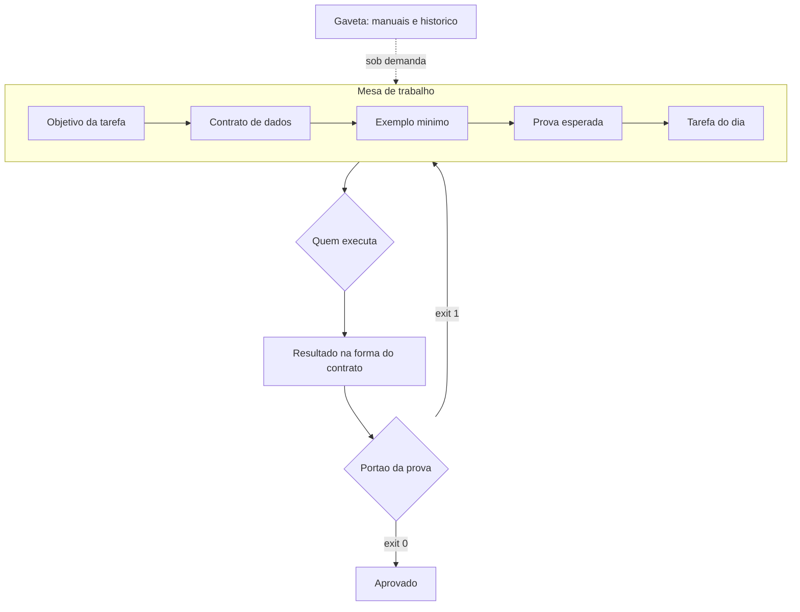

# Capítulo 5: Peça 1 — Contexto: o que a IA lê antes de agir

## 1. Introdução

No Capítulo 4 você escreveu a constituição da bancada: as leis que valem sempre. Agora começa a montagem das quatro peças, e a primeira é a que decide tudo o que vem depois. Antes de qualquer verificação, roteamento ou ferramenta, existe uma pergunta simples: o que exatamente quem executa lê antes de agir?

Ao final deste capítulo você terá montado a camada de contexto do seu projeto: uma especificação de uma página, um contrato de dados, um exemplo mínimo e um medidor que avisa quando a mesa de trabalho está ficando cheia demais. É a peça que faz a diferença entre uma IA que obedece hoje e uma que obedece na semana que vem.

## 2. Explica

### 2.1 Quatro coisas e nada mais

A camada de contexto tem quatro componentes, e eles respondem a quatro perguntas diferentes. O **objetivo** responde "o que esta tarefa entrega". O **contrato** responde "com que dados ela trabalha e em que formato o resultado volta". O **exemplo** responde "como é uma execução correta". A **prova** responde "como saberemos que funcionou". Sem esses quatro, quem executa preenche a lacuna com suposição — e suposição é o insumo mais caro de um projeto. Surveys de arquitetura agêntica colocam essa composição explícita como pré-condição para delegar trabalho com segurança, porque um agente sem contrato não tem como saber onde termina sua tarefa [1].

Note que três desses componentes são artefatos, não conversas. A revisão de engenharia de contexto descreve essa virada como a diferença entre compor uma mensagem e desenhar um sistema de informação: o contexto passa a ser construído, versionado e mantido, em vez de improvisado a cada pedido [2]. A evolução mais recente desse campo vai além: o contexto pode ser mantido e atualizado como parte do próprio sistema, com curadoria explícita do que entra e do que sai [3].

O quarto componente, a prova, é o que costuma faltar. Um agente que sabe o que entregar, mas não sabe como será avaliado, tende a otimizar a aparência do resultado. Esse comportamento já foi observado em agentes de código de horizonte longo, que aprendem a satisfazer o teste em vez de resolver o problema [4]. A mesma lógica explica por que critérios de avaliação padronizados existem: sem forma fixa de julgar, a comparação entre execuções vira impressão [5].

### 2.2 Densidade: por que contexto grande atrapalha

Existe uma intuição errada e muito comum: a de que contexto maior é contexto melhor. Ela cai no primeiro teste. A recuperação de informação no meio de um contexto longo é pior do que no começo e no fim, efeito batizado como *lost in the middle* [6]. Ou seja: acrescentar documento ao histórico não só custa mais como pode piorar a resposta.

Há um motivo informacional para isso. A comunicação é limitada pela capacidade do canal: o que chega misturado com ruído precisa ser reconstruído, e a reconstrução é feita por suposição [7]. Na prática, um arquivo irrelevante na mesa não é neutro — ele compete com o que importa. O efeito se agrava quando a instrução é dada em formato de recomendação: restrições explícitas mudam o resultado entregue de forma mais confiável do que pedidos genéricos [8].

Daí a regra operacional da peça 1: **a mesa recebe o necessário, e o necessário tem nome.** Se você não consegue listar os arquivos que a tarefa lê, a tarefa ainda não está pronta para executar.

Uma alternativa que ajuda quando o projeto é grande: representar a estrutura do sistema de forma condensada, em vez de despejar arquivos. Mapas de dependência e diagramas gerados a partir do próprio código dão ao executor a visão do conjunto com uma fração do texto [9]. É o mesmo princípio do esquema na parede da oficina: você olha a planta, não a obra inteira.

### 2.3 Estabilidade: o que sobrevive à troca de tudo

O contexto canônico tem uma qualidade que os outros artefatos não têm: ele sobrevive. Sobrevive à troca de modelo, à troca de assistente, à saída da pessoa que escreveu e à sua própria memória em três meses. Isso acontece porque ele descreve o problema, não a ferramenta.

Manter esse material versionado ajuda por razões conhecidas: histórico permite comparar e reverter, e a mecânica de linha de trabalho separada evita que duas frentes sobrescrevam uma à outra [10]. A estrutura também importa: separar a descrição do problema da descrição da solução mantém o contexto útil quando a solução muda [11].

Um cuidado que quase ninguém tem no começo: contexto envelhece. Arquivo de especificação que descreve um comportamento que o sistema não tem mais é pior do que arquivo nenhum, porque ensina errado com autoridade. Surveys amplos sobre modelos de linguagem registram que a defasagem entre documentação e comportamento real é uma das causas recorrentes de resultado incorreto, e ela não se resolve com modelo mais novo [12].

### 2.4 Economia de mesa: prefixo estável

Existe um ganho fácil e pouco explorado na camada de contexto: ordem estável. Quando a primeira parte da mensagem não muda entre execuções, o provedor consegue reaproveitar o processamento já feito. Em prompts longos, a redução de latência com esse reaproveitamento chega a **85%**, e a economia de custo de entrada é igualmente relevante [13].

O mesmo mecanismo existe em outras plataformas, com nomes diferentes e o mesmo princípio: parte estável na frente, parte variável no fim [14]. Na bancada isso vira regra de organização: instruções fixas, contrato e exemplos formam o bloco de abertura; a tarefa do dia entra no fim.

Vale registrar onde essa camada se conecta com as outras três, para você não tratar as peças como compartimentos estanques. Uma verificação binária citada na especificação transforma contexto em critério de aceite executável [15]. Um registro de execução citado na tarefa transforma contexto em aprendizado cumulativo [16]. E um limite declarado na especificação transforma contexto em fronteira explícita, em vez de tolerância implícita [17].

## 3. Ilustra

Olhe para uma bancada de eletrônica em uso. Sobre a mesa ficam apenas o esquema do circuito, a peça em conserto, as ferramentas daquela intervenção e o medidor. Na gaveta, organizados, ficam os manuais, as peças de outros projetos e os relatórios antigos. Ninguém trabalha com a gaveta derramada sobre a mesa — não por disciplina estética, mas porque mesa cheia significa peça perdida e mão presa.

A camada de contexto é essa mesa. O esquema é a especificação. A peça é o dado da tarefa. O medidor é a prova. E a gaveta é todo o resto: documentação, histórico, código antigo — material necessário, mas sob demanda.

Repare em dois detalhes que a analogia revela. O primeiro é que a mesa é montada **para a tarefa de hoje**: quem conserta rádio não precisa da peça de videocassete. O segundo é que a posição dos itens na mesa tem ordem fixa; o eletricista não procura o esquema em lugar diferente a cada dia. Ordem fixa é o que faz o trabalho render, e é também o que faz o processamento ser reaproveitado.



*Figura 5.1 — A mesa de trabalho do contexto: o bloco fixo (objetivo, contrato, exemplo e prova) abre a leitura, a tarefa do dia fecha, e a gaveta só é aberta quando a tarefa exige.*

Como Engenheiro de Bancada, você vai tratar a montagem da mesa como ritual obrigatório, e não como detalhe de escrita de prompt. Mesa montada é meia tarefa feita.

## 4. Técnica

### 4.1 A especificação de uma página

O primeiro artefato é a especificação da tarefa. Ela é curta por decisão de projeto: se não cabe em uma página, a tarefa provavelmente ainda é grande demais para um ciclo.

```markdown
# Especificacao: conferencia de pedidos do dia

## Objetivo
Conferir o arquivo de pedidos recebido e produzir o resumo diario por forma de pagamento.

## Entrada
Arquivo CSV em dados/entrada/, com as colunas identificador, cliente, valor, data e forma_pagamento.

## Saida
Arquivo JSON em dados/estado/resumo-AAAA-MM-DD.json com totais por forma de pagamento e lista de pendencias.

## Pronto quando
- Nenhuma linha valida ficou fora do resumo.
- Toda linha com identificador repetido aparece na lista de pendencias.
- O resultado e o mesmo em duas execucoes seguidas com o mesmo arquivo.

## Fora de escopo
Corrigir dados do sistema de origem e enviar o relatorio por e-mail.
```

O bloco "Fora de escopo" é o mais subestimado. Ele impede que a tarefa cresça durante a execução — o que, em trabalho com agente, é a forma mais comum de o trabalho não terminar.

### 4.2 O contrato de dados

O contrato descreve a forma exata dos dados. Ele é o que permite escrever dois executores diferentes e obter o mesmo resultado, e é o que uma verificação automática precisa ler para dizer se o dado está na forma esperada.

```json
{
  "titulo": "contrato de pedido",
  "versao": 1,
  "campos_obrigatorios": ["identificador", "cliente", "valor", "data", "forma_pagamento"],
  "tipos": {
    "identificador": "texto nao vazio",
    "cliente": "texto nao vazio",
    "valor": "decimal com duas casas",
    "data": "data no formato AAAA-MM-DD",
    "forma_pagamento": "texto de lista fixa"
  },
  "regras": [
    "identificador repetido no mesmo lote entra em pendencias",
    "valor negativo em pedido de venda entra em pendencias",
    "linha sem forma de pagamento entra em pendencias"
  ]
}
```

Quem define o contrato é o negócio, não o código. Se a regra "valor negativo entra em pendência" mora só no código, ela se perde na primeira reescrita.

### 4.3 O exemplo mínimo

Um exemplo correto vale mais do que três parágrafos de explicação. O exemplo mínimo é um arquivo pequeno, com todos os casos difíceis representados, usado como referência de formato.

```csv
identificador,cliente,valor,data,forma_pagamento
8842,Ana Souza,132.90,2026-09-14,pix
8843,Carlos Lima,58.00,2026-09-14,cartao
8842,Ana Souza,132.90,2026-09-14,pix
8844,Mercado Bom Preco,-99.00,2026-09-14,boleto
8845,Loja do Ze,240.50,2026-09-14,
```

Esse arquivo de cinco linhas ensina mais que qualquer descrição: ele mostra um caso normal, um identificador repetido, um valor negativo e uma linha sem forma de pagamento. O executor que recebe esse exemplo entende o que fazer em cada caso — e o problema deixa de ser interpretação.

### 4.4 O medidor de mesa

Agora o instrumento que impede a mesa de transbordar. Este script conta linhas e tamanho dos arquivos canônicos do projeto e reprova quando o total passa do teto definido para o bloco fixo de contexto.

```python
#!/usr/bin/env python3
"""Medidor de contexto: avisa quando a mesa de trabalho passa do teto."""
import sys
from pathlib import Path

TETO_LINHAS = 400
STATUS = {"-": "ausente", "!": "grande", "?": "nao listado"}


def medir(caminhos, teto=TETO_LINHAS):
    linhas = []
    total = 0
    for caminho in caminhos:
        arquivo = Path(caminho)
        if not arquivo.exists():
            linhas.append((STATUS["-"], caminho, 0))
            continue
        conteudo = arquivo.read_text(encoding="utf-8", errors="replace")
        quantidade = len(conteudo.splitlines())
        total += quantidade
        marca = STATUS["!"] if quantidade > teto / 2 else " "
        linhas.append((marca, caminho, quantidade))
    return linhas, total


def main():
    canonicos = [
        "objetivo.md",
        "contrato.json",
        "vocabulario.yaml",
        "exemplos/pedidos-exemplo.csv",
    ]
    linhas, total = medir(canonicos)
    for marca, caminho, quantidade in linhas:
        print(f"[{marca}] {caminho}: {quantidade} linhas")
    print(f"total: {total} linhas (teto do bloco fixo: {TETO_LINHAS})")
    if total > TETO_LINHAS:
        print("[BLOQUEADO] contexto fixo acima do teto: mova documentos para a gaveta")
        return 1
    print("[APROVADO] mesa de trabalho dentro do teto")
    return 0


if __name__ == "__main__":
    sys.exit(main())
```

Três decisões explicam esse instrumento. Ele mede linhas, não tokens, porque linhas qualquer pessoa entende. Ele marca o arquivo ausente em vez de ignorá-lo, porque contexto incompleto é falha silenciosa. E ele devolve bloqueio, porque teto que não bloqueia é sugestão.

### 4.5 A ordem do bloco fixo

A ordem dos arquivos não é estética: ela define o que pode ser reaproveitado entre execuções. Mantenha o bloco fixo na frente e a variação no fim.

| Posição | Conteúdo | Muda com que frequência |
|---|---|---|
| 1 | Regras do projeto | Quase nunca |
| 2 | Objetivo da tarefa | Por tarefa |
| 3 | Contrato de dados | Raramente |
| 4 | Exemplo mínimo | Raramente |
| 5 | Dados do dia e pedido específico | Sempre |

A regra é simples: o que muda com frequência vai para o fim, para não invalidar o reaproveitamento do que é estável [13] [14].

## 5. Aplica

**Situação.** Você precisa que o agente ajuste a regra de arredondamento do relatório de pedidos. Para "dar contexto", você anexa ao pedido o código do módulo inteiro, o arquivo de configuração, três relatórios antigos, o histórico da conversa de ontem e um exemplo de nota fiscal do fornecedor. O pedido fica com alguns milhares de linhas.

**O erro.** A resposta chega bonita e errada: o agente altera a regra, mas também renomeia funções, muda o formato de saída e acrescenta uma validação que ninguém pediu, baseada no exemplo da nota fiscal. Você corrige, ele muda outra coisa, e a terceira rodada desfaz a primeira correção.

**O diagnóstico.** A causa é a mesa, não o executor. Você misturou quatro coisas de naturezas diferentes: instrução (a regra de arredondamento), contrato (o formato de saída), dado (os relatórios antigos) e ruído (a nota fiscal). Quando tudo tem o mesmo peso, o executor trata o ruído como requisito — e a tentativa de correção, feita acrescentando ainda mais texto, agrava o efeito do meio do contexto perdido [6].

**A correção.** Remonte a mesa conforme a peça 1: as regras do projeto no topo, a especificação de uma página com o "fora de escopo" explícito, o contrato com os campos e as três regras, e o exemplo mínimo de cinco linhas com os casos difíceis. Os relatórios antigos e a nota fiscal saem da mesa e ficam disponíveis na gaveta, citados por caminho. O pedido final tem menos de cem linhas e a alteração sai correta na primeira tentativa.

**Métricas de sucesso.** A camada de contexto se avalia com quatro números que você mede antes e depois:

| Métrica | Como medir | Sinal de que funcionou |
|---|---|---|
| Linhas do bloco fixo | Medidor da seção Técnica | Abaixo do teto definido, sem arquivo ausente |
| Tentativas até o resultado correto | Contagem por tarefa no caderno | A primeira tentativa acerta com mais frequência |
| Alterações fora do escopo | Diff da mudança entregue | Menos arquivos tocados que o pedido original |
| Tempo de resposta do provedor | Comparação da mesma tarefa antes e depois da reordenação | Menor, sem trocar de modelo |

**Nota de contexto.** O custo de montar a mesa à mão cai quando a organização tem processo: a IA amplifica o que já existe, e contexto bem definido é parte do que se amplifica [18]. Em times sem esse material, o primeiro passo é escrever a especificação, não acrescentar ferramenta [19].

**Armadilhas comuns.** Quatro aparecem sempre. A primeira é anexar o repositório inteiro "para não faltar nada": contexto completo é contexto caro e desatento. A segunda é descrever a solução em vez do problema, o que amarra a execução a uma arquitetura que talvez não seja a melhor. A terceira é deixar especificação desatualizada no repositório, ensinando errado com autoridade. A quarta é colocar credencial, token de acesso ou dado pessoal na mesa de trabalho — isso não é problema de desempenho, é problema de segurança e de conformidade [20] [21]. Há uma quinta, mais silenciosa: herdar um contexto cheio de prática insegura de exemplos antigos. Levantamentos de vulnerabilidade em código gerado por IA mostram que a qualidade do exemplo de entrada influencia o resultado entregue [22] [23].

**Até onde isso escala.** Uma especificação de uma página e um contrato pequeno funcionam bem enquanto o projeto tem uma tarefa principal; o limite aparece quando o próprio domínio ainda não é conhecido — procedimento que ninguém documentou porque está na cabeça de quem executa exige observação antes de especificação, o que é trabalho diferente [24]. quando o sistema cresce para dezenas de fluxos, é preciso um índice de contexto que diga qual conjunto de arquivos cada tipo de tarefa lê — sem isso, a mesa vira garagem. O reaproveitamento de prefixo também tem limite: se a parte estável muda a cada execução, não há economia nenhuma, e a ordem dos arquivos passa a ser apenas organização [13]. E o teto de linhas precisa ser revisto quando o domínio crescer: medida antiga aplicada a projeto novo produz bloqueio injusto.

### 5.1 O passe de três conferências

Especificação não se avalia por tamanho. Avalia-se por três conferências, feitas na ordem, antes de gastar uma única chamada.

**Conferência de entrada.** O que entra está nomeado, com formato e origem? Se a resposta for "depende", a especificação ainda não começou.

**Conferência de saída.** Você sabe descrever o artefato pronto sem dizer como construí-lo? Critério que descreve passos, e não resultado, transforma a peça de contexto em manual de instruções frágeis.

**Conferência de recusa.** A especificação diz o que fazer quando o dado esperado não existe? Esse é o item que quase todo mundo esquece e o que mais gera retrabalho, porque a resposta inventada parece plausível. Onde a lacuna for inegociável, a orientação é declarar: sem o dado, o sistema para em vez de adivinhar [4].

| Item conferido | Pergunta de corte | Sinal de reprovação |
|---|---|---|
| Entrada | Está nomeada e com formato? | "Depende do caso" |
| Saída | Descreve resultado, não passos? | Lista de comandos internos |
| Recusa | Diz o que fazer sem dado? | Silêncio sobre a ausência |
| Limite | Declara o que não está no escopo? | Escopo aberto |

**Aplicação no sistema.** Passe as três conferências em uma tarefa real, hoje. O tempo gasto aqui é o investimento de maior retorno da bancada: instrução ambígua é a causa mais comum de resultado descartado, e o formato da instrução altera o número de tentativas até o acerto [8]. Guarde a especificação aprovada no arquivo de contexto do projeto, que é o que o executor lerá antes de agir [2].

## 6. Conclusão

Você montou a Peça 1: objetivo, contrato, exemplo e prova na mesa, gaveta organizada sob demanda e ordem fixa do bloco estável. Aprendeu que contexto maior não é contexto melhor, que instrução em tom de recomendação é reinterpretada, e que a mesa precisa de medidor — teto que não bloqueia é sugestão. E viu como o reaproveitamento do prefixo estável reduz latência e custo sem trocar uma linha de código.

**Desafio.** Escreva a especificação de uma página da sua próxima tarefa, com os blocos "Entrada", "Saída", "Pronto quando" e "Fora de escopo". Monte o exemplo mínimo com pelo menos dois casos difíceis representados e rode o medidor de mesa apontando para os seus arquivos canônicos.

No próximo capítulo, a Peça 2 — Harness: o ciclo de vida em quatro passos, os portões binários e os disjuntores que protegem a bancada de ação destrutiva. É a peça que transforma boa intenção em garantia.

## 7. Referências Bibliográficas

[1] ALI, Mohamad Abou; DORNAIKA, Fadi; CHARAFEDDINE, Jinan. *Agentic AI: a comprehensive survey of architectures, applications, and future directions*. In: Artificial Intelligence Review. 2025. Disponível em: https://doi.org/10.1007/s10462-025-11422-4. Acesso em: 12 set. 2026.
[2] MEI, Lingrui et al. *A Survey of Context Engineering for Large Language Models*. In: arXiv. 2025. Disponível em: https://arxiv.org/abs/2507.13334. Acesso em: 12 set. 2026.
[3] ZHANG, Qizheng et al. *Agentic Context Engineering: Evolving Contexts for Self-Improving Language Models*. In: arXiv. 2025. Disponível em: https://arxiv.org/abs/2510.04618. Acesso em: 12 set. 2026.
[4] METR. *Recent Frontier Models Are Reward Hacking*. Disponível em: https://metr.org/blog/2025-06-05-recent-reward-hacking/. Acesso em: 12 set. 2026.
[5] OPENAI. *Introducing SWE-bench Verified*. Disponível em: https://openai.com/index/introducing-swe-bench-verified/. Acesso em: 12 set. 2026.
[6] LIU, Nelson F. et al. *Lost in the Middle: How Language Models Use Long Contexts*. In: Transactions of the Association for Computational Linguistics. 2024. Disponível em: https://arxiv.org/abs/2307.03172. Acesso em: 12 set. 2026.
[7] SHANNON, Claude E. *A Mathematical Theory of Communication*. Bell System Technical Journal, 1948. Disponível em: https://doi.org/10.1002/j.1538-7305.1948.tb01338.x. Acesso em: 12 set. 2026.
[8] PEREIRA, Luciano. *Empirical Validation of Cognitive-Derived Coding Constraints and Tokenization Asymmetries in LLM-Assisted Software Engineering*. 2026. Disponível em: https://doi.org/10.2139/ssrn.6294900. Acesso em: 12 set. 2026.
[9] VĂDUVA, A. et al. *Code2UML: Agentic LLMs with context engineering for scalable software visualization*. In: arXiv. 2026. Disponível em: https://www.semanticscholar.org/paper/792e745f4068bb0557ed2a4c6601812b3e3baf5e. Acesso em: 12 set. 2026.
[10] CHACON, Scott; STRAUB, Ben. *Pro Git: Everything you need to know about Git*. 2. ed. Apress, 2014. Disponível em: https://git-scm.com/book/en/v2. Acesso em: 12 set. 2026.
[11] MARTIN, Robert C. *Clean Architecture: A Craftsman's Guide to Software Structure and Design*. Prentice Hall, 2017. Disponível em: https://www.pearson.com/. Acesso em: 12 set. 2026.
[12] HADI, Muhammad Usman et al. *A Survey on Large Language Models: Applications, Challenges, Limitations, and Practical Usage*. 2023. Disponível em: https://doi.org/10.36227/techrxiv.23589741.v1. Acesso em: 12 set. 2026.
[13] ANTHROPIC. *Prompt Caching — Claude Platform Docs*. Disponível em: https://platform.claude.com/docs/en/build-with-claude/prompt-caching. Acesso em: 12 set. 2026.
[14] AMAZON WEB SERVICES. *Prompt caching for faster model inference — Amazon Bedrock*. Disponível em: https://docs.aws.amazon.com/bedrock/latest/userguide/prompt-caching.html. Acesso em: 12 set. 2026.
[15] HUMBLE, Jez; FARLEY, David. *Continuous Delivery: Reliable Software Releases through Build, Test, and Deployment Automation*. Addison-Wesley, 2010. Disponível em: https://continuousdelivery.com/. Acesso em: 12 set. 2026.
[16] RAKSHIT, Yerram Sai. *Modernizing Software Testing: AI, Telemetry, and Agentic Quality Engineering*. In: International Journal of AI Engineering. 2026. Disponível em: https://doi.org/10.34218/ijaieg_01_01_002. Acesso em: 12 set. 2026.
[17] NYGARD, Michael T. *Release It!: Design and Deploy Production-Ready Software*. 2. ed. Pragmatic Bookshelf, 2018. Disponível em: https://pragprog.com/titles/mnee2/release-it-second-edition/. Acesso em: 12 set. 2026.
[18] DORA / GOOGLE CLOUD. *State of AI-assisted Software Development 2025*. Disponível em: https://dora.dev/dora-report-2025/. Acesso em: 12 set. 2026.
[19] ROBBES, Romain et al. *Agentic Much? Adoption of Coding Agents on GitHub*. In: ACM Transactions on Software Engineering and Methodology. 2026. Disponível em: https://doi.org/10.1145/3822180. Acesso em: 12 set. 2026.
[20] NATIONAL SECURITY AGENCY. *Model Context Protocol (MCP) Security — CSI*. Disponível em: https://www.nsa.gov/Portals/75/documents/Cybersecurity/CSI_MCP_SECURITY.pdf. Acesso em: 12 set. 2026.
[21] CHECKMARX. *11 Emerging AI Security Risks with MCP (Model Context Protocol)*. Disponível em: https://checkmarx.com/zero-post/11-emerging-ai-security-risks-with-mcp-model-context-protocol/. Acesso em: 12 set. 2026.
[22] ENDOR LABS. *The Most Common Security Vulnerabilities in AI-Generated Code*. Disponível em: https://www.endorlabs.com/learn/the-most-common-security-vulnerabilities-in-ai-generated-code. Acesso em: 12 set. 2026.
[23] VERACODE. *2025 GenAI Code Security Report: AI-Generated Code Security Risks*. Disponível em: https://www.veracode.com/blog/ai-generated-code-security-risks/. Acesso em: 12 set. 2026.
[24] FOWLER, Martin. *Patterns of Enterprise Application Architecture*. Boston: Addison-Wesley, 2002. Disponível em: https://martinfowler.com/books/eaa.html. Acesso em: 12 set. 2026.
