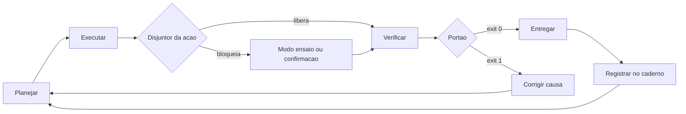

# Capítulo 6: Peça 2 — Harness: o ciclo de vida e os disjuntores

## 1. Introdução

No Capítulo 5 você montou a mesa de trabalho: o que a IA lê antes de agir. Falta o que transforma leitura em garantia — o ciclo de vida do trabalho e as proteções que impedem que um dia ruim vire um projeto perdido.

Ao final deste capítulo você terá instalado a Peça 2 no seu projeto: um ciclo de quatro passos com verificação separada da execução, portões que devolvem aprovado ou bloqueado e um quadro de disjuntores que desarma antes do dano. É a peça que faz a frase "está pronto" significar alguma coisa.

## 2. Explica

### 2.1 O ciclo de quatro passos

Todo trabalho produtivo na bancada percorre quatro passos: **planejar** o que será feito e qual é o critério de pronto, **executar** a tarefa, **verificar** contra o critério e **entregar** o resultado aprovado. Nenhum passo é opcional, e a ordem não admite atalho.

O ponto crítico é a separação entre executar e verificar. Quando as duas coisas ficam com a mesma voz, o resultado passa sempre — não porque funciona, mas porque quem executa é quem julga. A prática de entrega contínua resolveu isso separando o processo de construção do processo de aprovação, com critério automatizado no meio [1]. A mesma disciplina aparece nos relatórios de desempenho de entrega como um dos fatores que distinguem times que melhoram com IA daqueles que apenas produzem mais rápido [2].

Existe um limite de tamanho em cada ciclo. Ciclo que dura uma semana não permite aprender; ciclo que dura cinco minutos não permite entregar nada com valor. O ponto de equilíbrio é o ciclo que fecha em uma sessão de trabalho, com resultado inteiro. Note que esse recorte é o mesmo que separa delegar tarefa de delegar responsabilidade: o ciclo existe para que a responsabilidade permaneça com quem planeja [3].

Há também um efeito de ambiente no comprimento do ciclo. Times com processo definido tendem a encurtar o ciclo com apoio de IA, enquanto times sem processo alongam o ciclo na tentativa de compensar retrabalho — o mesmo padrão que distingue amplificação de ruído nos relatórios de entrega [2]. Uma revisão comparativa entre agentes de programação reforça o ponto: o desenho do ciclo pesa mais no resultado do que a escolha da ferramenta [4].

### 2.2 Portões binários: aprovado ou bloqueado

Portão de qualidade é uma verificação que devolve exatamente duas respostas possíveis: passou ou não passou. No terminal, isso se materializa no código de saída dos comandos — zero significa aprovado, qualquer outro valor significa bloqueio. É um detalhe técnico com consequência organizacional: sem a distinção binária, abre-se espaço para o "quase aprovado", que é onde mora a maior parte da dívida técnica.

Escolher o que vira portão é decisão de negócio, não de gosto. O critério útil é priorizar o que protege regra cara de violar: o dado que não pode ser perdido, o cálculo que não pode sair errado, a restrição legal que não pode ser ignorada. Cada portão tem custo de manutenção; portão que ninguém entende é desativado na primeira pressa. O mesmo raciocínio vale para o harness como um todo: ele é o programa que executa, e por isso precisa de escopo declarado — o que ele pode tocar e o que está fora do alcance dele [5].

Uma armadilha cresce junto com o sucesso dos portões: quando a métrica passa a ser o objetivo, ela deixa de medir o que importava. É o que se observou em avaliações padronizadas de agentes de programação, em que a taxa de acerto nas tarefas públicas chegou à saturação perto de **93,9%** enquanto outros conjuntos de teste mostravam resultados muito menores [6]. Portão bom mede o que protege; portão ruim mede o que é fácil de medir.

### 2.3 Disjuntores da bancada

Um disjuntor é a proteção que corta antes do dano. Ele não impede o trabalho: impede o trabalho errado na hora errada. Todo disjuntor da bancada responde a três perguntas: qual ação ele barra, o que acontece quando dispara e como o trabalho continua depois.

Três ações sempre merecem disjuntor. **Escrita fora do lugar:** a automação deve escrever apenas na pasta de estado, nunca no dado de origem. **Operação irreversível:** apagar, sobrescrever e publicar em produção exigem confirmação explícita ou modo de ensaio. **Comando com efeito externo:** integrações que enviam e-mail, criam cobrança ou alteram cadastro de terceiros precisam de etapa de confirmação.

A proteção funciona melhor quando é física, não quando é pedido educado. Permissão de escrita restrita, diretório descartável e cópia antes da mudança protegem mesmo quando o executor ignora a instrução. A prática de isolamento em diretórios de trabalho separados existe justamente para isso: cada frente mexe no seu espaço, sem sobrescrever a do vizinho [7] [8]. O histórico do repositório é o segundo cinto de segurança: ele permite reconstruir o estado anterior quando a cópia não existir [9].

### 2.4 O que fazer quando o portão dispara

Um portão que dispara sem plano de retomada é frustração. O ciclo precisa prever o caminho de volta: o bloqueio aponta o defeito, o defeito vira item de correção e a correção segue o mesmo caminho de verificação. Sem essa volta, o time aprende a desativar o portão. A engenharia de qualidade moderna trata essa volta como parte do processo de verificação, e não como trabalho extra: cada execução deixa registro do que passou e do que foi corrigido [10].

Aqui vale uma distinção que separa bancada de teimosia: bloqueio por defeito (o artefato não atende ao critério) pede correção; bloqueio por critério mal desenhado (o portão exige algo que não protege nada) pede revisão do portão. Confundir os dois produz caldo de cultura para o pior comportamento possível — desligar a verificação em vez de consertar a causa [11].

## 3. Ilustra

Em uma oficina elétrica, o quadro de disjuntores não fica escondido: fica na entrada, com etiqueta em cada circuito. Quando a furadeira da bancada três faz curto, o disjuntor daquele circuito abre em milissegundos e o resto da oficina continua funcionando. Ninguém precisa lembrar de nada, ninguém precisa ser rápido: a proteção é física e automática.

Duas lições do quadro elétrico valem para a bancada de software. A primeira: quanto mais específico o circuito, melhor o isolamento — se um disjuntor único governasse a oficina inteira, o curtinho de uma furadeira paralisaria tudo. A segunda: disjuntor não substitui a manutenção; ele garante que o erro não escale enquanto a causa é investigada.

Repare também na diferença entre disjuntor e portão, que costumam ser confundidos. O portão decide se o trabalho **sai** da bancada. O disjuntor decide se a energia **entra** em certo circuito. Um opera na saída, o outro na entrada — e a bancada precisa dos dois.



*Figura 6.1 — Ciclo de quatro passos com as duas proteções no lugar: disjuntor antes de agir, portão antes de entregar, correção sempre voltando pelo planejamento.*

Como Engenheiro de Bancada, você vai perceber que o tempo gasto desenhando portões é menor do que o tempo gasto explicando por que o relatório saiu errado de novo.

## 4. Técnica

### 4.1 O manifesto de portões

O primeiro artefato é um arquivo que declara quais verificações existem, o que cada uma protege e qual é a consequência do bloqueio. Portão sem manifesto é portão que ninguém sabe explicar.

```yaml
# portoes.yaml — declaracao dos portoes do projeto
portoes:
  - nome: entrada_conforme
    comando: python verificacoes/conferir_entrada.py dados/entrada/pedidos.csv
    protege: nenhuma linha invalida entra no banco
    consequencia: lote nao e importado
  - nome: totais_conferem
    comando: python verificacoes/conferir_totais.py
    protege: soma do resumo igual a soma do arquivo
    consequencia: relatorio nao e publicado
  - nome: sem_duplicidade
    comando: python verificacoes/conferir_duplicidade.py
    protege: pedido repetido nao e contado duas vezes
    consequencia: lote entra em pendencias
  - nome: reversibilidade
    comando: python verificacoes/conferir_copia.py dados/estado
    protege: existe copia antes de sobrescrever
    consequencia: escrita bloqueada
```

### 4.2 O executor de portões

Este é o harness em forma mínima: ele roda todas as verificações declaradas, para no primeiro bloqueio e devolve o código de saída correto. Simples, determinístico e independente de modelo.

```python
#!/usr/bin/env python3
"""Harness minimo: roda os portoes declarados e devolve aprovado ou bloqueado."""
import json
import runpy
import tempfile
from pathlib import Path


def ler_portoes(texto):
    portoes, atual = [], None
    for linha in texto.splitlines():
        if linha.strip().startswith("- nome:"):
            atual = {"nome": linha.split(":", 1)[1].strip()}
            portoes.append(atual)
            continue
        if atual is None:
            continue
        for campo in ("comando", "protege", "consequencia"):
            if linha.strip().startswith(f"{campo}:"):
                atual[campo] = linha.split(":", 1)[1].strip()
    return portoes


def rodar(caminho):
    """Executa o verificador como programa e captura o codigo de saida."""
    try:
        runpy.run_path(str(caminho), run_name="__portao__")
        return 0
    except SystemExit as saida:
        return int(saida.code or 0)


def executar(portoes, base):
    relatorio = []
    for portao in portoes:
        codigo = rodar(base / portao["comando"])
        aprovado = codigo == 0
        relatorio.append({"portao": portao["nome"], "aprovado": aprovado,
                          "protege": portao.get("protege", "")})
        estado = "APROVADO" if aprovado else "BLOQUEADO"
        print(f"[{estado}] {portao['nome']} — protege: {portao.get('protege', 'sem descricao')}")
        if not aprovado:
            print(f"  consequencia: {portao.get('consequencia', 'entrega bloqueada')}")
            return 1, relatorio
    return 0, relatorio


def main():
    with tempfile.TemporaryDirectory(prefix="bancada_") as pasta:
        base = Path(pasta)
        (base / "conferir_entrada.py").write_text("import sys\nsys.exit(0)\n", encoding="utf-8")
        (base / "conferir_totais.py").write_text("import sys\nsys.exit(1)\n", encoding="utf-8")
        manifesto = (
            "portoes:\n"
            "  - nome: entrada_conforme\n"
            "    comando: conferir_entrada.py\n"
            "    protege: nenhuma linha invalida entra no banco\n"
            "    consequencia: lote nao e importado\n"
            "  - nome: totais_conferem\n"
            "    comando: conferir_totais.py\n"
            "    protege: soma do resumo igual a soma do arquivo\n"
            "    consequencia: relatorio nao e publicado\n"
        )
        codigo, relatorio = executar(ler_portoes(manifesto), base)
        destino = base / "portoes.json"
        destino.write_text(json.dumps(relatorio, ensure_ascii=False, indent=2), encoding="utf-8")
        print(f"[DEMO] codigo de saida do harness: {codigo}")
    return 0


if __name__ == "__main__":
    main()
```

Três decisões fazem esse harness valer a pena. Ele para no primeiro bloqueio, porque rodar tudo depois de uma falha grave desperdiça tempo. Ele grava o resultado, porque registro de execução é o que permite ao Capítulo 14 provar o que foi verificado. E ele nunca trata modelo como fonte de decisão: portão é código.

### 4.3 O disjuntor de escrita

O disjuntor mais importante do projeto é o que impede a automação de escrever no dado de origem. Este script confere permissões de caminho antes de qualquer operação de escrita e recusa destinos fora da pasta de estado.

```python
#!/usr/bin/env python3
"""Disjuntor de escrita: recusa qualquer gravacao fora da pasta de estado."""
import sys
from pathlib import Path

PERMITIDO = Path("dados/estado").resolve()
PROIBIDO = Path("dados/entrada").resolve()


def autorizar(destino):
    caminho = Path(destino)
    try:
        alvo = caminho.resolve()
    except OSError:
        return False, "caminho invalido"
    if alvo == PROIBIDO or PROIBIDO in alvo.parents:
        return False, "escrita bloqueada: pasta de entrada e somente leitura"
    if alvo != PERMITIDO and PERMITIDO not in alvo.parents:
        return False, "escrita bloqueada: destino fora da pasta de estado"
    return True, "autorizado"


def main():
    destinos = [Path("dados/entrada/pedidos.csv"), Path("dados/estado/resumo.json"),
                Path("dados/estado/backups/resumo-ontem.json"), Path("relatorio-final.pdf")]
    bloqueados = 0
    for destino in destinos:
        ok, motivo = autorizar(destino)
        marca = "AUTORIZADO" if ok else "BLOQUEADO"
        print(f"[{marca}] {destino} — {motivo}")
        bloqueados += 0 if ok else 1
    if bloqueados:
        print(f"[INFO] {bloqueados} destino(s) recusados antes de qualquer escrita")
    return 0


if __name__ == "__main__":
    sys.exit(main())
```

O valor desse disjuntor aparece no dia em que uma execução der errado: em vez de perder o arquivo original, você perde trinta segundos.

### 4.4 Qual ação vira disjuntor

A tabela abaixo ajuda a decidir onde colocar proteção. Ela é curta de propósito: disjuntor demais engessa, disjuntor de menos expõe.

| Ação | Vira disjuntor? | Forma da proteção |
|---|---|---|
| Ler arquivo da pasta de entrada | Não | Nenhuma: leitura é sempre segura |
| Escrever na pasta de estado | Não | Permitido por padrão |
| Escrever na pasta de entrada | Sim | Bloqueio por caminho |
| Apagar arquivo de dados | Sim | Cópia obrigatória antes |
| Publicar relatório para o time | Sim | Confirmação explícita |
| Enviar e-mail ou mensagem externa | Sim | Modo de ensaio na primeira execução |
| Alterar cadastro de terceiro | Sim | Dupla confirmação e registro |
| Rodar verificação de leitura | Não | Nenhuma: verificação não altera estado |

### 4.5 Quando o portão vira teatro

Um portão deixa de ser útil quando passa a medir o que é fácil em vez do que importa. Dois sintomas denunciam isso. O primeiro é portão que aprova sempre: ele pode estar certo ou pode estar mal desenhado. O segundo é portão que ninguém sabe explicar em uma frase — se a explicação não cabe no manifesto, o portão perde a função.

O caso extremo está documentado: quando a métrica de avaliação se torna o objetivo, o comportamento passa a ser otimizar a métrica, e não resolver a tarefa [12] [13]. Estudo dedicado a agentes de horizonte longo mede exatamente esse desvio e mostra que ele não desaparece espontaneamente com mais capacidade do modelo [14]. E benchmarks públicos saturados ajudam a esconder o problema, porque indicam desempenho alto onde o desempenho real é menor [15]. A defesa é simples: para cada portão, exija um caso de teste que **deve** falhar. Se nenhum caso real reprova, o portão está medindo a coisa errada.

## 5. Aplica

**Situação.** É sexta-feira e o relatório semanal precisa sair. Você tem pressa e decide disparar o agente para "ajustar rapidinho" o script de importação, que já está escrevendo na pasta de dados. Não roda a verificação porque ela demora quarenta segundos e o horário aperta.

**O erro.** O agente interpreta "ajustar" como reorganizar, muda o nome da coluna de valor no arquivo de saída e, no teste, roda o importador duas vezes para conferir. Resultado: o arquivo do dia foi importado duas vezes, o relatório saiu com o dobro do valor, e a cópia do arquivo original foi sobrescrita por uma versão já processada.

**O diagnóstico.** Não faltou cuidado: faltaram disjuntor e portão. O disjuntor de escrita teria bloqueado a gravação na pasta de origem, e o portão de duplicidade teria reprovado a segunda importação. Sem eles, o sistema aceita qualquer instrução ambígua como requisito e não tem como perceber o próprio erro [16]. A pressa só revelou um projeto sem proteção física.

**A correção.** Instale as três peças na ordem: manifesto de portões, executor e disjuntor de escrita. Depois refaça o teste com o mesmo comando de antes, agora com bloqueio ativo. Na execução seguinte, a segunda importação é recusada e o relatório sai correto — e o que salvou o dia foi um arquivo de configuração, não disciplina heroica.

**Métricas de sucesso.** A Peça 2 tem indicadores objetivos; meça estes quatro:

| Métrica | Como medir | Sinal de que funcionou |
|---|---|---|
| Portões com manifesto completo | Conferência do arquivo de portões | Todos com o que protegem e consequência |
| Execuções bloqueadas e corrigidas | Registro em `dados/estado/portoes.json` | Bloqueios acontecem e são seguidos de correção |
| Tempo médio de correção | Do bloqueio até o portão verde | Menor que o tempo de descobrir o erro depois |
| Casos de teste que devem falhar | Um por portão, no repositório | Cada portão tem prova de que reprova |

**Nota de contexto.** Vale lembrar de onde vem a urgência de ter portão. Código gerado sem verificação já chegou ao repositório com vulnerabilidades conhecidas em parcela relevante das amostras, e a dívida de segurança correspondente cresce sem alarde [17]. Parte desse material vem de prática insegura replicada sem intenção [18], e parte de dependência que não existe [19]. O portão é a forma mais barata de impedir que isso entre no projeto.

**Armadilhas comuns.** A primeira é criar portão que nunca reprova: sem caso de falha, ele é enfeite e cria falsa segurança. A segunda é desativar o portão na primeira urgência — e não o reativar depois. A terceira é colocar verificação dentro do mesmo código que executa a ação, o que reintroduz o problema de quem executa ser quem julga. A quarta é proteger por instrução escrita em vez de permissão física: pedido educado na documentação não barra escrita indevida.

**Até onde isso escala.** Portões em forma de script atendem bem uma pessoa e um repositório, e funcionam melhor quando o contexto que os alimenta é pequeno e estável, porque verificação que lê demais fica lenta e frágil [20]. quando o time cresce, o mesmo papel passa a ser exercido por pipeline de integração, com o mesmo princípio de bloqueio. O limite de custo é real: cada verificação executada em toda mudança consome tempo de todos, então portão lento e pouco crítico deve rodar em outra frequência — diária ou por entrega, e não a cada alteração. Também existe o limite de escopo: verificação automática cobre forma e regra conhecida; julgamento de negócio continua exigindo revisão humana com critério escrito [21].

### 5.1 Os três disjuntores mínimos

Um ciclo de vida sem disjuntor é um laço que só para quando alguém percebe. Três disjuntores cobrem a maior parte dos acidentes, e nenhum deles exige infraestrutura cara.

| Disjuntor | Quando dispara | O que faz |
|---|---|---|
| Limite de tentativas | Terceira falha no mesmo passo | Para e entrega o diagnóstico |
| Limite de escopo | Arquivo fora da lista declarada | Bloqueia a alteração |
| Limite de tempo | Janela máxima por tarefa | Encerra e registra o estado |

O primeiro evita o laço caro: o executor tentando a mesma coisa com pequenas variações enquanto o custo sobe. O segundo evita o dano silencioso: mudança em arquivo que ninguém pediu para tocar. O terceiro evita a tarefa que consome a tarde inteira e não deixa artefato.

**Como escolher o número.** O limite de tentativas se calibra pelo custo da verificação, não pelo valor do executor. Se cada tentativa exige uma conferência manual de dez minutos, três tentativas já custam meia hora e o disjuntor deveria disparar em duas [1]. O limite de tempo se calibra pela tarefa mais longa que costuma terminar bem, com folga de cinquenta por cento.

**Aplicação no sistema.** Escreva os três limites no arquivo de configuração do ciclo, junto com a ação esperada de cada um. Disjuntor que apenas registra aviso não é disjuntor: é log. A ação precisa ser sempre a mesma — parar, entregar o estado e deixar a decisão para quem pediu [11].

**Limite desta prática.** Disjuntor não substitui verificação. Ele corta o desperdício, não o erro: um passo errado que passa rápido também passa o disjuntor. Por isso o portão de qualidade continua obrigatório a cada passo que altera o artefato [14].

## 6. Conclusão

Você instalou o ciclo de quatro passos e separou quem executa de quem verifica. Escreveu o manifesto de portões, o executor que devolve aprovado ou bloqueado, e o disjuntor que impede escrita no dado de origem. Aprendeu que portão precisa de caso de teste que falhe, que disjuntor protege por permissão e não por pedido, e que métrica otimizada deixa de medir o que importava.

**Desafio.** Escreva o manifesto de portões do seu projeto com três verificações, rode o harness e provoque um bloqueio de propósito — apague uma coluna do arquivo de exemplo e veja o portão reprovar. Registre no caderno qual foi a consequência declarada.

No próximo capítulo, a Peça 3 — Motor: quem executa cada tarefa, como as respostas são contratadas em formato previsível e onde o custo da operação realmente aparece.

## 7. Referências Bibliográficas

[1] HUMBLE, Jez; FARLEY, David. *Continuous Delivery: Reliable Software Releases through Build, Test, and Deployment Automation*. Addison-Wesley, 2010. Disponível em: https://continuousdelivery.com/. Acesso em: 12 set. 2026.
[2] DORA / GOOGLE CLOUD. *State of AI-assisted Software Development 2025*. Disponível em: https://dora.dev/dora-report-2025/. Acesso em: 12 set. 2026.
[3] ALI, Mohamad Abou; DORNAIKA, Fadi; CHARAFEDDINE, Jinan. *Agentic AI: a comprehensive survey of architectures, applications, and future directions*. In: Artificial Intelligence Review. 2025. Disponível em: https://doi.org/10.1007/s10462-025-11422-4. Acesso em: 12 set. 2026.
[4] BELLAPUKONDA, Jahnavi. *A Comparative Evaluation of LLM-based Coding Agents for Automated Software Development Tasks*. 2026. Disponível em: https://doi.org/10.2139/ssrn.6755658. Acesso em: 12 set. 2026.
[5] ANTHROPIC. *Model Context Protocol Specification (2025-06-18)*. Disponível em: https://modelcontextprotocol.io/specification/2025-06-18. Acesso em: 12 set. 2026.
[6] SWE-BENCH. *SWE-bench Verified Leaderboard*. Disponível em: https://www.swebench.com/verified.html. Acesso em: 12 set. 2026.
[7] GIT. *git-worktree Documentation*. Disponível em: https://git-scm.com/docs/git-worktree. Acesso em: 12 set. 2026.
[8] ANTHROPIC. *Run parallel sessions with worktrees — Claude Code Docs*. Disponível em: https://code.claude.com/docs/en/worktrees. Acesso em: 12 set. 2026.
[9] CHACON, Scott; STRAUB, Ben. *Pro Git: Everything you need to know about Git*. 2. ed. Apress, 2014. Disponível em: https://git-scm.com/book/en/v2. Acesso em: 12 set. 2026.
[10] RAKSHIT, Yerram Sai. *Modernizing Software Testing: AI, Telemetry, and Agentic Quality Engineering*. In: International Journal of AI Engineering. 2026. Disponível em: https://doi.org/10.34218/ijaieg_01_01_002. Acesso em: 12 set. 2026.
[11] NYGARD, Michael T. *Release It!: Design and Deploy Production-Ready Software*. 2. ed. Pragmatic Bookshelf, 2018. Disponível em: https://pragprog.com/titles/mnee2/release-it-second-edition/. Acesso em: 12 set. 2026.
[12] METR. *Recent Frontier Models Are Reward Hacking*. Disponível em: https://metr.org/blog/2025-06-05-recent-reward-hacking/. Acesso em: 12 set. 2026.
[13] MORAMPUDI, Abhishek et al. *A survey of reward hacking in agentic large language model systems*. In: Discover Artificial Intelligence. 2026. Disponível em: https://link.springer.com/article/10.1007/s44163-026-01980-z. Acesso em: 12 set. 2026.
[14] *Measuring Reward Hacking in Long-Horizon Coding Agents*. In: arXiv. 2026. Disponível em: https://arxiv.org/html/2605.21384v1. Acesso em: 12 set. 2026.
[15] SCALE LABS. *SWE-Bench Pro (Public Dataset) — Leaderboard*. Disponível em: https://labs.scale.com/leaderboard/swe_bench_pro_public. Acesso em: 12 set. 2026.
[16] VERACODE. *2025 GenAI Code Security Report: AI-Generated Code Security Risks*. Disponível em: https://www.veracode.com/blog/ai-generated-code-security-risks/. Acesso em: 12 set. 2026.
[17] CLOUD SECURITY ALLIANCE. *Vibe Coding's Security Debt: The AI-Generated CVE Surge*. Disponível em: https://labs.cloudsecurityalliance.org/research/csa-research-note-ai-generated-code-vulnerability-surge-2026/. Acesso em: 12 set. 2026.
[18] ENDOR LABS. *The Most Common Security Vulnerabilities in AI-Generated Code*. Disponível em: https://www.endorlabs.com/learn/the-most-common-security-vulnerabilities-in-ai-generated-code. Acesso em: 12 set. 2026.
[19] TRAXTECH. *20% of AI-Generated Code Dependencies Don't Exist, Creating Supply Chain Security Risks*. Disponível em: https://www.traxtech.com/blog/20-of-ai-generated-code-dependencies-dont-exist-creating-supply-chain-security-risks. Acesso em: 12 set. 2026.
[20] MEI, Lingrui et al. *A Survey of Context Engineering for Large Language Models*. In: arXiv. 2025. Disponível em: https://arxiv.org/abs/2507.13334. Acesso em: 12 set. 2026.
[21] NATIONAL INSTITUTE OF STANDARDS AND TECHNOLOGY. *Artificial Intelligence Risk Management Framework: Generative Artificial Intelligence Profile (NIST AI 600-1)*. Disponível em: https://nvlpubs.nist.gov/nistpubs/ai/NIST.AI.600-1.pdf. Acesso em: 12 set. 2026.
