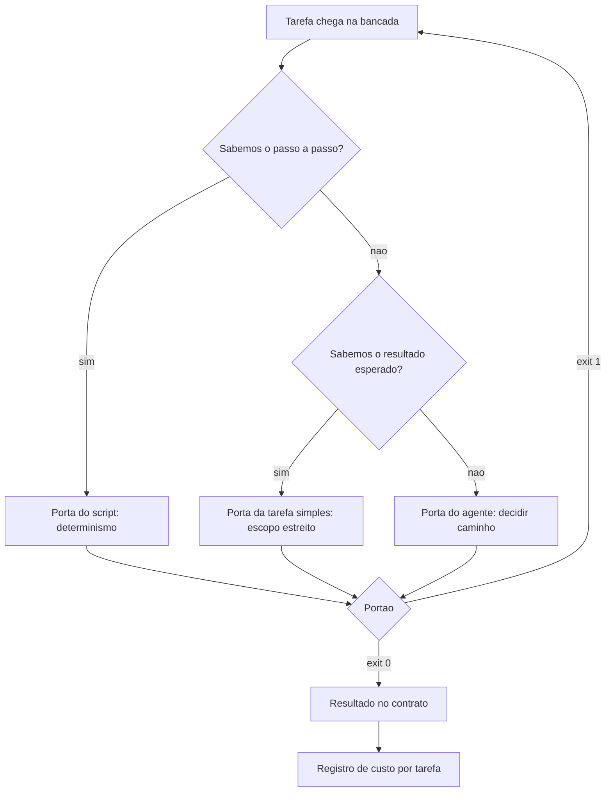

# Capítulo 7: Peça 3 — Motor: roteamento, contratos e custo

## 1. Introdução

No Capítulo 6 você instalou o ciclo de quatro passos, os portões binários e os disjuntores. Com eles, o trabalho já não passa sem verificação — mas ainda não há critério para decidir **quem** executa cada tarefa. É comum ver o mesmo recurso caro sendo acionado para somar uma coluna inteira e para decidir um caso ambíguo de negócio.

Ao final deste capítulo você terá uma tabela de decisão de roteamento, um contrato de resposta validável e um medidor de custo por tarefa. É a peça que faz o projeto ficar sustentável: sem ela, o ganho de tempo da Peça 2 é consumido pela conta do mês.

## 2. Explica

### 2.1 Três portas, um critério

A primeira decisão de roteamento é escolher entre três portas. A **porta do script** atende tarefa determinística: mesma entrada, mesma saída, resposta que pode ser calculada. A **porta da tarefa simples** atende trabalho que envolve linguagem, mas com escopo estreito e critério claro — resumir, classificar, reformatar. A **porta do agente** atende trabalho que exige decidir o caminho: investigar, comparar, propor correção.

O critério para escolher não é o tamanho da tarefa, e sim a **certeza do resultado**. Se você consegue escrever o passo a passo completo, o script resolve e o custo é quase zero. Se você consegue descrever o resultado, mas não o caminho, é tarefa simples. Se nem o caminho nem o resultado são óbvios antes de começar, é caso de agente — e aí a verificação importa mais do que em qualquer outro caso.

Uma consequência prática desse critério: o roteamento reduz custo porque reduz incerteza tratada por modelo. Estudos comparativos entre agentes de programação mostram variação relevante de resultado entre ferramentas, mas mostram também que boa parte da diferença vem do escopo da tarefa entregue a cada uma [1]. Tarefa bem recortada resolve mais do que modelo maior. Delegar execução sem recortar escopo é o modo de falha que a literatura de agentes descreve como confundir delegação de tarefa com delegação de responsabilidade [2].

### 2.2 Contratos de resposta

Sempre que um resultado vai ser consumido por outro programa, ele precisa chegar em formato fixo. Resposta em texto livre parece conveniente e custa caro: cada consumidor precisa interpretar a prosa para descobrir o valor, e interpretação divergente é defeito silencioso.

O contrato de resposta resolve isso declarando os campos, os tipos e o que fazer quando algo falta. Um ponto que merece atenção é o comportamento na ausência: contrato que aceita campo vazio sem declarar pendência transforma lacuna em dado legítimo. E vale lembrar que a forma de pedir altera a chance de obter o formato desejado — restrição explícita funciona melhor que recomendação [3].

Contrato também protege contra um modo de falha conhecido: a resposta plausível e falsa. Quando o formato é verificado, valores inventados aparecem na forma esperada e reprovam na regra de negócio, o que é bem melhor do que aparecerem disfarçados de prosa [4]. Vale o mesmo cuidado com dependência citada de memória: parte das bibliotecas referenciadas por código gerado simplesmente não existe, e o contrato de saída é o lugar onde isso aparece cedo [5].

### 2.3 Onde o custo realmente aparece

A conta da operação tem quatro componentes. O primeiro é o **volume de entrada**: quanto de contexto cada execução carrega. O segundo é o **volume de saída**, que em muitas ferramentas custa mais por unidade que a entrada. O terceiro é o **retrabalho**, que multiplica os dois primeiros a cada tentativa. O quarto é a **manutenção da estrutura**, que cresce com o número de verificações e integrações.

A conclusão não é óbvia: em projeto pequeno, o maior custo costuma ser retrabalho, não token. A lógica é a mesma que sustenta a entrega contínua: cada iteração extra tem custo de verificação, de contexto e de atenção, e é por isso que reduzir a taxa de erro vale mais do que baratear a execução [6]. Em times com processo definido, essa redução aparece como ganho real; em times sem processo, o retrabalho consome o ganho antes que ele chegue ao resultado [7]. Você economiza mais reduzindo a taxa de erro do que escolhendo o modelo mais barato — porque cada tentativa extra com o modelo mais barato pode custar mais que uma execução certeira com o modelo adequado. O reaproveitamento de prefixo estável ajuda no volume de entrada [8], e a mesma lógica vale para outras plataformas [9].

Existe ainda o custo de medir errado. Quando a métrica de avaliação é confundida com o objetivo, o resultado é otimizar o número. Avaliações públicas de programação chegaram a patamares altos e depois mostraram **17,8%** de resolução no mesmo tipo de tarefa quando o conjunto de teste mudou [10]. Ou seja: número bonito não é o mesmo que capacidade real, e a diferença tem preço [11]. Existe ainda o risco de o próprio agente aprender a agradar a métrica em vez de resolver o problema, comportamento já documentado em agentes de código de horizonte longo [12] [13].

### 2.4 O custo escondido do contexto acumulado

Há um gasto que quase ninguém mede: o contexto que se acumula entre execuções sem necessidade. Cada execução que carrega o histórico inteiro paga por informação que já não influencia a decisão, e ainda sofre a perda de foco no meio do material longo [14]. O resultado é pagar mais para receber resposta pior.

A correção é arquitetural: contexto canônico curto, tarefa do dia no fim e gaveta sob demanda. A revisão de engenharia de contexto descreve isso como gestão de recurso finito, e não como soma de documentos [15]. Vale lembrar do motivo informacional: canal com ruído exige reconstrução, e reconstrução é suposição paga a cada execução [16].

## 3. Ilustra

Pense em um balcão de atendimento com três guichês. No guichê um, o atendimento é por formulário: você preenche, ele carimba, e não há conversa. No guichê dois, o atendente consulta uma tabela e resolve em uma resposta. No guichê três, senta o especialista que analisa o caso, pergunta se faltar informação e propõe uma solução.

O erro clássico do usuário iniciante é levar todo mundo ao guichê três — inclusive quem só queria carimbo. O guichê três é mais caro por hora, tem fila e, ironicamente, erra mais em tarefa trivial, porque procura complexidade onde não existe. O roteador de serviço existe justamente para impedir esse desperdício: ele olha o pedido e encaminha para a porta certa.

Repare em dois detalhes da analogia. O primeiro é que o formulário do guichê um é um contrato: campos fixos, sem espaço para interpretação. O segundo é que o roteador não julga o pedido — ele apenas reconhece o tipo. Julgamento é do guichê três, e somente quando o caso é realmente ambíguo.



*Figura 7.1 — O roteador de serviço da bancada: a porta é escolhida pela certeza do resultado, não pelo tamanho da tarefa, e todo caminho termina em verificação.*

Como Engenheiro de Bancada, você vai notar que o roteamento é a peça que mais reduz custo sem tocar em uma linha de código de negócio.

## 4. Técnica

### 4.1 A tabela de decisão de roteamento

A tabela de decisão vive em arquivo e serve para duas coisas: orientar a escolha no dia e permitir revisão posterior. Note que cada linha declara o critério de pronto correspondente, porque roteamento sem prova é opinião.

```yaml
# roteamento.yaml — tabela de decisao da bancada
portas:
  - porta: script
    quando: o passo a passo completo pode ser escrito e testado
    recurso: codigo do projeto
    custo_relativo: zero
    prova: mesmo resultado em duas execucoes seguidas
  - porta: tarefa_simples
    quando: o resultado e conhecido, mas envolve linguagem
    recurso: modelo leve com contexto curto
    custo_relativo: baixo
    prova: resposta no formato do contrato, conferida por regra
  - porta: agente
    quando: nem o caminho nem o resultado sao obvios antes de comecar
    recurso: modelo com ferramentas e contexto maior
    custo_relativo: alto
    prova: portao especifico da tarefa mais revisao humana do resultado
excecoes:
  - quando: a tarefa envolve dado pessoal ou decisao com efeito sobre pessoas
    regra: revisao humana registrada antes da entrega
```

### 4.2 O contrato de resposta e o validador

O contrato de resposta é um esquema simples. O validador confere se o que voltou tem os campos certos e reprova quando falta informação obrigatória.

```python
#!/usr/bin/env python3
"""Validador de contrato de resposta: aprovado ou bloqueado, sem meio-termo."""
import json
import sys

CAMPOS = {"identificador": str, "total": float, "forma_pagamento": str, "pendencias": list}


def validar(resposta):
    problemas = []
    for campo, tipo in CAMPOS.items():
        if campo not in resposta:
            problemas.append(f"campo ausente: {campo}")
            continue
        if not isinstance(resposta[campo], tipo):
            problemas.append(f"campo {campo} fora do tipo esperado ({tipo.__name__})")
    if isinstance(resposta.get("total"), float) and resposta["total"] < 0:
        problemas.append("total negativo em pedido de venda")
    return problemas


def main():
    respostas = [
        {"identificador": "8842", "total": 132.90, "forma_pagamento": "pix", "pendencias": []},
        {"identificador": "8844", "total": -99.0, "forma_pagamento": "boleto", "pendencias": []},
        {"identificador": "8845", "forma_pagamento": "cartao", "pendencias": ["sem valor"]},
    ]
    reprovadas = 0
    for indice, resposta in enumerate(respostas, start=1):
        problemas = validar(resposta)
        estado = "APROVADO" if not problemas else "BLOQUEADO"
        print(f"[{estado}] resposta {indice}")
        for problema in problemas:
            print(f"  - {problema}")
        reprovadas += 1 if problemas else 0
    print(f"[INFO] {reprovadas} de {len(respostas)} respostas reprovadas pelo contrato")
    return 0


if __name__ == "__main__":
    sys.exit(main())
```

Repare no formato da saída: nenhuma resposta fica em estado intermediário. A que tem total negativo é reprovada pela regra de negócio, não pelo tipo — sinal de que contrato de forma e regra de negócio trabalham em camadas diferentes, exatamente como a separação entre regra de negócio e mecanismo de entrega recomenda [17].

### 4.3 O roteador em código

O roteador pode ser tão simples quanto uma função que decide a porta e outra que executa. O exemplo abaixo resolve a parte determinística sem acionar nenhum modelo: é o caso mais frequente em um projeto real.

```python
#!/usr/bin/env python3
"""Roteador minimo: decide a porta e executa a parte deterministica."""
import json
from pathlib import Path

LIMITE_PENDENCIAS = 20


def decidir(tarefa):
    if tarefa.get("passo_a_passo_conhecido"):
        return "script"
    if tarefa.get("resultado_conhecido"):
        return "tarefa_simples"
    return "agente"


def executar_script(tarefa):
    linhas = tarefa.get("linhas", [])
    total = sum(linha["valor"] for linha in linhas)
    pendencias = [linha["identificador"] for linha in linhas if linha["valor"] < 0]
    return {
        "identificador": tarefa["nome"],
        "total": round(total, 2),
        "forma_pagamento": "consolidado",
        "pendencias": pendencias,
        "porta": "script",
    }


def rotear(tarefas):
    resultados = []
    for tarefa in tarefas:
        porta = decidir(tarefa)
        if porta == "script":
            resultados.append(executar_script(tarefa))
        else:
            resultados.append({"identificador": tarefa["nome"], "porta": porta,
                               "pendencias": ["enviado para processamento com apoio de modelo"]})
    return resultados


def main():
    tarefas = [
        {"nome": "fechamento-manha", "passo_a_passo_conhecido": True, "linhas": [
            {"identificador": "8842", "valor": 132.90},
            {"identificador": "8844", "valor": -99.00},
        ]},
        {"nome": "duvida-cliente", "passo_a_passo_conhecido": False, "resultado_conhecido": False},
    ]
    resultados = rotear(tarefas)
    Path("dados/estado/roteamento.json").parent.mkdir(parents=True, exist_ok=True)
    Path("dados/estado/roteamento.json").write_text(
        json.dumps(resultados, ensure_ascii=False, indent=2), encoding="utf-8")
    for resultado in resultados:
        print(f"[PORTA {resultado['porta'].upper()}] {resultado['identificador']} "
              f"— pendencias: {len(resultado['pendencias'])}")


if __name__ == "__main__":
    main()
```

A parte que importa não é o código, é a proporção: em um projeto maduro, a porta do script atende a maior parte do volume, e a porta do agente fica reservada para o que realmente exige julgamento. Quando duas tarefas precisam negociar entre si — repartir trabalho, trocar resultado parcial —, o roteamento deixa de ser escolha local e vira protocolo de comunicação entre agentes, com formato de mensagem definido [18].

### 4.4 O medidor de custo por tarefa

Custo sem medição é conversa. Este medidor transforma registros de execução em custo por tarefa, o que permite comparar rotas e descobrir onde o dinheiro está indo.

```python
#!/usr/bin/env python3
"""Medidor de custo: custo por tarefa, por porta de roteamento."""
import json
from pathlib import Path

REGISTRO = Path("dados/estado/execucoes.json")
PRECO_ENTRADA = 3.00
PRECO_SAIDA = 15.00


def custo(execucao, preco_entrada=PRECO_ENTRADA, preco_saida=PRECO_SAIDA):
    milhares_entrada = execucao["tokens_entrada"] / 1_000_000
    milhares_saida = execucao["tokens_saida"] / 1_000_000
    return round(milhares_entrada * preco_entrada + milhares_saida * preco_saida, 6)


def resumo(execucoes):
    por_porta = {}
    for execucao in execucoes:
        porta = execucao["porta"]
        acumulado = por_porta.setdefault(porta, {"tarefas": 0, "tokens": 0, "custo": 0.0})
        acumulado["tarefas"] += 1
        acumulado["tokens"] += execucao["tokens_entrada"] + execucao["tokens_saida"]
        acumulado["custo"] = round(acumulado["custo"] + custo(execucao), 6)
    for porta, dados in por_porta.items():
        dados["custo_medio"] = round(dados["custo"] / dados["tarefas"], 6)
    return por_porta


def main():
    execucoes = [
        {"porta": "script", "tokens_entrada": 0, "tokens_saida": 0},
        {"porta": "tarefa_simples", "tokens_entrada": 1200, "tokens_saida": 300},
        {"porta": "agente", "tokens_entrada": 45000, "tokens_saida": 8000},
        {"porta": "tarefa_simples", "tokens_entrada": 900, "tokens_saida": 240},
    ]
    painel = resumo(execucoes)
    REGISTRO.parent.mkdir(parents=True, exist_ok=True)
    REGISTRO.write_text(json.dumps(painel, ensure_ascii=False, indent=2), encoding="utf-8")
    print(json.dumps(painel, ensure_ascii=False, indent=2))


if __name__ == "__main__":
    main()
```

O uso desse painel é comparativo: você observa o custo médio por porta e verifica se tarefas triviais não estão caindo na porta cara — sintoma clássico de roteamento ausente. Recomenda-se registrar também o resultado de cada execução: sem esse rastro, o painel mostra gasto e não mostra causa [19].

### 4.5 Quando não usar agente

| Situação | Porta correta | Motivo |
|---|---|---|
| Somar coluna, contar linhas, validar formato | Script | Determinismo: resultado calculável |
| Consultar uma tabela fixa e responder | Script | Não há ambiguidade a resolver |
| Resumir um texto curto em formato fixo | Tarefa simples | Escopo estreito e resultado conhecido |
| Reformatar dados entre dois esquemas | Tarefa simples | Transformação com contrato declarado |
| Investigar divergência entre dois relatórios | Agente | Exige levantar hipótese e testar |
| Decidir o que fazer com pedido ambíguo | Agente com revisão humana | Efeito sobre pessoa e regra de negócio |

## 5. Aplica

**Situação.** Você recebe a tarefa de transformar os totais do dia em uma tabela de cinco linhas para colar no grupo do time. Cansado de fazer à mão, você abre uma sessão com o recurso mais capaz disponível, anexa o relatório inteiro, o contrato e o histórico do projeto, e pede o resumo.

**O erro.** A resposta vem com sete linhas, uma coluna a mais, o valor de ontem em uma célula e uma nota explicando a metodologia que ninguém pediu. Você ajusta o pedido, recebe outra variação. Depois de quatro tentativas, o custo acumulado daquela tabela de cinco linhas passou a ser maior do que o de todo o processamento determinístico da semana.

**O diagnóstico.** A tarefa é determinística: os cinco totais já existem no arquivo de saída. Não havia ambiguidade a resolver nem caminho a descobrir — portanto, nada que justificasse a porta cara. O custo não veio do preço do recurso, veio da porta errada somada ao retrabalho de quatro tentativas [20]. Somando a isso o contexto acumulado sem necessidade, a mesma execução pagou duas vezes pela informação inútil [14].

**A correção.** Registre a regra de roteamento no arquivo do projeto: todo resumo cujo conteúdo existe em dado estruturado é tarefa da porta do script. O comando passa a ser um script curto que lê o JSON de saída e imprime a tabela. O recurso caro fica reservado para o caso do pedido ambíguo, que realmente precisa de julgamento — e ali o resultado passa por revisão antes de sair [21].

**Métricas de sucesso.** Roteamento se avalia com quatro números:

| Métrica | Como medir | Sinal de que funcionou |
|---|---|---|
| Custo médio por porta | Painel do medidor de custo | Porta do script com custo zero dominando o volume |
| Tarefas na porta errada | Revisão semanal do registro | Poucas, com correção registrada no caderno |
| Respostas fora do contrato | Validador de resposta no portão | Todas conformes ou bloqueadas |
| Tentativas por tarefa | Contagem no caderno | Uma tentativa na maioria das tarefas determinísticas |

**Nota de contexto.** O roteamento não é luxo de projeto grande. A adoção de apoio de IA já é maioria entre desenvolvedores, e a maior parte dessa adoção aconteceu sem política definida pela organização [22] [23]. Sem critério de rota, o comportamento padrão é usar sempre o recurso mais visível, que costuma ser o mais caro. Trabalhos sobre integração de agentes a sistemas reais mostram que restringir o escopo de cada agente é o que torna a operação governável [24] [25].

**Armadilhas comuns.** A primeira é mandar tudo para a porta cara por hábito, o que transforma eficiência em despesa. A segunda é aceitar resposta em prosa para consumo por programa: o defeito aparece três camadas depois, onde é caro de achar. A terceira é escolher modelo pelo preço unitário mais baixo sem considerar a taxa de retrabalho, que é o custo dominante em projeto pequeno. A quarta é medir custo por mês em vez de por tarefa, o que impede descobrir qual rota está errada.

**Até onde isso escala.** A tabela de decisão em arquivo funciona bem em um projeto e em um time; o limite aparece quando a rota depende de contexto que o próprio executor deve avaliar caso a caso — aí a decisão precisa ser tomada por quem conhece o resultado esperado, e não pelo roteador [26]. quando há muitos fluxos, ela precisa de um índice por tipo de tarefa, senão vira documento consultado só em auditoria. O limite do roteamento determinístico é a própria natureza da tarefa: casos que exigem contexto novo a cada execução continuam na porta do agente, e forçá-los no script produz resultado errado com aparência de certo. Também existe o limite de preço: os números mudam a cada trimestre, o que significa que a decisão de rota precisa ser revisada por evidência, não uma vez para sempre [27].

### 5.1 A tabela de roteamento em cinco linhas

Roteamento não é escolher o modelo mais forte. É decidir, por tarefa, qual porta de entrada resolve com o menor custo total — e o custo total inclui o retrabalho.

| Tipo de tarefa | Porta de entrada | Critério que decide |
|---|---|---|
| Formatação e renomeação | Script determinístico | Não exige julgamento |
| Conferência de regra fixa | Portão automático | Regra cabe em teste |
| Resumo de material conhecido | Recusa e delega | Contexto já existe no acervo |
| Escrita e decisão ambígua | Rota de julgamento | Critério subjetivo |
| Investigação aberta | Rota de julgamento com busca | Falta informação |

A primeira linha é a mais importante e a mais ignorada. Toda tarefa determinística que roda na rota de julgamento paga duas vezes: o preço da chamada e o preço da revisão. Medir isso por tarefa, e não por mês, mostra qual porta está errada [1].

**Como usar a tabela.** Classifique as tarefas dos últimos três dias e marque as que caíram na porta errada. O ganho imediato costuma vir daí, sem trocar de fornecedor e sem mudar de ferramenta. Preço unitário menor não compensa rota errada, porque o componente caro é o retrabalho [8].

**Aplicação no sistema.** A tabela vira configuração: cada porta recebe uma regra de encaminhamento e um limite de custo por tarefa. A partir do capítulo 13, você mede se o roteamento está funcionando comparando custo e taxa de reprovação antes e depois, sempre no mesmo par — economia que derruba a taxa de acerto não é economia [6].

## 6. Conclusão

Você instalou a Peça 3: três portas de roteamento decididas pela certeza do resultado, contrato de resposta com validação automática e medição de custo por tarefa. Aprendeu que, em projeto pequeno, o custo dominante é retrabalho e não token; que contexto acumulado sem necessidade paga duas vezes; e que métrica bonita pode esconder capacidade menor. E viu a lista de situações em que usar agente é decisão errada.

**Desafio.** Classifique as dez tarefas mais frequentes do seu projeto nas três portas, escreva o contrato de resposta da que envolve formato fixo e rode o medidor de custo do último mês, mesmo que com dados aproximados. Depois compare o custo médio da porta do script com o da porta do agente.

No próximo capítulo, a Peça 4 — Ferramentas e persistência: as ações reexecutáveis, a conexão padronizada com o mundo externo e o registro durável que faz a operação continuar existindo amanhã.

## 7. Referências Bibliográficas

[1] BELLAPUKONDA, Jahnavi. *A Comparative Evaluation of LLM-based Coding Agents for Automated Software Development Tasks*. 2026. Disponível em: https://doi.org/10.2139/ssrn.6755658. Acesso em: 12 set. 2026.
[2] ALI, Mohamad Abou; DORNAIKA, Fadi; CHARAFEDDINE, Jinan. *Agentic AI: a comprehensive survey of architectures, applications, and future directions*. In: Artificial Intelligence Review. 2025. Disponível em: https://doi.org/10.1007/s10462-025-11422-4. Acesso em: 12 set. 2026.
[3] PEREIRA, Luciano. *Empirical Validation of Cognitive-Derived Coding Constraints and Tokenization Asymmetries in LLM-Assisted Software Engineering*. 2026. Disponível em: https://doi.org/10.2139/ssrn.6294900. Acesso em: 12 set. 2026.
[4] VERACODE. *2025 GenAI Code Security Report: AI-Generated Code Security Risks*. Disponível em: https://www.veracode.com/blog/ai-generated-code-security-risks/. Acesso em: 12 set. 2026.
[5] TRAXTECH. *20% of AI-Generated Code Dependencies Don't Exist, Creating Supply Chain Security Risks*. Disponível em: https://www.traxtech.com/blog/20-of-ai-generated-code-dependencies-dont-exist-creating-supply-chain-security-risks. Acesso em: 12 set. 2026.
[6] HUMBLE, Jez; FARLEY, David. *Continuous Delivery: Reliable Software Releases through Build, Test, and Deployment Automation*. Addison-Wesley, 2010. Disponível em: https://continuousdelivery.com/. Acesso em: 12 set. 2026.
[7] DORA / GOOGLE CLOUD. *State of AI-assisted Software Development 2025*. Disponível em: https://dora.dev/dora-report-2025/. Acesso em: 12 set. 2026.
[8] ANTHROPIC. *Prompt Caching — Claude Platform Docs*. Disponível em: https://platform.claude.com/docs/en/build-with-claude/prompt-caching. Acesso em: 12 set. 2026.
[9] AMAZON WEB SERVICES. *Prompt caching for faster model inference — Amazon Bedrock*. Disponível em: https://docs.aws.amazon.com/bedrock/latest/userguide/prompt-caching.html. Acesso em: 12 set. 2026.
[10] SCALE LABS. *SWE-Bench Pro (Public Dataset) — Leaderboard*. Disponível em: https://labs.scale.com/leaderboard/swe_bench_pro_public. Acesso em: 12 set. 2026.
[11] SWE-BENCH. *SWE-bench Leaderboards*. Disponível em: https://www.swebench.com/. Acesso em: 12 set. 2026.
[12] METR. *Recent Frontier Models Are Reward Hacking*. Disponível em: https://metr.org/blog/2025-06-05-recent-reward-hacking/. Acesso em: 12 set. 2026.
[13] MORAMPUDI, Abhishek et al. *A survey of reward hacking in agentic large language model systems*. In: Discover Artificial Intelligence. 2026. Disponível em: https://link.springer.com/article/10.1007/s44163-026-01980-z. Acesso em: 12 set. 2026.
[14] LIU, Nelson F. et al. *Lost in the Middle: How Language Models Use Long Contexts*. In: Transactions of the Association for Computational Linguistics. 2024. Disponível em: https://arxiv.org/abs/2307.03172. Acesso em: 12 set. 2026.
[15] MEI, Lingrui et al. *A Survey of Context Engineering for Large Language Models*. In: arXiv. 2025. Disponível em: https://arxiv.org/abs/2507.13334. Acesso em: 12 set. 2026.
[16] SHANNON, Claude E. *A Mathematical Theory of Communication*. Bell System Technical Journal, 1948. Disponível em: https://doi.org/10.1002/j.1538-7305.1948.tb01338.x. Acesso em: 12 set. 2026.
[17] MARTIN, Robert C. *Clean Architecture: A Craftsman's Guide to Software Structure and Design*. Prentice Hall, 2017. Disponível em: https://www.pearson.com/. Acesso em: 12 set. 2026.
[18] LORENZONI, Giuliano; ALENCAR, Paulo; COWAN, Donald. *LLM-X: A Scalable Negotiation-Oriented Exchange for Communication Among Personal LLM Agents*. In: Proceedings of the 2026 International Workshop on Agentic Engineering. 2026. Disponível em: https://doi.org/10.1145/3786167.3788429. Acesso em: 12 set. 2026.
[19] RAKSHIT, Yerram Sai. *Modernizing Software Testing: AI, Telemetry, and Agentic Quality Engineering*. In: International Journal of AI Engineering. 2026. Disponível em: https://doi.org/10.34218/ijaieg_01_01_002. Acesso em: 12 set. 2026.
[20] FOWLER, Martin. *Patterns of Enterprise Application Architecture*. Boston: Addison-Wesley, 2002. Disponível em: https://martinfowler.com/books/eaa.html. Acesso em: 12 set. 2026.
[21] NATIONAL INSTITUTE OF STANDARDS AND TECHNOLOGY. *Artificial Intelligence Risk Management Framework: Generative Artificial Intelligence Profile (NIST AI 600-1)*. Disponível em: https://nvlpubs.nist.gov/nistpubs/ai/NIST.AI.600-1.pdf. Acesso em: 12 set. 2026.
[22] ROBBES, Romain et al. *Agentic Much? Adoption of Coding Agents on GitHub*. In: ACM Transactions on Software Engineering and Methodology. 2026. Disponível em: https://doi.org/10.1145/3822180. Acesso em: 12 set. 2026.
[23] STACK OVERFLOW. *2025 Developer Survey — AI*. Disponível em: https://survey.stackoverflow.co/2025/ai. Acesso em: 12 set. 2026.
[24] OKULA, Oghenekeno Hilkiah; NEERANJAN, Chitare. *A Design Science Approach for Agentic AI in Network Engineering: Autonomous Network Management Using AI Agents, LLMs and Model Context Protocol (MCP) Mechanisms*. 2026. Disponível em: https://doi.org/10.36227/techrxiv.176978431.15223796/v1. Acesso em: 12 set. 2026.
[25] PRUDVI SAISARAN PONDURU. *AgentMesh-MCP: A Secure and Governed Framework for Agentic AI Systems Using LLM Agents and Model Context Protocol Servers*. In: International Journal of Scientific Research in Engineering and Management. 2026. Disponível em: https://doi.org/10.55041/ijsrem62689. Acesso em: 12 set. 2026.
[26] NYGARD, Michael T. *Release It!: Design and Deploy Production-Ready Software*. 2. ed. Pragmatic Bookshelf, 2018. Disponível em: https://pragprog.com/titles/mnee2/release-it-second-edition/. Acesso em: 12 set. 2026.
[27] HADI, Muhammad Usman et al. *A Survey on Large Language Models: Applications, Challenges, Limitations, and Practical Usage*. 2023. Disponível em: https://doi.org/10.36227/techrxiv.23589741.v1. Acesso em: 12 set. 2026.
