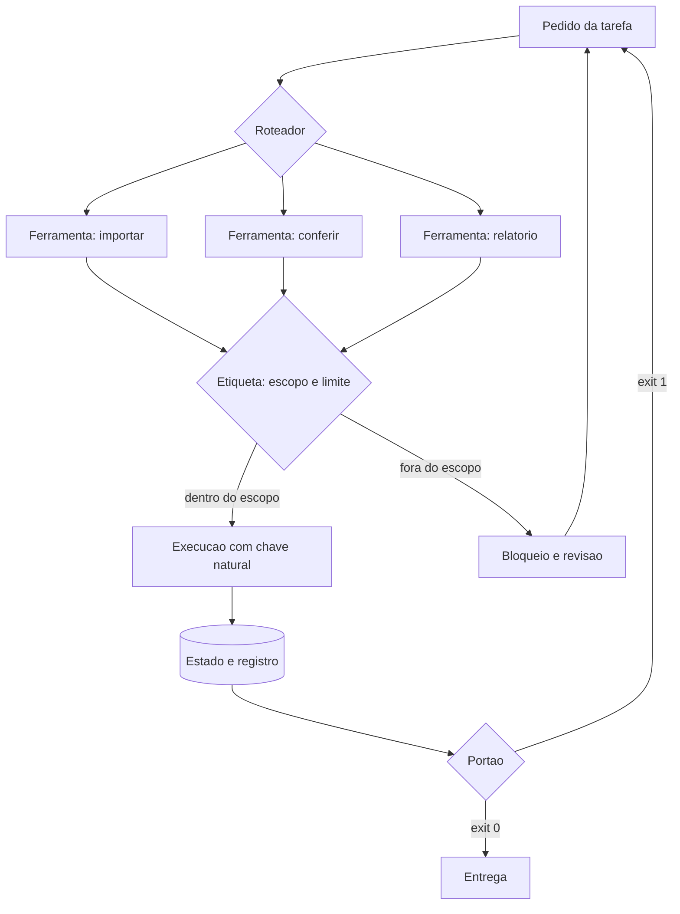

# Capítulo 8: Peça 4 — Ferramentas e persistência: a usina determinística

## 1. Introdução

No Capítulo 7 você decidiu quem faz cada tarefa e travou a resposta em contrato. Falta a mão que toca o mundo: as ferramentas que alteram arquivos, gravam registros e conversam com sistemas externos — e o lugar onde o resultado disso continua existindo amanhã.

Ao final deste capítulo você terá a Peça 4 instalada: ferramentas reexecutáveis que não estragam nada quando rodam duas vezes, conexão padronizada com serviços externos com escopo declarado e um registro durável do que foi feito. É a peça que transforma trabalho de um dia em sistema que continua funcionando.

## 2. Explica

### 2.1 Ferramenta reexecutável: rodar duas vezes não estraga

A propriedade mais importante de uma ferramenta de bancada é ser reexecutável. Ela tem nome técnico, idempotência, e o significado é simples: executar a mesma operação duas vezes produz o mesmo resultado de executar uma. Sem isso, toda falha de rede vira duplicidade, e toda tentativa de corrigir um erro cria um segundo erro.

Na prática, três mecanismos entregam idempotência. O primeiro é a **chave natural**: toda entidade tem um identificador que vem do sistema de origem, não do seu banco. O segundo é a operação de **atualização por chave** em vez de inserção cega: se o registro já existe, atualiza; se não existe, cria. O terceiro é o **registro de execução** com a marca do que foi processado, que permite reprocessar somente o que faltou.

O identificador que vem de fora é a decisão que mais impacta. Se você deixa o banco inventar o identificador, não existe forma de reconhecer que a linha recebida hoje é a mesma de ontem — e a duplicidade passa a ser invisível até virar relatório errado. Levantamentos de código gerado por IA registram esse mesmo padrão de falha em outro contexto: cerca de **20%** das dependências referenciadas não existem, e o erro só aparece no momento da execução [1].

### 2.2 Padronização da conexão com o mundo externo

Conectar ferramentas é problema antigo com solução nova. Antes, cada integração tinha seu próprio formato: a planilha era lida de um jeito, o sistema de nota fiscal de outro, o serviço de mensagem de um terceiro. O protocolo aberto que virou referência para essa conexão padroniza como uma aplicação com modelo acessa ferramentas, dados e recursos externos [2].

Padronizar traz ganho e traz risco, e a bancada trata os dois. O ganho é a possibilidade de trocar de implementação sem reescrever a integração. O risco é que qualquer padrão de acesso amplia superfície: relatórios de segurança apontam classes de ataque em que a descrição de uma ferramenta é alterada para induzir a execução fora do escopo, além do uso de permissão mais ampla do que o necessário [3] [4].

A defesa recomendada na literatura é chata de propósito: escopo mínimo, verificação da saída antes de consumir e ambiente isolado para ferramenta de terceiro. Análises de arquitetura para sistemas agenticos governáveis chegam à mesma conclusão por outro caminho, e vão além ao propor que cada servidor de ferramenta declare explicitamente o que pode fazer [5]. A especificação do protocolo, por desenho, não traz defesa nativa contra esse tipo de abuso, o que coloca a responsabilidade na configuração [6]. O mesmo padrão aparece em integrações aplicadas a domínios regulados, onde o agente recebe permissão de operação e precisa de auditoria do que fez [7].

### 2.3 Onde o estado vive

O estado do trabalho precisa de um lugar durável e simples. Para operação local, banco de arquivo único resolve bem e dispensa servidor. O ponto de atenção é a concorrência: o mecanismo de registro permite leitura simultânea com um único escritor, e o modelo de trava define o que acontece quando dois processos chegam ao mesmo tempo [8] [9].

Três regras organizam o estado. **Origem e derivado ficam separados:** a pasta de entrada é somente leitura e o banco guarda o resultado. **Toda execução deixa rastro:** data, ferramenta, quantidade processada e resultado. **Backup antes de sobrescrever:** a cópia é mais barata que a reconstrução.

Há uma consequência de projeto nessa organização. Quando o estado vive em arquivo do repositório, o histórico do trabalho passa a ser auditável com as ferramentas que você já usa, sem serviço adicional [10]. Vale dizer também o que o banco **não** deve guardar: regra de negócio. Regra mora em código e em documentação; banco guarda fato e resultado — a separação entre mecanismo e política que sustenta sistemas que duram [11].

### 2.4 A etiqueta da ferramenta

Ferramenta sem etiqueta vira armadilha. A etiqueta responde a quatro perguntas: o que ela faz, o que ela **não** faz, quem responde por ela e qual é o limite de uso. É a diferença entre uma prateleira organizada e uma caixa de ferramentas onde ninguém sabe o que está enferrujado.

Esse cuidado não é burocracia: ferramenta é o ativo que mais sobrevive a mudanças de tecnologia. Quando o modelo for trocado, a ferramenta continua; quando a pessoa que a escreveu sair, a etiqueta é o que resta. Esse é um dos poucos investimentos do projeto que não perde valor quando o fornecedor muda de política ou de preço [12].

## 3. Ilustra

Numa usina bem organizada, cada ferramenta tem sua etiqueta na prateleira: nome, função, limite de uso e responsável. O torneiro não pega a prensa para apertar um parafuso — a etiqueta diz que a prensa serve para conformar chapa até certa espessura, e nada além disso. Quando uma ferramenta volta quebrada, a etiqueta indica quem a usa e para quê, o que encurta o diagnóstico.

A bancada de software precisa da mesma prateleira, com um detalhe que a analogia física não tem: a ferramenta pode ser executada duas vezes por acidente. Por isso a etiqueta ganha um item a mais — "pode rodar de novo sem estragar?" —, e esse item é o que separa a usina que aguenta o dia ruim da usina que só funciona no dia bom.

Repare também no lugar do registro. A usina tem um caderno de produção, com data, ferramenta, quantidade e responsável. Não é controle por desconfiança: é o que permite responder "o que mudou desde ontem" em trinta segundos [13].



*Figura 8.1 — A usina determinística: cada ferramenta tem etiqueta com escopo e limite, a execução usa chave natural para poder repetir sem duplicar, e todo resultado fica registrado.*

Como Engenheiro de Bancada, você vai notar que a etiqueta é o artefato que mais economiza tempo em projeto herdado — o próximo operador agradece antes mesmo de te conhecer.

## 4. Técnica

### 4.1 A etiqueta das ferramentas

O manifesto de ferramentas é o catálogo da usina. Ele declara, para cada ferramenta, o que ela faz, o que não faz, se pode repetir e quem responde.

```yaml
# ferramentas.yaml — catalogo da usina
ferramentas:
  - nome: importar_pedidos
    faz: le o CSV da pasta de entrada e grava pedidos no banco de estado
    nao_faz: nao corrige dados de origem e nao envia relatorio
    reexecutavel: true
    chave_natural: identificador de origem
    dono: operacao
    limite: ate 50 mil linhas por lote
  - nome: conferir_totais
    faz: compara soma do arquivo com soma do banco
    nao_faz: nao altera dado
    reexecutavel: true
    chave_natural: nao se aplica
    dono: operacao
    limite: sempre dentro de um lote
  - nome: gerar_relatorio
    faz: escreve o resumo do dia no formato do contrato
    nao_faz: nao envia por e-mail nem publica em canal externo
    reexecutavel: true
    chave_natural: data do relatorio
    dono: operacao
    limite: um relatorio por data
```

### 4.2 A importação idempotente

A ferramenta mais comum de qualquer projeto é a importação, e ela é o teste definitivo de idempotência. O código abaixo grava por chave natural: rodar duas vezes não duplica pedido, apenas atualiza.

```python
#!/usr/bin/env python3
"""Importacao idempotente: rodar duas vezes nao duplica pedido."""
import sqlite3
import sys
from pathlib import Path

CRIAR_TABELA = """
CREATE TABLE IF NOT EXISTS pedidos (
    identificador TEXT PRIMARY KEY,
    cliente TEXT NOT NULL,
    valor REAL NOT NULL,
    forma_pagamento TEXT
)
"""
CRIAR_EXECUCOES = """
CREATE TABLE IF NOT EXISTS execucoes (
    id INTEGER PRIMARY KEY AUTOINCREMENT,
    ferramenta TEXT NOT NULL,
    quando TEXT NOT NULL,
    quantidade INTEGER NOT NULL,
    resultado TEXT NOT NULL
)
"""


def abrir(caminho):
    caminho.parent.mkdir(parents=True, exist_ok=True)
    conexao = sqlite3.connect(caminho)
    conexao.execute("PRAGMA journal_mode=WAL;")
    conexao.execute(CRIAR_TABELA)
    conexao.execute(CRIAR_EXECUCOES)
    return conexao


def importar(conexao, pedidos, quando):
    inseridos = 0
    for pedido in pedidos:
        cursor = conexao.execute(
            "INSERT INTO pedidos (identificador, cliente, valor, forma_pagamento) "
            "VALUES (?, ?, ?, ?) "
            "ON CONFLICT(identificador) DO UPDATE SET "
            "cliente=excluded.cliente, valor=excluded.valor, "
            "forma_pagamento=excluded.forma_pagamento",
            (pedido["identificador"], pedido["cliente"], pedido["valor"],
             pedido.get("forma_pagamento", "")),
        )
        inseridos += cursor.rowcount
    conexao.execute(
        "INSERT INTO execucoes (ferramenta, quando, quantidade, resultado) VALUES (?, ?, ?, ?)",
        ("importar_pedidos", quando, len(pedidos), "ok"),
    )
    conexao.commit()
    return inseridos


def main():
    banco = Path("dados/estado/pedidos.db")
    lote = [
        {"identificador": "8842", "cliente": "Ana Souza", "valor": 132.90, "forma_pagamento": "pix"},
        {"identificador": "8843", "cliente": "Carlos Lima", "valor": 58.00, "forma_pagamento": "cartao"},
    ]
    conexao = abrir(banco)
    importar(conexao, lote, "2026-09-14T09:00:00")
    importar(conexao, lote, "2026-09-14T09:05:00")
    total = conexao.execute("SELECT COUNT(*) FROM pedidos").fetchone()[0]
    execucoes = conexao.execute("SELECT COUNT(*) FROM execucoes").fetchone()[0]
    print(f"pedidos no banco: {total}")
    print(f"execucoes registradas: {execucoes}")
    conexao.close()
    return 0


if __name__ == "__main__":
    sys.exit(main())
```

O resultado esperado é didático: dois pedidos no banco, duas execuções registradas. A segunda rodada não criou pedido novo, mas deixou rastro — e é o rastro que permite reconstruir a história do dia.

### 4.3 O registro de execução como ferramenta de diagnóstico

O registro de execuções parece detalhe e é a peça mais consultada em incidente. Com ele, você responde três perguntas em segundos: o que rodou, quando e com qual resultado.

```python
#!/usr/bin/env python3
"""Le o registro de execucoes e mostra o que aconteceu no dia."""
import sqlite3
from pathlib import Path

BANCO = Path("dados/estado/pedidos.db")


def garantir_registro(caminho):
    conexao = sqlite3.connect(caminho)
    conexao.execute(
        "CREATE TABLE IF NOT EXISTS execucoes ("
        "id INTEGER PRIMARY KEY AUTOINCREMENT, ferramenta TEXT NOT NULL, "
        "quando TEXT NOT NULL, quantidade INTEGER NOT NULL, resultado TEXT NOT NULL)"
    )
    conexao.commit()
    return conexao


def resumo_dia(conexao, dia):
    linhas = conexao.execute(
        "SELECT ferramenta, COUNT(*), SUM(quantidade), MAX(resultado) FROM execucoes "
        "WHERE quando LIKE ? GROUP BY ferramenta ORDER BY ferramenta",
        (f"{dia}%",),
    ).fetchall()
    return linhas


def main():
    caminho = BANCO if BANCO.exists() else Path("dados/estado/registro.db")
    conexao = garantir_registro(caminho)
    if BANCO.exists():
        for ferramenta, execucoes, quantidade, resultado in resumo_dia(conexao, "2026-09-14"):
            print(f"{ferramenta}: {execucoes} execucao(oes), {quantidade} registro(s), "
                  f"resultado {resultado}")
    else:
        print("[INFO] registro vazio: rode a importacao antes de consultar o resumo")
    conexao.close()
    return 0


if __name__ == "__main__":
    sys.exit(main())
```

Um registro de execução bem desenhado também é a base da evidência de confiabilidade que o Capítulo 14 vai exigir: sem ele, provar que o processo funcionou vira depoimento.

### 4.4 Ferramenta de terceiro: escopo mínimo declarado

Quando a ferramenta vem de fora, o cuidado muda de foco: você não controla o código, então controla a permissão. A configuração abaixo declara explicitamente o escopo, e a verificação recusa configuração com escopo amplo.

```json
{
  "servidor": "ferramentas-locais",
  "transporte": "stdio",
  "escopo": {
    "leitura": ["dados/entrada"],
    "escrita": ["dados/estado"],
    "proibido": ["dados/entrada", "credenciais", "chaves"]
  },
  "limites": {
    "linhas_por_lote": 50000,
    "chamadas_por_hora": 200,
    "tempo_maximo_segundos": 120
  },
  "verificacao": {
    "saida_conferida_antes_de_consumir": true,
    "descricao_da_ferramenta_revisada_por": "operacao"
  }
}
```

Duas escolhas desse arquivo merecem destaque. A declaração explícita de pasta proibida resolve a maior parte dos acidentes. E o campo de revisão da descrição da ferramenta existe porque a alteração de descrição é uma das classes de ataque documentadas contra esse tipo de integração [4] [3].

### 4.5 Ferramenta, risco e proteção

| Ferramenta | Risco principal | Proteção mínima |
|---|---|---|
| Importar de arquivo | Duplicidade em reexecução | Chave natural e atualização por chave |
| Gerar relatório | Publicar dado errado | Portão de totais antes de escrever |
| Consultar serviço externo | Indisponibilidade e dado parcial | Registro de tentativa e retomada |
| Enviar mensagem externa | Ação irreversível | Modo de ensaio na primeira execução |
| Alterar cadastro de terceiro | Efeito sobre pessoa | Dupla confirmação e revisão humana |
| Ferramenta de terceiro com escrita | Acesso além do necessário | Escopo mínimo declarado e saída verificada |

## 5. Aplica

**Situação.** O relatório de ontem saiu com o dobro dos valores. Você investiga e encontra a causa: a rotina de importação rodou duas vezes, uma na execução agendada e outra quando alguém apertou o comando manualmente para "garantir que tinha rodado". Ninguém entrou em pânico porque ninguém percebeu — o valor duplicado parecia plausível.

**O erro.** O banco foi desenhado sem chave natural: cada importação inseria linhas novas com identificador gerado pelo próprio banco. A duplicidade era invisível na leitura, porque as duas cópias tinham o mesmo conteúdo e nenhuma marca de origem. E não havia registro de execução, o que impediu saber quantas vezes a rotina tinha rodado.

**O diagnóstico.** A ferramenta não era reexecutável. Toda operação de escrita precisa responder à pergunta "e se isso rodar de novo?", e a resposta depende de a chave vir de fora. Sem chave natural e sem registro, o sistema não tem como distinguir repetição de pedido legítimo — e o erro só aparece quando alguém soma [1].

**A correção.** Três mudanças: identificador de origem como chave primária, gravação por atualização em vez de inserção cega e tabela de execuções alimentada por cada ferramenta. Depois disso, a rotina pode rodar duas vezes que o resultado continua correto, e o registro mostra as duas execuções — o que permite reprocessar sem medo [14].

**Métricas de sucesso.** A Peça 4 se mede com quatro números:

| Métrica | Como medir | Sinal de que funcionou |
|---|---|---|
| Duplicidades por lote | Consulta ao banco por chave | Zero duplicidade após reexecução |
| Ferramentas com etiqueta completa | Conferência do catálogo | Todas com escopo, limite e dono |
| Execuções registradas por dia | Leitura da tabela de registro | Toda execução com rastro |
| Tempo de diagnóstico de incidente | Do alarme até a causa identificada | Menor, com o registro em mãos |

**Nota de contexto.** O comportamento padrão de quem está começando é escrever ferramenta sem pensar em repetição, porque a primeira execução funcionou. Quando o volume cresce, esse mesmo padrão vira duplicidade generalizada — e a maioria dos projetos usa apoio de IA sem ter regra escrita para isso [15] [16]. A proteção é barata agora e caríssima depois [17].

**Armadilhas comuns.** A primeira é inserir sem chave natural, o que torna a duplicidade invisível. A segunda é dar à ferramenta de terceiro mais permissão do que ela precisa, ampliando o dano possível [6]. A terceira é sobrescrever o dado de origem em vez de gravar derivado na pasta de estado. A quarta é não registrar execução, deixando o próximo incidente sem linha do tempo. A quinta é chamar ferramenta sem conferir a saída: dependência inexistente, caminho errado e dado parcial chegam todos com aparência de resposta válida [18] [19].

**Até onde isso escala.** Banco de arquivo único e ferramentas locais atendem bem operação de uma máquina e volume moderado, e são a escolha certa enquanto o domínio é cercado — mas ganham limite quando a política de retenção de dados entra em jogo e passa a exigir registro formal de finalidade e descarte [20]. quando há vários processos escrevendo ao mesmo tempo, o próprio modelo de concorrência do banco vira o gargalo, e a decisão passa a ser de arquitetura de dados, não de biblioteca [9]. O limite de idempotência também tem borda: ferramenta reexecutável funciona para dado que tem identificador estável, mas envio de mensagem externa continua sendo ação única, e por isso exige modo de ensaio — repetir não resolve o que não pode ser desfeito [13].

### 5.1 O teste da ferramenta que aguenta repetição

Ferramenta de bancada se prova na terceira execução, não na primeira. Quatro sinais dizem se o que você escreveu é ferramenta ou foi só um comando solto que deu certo uma vez.

- **Aceita entrada diferente?** Se só funciona com o arquivo daquele dia, ainda é script pessoal.
- **Sai com código de erro claro?** Falha silenciosa obriga a pessoa a investigar o que aconteceu.
- **Pode rodar duas vezes sem estragar?** Operação que não é segura para repetir transfere risco para quem aperta o botão [8].
- **Deixa rastro do que fez?** Sem registro, a conferência volta a depender de memória.

| Sinal | Ferramenta pronta | Ainda improviso |
|---|---|---|
| Entrada | Parâmetro declarado | Caminho fixo no código |
| Erro | Código e mensagem | Saída vazia |
| Repetição | Segura para rodar de novo | Duplica dados |
| Rastro | Linha de log por execução | Nenhum |

**Aplicação no sistema.** Escolha as duas ações que você mais repete à mão e transforme em ferramenta reexecutável. O critério de pronto é simples: outra pessoa do time consegue rodar sem perguntar nada, e o resultado é o mesmo duas vezes seguidas. Quando a ferramenta toca dado persistido, ela precisa tratar concorrência e escrita parcial, porque dois processos no mesmo arquivo produzem corrupção silenciosa [9].

**Limite desta prática.** Uma ferramenta só compensa quando o número de execuções futuras multiplicado pelo tempo poupado supera o custo de escrevê-la e mantê-la. Ação que você repete duas vezes por ano continua valendo um comando manual, e está tudo bem [11].

## 6. Conclusão

Você fechou a Peça 4: ferramentas com etiqueta de escopo, limite e dono; importação idempotente por chave natural; registro de execução durável; e escopo mínimo declarado para ferramenta de terceiro. Aprendeu que reexecutável é a propriedade que separa ferramenta de acidente, que padronização de conexão reduz trabalho e amplia risco, e que o registro de execução é a peça mais consultada quando algo dá errado.

**Desafio.** Escreva a etiqueta das três ferramentas mais usadas do seu projeto, rode a importação idempotente duas vezes seguidas e confira no banco que não houve duplicidade. Depois consulte o registro e responda: o que rodou ontem, quantas vezes e com qual resultado?

Com isso a Parte II está fechada: você tem contexto, ciclo de vida, roteamento e ferramentas. Na Parte III começa a montagem completa, começando por transformar o script solto em repositório governado — o primeiro ciclo terminando com portão verde.

## 7. Referências Bibliográficas

[1] TRAXTECH. *20% of AI-Generated Code Dependencies Don't Exist, Creating Supply Chain Security Risks*. Disponível em: https://www.traxtech.com/blog/20-of-ai-generated-code-dependencies-dont-exist-creating-supply-chain-security-risks. Acesso em: 12 set. 2026.
[2] ANTHROPIC. *Model Context Protocol Specification (2025-06-18)*. Disponível em: https://modelcontextprotocol.io/specification/2025-06-18. Acesso em: 12 set. 2026.
[3] NATIONAL SECURITY AGENCY. *Model Context Protocol (MCP) Security — CSI*. Disponível em: https://www.nsa.gov/Portals/75/documents/Cybersecurity/CSI_MCP_SECURITY.pdf. Acesso em: 12 set. 2026.
[4] CHECKMARX. *11 Emerging AI Security Risks with MCP (Model Context Protocol)*. Disponível em: https://checkmarx.com/zero-post/11-emerging-ai-security-risks-with-mcp-model-context-protocol/. Acesso em: 12 set. 2026.
[5] PRUDVI SAISARAN PONDURU. *AgentMesh-MCP: A Secure and Governed Framework for Agentic AI Systems Using LLM Agents and Model Context Protocol Servers*. In: International Journal of Scientific Research in Engineering and Management. 2026. Disponível em: https://doi.org/10.55041/ijsrem62689. Acesso em: 12 set. 2026.
[6] CLOUD SECURITY ALLIANCE. *MCP Security Crisis: Systemic Design Flaws in AI Agent Infrastructure*. Disponível em: https://labs.cloudsecurityalliance.org/research/csa-research-note-mcp-security-crisis-20260504-csa-styled/. Acesso em: 12 set. 2026.
[7] OKULA, Oghenekeno Hilkiah; NEERANJAN, Chitare. *A Design Science Approach for Agentic AI in Network Engineering: Autonomous Network Management Using AI Agents, LLMs and Model Context Protocol (MCP) Mechanisms*. 2026. Disponível em: https://doi.org/10.36227/techrxiv.176978431.15223796/v1. Acesso em: 12 set. 2026.
[8] SQLITE. *Write-Ahead Logging*. Disponível em: https://www.sqlite.org/wal.html. Acesso em: 12 set. 2026.
[9] SQLITE. *File Locking And Concurrency In SQLite Version 3*. Disponível em: https://sqlite.org/lockingv3.html. Acesso em: 12 set. 2026.
[10] CHACON, Scott; STRAUB, Ben. *Pro Git: Everything you need to know about Git*. 2. ed. Apress, 2014. Disponível em: https://git-scm.com/book/en/v2. Acesso em: 12 set. 2026.
[11] MARTIN, Robert C. *Clean Architecture: A Craftsman's Guide to Software Structure and Design*. Prentice Hall, 2017. Disponível em: https://www.pearson.com/. Acesso em: 12 set. 2026.
[12] ALI, Mohamad Abou; DORNAIKA, Fadi; CHARAFEDDINE, Jinan. *Agentic AI: a comprehensive survey of architectures, applications, and future directions*. In: Artificial Intelligence Review. 2025. Disponível em: https://doi.org/10.1007/s10462-025-11422-4. Acesso em: 12 set. 2026.
[13] NYGARD, Michael T. *Release It!: Design and Deploy Production-Ready Software*. 2. ed. Pragmatic Bookshelf, 2018. Disponível em: https://pragprog.com/titles/mnee2/release-it-second-edition/. Acesso em: 12 set. 2026.
[14] RAKSHIT, Yerram Sai. *Modernizing Software Testing: AI, Telemetry, and Agentic Quality Engineering*. In: International Journal of AI Engineering. 2026. Disponível em: https://doi.org/10.34218/ijaieg_01_01_002. Acesso em: 12 set. 2026.
[15] STACK OVERFLOW. *2025 Developer Survey — AI*. Disponível em: https://survey.stackoverflow.co/2025/ai. Acesso em: 12 set. 2026.
[16] ROBBES, Romain et al. *Agentic Much? Adoption of Coding Agents on GitHub*. In: ACM Transactions on Software Engineering and Methodology. 2026. Disponível em: https://doi.org/10.1145/3822180. Acesso em: 12 set. 2026.
[17] HUMBLE, Jez; FARLEY, David. *Continuous Delivery: Reliable Software Releases through Build, Test, and Deployment Automation*. Addison-Wesley, 2010. Disponível em: https://continuousdelivery.com/. Acesso em: 12 set. 2026.
[18] VERACODE. *2025 GenAI Code Security Report: AI-Generated Code Security Risks*. Disponível em: https://www.veracode.com/blog/ai-generated-code-security-risks/. Acesso em: 12 set. 2026.
[19] ENDOR LABS. *The Most Common Security Vulnerabilities in AI-Generated Code*. Disponível em: https://www.endorlabs.com/learn/the-most-common-security-vulnerabilities-in-ai-generated-code. Acesso em: 12 set. 2026.
[20] NATIONAL INSTITUTE OF STANDARDS AND TECHNOLOGY. *Artificial Intelligence Risk Management Framework: Generative Artificial Intelligence Profile (NIST AI 600-1)*. Disponível em: https://nvlpubs.nist.gov/nistpubs/ai/NIST.AI.600-1.pdf. Acesso em: 12 set. 2026.
