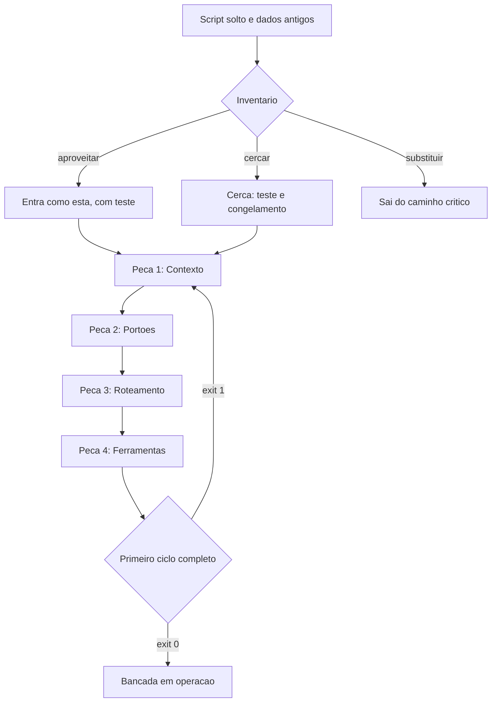

# Capítulo 9: Primeiro encaixe: do script solto ao repositório governado

## 1. Introdução

No Capítulo 8 você fechou a quarta peça: ferramentas reexecutáveis e registro durável. As quatro peças existem, mas ainda estão separadas na sua cabeça. Este capítulo faz o encaixe — e o faz do jeito mais realista possível: partindo do que você já tem, e não de um repositório limpo.

Ao final deste capítulo você terá um repositório governado: inventário do que existe, quatro camadas mínimas instaladas e um ciclo completo do pedido ao portão aprovado. É o momento em que a bancada deixa de ser ideia e passa a ser o lugar onde você trabalha.

## 2. Explica

### 2.1 Inventário: o que existe, o que cerca, o que nasce

Projeto real raramente começa do zero. Existe um script que alguém escreveu às pressas, um arquivo de planilha com macros, uma pasta com dados de dois anos. O primeiro passo do encaixe é o inventário honesto, que classifica cada item em três categorias: **aproveitar** (funciona e tem dono), **cercar** (funciona mas ninguém entende, precisa de proteção e teste antes de qualquer mudança) e **substituir** (não dá para confiar).

O erro mais comum nessa fase é confundir "feio" com "ruim". Código feio que funciona e tem teste merece ser cercado, não reescrito — reescrever sem teste é trocar defeito conhecido por defeito desconhecido [1]. E existe um agravante moderno: **45%** das amostras de código gerado por assistentes apresentaram vulnerabilidades conhecidas em avaliações independentes, e a taxa não melhorou entre ciclos de teste [2].

Vale lembrar que o inventário não mede estilo: ele mede risco. E risco se avalia com o mesmo cuidado de qualquer avaliação séria, que exige critério fixo antes de olhar o objeto [18].

O critério prático do inventário é a pergunta "o que acontece se isso quebrar amanhã?" Item cuja falha derruba a operação recebe proteção primeiro, independentemente de quanto tempo tem. Item cuja falha ninguém nota pode esperar. A dívida herdada tem nome e forma: casca de função que finge entregar resultado, dependência que não existe e prática insegura copiada de exemplo antigo [3] [4].

### 2.2 A ordem de instalação e por que ela importa

As quatro peças se instalam em ordem: contexto, ciclo de vida e portões, roteamento, ferramentas. A razão é a mesma de qualquer arquitetura em camadas: a camada externa depende da interna, nunca o contrário [5].

Instalar na ordem errada produz três sintomas conhecidos. Começar pelas ferramentas gera automação sem regra — rápido e perigoso. Começar pelo roteamento gera otimização de custo sem contrato, o que barateia o erro. Começar pelos portões gera bloqueio sem especificação, o que faz a equipe desligar a verificação. A ordem certa é chata e economiza semanas.

Há uma analogia organizacional útil aqui. Adoção de plataforma dá certo quando existe um caminho claro e um dono, e não quando se instala ferramenta e se espera mudança de comportamento [6]. A mesma ordem aparece na prática de entrega contínua: padrão de verificação vem antes de velocidade, porque velocidade sem verificação é retrabalho adiado [7].

### 2.3 O primeiro ciclo completo

O objetivo do primeiro dia de bancada não é automatizar tudo: é fechar **um** ciclo completo. Escolha a tarefa menor que ainda tem valor real, escreva a especificação de uma página, execute, verifique no portão e entregue. O ciclo termina com o portão verde, não com a sensação de progresso.

O valor de fechar o ciclo inteiro é que ele revela o que falta. As lacunas aparecem em ordem previsível: primeiro a especificação (o que exatamente entregar), depois o contrato (em que formato), depois a verificação (como saber) e por último a ferramenta (com o que executar). Quem tenta resolver tudo de uma vez descobre as lacunas todas juntas, no meio da entrega.

Um ciclo bem desenhado tem outra vantagem: ele deixa rastro suficiente para que a próxima tentativa seja mais curta. Registro de execução e histórico do repositório são o que permitem voltar a um estado conhecido sem adivinhação [8] [9].

### 2.4 Quando não governar

Nem tudo merece bancada. Script de uso único, análise exploratória de dois dias e protótipo para decidir se o projeto vale a pena são casos em que a estrutura custa mais do que protege. A pergunta de corte é: **isso vai rodar de novo dentro de dois meses?** Se a resposta é não, escreva o script, rode, apague e registre a decisão em uma linha.

O limite prático entre "descartável" e "governado" não é o tamanho do código, é a consequência da falha. Um script de dez linhas que move dinheiro pede governança. Um sistema de mil linhas que gera gráfico de curiosidade não pede. Note que esse recorte é o mesmo que separa delegar execução de delegar responsabilidade: o que exige julgamento precisa de estrutura [10].

## 3. Ilustra

Existe um momento específico na vida de uma oficina em que a bancada fica pronta. As ferramentas estão na prateleira com etiqueta, o quadro de disjuntores está fechado com os circuitos identificados, a mesa tem espaço e o caderno está aberto na primeira página. Nada foi produzido ainda — e, ao mesmo tempo, tudo mudou, porque a partir dali qualquer serviço começa sem improviso.

O primeiro encaixe é esse momento. A primeira lâmpada de teste acende no serviço mais simples, justamente para provar que o circuito fecha: da entrada de energia até a saída de trabalho. Repare que ninguém testa o quadro elétrico com o serviço mais difícil. O teste é simples de propósito: se o circuito não fecha no serviço fácil, não vai fechar no difícil.

Repare também no que fica pendurado na parede depois: a lista do que foi cercado e o porquê. Aquilo não é documentação de engenharia, é aviso de segurança — o próximo que mexer precisa saber onde não pisar antes de aprender a andar [11].



*Figura 9.1 — O primeiro encaixe: inventário decide o destino de cada item, as quatro peças entram na ordem e uma única tarefa é levada até o portão verde.*

Como Engenheiro de Bancada, você vai resistir à tentação de começar pelo item mais problemático. O primeiro ciclo é para provar o circuito, não para consertar o passado.

## 4. Técnica

### 4.1 O inventário automatizado

O inventário manual esquece arquivos. Este script percorre o repositório e classifica o que encontra por tipo, sinalizando os indícios de risco: arquivo de dados versionado, casca de função e comentário de pendência.

```python
#!/usr/bin/env python3
"""Inventario do repositorio: o que existe, o que preocupa e o que nao tem teste."""
import re
from pathlib import Path

INDICIOS = {
    "stub": re.compile(r"\b(pass\s*$|TODO|FIXME|NotImplementedError)\b", re.MULTILINE),
    "dado_versionado": re.compile(r"\.(csv|xlsx|db|sqlite)$"),
    "segredo": re.compile(r"(api[_-]?key|senha|password|token)\s*=\s*[\"']", re.IGNORECASE),
}
PASTAS_IGNORADAS = {".git", "__pycache__", "node_modules"}


def classificar(raiz):
    achados = {chave: [] for chave in INDICIOS}
    total_arquivos = 0
    for caminho in sorted(Path(raiz).rglob("*")):
        if not caminho.is_file() or any(parte in PASTAS_IGNORADAS for parte in caminho.parts):
            continue
        total_arquivos += 1
        if INDICIOS["dado_versionado"].search(caminho.name):
            achados["dado_versionado"].append(str(caminho))
        if caminho.suffix in {".py", ".js", ".ts"}:
            texto = caminho.read_text(encoding="utf-8", errors="replace")
            if INDICIOS["stub"].search(texto):
                achados["stub"].append(str(caminho))
            if INDICIOS["segredo"].search(texto):
                achados["segredo"].append(str(caminho))
    return total_arquivos, achados


def main():
    total, achados = classificar(".")
    print(f"arquivos analisados: {total}")
    for chave, itens in achados.items():
        rotulo = {"stub": "casca ou pendencia", "dado_versionado": "dado versionado",
                  "segredo": "possivel segredo em codigo"}[chave]
        print(f"{rotulo}: {len(itens)}")
        for item in itens[:5]:
            print(f"  - {item}")
    if achados["segredo"]:
        print("[BLOQUEADO] resolva os segredos antes de governar o repositorio")
        return 1
    print("[APROVADO] inventario concluido")
    return 0


if __name__ == "__main__":
    raise SystemExit(main())
```

O inventário não decide nada sozinho: ele entrega a lista para você classificar em aproveitar, cercar ou substituir. Vale rodá-lo antes e depois do encaixe: a segunda execução documenta o ganho e aponta o que ficou pendente [1].

### 4.2 O roteiro de instalação das quatro peças

A instalação é sequencial e leva uma sessão por peça. O roteiro abaixo é o mesmo do caso âncora.

```console
$ mkdir -p dados/entrada dados/estado verificacoes exemplos
$ git init && git add . && git commit -m "estado inicial do projeto"
$ # Peca 1 - contexto
$ printf '%s\n' "objetivo, contrato, exemplo e prova" > objetivo.md
$ cp ../../modelos/contrato.json . && cp ../../modelos/pedidos-exemplo.csv exemplos/
$ python verificacoes/medir_contexto.py
$ # Peca 2 - portoes
$ cp ../../modelos/portoes.yaml . && cp ../../modelos/harness.py verificacoes/
$ python verificacoes/harness.py
$ # Peca 3 - roteamento
$ cp ../../modelos/roteamento.yaml . && cp ../../modelos/roteador.py verificacoes/
$ python verificacoes/roteador.py
$ # Peca 4 - ferramentas
$ cp ../../modelos/ferramentas.yaml . && python verificacoes/importar_pedidos.py
$ python verificacoes/harness.py
[APROVADO] 4 portoes executados
```

O roteiro é intencionalmente copiável. A parte que exige julgamento não é criar arquivo: é preencher cada um com o conteúdo do seu domínio. Se você tiver pressa, comece por contexto e portões: são as duas peças que impedem o trabalho de entrar errado e de sair errado [7].

### 4.3 A estrutura final do repositório governado

Depois do encaixe, a árvore do projeto tem uma forma estável. Ela é a mesma do caso âncora com três acréscimos: o catálogo de ferramentas, o manifesto de portões e a pasta de verificações.

```text
painel-de-pedidos/
  objetivo.md            contrato.json        vocabulario.yaml
  portoes.yaml           ferramentas.yaml     roteamento.yaml
  caderno.json           linha-de-base.json
  dados/entrada/         (somente leitura)
  dados/estado/          (escrita permitida, backup obrigatorio)
  verificacoes/
    conferir_entrada.py  conferir_totais.py   conferir_duplicidade.py
    importar_pedidos.py  gerar_relatorio.py   harness.py
  exemplos/pedidos-exemplo.csv
  decisoes.md
```

A regra de leitura dessa árvore é simples: tudo que está na raiz descreve e governa; tudo que está em `verificacoes` executa; tudo que está em `dados` é conteúdo. Nenhum arquivo de governança deve morar dentro de `dados`. A separação tem função prática: o estado pode ser apagado e reconstruído sem perder o conhecimento que governa o projeto, e o conhecimento permanece auditável pelo histórico do repositório [5].

### 4.4 O registro do primeiro ciclo

O primeiro ciclo fechado recebe registro próprio, porque ele é a prova de que a bancada funciona. O formato abaixo vai no caderno, e é ele que você vai reutilizar nas próximas tarefas.

```json
{
  "ciclo": 1,
  "tarefa": "conferir arquivo do dia e gerar resumo por forma de pagamento",
  "planejado": {
    "criterio_de_pronto": "totais conferidos e nenhuma linha valida fora do resumo",
    "fora_de_escopo": "corrigir dados na origem"
  },
  "executado": {
    "porta": "script",
    "ferramentas": ["importar_pedidos", "conferir_totais", "gerar_relatorio"]
  },
  "verificado": {
    "portoes": ["entrada_conforme", "sem_duplicidade", "totais_conferem"],
    "resultado": "aprovado"
  },
  "entregue": {
    "artefato": "dados/estado/resumo-2026-09-14.json",
    "conferido_por": "operacao"
  },
  "tempo_total_minutos": 22
}
```

### 4.5 Sinal de dívida e ação correspondente

| Sinal no inventário | Risco | Ação no encaixe |
|---|---|---|
| Casca de função e comentário de pendência | Falha silenciosa em produção | Cercar com teste antes de tocar |
| Dado de produção versionado no projeto | Perda e exposição de dados | Mover para pasta de entrada com permissão restrita |
| Possível segredo em código | Vazamento de credencial | Remover do histórico e usar variável de ambiente |
| Script sem teste que a operação usa | Mudança quebra o dia | Congelar, cercar com verificação e só então evoluir |
| Pasta de dados sem backup | Perda irreversível | Cópia antes de qualquer escrita |

## 5. Aplica

**Situação.** Você assume um projeto que gera relatórios de produção: um script de 180 linhas, uma pasta com planilhas de dois anos e um agendamento que roda de madrugada. A primeira decisão que vem à cabeça é reescrever o script inteiro com apoio de IA, já que "está tudo bagunçado".

**O erro.** Você reescreve. A versão nova é mais bonita, tem funções separadas e nomes melhores. Na primeira madrugada ela roda e gera um relatório diferente do antigo: o script original tinha uma regra não documentada que excluía pedidos cancelados de um cliente específico. Ninguém sabia disso, e você acabou de remover a regra sem saber que ela existia.

**O diagnóstico.** Você reescreveu antes de inventariar e antes de cercar. Código operacional sem teste é conhecimento tácito: o comportamento é a documentação, e apagá-lo apaga a regra [1]. O custo não foi o retrabalho de escrever duas vezes: foi o relatório errado entregue a quem decidia sobre o mês [2].

**A correção.** Três passos, na ordem do encaixe. Primeiro, congelar o script antigo como referência e capturar a saída dele em um caso de teste. Segundo, escrever a verificação que compara a saída nova com a antiga em um lote conhecido — se houver diferença, o portão bloqueia e revela a regra escondida. Terceiro, só depois, refatorar com o teste no lugar. A regra do cliente é então documentada no contrato, e a próxima pessoa não precisa descobri-la por acidente.

**Métricas de sucesso.** O encaixe tem indicadores objetivos, todos medidos no primeiro ciclo:

| Métrica | Como medir | Sinal de que funcionou |
|---|---|---|
| Itens inventariados com destino | Conferência da lista de inventário | Nenhum item sem classificação |
| Tempo do primeiro ciclo completo | Registro do ciclo no caderno | Menos de uma sessão de trabalho |
| Portões executando no primeiro ciclo | Saída do harness | Aprovação com pelo menos três portões |
| Regressões encontradas pelo teste de comparação | Diferenças entre saída antiga e nova | Diferenças aparecem antes de entregar, não depois |

**Nota de contexto.** Vale medir a pressa antes de governar o repositório. Boa parte do código que circula hoje foi produzido sem verificação e sem política organizacional, o que significa que o inventário de qualquer projeto herdado vai encontrar mais dívida do que o esperado [12] [13]. O objetivo do encaixe não é chegar a zero dívida: é chegar a dívida conhecida [14].

**Nota de contexto.** Duas armadilhas técnicas merecem menção antes da lista. A primeira é confiar em teste que passa sempre: quando o critério de avaliação vira o objetivo, o sistema aprende a satisfazê-lo em vez de resolver o problema, comportamento já medido em agentes de código de horizonte longo [19]. A segunda é usar medida saturada como prova de qualidade, porque desempenho alto em prova fácil não indica capacidade real [20].

**Armadilhas comuns.** A primeira é reescrever antes de cercar, o que destrói comportamento não documentado. A segunda é instalar as peças fora de ordem, começando por ferramenta. A terceira é tentar fechar o ciclo com uma tarefa grande, o que transforma o primeiro dia em projeto de um mês. A quarta é deixar o inventário sem destino, transformando a lista em documento decorativo. A quinta é instalar contexto sem critério de finitude: mesa cheia demais reproduz o problema que a Peça 1 deveria resolver [15] [16].

**Até onde isso escala.** O encaixe descrito atende um repositório e uma pessoa, e pressupõe que a operação tem dono identificável; sem dono, o encaixe vira projeto paralelo que ninguém mantém, e a governança precisa de decisão organizacional sobre responsabilidade [17]. em projeto herdado grande, o inventário precisa de amostragem e de priorização por risco, e a cerca vem antes da limpeza. Existe limite de esforço também: sistema legado que funciona e será substituído em três meses recebe cerca mínima e nenhuma refatoração [11]. E existe limite honesto de ferramenta: nenhuma quantidade de estrutura substitui o conhecimento de quem opera o processo — a bancada organiza esse conhecimento, não o cria.

### 5.1 O primeiro encaixe em uma tarefa pequena

Escolha a tarefa mais chata do seu projeto, não a mais interessante. Encaixe inicial existe para provar o encadeamento, e tarefa chata tem critério mais claro que tarefa criativa.

| Etapa | O que você faz | Artefato que fica |
|---|---|---|
| 1. Pedido | Descreve entrada, saída e recusa | Especificação aprovada |
| 2. Contexto | Aponta os arquivos que importam | Arquivo de contexto |
| 3. Ciclo | Roda com disjuntor ligado | Registro de execução |
| 4. Verificação | Confere contra o critério | Resultado do portão |
| 5. Registro | Anota o que funcionou | Caderno de bancada |

Se o encaixe parou na etapa 3, o problema costuma ser contexto, não executor. Muito arquivo irrelevante e pouco arquivo essencial produz o pior resultado possível: o sistema acha que sabe, e o dado que faltava estava justamente fora [19].

**O que observar no primeiro ciclo.** Três coisas, nesta ordem: o portão reprovou alguma vez? O executor pediu informação na hora certa em vez de inventar? O registro tem o que você precisa para repetir? Se as três respostas forem sim, o encadeamento está de pé, mesmo que o resultado do artefato ainda seja modesto [7].

**Aplicação no sistema.** A tarefa do primeiro encaixe permanece no repositório como caso de referência. Nos próximos capítulos, toda vez que uma peça nova entrar, ela é testada primeiro nesse caso conhecido — é assim que você descobre que quebrou algo sem ter que auditar o projeto inteiro [1].

## 6. Conclusão

Você fez o primeiro encaixe: inventário com destino para cada item, quatro peças instaladas na ordem certa e um ciclo completo fechado com portão verde. Aprendeu que cercar vem antes de reescrever, que a ordem de instalação economiza semanas e que nem tudo merece governança — script descartável continua descartável. E viu o formato do registro de ciclo, que será reutilizado em todas as tarefas seguintes.

**Desafio.** Rode o inventário no seu repositório, classifique os cinco itens que ele apontar e feche um ciclo completo na tarefa mais simples que ainda tenha valor real. Grave o registro do ciclo nos moldes da seção Técnica.

No próximo capítulo, o caso âncora completo: o Painel de Pedidos construído do início ao fim, com o código real, as decisões de modelagem e os erros que apareceram no caminho.

## 7. Referências Bibliográficas

[1] FOWLER, Martin. *Patterns of Enterprise Application Architecture*. Boston: Addison-Wesley, 2002. Disponível em: https://martinfowler.com/books/eaa.html. Acesso em: 12 set. 2026.
[2] VERACODE. *2025 GenAI Code Security Report: AI-Generated Code Security Risks*. Disponível em: https://www.veracode.com/blog/ai-generated-code-security-risks/. Acesso em: 12 set. 2026.
[3] ENDOR LABS. *The Most Common Security Vulnerabilities in AI-Generated Code*. Disponível em: https://www.endorlabs.com/learn/the-most-common-security-vulnerabilities-in-ai-generated-code. Acesso em: 12 set. 2026.
[4] TRAXTECH. *20% of AI-Generated Code Dependencies Don't Exist, Creating Supply Chain Security Risks*. Disponível em: https://www.traxtech.com/blog/20-of-ai-generated-code-dependencies-dont-exist-creating-supply-chain-security-risks. Acesso em: 12 set. 2026.
[5] MARTIN, Robert C. *Clean Architecture: A Craftsman's Guide to Software Structure and Design*. Prentice Hall, 2017. Disponível em: https://www.pearson.com/. Acesso em: 12 set. 2026.
[6] DORA / GOOGLE CLOUD. *State of AI-assisted Software Development 2025*. Disponível em: https://dora.dev/dora-report-2025/. Acesso em: 12 set. 2026.
[7] HUMBLE, Jez; FARLEY, David. *Continuous Delivery: Reliable Software Releases through Build, Test, and Deployment Automation*. Addison-Wesley, 2010. Disponível em: https://continuousdelivery.com/. Acesso em: 12 set. 2026.
[8] CHACON, Scott; STRAUB, Ben. *Pro Git: Everything you need to know about Git*. 2. ed. Apress, 2014. Disponível em: https://git-scm.com/book/en/v2. Acesso em: 12 set. 2026.
[9] RAKSHIT, Yerram Sai. *Modernizing Software Testing: AI, Telemetry, and Agentic Quality Engineering*. In: International Journal of AI Engineering. 2026. Disponível em: https://doi.org/10.34218/ijaieg_01_01_002. Acesso em: 12 set. 2026.
[10] ALI, Mohamad Abou; DORNAIKA, Fadi; CHARAFEDDINE, Jinan. *Agentic AI: a comprehensive survey of architectures, applications, and future directions*. In: Artificial Intelligence Review. 2025. Disponível em: https://doi.org/10.1007/s10462-025-11422-4. Acesso em: 12 set. 2026.
[11] NYGARD, Michael T. *Release It!: Design and Deploy Production-Ready Software*. 2. ed. Pragmatic Bookshelf, 2018. Disponível em: https://pragprog.com/titles/mnee2/release-it-second-edition/. Acesso em: 12 set. 2026.
[12] STACK OVERFLOW. *2025 Developer Survey — AI*. Disponível em: https://survey.stackoverflow.co/2025/ai. Acesso em: 12 set. 2026.
[13] ROBBES, Romain et al. *Agentic Much? Adoption of Coding Agents on GitHub*. In: ACM Transactions on Software Engineering and Methodology. 2026. Disponível em: https://doi.org/10.1145/3822180. Acesso em: 12 set. 2026.
[14] CLOUD SECURITY ALLIANCE. *Vibe Coding's Security Debt: The AI-Generated CVE Surge*. Disponível em: https://labs.cloudsecurityalliance.org/research/csa-research-note-ai-generated-code-vulnerability-surge-2026/. Acesso em: 12 set. 2026.
[15] MEI, Lingrui et al. *A Survey of Context Engineering for Large Language Models*. In: arXiv. 2025. Disponível em: https://arxiv.org/abs/2507.13334. Acesso em: 12 set. 2026.
[16] LIU, Nelson F. et al. *Lost in the Middle: How Language Models Use Long Contexts*. In: Transactions of the Association for Computational Linguistics. 2024. Disponível em: https://arxiv.org/abs/2307.03172. Acesso em: 12 set. 2026.
[17] NATIONAL INSTITUTE OF STANDARDS AND TECHNOLOGY. *Artificial Intelligence Risk Management Framework: Generative Artificial Intelligence Profile (NIST AI 600-1)*. Disponível em: https://nvlpubs.nist.gov/nistpubs/ai/NIST.AI.600-1.pdf. Acesso em: 12 set. 2026.
[18] OPENAI. *Introducing SWE-bench Verified*. Disponível em: https://openai.com/index/introducing-swe-bench-verified/. Acesso em: 12 set. 2026.
[19] METR. *Recent Frontier Models Are Reward Hacking*. Disponível em: https://metr.org/blog/2025-06-05-recent-reward-hacking/. Acesso em: 12 set. 2026.
[20] SCALE LABS. *SWE-Bench Pro (Public Dataset) — Leaderboard*. Disponível em: https://labs.scale.com/leaderboard/swe_bench_pro_public. Acesso em: 12 set. 2026.


