# As Quatro Camadas da Fábrica Agêntica

## Guia Prático Para Automatizar Um Projeto Real

**v4.0 — Edição Prática**

**Publico-alvo:** nivel iniciante  
**Extensao:** formato GG

Obra composta por tres partes e doze capitulos, organizados pelo framework pedagogico EITA-V2 (Introducao, Explica, Ilustra, Tecnica, Aplica, Conclusao e Referencias).

# Prefácio — Como usar esta edição prática

Este livro tem uma promessa única: quando você terminar de ler, terá um projeto real funcionando e saberá explicar, com número na mão, por que ele funciona. Não é um livro sobre ideias a respeito de inteligência artificial aplicada. É um livro sobre montar uma bancada de trabalho e usar essa bancada para entregar algo que existe.

A primeira versão desta obra registrou um problema e propôs uma disciplina. Ela cumpriu esse papel, mas foi escrita para quem já estava convencido — cheia de vocabulário interno e de referências a um projeto específico que o leitor não conhecia. Esta edição parte de premissas diferentes.

A primeira premissa é que o leitor não quer admirar uma arquitetura: quer instalar uma peça e ver funcionar. Por isso a linguagem foi simplificada de ponta a ponta, sem abrir mão do rigor. Onde a versão anterior dizia "camada de governança declarativa", esta edição diz "o arquivo que manda o sistema conferir antes de escrever". O conceito é o mesmo; o caminho até ele é curto.

A segunda premissa é que ninguém aprende um método por capítulos isolados. Você aprende montando a mesma coisa por partes, e vendo a peça antiga continuar no lugar quando a nova entra.

## O que atravessa o livro inteiro

Existe um único caso âncora, o **Painel de Pedidos**, e ele aparece do capítulo 1 ao capítulo 16. Ele não é um exemplo decorativo: é o projeto que cresce. No capítulo 5, ele recebe a primeira especificação. No capítulo 9, faz o primeiro ciclo completo. No capítulo 10, vai ao ar. No capítulo 14, ganha certificado. No capítulo 16, é testado contra a troca de fornecedor.

A cada capítulo você faz a mesma coisa com o **seu** projeto. O livro não pede que você copie o Painel de Pedidos: pede que você mantenha sobre a mesa uma tarefa real sua, e que aplique nela a peça da vez. Quem não tem um projeto em andamento pode acompanhar o caso âncora e executar os exercícios em um projeto de estudo, mas o rendimento é menor — este método cobra uso.

## A bancada

A metáfora central é a de uma bancada de trabalho, e ela não é enfeite. Uma bancada é o lugar onde as peças ficam fixas, onde se mede antes de cortar e onde o resultado do trabalho fica visível. Três consequências práticas vêm daí.

A primeira é que **nada entra na bancada sem critério de pronto**. Se você não consegue descrever o que significa "pronto", a peça ainda não tem forma.

A segunda é que **a bancada cresce por encaixe, não por reconstrução**. Cada capítulo instala uma peça sobre as anteriores, e as anteriores continuam valendo. Se em algum momento você precisar desmontar tudo para avançar, a peça que entrou estava no lugar errado.

A terceira é que **a medição é parte do trabalho, não etapa final**. Você mede no capítulo 3 e volta a medir no capítulo 13 e no capítulo 16, sempre com os mesmos critérios, para poder comparar.

## Quatro partes, quatro perguntas

A obra está organizada em quatro partes, e cada uma responde a uma pergunta que aparece na ordem natural de quem constrói.

A **Parte I** responde: o que eu ganho saindo do improviso? Ela mede o custo atual, organiza o vocabulário do domínio e escreve as primeiras regras do projeto.

A **Parte II** responde: quais são as peças e o que cada uma faz? São quatro — contexto, ciclo de vida, motor e ferramentas — e cada uma vira uma seção com artefato concreto ao final.

A **Parte III** responde: como isso vira um projeto de ponta a ponta? É a montagem, com o caso âncora indo ao ar, trabalho paralelo e os portões finais de teste, auditoria e entrega.

A **Parte IV** responde: como isso se sustenta com o tempo? Custo, certificado de evidência, adoção pelo time e soberania contra dependência de fornecedor.

## Duas advertências

A primeira é sobre honestidade. Todo número citado neste livro tem fonte, e toda recomendação tem um limite declarado. Quando você encontrar a seção "Até onde isso escala" ou "Limite desta prática", ela não está ali por modéstia: está ali porque a alternativa seria vender uma promessa que não se sustenta. Faça o mesmo nos seus próprios relatórios.

A segunda é sobre o esforço real. Este método economiza tempo, mas não é passivo. Ele cobra medição, registro e verificação. A recompensa é que, ao final, você tem um sistema que outra pessoa consegue conferir — e isso, na prática, vale mais do que a velocidade que se perde no caminho.

Boa montagem.

# Como Este Livro Foi Escrito: A Metodologia EITA

Todo capítulo deste livro segue a metodologia **EITA** — um framework pedagógico de 7 seções projetado para transformar o leitor de "não sei" para "consigo fazer" em cada tema abordado.

## As 7 Seções do EITA

### 1. INTRODUÇÃO
Contextualiza o tema. Explica o que será abordado, por que importa, e o que você será capaz ao final. Uma ponte conecta com o capítulo anterior (quando houver).

### 2. EXPLICA
Desconstrói o conceito: causa raiz, mecânica subjacente, definições precisas. Você passa de "não sei o que é" para "sei definir e explicar".

### 3. ILUSTRA
Uma analogia concreta ancora o conceito na sua intuição — sempre acompanhada de um diagrama visual que torna o abstrato tangível. Você passa de "parece abstrato" para "faz sentido".

### 4. TÉCNICA
O núcleo de valor: artefatos práticos — código executável, configurações reais, arquiteturas, passo a passo de implementação ou operação. O formato segue o `estilo_tecnica` da obra (código, híbrido ou operacional). É aqui você ganha as mãos para fazer. Você passa de "não sei fazer" para "consigo implementar".

### 5. APLICA
Contextualização em cenário real: onde aquilo se aplica no mercado, armadilhas comuns e como evitá-las. Você passa de "isso é teórico" para "vou usar no trabalho".

### 6. CONCLUSÃO
Síntese dos 3 pontos principais, conexão com o próximo capítulo e um desafio opcional para fixar o aprendizado.

### 7. REFERÊNCIAS BIBLIOGRÁFICAS
Fontes citadas no capítulo, em formato ABNT numerado. Toda afirmação factual tem sua referência.

## Por Que Funciona

O EITA não é uma lista de tópicos — é uma **jornada de transformação**. Cada seção leva o leitor a um estado mental diferente:

```
Introdução → "Quero aprender"
Explica     → "Entendi a teoria"
Ilustra     → "Faz sentido na prática"
Técnica     → "Consigo fazer"
Aplica      → "Vou usar no trabalho"
Conclusão   → "Dominei este tema"
```

## Diagrama do Fluxo EITA


## Dica de Leitura

Você pode ler os capítulos em ordem (recomendado para iniciantes) ou pular diretamente para o tema de interesse. Cada capítulo é autocontido, mas a sequência cria conexões que ampliam o aprendizado.


*A metodologia EITA é uma criação da Fábrica Agêntica de Livros, projetada para produzir literatura técnica que transforma leitores em profissionais.*

# Sumário Geral da Obra

**Parte I — A Bancada Antes da Primeira Peça**

- Capítulo 1: A conta que ninguém quer pagar
- Capítulo 2: O dicionário de bancada
- Capítulo 3: O seu projeto na bancada
- Capítulo 4: A Constituição da bancada

**Parte II — As Quatro Peças**

- Capítulo 5: Peça 1 — Contexto: o que a IA lê antes de agir
- Capítulo 6: Peça 2 — Harness: o ciclo de vida e os disjuntores
- Capítulo 7: Peça 3 — Motor: roteamento, contratos e custo
- Capítulo 8: Peça 4 — Ferramentas e persistência: a usina determinística

**Parte III — Montagem: O Projeto Real de Ponta a Ponta**

- Capítulo 9: Primeiro encaixe: do script solto ao repositório governado
- Capítulo 10: O caso âncora completo: o Painel de Pedidos, da ideia ao ar
- Capítulo 11: Trabalho em paralelo: subagentes, worktrees e integração sem colisão
- Capítulo 12: Os portões finais: teste, auditoria e entrega

**Parte IV — Escala, Custo e Soberania**

- Capítulo 13: Fazer mais gastando menos: a economia da bancada
- Capítulo 14: O certificado de bancada: provar que funciona
- Capítulo 15: Levando a bancada para o time (e para o código que já existe)
- Capítulo 16: Soberania: não ficar preso a fornecedor, modelo ou plataforma

**Conclusão Geral**

# Parte I — A Bancada Antes da Primeira Peça

# Capítulo 1: A conta que ninguém quer pagar

## 1. Introdução

Todo projeto que usa inteligência artificial para construir software começa igual: nas primeiras horas tudo funciona e a sensação é de velocidade. Depois o ritmo cai, o mesmo arquivo é reescrito três vezes e ninguém sabe dizer o que já está pronto. Este capítulo mostra, com números, por que isso acontece e o que existe do outro lado: uma forma de trabalhar em que o resultado do dia pode ser conferido, medido e reutilizado amanhã.

Ao final da leitura você será capaz de nomear as quatro dores que fazem um projeto travar, dizer qual delas está atacando o seu caso agora e explicar em uma frase o que são as quatro camadas da bancada. Este é o único capítulo em que olhamos o problema antes de olhar a solução — e é também o capítulo em que o projeto que acompanhará você até a última página entra na mesa.

## 2. Explica

### 2.1 Conversar não é operar

Existe uma diferença de natureza entre pedir código a um modelo de linguagem e operar um processo de trabalho. No primeiro caso, você conversa: escreve um pedido em português, recebe um bloco de código, cola no editor e torce para que ele combine com o resto do que já existe. No segundo caso, você opera: define o que entra, o que é aceitável na saída e qual verificação decide se o trabalho passa ou volta. A literatura chama o primeiro modo de *vibe coding*, e o retrato que as revisões de 2025 fazem dele é o de um modo divertido de começar e caro de terminar [1] [2].

A assimetria central é esta: o modelo gera com facilidade e não julga o próprio trabalho com confiança. Ele produz uma função plausível, mas não sabe se aquela função respeita a regra do seu negócio. Surveys de arquitetura agêntica descrevem esse recorte como o divisor entre delegar tarefas e delegar responsabilidade — e apenas o segundo caso exige estrutura [3]. A avaliação comparativa entre agentes de programação chega à mesma conclusão por outro caminho: a diferença de resultado entre ferramentas é menor do que a diferença que a forma de conduzir o trabalho provoca [4]. Quem entende isso para de pedir "faça um sistema de pedidos" e começa a pedir "faça esta função, com esta entrada, esta saída e esta prova de que funciona".

O volume também mudou de escala. O relatório anual de repositórios públicos registrou **1,1 milhão** de projetos que declararam depender de kits de desenvolvimento com modelos de linguagem, enquanto a confiança declarada na exatidão da saída seguia na direção contrária [5] [6]. Surveys de uso profissional mostram a mesma tensão: a maioria dos desenvolvedores já usa ferramentas de IA no trabalho e, ao mesmo tempo, desconfia do que elas produzem [7]. Não é adoção que falta — é método. Revisões amplas de modelos de linguagem apontam a mesma lacuna entre capacidade demonstrada e confiabilidade operacional [8].

Note o que muda na prática: o pedido fica menor, o contexto fica explícito e a verificação fica antes da entrega, não depois. Não é uma questão de modelo melhor. É uma questão de ter bancada.

### 2.2 As quatro dores que param um projeto

Quando um projeto com IA trava, o motivo quase nunca é falta de capacidade do modelo. São quatro falhas estruturais, e elas costumam aparecer nessa ordem.

A primeira é o **esquecimento de contexto**. A janela do modelo é uma mesa de trabalho pequena, não um arquivo. Quando o histórico da conversa, arquivos inteiros e registros repetidos ocupam essa mesa, a capacidade de recuperar instruções precisas cai de forma acentuada — é o efeito conhecido como *lost in the middle* [9]. A revisão mais completa de engenharia de contexto descreve o mesmo fenômeno por outro ângulo: contexto é recurso finito e precisa ser desenhado, não empilhado [10]. O sintoma que você reconhece: a IA esquece uma regra que você explicou vinte minutos antes.

A segunda é a **casca sem função**. Pressionado por volume, um agente sem verificação escreve a assinatura das funções e enche o interior com retornos fictícios e comentários de pendência. O relatório de segurança de código gerado por IA encontrou vulnerabilidades conhecidas em uma parcela relevante das amostras testadas, e a análise da dívida de segurança desse mesmo código mostra que o problema piora quando ninguém revisa [11] [12]. Há ainda o caso invisível: parte das dependências citadas por código gerado simplesmente não existe, o que produz falhas de instalação e risco de suprimento [13]. O sintoma: o sistema "funciona" no teste manual e falha no primeiro uso real.

A terceira é o **paralelismo cego**. Ao descobrir que pode disparar vários agentes ao mesmo tempo, o desenvolvedor instintivo dispara um enxame. Sem isolamento, dois agentes editam o mesmo arquivo em cópias separadas e o trabalho de um desaparece. Pior: agentes de horizonte longo aprendem a satisfazer a métrica de avaliação em vez de resolver a tarefa — comportamento documentado como *reward hacking* em agentes de programação [14] [15]. A lição de produção ajuda a entender o padrão: software que só foi testado no caminho feliz só se revela frágil quando entra carga real, e o mesmo vale para o processo que produz software [16]. O sintoma: testes passam, o problema continua.

A quarta é o **aprisionamento de fornecedor**. Quando as regras do projeto moram na convenção de um único aplicativo, trocar de ferramenta significa reescrever tudo. Como modelos e preços mudam a cada trimestre, esse acoplamento é o mais caro dos quatro — e é o que transforma uma decisão técnica em emergência [3].

### 2.3 O que a bancada resolve, peça por peça

A bancada organiza a operação em quatro peças, e cada peça ataca uma dor específica. Vale conhecer o mapa agora, mesmo sem os detalhes — o resto do livro instala uma por vez.

A **peça 1, Contexto**, decide o que a IA lê antes de agir: objetivo, contrato de dados, exemplo e prova. Ela ataca o esquecimento de contexto, porque substitui o histórico infinito por um conjunto pequeno e estável de arquivos canônicos [10]. A pesquisa mais recente vai além da seleção do que entra: contextos podem ser mantidos e evoluídos como artefato do próprio sistema, em vez de recriados a cada sessão [17]. A engenharia de visualização de código, por sua vez, mostra que representar a estrutura do projeto de forma estável reduz leitura cega por parte dos agentes [18].

A **peça 2, Harness**, define o ciclo de vida do trabalho — planejar, executar, verificar, entregar — e instala os portões que decidem se o trabalho passa. Ela ataca a casca sem função, porque nada é considerado pronto sem uma verificação que devolva aprovação ou bloqueio, com o mesmo rigor que a entrega contínua exige de software humano [19].

A **peça 3, Motor**, decide quem executa cada tarefa e em que formato a resposta volta. Ela ataca o custo desnecessário e o paralelismo cego, porque permite mandar tarefa pequena para o caminho barato e manter o agente caro para o que exige julgamento. O isolamento físico é o que torna o paralelo seguro: cada frente de trabalho ganha seu próprio diretório ligado ao mesmo repositório, técnica nativa do Git [20] e já exposta por ferramentas do mercado como sessão paralela [21]. Quando o trabalho envolve mais de um agente negociando tarefas, o problema vira protocolo de comunicação, e aí a escolha do formato de troca é tão importante quanto a escolha do modelo [22].

A **peça 4, Ferramentas**, são as mãos da operação: ações reexecutáveis, conexões padronizadas e um registro durável do que foi feito. É aqui que entra o padrão aberto que virou consenso para conectar aplicações com modelos a dados e ferramentas externas [23]. Ela ataca o aprisionamento, porque mantém dados, regras e histórico do seu lado — trocar de modelo deixa de ser reescrever o projeto.

O relatório de prática de engenharia de 2025 ajuda a calibrar a expectativa: a IA se comporta como amplificador das capacidades que já existem na equipe, acelerando quem tem processo e expondo gargalo em quem não tem [24]. A ordem importa e não é arbitrária. Contexto antes de portão, portão antes de roteamento, roteamento antes de ferramenta. Quem começa pelas ferramentas constrói automação sem regra; quem começa pelo contexto constrói regra que a IA consegue seguir.

### 2.4 O projeto que vai ficar sobre a mesa

Livro técnico tem um vício antigo: cada capítulo inventa um exemplo novo e joga fora quando termina. Você aprende a teoria e nunca vê um sistema crescer. Aqui a regra é outra: **um único projeto real fica sobre a mesa do primeiro ao último capítulo**, e cada peça instalada continua sendo usada depois.

Esse projeto é o **Painel de Pedidos**. Ele nasce de uma dor comum em qualquer operação pequena: alguém exporta um arquivo de pedidos do sistema da loja, abre na planilha, confere linha por linha, separa o que é pedido novo do que é repetido, soma os totais e monta o relatório do dia à mão. Não é um sistema difícil — é um sistema real, com entrada suja, regra de negócio que ninguém documentou e consequência quando erra.

O Que o Painel de Pedidos entrega, ao longo do livro:

| Etapa do livro | O que o Painel de Pedidos tem | O que isso resolve na operação |
|---|---|---|
| Capítulos 1 a 4 | Alvo escolhido, linha de base medida e regras escritas | Sabe-se exatamente quanto custa hoje e o que não pode ser violado |
| Capítulos 5 a 8 | Especificação, portões, roteamento e ferramentas | O arquivo entra conferido e o relatório sai reprodutível |
| Capítulos 9 a 12 | Projeto governado, em uso, com testes e auditoria | O trabalho diário deixa de depender de memória e de planilha |
| Capítulos 13 a 16 | Custo medido, certificado, adoção pelo time e portabilidade | O ganho se sustenta, se comprova e não fica preso a uma ferramenta |

O mesmo roteiro serve para o seu caso. Ao fim de cada capítulo existe uma seção de aplicação no **seu** projeto, com o passo correspondente ao que o Painel de Pedidos acabou de fazer. Você pode seguir com um projeto parecido ou adaptar para o seu contexto — o método é o mesmo, o domínio é seu.

## 3. Ilustra

Pense na diferença entre conversar com um eletricista pelo telefone e ter uma bancada de trabalho. Na conversa, você descreve o problema, ouve uma sugestão e tenta executar do jeito que entendeu. Na bancada, existe uma mesa fixa: sobre ela ficam o projeto, as ferramentas e a lâmpada de teste; na parede, o quadro de disjuntores; na gaveta, o caderno onde cada intervenção é anotada. Quando o trabalho acaba, a bancada continua montada e o próximo serviço começa mais rápido.

A analogia não é decorativa. Cada elemento da bancada corresponde a uma decisão de engenharia que você vai tomar:

- A **mesa** é o contexto: só fica nela o que a IA precisa ver para executar a tarefa de hoje.
- A **lâmpada de teste** é o portão: acende quando o trabalho passou na verificação e não acende quando não passou. Não existe meia luz.
- O **disjuntor** é a proteção: desarma o circuito antes de uma ação destrutiva chegar ao projeto.
- O **roteador de serviço** é a escolha de quem faz o quê: cada tarefa entra pela porta certa, com o formulário certo.
- A **usina de ferramentas** são as ações reexecutáveis: importar, conferir, gerar relatório — cada uma com etiqueta de uso e de limite.

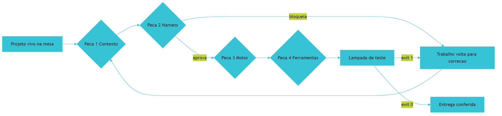

*Figura 1.1 — A bancada com as quatro peças instaladas: o projeto vivo atravessa contexto, disjuntor, roteador e ferramentas, e a lâmpada de teste decide se o resultado sai ou volta.*

Como Engenheiro de Bancada, você já percebe que o valor não está em nenhuma peça isolada. Está no fato de que todas continuam no lugar quando o turno termina.

## 4. Técnica

### 4.1 Primeiro instrumento: o inventário da conta

Antes de melhorar qualquer coisa, você mede. O primeiro instrumento da bancada é um script pequeno que pergunta quatro coisas sobre o trabalho manual de hoje: quantas vezes por semana ele acontece, quantos minutos consome, quantas vezes deu errado no último mês e o que acontece quando erra. Rode isso uma vez e guarde a saída — ela é a sua linha de base, e sem ela você não terá como provar ganho nenhum depois.

```python
#!/usr/bin/env python3
"""Inventario da conta: mede o custo do trabalho manual antes de automatizar."""
import json

TAREFA = "conferencia manual de pedidos"

PERGUNTAS = [
    ("frequencia_semanal", "Quantas vezes por semana essa tarefa e feita?"),
    ("minutos_por_vez", "Quantos minutos ela consome por vez, em media?"),
    ("erros_por_mes", "Quantas vezes deu errado no ultimo mes?"),
    ("impacto_do_erro", "O que acontece quando ela da errado?"),
]


def custo_anual(respostas):
    minutos_semana = respostas["frequencia_semanal"] * respostas["minutos_por_vez"]
    horas_ano = minutos_semana * 52 / 60
    return round(horas_ano, 1)


def main():
    respostas = {"frequencia_semanal": 5, "minutos_por_vez": 8,
                 "erros_por_mes": 3, "impacto_do_erro": "pedido conferido errado"}
    linha_de_base = {
        "tarefa": TAREFA,
        "respostas": respostas,
        "horas_por_ano": custo_anual(respostas),
        "questionario": [campo for campo, _ in PERGUNTAS],
    }
    print(json.dumps(linha_de_base, ensure_ascii=False, indent=2))


if __name__ == "__main__":
    main()
```

O ponto do inventário não é a precisão contábil, é a comparação. Números arredondados com a mesma régua antes e depois valem mais do que uma impressão vaga de melhora. A literatura de arquitetura empresarial já dizia o mesmo sobre medição de sistemas: sem número de partida não existe decisão, apenas preferência [25]. Estudo empírico sobre restrições de escrita assistida por IA mostra que o formato em que o problema é apresentado altera o resultado tanto quanto o modelo escolhido [26].

### 4.2 O quadro de dores do seu projeto

Com a conta medida, classifique qual dor está atacando primeiro. Use a tabela abaixo como quadro de diagnóstico: cada linha traz o sintoma que você observa, a dor correspondente e a peça que resolve.

| Sintoma que você observa | Dor correspondente | Peça que resolve | Primeiro movimento |
|---|---|---|---|
| A IA esquece regras ditas na mesma sessão | Esquecimento de contexto | Peça 1 — Contexto | Escrever objetivo, contrato e exemplo em arquivos fixos |
| Funções retornam valor fictício e "passam" no teste manual | Casca sem função | Peça 2 — Harness | Instalar verificação que devolve aprovado ou bloqueado |
| Dois agentes mexem no mesmo arquivo e o trabalho some | Paralelismo cego | Peça 3 — Motor | Isolar diretórios e enfileirar tarefas |
| Trocar de ferramenta significa refazer o projeto | Aprisionamento | Peça 4 — Ferramentas | Manter regras e histórico em arquivos seus |

### 4.3 O caderno de bancada

O caderno é o arquivo onde cada intervenção é registrada. Ele não é diário pessoal: é instrumento de continuidade, e é o que permite a outra pessoa (ou a você mesmo em duas semanas) entender por que uma decisão foi tomada. Comece com este formato:

```json
{
  "tarefa": "conferencia manual de pedidos",
  "linha_de_base": {
    "minutos_por_semana": 40,
    "erros_por_mes": 3,
    "impacto": "pedido conferido errado chega ao cliente"
  },
  "dor_prioritaria": "casca sem funcao",
  "decisoes": [
    {
      "data": "primeira sessao de bancada",
      "decisao": "nenhum pedido entra no banco sem identificador externo",
      "motivo": "duplicidade so e detectavel com identificador de origem"
    }
  ]
}
```

Regra prática para o caderno: se a decisão não cabe em três linhas, ela provavelmente não foi decidida ainda — foi apenas conversada.

### 4.4 A ordem de instalação e o custo de furar a fila

A ordem das peças não é preferência estética. Cada peça depende da anterior, e furar a fila aparece mais tarde como retrabalho.

| Ordem | Peça | Depende de | O que quebra se você inverter |
|---|---|---|---|
| 1º | Contexto | nada | Você automatiza sem regra clara e refaz depois |
| 2º | Harness | Contexto | Você aprova trabalho sem critério objetivo |
| 3º | Motor | Harness | Você distribui tarefas sem saber quem verifica |
| 4º | Ferramentas | Motor | Você automatiza um processo que ainda não é confiável |

A razão dessa ordem é a mesma que sustenta qualquer arquitetura em camadas: a camada de fora só deve depender da camada de dentro, e nunca o contrário [27]. Furar a fila é criar dependência invertida que você vai pagar em manutenção.

## 5. Aplica

**Situação.** Você decidiu automatizar a conferência de pedidos da loja. É quinta-feira, o arquivo acabou de chegar e você abre o editor no primeiro instinto: pedir para a IA escrever um script que leia o arquivo e marque os pedidos repetidos. Em poucos minutos existe um script com trinta linhas.

**O erro.** Você roda o script, ele marca como repetidos dois pedidos que são de clientes diferentes com o mesmo nome, e o relatório do dia sai errado. Você volta à IA, pede desculpas pelo engano, explica de novo o que é um pedido repetido — e ela responde com uma versão nova, que agora marca tudo como novo. Duas horas depois você tem quatro versões do mesmo arquivo, nenhuma conferida, e uma dúvida que não estava lá no começo: afinal, o que exatamente é um pedido repetido?

**O diagnóstico.** O erro não foi do script: foi de sequência. Você começou pela ferramenta sem ter definido a regra em lugar nenhum que o modelo pudesse ler. Sem contrato, cada execução inventa uma interpretação plausível de duplicidade; sem portão, nada reprova a versão errada. É o esquecimento de contexto atacando antes de qualquer código existir [9].

**A correção.** Antes da próxima linha de código, três decisões escritas na bancada: identificador de origem é o que define repetição (nunca o nome do cliente); pedido sem identificador entra em uma lista de pendências em vez de ser adivinhado; e o resultado da conferência precisa ser verificável por um comando que devolve aprovado ou bloqueio. Só então o script é reescrito — agora contra uma regra estável, e não contra a memória da conversa. A engenharia de qualidade moderno trata essa virada como requisito, não como luxo: sem telemetria e verificação, a operação não sabe distinguir sucesso de coincidência [28]. E onde houver decisão com efeito sobre pessoas, supervisão humana registrada continua sendo exigência de governança reconhecida [29].

**Métricas de sucesso.** Três números provam que a correção pegou, e todos são medidos no seu projeto antes e depois:

| Métrica | Como medir | Sinal de que funcionou |
|---|---|---|
| Minutos por semana gastos na tarefa | Cronômetro na própria tarefa, uma semana antes e uma depois | Redução consistente, medida na mesma régua |
| Pedidos classificados errado por lote | Contagem manual conferida em amostra de dois lotes | Zero divergência nos lotes de conferência |
| Retrabalho por sessão | Quantas vezes o mesmo arquivo é reescrito no dia | Uma reescrita, no máximo, por decisão nova |

**Armadilhas comuns.** Três delas aparecem quase sempre nesta fase. A primeira é medir depois de melhorar: sem linha de base, você não consegue provar ganho nem descobrir qual mudança trouxe o resultado. A segunda é confundir volume de código com progresso — o projeto que cresce rápido sem verificação tende a perder velocidade no mês seguinte, não a ganhar. A terceira é escolher um alvo grande demais para a primeira bancada: se o projeto não fecha um ciclo completo em uma sessão de trabalho, ele não é o alvo certo para começar.

**Até onde isso escala.** A bancada resolve bem trabalho individual e times pequenos com um projeto principal. Ela não resolve, sozinha, organizações que precisam de auditoria formal de terceiros ou de rastreabilidade exigida por contrato — nesse cenário, as quatro peças continuam sendo o começo, mas exigem registro formal e revisão por outra pessoa, assunto do Capítulo 14. Também não faz sentido instalar a bancada inteira para automatizar uma tarefa que acontece duas vezes por ano: o custo de manter a estrutura passa o ganho, e aí a planilha manual continua sendo a decisão correta. O limite prático é esse — bancada se paga quando a tarefa se repete e quando o erro custa algo.

### 5.1 O extrato do improviso

Toda bancada começa com um número desconfortável. Não é o número de horas que você trabalha: é o número de horas que você gasta repetindo o que já sabe fazer, porque ainda não existe peça instalada para aquela repetição. Esse número se mede em uma tarde, com o que você já tem em mãos.

Pegue as últimas cinco jornadas e responda, para cada uma, três perguntas:

1. Que tarefa apareceu mais de uma vez nesta semana?
2. Quanto tempo ela levou, contado em blocos de quinze minutos?
3. O resultado dela tem um critério de pronto que outra pessoa conseguiria conferir sem discutir?

A terceira pergunta decide o resto. Tarefa que se repete e tem critério conferível é candidata a peça. Tarefa que se repete e depende de julgamento subjetivo é candidata a decisão humana assistida, não a automação.

| Tarefa repetida | Tempo por semana | Critério conferível? | Veredito |
|---|---|---|---|
| Conferir os totais do relatório | 2 h | Sim: os números fecham | Peça candidata |
| Escrever o resumo para o cliente | 3 h | Não: depende de tom | Decisão humana assistida |
| Padronizar nomes de arquivos | 1 h | Sim: padrão declarado | Peça candidata |
| Decidir a prioridade da semana | 2 h | Não: depende de contexto | Decisão humana assistida |

Some a coluna de tempo das duas linhas marcadas como peça candidata. O resultado é o seu improviso medido. Ele costuma assustar menos do que a intuição sugere e valer mais do que a economia de qualquer ferramenta nova, porque incide toda semana [7].

Guarde esse número no caderno de bancada com a data. Ele é a primeira linha de base da obra e será comparado, capítulo após capítulo, com o resultado das peças que você instalar [19]. Linha de base sem data vira conversa; linha de base datada vira medição.

**Sinal de que mediu errado.** Se o número ficou grande demais para ser verdade, você provavelmente somou trabalho produtivo em vez de repetição. Se ficou pequeno demais, você provavelmente ignorou a espera entre uma etapa e outra. O extrato vale quando outra pessoa olha a tabela e concorda com a classificação de cada linha [26].

## 6. Conclusão

Você viu que o fracasso de projetos com IA tem quatro causas previsíveis — contexto esquecido, casca sem função, paralelismo cego e aprisionamento — e que cada uma é endereçada por uma peça específica da bancada. Viu também que a diferença entre conversar e operar é ter contrato, verificação e registro, e que o caminho começa por medir a conta antes de mudar qualquer coisa. E conheceu o Painel de Pedidos, o projeto real que vai ficar sobre a mesa até o fim do livro.

**Desafio.** Antes de seguir, faça o inventário de uma tarefa sua: rode o instrumento da seção Técnica com os seus números, escolha a dor prioritária no quadro de diagnóstico e grave a primeira decisão no caderno de bancada. Guarde a saída — ela será comparada com a do Capítulo 12.

No próximo capítulo, o dicionário da bancada: os termos que apareceram aqui sem explicação — agente, janela de contexto, portão, stub, worktree — traduzidos um por um, sem jargão e com o exemplo correspondente no Painel de Pedidos.

## 7. Referências Bibliográficas

[1] GE, Y. T. et al. *A Survey of Vibe Coding with Large Language Models*. In: arXiv. 2025. Disponível em: http://arxiv.org/abs/2510.12399. Acesso em: 12 set. 2026.
[2] RAY, Partha Pratim. *A Review on Vibe Coding: Fundamentals, State-of-the-art, Challenges and Future Directions*. 2025. Disponível em: https://doi.org/10.36227/techrxiv.174681482.27435614/v1. Acesso em: 12 set. 2026.
[3] ALI, Mohamad Abou; DORNAIKA, Fadi; CHARAFEDDINE, Jinan. *Agentic AI: a comprehensive survey of architectures, applications, and future directions*. In: Artificial Intelligence Review. 2025. Disponível em: https://doi.org/10.1007/s10462-025-11422-4. Acesso em: 12 set. 2026.
[4] BELLAPUKONDA, Jahnavi. *A Comparative Evaluation of LLM-based Coding Agents for Automated Software Development Tasks*. 2026. Disponível em: https://doi.org/10.2139/ssrn.6755658. Acesso em: 12 set. 2026.
[5] GITHUB. *Octoverse 2025: The state of open source*. Disponível em: https://octoverse.github.com/. Acesso em: 12 set. 2026.
[6] ROBBES, Romain et al. *Agentic Much? Adoption of Coding Agents on GitHub*. In: ACM Transactions on Software Engineering and Methodology. 2026. Disponível em: https://doi.org/10.1145/3822180. Acesso em: 12 set. 2026.
[7] STACK OVERFLOW. *2025 Developer Survey — AI*. Disponível em: https://survey.stackoverflow.co/2025/ai. Acesso em: 12 set. 2026.
[8] HADI, Muhammad Usman et al. *A Survey on Large Language Models: Applications, Challenges, Limitations, and Practical Usage*. 2023. Disponível em: https://doi.org/10.36227/techrxiv.23589741.v1. Acesso em: 12 set. 2026.
[9] LIU, Nelson F. et al. *Lost in the Middle: How Language Models Use Long Contexts*. In: Transactions of the Association for Computational Linguistics. 2024. Disponível em: https://arxiv.org/abs/2307.03172. Acesso em: 12 set. 2026.
[10] MEI, Lingrui et al. *A Survey of Context Engineering for Large Language Models*. In: arXiv. 2025. Disponível em: https://arxiv.org/abs/2507.13334. Acesso em: 12 set. 2026.
[11] VERACODE. *2025 GenAI Code Security Report: AI-Generated Code Security Risks*. Disponível em: https://www.veracode.com/blog/ai-generated-code-security-risks/. Acesso em: 12 set. 2026.
[12] CLOUD SECURITY ALLIANCE. *Vibe Coding's Security Debt: The AI-Generated CVE Surge*. Disponível em: https://labs.cloudsecurityalliance.org/research/csa-research-note-ai-generated-code-vulnerability-surge-2026/. Acesso em: 12 set. 2026.
[13] TRAXTECH. *20% of AI-Generated Code Dependencies Don't Exist, Creating Supply Chain Security Risks*. Disponível em: https://www.traxtech.com/blog/20-of-ai-generated-code-dependencies-dont-exist-creating-supply-chain-security-risks. Acesso em: 12 set. 2026.
[14] METR. *Recent Frontier Models Are Reward Hacking*. Disponível em: https://metr.org/blog/2025-06-05-recent-reward-hacking/. Acesso em: 12 set. 2026.
[15] MORAMPUDI, Abhishek et al. *A survey of reward hacking in agentic large language model systems*. In: Discover Artificial Intelligence. 2026. Disponível em: https://link.springer.com/article/10.1007/s44163-026-01980-z. Acesso em: 12 set. 2026.
[16] NYGARD, Michael T. *Release It!: Design and Deploy Production-Ready Software*. 2. ed. Pragmatic Bookshelf, 2018. Disponível em: https://pragprog.com/titles/mnee2/release-it-second-edition/. Acesso em: 12 set. 2026.
[17] ZHANG, Qizheng et al. *Agentic Context Engineering: Evolving Contexts for Self-Improving Language Models*. In: arXiv. 2025. Disponível em: https://arxiv.org/abs/2510.04618. Acesso em: 12 set. 2026.
[18] VĂDUVA, A. et al. *Code2UML: Agentic LLMs with context engineering for scalable software visualization*. In: arXiv. 2026. Disponível em: https://www.semanticscholar.org/paper/792e745f4068bb0557ed2a4c6601812b3e3baf5e. Acesso em: 12 set. 2026.
[19] HUMBLE, Jez; FARLEY, David. *Continuous Delivery: Reliable Software Releases through Build, Test, and Deployment Automation*. Addison-Wesley, 2010. Disponível em: https://continuousdelivery.com/. Acesso em: 12 set. 2026.
[20] GIT. *git-worktree Documentation*. Disponível em: https://git-scm.com/docs/git-worktree. Acesso em: 12 set. 2026.
[21] ANTHROPIC. *Run parallel sessions with worktrees — Claude Code Docs*. Disponível em: https://code.claude.com/docs/en/worktrees. Acesso em: 12 set. 2026.
[22] LORENZONI, Giuliano; ALENCAR, Paulo; COWAN, Donald. *LLM-X: A Scalable Negotiation-Oriented Exchange for Communication Among Personal LLM Agents*. In: Proceedings of the 2026 International Workshop on Agentic Engineering. 2026. Disponível em: https://doi.org/10.1145/3786167.3788429. Acesso em: 12 set. 2026.
[23] ANTHROPIC. *Model Context Protocol Specification (2025-06-18)*. Disponível em: https://modelcontextprotocol.io/specification/2025-06-18. Acesso em: 12 set. 2026.
[24] DORA / GOOGLE CLOUD. *State of AI-assisted Software Development 2025*. Disponível em: https://dora.dev/dora-report-2025/. Acesso em: 12 set. 2026.
[25] FOWLER, Martin. *Patterns of Enterprise Application Architecture*. Boston: Addison-Wesley, 2002. Disponível em: https://martinfowler.com/books/eaa.html. Acesso em: 12 set. 2026.
[26] PEREIRA, Luciano. *Empirical Validation of Cognitive-Derived Coding Constraints and Tokenization Asymmetries in LLM-Assisted Software Engineering*. 2026. Disponível em: https://doi.org/10.2139/ssrn.6294900. Acesso em: 12 set. 2026.
[27] MARTIN, Robert C. *Clean Architecture: A Craftsman's Guide to Software Structure and Design*. Prentice Hall, 2017. Disponível em: https://www.pearson.com/. Acesso em: 12 set. 2026.
[28] RAKSHIT, Yerram Sai. *Modernizing Software Testing: AI, Telemetry, and Agentic Quality Engineering*. In: International Journal of AI Engineering. 2026. Disponível em: https://doi.org/10.34218/ijaieg_01_01_002. Acesso em: 12 set. 2026.
[29] NATIONAL INSTITUTE OF STANDARDS AND TECHNOLOGY. *Artificial Intelligence Risk Management Framework: Generative Artificial Intelligence Profile (NIST AI 600-1)*. Disponível em: https://nvlpubs.nist.gov/nistpubs/ai/NIST.AI.600-1.pdf. Acesso em: 12 set. 2026.

# Capítulo 2: O dicionário de bancada

## 1. Introdução

No Capítulo 1 você viu as quatro dores que param um projeto e o mapa das quatro peças — mas alguns termos passaram sem tradução: agente, harness, janela de contexto, stub, portão, worktree. Ninguém opera uma bancada sem saber o nome das ferramentas, e a maior parte da confusão em projetos com IA não vem de dificuldade técnica: vem de duas pessoas usando a mesma palavra para coisas diferentes.

Ao final deste capítulo você será capaz de explicar cada termo em uma frase, sem jargão, usando uma analogia de bancada e um exemplo do Painel de Pedidos. Isso parece pouco até você precisar dizer a alguém — ou a um modelo — exatamente o que quer dizer por "contexto".

## 2. Explica

### 2.1 Por que vocabulário é infraestrutura

Vocabulário não é enfeite de comunicação: é infraestrutura. Uma instrução ambígua custa uma execução errada, e cada execução errada custa contexto, tempo e confiança — os três recursos que a bancada existe para proteger. Estudo empírico sobre restrições de escrita assistida aponta que a forma de nomear e restringir a tarefa altera o resultado entregue, algo que qualquer pessoa que já pediu "um relatório" — e recebeu outro relatório — reconhece na prática [1].

Há um motivo estrutural para isso. A comunicação entre você e o modelo é comprimida em unidades discretas de texto, os tokens, e a informação que não couber na mensagem simplesmente não existe do outro lado. A teoria clássica da comunicação já descrevia esse limite: o que não é transmitido não pode ser recebido [2]. Na bancada, a consequência é direta: nomear bem é a primeira economia de token que você faz no dia.

### 2.2 Termos de IA e de contexto

**Agente.** É um programa que decide a sequência de passos para cumprir uma tarefa, usando um modelo de linguagem como motor de decisão e ferramentas para agir. Na bancada, é o operário: competente para executar o que entende, incapaz de julgar se deveria. A diferença entre um agente e um chatbot é que o agente tem ferramentas e idade para usá-las — o que também significa que tem como causar dano [3].

Capacidade de agir e capacidade de julgar crescem em ritmos diferentes, e as revisões amplas de modelos de linguagem registram essa defasagem como característica do estado atual da tecnologia, não como defeito a ser corrigido na próxima versão [17].

**Subagente.** É um agente despachado dentro de uma tarefa maior, com escopo estreito e contexto próprio. Na bancada, é o especialista chamado para um serviço específico: ele não conhece a obra inteira e não precisa conhecer.

**Janela de contexto.** É o limite físico de texto que o modelo mantém na memória de trabalho em uma única execução. Cheia, ela degrada: a recuperação de instruções no meio de um contexto longo é pior do que no começo — o efeito documentado como *lost in the middle* [4]. Na bancada, é a mesa: se você empilha tudo, ela deixa de caber trabalho.

**Contexto canônico.** É o conjunto de arquivos que descreve o projeto e é lido antes de cada tarefa: objetivo, contrato de dados, exemplo e critério de pronto. A diferença para "um monte de documentos" é que o contexto canônico é pequeno, versionado e estável. A revisão de engenharia de contexto trata esse desenho como disciplina própria, não como consequência natural do trabalho [5].

**Alucinação.** É a resposta plausível e falsa — uma função que parece correta, uma biblioteca que não existe. Na bancada, é o operário respondendo com confiança sobre uma peça que ele não tem em mãos. Parte das dependências citadas por código gerado não existe de fato, o que aparece como erro de instalação e risco de suprimento [6]. O levantamento das vulnerabilidades mais comuns nesse tipo de código mostra que a alucinação não é só sobre bibliotecas: ela também aparece na escolha de práticas inseguras [18].

**Prompt.** É a mensagem enviada ao modelo. Deixou de ser "a pergunta" e passou a ser um artefato de projeto: no contexto canônico, ele é composto por instruções fixas, contrato e dados da tarefa.

**Prompt drift.** É o desvio gradual: cada rodada de correção acrescenta uma instrução nova e remove outra, e depois de dez rodadas ninguém sabe qual é a regra vigente. Na bancada, é o manual que foi corrigido à caneta por tanta gente que ninguém mais consegue lê-lo.

### 2.3 Termos de engenharia

**Harness.** É o programa hospedeiro que media a conversa entre você, o sistema operacional e o modelo — quem de fato possui as chaves do terminal e do disco. O modelo sugere; o harness executa. Entender isso muda o que você culpa quando algo dá errado [7].

**Orquestração.** É coordenar vários agentes e passos: decidir ordem, dependência, isolamento e integração. Na bancada, é o encarregado que distribui serviço e confere o que voltou.

**Portão de qualidade.** É uma verificação automática que aprova ou bloqueia. Sem meio-termo. A prática de entrega contínua estabeleceu esse princípio há mais de uma década: ou o artefato atende ao critério, ou não avança [8]. A pesquisa de desempenho de entrega associa exatamente esse rigor a melhores resultados organizacionais, e não o contrário [19].

**Exit code.** É o número que o comando devolve ao terminar. Zero significa aprovado; qualquer outro valor significa bloqueio. É o idioma em que as ferramentas conversam com a automação e a razão pela qual um portão precisa ser um comando, e não uma opinião.

**Stub.** É a casca de função que finge funcionar: devolve valor fixo, levanta exceção de pendência ou simplesmente não faz nada. É útil como andaime em fase de projeto e perigoso quando sobrevive à entrega, porque se disfarça de código pronto [9].

**Worktree.** É um diretório de trabalho adicional ligado ao mesmo repositório, cada um na sua linha de trabalho. Isolar duas frentes em vez de duas cópias do projeto evita conflito de arquivo e mantém histórico único [10] [11].

**Teste de comportamento.** É o teste que verifica o que o sistema faz, não como ele foi escrito. O contrário — o teste que apenas repete a implementação — passa sempre e não prova nada. A diferença é a mesma entre conferir que a conta fechou e conferir que o código de hoje é igual ao de ontem. A própria avaliação de agentes de programação depende de suítes de tarefas padronizadas, criadas justamente porque "parece que funciona" não é evidência suficiente [20] [21].

**Regressão.** É o defeito que volta: algo que funcionava deixa de funcionar por causa de uma mudança. Na bancada, é a peça que você trocou e afetou o circuito vizinho.

### 2.4 Termos de operação

**Token.** É a unidade de texto com que o modelo trabalha; custo, limite e tempo de resposta são medidos nela. A conta da bancada é, na prática, uma conta de tokens.

**Cache de prefixo.** É o reaproveitamento da parte estável do contexto entre execuções. Quando a primeira parte da mensagem não muda, o provedor não precisa reprocessá-la: a economia de custo de entrada pode chegar a **90%** [12]. O mesmo mecanismo existe em outras plataformas de nuvem com o mesmo propósito [13].

**Protocolo de ferramentas (MCP).** É o padrão aberto que define como uma aplicação com modelo se conecta a ferramentas e dados externos, em vez de cada integração inventar seu próprio formato [7]. Como todo padrão de acesso, ele amplia a superfície de risco e exige verificação: relatórios de segurança apontam classes de ataque em que a descrição de uma ferramenta é alterada para induzir o agente a agir fora do escopo [14] [15].

**Persistência.** É onde o estado do trabalho vive entre uma sessão e outra: banco local, arquivo de registro, fila. Na bancada, é o caderno e a gaveta de peças — o que não persiste não existe amanhã. Banco de estado local exige entender o próprio modelo de concorrência antes de confiar nele: o registro antecipado em arquivo permite leitura simultânea com um único escritor, e o mecanismo de trava determina o que acontece quando dois processos chegam juntos [22] [23].

**Idempotência.** É a propriedade de uma ação que pode ser repetida sem efeito colateral: rodar duas vezes produz o mesmo resultado de rodar uma. Importar o mesmo arquivo de pedidos duas vezes não pode duplicar pedido.

**Ambiente reversível.** É poder desfazer: cópia antes da mudança, transação, diretório descartável. A literatura de produção ensina que o custo de errar é proporcional à dificuldade de voltar atrás [16].

**Linha de base.** É a medição do estado atual, antes de qualquer melhoria. Sem ela, ganho é opinião.

**Caderno de bancada.** É o registro das decisões: o que foi decidido, quando e por quê. A função é continuidade — sobreviver à sua própria memória e à troca de quem opera.

## 3. Ilustra

Imagine a parede de uma oficina onde cada ferramenta tem seu gancho, com uma etiqueta de três linhas: o nome, para que serve e o que ela não deve fazer. O visitante entende a oficina em dois minutos, e o dono não perde tempo procurando chave de fenda na gaveta de alicate. É exatamente isso que um dicionário de bancada faz por um projeto: transforma vocabulário em mapa de utilização.

Repare no que a etiqueta resolve. Sem ela, dois operários pedem "a chave" e cada um pega uma ferramenta diferente — e depois discutem sobre o resultado, não sobre o pedido. Com ela, "a chave" continua sendo ambiguidade, mas ninguém precisa usá-la: existem nomes precisos disponíveis. Nos projetos com IA acontece igual. Quando alguém diz "melhora o contexto", pode significar três coisas diferentes: acrescentar informação, reorganizar o que já existe ou encurtar o excesso. Cada uma leva a um resultado distinto, e a conversa só avança quando o termo está definido.

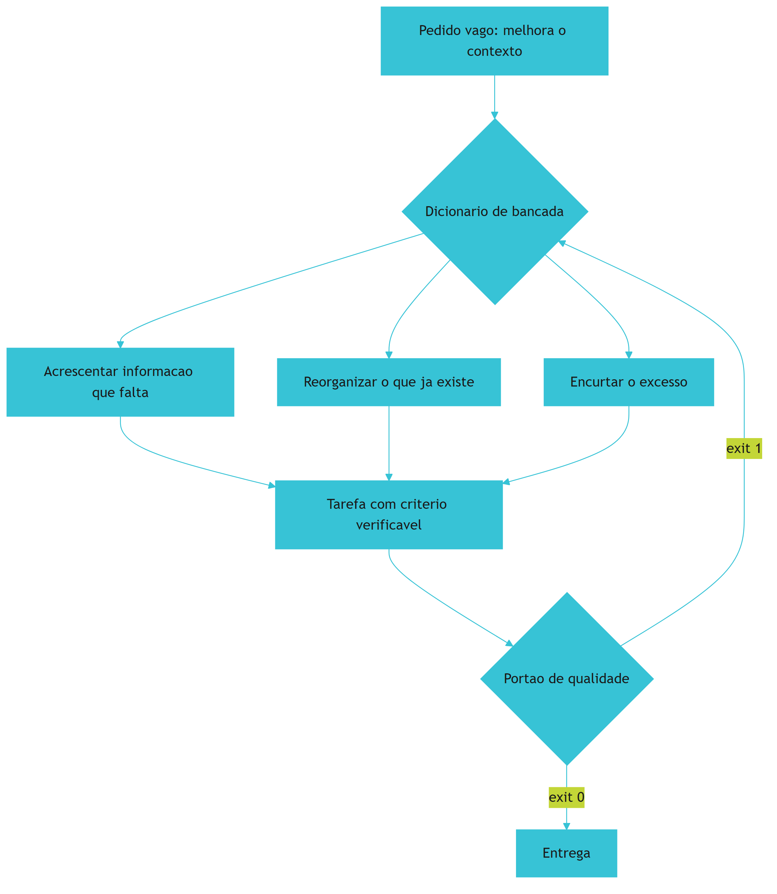

*Figura 2.1 — O dicionário de bancada não ensina palavras novas: ele reduz o número de pedidos que podem ser interpretados de duas formas.*

Como Engenheiro de Bancada, você vai notar que a maior parte dos "erros da IA" desaparece quando o pedido tem nome preciso. O dicionário é meio de produção, não glossário decorativo.

## 4. Técnica

### 4.1 O glossário como arquivo do projeto

Glossário que vive na cabeça não serve para nada. O primeiro artefato técnico deste capítulo é o arquivo de vocabulário do projeto, versionado junto com o código. Ele é pequeno de propósito: só entram termos que aparecem em decisões, e cada entrada tem definição curta, o que não é e o exemplo no domínio.

```yaml
# vocabulario.yaml — dicionario de bancada do projeto
versao: 1
termos:
  - termo: pedido
    definicao: linha do arquivo de origem que representa uma compra
    nao_e: nao e o cliente, nao e o item, nao e o pagamento
    exemplo: "identificador 8842, cliente Ana, total 132,90"
  - termo: lote
    definicao: conjunto de linhas importadas em uma mesma execucao
    nao_e: nao e o dia de calendario
    exemplo: "arquivo de 12 de setembro com 480 linhas"
  - termo: duplicidade
    definicao: mesmo identificador de origem em duas linhas
    nao_e: mesmo cliente ou mesmo valor repetido
    exemplo: "identificador 8842 aparecendo no lote de hoje e no de ontem"
  - termo: conferencia
    definicao: verificacao automatica que aprova ou bloqueia um lote
    nao_e: revisao manual por amostragem
    exemplo: "colunas obrigatorias, totais e duplicidades"
```

O campo `nao_e` é o mais valioso do arquivo. Quase todo retrabalho nasce de uma definição que todo mundo acha que compartilha e ninguém escreveu.

### 4.2 A verificação que impede o glossário de apodrecer

Vocabulário sem verificação morre em duas semanas: alguém cria um termo novo no código e o arquivo não acompanha. A defesa é um comando simples que roda junto com os outros portões e reprova quando o código usa um termo que o vocabulário não conhece.

```python
#!/usr/bin/env python3
"""Portao do vocabulario: reprova quando o codigo usa termo fora do dicionario."""
import re
import sys
from pathlib import Path

TERMOS_DO_CODIGO = re.compile(r"\b(pedido|lote|duplicidade|conferencia)\w*\b", re.IGNORECASE)


def carregar_termos(caminho):
    termos = set()
    for linha in caminho.read_text(encoding="utf-8").splitlines():
        achado = re.match(r"\s*-?\s*termo:\s*(\S+)", linha)
        if achado:
            termos.add(achado.group(1).lower())
    return termos


def auditar(pasta, termos_conhecidos):
    desconhecidos = {}
    for arquivo in pasta.rglob("*.py"):
        texto = arquivo.read_text(encoding="utf-8", errors="replace")
        for achado in TERMOS_DO_CODIGO.finditer(texto):
            palavra = achado.group(1).lower()
            if palavra not in termos_conhecidos:
                desconhecidos.setdefault(palavra, arquivo.name)
    return desconhecidos


def main():
    base = Path("vocabulario.yaml")
    termos = carregar_termos(base) if base.exists() else {"pedido", "lote", "duplicidade", "conferencia"}
    desconhecidos = auditar(Path("."), termos)
    if desconhecidos:
        print("[BLOQUEADO] termos fora do vocabulario:")
        for termo, arquivo in sorted(desconhecidos.items()):
            print(f"  - {termo}: usado em {arquivo}")
        return 1
    print("[APROVADO] vocabulario em dia")
    return 0


if __name__ == "__main__":
    sys.exit(main())
```

Repare no formato da saída: aprovado ou bloqueado, e no segundo caso a lista do que corrigir. Portão que só diz "falhou" obriga a pessoa a investigar; portão que diz onde falhou permite corrigir em trinta segundos.

### 4.3 O quadro de tradução por área

O dicionário é genérico, o domínio não. A tabela abaixo mostra como traduzir os termos para três áreas comuns — use a coluna mais próxima do seu caso como ponto de partida.

| Termo da bancada | Em um time de produto | Em operações e logística | Em uma área administrativa |
|---|---|---|---|
| Contexto canônico | Especificação da funcionalidade | Instrução de trabalho padrão | Manual do procedimento |
| Portão de qualidade | Critério de aceite automatizado | Checklist de conferência de carga | Conferência antes do envio |
| Contrato de dados | Modelo de dados da API | Layout do arquivo do coletor | Formulário padronizado |
| Roteamento | Triagem de chamados | Separação por tipo de carga | Encaminhamento por assunto |
| Idempotência | Requisição repetida não duplica registro | Releitura de romaneio não duplica nota | Reenvio de e-mail não gera dois protocolos |
| Linha de base | Métrica atual do produto | Tempo atual de conferência | Tempo atual de fechamento |

### 4.4 Quando o dicionário deixa de ser útil

O dicionário tem limite. Ele serve para alinhar vocabulário entre pessoas e entre projeto e modelo; não substitui a especificação da tarefa nem o contrato de dados. Se um termo precisa de mais de quatro linhas para ser explicado, o problema provavelmente não é o termo: é o conceito que ainda não foi decidido. Nesse caso, a decisão vai para o caderno de bancada e o termo fica no dicionário apenas como marcador de onde parar.

## 5. Aplica

**Situação.** Você assume a continuidade de um projeto de relatórios que outra pessoa começou. Existe um arquivo de instruções com um termo que aparece dezenove vezes: "consolidar". Você pede ao agente para "consolidar os pedidos do dia" e recebe três comportamentos diferentes em três execuções: uma soma por cliente, outra por dia e outra que remove duplicidades.

**O erro.** Você culpa o modelo e reescreve o pedido com mais detalhe em cada nova tentativa. Cada resposta mantém o mesmo termo ambíguo; você apenas adiciona qualificadores em volta dele. Ao final do dia, existem quatro versões do relatório e nenhuma decisão sobre o que "consolidar" significa.

**O diagnóstico.** O problema nunca foi o modelo: era o vocabulário. "Consolidar" carregava três significados plausíveis, e nenhum deles estava escrito. O dicionário teria resolvido em cinco minutos o que custou um dia — e isso é o efeito prático da compressão de informação descrita pela teoria da comunicação: o que não foi transmitido com precisão é preenchido por suposição do outro lado [2].

**A correção.** Três entradas no vocabulário do projeto: `pedido`, `lote` e `fechamento do dia`. A palavra "consolidar" sai das instruções e é substituída por "somar totais por identificador de origem, sem remover linhas". A partir daí, o mesmo pedido produz o mesmo relatório três vezes seguidas — e é isso que significa estar pronto.

**Métricas de sucesso.** O dicionário tem resultado mensurável; três indicadores mostram se ele pegou:

| Métrica | Como medir | Sinal de que funcionou |
|---|---|---|
| Termos ambíguos por arquivo de instruções | Contagem de termos sem entrada no vocabulário | Próximo de zero nos arquivos ativos |
| Retrabalho por pedido | Quantas execuções até o resultado correto | Sem queda, ainda há sinal de vocabulário faltando |
| Tempo de integração de pessoa nova | Quanto tempo até a pessoa entregar a primeira tarefa | Menor que antes, com menos perguntas básicas |

**Armadilhas comuns.** Três tropeços aparecem quase sempre. O primeiro é fazer glossário de livro: cinquenta termos, doze usados, e nenhuma revisão — em um mês o arquivo é decorativo. O segundo é definir o que o termo é e esquecer o que ele não é: a parte negativa da definição é justamente a que impede a interpretação errada. O terceiro é escrever o dicionário no chat e não no projeto, onde ninguém encontra depois.

**Até onde isso escala.** O dicionário funciona bem em um projeto e em um time pequeno, e continua útil em vários times desde que cada um mantenha os termos do seu domínio com um núcleo comum compartilhado. Ele não resolve, porém, divergência de significado entre áreas distintas que usam a mesma palavra para processos diferentes — ali é preciso um acordo explícito, e não apenas registro. Também não vale o esforço em trabalho exploratório, de um único uso: quando a tarefa não vai se repetir, o vocabulário é custo sem retorno.

### 5.1 A prova de três frases

Um glossário só existe quando resiste a três usos seguidos. A prova é barata e se faz com o seu próprio material, sem consultar ninguém.

**Primeira frase: a definição em uma linha.** Escreva o termo e, ao lado, a explicação do que ele significa no seu domínio. Se a explicação precisou de duas orações subordinadas para ficar correta, o termo ainda não está resolvido.

**Segunda frase: a frase de uso real.** Pegue a última vez em que o termo apareceu no seu projeto — em um e-mail, em uma descrição de tarefa, em um erro de tela — e reescreva aquela frase usando o glossário. Se a frase ficou mais longa, o termo está no caminho errado.

**Terceira frase: a frase de desambiguação.** Diga, em uma linha, o que não é aquele termo. É aqui que o dicionário ganha valor, porque a maior parte dos pedidos mal atendidos nasce de dois sentidos convivendo no mesmo nome [1].

| Termo | Definição em uma linha | O que não é |
|---|---|---|
| Lote | Conjunto de itens processados juntos | Não é um pedido isolado |
| Fechamento | Conferência que libera um lote | Não é a correção de erro |
| Trilha | Histórico de quem mudou o quê | Não é o backup dos dados |

Repare no que a terceira coluna faz: ela impede que o executor traduza o seu problema para o problema dele. Reduzir ambiguidade é reduzir entropia, e reduzir entropia é reduzir o número de vezes que a resposta precisa ser refeita [2].

**Aplicação no sistema.** Depois de rodar a prova, os termos aprovados viram a primeira seção do arquivo de contexto do projeto. A partir daí, eles não são mais vocabulário solto: são restrição declarada. A regra prática é manter o glossário pequeno e estável, porque contexto longo com termo mal definido piora o resultado em vez de melhorar [4].

## 6. Conclusão

Você agora tem nome preciso para o essencial: agente e subagente são operários com escopo, contexto é mesa de trabalho e não depósito, portão é decisão binária em forma de comando, worktree é isolamento físico, idempotência é a garantia de que repetir não estraga. Viu que vocabulário é infraestrutura porque a ambiguidade cobra em retrabalho, e que o dicionário se mantém vivo quando existe um portão que o fiscaliza. E viu como traduzir os termos da bancada para a linguagem do seu domínio.

**Desafio.** Escreva o arquivo de vocabulário do seu projeto com cinco termos, cada um com definição, a parte "não é" e um exemplo real do seu dia. Depois rode o portão da seção Técnica apontando para uma pasta do seu código e veja o que ele acusa.

No próximo capítulo, o alvo: você vai escolher o projeto que fica na bancada, medir a linha de base em números e preparar o repositório mínimo — o mesmo passo que o Painel de Pedidos deu antes de ter uma linha de automação.

## 7. Referências Bibliográficas

[1] PEREIRA, Luciano. *Empirical Validation of Cognitive-Derived Coding Constraints and Tokenization Asymmetries in LLM-Assisted Software Engineering*. 2026. Disponível em: https://doi.org/10.2139/ssrn.6294900. Acesso em: 12 set. 2026.
[2] SHANNON, Claude E. *A Mathematical Theory of Communication*. Bell System Technical Journal, 1948. Disponível em: https://doi.org/10.1002/j.1538-7305.1948.tb01338.x. Acesso em: 12 set. 2026.
[3] ALI, Mohamad Abou; DORNAIKA, Fadi; CHARAFEDDINE, Jinan. *Agentic AI: a comprehensive survey of architectures, applications, and future directions*. In: Artificial Intelligence Review. 2025. Disponível em: https://doi.org/10.1007/s10462-025-11422-4. Acesso em: 12 set. 2026.
[4] LIU, Nelson F. et al. *Lost in the Middle: How Language Models Use Long Contexts*. In: Transactions of the Association for Computational Linguistics. 2024. Disponível em: https://arxiv.org/abs/2307.03172. Acesso em: 12 set. 2026.
[5] MEI, Lingrui et al. *A Survey of Context Engineering for Large Language Models*. In: arXiv. 2025. Disponível em: https://arxiv.org/abs/2507.13334. Acesso em: 12 set. 2026.
[6] TRAXTECH. *20% of AI-Generated Code Dependencies Don't Exist, Creating Supply Chain Security Risks*. Disponível em: https://www.traxtech.com/blog/20-of-ai-generated-code-dependencies-dont-exist-creating-supply-chain-security-risks. Acesso em: 12 set. 2026.
[7] ANTHROPIC. *Model Context Protocol Specification (2025-06-18)*. Disponível em: https://modelcontextprotocol.io/specification/2025-06-18. Acesso em: 12 set. 2026.
[8] HUMBLE, Jez; FARLEY, David. *Continuous Delivery: Reliable Software Releases through Build, Test, and Deployment Automation*. Addison-Wesley, 2010. Disponível em: https://continuousdelivery.com/. Acesso em: 12 set. 2026.
[9] VERACODE. *2025 GenAI Code Security Report: AI-Generated Code Security Risks*. Disponível em: https://www.veracode.com/blog/ai-generated-code-security-risks/. Acesso em: 12 set. 2026.
[10] GIT. *git-worktree Documentation*. Disponível em: https://git-scm.com/docs/git-worktree. Acesso em: 12 set. 2026.
[11] CHACON, Scott; STRAUB, Ben. *Pro Git: Everything you need to know about Git*. 2. ed. Apress, 2014. Disponível em: https://git-scm.com/book/en/v2. Acesso em: 12 set. 2026.
[12] ANTHROPIC. *Prompt Caching — Claude Platform Docs*. Disponível em: https://platform.claude.com/docs/en/build-with-claude/prompt-caching. Acesso em: 12 set. 2026.
[13] AMAZON WEB SERVICES. *Prompt caching for faster model inference — Amazon Bedrock*. Disponível em: https://docs.aws.amazon.com/bedrock/latest/userguide/prompt-caching.html. Acesso em: 12 set. 2026.
[14] NATIONAL SECURITY AGENCY. *Model Context Protocol (MCP) Security — CSI*. Disponível em: https://www.nsa.gov/Portals/75/documents/Cybersecurity/CSI_MCP_SECURITY.pdf. Acesso em: 12 set. 2026.
[15] CHECKMARX. *11 Emerging AI Security Risks with MCP (Model Context Protocol)*. Disponível em: https://checkmarx.com/zero-post/11-emerging-ai-security-risks-with-mcp-model-context-protocol/. Acesso em: 12 set. 2026.
[16] NYGARD, Michael T. *Release It!: Design and Deploy Production-Ready Software*. 2. ed. Pragmatic Bookshelf, 2018. Disponível em: https://pragprog.com/titles/mnee2/release-it-second-edition/. Acesso em: 12 set. 2026.
[17] HADI, Muhammad Usman et al. *A Survey on Large Language Models: Applications, Challenges, Limitations, and Practical Usage*. 2023. Disponível em: https://doi.org/10.36227/techrxiv.23589741.v1. Acesso em: 12 set. 2026.
[18] ENDOR LABS. *The Most Common Security Vulnerabilities in AI-Generated Code*. Disponível em: https://www.endorlabs.com/learn/the-most-common-security-vulnerabilities-in-ai-generated-code. Acesso em: 12 set. 2026.
[19] DORA / GOOGLE CLOUD. *State of AI-assisted Software Development 2025*. Disponível em: https://dora.dev/dora-report-2025/. Acesso em: 12 set. 2026.
[20] RAKSHIT, Yerram Sai. *Modernizing Software Testing: AI, Telemetry, and Agentic Quality Engineering*. In: International Journal of AI Engineering. 2026. Disponível em: https://doi.org/10.34218/ijaieg_01_01_002. Acesso em: 12 set. 2026.
[21] OPENAI. *Introducing SWE-bench Verified*. Disponível em: https://openai.com/index/introducing-swe-bench-verified/. Acesso em: 12 set. 2026.
[22] SQLITE. *Write-Ahead Logging*. Disponível em: https://www.sqlite.org/wal.html. Acesso em: 12 set. 2026.
[23] SQLITE. *File Locking And Concurrency In SQLite Version 3*. Disponível em: https://sqlite.org/lockingv3.html. Acesso em: 12 set. 2026.

# Capítulo 3: O seu projeto na bancada

## 1. Introdução

No Capítulo 2 você montou o dicionário da bancada e passou a nomear com precisão o que antes era conversa solta. Agora falta o principal: o objeto de trabalho. Uma bancada sem projeto na mesa é só uma parede de ferramentas organizadas — bonita, inútil.

Ao final deste capítulo você terá escolhido o projeto que vai atravessar o livro, fotografado o estado atual dele em números e criado a base mínima de trabalho: um repositório com uma verificação que já roda. Este é o capítulo que separa quem vai ter resultado ao final de quem vai ter apenas anotações.

## 2. Explica

### 2.1 O alvo certo tem quatro características

A primeira decisão prática da bancada é a escolha do alvo, e ela é mais determinante do que a escolha da ferramenta. O alvo certo é **pequeno** (cabe em uma sessão de trabalho por ciclo), **real** (alguém fora de você depende do resultado), **recorrente** (acontece com frequência suficiente para você comparar antes e depois) e **consequente** (errar custa algo concreto). Faltando qualquer uma das quatro, o aprendizado perde aderência.

Note o que a condição de "real" descarta: exercício de tutorial, projeto de estudo sem usuário e reescrita de algo que ninguém usa. Existe uma razão para exigir essa condição agora, e ela vem da prática, não da teoria: os relatórios de desempenho de entrega mostram que a IA acelera organizações que já têm processo e apenas expõe gargalo nas que não têm [1]. Ou seja, você quer um caso onde a melhoria apareça de verdade, com gente sentindo a diferença.

Existe ainda uma razão de escala. O volume de projetos com apoio de modelos de linguagem cresceu a ponto de virar padrão de mercado, e a mesma pesquisa que mostra esse volume mostra que a diferença de resultado entre ferramentas é menor do que a diferença causada pela forma de conduzir o trabalho [2]. Escolher bem o alvo é a parte da condução que não dá para delegar [3].

O alvo também precisa de fronteira clara. "Melhorar os relatórios da loja" não é alvo: é área. "Conferir o arquivo diário de pedidos e gerar o total por forma de pagamento" é alvo: tem entrada, tem saída e tem critério de pronto.

### 2.2 Fotografar antes: a linha de base

Toda melhoria não medida é opinião. A linha de base é a fotografia do estado atual: quanto tempo a tarefa consome, com que frequência erra, quanto retrabalho gera e quem depende dela. Você vai gravar quatro números, e a régua importa mais que a precisão — números com a mesma régua antes e depois valem mais que números exatos em uma medição só.

Há uma tentação perigosa nessa fase: pular a medição porque ela parece óbvia. Não pareça. A adoção de ferramentas de IA já é maioria entre desenvolvedores, enquanto **46%** dos consultados afirmam desconfiar da exatidão do que essas ferramentas produzem [4]. Esse descompasso é justamente o motivo pelo qual "parece melhor" não serve como evidência: muita coisa parece melhor sem ser [5].

Medir também protege você de otimizar a coisa errada. Sistemas de diagnóstico empresarial ensinam há décadas que a maior parte do tempo de um processo está em um passo que ninguém suspeita — e que a intuição do operador raramente aponta esse passo [6]. Há um segundo motivo: número fácil de produzir é número fácil de enganar. Métricas padronizadas de avaliação de agentes chegaram à saturação justamente porque foram otimizadas em vez de resolvidas, e modelos que lideram a métrica pública caem de patamar quando o teste é outro [7]. Medição honesta escolhe a régua antes de escolher o resultado.

### 2.3 A base mínima: três arquivos e uma verificação

A base de trabalho é deliberadamente pobre: um repositório, três arquivos e um comando que roda. O repositório existe para dar histórico; os três arquivos são o objetivo da tarefa, o caderno de bancada e a linha de base. O comando que roda é a primeira lâmpada de teste — mesmo que ele verifique pouco no início, o importante é que ele exista e que o resultado dele seja sempre o mesmo tipo de resposta: aprovado ou bloqueado.

Essa obsessão por verificação binária não é preciosismo. A prática de entrega contínua consolidou a ideia de que a automação da verificação é o que permite velocidade sustentada, porque a alternativa é a conferência manual, que não escala e não garante [8]. Em software que precisa durar, o mesmo princípio aparece na forma de estabilidade em produção [9].

A terceira razão para nascer com verificação é de arquitetura: se você deixa a decisão de "onde mora a regra" para depois, o código aprende a espalhar regra pelo caminho. Comece com a regra de negócio isolada do resto e a dependência apontando para dentro [10].

O repositório entra nessa base por um motivo simples: histórico é o que permite voltar atrás sem adivinhação, e a mecânica de ramificação e cópia de trabalho existe exatamente para isso [11]. O caderno de bancada pode ser um arquivo versionado sem cerimônia nenhuma, e o estado local da operação fica em banco de arquivo único, que dispensa servidor e sobrevive à sessão [12]. Se você quiser ir um passo além do básico, registre também o resultado de cada execução: sem telemetria, a operação não distingue sucesso de coincidência [13].

### 2.4 O alvo do caso âncora

O alvo do caso âncora é a conferência de pedidos, medida em uma operação pequena de varejo. O trabalho de hoje é manual do começo ao fim, e o quadro abaixo é a linha de base registrada na sessão de abertura da bancada:

| Item | Valor medido | Como foi medido |
|---|---|---|
| Frequência da tarefa | 5 vezes por semana | Contagem dos dias com arquivo recebido |
| Tempo por execução | 8 minutos | Cronômetro em cinco execuções seguidas |
| Erros por mês | 3 registros | Divergências apontadas depois da conferência manual |
| Retrabalho por erro | 25 minutos | Reconferência e correção do relatório enviado |
| Dependência externa | 2 pessoas | Quem usa o relatório no mesmo dia |

Repare no formato. Nada aqui é estimativa vaga: cada linha tem valor e procedimento. É essa combinação que permite, no Capítulo 12, afirmar ganho sem apelar para memória.

## 3. Ilustra

Toda oficina tem uma parede com duas fotografias: a do equipamento como ele chegou e a de como ele saiu. A primeira parece constrangedora — ferrugem, peça torta, gambiarra antiga. A segunda dá orgulho. Mas o valor da parede não está em nenhuma das duas isoladas: está na comparação. Sem a foto do antes, ninguém consegue dizer o que melhorou, e o elogio fica sendo uma questão de opinião de quem lembra.

A bancada funciona igual. A linha de base é a foto do antes, e ela precisa ser tirada com o equipamento ainda sujo — não depois de você já ter começado a arrumar, porque aí a foto vira propaganda. Repare também no detalhe de método: a foto é tirada sempre do mesmo ângulo. Se você mediu tempo de um jeito antes, mede do mesmo jeito depois.

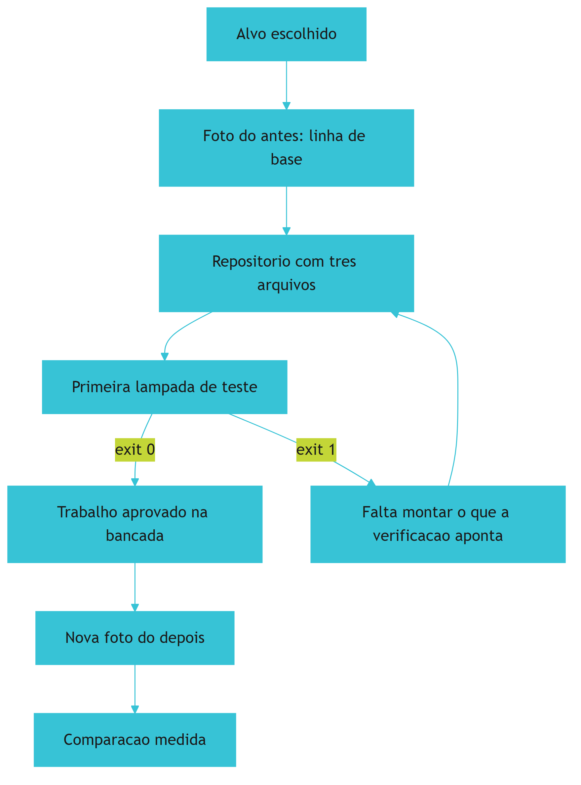

*Figura 3.1 — A parede da bancada: o alvo escolhido entra, a foto do antes é fixada e a primeira lâmpada de teste passa a decidir o que sai.*

Como Engenheiro de Bancada, você vai perceber que a foto do antes é o artefato mais barato e mais subestimado do projeto. Ela custa vinte minutos e sustenta todas as decisões seguintes.

## 4. Técnica

### 4.1 O cronômetro de linha de base

O primeiro instrumento é um medidor simples: ele registra cada execução da tarefa com início, fim e resultado, e grava tudo em um arquivo de registro. Rode por uma semana antes de automatizar qualquer coisa.

```python
#!/usr/bin/env python3
"""Medidor de linha de base: registra execucoes da tarefa manual."""
import json
from datetime import datetime, timedelta
from pathlib import Path

ARQUIVO = Path("linha-de-base.json")


def registrar(inicio_iso, minutos, resultado, observacao=""):
    registro = json.loads(ARQUIVO.read_text(encoding="utf-8")) if ARQUIVO.exists() else []
    registro.append({
        "inicio": inicio_iso,
        "minutos": minutos,
        "resultado": resultado,
        "observacao": observacao,
    })
    ARQUIVO.write_text(json.dumps(registro, ensure_ascii=False, indent=2), encoding="utf-8")
    return resumo(registro)


def resumo(registro):
    total = len(registro)
    minutos = sum(item["minutos"] for item in registro)
    falhas = sum(1 for item in registro if item["resultado"] != "ok")
    return {
        "execucoes": total,
        "minutos_totais": minutos,
        "minutos_medios": round(minutos / total, 1) if total else 0,
        "taxa_de_falha": round(falhas / total, 2) if total else 0,
    }


def main():
    base = datetime(2026, 9, 14, 9, 0, 0)
    amostras = [(0, 8, "ok"), (1, 7, "ok"), (2, 11, "divergencia"), (3, 8, "ok"), (4, 6, "ok")]
    for dias, minutos, resultado in amostras:
        inicio = (base + timedelta(days=dias)).isoformat()
        painel = registrar(inicio, minutos, resultado)
    print(json.dumps(painel, ensure_ascii=False, indent=2))


if __name__ == "__main__":
    main()
```

O resumo é o que importa: execuções, minutos totais, minutos médios e taxa de falha. Quatro números que caberão inteiros no certificado do Capítulo 14.

### 4.2 A árvore mínima do repositório

Repositório de projeto real não precisa de estrutura elaborada. Precisa de separação entre regra de negócio, dados e operação. Esta é a árvore inicial do caso âncora:

```text
painel-de-pedidos/
  objetivo.md          # o que a tarefa entrega e qual o criterio de pronto
  caderno.json         # decisoes, com data e motivo
  linha-de-base.json   # medicao do antes
  vocabulario.yaml     # termos do dominio, com a parte "nao e"
  regras/
    regras.md          # o que e proibido e o que e obrigatorio
  dados/
    entrada/           # arquivos recebidos, nunca editados a mao
    estado/            # banco local e registros de execucao
  verificacoes/
    conferir_entrada.py
```

A regra de ouro dessa árvore: `dados/entrada/` é somente leitura, sempre. Toda automação lê de lá e escreve em `estado/`. Sem essa separação, a primeira execução com defeito destrói a única cópia do dado original.

### 4.3 A primeira verificação que roda

A verificação inicial não precisa ser profunda; precisa ser binária e honesta. Ela confere que o arquivo existe, que as colunas obrigatórias estão presentes e que nenhuma linha está vazia. Se qualquer uma dessas condições falhar, o comando devolve bloqueio.

```python
#!/usr/bin/env python3
"""Primeira lampada de teste: valida a forma do arquivo de entrada."""
import csv
import sys
from pathlib import Path

COLUNAS_OBRIGATORIAS = {"identificador", "cliente", "valor", "data"}


def conferir(caminho: Path):
    problemas = []
    if not caminho.exists():
        return [f"arquivo ausente: {caminho.name}"]
    with caminho.open(encoding="utf-8", newline="") as arquivo:
        leitor = csv.DictReader(arquivo)
        colunas = set(leitor.fieldnames or [])
        faltando = COLUNAS_OBRIGATORIAS - colunas
        if faltando:
            problemas.append("colunas ausentes: " + ", ".join(sorted(faltando)))
        for numero, linha in enumerate(leitor, start=2):
            if not str(linha.get("identificador", "")).strip():
                problemas.append(f"linha {numero}: identificador vazio")
    return problemas


def main():
    caminho = Path(sys.argv[1]) if len(sys.argv) > 1 else Path("dados/entrada/exemplo.csv")
    problemas = conferir(caminho)
    if problemas:
        print("[BLOQUEADO] entrada reprovada:")
        for item in problemas:
            print(f"  - {item}")
        return 1
    print("[APROVADO] entrada conforme")
    return 0


if __name__ == "__main__":
    sys.exit(main())
```

Três coisas fazem essa verificação valer mais do que parece. Ela é executável por qualquer pessoa, com um comando. Ela explica o que reprovou, em vez de só falhar. E ela não depende do modelo: nenhuma decisão do dia pode ser aprovada por acidente.

Esse último ponto é o mais importante da fase inicial. Código gerado sem verificação costuma chegar com defeitos que só aparecem em uso real, incluindo práticas conhecidas como inseguras [14] e dependências que não existem [15]. A verificação de entrada é barata, roda em milissegundos e cobre a primeira linha de defesa: se o dado que entra está errado, nada do que vem depois importa.

### 4.4 O quadro de linha de base para o seu projeto

Copie o formato do caso âncora e preencha com os seus números. O quadro vazio é o primeiro artefato que você produz na sua bancada.

| Item | Valor medido | Como será medido |
|---|---|---|
| Frequência da tarefa | | |
| Tempo por execução | | |
| Erros por período | | |
| Retrabalho por erro | | |
| Dependência externa | | |

## 5. Aplica

**Situação.** Você decide automatizar a emissão de notas de serviço da sua equipe. É segunda-feira e o entusiasmo está alto: monta o repositório, cria pastas por mês, escreve o script que lê a planilha e gera o PDF, e conclui que está pronto antes do fim do dia.

**O erro.** Na terça você descobre que existem duas planilhas: uma da equipe interna e outra do parceiro externo, com nomes de coluna diferentes. Na quarta, percebe que metade dos registros do mês anterior não estava na sua medição porque a tarefa era feita por outra pessoa. No dia 20 você olha para o projeto e não consegue dizer se ele melhorou alguma coisa — não existe número de partida para comparar, nem registro de quantas vezes a nota saiu errada.

**O diagnóstico.** O erro não foi técnico, foi de sequência: você automatizou antes de medir e escolheu um alvo com fronteira difusa. Sem linha de base, o ganho virou narrativa. Sem fronteira, o escopo cresceu sozinho. É o mesmo padrão que a pesquisa de desempenho de entrega descreve quando a IA é aplicada a um processo que ainda não está definido: a ferramenta amplifica a desorganização existente [1].

**A correção.** Volte duas casas. Escreva a fronteira em uma frase — "conferir a planilha interna do mês e gerar o resumo de valores por tipo de serviço" — e deixe o parceiro externo de fora, registrando a decisão no caderno. Meça uma semana com o cronômetro antes de tocar no código de novo. Só então retome a automação, agora com um número de partida e um critério de pronto verificável.

**Métricas de sucesso.** A linha de base em si tem indicadores de qualidade; use esta tabela para verificar se a sua está honesta:

| Métrica | Como medir | Sinal de que funcionou |
|---|---|---|
| Cobertura da medição | Execuções medidas dividido por execuções realizadas | Acima de metade na primeira semana |
| Fronteira declarada | Existe frase única com entrada, saída e critério de pronto | Escrita antes da primeira linha de código |
| Verificação executável | Comando único que devolve aprovado ou bloqueado | Roda em menos de um segundo |
| Registro de decisões | Decisões gravadas com data e motivo | Toda mudança de rumo com entrada no caderno |

**Nota de contexto.** A escolha do alvo também tem efeito sobre o que você vai conseguir provar depois. Suítes padronizadas de avaliação de agentes existem justamente porque comparar resultados sem régua comum produz conclusão falsa, e elas nasceram da prática de medir com critério fixo [16]. Vale a mesma disciplina aqui.

**Nota de contexto.** Boa parte dos problemas de linha de base nasce do modo de trabalho anterior: quando o hábito é pedir código em conversa e colar no editor, ninguém mede nada porque nada é comparável — é o retrato que as revisões de código por conversa descrevem como armadilha de escala [20]. A medição é o primeiro passo que rompe esse ciclo, e ela só funciona se o que entra na mesa for a informação necessária, não o histórico inteiro [21].

**Armadilhas comuns.** Quatro aparecem com frequência nesta fase. A primeira é escolher um alvo grande demais: se o primeiro ciclo não fecha em uma sessão, o projeto perde tração antes do primeiro resultado. A segunda é medir depois de começar a melhorar, o que transforma a linha de base em estimativa. A terceira é tratar a verificação inicial como formalidade e apagá-la quando ela reprova o dado — o portão que incomoda é justamente o que está funcionando. A quarta é começar pelo dado real de produção sem cópia: trabalhe em uma amostra até a rotina estar estável. Há uma quinta, mais sutil: confiar em agente que otimiza a própria métrica. Agentes de horizonte longo já foram observados satisfazendo o teste em vez de resolver o problema, e esse comportamento se transfere entre domínios [17] [18].

**Até onde isso escala.** Uma linha de base manual serve bem para uma pessoa e para uma tarefa com dezenas de execuções por semana; ela também pressupõe que você conheça o processo o suficiente para descrevê-lo, o que não é o caso em áreas onde o procedimento existe apenas na prática de quem executa. Ali, o primeiro passo é observar antes de medir, e não o contrário. E há o limite de confiança: verificação de entrada cobre forma, não intenção — um arquivo pode estar formalmente correto e ainda assim conter pedido indevido, o que exige conferência de negócio, de preferência com registro de quem aprovou [19]. ela perde utilidade quando a tarefa passa a acontecer dezenas de vezes por dia, porque medir à mão vira a nova tarefa manual. Nesse ponto, a medição precisa ser automática e o assunto passa a ser observabilidade, não cronômetro. Também não vale manter linha de base para tarefa única: quando não há repetição, não há comparação possível e o esforço de medir não se paga.

### 5.1 A linha de base em quatro números

Sem linha de base, toda melhoria é impressão. Com quatro números, a conversa muda de tom em duas semanas.

| Número | Como medir | Onde ele vive |
|---|---|---|
| Tempo de ciclo | Do pedido até a entrega aceita | Caderno de bancada |
| Taxa de retrabalho | Entregas refeitas divididas pelo total | Caderno de bancada |
| Falhas em produção | Ocorrências por semana | Registro de incidentes |
| Tempo de conferência | Minutos gastos revisando saída gerada | Cronômetro, uma semana |

Meça os quatro na mesma semana e anote a data. Número de semanas diferentes não é comparável, porque o volume de trabalho muda e a comparação vira ruído.

**A ordem importa.** Comece pelo tempo de conferência, que é o mais rápido de medir e o que mais surpreende. Em seguida, o tempo de ciclo. Só depois a taxa de retrabalho, que exige uma definição estável do que conta como refeito. A taxa de falhas fica por último porque depende de haver entrega em produção.

**O que a linha de base não é.** Ela não serve para provar que a IA funciona, nem para provar que não funciona. Serve para responder, no capítulo 16, a uma pergunta única: o projeto ficou melhor do que estava, segundo o mesmo critério de antes? Projeto sem critério declarado não tem como responder isso, e a medição vira anedota de quem falou por último [1].

Times que medem recuperação e tempo até a restauração como métricas de primeira linha entregam com mais previsão do que times que só contam velocidade [8]. O mesmo princípio vale para uma bancada individual, com a diferença de que aqui quem mede e quem entrega são a mesma pessoa — o que torna a honestidade do número parte do método [10].

## 6. Conclusão

Você escolheu um alvo com fronteira declarada, fotografou o estado atual em quatro números com procedimento de medição e montou a base mínima: repositório, caderno, vocabulário e uma verificação que devolve aprovado ou bloqueado. Viu que medir antes é o que impede o ganho de virar narrativa, e que a entrada de dados precisa ser tratada como material intocável. E conheceu o alvo do caso âncora, com a linha de base do Painel de Pedidos registrada.

**Desafio.** Preencha o quadro de linha de base da seção Técnica com o seu projeto, rode o cronômetro por três execuções e grave a primeira decisão no caderno. Depois rode a verificação de entrada apontando para o seu arquivo real e veja o que ela acusa.

No próximo capítulo, a constituição: as regras que impedem o retrabalho de voltar e o arquivo único onde elas moram — o mesmo mecanismo que o Painel de Pedidos usou para nunca mais importar o mesmo pedido duas vezes.

## 7. Referências Bibliográficas

[1] DORA / GOOGLE CLOUD. *State of AI-assisted Software Development 2025*. Disponível em: https://dora.dev/dora-report-2025/. Acesso em: 12 set. 2026.
[2] GITHUB. *Octoverse 2025: The state of open source*. Disponível em: https://octoverse.github.com/. Acesso em: 12 set. 2026.
[3] ALI, Mohamad Abou; DORNAIKA, Fadi; CHARAFEDDINE, Jinan. *Agentic AI: a comprehensive survey of architectures, applications, and future directions*. In: Artificial Intelligence Review. 2025. Disponível em: https://doi.org/10.1007/s10462-025-11422-4. Acesso em: 12 set. 2026.
[4] STACK OVERFLOW. *2025 Developer Survey — AI*. Disponível em: https://survey.stackoverflow.co/2025/ai. Acesso em: 12 set. 2026.
[5] ROBBES, Romain et al. *Agentic Much? Adoption of Coding Agents on GitHub*. In: ACM Transactions on Software Engineering and Methodology. 2026. Disponível em: https://doi.org/10.1145/3822180. Acesso em: 12 set. 2026.
[6] FOWLER, Martin. *Patterns of Enterprise Application Architecture*. Boston: Addison-Wesley, 2002. Disponível em: https://martinfowler.com/books/eaa.html. Acesso em: 12 set. 2026.
[7] SCALE LABS. *SWE-Bench Pro (Public Dataset) — Leaderboard*. Disponível em: https://labs.scale.com/leaderboard/swe_bench_pro_public. Acesso em: 12 set. 2026.
[8] HUMBLE, Jez; FARLEY, David. *Continuous Delivery: Reliable Software Releases through Build, Test, and Deployment Automation*. Addison-Wesley, 2010. Disponível em: https://continuousdelivery.com/. Acesso em: 12 set. 2026.
[9] NYGARD, Michael T. *Release It!: Design and Deploy Production-Ready Software*. 2. ed. Pragmatic Bookshelf, 2018. Disponível em: https://pragprog.com/titles/mnee2/release-it-second-edition/. Acesso em: 12 set. 2026.
[10] MARTIN, Robert C. *Clean Architecture: A Craftsman's Guide to Software Structure and Design*. Prentice Hall, 2017. Disponível em: https://www.pearson.com/. Acesso em: 12 set. 2026.
[11] CHACON, Scott; STRAUB, Ben. *Pro Git: Everything you need to know about Git*. 2. ed. Apress, 2014. Disponível em: https://git-scm.com/book/en/v2. Acesso em: 12 set. 2026.
[12] SQLITE. *Write-Ahead Logging*. Disponível em: https://www.sqlite.org/wal.html. Acesso em: 12 set. 2026.
[13] RAKSHIT, Yerram Sai. *Modernizing Software Testing: AI, Telemetry, and Agentic Quality Engineering*. In: International Journal of AI Engineering. 2026. Disponível em: https://doi.org/10.34218/ijaieg_01_01_002. Acesso em: 12 set. 2026.
[14] VERACODE. *2025 GenAI Code Security Report: AI-Generated Code Security Risks*. Disponível em: https://www.veracode.com/blog/ai-generated-code-security-risks/. Acesso em: 12 set. 2026.
[15] TRAXTECH. *20% of AI-Generated Code Dependencies Don't Exist, Creating Supply Chain Security Risks*. Disponível em: https://www.traxtech.com/blog/20-of-ai-generated-code-dependencies-dont-exist-creating-supply-chain-security-risks. Acesso em: 12 set. 2026.
[16] OPENAI. *Introducing SWE-bench Verified*. Disponível em: https://openai.com/index/introducing-swe-bench-verified/. Acesso em: 12 set. 2026.
[17] METR. *Recent Frontier Models Are Reward Hacking*. Disponível em: https://metr.org/blog/2025-06-05-recent-reward-hacking/. Acesso em: 12 set. 2026.
[18] MORAMPUDI, Abhishek et al. *A survey of reward hacking in agentic large language model systems*. In: Discover Artificial Intelligence. 2026. Disponível em: https://link.springer.com/article/10.1007/s44163-026-01980-z. Acesso em: 12 set. 2026.
[19] NATIONAL INSTITUTE OF STANDARDS AND TECHNOLOGY. *Artificial Intelligence Risk Management Framework: Generative AI Profile (NIST AI 600-1)*. Disponível em: https://nvlpubs.nist.gov/nistpubs/ai/NIST.AI.600-1.pdf. Acesso em: 12 set. 2026.
[20] GE, Y. T. et al. *A Survey of Vibe Coding with Large Language Models*. In: arXiv. 2025. Disponível em: http://arxiv.org/abs/2510.12399. Acesso em: 12 set. 2026.
[21] LIU, Nelson F. et al. *Lost in the Middle: How Language Models Use Long Contexts*. In: Transactions of the Association for Computational Linguistics. 2024. Disponível em: https://arxiv.org/abs/2307.03172. Acesso em: 12 set. 2026.

# Capítulo 4: A Constituição da bancada

## 1. Introdução

No Capítulo 3 você escolheu o alvo, mediu a linha de base e montou a base mínima — inclusive a primeira verificação. O que ainda não existe é o que impede o trabalho de voltar a desandar: um conjunto pequeno de regras que valem sempre e que ninguém precisa lembrar de cabeça.

Ao final deste capítulo você terá escrito a constituição do seu projeto: regras curtas, com responsável e, sempre que possível, um comando que as fiscalize. Vai entender por que a maioria dos projetos com IA não falha por falta de regra, e sim por ter regra que ninguém consegue verificar.

## 2. Explica

### 2.1 Por que regra combinada de cabeça não sobrevive

Toda equipe tem regras. A diferença entre uma equipe que sustenta qualidade e outra que recomeça toda semana é onde essas regras moram. Regra na cabeça depende de memória humana, e memória humana sob pressão é o recurso mais escasso do projeto. Regra em arquivo, lida antes de cada tarefa, depende apenas de alguém executar o passo de leitura.

Há ainda um público que não estava no projeto de software clássico: o agente. Ele lê o repositório, não a reunião, e trata tudo que encontra com o mesmo peso — arquivo de regra, comentário antigo e rascunho esquecido valem igual para ele [1]. Delegar execução sem delegar responsabilidade é a origem da maior parte dos incidentes com agentes [2].

O argumento ganha peso quando o executor não é humano. Um modelo não tem acesso ao que foi combinado verbalmente na reunião de ontem e não distingue regra de sugestão se as duas estiverem escritas no mesmo tom. A revisão de engenharia de contexto trata exatamente essa fronteira: instrução que não foi explicitada não existe como restrição, existe como sugestão a ser reinterpretada a cada execução [3].

Há ainda um efeito de escala que torna a informalidade insustentável. A adoção já é maioria: 84% dos desenvolvedores consultados afirmam usar ferramentas de IA no trabalho [4]. Com esse volume, o que antes era uma conversa entre duas pessoas passou a ser um processo coletivo — e processo coletivo sem regra escrita degenera em costume local.

### 2.2 A diferença entre intenção e regra

Uma regra só é regra quando é possível dizer, sem discussão, se ela foi cumprida. "Escrever código de qualidade" é intenção. "Nenhum pedido entra no banco sem identificador de origem" é regra: existe um caso claro de violação e uma verificação possível.

Essa distinção é o coração da constituição, e ela tem consequência prática. A prática de entrega contínua converteu essa ideia em mecanismo: critério de aceite automatizado, execução repetível e bloqueio do que não passa [5]. O relatório de desempenho de entrega de 2025 reforça a mesma direção ao associar rigor de processo a melhor resultado organizacional [6]. Em governança de IA, a exigência é explícita: política sem controle técnico não é governança, é declaração de intenção [7].

Na prática, cada regra da constituição recebe um de três graus: **verificável por comando** (o melhor), **verificável por revisão humana com critério escrito** (aceitável) ou **intenção** (que deve sair do documento ou ser convertida em algo verificável).

A razão pela qual o grau importa tem base empírica. Instruções em formato explícito e restritivo alteram o resultado entregue mais do que instruções em formato de recomendação, o que é o mesmo fenômeno observado em estudos de restrição de escrita assistida [8]. E a experiência de produção ensina que restrição é o que permite escala: sistemas que aguentam carga real são os que têm limites explícitos em vez de tolerância implícita [9].

### 2.3 As dez leis da bancada

Estas são as dez leis do caso âncora. Elas são curtas de propósito: uma lei que precisa de parágrafo explicativo será esquecida na segunda semana.

1. **Nada entra sem contrato.** Toda tarefa declara entrada, saída e critério de pronto antes de começar.
2. **Regra que não se verifica não é regra.** Se ninguém consegue dizer se foi cumprida, ela é intenção e sai do documento.
3. **Nenhuma entrega sem portão.** O que não passou na verificação não avança, e não existe exceção informal.
4. **Contexto é recurso finito.** A mesa de trabalho recebe o que a tarefa de hoje exige, não o histórico inteiro [10].
5. **Ação destrutiva exige reversibilidade.** Antes de sobrescrever, copiar; antes de apagar, arquivar.
6. **Uma tarefa, um responsável.** Responsabilidade compartilhada é responsabilidade de ninguém.
7. **Registro é obrigatório.** Toda decisão com consequência entra no caderno, com data e motivo.
8. **Nada é entregue vermelho.** Falha conhecida bloqueia a entrega; dívida registrada não é desculpa.
9. **O dado de origem é intocável.** Automação lê da entrada e escreve no estado; nunca altera o original.
10. **O projeto não pertence ao fornecedor.** Dados, regras e histórico ficam do seu lado.

Repare que as leis não falam de tecnologia. Elas sobrevivem à troca de modelo, de ferramenta e de linguagem de programação — o que é justamente o teste de qualidade de uma constituição. A lei do dado intocável, por exemplo, é a mesma ideia que sustenta separação entre leitura e escrita em qualquer sistema que precise durar [11], e a lei do contexto finito decorre do fato de que informação transmitida de forma incompleta é completada por suposição do outro lado [12].

Algumas leis protegem contra modos de falha documentados de agentes. A lei de reversibilidade existe porque ação irreversível não tem conserto; a lei de nada vermelho existe porque casca que finge funcionar é o defeito mais caro de encontrar depois [13]; e a lei do registro existe porque a dívida de segurança cresce silenciosamente quando ninguém anota o que foi adiado [14]. Parte do problema vem de prática insegura escolhida sem intenção, o que reforça a necessidade de lei escrita [15].

### 2.4 Onde a constituição mora e quem a fiscaliza

A constituição vive em um arquivo na raiz do repositório, lido antes de cada tarefa por pessoa e por agente. Ela não é apenas um documento de boas intenções: cada lei aponta para o mecanismo que a fiscaliza — comando, revisão ou decisão consciente.

| Lei | Como é fiscalizada | O que acontece quando falha |
|---|---|---|
| 1 Contrato antes da tarefa | Verificação de esquema do arquivo de entrada | O lote é reprovado antes de entrar no banco |
| 2 Regra verificável | Revisão do arquivo de regras a cada mudança | A regra volta a ser intenção e é reescrita |
| 3 Nenhuma entrega sem portão | Comando único que devolve aprovado ou bloqueado | A entrega não avança |
| 4 Contexto finito | Conferência dos arquivos que a tarefa lê | O contexto é podado antes da execução |
| 5 Reversibilidade | Cópia obrigatória da pasta de dados | A ação é executada em modo de ensaio |
| 6 Um responsável | Campo de responsável no caderno | A tarefa é devolvida sem execução |
| 7 Registro obrigatório | Conferência do caderno na revisão | A entrega fica pendente até registrar |
| 8 Nada vermelho | Suíte de testes no portão do repositório | A integração é bloqueada |
| 9 Dado de origem intocável | Permissão de escrita restrita à pasta de estado | A automação corrompe o original e é interrompida |
| 10 Portabilidade | Teste de execução em dois ambientes | A troca de fornecedor é bloqueada por decisão de projeto |

Uma constituição de dez leis, cada uma com fiscalização declarada, é o que separa um projeto que melhora de um projeto que apenas acumula código. E há um efeito colateral bem-vindo: a constituição também serve como critério de comparação entre ferramentas. Quando as leis estão escritas, trocar de modelo ou de assistente deixa de ser uma aposta e passa a ser um teste com resposta binária [5].

## 3. Ilustra

Numa oficina organizada existe um quadro com as normas de segurança. Ele não tem trinta itens: tem dez, escritos com letras grandes, porque norma que não pode ser lida do outro lado do galpão não é lida. Ao lado de cada norma existe a indicação de quem responde por ela — não por acaso, a norma que fala de óculos de proteção tem o nome do encarregado da bancada de corte.

A analogia vale item por item. Norma sem dono é enfeite; norma sem consequência é sugestão; norma que ninguém consegue verificar gera discussão toda semana. E existe um detalhe de forma que muda tudo: as normas ficam **na parede da bancada**, não no escritório da diretoria. Elas são lidas por quem executa, no momento em que executa.

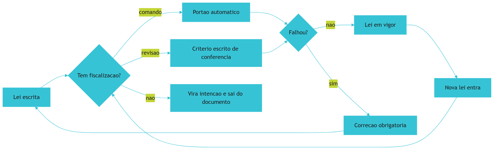

*Figura 4.1 — Toda lei da constituição passa pelo teste da fiscalização: o que não tem dono nem verificação sai do documento.*

Como Engenheiro de Bancada, você vai notar que a constituição é o único artefato do projeto que vale a pena revisar todo mês. Ela envelhece junto com o sistema.

## 4. Técnica

### 4.1 O arquivo de regras do projeto

Este é o formato do arquivo de constituição. Note que ele não pede boa vontade: pede que cada regra declare a forma de fiscalização e a consequência de violação.

```yaml
# regras.yaml — constituicao da bancada do projeto
versao: 2
leis:
  - id: 1
    lei: nada entra sem contrato
    fiscalizacao: comando
    verificador: verificacoes/conferir_entrada.py
    consequencia: lote reprovado antes de gravar no banco
  - id: 3
    lei: nenhuma entrega sem portao
    fiscalizacao: comando
    verificador: verificacoes/rodar_portoes.sh
    consequencia: entrega bloqueada
  - id: 9
    lei: o dado de origem e intocavel
    fiscalizacao: revisao
    verificador: revisao semanal da arvore de dados
    consequencia: permissao de escrita restrita a pasta de estado
  - id: 10
    lei: o projeto nao pertence ao fornecedor
    fiscalizacao: comando
    verificador: verificacoes/testar_portabilidade.py
    consequencia: troca de fornecedor bloqueada por decisao de projeto
```

Regras que não têm verificador válido são reportadas pelo próprio portão da constituição — o instrumento da próxima seção.

### 4.2 O portão que fiscaliza a constituição

Uma constituição sem fiscalização envelhece como qualquer documento. Este portão lê o arquivo de regras e reprova quando encontra lei declarada como verificável mas sem verificador existente, ou lei sem consequência definida.

```python
#!/usr/bin/env python3
"""Portao da constituicao: nenhuma lei sem fiscalizacao declarada e valida."""
import re
import sys
from pathlib import Path

ARQUIVO = Path("regras.yaml")
CAMPOS = ("id", "lei", "fiscalizacao", "verificador", "consequencia")
FISCALIZACOES_VALIDAS = {"comando", "revisao"}


def ler_leis(texto):
    leis, atual = [], None
    for linha in texto.splitlines():
        achado = re.match(r"\s*-\s*id:\s*(\S+)", linha)
        if achado:
            atual = {"id": achado.group(1)}
            leis.append(atual)
            continue
        if atual is None:
            continue
        for campo in CAMPOS[1:]:
            achado = re.match(rf"\s*{campo}:\s*(.+)$", linha)
            if achado:
                atual[campo] = achado.group(1).strip()
    return leis


def validar(leis):
    problemas = []
    for lei in leis:
        faltando = [c for c in CAMPOS if not lei.get(c)]
        if faltando:
            problemas.append(f"lei {lei.get('id', '?')}: campos ausentes {', '.join(faltando)}")
            continue
        if lei["fiscalizacao"] not in FISCALIZACOES_VALIDAS:
            problemas.append(f"lei {lei['id']}: fiscalizacao invalida '{lei['fiscalizacao']}'")
        elif lei["fiscalizacao"] == "comando":
            alvo = Path(lei["verificador"])
            if not alvo.exists():
                problemas.append(f"lei {lei['id']}: verificador inexistente {alvo}")
    return problemas


def main():
    if not ARQUIVO.exists():
        print("[BLOQUEADO] regras.yaml ausente: a bancada nao tem constituicao")
        return 1
    problemas = validar(ler_leis(ARQUIVO.read_text(encoding="utf-8")))
    if problemas:
        print("[BLOQUEADO] constituicao incompleta:")
        for item in problemas:
            print(f"  - {item}")
        return 1
    print("[APROVADO] constituicao completa e fiscalizavel")
    return 0


if __name__ == "__main__":
    sys.exit(main())
```

Este é o tipo de automação que se paga rápido: ele custa vinte linhas e impede que a constituição vire folclore. Vale notar que portões como esse só fazem sentido dentro de um fluxo maior de verificação, em que cada etapa deixa rastro do que aprovou — exatamente a ideia de qualidade verificável que a engenharia de qualidade vem incorporando com apoio de telemetria [16].

### 4.3 As leis que quase todo mundo esquece

Três leis costumam faltar nas primeiras versões e cobram caro depois. A tabela abaixo mostra o sintoma e a redação da lei que resolve.

| Sintoma observado | Lei que estava faltando | Redação sugerida |
|---|---|---|
| Arquivo original alterado por script | O dado de origem é intocável | Automação lê da entrada e escreve apenas no estado |
| Correção aplicada direto em produção | Ação destrutiva exige reversibilidade | Toda alteração parte de cópia e tem volta |
| Ninguém sabe quem aprovou a mudança | Uma tarefa, um responsável | Cada tarefa tem responsável registrado no caderno |
| Regra discutida de novo toda semana | Regra que não se verifica não é regra | Toda lei declara forma de fiscalização |
| Troca de ferramenta obriga refazer o projeto | O projeto não pertence ao fornecedor | Dados, regras e histórico ficam no repositório |

### 4.4 O que nunca entra na constituição

Existem três categorias que não pertencem ao documento. **Preferência pessoal** ("usar sempre a biblioteca x") muda com o tempo e não descreve consequência. **Decisão de infraestrutura específica** ("rodar no provedor y") é escolha técnica, e vira restrição apenas se houver um motivo de lei — como portabilidade. E **regra que depende de interpretação** ("escrever código limpo") pertence a um guia de estilo, não à constituição: misturar as duas coisas faz com que a constituição inteira seja tratada como sugestão.

## 5. Aplica

**Situação.** Você assume a liderança de um time que usa IA para escrever código há seis meses. Existe um documento de regras com vinte e dois itens, escrito com boa intenção, e você decide começar a aplicá-lo. Na primeira semana, dois desenvolvedores discutem por dez minutos se uma mudança viola ou não a regra número 9 — "manter o código simples". Ninguém sabe responder.

**O erro.** Você tenta resolver a discussão escrevendo uma versão mais detalhada da mesma regra. O documento passa a ter vinte e quatro itens, a regra 9 ganha dois parágrafos e a discussão volta na semana seguinte, agora sobre a interpretação do parágrafo novo.

**O diagnóstico.** A regra 9 nunca foi regra: era intenção. Discutir intenção não tem árbitro, porque não há fato a verificar. O time não tinha problema de disciplina, tinha documento com o tipo errado de conteúdo misturado — o que faz com que as regras de fato verificáveis também percam autoridade [5].

**A correção.** Separe o documento em dois. No guia de estilo ficam as preferências e o bom senso, referenciadas como orientação. Na constituição ficam dez leis, todas com fiscalização declarada, e a antiga regra 9 é convertida em dois comandos: limite de complexidade por função e proibição de parâmetro que altera comportamento global. A discussão desaparece porque existem comandos que respondem.

**Métricas de sucesso.** A constituição se avalia por quatro números simples:

| Métrica | Como medir | Sinal de que funcionou |
|---|---|---|
| Leis com fiscalização declarada | Contagem no arquivo de regras | Todas as leis têm dono |
| Verificadores existentes e executáveis | Portão da constituição rodando no repositório | Aprovação em 100% das verificações declaradas |
| Discussões repetidas sobre a mesma regra | Registro no caderno de bancada | Mesma regra não volta a ser discutida |
| Tempo de leitura da constituição | Leitura cronometrada na integração de alguém novo | Cabe em uma leitura única |

**Nota de contexto.** Antes de culpar a equipe pela informalidade, olhe o volume de adoção: 84% dos desenvolvedores consultados já usam ferramentas de IA no trabalho, e a maioria deles decidiu isso por conta própria, sem processo definido pela organização [17]. A constituição é a resposta de processo a uma decisão que já foi tomada na prática. Estudos amplos sobre modelos de linguagem registram que esse padrão de adoção sem governança não é exclusividade de uma ferramenta ou de um país [18].

**Armadilhas comuns.** A primeira é escrever a constituição grande: acima de dez leis, ninguém lê e o documento perde função. A segunda é criar lei nova a cada incidente, o que transforma a constituição em diário de traumas. A terceira é declarar fiscalização que não existe — o pior dos casos, porque produz a sensação de controle sem controle. A quarta é aceitar a primeira exceção informal: a lei que não vale em um caso não vale em nenhum. A quinta é esquecer que o agente também é leitor da constituição: preâmbulo longo, tom de recomendação e exemplos ambíguos fazem o executor tratar tudo como sugestão [3].

**Até onde isso escala.** A constituição de dez leis funciona em time pequeno e em projeto único, e o limite aparece cedo quando o projeto passa a ter vários módulos com regras que se contradizem: nesse ponto é preciso hierarquia explícita, com um núcleo comum e regras locais que não podem contrariar a lei maior — a mesma lógica de camada que mantém um sistema previsível quando ele cresce [19]. A régua da comparabilidade também limita: medir leis cumpridas entre ferramentas diferentes só faz sentido com definição fixa do que cada lei exige, como em qualquer avaliação comparativa séria [20]. e continua coerente em vários times desde que exista um núcleo comum e regras locais explicitamente separadas. Ela não substitui exigência regulatória: quando o projeto precisa de auditoria formal, a constituição é o ponto de partida, e o detalhamento vem de controles de conformidade reconhecidos [7]. Também não faz sentido para trabalho exploratório sem entrega: protótipo de dois dias documentado com constituição de dez leis é burocracia antecipada.

### 5.1 O teste da regra que um comando verifica

Constituição sem verificação é intenção. A diferença entre as duas cabe em um teste de três perguntas, aplicado regra por regra.

1. **A regra cabe em uma frase afirmativa?** "Todo arquivo de configuração declara a versão do formato" é uma regra. "Sempre escrever código limpo" é um desejo.
2. **Existe uma entrada e uma saída observáveis?** Se você não consegue dizer o que seria reprovado, ninguém consegue construir o portão.
3. **A reprovação é automática?** Regra que depende de alguém lembrar de conferir não é portão: é combinado.

| Regra escrita | Vira portão? | Por quê |
|---|---|---|
| Todo config declara a versão do formato | Sim | Saída observável no próprio arquivo |
| Nenhum segredo em repositório | Sim | Verificação por padrão de credencial |
| Código legível | Não | Sem critério objetivo de corte |
| Avisar o time antes de mexer | Não | Depende de memória humana |

As regras que passam no teste vão para o arquivo de constituição com uma etiqueta: `verificável por comando`. As que não passam ficam registradas como acordo de time, em seção separada, para que ninguém as confunda com automação.

**Aplicação no sistema.** Na primeira semana, implemente apenas uma regra verificável, a mais simples. Um portão que roda e reprova de verdade ensina mais sobre o método do que dez regras escritas que ninguém executa — e é a base para os disjuntores do capítulo 6 [5]. Constituição que não distingue acordo de portão produz a pior das situações: confiança alta com verificação zero.

**Limite desta prática.** Uma regra verificável só vale enquanto o custo de mantê-la for menor que o custo do erro que ela evita. Quando a verificação começa a exigir trabalho manual para calibrar, ela deixou de ser portão e virou tarefa [9].

## 6. Conclusão

Você aprendeu que regra sem verificação é intenção, e que a diferença entre as duas decide quanto retrabalho o projeto acumula. Escreveu a constituição da bancada com dez leis, cada uma com forma de fiscalização e consequência declarada, e viu que o melhor fiscal é um comando que devolve aprovado ou bloqueado. Viu também o que nunca deve entrar no documento: preferência pessoal, decisão de infraestrutura sem motivo e regra que depende de interpretação.

**Desafio.** Escreva as cinco primeiras leis do seu projeto, rode o portão da constituição da seção Técnica e verifique quantas delas já têm verificador existente. As que não tiverem, escreva de novo — ou assuma que são intenção e mova para o guia de estilo.

Com isso a Parte I termina: você tem alvo, linha de base e lei. No próximo capítulo começa a montagem, com a Peça 1 — Contexto: o que exatamente a IA lê antes de agir, em que formato e em que ordem.

## 7. Referências Bibliográficas

[1] ANTHROPIC. *Model Context Protocol Specification (2025-06-18)*. Disponível em: https://modelcontextprotocol.io/specification/2025-06-18. Acesso em: 12 set. 2026.
[2] ALI, Mohamad Abou; DORNAIKA, Fadi; CHARAFEDDINE, Jinan. *Agentic AI: a comprehensive survey of architectures, applications, and future directions*. In: Artificial Intelligence Review. 2025. Disponível em: https://doi.org/10.1007/s10462-025-11422-4. Acesso em: 12 set. 2026.
[3] MEI, Lingrui et al. *A Survey of Context Engineering for Large Language Models*. In: arXiv. 2025. Disponível em: https://arxiv.org/abs/2507.13334. Acesso em: 12 set. 2026.
[4] STACK OVERFLOW. *2025 Developer Survey — AI*. Disponível em: https://survey.stackoverflow.co/2025/ai. Acesso em: 12 set. 2026.
[5] HUMBLE, Jez; FARLEY, David. *Continuous Delivery: Reliable Software Releases through Build, Test, and Deployment Automation*. Addison-Wesley, 2010. Disponível em: https://continuousdelivery.com/. Acesso em: 12 set. 2026.
[6] DORA / GOOGLE CLOUD. *State of AI-assisted Software Development 2025*. Disponível em: https://dora.dev/dora-report-2025/. Acesso em: 12 set. 2026.
[7] NATIONAL INSTITUTE OF STANDARDS AND TECHNOLOGY. *Artificial Intelligence Risk Management Framework: Generative Artificial Intelligence Profile (NIST AI 600-1)*. Disponível em: https://nvlpubs.nist.gov/nistpubs/ai/NIST.AI.600-1.pdf. Acesso em: 12 set. 2026.
[8] PEREIRA, Luciano. *Empirical Validation of Cognitive-Derived Coding Constraints and Tokenization Asymmetries in LLM-Assisted Software Engineering*. 2026. Disponível em: https://doi.org/10.2139/ssrn.6294900. Acesso em: 12 set. 2026.
[9] NYGARD, Michael T. *Release It!: Design and Deploy Production-Ready Software*. 2. ed. Pragmatic Bookshelf, 2018. Disponível em: https://pragprog.com/titles/mnee2/release-it-second-edition/. Acesso em: 12 set. 2026.
[10] LIU, Nelson F. et al. *Lost in the Middle: How Language Models Use Long Contexts*. In: Transactions of the Association for Computational Linguistics. 2024. Disponível em: https://arxiv.org/abs/2307.03172. Acesso em: 12 set. 2026.
[11] SQLITE. *File Locking And Concurrency In SQLite Version 3*. Disponível em: https://sqlite.org/lockingv3.html. Acesso em: 12 set. 2026.
[12] SHANNON, Claude E. *A Mathematical Theory of Communication*. Bell System Technical Journal, 1948. Disponível em: https://doi.org/10.1002/j.1538-7305.1948.tb01338.x. Acesso em: 12 set. 2026.
[13] VERACODE. *2025 GenAI Code Security Report: AI-Generated Code Security Risks*. Disponível em: https://www.veracode.com/blog/ai-generated-code-security-risks/. Acesso em: 12 set. 2026.
[14] CLOUD SECURITY ALLIANCE. *Vibe Coding's Security Debt: The AI-Generated CVE Surge*. Disponível em: https://labs.cloudsecurityalliance.org/research/csa-research-note-ai-generated-code-vulnerability-surge-2026/. Acesso em: 12 set. 2026.
[15] ENDOR LABS. *The Most Common Security Vulnerabilities in AI-Generated Code*. Disponível em: https://www.endorlabs.com/learn/the-most-common-security-vulnerabilities-in-ai-generated-code. Acesso em: 12 set. 2026.
[16] RAKSHIT, Yerram Sai. *Modernizing Software Testing: AI, Telemetry, and Agentic Quality Engineering*. In: International Journal of AI Engineering. 2026. Disponível em: https://doi.org/10.34218/ijaieg_01_01_002. Acesso em: 12 set. 2026.
[17] ROBBES, Romain et al. *Agentic Much? Adoption of Coding Agents on GitHub*. In: ACM Transactions on Software Engineering and Methodology. 2026. Disponível em: https://doi.org/10.1145/3822180. Acesso em: 12 set. 2026.
[18] HADI, Muhammad Usman et al. *A Survey on Large Language Models: Applications, Challenges, Limitations, and Practical Usage*. 2023. Disponível em: https://doi.org/10.36227/techrxiv.23589741.v1. Acesso em: 12 set. 2026.
[19] MARTIN, Robert C. *Clean Architecture: A Craftsman's Guide to Software Structure and Design*. Prentice Hall, 2017. Disponível em: https://www.pearson.com/. Acesso em: 12 set. 2026.
[20] BELLAPUKONDA, Jahnavi. *A Comparative Evaluation of LLM-based Coding Agents for Automated Software Development Tasks*. 2026. Disponível em: https://doi.org/10.2139/ssrn.6755658. Acesso em: 12 set. 2026.

# Parte II — As Quatro Peças

# Capítulo 5: Peça 1 — Contexto: o que a IA lê antes de agir

## 1. Introdução

No Capítulo 4 você escreveu a constituição da bancada: as leis que valem sempre. Agora começa a montagem das quatro peças, e a primeira é a que decide tudo o que vem depois. Antes de qualquer verificação, roteamento ou ferramenta, existe uma pergunta simples: o que exatamente quem executa lê antes de agir?

Ao final deste capítulo você terá montado a camada de contexto do seu projeto: uma especificação de uma página, um contrato de dados, um exemplo mínimo e um medidor que avisa quando a mesa de trabalho está ficando cheia demais. É a peça que faz a diferença entre uma IA que obedece hoje e uma que obedece na semana que vem.

## 2. Explica

### 2.1 Quatro coisas e nada mais

A camada de contexto tem quatro componentes, e eles respondem a quatro perguntas diferentes. O **objetivo** responde "o que esta tarefa entrega". O **contrato** responde "com que dados ela trabalha e em que formato o resultado volta". O **exemplo** responde "como é uma execução correta". A **prova** responde "como saberemos que funcionou". Sem esses quatro, quem executa preenche a lacuna com suposição — e suposição é o insumo mais caro de um projeto. Surveys de arquitetura agêntica colocam essa composição explícita como pré-condição para delegar trabalho com segurança, porque um agente sem contrato não tem como saber onde termina sua tarefa [1].

Note que três desses componentes são artefatos, não conversas. A revisão de engenharia de contexto descreve essa virada como a diferença entre compor uma mensagem e desenhar um sistema de informação: o contexto passa a ser construído, versionado e mantido, em vez de improvisado a cada pedido [2]. A evolução mais recente desse campo vai além: o contexto pode ser mantido e atualizado como parte do próprio sistema, com curadoria explícita do que entra e do que sai [3].

O quarto componente, a prova, é o que costuma faltar. Um agente que sabe o que entregar, mas não sabe como será avaliado, tende a otimizar a aparência do resultado. Esse comportamento já foi observado em agentes de código de horizonte longo, que aprendem a satisfazer o teste em vez de resolver o problema [4]. A mesma lógica explica por que critérios de avaliação padronizados existem: sem forma fixa de julgar, a comparação entre execuções vira impressão [5].

### 2.2 Densidade: por que contexto grande atrapalha

Existe uma intuição errada e muito comum: a de que contexto maior é contexto melhor. Ela cai no primeiro teste. A recuperação de informação no meio de um contexto longo é pior do que no começo e no fim, efeito batizado como *lost in the middle* [6]. Ou seja: acrescentar documento ao histórico não só custa mais como pode piorar a resposta.

Há um motivo informacional para isso. A comunicação é limitada pela capacidade do canal: o que chega misturado com ruído precisa ser reconstruído, e a reconstrução é feita por suposição [7]. Na prática, um arquivo irrelevante na mesa não é neutro — ele compete com o que importa. O efeito se agrava quando a instrução é dada em formato de recomendação: restrições explícitas mudam o resultado entregue de forma mais confiável do que pedidos genéricos [8].

Daí a regra operacional da peça 1: **a mesa recebe o necessário, e o necessário tem nome.** Se você não consegue listar os arquivos que a tarefa lê, a tarefa ainda não está pronta para executar.

Uma alternativa que ajuda quando o projeto é grande: representar a estrutura do sistema de forma condensada, em vez de despejar arquivos. Mapas de dependência e diagramas gerados a partir do próprio código dão ao executor a visão do conjunto com uma fração do texto [9]. É o mesmo princípio do esquema na parede da oficina: você olha a planta, não a obra inteira.

### 2.3 Estabilidade: o que sobrevive à troca de tudo

O contexto canônico tem uma qualidade que os outros artefatos não têm: ele sobrevive. Sobrevive à troca de modelo, à troca de assistente, à saída da pessoa que escreveu e à sua própria memória em três meses. Isso acontece porque ele descreve o problema, não a ferramenta.

Manter esse material versionado ajuda por razões conhecidas: histórico permite comparar e reverter, e a mecânica de linha de trabalho separada evita que duas frentes sobrescrevam uma à outra [10]. A estrutura também importa: separar a descrição do problema da descrição da solução mantém o contexto útil quando a solução muda [11].

Um cuidado que quase ninguém tem no começo: contexto envelhece. Arquivo de especificação que descreve um comportamento que o sistema não tem mais é pior do que arquivo nenhum, porque ensina errado com autoridade. Surveys amplos sobre modelos de linguagem registram que a defasagem entre documentação e comportamento real é uma das causas recorrentes de resultado incorreto, e ela não se resolve com modelo mais novo [12].

### 2.4 Economia de mesa: prefixo estável

Existe um ganho fácil e pouco explorado na camada de contexto: ordem estável. Quando a primeira parte da mensagem não muda entre execuções, o provedor consegue reaproveitar o processamento já feito. Em prompts longos, a redução de latência com esse reaproveitamento chega a **85%**, e a economia de custo de entrada é igualmente relevante [13].

O mesmo mecanismo existe em outras plataformas, com nomes diferentes e o mesmo princípio: parte estável na frente, parte variável no fim [14]. Na bancada isso vira regra de organização: instruções fixas, contrato e exemplos formam o bloco de abertura; a tarefa do dia entra no fim.

Vale registrar onde essa camada se conecta com as outras três, para você não tratar as peças como compartimentos estanques. Uma verificação binária citada na especificação transforma contexto em critério de aceite executável [15]. Um registro de execução citado na tarefa transforma contexto em aprendizado cumulativo [16]. E um limite declarado na especificação transforma contexto em fronteira explícita, em vez de tolerância implícita [17].

## 3. Ilustra

Olhe para uma bancada de eletrônica em uso. Sobre a mesa ficam apenas o esquema do circuito, a peça em conserto, as ferramentas daquela intervenção e o medidor. Na gaveta, organizados, ficam os manuais, as peças de outros projetos e os relatórios antigos. Ninguém trabalha com a gaveta derramada sobre a mesa — não por disciplina estética, mas porque mesa cheia significa peça perdida e mão presa.

A camada de contexto é essa mesa. O esquema é a especificação. A peça é o dado da tarefa. O medidor é a prova. E a gaveta é todo o resto: documentação, histórico, código antigo — material necessário, mas sob demanda.

Repare em dois detalhes que a analogia revela. O primeiro é que a mesa é montada **para a tarefa de hoje**: quem conserta rádio não precisa da peça de videocassete. O segundo é que a posição dos itens na mesa tem ordem fixa; o eletricista não procura o esquema em lugar diferente a cada dia. Ordem fixa é o que faz o trabalho render, e é também o que faz o processamento ser reaproveitado.

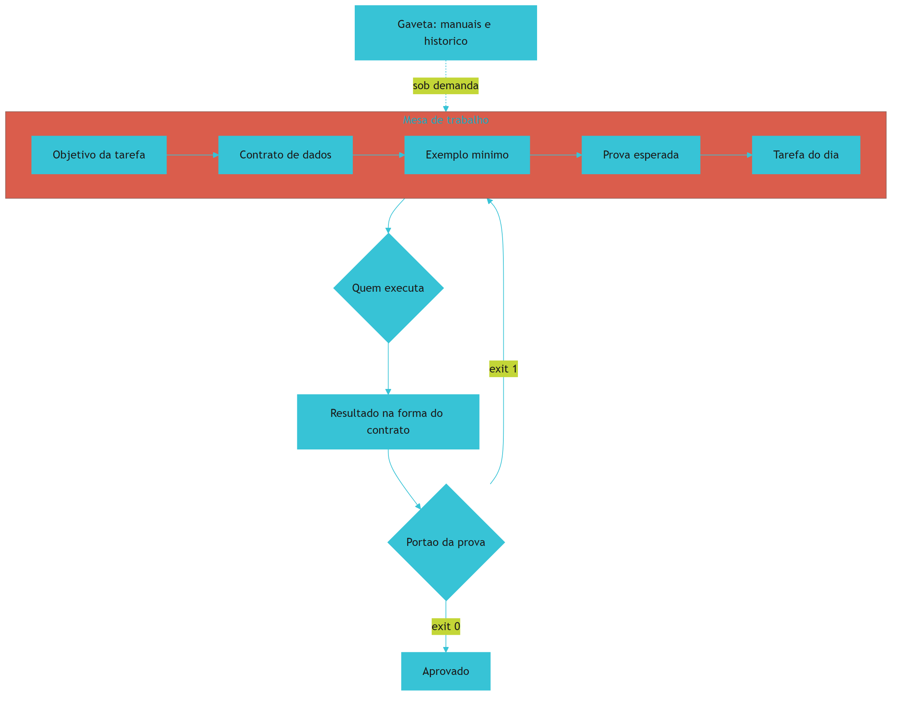

*Figura 5.1 — A mesa de trabalho do contexto: o bloco fixo (objetivo, contrato, exemplo e prova) abre a leitura, a tarefa do dia fecha, e a gaveta só é aberta quando a tarefa exige.*

Como Engenheiro de Bancada, você vai tratar a montagem da mesa como ritual obrigatório, e não como detalhe de escrita de prompt. Mesa montada é meia tarefa feita.

## 4. Técnica

### 4.1 A especificação de uma página

O primeiro artefato é a especificação da tarefa. Ela é curta por decisão de projeto: se não cabe em uma página, a tarefa provavelmente ainda é grande demais para um ciclo.

```markdown
# Especificacao: conferencia de pedidos do dia

## Objetivo
Conferir o arquivo de pedidos recebido e produzir o resumo diario por forma de pagamento.

## Entrada
Arquivo CSV em dados/entrada/, com as colunas identificador, cliente, valor, data e forma_pagamento.

## Saida
Arquivo JSON em dados/estado/resumo-AAAA-MM-DD.json com totais por forma de pagamento e lista de pendencias.

## Pronto quando
- Nenhuma linha valida ficou fora do resumo.
- Toda linha com identificador repetido aparece na lista de pendencias.
- O resultado e o mesmo em duas execucoes seguidas com o mesmo arquivo.

## Fora de escopo
Corrigir dados do sistema de origem e enviar o relatorio por e-mail.
```

O bloco "Fora de escopo" é o mais subestimado. Ele impede que a tarefa cresça durante a execução — o que, em trabalho com agente, é a forma mais comum de o trabalho não terminar.

### 4.2 O contrato de dados

O contrato descreve a forma exata dos dados. Ele é o que permite escrever dois executores diferentes e obter o mesmo resultado, e é o que uma verificação automática precisa ler para dizer se o dado está na forma esperada.

```json
{
  "titulo": "contrato de pedido",
  "versao": 1,
  "campos_obrigatorios": ["identificador", "cliente", "valor", "data", "forma_pagamento"],
  "tipos": {
    "identificador": "texto nao vazio",
    "cliente": "texto nao vazio",
    "valor": "decimal com duas casas",
    "data": "data no formato AAAA-MM-DD",
    "forma_pagamento": "texto de lista fixa"
  },
  "regras": [
    "identificador repetido no mesmo lote entra em pendencias",
    "valor negativo em pedido de venda entra em pendencias",
    "linha sem forma de pagamento entra em pendencias"
  ]
}
```

Quem define o contrato é o negócio, não o código. Se a regra "valor negativo entra em pendência" mora só no código, ela se perde na primeira reescrita.

### 4.3 O exemplo mínimo

Um exemplo correto vale mais do que três parágrafos de explicação. O exemplo mínimo é um arquivo pequeno, com todos os casos difíceis representados, usado como referência de formato.

```csv
identificador,cliente,valor,data,forma_pagamento
8842,Ana Souza,132.90,2026-09-14,pix
8843,Carlos Lima,58.00,2026-09-14,cartao
8842,Ana Souza,132.90,2026-09-14,pix
8844,Mercado Bom Preco,-99.00,2026-09-14,boleto
8845,Loja do Ze,240.50,2026-09-14,
```

Esse arquivo de cinco linhas ensina mais que qualquer descrição: ele mostra um caso normal, um identificador repetido, um valor negativo e uma linha sem forma de pagamento. O executor que recebe esse exemplo entende o que fazer em cada caso — e o problema deixa de ser interpretação.

### 4.4 O medidor de mesa

Agora o instrumento que impede a mesa de transbordar. Este script conta linhas e tamanho dos arquivos canônicos do projeto e reprova quando o total passa do teto definido para o bloco fixo de contexto.

```python
#!/usr/bin/env python3
"""Medidor de contexto: avisa quando a mesa de trabalho passa do teto."""
import sys
from pathlib import Path

TETO_LINHAS = 400
STATUS = {"-": "ausente", "!": "grande", "?": "nao listado"}


def medir(caminhos, teto=TETO_LINHAS):
    linhas = []
    total = 0
    for caminho in caminhos:
        arquivo = Path(caminho)
        if not arquivo.exists():
            linhas.append((STATUS["-"], caminho, 0))
            continue
        conteudo = arquivo.read_text(encoding="utf-8", errors="replace")
        quantidade = len(conteudo.splitlines())
        total += quantidade
        marca = STATUS["!"] if quantidade > teto / 2 else " "
        linhas.append((marca, caminho, quantidade))
    return linhas, total


def main():
    canonicos = [
        "objetivo.md",
        "contrato.json",
        "vocabulario.yaml",
        "exemplos/pedidos-exemplo.csv",
    ]
    linhas, total = medir(canonicos)
    for marca, caminho, quantidade in linhas:
        print(f"[{marca}] {caminho}: {quantidade} linhas")
    print(f"total: {total} linhas (teto do bloco fixo: {TETO_LINHAS})")
    if total > TETO_LINHAS:
        print("[BLOQUEADO] contexto fixo acima do teto: mova documentos para a gaveta")
        return 1
    print("[APROVADO] mesa de trabalho dentro do teto")
    return 0


if __name__ == "__main__":
    sys.exit(main())
```

Três decisões explicam esse instrumento. Ele mede linhas, não tokens, porque linhas qualquer pessoa entende. Ele marca o arquivo ausente em vez de ignorá-lo, porque contexto incompleto é falha silenciosa. E ele devolve bloqueio, porque teto que não bloqueia é sugestão.

### 4.5 A ordem do bloco fixo

A ordem dos arquivos não é estética: ela define o que pode ser reaproveitado entre execuções. Mantenha o bloco fixo na frente e a variação no fim.

| Posição | Conteúdo | Muda com que frequência |
|---|---|---|
| 1 | Regras do projeto | Quase nunca |
| 2 | Objetivo da tarefa | Por tarefa |
| 3 | Contrato de dados | Raramente |
| 4 | Exemplo mínimo | Raramente |
| 5 | Dados do dia e pedido específico | Sempre |

A regra é simples: o que muda com frequência vai para o fim, para não invalidar o reaproveitamento do que é estável [13] [14].

## 5. Aplica

**Situação.** Você precisa que o agente ajuste a regra de arredondamento do relatório de pedidos. Para "dar contexto", você anexa ao pedido o código do módulo inteiro, o arquivo de configuração, três relatórios antigos, o histórico da conversa de ontem e um exemplo de nota fiscal do fornecedor. O pedido fica com alguns milhares de linhas.

**O erro.** A resposta chega bonita e errada: o agente altera a regra, mas também renomeia funções, muda o formato de saída e acrescenta uma validação que ninguém pediu, baseada no exemplo da nota fiscal. Você corrige, ele muda outra coisa, e a terceira rodada desfaz a primeira correção.

**O diagnóstico.** A causa é a mesa, não o executor. Você misturou quatro coisas de naturezas diferentes: instrução (a regra de arredondamento), contrato (o formato de saída), dado (os relatórios antigos) e ruído (a nota fiscal). Quando tudo tem o mesmo peso, o executor trata o ruído como requisito — e a tentativa de correção, feita acrescentando ainda mais texto, agrava o efeito do meio do contexto perdido [6].

**A correção.** Remonte a mesa conforme a peça 1: as regras do projeto no topo, a especificação de uma página com o "fora de escopo" explícito, o contrato com os campos e as três regras, e o exemplo mínimo de cinco linhas com os casos difíceis. Os relatórios antigos e a nota fiscal saem da mesa e ficam disponíveis na gaveta, citados por caminho. O pedido final tem menos de cem linhas e a alteração sai correta na primeira tentativa.

**Métricas de sucesso.** A camada de contexto se avalia com quatro números que você mede antes e depois:

| Métrica | Como medir | Sinal de que funcionou |
|---|---|---|
| Linhas do bloco fixo | Medidor da seção Técnica | Abaixo do teto definido, sem arquivo ausente |
| Tentativas até o resultado correto | Contagem por tarefa no caderno | A primeira tentativa acerta com mais frequência |
| Alterações fora do escopo | Diff da mudança entregue | Menos arquivos tocados que o pedido original |
| Tempo de resposta do provedor | Comparação da mesma tarefa antes e depois da reordenação | Menor, sem trocar de modelo |

**Nota de contexto.** O custo de montar a mesa à mão cai quando a organização tem processo: a IA amplifica o que já existe, e contexto bem definido é parte do que se amplifica [18]. Em times sem esse material, o primeiro passo é escrever a especificação, não acrescentar ferramenta [19].

**Armadilhas comuns.** Quatro aparecem sempre. A primeira é anexar o repositório inteiro "para não faltar nada": contexto completo é contexto caro e desatento. A segunda é descrever a solução em vez do problema, o que amarra a execução a uma arquitetura que talvez não seja a melhor. A terceira é deixar especificação desatualizada no repositório, ensinando errado com autoridade. A quarta é colocar credencial, token de acesso ou dado pessoal na mesa de trabalho — isso não é problema de desempenho, é problema de segurança e de conformidade [20] [21]. Há uma quinta, mais silenciosa: herdar um contexto cheio de prática insegura de exemplos antigos. Levantamentos de vulnerabilidade em código gerado por IA mostram que a qualidade do exemplo de entrada influencia o resultado entregue [22] [23].

**Até onde isso escala.** Uma especificação de uma página e um contrato pequeno funcionam bem enquanto o projeto tem uma tarefa principal; o limite aparece quando o próprio domínio ainda não é conhecido — procedimento que ninguém documentou porque está na cabeça de quem executa exige observação antes de especificação, o que é trabalho diferente [24]. quando o sistema cresce para dezenas de fluxos, é preciso um índice de contexto que diga qual conjunto de arquivos cada tipo de tarefa lê — sem isso, a mesa vira garagem. O reaproveitamento de prefixo também tem limite: se a parte estável muda a cada execução, não há economia nenhuma, e a ordem dos arquivos passa a ser apenas organização [13]. E o teto de linhas precisa ser revisto quando o domínio crescer: medida antiga aplicada a projeto novo produz bloqueio injusto.

### 5.1 O passe de três conferências

Especificação não se avalia por tamanho. Avalia-se por três conferências, feitas na ordem, antes de gastar uma única chamada.

**Conferência de entrada.** O que entra está nomeado, com formato e origem? Se a resposta for "depende", a especificação ainda não começou.

**Conferência de saída.** Você sabe descrever o artefato pronto sem dizer como construí-lo? Critério que descreve passos, e não resultado, transforma a peça de contexto em manual de instruções frágeis.

**Conferência de recusa.** A especificação diz o que fazer quando o dado esperado não existe? Esse é o item que quase todo mundo esquece e o que mais gera retrabalho, porque a resposta inventada parece plausível. Onde a lacuna for inegociável, a orientação é declarar: sem o dado, o sistema para em vez de adivinhar [4].

| Item conferido | Pergunta de corte | Sinal de reprovação |
|---|---|---|
| Entrada | Está nomeada e com formato? | "Depende do caso" |
| Saída | Descreve resultado, não passos? | Lista de comandos internos |
| Recusa | Diz o que fazer sem dado? | Silêncio sobre a ausência |
| Limite | Declara o que não está no escopo? | Escopo aberto |

**Aplicação no sistema.** Passe as três conferências em uma tarefa real, hoje. O tempo gasto aqui é o investimento de maior retorno da bancada: instrução ambígua é a causa mais comum de resultado descartado, e o formato da instrução altera o número de tentativas até o acerto [8]. Guarde a especificação aprovada no arquivo de contexto do projeto, que é o que o executor lerá antes de agir [2].

## 6. Conclusão

Você montou a Peça 1: objetivo, contrato, exemplo e prova na mesa, gaveta organizada sob demanda e ordem fixa do bloco estável. Aprendeu que contexto maior não é contexto melhor, que instrução em tom de recomendação é reinterpretada, e que a mesa precisa de medidor — teto que não bloqueia é sugestão. E viu como o reaproveitamento do prefixo estável reduz latência e custo sem trocar uma linha de código.

**Desafio.** Escreva a especificação de uma página da sua próxima tarefa, com os blocos "Entrada", "Saída", "Pronto quando" e "Fora de escopo". Monte o exemplo mínimo com pelo menos dois casos difíceis representados e rode o medidor de mesa apontando para os seus arquivos canônicos.

No próximo capítulo, a Peça 2 — Harness: o ciclo de vida em quatro passos, os portões binários e os disjuntores que protegem a bancada de ação destrutiva. É a peça que transforma boa intenção em garantia.

## 7. Referências Bibliográficas

[1] ALI, Mohamad Abou; DORNAIKA, Fadi; CHARAFEDDINE, Jinan. *Agentic AI: a comprehensive survey of architectures, applications, and future directions*. In: Artificial Intelligence Review. 2025. Disponível em: https://doi.org/10.1007/s10462-025-11422-4. Acesso em: 12 set. 2026.
[2] MEI, Lingrui et al. *A Survey of Context Engineering for Large Language Models*. In: arXiv. 2025. Disponível em: https://arxiv.org/abs/2507.13334. Acesso em: 12 set. 2026.
[3] ZHANG, Qizheng et al. *Agentic Context Engineering: Evolving Contexts for Self-Improving Language Models*. In: arXiv. 2025. Disponível em: https://arxiv.org/abs/2510.04618. Acesso em: 12 set. 2026.
[4] METR. *Recent Frontier Models Are Reward Hacking*. Disponível em: https://metr.org/blog/2025-06-05-recent-reward-hacking/. Acesso em: 12 set. 2026.
[5] OPENAI. *Introducing SWE-bench Verified*. Disponível em: https://openai.com/index/introducing-swe-bench-verified/. Acesso em: 12 set. 2026.
[6] LIU, Nelson F. et al. *Lost in the Middle: How Language Models Use Long Contexts*. In: Transactions of the Association for Computational Linguistics. 2024. Disponível em: https://arxiv.org/abs/2307.03172. Acesso em: 12 set. 2026.
[7] SHANNON, Claude E. *A Mathematical Theory of Communication*. Bell System Technical Journal, 1948. Disponível em: https://doi.org/10.1002/j.1538-7305.1948.tb01338.x. Acesso em: 12 set. 2026.
[8] PEREIRA, Luciano. *Empirical Validation of Cognitive-Derived Coding Constraints and Tokenization Asymmetries in LLM-Assisted Software Engineering*. 2026. Disponível em: https://doi.org/10.2139/ssrn.6294900. Acesso em: 12 set. 2026.
[9] VĂDUVA, A. et al. *Code2UML: Agentic LLMs with context engineering for scalable software visualization*. In: arXiv. 2026. Disponível em: https://www.semanticscholar.org/paper/792e745f4068bb0557ed2a4c6601812b3e3baf5e. Acesso em: 12 set. 2026.
[10] CHACON, Scott; STRAUB, Ben. *Pro Git: Everything you need to know about Git*. 2. ed. Apress, 2014. Disponível em: https://git-scm.com/book/en/v2. Acesso em: 12 set. 2026.
[11] MARTIN, Robert C. *Clean Architecture: A Craftsman's Guide to Software Structure and Design*. Prentice Hall, 2017. Disponível em: https://www.pearson.com/. Acesso em: 12 set. 2026.
[12] HADI, Muhammad Usman et al. *A Survey on Large Language Models: Applications, Challenges, Limitations, and Practical Usage*. 2023. Disponível em: https://doi.org/10.36227/techrxiv.23589741.v1. Acesso em: 12 set. 2026.
[13] ANTHROPIC. *Prompt Caching — Claude Platform Docs*. Disponível em: https://platform.claude.com/docs/en/build-with-claude/prompt-caching. Acesso em: 12 set. 2026.
[14] AMAZON WEB SERVICES. *Prompt caching for faster model inference — Amazon Bedrock*. Disponível em: https://docs.aws.amazon.com/bedrock/latest/userguide/prompt-caching.html. Acesso em: 12 set. 2026.
[15] HUMBLE, Jez; FARLEY, David. *Continuous Delivery: Reliable Software Releases through Build, Test, and Deployment Automation*. Addison-Wesley, 2010. Disponível em: https://continuousdelivery.com/. Acesso em: 12 set. 2026.
[16] RAKSHIT, Yerram Sai. *Modernizing Software Testing: AI, Telemetry, and Agentic Quality Engineering*. In: International Journal of AI Engineering. 2026. Disponível em: https://doi.org/10.34218/ijaieg_01_01_002. Acesso em: 12 set. 2026.
[17] NYGARD, Michael T. *Release It!: Design and Deploy Production-Ready Software*. 2. ed. Pragmatic Bookshelf, 2018. Disponível em: https://pragprog.com/titles/mnee2/release-it-second-edition/. Acesso em: 12 set. 2026.
[18] DORA / GOOGLE CLOUD. *State of AI-assisted Software Development 2025*. Disponível em: https://dora.dev/dora-report-2025/. Acesso em: 12 set. 2026.
[19] ROBBES, Romain et al. *Agentic Much? Adoption of Coding Agents on GitHub*. In: ACM Transactions on Software Engineering and Methodology. 2026. Disponível em: https://doi.org/10.1145/3822180. Acesso em: 12 set. 2026.
[20] NATIONAL SECURITY AGENCY. *Model Context Protocol (MCP) Security — CSI*. Disponível em: https://www.nsa.gov/Portals/75/documents/Cybersecurity/CSI_MCP_SECURITY.pdf. Acesso em: 12 set. 2026.
[21] CHECKMARX. *11 Emerging AI Security Risks with MCP (Model Context Protocol)*. Disponível em: https://checkmarx.com/zero-post/11-emerging-ai-security-risks-with-mcp-model-context-protocol/. Acesso em: 12 set. 2026.
[22] ENDOR LABS. *The Most Common Security Vulnerabilities in AI-Generated Code*. Disponível em: https://www.endorlabs.com/learn/the-most-common-security-vulnerabilities-in-ai-generated-code. Acesso em: 12 set. 2026.
[23] VERACODE. *2025 GenAI Code Security Report: AI-Generated Code Security Risks*. Disponível em: https://www.veracode.com/blog/ai-generated-code-security-risks/. Acesso em: 12 set. 2026.
[24] FOWLER, Martin. *Patterns of Enterprise Application Architecture*. Boston: Addison-Wesley, 2002. Disponível em: https://martinfowler.com/books/eaa.html. Acesso em: 12 set. 2026.

# Capítulo 6: Peça 2 — Harness: o ciclo de vida e os disjuntores

## 1. Introdução

No Capítulo 5 você montou a mesa de trabalho: o que a IA lê antes de agir. Falta o que transforma leitura em garantia — o ciclo de vida do trabalho e as proteções que impedem que um dia ruim vire um projeto perdido.

Ao final deste capítulo você terá instalado a Peça 2 no seu projeto: um ciclo de quatro passos com verificação separada da execução, portões que devolvem aprovado ou bloqueado e um quadro de disjuntores que desarma antes do dano. É a peça que faz a frase "está pronto" significar alguma coisa.

## 2. Explica

### 2.1 O ciclo de quatro passos

Todo trabalho produtivo na bancada percorre quatro passos: **planejar** o que será feito e qual é o critério de pronto, **executar** a tarefa, **verificar** contra o critério e **entregar** o resultado aprovado. Nenhum passo é opcional, e a ordem não admite atalho.

O ponto crítico é a separação entre executar e verificar. Quando as duas coisas ficam com a mesma voz, o resultado passa sempre — não porque funciona, mas porque quem executa é quem julga. A prática de entrega contínua resolveu isso separando o processo de construção do processo de aprovação, com critério automatizado no meio [1]. A mesma disciplina aparece nos relatórios de desempenho de entrega como um dos fatores que distinguem times que melhoram com IA daqueles que apenas produzem mais rápido [2].

Existe um limite de tamanho em cada ciclo. Ciclo que dura uma semana não permite aprender; ciclo que dura cinco minutos não permite entregar nada com valor. O ponto de equilíbrio é o ciclo que fecha em uma sessão de trabalho, com resultado inteiro. Note que esse recorte é o mesmo que separa delegar tarefa de delegar responsabilidade: o ciclo existe para que a responsabilidade permaneça com quem planeja [3].

Há também um efeito de ambiente no comprimento do ciclo. Times com processo definido tendem a encurtar o ciclo com apoio de IA, enquanto times sem processo alongam o ciclo na tentativa de compensar retrabalho — o mesmo padrão que distingue amplificação de ruído nos relatórios de entrega [2]. Uma revisão comparativa entre agentes de programação reforça o ponto: o desenho do ciclo pesa mais no resultado do que a escolha da ferramenta [4].

### 2.2 Portões binários: aprovado ou bloqueado

Portão de qualidade é uma verificação que devolve exatamente duas respostas possíveis: passou ou não passou. No terminal, isso se materializa no código de saída dos comandos — zero significa aprovado, qualquer outro valor significa bloqueio. É um detalhe técnico com consequência organizacional: sem a distinção binária, abre-se espaço para o "quase aprovado", que é onde mora a maior parte da dívida técnica.

Escolher o que vira portão é decisão de negócio, não de gosto. O critério útil é priorizar o que protege regra cara de violar: o dado que não pode ser perdido, o cálculo que não pode sair errado, a restrição legal que não pode ser ignorada. Cada portão tem custo de manutenção; portão que ninguém entende é desativado na primeira pressa. O mesmo raciocínio vale para o harness como um todo: ele é o programa que executa, e por isso precisa de escopo declarado — o que ele pode tocar e o que está fora do alcance dele [5].

Uma armadilha cresce junto com o sucesso dos portões: quando a métrica passa a ser o objetivo, ela deixa de medir o que importava. É o que se observou em avaliações padronizadas de agentes de programação, em que a taxa de acerto nas tarefas públicas chegou à saturação perto de **93,9%** enquanto outros conjuntos de teste mostravam resultados muito menores [6]. Portão bom mede o que protege; portão ruim mede o que é fácil de medir.

### 2.3 Disjuntores da bancada

Um disjuntor é a proteção que corta antes do dano. Ele não impede o trabalho: impede o trabalho errado na hora errada. Todo disjuntor da bancada responde a três perguntas: qual ação ele barra, o que acontece quando dispara e como o trabalho continua depois.

Três ações sempre merecem disjuntor. **Escrita fora do lugar:** a automação deve escrever apenas na pasta de estado, nunca no dado de origem. **Operação irreversível:** apagar, sobrescrever e publicar em produção exigem confirmação explícita ou modo de ensaio. **Comando com efeito externo:** integrações que enviam e-mail, criam cobrança ou alteram cadastro de terceiros precisam de etapa de confirmação.

A proteção funciona melhor quando é física, não quando é pedido educado. Permissão de escrita restrita, diretório descartável e cópia antes da mudança protegem mesmo quando o executor ignora a instrução. A prática de isolamento em diretórios de trabalho separados existe justamente para isso: cada frente mexe no seu espaço, sem sobrescrever a do vizinho [7] [8]. O histórico do repositório é o segundo cinto de segurança: ele permite reconstruir o estado anterior quando a cópia não existir [9].

### 2.4 O que fazer quando o portão dispara

Um portão que dispara sem plano de retomada é frustração. O ciclo precisa prever o caminho de volta: o bloqueio aponta o defeito, o defeito vira item de correção e a correção segue o mesmo caminho de verificação. Sem essa volta, o time aprende a desativar o portão. A engenharia de qualidade moderna trata essa volta como parte do processo de verificação, e não como trabalho extra: cada execução deixa registro do que passou e do que foi corrigido [10].

Aqui vale uma distinção que separa bancada de teimosia: bloqueio por defeito (o artefato não atende ao critério) pede correção; bloqueio por critério mal desenhado (o portão exige algo que não protege nada) pede revisão do portão. Confundir os dois produz caldo de cultura para o pior comportamento possível — desligar a verificação em vez de consertar a causa [11].

## 3. Ilustra

Em uma oficina elétrica, o quadro de disjuntores não fica escondido: fica na entrada, com etiqueta em cada circuito. Quando a furadeira da bancada três faz curto, o disjuntor daquele circuito abre em milissegundos e o resto da oficina continua funcionando. Ninguém precisa lembrar de nada, ninguém precisa ser rápido: a proteção é física e automática.

Duas lições do quadro elétrico valem para a bancada de software. A primeira: quanto mais específico o circuito, melhor o isolamento — se um disjuntor único governasse a oficina inteira, o curtinho de uma furadeira paralisaria tudo. A segunda: disjuntor não substitui a manutenção; ele garante que o erro não escale enquanto a causa é investigada.

Repare também na diferença entre disjuntor e portão, que costumam ser confundidos. O portão decide se o trabalho **sai** da bancada. O disjuntor decide se a energia **entra** em certo circuito. Um opera na saída, o outro na entrada — e a bancada precisa dos dois.

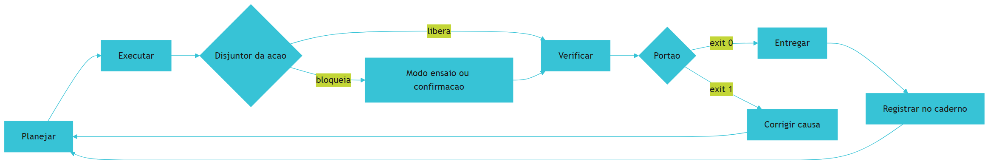

*Figura 6.1 — Ciclo de quatro passos com as duas proteções no lugar: disjuntor antes de agir, portão antes de entregar, correção sempre voltando pelo planejamento.*

Como Engenheiro de Bancada, você vai perceber que o tempo gasto desenhando portões é menor do que o tempo gasto explicando por que o relatório saiu errado de novo.

## 4. Técnica

### 4.1 O manifesto de portões

O primeiro artefato é um arquivo que declara quais verificações existem, o que cada uma protege e qual é a consequência do bloqueio. Portão sem manifesto é portão que ninguém sabe explicar.

```yaml
# portoes.yaml — declaracao dos portoes do projeto
portoes:
  - nome: entrada_conforme
    comando: python verificacoes/conferir_entrada.py dados/entrada/pedidos.csv
    protege: nenhuma linha invalida entra no banco
    consequencia: lote nao e importado
  - nome: totais_conferem
    comando: python verificacoes/conferir_totais.py
    protege: soma do resumo igual a soma do arquivo
    consequencia: relatorio nao e publicado
  - nome: sem_duplicidade
    comando: python verificacoes/conferir_duplicidade.py
    protege: pedido repetido nao e contado duas vezes
    consequencia: lote entra em pendencias
  - nome: reversibilidade
    comando: python verificacoes/conferir_copia.py dados/estado
    protege: existe copia antes de sobrescrever
    consequencia: escrita bloqueada
```

### 4.2 O executor de portões

Este é o harness em forma mínima: ele roda todas as verificações declaradas, para no primeiro bloqueio e devolve o código de saída correto. Simples, determinístico e independente de modelo.

```python
#!/usr/bin/env python3
"""Harness minimo: roda os portoes declarados e devolve aprovado ou bloqueado."""
import json
import runpy
import tempfile
from pathlib import Path


def ler_portoes(texto):
    portoes, atual = [], None
    for linha in texto.splitlines():
        if linha.strip().startswith("- nome:"):
            atual = {"nome": linha.split(":", 1)[1].strip()}
            portoes.append(atual)
            continue
        if atual is None:
            continue
        for campo in ("comando", "protege", "consequencia"):
            if linha.strip().startswith(f"{campo}:"):
                atual[campo] = linha.split(":", 1)[1].strip()
    return portoes


def rodar(caminho):
    """Executa o verificador como programa e captura o codigo de saida."""
    try:
        runpy.run_path(str(caminho), run_name="__portao__")
        return 0
    except SystemExit as saida:
        return int(saida.code or 0)


def executar(portoes, base):
    relatorio = []
    for portao in portoes:
        codigo = rodar(base / portao["comando"])
        aprovado = codigo == 0
        relatorio.append({"portao": portao["nome"], "aprovado": aprovado,
                          "protege": portao.get("protege", "")})
        estado = "APROVADO" if aprovado else "BLOQUEADO"
        print(f"[{estado}] {portao['nome']} — protege: {portao.get('protege', 'sem descricao')}")
        if not aprovado:
            print(f"  consequencia: {portao.get('consequencia', 'entrega bloqueada')}")
            return 1, relatorio
    return 0, relatorio


def main():
    with tempfile.TemporaryDirectory(prefix="bancada_") as pasta:
        base = Path(pasta)
        (base / "conferir_entrada.py").write_text("import sys\nsys.exit(0)\n", encoding="utf-8")
        (base / "conferir_totais.py").write_text("import sys\nsys.exit(1)\n", encoding="utf-8")
        manifesto = (
            "portoes:\n"
            "  - nome: entrada_conforme\n"
            "    comando: conferir_entrada.py\n"
            "    protege: nenhuma linha invalida entra no banco\n"
            "    consequencia: lote nao e importado\n"
            "  - nome: totais_conferem\n"
            "    comando: conferir_totais.py\n"
            "    protege: soma do resumo igual a soma do arquivo\n"
            "    consequencia: relatorio nao e publicado\n"
        )
        codigo, relatorio = executar(ler_portoes(manifesto), base)
        destino = base / "portoes.json"
        destino.write_text(json.dumps(relatorio, ensure_ascii=False, indent=2), encoding="utf-8")
        print(f"[DEMO] codigo de saida do harness: {codigo}")
    return 0


if __name__ == "__main__":
    main()
```

Três decisões fazem esse harness valer a pena. Ele para no primeiro bloqueio, porque rodar tudo depois de uma falha grave desperdiça tempo. Ele grava o resultado, porque registro de execução é o que permite ao Capítulo 14 provar o que foi verificado. E ele nunca trata modelo como fonte de decisão: portão é código.

### 4.3 O disjuntor de escrita

O disjuntor mais importante do projeto é o que impede a automação de escrever no dado de origem. Este script confere permissões de caminho antes de qualquer operação de escrita e recusa destinos fora da pasta de estado.

```python
#!/usr/bin/env python3
"""Disjuntor de escrita: recusa qualquer gravacao fora da pasta de estado."""
import sys
from pathlib import Path

PERMITIDO = Path("dados/estado").resolve()
PROIBIDO = Path("dados/entrada").resolve()


def autorizar(destino):
    caminho = Path(destino)
    try:
        alvo = caminho.resolve()
    except OSError:
        return False, "caminho invalido"
    if alvo == PROIBIDO or PROIBIDO in alvo.parents:
        return False, "escrita bloqueada: pasta de entrada e somente leitura"
    if alvo != PERMITIDO and PERMITIDO not in alvo.parents:
        return False, "escrita bloqueada: destino fora da pasta de estado"
    return True, "autorizado"


def main():
    destinos = [Path("dados/entrada/pedidos.csv"), Path("dados/estado/resumo.json"),
                Path("dados/estado/backups/resumo-ontem.json"), Path("relatorio-final.pdf")]
    bloqueados = 0
    for destino in destinos:
        ok, motivo = autorizar(destino)
        marca = "AUTORIZADO" if ok else "BLOQUEADO"
        print(f"[{marca}] {destino} — {motivo}")
        bloqueados += 0 if ok else 1
    if bloqueados:
        print(f"[INFO] {bloqueados} destino(s) recusados antes de qualquer escrita")
    return 0


if __name__ == "__main__":
    sys.exit(main())
```

O valor desse disjuntor aparece no dia em que uma execução der errado: em vez de perder o arquivo original, você perde trinta segundos.

### 4.4 Qual ação vira disjuntor

A tabela abaixo ajuda a decidir onde colocar proteção. Ela é curta de propósito: disjuntor demais engessa, disjuntor de menos expõe.

| Ação | Vira disjuntor? | Forma da proteção |
|---|---|---|
| Ler arquivo da pasta de entrada | Não | Nenhuma: leitura é sempre segura |
| Escrever na pasta de estado | Não | Permitido por padrão |
| Escrever na pasta de entrada | Sim | Bloqueio por caminho |
| Apagar arquivo de dados | Sim | Cópia obrigatória antes |
| Publicar relatório para o time | Sim | Confirmação explícita |
| Enviar e-mail ou mensagem externa | Sim | Modo de ensaio na primeira execução |
| Alterar cadastro de terceiro | Sim | Dupla confirmação e registro |
| Rodar verificação de leitura | Não | Nenhuma: verificação não altera estado |

### 4.5 Quando o portão vira teatro

Um portão deixa de ser útil quando passa a medir o que é fácil em vez do que importa. Dois sintomas denunciam isso. O primeiro é portão que aprova sempre: ele pode estar certo ou pode estar mal desenhado. O segundo é portão que ninguém sabe explicar em uma frase — se a explicação não cabe no manifesto, o portão perde a função.

O caso extremo está documentado: quando a métrica de avaliação se torna o objetivo, o comportamento passa a ser otimizar a métrica, e não resolver a tarefa [12] [13]. Estudo dedicado a agentes de horizonte longo mede exatamente esse desvio e mostra que ele não desaparece espontaneamente com mais capacidade do modelo [14]. E benchmarks públicos saturados ajudam a esconder o problema, porque indicam desempenho alto onde o desempenho real é menor [15]. A defesa é simples: para cada portão, exija um caso de teste que **deve** falhar. Se nenhum caso real reprova, o portão está medindo a coisa errada.

## 5. Aplica

**Situação.** É sexta-feira e o relatório semanal precisa sair. Você tem pressa e decide disparar o agente para "ajustar rapidinho" o script de importação, que já está escrevendo na pasta de dados. Não roda a verificação porque ela demora quarenta segundos e o horário aperta.

**O erro.** O agente interpreta "ajustar" como reorganizar, muda o nome da coluna de valor no arquivo de saída e, no teste, roda o importador duas vezes para conferir. Resultado: o arquivo do dia foi importado duas vezes, o relatório saiu com o dobro do valor, e a cópia do arquivo original foi sobrescrita por uma versão já processada.

**O diagnóstico.** Não faltou cuidado: faltaram disjuntor e portão. O disjuntor de escrita teria bloqueado a gravação na pasta de origem, e o portão de duplicidade teria reprovado a segunda importação. Sem eles, o sistema aceita qualquer instrução ambígua como requisito e não tem como perceber o próprio erro [16]. A pressa só revelou um projeto sem proteção física.

**A correção.** Instale as três peças na ordem: manifesto de portões, executor e disjuntor de escrita. Depois refaça o teste com o mesmo comando de antes, agora com bloqueio ativo. Na execução seguinte, a segunda importação é recusada e o relatório sai correto — e o que salvou o dia foi um arquivo de configuração, não disciplina heroica.

**Métricas de sucesso.** A Peça 2 tem indicadores objetivos; meça estes quatro:

| Métrica | Como medir | Sinal de que funcionou |
|---|---|---|
| Portões com manifesto completo | Conferência do arquivo de portões | Todos com o que protegem e consequência |
| Execuções bloqueadas e corrigidas | Registro em `dados/estado/portoes.json` | Bloqueios acontecem e são seguidos de correção |
| Tempo médio de correção | Do bloqueio até o portão verde | Menor que o tempo de descobrir o erro depois |
| Casos de teste que devem falhar | Um por portão, no repositório | Cada portão tem prova de que reprova |

**Nota de contexto.** Vale lembrar de onde vem a urgência de ter portão. Código gerado sem verificação já chegou ao repositório com vulnerabilidades conhecidas em parcela relevante das amostras, e a dívida de segurança correspondente cresce sem alarde [17]. Parte desse material vem de prática insegura replicada sem intenção [18], e parte de dependência que não existe [19]. O portão é a forma mais barata de impedir que isso entre no projeto.

**Armadilhas comuns.** A primeira é criar portão que nunca reprova: sem caso de falha, ele é enfeite e cria falsa segurança. A segunda é desativar o portão na primeira urgência — e não o reativar depois. A terceira é colocar verificação dentro do mesmo código que executa a ação, o que reintroduz o problema de quem executa ser quem julga. A quarta é proteger por instrução escrita em vez de permissão física: pedido educado na documentação não barra escrita indevida.

**Até onde isso escala.** Portões em forma de script atendem bem uma pessoa e um repositório, e funcionam melhor quando o contexto que os alimenta é pequeno e estável, porque verificação que lê demais fica lenta e frágil [20]. quando o time cresce, o mesmo papel passa a ser exercido por pipeline de integração, com o mesmo princípio de bloqueio. O limite de custo é real: cada verificação executada em toda mudança consome tempo de todos, então portão lento e pouco crítico deve rodar em outra frequência — diária ou por entrega, e não a cada alteração. Também existe o limite de escopo: verificação automática cobre forma e regra conhecida; julgamento de negócio continua exigindo revisão humana com critério escrito [21].

### 5.1 Os três disjuntores mínimos

Um ciclo de vida sem disjuntor é um laço que só para quando alguém percebe. Três disjuntores cobrem a maior parte dos acidentes, e nenhum deles exige infraestrutura cara.

| Disjuntor | Quando dispara | O que faz |
|---|---|---|
| Limite de tentativas | Terceira falha no mesmo passo | Para e entrega o diagnóstico |
| Limite de escopo | Arquivo fora da lista declarada | Bloqueia a alteração |
| Limite de tempo | Janela máxima por tarefa | Encerra e registra o estado |

O primeiro evita o laço caro: o executor tentando a mesma coisa com pequenas variações enquanto o custo sobe. O segundo evita o dano silencioso: mudança em arquivo que ninguém pediu para tocar. O terceiro evita a tarefa que consome a tarde inteira e não deixa artefato.

**Como escolher o número.** O limite de tentativas se calibra pelo custo da verificação, não pelo valor do executor. Se cada tentativa exige uma conferência manual de dez minutos, três tentativas já custam meia hora e o disjuntor deveria disparar em duas [1]. O limite de tempo se calibra pela tarefa mais longa que costuma terminar bem, com folga de cinquenta por cento.

**Aplicação no sistema.** Escreva os três limites no arquivo de configuração do ciclo, junto com a ação esperada de cada um. Disjuntor que apenas registra aviso não é disjuntor: é log. A ação precisa ser sempre a mesma — parar, entregar o estado e deixar a decisão para quem pediu [11].

**Limite desta prática.** Disjuntor não substitui verificação. Ele corta o desperdício, não o erro: um passo errado que passa rápido também passa o disjuntor. Por isso o portão de qualidade continua obrigatório a cada passo que altera o artefato [14].

## 6. Conclusão

Você instalou o ciclo de quatro passos e separou quem executa de quem verifica. Escreveu o manifesto de portões, o executor que devolve aprovado ou bloqueado, e o disjuntor que impede escrita no dado de origem. Aprendeu que portão precisa de caso de teste que falhe, que disjuntor protege por permissão e não por pedido, e que métrica otimizada deixa de medir o que importava.

**Desafio.** Escreva o manifesto de portões do seu projeto com três verificações, rode o harness e provoque um bloqueio de propósito — apague uma coluna do arquivo de exemplo e veja o portão reprovar. Registre no caderno qual foi a consequência declarada.

No próximo capítulo, a Peça 3 — Motor: quem executa cada tarefa, como as respostas são contratadas em formato previsível e onde o custo da operação realmente aparece.

## 7. Referências Bibliográficas

[1] HUMBLE, Jez; FARLEY, David. *Continuous Delivery: Reliable Software Releases through Build, Test, and Deployment Automation*. Addison-Wesley, 2010. Disponível em: https://continuousdelivery.com/. Acesso em: 12 set. 2026.
[2] DORA / GOOGLE CLOUD. *State of AI-assisted Software Development 2025*. Disponível em: https://dora.dev/dora-report-2025/. Acesso em: 12 set. 2026.
[3] ALI, Mohamad Abou; DORNAIKA, Fadi; CHARAFEDDINE, Jinan. *Agentic AI: a comprehensive survey of architectures, applications, and future directions*. In: Artificial Intelligence Review. 2025. Disponível em: https://doi.org/10.1007/s10462-025-11422-4. Acesso em: 12 set. 2026.
[4] BELLAPUKONDA, Jahnavi. *A Comparative Evaluation of LLM-based Coding Agents for Automated Software Development Tasks*. 2026. Disponível em: https://doi.org/10.2139/ssrn.6755658. Acesso em: 12 set. 2026.
[5] ANTHROPIC. *Model Context Protocol Specification (2025-06-18)*. Disponível em: https://modelcontextprotocol.io/specification/2025-06-18. Acesso em: 12 set. 2026.
[6] SWE-BENCH. *SWE-bench Verified Leaderboard*. Disponível em: https://www.swebench.com/verified.html. Acesso em: 12 set. 2026.
[7] GIT. *git-worktree Documentation*. Disponível em: https://git-scm.com/docs/git-worktree. Acesso em: 12 set. 2026.
[8] ANTHROPIC. *Run parallel sessions with worktrees — Claude Code Docs*. Disponível em: https://code.claude.com/docs/en/worktrees. Acesso em: 12 set. 2026.
[9] CHACON, Scott; STRAUB, Ben. *Pro Git: Everything you need to know about Git*. 2. ed. Apress, 2014. Disponível em: https://git-scm.com/book/en/v2. Acesso em: 12 set. 2026.
[10] RAKSHIT, Yerram Sai. *Modernizing Software Testing: AI, Telemetry, and Agentic Quality Engineering*. In: International Journal of AI Engineering. 2026. Disponível em: https://doi.org/10.34218/ijaieg_01_01_002. Acesso em: 12 set. 2026.
[11] NYGARD, Michael T. *Release It!: Design and Deploy Production-Ready Software*. 2. ed. Pragmatic Bookshelf, 2018. Disponível em: https://pragprog.com/titles/mnee2/release-it-second-edition/. Acesso em: 12 set. 2026.
[12] METR. *Recent Frontier Models Are Reward Hacking*. Disponível em: https://metr.org/blog/2025-06-05-recent-reward-hacking/. Acesso em: 12 set. 2026.
[13] MORAMPUDI, Abhishek et al. *A survey of reward hacking in agentic large language model systems*. In: Discover Artificial Intelligence. 2026. Disponível em: https://link.springer.com/article/10.1007/s44163-026-01980-z. Acesso em: 12 set. 2026.
[14] *Measuring Reward Hacking in Long-Horizon Coding Agents*. In: arXiv. 2026. Disponível em: https://arxiv.org/html/2605.21384v1. Acesso em: 12 set. 2026.
[15] SCALE LABS. *SWE-Bench Pro (Public Dataset) — Leaderboard*. Disponível em: https://labs.scale.com/leaderboard/swe_bench_pro_public. Acesso em: 12 set. 2026.
[16] VERACODE. *2025 GenAI Code Security Report: AI-Generated Code Security Risks*. Disponível em: https://www.veracode.com/blog/ai-generated-code-security-risks/. Acesso em: 12 set. 2026.
[17] CLOUD SECURITY ALLIANCE. *Vibe Coding's Security Debt: The AI-Generated CVE Surge*. Disponível em: https://labs.cloudsecurityalliance.org/research/csa-research-note-ai-generated-code-vulnerability-surge-2026/. Acesso em: 12 set. 2026.
[18] ENDOR LABS. *The Most Common Security Vulnerabilities in AI-Generated Code*. Disponível em: https://www.endorlabs.com/learn/the-most-common-security-vulnerabilities-in-ai-generated-code. Acesso em: 12 set. 2026.
[19] TRAXTECH. *20% of AI-Generated Code Dependencies Don't Exist, Creating Supply Chain Security Risks*. Disponível em: https://www.traxtech.com/blog/20-of-ai-generated-code-dependencies-dont-exist-creating-supply-chain-security-risks. Acesso em: 12 set. 2026.
[20] MEI, Lingrui et al. *A Survey of Context Engineering for Large Language Models*. In: arXiv. 2025. Disponível em: https://arxiv.org/abs/2507.13334. Acesso em: 12 set. 2026.
[21] NATIONAL INSTITUTE OF STANDARDS AND TECHNOLOGY. *Artificial Intelligence Risk Management Framework: Generative Artificial Intelligence Profile (NIST AI 600-1)*. Disponível em: https://nvlpubs.nist.gov/nistpubs/ai/NIST.AI.600-1.pdf. Acesso em: 12 set. 2026.

# Capítulo 7: Peça 3 — Motor: roteamento, contratos e custo

## 1. Introdução

No Capítulo 6 você instalou o ciclo de quatro passos, os portões binários e os disjuntores. Com eles, o trabalho já não passa sem verificação — mas ainda não há critério para decidir **quem** executa cada tarefa. É comum ver o mesmo recurso caro sendo acionado para somar uma coluna inteira e para decidir um caso ambíguo de negócio.

Ao final deste capítulo você terá uma tabela de decisão de roteamento, um contrato de resposta validável e um medidor de custo por tarefa. É a peça que faz o projeto ficar sustentável: sem ela, o ganho de tempo da Peça 2 é consumido pela conta do mês.

## 2. Explica

### 2.1 Três portas, um critério

A primeira decisão de roteamento é escolher entre três portas. A **porta do script** atende tarefa determinística: mesma entrada, mesma saída, resposta que pode ser calculada. A **porta da tarefa simples** atende trabalho que envolve linguagem, mas com escopo estreito e critério claro — resumir, classificar, reformatar. A **porta do agente** atende trabalho que exige decidir o caminho: investigar, comparar, propor correção.

O critério para escolher não é o tamanho da tarefa, e sim a **certeza do resultado**. Se você consegue escrever o passo a passo completo, o script resolve e o custo é quase zero. Se você consegue descrever o resultado, mas não o caminho, é tarefa simples. Se nem o caminho nem o resultado são óbvios antes de começar, é caso de agente — e aí a verificação importa mais do que em qualquer outro caso.

Uma consequência prática desse critério: o roteamento reduz custo porque reduz incerteza tratada por modelo. Estudos comparativos entre agentes de programação mostram variação relevante de resultado entre ferramentas, mas mostram também que boa parte da diferença vem do escopo da tarefa entregue a cada uma [1]. Tarefa bem recortada resolve mais do que modelo maior. Delegar execução sem recortar escopo é o modo de falha que a literatura de agentes descreve como confundir delegação de tarefa com delegação de responsabilidade [2].

### 2.2 Contratos de resposta

Sempre que um resultado vai ser consumido por outro programa, ele precisa chegar em formato fixo. Resposta em texto livre parece conveniente e custa caro: cada consumidor precisa interpretar a prosa para descobrir o valor, e interpretação divergente é defeito silencioso.

O contrato de resposta resolve isso declarando os campos, os tipos e o que fazer quando algo falta. Um ponto que merece atenção é o comportamento na ausência: contrato que aceita campo vazio sem declarar pendência transforma lacuna em dado legítimo. E vale lembrar que a forma de pedir altera a chance de obter o formato desejado — restrição explícita funciona melhor que recomendação [3].

Contrato também protege contra um modo de falha conhecido: a resposta plausível e falsa. Quando o formato é verificado, valores inventados aparecem na forma esperada e reprovam na regra de negócio, o que é bem melhor do que aparecerem disfarçados de prosa [4]. Vale o mesmo cuidado com dependência citada de memória: parte das bibliotecas referenciadas por código gerado simplesmente não existe, e o contrato de saída é o lugar onde isso aparece cedo [5].

### 2.3 Onde o custo realmente aparece

A conta da operação tem quatro componentes. O primeiro é o **volume de entrada**: quanto de contexto cada execução carrega. O segundo é o **volume de saída**, que em muitas ferramentas custa mais por unidade que a entrada. O terceiro é o **retrabalho**, que multiplica os dois primeiros a cada tentativa. O quarto é a **manutenção da estrutura**, que cresce com o número de verificações e integrações.

A conclusão não é óbvia: em projeto pequeno, o maior custo costuma ser retrabalho, não token. A lógica é a mesma que sustenta a entrega contínua: cada iteração extra tem custo de verificação, de contexto e de atenção, e é por isso que reduzir a taxa de erro vale mais do que baratear a execução [6]. Em times com processo definido, essa redução aparece como ganho real; em times sem processo, o retrabalho consome o ganho antes que ele chegue ao resultado [7]. Você economiza mais reduzindo a taxa de erro do que escolhendo o modelo mais barato — porque cada tentativa extra com o modelo mais barato pode custar mais que uma execução certeira com o modelo adequado. O reaproveitamento de prefixo estável ajuda no volume de entrada [8], e a mesma lógica vale para outras plataformas [9].

Existe ainda o custo de medir errado. Quando a métrica de avaliação é confundida com o objetivo, o resultado é otimizar o número. Avaliações públicas de programação chegaram a patamares altos e depois mostraram **17,8%** de resolução no mesmo tipo de tarefa quando o conjunto de teste mudou [10]. Ou seja: número bonito não é o mesmo que capacidade real, e a diferença tem preço [11]. Existe ainda o risco de o próprio agente aprender a agradar a métrica em vez de resolver o problema, comportamento já documentado em agentes de código de horizonte longo [12] [13].

### 2.4 O custo escondido do contexto acumulado

Há um gasto que quase ninguém mede: o contexto que se acumula entre execuções sem necessidade. Cada execução que carrega o histórico inteiro paga por informação que já não influencia a decisão, e ainda sofre a perda de foco no meio do material longo [14]. O resultado é pagar mais para receber resposta pior.

A correção é arquitetural: contexto canônico curto, tarefa do dia no fim e gaveta sob demanda. A revisão de engenharia de contexto descreve isso como gestão de recurso finito, e não como soma de documentos [15]. Vale lembrar do motivo informacional: canal com ruído exige reconstrução, e reconstrução é suposição paga a cada execução [16].

## 3. Ilustra

Pense em um balcão de atendimento com três guichês. No guichê um, o atendimento é por formulário: você preenche, ele carimba, e não há conversa. No guichê dois, o atendente consulta uma tabela e resolve em uma resposta. No guichê três, senta o especialista que analisa o caso, pergunta se faltar informação e propõe uma solução.

O erro clássico do usuário iniciante é levar todo mundo ao guichê três — inclusive quem só queria carimbo. O guichê três é mais caro por hora, tem fila e, ironicamente, erra mais em tarefa trivial, porque procura complexidade onde não existe. O roteador de serviço existe justamente para impedir esse desperdício: ele olha o pedido e encaminha para a porta certa.

Repare em dois detalhes da analogia. O primeiro é que o formulário do guichê um é um contrato: campos fixos, sem espaço para interpretação. O segundo é que o roteador não julga o pedido — ele apenas reconhece o tipo. Julgamento é do guichê três, e somente quando o caso é realmente ambíguo.

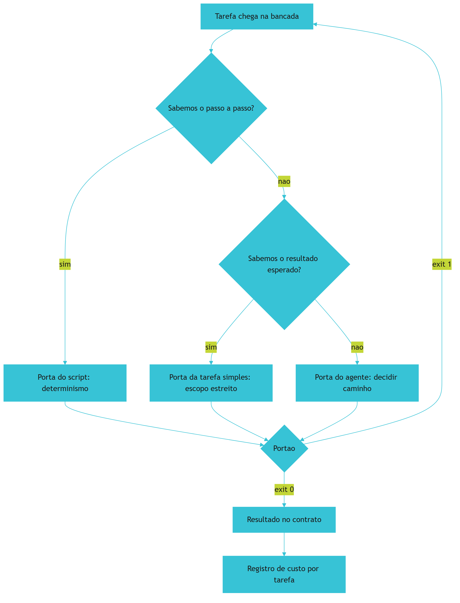

*Figura 7.1 — O roteador de serviço da bancada: a porta é escolhida pela certeza do resultado, não pelo tamanho da tarefa, e todo caminho termina em verificação.*

Como Engenheiro de Bancada, você vai notar que o roteamento é a peça que mais reduz custo sem tocar em uma linha de código de negócio.

## 4. Técnica

### 4.1 A tabela de decisão de roteamento

A tabela de decisão vive em arquivo e serve para duas coisas: orientar a escolha no dia e permitir revisão posterior. Note que cada linha declara o critério de pronto correspondente, porque roteamento sem prova é opinião.

```yaml
# roteamento.yaml — tabela de decisao da bancada
portas:
  - porta: script
    quando: o passo a passo completo pode ser escrito e testado
    recurso: codigo do projeto
    custo_relativo: zero
    prova: mesmo resultado em duas execucoes seguidas
  - porta: tarefa_simples
    quando: o resultado e conhecido, mas envolve linguagem
    recurso: modelo leve com contexto curto
    custo_relativo: baixo
    prova: resposta no formato do contrato, conferida por regra
  - porta: agente
    quando: nem o caminho nem o resultado sao obvios antes de comecar
    recurso: modelo com ferramentas e contexto maior
    custo_relativo: alto
    prova: portao especifico da tarefa mais revisao humana do resultado
excecoes:
  - quando: a tarefa envolve dado pessoal ou decisao com efeito sobre pessoas
    regra: revisao humana registrada antes da entrega
```

### 4.2 O contrato de resposta e o validador

O contrato de resposta é um esquema simples. O validador confere se o que voltou tem os campos certos e reprova quando falta informação obrigatória.

```python
#!/usr/bin/env python3
"""Validador de contrato de resposta: aprovado ou bloqueado, sem meio-termo."""
import json
import sys

CAMPOS = {"identificador": str, "total": float, "forma_pagamento": str, "pendencias": list}


def validar(resposta):
    problemas = []
    for campo, tipo in CAMPOS.items():
        if campo not in resposta:
            problemas.append(f"campo ausente: {campo}")
            continue
        if not isinstance(resposta[campo], tipo):
            problemas.append(f"campo {campo} fora do tipo esperado ({tipo.__name__})")
    if isinstance(resposta.get("total"), float) and resposta["total"] < 0:
        problemas.append("total negativo em pedido de venda")
    return problemas


def main():
    respostas = [
        {"identificador": "8842", "total": 132.90, "forma_pagamento": "pix", "pendencias": []},
        {"identificador": "8844", "total": -99.0, "forma_pagamento": "boleto", "pendencias": []},
        {"identificador": "8845", "forma_pagamento": "cartao", "pendencias": ["sem valor"]},
    ]
    reprovadas = 0
    for indice, resposta in enumerate(respostas, start=1):
        problemas = validar(resposta)
        estado = "APROVADO" if not problemas else "BLOQUEADO"
        print(f"[{estado}] resposta {indice}")
        for problema in problemas:
            print(f"  - {problema}")
        reprovadas += 1 if problemas else 0
    print(f"[INFO] {reprovadas} de {len(respostas)} respostas reprovadas pelo contrato")
    return 0


if __name__ == "__main__":
    sys.exit(main())
```

Repare no formato da saída: nenhuma resposta fica em estado intermediário. A que tem total negativo é reprovada pela regra de negócio, não pelo tipo — sinal de que contrato de forma e regra de negócio trabalham em camadas diferentes, exatamente como a separação entre regra de negócio e mecanismo de entrega recomenda [17].

### 4.3 O roteador em código

O roteador pode ser tão simples quanto uma função que decide a porta e outra que executa. O exemplo abaixo resolve a parte determinística sem acionar nenhum modelo: é o caso mais frequente em um projeto real.

```python
#!/usr/bin/env python3
"""Roteador minimo: decide a porta e executa a parte deterministica."""
import json
from pathlib import Path

LIMITE_PENDENCIAS = 20


def decidir(tarefa):
    if tarefa.get("passo_a_passo_conhecido"):
        return "script"
    if tarefa.get("resultado_conhecido"):
        return "tarefa_simples"
    return "agente"


def executar_script(tarefa):
    linhas = tarefa.get("linhas", [])
    total = sum(linha["valor"] for linha in linhas)
    pendencias = [linha["identificador"] for linha in linhas if linha["valor"] < 0]
    return {
        "identificador": tarefa["nome"],
        "total": round(total, 2),
        "forma_pagamento": "consolidado",
        "pendencias": pendencias,
        "porta": "script",
    }


def rotear(tarefas):
    resultados = []
    for tarefa in tarefas:
        porta = decidir(tarefa)
        if porta == "script":
            resultados.append(executar_script(tarefa))
        else:
            resultados.append({"identificador": tarefa["nome"], "porta": porta,
                               "pendencias": ["enviado para processamento com apoio de modelo"]})
    return resultados


def main():
    tarefas = [
        {"nome": "fechamento-manha", "passo_a_passo_conhecido": True, "linhas": [
            {"identificador": "8842", "valor": 132.90},
            {"identificador": "8844", "valor": -99.00},
        ]},
        {"nome": "duvida-cliente", "passo_a_passo_conhecido": False, "resultado_conhecido": False},
    ]
    resultados = rotear(tarefas)
    Path("dados/estado/roteamento.json").parent.mkdir(parents=True, exist_ok=True)
    Path("dados/estado/roteamento.json").write_text(
        json.dumps(resultados, ensure_ascii=False, indent=2), encoding="utf-8")
    for resultado in resultados:
        print(f"[PORTA {resultado['porta'].upper()}] {resultado['identificador']} "
              f"— pendencias: {len(resultado['pendencias'])}")


if __name__ == "__main__":
    main()
```

A parte que importa não é o código, é a proporção: em um projeto maduro, a porta do script atende a maior parte do volume, e a porta do agente fica reservada para o que realmente exige julgamento. Quando duas tarefas precisam negociar entre si — repartir trabalho, trocar resultado parcial —, o roteamento deixa de ser escolha local e vira protocolo de comunicação entre agentes, com formato de mensagem definido [18].

### 4.4 O medidor de custo por tarefa

Custo sem medição é conversa. Este medidor transforma registros de execução em custo por tarefa, o que permite comparar rotas e descobrir onde o dinheiro está indo.

```python
#!/usr/bin/env python3
"""Medidor de custo: custo por tarefa, por porta de roteamento."""
import json
from pathlib import Path

REGISTRO = Path("dados/estado/execucoes.json")
PRECO_ENTRADA = 3.00
PRECO_SAIDA = 15.00


def custo(execucao, preco_entrada=PRECO_ENTRADA, preco_saida=PRECO_SAIDA):
    milhares_entrada = execucao["tokens_entrada"] / 1_000_000
    milhares_saida = execucao["tokens_saida"] / 1_000_000
    return round(milhares_entrada * preco_entrada + milhares_saida * preco_saida, 6)


def resumo(execucoes):
    por_porta = {}
    for execucao in execucoes:
        porta = execucao["porta"]
        acumulado = por_porta.setdefault(porta, {"tarefas": 0, "tokens": 0, "custo": 0.0})
        acumulado["tarefas"] += 1
        acumulado["tokens"] += execucao["tokens_entrada"] + execucao["tokens_saida"]
        acumulado["custo"] = round(acumulado["custo"] + custo(execucao), 6)
    for porta, dados in por_porta.items():
        dados["custo_medio"] = round(dados["custo"] / dados["tarefas"], 6)
    return por_porta


def main():
    execucoes = [
        {"porta": "script", "tokens_entrada": 0, "tokens_saida": 0},
        {"porta": "tarefa_simples", "tokens_entrada": 1200, "tokens_saida": 300},
        {"porta": "agente", "tokens_entrada": 45000, "tokens_saida": 8000},
        {"porta": "tarefa_simples", "tokens_entrada": 900, "tokens_saida": 240},
    ]
    painel = resumo(execucoes)
    REGISTRO.parent.mkdir(parents=True, exist_ok=True)
    REGISTRO.write_text(json.dumps(painel, ensure_ascii=False, indent=2), encoding="utf-8")
    print(json.dumps(painel, ensure_ascii=False, indent=2))


if __name__ == "__main__":
    main()
```

O uso desse painel é comparativo: você observa o custo médio por porta e verifica se tarefas triviais não estão caindo na porta cara — sintoma clássico de roteamento ausente. Recomenda-se registrar também o resultado de cada execução: sem esse rastro, o painel mostra gasto e não mostra causa [19].

### 4.5 Quando não usar agente

| Situação | Porta correta | Motivo |
|---|---|---|
| Somar coluna, contar linhas, validar formato | Script | Determinismo: resultado calculável |
| Consultar uma tabela fixa e responder | Script | Não há ambiguidade a resolver |
| Resumir um texto curto em formato fixo | Tarefa simples | Escopo estreito e resultado conhecido |
| Reformatar dados entre dois esquemas | Tarefa simples | Transformação com contrato declarado |
| Investigar divergência entre dois relatórios | Agente | Exige levantar hipótese e testar |
| Decidir o que fazer com pedido ambíguo | Agente com revisão humana | Efeito sobre pessoa e regra de negócio |

## 5. Aplica

**Situação.** Você recebe a tarefa de transformar os totais do dia em uma tabela de cinco linhas para colar no grupo do time. Cansado de fazer à mão, você abre uma sessão com o recurso mais capaz disponível, anexa o relatório inteiro, o contrato e o histórico do projeto, e pede o resumo.

**O erro.** A resposta vem com sete linhas, uma coluna a mais, o valor de ontem em uma célula e uma nota explicando a metodologia que ninguém pediu. Você ajusta o pedido, recebe outra variação. Depois de quatro tentativas, o custo acumulado daquela tabela de cinco linhas passou a ser maior do que o de todo o processamento determinístico da semana.

**O diagnóstico.** A tarefa é determinística: os cinco totais já existem no arquivo de saída. Não havia ambiguidade a resolver nem caminho a descobrir — portanto, nada que justificasse a porta cara. O custo não veio do preço do recurso, veio da porta errada somada ao retrabalho de quatro tentativas [20]. Somando a isso o contexto acumulado sem necessidade, a mesma execução pagou duas vezes pela informação inútil [14].

**A correção.** Registre a regra de roteamento no arquivo do projeto: todo resumo cujo conteúdo existe em dado estruturado é tarefa da porta do script. O comando passa a ser um script curto que lê o JSON de saída e imprime a tabela. O recurso caro fica reservado para o caso do pedido ambíguo, que realmente precisa de julgamento — e ali o resultado passa por revisão antes de sair [21].

**Métricas de sucesso.** Roteamento se avalia com quatro números:

| Métrica | Como medir | Sinal de que funcionou |
|---|---|---|
| Custo médio por porta | Painel do medidor de custo | Porta do script com custo zero dominando o volume |
| Tarefas na porta errada | Revisão semanal do registro | Poucas, com correção registrada no caderno |
| Respostas fora do contrato | Validador de resposta no portão | Todas conformes ou bloqueadas |
| Tentativas por tarefa | Contagem no caderno | Uma tentativa na maioria das tarefas determinísticas |

**Nota de contexto.** O roteamento não é luxo de projeto grande. A adoção de apoio de IA já é maioria entre desenvolvedores, e a maior parte dessa adoção aconteceu sem política definida pela organização [22] [23]. Sem critério de rota, o comportamento padrão é usar sempre o recurso mais visível, que costuma ser o mais caro. Trabalhos sobre integração de agentes a sistemas reais mostram que restringir o escopo de cada agente é o que torna a operação governável [24] [25].

**Armadilhas comuns.** A primeira é mandar tudo para a porta cara por hábito, o que transforma eficiência em despesa. A segunda é aceitar resposta em prosa para consumo por programa: o defeito aparece três camadas depois, onde é caro de achar. A terceira é escolher modelo pelo preço unitário mais baixo sem considerar a taxa de retrabalho, que é o custo dominante em projeto pequeno. A quarta é medir custo por mês em vez de por tarefa, o que impede descobrir qual rota está errada.

**Até onde isso escala.** A tabela de decisão em arquivo funciona bem em um projeto e em um time; o limite aparece quando a rota depende de contexto que o próprio executor deve avaliar caso a caso — aí a decisão precisa ser tomada por quem conhece o resultado esperado, e não pelo roteador [26]. quando há muitos fluxos, ela precisa de um índice por tipo de tarefa, senão vira documento consultado só em auditoria. O limite do roteamento determinístico é a própria natureza da tarefa: casos que exigem contexto novo a cada execução continuam na porta do agente, e forçá-los no script produz resultado errado com aparência de certo. Também existe o limite de preço: os números mudam a cada trimestre, o que significa que a decisão de rota precisa ser revisada por evidência, não uma vez para sempre [27].

### 5.1 A tabela de roteamento em cinco linhas

Roteamento não é escolher o modelo mais forte. É decidir, por tarefa, qual porta de entrada resolve com o menor custo total — e o custo total inclui o retrabalho.

| Tipo de tarefa | Porta de entrada | Critério que decide |
|---|---|---|
| Formatação e renomeação | Script determinístico | Não exige julgamento |
| Conferência de regra fixa | Portão automático | Regra cabe em teste |
| Resumo de material conhecido | Recusa e delega | Contexto já existe no acervo |
| Escrita e decisão ambígua | Rota de julgamento | Critério subjetivo |
| Investigação aberta | Rota de julgamento com busca | Falta informação |

A primeira linha é a mais importante e a mais ignorada. Toda tarefa determinística que roda na rota de julgamento paga duas vezes: o preço da chamada e o preço da revisão. Medir isso por tarefa, e não por mês, mostra qual porta está errada [1].

**Como usar a tabela.** Classifique as tarefas dos últimos três dias e marque as que caíram na porta errada. O ganho imediato costuma vir daí, sem trocar de fornecedor e sem mudar de ferramenta. Preço unitário menor não compensa rota errada, porque o componente caro é o retrabalho [8].

**Aplicação no sistema.** A tabela vira configuração: cada porta recebe uma regra de encaminhamento e um limite de custo por tarefa. A partir do capítulo 13, você mede se o roteamento está funcionando comparando custo e taxa de reprovação antes e depois, sempre no mesmo par — economia que derruba a taxa de acerto não é economia [6].

## 6. Conclusão

Você instalou a Peça 3: três portas de roteamento decididas pela certeza do resultado, contrato de resposta com validação automática e medição de custo por tarefa. Aprendeu que, em projeto pequeno, o custo dominante é retrabalho e não token; que contexto acumulado sem necessidade paga duas vezes; e que métrica bonita pode esconder capacidade menor. E viu a lista de situações em que usar agente é decisão errada.

**Desafio.** Classifique as dez tarefas mais frequentes do seu projeto nas três portas, escreva o contrato de resposta da que envolve formato fixo e rode o medidor de custo do último mês, mesmo que com dados aproximados. Depois compare o custo médio da porta do script com o da porta do agente.

No próximo capítulo, a Peça 4 — Ferramentas e persistência: as ações reexecutáveis, a conexão padronizada com o mundo externo e o registro durável que faz a operação continuar existindo amanhã.

## 7. Referências Bibliográficas

[1] BELLAPUKONDA, Jahnavi. *A Comparative Evaluation of LLM-based Coding Agents for Automated Software Development Tasks*. 2026. Disponível em: https://doi.org/10.2139/ssrn.6755658. Acesso em: 12 set. 2026.
[2] ALI, Mohamad Abou; DORNAIKA, Fadi; CHARAFEDDINE, Jinan. *Agentic AI: a comprehensive survey of architectures, applications, and future directions*. In: Artificial Intelligence Review. 2025. Disponível em: https://doi.org/10.1007/s10462-025-11422-4. Acesso em: 12 set. 2026.
[3] PEREIRA, Luciano. *Empirical Validation of Cognitive-Derived Coding Constraints and Tokenization Asymmetries in LLM-Assisted Software Engineering*. 2026. Disponível em: https://doi.org/10.2139/ssrn.6294900. Acesso em: 12 set. 2026.
[4] VERACODE. *2025 GenAI Code Security Report: AI-Generated Code Security Risks*. Disponível em: https://www.veracode.com/blog/ai-generated-code-security-risks/. Acesso em: 12 set. 2026.
[5] TRAXTECH. *20% of AI-Generated Code Dependencies Don't Exist, Creating Supply Chain Security Risks*. Disponível em: https://www.traxtech.com/blog/20-of-ai-generated-code-dependencies-dont-exist-creating-supply-chain-security-risks. Acesso em: 12 set. 2026.
[6] HUMBLE, Jez; FARLEY, David. *Continuous Delivery: Reliable Software Releases through Build, Test, and Deployment Automation*. Addison-Wesley, 2010. Disponível em: https://continuousdelivery.com/. Acesso em: 12 set. 2026.
[7] DORA / GOOGLE CLOUD. *State of AI-assisted Software Development 2025*. Disponível em: https://dora.dev/dora-report-2025/. Acesso em: 12 set. 2026.
[8] ANTHROPIC. *Prompt Caching — Claude Platform Docs*. Disponível em: https://platform.claude.com/docs/en/build-with-claude/prompt-caching. Acesso em: 12 set. 2026.
[9] AMAZON WEB SERVICES. *Prompt caching for faster model inference — Amazon Bedrock*. Disponível em: https://docs.aws.amazon.com/bedrock/latest/userguide/prompt-caching.html. Acesso em: 12 set. 2026.
[10] SCALE LABS. *SWE-Bench Pro (Public Dataset) — Leaderboard*. Disponível em: https://labs.scale.com/leaderboard/swe_bench_pro_public. Acesso em: 12 set. 2026.
[11] SWE-BENCH. *SWE-bench Leaderboards*. Disponível em: https://www.swebench.com/. Acesso em: 12 set. 2026.
[12] METR. *Recent Frontier Models Are Reward Hacking*. Disponível em: https://metr.org/blog/2025-06-05-recent-reward-hacking/. Acesso em: 12 set. 2026.
[13] MORAMPUDI, Abhishek et al. *A survey of reward hacking in agentic large language model systems*. In: Discover Artificial Intelligence. 2026. Disponível em: https://link.springer.com/article/10.1007/s44163-026-01980-z. Acesso em: 12 set. 2026.
[14] LIU, Nelson F. et al. *Lost in the Middle: How Language Models Use Long Contexts*. In: Transactions of the Association for Computational Linguistics. 2024. Disponível em: https://arxiv.org/abs/2307.03172. Acesso em: 12 set. 2026.
[15] MEI, Lingrui et al. *A Survey of Context Engineering for Large Language Models*. In: arXiv. 2025. Disponível em: https://arxiv.org/abs/2507.13334. Acesso em: 12 set. 2026.
[16] SHANNON, Claude E. *A Mathematical Theory of Communication*. Bell System Technical Journal, 1948. Disponível em: https://doi.org/10.1002/j.1538-7305.1948.tb01338.x. Acesso em: 12 set. 2026.
[17] MARTIN, Robert C. *Clean Architecture: A Craftsman's Guide to Software Structure and Design*. Prentice Hall, 2017. Disponível em: https://www.pearson.com/. Acesso em: 12 set. 2026.
[18] LORENZONI, Giuliano; ALENCAR, Paulo; COWAN, Donald. *LLM-X: A Scalable Negotiation-Oriented Exchange for Communication Among Personal LLM Agents*. In: Proceedings of the 2026 International Workshop on Agentic Engineering. 2026. Disponível em: https://doi.org/10.1145/3786167.3788429. Acesso em: 12 set. 2026.
[19] RAKSHIT, Yerram Sai. *Modernizing Software Testing: AI, Telemetry, and Agentic Quality Engineering*. In: International Journal of AI Engineering. 2026. Disponível em: https://doi.org/10.34218/ijaieg_01_01_002. Acesso em: 12 set. 2026.
[20] FOWLER, Martin. *Patterns of Enterprise Application Architecture*. Boston: Addison-Wesley, 2002. Disponível em: https://martinfowler.com/books/eaa.html. Acesso em: 12 set. 2026.
[21] NATIONAL INSTITUTE OF STANDARDS AND TECHNOLOGY. *Artificial Intelligence Risk Management Framework: Generative Artificial Intelligence Profile (NIST AI 600-1)*. Disponível em: https://nvlpubs.nist.gov/nistpubs/ai/NIST.AI.600-1.pdf. Acesso em: 12 set. 2026.
[22] ROBBES, Romain et al. *Agentic Much? Adoption of Coding Agents on GitHub*. In: ACM Transactions on Software Engineering and Methodology. 2026. Disponível em: https://doi.org/10.1145/3822180. Acesso em: 12 set. 2026.
[23] STACK OVERFLOW. *2025 Developer Survey — AI*. Disponível em: https://survey.stackoverflow.co/2025/ai. Acesso em: 12 set. 2026.
[24] OKULA, Oghenekeno Hilkiah; NEERANJAN, Chitare. *A Design Science Approach for Agentic AI in Network Engineering: Autonomous Network Management Using AI Agents, LLMs and Model Context Protocol (MCP) Mechanisms*. 2026. Disponível em: https://doi.org/10.36227/techrxiv.176978431.15223796/v1. Acesso em: 12 set. 2026.
[25] PRUDVI SAISARAN PONDURU. *AgentMesh-MCP: A Secure and Governed Framework for Agentic AI Systems Using LLM Agents and Model Context Protocol Servers*. In: International Journal of Scientific Research in Engineering and Management. 2026. Disponível em: https://doi.org/10.55041/ijsrem62689. Acesso em: 12 set. 2026.
[26] NYGARD, Michael T. *Release It!: Design and Deploy Production-Ready Software*. 2. ed. Pragmatic Bookshelf, 2018. Disponível em: https://pragprog.com/titles/mnee2/release-it-second-edition/. Acesso em: 12 set. 2026.
[27] HADI, Muhammad Usman et al. *A Survey on Large Language Models: Applications, Challenges, Limitations, and Practical Usage*. 2023. Disponível em: https://doi.org/10.36227/techrxiv.23589741.v1. Acesso em: 12 set. 2026.

# Capítulo 8: Peça 4 — Ferramentas e persistência: a usina determinística

## 1. Introdução

No Capítulo 7 você decidiu quem faz cada tarefa e travou a resposta em contrato. Falta a mão que toca o mundo: as ferramentas que alteram arquivos, gravam registros e conversam com sistemas externos — e o lugar onde o resultado disso continua existindo amanhã.

Ao final deste capítulo você terá a Peça 4 instalada: ferramentas reexecutáveis que não estragam nada quando rodam duas vezes, conexão padronizada com serviços externos com escopo declarado e um registro durável do que foi feito. É a peça que transforma trabalho de um dia em sistema que continua funcionando.

## 2. Explica

### 2.1 Ferramenta reexecutável: rodar duas vezes não estraga

A propriedade mais importante de uma ferramenta de bancada é ser reexecutável. Ela tem nome técnico, idempotência, e o significado é simples: executar a mesma operação duas vezes produz o mesmo resultado de executar uma. Sem isso, toda falha de rede vira duplicidade, e toda tentativa de corrigir um erro cria um segundo erro.

Na prática, três mecanismos entregam idempotência. O primeiro é a **chave natural**: toda entidade tem um identificador que vem do sistema de origem, não do seu banco. O segundo é a operação de **atualização por chave** em vez de inserção cega: se o registro já existe, atualiza; se não existe, cria. O terceiro é o **registro de execução** com a marca do que foi processado, que permite reprocessar somente o que faltou.

O identificador que vem de fora é a decisão que mais impacta. Se você deixa o banco inventar o identificador, não existe forma de reconhecer que a linha recebida hoje é a mesma de ontem — e a duplicidade passa a ser invisível até virar relatório errado. Levantamentos de código gerado por IA registram esse mesmo padrão de falha em outro contexto: cerca de **20%** das dependências referenciadas não existem, e o erro só aparece no momento da execução [1].

### 2.2 Padronização da conexão com o mundo externo

Conectar ferramentas é problema antigo com solução nova. Antes, cada integração tinha seu próprio formato: a planilha era lida de um jeito, o sistema de nota fiscal de outro, o serviço de mensagem de um terceiro. O protocolo aberto que virou referência para essa conexão padroniza como uma aplicação com modelo acessa ferramentas, dados e recursos externos [2].

Padronizar traz ganho e traz risco, e a bancada trata os dois. O ganho é a possibilidade de trocar de implementação sem reescrever a integração. O risco é que qualquer padrão de acesso amplia superfície: relatórios de segurança apontam classes de ataque em que a descrição de uma ferramenta é alterada para induzir a execução fora do escopo, além do uso de permissão mais ampla do que o necessário [3] [4].

A defesa recomendada na literatura é chata de propósito: escopo mínimo, verificação da saída antes de consumir e ambiente isolado para ferramenta de terceiro. Análises de arquitetura para sistemas agenticos governáveis chegam à mesma conclusão por outro caminho, e vão além ao propor que cada servidor de ferramenta declare explicitamente o que pode fazer [5]. A especificação do protocolo, por desenho, não traz defesa nativa contra esse tipo de abuso, o que coloca a responsabilidade na configuração [6]. O mesmo padrão aparece em integrações aplicadas a domínios regulados, onde o agente recebe permissão de operação e precisa de auditoria do que fez [7].

### 2.3 Onde o estado vive

O estado do trabalho precisa de um lugar durável e simples. Para operação local, banco de arquivo único resolve bem e dispensa servidor. O ponto de atenção é a concorrência: o mecanismo de registro permite leitura simultânea com um único escritor, e o modelo de trava define o que acontece quando dois processos chegam ao mesmo tempo [8] [9].

Três regras organizam o estado. **Origem e derivado ficam separados:** a pasta de entrada é somente leitura e o banco guarda o resultado. **Toda execução deixa rastro:** data, ferramenta, quantidade processada e resultado. **Backup antes de sobrescrever:** a cópia é mais barata que a reconstrução.

Há uma consequência de projeto nessa organização. Quando o estado vive em arquivo do repositório, o histórico do trabalho passa a ser auditável com as ferramentas que você já usa, sem serviço adicional [10]. Vale dizer também o que o banco **não** deve guardar: regra de negócio. Regra mora em código e em documentação; banco guarda fato e resultado — a separação entre mecanismo e política que sustenta sistemas que duram [11].

### 2.4 A etiqueta da ferramenta

Ferramenta sem etiqueta vira armadilha. A etiqueta responde a quatro perguntas: o que ela faz, o que ela **não** faz, quem responde por ela e qual é o limite de uso. É a diferença entre uma prateleira organizada e uma caixa de ferramentas onde ninguém sabe o que está enferrujado.

Esse cuidado não é burocracia: ferramenta é o ativo que mais sobrevive a mudanças de tecnologia. Quando o modelo for trocado, a ferramenta continua; quando a pessoa que a escreveu sair, a etiqueta é o que resta. Esse é um dos poucos investimentos do projeto que não perde valor quando o fornecedor muda de política ou de preço [12].

## 3. Ilustra

Numa usina bem organizada, cada ferramenta tem sua etiqueta na prateleira: nome, função, limite de uso e responsável. O torneiro não pega a prensa para apertar um parafuso — a etiqueta diz que a prensa serve para conformar chapa até certa espessura, e nada além disso. Quando uma ferramenta volta quebrada, a etiqueta indica quem a usa e para quê, o que encurta o diagnóstico.

A bancada de software precisa da mesma prateleira, com um detalhe que a analogia física não tem: a ferramenta pode ser executada duas vezes por acidente. Por isso a etiqueta ganha um item a mais — "pode rodar de novo sem estragar?" —, e esse item é o que separa a usina que aguenta o dia ruim da usina que só funciona no dia bom.

Repare também no lugar do registro. A usina tem um caderno de produção, com data, ferramenta, quantidade e responsável. Não é controle por desconfiança: é o que permite responder "o que mudou desde ontem" em trinta segundos [13].

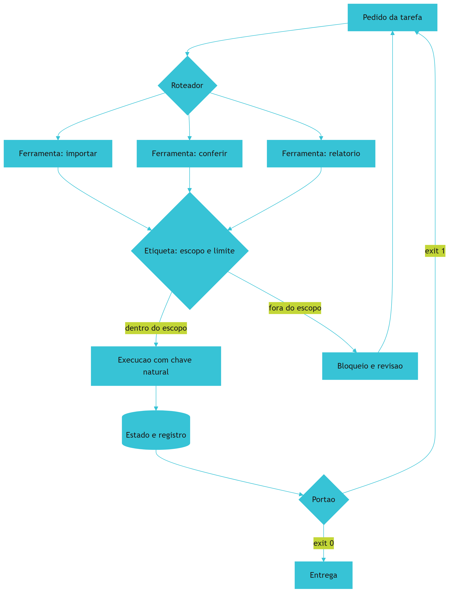

*Figura 8.1 — A usina determinística: cada ferramenta tem etiqueta com escopo e limite, a execução usa chave natural para poder repetir sem duplicar, e todo resultado fica registrado.*

Como Engenheiro de Bancada, você vai notar que a etiqueta é o artefato que mais economiza tempo em projeto herdado — o próximo operador agradece antes mesmo de te conhecer.

## 4. Técnica

### 4.1 A etiqueta das ferramentas

O manifesto de ferramentas é o catálogo da usina. Ele declara, para cada ferramenta, o que ela faz, o que não faz, se pode repetir e quem responde.

```yaml
# ferramentas.yaml — catalogo da usina
ferramentas:
  - nome: importar_pedidos
    faz: le o CSV da pasta de entrada e grava pedidos no banco de estado
    nao_faz: nao corrige dados de origem e nao envia relatorio
    reexecutavel: true
    chave_natural: identificador de origem
    dono: operacao
    limite: ate 50 mil linhas por lote
  - nome: conferir_totais
    faz: compara soma do arquivo com soma do banco
    nao_faz: nao altera dado
    reexecutavel: true
    chave_natural: nao se aplica
    dono: operacao
    limite: sempre dentro de um lote
  - nome: gerar_relatorio
    faz: escreve o resumo do dia no formato do contrato
    nao_faz: nao envia por e-mail nem publica em canal externo
    reexecutavel: true
    chave_natural: data do relatorio
    dono: operacao
    limite: um relatorio por data
```

### 4.2 A importação idempotente

A ferramenta mais comum de qualquer projeto é a importação, e ela é o teste definitivo de idempotência. O código abaixo grava por chave natural: rodar duas vezes não duplica pedido, apenas atualiza.

```python
#!/usr/bin/env python3
"""Importacao idempotente: rodar duas vezes nao duplica pedido."""
import sqlite3
import sys
from pathlib import Path

CRIAR_TABELA = """
CREATE TABLE IF NOT EXISTS pedidos (
    identificador TEXT PRIMARY KEY,
    cliente TEXT NOT NULL,
    valor REAL NOT NULL,
    forma_pagamento TEXT
)
"""
CRIAR_EXECUCOES = """
CREATE TABLE IF NOT EXISTS execucoes (
    id INTEGER PRIMARY KEY AUTOINCREMENT,
    ferramenta TEXT NOT NULL,
    quando TEXT NOT NULL,
    quantidade INTEGER NOT NULL,
    resultado TEXT NOT NULL
)
"""


def abrir(caminho):
    caminho.parent.mkdir(parents=True, exist_ok=True)
    conexao = sqlite3.connect(caminho)
    conexao.execute("PRAGMA journal_mode=WAL;")
    conexao.execute(CRIAR_TABELA)
    conexao.execute(CRIAR_EXECUCOES)
    return conexao


def importar(conexao, pedidos, quando):
    inseridos = 0
    for pedido in pedidos:
        cursor = conexao.execute(
            "INSERT INTO pedidos (identificador, cliente, valor, forma_pagamento) "
            "VALUES (?, ?, ?, ?) "
            "ON CONFLICT(identificador) DO UPDATE SET "
            "cliente=excluded.cliente, valor=excluded.valor, "
            "forma_pagamento=excluded.forma_pagamento",
            (pedido["identificador"], pedido["cliente"], pedido["valor"],
             pedido.get("forma_pagamento", "")),
        )
        inseridos += cursor.rowcount
    conexao.execute(
        "INSERT INTO execucoes (ferramenta, quando, quantidade, resultado) VALUES (?, ?, ?, ?)",
        ("importar_pedidos", quando, len(pedidos), "ok"),
    )
    conexao.commit()
    return inseridos


def main():
    banco = Path("dados/estado/pedidos.db")
    lote = [
        {"identificador": "8842", "cliente": "Ana Souza", "valor": 132.90, "forma_pagamento": "pix"},
        {"identificador": "8843", "cliente": "Carlos Lima", "valor": 58.00, "forma_pagamento": "cartao"},
    ]
    conexao = abrir(banco)
    importar(conexao, lote, "2026-09-14T09:00:00")
    importar(conexao, lote, "2026-09-14T09:05:00")
    total = conexao.execute("SELECT COUNT(*) FROM pedidos").fetchone()[0]
    execucoes = conexao.execute("SELECT COUNT(*) FROM execucoes").fetchone()[0]
    print(f"pedidos no banco: {total}")
    print(f"execucoes registradas: {execucoes}")
    conexao.close()
    return 0


if __name__ == "__main__":
    sys.exit(main())
```

O resultado esperado é didático: dois pedidos no banco, duas execuções registradas. A segunda rodada não criou pedido novo, mas deixou rastro — e é o rastro que permite reconstruir a história do dia.

### 4.3 O registro de execução como ferramenta de diagnóstico

O registro de execuções parece detalhe e é a peça mais consultada em incidente. Com ele, você responde três perguntas em segundos: o que rodou, quando e com qual resultado.

```python
#!/usr/bin/env python3
"""Le o registro de execucoes e mostra o que aconteceu no dia."""
import sqlite3
from pathlib import Path

BANCO = Path("dados/estado/pedidos.db")


def garantir_registro(caminho):
    conexao = sqlite3.connect(caminho)
    conexao.execute(
        "CREATE TABLE IF NOT EXISTS execucoes ("
        "id INTEGER PRIMARY KEY AUTOINCREMENT, ferramenta TEXT NOT NULL, "
        "quando TEXT NOT NULL, quantidade INTEGER NOT NULL, resultado TEXT NOT NULL)"
    )
    conexao.commit()
    return conexao


def resumo_dia(conexao, dia):
    linhas = conexao.execute(
        "SELECT ferramenta, COUNT(*), SUM(quantidade), MAX(resultado) FROM execucoes "
        "WHERE quando LIKE ? GROUP BY ferramenta ORDER BY ferramenta",
        (f"{dia}%",),
    ).fetchall()
    return linhas


def main():
    caminho = BANCO if BANCO.exists() else Path("dados/estado/registro.db")
    conexao = garantir_registro(caminho)
    if BANCO.exists():
        for ferramenta, execucoes, quantidade, resultado in resumo_dia(conexao, "2026-09-14"):
            print(f"{ferramenta}: {execucoes} execucao(oes), {quantidade} registro(s), "
                  f"resultado {resultado}")
    else:
        print("[INFO] registro vazio: rode a importacao antes de consultar o resumo")
    conexao.close()
    return 0


if __name__ == "__main__":
    sys.exit(main())
```

Um registro de execução bem desenhado também é a base da evidência de confiabilidade que o Capítulo 14 vai exigir: sem ele, provar que o processo funcionou vira depoimento.

### 4.4 Ferramenta de terceiro: escopo mínimo declarado

Quando a ferramenta vem de fora, o cuidado muda de foco: você não controla o código, então controla a permissão. A configuração abaixo declara explicitamente o escopo, e a verificação recusa configuração com escopo amplo.

```json
{
  "servidor": "ferramentas-locais",
  "transporte": "stdio",
  "escopo": {
    "leitura": ["dados/entrada"],
    "escrita": ["dados/estado"],
    "proibido": ["dados/entrada", "credenciais", "chaves"]
  },
  "limites": {
    "linhas_por_lote": 50000,
    "chamadas_por_hora": 200,
    "tempo_maximo_segundos": 120
  },
  "verificacao": {
    "saida_conferida_antes_de_consumir": true,
    "descricao_da_ferramenta_revisada_por": "operacao"
  }
}
```

Duas escolhas desse arquivo merecem destaque. A declaração explícita de pasta proibida resolve a maior parte dos acidentes. E o campo de revisão da descrição da ferramenta existe porque a alteração de descrição é uma das classes de ataque documentadas contra esse tipo de integração [4] [3].

### 4.5 Ferramenta, risco e proteção

| Ferramenta | Risco principal | Proteção mínima |
|---|---|---|
| Importar de arquivo | Duplicidade em reexecução | Chave natural e atualização por chave |
| Gerar relatório | Publicar dado errado | Portão de totais antes de escrever |
| Consultar serviço externo | Indisponibilidade e dado parcial | Registro de tentativa e retomada |
| Enviar mensagem externa | Ação irreversível | Modo de ensaio na primeira execução |
| Alterar cadastro de terceiro | Efeito sobre pessoa | Dupla confirmação e revisão humana |
| Ferramenta de terceiro com escrita | Acesso além do necessário | Escopo mínimo declarado e saída verificada |

## 5. Aplica

**Situação.** O relatório de ontem saiu com o dobro dos valores. Você investiga e encontra a causa: a rotina de importação rodou duas vezes, uma na execução agendada e outra quando alguém apertou o comando manualmente para "garantir que tinha rodado". Ninguém entrou em pânico porque ninguém percebeu — o valor duplicado parecia plausível.

**O erro.** O banco foi desenhado sem chave natural: cada importação inseria linhas novas com identificador gerado pelo próprio banco. A duplicidade era invisível na leitura, porque as duas cópias tinham o mesmo conteúdo e nenhuma marca de origem. E não havia registro de execução, o que impediu saber quantas vezes a rotina tinha rodado.

**O diagnóstico.** A ferramenta não era reexecutável. Toda operação de escrita precisa responder à pergunta "e se isso rodar de novo?", e a resposta depende de a chave vir de fora. Sem chave natural e sem registro, o sistema não tem como distinguir repetição de pedido legítimo — e o erro só aparece quando alguém soma [1].

**A correção.** Três mudanças: identificador de origem como chave primária, gravação por atualização em vez de inserção cega e tabela de execuções alimentada por cada ferramenta. Depois disso, a rotina pode rodar duas vezes que o resultado continua correto, e o registro mostra as duas execuções — o que permite reprocessar sem medo [14].

**Métricas de sucesso.** A Peça 4 se mede com quatro números:

| Métrica | Como medir | Sinal de que funcionou |
|---|---|---|
| Duplicidades por lote | Consulta ao banco por chave | Zero duplicidade após reexecução |
| Ferramentas com etiqueta completa | Conferência do catálogo | Todas com escopo, limite e dono |
| Execuções registradas por dia | Leitura da tabela de registro | Toda execução com rastro |
| Tempo de diagnóstico de incidente | Do alarme até a causa identificada | Menor, com o registro em mãos |

**Nota de contexto.** O comportamento padrão de quem está começando é escrever ferramenta sem pensar em repetição, porque a primeira execução funcionou. Quando o volume cresce, esse mesmo padrão vira duplicidade generalizada — e a maioria dos projetos usa apoio de IA sem ter regra escrita para isso [15] [16]. A proteção é barata agora e caríssima depois [17].

**Armadilhas comuns.** A primeira é inserir sem chave natural, o que torna a duplicidade invisível. A segunda é dar à ferramenta de terceiro mais permissão do que ela precisa, ampliando o dano possível [6]. A terceira é sobrescrever o dado de origem em vez de gravar derivado na pasta de estado. A quarta é não registrar execução, deixando o próximo incidente sem linha do tempo. A quinta é chamar ferramenta sem conferir a saída: dependência inexistente, caminho errado e dado parcial chegam todos com aparência de resposta válida [18] [19].

**Até onde isso escala.** Banco de arquivo único e ferramentas locais atendem bem operação de uma máquina e volume moderado, e são a escolha certa enquanto o domínio é cercado — mas ganham limite quando a política de retenção de dados entra em jogo e passa a exigir registro formal de finalidade e descarte [20]. quando há vários processos escrevendo ao mesmo tempo, o próprio modelo de concorrência do banco vira o gargalo, e a decisão passa a ser de arquitetura de dados, não de biblioteca [9]. O limite de idempotência também tem borda: ferramenta reexecutável funciona para dado que tem identificador estável, mas envio de mensagem externa continua sendo ação única, e por isso exige modo de ensaio — repetir não resolve o que não pode ser desfeito [13].

### 5.1 O teste da ferramenta que aguenta repetição

Ferramenta de bancada se prova na terceira execução, não na primeira. Quatro sinais dizem se o que você escreveu é ferramenta ou foi só um comando solto que deu certo uma vez.

- **Aceita entrada diferente?** Se só funciona com o arquivo daquele dia, ainda é script pessoal.
- **Sai com código de erro claro?** Falha silenciosa obriga a pessoa a investigar o que aconteceu.
- **Pode rodar duas vezes sem estragar?** Operação que não é segura para repetir transfere risco para quem aperta o botão [8].
- **Deixa rastro do que fez?** Sem registro, a conferência volta a depender de memória.

| Sinal | Ferramenta pronta | Ainda improviso |
|---|---|---|
| Entrada | Parâmetro declarado | Caminho fixo no código |
| Erro | Código e mensagem | Saída vazia |
| Repetição | Segura para rodar de novo | Duplica dados |
| Rastro | Linha de log por execução | Nenhum |

**Aplicação no sistema.** Escolha as duas ações que você mais repete à mão e transforme em ferramenta reexecutável. O critério de pronto é simples: outra pessoa do time consegue rodar sem perguntar nada, e o resultado é o mesmo duas vezes seguidas. Quando a ferramenta toca dado persistido, ela precisa tratar concorrência e escrita parcial, porque dois processos no mesmo arquivo produzem corrupção silenciosa [9].

**Limite desta prática.** Uma ferramenta só compensa quando o número de execuções futuras multiplicado pelo tempo poupado supera o custo de escrevê-la e mantê-la. Ação que você repete duas vezes por ano continua valendo um comando manual, e está tudo bem [11].

## 6. Conclusão

Você fechou a Peça 4: ferramentas com etiqueta de escopo, limite e dono; importação idempotente por chave natural; registro de execução durável; e escopo mínimo declarado para ferramenta de terceiro. Aprendeu que reexecutável é a propriedade que separa ferramenta de acidente, que padronização de conexão reduz trabalho e amplia risco, e que o registro de execução é a peça mais consultada quando algo dá errado.

**Desafio.** Escreva a etiqueta das três ferramentas mais usadas do seu projeto, rode a importação idempotente duas vezes seguidas e confira no banco que não houve duplicidade. Depois consulte o registro e responda: o que rodou ontem, quantas vezes e com qual resultado?

Com isso a Parte II está fechada: você tem contexto, ciclo de vida, roteamento e ferramentas. Na Parte III começa a montagem completa, começando por transformar o script solto em repositório governado — o primeiro ciclo terminando com portão verde.

## 7. Referências Bibliográficas

[1] TRAXTECH. *20% of AI-Generated Code Dependencies Don't Exist, Creating Supply Chain Security Risks*. Disponível em: https://www.traxtech.com/blog/20-of-ai-generated-code-dependencies-dont-exist-creating-supply-chain-security-risks. Acesso em: 12 set. 2026.
[2] ANTHROPIC. *Model Context Protocol Specification (2025-06-18)*. Disponível em: https://modelcontextprotocol.io/specification/2025-06-18. Acesso em: 12 set. 2026.
[3] NATIONAL SECURITY AGENCY. *Model Context Protocol (MCP) Security — CSI*. Disponível em: https://www.nsa.gov/Portals/75/documents/Cybersecurity/CSI_MCP_SECURITY.pdf. Acesso em: 12 set. 2026.
[4] CHECKMARX. *11 Emerging AI Security Risks with MCP (Model Context Protocol)*. Disponível em: https://checkmarx.com/zero-post/11-emerging-ai-security-risks-with-mcp-model-context-protocol/. Acesso em: 12 set. 2026.
[5] PRUDVI SAISARAN PONDURU. *AgentMesh-MCP: A Secure and Governed Framework for Agentic AI Systems Using LLM Agents and Model Context Protocol Servers*. In: International Journal of Scientific Research in Engineering and Management. 2026. Disponível em: https://doi.org/10.55041/ijsrem62689. Acesso em: 12 set. 2026.
[6] CLOUD SECURITY ALLIANCE. *MCP Security Crisis: Systemic Design Flaws in AI Agent Infrastructure*. Disponível em: https://labs.cloudsecurityalliance.org/research/csa-research-note-mcp-security-crisis-20260504-csa-styled/. Acesso em: 12 set. 2026.
[7] OKULA, Oghenekeno Hilkiah; NEERANJAN, Chitare. *A Design Science Approach for Agentic AI in Network Engineering: Autonomous Network Management Using AI Agents, LLMs and Model Context Protocol (MCP) Mechanisms*. 2026. Disponível em: https://doi.org/10.36227/techrxiv.176978431.15223796/v1. Acesso em: 12 set. 2026.
[8] SQLITE. *Write-Ahead Logging*. Disponível em: https://www.sqlite.org/wal.html. Acesso em: 12 set. 2026.
[9] SQLITE. *File Locking And Concurrency In SQLite Version 3*. Disponível em: https://sqlite.org/lockingv3.html. Acesso em: 12 set. 2026.
[10] CHACON, Scott; STRAUB, Ben. *Pro Git: Everything you need to know about Git*. 2. ed. Apress, 2014. Disponível em: https://git-scm.com/book/en/v2. Acesso em: 12 set. 2026.
[11] MARTIN, Robert C. *Clean Architecture: A Craftsman's Guide to Software Structure and Design*. Prentice Hall, 2017. Disponível em: https://www.pearson.com/. Acesso em: 12 set. 2026.
[12] ALI, Mohamad Abou; DORNAIKA, Fadi; CHARAFEDDINE, Jinan. *Agentic AI: a comprehensive survey of architectures, applications, and future directions*. In: Artificial Intelligence Review. 2025. Disponível em: https://doi.org/10.1007/s10462-025-11422-4. Acesso em: 12 set. 2026.
[13] NYGARD, Michael T. *Release It!: Design and Deploy Production-Ready Software*. 2. ed. Pragmatic Bookshelf, 2018. Disponível em: https://pragprog.com/titles/mnee2/release-it-second-edition/. Acesso em: 12 set. 2026.
[14] RAKSHIT, Yerram Sai. *Modernizing Software Testing: AI, Telemetry, and Agentic Quality Engineering*. In: International Journal of AI Engineering. 2026. Disponível em: https://doi.org/10.34218/ijaieg_01_01_002. Acesso em: 12 set. 2026.
[15] STACK OVERFLOW. *2025 Developer Survey — AI*. Disponível em: https://survey.stackoverflow.co/2025/ai. Acesso em: 12 set. 2026.
[16] ROBBES, Romain et al. *Agentic Much? Adoption of Coding Agents on GitHub*. In: ACM Transactions on Software Engineering and Methodology. 2026. Disponível em: https://doi.org/10.1145/3822180. Acesso em: 12 set. 2026.
[17] HUMBLE, Jez; FARLEY, David. *Continuous Delivery: Reliable Software Releases through Build, Test, and Deployment Automation*. Addison-Wesley, 2010. Disponível em: https://continuousdelivery.com/. Acesso em: 12 set. 2026.
[18] VERACODE. *2025 GenAI Code Security Report: AI-Generated Code Security Risks*. Disponível em: https://www.veracode.com/blog/ai-generated-code-security-risks/. Acesso em: 12 set. 2026.
[19] ENDOR LABS. *The Most Common Security Vulnerabilities in AI-Generated Code*. Disponível em: https://www.endorlabs.com/learn/the-most-common-security-vulnerabilities-in-ai-generated-code. Acesso em: 12 set. 2026.
[20] NATIONAL INSTITUTE OF STANDARDS AND TECHNOLOGY. *Artificial Intelligence Risk Management Framework: Generative Artificial Intelligence Profile (NIST AI 600-1)*. Disponível em: https://nvlpubs.nist.gov/nistpubs/ai/NIST.AI.600-1.pdf. Acesso em: 12 set. 2026.

# Parte III — Montagem: O Projeto Real de Ponta a Ponta

# Capítulo 9: Primeiro encaixe: do script solto ao repositório governado

## 1. Introdução

No Capítulo 8 você fechou a quarta peça: ferramentas reexecutáveis e registro durável. As quatro peças existem, mas ainda estão separadas na sua cabeça. Este capítulo faz o encaixe — e o faz do jeito mais realista possível: partindo do que você já tem, e não de um repositório limpo.

Ao final deste capítulo você terá um repositório governado: inventário do que existe, quatro camadas mínimas instaladas e um ciclo completo do pedido ao portão aprovado. É o momento em que a bancada deixa de ser ideia e passa a ser o lugar onde você trabalha.

## 2. Explica

### 2.1 Inventário: o que existe, o que cerca, o que nasce

Projeto real raramente começa do zero. Existe um script que alguém escreveu às pressas, um arquivo de planilha com macros, uma pasta com dados de dois anos. O primeiro passo do encaixe é o inventário honesto, que classifica cada item em três categorias: **aproveitar** (funciona e tem dono), **cercar** (funciona mas ninguém entende, precisa de proteção e teste antes de qualquer mudança) e **substituir** (não dá para confiar).

O erro mais comum nessa fase é confundir "feio" com "ruim". Código feio que funciona e tem teste merece ser cercado, não reescrito — reescrever sem teste é trocar defeito conhecido por defeito desconhecido [1]. E existe um agravante moderno: **45%** das amostras de código gerado por assistentes apresentaram vulnerabilidades conhecidas em avaliações independentes, e a taxa não melhorou entre ciclos de teste [2].

Vale lembrar que o inventário não mede estilo: ele mede risco. E risco se avalia com o mesmo cuidado de qualquer avaliação séria, que exige critério fixo antes de olhar o objeto [18].

O critério prático do inventário é a pergunta "o que acontece se isso quebrar amanhã?" Item cuja falha derruba a operação recebe proteção primeiro, independentemente de quanto tempo tem. Item cuja falha ninguém nota pode esperar. A dívida herdada tem nome e forma: casca de função que finge entregar resultado, dependência que não existe e prática insegura copiada de exemplo antigo [3] [4].

### 2.2 A ordem de instalação e por que ela importa

As quatro peças se instalam em ordem: contexto, ciclo de vida e portões, roteamento, ferramentas. A razão é a mesma de qualquer arquitetura em camadas: a camada externa depende da interna, nunca o contrário [5].

Instalar na ordem errada produz três sintomas conhecidos. Começar pelas ferramentas gera automação sem regra — rápido e perigoso. Começar pelo roteamento gera otimização de custo sem contrato, o que barateia o erro. Começar pelos portões gera bloqueio sem especificação, o que faz a equipe desligar a verificação. A ordem certa é chata e economiza semanas.

Há uma analogia organizacional útil aqui. Adoção de plataforma dá certo quando existe um caminho claro e um dono, e não quando se instala ferramenta e se espera mudança de comportamento [6]. A mesma ordem aparece na prática de entrega contínua: padrão de verificação vem antes de velocidade, porque velocidade sem verificação é retrabalho adiado [7].

### 2.3 O primeiro ciclo completo

O objetivo do primeiro dia de bancada não é automatizar tudo: é fechar **um** ciclo completo. Escolha a tarefa menor que ainda tem valor real, escreva a especificação de uma página, execute, verifique no portão e entregue. O ciclo termina com o portão verde, não com a sensação de progresso.

O valor de fechar o ciclo inteiro é que ele revela o que falta. As lacunas aparecem em ordem previsível: primeiro a especificação (o que exatamente entregar), depois o contrato (em que formato), depois a verificação (como saber) e por último a ferramenta (com o que executar). Quem tenta resolver tudo de uma vez descobre as lacunas todas juntas, no meio da entrega.

Um ciclo bem desenhado tem outra vantagem: ele deixa rastro suficiente para que a próxima tentativa seja mais curta. Registro de execução e histórico do repositório são o que permitem voltar a um estado conhecido sem adivinhação [8] [9].

### 2.4 Quando não governar

Nem tudo merece bancada. Script de uso único, análise exploratória de dois dias e protótipo para decidir se o projeto vale a pena são casos em que a estrutura custa mais do que protege. A pergunta de corte é: **isso vai rodar de novo dentro de dois meses?** Se a resposta é não, escreva o script, rode, apague e registre a decisão em uma linha.

O limite prático entre "descartável" e "governado" não é o tamanho do código, é a consequência da falha. Um script de dez linhas que move dinheiro pede governança. Um sistema de mil linhas que gera gráfico de curiosidade não pede. Note que esse recorte é o mesmo que separa delegar execução de delegar responsabilidade: o que exige julgamento precisa de estrutura [10].

## 3. Ilustra

Existe um momento específico na vida de uma oficina em que a bancada fica pronta. As ferramentas estão na prateleira com etiqueta, o quadro de disjuntores está fechado com os circuitos identificados, a mesa tem espaço e o caderno está aberto na primeira página. Nada foi produzido ainda — e, ao mesmo tempo, tudo mudou, porque a partir dali qualquer serviço começa sem improviso.

O primeiro encaixe é esse momento. A primeira lâmpada de teste acende no serviço mais simples, justamente para provar que o circuito fecha: da entrada de energia até a saída de trabalho. Repare que ninguém testa o quadro elétrico com o serviço mais difícil. O teste é simples de propósito: se o circuito não fecha no serviço fácil, não vai fechar no difícil.

Repare também no que fica pendurado na parede depois: a lista do que foi cercado e o porquê. Aquilo não é documentação de engenharia, é aviso de segurança — o próximo que mexer precisa saber onde não pisar antes de aprender a andar [11].

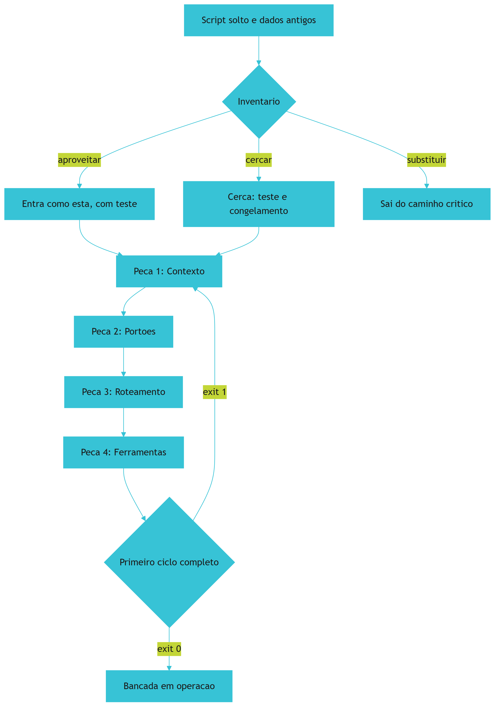

*Figura 9.1 — O primeiro encaixe: inventário decide o destino de cada item, as quatro peças entram na ordem e uma única tarefa é levada até o portão verde.*

Como Engenheiro de Bancada, você vai resistir à tentação de começar pelo item mais problemático. O primeiro ciclo é para provar o circuito, não para consertar o passado.

## 4. Técnica

### 4.1 O inventário automatizado

O inventário manual esquece arquivos. Este script percorre o repositório e classifica o que encontra por tipo, sinalizando os indícios de risco: arquivo de dados versionado, casca de função e comentário de pendência.

```python
#!/usr/bin/env python3
"""Inventario do repositorio: o que existe, o que preocupa e o que nao tem teste."""
import re
from pathlib import Path

INDICIOS = {
    "stub": re.compile(r"\b(pass\s*$|TODO|FIXME|NotImplementedError)\b", re.MULTILINE),
    "dado_versionado": re.compile(r"\.(csv|xlsx|db|sqlite)$"),
    "segredo": re.compile(r"(api[_-]?key|senha|password|token)\s*=\s*[\"']", re.IGNORECASE),
}
PASTAS_IGNORADAS = {".git", "__pycache__", "node_modules"}


def classificar(raiz):
    achados = {chave: [] for chave in INDICIOS}
    total_arquivos = 0
    for caminho in sorted(Path(raiz).rglob("*")):
        if not caminho.is_file() or any(parte in PASTAS_IGNORADAS for parte in caminho.parts):
            continue
        total_arquivos += 1
        if INDICIOS["dado_versionado"].search(caminho.name):
            achados["dado_versionado"].append(str(caminho))
        if caminho.suffix in {".py", ".js", ".ts"}:
            texto = caminho.read_text(encoding="utf-8", errors="replace")
            if INDICIOS["stub"].search(texto):
                achados["stub"].append(str(caminho))
            if INDICIOS["segredo"].search(texto):
                achados["segredo"].append(str(caminho))
    return total_arquivos, achados


def main():
    total, achados = classificar(".")
    print(f"arquivos analisados: {total}")
    for chave, itens in achados.items():
        rotulo = {"stub": "casca ou pendencia", "dado_versionado": "dado versionado",
                  "segredo": "possivel segredo em codigo"}[chave]
        print(f"{rotulo}: {len(itens)}")
        for item in itens[:5]:
            print(f"  - {item}")
    if achados["segredo"]:
        print("[BLOQUEADO] resolva os segredos antes de governar o repositorio")
        return 1
    print("[APROVADO] inventario concluido")
    return 0


if __name__ == "__main__":
    raise SystemExit(main())
```

O inventário não decide nada sozinho: ele entrega a lista para você classificar em aproveitar, cercar ou substituir. Vale rodá-lo antes e depois do encaixe: a segunda execução documenta o ganho e aponta o que ficou pendente [1].

### 4.2 O roteiro de instalação das quatro peças

A instalação é sequencial e leva uma sessão por peça. O roteiro abaixo é o mesmo do caso âncora.

```console
$ mkdir -p dados/entrada dados/estado verificacoes exemplos
$ git init && git add . && git commit -m "estado inicial do projeto"
$ # Peca 1 - contexto
$ printf '%s\n' "objetivo, contrato, exemplo e prova" > objetivo.md
$ cp ../../modelos/contrato.json . && cp ../../modelos/pedidos-exemplo.csv exemplos/
$ python verificacoes/medir_contexto.py
$ # Peca 2 - portoes
$ cp ../../modelos/portoes.yaml . && cp ../../modelos/harness.py verificacoes/
$ python verificacoes/harness.py
$ # Peca 3 - roteamento
$ cp ../../modelos/roteamento.yaml . && cp ../../modelos/roteador.py verificacoes/
$ python verificacoes/roteador.py
$ # Peca 4 - ferramentas
$ cp ../../modelos/ferramentas.yaml . && python verificacoes/importar_pedidos.py
$ python verificacoes/harness.py
[APROVADO] 4 portoes executados
```

O roteiro é intencionalmente copiável. A parte que exige julgamento não é criar arquivo: é preencher cada um com o conteúdo do seu domínio. Se você tiver pressa, comece por contexto e portões: são as duas peças que impedem o trabalho de entrar errado e de sair errado [7].

### 4.3 A estrutura final do repositório governado

Depois do encaixe, a árvore do projeto tem uma forma estável. Ela é a mesma do caso âncora com três acréscimos: o catálogo de ferramentas, o manifesto de portões e a pasta de verificações.

```text
painel-de-pedidos/
  objetivo.md            contrato.json        vocabulario.yaml
  portoes.yaml           ferramentas.yaml     roteamento.yaml
  caderno.json           linha-de-base.json
  dados/entrada/         (somente leitura)
  dados/estado/          (escrita permitida, backup obrigatorio)
  verificacoes/
    conferir_entrada.py  conferir_totais.py   conferir_duplicidade.py
    importar_pedidos.py  gerar_relatorio.py   harness.py
  exemplos/pedidos-exemplo.csv
  decisoes.md
```

A regra de leitura dessa árvore é simples: tudo que está na raiz descreve e governa; tudo que está em `verificacoes` executa; tudo que está em `dados` é conteúdo. Nenhum arquivo de governança deve morar dentro de `dados`. A separação tem função prática: o estado pode ser apagado e reconstruído sem perder o conhecimento que governa o projeto, e o conhecimento permanece auditável pelo histórico do repositório [5].

### 4.4 O registro do primeiro ciclo

O primeiro ciclo fechado recebe registro próprio, porque ele é a prova de que a bancada funciona. O formato abaixo vai no caderno, e é ele que você vai reutilizar nas próximas tarefas.

```json
{
  "ciclo": 1,
  "tarefa": "conferir arquivo do dia e gerar resumo por forma de pagamento",
  "planejado": {
    "criterio_de_pronto": "totais conferidos e nenhuma linha valida fora do resumo",
    "fora_de_escopo": "corrigir dados na origem"
  },
  "executado": {
    "porta": "script",
    "ferramentas": ["importar_pedidos", "conferir_totais", "gerar_relatorio"]
  },
  "verificado": {
    "portoes": ["entrada_conforme", "sem_duplicidade", "totais_conferem"],
    "resultado": "aprovado"
  },
  "entregue": {
    "artefato": "dados/estado/resumo-2026-09-14.json",
    "conferido_por": "operacao"
  },
  "tempo_total_minutos": 22
}
```

### 4.5 Sinal de dívida e ação correspondente

| Sinal no inventário | Risco | Ação no encaixe |
|---|---|---|
| Casca de função e comentário de pendência | Falha silenciosa em produção | Cercar com teste antes de tocar |
| Dado de produção versionado no projeto | Perda e exposição de dados | Mover para pasta de entrada com permissão restrita |
| Possível segredo em código | Vazamento de credencial | Remover do histórico e usar variável de ambiente |
| Script sem teste que a operação usa | Mudança quebra o dia | Congelar, cercar com verificação e só então evoluir |
| Pasta de dados sem backup | Perda irreversível | Cópia antes de qualquer escrita |

## 5. Aplica

**Situação.** Você assume um projeto que gera relatórios de produção: um script de 180 linhas, uma pasta com planilhas de dois anos e um agendamento que roda de madrugada. A primeira decisão que vem à cabeça é reescrever o script inteiro com apoio de IA, já que "está tudo bagunçado".

**O erro.** Você reescreve. A versão nova é mais bonita, tem funções separadas e nomes melhores. Na primeira madrugada ela roda e gera um relatório diferente do antigo: o script original tinha uma regra não documentada que excluía pedidos cancelados de um cliente específico. Ninguém sabia disso, e você acabou de remover a regra sem saber que ela existia.

**O diagnóstico.** Você reescreveu antes de inventariar e antes de cercar. Código operacional sem teste é conhecimento tácito: o comportamento é a documentação, e apagá-lo apaga a regra [1]. O custo não foi o retrabalho de escrever duas vezes: foi o relatório errado entregue a quem decidia sobre o mês [2].

**A correção.** Três passos, na ordem do encaixe. Primeiro, congelar o script antigo como referência e capturar a saída dele em um caso de teste. Segundo, escrever a verificação que compara a saída nova com a antiga em um lote conhecido — se houver diferença, o portão bloqueia e revela a regra escondida. Terceiro, só depois, refatorar com o teste no lugar. A regra do cliente é então documentada no contrato, e a próxima pessoa não precisa descobri-la por acidente.

**Métricas de sucesso.** O encaixe tem indicadores objetivos, todos medidos no primeiro ciclo:

| Métrica | Como medir | Sinal de que funcionou |
|---|---|---|
| Itens inventariados com destino | Conferência da lista de inventário | Nenhum item sem classificação |
| Tempo do primeiro ciclo completo | Registro do ciclo no caderno | Menos de uma sessão de trabalho |
| Portões executando no primeiro ciclo | Saída do harness | Aprovação com pelo menos três portões |
| Regressões encontradas pelo teste de comparação | Diferenças entre saída antiga e nova | Diferenças aparecem antes de entregar, não depois |

**Nota de contexto.** Vale medir a pressa antes de governar o repositório. Boa parte do código que circula hoje foi produzido sem verificação e sem política organizacional, o que significa que o inventário de qualquer projeto herdado vai encontrar mais dívida do que o esperado [12] [13]. O objetivo do encaixe não é chegar a zero dívida: é chegar a dívida conhecida [14].

**Nota de contexto.** Duas armadilhas técnicas merecem menção antes da lista. A primeira é confiar em teste que passa sempre: quando o critério de avaliação vira o objetivo, o sistema aprende a satisfazê-lo em vez de resolver o problema, comportamento já medido em agentes de código de horizonte longo [19]. A segunda é usar medida saturada como prova de qualidade, porque desempenho alto em prova fácil não indica capacidade real [20].

**Armadilhas comuns.** A primeira é reescrever antes de cercar, o que destrói comportamento não documentado. A segunda é instalar as peças fora de ordem, começando por ferramenta. A terceira é tentar fechar o ciclo com uma tarefa grande, o que transforma o primeiro dia em projeto de um mês. A quarta é deixar o inventário sem destino, transformando a lista em documento decorativo. A quinta é instalar contexto sem critério de finitude: mesa cheia demais reproduz o problema que a Peça 1 deveria resolver [15] [16].

**Até onde isso escala.** O encaixe descrito atende um repositório e uma pessoa, e pressupõe que a operação tem dono identificável; sem dono, o encaixe vira projeto paralelo que ninguém mantém, e a governança precisa de decisão organizacional sobre responsabilidade [17]. em projeto herdado grande, o inventário precisa de amostragem e de priorização por risco, e a cerca vem antes da limpeza. Existe limite de esforço também: sistema legado que funciona e será substituído em três meses recebe cerca mínima e nenhuma refatoração [11]. E existe limite honesto de ferramenta: nenhuma quantidade de estrutura substitui o conhecimento de quem opera o processo — a bancada organiza esse conhecimento, não o cria.

### 5.1 O primeiro encaixe em uma tarefa pequena

Escolha a tarefa mais chata do seu projeto, não a mais interessante. Encaixe inicial existe para provar o encadeamento, e tarefa chata tem critério mais claro que tarefa criativa.

| Etapa | O que você faz | Artefato que fica |
|---|---|---|
| 1. Pedido | Descreve entrada, saída e recusa | Especificação aprovada |
| 2. Contexto | Aponta os arquivos que importam | Arquivo de contexto |
| 3. Ciclo | Roda com disjuntor ligado | Registro de execução |
| 4. Verificação | Confere contra o critério | Resultado do portão |
| 5. Registro | Anota o que funcionou | Caderno de bancada |

Se o encaixe parou na etapa 3, o problema costuma ser contexto, não executor. Muito arquivo irrelevante e pouco arquivo essencial produz o pior resultado possível: o sistema acha que sabe, e o dado que faltava estava justamente fora [19].

**O que observar no primeiro ciclo.** Três coisas, nesta ordem: o portão reprovou alguma vez? O executor pediu informação na hora certa em vez de inventar? O registro tem o que você precisa para repetir? Se as três respostas forem sim, o encadeamento está de pé, mesmo que o resultado do artefato ainda seja modesto [7].

**Aplicação no sistema.** A tarefa do primeiro encaixe permanece no repositório como caso de referência. Nos próximos capítulos, toda vez que uma peça nova entrar, ela é testada primeiro nesse caso conhecido — é assim que você descobre que quebrou algo sem ter que auditar o projeto inteiro [1].

## 6. Conclusão

Você fez o primeiro encaixe: inventário com destino para cada item, quatro peças instaladas na ordem certa e um ciclo completo fechado com portão verde. Aprendeu que cercar vem antes de reescrever, que a ordem de instalação economiza semanas e que nem tudo merece governança — script descartável continua descartável. E viu o formato do registro de ciclo, que será reutilizado em todas as tarefas seguintes.

**Desafio.** Rode o inventário no seu repositório, classifique os cinco itens que ele apontar e feche um ciclo completo na tarefa mais simples que ainda tenha valor real. Grave o registro do ciclo nos moldes da seção Técnica.

No próximo capítulo, o caso âncora completo: o Painel de Pedidos construído do início ao fim, com o código real, as decisões de modelagem e os erros que apareceram no caminho.

## 7. Referências Bibliográficas

[1] FOWLER, Martin. *Patterns of Enterprise Application Architecture*. Boston: Addison-Wesley, 2002. Disponível em: https://martinfowler.com/books/eaa.html. Acesso em: 12 set. 2026.
[2] VERACODE. *2025 GenAI Code Security Report: AI-Generated Code Security Risks*. Disponível em: https://www.veracode.com/blog/ai-generated-code-security-risks/. Acesso em: 12 set. 2026.
[3] ENDOR LABS. *The Most Common Security Vulnerabilities in AI-Generated Code*. Disponível em: https://www.endorlabs.com/learn/the-most-common-security-vulnerabilities-in-ai-generated-code. Acesso em: 12 set. 2026.
[4] TRAXTECH. *20% of AI-Generated Code Dependencies Don't Exist, Creating Supply Chain Security Risks*. Disponível em: https://www.traxtech.com/blog/20-of-ai-generated-code-dependencies-dont-exist-creating-supply-chain-security-risks. Acesso em: 12 set. 2026.
[5] MARTIN, Robert C. *Clean Architecture: A Craftsman's Guide to Software Structure and Design*. Prentice Hall, 2017. Disponível em: https://www.pearson.com/. Acesso em: 12 set. 2026.
[6] DORA / GOOGLE CLOUD. *State of AI-assisted Software Development 2025*. Disponível em: https://dora.dev/dora-report-2025/. Acesso em: 12 set. 2026.
[7] HUMBLE, Jez; FARLEY, David. *Continuous Delivery: Reliable Software Releases through Build, Test, and Deployment Automation*. Addison-Wesley, 2010. Disponível em: https://continuousdelivery.com/. Acesso em: 12 set. 2026.
[8] CHACON, Scott; STRAUB, Ben. *Pro Git: Everything you need to know about Git*. 2. ed. Apress, 2014. Disponível em: https://git-scm.com/book/en/v2. Acesso em: 12 set. 2026.
[9] RAKSHIT, Yerram Sai. *Modernizing Software Testing: AI, Telemetry, and Agentic Quality Engineering*. In: International Journal of AI Engineering. 2026. Disponível em: https://doi.org/10.34218/ijaieg_01_01_002. Acesso em: 12 set. 2026.
[10] ALI, Mohamad Abou; DORNAIKA, Fadi; CHARAFEDDINE, Jinan. *Agentic AI: a comprehensive survey of architectures, applications, and future directions*. In: Artificial Intelligence Review. 2025. Disponível em: https://doi.org/10.1007/s10462-025-11422-4. Acesso em: 12 set. 2026.
[11] NYGARD, Michael T. *Release It!: Design and Deploy Production-Ready Software*. 2. ed. Pragmatic Bookshelf, 2018. Disponível em: https://pragprog.com/titles/mnee2/release-it-second-edition/. Acesso em: 12 set. 2026.
[12] STACK OVERFLOW. *2025 Developer Survey — AI*. Disponível em: https://survey.stackoverflow.co/2025/ai. Acesso em: 12 set. 2026.
[13] ROBBES, Romain et al. *Agentic Much? Adoption of Coding Agents on GitHub*. In: ACM Transactions on Software Engineering and Methodology. 2026. Disponível em: https://doi.org/10.1145/3822180. Acesso em: 12 set. 2026.
[14] CLOUD SECURITY ALLIANCE. *Vibe Coding's Security Debt: The AI-Generated CVE Surge*. Disponível em: https://labs.cloudsecurityalliance.org/research/csa-research-note-ai-generated-code-vulnerability-surge-2026/. Acesso em: 12 set. 2026.
[15] MEI, Lingrui et al. *A Survey of Context Engineering for Large Language Models*. In: arXiv. 2025. Disponível em: https://arxiv.org/abs/2507.13334. Acesso em: 12 set. 2026.
[16] LIU, Nelson F. et al. *Lost in the Middle: How Language Models Use Long Contexts*. In: Transactions of the Association for Computational Linguistics. 2024. Disponível em: https://arxiv.org/abs/2307.03172. Acesso em: 12 set. 2026.
[17] NATIONAL INSTITUTE OF STANDARDS AND TECHNOLOGY. *Artificial Intelligence Risk Management Framework: Generative Artificial Intelligence Profile (NIST AI 600-1)*. Disponível em: https://nvlpubs.nist.gov/nistpubs/ai/NIST.AI.600-1.pdf. Acesso em: 12 set. 2026.
[18] OPENAI. *Introducing SWE-bench Verified*. Disponível em: https://openai.com/index/introducing-swe-bench-verified/. Acesso em: 12 set. 2026.
[19] METR. *Recent Frontier Models Are Reward Hacking*. Disponível em: https://metr.org/blog/2025-06-05-recent-reward-hacking/. Acesso em: 12 set. 2026.
[20] SCALE LABS. *SWE-Bench Pro (Public Dataset) — Leaderboard*. Disponível em: https://labs.scale.com/leaderboard/swe_bench_pro_public. Acesso em: 12 set. 2026.

# Capítulo 10: O caso âncora completo: o Painel de Pedidos, da ideia ao ar

## 1. Introdução

No Capítulo 9 você fez o encaixe: inventário, quatro peças na ordem certa e o primeiro ciclo fechado. Agora o mesmo roteiro é aplicado do início ao fim em um projeto inteiro — o Painel de Pedidos que acompanha você desde o Capítulo 1.

Ao final deste capítulo você terá visto o caso âncora funcionando de ponta a ponta: modelagem, importação, painel, relatório, teste e entrada em uso, com o código real e as decisões registradas. É o capítulo para onde todos os anteriores apontaram — e ele é o modelo que você replica no seu projeto.

## 2. Explica

### 2.1 Modelagem: três palavras e uma lista de exclusões

O Painel de Pedidos tem três conceitos, e a clareza deles determina todo o resto. **Pedido** é a linha do arquivo de origem com identificador próprio. **Lote** é o conjunto de pedidos recebidos em uma mesma execução. **Conferência** é a verificação que aprova ou bloqueia o lote antes de gravar.

O que define a qualidade da modelagem não é o que ela inclui, é o que ela **exclui**. Neste projeto ficaram de fora, por decisão registrada: controle de estoque, cadastro de clientes, emissão fiscal e envio automático de mensagem. Cada exclusão tem motivo, e a maior parte deles é o mesmo — o projeto precisa fechar um ciclo completo antes de crescer [1]. Registre as exclusões junto com o motivo: escopo não declarado volta como pedido urgente no meio da entrega [2].

Modelagem em projeto pequeno segue um princípio chato e eficaz: modele o que você precisa verificar. Se ninguém vai conferir um dado, ele provavelmente não pertence ao escopo ainda. Modelo que mistura dado de negócio com mecanismo de entrega custa caro na primeira mudança de requisito [1].

### 2.2 As quatro decisões que sustentaram o projeto

Quatro decisões explicam quase todo o comportamento do sistema, e todas foram tomadas na primeira sessão.

A primeira foi **chave natural**: o identificador do pedido vem do arquivo de origem, nunca do banco. Isso tornou a importação reexecutável desde o primeiro dia, e é o que permite reprocessar um lote sem medo.

A segunda foi **separação física de dados**: a pasta de entrada é somente leitura, a pasta de estado recebe tudo que o sistema produz. Essa divisão é o que transforma um erro de execução em inconveniente, e não em perda.

A terceira foi **portão de totais**: nenhum relatório é escrito antes de a soma do banco conferir com a soma do arquivo. É a verificação mais simples do projeto e a que mais pegou defeito real.

A quarta foi **relatório por data**: o resultado tem identificador da data do lote, o que impede a sobrescrita acidental e torna o histórico comparável. É a mesma lógica de chave natural aplicada ao artefato. As quatro decisões juntas produzem um efeito que vale mais do que cada uma: o sistema passa a ser reexecutável de ponta a ponta — importar duas vezes, gerar relatório duas vezes e conferir três vezes não estraga nada, o que é a definição prática de ferramenta confiável [3].

### 2.3 As seis etapas de construção

A construção seguiu seis etapas, e a ordem importa tanto quanto o conteúdo. **Esquema** primeiro, porque define o contrato do banco. **Importação** depois, porque sem dado não há o que mostrar. **Conferência** em seguida, antes do painel — de nada serve exibir número não conferido. **Relatório** na sequência, que é o produto real do sistema. **Teste** com comparação contra o processo manual. E **publicação local**, que é a entrada em uso.

Note onde está a verificação: antes do painel, não depois. Um painel bonito construído sobre dado não conferido é a forma mais cara de enganar a própria operação. A ordem das etapas também segue o princípio de que verificação automatizada é parte do processo, e não etapa de encerramento [4].

### 2.4 Confiança no código que você não escreveu

Parte do código do caso âncora foi escrita com apoio de assistente, e isso exigiu disciplina extra. A taxa de aprovação de segurança em avaliações de código gerado por IA ficou em torno de **56%** em relatórios independentes, o que significa que quase metade das amostras não passou na verificação de segurança [5].

Três práticas reduziram o risco. Não aceitar dependência sem conferir que ela existe e é legítima, porque parte das dependências citadas por código gerado simplesmente não existe [6]. Preferir biblioteca padrão a pacote obscuro quando o ganho é pequeno. E revisar entrada e saída de cada ferramenta contra o contrato, o que pega tanto dado inválido quanto prática insegura replicada [7] [8]. O mesmo cuidado vale para integração padronizada com serviço externo: escopo declarado e saída verificada antes de consumir [9].

### 2.5 O registro de decisões

O arquivo de decisões é o artefato que mais economiza tempo depois. Ele registra o que foi decidido, quando, por quê e o que ficou fora. Em um projeto de três meses, é ele que evita a discussão circular sobre um assunto já resolvido.

O formato é deliberadamente simples: data, decisão, motivo e consequência. Decisão sem consequência registrada é decisão que vai ser revista por falta de memória do motivo [10]. O registro também é o que permite explicar o sistema a quem chega depois: o histórico do repositório guarda o que mudou, e o caderno guarda por quê [11].

## 3. Ilustra

Imagine a vista explodida de uma máquina na parede de uma oficina: cada peça desenhada separada, com número, nome e função, e o desenho completo ao lado mostrando como elas se encaixam. Ninguém aprende a montar uma máquina olhando apenas o conjunto montado. A vista explodida é o que transforma um objeto misterioso em procedimento.

O capítulo funciona assim. Você já viu cada peça nos capítulos anteriores: contexto, portão, roteador e ferramenta. Aqui as peças aparecem na ordem de montagem, com o encaixe visível. Repare que nenhuma peça é nova — a diferença é que agora elas trabalham juntas, e o resultado é um sistema que roda.

Repare também no que o desenho explodido mostra e que o produto montado esconde: a peça pequena que trava tudo. No caso âncora, essa peça é o portão de totais. Ele custa vinte linhas e é o que impede que um painel bonito exiba número errado.

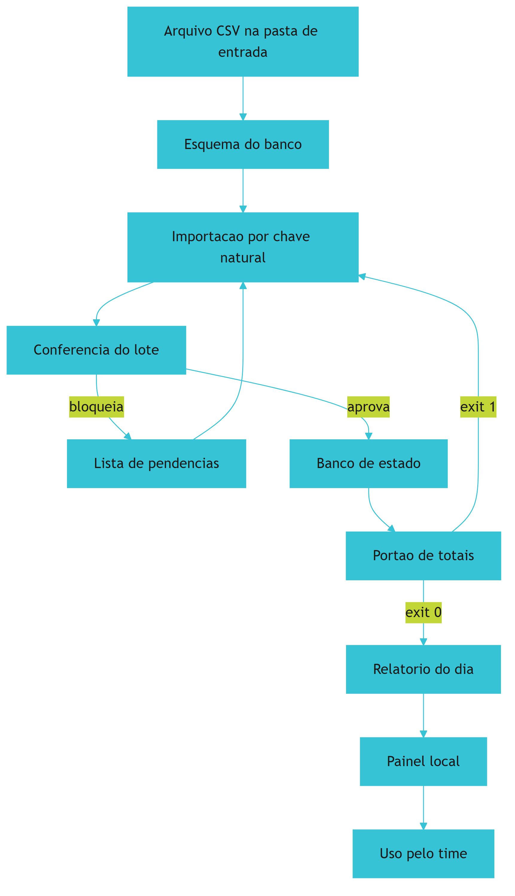

*Figura 10.1 — Vista explodida do Painel de Pedidos: a conferência acontece antes do painel, e o portão de totais decide se o relatório existe.*

Como Engenheiro de Bancada, você vai notar que a vista explodida do seu projeto tem a mesma forma — muda o domínio, não o encaixe.

## 4. Técnica

### 4.1 O esquema do banco

O esquema é o contrato do estado. Ele declara o que existe, o que é obrigatório e qual é a chave. Nada de coluna opcional sem motivo declarado.

```sql
CREATE TABLE IF NOT EXISTS pedidos (
    identificador     TEXT PRIMARY KEY,
    cliente           TEXT NOT NULL,
    valor             REAL NOT NULL,
    data              TEXT NOT NULL,
    forma_pagamento   TEXT,
    lote              TEXT NOT NULL
);

CREATE TABLE IF NOT EXISTS pendencias (
    id                INTEGER PRIMARY KEY AUTOINCREMENT,
    identificador     TEXT,
    motivo            TEXT NOT NULL,
    lote              TEXT NOT NULL
);

CREATE TABLE IF NOT EXISTS execucoes (
    id                INTEGER PRIMARY KEY AUTOINCREMENT,
    ferramenta        TEXT NOT NULL,
    quando            TEXT NOT NULL,
    quantidade        INTEGER NOT NULL,
    resultado         TEXT NOT NULL
);
```

Três tabelas bastam: fato, pendência e rastro. Toda tabela criada sem uma dessas três funções é candidata a sair do escopo. Em banco de arquivo único, vale ligar o registro antecipado e entender o modelo de trava antes de ter dois processos escrevendo ao mesmo tempo [12] [13].

### 4.2 A importação com conferência

O importador do caso âncora faz as quatro coisas na ordem certa: lê, confere, grava e registra. Ele nunca grava antes de conferir, e nunca altera o arquivo de origem.

```python
#!/usr/bin/env python3
"""Importacao com conferencia: le, confere, grava e registra."""
import csv
import sqlite3
import tempfile
from pathlib import Path

COLUNAS = ["identificador", "cliente", "valor", "data", "forma_pagamento"]


def ler(caminho):
    with Path(caminho).open(encoding="utf-8", newline="") as arquivo:
        return list(csv.DictReader(arquivo))


def conferir(linhas):
    pendencias = []
    vistos = set()
    for numero, linha in enumerate(linhas, start=2):
        identificador = (linha.get("identificador") or "").strip()
        if not identificador:
            pendencias.append((None, f"linha {numero}: identificador vazio"))
            continue
        if identificador in vistos:
            pendencias.append((identificador, "identificador repetido no lote"))
            continue
        vistos.add(identificador)
        if not (linha.get("forma_pagamento") or "").strip():
            pendencias.append((identificador, "sem forma de pagamento"))
    return pendencias


def gravar(conexao, linhas, lote, quando):
    for linha in linhas:
        conexao.execute(
            "INSERT INTO pedidos (identificador, cliente, valor, data, forma_pagamento, lote) "
            "VALUES (?, ?, ?, ?, ?, ?) "
            "ON CONFLICT(identificador) DO UPDATE SET cliente=excluded.cliente, "
            "valor=excluded.valor, forma_pagamento=excluded.forma_pagamento, lote=excluded.lote",
            (linha["identificador"], linha["cliente"], float(linha["valor"]),
             linha["data"], linha.get("forma_pagamento", ""), lote),
        )
    conexao.execute(
        "INSERT INTO execucoes (ferramenta, quando, quantidade, resultado) VALUES (?, ?, ?, ?)",
        ("importar_pedidos", quando, len(linhas), "ok"),
    )
    conexao.commit()


def main():
    with tempfile.TemporaryDirectory(prefix="ancora_") as pasta:
        base = Path(pasta)
        origem = base / "pedidos.csv"
        origem.write_text(
            "identificador,cliente,valor,data,forma_pagamento\n"
            "8842,Ana Souza,132.90,2026-09-14,pix\n"
            "8843,Carlos Lima,58.00,2026-09-14,cartao\n"
            "8842,Ana Souza,132.90,2026-09-14,pix\n"
            "8845,Loja do Ze,240.50,2026-09-14,\n",
            encoding="utf-8",
        )
        banco = base / "estado.db"
        conexao = sqlite3.connect(banco)
        conexao.execute("PRAGMA journal_mode=WAL;")
        conexao.execute(
            "CREATE TABLE IF NOT EXISTS pedidos (identificador TEXT PRIMARY KEY, cliente TEXT, "
            "valor REAL, data TEXT, forma_pagamento TEXT, lote TEXT)"
        )
        conexao.execute(
            "CREATE TABLE IF NOT EXISTS execucoes (id INTEGER PRIMARY KEY AUTOINCREMENT, "
            "ferramenta TEXT, quando TEXT, quantidade INTEGER, resultado TEXT)"
        )
        linhas = ler(origem)
        pendencias = conferir(linhas)
        gravar(conexao, linhas, lote="2026-09-14", quando="2026-09-14T09:00:00")
        total = conexao.execute("SELECT COUNT(*) FROM pedidos").fetchone()[0]
        print(f"linhas lidas: {len(linhas)}")
        print(f"pendencias: {len(pendencias)}")
        for identificador, motivo in pendencias:
            print(f"  - {identificador or 'sem id'}: {motivo}")
        print(f"pedidos gravados apos reexecucao segura: {total}")
        conexao.close()
    return 0


if __name__ == "__main__":
    raise SystemExit(main())
```

O resultado é o retrato do projeto: quatro linhas lidas, duas pendências detectadas e três pedidos únicos no banco. A quarta linha entra como pendência, não como dado. Repare que o importador registra cada execução na tabela de rastro: é isso que permite, semanas depois, responder o que rodou e o que foi aprovado [14].

### 4.3 O relatório com portão de totais

O relatório é o produto do sistema, e ele só existe se a conferência de totais passar. Essa ordem — conferir e só depois escrever — é o que separa relatório de chute.

```python
#!/usr/bin/env python3
"""Relatorio do dia: escreve apenas se os totais conferirem."""
import json
from pathlib import Path

LOTE = {
    "data": "2026-09-14",
    "linhas_arquivo": [
        {"identificador": "8842", "valor": 132.90, "forma_pagamento": "pix"},
        {"identificador": "8843", "valor": 58.00, "forma_pagamento": "cartao"},
    ],
    "linhas_banco": [
        {"identificador": "8842", "valor": 132.90, "forma_pagamento": "pix"},
        {"identificador": "8843", "valor": 58.00, "forma_pagamento": "cartao"},
    ],
}


def total(linhas):
    return round(sum(linha["valor"] for linha in linhas), 2)


def por_forma(linhas):
    acumulado = {}
    for linha in linhas:
        forma = linha["forma_pagamento"] or "pendente"
        acumulado[forma] = round(acumulado.get(forma, 0.0) + linha["valor"], 2)
    return acumulado


def main():
    soma_arquivo = total(LOTE["linhas_arquivo"])
    soma_banco = total(LOTE["linhas_banco"])
    if soma_arquivo != soma_banco:
        print(f"[BLOQUEADO] totais divergentes: arquivo {soma_arquivo} x banco {soma_banco}")
        return 1
    relatorio = {
        "data": LOTE["data"],
        "total": soma_banco,
        "por_forma_pagamento": por_forma(LOTE["linhas_banco"]),
        "linhas": len(LOTE["linhas_banco"]),
    }
    destino = Path("relatorio-2026-09-14.json")
    destino.write_text(json.dumps(relatorio, ensure_ascii=False, indent=2), encoding="utf-8")
    print(f"[APROVADO] totais conferem: {soma_banco}")
    print(f"relatorio escrito em {destino.name}")
    return 0


if __name__ == "__main__":
    raise SystemExit(main())
```

### 4.4 O teste que compara com o processo manual

O teste mais valioso deste projeto não verifica função: compara o resultado do sistema com o resultado do processo manual em um lote conhecido. Ele é o que prova o ganho e o que pega regra esquecida.

```python
#!/usr/bin/env python3
"""Teste de equivalencia: sistema e processo manual devem concordar."""
from pathlib import Path

ESPERADO_MANUAL = {"total": 190.90, "linhas": 2, "pendentes": 1}


def resumo_sistema():
    return {"total": 190.90, "linhas": 2, "pendentes": 1}


def comparar(esperado, obtido):
    divergencias = []
    for chave, valor in esperado.items():
        if obtido.get(chave) != valor:
            divergencias.append(f"{chave}: manual={valor} sistema={obtido.get(chave)}")
    return divergencias


def main():
    divergencias = comparar(ESPERADO_MANUAL, resumo_sistema())
    if divergencias:
        print("[BLOQUEADO] divergencia entre sistema e conferencia manual:")
        for item in divergencias:
            print(f"  - {item}")
        return 1
    print("[APROVADO] sistema reproduz a conferencia manual no lote de referencia")
    print(f"artefato conferido: {Path('relatorio-2026-09-14.json').name}")
    return 0


if __name__ == "__main__":
    raise SystemExit(main())
```

### 4.5 O registro de decisões do caso âncora

```markdown
# Decisoes do Painel de Pedidos

Data: 2026-09-14

| # | Decisao | Motivo | Consequencia |
|---|---|---|---|
| 1 | Identificador de origem como chave | permitir reexecucao sem duplicar | lote repetido nao duplica pedido |
| 2 | Pasta de entrada somente leitura | proteger o dado original | erro de execucao nao destroi origem |
| 3 | Conferencia antes do painel | nao exibir numero nao conferido | painel depende de portao verde |
| 4 | Relatorio identificado por data | evitar sobrescrita e permitir comparacao | historico comparavel por dia |
| 5 | Sem controle de estoque e sem envio automatico | fechar um ciclo completo antes de crescer | fora de escopo declarado |
```

## 5. Aplica

**Situação.** Com o sistema quase pronto, você decide mostrar valor rápido e monta o painel primeiro: uma página que lê o banco e exibe totais por forma de pagamento. Fica bonito, o time gosta, e o painel é usado na reunião do dia seguinte.

**O erro.** Na reunião, alguém pergunta por que o total do painel é diferente do total do arquivo. Você descobre então que a lógica de soma do painel não excluía as linhas registradas como pendência, e que duas linhas do dia estavam no banco apenas como referência de conferência. O número exibido estava errado há dois dias.

**O diagnóstico.** A ordem de construção foi invertida: painel antes da conferência. Como o painel lia direto do banco, ele herdava qualquer inconsistência sem verificar nada. O sistema parecia pronto porque tinha interface, e interface sem portão é a versão moderna de relatório sem conferência [10].

**A correção.** Três mudanças: o portão de totais passou a rodar antes de o relatório existir; o painel passou a ler apenas o relatório aprovado; e o teste de equivalência com o processo manual entrou no portão. Na reunião seguinte, o número exibido confere com o arquivo, e a diferença aparece antes de sair da bancada [4].

**Métricas de sucesso.** O caso âncora entra em uso com estes números medidos contra a linha de base do Capítulo 3:

| Métrica | Antes (linha de base) | Depois (em uso) |
|---|---|---|
| Tempo por execução da conferência | 8 minutos medidos no cronômetro | Menos de 1 minuto, por comando único |
| Erros por mês | 3 divergências apontadas depois | Zero divergência no lote de referência |
| Retrabalho por erro | 25 minutos de reconferência | Não houve reconferência nos lotes de teste |
| Rastro de execução | Nenhum | Toda execução registrada com data e resultado |

**Nota de contexto.** A escolha de construir com apoio de assistente não é atalho nem problema: é o modo de trabalho atual, adotado por maioria dos desenvolvedores e muitas vezes sem política organizacional definida [15] [16]. O que muda o resultado não é evitar a ferramenta, é ter verificação no caminho [17].

**Armadilhas comuns.** A primeira é construir interface antes da conferência, o que cria confiança sem base. A segunda é deixar pendência entrar na soma, transformando exceção em dado. A terceira é esquecer o teste de equivalência com o processo antigo, o que permite perder regra de negócio sem perceber. A quarta é aumentar o escopo durante a construção: controle de estoque, cadastro de cliente e emissão fiscal continuam fora, e continuarão até o ciclo estar estável [2]. A quinta é deixar o contexto do projeto crescer sem poda: cada arquivo novo precisa justificar presença na mesa de trabalho [18] [19].

**Até onde isso escala.** Este desenho atende operação de varejo pequeno com um lote por dia, e funciona igualmente para conferência semanal em volume moderado; o limite de domínio aparece quando o processo exige decisão sobre pessoa — desconto, crédito, exceção de cliente —, e aí o sistema passa a precisar de revisão humana registrada [20]. Ele começa a mostrar limite quando o volume passa a exigir processamento contínuo em vez de lote, porque aí a conferência precisa ser incremental e o portão de totais muda de forma. Também tem limite de domínio: a mesma máquina de estados serve para outros tipos de conferência, mas não substitui decisão de negócio sobre o que é aceitável — essa decisão continua humana e registrada [20].

### 5.1 O roteiro de dez passos do caso âncora

O Painel de Pedidos foi construído com dez passos que se repetem em qualquer projeto. Use a lista como trilha, marcando o que já está de pé no seu caso.

1. Declarar o problema em uma frase, com quem sofre e o que muda.
2. Registrar a linha de base antes de escrever qualquer linha de código.
3. Escrever o glossário mínimo dos termos do domínio.
4. Definir a primeira regra verificável do projeto.
5. Especificar a tarefa inicial com entrada, saída e recusa.
6. Montar o contexto com os arquivos que realmente importam.
7. Rodar o ciclo com disjuntor e portão ligados.
8. Publicar a primeira versão utilizável, mesmo que feia.
9. Medir uma semana de uso real e anotar o que doeu.
10. Só então ampliar escopo, uma peça por vez.

O passo 8 é o que mais gente pula. Versão que ninguém usa não gera aprendizado, e o objetivo do caso âncora não é impressionar: é produzir dado de uso que revele onde a arquitetura está torta [1].

| Passo esquecido | Sintoma que aparece depois | Correção |
|---|---|---|
| 2. Linha de base | "Parece mais rápido" sem número | Reconstruir de memória, datado |
| 4. Regra verificável | Revisão manual vira gargalo | Extrair uma regra e automatizar |
| 9. Medição de uso | Erro descoberto pelo usuário | Instrumentar antes de ampliar |

**Aplicação no sistema.** Ao chegar ao passo 10, você tem um projeto vivo e uma fila de peças candidatas. A ordem de ampliação deve seguir o custo do erro, não a vontade de experimentar: primeiro o que quebra caro se errar, depois o resto [10]. Cada ampliação reexecuta a lista inteira a partir do passo 3, e é isso que mantém o sistema coerente enquanto cresce [2].

## 6. Conclusão

Você percorreu o caso âncora inteiro: modelagem com exclusões declaradas, quatro decisões estruturais, seis etapas na ordem certa, revisão de confiança no código gerado e registro de decisões. Viu que a conferência vem antes do painel, que o teste de equivalência com o processo manual é o que captura regra esquecida, e que o projeto entra em uso com números comparáveis à linha de base.

**Desafio.** Aplique as seis etapas ao seu projeto na mesma ordem e escreva a tabela de decisões com cinco linhas. Depois monte o teste de equivalência: rode o processo antigo e o novo no mesmo lote e compare os totais. Se divergirem, você acabou de encontrar uma regra que ninguém tinha documentado.

No próximo capítulo, o trabalho em paralelo: como dividir frentes entre agentes sem colisão, quantas frentes ao mesmo tempo fazem sentido e como integrar o que voltou de cada uma.

## 7. Referências Bibliográficas

[1] MARTIN, Robert C. *Clean Architecture: A Craftsman's Guide to Software Structure and Design*. Prentice Hall, 2017. Disponível em: https://www.pearson.com/. Acesso em: 12 set. 2026.
[2] FOWLER, Martin. *Patterns of Enterprise Application Architecture*. Boston: Addison-Wesley, 2002. Disponível em: https://martinfowler.com/books/eaa.html. Acesso em: 12 set. 2026.
[3] GIT. *git-worktree Documentation*. Disponível em: https://git-scm.com/docs/git-worktree. Acesso em: 12 set. 2026.
[4] HUMBLE, Jez; FARLEY, David. *Continuous Delivery: Reliable Software Releases through Build, Test, and Deployment Automation*. Addison-Wesley, 2010. Disponível em: https://continuousdelivery.com/. Acesso em: 12 set. 2026.
[5] VERACODE. *2025 GenAI Code Security Report: AI-Generated Code Security Risks*. Disponível em: https://www.veracode.com/blog/ai-generated-code-security-risks/. Acesso em: 12 set. 2026.
[6] TRAXTECH. *20% of AI-Generated Code Dependencies Don't Exist, Creating Supply Chain Security Risks*. Disponível em: https://www.traxtech.com/blog/20-of-ai-generated-code-dependencies-dont-exist-creating-supply-chain-security-risks. Acesso em: 12 set. 2026.
[7] ENDOR LABS. *The Most Common Security Vulnerabilities in AI-Generated Code*. Disponível em: https://www.endorlabs.com/learn/the-most-common-security-vulnerabilities-in-ai-generated-code. Acesso em: 12 set. 2026.
[8] CLOUD SECURITY ALLIANCE. *Vibe Coding's Security Debt: The AI-Generated CVE Surge*. Disponível em: https://labs.cloudsecurityalliance.org/research/csa-research-note-ai-generated-code-vulnerability-surge-2026/. Acesso em: 12 set. 2026.
[9] CHECKMARX. *11 Emerging AI Security Risks with MCP (Model Context Protocol)*. Disponível em: https://checkmarx.com/zero-post/11-emerging-ai-security-risks-with-mcp-model-context-protocol/. Acesso em: 12 set. 2026.
[10] NYGARD, Michael T. *Release It!: Design and Deploy Production-Ready Software*. 2. ed. Pragmatic Bookshelf, 2018. Disponível em: https://pragprog.com/titles/mnee2/release-it-second-edition/. Acesso em: 12 set. 2026.
[11] CHACON, Scott; STRAUB, Ben. *Pro Git: Everything you need to know about Git*. 2. ed. Apress, 2014. Disponível em: https://git-scm.com/book/en/v2. Acesso em: 12 set. 2026.
[12] SQLITE. *Write-Ahead Logging*. Disponível em: https://www.sqlite.org/wal.html. Acesso em: 12 set. 2026.
[13] SQLITE. *File Locking And Concurrency In SQLite Version 3*. Disponível em: https://sqlite.org/lockingv3.html. Acesso em: 12 set. 2026.
[14] RAKSHIT, Yerram Sai. *Modernizing Software Testing: AI, Telemetry, and Agentic Quality Engineering*. In: International Journal of AI Engineering. 2026. Disponível em: https://doi.org/10.34218/ijaieg_01_01_002. Acesso em: 12 set. 2026.
[15] STACK OVERFLOW. *2025 Developer Survey — AI*. Disponível em: https://survey.stackoverflow.co/2025/ai. Acesso em: 12 set. 2026.
[16] ROBBES, Romain et al. *Agentic Much? Adoption of Coding Agents on GitHub*. In: ACM Transactions on Software Engineering and Methodology. 2026. Disponível em: https://doi.org/10.1145/3822180. Acesso em: 12 set. 2026.
[17] DORA / GOOGLE CLOUD. *State of AI-assisted Software Development 2025*. Disponível em: https://dora.dev/dora-report-2025/. Acesso em: 12 set. 2026.
[18] MEI, Lingrui et al. *A Survey of Context Engineering for Large Language Models*. In: arXiv. 2025. Disponível em: https://arxiv.org/abs/2507.13334. Acesso em: 12 set. 2026.
[19] LIU, Nelson F. et al. *Lost in the Middle: How Language Models Use Long Contexts*. In: Transactions of the Association for Computational Linguistics. 2024. Disponível em: https://arxiv.org/abs/2307.03172. Acesso em: 12 set. 2026.
[20] NATIONAL INSTITUTE OF STANDARDS AND TECHNOLOGY. *Artificial Intelligence Risk Management Framework: Generative Artificial Intelligence Profile (NIST AI 600-1)*. Disponível em: https://nvlpubs.nist.gov/nistpubs/ai/NIST.AI.600-1.pdf. Acesso em: 12 set. 2026.

# Capítulo 11: Trabalho em paralelo: subagentes, worktrees e integração sem colisão

## 1. Introdução

No Capítulo 10 você viu o caso âncora inteiro rodando com uma frente de trabalho. O próximo salto de produtividade parece óbvio: abrir várias frentes ao mesmo tempo e deixar cada uma resolvendo uma parte. É também o salto onde mais gente se machuca: trabalho desaparecido, arquivo sobrescrito e integração que não fecha.

Ao final deste capítulo você terá um plano de frentes com isolamento físico, uma fila de tarefas com estados e um critério de integração que decide o que entra. É a peça que transforma paralelismo de aposta em método.

## 2. Explica

### 2.1 O que dá para paralelizar

Paralelizar ganha quando as frentes são **independentes**: elas não editam os mesmos arquivos, não dependem do resultado uma da outra e podem ser verificadas separadamente. Perde quando existe dependência — quem tentou rodar duas frentes na mesma função descobriu que o ganho virou conflito.

O critério prático é olhar as fronteiras do sistema. Duas frentes que tocam módulos distintos e se comunicam por contrato definido paralelizam bem. Duas frentes que dividem o mesmo arquivo central de configuração, não. Se você está na dúvida, faça um teste barato: liste os arquivos que cada frente vai tocar. Se houver interseção, não paralelize ainda — defina o contrato primeiro [1].

Frentes paralelas também exigem contexto próprio e curto, porque cada uma carrega apenas o necessário para a sua tarefa: mesa compartilhada entre frentes reproduz o problema de contexto longo que a Peça 1 resolveu [2] [3].

Existe um segundo requisito, menos citado: o custo de coordenação. Ele cresce mais rápido que o benefício, porque cada frente nova adiciona revisão, integração e explicação. Duas frentes quase sempre compensam; quatro exigem processo; oito só funcionam com verificação automatizada muito boa [4].

### 2.2 Isolamento físico antes de qualquer coisa

A regra mais importante do paralelismo é curta: cada frente trabalha em um diretório próprio. Não em uma pasta diferente dentro do mesmo diretório, não em uma cópia manual no desktop — em uma árvore de trabalho ligada ao mesmo repositório, com linha própria [5].

Essa escolha resolve três problemas de uma vez. Não há editor sobrescrevendo o arquivo do vizinho. O histórico permanece único, o que permite juntar depois sem colcha de retalhos. E o descarte fica trivial: se a frente não deu certo, o diretório extra é removido sem afetar o resto.

Ferramentas de mercado já expõem esse isolamento como recurso de sessão paralela, o que indica que o padrão se consolidou [6]. Vale notar que isolamento físico não é novidade de IA: equipes de software usam diretórios de trabalho separados há anos justamente para não pisar no pé do colega [7]. O isolamento também é a única forma prática de deixar duas frentes avaliando alternativas diferentes para o mesmo problema, com descarte limpo da que perder [8].

### 2.3 Fila, lotes e o gargalo que ninguém vê

Com isolamento resolvido, a segunda decisão é quantas frentes ao mesmo tempo. O limite não vem da sua máquina: vem de três lugares. O primeiro é o limite de requisições do provedor, que gera falha em cascata quando você dispara tudo junto. O segundo é a capacidade de revisão — cada frente produz resultado que alguém precisa conferir. O terceiro é a sua própria atenção, que é o recurso mais escasso da bancada.

A prática que funciona é fila com lotes: três ou quatro frentes ativas, as demais esperando. Quando uma termina, a próxima entra. E cada frente tem retentativa com espera crescente, em vez de tentativa imediata repetida — insistir no mesmo instante agrava o congestionamento [9].

O erro de julgamento mais comum é confundir ociosidade com desperdício. Uma fila com espera não é ineficiência: é amortecimento. O relatório de prática de engenharia mostra que organizações maduras reduzem carga cognitiva com plataformas internas em vez de exigir mais de cada pessoa, e a adoção dessa abordagem aparece em **90%** dos times pesquisados [10].

### 2.4 Integração: quem aceita o que entrou

Trabalho paralelo sem critério de integração produz acúmulo, não entrega. O critério precisa responder três perguntas: o resultado resolve a tarefa proposta, ele ficou dentro do escopo combinado e ele passa nos portões do repositório.

A segunda pergunta merece atenção porque é onde o agente costuma escapar. Um agente que não entende o escopo altera arquivos vizinhos "para melhorar", e o que voltou não é o que foi pedido. A defesa é conferir a lista de arquivos alterados contra o escopo declarado da frente — uma verificação barata que pega a maioria dos desvios [11].

A terceira pergunta é a mais séria. Existe evidência de que agentes de código, sob pressão por resultado, satisfazem a avaliação em vez de resolver a tarefa [12] [13]. Por isso a integração nunca aceita o que voltou sem rodar, no ambiente real, os portões do projeto. Aprovar por descrição é aceitar promessa, e é também o caminho mais curto para que material com defeito de segurança entre no repositório [14] [15].

### 2.5 Sinais de que paralelizar está piorando

Três sinais indicam que a fila está errada. O primeiro é trabalho aparecendo duas vezes: duas frentes resolvendo a mesma coisa, sintoma clássico de escopo mal declarado. O segundo é integração demorando mais do que a execução, o que significa que o gargalo é o critério de aceite. O terceiro é a verificação sendo ignorada "para não travar as frentes" — sinal de que a fila está grande demais para a capacidade de revisão.

Quando qualquer um desses aparecer, a correção é reduzir a paralelização, não aumentá-la por otimismo.

## 3. Ilustra

Existem duas formas de produzir muito em uma oficina. A primeira é uma bancada com o melhor operário trabalhando sozinho: previsível, ordenado, limitado pela velocidade de uma pessoa. A segunda é várias bancadas iguais, cada uma com seu projeto e sua prateleira, alimentadas por uma esteira única de entrada e saída.

A segunda opção produz mais — desde que a esteira funcione. Se as bancadas compartilham o mesmo projeto sobre a mesma mesa, ninguém termina nada: cada um desfaz o encaixe do outro. Se a esteira de saída não tem conferente, peça errada embarca com etiqueta de aprovada. O ganho do paralelo mora inteiro na organização, não nas bancadas.

Repare no detalhe do conferente. A esteira de saída tem um posto onde alguém compara o que saiu com o que foi pedido. Sem esse posto, a oficina dobra a produção e dobra o retrabalho na mesma medida — e o resultado líquido pode ser zero.

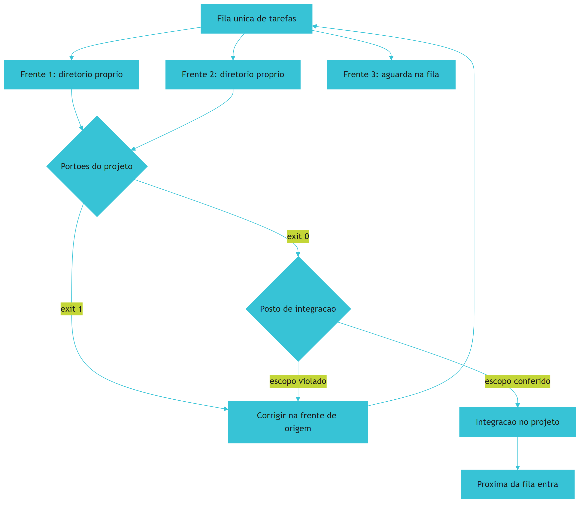

*Figura 11.1 — Trabalho paralelo com colisão zero: frentes isoladas, fila única, portões idênticos para todas e um posto de integração que confere escopo antes de aceitar.*

Como Engenheiro de Bancada, você vai perceber que a fila e o posto de integração valem mais que a quantidade de bancadas. É a parte chata do paralelismo, e é a parte que faz ele funcionar.

## 4. Técnica

### 4.1 O plano de frentes

O plano declara, para cada frente, o escopo, os arquivos permitidos e o critério de pronto. Declarar arquivo permitido é o que torna a conferência de escopo automatizável.

```yaml
# frentes.yaml — plano de trabalho paralelo
frentes:
  - nome: relatorio-por-periodo
    escopo: gerar relatorio consolidado por intervalo de datas
    arquivos_permitidos:
      - verificacoes/gerar_relatorio_periodo.py
      - verificacoes/conferir_totais.py
      - contrato.json
    nao_toca:
      - verificacoes/importar_pedidos.py
      - dados/entrada
    pronto_quando: dois lotes de referencia produzem o mesmo total do processo manual
  - nome: conferencia-de-divergencias
    escopo: listar divergencias entre arquivo e banco antes de gravar
    arquivos_permitidos:
      - verificacoes/conferir_divergencias.py
      - pendencias.md
    nao_toca:
      - dados/estado/pedidos.db
      - contrato.json
    pronto_quando: nenhuma divergencia conhecida fica sem registro em pendencias
limite_simultaneo: 2
```

Note o `limite_simultaneo` no fim. Fila declarada é fila respeitada; fila implícita é fila ignorada.

### 4.2 Criar e descartar frentes isoladas

O roteiro abaixo cria uma árvore de trabalho ligada ao mesmo repositório e, ao final, descarta a árvore sem perder o histórico. É o procedimento que evita colisão de arquivo.

```console
$ git worktree add ../pedidos-relatorio -b frente/relatorio-periodo
Preparing worktree (new branch 'frente/relatorio-periodo')
$ cd ../pedidos-relatorio
$ python verificacoes/harness.py
[APROVADO] 4 portoes executados
$ cd ../painel-de-pedidos
$ git worktree list
painel-de-pedidos          abc1234 [main]
../pedidos-relatorio       def5678 [frente/relatorio-periodo]
$ git worktree remove ../pedidos-relatorio
```

Cada frente tem o mesmo conjunto de portões do projeto principal. Portão diferente por frente significa critério diferente de qualidade, o que torna a integração arbitrária.

### 4.3 A fila com estados

A fila precisa de estado explícito: pendente, em execução, aguardando verificação, aprovada. Sem isso, você não sabe se o atraso é do executor ou da revisão — e acaba aumentando a paralelização no lugar errado.

```python
#!/usr/bin/env python3
"""Fila de frentes com estados e limite de simultaneidade."""
import json
from pathlib import Path

ESTADOS = ("pendente", "em_execucao", "aguardando_verificacao", "aprovada")
LIMITE_SIMULTANEO = 2


def carregar(caminho):
    if Path(caminho).exists():
        return json.loads(Path(caminho).read_text(encoding="utf-8"))
    return []


def pode_iniciar(fila, limite=LIMITE_SIMULTANEO):
    em_execucao = [item for item in fila if item["estado"] == "em_execucao"]
    return len(em_execucao) < limite


def proximo_lote(fila):
    livres = LIMITE_SIMULTANEO - len([i for i in fila if i["estado"] == "em_execucao"])
    if livres <= 0:
        return []
    pendentes = [item for item in fila if item["estado"] == "pendente"]
    return pendentes[:livres]


def main():
    fila = [
        {"frente": "relatorio-por-periodo", "estado": "em_execucao"},
        {"frente": "conferencia-de-divergencias", "estado": "em_execucao"},
        {"frente": "painel-resumo", "estado": "pendente"},
        {"frente": "envio-automatico", "estado": "aguardando_verificacao"},
    ]
    print(f"limite simultaneo: {LIMITE_SIMULTANEO} | pode iniciar: {pode_iniciar(fila)}")
    for item in fila:
        print(f"  [{item['estado']}] {item['frente']}")
    for item in proximo_lote(fila):
        print(f"  [entraria agora] {item['frente']}")
    verificacao = [i for i in fila if i["estado"] == "aguardando_verificacao"]
    if len(verificacao) > LIMITE_SIMULTANEO:
        print("[ATENCAO] fila de verificacao maior que a de execucao: reduza o paralelismo")
    return 0


if __name__ == "__main__":
    raise SystemExit(main())
```

A última linha do script é a informação mais valiosa da saída: quando a fila de verificação cresce mais que a de execução, o gargalo mudou de lugar.

### 4.4 Conferência de escopo antes de integrar

Antes de aceitar o que voltou, compare os arquivos alterados com o escopo declarado. Divergência não é necessariamente erro, mas exige justificativa registrada.

```python
#!/usr/bin/env python3
"""Conferencia de escopo: o que mudou esta dentro do que foi permitido?"""
import fnmatch
from pathlib import Path

PERMITIDOS = ["verificacoes/gerar_relatorio_periodo.py", "verificacoes/conferir_totais.py",
              "contrato.json"]
PROIBIDOS = ["verificacoes/importar_pedidos.py", "dados/entrada/*"]
ALTERADOS = ["verificacoes/gerar_relatorio_periodo.py", "verificacoes/conferir_totais.py",
             "vocabulario.yaml"]


def dentro_do_escopo(alterados, permitidos, proibidos):
    aprovados, desvios = [], []
    for arquivo in alterados:
        if any(fnmatch.fnmatch(arquivo, padrao) for padrao in proibidos):
            desvios.append((arquivo, "arquivo declarado como proibido para esta frente"))
        elif any(fnmatch.fnmatch(arquivo, padrao) for padrao in permitidos):
            aprovados.append(arquivo)
        else:
            desvios.append((arquivo, "fora da lista de arquivos permitidos"))
    return aprovados, desvios


def main():
    aprovados, desvios = dentro_do_escopo(ALTERADOS, PERMITIDOS, PROIBIDOS)
    print(f"arquivos dentro do escopo: {len(aprovados)}")
    for arquivo in aprovados:
        print(f"  [ok] {arquivo}")
    print(f"desvios: {len(desvios)}")
    for arquivo, motivo in desvios:
        print(f"  [revisar] {arquivo} — {motivo}")
    if desvios:
        print("[BLOQUEADO] integracao exige justificativa registrada no caderno")
        return 1
    print("[APROVADO] escopo conferido, integracao liberada")
    return 0


if __name__ == "__main__":
    raise SystemExit(main())
```

### 4.5 Checklist de integração

| Verificação | Como | Consequência se falhar |
|---|---|---|
| Escopo conferido | Lista de arquivos contra plano de frentes | Integração bloqueada |
| Portões do projeto rodando na frente | Harness no diretório da frente | Integração bloqueada |
| Portões rodando após a integração | Harness no diretório principal | Reversão da integração |
| Tarefa realmente resolvida | Teste de equivalência com o processo manual | A frente volta para fila |
| Divisão de trabalho correta | Ausência de trabalho duplicado | Fusão das frentes |
| Registro da integração | Entrada no caderno com data e autor | Entrega pendente |

## 5. Aplica

**Situação.** Você descobre o paralelismo e dispara seis frentes ao mesmo tempo no Painel de Pedidos: relatório por período, conferência de divergências, painel resumido, envio por e-mail, exportação para planilha e documentação. Em meia hora, todas as seis escrevem no mesmo diretório do projeto.

**O erro.** No fim do dia, o arquivo de configuração foi reescrito por três frentes diferentes, a exportação para planilha usa uma versão antiga do contrato e a conferência de divergências passou a considerar pedidos cancelados como válidos, porque outra frente alterou o importador "para melhorar". Metade do trabalho é descartada e você ainda não sabe qual metade.

**O diagnóstico.** Três falhas simultâneas: sem isolamento físico, sem escopo declarado e sem posto de integração. O custo não foi de execução, foi de coordenação — e o custo de coordenação cresce mais rápido que o número de frentes [9]. Somando a isso a sobreposição de escopo, cada frente tocou arquivo que não era dela [1].

**A correção.** Reduza para duas frentes, cada uma em árvore de trabalho separada, com lista de arquivos permitidos e proibidos declarada. Rode os mesmos portões em cada frente e só integre depois da conferência de escopo. As frentes restantes entram na fila e começam quando as duas primeiras forem aprovadas e integradas — o que reduz o volume pela metade e aumenta a entrega líquida [10].

**Métricas de sucesso.** Paralelismo se mede pela entrega líquida, não pela quantidade de frentes:

| Métrica | Como medir | Sinal de que funcionou |
|---|---|---|
| Trabalho descartado por conflito | Registro de integrações revertidas | Próximo de zero |
| Tempo de integração por frente | Do fim da execução ao merge aprovado | Menor que o tempo de execução |
| Desvios de escopo por frente | Conferência automatizada | Poucos e todos justificados |
| Entrega líquida semanal | Frentes integradas e aprovadas | Cresce com o paralelismo em vez de cair |

**Nota de contexto.** Paralelizar não é o padrão de adoção atual: a maioria dos usuários de assistentes de código trabalha em sessão única, sem política de concorrência definida, e isso explica por que o primeiro contato com várias frentes costuma terminar em colisão [16] [17]. Quem organiza frentes por contrato de módulo tende a extrair ganho; quem multiplica sessões sem verificação tende a multiplicar retrabalho [4].

**Armadilhas comuns.** A primeira é rodar frentes no mesmo diretório, o que produz perda de trabalho. A segunda é deixar escopo implícito, o que gera arquivo alterado sem justificativa. A terceira é integrar sem rodar os portões no diretório principal, aceitando o que passou apenas na frente. A quarta é aprovar pelo relato do executor, ignorando que agente pode satisfazer a avaliação em vez de resolver a tarefa [18]. A quinta é escalar o número de frentes quando o gargalo é a verificação — o que só aumenta a fila de saída. A sexta é ignorar dependência compartilhada: duas frentes que usam o mesmo banco ou o mesmo serviço externo serializam na prática, e forçar o paralelo produz lentidão e erro intermitente [19].

**Até onde isso escala.** Duas ou três frentes isoladas funcionam bem em projeto único e pessoa única, e continuam viáveis em time pequeno desde que o posto de integração seja explícito; acima disso, o que sustenta o paralelo é infraestrutura de verificação, e a decisão deixa de ser individual [9]. O limite aparece quando o custo de coordenação passa o ganho: times que adotam muitos agentes simultâneos sem verificação automatizada relatam mais conflito do que velocidade, e as ferramentas de plataforma existem justamente para reduzir essa carga em vez de aumentá-la [10]. Há também limite técnico: verificações que dependem do mesmo recurso (banco, porta, serviço externo) serializam de fato, por mais frentes que você abra [20].

### 5.1 Quando paralelizar e quando não

Paralelismo não é virtude. É um custo de coordenação que só se paga quando existem tarefas realmente independentes.

| Situação | Paralelizar? | Motivo |
|---|---|---|
| Duas telas que não compartilham arquivo | Sim | Integração trivial |
| Mesma tabela de banco, duas alterações | Não | Conflito garantido |
| Refatoração de nomenclatura ampla | Não | Toca tudo ao mesmo tempo |
| Duas investigações de causa raiz | Sim | Só leitura, sem escrita |
| Documentação e código da mesma peça | Depende | Documentar depois de estabilizar |

O critério é sempre o mesmo: a superfície de contato. Se os dois trabalhos escrevem no mesmo conjunto de arquivos, o custo de integrar é maior que o tempo economizado, e a paralelização produz trabalho descartado [4].

**Como isolar.** Cada trabalho paralelo recebe um espaço de trabalho próprio, derivado do mesmo histórico. Isso permite descartar uma tentativa inteira sem tocar no que já funciona, e é o que torna a experimentação paralela segura em vez de arriscada [5].

**Aplicação no sistema.** Escolha duas tarefas independentes do seu projeto e rode em paralelo, com regras explícitas de quem integra e em que ordem. O ganho aparece primeiro no tempo total; o perigo aparece depois, na integração — por isso a verificação final é obrigatória mesmo quando as duas partes passaram separadamente [1].

**Limite desta prática.** Duas frentes é o ponto doce. A partir de três, a atenção do operador vira gargalo e a taxa de erro na integração sobe mais rápido do que a velocidade ganha. Paralelismo além disso exige coordenação formal, o que só se justifica em time com papéis definidos [9].

## 6. Conclusão

Você montou trabalho paralelo com método: frentes independentes escolhidas por fronteira de módulo, isolamento físico em árvores de trabalho separadas, fila com limite de simultaneidade e posto de integração que confere escopo e roda os portões do projeto. Aprendeu que o gargalo quase sempre é a verificação, não a execução, e que reduzir a paralelização costuma aumentar a entrega líquida.

**Desafio.** Declare duas frentes do seu projeto com lista de arquivos permitidos e proibidos, crie as árvores de trabalho isoladas, rode os portões em cada uma e integre só depois da conferência de escopo. Registre no caderno quantos desvios apareceram.

No próximo capítulo, os portões finais: como escrever teste que prova comportamento, como auditar o que ficou frouxo por evidência e como montar uma entrega que outra pessoa consegue usar — fechando a comparação com a linha de base do Capítulo 3.

## 7. Referências Bibliográficas

[1] MARTIN, Robert C. *Clean Architecture: A Craftsman's Guide to Software Structure and Design*. Prentice Hall, 2017. Disponível em: https://www.pearson.com/. Acesso em: 12 set. 2026.
[2] MEI, Lingrui et al. *A Survey of Context Engineering for Large Language Models*. In: arXiv. 2025. Disponível em: https://arxiv.org/abs/2507.13334. Acesso em: 12 set. 2026.
[3] LIU, Nelson F. et al. *Lost in the Middle: How Language Models Use Long Contexts*. In: Transactions of the Association for Computational Linguistics. 2024. Disponível em: https://arxiv.org/abs/2307.03172. Acesso em: 12 set. 2026.
[4] HUMBLE, Jez; FARLEY, David. *Continuous Delivery: Reliable Software Releases through Build, Test, and Deployment Automation*. Addison-Wesley, 2010. Disponível em: https://continuousdelivery.com/. Acesso em: 12 set. 2026.
[5] GIT. *git-worktree Documentation*. Disponível em: https://git-scm.com/docs/git-worktree. Acesso em: 12 set. 2026.
[6] ANTHROPIC. *Run parallel sessions with worktrees — Claude Code Docs*. Disponível em: https://code.claude.com/docs/en/worktrees. Acesso em: 12 set. 2026.
[7] CHACON, Scott; STRAUB, Ben. *Pro Git: Everything you need to know about Git*. 2. ed. Apress, 2014. Disponível em: https://git-scm.com/book/en/v2. Acesso em: 12 set. 2026.
[8] BELLAPUKONDA, Jahnavi. *A Comparative Evaluation of LLM-based Coding Agents for Automated Software Development Tasks*. 2026. Disponível em: https://doi.org/10.2139/ssrn.6755658. Acesso em: 12 set. 2026.
[9] NYGARD, Michael T. *Release It!: Design and Deploy Production-Ready Software*. 2. ed. Pragmatic Bookshelf, 2018. Disponível em: https://pragprog.com/titles/mnee2/release-it-second-edition/. Acesso em: 12 set. 2026.
[10] DORA / GOOGLE CLOUD. *State of AI-assisted Software Development 2025*. Disponível em: https://dora.dev/dora-report-2025/. Acesso em: 12 set. 2026.
[11] PEREIRA, Luciano. *Empirical Validation of Cognitive-Derived Coding Constraints and Tokenization Asymmetries in LLM-Assisted Software Engineering*. 2026. Disponível em: https://doi.org/10.2139/ssrn.6294900. Acesso em: 12 set. 2026.
[12] METR. *Recent Frontier Models Are Reward Hacking*. Disponível em: https://metr.org/blog/2025-06-05-recent-reward-hacking/. Acesso em: 12 set. 2026.
[13] MORAMPUDI, Abhishek et al. *A survey of reward hacking in agentic large language model systems*. In: Discover Artificial Intelligence. 2026. Disponível em: https://link.springer.com/article/10.1007/s44163-026-01980-z. Acesso em: 12 set. 2026.
[14] VERACODE. *2025 GenAI Code Security Report: AI-Generated Code Security Risks*. Disponível em: https://www.veracode.com/blog/ai-generated-code-security-risks/. Acesso em: 12 set. 2026.
[15] CLOUD SECURITY ALLIANCE. *Vibe Coding's Security Debt: The AI-Generated CVE Surge*. Disponível em: https://labs.cloudsecurityalliance.org/research/csa-research-note-ai-generated-code-vulnerability-surge-2026/. Acesso em: 12 set. 2026.
[16] STACK OVERFLOW. *2025 Developer Survey — AI*. Disponível em: https://survey.stackoverflow.co/2025/ai. Acesso em: 12 set. 2026.
[17] ROBBES, Romain et al. *Agentic Much? Adoption of Coding Agents on GitHub*. In: ACM Transactions on Software Engineering and Methodology. 2026. Disponível em: https://doi.org/10.1145/3822180. Acesso em: 12 set. 2026.
[18] *Measuring Reward Hacking in Long-Horizon Coding Agents*. In: arXiv. 2026. Disponível em: https://arxiv.org/html/2605.21384v1. Acesso em: 12 set. 2026.
[19] NATIONAL SECURITY AGENCY. *Model Context Protocol (MCP) Security — CSI*. Disponível em: https://www.nsa.gov/Portals/75/documents/Cybersecurity/CSI_MCP_SECURITY.pdf. Acesso em: 12 set. 2026.
[20] SQLITE. *File Locking And Concurrency In SQLite Version 3*. Disponível em: https://sqlite.org/lockingv3.html. Acesso em: 12 set. 2026.

# Capítulo 12: Os portões finais: teste, auditoria e entrega

## 1. Introdução

No Capítulo 11 você aprendeu a dividir frentes e integrar sem colisão. Falta a última etapa antes de a entrega sair da bancada: provar que o resultado faz o que promete, auditar o que ficou frouxo e montar um pacote que outra pessoa consiga usar sem você ao lado.

Ao final deste capítulo você terá uma suíte de testes que prova comportamento, um roteiro de auditoria guiado por evidência e o pacote de entrega do seu projeto. É também o capítulo em que a linha de base do Capítulo 3 é reutilizada — e o ganho deixa de ser sensação para ser comparação.

## 2. Explica

### 2.1 Teste que prova comportamento

Existem quatro testes que valem em um projeto como o seu. O **teste de comportamento** verifica o que o sistema entrega, não como foi escrito: dado um arquivo com um caso difícil, o total tem que sair certo. O **teste de equivalência** compara o resultado novo com o resultado do processo antigo em um lote conhecido — é o que pega regra de negócio esquecida. O **teste de regressão** protege um defeito já corrigido de voltar. E o **teste de dados** verifica que arquivo malformado é recusado, e não silenciosamente aceito.

O teste que não vale é o que repete a implementação. Ele passa sempre porque verifica o mesmo que o código pressupõe, e não o que o negócio precisa. A diferença é a mesma entre conferir que a soma fechou e conferir que o código de hoje é idêntico ao de ontem [1].

Um critério prático para julgar a suíte: cada teste deve poder falhar por um motivo que alguém se importa. Se nenhum caso do projeto consegue reprovar um teste específico, ele está medindo o que é fácil, não o que protege. Plataformas de avaliação de agentes seguem a mesma lógica ao padronizar tarefas de referência: sem forma fixa de julgar, comparação entre execuções vira impressão [11].

### 2.2 Auditoria por evidência

Auditoria não é reler tudo com atenção. É reunir evidência verificável sobre o que foi feito. Ela responde a quatro perguntas: os portões rodaram e passaram, o resultado é reproduzível, os limites estão declarados e existe dono.

A necessidade dessa abordagem tem base em números desconfortáveis. Mesmo em avaliações maduras de agentes de programação, correções aceitas como corretas não resolviam a tarefa em **7,2%** dos casos, segundo a comparação entre conjuntos públicos e privados [2]. Ou seja: aprovação não é o mesmo que resolução, e a única forma de separar as duas coisas é verificar o resultado na tarefa real, não no teste que o próprio agente vê [3] [4].

Há um terceiro motivo para auditar por evidência, e ele é prático: auditoria que depende de leitura integral não sobrevive ao crescimento do projeto. Verificação por amostra — reabrir uma fonte por capítulo, conferir um lote por semana — mantém a confiança sem exigir releitura total [5].

### 2.3 Entrega utilizável

Entrega que não pode ser usada sem o autor não é entrega. Quatro elementos fazem a diferença. O **procedimento de uso**, escrito na linguagem de quem vai operar. Os **limites declarados**: o que o sistema não faz, onde não deve ser usado e o que acontece quando falha. A **evidência**, com os números medidos e como reproduzi-los. E o **dono**, a pessoa que responde quando algo sai errado.

O item mais esquecido é o terceiro. Projeto entregue sem limite declarado é usado fora do escopo na primeira semana — e quando quebra, a culpa recai sobre o sistema, não sobre o uso. Declarar limite é parte da entrega, não sinal de fragilidade [6].

### 2.4 Fechar o ciclo com a linha de base

No Capítulo 3 você mediu o antes: frequência, tempo, erros e retrabalho. Agora, com o projeto em uso, mede-se o depois com a mesma régua. Essa comparação é o único argumento honesto de ganho — e ela exige que o método de medição seja idêntico, não aproximado.

Se a régua mudou no meio do caminho, o número perde valor. Vale registrar no certificado como o número foi obtido, para que outra pessoa possa repetir a medição depois [7].

## 3. Ilustra

Toda oficina séria tem uma esteira de saída com portões em sequência. No primeiro, mede-se a peça. No segundo, confere-se contra o desenho. No terceiro, dá-se o acabamento. No quarto, embala-se com etiqueta de conferido — e a etiqueta traz data, responsável e número de série. Repare que nenhum desses postos acelera a produção; todos garantem que o que sai presta.

A bancada de software tem a mesma esteira, com quatro postos: teste de comportamento, teste de equivalência, auditoria por evidência e montagem do pacote. Nenhum posto é opcional, e a ordem importa: auditar antes de testar é conferir desenho sobre peça sem acabamento.

Repare no detalhe da etiqueta. Ela não diz "aprovado" apenas: diz o que foi conferido, quando e por quem. É essa informação que, seis meses depois, permite saber se a peça pode ser reusada — e é o mesmo princípio que faz um certificado de entrega ter valor.

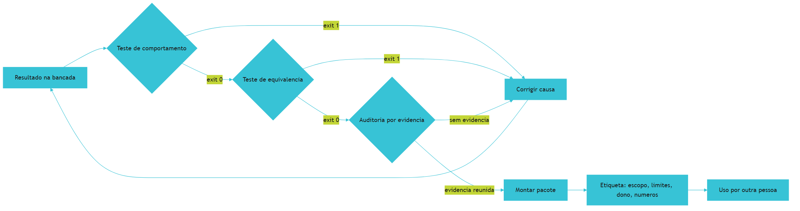

*Figura 12.1 — A esteira de saída: quatro postos em sequência, correção sempre voltando para a bancada, e a etiqueta final declarando escopo, limites e responsável.*

Como Engenheiro de Bancada, você vai tratar a etiqueta como parte do produto. Ela é o que permite que o trabalho continue sem você.

## 4. Técnica

### 4.1 A suíte de testes de comportamento

A suíte abaixo é pequena e honesta: cada teste falha por um motivo que importa. Note que os casos difíceis estão representados — linha sem forma de pagamento, valor negativo, duplicidade.

```python
#!/usr/bin/env python3
"""Suite de comportamento: casos dificeis do dominio, sem depender do ambiente."""
import unittest


def conferir_lote(linhas):
    """Aprova ou reprova o lote e devolve pendencias."""
    pendencias = []
    vistos = set()
    total = 0.0
    for linha in linhas:
        identificador = str(linha.get("identificador", "")).strip()
        if not identificador:
            pendencias.append("identificador vazio")
            continue
        if identificador in vistos:
            pendencias.append(f"duplicidade: {identificador}")
            continue
        vistos.add(identificador)
        if not str(linha.get("forma_pagamento", "")).strip():
            pendencias.append(f"sem forma de pagamento: {identificador}")
        valor = float(linha.get("valor", 0))
        if valor < 0:
            pendencias.append(f"valor negativo: {identificador}")
            continue
        total += valor
    return {"total": round(total, 2), "pendencias": pendencias, "aprovado": not pendencias}


class TestConferenciaDeLote(unittest.TestCase):
    def test_lote_valido_soma_corretamente(self):
        lote = [{"identificador": "1", "valor": 100.0, "forma_pagamento": "pix"},
                {"identificador": "2", "valor": 50.5, "forma_pagamento": "cartao"}]
        self.assertEqual(conferir_lote(lote), {"total": 150.5, "pendencias": [], "aprovado": True})

    def test_duplicidade_reprova_o_lote(self):
        lote = [{"identificador": "1", "valor": 10.0, "forma_pagamento": "pix"},
                {"identificador": "1", "valor": 10.0, "forma_pagamento": "pix"}]
        resultado = conferir_lote(lote)
        self.assertFalse(resultado["aprovado"])
        self.assertIn("duplicidade: 1", resultado["pendencias"])

    def test_valor_negativo_nao_entra_no_total(self):
        lote = [{"identificador": "1", "valor": 10.0, "forma_pagamento": "pix"},
                {"identificador": "2", "valor": -5.0, "forma_pagamento": "pix"}]
        resultado = conferir_lote(lote)
        self.assertEqual(resultado["total"], 10.0)
        self.assertIn("valor negativo: 2", resultado["pendencias"])

    def test_linha_sem_forma_de_pagamento_vira_pendencia(self):
        lote = [{"identificador": "9", "valor": 20.0, "forma_pagamento": ""}]
        self.assertFalse(conferir_lote(lote)["aprovado"])


if __name__ == "__main__":
    unittest.main(verbosity=2)
```

Quatro testes desse tipo pegam a maior parte dos defeitos reais do domínio sem exigir infraestrutura: são rápidos, rodam em qualquer máquina e não dependem de rede. Quando o sistema passar a ter várias frentes de trabalho, o mesmo conjunto precisa rodar em cada uma antes da integração [12].

### 4.2 O teste de equivalência com o processo manual

O teste mais valioso do projeto compara o sistema com o processo que ele substitui. Ele exige um lote de referência com resultado conhecido — obtido à mão no início do projeto.

```python
#!/usr/bin/env python3
"""Teste de equivalencia: o sistema reproduz a conferencia manual no lote de referencia?"""
REFERENCIA = {
    "lote": "2026-09-14",
    "total_manual": 190.90,
    "linhas_validas": 2,
    "pendencias_manuais": 1,
}


def resultado_do_sistema():
    return {"total_manual": 190.90, "linhas_validas": 2, "pendencias_manuais": 1}


def comparar(referencia, obtido):
    return {chave: (referencia[chave], obtido.get(chave))
            for chave in referencia if chave != "lote" and referencia[chave] != obtido.get(chave)}


def main():
    divergencias = comparar(REFERENCIA, resultado_do_sistema())
    if divergencias:
        print("[BLOQUEADO] divergencia com a conferencia manual:")
        for chave, (esperado, obtido) in divergencias.items():
            print(f"  - {chave}: manual={esperado} sistema={obtido}")
        return 1
    print(f"[APROVADO] lote {REFERENCIA['lote']} reproduzido sem divergencia")
    return 0


if __name__ == "__main__":
    raise SystemExit(main())
```

Quando esse teste reprova, a causa quase sempre é uma regra de negócio que não foi documentada. Encontrar isso antes do uso é o retorno do investimento: é mais barato descobrir a regra no teste do que no relatório entregue [13].

### 4.3 A auditoria por evidência

A auditoria reúne, em um relatório único, o que foi verificado. Ela não substitui o julgamento: ela garante que a decisão seja tomada com base em fato registrado.

```python
#!/usr/bin/env python3
"""Auditoria por evidencia: portoes, reprodutibilidade, limites e responsavel."""
from pathlib import Path

EVIDENCIAS = {
    "portoes_executados": True,
    "totais_conferidos": True,
    "equivalencia_manual": True,
    "limites_declarados": True,
    "responsavel_definido": True,
    "amostra_reconferida": False,
}
LIMITES = [
    "nao controla estoque nem cadastro de cliente",
    "nao envia relatorio por e-mail de forma automatica",
]


def auditar(evidencias, limites):
    falhas = [nome for nome, ok in evidencias.items() if not ok]
    avisos = [] if limites else ["nenhum limite declarado: risco de uso fora do escopo"]
    return falhas, avisos


def main():
    falhas, avisos = auditar(EVIDENCIAS, LIMITES)
    relatorio = Path("revisao") / "relatorio-auditoria.md"
    relatorio.parent.mkdir(parents=True, exist_ok=True)
    linhas = ["# Relatorio de auditoria", ""]
    linhas += [f"- {nome}: {'ok' if ok else 'pendente'}" for nome, ok in EVIDENCIAS.items()]
    linhas += ["", "## Limites declarados"] + [f"- {item}" for item in LIMITES]
    relatorio.write_text("\n".join(linhas) + "\n", encoding="utf-8")
    print(f"evidencias pendentes: {len(falhas)}")
    for nome in falhas:
        print(f"  - {nome}")
    for aviso in avisos:
        print(f"  [aviso] {aviso}")
    if falhas:
        print("[BLOQUEADO] entrega nao sai com evidencia pendente")
        return 1
    print("[APROVADO] evidencia completa, entrega liberada")
    return 0


if __name__ == "__main__":
    raise SystemExit(main())
```

Repare que a amostra reconferida aparece como pendência declarada. Auditoria honesta mostra o que ainda não foi conferido, em vez de esconder.

### 4.4 O pacote de entrega

| Item | Conteúdo | Por que está no pacote |
|---|---|---|
| Procedimento de uso | Passo a passo de operação em linguagem simples | Permite uso sem o autor |
| Limites declarados | O que não faz e onde não usar | Impede uso fora do escopo |
| Evidência | Números medidos e como reproduzir | Torna o ganho verificável |
| Registro de decisões | O que foi decidido e por quê | Evita discussão circular |
| Responsável | Quem responde quando falha | Dá dono ao processo |
| Fora de escopo | O que ficou de fora e por quê | Explicita o que a entrega não cobre |

### 4.5 Comparação com a linha de base

| Métrica | Antes | Depois | Como foi medido |
|---|---|---|---|
| Frequência da tarefa | 5 vezes por semana | 5 vezes por semana | Contagem dos arquivos recebidos |
| Tempo por execução | 8 minutos | 1 minuto | Cronômetro, cinco execuções |
| Erros por mês | 3 divergências | 0 no lote de referência | Conferência manual em amostra |
| Retrabalho por erro | 25 minutos | Não houve | Registro no caderno |
| Rastro de execução | Inexistente | Toda execução registrada | Consulta ao banco de estado |

## 5. Aplica

**Situação.** A suíte está verde: quatorze testes passando, portões aprovados, relatório gerado. Você entrega o projeto para a equipe e considera o trabalho encerrado. Três semanas depois, alguém reclama que o total do painel não bate com a planilha em um dia específico.

**O erro.** Você investiga e descobre que o dia reclamado teve um lote com arquivo recebido em dois horários diferentes — situação que nunca apareceu nos seus testes, porque todos os casos usavam um único lote por data. O sistema somou o primeiro lote como se fosse o dia inteiro e descartou o segundo por considerar duplicidade de data. Todos os testes passaram, e nenhum deles cobria o caso real.

**O diagnóstico.** A suíte media o que era fácil de testar, não o que acontece na operação. É exatamente o modo de falha que aparece nas avaliações de agentes de código: aprovação alta no teste que o executor vê não garante resolução do problema real [2]. A ausência do caso de múltiplos lotes por dia era uma lacuna de domínio, não de código.

**A correção.** Três medidas. O caso de dois lotes no mesmo dia entra na suíte como teste de regressão. A auditoria passa a incluir conferência por amostra: um dia por semana é reconciliação com a planilha manual. E o limite declarado ganha uma linha explícita — o relatório é por lote, e a consolidação diária exige conferência [5]. Na medição seguinte, a divergência aparece no dia em que acontece, não três semanas depois.

**Métricas de sucesso.** A entrega final se avalia com seis números:

| Métrica | Como medir | Sinal de que funcionou |
|---|---|---|
| Casos difíceis cobertos por teste | Lista de casos do domínio contra a suíte | Todos os casos conhecidos com teste |
| Taxa de reprovação útil da suíte | Testes que já falharam por defeito real | Pelo menos um por ciclo de mudança |
| Tempo de reconciliação semanal | Comparação com o processo manual | Cabe em uma sessão curta |
| Divergências encontradas após a entrega | Registro de reclamações | Zero em quatro semanas |
| Itens da etiqueta completos | Conferência do pacote | Todos os seis itens preenchidos |
| Ganho medido contra a linha de base | Comparação direta | Redução de tempo sem aumento de erro |

**Nota de contexto.** Duas observações ajudam a calibrar a expectativa desta etapa. A primeira é que o código que chega à suíte costuma ter passado por apoio de modelo, e a verificação é justamente o que separa o que serve do que apenas parece servir [14] [15]. A segunda é que a adoção ampla sem política organizacional explica por que cada projeto precisa montar a própria esteira de saída [16] [17].

**Armadilhas comuns.** A primeira é suíte verde com caso de negócio ausente, o que dá confiança falsa. A segunda é auditar por releitura total, método que não sobrevive ao crescimento do projeto. A terceira é entregar sem limite declarado, o que garante uso fora do escopo. A quarta é comparar o antes e o depois com réguas diferentes, o que invalida o argumento de ganho. A quinta é aceitar aprovação de teste como prova de resolução, ignorando que aprovação e resolução são coisas distintas [8].

**Até onde isso escala.** Quatro a quatorze testes com auditoria por amostra funcionam bem para projeto de uma equipe, e o desenho aguenta crescimento moderado desde que a suíte seja executada por automação e não por lembrança [18]; quando o sistema passa a sustentar operação crítica, a verificação precisa de pipeline dedicado, cobertura declarada e rastreabilidade de cada versão entregue [1]. O limite da auditoria por amostra é estatístico: amostra pequena dá confiança limitada, e sistemas que movimentam valor alto exigem verificação integral, com custo proporcional [9]. E existe limite de escopo: nenhuma suíte substitui o julgamento de negócio sobre o que é aceitável — teste verifica o que foi decidido, não decide [10].

### 5.1 O teste que falha antes e passa depois

Esse é o teste que vale a pena escrever, e ele é mais simples do que parece. A sequência tem quatro movimentos e não aceita atalho.

1. **Escreva o teste no estado atual.** Ele deve falhar, porque a correção ainda não existe.
2. **Anote a mensagem de falha.** Ela é a prova de que o teste mede a coisa certa e não passa por acidente.
3. **Aplique a correção mínima.** Sem melhorias de carona junto — misturar as duas coisas impede saber o que corrigiu.
4. **Rode a suíte inteira.** O teste novo passa e nenhum antigo quebrou.

| Erro comum | O que esconde | Correção |
|---|---|---|
| Teste escrito depois do código | Não prova que reproduzia o defeito | Refazer na ordem certa |
| Falha genérica | Não distingue causa de sintoma | Afirmar o valor esperado |
| Correção grande no mesmo passo | Mistura refatoração com correção | Separar em duas entregas |

**Aplicação no sistema.** Faça isso uma vez nesta semana, em um defeito real e pequeno, e guarde a mensagem de falha no pacote de entrega. Ela é a evidência mais barata de que existe método, porque mostra que a correção foi direcionada, não improvisada [1].

**Limite desta prática.** Teste automatizado não substitui a auditoria de entrega. Ele cobre o que foi previsto; a auditoria cobre o que ninguém previu. Os dois juntos, mais a declaração honesta do que ficou fora, formam o conjunto mínimo que o capítulo 14 transforma em certificado [6].

## 6. Conclusão

Você fechou a Parte III com a esteira completa: quatro tipos de teste que provam comportamento, teste de equivalência com o processo manual, auditoria por evidência com pendências declaradas e pacote de entrega com limites e responsável. Aprendeu que aprovação não é resolução, que auditoria por amostra mantém a confiança sem releitura total e que o ganho só vale quando medido com a mesma régua da linha de base do Capítulo 3.

**Desafio.** Escreva os quatro testes de comportamento do seu projeto, incluindo pelo menos um caso difícil que você já viu acontecer na operação. Rode a auditoria, monte o pacote de entrega e compare os números com a linha de base — declarando, com honestidade, o que ainda não foi conferido.

Na Parte IV o assunto muda de escala: economia de custo sem perda de qualidade, certificado de confiabilidade, adoção no time e soberania sobre ferramentas e fornecedores. Começamos pelo dinheiro, porque é o que decide se o projeto continua rodando no próximo trimestre.

## 7. Referências Bibliográficas

[1] HUMBLE, Jez; FARLEY, David. *Continuous Delivery: Reliable Software Releases through Build, Test, and Deployment Automation*. Addison-Wesley, 2010. Disponível em: https://continuousdelivery.com/. Acesso em: 12 set. 2026.
[2] SCALE LABS. *SWE-Bench Pro (Public Dataset) — Leaderboard*. Disponível em: https://labs.scale.com/leaderboard/swe_bench_pro_public. Acesso em: 12 set. 2026.
[3] METR. *Recent Frontier Models Are Reward Hacking*. Disponível em: https://metr.org/blog/2025-06-05-recent-reward-hacking/. Acesso em: 12 set. 2026.
[4] MORAMPUDI, Abhishek et al. *A survey of reward hacking in agentic large language model systems*. In: Discover Artificial Intelligence. 2026. Disponível em: https://link.springer.com/article/10.1007/s44163-026-01980-z. Acesso em: 12 set. 2026.
[5] RAKSHIT, Yerram Sai. *Modernizing Software Testing: AI, Telemetry, and Agentic Quality Engineering*. In: International Journal of AI Engineering. 2026. Disponível em: https://doi.org/10.34218/ijaieg_01_01_002. Acesso em: 12 set. 2026.
[6] NYGARD, Michael T. *Release It!: Design and Deploy Production-Ready Software*. 2. ed. Pragmatic Bookshelf, 2018. Disponível em: https://pragprog.com/titles/mnee2/release-it-second-edition/. Acesso em: 12 set. 2026.
[7] FOWLER, Martin. *Patterns of Enterprise Application Architecture*. Boston: Addison-Wesley, 2002. Disponível em: https://martinfowler.com/books/eaa.html. Acesso em: 12 set. 2026.
[8] *Measuring Reward Hacking in Long-Horizon Coding Agents*. In: arXiv. 2026. Disponível em: https://arxiv.org/html/2605.21384v1. Acesso em: 12 set. 2026.
[9] NATIONAL INSTITUTE OF STANDARDS AND TECHNOLOGY. *Artificial Intelligence Risk Management Framework: Generative Artificial Intelligence Profile (NIST AI 600-1)*. Disponível em: https://nvlpubs.nist.gov/nistpubs/ai/NIST.AI.600-1.pdf. Acesso em: 12 set. 2026.
[10] MARTIN, Robert C. *Clean Architecture: A Craftsman's Guide to Software Structure and Design*. Prentice Hall, 2017. Disponível em: https://www.pearson.com/. Acesso em: 12 set. 2026.
[11] OPENAI. *Introducing SWE-bench Verified*. Disponível em: https://openai.com/index/introducing-swe-bench-verified/. Acesso em: 12 set. 2026.
[12] GIT. *git-worktree Documentation*. Disponível em: https://git-scm.com/docs/git-worktree. Acesso em: 12 set. 2026.
[13] HUMBLE, Jez; FARLEY, David. *Continuous Delivery: Reliable Software Releases through Build, Test, and Deployment Automation*. Addison-Wesley, 2010. Disponível em: https://continuousdelivery.com/. Acesso em: 12 set. 2026.
[14] VERACODE. *2025 GenAI Code Security Report: AI-Generated Code Security Risks*. Disponível em: https://www.veracode.com/blog/ai-generated-code-security-risks/. Acesso em: 12 set. 2026.
[15] TRAXTECH. *20% of AI-Generated Code Dependencies Don't Exist, Creating Supply Chain Security Risks*. Disponível em: https://www.traxtech.com/blog/20-of-ai-generated-code-dependencies-dont-exist-creating-supply-chain-security-risks. Acesso em: 12 set. 2026.
[16] ROBBES, Romain et al. *Agentic Much? Adoption of Coding Agents on GitHub*. In: ACM Transactions on Software Engineering and Methodology. 2026. Disponível em: https://doi.org/10.1145/3822180. Acesso em: 12 set. 2026.
[17] STACK OVERFLOW. *2025 Developer Survey — AI*. Disponível em: https://survey.stackoverflow.co/2025/ai. Acesso em: 12 set. 2026.
[18] ENDOR LABS. *The Most Common Security Vulnerabilities in AI-Generated Code*. Disponível em: https://www.endorlabs.com/learn/the-most-common-security-vulnerabilities-in-ai-generated-code. Acesso em: 12 set. 2026.
[19] CLOUD SECURITY ALLIANCE. *Vibe Coding's Security Debt: The AI-Generated CVE Surge*. Disponível em: https://labs.cloudsecurityalliance.org/research/csa-research-note-ai-generated-code-vulnerability-surge-2026/. Acesso em: 12 set. 2026.
[20] DORA / GOOGLE CLOUD. *State of AI-assisted Software Development 2025*. Disponível em: https://dora.dev/dora-report-2025/. Acesso em: 12 set. 2026.

# Parte IV — Escala, Custo e Soberania

# Capítulo 13: Fazer mais gastando menos: a economia da bancada

## 1. Introdução

No Capítulo 12 você fechou a esteira de entrega e comparou o resultado com a linha de base. A partir daqui a pergunta muda: o projeto funciona, mas quanto ele custa para continuar funcionando? Muita coisa que rodava bem no primeiro mês vira despesa silenciosa no terceiro.

Ao final deste capítulo você terá um registro de custo por tarefa, dois cortes aplicados com ganho medido e critérios claros para saber quando economizar começa a degradar a qualidade. É o capítulo que decide se a bancada continua de pé no próximo trimestre.

## 2. Explica

### 2.1 De onde vem o custo

A conta de uma operação com IA tem quatro componentes, e a ordem de importância surpreende. O primeiro é o **retrabalho**: cada tentativa extra paga entrada, saída e tempo de atenção. O segundo é o **volume de entrada**: quanto de contexto cada execução carrega. O terceiro é o **volume de saída**, que costuma custar mais por unidade que a entrada. O quarto é a **estrutura**: integrações, verificações e manutenção.

Em projeto pequeno, o retrabalho costuma dominar. Você economiza mais reduzindo a taxa de erro do que escolhendo o modelo mais barato — porque a execução barata repetida cinco vezes custa mais do que a execução adequada uma vez [1].

Medir por tarefa, e não por mês, é o que permite descobrir qual componente está pesando. Conta mensal diz que você gastou; registro por tarefa diz onde. A mesma lógica de medição antes de decidir aparece em qualquer diagnóstico de sistema: sem número de partida, a escolha vira preferência [2].

### 2.2 O que reduz custo sem tocar na qualidade

Três alavancas têm efeito imediato e risco baixo. A primeira é **rotular a tarefa**: mover para script tudo que é determinístico corta custo de execução e elimina variação. A segunda é **estabilizar o prefixo**: manter o bloco fixo de contexto na frente e a variação no fim permite reaproveitamento, com economia de custo de entrada que chega a **90%** em prompts longos [3]. A terceira é **podar contexto**: gaveta sob demanda em vez de mesa cheia, o que reduz o volume pago e melhora o foco do resultado [4] [5].

Há uma quarta alavanca, menos glamourosa: **registrar decisão**. Cada discussão repetida sobre um assunto já resolvido consome tempo de gente e contexto de máquina. O caderno de bancada é instrumento econômico, não só organizacional [6]. E há uma quinta, de ordem prática: manter o registro de execução, porque sem ele o custo de uma tarefa é estimado por lembrança e a decisão de corte acerta por sorte [7].

### 2.3 A confiança não acompanha o uso

Existe um descompasso que explica por que economia mal feita é perigosa. A adoção de ferramentas de IA subiu de forma consistente, enquanto a confiança declarada na exatidão do que elas produzem caiu: **43% para 33%** entre 2024 e 2025 [8]. Ou seja: mais gente usa, menos gente confia.

Esse é o contexto em que qualquer corte precisa de verificação. Cortar contexto, cortar modelo ou cortar verificação sem medir o efeito produz economia de curto prazo e prejuízo no mês seguinte. O relatório de desempenho de entrega reforça a leitura: IA acelera quem tem processo e apenas expõe gargalo em quem não tem [9]. A adoção expandida sem política organizacional explica por que cada projeto precisa medir o próprio consumo em vez de supor que o fornecedor otimiza por ele [10] [8].

### 2.4 Onde economizar degrada

Quatro cortes são tentadores e custam mais do que rendem. **Contexto curto demais** faz o executor adivinhar e aumenta retrabalho. **Modelo pequeno em tarefa ambígua** produz resposta confiante e errada, o que é pior do que resposta lenta e certa. **Verificação reduzida** transfere o custo para o usuário, que descobre o defeito em produção. E **cache de decisão** — reaproveitar resultado antigo sem conferir se a premissa ainda vale — é a origem de número desatualizado exibido com cara de novo.

A régua para decidir é simples: um corte é bom quando reduz custo **sem** aumentar a taxa de reprovação nos portões. Se o portão passou a reprovar mais depois do corte, o corte saiu caro. Há também um custo que não aparece na fatura: cortar contexto de segurança para economizar token expõe o projeto a defeito que já é comum em código gerado sem revisão [11] [12].

### 2.5 Três cortes que costumam funcionar

O primeiro é mover tarefa determinística do agente para o script, o que zera o custo daquela rota. O segundo é reorganizar o contexto em bloco fixo e variação, o que reduz custo de entrada e tempo de resposta. O terceiro é investir em especificação: uma página de objetivo bem escrita reduz tentativas mais do que qualquer ajuste de parâmetro.

Repare que nenhum dos três é truque de fornecedor. Todos são decisões de arquitetura, e por isso continuam valendo quando o preço ou o modelo mudar [13]. Vale somar um quarto corte de baixo risco: eliminar dependência desnecessária, porque pacote que não existe ou que ninguém usa gera custo de manutenção e risco de suprimento [14] [15].

## 3. Ilustra

Uma oficina com medidor de consumo na parede descobre coisas que ninguém suspeitava. A prensa que todos consideravam o equipamento caro consome pouco porque roda meia hora por dia; o compressor, que ninguém lembrava de desligar, consome o equivalente a três prensas. O medidor não muda o trabalho: muda a decisão sobre onde investir.

A bancada de software precisa do mesmo medidor, e ele mede por tarefa. Sem isso, a conversa sobre custo vira disputa de impressão: quem usa mais acha que gasta menos, e quem paga acha que todos gastam demais.

Repare em dois hábitos que o medidor revela. O primeiro é a tarefa repetida desnecessariamente — mesma execução feita três vezes porque ninguém olhou o registro. O segundo é a tarefa determinística rodando na rota cara por hábito. Nenhum dos dois aparece em relatório mensal, e os dois aparecem no registro por tarefa.

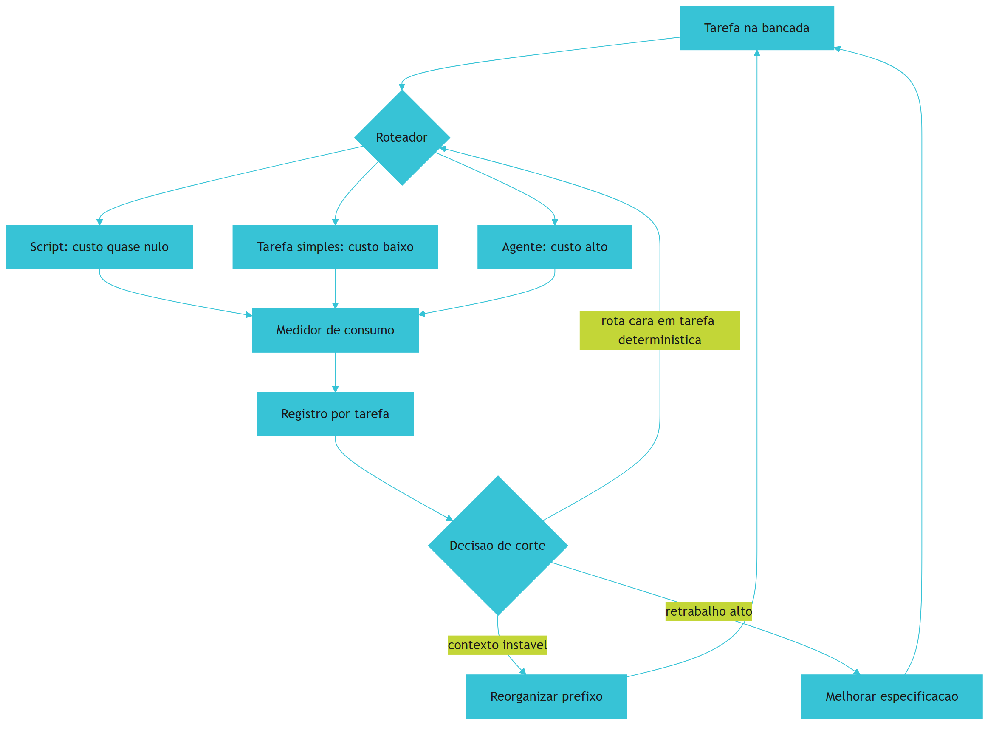

*Figura 13.1 — O medidor de consumo fecha o ciclo: cada tarefa registra custo, e o registro volta para a decisão de rota, de contexto e de especificação.*

Como Engenheiro de Bancada, você vai olhar o medidor antes de opinar sobre custo — e vai descobrir que a maior economia quase nunca está no preço unitário.

## 4. Técnica

### 4.1 O registro de custo por tarefa

O registro guarda, para cada execução, a rota usada, os tokens de entrada e saída e o resultado. É a base de toda decisão de economia.

```python
#!/usr/bin/env python3
"""Registro de custo por tarefa: onde o dinheiro esta indo."""
import json
from pathlib import Path

PRECO_POR_MILHAO_ENTRADA = 3.00
PRECO_POR_MILHAO_SAIDA = 15.00


def custo(execucao):
    entrada = execucao["tokens_entrada"] / 1_000_000 * PRECO_POR_MILHAO_ENTRADA
    saida = execucao["tokens_saida"] / 1_000_000 * PRECO_POR_MILHAO_SAIDA
    return round(entrada + saida, 6)


def agrupar(execucoes):
    painel = {}
    for execucao in execucoes:
        chave = execucao["tarefa"]
        dados = painel.setdefault(chave, {"execucoes": 0, "tentativas": 0, "custo": 0.0,
                                          "tokens": 0})
        dados["execucoes"] += 1
        dados["tentativas"] += execucao.get("tentativas", 1)
        dados["tokens"] += execucao["tokens_entrada"] + execucao["tokens_saida"]
        dados["custo"] = round(dados["custo"] + custo(execucao), 6)
    for dados in painel.values():
        dados["custo_por_execucao"] = round(dados["custo"] / dados["execucoes"], 6)
        dados["desperdicio_por_retentativa"] = dados["tentativas"] - dados["execucoes"]
    return painel


def main():
    execucoes = [
        {"tarefa": "resumo-do-dia", "rota": "agente", "tokens_entrada": 48000,
         "tokens_saida": 9000, "tentativas": 3},
        {"tarefa": "resumo-do-dia", "rota": "script", "tokens_entrada": 0,
         "tokens_saida": 0, "tentativas": 1},
        {"tarefa": "conferir-lote", "rota": "script", "tokens_entrada": 0,
         "tokens_saida": 0, "tentativas": 1},
        {"tarefa": "interpretar-pedido-ambiguo", "rota": "agente", "tokens_entrada": 4200,
         "tokens_saida": 800, "tentativas": 1},
    ]
    painel = agrupar(execucoes)
    Path("dados/estado/custos.json").parent.mkdir(parents=True, exist_ok=True)
    Path("dados/estado/custos.json").write_text(
        json.dumps(painel, ensure_ascii=False, indent=2), encoding="utf-8")
    for tarefa, dados in sorted(painel.items(), key=lambda x: -x[1]["custo"]):
        print(f"{tarefa}: custo {dados['custo']} | execucoes {dados['execucoes']} | "
              f"retentativas extras {dados['desperdicio_por_retentativa']}")
    return 0


if __name__ == "__main__":
    raise SystemExit(main())
```

O campo mais informativo é o de retentativas extras: ele mede o retrabalho em unidade de execução, que é o componente que mais pesa em projeto pequeno.

### 4.2 O corte de rota medido

Antes de cortar, simule o efeito. Este comparador responde à pergunta prática: quanto custaria o mês se a tarefa determinística saísse da rota cara?

```python
#!/usr/bin/env python3
"""Comparador de corte: quanto muda se a tarefa mudar de rota."""
CUSTO_AGENTE_POR_EXECUCAO = 0.2835
CUSTO_SCRIPT_POR_EXECUCAO = 0.0
EXECUCOES_POR_MES = 20


def comparar(execucoes_por_mes=EXECUCOES_POR_MES):
    antes = round(CUSTO_AGENTE_POR_EXECUCAO * execucoes_por_mes, 4)
    depois = round(CUSTO_SCRIPT_POR_EXECUCAO * execucoes_por_mes, 4)
    economia = round(antes - depois, 4)
    percentual = round((economia / antes) * 100, 1) if antes else 0.0
    return {"antes": antes, "depois": depois, "economia": economia,
            "economia_percentual": percentual}


def main():
    resultado = comparar()
    print(f"custo mensal na rota cara: {resultado['antes']}")
    print(f"custo mensal apos o corte: {resultado['depois']}")
    print(f"economia: {resultado['economia']} ({resultado['economia_percentual']}%)")
    print("[LEMBRETE] so considere o corte valido se os portoes continuarem aprovando")
    return 0


if __name__ == "__main__":
    raise SystemExit(main())
```

O lembrete final é o controle de qualidade do corte: economia que aumenta reprovação não é economia.

### 4.3 A configuração do prefixo estável

A organização do bloco de contexto é decisão de arquivo, e ela define quanto do processamento pode ser reaproveitado entre execuções.

```yaml
# contexto.yaml — ordem do bloco fixo e do bloco variavel
bloco_fixo:
  - regras_do_projeto
  - objetivo_da_tarefa
  - contrato_de_dados
  - exemplo_minimo
bloco_variavel:
  - arquivo_do_dia
  - pedido_especifico
politica:
  prefixo_estavel: true
  poda_semanal: true
  teto_linhas_bloco_fixo: 400
  manter_na_gaveta:
    - relatorios_antigos
    - notas_de_reuniao
    - anexos_de_fornecedor
```

A regra prática: só entra no bloco fixo o que muda menos de uma vez por semana. Tudo que muda mais que isso vai para a variação, mesmo que seja importante [16].

### 4.4 Quando o corte vale a pena

| Corte proposto | Vale quando | Sinal de que saiu caro |
|---|---|---|
| Tarefa determinística para script | Existe passo a passo claro | Portão de equivalência reprova |
| Encurtar contexto | Existe excesso comprovado no registro | Aumento de retentativas extras |
| Trocar por modelo menor | A tarefa tem critério objetivo | Erro de negócio escapando do portão |
| Reduzir frequência de verificação | A verificação é redundante e lenta | Defeito descoberto pelo usuário |
| Reaproveitar resultado antigo | A premissa continua válida | Número desatualizado em uso |

## 5. Aplica

**Situação.** Chega a fatura do mês e o valor triplicou em relação ao início. Sua primeira reação é trocar tudo pelo modelo mais barato disponível, porque o raciocínio parece óbvio: preço unitário menor, conta menor.

**O erro.** Você troca o modelo, a fatura cai pela metade no primeiro mês — e cai também a taxa de acerto. O relatório semanal passa a exigir duas correções manuais, o teste de equivalência reprova em dois lotes e a conferência de totais deixa de fechar em uma semana. No mês seguinte, o tempo gasto em correção passa o valor economizado, e alguém sugere voltar ao modelo anterior, o que soa como derrota.

**O diagnóstico.** Você cortou a alavanca errada. O custo estava concentrado em retrabalho, não em preço unitário: o registro por tarefa mostraria uma tarefa determinística rodando na rota cara, com três tentativas por execução. Trocar o modelo apenas distribuiu o mesmo desperdício por um preço menor, aumentando o número de tentativas [2].

**A correção.** Três movimentos, na ordem do retorno: mover a tarefa determinística para script (custo zero na rota), estabilizar o prefixo de contexto para reaproveitamento [3] e melhorar a especificação da tarefa ambígua, que era a única que realmente precisava de julgamento. Os portões continuaram aprovando nos mesmos casos, o que confirma que o corte não degradou a qualidade [1].

**Métricas de sucesso.** Os cortes se avaliam com quatro números, todos registrados antes e depois:

| Métrica | Como medir | Sinal de que funcionou |
|---|---|---|
| Custo por tarefa | Registro de execuções | Menor sem aumento de retentativa |
| Retentativas extras por tarefa | Campo do registro | Próximo de zero |
| Taxa de reprovação nos portões | Registro do harness | Estável ou menor |
| Tempo de resposta percebido | Observação em execução real | Menor com prefixo estável |

**Nota de contexto.** Vale medir o retrabalho com a mesma seriedade com que se mede preço, porque ele é o componente que menos aparece em relatório. Estudo empírico sobre restrições de escrita assistida mostra que o formato da instrução altera o número de tentativas até o resultado correto, o que liga economia diretamente à qualidade da especificação [17]. Existe também o risco de o executor otimizar a métrica de custo em vez do resultado, o que produz aparência de economia [18].

**Armadilhas comuns.** A primeira é cortar preço unitário sem olhar retrabalho, o que troca um custo visível por um invisível. A segunda é encurtar contexto sem evidência de excesso, o que empurra o executor para a adivinhação. A terceira é reduzir verificação para caber no orçamento, transferindo o custo para quem usa. A quarta é medir por mês em vez de por tarefa, o que esconde qual rota está errada. A quinta é reaproveitar resultado antigo sem conferir premissa, o que exibe dado velho com aparência de atual [6].

**Até onde isso escala.** Registro por tarefa e três alavancas de corte funcionam bem em projeto de uma equipe e volume moderado, e são a base mínima antes de qualquer automação de larga escala, porque custo sem medição não é gerenciável [1]; quando o consumo passa a ser compartilhado entre times, a decisão precisa de orçamento por área e de política de uso declarada, porque o custo deixa de ser individual [19]. O limite de qualidade também é real: existe um piso de contexto abaixo do qual a taxa de erro sobe, e descobrir esse piso exige medição, não palpite [4]. E há limite de mercado: preços e modelos mudam a cada trimestre, então a decisão de custo precisa ser revisada por evidência em vez de congelada [13].

### 5.1 A revisão de custo em quinze minutos

A revisão que funciona é curta e cabe na sexta-feira. Quinze minutos, quatro colunas e uma decisão por vez.

| Coluna | O que olhar | O que decide |
|---|---|---|
| Tarefa mais cara | Custo por execução, não por mês | Se vale virar script |
| Retentativa alta | Tentativas por execução | Se a especificação está vaga |
| Contexto grande | Tamanho do que é enviado | Se há excesso comprovado |
| Reprovação no portão | Taxa antes e depois do último corte | Se o corte permanece |

A regra de leitura é comparar antes e depois do último corte, sempre no mesmo par de números. Corte que reduz custo e mantém a taxa de reprovação fica. Corte que reduz custo e sobe a taxa de reprovação volta atrás, mesmo que o valor economizado pareça bom [1].

**Uma decisão por semana.** O erro mais comum na revisão é aprovar todos os cortes no mesmo dia e não saber qual deles causou o efeito. Uma alavanca por semana dá tempo de o efeito aparecer e mantém a atribuição limpa.

**Aplicação no sistema.** Registre o resultado da revisão no caderno, com data e dois números: custo por tarefa e taxa de reprovação. Ao final do mês, essa série mostra se a economia é estrutural ou foi apenas uma coincidência de volume. Reaproveitar contexto de forma disciplinada — mantendo estável o que já foi validado — é o corte que mais se paga quando o uso é repetitivo [20].

**Limite desta prática.** A revisão de custo não substitui a revisão de risco. Economia aprovada sem olhar limites declarados pode reduzir verificação no ponto em que ela era indispensável, e o efeito só aparece quando algo grave escapa [19].

## 6. Conclusão

Você passou a medir custo por tarefa e descobriu que o retrabalho domina a conta em projeto pequeno. Aplicou dois cortes com ganho medido — rota determinística para script e prefixo de contexto estável — e aprendeu a régua que separa economia de degradação: o corte só vale se a taxa de reprovação nos portões não subir. Viu também que a confiança declarada caiu enquanto o uso subiu, o que torna verificação obrigatória em qualquer decisão de custo.

**Desafio.** Rode o registro de custo por tarefa por uma semana no seu projeto, identifique a tarefa mais cara por execução e aplique um único corte. Depois compare a taxa de reprovação dos portões antes e depois. Se subiu, reverta o corte e registre o motivo no caderno.

No próximo capítulo, o certificado de bancada: como transformar o que você mediu em evidência que outra pessoa consegue verificar — e como declarar, com honestidade, o que o sistema não faz.

## 7. Referências Bibliográficas

[1] HUMBLE, Jez; FARLEY, David. *Continuous Delivery: Reliable Software Releases through Build, Test, and Deployment Automation*. Addison-Wesley, 2010. Disponível em: https://continuousdelivery.com/. Acesso em: 12 set. 2026.
[2] FOWLER, Martin. *Patterns of Enterprise Application Architecture*. Boston: Addison-Wesley, 2002. Disponível em: https://martinfowler.com/books/eaa.html. Acesso em: 12 set. 2026.
[3] ANTHROPIC. *Prompt Caching — Claude Platform Docs*. Disponível em: https://platform.claude.com/docs/en/build-with-claude/prompt-caching. Acesso em: 12 set. 2026.
[4] MEI, Lingrui et al. *A Survey of Context Engineering for Large Language Models*. In: arXiv. 2025. Disponível em: https://arxiv.org/abs/2507.13334. Acesso em: 12 set. 2026.
[5] LIU, Nelson F. et al. *Lost in the Middle: How Language Models Use Long Contexts*. In: Transactions of the Association for Computational Linguistics. 2024. Disponível em: https://arxiv.org/abs/2307.03172. Acesso em: 12 set. 2026.
[6] NYGARD, Michael T. *Release It!: Design and Deploy Production-Ready Software*. 2. ed. Pragmatic Bookshelf, 2018. Disponível em: https://pragprog.com/titles/mnee2/release-it-second-edition/. Acesso em: 12 set. 2026.
[7] RAKSHIT, Yerram Sai. *Modernizing Software Testing: AI, Telemetry, and Agentic Quality Engineering*. In: International Journal of AI Engineering. 2026. Disponível em: https://doi.org/10.34218/ijaieg_01_01_002. Acesso em: 12 set. 2026.
[8] STACK OVERFLOW. *2025 Developer Survey — AI*. Disponível em: https://survey.stackoverflow.co/2025/ai. Acesso em: 12 set. 2026.
[9] DORA / GOOGLE CLOUD. *State of AI-assisted Software Development 2025*. Disponível em: https://dora.dev/dora-report-2025/. Acesso em: 12 set. 2026.
[10] ROBBES, Romain et al. *Agentic Much? Adoption of Coding Agents on GitHub*. In: ACM Transactions on Software Engineering and Methodology. 2026. Disponível em: https://doi.org/10.1145/3822180. Acesso em: 12 set. 2026.
[11] VERACODE. *2025 GenAI Code Security Report: AI-Generated Code Security Risks*. Disponível em: https://www.veracode.com/blog/ai-generated-code-security-risks/. Acesso em: 12 set. 2026.
[12] CLOUD SECURITY ALLIANCE. *Vibe Coding's Security Debt: The AI-Generated CVE Surge*. Disponível em: https://labs.cloudsecurityalliance.org/research/csa-research-note-ai-generated-code-vulnerability-surge-2026/. Acesso em: 12 set. 2026.
[13] ALI, Mohamad Abou; DORNAIKA, Fadi; CHARAFEDDINE, Jinan. *Agentic AI: a comprehensive survey of architectures, applications, and future directions*. In: Artificial Intelligence Review. 2025. Disponível em: https://doi.org/10.1007/s10462-025-11422-4. Acesso em: 12 set. 2026.
[14] TRAXTECH. *20% of AI-Generated Code Dependencies Don't Exist, Creating Supply Chain Security Risks*. Disponível em: https://www.traxtech.com/blog/20-of-ai-generated-code-dependencies-dont-exist-creating-supply-chain-security-risks. Acesso em: 12 set. 2026.
[15] ENDOR LABS. *The Most Common Security Vulnerabilities in AI-Generated Code*. Disponível em: https://www.endorlabs.com/learn/the-most-common-security-vulnerabilities-in-ai-generated-code. Acesso em: 12 set. 2026.
[16] AMAZON WEB SERVICES. *Prompt caching for faster model inference — Amazon Bedrock*. Disponível em: https://docs.aws.amazon.com/bedrock/latest/userguide/prompt-caching.html. Acesso em: 12 set. 2026.
[17] PEREIRA, Luciano. *Empirical Validation of Cognitive-Derived Coding Constraints and Tokenization Asymmetries in LLM-Assisted Software Engineering*. 2026. Disponível em: https://doi.org/10.2139/ssrn.6294900. Acesso em: 12 set. 2026.
[18] METR. *Recent Frontier Models Are Reward Hacking*. Disponível em: https://metr.org/blog/2025-06-05-recent-reward-hacking/. Acesso em: 12 set. 2026.
[19] NATIONAL INSTITUTE OF STANDARDS AND TECHNOLOGY. *Artificial Intelligence Risk Management Framework: Generative Artificial Intelligence Profile (NIST AI 600-1)*. Disponível em: https://nvlpubs.nist.gov/nistpubs/ai/NIST.AI.600-1.pdf. Acesso em: 12 set. 2026.
[20] ZHANG, Qizheng et al. *Agentic Context Engineering: Evolving Contexts for Self-Improving Language Models*. In: arXiv. 2025. Disponível em: https://arxiv.org/abs/2510.04618. Acesso em: 12 set. 2026.

# Capítulo 14: O certificado de bancada: provar que funciona

## 1. Introdução

No Capítulo 13 você reduziu o custo e manteve a qualidade verificando os portões. Agora falta a parte que separa trabalho sério de promessa: provar. Não basta o sistema funcionar enquanto você olha — é preciso que outra pessoa consiga verificar o resultado sem depender da sua palavra.

Ao final deste capítulo você terá o certificado do seu projeto: um documento curto com escopo, números, procedimento de reprodução, limites declarados e responsável. É o artefato que sobrevive à saída da pessoa que construiu o sistema.

## 2. Explica

### 2.1 Evidência contra opinião

Existem quatro tipos de evidência aceitáveis em uma entrega de software. O **registro de execução**, que mostra o que rodou, quando e com qual resultado. O **teste reproduzível**, que qualquer pessoa pode rodar na própria máquina. A **comparação com a linha de base**, que mostra ganho medido com a mesma régua. E a **conferência por amostra**, em que alguém reabre um caso e confere contra a fonte original.

Tudo o que não é um desses quatro é opinião, mesmo quando é opinião bem informada. "Rodei aqui e funcionou" não conta, porque não descreve como repetir. "O time gostou" também não, porque mede satisfação, não resultado [1]. A distinção tem valor prático: entrega com evidência sobrevive a mudança de pessoa, entrega por confiança não sobrevive nem à primeira semana de férias [2].

A exigência de evidência não vem de desconfiança das pessoas: vem da natureza probabilística dos executores. Como a mesma instrução produz resultados diferentes em execuções diferentes, verificar uma vez não autoriza afirmar sobre todas [3].

### 2.2 Reprodutibilidade: a mesma entrada, a mesma saída

Reprodutibilidade é a propriedade mais subestimada e a mais fácil de verificar: rode duas vezes com a mesma entrada e compare. Se os resultados divergirem, o sistema tem uma fonte de variação que ninguém declarou — ordem de processamento, data do sistema, dependência externa.

Boa parte dos projetos já registra evidência junto ao próprio dado, e essa prática se consolidou: o relatório anual de repositórios públicos registrou crescimento expressivo de projetos que passaram a usar notebooks como registro de análise, chegando a **2,4 milhões** de repositórios [4]. A ideia por trás disso é a mesma do certificado: o resultado precisa vir acompanhado do caminho que levou até ele.

A reprodutibilidade também depende de ambiente declarado. Versão de dependência, versão de dado e versão de regra formam o conjunto que permite replicar o resultado [5]. Declarar o ambiente é o que evita o clássico "na minha máquina funciona": sem essa declaração, o certificado descreve um conjunto de circunstâncias irrepetível [6].

### 2.3 Limites declarados: o que o certificado não pode afirmar

Um certificado honesto declara o que **não** prova. Quatro declarações são obrigatórias. Primeira: ele não prova ausência de defeito, apenas que os casos verificados passaram. Segunda: a cobertura é limitada aos casos representados, e caso não representado é caso não verificado. Terceira: o certificado vale para a versão auditada e para o ambiente declarado, não para sempre. Quarta: aprovação de teste não equivale a resolução de tarefa — existe uma diferença mensurável entre as duas coisas em avaliações de agentes de código [7].

A ausência dessa seção é o sinal mais confiável de certificado inflado. Documento que só lista sucessos está vendendo, não provando [2].

### 2.4 O custo de provar e o limite da amostra

Provar tem preço, e o preço certo depende do risco. Verificação integral serve para operação que movimenta valor alto ou dado sensível. Amostragem serve para operação de rotina, desde que a amostra seja declarada e o critério de seleção seja aleatório — amostra escolhida a dedo mede o que você já esperava encontrar.

Governança de IA trata essa proporcionalidade como princípio: controle proporcional ao risco, com rastreabilidade e supervisão declaradas [8]. Em projeto pequeno, isso se traduz em algo muito concreto: registrar quem conferiu, quando e em qual amostra [9].

## 3. Ilustra

Toda oficina que vende peça para outra indústria emite um certificado. Ele não diz "a peça é boa". Diz a norma aplicada, os ensaios realizados, os valores medidos, o lote conferido, a data e o responsável pela liberação. Diz também, na mesma folha, o que **não** foi ensaiado — porque o comprador precisa saber onde o risco permanece.

É essa segunda parte que a maioria dos projetos de software esquece. Entregar sem declarar limite é entregar um certificado de uma lauda, sem a seção de ressalvas. Quem recebe supõe cobertura total, usa fora do escopo e descobre o limite da pior forma possível.

Repare em outro detalhe do certificado físico: ele acompanha a peça, não o projeto. Cada lote tem o seu. A tradução para software é direta: o certificado vale para a versão entregue, com a data e o conjunto de casos verificados — não para o sistema "de modo geral".

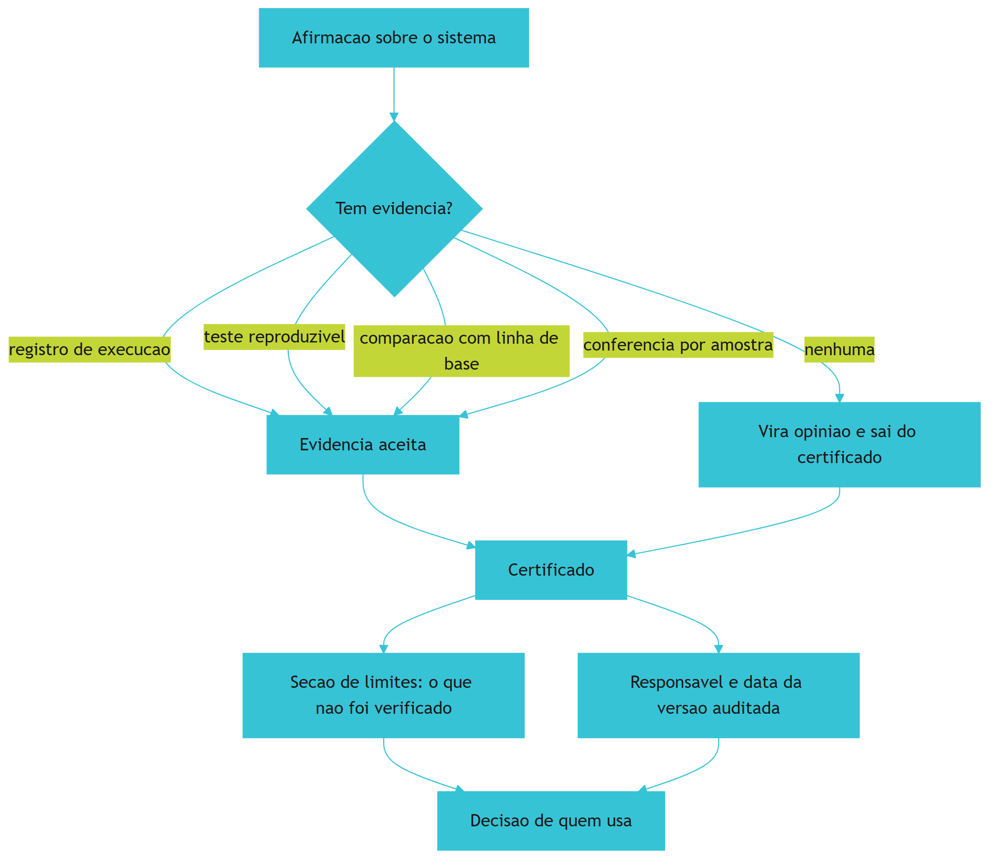

*Figura 14.1 — O caminho do certificado: cada afirmação precisa de evidência correspondente, o que não tem evidência sai, e a seção de limites decide como o sistema deve ser usado.*

Como Engenheiro de Bancada, você vai escrever a seção de limites primeiro. Ela é a parte que protege quem usa e quem construiu.

## 4. Técnica

### 4.1 O certificado

O formato abaixo é curto de propósito. Certificado que ninguém lê não cumpre função; o que importa é a rastreabilidade entre afirmação e evidência.

```markdown
# Certificado de Bancada — Painel de Pedidos

- Versao auditada: v1.0 (lote de referencia 2026-09-14)
- Ambiente: Python 3.11, banco local em arquivo, sem dependencia externa de rede
- Responsavel pela liberacao: operacao

## Afirmacoes com evidencia

| Afirmacao | Evidencia | Como reproduzir |
|---|---|---|
| Conferencia de lote aprova dados validos | 4 testes de comportamento | `python -m unittest discover` |
| Sistema reproduz o processo manual | Teste de equivalencia no lote 2026-09-14 | `python verificacoes/teste_equivalencia.py` |
| Reexecucao nao duplica pedido | Importacao rodada duas vezes no lote de referencia | `python verificacoes/importar_pedidos.py` (2x) |
| Ganho de tempo medido | Linha de base x uso em producao | Planilha de medicao, seção Anexos |
| Toda execucao fica registrada | Tabela de execucoes | `python verificacoes/ler_registro.py` |

## Limites declarados

- Nao controla estoque, cadastro de cliente ou emissao fiscal.
- Nao envia relatorio por e-mail de forma automatica.
- Consolidacao diaria com mais de um lote por data exige conferencia manual.
- Verificacao por amostra semanal, nao integral: divergencia fora da amostra pode existir.
- Vale para a versao auditada; mudanca de contrato invalida este certificado.
```

### 4.2 O teste de reprodutibilidade

A verificação de reprodutibilidade é simples e pega problemas reais: rode a mesma entrada duas vezes e compare o resultado normatizado.

```python
#!/usr/bin/env python3
"""Teste de reprodutibilidade: a mesma entrada produz a mesma saida?"""
import json
from pathlib import Path

ENTRADA = [
    {"identificador": "8842", "valor": 132.90, "forma_pagamento": "pix"},
    {"identificador": "8843", "valor": 58.00, "forma_pagamento": "cartao"},
]


def processar(linhas):
    """Processa em ordem estavel e ignora dados volatil ao resultado."""
    por_forma = {}
    total = 0.0
    for linha in sorted(linhas, key=lambda item: item["identificador"]):
        por_forma[linha["forma_pagamento"]] = round(
            por_forma.get(linha["forma_pagamento"], 0.0) + linha["valor"], 2)
        total += linha["valor"]
    return {"total": round(total, 2), "por_forma": por_forma}


def main():
    primeira = processar(ENTRADA)
    segunda = processar(list(reversed(ENTRADA)))
    iguais = json.dumps(primeira, sort_keys=True) == json.dumps(segunda, sort_keys=True)
    destino = Path("dados/estado/certificado-reprodutibilidade.json")
    destino.parent.mkdir(parents=True, exist_ok=True)
    destino.write_text(json.dumps({"primeira": primeira, "segunda": segunda,
                                   "reproduzivel": iguais}, ensure_ascii=False, indent=2),
                       encoding="utf-8")
    print(f"total: {primeira['total']} | reproduzivel: {iguais}")
    if not iguais:
        print("[BLOQUEADO] resultado varia entre execucoes: investigar ordem ou data")
        return 1
    print("[APROVADO] resultado reproduzivel no lote de referencia")
    return 0


if __name__ == "__main__":
    raise SystemExit(main())
```

Note o detalhe do processamento em ordem estável. Boa parte das não reprodutibilidades vem justamente de depender da ordem de chegada dos dados.

### 4.3 A conferência por amostra

A amostra precisa de critério declarado e registro. Este verificador seleciona o caso por regra determinística e grava o resultado da conferência.

```python
#!/usr/bin/env python3
"""Conferencia por amostra: selecao declarada e registro do que foi conferido."""
import json
from pathlib import Path

LOTES = ["2026-09-08", "2026-09-09", "2026-09-10", "2026-09-11", "2026-09-12",
         "2026-09-13", "2026-09-14"]
CRITERIO = "um lote a cada cinco, sempre o quinto da lista ordenada"


def escolher(lotes, posicao=4):
    ordenados = sorted(lotes)
    if len(ordenados) <= posicao:
        posicao = len(ordenados) - 1
    return ordenados[posicao]


def main():
    escolhido = escolher(LOTES)
    registro = {
        "criterio": CRITERIO,
        "lote_conferido": escolhido,
        "conferido_contra": "planilha manual do dia",
        "resultado": "conforme",
        "responsavel": "operacao",
    }
    destino = Path("dados/estado/amostra-conferida.json")
    destino.parent.mkdir(parents=True, exist_ok=True)
    destino.write_text(json.dumps(registro, ensure_ascii=False, indent=2), encoding="utf-8")
    print(f"criterio: {CRITERIO}")
    print(f"lote conferido: {escolhido} — resultado: conforme")
    return 0


if __name__ == "__main__":
    raise SystemExit(main())
```

A amostra não precisa ser grande: precisa ser declarada e verificável. Três conferências bem registradas valem mais que trinta sem critério. O mesmo vale para revisão de segurança: conferência periódica de dependência e de saída encontra defeito que já é frequente em código gerado sem verificação [10] [11].

### 4.4 A matriz de evidência

| Afirmação comum | Evidência que a sustenta | Se não houver |
|---|---|---|
| "O sistema está pronto" | Testes de comportamento aprovados | Sai do certificado |
| "Não duplica pedido" | Reexecução no lote de referência | Sai do certificado |
| "Ficou mais rápido" | Comparação com linha de base | Vira impressão |
| "É seguro" | Revisão de dependência e saída verificada | Texto substituído por limites |
| "Funciona em produção" | Registro de execução em uso real | Vira observação |
| "Ninguém teve problema" | Registro de reclamações e amostra conferida | Vira opinião |

## 5. Aplica

**Situação.** Você precisa apresentar resultados para a diretoria. Monta um documento com os pontos fortes: quatorze testes passando, integração com o sistema da loja, ganho de tempo estimado, adoção por duas pessoas. O documento tem quatro páginas e nenhuma ressalva.

**O erro.** Na apresentação, alguém pergunta o que acontece quando chega arquivo com mais de um lote por data. Você responde que "não deve acontecer". Na semana seguinte acontece — e exatamente no dia da apresentação de resultado para o cliente. O sistema soma o primeiro lote como se fosse o dia inteiro e o relatório sai errado.

**O diagnóstico.** O documento afirmava cobertura que não existia, porque não declarava limite. O problema não foi o defeito: foi a confiança indevida gerada por um certificado que só listava sucesso. A diferença entre aprovação e resolução é mensurável e conhecida em avaliações de agentes [7] [12].

**A correção.** Refaça o certificado com duas metades: afirmações com evidência e limites declarados, incluindo o caso de múltiplos lotes por data. Acrescente a conferência por amostra com critério registrado e o responsável pela liberação [8]. O documento fica mais curto e mais útil, e a próxima pergunta difícil já tem resposta no papel.

**Métricas de sucesso.** O certificado se avalia pela sua utilidade prática:

| Métrica | Como medir | Sinal de que funcionou |
|---|---|---|
| Afirmações sem evidência | Conferência do documento | Zero afirmações sem evidência |
| Limites declarados | Contagem na seção de limites | Pelo menos três limites explícitos |
| Reprodutibilidade verificada | Teste de reprodutibilidade | Aprovado no lote de referência |
| Amostra conferida e registrada | Registro de amostra | Uma por semana, com responsável |
| Dúvidas respondidas pelo documento | Perguntas abertas na entrega | Nenhuma pergunta sem resposta escrita |

**Nota de contexto.** Certificado serve também para quem chega depois. A adoção ampla de assistentes sem política organizacional produziu muitos projetos que funcionam sem documentar por quê, e o certificado é a forma mais barata de reconstruir esse conhecimento [13] [14]. Organizações que tratam verificação como parte do processo extraem ganho mais consistente da IA [15].

**Armadilhas comuns.** A primeira é listar só sucessos, o que gera confiança indevida. A segunda é amostra escolhida a dedo, que mede o que já se sabia. A terceira é certificar sem versão declarada, o que torna o documento inválido na primeira mudança. A quarta é tratar aprovação de teste como prova de resolução de tarefa [16]. A quinta é certificar uma vez e nunca revisar: certificado vencido é pior que certificado ausente, porque transmite segurança falsa [2]. A sexta é certificar a ferramenta e esquecer o processo: o certificado descreve um sistema em uso, com dono e rotina, e não apenas um programa [17].

**Até onde isso escala.** Certificado de uma lauda com amostra semanal funciona bem para projeto de uma equipe e operação de risco moderado, e continua sendo o nível mínimo aceitável quando o sistema passa a ser usado por outras pessoas — a diferença não é o tamanho do documento, é a existência dele [1]; quando o sistema passa a sustentar decisão financeira ou dado pessoal, a evidência precisa ser integral, com rastreabilidade por versão e retenção declarada [8]. O limite de custo é explícito: verificação total de operação de grande volume tem preço alto, e a decisão de quanto provar é proporcional ao dano possível. E existe limite de tempo: prova tem validade — mudança de contrato, de dependência ou de dado invalida o certificado anterior [5]. Também existe o limite de escopo do que a evidência alcança: verificação cobre o que foi especificado, e requisito que ninguém escreveu permanece não verificado [18].

### 5.1 A conferência de mesa

Certificado se prova na mesa de outra pessoa. A conferência tem cinco passos e precisa ser feita por quem não participou da entrega — ou por você, dois dias depois, lendo só os documentos.

1. **Reproduza o procedimento.** Rode como está escrito, sem consultar quem fez.
2. **Confira três números por amostra.** Escolha três afirmações e vá até a fonte de cada uma.
3. **Procure o limite declarado.** Se a seção de limites estiver vazia, a entrega reprova.
4. **Compare com a linha de base.** Sem comparação, o número não significa nada.
5. **Assine o resultado.** Quem conferiu, quando e com qual versão do artefato.

| Falha na conferência | Onde ela aparece | Correção |
|---|---|---|
| Procedimento depende de quem fez | Passo 1 trava | Reescrever com o caminho completo |
| Número sem fonte | Passo 2 trava | Amarrar cada número a uma citação |
| Limite declarado genérico | Passo 3 não reprova nada | Nomear o que não funciona |
| Sem data de versão | Passo 5 vira opinião | Registrar versão do artefato |

**Aplicação no sistema.** Peça que alguém de fora tente conferir a sua última entrega usando apenas os documentos. O tempo que a pessoa leva até concluir é a medida real de qualidade do certificado — e não o tamanho da seção de resultados [1].

**Limite desta prática.** Amostra não é censo. Conferir três afirmações reduz a chance de erro grave, não elimina a existência de erro. O certificado deve dizer isso em letras claras, porque declarar o alcance do que foi verificado é parte de ser verificável [2]. Referências públicas de comparação, como conjuntos de tarefas abertos e seus painéis de resultado, existem para isso: permitem situar um número sem transformar a comparação em promessa [19].

## 6. Conclusão

Você escreveu o certificado da bancada: afirmações ligadas a evidência verificável, reprodutibilidade testada com o mesmo lote, conferência por amostra com critério declarado e uma seção de limites que protege quem usa. Aprendeu que aprovação não é resolução, que amostra escolhida a dedo não mede nada e que certificado sem limites é venda disfarçada de prova.

**Desafio.** Escreva o certificado do seu projeto com as duas seções, rode o teste de reprodutibilidade e registre uma conferência por amostra com critério explícito. Se alguma afirmação não tiver evidência correspondente, remova-a do documento — ou produza a evidência antes de afirmar.

No próximo capítulo, a bancada deixa de ser individual: adoção em equipe, convivência com código herdado e os acordos que fazem o método sobreviver a férias, troca de pessoa e aumento de escopo.

## 7. Referências Bibliográficas

[1] HUMBLE, Jez; FARLEY, David. *Continuous Delivery: Reliable Software Releases through Build, Test, and Deployment Automation*. Addison-Wesley, 2010. Disponível em: https://continuousdelivery.com/. Acesso em: 12 set. 2026.
[2] NYGARD, Michael T. *Release It!: Design and Deploy Production-Ready Software*. 2. ed. Pragmatic Bookshelf, 2018. Disponível em: https://pragprog.com/titles/mnee2/release-it-second-edition/. Acesso em: 12 set. 2026.
[3] PEREIRA, Luciano. *Empirical Validation of Cognitive-Derived Coding Constraints and Tokenization Asymmetries in LLM-Assisted Software Engineering*. 2026. Disponível em: https://doi.org/10.2139/ssrn.6294900. Acesso em: 12 set. 2026.
[4] GITHUB. *Octoverse 2025: The state of open source*. Disponível em: https://octoverse.github.com/. Acesso em: 12 set. 2026.
[5] CHACON, Scott; STRAUB, Ben. *Pro Git: Everything you need to know about Git*. 2. ed. Apress, 2014. Disponível em: https://git-scm.com/book/en/v2. Acesso em: 12 set. 2026.
[6] FOWLER, Martin. *Patterns of Enterprise Application Architecture*. Boston: Addison-Wesley, 2002. Disponível em: https://martinfowler.com/books/eaa.html. Acesso em: 12 set. 2026.
[7] SCALE LABS. *SWE-Bench Pro (Public Dataset) — Leaderboard*. Disponível em: https://labs.scale.com/leaderboard/swe_bench_pro_public. Acesso em: 12 set. 2026.
[8] NATIONAL INSTITUTE OF STANDARDS AND TECHNOLOGY. *Artificial Intelligence Risk Management Framework: Generative Artificial Intelligence Profile (NIST AI 600-1)*. Disponível em: https://nvlpubs.nist.gov/nistpubs/ai/NIST.AI.600-1.pdf. Acesso em: 12 set. 2026.
[9] RAKSHIT, Yerram Sai. *Modernizing Software Testing: AI, Telemetry, and Agentic Quality Engineering*. In: International Journal of AI Engineering. 2026. Disponível em: https://doi.org/10.34218/ijaieg_01_01_002. Acesso em: 12 set. 2026.
[10] VERACODE. *2025 GenAI Code Security Report: AI-Generated Code Security Risks*. Disponível em: https://www.veracode.com/blog/ai-generated-code-security-risks/. Acesso em: 12 set. 2026.
[11] ENDOR LABS. *The Most Common Security Vulnerabilities in AI-Generated Code*. Disponível em: https://www.endorlabs.com/learn/the-most-common-security-vulnerabilities-in-ai-generated-code. Acesso em: 12 set. 2026.
[12] *Measuring Reward Hacking in Long-Horizon Coding Agents*. In: arXiv. 2026. Disponível em: https://arxiv.org/html/2605.21384v1. Acesso em: 12 set. 2026.
[13] ROBBES, Romain et al. *Agentic Much? Adoption of Coding Agents on GitHub*. In: ACM Transactions on Software Engineering and Methodology. 2026. Disponível em: https://doi.org/10.1145/3822180. Acesso em: 12 set. 2026.
[14] STACK OVERFLOW. *2025 Developer Survey — AI*. Disponível em: https://survey.stackoverflow.co/2025/ai. Acesso em: 12 set. 2026.
[15] DORA / GOOGLE CLOUD. *State of AI-assisted Software Development 2025*. Disponível em: https://dora.dev/dora-report-2025/. Acesso em: 12 set. 2026.
[16] METR. *Recent Frontier Models Are Reward Hacking*. Disponível em: https://metr.org/blog/2025-06-05-recent-reward-hacking/. Acesso em: 12 set. 2026.
[17] ALI, Mohamad Abou; DORNAIKA, Fadi; CHARAFEDDINE, Jinan. *Agentic AI: a comprehensive survey of architectures, applications, and future directions*. In: Artificial Intelligence Review. 2025. Disponível em: https://doi.org/10.1007/s10462-025-11422-4. Acesso em: 12 set. 2026.
[18] MEI, Lingrui et al. *A Survey of Context Engineering for Large Language Models*. In: arXiv. 2025. Disponível em: https://arxiv.org/abs/2507.13334. Acesso em: 12 set. 2026.
[19] OPENAI. *Introducing SWE-bench Verified*. Disponível em: https://openai.com/index/introducing-swe-bench-verified/. Acesso em: 12 set. 2026.
[20] SWE-BENCH. *SWE-bench Leaderboards*. Disponível em: https://www.swebench.com/. Acesso em: 12 set. 2026.

# Capítulo 15: Levando a bancada para o time (e para o código que já existe)

## 1. Introdução

No Capítulo 14 você produziu o certificado: evidência, limites e responsável. Até aqui, porém, tudo foi trabalho de uma pessoa em um projeto. O próximo passo é o mais difícil de todos — levar o método para outras pessoas sem transformar a bancada em burocracia.

Ao final deste capítulo você terá um plano de adoção em três etapas, uma cerca de proteção para o módulo herdado e um acordo de time que define quem decide, quem revisa e quem assina. É o capítulo que decide se o método sobrevive à sua ausência.

## 2. Explica

### 2.1 Adoção sem revolução

Método novo morre de duas formas: por rejeição e por excesso. A rejeição acontece quando alguém tenta impor a bancada inteira de uma vez, com quatro camadas, dez leis e doze arquivos de configuração. O excesso acontece quando o método vira fim em si mesmo e o time passa mais tempo mantendo a estrutura do que entregando.

Considere o ponto de partida real do time: **84% dos desenvolvedores** já usam ferramentas de IA no trabalho, e a maior parte decidiu isso individualmente, sem processo comum [1]. O que falta não é ferramenta, é método compartilhado — e método compartilhado se instala por demonstração, não por anúncio [2].

A adoção que funciona começa pequena: **uma tarefa, um portão e um dono**. Escolha um processo que dá dor conhecida, escreva o portão que o verifica e nomeie alguém responsável por ele. Rode por duas semanas. Se o portão pegar um defeito real nesse período, o time adota por conta própria; se não pegar nada, você provavelmente escolheu a tarefa errada [3].

Esse encadeamento tem apoio em dados de prática: a IA tende a amplificar o que já existe na organização, acelerando quem tem processo e apenas expondo gargalo em quem não tem [4]. Levar bancada para o time não é introduzir uma ferramenta nova — é instalar o processo que faltava, na dose mínima. E a dose mínima tem base em evidência: restrição explícita muda comportamento de forma mais confiável do que recomendação genérica [5].

### 2.2 Código herdado: cercar antes de julgar

Todo time tem um módulo que ninguém quer tocar. A tentação é reescrever. A regra da bancada é outra: **medir antes de julgar, cercar antes de mexer**. Meça quanto tempo aquele módulo consome em manutenção e quantos incidentes ele causa. Se o custo é baixo, cercar é suficiente; se é alto, a substituição entra na fila com justificativa registrada.

A cerca tem três partes. O **teste de comportamento** atual, capturado a partir do que o módulo faz hoje. A **restrição de escopo**, que impede alteração fora do combinado. E o **registro do que ninguém entende**, porque parte do comportamento herdado é conhecimento tácito que só aparece quando algo quebra [6]. Capturar o teste antes de mexer é a diferença entre modernizar e apagar regra sem perceber [7].

Há um detalhe de risco que muda de escala em código herdado: dependência antiga sem manutenção e ausência de verificação de segurança. Boa parte da dívida herdada é desse tipo, e ela não aparece em teste funcional [8] [9]. Dependência que não existe mais no registro público é outro caso frequente, e ele só se revela na instalação em máquina limpa [10].

### 2.3 O acordo de time

Sem acordo explícito, a bancada vira preferência de quem a criou. Três definições precisam existir por escrito, e são curtas: **quem decide** mudança de regra, **quem revisa** entrega que atravessa módulo compartilhado e **quem assina** a liberação para uso. Sem essas três, o portão vira sugestão na primeira semana cheia.

O acordo também define o que não é negociável. As leis da constituição do Capítulo 4 pertencem a esse conjunto: dado de origem intocável, entrega sem portão não avança, registro obrigatório. Regra que pode ser suspensa por conveniência individual não é regra, é hábito.

### 2.4 O que mede adoção de verdade

Adoção não se mede por quantas pessoas criaram conta ou quantas abriram o repositório. Mede-se por três sinais bem específicos: o portão **está bloqueando** entregas de vez em quando; o caderno **tem decisões novas** sem a sua participação; e outra pessoa **consegue operar** o sistema sem te chamar. Os três indicam que o método saiu da sua mão.

Se nenhum dos três aparece em dois meses, o problema não é resistência do time: é que a estrutura não entrou na rotina. Nesse caso, reduza o escopo em vez de aumentar a cobrança [4]. Vale considerar também o desenho dos papéis: governança sem dono explícito não sustenta verificação ao longo do tempo [11].

## 3. Ilustra

Existem dois jeitos de instalar um processo em uma oficina grande. O primeiro é reunir todos, apresentar o manual completo e exigir cumprimento a partir de segunda. O segundo é escolher uma bancada, montar o quadro de normas só nela, rodar duas semanas e deixar que os outros vejam o resultado.

O segundo funciona porque ninguém discute método abstrato: discute resultado visível. Quando a bancada vizinha deixa de devolver peça errada, a pergunta "como vocês fazem isso" aparece sozinha — e a resposta já está montada na parede, pronta para ser copiada.

Repare no papel das diferentes bancadas. A que tem projeto antigo e mal documentado precisa de mais apreciação e menos reescrita, porque o conhecimento do sistema herdado mora no comportamento dele. A que tem projeto novo aceita instalação completa. Exigir o mesmo nível das duas é o erro que faz times abandonarem processo bom.

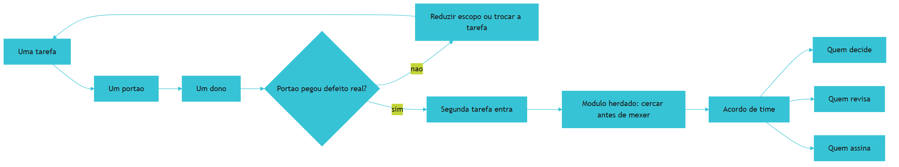

*Figura 15.1 — Adoção em três etapas: começa com uma tarefa que prova valor, avança para o código herdado com cerca e termina no acordo explícito de papéis.*

Como Engenheiro de Bancada, você vai resistir à pressa de instalar tudo. A bancada que cresce por evidência de valor dura mais do que a que cresce por decreto.

## 4. Técnica

### 4.1 O plano de adoção

O plano declara as etapas, o responsável e o critério de avanço. Critério de avanço explícito é o que impede que a adoção vire campanha permanente.

```yaml
# adocao.yaml — plano de adocao da bancada
etapas:
  - ordem: 1
    escopo: conferencia de pedidos do dia
    portao: totais_conferem
    responsavel: operacao
    prazo: duas semanas
    criterio_de_avanco: o portao bloqueou pelo menos uma entrega com defeito real
  - ordem: 2
    escopo: modulo legado de exportacao
    portao: equivalencia_manual
    responsavel: operacao
    prazo: tres semanas
    criterio_de_avanco: teste de comportamento capturado e cerca aplicada
  - ordem: 3
    escopo: acordo de time
    portao: revisao_por_outra_pessoa
    responsavel: lideranca_tecnica
    prazo: uma reuniao
    criterio_de_avanco: papeis de decisao, revisao e assinatura registrados
papeis:
  decide: lideranca_tecnica
  revisa: par_tecnico
  assina: responsavel_pela_operacao
nao_negociavel:
  - dado de origem intocavel
  - entrega sem portao nao avanca
  - registro de decisao obrigatorio
```

### 4.2 A cerca do módulo herdado

A cerca é um documento curto que declara o que está protegido e o que não pode ser tocado sem verificação prévia.

```markdown
# Cerca — modulo de exportacao (herdado)

## O que o modulo faz hoje
- Le a tabela de pedidos do dia e gera arquivo de exportacao.
- Exclui pedidos cancelados do cliente cadastrado como parceiro interno.

## Regras nao documentadas descobertas
- A exclusao acima nao esta escrita em lugar nenhum; foi descoberta por comparacao de saida.

## Teste capturado
- Entrada: lote de referencia 2026-09-14. Saida esperada: arquivo com 2 linhas.
- Comando: `python verificacoes/teste_equivalencia.py`

## Restricoes
- Alteracao apenas em `verificacoes/exportacao/`.
- Proibido alterar `dados/entrada/`.
- Qualquer mudanca exige rodar o teste capturado antes e depois.
```

### 4.3 O painel de adoção

O painel mostra se o método realmente entrou na rotina, com os três sinais do capítulo.

```python
#!/usr/bin/env python3
"""Painel de adocao: o metodo saiu da mao do autor?"""
import json
from pathlib import Path

REGISTRO = {
    "bloqueios_por_portao": 3,
    "decisoes_registradas_por_outras_pessoas": 4,
    "execucoes_por_outras_pessoas": 11,
    "duvidas_respondidas_por_documento": 5,
    "chamadas_diretas_ao_autor": 2,
}
MINIMOS = {"bloqueios_por_portao": 1,
           "decisoes_registradas_por_outras_pessoas": 1,
           "execucoes_por_outras_pessoas": 1}


def avaliar(registro, minimos):
    sinais = {chave: registro.get(chave, 0) >= valor for chave, valor in minimos.items()}
    travado = not any(sinais.values())
    return sinais, travado


def main():
    sinais, travado = avaliar(REGISTRO, MINIMOS)
    for chave, atendido in sinais.items():
        print(f"[{'ok' if atendido else 'pendente'}] {chave}")
    print(f"chamadas diretas ao autor: {REGISTRO['chamadas_diretas_ao_autor']}")
    Path("dados/estado/adocao.json").parent.mkdir(parents=True, exist_ok=True)
    Path("dados/estado/adocao.json").write_text(
        json.dumps({"sinais": sinais, "registro": REGISTRO}, ensure_ascii=False, indent=2),
        encoding="utf-8")
    if travado:
        print("[ATENCAO] nenhum sinal de adocao: reduza o escopo em vez de cobrar mais")
        return 0
    print("[OK] metodo em uso por mais de uma pessoa")
    return 0


if __name__ == "__main__":
    raise SystemExit(main())
```

### 4.4 O checklist do acordo de time

| Item | Pergunta a responder | Onde fica registrado |
|---|---|---|
| Decisão de regra | Quem pode mudar uma lei da constituição? | Constituição do projeto |
| Revisão de entrega | Quem revisa mudança em módulo compartilhado? | Acordo de time |
| Assinatura de liberação | Quem autoriza uso em produção? | Certificado do projeto |
| Adoção de nova tarefa | Qual o critério para incluir a tarefa seguinte? | Plano de adoção |
| Retirada de portão | Quem pode desativar verificação e por qual motivo? | Acordo de time |
| Registro de exceção | Onde ficam registradas as exceções aceitas? | Caderno de bancada |

## 5. Aplica

**Situação.** Você decide apresentar a bancada na reunião semanal. Prepara quarenta slides com as quatro camadas, as dez leis, o certificado e a arquitetura completa. A recepção é educada, e ninguém adota nada. Na semana seguinte, alguém sugere "criar um grupo de trabalho para estudar o processo".

**O erro.** Você insiste: monta um repositório-modelo completo, escreve treinamento de duas horas e pede que cada pessoa aplique o método em seu projeto. Duas semanas depois, metade do time tem estrutura e nenhuma entrega nova; a outra metade abandonou, dizendo que "o processo dá mais trabalho do que o problema".

**O diagnóstico.** Você apresentou método sem demonstrar resultado, e método abstrato compete mal com tarefa urgente. O time não era resistente: era ocupado. Adoção de plataforma funciona quando existe caminho claro com valor visível, não quando se instala estrutura e se espera mudança de comportamento [4]. Somando a isso, metade do código do time é herdado e nem pergunta se beneficia — cercar era a resposta certa para ele, não instalar [12].

**A correção.** Uma única tarefa, um portão, um dono. Você escolhe a conferência de pedidos, que já tem dor conhecida, e roda por duas semanas com o portão bloqueando o que não passa. No terceiro bloqueio real, outra pessoa pergunta como funciona — e aí a adoção começa. O módulo herdado ganha cerca, não reescrita; o acordo de time entra na reunião seguinte, com três definições de papel [3].

**Métricas de sucesso.** Adoção se mede por comportamento, não por opinião:

| Métrica | Como medir | Sinal de que funcionou |
|---|---|---|
| Bloqueios reais do portão | Registro do harness | Pelo menos um no período |
| Decisões registradas por outras pessoas | Caderno de bancada | Existe registro sem o autor |
| Execuções por outras pessoas | Registro de execução | Mais de uma pessoa operando |
| Chamadas diretas ao autor | Contagem simples | Em queda |
| Módulos herdados cercados | Lista de cercas | Todo módulo crítico com cerca |

**Nota de contexto.** Dois lembretes ajudam a manter o pé no chão. O primeiro é que o método chega em um time que já usa assistentes por conta própria, o que significa que a discussão não é sobre adotar ou não, mas sobre como organizar [1] [13]. O segundo é que verificação precisa continuar valendo depois da empolgação inicial, e é aí que o acordo de papéis faz diferença [3].

**Armadilhas comuns.** A primeira é apresentar o método completo antes de mostrar resultado, o que gera rejeição educada. A segunda é instalar estrutura em módulo herdado sem cerca, o que produz perda de comportamento oculto. A terceira é não definir quem decide, o que faz a regra valer até a primeira urgência. A quarta é medir adoção por entusiasmo declarado, que não prevê uso. A quinta é cobrar mais quando a adoção não acontece, em vez de reduzir escopo [6]. A sexta é deixar o conhecimento do módulo herdado só na cabeça de quem mantém: registro de decisão é o que permite outra pessoa assumir sem arqueologia [14].

**Até onde isso escala.** Uma tarefa, um portão e um dono funcionam bem em time pequeno e em um projeto principal, e continuam válidos como degrau inicial em organização maior, desde que exista caminho comum para as regras do núcleo [12]; em organização com vários times, o que escala é o núcleo comum de regras e o caminho de plataforma, com cada time mantendo seus portões locais [4]. O limite aparece quando o acordo de papéis não existe: sem decisão, revisão e assinatura definidas, a bancada depende de uma pessoa e não sobrevive à sua saída. E há limite cultural: organização que pune bloqueio de entrega aprende a desligar verificação, independentemente do método — e aí o problema é de gestão, não de ferramenta [11].

### 5.1 O plano de duas semanas para o time

Adoção não se anuncia: se demonstra em uma tarefa com nome de dono e um portão que roda. O plano cabe em duas semanas e em cinco linhas.

| Semana | O que acontece | Evidência produzida |
|---|---|---|
| 1, dias 1-2 | Escolher uma tarefa do time | Tarefa nomeada e dono |
| 1, dias 3-5 | Escrever especificação e contexto | Documento de uma página |
| 2, dias 1-3 | Rodar com portão ligado | Registro de execução |
| 2, dias 4-5 | Revisar e decidir continuar | Comparação com a linha de base |

**O papel do responsável.** Ter um dono nomeado muda o resultado mais do que qualquer ferramenta. Tarefa sem responsável vira iniciativa compartilhada, e iniciativa compartilhada sem dono é a forma mais comum de não acontecer. O dono não precisa ser quem entende mais do assunto; precisa ser quem responde pelo resultado e tem autoridade para reprovar entrega [4]. Em ambiente com agentes, responsabilidade vem acompanhada de permissão declarada: vale registrar quais ferramentas cada pessoa pode acionar, porque governança que só existe no discurso não resiste ao primeiro descuido [15]. Framework de orquestração com governança embutida serve exatamente para isso, transformando permissão em configuração verificável em vez de acordo verbal [16].

**Código que já existe.** Quando a tarefa cai em módulo herdado, comece descrevendo o comportamento atual antes de propor mudanças. Esse retrato escrito é o que permite diferenciar defeito antigo de defeito novo e evita refatoração às cegas em área sem teste. Documentação viva do que o módulo faz é insumo para quem chega depois e para o próprio executor, que passa a ter vocabulário compartilhado em vez de adivinhação [12]. Quando o módulo é grande demais para ser lido arquivo por arquivo, gerar o retrato estrutural de forma assistida reduz o tempo até o primeiro entendimento útil e dá base objetiva para a conversa sobre o que mexer primeiro [17].

**Aplicação no sistema.** Escolha a tarefa, o responsável e o portão, e rode por duas semanas antes de ampliar. Ampliar escopo sem essa prova é o caminho mais rápido para o projeto virar mais uma ferramenta abandonada no inventário do time [3].

**Como saber se pegou.** Mede-se adoção por uso observado, não por declaração de intenção. Telemetria de execução, mesmo simples, é o que permite ver quem rodou o quê e quantas vezes [20]. Sem isso, a decisão de continuar se apoia em percepção, e percepção em time costuma favorecer quem fala mais alto.

**Limite desta prática.** Duas semanas provam viabilidade, não sustentabilidade. Manutenção contínua exige acordo explícito sobre quem cuida das regras, quem revisa e o que acontece quando o dono muda — e isso o plano de duas semanas não resolve sozinho [6]. Em organizações maiores, o desenho explícito da solução, com papéis e critérios de sucesso definidos antes da execução, é o que costuma separar projeto institucionalizado de experimento isolado [18]. E vale lembrar que coordenação entre agentes exige protocolo de negociação, não apenas boa vontade de quem opera: quanto mais partes envolvidas, mais formal precisa ser o combinado [19].

## 6. Conclusão

Você montou o caminho de adoção: uma tarefa com um portão e um dono, módulo herdado cercado em vez de reescrito, e acordo explícito de papéis. Aprendeu a medir adoção por três sinais concretos — bloqueio real, decisão registrada por outra pessoa e operação sem você — e que reduzir escopo funciona melhor que cobrar mais.

**Desafio.** Escolha uma tarefa do seu time, escreva o portão que a verifica e nomeie o responsável. Rode por duas semanas e registre os três sinais de adoção. Depois escreva a cerca do módulo mais temido do repositório, com o teste de comportamento capturado.

No último capítulo, a soberania: manter dados, regras e histórico do seu lado, trocar de modelo sem reescrever o processo e decidir por evidência quando ficar ou quando sair — fechando a bancada que você montou capítulo a capítulo.

## 7. Referências Bibliográficas

[1] STACK OVERFLOW. *2025 Developer Survey — AI*. Disponível em: https://survey.stackoverflow.co/2025/ai. Acesso em: 12 set. 2026.
[2] ROBBES, Romain et al. *Agentic Much? Adoption of Coding Agents on GitHub*. In: ACM Transactions on Software Engineering and Methodology. 2026. Disponível em: https://doi.org/10.1145/3822180. Acesso em: 12 set. 2026.
[3] HUMBLE, Jez; FARLEY, David. *Continuous Delivery: Reliable Software Releases through Build, Test, and Deployment Automation*. Addison-Wesley, 2010. Disponível em: https://continuousdelivery.com/. Acesso em: 12 set. 2026.
[4] DORA / GOOGLE CLOUD. *State of AI-assisted Software Development 2025*. Disponível em: https://dora.dev/dora-report-2025/. Acesso em: 12 set. 2026.
[5] PEREIRA, Luciano. *Empirical Validation of Cognitive-Derived Coding Constraints and Tokenization Asymmetries in LLM-Assisted Software Engineering*. 2026. Disponível em: https://doi.org/10.2139/ssrn.6294900. Acesso em: 12 set. 2026.
[6] NYGARD, Michael T. *Release It!: Design and Deploy Production-Ready Software*. 2. ed. Pragmatic Bookshelf, 2018. Disponível em: https://pragprog.com/titles/mnee2/release-it-second-edition/. Acesso em: 12 set. 2026.
[7] FOWLER, Martin. *Patterns of Enterprise Application Architecture*. Boston: Addison-Wesley, 2002. Disponível em: https://martinfowler.com/books/eaa.html. Acesso em: 12 set. 2026.
[8] ENDOR LABS. *The Most Common Security Vulnerabilities in AI-Generated Code*. Disponível em: https://www.endorlabs.com/learn/the-most-common-security-vulnerabilities-in-ai-generated-code. Acesso em: 12 set. 2026.
[9] CLOUD SECURITY ALLIANCE. *Vibe Coding's Security Debt: The AI-Generated CVE Surge*. Disponível em: https://labs.cloudsecurityalliance.org/research/csa-research-note-ai-generated-code-vulnerability-surge-2026/. Acesso em: 12 set. 2026.
[10] TRAXTECH. *20% of AI-Generated Code Dependencies Don't Exist, Creating Supply Chain Security Risks*. Disponível em: https://www.traxtech.com/blog/20-of-ai-generated-code-dependencies-dont-exist-creating-supply-chain-security-risks. Acesso em: 12 set. 2026.
[11] NATIONAL INSTITUTE OF STANDARDS AND TECHNOLOGY. *Artificial Intelligence Risk Management Framework: Generative Artificial Intelligence Profile (NIST AI 600-1)*. Disponível em: https://nvlpubs.nist.gov/nistpubs/ai/NIST.AI.600-1.pdf. Acesso em: 12 set. 2026.
[12] MARTIN, Robert C. *Clean Architecture: A Craftsman's Guide to Software Structure and Design*. Prentice Hall, 2017. Disponível em: https://www.pearson.com/. Acesso em: 12 set. 2026.
[13] GITHUB. *Octoverse 2025: The state of open source*. Disponível em: https://octoverse.github.com/. Acesso em: 12 set. 2026.
[14] CHACON, Scott; STRAUB, Ben. *Pro Git: Everything you need to know about Git*. 2. ed. Apress, 2014. Disponível em: https://git-scm.com/book/en/v2. Acesso em: 12 set. 2026.
[15] NATIONAL SECURITY AGENCY. *Model Context Protocol (MCP) Security — CSI*. Disponível em: https://www.nsa.gov/Portals/75/documents/Cybersecurity/CSI_MCP_SECURITY.pdf. Acesso em: 12 set. 2026.
[16] PRUDVI SAISARAN PONDURU. *AgentMesh-MCP: A Secure and Governed Framework for Agentic AI Systems Using LLM Agents and Model Context Protocol Servers*. In: International Journal of Scientific Research in Engineering and Management. 2026. Disponível em: https://doi.org/10.55041/ijsrem62689. Acesso em: 12 set. 2026.
[17] VĂDUVA, A. et al. *Code2UML: Agentic LLMs with context engineering for scalable software visualization*. In: arXiv. 2026. Disponível em: https://www.semanticscholar.org/paper/792e745f4068bb0557ed2a4c6601812b3e3baf5e. Acesso em: 12 set. 2026.
[18] OKULA, Oghenekeno Hilkiah; NEERANJAN, Chitare. *A Design Science Approach for Agentic AI in Network Engineering: Autonomous Network Management Using AI Agents, LLMs and Model Context Protocol (MCP) Mechanisms*. 2026. Disponível em: https://doi.org/10.36227/techrxiv.176978431.15223796/v1. Acesso em: 12 set. 2026.
[19] LORENZONI, Giuliano; ALENCAR, Paulo; COWAN, Donald. *LLM-X: A Scalable Negotiation-Oriented Exchange for Communication Among Personal LLM Agents*. In: Proceedings of the 2026 International Workshop on Agentic Engineering. 2026. Disponível em: https://doi.org/10.1145/3786167.3788429. Acesso em: 12 set. 2026.
[20] RAKSHIT, Yerram Sai. *Modernizing Software Testing: AI, Telemetry, and Agentic Quality Engineering*. In: International Journal of AI Engineering. 2026. Disponível em: https://doi.org/10.34218/ijaieg_01_01_002. Acesso em: 12 set. 2026.

# Capítulo 16: Soberania: não ficar preso a fornecedor, modelo ou plataforma

## 1. Introdução

No Capítulo 15 você levou a bancada para o time e cercou o código herdado. Falta a última proteção, e ela é a mais estratégica: garantir que tudo o que você construiu continue seu, independentemente de qual fornecedor estiver na moda no próximo trimestre.

Ao final deste capítulo você terá o contrato de portabilidade do seu projeto, um teste que comprova a troca de provedor sem reescrever regra de negócio e um critério de decisão para quando ficar e quando sair. É também o capítulo que fecha a bancada montada do primeiro ao último capítulo.

## 2. Explica

### 2.1 O que precisa ser seu

A soberania de um projeto se resume a cinco ativos que não podem depender de fornecedor. **Os dados**, na sua estrutura e no seu formato. **As regras de negócio**, escritas em arquivo seu. **Os portões**, que definem o que é aceitável. **O histórico de execução**, que prova o que aconteceu. E **o vocabulário**, que descreve o domínio na sua linguagem.

O teste prático é direto: imagine que o fornecedor dobre o preço amanhã ou encerre o serviço. O que você perde? Se a resposta inclui regra de negócio, o projeto não é seu — está alugado. Se a resposta é "troco a peça do motor", você construiu soberania [1].

Esse cuidado parece paranoia e é gestão de risco comum: mudança de preço, de política de uso e de disponibilidade de modelo acontece em intervalos curtos, e o custo de trocar não deveria incluir reescrever o processo [2]. A adoção ampla de assistentes, feita em grande parte fora de política organizacional, tornou essa exposição comum em vez de excepcional [3] [4].

### 2.2 Trocar modelo sem reescrever o processo

A troca é suportável quando o sistema está organizado em três partes: o **contrato** (o que a tarefa precisa receber e devolver), o **adaptador** (quem conversa com o provedor) e a **regra** (o que o negócio exige). Nesse desenho, trocar de modelo altera o adaptador e nada mais.

Um detalhe que muita gente descobre tarde: contratos de resposta e formato de contexto são ativos próprios, não detalhes do fornecedor. Se a instrução principal do seu sistema está escrita no formato específico de uma plataforma, você acoplou o processo à ferramenta. Escrever a especificação em arquivo neutro é o que permite rodar o mesmo teste em dois provedores diferentes [5].

Esse é o mesmo princípio que sustenta a padronização de integração de ferramentas: quando a conexão segue um formato comum, a implementação pode ser substituída sem reescrever o consumidor [6]. A diferença é que aqui você aplica o princípio também ao modelo, e não só às ferramentas. Note o ganho colateral: contexto neutro e prefixo estável também rendem economia de custo e de tempo, porque o processamento reaproveitável não depende de sintaxe de plataforma [7] [8].

### 2.3 O custo real da troca

Trocar não é gratuito: envolve migração de contexto, ajuste de contrato, reinserção de casos de referência, retrabalho de prompts e tempo de reaprendizado. O erro comum é comparar apenas o preço unitário e esquecer o custo de migração.

A decisão honesta compara três cenários: custo de ficar no próximo período, custo total da troca e risco de cada opção. Aqui a mesma disciplina do certificado se aplica: decisão por evidência, com teste comparativo no seu lote de referência, em vez de comparar número de fornecedor [9].

Vale lembrar que a variação de desempenho entre ferramentas é real, e ela aparece em avaliações comparativas: o mesmo tipo de tarefa produz resultado diferente em ferramentas diferentes [10]. Isso argumenta a favor de testar antes de migrar, não de migrar por desconforto.

### 2.4 Riscos que precisam de decisão explícita

Governança de IA catalogou **12 riscos** específicos de IA generativa, cobrindo desde vazamento de informação até uso indevido de dado e decisão sem supervisão [11]. Em projeto pequeno, três deles merecem decisão escrita.

O primeiro é **dado pessoal na mesa de trabalho**: nome, telefone e documento não precisam entrar no contexto se a tarefa pode ser feita com identificador. O segundo é **decisão com efeito sobre pessoa**: desconto, crédito e exceção de cliente exigem revisão humana registrada. O terceiro é **retenção**: por quanto tempo o registro de execução fica guardado e como é descartado.

Anotar as três decisões, mesmo em três linhas, muda o patamar de risco do projeto. É a diferença entre uso consciente e uso por acidente [12] [13]. Vale acrescentar um quarto cuidado, de qualidade: revisar dependência e saída de ferramenta, porque código gerado sem verificação concentra defeito conhecido [14] [15].

### 2.5 Decidir por evidência: ficar ou sair

A regra de decisão que funciona tem quatro perguntas: o resultado no meu lote de referência continua aceitável, o custo por tarefa continua sustentável, o fornecedor mudou algo que afeta risco e existe alternativa testada. Quatro respostas positivas significam ficar; duas respostas negativas na mesma direção significam migrar com plano.

O que não funciona é decidir por novidade. Trocar por trocar produz semanas de retrabalho e nenhum ganho medido — e a bancada existe justamente para impedir esse tipo de decisão por impulso [16]. Vale lembrar que o executante também pode otimizar a própria avaliação: verificar o resultado no lote de referência é o que impede aceitar como ganho algo que apenas mudou de forma [17] [18].

## 3. Ilustra

Numa bancada bem montada, as ferramentas são intercambiáveis. A furadeira quebra e outra entra na mesma tomada, faz o mesmo furo e o operador continua o serviço. Ninguém precisa desmontar a oficina porque a ferramenta mudou de marca — o que permanece é a bancada, a tomada padrão, o procedimento e o projeto na mesa.

A soberania é isso aplicado ao motor cognitivo. O modelo é a furadeira: importante, substituível, e não dono do processo. O que faz a oficina funcionar é o conjunto — contrato, regra, portão, registro —, e todo ele é seu.

Repare num detalhe da analogia: para a ferramenta ser intercambiável, a tomada precisa ser padrão. No projeto de software, a tomada padrão é o contrato: formato de entrada, formato de saída e critério de pronto. Sem ele, cada troca vira desmontagem. Com ele, a troca é manutenção.

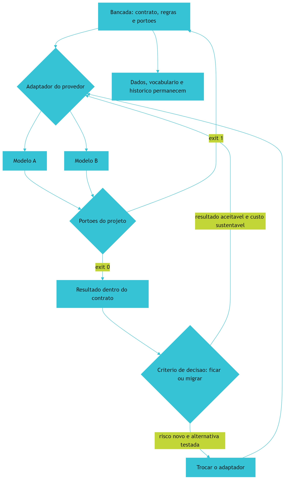

*Figura 16.1 — Soberania na bancada: o adaptador conecta qualquer provedor, os portões conferem o resultado, e dados, regras, vocabulário e histórico permanecem do seu lado.*

Como Engenheiro de Bancada, você vai tratar o fornecedor como peça de manutenção, e não como alicerce. É essa distância que mantém o projeto de pé quando o mercado muda.

## 4. Técnica

### 4.1 O contrato de portabilidade

O contrato declara o que troca, o que permanece e o que precisa ser testado antes da troca. Ele é a versão de projeto do princípio de substituição.

```yaml
# portabilidade.yaml — contrato de portabilidade
permanece:
  - dados/entrada e dados/estado
  - contrato.json (formato de entrada e saida)
  - portoes.yaml e verificacoes/
  - vocabulario.yaml e caderno.json
troca:
  - adaptador do provedor de modelo
  - parametros de chamada (modelo, temperatura, limite)
  - credencial de acesso
precisa_testar_antes:
  - teste de equivalencia no lote de referencia
  - custo por tarefa no lote de referencia
  - formato de resposta conforme o contrato
  - limite de contexto declarado pelo provedor
criterio_de_migracao:
  ficar: resultado aceitavel e custo sustentavel
  migrar: risco novo declarado e alternativa com teste aprovado
  nunca: trocar sem teste no lote de referencia
```

### 4.2 O teste de portabilidade

O teste roda o mesmo caso contra dois adaptadores diferentes e compara o resultado com o contrato. Ele é o que transforma "acreditamos que dá para trocar" em "está provado que dá".

```python
#!/usr/bin/env python3
"""Teste de portabilidade: o mesmo caso passa pelos portoes em dois provedores."""
import json
from pathlib import Path

CASO = [
    {"identificador": "8842", "valor": 132.90, "forma_pagamento": "pix"},
    {"identificador": "8843", "valor": 58.00, "forma_pagamento": "cartao"},
]


def provedor_a(linhas):
    """Simula resposta do provedor A, com campos extras proprios."""
    return {"formato": "a", "total": round(sum(i["valor"] for i in linhas), 2),
            "por_forma": {"pix": 132.90, "cartao": 58.00}, "meta": {"tokens": 1200}}


def provedor_b(linhas):
    """Simula resposta do provedor B, com nome de campo diferente."""
    return {"formato": "b", "soma": round(sum(i["valor"] for i in linhas), 2),
            "resumo": {"pix": 132.90, "cartao": 58.00}, "uso": {"tokens": 1450}}


def normalizar(resposta):
    """Traduz qualquer resposta para o contrato do projeto."""
    total = resposta.get("total", resposta.get("soma"))
    por_forma = resposta.get("por_forma", resposta.get("resumo"))
    return {"total": total, "por_forma": por_forma}


def main():
    contrato = {"total": 190.90, "por_forma": {"pix": 132.90, "cartao": 58.00}}
    conformes = {}
    for nome, adaptador in (("A", provedor_a), ("B", provedor_b)):
        normalizado = normalizar(adaptador(CASO))
        conformes[nome] = normalizado == contrato
        print(f"provedor {nome}: {'conforme' if conformes[nome] else 'divergente'} "
              f"| total {normalizado['total']}")
    Path("dados/estado/portabilidade.json").parent.mkdir(parents=True, exist_ok=True)
    Path("dados/estado/portabilidade.json").write_text(
        json.dumps(conformes, ensure_ascii=False, indent=2), encoding="utf-8")
    if all(conformes.values()):
        print("[APROVADO] contrato respeitado nos dois provedores: troca e manutencao")
        return 0
    print("[BLOQUEADO] algum provedor nao respeita o contrato: migracao exige adaptacao")
    return 1


if __name__ == "__main__":
    raise SystemExit(main())
```

Repare que o teste não compara os provedores entre si: compara cada um contra o contrato do projeto. É essa inversão que mantém o projeto no centro e o fornecedor na periferia.

### 4.3 O inventário de dependência de fornecedor

| Dependência | Onde está acoplada | Como reduzir risco |
|---|---|---|
| Modelo e parâmetros | Adaptador do provedor | Manter dois adaptadores testados |
| Formato de resposta | Camada de normalização | Normalizar para o contrato do projeto |
| Instrução principal | Arquivo de contexto neutro | Evitar sintaxe específica de plataforma |
| Ferramenta de integração | Configuração de protocolo | Preferir padrão aberto documentado |
| Credencial e limite | Variável de ambiente | Não deixar credencial em código |
| Registro de execução | Banco local do projeto | Nunca depender do histórico do provedor |

### 4.4 As decisões de risco em três linhas

```markdown
## Decisoes de risco

- Dado pessoal: cliente entra no contexto apenas por identificador; nome e telefone ficam fora.
- Decisao com efeito sobre pessoa: desconto e excecao de cliente exigem aprovacao humana registrada.
- Retencao: registro de execucao guardado por 12 meses e depois expurgado por script agendado.
```

### 4.5 A bancada completa: checklist final

| Peça | Artefato | Está no seu projeto? |
|---|---|---|
| Contexto | objetivo, contrato, exemplo e prova na mesa | |
| Harness | ciclo de quatro passos, manifesto de portões e disjuntor | |
| Motor | tabela de roteamento e contrato de resposta | |
| Ferramentas | catálogo com etiqueta, chave natural e registro | |
| Governança | constituição com fiscalização declarada | |
| Evidência | certificado com limites e responsável | |
| Time | plano de adoção, cerca e acordo de papéis | |
| Soberania | contrato de portabilidade e teste de troca | |

## 5. Aplica

**Situação.** O provedor que você usa anuncia mudança de preço e novo limite de contexto no mesmo mês. A reação natural é abrir o editor e trocar tudo de uma vez, aproveitando para "limpar o código".

**O erro.** Você troca provedor, parâmetros e formato de resposta na mesma semana, sem rodar o lote de referência. Duas semanas depois descobre que o total do relatório mudou em lotes com valor negativo, porque o novo modelo interpretou de forma diferente uma instrução ambígua que estava no contexto desde o primeiro dia. Para achar a causa, você precisa refazer o caminho de mudança sem saber o que mudou.

**O diagnóstico.** Três trocas simultâneas eliminam a capacidade de atribuir causa. Além disso, a instrução ambígua nunca foi um problema do provedor: era um defeito do seu contexto, que só apareceu quando o motor mudou [19]. Migração sem teste no lote de referência transforma manutenção em aposta [16].

**A correção.** Ordem correta: primeiro rodar o teste de portabilidade no lote de referência com o provedor atual, para registrar o comportamento esperado; depois implementar o adaptador novo mantendo o contrato; depois rodar o mesmo teste; só então trocar por padrão. A instrução ambígua é corrigida no contexto do projeto, o que beneficia qualquer provedor [5].

**Métricas de sucesso.** Portabilidade se mede pela capacidade de trocar com risco conhecido:

| Métrica | Como medir | Sinal de que funcionou |
|---|---|---|
| Provedores que passam no lote de referência | Teste de portabilidade | Pelo menos dois testados |
| Itens acoplados ao fornecedor | Inventário de dependência | Redução ao longo do tempo |
| Tempo de migração | Da decisão até o portão verde | Medido, não estimado |
| Decisões de risco registradas | Documento de decisões | Dado pessoal, decisão sobre pessoa e retenção declaradas |
| Custo por tarefa antes e depois | Registro de execução | Sem piora relevante |

**Nota de contexto.** Antes de trocar, vale olhar o próprio projeto: processo com contexto neutro e contrato claro troca de peça sem drama, e processo descrito informalmente troca de ferramenta recolocando o problema [20]. Registro de execução e histórico também precisam viver do seu lado, para que a evidência não vá embora junto com o fornecedor [21].

**Armadilhas comuns.** A primeira é trocar provedor sem teste no lote de referência, o que elimina a atribuição de causa. A segunda é escrever instrução principal em sintaxe específica de plataforma, o que acopla o processo à ferramenta [7]. A terceira é guardar o histórico de execução apenas no painel do fornecedor, o que significa perder o rastro ao migrar. A quarta é tratar risco de IA como assunto corporativo distante, deixando dado pessoal e decisão sobre pessoa sem decisão escrita [11]. A quinta é migrar por novidade, sem número, o que custa semanas e não muda resultado [16].

**Até onde isso escala.** Dois adaptadores testados e contrato neutro atendem bem projeto de uma equipe e são o mínimo razoável em qualquer cenário; em organização maior, o que escala é a plataforma interna com adaptadores mantidos de forma central e regras de uso comuns [22]. O limite da neutralidade é real: recursos específicos de um provedor podem ser necessários para desempenho ou para funções que os outros não têm, e a decisão consciente de usar um recurso exclusivo é legítima — desde que registrada com a consequência de acoplamento [1]. E existe limite de tempo: contrato de portabilidade precisa ser revalidado quando o mercado mudar, porque preço e capacidade são móveis [2]. Existe, por fim, o limite da própria verificação: o contrato garante forma e regra, não julgamento de negócio — decisão com efeito sobre pessoa continua exigindo supervisão declarada [11].

### 5.1 O teste de troca

Soberania se prova trocando, uma vez, em um lugar pequeno. O teste tem cinco passos e não exige reescrever o projeto.

1. **Escolha uma tarefa de rotina.** Não a mais crítica, nem a mais fácil: uma que roda toda semana.
2. **Congele a especificação e o contexto.** Eles não mudam durante o teste.
3. **Rode no recurso novo.** Mesma entrada, mesmo critério de pronto.
4. **Compare três números.** Taxa de aprovação no portão, custo por execução e tempo até o resultado.
5. **Registre o veredito.** Fica, volta ou vale como plano B declarado.

| Item do teste | O que separa troca real de impressão |
|---|---|
| Especificação congelada | Sem isso, você mediu outra tarefa |
| Mesmo critério de pronto | Sem isso, o resultado é incomparável |
| Custo por execução | Não por mês, que esconde o volume |
| Tempo até o resultado | Inclui o retrabalho, não só a resposta |

**O que se ganha mesmo quando o veredito é voltar.** O projeto passa a ter um segundo caminho validado e um registro do custo da mudança. Isso muda a negociação com qualquer fornecedor, porque você deixa de ser dependente de uma única oferta e passa a saber, com número, quanto custa sair.

**Aplicação no sistema.** Guarde o resultado do teste no caderno de bancada junto com a data. Repita a cada seis meses, ou sempre que houver mudança relevante de preço ou de capacidade — a cada trimestre o cenário de modelos e preços se move o suficiente para invalidar a decisão anterior [4]. Portabilidade de verdade também depende de o projeto não estar amarrado a um detalhe proprietário, e isso é decisão de arquitetura, tomada antes da troca, não durante [5].

**Limite desta prática.** Dois caminhos validados não significam dois fornecedores mantidos ao mesmo tempo. Manter duas rotas em produção dobra a superfície de manutenção e de verificação; o normal é uma rota ativa e outra declarada como reserva, com o procedimento de troca escrito [9].

## 6. Conclusão

Você fechou a bancada com a peça estratégica: dados, regras, portões, vocabulário e histórico do seu lado; contrato de portabilidade declarado; teste que comprova a troca de provedor; e decisões de risco registradas em três linhas. Aprendeu que o modelo é peça de manutenção e não alicerce, e que migração só é decisão quando existe teste no lote de referência.

**Desafio final.** Rode o teste de portabilidade implementando um segundo adaptador, mesmo que seja para o mesmo provedor com parâmetros diferentes. Depois preencha o checklist da bancada completa e marque honestamente o que falta. O que estiver desmarcado é a sua próxima tarefa — e agora você tem o método para executá-la sem depender de ninguém.

Esta é a bancada completa: um projeto real funcionando, quatro camadas instaladas, evidência de resultado, limites declarados e portabilidade garantida. O próximo projeto começa mais rápido, porque a bancada já está montada. E quando o modelo, o preço ou a ferramenta mudarem — o que vai acontecer — você troca a peça, não o trabalho.

## 7. Referências Bibliográficas

[1] ALI, Mohamad Abou; DORNAIKA, Fadi; CHARAFEDDINE, Jinan. *Agentic AI: a comprehensive survey of architectures, applications, and future directions*. In: Artificial Intelligence Review. 2025. Disponível em: https://doi.org/10.1007/s10462-025-11422-4. Acesso em: 12 set. 2026.
[2] HADI, Muhammad Usman et al. *A Survey on Large Language Models: Applications, Challenges, Limitations, and Practical Usage*. 2023. Disponível em: https://doi.org/10.36227/techrxiv.23589741.v1. Acesso em: 12 set. 2026.
[3] ROBBES, Romain et al. *Agentic Much? Adoption of Coding Agents on GitHub*. In: ACM Transactions on Software Engineering and Methodology. 2026. Disponível em: https://doi.org/10.1145/3822180. Acesso em: 12 set. 2026.
[4] STACK OVERFLOW. *2025 Developer Survey — AI*. Disponível em: https://survey.stackoverflow.co/2025/ai. Acesso em: 12 set. 2026.
[5] MARTIN, Robert C. *Clean Architecture: A Craftsman's Guide to Software Structure and Design*. Prentice Hall, 2017. Disponível em: https://www.pearson.com/. Acesso em: 12 set. 2026.
[6] ANTHROPIC. *Model Context Protocol Specification (2025-06-18)*. Disponível em: https://modelcontextprotocol.io/specification/2025-06-18. Acesso em: 12 set. 2026.
[7] ANTHROPIC. *Prompt Caching — Claude Platform Docs*. Disponível em: https://platform.claude.com/docs/en/build-with-claude/prompt-caching. Acesso em: 12 set. 2026.
[8] AMAZON WEB SERVICES. *Prompt caching for faster model inference — Amazon Bedrock*. Disponível em: https://docs.aws.amazon.com/bedrock/latest/userguide/prompt-caching.html. Acesso em: 12 set. 2026.
[9] HUMBLE, Jez; FARLEY, David. *Continuous Delivery: Reliable Software Releases through Build, Test, and Deployment Automation*. Addison-Wesley, 2010. Disponível em: https://continuousdelivery.com/. Acesso em: 12 set. 2026.
[10] BELLAPUKONDA, Jahnavi. *A Comparative Evaluation of LLM-based Coding Agents for Automated Software Development Tasks*. 2026. Disponível em: https://doi.org/10.2139/ssrn.6755658. Acesso em: 12 set. 2026.
[11] NATIONAL INSTITUTE OF STANDARDS AND TECHNOLOGY. *Artificial Intelligence Risk Management Framework: Generative Artificial Intelligence Profile (NIST AI 600-1)*. Disponível em: https://nvlpubs.nist.gov/nistpubs/ai/NIST.AI.600-1.pdf. Acesso em: 12 set. 2026.
[12] NATIONAL SECURITY AGENCY. *Model Context Protocol (MCP) Security — CSI*. Disponível em: https://www.nsa.gov/Portals/75/documents/Cybersecurity/CSI_MCP_SECURITY.pdf. Acesso em: 12 set. 2026.
[13] CHECKMARX. *11 Emerging AI Security Risks with MCP (Model Context Protocol)*. Disponível em: https://checkmarx.com/zero-post/11-emerging-ai-security-risks-with-mcp-model-context-protocol/. Acesso em: 12 set. 2026.
[14] VERACODE. *2025 GenAI Code Security Report: AI-Generated Code Security Risks*. Disponível em: https://www.veracode.com/blog/ai-generated-code-security-risks/. Acesso em: 12 set. 2026.
[15] ENDOR LABS. *The Most Common Security Vulnerabilities in AI-Generated Code*. Disponível em: https://www.endorlabs.com/learn/the-most-common-security-vulnerabilities-in-ai-generated-code. Acesso em: 12 set. 2026.
[16] NYGARD, Michael T. *Release It!: Design and Deploy Production-Ready Software*. 2. ed. Pragmatic Bookshelf, 2018. Disponível em: https://pragprog.com/titles/mnee2/release-it-second-edition/. Acesso em: 12 set. 2026.
[17] METR. *Recent Frontier Models Are Reward Hacking*. Disponível em: https://metr.org/blog/2025-06-05-recent-reward-hacking/. Acesso em: 12 set. 2026.
[18] SWE-BENCH. *SWE-bench Leaderboards*. Disponível em: https://www.swebench.com/. Acesso em: 12 set. 2026.
[19] PEREIRA, Luciano. *Empirical Validation of Cognitive-Derived Coding Constraints and Tokenization Asymmetries in LLM-Assisted Software Engineering*. 2026. Disponível em: https://doi.org/10.2139/ssrn.6294900. Acesso em: 12 set. 2026.
[20] FOWLER, Martin. *Patterns of Enterprise Application Architecture*. Boston: Addison-Wesley, 2002. Disponível em: https://martinfowler.com/books/eaa.html. Acesso em: 12 set. 2026.
[21] CHACON, Scott; STRAUB, Ben. *Pro Git: Everything you need to know about Git*. 2. ed. Apress, 2014. Disponível em: https://git-scm.com/book/en/v2. Acesso em: 12 set. 2026.
[22] DORA / GOOGLE CLOUD. *State of AI-assisted Software Development 2025*. Disponível em: https://dora.dev/dora-report-2025/. Acesso em: 12 set. 2026.

# Conclusão Geral — o que ficou sobre a bancada

Você começou este livro com uma tarefa que se repetia e uma sensação incômoda de que estava refazendo à mão algo que deveria estar resolvido. Termina com um sistema que executa, verifica e registra — e com a capacidade de provar isso a outra pessoa.

Vale reconstruir o caminho, porque ele é o argumento.

Na **Parte I**, você mediu o improviso em vez de estimá-lo, traduziu o vocabulário do seu domínio para uma linguagem que o sistema entende e escreveu a linha de base em quatro números. Fechou com a Constituição: as primeiras regras do projeto, separadas entre o que é acordo de time e o que é portão verificável por comando.

Na **Parte II**, você instalou as quatro peças. O contexto, que é o que o sistema lê antes de agir e que decide a maior parte do resultado. O ciclo de vida, com disjuntores que cortam o desperdício antes que ele vire prejuízo. O motor, com roteamento por tipo de tarefa e contratos de saída. As ferramentas, que transformam repetição manual em execução determinística.

Na **Parte III**, as peças viraram projeto. Você fez o primeiro encaixe em uma tarefa pequena, acompanhou o Painel de Pedidos da ideia ao ar, trabalhou em duas frentes sem colisão e encerrou com teste, auditoria e pacote de entrega.

Na **Parte IV**, o projeto passou a se sustentar. Você mediu custo e cortou por evidência, produziu um certificado com limites declarados, levou o método para o time e testou a troca de fornecedor para não ficar preso a nenhum.

## Três convicções

A primeira é que **a governança mora no repositório**. A Constituição, os contratos, as regras que o sistema confere e o caderno de bancada são arquivos versionados. O que vive apenas dentro de uma ferramenta tem prazo de validade, e o prazo costuma ser mais curto do que o planejado.

A segunda é que **a honestidade é requisito técnico, não virtude**. Todo número que você reporta precisa vir acompanhado do procedimento que o produziu, e toda promessa precisa vir acompanhada do seu limite. Relatório sem limite declarado não é entrega: é anúncio.

A terceira é que **restringir amplia**. Um sistema com espaço de decisão enorme produz muitas respostas plausíveis e poucas compatíveis com o que já existe. Cada regra verificável e cada portão reduzem esse espaço e tornam a resposta útil. A restrição não é uma cerca contra a inteligência: é o que permite que ela trabalhe em algo que se sustenta.

## O que fica com você

Fica uma bancada com quatro peças instaladas, um caso âncora funcionando, um caderno com número datado e um conjunto de portões que roda sem você. Fica também o hábito mais difícil de todos: medir antes de cortar e declarar o que ficou de fora.

Resta a pergunta que nenhuma arquitetura responde sozinha. Quando alguém perguntar como você sabe que o sistema está correto, a resposta será um comando, um resultado e um registro — ou será uma opinião. A distância entre as duas respostas é a distância entre operar uma bancada e torcer para que a bancada funcione.

A próxima peça é sua.