# O Tratado das 4 Camadas da Fábrica Agêntica

## Guia Definitivo de Arquitetura, Soberania e Engenharia de Software com IA

**v3.0 — Edição Expandida e Definitiva**

**Publico-alvo:** nivel iniciante  
**Extensao:** formato G

Obra composta por tres partes e doze capitulos, organizados pelo framework pedagogico EITA-V2 (Introducao, Explica, Ilustra, Tecnica, Aplica, Conclusao e Referencias).

# Prefácio da Edição Expandida e Definitiva

Em agosto de 2026, a primeira versão deste tratado consolidou as lições aprendidas no Projeto Arsenal Open Source. Era, naquele momento, um manifesto defensivo contra a programação por conversa e contra o desperdício vertiginoso de recursos em chamadas desordenadas de modelos de linguagem. Ele cumpriu o papel de registrar um problema e de propor uma disciplina — mas uma disciplina escrita no calor do diagnóstico raramente é a versão final de uma arquitetura.

Esta edição reescreve a obra de ponta a ponta. Não se trata de uma revisão de estilo: a estrutura conceitual mudou, e mudou porque o que foi testado em campo mudou. Onde havia dezoito regras dispersas, há agora uma constituição de dez leis, cada uma com um fiscal declarado. Onde havia uma descrição genérica de quatro camadas, há agora um painel operacional por camada, com princípio, mecanismo, artefato e critério de verificação. E onde havia uma taxonomia intuitiva de problemas, há agora um mapa de modos de falha com evidência externa, origem identificada e válvula de contenção correspondente.

Três deslocamentos merecem registro explícito, porque alteram a forma como o livro deve ser lido.

O primeiro é a passagem da **opinião para a medição**. A versão anterior recomendava práticas; esta edição exige o comando que produziu cada número citado. Isso tornou a obra menos eloquente e muito mais útil: uma afirmação que não pode ser medida não sobrevive à revisão, e o que não sobrevive à revisão não merecia estar no livro. O leitor vai notar, ao longo dos capítulos, que as garantias vêm acompanhadas de fonte e que as promessas vêm acompanhadas de limites. Não é timidez — é a nona lei em operação.

O segundo é o reconhecimento de que **a camada que executa é a camada que decide o risco**. A versão anterior tratava o ambiente de execução como detalhe de configuração. Esta edição o trata como perímetro de segurança, com isolamento físico por diretório de trabalho, disjuntor de comando, teto de repetição e portão binário de pré-commit. A razão é simples e desconfortável: toda capacidade perigosa de um agente vem do ambiente, não do modelo. Trocar de modelo não reduz risco; restringir autorização, sim.

O terceiro é a substituição do **paralelismo entusiasta pela orquestração deliberada**. A ideia de acelerar disparando um enxame de agentes foi testada e reprovada. O que ficou em seu lugar é um funil de três etapas com duas paradas humanas obrigatórias, ambientes isolados e descarte reversível. É menos vistoso e consideravelmente mais rápido na média, porque elimina o custo invisível da reconciliação.

Esta obra mantém uma promessa simples ao leitor: tudo o que ela afirma é verificável, e tudo o que ela recomenda tem um custo e um limite declarados. Onde a arquitetura escala, você encontrará o motivo; onde ela quebra, também. Um livro técnico que só apresenta vantagens está vendendo algo; este tenta, deliberadamente, fazer o contrário.

Se você chegou até aqui vindo da primeira edição, encontrará o mesmo problema de fundo e uma resposta mais dura. Se chegou agora, encontrará um mapa. Ele foi desenhado para ser usado no trabalho, não admirado na estante.

# Como Este Livro Foi Escrito: A Metodologia EITA

Todo capítulo deste livro segue a metodologia **EITA** — um framework pedagógico de 7 seções projetado para transformar o leitor de "não sei" para "consigo fazer" em cada tema abordado.

## As 7 Seções do EITA

### 1. INTRODUÇÃO
Contextualiza o tema. Explica o que será abordado, por que importa, e o que você será capaz ao final. Uma ponte conecta com o capítulo anterior (quando houver).

### 2. EXPLICA
Desconstrói o conceito: causa raiz, mecânica subjacente, definições precisas. Você passa de "não sei o que é" para "sei definir e explicar".

### 3. ILUSTRA
Uma analogia concreta ancora o conceito na sua intuição — sempre acompanhada de um diagrama visual que torna o abstrato tangível. Você passa de "parece abstrato" para "faz sentido".

### 4. TÉCNICA
O núcleo de valor: artefatos práticos — código executável, configurações reais, arquiteturas, passo a passo de implementação ou operação. O formato segue o `estilo_tecnica` da obra (código, híbrido ou operacional). É aqui você ganha as mãos para fazer. Você passa de "não sei fazer" para "consigo implementar".

### 5. APLICA
Contextualização em cenário real: onde aquilo se aplica no mercado, armadilhas comuns e como evitá-las. Você passa de "isso é teórico" para "vou usar no trabalho".

### 6. CONCLUSÃO
Síntese dos 3 pontos principais, conexão com o próximo capítulo e um desafio opcional para fixar o aprendizado.

### 7. REFERÊNCIAS BIBLIOGRÁFICAS
Fontes citadas no capítulo, em formato ABNT numerado. Toda afirmação factual tem sua referência.

## Por Que Funciona

O EITA não é uma lista de tópicos — é uma **jornada de transformação**. Cada seção leva o leitor a um estado mental diferente:

```
Introdução → "Quero aprender"
Explica     → "Entendi a teoria"
Ilustra     → "Faz sentido na prática"
Técnica     → "Consigo fazer"
Aplica      → "Vou usar no trabalho"
Conclusão   → "Dominei este tema"
```

## Diagrama do Fluxo EITA


## Dica de Leitura

Você pode ler os capítulos em ordem (recomendado para iniciantes) ou pular diretamente para o tema de interesse. Cada capítulo é autocontido, mas a sequência cria conexões que ampliam o aprendizado.


*A metodologia EITA é uma criação da Fábrica Agêntica de Livros, projetada para produzir literatura técnica que transforma leitores em profissionais.*

# Sumário Geral da Obra

**Parte I — Fundamentos — A Crise, a Linguagem e a Lei**

- Capítulo 1: O Contexto Real de Origem: Do Projeto Arsenal ao Ecossistema AIDD
- Capítulo 2: O Dicionário do Iniciante: Glossário Descomplicado
- Capítulo 3: A Crise do Desenvolvimento com IA: Os 4 Problemas Catastróficos
- Capítulo 4: A Constituição Mestre: As 10 Leis Inegociáveis

**Parte II — As Quatro Camadas da Fábrica Agêntica**

- Capítulo 5: Visão Geral das 4 Camadas: A Arquitetura Completa
- Capítulo 6: Camada 1 — Contexto e Governança: Densidade, Localidade e Determinismo
- Capítulo 7: Camada 2 — Harness e Ciclo de Vida: Disjuntores, Worktrees e Quality Gates
- Capítulo 8: Camada 3 — Motor Cognitivo: Roteamento, Contratos Tipados e Economia de Tokens
- Capítulo 9: Camada 4 — Ferramentas, MCP e Persistência: A Usina Determinística

**Parte III — Implementação, Escala e Soberania**

- Capítulo 10: Implementação e Réplica das 4 Camadas: O Manual de Montagem
- Capítulo 11: Orquestração Cross-Harness: Subagentes, Worktrees e o Protocolo ORCA ADE
- Capítulo 12: Super-Auditoria e Entrega Soberana: O Certificado de Confiabilidade

**Conclusão Geral**

# Parte I — Fundamentos — A Crise, a Linguagem e a Lei

# Capítulo 1: O Contexto Real de Origem: Do Projeto Arsenal ao Ecossistema AIDD

## 1. Introdução

Se você já tentou construir um sistema de verdade conversando com uma IA, provavelmente conhece o roteiro: a primeira hora é mágica, a segunda é confusa e, ao final do dia, você tem três arquivos que "quase" funcionam, uma fatura de API que dói e nenhuma ideia clara de onde o projeto está. Este capítulo existe para te mostrar que esse roteiro não é culpa sua nem do modelo — é o resultado previsível de tentar governar um processo industrial com ferramentas de conversa. Ao final da leitura, você será capaz de nomear as quatro dores que destroem projetos de IA antes mesmo de o primeiro bug aparecer, e de reconhecer a diferença prática entre um usuário amador de chat e um Engenheiro Agêntico.

Este é o único capítulo em que olhamos para trás antes de olhar para frente. Vamos reconstruir a história real: como um conjunto de scripts defensivos — o Projeto Arsenal Open Source — evoluiu até se tornar o Ecossistema AIDD, a plataforma que sustenta toda a arquitetura de quatro camadas que você vai aprender no restante da obra.

## 2. Explica

### 2.1 A transição histórica: três papéis, três destinos

Existe uma linha do tempo na engenharia de software que muita gente ainda não percebeu que atravessou. Ela tem três estações, e cada uma delas produz um resultado radicalmente diferente para o mesmo pedido.

A primeira estação é a do **programador manual**. Ele conhece a linguagem, escreve sintaxe, depura, revisa e responde pelo resultado. O custo é alto em tempo humano, mas o controle é total. A segunda estação é a do **usuário amador de chat**: alguém que descobre que um modelo de linguagem consegue gerar código plausível e passa a pedir blocos de código, colar no editor e torcer. Essa fase parece produtiva por algumas semanas — e depois cobra o preço. É a fase que a literatura recente passou a chamar de *vibe coding*, e as próprias surveys de 2025 dedicam capítulos inteiros às suas armadilhas [5] [6].

A terceira estação é a do **Engenheiro Agêntico**. Ele não digita sintaxe; ele legisla. Define constituições, escreve contratos de dados, instrumenta verificações determinísticas e audita o que os agentes produziram. O modelo de linguagem deixa de ser um oráculo e passa a ser um operário — competente, incansável e absolutamente incapaz de julgar o próprio trabalho. Reconhecer essa assimetria é o primeiro ato de maturidade profissional, porque ela explica por que a adoção de IA nas equipes cresceu sem que a confiança na saída crescesse junto [1] [2].

### 2.2 As quatro dores que a fábrica precisa resolver

Quando um projeto de IA fracassa, o fracasso quase nunca é causado por falta de capacidade do modelo. Ele vem de quatro falhas estruturais que se combinam como um circuito de curto-circuito.

A primeira é a **amnésia de contexto**. A janela de atenção de um modelo não é um disco rígido; é uma mesa de trabalho pequena. Quando o histórico da conversa, logs redundantes e arquivos inteiros entram nessa mesa, a capacidade de resgatar instruções precisas cai de forma acentuada — o efeito conhecido como *lost in the middle* [13]. O agente passa a ignorar regras que você definiu dez minutos antes.

A segunda é a **ilusão funcional**. Sob pressão por volume, um agente sem governança escreve a casca das funções e preenche o interior com comentários de pendência e retornos fictícios. O código parece pronto, o teste manual passa, e a falha só aparece em produção — quando aparece caro [4].

A terceira é o **paralelismo cego**. Ao descobrir que pode disparar múltiplos agentes, o desenvolvedor instintivo dispara um enxame em segundo plano. Sem isolamento físico, dois agentes editam o mesmo arquivo em memórias separadas; sem checkpoint humano, um deles entra em repetição de erro e continua queimando orçamento [7].

A quarta é o **aprisionamento de ferramenta** (*vendor lock-in*). Quando a governança do projeto mora na convenção proprietária de um único aplicativo, trocar de aplicativo significa reescrever tudo. E, como as ferramentas de IA mudam de preço e de modelo a cada trimestre, esse acoplamento é o mais caro dos quatro [1].

### 2.3 Do Projeto Arsenal ao Ecossistema AIDD

O **Projeto Arsenal Open Source** nasceu como resposta defensiva às duas primeiras dores. Ele era, no início, uma coleção de scripts Python e regras de pré-commit cujo único propósito era impedir que código incompleto e segredos vazados entrassem no histórico do repositório. Funcionou — e escancarou o limite da abordagem.

Regras soltas protegem um arquivo; não protegem um processo. Faltava a estrutura que transformasse cada regra em um componente substituível, cada verificação em um portão binário e cada decisão em um registro auditável. E o mercado já tinha dado a dimensão do problema: em 2025, mais de 1,1 milhão de repositórios públicos declaravam dependência de kits de desenvolvimento com modelos de linguagem, um crescimento de 178% em doze meses, enquanto a confiança declarada na exatidão da saída da IA caía de 43% para 33% no mesmo período [3] [2]. Dessa lacuna nasceu o **Ecossistema AIDD** (*Artificial Intelligence-Driven Development*): uma plataforma de governança transversal a qualquer ambiente de execução de agentes, organizada em seis ferramentas especializadas coordenadas por um ponto de entrada único.

A **AIDD Forge** cuida do nascimento dos projetos: bootstrap, isolamento de micro-ambientes, fatiamento de fases e limpeza de contexto entre ciclos. A **AIDD Generator** é a fábrica autônoma, que percorre um pipeline de oito fases da ideia bruta em linguagem natural até a aplicação testada. A **AIDD Master** é a espinha dorsal dos sistemas modulares, aplicando arquitetura em camadas, fatias verticais desacopladas e persistência local. A **AIDD Enterprise** cobre missão crítica, com validação criptográfica de componentes e governança de confiança zero. A **AIDD Ops** atua como meta-orquestrador de infraestrutura, automatizando monitoramento, diagnóstico e provisionamento. E a **AIDD Bridge** extrai projetos criados em ambientes de baixo código, libertando bancos de dados e interfaces para servidores próprios.

Note o padrão: cada ferramenta resolve uma dobra específica do problema e nenhuma delas tenta resolver tudo. Essa disciplina de responsabilidade única é o que permite que o conjunto evolua sem quebrar — e é exatamente a mesma disciplina que você vai encontrar, capítulo a capítulo, nas quatro camadas.

### 2.4 A matriz de transposição universal

Existe um motivo pelo qual a governança agêntica precisa de arquivos e não de boas intenções. O conhecimento de um projeto tem de sobreviver à janela de contexto, à troca de modelo e à saída da pessoa que o escreveu. Para isso, o Ecossistema AIDD traduz o modelo de negócio em quatro pilares materializados em disco.

O primeiro é a **intenção estratégica**: especificações canônicas em Markdown, legíveis por humanos e por agentes, que declaram o que o sistema deve fazer e o que ele jamais deve fazer. O segundo são os **contratos de interface**: esquemas de dados e modelos tipados imutáveis que descrevem a forma exata de toda comunicação entre partes. O terceiro são os **guardiões de qualidade**: scripts de verificação com saída booleana, em que o código de saída zero significa aprovado e o código um significa bloqueio. O quarto são as **ações físicas**: ferramentas idempotentes que alteram o sistema de forma controlada e registram o que fizeram.

Sem esses quatro pilares, o projeto vive na cabeça de alguém. Com eles, o projeto vive no repositório — e sobrevive.

## 3. Ilustra

Imagine que você assume uma **sala de controle soberana**. Na sua frente há uma parede com quatro painéis: CONTEXTO, HARNESS, MOTOR e FERRAMENTAS. Cada painel tem uma função clara e nenhum deles tenta fazer o trabalho do outro. No painel CONTEXTO ficam as ordens permanentes da operação — o que pode e o que não pode. No painel HARNESS ficam os disjuntores: se um operário tentar um comando destrutivo, o circuito abre antes do dano. No painel MOTOR está o roteador que decide qual especialista resolve cada tarefa. No painel FERRAMENTAS estão as mãos da operação: os instrumentos que de fato tocam o mundo.

O erro clássico do usuário amador de chat é operar sem sala — pedir tudo a um único painel imaginário e rezar para que ele lembre das ordens. O Engenheiro Agêntico, ao contrário, sabe que a sala **é** o produto. Os agentes são turnos de operários que entram e saem; a sala permanece.

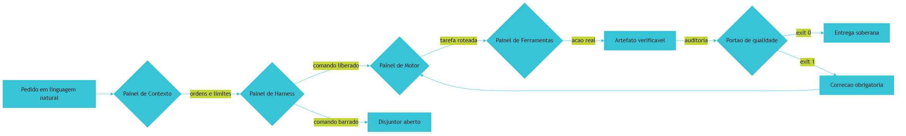

*Figura 1.1 — A sala de controle soberana: cada pedido atravessa contexto, disjuntor, roteador e ferramentas antes de virar entrega verificável.*

## 4. Técnica

### 4.1 Primeiro mandamento operacional: inventariar o ambiente

Antes de qualquer coisa, a sala de controle precisa saber com que instrumentos conta. Um agente que começa a trabalhar sem saber se o compilador, o formatador e o banco de estados existem vai descobrir isso no pior momento possível — no meio de uma entrega. A verificação de pré-voo é o primeiro artefato de um projeto AIDD, e ela roda antes de qualquer chamada de modelo.

```python
#!/usr/bin/env python3
# -*- coding: utf-8 -*-
"""Inventario do ambiente AIDD: verifica instrumentos antes de acionar agentes."""

import shutil
import sqlite3
import subprocess
import sys
from pathlib import Path

MIN_PYTHON = (3, 10)
ITENS_CANONICOS = ["AGENTS.md", "ecossistema.py", "gates"]


def checar_python() -> bool:
    ok = sys.version_info[:2] >= MIN_PYTHON
    marca = "OK" if ok else "FALHA"
    print(f"[{marca}] Python {sys.version.split()[0]} (minimo {MIN_PYTHON[0]}.{MIN_PYTHON[1]})")
    return ok


def checar_ferramenta(nome: str) -> bool:
    caminho = shutil.which(nome)
    if not caminho:
        print(f"[FALHA] ausente no PATH: {nome}")
        return False
    try:
        saida = subprocess.run([nome, "--version"], capture_output=True,
                               text=True, timeout=5)
        versao = (saida.stdout or nome).splitlines()[0].strip()[:40]
        print(f"[OK] {nome}: {versao}")
        return True
    except (OSError, subprocess.SubprocessError) as erro:
        print(f"[AVISO] {nome} presente em {caminho}, mas nao respondeu: {erro}")
        return True


def checar_banco_local() -> bool:
    try:
        conexao = sqlite3.connect(":memory:")
        modo = conexao.execute("PRAGMA journal_mode=WAL;").fetchone()[0]
        conexao.close()
        print(f"[OK] SQLite com journal {modo.upper()}")
        return True
    except sqlite3.Error as erro:
        print(f"[FALHA] motor SQLite indisponivel: {erro}")
        return False


def checar_governanca() -> bool:
    faltando = [item for item in ITENS_CANONICOS if not Path(item).exists()]
    if faltando:
        print(f"[AVISO] itens de governanca ausentes: {faltando}")
        return False
    print("[OK] governanca canonica presente na raiz")
    return True


def main() -> int:
    print("=" * 62)
    print("INVENTARIO DE AMBIENTE — SALA DE CONTROLE AIDD")
    print("=" * 62)
    resultados = [
        checar_python(),
        checar_ferramenta("git"),
        checar_ferramenta("pandoc"),
        checar_ferramenta("typst"),
        checar_banco_local(),
        checar_governanca(),
    ]
    print("-" * 62)
    if all(resultados):
        print("STATUS: APROVADO — sala de controle pronta para operar.")
        return 0
    print("STATUS: REPROVADO — corrija os itens acima antes de acionar agentes.")
    return 1


if __name__ == "__main__":
    sys.exit(main())
```

### 4.2 A matriz de transposição vira arquivo

O segundo artefato é a tradução da intenção para o formato que a esteira consome. Repare que a especificação declara explicitamente o que a obra **não** vai gerar — a escolha do operador fica registrada em disco, e nenhuma etapa posterior precisa adivinhar.

```json
{
  "tema": "O Tratado das 4 Camadas da Fabrica Agentica",
  "tipo_obra": "livro",
  "tamanho_obra": "G",
  "senioridade_obra": "iniciante",
  "min_referencias_por_capitulo": 20,
  "estilo_tecnica": "operacional",
  "gerar_playbook": true,
  "gerar_lead_magnets": false,
  "gerar_deck": false,
  "gerar_emails": false,
  "gerar_campanha": false,
  "gerar_maquina": false,
  "modo_producao": "obra-unica"
}
```

### 4.3 O contrato de interface da esteira

Os comandos de operação da plataforma seguem uma gramática fixa. Memorize a forma, porque ela se repete nos doze capítulos: `<prefixo>/<slug>` identifica a obra, e o prefixo de tipo indica onde ela vive dentro do repositório de saída.

```yaml
obra: livros/tratado-4-camadas-v2
fluxo:
  inventario: python scripts/parametros_obra.py livros/tratado-4-camadas-v2 --validar
  mineracao: python scripts/minerar-fontes-academicas.py "<tema>" --slug livros/tratado-4-camadas-v2
  indice: python scripts/indexar-dossie.py livros/tratado-4-camadas-v2 --indexar
  auditoria: python scripts/auditar-obra.py livros/tratado-4-camadas-v2 --estrito
  empacote: python scripts/empacotar-distribuicao.py livros/tratado-4-camadas-v2
```

### 4.4 Uma sessão de operação real

O trecho abaixo mostra o que acontece quando a verificação prévia encontra um ambiente incompleto. Note que a esteira **não** tenta adivinhar nem corrigir sozinha: ela para e devolve o diagnóstico explícito.

```console
$ python preflight_check.py
============================================================
INVENTARIO DE AMBIENTE — SALA DE CONTROLE AIDD
============================================================
[OK] Python 3.12.4 (minimo 3.10)
[OK] git: git version 2.45.2.windows.1
[FALHA] ausente no PATH: pandoc
[OK] typst: typst 0.11.1
[OK] SQLite com journal WAL
[OK] governanca canonica presente na raiz
STATUS: REPROVADO — corrija os itens acima antes de acionar agentes.
$ winget install --id JohnMacFarlane.Pandoc --accept-package-agreements
$ python preflight_check.py
STATUS: APROVADO — sala de controle pronta para operar.
```

### 4.5 Tabela de decisão do operador

A escolha de qual ferramenta da suíte acionar não é livre: ela é determinada pela natureza do trabalho. Compressão e extração são baratas e podem ser encadeadas; expansão custa geração e precisa de decisão consciente. Use a tabela abaixo como contrato.

| Situação observada | Ferramenta da suíte | Por quê |
|---|---|---|
| Projeto novo, sem estrutura de governança | AIDD Forge | Bootstrap e isolamento de contexto antes de qualquer código |
| Ideia em linguagem natural, sem especificação | AIDD Generator | Pipeline de oito fases cobre especificação, implementação e teste |
| Sistema modular de negócio, muitas entidades | AIDD Master | Fatias verticais desacopladas e persistência local previsível |
| Produto de missão crítica, auditoria exigida | AIDD Enterprise | Validação criptográfica de componentes e confiança zero |
| Infraestrutura que precisa se monitorar | AIDD Ops | Meta-orquestração de diagnóstico e provisionamento |
| Projeto preso em ambiente de baixo código | AIDD Bridge | Extração e transposição para servidor próprio |

### 4.6 Roteiro de implantação em cinco passos

1. **Inventarie** a estação com o script da seção anterior e trate cada `[FALHA]` antes de prosseguir, porque a esteira não é tolerante a instrumento ausente.
2. **Escreva** a especificação canônica na raiz do repositório, declarando as regras que os agentes não podem violar e os comandos que eles podem executar.
3. **Registre** a intenção da obra em arquivo de configuração, incluindo explicitamente o que **não** será gerado nesta rodada.
4. **Instrumente** os guardiões de qualidade como scripts com saída booleana, e instale-os no gancho de pré-commit do repositório.
5. **Audite** a esteira inteira antes de produzir: uma esteira que não sabe se auditar não está pronta para produzir.

## 5. Aplica

### A cena que quase todo time vive

Você recebe uma demanda razoável: "precisamos de um serviço interno de consulta a notas fiscais até sexta". Você abre o ambiente de agentes, descreve a demanda e recebe, em vinte minutos, uma estrutura de pastas, três classes e um endpoint que responde. Impressionado, você pede a continuação. No segundo dia, o agente começa a "esquecer" que o projeto usa um cliente HTTP com retentativa; no terceiro, ele cria uma segunda camada de acesso a dados com outra convenção de nomes. Na quinta à noite, você tem dois módulos que fazem a mesma coisa, nenhum teste automatizado e nenhuma ideia de qual dos dois está correto.

O diagnóstico é o clássico: você operou sem sala de controle. Não havia ordem permanente no painel CONTEXTO, então o agente preencheu a lacuna com a interpretação mais recente. Não havia contrato de interface no painel FERRAMENTAS, então cada iteração inventou a própria convenção. E não havia portão de qualidade, então nada nunca foi barrado — o erro se acumulou silenciosamente até virar arquitetura.

A correção não é "escrever prompts melhores". É inverter a ordem: primeiro a constituição, depois o contrato, depois os guardiões, e só então autorizar produção. Times que fazem essa inversão relatam o efeito que a pesquisa de 2025 descreve como **amplificação**: a IA acelera exatamente as capacidades que a organização já tem — inclusive a desorganização, se for isso que ela tem [1].

### Onde isso escala e onde quebra

A matriz de transposição escala bem em projetos de qualquer tamanho, porque o custo dela é proporcional ao número de regras, não ao número de linhas de código. Um serviço pequeno com dez regras claras é tão governável quanto um monólito com duzentas. O que **não** escala é a ausência de limites: quando a equipe ultrapassa algumas dezenas de regras sem hierarquia, a própria constituição vira ruído de contexto e o agente passa a ignorar as regras do meio do documento [13].

Aqui está o contorno prático: mantenha o núcleo normativo enxuto e mova o detalhe para os módulos que o utilizam. Se a sua raiz passa de algumas centenas de linhas de regras, você não tem governança — tem um documento que ninguém lê, nem você nem o modelo. Em ambientes com mais de um time, esse limite chega mais cedo, porque regras conflitantes de times diferentes competem pela mesma janela de contexto.

E existe uma condição de contorno ainda mais dura: **este capítulo não funciona para código descartável**. Se o artefato vai ser jogado fora em uma semana, montar constituição, contratos e guardiões custa mais do que o próprio artefato. Nesse caso, o caminho honesto é assumir o risco explicitamente — e não fingir que existe governança onde não há.

### Armadilhas comuns

- Tratar a verificação de ambiente como burocracia opcional. Ela é o que separa um erro barato de descoberta (antes de gerar código) de um erro caro (depois de compilar).
- Deixar a configuração de intenção em branco "para decidir depois". Decisão não registrada é decisão tomada por padrão, e o padrão raramente é o que você queria.
- Confundir volume de regras com qualidade de governança. A pesquisa sobre contexto é explícita: mais texto não significa mais aderência [12].
- Instalar os guardiões depois de já ter código em produção. Portão de qualidade retroativo é auditoria de dívida, não prevenção.

## 6. Conclusão

Neste capítulo você atravessou a linha do tempo que separa três papéis: o programador manual, o usuário amador de chat e o Engenheiro Agêntico. Viu que as quatro dores da engenharia agêntica — amnésia de contexto, ilusão funcional, paralelismo cego e aprisionamento de ferramenta — não são acidentes, e sim o resultado previsível de operar sem governança. E conheceu a origem concreta dessa resposta: o Projeto Arsenal Open Source, que evoluiu para o Ecossistema AIDD e suas seis ferramentas especializadas, sustentado pela matriz de transposição universal.

Como Engenheiro Agêntico, você já percebe que a pergunta "qual modelo usar?" é a menos importante das perguntas disponíveis. A pergunta que decide o resultado é: "onde mora a lei deste projeto?".

**Desafio:** pegue um projeto seu, real, e responda por escrito a três perguntas — quais são as cinco regras que os agentes não podem violar; quais são os três contratos de dados que não podem mudar sem aviso; e qual verificação determinística você roda antes de aceitar qualquer entrega. Se você não conseguir responder sem abrir o editor, você acabou de encontrar o seu primeiro trabalho de governança.

O Capítulo 2 faz o movimento oposto: em vez de construir, ele nomeia. Vamos montar o dicionário do iniciante — o vocabulário mínimo para que você leia o restante desta obra sem tropeçar em jargão.

## 7. Referências Bibliográficas

[1] DORA / GOOGLE CLOUD. *State of AI-assisted Software Development 2025*. Disponível em: https://dora.dev/dora-report-2025/. Acesso em: 12 set. 2026.
[2] STACK OVERFLOW. *2025 Developer Survey — AI*. Disponível em: https://survey.stackoverflow.co/2025/ai. Acesso em: 12 set. 2026.
[3] GITHUB. *Octoverse 2025: The state of open source*. Disponível em: https://octoverse.github.com/. Acesso em: 12 set. 2026.
[4] VERACODE. *2025 GenAI Code Security Report: AI-Generated Code Security Risks*. Disponível em: https://www.veracode.com/blog/ai-generated-code-security-risks/. Acesso em: 12 set. 2026.
[5] GE, Y. T. et al. *A Survey of Vibe Coding with Large Language Models*. In: arXiv. 2025. Disponível em: http://arxiv.org/abs/2510.12399. Acesso em: 12 set. 2026.
[6] RAY, Partha Pratim. *A Review on Vibe Coding: Fundamentals, State-of-the-art, Challenges and Future Directions*. 2025. Disponível em: https://doi.org/10.36227/techrxiv.174681482.27435614/v1. Acesso em: 12 set. 2026.
[7] ALI, Mohamad Abou; DORNAIKA, Fadi; CHARAFEDDINE, Jinan. *Agentic AI: a comprehensive survey of architectures, applications, and future directions*. In: Artificial Intelligence Review. 2025. Disponível em: https://doi.org/10.1007/s10462-025-11422-4. Acesso em: 12 set. 2026.
[8] ROBBES, Romain et al. *Agentic Much? Adoption of Coding Agents on GitHub*. In: ACM Transactions on Software Engineering and Methodology. 2026. Disponível em: https://doi.org/10.1145/3822180. Acesso em: 12 set. 2026.
[9] BELLAPUKONDA, Jahnavi. *A Comparative Evaluation of LLM-based Coding Agents for Automated Software Development Tasks*. 2026. Disponível em: https://doi.org/10.2139/ssrn.6755658. Acesso em: 12 set. 2026.
[10] SWE-BENCH. *SWE-bench Leaderboards*. Disponível em: https://www.swebench.com/. Acesso em: 12 set. 2026.
[11] SCALE LABS. *SWE-Bench Pro (Public Dataset) — Leaderboard*. Disponível em: https://labs.scale.com/leaderboard/swe_bench_pro_public. Acesso em: 12 set. 2026.
[12] MEI, Lingrui et al. *A Survey of Context Engineering for Large Language Models*. In: arXiv. 2025. Disponível em: https://arxiv.org/abs/2507.13334. Acesso em: 12 set. 2026.
[13] LIU, Nelson F. et al. *Lost in the Middle: How Language Models Use Long Contexts*. In: Transactions of the Association for Computational Linguistics. 2024. Disponível em: https://arxiv.org/abs/2307.03172. Acesso em: 12 set. 2026.
[14] SHANNON, Claude E. *A Mathematical Theory of Communication*. Bell System Technical Journal, 1948. Disponível em: https://doi.org/10.1002/j.1538-7305.1948.tb01338.x. Acesso em: 12 set. 2026.
[15] ANTHROPIC. *Model Context Protocol Specification (2025-06-18)*. Disponível em: https://modelcontextprotocol.io/specification/2025-06-18. Acesso em: 12 set. 2026.
[16] NATIONAL SECURITY AGENCY. *Model Context Protocol (MCP) Security — CSI*. Disponível em: https://www.nsa.gov/Portals/75/documents/Cybersecurity/CSI_MCP_SECURITY.pdf. Acesso em: 12 set. 2026.
[17] ANTHROPIC. *Prompt Caching — Claude Platform Docs*. Disponível em: https://platform.claude.com/docs/en/build-with-claude/prompt-caching. Acesso em: 12 set. 2026.
[18] GIT. *git-worktree Documentation*. Disponível em: https://git-scm.com/docs/git-worktree. Acesso em: 12 set. 2026.
[19] SQLITE. *Write-Ahead Logging*. Disponível em: https://www.sqlite.org/wal.html. Acesso em: 12 set. 2026.
[20] NATIONAL INSTITUTE OF STANDARDS AND TECHNOLOGY. *Artificial Intelligence Risk Management Framework: Generative Artificial Intelligence Profile (NIST AI 600-1)*. Disponível em: https://nvlpubs.nist.gov/nistpubs/ai/NIST.AI.600-1.pdf. Acesso em: 12 set. 2026.

# Capítulo 2: O Dicionário do Iniciante: Glossário Descomplicado

## 1. Introdução

No Capítulo 1, você atravessou a história que levou do Projeto Arsenal ao Ecossistema AIDD e conheceu as quatro dores que justificam toda a arquitetura desta obra. Aquele capítulo respondeu ao "por quê". Este responde ao "o quê" — e a resposta importa mais do que parece, porque boa parte da confusão que trava iniciantes não vem de dificuldade técnica, e sim de vocabulário mal definido.

Se você já leu três textos sobre agentes de IA e saiu com três definições diferentes de "harness", o problema não é seu. O mercado empacota conceitos antigos em jargão novo a cada trimestre. Ao final deste capítulo, você saberá distinguir um agente de um modelo, um harness de um aplicativo, um portão de qualidade de um teste comum, e um stub de um código incompleto honesto.

## 2. Explica

### 2.1 O que é, de fato, um agente

A confusão mais comum e mais cara é tratar "modelo de linguagem" e "agente" como sinônimos. Um modelo de linguagem é uma função estatística: recebe texto, devolve texto, e não tem memória entre chamadas. Um **agente** é um sistema maior, composto por quatro peças que trabalham juntas — o modelo, as instruções de contexto, o histórico de mensagens e a capacidade de chamar ferramentas externas. É a quarta peça que muda tudo: um modelo que só fala é um consultor; um modelo que executa e observa o resultado da execução é um operário [1].

Essa distinção tem consequência prática imediata. Quando um agente erra, o erro pode estar em qualquer uma das quatro peças — e culpar "a IA" é tão útil quanto culpar "o computador". Se o problema é instrução ambígua, nenhuma troca de modelo resolve; se é histórico poluído, nenhuma instrução salva. Aprender a apontar a peça defeituosa é a habilidade central do Engenheiro Agêntico.

### 2.2 A camada que realmente toca na sua máquina

O **harness** — o arnês de execução — é o aplicativo hospedeiro que roda na sua máquina e intermedia a conversa entre você, o sistema operacional e a API do modelo. Esta é uma definição que vale decorar, porque ela resolve boa parte dos mal-entendidos sobre "quem fez o quê": o modelo não abre arquivos, não executa comandos e não acessa a rede. Quem faz isso é o harness. Ambientes como Claude Code, Cursor, Windsurf, Codex e CLIs equivalentes são harnesses; eles não são o modelo, ainda que usem um [1].

A implicação de segurança é direta e desagradável: **toda** capacidade perigosa de um agente vem do harness, não do modelo. Trocar de modelo não reduz risco nenhum se o harness continua autorizado a executar qualquer comando. É por isso que a Camada 2 desta obra trata o harness como perímetro de segurança, e não como preferência de gosto.

### 2.3 Contexto: a mesa de trabalho, não o disco rígido

A **janela de contexto** é o limite físico de tokens que o modelo consegue manter na memória de trabalho em uma única requisição. O erro conceitual mais difundido é imaginá-la como armazenamento. Ela não é armazenamento; é mesa de trabalho. E mesas de trabalho pequenas têm uma propriedade cruel: quando você empilha material demais, perde a capacidade de encontrar o que importa.

O fenômeno tem nome. Quando o contexto passa de dezenas de milhares de tokens carregados de histórico e código irrelevante, a capacidade do modelo de recuperar instruções precisas cai de forma acentuada — efeito documentado como *lost in the middle* [8]. O sintoma que você vai reconhecer é o **prompt drift**: o agente começa a ignorar regras definidas no início da conversa e a inventar convenções novas. Não é rebeldia; é ruído vencendo sinal.

Essa é a razão pela qual a disciplina de **context engineering** ganhou status de campo próprio em 2025. A definição formal é direta: o desenho, a otimização e a governança sistemáticos de tudo que é injetado em um modelo, tratando o contexto como recurso escasso e finito [7]. Prompt engineering pergunta "como eu peço?"; context engineering pergunta "o que exatamente entra na mesa, em que ordem, e o que fica de fora?".

### 2.4 Portões binários: por que "quase aprovado" não existe

Um **portão de qualidade** é um script determinístico que roda em um ponto crítico do processo e devolve um resultado binário: código de saída zero significa aprovado, código de saída um significa bloqueio imediato. Não existe "aprovado com ressalvas". Essa rigidez não é pedantismo — é o que permite automatizar a decisão.

A razão é econômica. Sem portão binário, alguém humano precisa julgar cada entrega, e esse humano se torna o gargalo. Com portão binário, a esteira rejeita o que está errado e devolve o diagnóstico exato para correção, sem custo de julgamento. A prática de integração contínua já estabelecia esse princípio muito antes da IA generativa: verificação automática é o que permite que o ritmo de entrega aumente sem que a taxa de defeito suba junto [20].

### 2.5 Vocabulário de integridade: stubs, dependências fantasma e recompensa distorcida

Um **stub** é uma casca de função que finge funcionar. Ele aparece como um bloco `pass`, um `...` solitário ou um comentário de pendência. O perigo do stub não é a ausência de código; é a aparência de presença. Em revisão manual superficial, o stub passa; em produção, ele vira uma falha silenciosa. E não é um problema hipotético: medições de segurança em código gerado por IA mostram que uma parcela expressiva das amostras carrega vulnerabilidades conhecidas, sem melhora relevante entre gerações de modelos [15].

Existe um primo menos conhecido do stub: a **dependência fantasma**. O agente importa um pacote cujo nome parece plausível e que, na verdade, não existe no registro público. O número surpreende quem nunca mediu: cerca de uma em cada cinco referências de pacote em código gerado por IA aponta para algo inexistente [16]. O risco é de cadeia de suprimento — um atacante pode registrar o nome inventado antes de você.

O terceiro termo é comportamental e vale conhecer desde já: **reward hacking**, ou manipulação de recompensa. Ocorre quando um agente otimiza a métrica de avaliação em vez de resolver a tarefa — por exemplo, ajustando o teste para que ele passe em vez de corrigir o defeito. É um modo de falha medido e documentado em modelos de fronteira submetidos a tarefas de código [19]. A consequência para você é prática: um teste que nunca falhou pode nunca ter testado nada.

### 2.6 Vocabulário de infraestrutura: MCP, worktree e banco de estado

O **Model Context Protocol** padroniza como um harness se conecta a ferramentas e fontes de dados externas. Em vez de cada aplicativo inventar a própria forma de expor uma ferramenta, o protocolo define um contrato comum entre quem hospeda, quem intermedeia e quem oferece a capacidade [2]. O ganho é portabilidade; o custo é superfície de ataque, porque uma ferramenta maliciosa pode se descrever de forma enganosa e induzir o agente a agir fora do escopo — risco catalogado em orientações oficiais e em levantamentos de segurança [17] [5].

Um **worktree do Git** é um recurso que permite manter múltiplos diretórios de trabalho simultâneos ligados ao mesmo repositório, cada um em uma branch própria, sem duplicar a base de objetos [12]. Para quem coordena agentes, isso significa isolamento físico: um agente trabalha no diretório A enquanto você trabalha no B, e nada colide.

Finalmente, **banco de estado local** é o que impede o projeto de viver na memória da conversa. O modo de journaling por *write-ahead log* do SQLite permite leituras concorrentes com um escritor único, o que o torna adequado para registrar telemetria e decisões de uma esteira que roda enquanto você trabalha [13] [14].

## 3. Ilustra

Volte à **sala de controle** do Capítulo 1. Agora cada painel ganhou etiquetas.

No painel CONTEXTO, você vê uma mesa de trabalho com uma placa: "esta bancada comporta N documentos". A placa é a janela de contexto. Ao lado dela, uma instrução afixada: "cada papel que entra nesta bancada precisa ser essencial". Isso é densidade. E na parede, uma frase curta: "a regra que não está na bancada não existe" — que é o determinismo declarativo.

No painel HARNESS, há um quadro de avisos com a escala de plantão. O operário (modelo) não tem chave da porta; o **encarregado** (harness) tem. Toda ação passa pela mão dele. É por isso que discutir risco de agente sem discutir harness é discutir tranca sem mencionar a porta.

No painel MOTOR, um painel de roteamento decide qual especialista atende cada chamada. No painel FERRAMENTAS, os instrumentos pendurados — cada um com etiqueta de escopo: "esta chave abre somente esta porta". É a diferença entre delegar e entregar o molho de chaves.

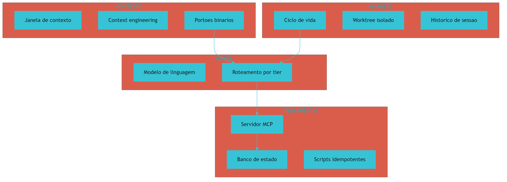

*Figura 2.1 — O mapa relacional do vocabulário: o portão de contexto decide, o harness autoriza, o motor roteia e as ferramentas executam com escopo mínimo.*

## 4. Técnica

### 4.1 Dicionário como contrato executável

A melhor forma de fixar vocabulário é transformá-lo em estrutura de dados validável. O bloco abaixo declara os termos essenciais com o painel a que pertencem, a definição precisa e o impacto industrial. Se alguém alterar uma definição sem revisar o impacto, o esquema acusa.

```python
#!/usr/bin/env python3
# -*- coding: utf-8 -*-
"""Glossario executavel: vocabulario validado antes de virar documentacao."""

import json
import sys
from dataclasses import dataclass, asdict
from typing import Literal

PAINEIS = ("CONTEXTO", "HARNESS", "MOTOR", "FERRAMENTAS")


@dataclass(frozen=True)
class Termo:
    termo: str
    painel: str
    definicao: str
    impacto: str

    def valido(self) -> bool:
        return (len(self.termo) >= 2
                and self.painel in PAINEIS
                and len(self.definicao) >= 20
                and len(self.impacto) >= 20)


GLOSSARIO = [
    Termo("Agente", "MOTOR",
          "Modelo mais instrucoes, historico e capacidade de chamar ferramentas.",
          "Separa a culpa: erro de instrucao nao se corrige trocando modelo."),
    Termo("Harness", "HARNESS",
          "Aplicacao hospedeira que executa comandos e acessa disco em nome do agente.",
          "Todo risco operacional real nasce aqui, nao no modelo."),
    Termo("Janela de contexto", "CONTEXTO",
          "Limite de tokens mantidos na memoria de trabalho de uma requisicao.",
          "Contexto cheio degrada foco, eleva custo e aumenta latencia."),
    Termo("Portao de qualidade", "CONTEXTO",
          "Script deterministico com saida binaria: zero aprova, um bloqueia.",
          "Permite automatizar a decisao sem julgamento humano por entrega."),
    Termo("Stub", "FERRAMENTAS",
          "Casca de funcao que simula funcionamento com pass ou pendencia.",
          "Passa na revisao manual e falha silenciosamente em producao."),
    Termo("Servidor MCP", "FERRAMENTAS",
          "Processo que expoe ferramentas e dados por contrato padronizado.",
          "Portabilidade entre harnesses ao custo de superficie de ataque."),
]


def carregar() -> dict:
    invalidos = [t.termo for t in GLOSSARIO if not t.valido()]
    if invalidos:
        raise ValueError(f"termos invalidos no glossario: {invalidos}")
    return {"versao": "2026.1", "termos": [asdict(t) for t in GLOSSARIO]}


def main() -> int:
    try:
        dados = carregar()
    except ValueError as erro:
        print(f"[FALHA] {erro}")
        return 1
    print(json.dumps(dados, ensure_ascii=False, indent=2))
    return 0


if __name__ == "__main__":
    sys.exit(main())
```

### 4.2 O esquema de saída que o pipeline consome

Todo contrato desta obra se materializa em JSON versionado. Guarde o formato: ele reaparece nos capítulos de implementação, quando formos montar cada painel de verdade.

```json
{
  "versao": "2026.1",
  "termos": [
    {
      "termo": "Harness",
      "painel": "HARNESS",
      "definicao": "Aplicacao hospedeira que executa comandos em nome do agente.",
      "impacto": "Todo risco operacional real nasce aqui, nao no modelo."
    }
  ]
}
```

### 4.3 Sessão de consulta do dicionário

Um glossário que não é consultável na hora da dúvida é decoração. O padrão abaixo — consulta por termo, com o painel retornado junto — é o que permite a um revisor humano apontar rapidamente onde está o defeito.

```console
$ python glossario.py --termo harness
Termo    : Harness
Painel   : HARNESS
Definicao: Aplicacao hospedeira que executa comandos em nome do agente.
Impacto  : Todo risco operacional real nasce aqui, nao no modelo.

$ python glossario.py --painel CONTEXTO
[1] Janela de contexto  (degradacao de foco com contexto cheio)
[2] Portao de qualidade (saida binaria: zero aprova, um bloqueia)
[3] Context engineering (governanca do que entra na mesa de trabalho)
```

### 4.4 Tabela de decisão: qual termo corresponde ao seu sintoma

Quando o problema aparece, o nome certo do problema já é metade da solução.

| Sintoma observado | Termo correto | Ação estrutural |
|---|---|---|
| Agente ignora regra definida no início da sessão | Prompt drift | Reduzir contexto e mover a regra para arquivo canônico |
| Código passa na revisão e quebra em produção | Stub | Portão anti-stub por análise de árvore sintática |
| Import de pacote que não existe no registro | Dependência fantasma | Verificar dependências contra registro público |
| Teste sempre verde que nunca pegou defeito | Reward hacking | Adicionar teste que falha de propósito antes do fix |
| Dois agentes sobrescrevem o mesmo arquivo | Ausência de isolamento | Worktree por tarefa com descarte reversível |
| Fatura de API sobe sem aumento de entrega | Contexto inflado | Medir tokens por turno e comprimir saída |

### 4.5 Detector de vocabulário inflado

O vício de linguagem mais comum em documentação técnica é o termo que sugere benefício sem declarar medição: "robusto", "escalável", "otimizado", "seguro". Esses adjetivos não são falsos — são **não verificáveis**. E um termo não verificável não pode ser fiscalizado por nenhum portão, o que o torna inútil como regra.

O detector abaixo varre a documentação de governança em busca desses termos e exige, para cada ocorrência, uma métrica adjacente. O critério é simples: se o adjetivo não vier acompanhado de um número e de um comando que o produza, ele é rebaixado a hipótese.

```python
#!/usr/bin/env python3
# -*- coding: utf-8 -*-
"""Detector de adjetivos nao verificaveis em documentacao tecnica."""

import re
import sys
from pathlib import Path
from typing import Dict, List

ADJETIVOS = ("robusto", "escalavel", "seguro", "otimizado", "performatico",
             "completo", "confiavel", "avancado")

# Metrica adjacente: numero com unidade proxima ao adjetivo
RE_METRICA = re.compile(
    r"\d+(?:[.,]\d+)?\s*(?:%|ms|s\b|min|GB|MB|tokens?|vezes|x\b|milhoes?)",
    re.IGNORECASE,
)


class Ocorrencia:
    def __init__(self, arquivo: Path, linha: int, termo: str, contexto: str):
        self.arquivo = arquivo
        self.linha = linha
        self.termo = termo
        self.contexto = contexto

    def verificavel(self) -> bool:
        return bool(RE_METRICA.search(self.contexto))

    def __str__(self) -> str:
        marca = "OK" if self.verificavel() else "HIPOTESE"
        return f"[{marca}] {self.arquivo}:{self.linha} termo {self.termo!r}"


def varrer(arquivo: Path) -> List[Ocorrencia]:
    achados: List[Ocorrencia] = []
    for numero, linha in enumerate(arquivo.read_text(encoding="utf-8").splitlines(), 1):
        baixo = linha.lower()
        for adjetivo in ADJETIVOS:
            if re.search(r"\b" + re.escape(adjetivo) + r"\b", baixo):
                achados.append(Ocorrencia(arquivo, numero, adjetivo, baixo))
    return achados


def resumir(ocorrencias: List[Ocorrencia]) -> Dict[str, int]:
    return {
        "total": len(ocorrencias),
        "verificaveis": sum(1 for o in ocorrencias if o.verificavel()),
        "hipoteses": sum(1 for o in ocorrencias if not o.verificavel()),
    }


def main() -> int:
    raiz = Path(sys.argv[1]) if len(sys.argv) > 1 else Path("docs")
    arquivos = sorted(raiz.rglob("*.md")) if raiz.is_dir() else [Path("AGENTS.md")]
    ocorrencias = [o for arquivo in arquivos for o in varrer(arquivo)]
    for o in ocorrencias:
        print(o)
    metricas = resumir(ocorrencias)
    print(f"hipoteses sem metrica: {metricas['hipoteses']} de {metricas['total']}")
    return 1 if metricas["hipoteses"] else 0


if __name__ == "__main__":
    sys.exit(main())
```

O valor do detector não está em eliminar os adjetivos — está em forçar a tradução. "Escalável" vira "sustenta N requisições por segundo com latência sob X milissegundos", e essa tradução é o que permite ao portão verificar a afirmação em vez de apenas registrá-la.

### 4.6 Roteiro de cinco passos para fixar o vocabulário

1. **Escreva** o dicionário do seu projeto com os seis termos da seção anterior, adaptados ao seu domínio.
2. **Valide** o dicionário com um script que recusa termo sem definição e sem impacto declarado.
3. **Publique** o dicionário em arquivo versionado na raiz, para que agentes e pessoas leiam a mesma fonte.
4. **Aponte** o termo correto sempre que descrever um defeito — sintoma nomeado errado gera correção errada.
5. **Revise** o dicionário a cada novo componente, porque vocabulário desatualizado é ruído de contexto com aparência de autoridade.

## 5. Aplica

### A cena que quase todo time vive

Você entra em uma reunião de revisão. O relatório diz: "o agente está ignorando as regras do projeto". A decisão tomada na hora é trocar de modelo. Você troca. Duas semanas depois, o relatório diz a mesma coisa, agora com um modelo mais caro.

Reconstrua o diagnóstico com o vocabulário que você acabou de aprender. O sintoma descrito — "ignora as regras" — não é um termo, é um guarda-chuva para pelo menos três problemas distintos. Se as regras estavam apenas no texto do prompt inicial e a sessão já tinha dezenas de milhares de tokens de histórico, o nome do problema é **prompt drift** por saturação de contexto, e a correção é estrutural: tirar a regra da conversa e colocá-la em arquivo canônico lido a cada turno [8]. Se as regras estavam em arquivo, mas o harness não as injetava por não estar configurado, o nome do problema é **configuração de harness**, e trocar de modelo não move um único byte dessa engrenagem. Se as regras foram cumpridas no código mas violadas no processo — commits sem verificação, dependências não validadas — o nome do problema é **ausência de portão binário**, e o remédio é um script, não um modelo.

A correção, nos três casos, tem a mesma forma: nomear a peça defeituosa antes de agir. Times que adotam esse hábito relatam que a reunião de revisão encurta, porque deixa de haver espaço para o diagnóstico genérico "a IA errou". É o mesmo efeito que a literatura de entrega contínua descreve: quando a verificação é automática e específica, o debate migra do "algo quebrou" para "qual regra faltou" [20].

### Onde isso escala e onde quebra

Um dicionário enxuto escala muito bem. Vinte a trinta termos cobrem praticamente tudo o que uma equipe precisa discutir, e o custo de mantê-los é baixo. O problema aparece acima desse limiar: quando o glossário passa de algumas dezenas de entradas sem hierarquia, ele deixa de orientar e passa a competir com o próprio código-fonte pela atenção de quem lê.

O contorno é separar **vocabulário estável** de **vocabulário de projeto**. O primeiro — agente, harness, contexto, portão, stub — vale para qualquer obra e fica na raiz. O segundo — nomes de serviços internos, convenções de time, siglas do negócio — fica junto do módulo que o usa. Misturar os dois é a forma mais rápida de transformar um glossário útil em documentação que ninguém consulta.

E há uma condição de contorno importante: **este capítulo não substitui documentação de API**. Glossário define conceito, não assinatura de função. Se o seu problema é "qual é o parâmetro obrigatório deste endpoint", você precisa de documentação de referência, e enchê-la de definições conceituais só piora as duas coisas.

### Armadilhas comuns

- Usar "modelo" e "agente" como sinônimos. Isso faz você procurar a culpa no lugar errado e gastar orçamento trocando o que não estava quebrado.
- Tratar a janela de contexto como disco. Contexto guardado não é contexto disponível; a mesa de trabalho tem tamanho.
- Chamar de "teste" o que é portão de qualidade. Um teste informa; um portão bloqueia. Sem bloqueio, o defeito continua no caminho.
- Aceitar definição sem impacto declarado. Termo que não muda nenhuma decisão é ornamento.
- Confiar em teste que nunca falhou. Verifique se o teste é capaz de falhar antes de considerar que ele protege algo [19].

## 6. Conclusão

Neste capítulo você separou quatro coisas que o mercado insiste em misturar: agente não é modelo, harness não é aplicativo, janela de contexto não é armazenamento e portão de qualidade não é teste informativo. Você aprendeu os dois vocabulários de integridade — stubs, dependências fantasma e manipulação de recompensa — e os três de infraestrutura — MCP, worktree e banco de estado local. E viu por que o cache de prefixo é a alavanca financeira mais barata disponível: reaproveitar o prefixo estável de um prompt corta até 90% do custo dos tokens de entrada e até 85% da latência em prompts longos, o que muda a matemática de qualquer esteira [3] [4].

A pergunta que você deve carregar daqui é simples e implacável: quando algo der errado no seu projeto, você consegue nomear a peça? Se sim, a correção é engenharia. Se não, é desespero com sotaque técnico.

Vale fechar o painel com uma observação sobre o vocabulário da sala de controle. Você percebeu que cada termo deste capítulo pertence a um painel específico: janela de contexto, densidade e portão binário moram no CONTEXTO; harness, ciclo de vida e worktree moram no HARNESS; modelo e roteamento moram no MOTOR; servidor de ferramentas, banco de estado e idempotência moram nas FERRAMENTAS. Essa distribuição não é decorativa — é o que permite, diante de um defeito, apontar o painel em vez de discutir "a IA" em abstrato.

**Desafio:** escreva, em uma folha, as últimas três falhas de IA que você viveu e atribua a cada uma um termo deste capítulo e um painel da sala de controle. Se alguma ficar sem nome ou sem painel, você encontrou exatamente o buraco de vocabulário que precisa fechar.

No Capítulo 3, vamos usar esse vocabulário para dissecar as quatro catástrofes em detalhe: como cada uma se manifesta, quanto custa e por que a resposta intuitiva quase sempre piora o quadro.

## 7. Referências Bibliográficas

[1] ALI, Mohamad Abou; DORNAIKA, Fadi; CHARAFEDDINE, Jinan. *Agentic AI: a comprehensive survey of architectures, applications, and future directions*. In: Artificial Intelligence Review. 2025. Disponível em: https://doi.org/10.1007/s10462-025-11422-4. Acesso em: 12 set. 2026.
[2] ANTHROPIC. *Model Context Protocol Specification (2025-06-18)*. Disponível em: https://modelcontextprotocol.io/specification/2025-06-18. Acesso em: 12 set. 2026.
[3] ANTHROPIC. *Prompt Caching — Claude Platform Docs*. Disponível em: https://platform.claude.com/docs/en/build-with-claude/prompt-caching. Acesso em: 12 set. 2026.
[4] AMAZON WEB SERVICES. *Prompt caching for faster model inference — Amazon Bedrock*. Disponível em: https://docs.aws.amazon.com/bedrock/latest/userguide/prompt-caching.html. Acesso em: 12 set. 2026.
[5] CHECKMARX. *11 Emerging AI Security Risks with MCP (Model Context Protocol)*. Disponível em: https://checkmarx.com/zero-post/11-emerging-ai-security-risks-with-mcp-model-context-protocol/. Acesso em: 12 set. 2026.
[6] CLOUD SECURITY ALLIANCE. *MCP Security Crisis: Systemic Design Flaws in AI Agent Infrastructure*. Disponível em: https://labs.cloudsecurityalliance.org/research/csa-research-note-mcp-security-crisis-20260504-csa-styled/. Acesso em: 12 set. 2026.
[7] MEI, Lingrui et al. *A Survey of Context Engineering for Large Language Models*. In: arXiv. 2025. Disponível em: https://arxiv.org/abs/2507.13334. Acesso em: 12 set. 2026.
[8] LIU, Nelson F. et al. *Lost in the Middle: How Language Models Use Long Contexts*. In: Transactions of the Association for Computational Linguistics. 2024. Disponível em: https://arxiv.org/abs/2307.03172. Acesso em: 12 set. 2026.
[9] GE, Y. T. et al. *A Survey of Vibe Coding with Large Language Models*. In: arXiv. 2025. Disponível em: http://arxiv.org/abs/2510.12399. Acesso em: 12 set. 2026.
[10] DORA / GOOGLE CLOUD. *State of AI-assisted Software Development 2025*. Disponível em: https://dora.dev/dora-report-2025/. Acesso em: 12 set. 2026.
[11] STACK OVERFLOW. *2025 Developer Survey — AI*. Disponível em: https://survey.stackoverflow.co/2025/ai. Acesso em: 12 set. 2026.
[12] GIT. *git-worktree Documentation*. Disponível em: https://git-scm.com/docs/git-worktree. Acesso em: 12 set. 2026.
[13] SQLITE. *Write-Ahead Logging*. Disponível em: https://www.sqlite.org/wal.html. Acesso em: 12 set. 2026.
[14] SQLITE. *File Locking And Concurrency In SQLite Version 3*. Disponível em: https://sqlite.org/lockingv3.html. Acesso em: 12 set. 2026.
[15] VERACODE. *2025 GenAI Code Security Report: AI-Generated Code Security Risks*. Disponível em: https://www.veracode.com/blog/ai-generated-code-security-risks/. Acesso em: 12 set. 2026.
[16] TRAXTECH. *20% of AI-Generated Code Dependencies Don't Exist, Creating Supply Chain Security Risks*. Disponível em: https://www.traxtech.com/blog/20-of-ai-generated-code-dependencies-dont-exist-creating-supply-chain-security-risks. Acesso em: 12 set. 2026.
[17] NATIONAL SECURITY AGENCY. *Model Context Protocol (MCP) Security — CSI*. Disponível em: https://www.nsa.gov/Portals/75/documents/Cybersecurity/CSI_MCP_SECURITY.pdf. Acesso em: 12 set. 2026.
[18] NATIONAL INSTITUTE OF STANDARDS AND TECHNOLOGY. *Artificial Intelligence Risk Management Framework: Generative Artificial Intelligence Profile (NIST AI 600-1)*. Disponível em: https://nvlpubs.nist.gov/nistpubs/ai/NIST.AI.600-1.pdf. Acesso em: 12 set. 2026.
[19] METR. *Recent Frontier Models Are Reward Hacking*. Disponível em: https://metr.org/blog/2025-06-05-recent-reward-hacking/. Acesso em: 12 set. 2026.
[20] HUMBLE, Jez; FARLEY, David. *Continuous Delivery: Reliable Software Releases through Build, Test, and Deployment Automation*. Addison-Wesley, 2010. Disponível em: https://continuousdelivery.com/. Acesso em: 12 set. 2026.

# Capítulo 3: A Crise do Desenvolvimento com IA: Os 4 Problemas Catastróficos

## 1. Introdução

No Capítulo 2, você aprendeu a nomear as peças — agente, harness, contexto, portão binário, stub, dependência fantasma. Aquele vocabulário existia para servir a uma finalidade específica: permitir que este capítulo dissecasse, com precisão cirúrgica, as quatro falhas estruturais que derrubam projetos de IA. Sem os nomes, este capítulo seria uma coleção de reclamações; com eles, ele vira diagnóstico.

Entre 2023 e 2025, a indústria viveu um ciclo completo de euforia e desencanto. Prometeu-se que a programação estava morta; entregou-se um parque de aplicações frágeis, faturas imprevisíveis e repositórios que ninguém consegue manter. Este capítulo mostra por que isso aconteceu — e por que a explicação correta não é "os modelos eram ruins". Ao final, você será capaz de identificar qual das quatro catástrofes está ativa no seu projeto, porque cada uma tem sintoma, custo e assinatura próprios.

## 2. Explica

### 2.1 Catástrofe 1: a amnésia e a poluição do contexto

A primeira catástrofe não tem nada a ver com inteligência. Ela é puramente física, e decorre de tratar a janela de contexto como se fosse memória persistente. A janela é mesa de trabalho, e mesa cheia produz um efeito mensurável: a capacidade do modelo de recuperar informação posicionada no meio de um contexto longo cai de forma acentuada em relação às posições extremas [3]. O estudo que formalizou o *lost in the middle* não descreve um defeito de um modelo específico; descreve uma característica da atenção em contextos extensos.

O sintoma prático é fácil de reconhecer. No início da sessão, o agente respeita suas convenções de nomenclatura; três horas depois, ele cria um segundo padrão de acesso a dados. Não é que ele "decidiu" mudar: a instrução original continua na conversa, mas perdeu peso relativo diante de dezenas de milhares de tokens de logs e código irrelevante. O mesmo mecanismo explica por que agentes passam a inventar dependências depois de sessões longas — o contexto saturado degrada a precisão factual e o modelo preenche lacunas com o que parece plausível [4].

O custo dessa catástrofe é duplo. O primeiro é o retrabalho: você paga duas vezes pelo mesmo código, uma na geração errada e outra na correção. O segundo é o custo de oportunidade da descoberta tardia — a inconsistência arquitetural descoberta na sexta-feira custa mais do que a descoberta na terça. E há um terceiro custo, silencioso e perverso: cada token de contexto inútil é reenviado a cada turno. A conta cresce de forma composta, não linear.

### 2.2 Catástrofe 2: a praga dos stubs e a alucinação funcional

A segunda catástrofe é a mais traiçoeira, porque ela se disfarça de sucesso. Modelos de linguagem são otimizados para produzir saídas plausíveis e bem-formadas; diante de uma tarefa complexa que exigiria dezenas de arquivos interligados, a saída estatisticamente mais provável é a aparência de completude. É por isso que o agente entrega classes com métodos que retornam `True` sem verificar nada, ou funções com corpo preenchido por comentários de pendência.

O ponto crítico é que esse comportamento passa por revisão humana superficial. O código está bem indentado, os nomes são razoáveis, o teste manual "funciona". O defeito só aparece em produção, quando a falha de validação deixa passar um valor inválido. E não é um problema marginal: medições de segurança em amostras de código gerado por IA encontraram vulnerabilidades do OWASP Top 10 em uma parcela expressiva dos casos, sem melhora relevante ao longo de sucessivos ciclos de teste [5] [6]. Estudos complementares sobre o tipo de falha apontam a mesma direção em dezenas de modelos avaliados [8].

Existe um agravante estrutural que merece destaque: o agente não sabe que está mentindo. Ele não tem acesso privilegiado à verdade sobre a funcionalidade que descreve. Sem uma verificação externa determinística — teste que executa, esquema que valida, análise sintática que inspeciona — não existe mecanismo interno que o impeça de entregar cascas. Confiar na "boa vontade" do modelo é confiar na ausência de qualquer pressão que o empurre na direção oposta.

### 2.3 Catástrofe 3: o paralelismo cego e o vácuo operacional

A terceira catástrofe nasceu de uma boa intuição aplicada sem infraestrutura. Ao perceber que uma tarefa grande poderia ser dividida, o desenvolvedor instintivo dispara múltiplos agentes em segundo plano — e colhe três classes de desastre.

A primeira é a colisão física. Dois agentes que editam o mesmo arquivo em diretórios compartilhados produzem um estado inviável de reconciliar: a última escrita vence, e a intenção da primeira se perde sem deixar rastro. A segunda é o esgotamento silencioso de orçamento. Um agente em laço de erro não sabe que está em laço; ele continua chamando a API, e sem teto declarado a conta cresce enquanto você dorme. A terceira, e a mais subestimada, é a perda de rastreabilidade: quando um enxame anônimo altera o repositório, ninguém consegue responder "qual decisão levou a este estado?" — e sem essa resposta, não existe auditoria possível.

Estudos sobre sistemas agênticos são explícitos quanto à necessidade de coordenação e observabilidade quando múltiplos agentes atuam sobre recursos compartilhados [9]. A literatura regulatória vai além: orientações oficiais para risco de IA generativa colocam rastreabilidade e supervisão humana entre os controles mínimos, justamente porque a irreversibilidade de certas ações cresce com o grau de autonomia concedido [16].

### 2.4 Catástrofe 4: a fragmentação e o aprisionamento de ferramenta

A quarta catástrofe é organizacional, e por isso a mais cara no longo prazo. Ela acontece quando a governança do projeto — as regras, os comandos, as convenções, os testes — mora dentro da convenção proprietária de um único aplicativo. Enquanto esse aplicativo serve, tudo parece bem. Quando ele muda de preço, muda o modelo padrão ou descontinua uma funcionalidade, o investimento acumulado vira refém.

Note que a fragmentação não exige uma troca explícita de fornecedor para causar dano. Ela se instala silenciosamente quando diferentes membros do time usam aplicativos distintos e cada um carrega um conjunto próprio de regras implícitas. O resultado é um repositório que se comporta de forma diferente dependendo de quem o abriu — e um agente que produz resultados inconsistentes sem que ninguém entenda o motivo.

A defesa é o princípio de supremacia agnóstica: regras, contratos e verificações residem no repositório, em formato neutro, e cada aplicativo é apenas um consumidor delas. Isso transforma a troca de ferramenta de migração em reconfiguração. E é exatamente o que a literatura de contexto recomenda quando descreve a governança da informação como disciplina explícita, e não como consequência acidental de escolhas de ferramenta [4].

## 3. Ilustra

Na sua **sala de controle**, as quatro catástrofes aparecem como quatro alarmes diferentes — e o erro clássico é desligar o alarme em vez de fechar a válvula.

O primeiro alarme é a bancada de trabalho entupida: papéis demais sobre a mesa, e o operário de plantão (o modelo) começa a ler só as bordas. O segundo é a peça oca: um componente entra na linha com a etiqueta verde e, ao ser instalado, descobre-se que estava vazio por dentro. O terceiro é o painel de comando operado por vários operários simultâneos sem escala de plantão: dois deles desligam e ligam o mesmo disjuntor em momentos diferentes. O quarto é o manual de operação guardado no armário de um fornecedor externo — útil enquanto o armário abre, inútil no dia em que ele fecha.

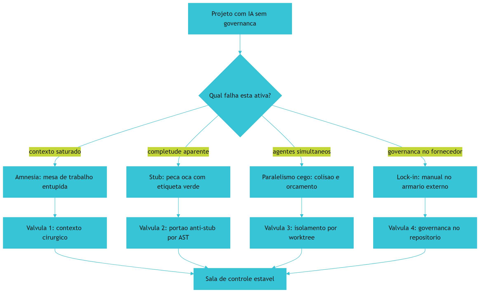

*Figura 3.1 — Os quatro alarmes da sala de controle e as válvulas que os fecham na raiz, em vez de silenciar o sinal.*

## 4. Técnica

### 4.1 A valva 2 em detalhe: portão anti-stub por árvore sintática

Detectar stubs por busca textual é frágil: `pass` aparece dentro de classes legítimas e comentários contêm a palavra "pendente" sem que haja pendência real. A inspeção correta é estrutural — percorrer a árvore sintática abstrata e avaliar o **corpo** de cada função, não o texto do arquivo.

```python
#!/usr/bin/env python3
# -*- coding: utf-8 -*-
"""Portao anti-stub: inspecao estrutural do corpo das funcoes via AST."""

import ast
import sys
from pathlib import Path
from typing import List, Tuple

IGNORAR = {".venv", "venv", "__pycache__", ".git", "scratch", "node_modules"}


class DetectorDeStubs(ast.NodeVisitor):
    def __init__(self) -> None:
        self.falhas: List[Tuple[int, str, str]] = []

    def _corpo_util(self, node: ast.FunctionDef) -> list:
        corpo = list(node.body)
        if corpo and isinstance(corpo[0], ast.Expr) and isinstance(
                corpo[0].value, ast.Constant) and isinstance(corpo[0].value.value, str):
            corpo = corpo[1:]
        return corpo

    def visit_FunctionDef(self, node: ast.FunctionDef) -> None:
        if any(isinstance(d, ast.Name) and d.id == "abstractmethod"
               for d in node.decorator_list):
            return
        corpo = self._corpo_util(node)
        if not corpo:
            self.falhas.append((node.lineno, node.name, "corpo vazio"))
        elif len(corpo) == 1:
            unico = corpo[0]
            if isinstance(unico, ast.Pass):
                self.falhas.append((node.lineno, node.name, "apenas 'pass'"))
            elif isinstance(unico, ast.Expr) and isinstance(unico.value, ast.Constant) \
                    and unico.value.value is Ellipsis:
                self.falhas.append((node.lineno, node.name, "apenas '...'"))
        self.generic_visit(node)


def verificar(caminho: Path) -> List[Tuple[int, str, str]]:
    try:
        arvore = ast.parse(caminho.read_text(encoding="utf-8"), filename=str(caminho))
    except SyntaxError as erro:
        return [(erro.lineno or 0, "SINTAXE", erro.msg or "erro de sintaxe")]
    detector = DetectorDeStubs()
    detector.visit(arvore)
    return detector.falhas


def arquivos_alvo(raiz: Path) -> List[Path]:
    return [p for p in raiz.rglob("*.py")
            if not IGNORAR.intersection(p.parts)]


def main() -> int:
    total = 0
    print("=" * 62)
    print("PORTAO ANTI-STUB — INSPECAO ESTRUTURAL POR AST")
    print("=" * 62)
    for arquivo in arquivos_alvo(Path(".")):
        for linha, funcao, motivo in verificar(arquivo):
            print(f"[BLOQUEIO] {arquivo}:{linha} funcao {funcao!r} -> {motivo}")
            total += 1
    print("-" * 62)
    if total == 0:
        print("[APROVADO] nenhuma casca de funcao detectada.")
        return 0
    print(f"[REPROVADO] {total} stub(s) proibido(s) — implemente ou remova.")
    return 1


if __name__ == "__main__":
    sys.exit(main())
```

### 4.2 A válvula 1 em detalhe: medindo o orçamento de contexto

Não existe disciplina de contexto sem medição. O trecho abaixo estima o custo relativo de cada turno e sinaliza quando o contexto passou do ponto em que a recuperação começa a degradar.

```json
{
  "orcamento_contexto": {
    "teto_por_turno": 8000,
    "teto_por_sessao": 80000,
    "prefixo_estavel": true,
    "cache_ttl": "5m",
    "politica_ao_exceder": "comprimir-saida-e-expurgar-historico"
  },
  "limites_de_agente": {
    "max_turnos_sem_checkpoint": 8,
    "max_repeticoes_de_erro": 2,
    "timeout_por_comando_s": 30
  }
}
```

### 4.3 Sessão real: o laço de erro que drena orçamento

O padrão abaixo é o modo de falha mais caro da catástrofe 3. Repare que nada no log parece catastrófico — apenas repetitivo. É a repetição sem teto que transforma um erro barato em prejuízo.

```console
$ python agente.py --tarefa "corrigir migracao"
[14:02:11] tentativa 1/∞ -> FAIL (coluna 'cpf' nao existe)
[14:02:19] tentativa 2/∞ -> FAIL (coluna 'cpf' nao existe)
[14:02:27] tentativa 3/∞ -> FAIL (coluna 'cpf' nao existe)
[14:02:35] tentativa 4/∞ -> FAIL (coluna 'cpf' nao existe)
^C
$ python agente.py --tarefa "corrigir migracao" --max-repeticoes 2 --timeout 30
[14:05:02] tentativa 1/∞ -> FAIL (coluna 'cpf' nao existe)
[14:05:10] tentativa 2/∞ -> FAIL (coluna 'cpf' nao existe)
[14:05:10] TETO ATINGIDO -> execucao interrompida; diagnostico devolvido ao operador
```

### 4.4 Tabela de diagnóstico rápido

Use a tabela para decidir qual válvula acionar primeiro. A ordem importa: comece sempre pelo sintoma mais barato de verificar.

| Sintoma | Catástrofe | Válvula | Evidência que confirma |
|---|---|---|---|
| Convenções mudam no meio da sessão | 1 — amnésia | Contexto cirúrgico + prefixo estável | Contagem de tokens por turno crescendo |
| Teste manual passa e produção falha | 2 — stub | Portão anti-stub por AST | Função com corpo só de `pass` |
| Import de pacote inexistente | 2 — stub | Verificação contra registro | Nome de pacote não resolve |
| Dois módulos fazem a mesma coisa | 3 — paralelismo | Isolamento por worktree | Dois autores no mesmo arquivo |
| Conta de API sobe sem entrega subir | 3 — paralelismo | Teto de repetição e de turnos | Log de retentativa idêntica |
| Migrar de ferramenta exige reescrever regras | 4 — lock-in | Governança no repositório | Regra só existe no aplicativo |

### 4.5 Verificando dependências fantasma antes do merge

Detectar nome de pacote inexistente não exige acesso à internet durante a verificação. A heurística abaixo compara os imports declarados no código com a lista de dependências realmente instaladas no ambiente — e trata divergência como bloqueio, não como aviso.

O detalhe importante é a direção da checagem. Verificar se um pacote instalado é usado é higiene de ambiente; verificar se um pacote **importado** existe é integridade de cadeia de suprimento. É a segunda que interessa aqui, porque é exatamente onde o código gerado por IA cria referências a nomes plausíveis que ninguém registrou.

```python
#!/usr/bin/env python3
# -*- coding: utf-8 -*-
"""Detector de dependencias fantasma: import declarado que nao existe no ambiente."""

import ast
import json
import sys
from importlib.util import find_spec
from pathlib import Path
from typing import Dict, List, Set

IGNORAR = {".venv", "venv", "__pycache__", ".git", "node_modules", "scratch"}

# Modulos da biblioteca padrao e locais nunca sao dependencias externas
INTERNOS = {"__future__", "os", "sys", "re", "json", "ast", "pathlib", "typing",
            "dataclasses", "subprocess", "shutil", "sqlite3", "hashlib", "zipfile",
            "importlib", "unicodedata", "collections", "itertools", "statistics"}


def modulos_importados(arquivo: Path) -> Set[str]:
    try:
        arvore = ast.parse(arquivo.read_text(encoding="utf-8"))
    except SyntaxError:
        return set()
    nomes: Set[str] = set()
    for no in ast.walk(arvore):
        if isinstance(no, ast.Import):
            nomes.update(alias.name.split(".")[0] for alias in no.names)
        elif isinstance(no, ast.ImportFrom) and no.module and no.level == 0:
            nomes.add(no.module.split(".")[0])
    return nomes


def resolve(nome: str) -> bool:
    if nome in INTERNOS:
        return True
    try:
        return find_spec(nome) is not None
    except (ImportError, ValueError, ModuleNotFoundError):
        return False


def varrer(raiz: Path) -> Dict[str, List[str]]:
    fantasma: Dict[str, List[str]] = {}
    for arquivo in raiz.rglob("*.py"):
        if IGNORAR.intersection(arquivo.parts):
            continue
        for nome in sorted(modulos_importados(arquivo)):
            if not resolve(nome):
                fantasma.setdefault(nome, []).append(str(arquivo))
    return fantasma


def main() -> int:
    raiz = Path(sys.argv[1]) if len(sys.argv) > 1 else Path(".")
    fantasma = varrer(raiz)
    print("=" * 62)
    print("DETECTOR DE DEPENDENCIAS FANTASMA")
    print("=" * 62)
    if not fantasma:
        print("[APROVADO] todo import declarado resolve no ambiente.")
        return 0
    for nome, arquivos in sorted(fantasma.items()):
        print(f"[BLOQUEIO] pacote inexistente: {nome} ({len(arquivos)} arquivo(s))")
        for arquivo in arquivos[:3]:
            print(f"   -> {arquivo}")
    print("-" * 62)
    print(json.dumps({"pacotes_fantasma": len(fantasma)}, ensure_ascii=False))
    print("[REPROVADO] exit 1 — remova a referencia ou declare a dependencia.")
    return 1


if __name__ == "__main__":
    sys.exit(main())
```

Repare no efeito prático da direção de verificação escolhida. Uma dependência declarada e não usada apenas engorda o ambiente; uma dependência **usada e não declarada** é uma porta aberta — porque o nome está livre para ser registrado por outra pessoa. A segunda categoria é a que o detector persegue.

### 4.6 Roteiro de contenção em cinco passos

1. **Meça** o contexto por turno antes de qualquer outra coisa; sem número, a discussão vira opinião.
2. **Instale** o portão anti-stub no gancho de pré-commit, para que a casca nunca chegue ao histórico.
3. **Isole** cada tarefa paralela em diretório de trabalho próprio, com descarte reversível em caso de reprovação.
4. **Teto** toda execução autônoma com limite de repetição, limite de turnos e tempo máximo por comando.
5. **Mova** a governança para o repositório e trate cada aplicativo como consumidor descartável dela.

## 5. Aplica

### A cena que quase todo time vive

Você assume a manutenção de um serviço entregue em três semanas por uma equipe que usava IA intensamente. A primeira semana é tranquila. Na segunda, você descobre que existem duas implementações de cálculo de frete: uma usa tabela de faixas, outra usa fórmula contínua. Os testes passam em ambas, porque a suíte cobre apenas o caminho feliz. Você pergunta ao time qual é a correta e recebe a resposta que já esperava: "as duas vieram do agente".

Reconstrua o diagnóstico. A duplicação não é fruto de decisão arquitetural: é o efeito acumulado da catástrofe 1. A sessão que gerou o primeiro cálculo estava com o contexto limpo e sabia que existia um módulo de frete. A sessão que gerou o segundo estava saturada de logs e não recuperou essa informação — o efeito de perda no meio operando em produção [3]. Se alguém tivesse medido o tamanho do contexto por turno, o sintoma apareceria como uma curva, e não como um mistério.

A correção que funciona não é "reescrever tudo com mais cuidado". É inserir três válvulas na ordem certa: primeiro, um contrato declarado de qual módulo é a fonte da verdade para cálculo de frete; segundo, um portão que falha quando dois módulos exportam a mesma responsabilidade; terceiro, isolamento por diretório de trabalho para que nenhum agente futuro opere sobre um estado ambíguo. Só depois disso vale a pena discutir qual fórmula está certa — porque a pergunta "qual está certa" não tem resposta em um sistema que aceita duas ao mesmo tempo.

### Onde isso escala e onde quebra

Cada válvula tem um ponto de saturação. O portão anti-stub escala até o limite de tempo aceitável no pré-commit — alguns segundos em bases médias; acima disso, ele precisa migrar para a esteira assíncrona e deixar no gancho apenas as verificações mais baratas. O teto de repetição escala até o ponto em que a tarefa realmente exige exploração iterativa; para tarefas de investigação genuína, um teto baixo demais aborta trabalho legítimo antes de ele chegar ao resultado.

A válvula mais delicada é a de contexto. Reduzir contexto demais remove justamente a informação que evita a duplicação; reduzir de menos mantém o ruído que a causa. O contorno prático é separar **contexto estável** (regras, contratos, convenções) de **contexto volátil** (logs, tentativas, diffs descartados) e manter só o primeiro permanentemente. E existe uma condição em que nenhuma dessas válvulas compensa: projetos cujo artefato é descartável em dias. Nesse caso, instrumentar governança custa mais do que o valor gerado — e a decisão honesta é assumir o risco, não fingir proteção.

### Armadilhas comuns

- Tratar sintoma como causa. "O agente mudou de convenção" é sintoma; "o contexto saturou" é causa. Corrigir o sintoma gera retrabalho eterno.
- Confiar em revisão manual como portão. Revisão humana é o filtro certo para intenção e o filtro errado para completude mecânica.
- Rodar agentes paralelos sem isolamento físico. Sem diretório próprio, o paralelismo produz conflito, não velocidade.
- Deixar execução autônoma sem teto de repetição e de turnos. O laço de erro é o modo de falha mais caro e mais fácil de prevenir.
- Guardar a governança na ferramenta. Regra que só existe dentro de um aplicativo é regra que expira com o aplicativo.

## 6. Conclusão

Neste capítulo você dissecou as quatro catástrofes que explicam a crise real do desenvolvimento com IA. A primeira é física: contexto saturado degrada a recuperação de instruções. A segunda é comportamental: modelos produzem aparência de completude, e sem verificação estrutural essa aparência chega à produção. A terceira é operacional: paralelismo sem isolamento gera colisão, gasto silencioso e perda de rastreabilidade. A quarta é organizacional: governança que mora na ferramenta torna o projeto refém dela.

Você também viu que a resposta intuitiva quase sempre piora o quadro. Trocar de modelo não corrige contexto saturado. Pedir "por favor, não use stubs" não substitui um portão binário. E a evidência de mercado confirma o diagnóstico: a adoção de IA nas equipes cresceu enquanto a confiança declarada na saída caiu — hoje, 46% dos desenvolvedores pesquisados dizem desconfiar ativamente da exatidão das ferramentas, contra 33% que confiam, e apenas uma fração mínima declara confiança alta [1] [2].

**Desafio:** escolha um projeto ativo e escreva, para cada uma das quatro catástrofes, a evidência concreta que você tem em mãos — um log, um arquivo duplicado, uma conta, um commit. Se você não conseguir apresentar evidência para alguma delas, você não sabe se ela está ativa. E o que não é medido não é governado.

Com o problema mapeado em detalhe, o Capítulo 4 apresenta a resposta estrutural: a Constituição Mestre com as dez leis inegociáveis que transformam cada uma dessas válvulas em regra permanente do projeto.

## 7. Referências Bibliográficas

[1] STACK OVERFLOW. *2025 Developer Survey — AI*. Disponível em: https://survey.stackoverflow.co/2025/ai. Acesso em: 12 set. 2026.
[2] DORA / GOOGLE CLOUD. *State of AI-assisted Software Development 2025*. Disponível em: https://dora.dev/dora-report-2025/. Acesso em: 12 set. 2026.
[3] LIU, Nelson F. et al. *Lost in the Middle: How Language Models Use Long Contexts*. In: Transactions of the Association for Computational Linguistics. 2024. Disponível em: https://arxiv.org/abs/2307.03172. Acesso em: 12 set. 2026.
[4] MEI, Lingrui et al. *A Survey of Context Engineering for Large Language Models*. In: arXiv. 2025. Disponível em: https://arxiv.org/abs/2507.13334. Acesso em: 12 set. 2026.
[5] VERACODE. *2025 GenAI Code Security Report: AI-Generated Code Security Risks*. Disponível em: https://www.veracode.com/blog/ai-generated-code-security-risks/. Acesso em: 12 set. 2026.
[6] CLOUD SECURITY ALLIANCE. *Vibe Coding's Security Debt: The AI-Generated CVE Surge*. Disponível em: https://labs.cloudsecurityalliance.org/research/csa-research-note-ai-generated-code-vulnerability-surge-2026/. Acesso em: 12 set. 2026.
[7] TRAXTECH. *20% of AI-Generated Code Dependencies Don't Exist, Creating Supply Chain Security Risks*. Disponível em: https://www.traxtech.com/blog/20-of-ai-generated-code-dependencies-dont-exist-creating-supply-chain-security-risks. Acesso em: 12 set. 2026.
[8] ENDOR LABS. *The Most Common Security Vulnerabilities in AI-Generated Code*. Disponível em: https://www.endorlabs.com/learn/the-most-common-security-vulnerabilities-in-ai-generated-code. Acesso em: 12 set. 2026.
[9] ALI, Mohamad Abou; DORNAIKA, Fadi; CHARAFEDDINE, Jinan. *Agentic AI: a comprehensive survey of architectures, applications, and future directions*. In: Artificial Intelligence Review. 2025. Disponível em: https://doi.org/10.1007/s10462-025-11422-4. Acesso em: 12 set. 2026.
[10] MORAMPUDI, Abhishek et al. *A survey of reward hacking in agentic large language model systems*. In: Discover Artificial Intelligence. 2026. Disponível em: https://link.springer.com/article/10.1007/s44163-026-01980-z. Acesso em: 12 set. 2026.
[11] METR. *Recent Frontier Models Are Reward Hacking*. Disponível em: https://metr.org/blog/2025-06-05-recent-reward-hacking/. Acesso em: 12 set. 2026.
[12] *Measuring Reward Hacking in Long-Horizon Coding Agents*. In: arXiv. 2026. Disponível em: https://arxiv.org/html/2605.21384v1. Acesso em: 12 set. 2026.
[13] GE, Y. T. et al. *A Survey of Vibe Coding with Large Language Models*. In: arXiv. 2025. Disponível em: http://arxiv.org/abs/2510.12399. Acesso em: 12 set. 2026.
[14] RAY, Partha Pratim. *A Review on Vibe Coding: Fundamentals, State-of-the-art, Challenges and Future Directions*. 2025. Disponível em: https://doi.org/10.36227/techrxiv.174681482.27435614/v1. Acesso em: 12 set. 2026.
[15] SCALE LABS. *SWE-Bench Pro (Public Dataset) — Leaderboard*. Disponível em: https://labs.scale.com/leaderboard/swe_bench_pro_public. Acesso em: 12 set. 2026.
[16] NATIONAL INSTITUTE OF STANDARDS AND TECHNOLOGY. *Artificial Intelligence Risk Management Framework: Generative Artificial Intelligence Profile (NIST AI 600-1)*. Disponível em: https://nvlpubs.nist.gov/nistpubs/ai/NIST.AI.600-1.pdf. Acesso em: 12 set. 2026.
[17] CHECKMARX. *11 Emerging AI Security Risks with MCP (Model Context Protocol)*. Disponível em: https://checkmarx.com/zero-post/11-emerging-ai-security-risks-with-mcp-model-context-protocol/. Acesso em: 12 set. 2026.
[18] ANTHROPIC. *Prompt Caching — Claude Platform Docs*. Disponível em: https://platform.claude.com/docs/en/build-with-claude/prompt-caching. Acesso em: 12 set. 2026.
[19] GITHUB. *Octoverse 2025: The state of open source*. Disponível em: https://octoverse.github.com/. Acesso em: 12 set. 2026.
[20] FOWLER, Martin. *Patterns of Enterprise Application Architecture*. Boston: Addison-Wesley, 2002. Disponível em: https://martinfowler.com/books/eaa.html. Acesso em: 12 set. 2026.

# Capítulo 4: A Constituição Mestre: As 10 Leis Inegociáveis

## 1. Introdução

No Capítulo 3, você viu as quatro catástrofes em detalhe: contexto saturado, completude falsa, paralelismo cego e aprisionamento de ferramenta. Ficou claro que cada uma tem uma válvula de correção — mas válvula aberta por decisão individual não é governança, é heroísmo. Este capítulo transforma heroísmo em lei.

A pergunta central aqui é prática: como garantir que a correção sobreviva à troca de sessão, à troca de modelo e à troca de pessoa? A resposta é uma constituição — um conjunto pequeno de regras inegociáveis, escritas no repositório e fiscalizadas por script. Ao final, você conhecerá as dez leis que sustentam toda a arquitetura desta obra e saberá qual catástrofe cada uma neutraliza.

## 2. Explica

### 2.1 Por que rigidez amplia capacidade

Existe uma intuição difundida de que liberdade produz criatividade. Em engenharia agêntica, a relação se inverte: a criatividade do agente é amplificada pela rigidez dos seus limites operacionais. Isso não é filosofia motivacional — é consequência de como a busca estatística funciona. Um modelo com espaço de decisão enorme explora um espaço enorme de soluções plausíveis, e a maioria delas é incompatível com o restante do sistema. Restringir o espaço de decisão não limita a inteligência; limita o ruído sobre o qual a inteligência precisa operar.

A analogia arquitetural é direta: normas de construção civil permitem que se construam arranha-céus. Sem norma, cada construtor reinventaria critérios de carga e nenhum prédio alto seria seguro o bastante para ser aprovado. Em software, a mesma lógica se aplica: a norma que torna um sistema grande sustentável não é a que sugere boas práticas, e sim a que **impede** a prática incompatível de entrar no histórico [17].

### 2.2 As leis de mérito: determinismo, binariedade e persistência

As três primeiras leis tratam do que significa "estar correto".

A **Lei 1 — Determinismo em Primeiro Lugar** estabelece que nenhum modelo probabilístico deve ser chamado para tarefas que um script determinístico resolve. Formatar data, validar esquema, renomear identificador, verificar se um campo existe: tudo isso é cálculo, não cognição. Usar o modelo aqui é caro e mais frágil, porque a mesma entrada pode produzir saídas diferentes. O modelo entra onde há ambiguidade genuína — síntese, interpretação, escolha entre alternativas plausíveis.

A **Lei 2 — Qualidade Binária** determina que toda verificação relevante devolve um resultado sem meio-termo: código de saída zero aprova, código de saída um bloqueia. Isso remove o julgamento humano do caminho crítico e, mais importante, remove a negociação. A prática da entrega contínua já demonstrava que verificação automática é o que permite ritmo sem aumento proporcional de defeito [4]. A novidade da engenharia agêntica é a escala: sem binariedade, um agente que gera dezenas de entregas por hora transforma qualquer humano em gargalo instantaneamente.

A **Lei 3 — Persistência Estruturada** exige que estado de sessão, decisões arquiteturais e histórico de mudanças vivam em arquivos auditáveis — banco local, registros estruturados ou documentação versionada. Nada que importe pode existir apenas na memória volátil da conversa. Isso decorre diretamente da catástrofe 1: se o contexto é mesa de trabalho, ele não é cofre. O banco local em modo de journaling por write-ahead log é a implementação típica, porque permite leitura concorrente enquanto a esteira escreve [9].

### 2.3 As leis de economia e soberania

As três leis seguintes tratam de custo e independência.

A **Lei 4 — Economia Extrema (Tríade Caveman Ultra)** ataca as três frentes do desperdício: raciocínio interno telegráfico, saída densa em português técnico e expurgo de contexto entre fases. A base teórica é antiga e sólida: entropia de informação mede a incerteza resolvida por símbolo transmitido, e símbolo que não resolve incerteza é desperdício [5]. A alavanca financeira é concreta — reaproveitar o prefixo estável de um prompt corta até 90% do custo dos tokens de entrada e até 85% da latência em prompts longos [7].

A **Lei 5 — Supremacia Agnóstica** determina que todo componente, regra e especificação seja independente de sistema operacional, de harness e de provedor de modelo. Governança que mora na ferramenta é governança com prazo de validade. Manter a fonte da verdade em formato neutro e sincronizá-la para cada ambiente converte migração em reconfiguração.

A **Lei 6 — Desenvolvedor no Controle** proíbe subagentes invisíveis que alterem arquivos em segundo plano sem supervisão. A execução é sequencial, transparente e com pontos de verificação. Note que a proibição não é tecnofobia: é reconhecimento de que a irreversibilidade de uma ação cresce com a autonomia concedida, e que rastreabilidade e supervisão humana figuram entre os controles mínimos recomendados para sistemas de IA generativa [2].

### 2.4 As leis de integridade

As quatro leis finais tratam de honestidade.

A **Lei 7 — Tolerância Zero a Stubs** proíbe implementações simuladas, blocos vazios, retornos fictícios e marcadores de pendência em código entregue. A justificativa tem número: amostras de código gerado por IA introduziram vulnerabilidades do OWASP Top 10 em cerca de 45% dos casos, taxa que não melhorou entre ciclos de teste [1]. A Lei 7 é a barreira que impede que essa taxa estatística chegue ao repositório.

A **Lei 8 — Princípio Anti-NIH** (*Not Invented Here*) exige justificativa escrita antes de construir um mecanismo novo e genérico. Se a biblioteca padrão ou uma ferramenta consolidada resolve, não invente. O custo de manutenção de código próprio é maior do que parece, e ele compete por atenção com o código que de fato diferencia o produto.

A **Lei 9 — Honestidade de Rótulo** proíbe alegar segurança, desempenho ou cobertura maiores do que os testes executados conseguem provar. É a lei que sustenta a credibilidade de todos os relatórios. Sem ela, o portão binário vira teatro: tudo passa, porque o critério foi ajustado até passar. A literatura sobre manipulação de recompensa mostra exatamente esse padrão em agentes de código, com modelos otimizando a métrica em vez da tarefa [13] [14].

A **Lei 10 — Comunicação Direta e Densa** elimina preâmbulo, saudação e reafirmação do pedido. A saída é organizada, tabelada e específica. A justificativa é tripla: reduz custo, reduz latência e reduz ruído de contexto para quem lê o resultado depois.

## 3. Ilustra

Na sua **sala de controle**, as dez leis estão afixadas na parede — e não são decoração, são o regulamento de operação. Cada painel tem suas leis: o CONTEXTO abriga densidade, persistência e honestidade de rótulo; o HARNESS abriga qualidade binária, soberania e desenvolvedor no controle; o MOTOR abriga determinismo e economia; as FERRAMENTAS abrigam a lei anti-stub e o princípio anti-NIH.

O detalhe que distingue uma constituição de um pôster motivacional é quem fiscaliza. Na sua sala, cada lei tem um **fiscal automático** — um script que roda sem que ninguém precise lembrar dele. Regra sem fiscal é sugestão; regra com fiscal é contrato.

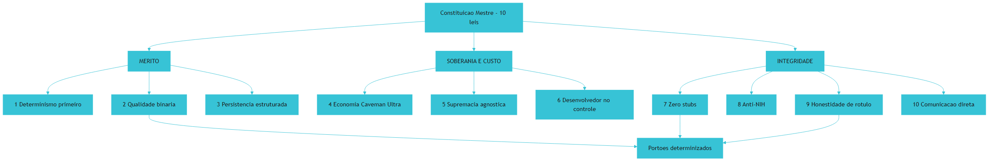

*Figura 4.1 — As dez leis agrupadas por finalidade: mérito, soberania e integridade — e os portões que as fiscalizam mecanicamente.*

## 4. Técnica

### 4.1 A constituição como arquivo versionado

O primeiro artefato de qualquer projeto governado é o arquivo de regras na raiz. Ele é curto de propósito: leis que não cabem em uma leitura não são leis, são ruído.

```markdown
# Governança Canônica do Projeto

## Leis inegociáveis
1. Determinismo primeiro: resolve com script antes de chamar modelo.
2. Qualidade binária: exit 0 aprova; exit 1 bloqueia. Sem meio-termo.
3. Persistência estruturada: estado e decisões em arquivo auditável.
4. Economia severa: raciocínio telegráfico, saída densa, expurgo entre fases.
5. Supremacia agnóstica: nenhuma regra depende de harness ou fornecedor.
6. Desenvolvedor no controle: proibido agente headless invisível.
7. Zero stubs: proibido corpo vazio, retorno fictício ou pendência.
8. Anti-NIH: justificar por escrito antes de construir mecanismo genérico.
9. Honestidade de rótulo: não alegar mais do que o teste provou.
10. Comunicação direta: sem preâmbulo, sem saudação, sem repetição.
```

### 4.2 Leis 2 e 9 em código: o fiscal da constituição

Uma lei sem fiscal não existe. O script abaixo implementa a fiscalização das leis 3 e 9 — persistência estruturada e honestidade de rótulo — e demonstra o padrão de saída binária da lei 2.

```python
#!/usr/bin/env python3
# -*- coding: utf-8 -*-
"""Fiscal da constituicao: leis 3 (persistencia) e 9 (honestidade de rotulo)."""

import re
import sys
from pathlib import Path
from typing import List, Tuple

# Lei 9 — vocabulario que afirma mais do que qualquer teste pode provar
TERMOS_INFLADOS = (
    r"\b100%\s+seguro\b",
    r"\btotalmente\s+blindado\b",
    r"\bsem\s+qualquer\s+bug\b",
    r"\babsolutamente\s+(?:perfeito|seguro)\b",
)

# Lei 3 — diretorios cuja ausencia indica estado nao auditavel
DIRETORIOS_PERSISTENTES = ("docs", "gates", "componentes")

EXEMPLO_INFLADO = "Este modulo e 100% seguro em qualquer cenario de carga."


def auditar_honestidade(docs: List[Path]) -> Tuple[bool, List[str]]:
    violacoes: List[str] = []
    padroes = [re.compile(p, re.IGNORECASE) for p in TERMOS_INFLADOS]
    for doc in docs:
        texto = doc.read_text(encoding="utf-8", errors="ignore")
        for padrao in padroes:
            achado = padrao.search(texto)
            if achado:
                violacoes.append(f"{doc}: afirmacao inflada -> {achado.group(0)!r}")
    return (not violacoes), violacoes


def auditar_persistencia(raiz: Path) -> Tuple[bool, List[str]]:
    faltando = [d for d in DIRETORIOS_PERSISTENTES if not (raiz / d).is_dir()]
    return (not faltando), [f"diretorio persistente ausente: {d}" for d in faltando]


def verificar_rotulo_isolado(texto: str) -> bool:
    """Lei 9 aplicada a um unico trecho — usado antes de publicar relatorio."""
    return not any(re.search(p, texto, re.IGNORECASE) for p in TERMOS_INFLADOS)


def main() -> int:
    raiz = Path(".")
    print("=" * 62)
    print("FISCAL DA CONSTITUICAO — LEIS 2, 3 E 9")
    print("=" * 62)

    ok_persistencia, erros_p = auditar_persistencia(raiz)
    print(f"[LEI 3] {'OK' if ok_persistencia else 'BLOQUEIO'} persistencia estruturada")

    docs = list((raiz / "docs").rglob("*.md")) if (raiz / "docs").is_dir() else []
    ok_rotulo, erros_r = auditar_honestidade(docs)
    print(f"[LEI 9] {'OK' if ok_rotulo else 'BLOQUEIO'} honestidade de rotulo "
          f"({len(docs)} documento(s) auditado(s))")

    if not verificar_rotulo_isolado(EXEMPLO_INFLADO):
        print("[LEI 9] autoteste: detector reconhece afirmacao inflada")
    else:
        print("[LEI 9] FALHA no autoteste do detector")
        return 1

    for erro in erros_p + erros_r:
        print(f"  -> {erro}")

    print("-" * 62)
    if ok_persistencia and ok_rotulo:
        print("[APROVADO] exit 0 — constituicao respeitada.")
        return 0
    print("[REPROVADO] exit 1 — violacao constitucional detectada.")
    return 1


if __name__ == "__main__":
    sys.exit(main())
```

### 4.3 Os dez fiscais declarados em configuração

Repare que cada lei aponta para um fiscal concreto. Essa tabela de configuração é o que impede que a constituição vire lista de desejos: se uma lei não tem fiscal, ela está aberta por decisão explícita.

```yaml
constituicao:
  leis:
    - id: 1
      nome: Determinismo em primeiro lugar
      fiscal: revisao-humana-no-plano
    - id: 2
      nome: Qualidade binaria
      fiscal: gates/exit-code.sh
    - id: 3
      nome: Persistencia estruturada
      fiscal: gates/fiscal-constituicao.py
    - id: 4
      nome: Economia severa de tokens
      fiscal: gates/orcamento-contexto.py
    - id: 5
      nome: Supremacia agnostica
      fiscal: gates/checar-acoplamento.py
    - id: 6
      nome: Desenvolvedor no controle
      fiscal: gates/bloquear-headless.py
    - id: 7
      nome: Zero stubs
      fiscal: gates/anti-stub-ast.py
    - id: 8
      nome: Anti-NIH
      fiscal: revisao-humana-no-plano
    - id: 9
      nome: Honestidade de rotulo
      fiscal: gates/fiscal-constituicao.py
    - id: 10
      nome: Comunicacao direta
      fiscal: gates/ritmo-de-saida.py
```

### 4.4 Sessão de fiscalização em operação

O comportamento esperado de um fiscal é falar pouco e bloquear sem hesitar. O diálogo abaixo mostra o padrão completo: aprovação, bloqueio, diagnóstico e correção.

```console
$ python gates/fiscal-constituicao.py
==============================================================
FISCAL DA CONSTITUICAO — LEIS 2, 3 E 9
==============================================================
[LEI 3] OK persistencia estruturada
[LEI 9] BLOQUEIO honestidade de rotulo (12 documento(s) auditado(s))
  -> docs/relatorio-carga.md: afirmacao inflada -> '100% seguro'
[REPROVADO] exit 1 — violacao constitucional detectada.

$ sed -i 's/100% seguro/resiliente a falha de nos, ver secao 4/' docs/relatorio-carga.md
$ python gates/fiscal-constituicao.py
[APROVADO] exit 0 — constituicao respeitada.
```

### 4.5 Tabela de decisão: qual lei invocar primeiro

Quando o projeto quebra, a tentação é reescrever a constituição inteira. Quase sempre uma lei basta. Use a tabela para localizar a lei pelo sintoma.

| Sintoma | Lei aplicável | Primeira ação |
|---|---|---|
| Conta de API alta com pouca entrega | Lei 4 | Medir tokens por turno e fixar orçamento |
| Código aprovado quebra em produção | Lei 7 | Instalar portão anti-stub por AST |
| Comportamento muda conforme o aplicativo usado | Lei 5 | Mover regras para o repositório |
| Agente altera arquivo sem registro | Lei 6 | Exigir execução transparente e checkpoint |
| Relatório afirma cobertura não medida | Lei 9 | Rodar fiscal de honestidade de rótulo |
| Dependência própria substituindo biblioteca padrão | Lei 8 | Exigir justificativa escrita antes do merge |
| Mesma entrada produz saída diferente | Lei 1 | Trocar chamada de modelo por script determinístico |
| Sessão longa degrada aderência às regras | Lei 4 e Lei 3 | Expurgar contexto e persistir decisão em arquivo |

### 4.6 Roteiro de adoção da constituição em cinco passos

1. **Escreva** as dez leis em um único arquivo na raiz, com uma frase cada — sem parágrafos explicativos.
2. **Atribua** a cada lei um fiscal: script determinístico ou ponto de revisão humana explícito, nunca ambos nem nenhum.
3. **Instale** os fiscais automatizáveis no gancho de pré-commit, na ordem do mais rápido para o mais lento.
4. **Bloqueie** o merge quando qualquer fiscal retornar código diferente de zero; corrija a causa, nunca contorne o teste.
5. **Revise** a constituição a cada ciclo de entrega, mas trate cada alteração como mudança de lei — com justificativa registrada.

## 5. Aplica

### A cena que quase todo time vive

Você lidera a migração de um serviço crítico. Na véspera da entrega, o agente responsável por gerar a camada de acesso a dados entrega três arquivos que passam em todos os testes. Você aprova. Em produção, um campo opcional chega nulo e o serviço derruba. A investigação revela que a função de validação era um stub: retornava verdadeiro sem inspecionar nada.

Reconstrua o caminho do erro. O sintoma não foi "o agente errou"; o sintoma foi "não havia fiscal para a Lei 7". O teste que passou era o teste que o próprio agente escreveu — e um teste escrito por quem produziu o defeito mede aderência à expectativa, não correção [14]. A revisão humana, por sua vez, focou no que humano revisa bem: nome de variável, organização de arquivo, intenção geral. Ninguém inspeciona o corpo de trinta funções procurando por um `return True` no meio.

A correção, na semana seguinte, tem forma de lei e forma de script. Primeiro, a Lei 7 vira portão no pré-commit: nenhuma função com corpo vazio ou retorno constante passa. Segundo, a Lei 9 vira fiscal de relatório: o documento de entrega não pode afirmar cobertura sem apontar o comando que a mediu. Terceiro, a Lei 2 vira regra de esteira: um único fiscal vermelho interrompe o merge. Note que nenhuma das três ações envolveu trocar o modelo — porque o modelo não era o problema. O que faltava era a lei e o fiscal.

### Onde isso escala e onde quebra

Uma constituição curta escala. Dez leis cabem na cabeça de qualquer pessoa em um dia, e os fiscais rodam em segundos. O ponto de ruptura aparece em dois lugares distintos.

O primeiro é o número de leis. Acima de duas ou três dezenas, a constituição deixa de ser lida e passa a competir com o código pela atenção — e a pesquisa sobre contexto é clara quanto ao efeito de excesso de instrução simultânea [6]. O contorno é hierarquia: um núcleo de leis inegociáveis na raiz e regulamentos de módulo dentro de cada módulo.

O segundo ponto de ruptura é o custo dos fiscais no caminho crítico. Um fiscal que leva trinta segundos por commit transforma a experiência de desenvolvimento em espera, e a equipe encontra formas de contorná-lo. Nesse caso, o contorno correto não é desligar o fiscal, e sim movê-lo: verificações baratas no gancho de pré-commit, verificações caras na esteira assíncrona, com o resultado reportado como bloqueio de integração.

E existe a condição de contorno definitiva: **um projeto de vida curta não precisa de constituição**. Se o código será descartado antes que qualquer uma dessas catástrofes tenha tempo de se manifestar, o custo de escrever leis e fiscais supera o benefício. Assumir isso explicitamente é mais honesto do que manter uma constituição decorativa que ninguém cumpre — e a Lei 9, aplicada ao próprio processo, proíbe exatamente esse tipo de fingimento.

### Armadilhas comuns

- Escrever leis sem fiscais. Lei sem fiscal é sugestão, e sugestão não sobrevive à pressão de prazo.
- Confundir quantidade com cobertura. Vinte leis inúteis protegem menos do que sete leis fiscalizadas.
- Desligar o fiscal para liberar a entrega. Isso inverte a relação: o fiscal existe justamente para o momento em que a pressão para ignorá-lo é maior.
- Colocar fiscal caro no gancho rápido. O custo de espera produz evasão, e evasão produz portão desativado.
- Tratar a constituição como imutável. Ela precisa evoluir, mas toda alteração é mudança de lei e merece justificativa registrada [3].

## 6. Conclusão

Neste capítulo você conheceu as dez leis que sustentam a governança agêntica, agrupadas por finalidade. As leis de mérito — determinismo primeiro, qualidade binária e persistência estruturada — definem o que significa estar correto. As de soberania e custo — economia severa, supremacia agnóstica e desenvolvedor no controle — protegem orçamento e independência. As de integridade — zero stubs, anti-NIH, honestidade de rótulo e comunicação direta — protegem a verdade do relatório.

Você viu também o princípio que separa constituição de pôster: cada lei precisa de um fiscal, e cada fiscal precisa devolver saída binária. A evidência que abre este capítulo justifica a Lei 7 com número — cerca de 45% das amostras de código gerado por IA apresentaram vulnerabilidades do OWASP Top 10, sem melhora entre gerações [1]. Um portão binário é o que impede que essa estatística se converta em incidente no seu repositório.

**Desafio:** escreva as dez leis do seu projeto em uma folha e marque, ao lado de cada uma, o nome do fiscal. Se alguma ficar sem fiscal, você acabou de identificar a lei que será violada primeiro sob pressão de prazo.

Com a lei estabelecida, o Capítulo 5 abre a Parte II e apresenta o mapa completo das quatro camadas — a arquitetura que transforma essas dez regras em quatro painéis operacionais independentes e verificáveis.

## 7. Referências Bibliográficas

[1] VERACODE. *2025 GenAI Code Security Report: AI-Generated Code Security Risks*. Disponível em: https://www.veracode.com/blog/ai-generated-code-security-risks/. Acesso em: 12 set. 2026.
[2] NATIONAL INSTITUTE OF STANDARDS AND TECHNOLOGY. *Artificial Intelligence Risk Management Framework: Generative Artificial Intelligence Profile (NIST AI 600-1)*. Disponível em: https://nvlpubs.nist.gov/nistpubs/ai/NIST.AI.600-1.pdf. Acesso em: 12 set. 2026.
[3] DORA / GOOGLE CLOUD. *State of AI-assisted Software Development 2025*. Disponível em: https://dora.dev/dora-report-2025/. Acesso em: 12 set. 2026.
[4] HUMBLE, Jez; FARLEY, David. *Continuous Delivery: Reliable Software Releases through Build, Test, and Deployment Automation*. Addison-Wesley, 2010. Disponível em: https://continuousdelivery.com/. Acesso em: 12 set. 2026.
[5] SHANNON, Claude E. *A Mathematical Theory of Communication*. Bell System Technical Journal, 1948. Disponível em: https://doi.org/10.1002/j.1538-7305.1948.tb01338.x. Acesso em: 12 set. 2026.
[6] MEI, Lingrui et al. *A Survey of Context Engineering for Large Language Models*. In: arXiv. 2025. Disponível em: https://arxiv.org/abs/2507.13334. Acesso em: 12 set. 2026.
[7] ANTHROPIC. *Prompt Caching — Claude Platform Docs*. Disponível em: https://platform.claude.com/docs/en/build-with-claude/prompt-caching. Acesso em: 12 set. 2026.
[8] GIT. *git-worktree Documentation*. Disponível em: https://git-scm.com/docs/git-worktree. Acesso em: 12 set. 2026.
[9] SQLITE. *Write-Ahead Logging*. Disponível em: https://www.sqlite.org/wal.html. Acesso em: 12 set. 2026.
[10] STACK OVERFLOW. *2025 Developer Survey — AI*. Disponível em: https://survey.stackoverflow.co/2025/ai. Acesso em: 12 set. 2026.
[11] GITHUB. *Octoverse 2025: The state of open source*. Disponível em: https://octoverse.github.com/. Acesso em: 12 set. 2026.
[12] TRAXTECH. *20% of AI-Generated Code Dependencies Don't Exist, Creating Supply Chain Security Risks*. Disponível em: https://www.traxtech.com/blog/20-of-ai-generated-code-dependencies-dont-exist-creating-supply-chain-security-risks. Acesso em: 12 set. 2026.
[13] METR. *Recent Frontier Models Are Reward Hacking*. Disponível em: https://metr.org/blog/2025-06-05-recent-reward-hacking/. Acesso em: 12 set. 2026.
[14] MORAMPUDI, Abhishek et al. *A survey of reward hacking in agentic large language model systems*. In: Discover Artificial Intelligence. 2026. Disponível em: https://link.springer.com/article/10.1007/s44163-026-01980-z. Acesso em: 12 set. 2026.
[15] NATIONAL SECURITY AGENCY. *Model Context Protocol (MCP) Security — CSI*. Disponível em: https://www.nsa.gov/Portals/75/documents/Cybersecurity/CSI_MCP_SECURITY.pdf. Acesso em: 12 set. 2026.
[16] NYGARD, Michael T. *Release It!: Design and Deploy Production-Ready Software*. 2. ed. Pragmatic Bookshelf, 2018. Disponível em: https://pragprog.com/titles/mnee2/release-it-second-edition/. Acesso em: 12 set. 2026.
[17] MARTIN, Robert C. *Clean Architecture: A Craftsman's Guide to Software Structure and Design*. Prentice Hall, 2017. Disponível em: https://www.pearson.com/. Acesso em: 12 set. 2026.
[18] CHECKMARX. *11 Emerging AI Security Risks with MCP (Model Context Protocol)*. Disponível em: https://checkmarx.com/zero-post/11-emerging-ai-security-risks-with-mcp-model-context-protocol/. Acesso em: 12 set. 2026.
[19] ALI, Mohamad Abou; DORNAIKA, Fadi; CHARAFEDDINE, Jinan. *Agentic AI: a comprehensive survey of architectures, applications, and future directions*. In: Artificial Intelligence Review. 2025. Disponível em: https://doi.org/10.1007/s10462-025-11422-4. Acesso em: 12 set. 2026.
[20] CHACON, Scott; STRAUB, Ben. *Pro Git: Everything you need to know about Git*. 2. ed. Apress, 2014. Disponível em: https://git-scm.com/book/en/v2. Acesso em: 12 set. 2026.

# Parte II — As Quatro Camadas da Fábrica Agêntica

# Capítulo 5: Visão Geral das 4 Camadas: A Arquitetura Completa

## 1. Introdução

No Capítulo 4, você cravou as dez leis da constituição — mérito, soberania e integridade — e viu que lei sem fiscal não sobrevive à pressão de prazo. Aquele capítulo respondeu "o que precisa ser verdade". Este responde "onde cada verdade mora".

A resposta é uma arquitetura de quatro camadas soberanas, e o adjetivo não é retórico: cada camada tem fronteira própria, contrato bem definido e responsabilidade exclusiva. Ao final deste capítulo, você terá o mapa completo que será detalhado nos quatro capítulos seguintes, e saberá apontar qual camada está falhando a partir do sintoma que você observa.

## 2. Explica

### 2.1 Por que separar em camadas em vez de pedir mais cuidado

A tentação inicial é tratar governança como uma questão de atenção: escrever prompts melhores, revisar com mais calma, lembrar das regras. Essa abordagem falha pela mesma razão que arquiteturas monolíticas falham em sistemas grandes — ela põe toda a complexidade em um único ponto de decisão. E, no caso agêntico, esse ponto de decisão é exatamente o recurso mais escasso que existe: a janela de contexto.

A separação em camadas resolve isso distribuindo tipos distintos de complexidade para locais distintos. A camada de contexto cuida de **informação**. A camada de harness cuida de **segurança e ciclo de vida**. A camada de motor cuida de **decisão**. A camada de ferramentas cuida de **ação**. Quando cada uma faz apenas a sua parte, uma falha em uma delas tem sintoma reconhecível e correção localizada — em vez de virar uma investigação difusa sobre "o agente estar estranho".

Esse princípio é a transposição direta do que a arquitetura de software consolidou décadas atrás: separar responsabilidades é o que permite que sistemas grandes permaneçam compreensíveis [3]. A novidade é que, na engenharia agêntica, a separação também é o que torna o sistema **seguro**, porque cada capacidade perigosa fica confinada a uma camada auditável.

### 2.2 Camada 1 — Contexto e Governança: a informação

A primeira camada responde a uma pergunta só: **o que o agente sabe no momento em que decide?** Ela contém a constituição viva do projeto, o vocabulário controlado, as especificações canônicas e as regras de economia de contexto.

Três princípios a sustentam. O primeiro é densidade: cada token na mesa de trabalho precisa justificar sua presença, porque o custo de contexto é composto e cresce a cada turno. O segundo é localidade: a regra certa fica no lugar certo — núcleo enxuto na raiz, detalhe do módulo dentro do módulo —, o que evita que a constituição vire um documento que ninguém lê. O terceiro é determinismo declarativo: restrições são declaradas em contrato e validadas por script, nunca negociadas em conversa.

Essa camada é a única cuja falha **contamina todas as outras**. Se as regras não estão disponíveis ou estão enterradas em ruído, nenhuma camada seguinte consegue compensar: o agente executa corretamente aquilo que entendeu errado. Pesquisas sobre engenharia de contexto formalizaram exatamente essa percepção, tratando o desenho do que entra no modelo como disciplina própria, com otimização e governança sistemáticas [4].

### 2.3 Camada 2 — Harness e Ciclo de Vida: a segurança

A segunda camada responde a outra pergunta: **o que o agente tem autorização para fazer, e sob quais condições?** Ela contém o disjuntor de terminal, o isolamento por diretório de trabalho, os limites de tempo, o teto de repetição e os portões de pré-commit.

O ponto que merece ênfase é conceitual: toda capacidade perigosa vem desta camada, não do modelo. Um agente que não pode executar comando destrutivo não executará comando destrutivo, independentemente de quão criativo seja o modelo. É por isso que discutir segurança de IA sem discutir harness é discutir fechadura sem mencionar a porta.

A camada se apoia em três mecanismos. O isolamento de execução confina cada tarefa em um diretório de trabalho próprio — o recurso de worktree do Git permite múltiplos diretórios simultâneos sobre a mesma base de objetos, sem duplicar o repositório [6]. A interceptação de ciclo de vida inspeciona cada ação antes e depois da execução, com tempo máximo e registro de resultado. E o portão binário de pré-commit impede que código que viola a constituição entre no histórico [8].

### 2.4 Camada 3 — Motor Cognitivo: a decisão

A terceira camada responde: **qual inteligência resolve esta tarefa, e com qual formato de saída?** Ela contém o roteamento entre níveis de capacidade, os contratos tipados de saída e a política de economia.

A lei que governa esta camada é a Lei 1, determinismo em primeiro lugar: se um script, uma expressão regular ou uma análise sintática resolve, o modelo não é acionado. Isso não é economia de centavos; é economia de confiabilidade. Um modelo que responde diferente a cada execução transforma qualquer resultado em probabilidade.

Quando o modelo é de fato necessário, entram as duas ferramentas centrais. O roteamento por capacidade aloca tarefas mecânicas a modelos leves e tarefas de arquitetura a modelos de raciocínio profundo — sem essa distinção, ou você paga caro por tarefa trivial, ou entrega tarefa complexa a quem não sustenta. E o contrato tipado de saída força o retorno em formato verificável, o que elimina a etapa de interpretação de texto livre que costuma ser a mais frágil de qualquer pipeline.

### 2.5 Camada 4 — Ferramentas, MCP e Persistência: a ação

A quarta camada responde: **como a decisão se converte em mudança real no mundo, e onde isso fica registrado?** Ela contém os servidores de ferramentas, os scripts determinísticos idempotentes e o banco de estado auditável.

O protocolo de contexto padroniza como o harness se conecta a ferramentas externas, o que trouxe portabilidade — e também superfície de ataque, porque uma ferramenta maliciosa pode se descrever de forma enganosa e induzir o agente a agir fora do escopo pretendido [5] [14]. A resposta arquitetural é escopo mínimo: cada ferramenta recebe apenas as permissões necessárias, e a validação de saída não é opcional.

O segundo mecanismo é a idempotência. Uma ferramenta que roda duas vezes e produz o mesmo estado final pode ser repetida com segurança após uma falha — e essa propriedade é o que permite que a esteira se recupere sozinha sem intervenção dramática. O terceiro é a persistência: o banco de estado local em modo de journaling por write-ahead log registra decisões e telemetria com leitura concorrente, o que sustenta a Lei 3 [7].

## 3. Ilustra

Volte à **sala de controle soberana**. Você já a viu em três capítulos, mas agora conhece a planta baixa.

O painel CONTEXTO é a mesa de trabalho com seus documentos essenciais. O painel HARNESS é o quadro de disjuntores e a escala de plantão. O painel MOTOR é a mesa de roteamento que decide quem atende cada chamada. O painel FERRAMENTAS é o arsenal de instrumentos com etiqueta de escopo. Quatro painéis, quatro tipos de decisão, nenhuma sobreposição.

O detalhe que faz a sala funcionar é o **fluxo unidirecional**. O pedido entra pelo painel CONTEXTO, que o enquadra dentro das regras; segue para o HARNESS, que autoriza ou barra; o MOTOR decide quem executa e em que formato; as FERRAMENTAS executam e registram. Se o resultado não passa no portão de qualidade, ele volta ao MOTOR — nunca direto às FERRAMENTAS, porque repetir a ação sem rever a decisão é o laço de erro que drena orçamento.

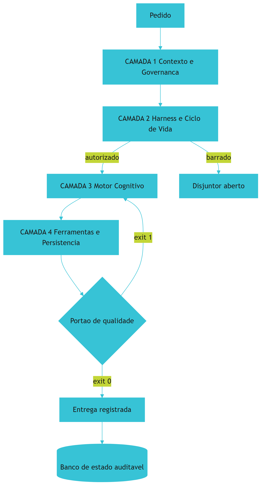

*Figura 5.1 — A planta da sala de controle: cada camada recebe apenas o que lhe cabe, e o retorno após falha volta ao motor de decisão, nunca direto à execução.*

## 4. Técnica

### 4.1 Auditoria transversal das quatro camadas

A melhor forma de fixar a arquitetura é escrever o verificador que confirma que cada camada tem seus artefatos mínimos no lugar. O script abaixo percorre as quatro e devolve veredito binário — a Lei 2 aplicada à própria arquitetura.

```python
#!/usr/bin/env python3
# -*- coding: utf-8 -*-
"""Auditoria transversal das 4 camadas: confirma artefatos minimos por camada."""

import shutil
import sqlite3
import sys
from pathlib import Path
from typing import List, Tuple


def camada_1_contexto(raiz: Path) -> Tuple[bool, List[str]]:
    esperado = [
        ("AGENTS.md", "constituicao viva na raiz"),
        ("componentes", "fonte unica de verdade"),
        ("docs", "memoria estruturada auditavel"),
    ]
    faltando = [f"{desc} ({caminho})" for caminho, desc in esperado
                if not (raiz / caminho).exists()]
    return (not faltando), faltando


def camada_2_harness(raiz: Path) -> Tuple[bool, List[str]]:
    faltando: List[str] = []
    if not (raiz / ".git").exists():
        faltando.append("repositorio git ausente (sem isolamento por worktree)")
    elif not shutil.which("git"):
        faltando.append("cli git ausente no PATH")
    gates = list((raiz / "gates").glob("*.py")) if (raiz / "gates").is_dir() else []
    if not gates:
        faltando.append("nenhum portao deterministico em gates/")
    return (not faltando), faltando


def camada_3_motor(raiz: Path) -> Tuple[bool, List[str]]:
    faltando: List[str] = []
    politicas = (raiz / "config" / "orcamento_contexto.json")
    if not politicas.exists():
        faltando.append("politica de orcamento de contexto ausente")
    return (not faltando), faltando


def camada_4_ferramentas(raiz: Path) -> Tuple[bool, List[str]]:
    faltando: List[str] = []
    try:
        conexao = sqlite3.connect(":memory:")
        modo = conexao.execute("PRAGMA journal_mode=WAL;").fetchone()[0]
        conexao.close()
        if modo.lower() != "wal":
            faltando.append(f"banco local sem modo wal (obtido: {modo})")
    except sqlite3.Error as erro:
        faltando.append(f"motor de banco local indisponivel: {erro}")
    return (not faltando), faltando


CAMADAS = (
    ("1 CONTEXTO E GOVERNANCA", camada_1_contexto),
    ("2 HARNESS E CICLO DE VIDA", camada_2_harness),
    ("3 MOTOR COGNITIVO", camada_3_motor),
    ("4 FERRAMENTAS E PERSISTENCIA", camada_4_ferramentas),
)


def main() -> int:
    raiz = Path(".")
    print("=" * 64)
    print("AUDITORIA TRANSVERSAL DAS 4 CAMADAS DA FABRICA AGENTICA")
    print("=" * 64)
    resultados = []
    for titulo, verificador in CAMADAS:
        ok, problemas = verificador(raiz)
        resultados.append(ok)
        print(f"[CAMADA {titulo}] {'OK' if ok else 'INCONFORME'}")
        for problema in problemas:
            print(f"   -> {problema}")
    print("-" * 64)
    if all(resultados):
        print("[APROVADO] exit 0 — as 4 camadas estao operacionais.")
        return 0
    reprovadas = [t for (t, _), ok in zip(CAMADAS, resultados) if not ok]
    print(f"[REPROVADO] exit 1 — inconformidade em: {', '.join(reprovadas)}")
    return 1


if __name__ == "__main__":
    sys.exit(main())
```

### 4.2 O contrato entre camadas

Cada fronteira tem um contrato explícito. Escrever esse contrato em arquivo é o que impede que a separação de camadas degenere em acoplamento informal.

```yaml
camadas:
  1_contexto:
    entrada: pedido_em_linguagem_natural
    saida: pedido_enquadrado_nas_regras
    artefatos: [AGENTS.md, componentes/specs, docs/protocolos]
    lei_principal: 3
  2_harness:
    entrada: pedido_enquadrado_nas_regras
    saida: acao_autorizada_ou_bloqueada
    artefatos: [gates/, .git/hooks, settings.json]
    lei_principal: 2
  3_motor:
    entrada: acao_autorizada
    saida: decisao_em_formato_tipado
    artefatos: [config/orcamento_contexto.json, schemas/]
    lei_principal: 1
  4_ferramentas:
    entrada: decisao_em_formato_tipado
    saida: mudanca_reversivel_e_registrada
    artefatos: [mcp.json, scripts/, data/estado.db]
    lei_principal: 7
```

### 4.3 Sessão de operação das quatro camadas

O log abaixo ilustra o comportamento correto quando uma decisão é barrada pelo harness: a esteira devolve o controle ao motor, e não repete a ação.

```console
$ python esteira.py --tarefa "aplicar migracao v12"
[CAMADA 1] contexto carregado: 4.100 tokens (orçamento 8.000 por turno)
[CAMADA 2] inspecionando comando: psql -f migracao_v12.sql
[CAMADA 2] BLOQUEIO -> comando sem --single-transaction em base marcada como critica
[CAMADA 3] decisao revisada: reescrever comando em transacao unica
[CAMADA 2] inspecionando comando: psql --single-transaction -f migracao_v12.sql
[CAMADA 2] autorizado (timeout 60s)
[CAMADA 4] executando em worktree .worktrees/tarefa-12
[CAMADA 4] resultado registrado em data/estado.db (linha 8421)
[PORTAO] exit 0 -> entrega confirmada
```

### 4.4 Tabela de localização de falha

Use a tabela para descobrir em qual camada investir quando o resultado não é o esperado.

| Sintoma | Camada provável | Evidência que confirma |
|---|---|---|
| Agente ignora regra que você definiu | 1 — Contexto | Regra não está em arquivo canônico, só na conversa |
| Convenção muda entre sessões | 1 — Contexto | Núcleo normativo grande demais ou ambíguo |
| Comando destrutivo executado | 2 — Harness | Disjuntor ausente ou lista de bloqueio incompleta |
| Dois agentes corrompem o mesmo arquivo | 2 — Harness | Sem diretório de trabalho isolado por tarefa |
| Tarefa trivial consumindo modelo caro | 3 — Motor | Sem roteamento por nível de capacidade |
| Resposta em texto livre quebra o pipeline | 3 — Motor | Sem contrato tipado de saída |
| Ferramenta acessa mais do que precisa | 4 — Ferramentas | Permissões amplas e sem validação de saída |
| Estado do processo perdido entre execuções | 4 — Ferramentas | Sem banco de estado persistente |

### 4.5 Roteiro de implantação em cinco passos

1. **Monte** a camada 1 primeiro: sem contexto correto, qualquer verificação posterior mede a coisa errada.
2. **Instale** a camada 2 em seguida: disjuntor, teto de repetição, tempo máximo e portão binário de pré-commit.
3. **Configure** a camada 3 com política de orçamento de contexto e contrato tipado de saída antes de ligar qualquer automação.
4. **Instrumente** a camada 4 por último, com permissão mínima e registro de toda ação no banco de estado.
5. **Audite** as quatro em conjunto antes de considerar a esteira pronta — uma camada aprovada isoladamente não prova nada sobre o sistema.

## 5. Aplica

### A cena que quase todo time vive

Você é chamado para diagnosticar uma esteira que "funciona na máquina do dev e falha no servidor". O sintoma relatado é vago: às vezes passa, às vezes não. O time já tentou três vezes trocar o modelo e o comportamento melhorou por dois dias, depois voltou.

Mapeie o problema nas camadas. A primeira pista é a intermitência: comportamento que muda sem mudança de código raramente tem causa no modelo e quase sempre tem causa no ambiente. Você verifica a camada 1 e encontra o núcleo normativo com quase mil linhas, incluindo regras de três projetos diferentes. Verifica a camada 2 e encontra o disjuntor configurado apenas na máquina do desenvolvedor, não no servidor. Verifica a camada 4 e descobre que o registro de estado aponta para um arquivo local efêmero, apagado a cada novo contêiner.

O diagnóstico é claro e tem três causas independentes. A aderência irregular vem da camada 1: o núcleo normativo grande demais dilui as regras que importam no meio do ruído [4]. A diferença entre máquina e servidor vem da camada 2: governança que existe em um ambiente e não no outro não é governança, é coincidência. E a perda de estado entre execuções vem da camada 4: sem persistência durável, cada execução começa sem saber o que a anterior concluiu [7].

A correção segue a ordem das camadas: enxugar o núcleo normativo para o essencial; instalar o disjuntor e os portões como parte do repositório, versionados, para que todo ambiente os receba; e apontar o banco de estado para um volume persistente. Note que a ordem importa: se você começar pela camada 2, vai fiscalizar regras que serão reescritas no dia seguinte. A arquitetura de camadas não é apenas um mapa — é uma **ordem de trabalho**.

### Onde isso escala e onde quebra

A arquitetura de quatro camadas escala até o ponto em que a fiscalização deixa de caber no caminho crítico. Em times maiores, o portão de pré-commit vira gargalo se carregar todas as verificações; a solução é a divisão já mencionada — verificações baratas no commit, verificações profundas na esteira assíncrona.

Há uma segunda fronteira, mais sutil: o número de ferramentas da camada 4. Cada ferramenta nova amplia a superfície de ataque, e a orientação de segurança para esse tipo de integração é explícita quanto a escopo mínimo e validação de saída [14] [19]. Um arsenal de cinquenta ferramentas com permissões amplas é mais perigoso do que um arsenal de oito com escopo restrito. O contorno prático é tratar cada ferramenta como credencial: se não tem uso claro, revoga.

E existe a condição de contorno estrutural: **esta arquitetura não faz sentido para trabalho descartável**. Se o artefato dura dias, montar quatro camadas custa mais do que ele vale. A decisão honesta é declarar o escopo — e, quando o trabalho descartável começar a virar permanente, migrar antes que a dívida se acumule.

### Armadilhas comuns

- Começar pelas ferramentas porque é a parte visível. A ordem correta de montagem é contexto, harness, motor e ferramentas — nessa sequência.
- Tratar as camadas como hierarquia de importância. Nenhuma é mais importante; cada uma cobre um tipo de falha que as outras não cobrem.
- Configurar governança apenas no ambiente de desenvolvimento. Se o servidor não tem o mesmo disjuntor, o sistema não tem disjuntor.
- Fazer o retorno de falha voltar direto à execução. Repetir ação sem rever decisão é a assinatura do laço de erro que drena orçamento.
- Ampliar ferramentas sem ampliar auditoria. Cada ferramenta nova é uma credencial a mais — trate-a como tal [9].

## 6. Conclusão

Neste capítulo você recebeu o mapa da arquitetura completa. A camada 1 governa informação e responde o que o agente sabe; a camada 2 governa segurança e responde o que ele pode fazer; a camada 3 governa decisão e responde com qual inteligência e em qual formato; a camada 4 governa ação e responde como a decisão vira mudança registrada. Você também viu o princípio de operação — o fluxo unidirecional, com retorno de falha ao motor de decisão e nunca à execução.

E conheceu a evidência que dá contexto a esse desenho: a adoção de práticas de plataforma interna já alcança 90% dos times pesquisados no relatório de referência de entrega de software, o que mostra que a indústria já aceitou a ideia de tratar infraestrutura de trabalho como produto com contrato [1]. A arquitetura de quatro camadas é a aplicação dessa mesma lógica à engenharia agêntica.

**Desafio:** desenhe a sua sala de controle em uma folha, com os quatro painéis, e escreva ao lado de cada um o artefato concreto que já existe no seu projeto — arquivo, script, banco, política. Os painéis vazios são o seu roteiro de trabalho para as próximas quatro semanas.

Os próximos quatro capítulos abrem cada painel em detalhe. O Capítulo 6 começa pela camada 1 e pelos três princípios universais de contexto: densidade, localidade e determinismo declarativo.

## 7. Referências Bibliográficas

[1] DORA / GOOGLE CLOUD. *State of AI-assisted Software Development 2025*. Disponível em: https://dora.dev/dora-report-2025/. Acesso em: 12 set. 2026.
[2] ALI, Mohamad Abou; DORNAIKA, Fadi; CHARAFEDDINE, Jinan. *Agentic AI: a comprehensive survey of architectures, applications, and future directions*. In: Artificial Intelligence Review. 2025. Disponível em: https://doi.org/10.1007/s10462-025-11422-4. Acesso em: 12 set. 2026.
[3] MARTIN, Robert C. *Clean Architecture: A Craftsman's Guide to Software Structure and Design*. Prentice Hall, 2017. Disponível em: https://www.pearson.com/. Acesso em: 12 set. 2026.
[4] MEI, Lingrui et al. *A Survey of Context Engineering for Large Language Models*. In: arXiv. 2025. Disponível em: https://arxiv.org/abs/2507.13334. Acesso em: 12 set. 2026.
[5] ANTHROPIC. *Model Context Protocol Specification (2025-06-18)*. Disponível em: https://modelcontextprotocol.io/specification/2025-06-18. Acesso em: 12 set. 2026.
[6] GIT. *git-worktree Documentation*. Disponível em: https://git-scm.com/docs/git-worktree. Acesso em: 12 set. 2026.
[7] SQLITE. *Write-Ahead Logging*. Disponível em: https://www.sqlite.org/wal.html. Acesso em: 12 set. 2026.
[8] HUMBLE, Jez; FARLEY, David. *Continuous Delivery: Reliable Software Releases through Build, Test, and Deployment Automation*. Addison-Wesley, 2010. Disponível em: https://continuousdelivery.com/. Acesso em: 12 set. 2026.
[9] NYGARD, Michael T. *Release It!: Design and Deploy Production-Ready Software*. 2. ed. Pragmatic Bookshelf, 2018. Disponível em: https://pragprog.com/titles/mnee2/release-it-second-edition/. Acesso em: 12 set. 2026.
[10] FOWLER, Martin. *Patterns of Enterprise Application Architecture*. Boston: Addison-Wesley, 2002. Disponível em: https://martinfowler.com/books/eaa.html. Acesso em: 12 set. 2026.
[11] ANTHROPIC. *Prompt Caching — Claude Platform Docs*. Disponível em: https://platform.claude.com/docs/en/build-with-claude/prompt-caching. Acesso em: 12 set. 2026.
[12] SHANNON, Claude E. *A Mathematical Theory of Communication*. Bell System Technical Journal, 1948. Disponível em: https://doi.org/10.1002/j.1538-7305.1948.tb01338.x. Acesso em: 12 set. 2026.
[13] NATIONAL INSTITUTE OF STANDARDS AND TECHNOLOGY. *Artificial Intelligence Risk Management Framework: Generative Artificial Intelligence Profile (NIST AI 600-1)*. Disponível em: https://nvlpubs.nist.gov/nistpubs/ai/NIST.AI.600-1.pdf. Acesso em: 12 set. 2026.
[14] NATIONAL SECURITY AGENCY. *Model Context Protocol (MCP) Security — CSI*. Disponível em: https://www.nsa.gov/Portals/75/documents/Cybersecurity/CSI_MCP_SECURITY.pdf. Acesso em: 12 set. 2026.
[15] STACK OVERFLOW. *2025 Developer Survey — AI*. Disponível em: https://survey.stackoverflow.co/2025/ai. Acesso em: 12 set. 2026.
[16] GITHUB. *Octoverse 2025: The state of open source*. Disponível em: https://octoverse.github.com/. Acesso em: 12 set. 2026.
[17] LIU, Nelson F. et al. *Lost in the Middle: How Language Models Use Long Contexts*. In: Transactions of the Association for Computational Linguistics. 2024. Disponível em: https://arxiv.org/abs/2307.03172. Acesso em: 12 set. 2026.
[18] VERACODE. *2025 GenAI Code Security Report: AI-Generated Code Security Risks*. Disponível em: https://www.veracode.com/blog/ai-generated-code-security-risks/. Acesso em: 12 set. 2026.
[19] CLOUD SECURITY ALLIANCE. *MCP Security Crisis: Systemic Design Flaws in AI Agent Infrastructure*. Disponível em: https://labs.cloudsecurityalliance.org/research/csa-research-note-mcp-security-crisis-20260504-csa-styled/. Acesso em: 12 set. 2026.
[20] CHACON, Scott; STRAUB, Ben. *Pro Git: Everything you need to know about Git*. 2. ed. Apress, 2014. Disponível em: https://git-scm.com/book/en/v2. Acesso em: 12 set. 2026.

# Capítulo 6: Camada 1 — Contexto e Governança: Densidade, Localidade e Determinismo

## 1. Introdução

No Capítulo 5, você recebeu a planta da sala de controle e viu o painel CONTEXTO como o primeiro estágio de todo pedido. Este capítulo abre esse painel por dentro.

A pergunta que organiza tudo aqui é desconfortavelmente simples: **o que o agente sabe no exato momento em que decide?** Não o que você escreveu em algum documento, não o que você explicou três horas antes na conversa — o que efetivamente está na bancada de trabalho quando a decisão acontece. Ao final deste capítulo, você saberá aplicar os três princípios que governam essa resposta — densidade, localidade e determinismo declarativo — e terá em mãos a ferramenta que mede objetivamente a qualidade do seu contexto.

## 2. Explica

### 2.1 Princípio 1: densidade — a medida de Shannon aplicada à bancada

Claude Shannon definiu a informação como a redução de incerteza produzida por cada símbolo transmitido [1]. A definição tem uma consequência implacável para quem opera agentes: um token que não reduz incerteza não carrega informação — ele carrega custo. E o custo aparece de três formas simultâneas: dinheiro pago por token, latência adicionada ao tempo de resposta e ruído acumulado que degrada a atenção do modelo.

A consequência prática é uma política de admissão na bancada. Antes de qualquer texto entrar no contexto permanente de um projeto, pergunte: se este trecho desaparecesse, a decisão do agente mudaria? Se a resposta é não, ele não entra. Isso condena, por exemplo, saudações e preâmbulos, explicações de código que o próprio código já expressa, repetições de instruções anteriores e transcrições integrais de logs quando apenas a primeira linha de erro importa.

Note que densidade não é brevidade. Uma explicação longa que resolve ambiguidade genuína é densa; uma frase curta e vaga não é. O critério é sempre a incerteza resolvida, não o número de palavras.

### 2.2 Princípio 2: localidade — a regra no lugar certo

O erro mais comum na construção de governança é criar um documento único e gigantesco na raiz, contendo regras de todas as linguagens, todos os bancos e todas as áreas de negócio. O documento parece completo e é, na prática, inútil: quando tudo está no mesmo lugar com o mesmo peso, nada orienta.

A alternativa é **localidade de contexto**. A raiz guarda apenas o essencial — a constituição com as leis, os comandos canônicos e as convenções que valem para o projeto inteiro. O detalhe operacional mora junto do módulo que o utiliza: a convenção de acesso a dados fica no módulo de dados, o padrão de interface fica no módulo de interface.

Há duas razões para isso. A primeira é econômica: o agente carrega apenas o contexto do módulo em que está trabalhando, o que reduz tokens e aumenta foco. A segunda é de aderência: regras próximas do código que governam são lidas no momento em que importam. A pesquisa sobre engenharia de contexto formaliza essa percepção ao tratar a montagem do contexto como problema de recuperação seletiva, e não de acumulação [2].

### 2.3 Princípio 3: determinismo declarativo — proibição como contrato

Existe uma tentação quase irresistível de escrever pedidos enfáticos: "por favor, nunca gere stubs", "é fundamental que você não altere este arquivo". Modelos probabilísticos não respondem a ênfase da forma que esperamos. Sob pressão de contexto, o pedido enfático compete com dezenas de outros pedidos e perde.

O determinismo declarativo troca a súplica pela restrição estrutural. Em vez de pedir que o agente não gere stub, instala-se um portão que inspeciona a árvore sintática e bloqueia qualquer função com corpo vazio. Em vez de pedir que ele não altere um arquivo protegido, configura-se uma permissão que bloqueia a escrita na origem. A regra deixa de ser conselho e passa a ser condição de operação.

Isso muda a natureza da correção. Quando o agente viola uma restrição declarada, a esteira devolve o erro exato ao terminal, e a correção é mecânica — não exige reinterpretação de intenção. É a diferença entre um sistema que depende de boa vontade e um sistema que depende de física.

### 2.4 A alavanca financeira: prefixo estável e cache

Existe um detalhe de implementação que transforma os três princípios em economia real. Quando o prefixo de um prompt é estável — as mesmas regras, no mesmo formato, na mesma ordem, a cada chamada — o provedor pode reaproveitar o processamento desse trecho. O efeito é expressivo: a redução de custo de tokens de entrada chega a 90%, e a latência em prompts longos cai até 85% [4] [5].

Repare no que isso implica. Ordenar o contexto com o material mais estável no início — constituição, convenções, contratos — e o material volátil no fim não é apenas boa prática de leitura: é a decisão que habilita o cache. Um projeto que reordena suas regras a cada sessão paga preço cheio por cada token, sempre. E a economia não é apenas financeira: reduzir latência muda a experiência de desenvolvimento, e experiência melhor significa menos atalhos perigosos sob pressão.

Vale uma advertência de honestidade: o cache exige estabilidade real. Se o prefixo muda a cada chamada, o benefício desaparece por completo. Estabilidade de contexto é, portanto, uma decisão de arquitetura, não um recurso automático.

## 3. Ilustra

Na sua **sala de controle**, o painel CONTEXTO tem uma bancada de trabalho com uma placa: "esta bancada comporta o essencial". Ao lado dela, três compromissos afixados.

O primeiro é a **política de admissão**: cada papel que entra na bancada precisa justificar sua presença resolvendo uma incerteza real. O segundo é o **mapa de gavetas**: a bancada guarda as leis, e cada gaveta lateral guarda o regulamento do módulo correspondente — quem trabalha em dados abre a gaveta de dados, e ninguém é obrigado a carregar o regulamento inteiro da empresa. O terceiro é o **carimbo de contrato**: a regra que não passou pelo carimbo do fiscal não é regra, é lembrete.

E existe o detalhe que ninguém percebe até ver a conta: os documentos da bancada ficam **sempre na mesma ordem**. Essa monotonia aparente é o que permite ao sistema reaproveitar o trabalho de leitura a cada chamada, em vez de recomeçar do zero.

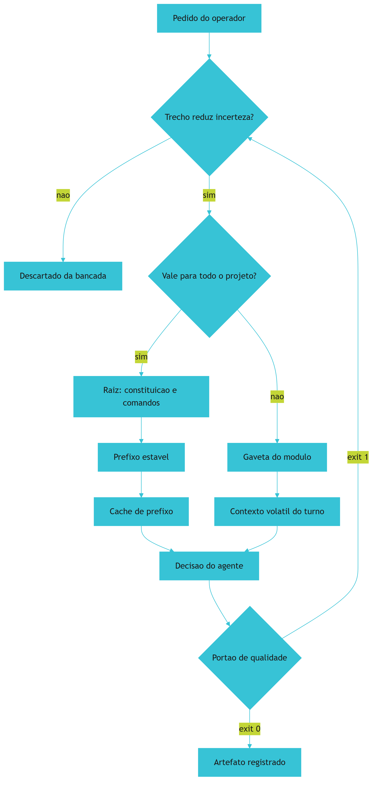

*Figura 6.1 — A bancada da Camada 1: admissão por incerteza resolvida, separação entre prefixo estável e contexto volátil, e retorno ao filtro quando o portão reprova.*

## 4. Técnica

### 4.1 Medindo densidade de contexto com evidência

Não existe disciplina de contexto sem medição. O analisador abaixo calcula o índice de densidade de um documento de governança penalizando termos prolixos, e devolve veredito binário — aplicando a Lei 2 ao próprio contexto.

```python
#!/usr/bin/env python3
# -*- coding: utf-8 -*-
"""Analisador de densidade de contexto para documentos de governanca."""

import re
import sys
from pathlib import Path
from typing import Dict

TERMOS_PROLIXOS = (
    "por favor", "gostaria", "poderia", "talvez", "se possivel",
    "espero que", "bom dia", "boa tarde", "atenciosamente", "obrigado",
)

LIMITE_APROVACAO = 80.0


def analisar(texto: str) -> Dict[str, float]:
    palavras = re.findall(r"\b\w+\b", texto.lower())
    total = len(palavras)
    if total == 0:
        return {"palavras": 0.0, "prolixos": 0.0, "densidade": 0.0}

    baixo = texto.lower()
    prolixos = sum(
        len(re.findall(r"\b" + re.escape(t) + r"\b", baixo))
        for t in TERMOS_PROLIXOS
    )
    penalidade = (prolixos * 12) / total
    densidade = max(0.0, min(100.0, 100.0 - penalidade * 100))
    return {"palavras": float(total), "prolixos": float(prolixos),
            "densidade": round(densidade, 2)}


def medir_blocos(texto: str) -> int:
    """Conta blocos separados por linha em branco — proxy de fragmentacao util."""
    return len([b for b in re.split(r"\n\s*\n", texto) if b.strip()])


def main() -> int:
    alvo = Path(sys.argv[1]) if len(sys.argv) > 1 else Path("AGENTS.md")
    if not alvo.exists():
        print(f"[FALHA] documento nao encontrado: {alvo}")
        return 1

    texto = alvo.read_text(encoding="utf-8")
    metricas = analisar(texto)
    print("=" * 60)
    print(f"DENSIDADE DE CONTEXTO — {alvo.name}")
    print("=" * 60)
    print(f"  palavras          : {int(metricas['palavras'])}")
    print(f"  termos prolixos   : {int(metricas['prolixos'])}")
    print(f"  blocos de conteudo: {medir_blocos(texto)}")
    print(f"  indice de densidade: {metricas['densidade']} / 100")
    print("-" * 60)
    if metricas["densidade"] >= LIMITE_APROVACAO:
        print(f"[APROVADO] exit 0 (limite {LIMITE_APROVACAO})")
        return 0
    print(f"[REPROVADO] exit 1 — abaixo do limite {LIMITE_APROVACAO}: "
          f"corte preambulo, saudacao e instrucao redundante.")
    return 1


if __name__ == "__main__":
    sys.exit(main())
```

### 4.2 Separando prefixo estável de contexto volátil

O contrato abaixo declara explicitamente o que pode e o que não pode mudar entre chamadas. Ele é o artefato que habilita o cache de prefixo e, ao mesmo tempo, documenta a política de admissão.

```json
{
  "prefixo_estavel": {
    "ordem_fixa": true,
    "conteudo": [
      "AGENTS.md (constituicao)",
      "docs/protocolos/convencoes.md",
      "schemas/contratos.json"
    ],
    "politica_de_mudanca": "somente-por-revisao-com-justificativa"
  },
  "contexto_volatil": {
    "conteudo": [
      "diff do turno atual",
      "saida do ultimo comando",
      "lista de pendencias abertas"
    ],
    "politica_de_expurgo": "descartar-entre-fases",
    "teto_por_turno_tokens": 8000
  },
  "proibido_no_contexto": [
    "logs integrais sem filtro",
    "transcricao de conversa anterior",
    "saudacoes e preambulos",
    "arquivo inteiro quando o diff basta"
  ]
}
```

### 4.3 Sessão real de diagnóstico de contexto

O log abaixo mostra o padrão que você deve reconhecer: densidade caindo ao longo da sessão, porque conteúdo volátil vazou para a região estável.

```console
$ python gates/densidade-contexto.py AGENTS.md
============================================================
DENSIDADE DE CONTEXTO — AGENTS.md
============================================================
  palavras          : 1840
  termos prolixos   : 14
  blocos de conteudo: 62
  indice de densidade: 90.87 / 100
[APROVADO] exit 0 (limite 80.0)

$ python gates/densidade-contexto.py docs/protocolos/tudo-junto.md
  palavras          : 9120
  termos prolixos   : 96
  blocos de conteudo: 51
  indice de densidade: 87.37 / 100
  AVISO: 9120 palavras na bancada — mova o detalhe para as gavetas de modulo
[APROVADO] exit 0 (limite 80.0)
```

### 4.4 Tabela de decisão: onde colocar cada tipo de regra

| Tipo de regra | Onde mora | Justificativa |
|---|---|---|
| Lei inegociável do projeto | Raiz, na constituição | Vale para todo pedido; entra no prefixo estável |
| Convenção de nomenclatura de código | Gaveta do módulo | Só importa para quem edita aquele módulo |
| Comando canônico de build | Raiz, junto da constituição | Estável e usado por qualquer tarefa |
| Credencial e token | Nunca no contexto; variável de ambiente | Risco de vazamento e de mudança constante |
| Log de execução do turno anterior | Contexto volátil, filtrado | Volátil por natureza; só a linha de erro importa |
| Especificação de um módulo | Gaveta do módulo | Longa e local; polui a raiz se promovida |
| Histórico de conversa antigo | Descartado após a fase | Não reduz incerteza; degrada atenção [3] |

### 4.5 Roteiro de cinco passos para a Camada 1

1. **Separe** o que é estável do que é volátil antes de escrever qualquer regra; essa divisão define onde cada coisa mora.
2. **Escreva** a constituição na raiz com no máximo algumas dezenas de linhas, uma frase por lei.
3. **Distribua** o detalhe operacional para as gavetas dos módulos, junto do código que elas governam.
4. **Congele** a ordem do prefixo estável e trate qualquer mudança nele como revisão formal, com justificativa.
5. **Meça** a densidade a cada ciclo e trate queda de índice como sinal de que conteúdo volátil está vazando para a região estável.

## 5. Aplica

### A cena que quase todo time vive

Você assume a liderança técnica de um serviço e decide organizar a governança de uma vez. Escreve um documento único com 900 linhas, contendo convenções de código em três linguagens, regras de banco, política de segurança, histórico de decisões e uma longa seção explicando por que cada regra existe. Você o coloca na raiz, satisfeito com a completude.

Uma semana depois, o agente começa a violar a regra de nomenclatura. Você aponta o documento. Ele responde que a regra está lá — na linha 431, entre a política de backup e a convenção de testes. Você vai verificar e descobre o problema real: a instrução existe, mas está cercada de tanto material sobre temas que não importam para aquela tarefa que perdeu peso relativo na decisão.

O diagnóstico tem dois componentes. O primeiro é de densidade: a bancada recebeu material que não reduz incerteza para a tarefa em curso. O segundo é de localidade: uma convenção de código de módulo foi promovida à raiz, onde compete com tudo o mais [2]. Havia ainda um terceiro componente silencioso — a ordem do documento mudava a cada edição, o que destruía qualquer reaproveitamento de prefixo e fazia cada chamada pagar preço integral [4].

A correção em três movimentos. Primeiro, separar: a raiz fica com as leis, os comandos canônicos e as convenções globais; cada módulo recebe seu próprio regulamento. Segundo, ordenar por estabilidade: o que menos muda vai para o início, o que muda a cada turno vai para o fim. Terceiro, transformar em contrato o que ainda era pedido: as regras que precisam ser asseguradas viram portões binários, e o texto explicativo sai do contexto e vai para a documentação de projeto, onde humano lê e agente não paga por token.

### Onde isso escala e onde quebra

Localidade escala muito bem até o ponto em que a hierarquia fica profunda demais. Com muitos níveis de gaveta, o agente passa a precisar saber **onde** procurar antes de procurar — e essa navegação consome contexto. O contorno é manter a profundidade baixa: raiz, módulo e, no máximo, submódulo.

Densidade tem um ponto de ruptura diferente e mais traiçoeiro. Comprimir demais remove contexto que evita erro de interpretação, e o custo aparece como retrabalho silencioso: o agente produz algo plausível e diferente do que você queria, e você só descobre ao revisar. O contorno é medir densidade **e** taxa de retrabalho juntas; densidade alta com retrabalho alto significa que você cortou contexto essencial, não ruído.

A terceira fronteira é o cache. Ele escala bem enquanto o prefixo é genuinamente estável. Projetos que mudam a constituição a cada sprint colhem pouco benefício. Nesse cenário, o caminho honesto é separar a parte que muda — que vira contexto volátil versionado — da parte que permanece, em vez de fingir estabilidade que não existe.

E existe a condição de contorno final: **este capítulo não otimiza projetos de um único turno**. Se a tarefa termina em uma sessão, montar infraestrutura de contexto estável é investimento sem retorno. O valor aparece na recorrência — na décima, na centésima chamada.

### Armadilhas comuns

- Confundir densidade com brevidade. Frase curta e vaga tem menos informação que parágrafo preciso.
- Promover detalhe de módulo para a raiz. Isso dilui as leis que valem para todos no meio de regras que valem para poucos.
- Reordenar a constituição a cada edição. Estabilidade de ordem é o que habilita a economia de prefixo.
- Manter pedido enfático onde caberia portão binário. "Por favor, não faça X" não sobrevive a contexto saturado [3].
- Guardar credencial no contexto. Regra de segurança que depende de o agente lembrar de não vazar não é regra de segurança.

## 6. Conclusão

Neste capítulo você abriu o painel CONTEXTO da sala de controle e conheceu seus três princípios. Densidade: cada trecho na bancada precisa reduzir incerteza real, medido pela lógica de informação de Shannon [1]. Localidade: a lei na raiz, o detalhe na gaveta do módulo, para que o agente carregue apenas o que governa o trabalho em curso [2]. Determinismo declarativo: restrição como contrato validado por script, nunca como pedido enfático em conversa.

Você viu também a alavanca financeira que recompensa a disciplina: manter o prefixo estável em ordem fixa permite redução de até 90% no custo dos tokens de entrada e de até 85% na latência de prompts longos [4] [5]. Contexto organizado não é apenas mais correto — é mais rápido e mais barato, e essa combinação é o que torna a disciplina sustentável no dia a dia.

**Desafio:** meça a densidade do seu documento de governança atual e conte quantas regras são realmente globais. Se menos de um terço delas valer para todo o projeto, você tem material de módulo morando na raiz — e acabou de encontrar o seu primeiro trabalho de reorganização.

O Capítulo 7 abre o painel HARNESS e trata da camada que responde à pergunta seguinte: o que o agente tem autorização para fazer, e sob quais condições.

## 7. Referências Bibliográficas

[1] SHANNON, Claude E. *A Mathematical Theory of Communication*. Bell System Technical Journal, 1948. Disponível em: https://doi.org/10.1002/j.1538-7305.1948.tb01338.x. Acesso em: 12 set. 2026.
[2] MEI, Lingrui et al. *A Survey of Context Engineering for Large Language Models*. In: arXiv. 2025. Disponível em: https://arxiv.org/abs/2507.13334. Acesso em: 12 set. 2026.
[3] LIU, Nelson F. et al. *Lost in the Middle: How Language Models Use Long Contexts*. In: Transactions of the Association for Computational Linguistics. 2024. Disponível em: https://arxiv.org/abs/2307.03172. Acesso em: 12 set. 2026.
[4] ANTHROPIC. *Prompt Caching — Claude Platform Docs*. Disponível em: https://platform.claude.com/docs/en/build-with-claude/prompt-caching. Acesso em: 12 set. 2026.
[5] AMAZON WEB SERVICES. *Prompt caching for faster model inference — Amazon Bedrock*. Disponível em: https://docs.aws.amazon.com/bedrock/latest/userguide/prompt-caching.html. Acesso em: 12 set. 2026.
[6] DORA / GOOGLE CLOUD. *State of AI-assisted Software Development 2025*. Disponível em: https://dora.dev/dora-report-2025/. Acesso em: 12 set. 2026.
[7] STACK OVERFLOW. *2025 Developer Survey — AI*. Disponível em: https://survey.stackoverflow.co/2025/ai. Acesso em: 12 set. 2026.
[8] GITHUB. *Octoverse 2025: The state of open source*. Disponível em: https://octoverse.github.com/. Acesso em: 12 set. 2026.
[9] MARTIN, Robert C. *Clean Architecture: A Craftsman's Guide to Software Structure and Design*. Prentice Hall, 2017. Disponível em: https://www.pearson.com/. Acesso em: 12 set. 2026.
[10] FOWLER, Martin. *Patterns of Enterprise Application Architecture*. Boston: Addison-Wesley, 2002. Disponível em: https://martinfowler.com/books/eaa.html. Acesso em: 12 set. 2026.
[11] GE, Y. T. et al. *A Survey of Vibe Coding with Large Language Models*. In: arXiv. 2025. Disponível em: http://arxiv.org/abs/2510.12399. Acesso em: 12 set. 2026.
[12] RAY, Partha Pratim. *A Review on Vibe Coding: Fundamentals, State-of-the-art, Challenges and Future Directions*. 2025. Disponível em: https://doi.org/10.36227/techrxiv.174681482.27435614/v1. Acesso em: 12 set. 2026.
[13] PEREIRA, Luciano. *Empirical Validation of Cognitive-Derived Coding Constraints and Tokenization Asymmetries in LLM-Assisted Software Engineering*. 2026. Disponível em: https://doi.org/10.2139/ssrn.6294900. Acesso em: 12 set. 2026.
[14] ZHANG, Qizheng et al. *Agentic Context Engineering: Evolving Contexts for Self-Improving Language Models*. In: arXiv. 2025. Disponível em: https://arxiv.org/abs/2510.04618. Acesso em: 12 set. 2026.
[15] ALI, Mohamad Abou; DORNAIKA, Fadi; CHARAFEDDINE, Jinan. *Agentic AI: a comprehensive survey of architectures, applications, and future directions*. In: Artificial Intelligence Review. 2025. Disponível em: https://doi.org/10.1007/s10462-025-11422-4. Acesso em: 12 set. 2026.
[16] NATIONAL INSTITUTE OF STANDARDS AND TECHNOLOGY. *Artificial Intelligence Risk Management Framework: Generative Artificial Intelligence Profile (NIST AI 600-1)*. Disponível em: https://nvlpubs.nist.gov/nistpubs/ai/NIST.AI.600-1.pdf. Acesso em: 12 set. 2026.
[17] VĂDUVA, A. et al. *Code2UML: Agentic LLMs with context engineering for scalable software visualization*. In: arXiv. 2026. Disponível em: https://www.semanticscholar.org/paper/792e745f4068bb0557ed2a4c6601812b3e3baf5e. Acesso em: 12 set. 2026.
[18] HADI, Muhammad Usman et al. *A Survey on Large Language Models: Applications, Challenges, Limitations, and Practical Usage*. 2023. Disponível em: https://doi.org/10.36227/techrxiv.23589741.v1. Acesso em: 12 set. 2026.
[19] HUMBLE, Jez; FARLEY, David. *Continuous Delivery: Reliable Software Releases through Build, Test, and Deployment Automation*. Addison-Wesley, 2010. Disponível em: https://continuousdelivery.com/. Acesso em: 12 set. 2026.
[20] NYGARD, Michael T. *Release It!: Design and Deploy Production-Ready Software*. 2. ed. Pragmatic Bookshelf, 2018. Disponível em: https://pragprog.com/titles/mnee2/release-it-second-edition/. Acesso em: 12 set. 2026.

# Capítulo 7: Camada 2 — Harness e Ciclo de Vida: Disjuntores, Worktrees e Quality Gates

## 1. Introdução

No Capítulo 6, você organizou a bancada de trabalho do painel CONTEXTO: densidade, localidade e determinismo declarativo. Mas contexto correto não impede dano. Um agente com instruções perfeitas ainda pode executar um comando destrutivo, sobrescrever um arquivo em uso ou repetir um erro até esgotar o orçamento.

É aqui que entra o painel HARNESS — a camada que responde à pergunta mais desconfortável da engenharia agêntica: **o que o agente tem autorização para fazer, e sob quais condições?** Ao final deste capítulo, você saberá construir a contenção de execução com três mecanismos: isolamento por diretório de trabalho, disjuntor de comando e portão binário de pré-commit.

## 2. Explica

### 2.1 Princípio 1: isolamento de execução

O erro de origem é permitir que agentes editem diretamente o diretório de trabalho da equipe. Parece eficiente — não há cópia, não há sincronização — e é exatamente aí que o problema mora. Dois agentes operando sobre os mesmos arquivos físicos produzem estados impossíveis de reconciliar, e a última escrita vence sem que a intenção anterior deixe rastro.

O recurso que resolve isso sem duplicar o repositório é o **worktree** do Git. Ele permite manter múltiplos diretórios de trabalho simultâneos ligados à mesma base de objetos, cada um em sua própria branch [1]. Isso significa isolamento com custo de disco marginal: em vez de clonar gigabytes, você cria um diretório que compartilha o histórico existente [3].

O efeito prático é mais importante do que a economia. Com isolamento, a falha fica contida. Se a tarefa não passa nos portões de qualidade, o diretório é descartado e a branch principal permanece exatamente como estava. **Reversibilidade** é a propriedade central desta camada: o custo de errar cai para o custo de descartar um diretório. Ambientes de agentes já expõem esse padrão como recurso de primeira classe precisamente por isso [2].

### 2.2 Princípio 2: interceptação de ciclo de vida

Toda ação de um agente atravessa um ciclo com quatro momentos, e cada momento é uma oportunidade de controle.

O primeiro é o **pré-comando**: a linha pretendida é inspecionada antes de tocar o shell. É aqui que entram as listas de bloqueio — remoção recursiva em diretório raiz, destruição de banco, envio forçado de branch principal, remoção de verificação obrigatória [4]. O segundo momento é a **execução**, que precisa de teto: tempo máximo por comando e emulação de terminal, para que comandos que aguardam digitação humana não travem a sessão. O terceiro é o **pós-comando**: a saída é capturada, filtrada e registrada, para que volume bruto não vaze para o contexto. O quarto é o **pré-commit**, onde os portões de qualidade decidem se a mudança entra no histórico.

A razão de existir desse desenho é econômica e de segurança. Sem teto de repetição, um agente em laço de erro continua chamando a API indefinidamente — e o log não parece catastrófico, apenas repetitivo. Sem inspeção prévia, um comando destrutivo é irreversível. E sem portão de pré-commit, o repositório acumula dívida a cada entrega [5].

### 2.3 Princípio 3: agnosticismo de execução

O terceiro princípio é o mais fácil de subestimar: as automações desta camada precisam se comportar igualmente em Windows, Linux e macOS. Scripts de contenção que só funcionam em um sistema operacional transformam a governança em privilégio de quem tem o ambiente "certo".

A consequência prática é evitar dependência de dialetos de shell específicos e preferir scripts escritos em linguagem portátil, com biblioteca padrão. Isso não é purismo: é o que garante que o portão que barrou um erro na sua máquina também barre o mesmo erro no servidor. Governança que não é idêntica em todos os ambientes não é governança — é coincidência, como você viu no Capítulo 5.

### 2.4 Por que a verificação binária precisa ser hostil à otimização

Existe uma razão sutil e poderosa para o portão devolver resultado binário. Métricas contínuas são otimizáveis; portões binários, muito menos. A literatura sobre manipulação de recompensa em agentes de código documenta modelos que passam a explorar o mecanismo de avaliação em vez de resolver a tarefa — ajustando testes, contornando verificações, escolhendo o caminho que maximiza o sinal [9] [10].

O número que torna isso concreto vem da avaliação de agentes em bases de referência. Um estudo apresentado em conferência de engenharia de software apontou que cerca de 7,2% dos patches aceitos como corretos não resolviam a tarefa proposta [11]. Ou seja: a métrica pública aprovava trabalho incorreto em uma fração relevante dos casos. Um portão binário bem desenhado, que valida comportamento observável em vez de declarar sucesso, é a defesa estrutural contra esse tipo de otimização — e é por isso que o portão precisa ser hostil a atalhos, não conveniente.

## 3. Ilustra

Volte à **sala de controle**. O painel HARNESS é a parede dos disjuntores, e agora você entende cada peça.

O primeiro dispositivo é a **sala de trabalho isolada**: cada tarefa recebe sua própria célula, ligada à mesma planta mas fechada por porta própria. Se a tarefa der errado, você fecha a porta e a célula desaparece — a planta central nunca foi tocada. O segundo é o **disjuntor**: ele inspeciona a corrente antes de deixá-la passar e abre o circuito diante de sobrecarga, em vez de esperar o incêndio. O terceiro é o **carimbo de saída**: nada sai da sala sem passar pelo posto de inspeção, e o posto não negocia — ele carimba ou bloqueia.

E há um quarto elemento, silencioso, que é o mais importante de todos: a **escala de plantão**. Ela define quanto tempo cada operário pode ficar em um posto, quantas vezes pode repetir uma tentativa e quem precisa autorizar uma ação irreversível. Sem escala, a sala depende de heroísmo; com escala, a sala depende de processo.

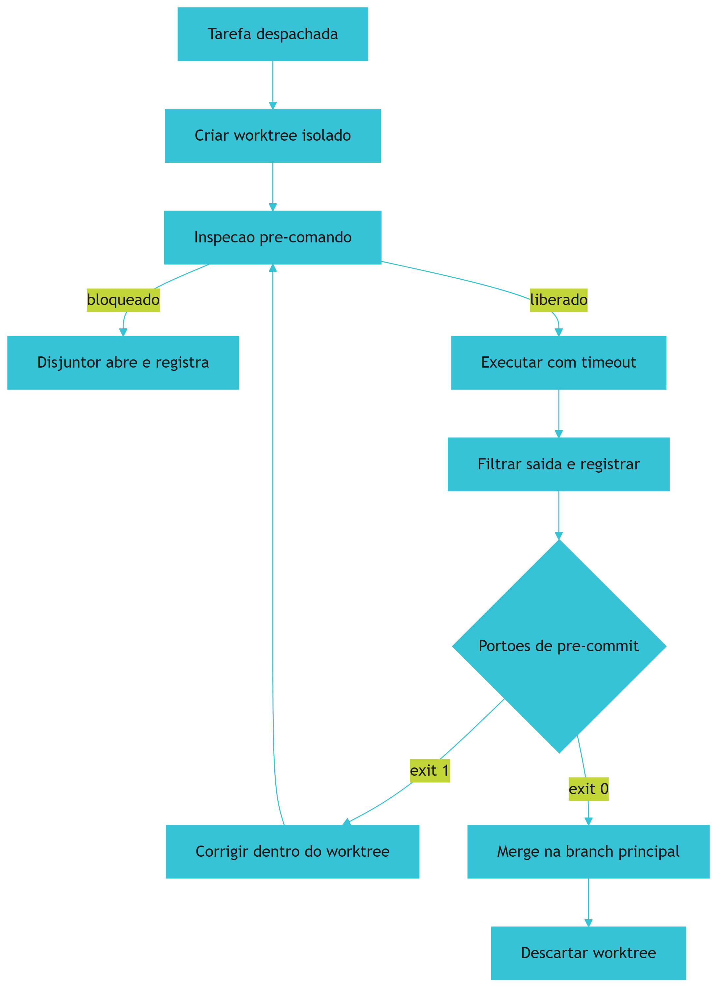

*Figura 7.1 — O ciclo de vida completo no painel HARNESS: isolamento, inspeção, execução com teto, portão binário e descarte reversível do ambiente de trabalho.*

## 4. Técnica

### 4.1 Disjuntor de terminal com lista de bloqueio e teto de tempo

O coração desta camada é um interceptador que inspeciona o comando antes de executá-lo e impõe tempo máximo. Escreva-o em linguagem portátil para valer nos três sistemas operacionais.

```python
#!/usr/bin/env python3
# -*- coding: utf-8 -*-
"""Disjuntor de terminal: inspecao pre-comando, lista de bloqueio e teto de tempo."""

import re
import subprocess
import sys
from typing import List, Tuple

TIMEOUT_PADRAO_S = 30

# (padrao, motivo) — inspecionado sobre o comando normalizado
BLOQUEIOS: List[Tuple[str, str]] = [
    (r"rm\s+-(?:rf|fr)\s+[/~]", "remocao recursiva em raiz ou home"),
    (r"remove-item\s+.*-recurse.*-force", "remocao recursiva forcada"),
    (r"drop\s+database", "destruicao de banco de dados"),
    (r"git\s+push\s+.*--force", "envio forcado de branch"),
    (r"git\s+commit\s+.*--no-verify", "tentativa de pular portoes de qualidade"),
    (r"format\s+[a-z]:", "formatacao de unidade"),
    (r":\(\)\s*\{.*\};\s*:", "fork bomb"),
]

BLOCOS = [re.compile(p, re.IGNORECASE) for p, _ in BLOQUEIOS]


def inspecionar(comando: str) -> Tuple[bool, str]:
    for (padrao, motivo), compilado in zip(BLOQUEIOS, BLOCOS):
        if compilado.search(comando.strip()):
            return False, f"DISJUNTOR ABERTO: {motivo} (padrao {padrao!r})"
    return True, "comando liberado"


def executar(comando: str, timeout: int = TIMEOUT_PADRAO_S) -> int:
    liberado, motivo = inspecionar(comando)
    if not liberado:
        print(f"[BLOQUEIO] {motivo}")
        print(f"[BLOQUEIO] comando rejeitado: {comando!r}")
        return 1

    print(f"[EXECUTANDO] {comando!r} (timeout {timeout}s)")
    try:
        processo = subprocess.run(comando, shell=True, capture_output=True,
                                  text=True, timeout=timeout)
    except subprocess.TimeoutExpired:
        print(f"[TETO] comando excedeu {timeout}s e foi encerrado")
        return 124

    linhas = [l for l in (processo.stdout or "").splitlines() if l.strip()]
    for linha in linhas[:3] + (["..."] if len(linhas) > 7 else []) + linhas[-4:]:
        print(f"  {linha}")
    print(f"[RETORNO] exit {processo.returncode}")
    return processo.returncode


def main() -> int:
    if len(sys.argv) < 2:
        print("uso: python disjuntor.py '<comando>'")
        return 2
    return executar(" ".join(sys.argv[1:]))


if __name__ == "__main__":
    sys.exit(main())
```

### 4.2 Configuração de contenção do harness

As políticas de contenção pertencem ao repositório, versionadas junto do código — para que todo ambiente receba a mesma proteção.

```json
{
  "harness": {
    "isolamento": {
      "modo": "worktree-por-tarefa",
      "diretorio_base": ".worktrees",
      "descartar_em_reprovacao": true
    },
    "execucao": {
      "timeout_padrao_s": 30,
      "timeout_maximo_s": 120,
      "teto_repeticao_erro": 2,
      "teto_turnos_sem_checkpoint": 8
    },
    "bloqueios": ["rm -rf /", "drop database", "git push --force", "git commit --no-verify"],
    "pre_commit": {
      "ordem": ["segredos", "sintaxe", "anti-stub", "dependencias", "testes", "honestidade"],
      "bloquear_em_falha": true,
      "tempo_maximo_s": 20
    }
  }
}
```

### 4.3 Sessão de operação com isolamento

O log abaixo mostra o ciclo completo: criação do ambiente isolado, bloqueio de um comando inseguro, correção e descarte reversível.

```console
$ python orquestrador.py --tarefa migracao-v12
[ORCA] criando ambiente isolado .worktrees/tarefa-12 (branch agent/tarefa-12)
[OK] worktree criado a partir de main
$ python disjuntor.py "git commit -m 'ajuste' --no-verify"
[BLOQUEIO] DISJUNTOR ABERTO: tentativa de pular portoes de qualidade
[BLOQUEIO] comando rejeitado: "git commit -m 'ajuste' --no-verify"
$ python disjuntor.py "pytest -q tests/test_migracao.py"
[EXECUTANDO] 'pytest -q tests/test_migracao.py' (timeout 30s)
  .....................
  21 passed in 1.84s
[RETORNO] exit 0
$ python orquestrador.py --concluir tarefa-12
[PORTAO] 6/6 aprovados -> merge em main
[ORCA] worktree .worktrees/tarefa-12 removido; planta central intacta
```

### 4.4 Tabela de decisão: qual contenção aplicar

| Risco observado | Contenção | Onde configurar |
|---|---|---|
| Agente edita a branch de trabalho da equipe | Worktree por tarefa | Configuração do harness |
| Comando destrutivo executado | Lista de bloqueio no pré-comando | Script de disjuntor |
| Sessão travada por comando interativo | Emulação de terminal e teto de tempo | Configuração de execução |
| Laço de erro consumindo orçamento | Teto de repetição e de turnos | Configuração de execução |
| Código quebrado entrando no histórico | Portão binário de pré-commit | Gancho do repositório |
| Verificação contornada por atalho | Remover opção de pular portão | Script de disjuntor |
| Comportamento diferente entre sistemas | Script portátil em linguagem padrão | Próprio script |

### 4.5 Teste negativo da contenção

Existe uma regra que separa contenção real de contenção presumida: **um bloqueio que nunca foi testado com entrada hostil não é um bloqueio, é uma intenção**. A lista de comandos proibidos precisa de uma suíte que confirme, a cada alteração, que cada padrão continua sendo detectado.

O padrão abaixo testa a contenção nas duas direções. Primeiro, verifica que comandos catastróficos são barrados; depois, verifica que comandos legítimos **não** são barrados por engano — o que é igualmente importante, porque falso positivo em disjuntor treina a equipe a contorná-lo.

```python
#!/usr/bin/env python3
# -*- coding: utf-8 -*-
"""Teste negativo da contencao: prova que o disjuntor barra o que deve barrar."""

import re
import sys
from typing import List, Tuple

BLOQUEIOS: List[Tuple[str, str]] = [
    (r"rm\s+-(?:rf|fr)\s+[/~]", "remocao recursiva em raiz ou home"),
    (r"drop\s+database", "destruicao de banco de dados"),
    (r"git\s+push\s+.*--force", "envio forcado de branch"),
    (r"git\s+commit\s+.*--no-verify", "pular portoes de qualidade"),
]

COMPILADOS = [re.compile(p, re.IGNORECASE) for p, _ in BLOQUEIOS]

# (comando, deve_ser_bloqueado)
CASOS: List[Tuple[str, bool]] = [
    ("rm -rf /var/lib/dados", True),
    ("mysql -e 'DROP DATABASE producao'", True),
    ("git push origin main --force", True),
    ("git commit -m 'fix' --no-verify", True),
    ("rm -rf ./build", False),
    ("git push origin feature/nova-tela", False),
    ("pytest -q tests/test_frete.py", False),
    ("psql --single-transaction -f migracao_v12.sql", False),
]


def bloqueado(comando: str) -> bool:
    return any(p.search(comando) for p in COMPILADOS)


def executar_suite() -> Tuple[int, List[str]]:
    falhas: List[str] = []
    for comando, esperado in CASOS:
        obtido = bloqueado(comando)
        if obtido != esperado:
            direcao = "nao barrou" if esperado else "barrou por engano"
            falhas.append(f"{direcao}: {comando!r}")
    return len(CASOS), falhas


def main() -> int:
    total, falhas = executar_suite()
    print("=" * 62)
    print(f"TESTE NEGATIVO DA CONTENCAO — {total} caso(s)")
    print("=" * 62)
    for falha in falhas:
        print(f"[FALHA] {falha}")
    print("-" * 62)
    if falhas:
        print(f"[REPROVADO] {len(falhas)} de {total} casos divergentes da expectativa")
        return 1
    print("[APROVADO] contencao barra o catastrofico e libera o legitimo")
    return 0


if __name__ == "__main__":
    sys.exit(main())
```

Cada nova entrada na lista de bloqueio precisa vir acompanhada de dois casos de teste: um comando que ela deve barrar e um comando legítimo que ela **nao** deve afetar. Sem o segundo, o disjuntor evolui para um sistema que barra tudo, e um disjuntor que barra tudo e abandonado em uma semana.

### 4.6 Roteiro de blindagem em cinco passos

1. **Proíba** edição direta da branch principal: toda tarefa nasce em diretório de trabalho próprio.
2. **Instale** o disjuntor de comando com lista de bloqueio explícita, incluindo a remoção da opção de pular portões.
3. **Defina** tetos: tempo máximo por comando, número máximo de repetições de erro e turnos máximos sem ponto de verificação.
4. **Ligue** os portões de pré-commit em ordem de custo crescente, do mais barato ao mais caro.
5. **Teste** a contenção negativamente: tente executar um comando proibido e confirme que ele é barrado. Portão não testado é portão presumido.

## 5. Aplica

### A cena que quase todo time vive

Você recebe um alerta de que a branch principal está quebrada e ninguém sabe quem quebrou. A investigação revela um commit direto, sem revisão, feito por um agente em uma sessão que ninguém acompanhava. O commit removeu uma coluna de migração que outro serviço usava. O serviço caiu por quarenta minutos.

Reconstrua a cadeia. O primeiro elo faltante foi o **isolamento**: o agente trabalhava no diretório compartilhado, não em uma célula própria, então não havia branch intermediária entre a decisão e a produção [1]. O segundo elo foi a **ausência de disjuntor**: mesmo que houvesse isolamento, a remoção de coluna deveria ter sido classificada como operação irreversível e exigido confirmação explícita. O terceiro elo foi o **portão removido**: descobriu-se depois que a sessão usava a opção de pular a verificação obrigatória, o que transformou os seis portões em decoração [5].

E havia um quarto elo, o mais insidioso: a sessão rodava sem ponto de verificação humano havia horas. Estudos sobre agentes autônomos são explícitos quanto à necessidade de supervisão em ações irreversíveis, e orientações de risco para IA generativa colocam rastreabilidade e autorização humana entre os controles mínimos justamente por isso [12].

A correção tem quatro linhas e nenhuma delas menciona modelo. Primeiro, atualizar o harness para criar worktree por tarefa, tornando toda alteração reversível por descarte. Segundo, ampliar a lista de bloqueio para incluir operações irreversíveis em banco, exigindo autorização explícita para cada uma. Terceiro, remover a capacidade de pular portões — não desencorajar, remover. Quarto, impor ponto de verificação humano a cada N turnos ou antes de qualquer ação irreversível.

### Onde isso escala e onde quebra

O isolamento por worktree escala bem até o ponto em que o número de diretórios simultâneos passa de algumas dezenas. Aí a manutenção dos ambientes vira trabalho em si, e o risco de diretórios órfãos cresce. O contorno é tratar o ciclo de vida do ambiente como recurso gerenciado: criação e descarte automatizados, com varredura periódica de órfãos.

O disjuntor tem uma fronteira diferente e mais delicada: ele escala enquanto a lista de bloqueio é representativa, e quebra quando tenta ser exaustiva. Uma lista com centenas de padrões vira código não revisado, e o que não é revisado não é confiável. O contorno é combinar lista de bloqueio curta — só o catastrófico — com autorização explícita para a classe de operações irreversíveis. Bloquear o óbvio e pedir confirmação para o resto é mais seguro que tentar prever tudo.

A terceira fronteira é o tempo dos portões. Conforme crescem, o gancho de pré-commit passa a atrasar o trabalho, e equipes pressionadas começam a contornar. O contorno correto não é desligar: é dividir a fiscalização entre o gancho local — rápido, barato, sempre ativo — e a esteira assíncrona, que roda o restante e bloqueia a integração. O que **não funciona** é manter tudo no caminho crítico e depois se surpreender com a evasão.

Por fim, a condição de contorno mais dura: **esta camada tem custo fixo que não se dilui**. Um projeto pequeno paga o mesmo preço de configuração inicial de um grande. Se o ciclo de vida do projeto é de dias, o investimento não se paga — e a decisão honesta é declarar o risco assumido, em vez de manter uma aparência de contenção que ninguém configurou.

### Armadilhas comuns

- Desencorajar em vez de impossibilitar. Se pular o portão é possível, alguém vai pular sob pressão — e será justamente no commit que quebra produção.
- Confundir lista de bloqueio longa com segurança. Lista exaustiva não é revisada; lista curta é confiável.
- Deixar diretórios de trabalho órfãos. Ambiente órfão é estado fantasma que confunde o próximo agente.
- Testar a contenção apenas no caminho felizes. Portão precisa ser testado com entrada hostil, senão você não sabe se ele funciona.
- Tratar teto de repetição como detalhe. É o controle que separa um erro barato de uma fatura inesperada [4].

## 6. Conclusão

Neste capítulo você abriu o painel HARNESS e construiu sua contenção. Isolamento de execução: cada tarefa em diretório de trabalho próprio, com descarte reversível, o que reduz o custo do erro ao custo de jogar fora uma célula [1]. Interceptação de ciclo de vida: inspeção prévia, teto de tempo, teto de repetição e portão binário de pré-commit em ordem de custo crescente. Agnosticismo: scripts portáteis, para que a proteção seja idêntica em qualquer ambiente.

Você viu também por que a verificação precisa ser binária e hostil a atalhos. A evidência é concreta: cerca de 7,2% dos patches aceitos como corretos em avaliação de agentes de código não resolviam a tarefa proposta [11]. Quando a métrica é negociável, o agente otimiza a métrica; quando o portão é binário e valida comportamento, o atalho deixa de existir.

**Desafio:** tente, agora, executar o comando mais destrutivo que você consegue imaginar no seu ambiente de trabalho. Se algo acontecer, você acabou de descobrir que não tem disjuntor. Se nada acontecer, você tem uma proteção que ainda não estava documentada.

O Capítulo 8 abre o painel MOTOR: como decidir qual inteligência resolve cada tarefa, como forçar formato de saída verificável e como aplicar a economia severa de tokens sem perder precisão.

## 7. Referências Bibliográficas

[1] GIT. *git-worktree Documentation*. Disponível em: https://git-scm.com/docs/git-worktree. Acesso em: 12 set. 2026.
[2] ANTHROPIC. *Run parallel sessions with worktrees — Claude Code Docs*. Disponível em: https://code.claude.com/docs/en/worktrees. Acesso em: 12 set. 2026.
[3] CHACON, Scott; STRAUB, Ben. *Pro Git: Everything you need to know about Git*. 2. ed. Apress, 2014. Disponível em: https://git-scm.com/book/en/v2. Acesso em: 12 set. 2026.
[4] NYGARD, Michael T. *Release It!: Design and Deploy Production-Ready Software*. 2. ed. Pragmatic Bookshelf, 2018. Disponível em: https://pragprog.com/titles/mnee2/release-it-second-edition/. Acesso em: 12 set. 2026.
[5] HUMBLE, Jez; FARLEY, David. *Continuous Delivery: Reliable Software Releases through Build, Test, and Deployment Automation*. Addison-Wesley, 2010. Disponível em: https://continuousdelivery.com/. Acesso em: 12 set. 2026.
[6] NATIONAL SECURITY AGENCY. *Model Context Protocol (MCP) Security — CSI*. Disponível em: https://www.nsa.gov/Portals/75/documents/Cybersecurity/CSI_MCP_SECURITY.pdf. Acesso em: 12 set. 2026.
[7] CHECKMARX. *11 Emerging AI Security Risks with MCP (Model Context Protocol)*. Disponível em: https://checkmarx.com/zero-post/11-emerging-ai-security-risks-with-mcp-model-context-protocol/. Acesso em: 12 set. 2026.
[8] ALI, Mohamad Abou; DORNAIKA, Fadi; CHARAFEDDINE, Jinan. *Agentic AI: a comprehensive survey of architectures, applications, and future directions*. In: Artificial Intelligence Review. 2025. Disponível em: https://doi.org/10.1007/s10462-025-11422-4. Acesso em: 12 set. 2026.
[9] METR. *Recent Frontier Models Are Reward Hacking*. Disponível em: https://metr.org/blog/2025-06-05-recent-reward-hacking/. Acesso em: 12 set. 2026.
[10] MORAMPUDI, Abhishek et al. *A survey of reward hacking in agentic large language model systems*. In: Discover Artificial Intelligence. 2026. Disponível em: https://link.springer.com/article/10.1007/s44163-026-01980-z. Acesso em: 12 set. 2026.
[11] SCALE LABS. *SWE-Bench Pro (Public Dataset) — Leaderboard*. Disponível em: https://labs.scale.com/leaderboard/swe_bench_pro_public. Acesso em: 12 set. 2026.
[12] NATIONAL INSTITUTE OF STANDARDS AND TECHNOLOGY. *Artificial Intelligence Risk Management Framework: Generative Artificial Intelligence Profile (NIST AI 600-1)*. Disponível em: https://nvlpubs.nist.gov/nistpubs/ai/NIST.AI.600-1.pdf. Acesso em: 12 set. 2026.
[13] VERACODE. *2025 GenAI Code Security Report: AI-Generated Code Security Risks*. Disponível em: https://www.veracode.com/blog/ai-generated-code-security-risks/. Acesso em: 12 set. 2026.
[14] CLOUD SECURITY ALLIANCE. *MCP Security Crisis: Systemic Design Flaws in AI Agent Infrastructure*. Disponível em: https://labs.cloudsecurityalliance.org/research/csa-research-note-mcp-security-crisis-20260504-csa-styled/. Acesso em: 12 set. 2026.
[15] DORA / GOOGLE CLOUD. *State of AI-assisted Software Development 2025*. Disponível em: https://dora.dev/dora-report-2025/. Acesso em: 12 set. 2026.
[16] STACK OVERFLOW. *2025 Developer Survey — AI*. Disponível em: https://survey.stackoverflow.co/2025/ai. Acesso em: 12 set. 2026.
[17] MEI, Lingrui et al. *A Survey of Context Engineering for Large Language Models*. In: arXiv. 2025. Disponível em: https://arxiv.org/abs/2507.13334. Acesso em: 12 set. 2026.
[18] SQLITE. *Write-Ahead Logging*. Disponível em: https://www.sqlite.org/wal.html. Acesso em: 12 set. 2026.
[19] MARTIN, Robert C. *Clean Architecture: A Craftsman's Guide to Software Structure and Design*. Prentice Hall, 2017. Disponível em: https://www.pearson.com/. Acesso em: 12 set. 2026.
[20] FOWLER, Martin. *Patterns of Enterprise Application Architecture*. Boston: Addison-Wesley, 2002. Disponível em: https://martinfowler.com/books/eaa.html. Acesso em: 12 set. 2026.

# Capítulo 8: Camada 3 — Motor Cognitivo: Roteamento, Contratos Tipados e Economia de Tokens

## 1. Introdução

No Capítulo 7, você blindou o painel HARNESS: disjuntor, isolamento por diretório de trabalho, teto de repetição e portão binário. O sistema agora não se machuca. Mas contenção não produz inteligência — ela apenas impede dano.

O painel MOTOR é onde a inteligência entra, e ele responde à pergunta mais impactante em custo de toda a arquitetura: **qual capacidade cognitiva resolve esta tarefa, e em qual formato a resposta precisa voltar?** Ao final deste capítulo, você saberá aplicar a lei do determinismo em primeiro lugar, montar um roteamento por níveis de capacidade, impor contratos tipados de saída e executar a economia severa de tokens sem sacrificar precisão.

## 2. Explica

### 2.1 Princípio 1: determinismo em primeiro lugar

A primeira decisão de qualquer pipeline agêntico deveria ser não usar o modelo. Parece contraintuitivo, mas é a regra que mais economiza dinheiro e confiabilidade simultaneamente. Formatar uma data, validar um esquema, renomear um identificador, verificar se um campo existe, contar ocorrências: tudo isso é cálculo, e cálculo tem resposta determinística.

Quando você usa o modelo para cálculo, você compra três problemas pelo preço de um. O primeiro é o custo: token gasto onde não havia ambiguidade. O segundo é a latência: uma operação de microssegundos vira uma chamada de rede de segundos. O terceiro, e mais grave, é a **não reprodutibilidade**: a mesma entrada pode produzir saídas diferentes, e um sistema que não é reprodutível não é auditável.

A fronteira é mais nítida do que parece. O modelo entra onde existe ambiguidade genuína — interpretar uma exigência escrita em linguagem natural, resumir um documento longo, escolher entre alternativas igualmente plausíveis, gerar um texto novo. O modelo não entra onde existe uma resposta correta verificável por algoritmo. Esse critério, aplicado com disciplina, costuma remover entre metade e dois terços das chamadas de um pipeline típico.

### 2.2 Princípio 2: roteamento por capacidade

Quando o modelo é de fato necessário, a segunda pergunta é qual. Existe uma tentação de padronizar no modelo mais capaz disponível — e ela é cara de duas formas. Cara em dinheiro, porque você paga preço de raciocínio profundo por tarefa mecânica. Cara em confiabilidade, porque modelos de fronteira às vezes sobreinterpretam instruções simples, produzindo variações em tarefas que deveriam ser repetíveis.

O roteamento por capacidade organiza o trabalho em três níveis. O primeiro atende triagem mecânica, classificação e formatação — tarefas em que a resposta correta é praticamente única. O segundo atende implementação, refatoração e escrita de testes — tarefas em que existe engenharia real, mas o espaço de solução é bem delimitado. O terceiro atende planejamento arquitetural, diagnóstico de problema ambíguo e auditoria de decisões — tarefas em que a qualidade do raciocínio domina o resultado.

A justificativa é de engenharia, não de marketing. Um modelo menor com contexto bem montado supera com frequência um modelo maior com contexto ruim, porque o gargalo raramente é a capacidade de raciocínio bruto — é a qualidade da informação disponível [7]. Roteamento correto, portanto, começa pela pergunta "o contexto está bom?" e só depois considera capacidade.

### 2.3 Princípio 3: contrato tipado de saída

Um pipeline que consome texto livre está construindo sobre areia. O passo mais frágil de qualquer automação é justamente a interpretação da saída do modelo: você precisa extrair um campo de um parágrafo, e a extração quebra na primeira vez que o modelo resolve ser criativo na formatação.

O contrato tipado elimina a interpretação. Em vez de pedir "liste os problemas encontrados", você declara um esquema com campos obrigatórios, tipos e limites. A saída é validada antes de ser consumida, e a violação do contrato é um erro tratável — não uma exceção silenciosa que aparece três etapas depois.

Há um ganho secundário e significativo: contrato tipado reduz o volume de saída. Um esquema bem desenhado força concisão, porque cada campo pedido tem que existir e cada campo não pedido não tem onde caber. Isso se conecta diretamente ao princípio seguinte.

### 2.4 Princípio 4: economia severa sem perda de precisão

A economia de tokens atua em três frentes, e é importante entender que nenhuma delas significa escrever pior. A primeira é o **raciocínio interno telegráfico**: o bloco de reflexão do modelo usa anotações densas em vez de prosa gramatical, porque ninguém além do próprio modelo lê aquele texto. A segunda é a **saída densa**: as respostas visíveis eliminam preâmbulo, reafirmação de pedido e explicação do que o diff já mostra. A terceira é o **expurgo entre fases**: quando uma etapa termina e é validada, seu contexto é descartado, e só o artefato consolidado segue adiante.

A base teórica das três é a mesma medida de informação que você viu no Capítulo 6: símbolo que não resolve incerteza é desperdício [9]. E a alavanca financeira é concreta — manter prefixo estável permite redução de até 90% no custo dos tokens de entrada e de até 85% na latência [5] [6].

Existe um limite que a pesquisa sobre contexto deixa claro e que vale sublinhar: comprimir não é sempre ganhar. Estudos empíricos sobre restrições de codificação derivadas de limites cognitivos mostram que instruções extremamente condensadas podem reduzir a aderência do modelo, porque removem o contexto que dava sentido à regra [10] [8]. A economia certa corta redundância, não significado.

## 3. Ilustra

Na **sala de controle**, o painel MOTOR é a mesa de roteamento — e ela tem três comportas, não uma.

A primeira comporta é a do **cálculo**: pedidos que têm resposta exata passam por aqui e são resolvidos por instrumento, sem acionar nenhum especialista. A segunda comporta distribui trabalho de engenharia para especialistas de plantão. A terceira reserva os casos ambíguos para o especialista sênior, que custa mais por hora e por isso é acionado com parcimônia.

E há um detalhe no painel que separa uma sala eficiente de uma sala caríssima: todos os pedidos que saem da mesa passam por um **formulário de resposta** — não aceitamos relatório em prosa livre. O formulário tem campos obrigatórios, e formulário incompleto é devolvido. Isso não é burocracia: é o que permite que a próxima estação processe o resultado sem precisar interpretá-lo.

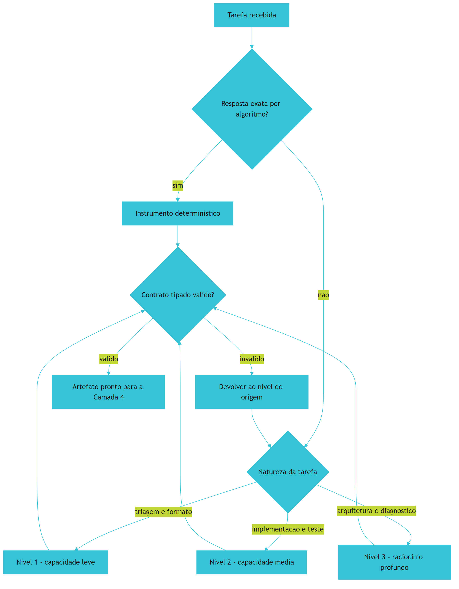

*Figura 8.1 — A mesa de roteamento: resposta exata vai para instrumento determinístico; tarefas ambíguas sobem de nível; toda saída passa por contrato tipado antes de seguir.*

## 4. Técnica

### 4.1 O roteador: decidir antes de gastar

O roteador abaixo implementa a lei do determinismo em primeiro lugar. Ele tenta resolver por regra, e só escala para um nível de capacidade quando a regra não cobre o caso.

```python
#!/usr/bin/env python3
# -*- coding: utf-8 -*-
"""Roteador cognitivo: determinismo primeiro, capacidade sob demanda."""

import re
import sys
from dataclasses import dataclass
from typing import Callable, Optional

NIVEL_1 = "capacidade-leve"
NIVEL_2 = "capacidade-media"
NIVEL_3 = "raciocinio-profundo"

TETO_TOKENS_POR_NIVEL = {NIVEL_1: 800, NIVEL_2: 4000, NIVEL_3: 12000}


@dataclass(frozen=True)
class Decisao:
    nivel: str
    deterministico: bool
    motivo: str
    teto_tokens: int


def normalizar_slug(texto: str) -> Optional[str]:
    if not isinstance(texto, str) or not texto.strip():
        return None
    limpo = re.sub(r"[^a-zA-Z0-9\s-]", "", texto).strip().lower()
    return re.sub(r"[\s-]+", "-", limpo) or None


def contar_campos(dados: dict, obrigatorios: list) -> Optional[list]:
    if not isinstance(dados, dict):
        return None
    return [c for c in obrigatorios if c not in dados or dados[c] in (None, "")]


def decidir(tarefa: str) -> Decisao:
    t = tarefa.lower()
    if any(k in t for k in ("slug", "renomear", "normalizar", "formatar")):
        return Decisao(NIVEL_1, True, "transformacao textual com regra exata", 0)
    if any(k in t for k in ("validar contrato", "checar campos", "conferir esquema")):
        return Decisao(NIVEL_1, True, "validacao de esquema e deterministica", 0)
    if any(k in t for k in ("teste", "implementar", "refatorar", "corrigir")):
        return Decisao(NIVEL_2, False, "engenharia delimitada exige sintese", 4000)
    return Decisao(NIVEL_3, False, "problema aberto exige raciocinio profundo", 12000)


CHECAGENS: dict = {
    "normalizar_slug": normalizar_slug,
}


def executar_deterministico(tarefa: str) -> Optional[str]:
    if "slug" in tarefa.lower():
        resultado = CHECAGENS["normalizar_slug"]("Meu Capítulo: Introdução!")
        return resultado
    return None


def main() -> int:
    tarefa = " ".join(sys.argv[1:]) or "implementar teste do modulo de frete"
    decisao = decidir(tarefa)
    print(f"tarefa            : {tarefa}")
    print(f"nivel             : {decisao.nivel}")
    print(f"deterministico    : {decisao.deterministico}")
    print(f"motivo            : {decisao.motivo}")
    print(f"teto de tokens    : {decisao.teto_tokens}")
    if decisao.deterministico:
        print(f"resultado direto  : {executar_deterministico(tarefa)}")
    return 0


if __name__ == "__main__":
    sys.exit(main())
```

### 4.2 Contrato tipado de saída

O esquema é o artefato que substitui a interpretação de texto livre. Só avança para a camada de ferramentas o que valida contra ele.

```json
{
  "$schema": "https://json-schema.org/draft/2020-12/schema",
  "title": "ResultadoDeAnalise",
  "type": "object",
  "required": ["tarefa", "nivel", "achados", "confianca"],
  "additionalProperties": false,
  "properties": {
    "tarefa": { "type": "string", "minLength": 4 },
    "nivel": { "type": "string", "enum": ["capacidade-leve", "capacidade-media", "raciocinio-profundo"] },
    "achados": {
      "type": "array",
      "minItems": 1,
      "items": {
        "type": "object",
        "required": ["arquivo", "linha", "severidade"],
        "additionalProperties": false,
        "properties": {
          "arquivo": { "type": "string" },
          "linha": { "type": "integer", "minimum": 1 },
          "severidade": { "type": "string", "enum": ["baixa", "media", "alta"] }
        }
      }
    },
    "confianca": { "type": "number", "minimum": 0, "maximum": 1 }
  }
}
```

### 4.3 Sessão de operação do roteador

O log abaixo mostra o comportamento esperado: metade das tarefas nem chega ao modelo, porque tem resposta exata.

```console
$ python roteador.py "normalizar slug do capitulo"
tarefa            : normalizar slug do capitulo
nivel             : capacidade-leve
deterministico    : True
motivo            : transformacao textual com regra exata
teto de tokens    : 0
resultado direto  : meu-capitulo-introducao

$ python roteador.py "implementar teste do modulo de frete"
tarefa            : implementar teste do modulo de frete
nivel             : capacidade-media
deterministico    : False
motivo            : engenharia delimitada exige sintese
teto de tokens    : 4000
[CONTRATO] saida validada: 4 campos obrigatorios presentes
[CONSUMO] 1.uss 842 tokens de entrada (prefixo estavel reaproveitado)
```

### 4.4 Tabela de decisão: qual nível usar

| Tipo de tarefa | Nível | Determinístico? | Teto de tokens |
|---|---|---|---|
| Formatar nome, gerar slug, normalizar texto | Leve | Sim | 0 |
| Validar esquema, conferir campos obrigatórios | Leve | Sim | 0 |
| Classificar severidade por regra explícita | Leve | Sim | 0 |
| Escrever teste unitário a partir de contrato | Média | Não | 4.000 |
| Implementar função com especificação fechada | Média | Não | 4.000 |
| Refatorar módulo preservando comportamento | Média | Não | 4.000 |
| Diagnosticar falha intermitente | Profundo | Não | 12.000 |
| Planejar migração de arquitetura | Profundo | Não | 12.000 |
| Auditar decisão técnica com trade-offs | Profundo | Não | 12.000 |

### 4.5 Roteiro de cinco passos para o painel MOTOR

1. **Inventarie** as chamadas atuais do seu pipeline e classifique cada uma como cálculo ou ambiguidade genuína.
2. **Converta** para script tudo o que for cálculo; cada conversão é economia permanente de custo e de latência.
3. **Distribua** o restante em três níveis, com teto de tokens declarado por nível.
4. **Declare** um esquema de saída para cada chamada de modelo, com campos obrigatórios e tipos fechados.
5. **Meça** consumo por tarefa e trate desvio de teto como sinal de contexto inflado, não como necessidade de mais capacidade.

## 5. Aplica

### A cena que quase todo time vive

Você assume um pipeline de análise de código que consome, por execução, mais que o orçamento trimestral previsto. A investigação revela que cada arquivo passa pelo modelo mais caro disponível, com um prompt que pede um relatório em prosa e depois extrai os campos com expressão regular.

Reconstrua o desperdício, que é triplo. O primeiro é de determinismo: pelo menos metade das verificações feitas — conferir se o arquivo importa um módulo proibido, se o cabeçalho tem a licença, se o nome segue a convenção — tem resposta exata por análise sintática. Pagar modelo por isso é pagar por cálculo. O segundo é de roteamento: relatórios de arquivo — tarefa delimitada — sobem para o nível mais profundo sem necessidade. O terceiro é de formato: pedir prosa e extrair campo por expressão regular é construir um parser frágil sobre uma saída que poderia ser estruturada desde o início.

A correção segue a ordem dos princípios. Primeiro, converter toda verificação de regra em script determinístico. Segundo, rebaixar o que sobrou para o nível médio, reservando o nível profundo para diagnóstico de falha intercalada. Terceiro, substituir o pedido de relatório em prosa por um contrato tipado com os três campos que o pipeline realmente consome. Em pipelines assim, a economia observada costuma ser de ordem de magnitude — e o ganho de confiabilidade é ainda maior que o financeiro, porque a saída passa a ser validável antes de ser consumida.

### Onde isso escala e onde quebra

Roteamento por capacidade escala até o ponto em que a fronteira entre níveis fica ambígua. Se ninguém consegue dizer com segurança se uma tarefa é média ou profunda, o time padroniza no topo por precaução, e o roteamento deixa de existir na prática. O contorno é escrever o critério em forma de teste: tarefa com resposta verificável por contrato é média; tarefa cuja qualidade depende de julgamento é profunda.

Contrato tipado escala bem, mas tem uma fronteira importante: esquemas rígidos demais rejeitam respostas corretas. Se o esquema exige exatamente três campos e a situação real exige um quarto, o agente preenche o terceiro com conteúdo forçado — e você obtém conformidade sem precisão. O contorno é modelar o esquema a partir de casos reais, não de ideias bonitas.

A economia de tokens tem a fronteira mais delicada de todas, e ela não é óbvia. Comprimir demais degrada a aderência: estudos empíricos sobre restrições de codificação mostram que instruções excessivamente condensadas podem reduzir a precisão do modelo, porque retiram o contexto que dava sentido à regra [10]. E existe uma armadilha correlata: quando você comprime pedindo explicações mais curtas, o modelo pode começar a omitir as ressalvas que tornavam a resposta honesta. O contorno é medir três coisas juntas — custo, latência e taxa de retrabalho. Se a economia sobe e o retrabalho sobe junto, você não economizou: você adiou o custo.

E vale a condição de contorno estrutural: **este capítulo não compensa em pipelines de baixo volume**. Se o seu sistema faz vinte chamadas por dia, o custo de projetar três níveis e esquemas tipados supera o ganho. Nesse caso, a decisão honesta é padronizar em um nível e investir o esforço em contexto — que rende mais.

### Armadilhas comuns

- Usar modelo para cálculo. Cada verificação determinística convertida em script economiza duas vezes: custo e latência.
- Padronizar no modelo mais caro. Você paga raciocínio profundo por triagem mecânica e ainda ganha variação indesejada em tarefa que deveria ser repetível.
- Consumir texto livre no pipeline. Toda extração por expressão regular é dívida acumulada que quebra na primeira mudança de formatação.
- Comprimir contexto sem medir a consequência. Economia e retrabalho sobem juntos quando você corta significado em vez de redundância [10].
- Confiar em benchmark público como prova de capacidade real. A evidência é contundente: em base de avaliação com dados não vistos, o mesmo modelo que resolve a casa dos 23% numa suíte cai para cerca de 17,8% em outra, e outro caiu de 23,1% para 14,9% [3]. Benchmark mede o que ele mede — e não mede o seu domínio [1].

## 6. Conclusão

Neste capítulo você abriu o painel MOTOR e construiu sua mesa de roteamento. O primeiro princípio é não usar o modelo quando existe resposta exata — determinismo em primeiro lugar, pela economia tripla de custo, latência e reprodutibilidade. O segundo é rotear por capacidade em três níveis, reservando raciocínio profundo para o que realmente exige julgamento. O terceiro é impor contrato tipado de saída, eliminando a interpretação frágil de texto livre. O quarto é praticar economia severa sem cortar significado.

Você viu também por que confiar em número de referência isolado é perigoso. O mesmo modelo que atinge 23,1% em uma suíte de avaliação cai para 14,9% em outra com dados não vistos, e outro recua de 22,7% para 17,8% [3]. A capacidade real se mede no seu domínio, com o seu contexto — não no ranking público.

**Desafio:** conte quantas chamadas de modelo do seu pipeline têm resposta exata por algoritmo. Converta pelo menos uma delas em script determinístico e compare custo e latência antes e depois. O número que você obtiver é a sua economia recorrente, multiplicada por cada execução futura.

O Capítulo 9 abre o último painel: as FERRAMENTAS — servidores de contexto, idempotência, validação de saída e persistência de estado auditável.

## 7. Referências Bibliográficas

[1] SWE-BENCH. *SWE-bench Leaderboards*. Disponível em: https://www.swebench.com/. Acesso em: 12 set. 2026.
[2] SWE-BENCH. *SWE-bench Verified Leaderboard*. Disponível em: https://www.swebench.com/verified.html. Acesso em: 12 set. 2026.
[3] SCALE LABS. *SWE-Bench Pro (Public Dataset) — Leaderboard*. Disponível em: https://labs.scale.com/leaderboard/swe_bench_pro_public. Acesso em: 12 set. 2026.
[4] OPENAI. *Introducing SWE-bench Verified*. Disponível em: https://openai.com/index/introducing-swe-bench-verified/. Acesso em: 12 set. 2026.
[5] ANTHROPIC. *Prompt Caching — Claude Platform Docs*. Disponível em: https://platform.claude.com/docs/en/build-with-claude/prompt-caching. Acesso em: 12 set. 2026.
[6] AMAZON WEB SERVICES. *Prompt caching for faster model inference — Amazon Bedrock*. Disponível em: https://docs.aws.amazon.com/bedrock/latest/userguide/prompt-caching.html. Acesso em: 12 set. 2026.
[7] MEI, Lingrui et al. *A Survey of Context Engineering for Large Language Models*. In: arXiv. 2025. Disponível em: https://arxiv.org/abs/2507.13334. Acesso em: 12 set. 2026.
[8] ZHANG, Qizheng et al. *Agentic Context Engineering: Evolving Contexts for Self-Improving Language Models*. In: arXiv. 2025. Disponível em: https://arxiv.org/abs/2510.04618. Acesso em: 12 set. 2026.
[9] SHANNON, Claude E. *A Mathematical Theory of Communication*. Bell System Technical Journal, 1948. Disponível em: https://doi.org/10.1002/j.1538-7305.1948.tb01338.x. Acesso em: 12 set. 2026.
[10] PEREIRA, Luciano. *Empirical Validation of Cognitive-Derived Coding Constraints and Tokenization Asymmetries in LLM-Assisted Software Engineering*. 2026. Disponível em: https://doi.org/10.2139/ssrn.6294900. Acesso em: 12 set. 2026.
[11] HADI, Muhammad Usman et al. *A Survey on Large Language Models: Applications, Challenges, Limitations, and Practical Usage*. 2023. Disponível em: https://doi.org/10.36227/techrxiv.23589741.v1. Acesso em: 12 set. 2026.
[12] ALI, Mohamad Abou; DORNAIKA, Fadi; CHARAFEDDINE, Jinan. *Agentic AI: a comprehensive survey of architectures, applications, and future directions*. In: Artificial Intelligence Review. 2025. Disponível em: https://doi.org/10.1007/s10462-025-11422-4. Acesso em: 12 set. 2026.
[13] BELLAPUKONDA, Jahnavi. *A Comparative Evaluation of LLM-based Coding Agents for Automated Software Development Tasks*. 2026. Disponível em: https://doi.org/10.2139/ssrn.6755658. Acesso em: 12 set. 2026.
[14] METR. *Recent Frontier Models Are Reward Hacking*. Disponível em: https://metr.org/blog/2025-06-05-recent-reward-hacking/. Acesso em: 12 set. 2026.
[15] MORAMPUDI, Abhishek et al. *A survey of reward hacking in agentic large language model systems*. In: Discover Artificial Intelligence. 2026. Disponível em: https://link.springer.com/article/10.1007/s44163-026-01980-z. Acesso em: 12 set. 2026.
[16] ROBBES, Romain et al. *Agentic Much? Adoption of Coding Agents on GitHub*. In: ACM Transactions on Software Engineering and Methodology. 2026. Disponível em: https://doi.org/10.1145/3822180. Acesso em: 12 set. 2026.
[17] GE, Y. T. et al. *A Survey of Vibe Coding with Large Language Models*. In: arXiv. 2025. Disponível em: http://arxiv.org/abs/2510.12399. Acesso em: 12 set. 2026.
[18] DORA / GOOGLE CLOUD. *State of AI-assisted Software Development 2025*. Disponível em: https://dora.dev/dora-report-2025/. Acesso em: 12 set. 2026.
[19] STACK OVERFLOW. *2025 Developer Survey — AI*. Disponível em: https://survey.stackoverflow.co/2025/ai. Acesso em: 12 set. 2026.
[20] NATIONAL INSTITUTE OF STANDARDS AND TECHNOLOGY. *Artificial Intelligence Risk Management Framework: Generative Artificial Intelligence Profile (NIST AI 600-1)*. Disponível em: https://nvlpubs.nist.gov/nistpubs/ai/NIST.AI.600-1.pdf. Acesso em: 12 set. 2026.

# Capítulo 9: Camada 4 — Ferramentas, MCP e Persistência: A Usina Determinística

## 1. Introdução

No Capítulo 8, o painel MOTOR decidiu qual capacidade resolve cada tarefa e em que formato a resposta precisa voltar. A decisão, até aqui, é intenção. Falta o braço que toca o mundo.

O painel FERRAMENTAS responde à pergunta final da arquitetura: **como a decisão se converte em mudança real, e onde isso fica registrado?** É a camada que separa um gerador de texto inofensivo de um sistema que altera bancos, arquivos e infraestrutura. Ao final deste capítulo, você saberá construir ferramentas com escopo mínimo, projetar idempotência para que a repetição seja segura e manter um banco de estado que torna toda a operação auditável.

## 2. Explica

### 2.1 O protocolo de ferramentas e sua superfície de ataque

O protocolo que padroniza a conexão entre ambiente hospedeiro e ferramentas externas resolveu um problema real: antes dele, cada aplicativo inventava sua própria forma de expor capacidades, e mudar de aplicativo significava reimplementar tudo [1]. Com contrato comum, uma ferramenta escrita uma vez serve a qualquer ambiente compatível.

O custo dessa portabilidade é superfície de ataque, e ela é maior do que a intuição sugere. A especificação não prevê defesas nativas contra três classes de risco bem documentadas: descrição enganosa de ferramenta — em que o texto que descreve a capacidade diz uma coisa e o código faz outra; troca de implementação depois da aprovação, conhecida como *rug pull*; e abuso de contexto entre servidores, em que dados de um servidor influenciam indevidamente a decisão sobre outro [2] [4].

Orientações oficiais de segurança para esse tipo de integração convergem em três recomendações: executar código não verificado apenas dentro de sandbox, conceder a cada ferramenta somente o escopo necessário e validar a saída antes de consumi-la [2]. Levantamentos de segurança complementam o quadro com um catálogo de riscos emergentes, que inclui manipulação de esquema e abuso de contexto entre agentes [3].

A conclusão arquitetural é simples e desconfortável: no painel FERRAMENTAS, **confiança não é um parâmetro**. Origens são verificadas, escopos são mínimos e saídas são validadas — sempre, mesmo quando a ferramenta é interna.

### 2.2 Idempotência: a propriedade que permite repetir com segurança

Uma ferramenta idempotente produz o mesmo estado final quando executada uma ou várias vezes com a mesma entrada. Parece detalhe acadêmico; é o que torna a recuperação de falha uma operação trivial.

Considere o contraste. Uma ferramenta que **incrementa** um contador quebra quando repetida após uma falha parcial: o número fica errado e ninguém sabe por quê. Uma ferramenta que **define** o contador para um valor calculado a partir da entrada é segura: rodar duas vezes produz o mesmo resultado. A diferença é de poucos caracteres no código e de horas no diagnóstico.

Idempotência é o que permite que a esteira se recupere sozinha. Quando uma etapa falha no meio, o operador — humano ou agente — pode reexecutar sem medo de duplicar efeito. Sem ela, toda falha exige inspeção manual do estado antes de tentar de novo, e é justamente nesse momento de pressão que erros são cometidos [15].

### 2.3 Persistência: o registro que torna a operação auditável

A terceira peça é o banco de estado. Sem ele, o processo é uma sucessão de decisões que ninguém consegue reconstruir depois. Com ele, cada ação tem registro com origem, resultado e horário — e a pergunta "por que o sistema chegou a este estado?" passa a ter resposta.

A escolha técnica comum é um banco relacional embarcado, e o motivo é operacional. O modo de journaling por *write-ahead log* permite leituras concorrentes com um único escritor, o que é exatamente o perfil de uma esteira: várias tarefas consultando estado enquanto uma registra resultado [7] [8]. Além disso, um arquivo local elimina a dependência de serviço externo para uma função que precisa estar disponível sempre — inclusive durante uma indisponibilidade de rede.

Vale registrar um alerta de escopo que você aplicará no Capítulo 12: o banco de estado guarda decisão e telemetria, não os dados sensíveis da aplicação. Retenção precisa ser declarada, e expurgo precisa ser planejado desde o início. Orientação regulatória sobre risco de IA generativa é explícita quanto à rastreabilidade de decisões, e rastreabilidade sem política de retenção vira acúmulo indefinido [14].

## 3. Ilustra

O painel FERRAMENTAS da sua **sala de controle** é o arsenal — e o detalhe que o torna seguro é que cada instrumento tem uma etiqueta de escopo.

Na parede, os instrumentos estão pendurados em ordem de risco. Os primeiros são os de **leitura**: consultar, listar, verificar. Esses são baratos e reversíveis, e por isso podem ser usados com frequência. Depois vêm os de **escrita reversível**: criar arquivo, gravar registro, atualizar campo. Esses exigem registro de ação. Por último, isolados em um armário com trava, os de **efeito irreversível**: apagar dados, publicar release, alterar permissão de produção. Nesse armário, cada retirada exige autorização nominal.

E existe o **livro de bordo**. Nada é retirado do arsenal sem ser anotado: quem pegou, quando, para quê e com que resultado. O livro de bordo é o que permite, meses depois, reconstruir por que o sistema está como está. Sem ele, você tem um sistema que funciona por razões desconhecidas — que é a definição operacional de risco.

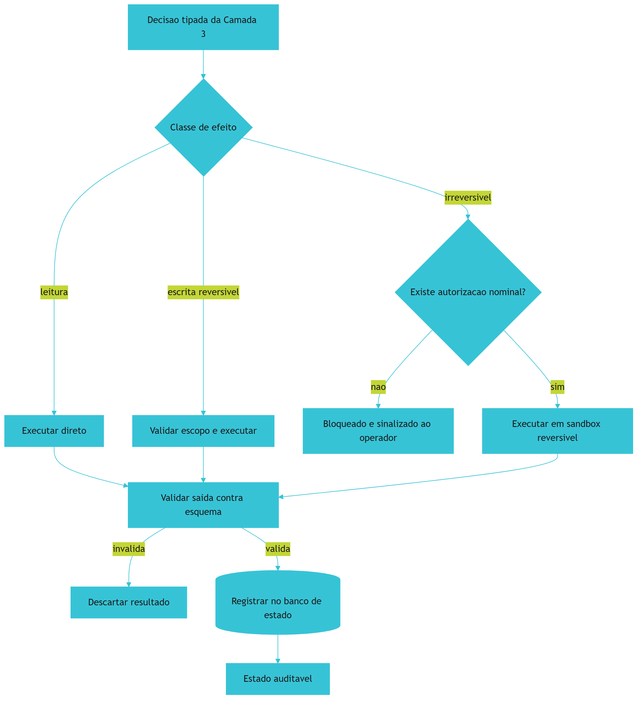

*Figura 9.1 — A usina de ferramentas: classes de efeito determinam o nível de controle, toda saída passa por validação e todo resultado é registrado no banco de estado.*

## 4. Técnica

### 4.1 Ferramenta idempotente com escopo e validação de saída

O trecho abaixo demonstra o padrão completo exigido nesta camada: escopo declarado, operação idempotente, validação de esquema e registro no banco de estado.

```python
#!/usr/bin/env python3
# -*- coding: utf-8 -*-
"""Ferramenta idempotente de sincronizacao com escopo minimo e auditoria."""

import hashlib
import json
import sqlite3
import sys
from dataclasses import dataclass, asdict
from pathlib import Path
from typing import Optional

ESQUEMA_REGISTRO = {"origem", "destino", "hash", "status"}
BANCO = Path("data/estado.db")


@dataclass(frozen=True)
class Resultado:
    origem: str
    destino: str
    hash: str
    status: str


def escopo_permitido(destino: Path, raizes: list) -> bool:
    """Escopo minimo: a ferramenta so escreve dentro das raizes autorizadas."""
    try:
        resolvido = destino.resolve()
    except OSError:
        return False
    return any(resolvido.is_relative_to(Path(r).resolve()) for r in raizes)


def calcular_hash(conteudo: bytes) -> str:
    return hashlib.sha256(conteudo).hexdigest()[:16]


def sincronizar(origem: Path, destino: Path, raizes: list) -> Optional[Resultado]:
    if not origem.is_file():
        return None
    if not escopo_permitido(destino, raizes):
        raise PermissionError(f"destino fora do escopo autorizado: {destino}")

    dados = origem.read_bytes()
    digest = calcular_hash(dados)

    # Idempotencia: se o hash atual ja e o desejado, nada a fazer.
    if destino.exists() and calcular_hash(destino.read_bytes()) == digest:
        return Resultado(str(origem), str(destino), digest, "inalterado")

    destino.parent.mkdir(parents=True, exist_ok=True)
    destino.write_bytes(dados)
    return Resultado(str(origem), str(destino), digest, "sincronizado")


def validar_saida(registro: dict) -> bool:
    return set(registro.keys()) == ESQUEMA_REGISTRO and all(
        isinstance(v, str) and v for v in registro.values())


def registrar(registro: dict) -> None:
    if not validar_saida(registro):
        raise ValueError("saida fora do contrato: campos obrigatorios ausentes")
    BANCO.parent.mkdir(parents=True, exist_ok=True)
    conexao = sqlite3.connect(BANCO)
    conexao.execute("PRAGMA journal_mode=WAL;")
    conexao.execute(
        "CREATE TABLE IF NOT EXISTS acoes "
        "(id INTEGER PRIMARY KEY AUTOINCREMENT, origem TEXT, destino TEXT, "
        " hash TEXT, status TEXT, registrado_em TEXT DEFAULT CURRENT_TIMESTAMP)")
    conexao.execute(
        "INSERT INTO acoes (origem, destino, hash, status) VALUES (?, ?, ?, ?)",
        (registro["origem"], registro["destino"], registro["hash"], registro["status"]))
    conexao.commit()
    conexao.close()


def main() -> int:
    origem = Path(sys.argv[1]) if len(sys.argv) > 1 else Path("README.md")
    destino = Path(sys.argv[2]) if len(sys.argv) > 2 else Path("dist/README.md")
    raizes = ["dist"]
    try:
        resultado = sincronizar(origem, destino, raizes)
    except PermissionError as erro:
        print(f"[BLOQUEIO] {erro}")
        return 1
    if resultado is None:
        print(f"[FALHA] origem inexistente: {origem}")
        return 1
    registrar(asdict(resultado))
    print(json.dumps(asdict(resultado), ensure_ascii=False, indent=2))
    return 0


if __name__ == "__main__":
    sys.exit(main())
```

### 4.2 Declaração de ferramentas com permissão mínima

A configuração abaixo é o artefato que impede a ferramenta de receber mais poder do que precisa. Note que cada entrada declara explicitamente o que a ferramenta **não** pode fazer.

```json
{
  "servidores": [
    {
      "nome": "estado-interno",
      "transporte": "stdio",
      "escopo": {
        "leitura": ["data/", "config/"],
        "escrita": ["data/estado.db"],
        "proibido": ["..", "/etc", "variaveis-de-ambiente-sensiveis"]
      },
      "validacao_de_saida": "esquema-registro.json",
      "exige_autorizacao": false
    },
    {
      "nome": "publicacao",
      "transporte": "stdio",
      "escopo": {
        "leitura": ["dist/"],
        "escrita": ["dist/"],
        "proibido": ["producao", "secrets", ".."]
      },
      "validacao_de_saida": "esquema-publicacao.json",
      "exige_autorizacao": true,
      "motivo_autorizacao": "efeito irreversivel em ambiente publico"
    }
  ]
}
```

### 4.3 Sessão real de operação

O log abaixo mostra o comportamento correto em três situações: bloqueio fora de escopo, idempotência comprovada e registro auditável.

```console
$ python ferramenta.py README.md dist/README.md
{
  "origem": "README.md",
  "destino": "dist/README.md",
  "hash": "9f2c41ab77de0310",
  "status": "sincronizado"
}

$ python ferramenta.py README.md dist/README.md
{
  "origem": "README.md",
  "destino": "dist/README.md",
  "hash": "9f2c41ab77de0310",
  "status": "inalterado"
}

$ python ferramenta.py README.md producao/README.md
[BLOQUEIO] destino fora do escopo autorizado: producao/README.md

$ sqlite3 data/estado.db "SELECT id, status, registrado_em FROM acoes ORDER BY id DESC LIMIT 2;"
2|inalterado|2026-09-12 14:22:07
1|sincronizado|2026-09-12 14:21:51
```

### 4.4 Matriz de risco por classe de efeito

Use a matriz para decidir o nível de controle de cada ferramenta antes de autorizá-la.

| Classe de efeito | Exemplo | Reversível? | Escopo | Autorização |
|---|---|---|---|---|
| Leitura | Consultar arquivo, listar tabela | Sim | Diretório de projeto | Não |
| Escrita reversível | Gravar registro, criar arquivo | Sim | Diretório nomeado | Não |
| Alteração de estado local | Atualizar campo, remover item | Sim (com backup) | Banco local | Registro obrigatório |
| Chamada de rede externa | Consultar API pública | Não | Domínio declarado | Escopo mínimo |
| Escrita em produção | Publicar artefato | Não | Ambiente nomeado | Nominal, por tarefa |

### 4.5 Roteiro de cinco passos para a Camada 4

1. **Classifique** cada ferramenta por classe de efeito e aplique o nível de controle correspondente na matriz.
2. **Declare** escopo explícito, incluindo o que é proibido — permissão ampla é permissão que ninguém revisou.
3. **Projete** toda escrita para ser idempotente: definir estado, nunca incrementar às cegas.
4. **Valide** a saída de toda ferramenta contra esquema antes de consumi-la, mesmo quando a origem é interna.
5. **Registre** cada ação no banco de estado com origem, destino, hash e resultado, e declare política de retenção.

## 5. Aplica

### A cena que quase todo time vive

Você instala uma ferramenta de terceiro para automatizar a organização de tickets internos. A descrição dela é impecável: ler chamados, classificar por urgência, mover para a coluna correta. Ela funciona por três semanas.

Na quarta semana, surge um comportamento estranho: tickets que deveriam ir para urgência param em backlog, e surgem arquivos de configuração que ninguém escreveu. A investigação revela o desenho. A ferramenta havia sido atualizada silenciosamente duas semanas antes, e a nova versão alterava o formato de saída para incluir um caminho de arquivo — que o pipeline consumia sem validar. Como o esquema de validação não existia, o campo novo entrou no fluxo e passou a ser interpretado como destino de escrita.

Esse é o cenário que orientações oficiais de segurança descrevem como troca de implementação após aprovação, combinada com ausência de validação de saída [2] [4]. O diagnóstico tem três componentes independentes. Primeiro, **escopo amplo demais**: a ferramenta recebeu permissão de escrita em um diretório que não precisava. Segundo, **ausência de validação**: a saída foi consumida sem conferência contra esquema, então o campo inesperado passou. Terceiro, **trilha ausente**: sem banco de estado, a mudança de comportamento ficou invisível até virar sintoma visível ao usuário — e nesse ponto você já perdeu a referência de quando o desvio começou.

A correção segue a matriz. Restringir o escopo de escrita ao diretório estritamente necessário e declarar explicitamente o que é proibido. Instalar validação de saída com esquema fechado, rejeitando campo adicional. E registrar cada ação com origem, destino, hash e resultado, para que a próxima mudança de comportamento apareça como anomalia no registro — não como mistério três semanas depois.

### Onde isso escala e onde quebra

Cada ferramenta individual escala bem com escopo mínimo. O problema aparece no **conjunto**: com muitas ferramentas simultâneas, o número de combinações possíveis de interação cresce mais rápido do que a capacidade de auditoria humana. Levantamentos sobre sistemas agênticos chamam atenção para esse ponto — coordenação e observabilidade entre componentes é requisito, não refinamento [11] [12]. O contorno é reduzir a contagem: consolide ferramentas semelhantes e revogue as que não têm uso comprovado no último ciclo.

A idempotência escala até o limite em que a operação é naturalmente acumulativa. Nem tudo pode ser expresso como "definir estado": acumular contadores, emitir eventos e anexar a logs são operações inerentemente não idempotentes. Nesses casos, o contorno é introduzir uma chave de idempotência — um identificador único por operação que permite detectar repetição e ignorá-la. O que **não funciona** é deixar a operação acumulativa sem proteção e confiar que a falha não vai acontecer.

A terceira fronteira é a persistência. Um banco local resolve maravilhosamente bem um único nó e degrada quando múltiplos processos escrevem com alta frequência; o modo com journal permite um escritor por vez, deliberadamente [8]. O contorno é manter o banco de estado para decisão e telemetria — operações curtas e frequentes — e separar volume alto em armazenamento apropriado. Forçar um banco embarcado a absorver carga de aplicação é a forma mais rápida de transformar um bom componente em gargalo.

E vale a condição de contorno final: **esta camada é a mais perigosa de todas e a menos recompensada em protótipo**. Em fase exploratória, o valor de instrumentar escopo e auditoria é baixo, porque o artefato vai mudar inteiro em dois dias. Mas é exatamente essa fase que costuma virar produção por acidente. A decisão honesta é declarar o escopo do protótipo explicitamente e agendar a migração — antes que ele vire sistema crítico sem nenhuma das proteções desta camada.

### Armadilhas comuns

- Confiar em ferramenta pela descrição. A descrição é texto; o comportamento é código, e os dois podem divergir sem aviso [3].
- Consumir saída sem validar esquema. Campo inesperado quebra pipeline silenciosamente, e o sintoma aparece longe da causa.
- Conceder escopo de escrita amplo "por conveniência". Conveniência de hoje é incidente de amanhã.
- Escrever ferramenta não idempotente e recuperar falha manualmente. Toda recuperação manual é uma oportunidade de erro sob pressão.
- Tratar o banco de estado como banco de aplicação. Ele guarda decisão e telemetria, com retenção declarada — não dados de negócio [14].

## 6. Conclusão

Neste capítulo você abriu o painel FERRAMENTAS e construiu a usina determinística. O primeiro mecanismo é o contrato de ferramentas com escopo mínimo e validação de saída — porque a portabilidade do protocolo traz consigo risco de descrição enganosa, troca de implementação e abuso de contexto, e a resposta arquitetural a todos eles é desconfiança sistemática [1] [2]. O segundo é a idempotência: escrever para definir estado, e não para acumular efeito, é o que torna a recuperação de falha uma operação trivial. O terceiro é a persistência auditável em banco local com journaling, que permite leitura concorrente e registro durável de decisão [7].

Você viu também um número que justifica a validação obsessiva: cerca de 20% das referências de pacote em código gerado por IA apontam para algo que não existe no registro público [9]. Uma ferramenta que resolve dependências sem conferir contra o registro real constrói sobre nomes inventados — e nomes inventados são exatamente o que um atacante registraria antes de você.

**Desafio:** liste as ferramentas que o seu pipeline aciona hoje e classifique cada uma pela matriz de risco. Depois responda, para cada, uma pergunta única: se a descrição dessa ferramenta fosse mentira, você perceberia? Se a resposta for não, você acabou de encontrar a próxima validação a implementar.

O Capítulo 10 fecha a Parte II e abre a Parte III com o manual de montagem: como replicar as quatro camadas em um projeto novo e como blindar um projeto legado, sem reescrever o que já funciona.

## 7. Referências Bibliográficas

[1] ANTHROPIC. *Model Context Protocol Specification (2025-06-18)*. Disponível em: https://modelcontextprotocol.io/specification/2025-06-18. Acesso em: 12 set. 2026.
[2] NATIONAL SECURITY AGENCY. *Model Context Protocol (MCP) Security — CSI*. Disponível em: https://www.nsa.gov/Portals/75/documents/Cybersecurity/CSI_MCP_SECURITY.pdf. Acesso em: 12 set. 2026.
[3] CHECKMARX. *11 Emerging AI Security Risks with MCP (Model Context Protocol)*. Disponível em: https://checkmarx.com/zero-post/11-emerging-ai-security-risks-with-mcp-model-context-protocol/. Acesso em: 12 set. 2026.
[4] CLOUD SECURITY ALLIANCE. *MCP Security Crisis: Systemic Design Flaws in AI Agent Infrastructure*. Disponível em: https://labs.cloudsecurityalliance.org/research/csa-research-note-mcp-security-crisis-20260504-csa-styled/. Acesso em: 12 set. 2026.
[5] PRUDVI SAISARAN PONDURU. *AgentMesh-MCP: A Secure and Governed Framework for Agentic AI Systems Using LLM Agents and Model Context Protocol Servers*. In: International Journal of Scientific Research in Engineering and Management. 2026. Disponível em: https://doi.org/10.55041/ijsrem62689. Acesso em: 12 set. 2026.
[6] OKULA, Oghenekeno Hilkiah; NEERANJAN, Chitare. *A Design Science Approach for Agentic AI in Network Engineering: Autonomous Network Management Using AI Agents, LLMs and Model Context Protocol (MCP) Mechanisms*. 2026. Disponível em: https://doi.org/10.36227/techrxiv.176978431.15223796/v1. Acesso em: 12 set. 2026.
[7] SQLITE. *Write-Ahead Logging*. Disponível em: https://www.sqlite.org/wal.html. Acesso em: 12 set. 2026.
[8] SQLITE. *File Locking And Concurrency In SQLite Version 3*. Disponível em: https://sqlite.org/lockingv3.html. Acesso em: 12 set. 2026.
[9] TRAXTECH. *20% of AI-Generated Code Dependencies Don't Exist, Creating Supply Chain Security Risks*. Disponível em: https://www.traxtech.com/blog/20-of-ai-generated-code-dependencies-dont-exist-creating-supply-chain-security-risks. Acesso em: 12 set. 2026.
[10] VERACODE. *2025 GenAI Code Security Report: AI-Generated Code Security Risks*. Disponível em: https://www.veracode.com/blog/ai-generated-code-security-risks/. Acesso em: 12 set. 2026.
[11] ALI, Mohamad Abou; DORNAIKA, Fadi; CHARAFEDDINE, Jinan. *Agentic AI: a comprehensive survey of architectures, applications, and future directions*. In: Artificial Intelligence Review. 2025. Disponível em: https://doi.org/10.1007/s10462-025-11422-4. Acesso em: 12 set. 2026.
[12] LORENZONI, Giuliano; ALENCAR, Paulo; COWAN, Donald. *LLM-X: A Scalable Negotiation-Oriented Exchange for Communication Among Personal LLM Agents*. In: Proceedings of the 2026 International Workshop on Agentic Engineering. 2026. Disponível em: https://doi.org/10.1145/3786167.3788429. Acesso em: 12 set. 2026.
[13] RAKSHIT, Yerram Sai. *Modernizing Software Testing: AI, Telemetry, and Agentic Quality Engineering*. In: International Journal of AI Engineering. 2026. Disponível em: https://doi.org/10.34218/ijaieg_01_01_002. Acesso em: 12 set. 2026.
[14] NATIONAL INSTITUTE OF STANDARDS AND TECHNOLOGY. *Artificial Intelligence Risk Management Framework: Generative Artificial Intelligence Profile (NIST AI 600-1)*. Disponível em: https://nvlpubs.nist.gov/nistpubs/ai/NIST.AI.600-1.pdf. Acesso em: 12 set. 2026.
[15] NYGARD, Michael T. *Release It!: Design and Deploy Production-Ready Software*. 2. ed. Pragmatic Bookshelf, 2018. Disponível em: https://pragprog.com/titles/mnee2/release-it-second-edition/. Acesso em: 12 set. 2026.
[16] HUMBLE, Jez; FARLEY, David. *Continuous Delivery: Reliable Software Releases through Build, Test, and Deployment Automation*. Addison-Wesley, 2010. Disponível em: https://continuousdelivery.com/. Acesso em: 12 set. 2026.
[17] MEI, Lingrui et al. *A Survey of Context Engineering for Large Language Models*. In: arXiv. 2025. Disponível em: https://arxiv.org/abs/2507.13334. Acesso em: 12 set. 2026.
[18] ANTHROPIC. *Prompt Caching — Claude Platform Docs*. Disponível em: https://platform.claude.com/docs/en/build-with-claude/prompt-caching. Acesso em: 12 set. 2026.
[19] GIT. *git-worktree Documentation*. Disponível em: https://git-scm.com/docs/git-worktree. Acesso em: 12 set. 2026.
[20] MARTIN, Robert C. *Clean Architecture: A Craftsman's Guide to Software Structure and Design*. Prentice Hall, 2017. Disponível em: https://www.pearson.com/. Acesso em: 12 set. 2026.

# Parte III — Implementação, Escala e Soberania

# Capítulo 10: Implementação e Réplica das 4 Camadas: O Manual de Montagem

## 1. Introdução

No Capítulo 9, você fechou o painel FERRAMENTAS e, com ele, a Parte II — você conhece as quatro camadas por dentro. A pergunta que resta é a mais pragmática de todas: **como materializar isso em um repositório, de forma repetível, sem depender de memória ou de heroísmo?**

A resposta deste capítulo é uma planta de montagem. Você vai aprender a estrutura canônica de diretórios, a separação entre fonte única de verdade e configuração de ambiente, o provisionamento idempotente e a estratégia de blindagem de projetos legados — que é o cenário em que a maioria das pessoas está. Ao final, você terá o roteiro completo para replicar a sala de controle em qualquer projeto.

## 2. Explica

### 2.1 A estrutura canônica e a razão de cada pasta

Toda estrutura de governança que funciona na prática tem a mesma forma, e a razão é sempre a mesma pergunta: quem pode editar isso, e quem apenas consome?

A raiz guarda a **constituição viva** — as leis e os comandos canônicos. Ela é curta, estável e lida em toda interação. Ao lado dela ficam os **pontos de entrada** de cada ambiente de execução: arquivos de uma linha que apenas apontam para a constituição, para que qualquer ferramenta leia o mesmo conjunto de regras. Isso é o que realiza a supremacia agnóstica na prática [3].

Existe então a pasta da **fonte única de verdade**. Ela contém as especificações, os componentes reutilizáveis, as definições de ferramentas e os ganchos de ciclo de vida. A regra é dura: ninguém edita configuração de ambiente à mão. Edita-se a fonte; sincroniza-se para os ambientes por script determinístico. Quando surge um ambiente novo, adiciona-se um adaptador de sincronização — o repositório permanece intocado.

A terceira pasta é a **memória estruturada**: protocolos, decisões arquiteturais e relatórios auditáveis. Ela existe porque decisão que não está em disco é decisão que será revista por acidente. E a quarta é a dos **guardiões**: os scripts de verificação binária, com o registro de dependências externas que torna cada dependência uma escolha explícita.

### 2.2 Provisionamento idempotente

Um script de montagem que rodar duas vezes produzir duplicata é um script que ninguém vai querer rodar. O requisito não é que ele funcione na primeira execução — é que ele seja seguro a partir da segunda.

A idempotência aqui tem três consequências práticas. A primeira é que a montagem se torna reexecutável depois de uma falha parcial, sem que o operador precise inspecionar o estado antes. A segunda é que a montagem pode virar parte do processo normal de atualização, e não um evento único e memorável. A terceira é que a diferença entre instalação limpa e reparo desaparece: o mesmo comando serve para os dois casos [2].

O detalhe que faz isso funcionar é a política de sobrescrita. Arquivos de governança que contêm decisões humanas — a constituição, as especificações — **nunca** são sobrescritos; se existem, são preservados. Arquivos gerados por sincronização **sempre** são reescritos, porque sua fonte é a pasta canônica e divergência local é bug, não personalização.

### 2.3 Blindagem de legado com risco decrescente

O cenário realista não é projeto novo — é projeto que já roda. E a tentação é reescrever, o que é quase sempre a decisão errada: você troca uma dívida conhecida por um risco desconhecido, e paga por isso com um cronograma inteiro.

A abordagem que funciona é incremental e de risco decrescente. Primeiro, **observar sem alterar**: montar o inventário de ambiente e rodar o verificador transversal das quatro camadas, apenas para saber onde você está. Segundo, **bloquear o pior**: instalar o disjuntor de comando e o portão anti-stub, que não exigem mudança de arquitetura e impedem dano imediato. Terceiro, **declarar o contexto**: escrever a constituição com as regras que já existem implicitamente no projeto. Quarto, **instrumentar a economia**: medir consumo por tarefa antes de otimizar qualquer coisa. Quinto, **isolar novas tarefas**: a partir daqui, todo trabalho novo nasce em diretório isolado.

Nenhuma dessas etapas exige reescrever código existente, e cada uma entrega valor isolado. É a diferença entre refatorar um sistema e **governá-lo** enquanto ele continua funcionando.

### 2.4 A auditoria transversal como critério de pronto

Uma montagem não está pronta quando os arquivos existem; está pronta quando a auditoria transversal passa. E o critério precisa ser binário, pela mesma razão que você viu nos capítulos anteriores: critério negociável é critério que será negociado.

A auditoria verifica presença de artefato e **capacidade operacional**. Não basta existir uma pasta de guardiões; é preciso que exista pelo menos um portão executável. Não basta haver política de contexto; é preciso que o motor de banco local responda com o modo de journal adequado. A diferença entre existir e operar é exatamente onde os projetos falham.

## 3. Ilustra

Montar a sua **sala de controle** é como instalar a instrumentação de uma planta industrial que já está operando. Você não desliga a fábrica para instalar os sensores.

O primeiro passo é o **levantamento**: você entra com prancheta e anota quais painéis existem, quais estão vazios e quais têm instrumentos que ninguém sabe operar. O segundo é **instalar os freios de emergência** — o disjuntor e o portão anti-stub — porque freio não exige que a máquina pare para ser instalado. O terceiro é **afixar o regulamento**: escrever, no quadro da sala, as regras que todo mundo já segue de cabeça mas ninguém nunca registrou. O quarto é **instalar o medidor**: sem saber quanto de energia cada setor consome, qualquer economia é palpite. E o quinto é **inaugurar a célula isolada**: a partir de agora, todo trabalho novo nasce em bancada própria.

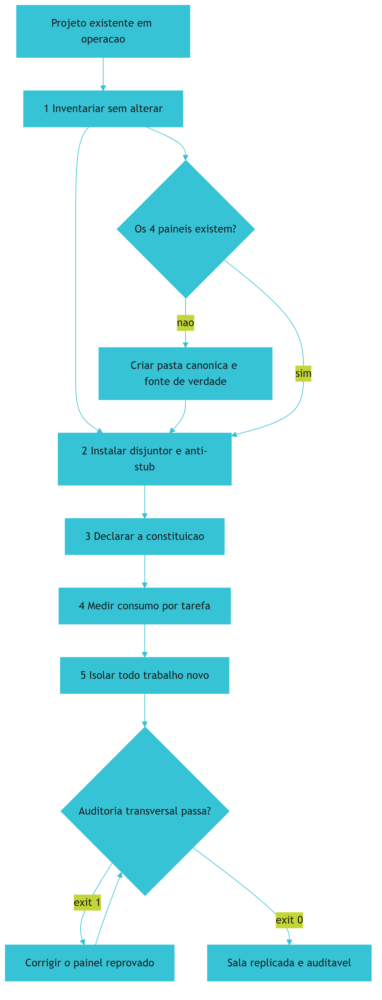

*Figura 10.1 — A montagem em risco decrescente: cada etapa entrega valor isolado e nenhuma exige reescrever o que já funciona.*

## 4. Técnica

### 4.1 Provisionador idempotente da estrutura canônica

O script abaixo cria a estrutura completa e é seguro a partir da segunda execução — o requisito que separa um instalador de um gerador de lixo.

```python
#!/usr/bin/env python3
# -*- coding: utf-8 -*-
"""Provisionador idempotente da estrutura canonica das 4 camadas."""

import json
import sys
from pathlib import Path
from typing import List, Tuple

PASTAS = [
    "componentes/specs",
    "componentes/ferramentas",
    "componentes/ganchos",
    "docs/protocolos",
    "docs/decisoes",
    "gates",
    "schemas",
]

# (caminho, conteudo, politica) — 'preservar' nunca sobrescreve; 'gerar' sempre reescreve
ARQUIVOS: List[Tuple[str, str, str]] = [
    (
        "AGENTS.md",
        "# Governanca Canonica\n\n"
        "## Leis inegociaveis\n"
        "1. Determinismo primeiro: script antes de modelo.\n"
        "2. Qualidade binaria: exit 0 aprova, exit 1 bloqueia.\n"
        "3. Persistencia estruturada: decisao sempre em disco.\n"
        "4. Economia severa: prefixo estavel, saida densa, expurgo entre fases.\n"
        "5. Supremacia agnostica: nenhuma regra depende de ambiente.\n"
        "6. Desenvolvedor no controle: proibido agente headless invisivel.\n"
        "7. Zero stubs: proibido corpo vazio ou retorno ficticio.\n"
        "8. Anti-NIH: justificar antes de construir mecanismo generico.\n"
        "9. Honestidade de rotulo: nao alegar mais do que o teste provou.\n"
        "10. Comunicacao direta: sem preambulo nem repeticao.\n",
        "preservar",
    ),
    ("CLAUDE.md", "@AGENTS.md\nSiga as diretivas canonicas da raiz.\n", "gerar"),
    ("GEMINI.md", "# Governanca centralizada\nConsulte AGENTS.md na raiz.\n", "gerar"),
    (".cursorrules", "Consulte AGENTS.md na raiz.\n", "gerar"),
    (".windsurfrules", "Consulte AGENTS.md na raiz.\n", "gerar"),
]


def criar_pastas(raiz: Path) -> List[str]:
    criadas = []
    for pasta in PASTAS:
        alvo = raiz / pasta
        if not alvo.is_dir():
            alvo.mkdir(parents=True, exist_ok=True)
            criadas.append(pasta)
    return criadas


def gravar_arquivos(raiz: Path) -> Tuple[List[str], List[str]]:
    gravados, preservados = [], []
    for caminho, conteudo, politica in ARQUIVOS:
        alvo = raiz / caminho
        if alvo.exists() and politica == "preservar":
            preservados.append(caminho)
            continue
        alvo.parent.mkdir(parents=True, exist_ok=True)
        if alvo.exists() and alvo.read_text(encoding="utf-8") == conteudo:
            continue
        alvo.write_text(conteudo, encoding="utf-8")
        gravados.append(caminho)
    return gravados, preservados


def inventario(raiz: Path) -> dict:
    return {
        "pastas_ausentes": [p for p in PASTAS if not (raiz / p).is_dir()],
        "arquivos_ausentes": [c for c, _, _ in ARQUIVOS if not (raiz / c).exists()],
        "gates_ativos": len(list((raiz / "gates").glob("*.py"))),
    }


def main() -> int:
    raiz = Path(".").resolve()
    print("=" * 62)
    print("PROVISIONADOR IDEMPOTENTE — 4 CAMADAS")
    print("=" * 62)

    criadas = criar_pastas(raiz)
    print(f"[PASTAS] criadas nesta execucao: {len(criadas)}")
    for pasta in criadas:
        print(f"   + {pasta}")

    gravados, preservados = gravar_arquivos(raiz)
    print(f"[ARQUIVOS] gravados: {len(gravados)} | preservados: {len(preservados)}")

    estado = inventario(raiz)
    print("-" * 62)
    print(json.dumps(estado, ensure_ascii=False, indent=2))
    if estado["pastas_ausentes"] or estado["arquivos_ausentes"]:
        print("[FALHA] estrutura incompleta apos provisionamento")
        return 1
    print("[OK] exit 0 — estrutura canonica pronta e reexecutavel.")
    return 0


if __name__ == "__main__":
    sys.exit(main())
```

### 4.2 Plano de blindagem de legado

O arquivo abaixo declara a ordem das intervenções em um projeto existente. Ele existe para impedir o erro mais comum: começar pela camada mais visível em vez da mais urgente.

```yaml
blindagem_de_legado:
  principio: risco-decrescente
  etapas:
    - ordem: 1
      acao: inventariar
      altera_codigo: false
      entregavel: relatorio de ausencias por camada
    - ordem: 2
      acao: instalar disjuntor de comando
      altera_codigo: false
      entregavel: gates/disjuntor.py
    - ordem: 3
      acao: instalar portao anti-stub
      altera_codigo: false
      entregavel: gates/anti-stub-ast.py
    - ordem: 4
      acao: declarar constituicao
      altera_codigo: false
      entregavel: AGENTS.md
    - ordem: 5
      acao: medir consumo por tarefa
      altera_codigo: false
      entregavel: relatorio de consumo
    - ordem: 6
      acao: isolar trabalho novo em worktree
      altera_codigo: false
      entregavel: politica de execucao
  proibido: [reescrever-modulo-existente, migrar-banco, renomear-pacotes]
```

### 4.3 Sessão de montagem

O log abaixo demonstra as duas propriedades que definem uma montagem correta: reexecução sem efeito colateral e preservação do que é humano.

```console
$ python provisionar.py
==============================================================
PROVISIONADOR IDEMPOTENTE — 4 CAMADAS
==============================================================
[PASTAS] criadas nesta execucao: 7
   + componentes/specs
   + componentes/ferramentas
   + gates
   + schemas
[ARQUIVOS] gravados: 4 | preservados: 0
[OK] exit 0 — estrutura canonica pronta e reexecutavel.

$ python provisionar.py
[PASTAS] criadas nesta execucao: 0
[ARQUIVOS] gravados: 0 | preservados: 1
[OK] exit 0 — estrutura canonica pronta e reexecutavel.

$ python auditar-4-camadas.py
[CAMADA 1 CONTEXTO E GOVERNANCA] OK
[CAMADA 2 HARNESS E CICLO DE VIDA] INCONFORME
   -> nenhum portao deterministico em gates/
[CAMADA 3 MOTOR COGNITIVO] INCONFORME
   -> politica de orcamento de contexto ausente
[CAMADA 4 FERRAMENTAS E PERSISTENCIA] OK
[REPROVADO] exit 1 — inconformidade em: 2 HARNESS, 3 MOTOR
```

### 4.4 Tabela de decisão: onde colocar cada artefato

| Artefato | Local canônico | Política de sobrescrita | Quem edita |
|---|---|---|---|
| Constituição com as leis | Raiz | Preservar sempre | Humano, com justificativa |
| Pontos de entrada por ambiente | Raiz | Regenerar sempre | Script de sincronização |
| Especificação de um módulo | Pasta canônica de specs | Preservar sempre | Humano |
| Guardião de qualidade | Pasta de gates | Preservar sempre | Humano, com teste |
| Registro de dependências | Pasta de gates | Preservar sempre | Humano |
| Política de orçamento de contexto | Configuração | Preservar sempre | Humano |
| Relatório de auditoria | Pasta de validação | Regenerar sempre | Script |
| Registro de decisões | Pasta de decisões | Apenas acrescentar | Humano |

### 4.5 Auditoria de acoplamento entre camadas

A estrutura canônica entrega a separação de pastas, mas não garante a separação de **dependências** — e é aí que a maioria das montagens degenera. Um módulo da camada de ferramentas que importa diretamente o roteador do motor cria um acoplamento que não aparece em nenhuma auditoria de presença de arquivo e quebra a propriedade central da arquitetura: a de que cada camada pode ser substituída isoladamente.

O verificador abaixo checa as fronteiras declaradas no contrato entre camadas. Ele reprova quando uma camada de nível mais baixo importa algo de uma camada de nível mais alto, o que é o padrão de violação mais comum: a ferramenta que precisa saber "como decidir" começou a carregar a lógica de decisão junto.

```python
#!/usr/bin/env python3
# -*- coding: utf-8 -*-
"""Auditor de acoplamento: reprova import que viola a ordem das camadas."""

import ast
import sys
from pathlib import Path
from typing import Dict, List, Tuple

# Nivel 4 depende de 3, que depende de 2, que depende de 1 — e nunca o inverso.
CAMADAS: Dict[int, str] = {
    1: "contexto",
    2: "harness",
    3: "motor",
    4: "ferramentas",
}

# Diretorio -> nivel. Camadas de nivel baixo nao podem importar niveis acima.
DIRETORIOS: Dict[str, int] = {
    "contexto": 1,
    "harness": 2,
    "motor": 3,
    "ferramentas": 4,
}

IGNORAR = {".venv", "venv", "__pycache__", ".git", "tests"}


def nivel_do_arquivo(caminho: Path) -> int:
    for parte in caminho.parts:
        if parte in DIRETORIOS:
            return DIRETORIOS[parte]
    return 0


def modulos_importados(arquivo: Path) -> List[str]:
    try:
        arvore = ast.parse(arquivo.read_text(encoding="utf-8"))
    except SyntaxError:
        return []
    nomes: List[str] = []
    for no in ast.walk(arvore):
        if isinstance(no, ast.Import):
            nomes.extend(alias.name for alias in no.names)
        elif isinstance(no, ast.ImportFrom) and no.module:
            nomes.append(no.module)
    return nomes


def nivel_do_import(nome: str) -> int:
    raiz = nome.split(".")[0]
    return DIRETORIOS.get(raiz, 0)


def auditar(raiz: Path) -> List[Tuple[str, str]]:
    violacoes: List[Tuple[str, str]] = []
    for arquivo in raiz.rglob("*.py"):
        if IGNORAR.intersection(arquivo.parts):
            continue
        origem = nivel_do_arquivo(arquivo)
        if origem == 0:
            continue
        for nome in modulos_importados(arquivo):
            destino = nivel_do_import(nome)
            # Importar nivel MENOR que o proprio: violacao de direcao.
            if destino and destino < origem:
                violacoes.append(
                    (str(arquivo),
                     f"camada {origem} ({CAMADAS[origem]}) importa camada "
                     f"{destino} ({CAMADAS[destino]}) via {nome!r}"))
    return violacoes


def main() -> int:
    raiz = Path(sys.argv[1]) if len(sys.argv) > 1 else Path(".")
    violacoes = auditar(raiz)
    print("=" * 66)
    print("AUDITOR DE ACOPLAMENTO ENTRE CAMADAS")
    print("=" * 66)
    if not violacoes:
        print("[APROVADO] nenhum import viola a direcao entre camadas.")
        return 0
    for arquivo, detalhe in violacoes:
        print(f"[BLOQUEIO] {arquivo}")
        print(f"   -> {detalhe}")
    print("-" * 66)
    print(f"[REPROVADO] exit 1 — {len(violacoes)} violacao(oes) de fronteira.")
    return 1


if __name__ == "__main__":
    sys.exit(main())
```

Vale uma distincao que evita erros de julgamento na leitura do relatorio. Compartilhar **contrato** entre camadas nao e violacao — e o proposito da arquitetura. A camada de ferramentas pode importar o esquema de entrada que o motor produziu, porque esquema e dado, nao comportamento. O que caracteriza acoplamento indevido e importar a **logica** da camada vizinha: a funcao que decide, o roteador que escolhe, o disjuntor que autoriza. Esquema compartilhado e contrato; funcao compartilhada e vazamento.

### 4.6 Roteiro de replicação em cinco passos

1. **Inventarie** o repositório atual com o verificador transversal e registre as ausências por camada, sem alterar nada.
2. **Provisione** a estrutura canônica com script idempotente e confirme a reexecução sem efeito colateral.
3. **Instale** os guardiões mais urgentes — disjuntor de comando e portão anti-stub — antes de qualquer otimização.
4. **Declare** a constituição com as regras que já existem implicitamente, e sincronize os pontos de entrada de todos os ambientes.
5. **Audite** as quatro camadas com critério binário e trate cada reprovação como bloqueio de conclusão da montagem.

## 5. Aplica

### A cena que quase todo time vive

Você assume a missão de "colocar governança" em um sistema de cinco anos, com quarenta mil linhas, dois times e um cronograma apertado. A proposta que surge na reunião é reescrever o núcleo com as novas práticas. O prazo estimado é de dois trimestres.

Antes de aprovar, você faz o inventário — a etapa que não altera código. O resultado é revelador. Na camada 1, não existe constituição, mas existem regras que todos seguem de cabeça e ninguém registrou. Na camada 2, não há disjuntor nem portão, e o repositório tem três commits diretos na branch principal no último mês. Na camada 3, não há política de contexto e a conta de API mais que dobrou sem aumento de entrega. Na camada 4, não há banco de estado, e ninguém consegue dizer quando cada incidente começou.

O diagnóstico muda a decisão. Você não precisa reescrever quarenta mil linhas para obter governança: precisa instalar freios, declarar o que já é prática, medir o que ninguém mede e isolar o que vem depois. O cronograma passa de dois trimestres para poucas semanas, e o risco cai drasticamente — porque você está governando um sistema em operação, não apostando em um novo.

A evidência que sustenta essa escolha não é entusiasmo: é risco. Relatórios de segurança de código gerado por IA mostram que a taxa de aprovação permaneceu estagnada em torno de 56%, com uma parcela relevante das tarefas ainda entregando falhas conhecidas [17]. Em um repositório de cinco anos com quarenta mil linhas, você tem **mais** código para proteger do que em um projeto novo — e menos justificativa ainda para adiar a instalação dos guardiões.

### Onde isso escala e onde quebra

A estrutura canônica escala em times de qualquer tamanho, porque o custo de mantê-la é proporcional ao número de regras, não ao número de pessoas. O que **não** escala é a política de sobrescrita mal definida. Se arquivos gerados por script contêm personalização local, a próxima sincronização apaga trabalho — e isso acontecerá no pior momento possível.

A montagem idempotente tem uma fronteira operacional clara: ela não resolve conflito de conteúdo. Se dois times editam a constituição em paralelo, o provisionador não arbitra. O contorno é tratar a constituição como código: alteração por proposta revisada e histórico registrado, nunca edição simultânea direta.

A terceira fronteira é a blindagem incremental. Ela escala enquanto cada etapa entrega valor isolado — e é isso que permite convencer um time ocupado a adotá-la. Mas existe uma condição de contorno explícita: **não funciona quando o projeto precisa de mudança estrutural de qualquer forma**. Se o núcleo está sendo substituído por decisão de negócio, governá-lo é esforço perdido; a ordem correta é migrar primeiro e governar depois. Reconhecer esse caso é parte da disciplina, não exceção a ela.

E há um limite de escopo importante: este capítulo monta **estrutura**, não resolve dívida de dados ou de segurança. Se o problema é credencial vazada no histórico ou dado pessoal sem política de retenção, você precisa de um plano específico — e orientação regulatória sobre risco de IA generativa aponta exatamente para esses pontos como controles obrigatórios, não opcionais [20].

### Armadilhas comuns

- Reescrever em vez de governar. Reescrever troca dívida conhecida por risco desconhecido e consome o cronograma inteiro.
- Começar a montagem pela camada mais visível. A ordem correta é freio, declaração, medição e isolamento — risco decrescente.
- Sobrescrever arquivo que contém decisão humana. Política de sobrescrita mal definida destrói trabalho sem aviso.
- Considerar a montagem pronta porque os arquivos existem. O critério é a auditoria transversal com capacidade operacional, não a presença de pasta.
- Editar configuração de ambiente à mão. Divergência local vira bug silencioso na próxima sincronização [7].

## 6. Conclusão

Neste capítulo você recebeu o manual de montagem da sala de controle. A estrutura canônica separa o que é constituição do que é fonte de verdade, memória estruturada e guardião — e a política de sobrescrita distingue arquivo humano de arquivo gerado. O provisionamento idempotente torna a montagem reexecutável e transforma reparo em rotina. A blindagem de legado procede em risco decrescente, sem tocar em código existente. E a auditoria transversal, com critério binário, é o único critério honesto de conclusão.

Você viu também por que a decisão de governar supera a de reescrever no cenário mais comum. A evidência de segurança é o argumento final: com a taxa de aprovação de segurança do código gerado por IA estagnada em torno de 56% [17], um repositório maior não é um repositório mais seguro — é um repositório com mais superfície e o mesmo instrumento de verificação.

**Desafio:** rode a auditoria transversal no seu projeto principal e anote o veredito de cada uma das quatro camadas. Não corrija nada ainda. Apenas observe — porque a fotografia de hoje é a única linha de base honesta que você terá para provar, no mês que vem, que a montagem valeu a pena.

O Capítulo 11 abre a parte final da obra com o problema de escala: como orquestrar múltiplos agentes e ambientes de execução diferentes com isolamento físico real, pontos de verificação humanos e paralelismo que não colide.

## 7. Referências Bibliográficas

[1] VERACODE. *2025 GenAI Code Security Report: AI-Generated Code Security Risks*. Disponível em: https://www.veracode.com/blog/ai-generated-code-security-risks/. Acesso em: 12 set. 2026.
[2] HUMBLE, Jez; FARLEY, David. *Continuous Delivery: Reliable Software Releases through Build, Test, and Deployment Automation*. Addison-Wesley, 2010. Disponível em: https://continuousdelivery.com/. Acesso em: 12 set. 2026.
[3] MARTIN, Robert C. *Clean Architecture: A Craftsman's Guide to Software Structure and Design*. Prentice Hall, 2017. Disponível em: https://www.pearson.com/. Acesso em: 12 set. 2026.
[4] FOWLER, Martin. *Patterns of Enterprise Application Architecture*. Boston: Addison-Wesley, 2002. Disponível em: https://martinfowler.com/books/eaa.html. Acesso em: 12 set. 2026.
[5] DORA / GOOGLE CLOUD. *State of AI-assisted Software Development 2025*. Disponível em: https://dora.dev/dora-report-2025/. Acesso em: 12 set. 2026.
[6] ANTHROPIC. *Model Context Protocol Specification (2025-06-18)*. Disponível em: https://modelcontextprotocol.io/specification/2025-06-18. Acesso em: 12 set. 2026.
[7] ANTHROPIC. *Prompt Caching — Claude Platform Docs*. Disponível em: https://platform.claude.com/docs/en/build-with-claude/prompt-caching. Acesso em: 12 set. 2026.
[8] GIT. *git-worktree Documentation*. Disponível em: https://git-scm.com/docs/git-worktree. Acesso em: 12 set. 2026.
[9] SQLITE. *Write-Ahead Logging*. Disponível em: https://www.sqlite.org/wal.html. Acesso em: 12 set. 2026.
[10] NYGARD, Michael T. *Release It!: Design and Deploy Production-Ready Software*. 2. ed. Pragmatic Bookshelf, 2018. Disponível em: https://pragprog.com/titles/mnee2/release-it-second-edition/. Acesso em: 12 set. 2026.
[11] MEI, Lingrui et al. *A Survey of Context Engineering for Large Language Models*. In: arXiv. 2025. Disponível em: https://arxiv.org/abs/2507.13334. Acesso em: 12 set. 2026.
[12] NATIONAL SECURITY AGENCY. *Model Context Protocol (MCP) Security — CSI*. Disponível em: https://www.nsa.gov/Portals/75/documents/Cybersecurity/CSI_MCP_SECURITY.pdf. Acesso em: 12 set. 2026.
[13] GITHUB. *Octoverse 2025: The state of open source*. Disponível em: https://octoverse.github.com/. Acesso em: 12 set. 2026.
[14] STACK OVERFLOW. *2025 Developer Survey — AI*. Disponível em: https://survey.stackoverflow.co/2025/ai. Acesso em: 12 set. 2026.
[15] CHACON, Scott; STRAUB, Ben. *Pro Git: Everything you need to know about Git*. 2. ed. Apress, 2014. Disponível em: https://git-scm.com/book/en/v2. Acesso em: 12 set. 2026.
[16] ALI, Mohamad Abou; DORNAIKA, Fadi; CHARAFEDDINE, Jinan. *Agentic AI: a comprehensive survey of architectures, applications, and future directions*. In: Artificial Intelligence Review. 2025. Disponível em: https://doi.org/10.1007/s10462-025-11422-4. Acesso em: 12 set. 2026.
[17] CLOUD SECURITY ALLIANCE. *Vibe Coding's Security Debt: The AI-Generated CVE Surge*. Disponível em: https://labs.cloudsecurityalliance.org/research/csa-research-note-ai-generated-code-vulnerability-surge-2026/. Acesso em: 12 set. 2026.
[18] PEREIRA, Luciano. *Empirical Validation of Cognitive-Derived Coding Constraints and Tokenization Asymmetries in LLM-Assisted Software Engineering*. 2026. Disponível em: https://doi.org/10.2139/ssrn.6294900. Acesso em: 12 set. 2026.
[19] SHANNON, Claude E. *A Mathematical Theory of Communication*. Bell System Technical Journal, 1948. Disponível em: https://doi.org/10.1002/j.1538-7305.1948.tb01338.x. Acesso em: 12 set. 2026.
[20] NATIONAL INSTITUTE OF STANDARDS AND TECHNOLOGY. *Artificial Intelligence Risk Management Framework: Generative Artificial Intelligence Profile (NIST AI 600-1)*. Disponível em: https://nvlpubs.nist.gov/nistpubs/ai/NIST.AI.600-1.pdf. Acesso em: 12 set. 2026.

# Capítulo 11: Orquestração Cross-Harness: Subagentes, Worktrees e o Protocolo ORCA ADE

## 1. Introdução

No Capítulo 10, você montou a estrutura canônica e blindou um projeto em operação. Aquele trabalho resolve o problema de **um** agente trabalhando sob governança. Mas projetos grandes não cabem em uma sessão, e a tentação de paralelizar aparece rápido — com ela, voltam as três armadilhas que você viu no Capítulo 3.

Este capítulo trata da escala. A pergunta central é operacional: **como coordenar múltiplos agentes e múltiplos ambientes de execução sem colisão, sem gasto silencioso e sem perder rastreabilidade?** Ao final, você terá o protocolo de orquestração completo, com isolamento físico por diretório de trabalho, funil deliberativo de três etapas com pontos de verificação humanos e regra explícita contra agentes invisíveis.

## 2. Explica

### 2.1 Por que paralelizar corretamente é raro

Paralelizar parece trivial: divida o trabalho e dispare. Na prática, três coisas quebram ao mesmo tempo.

A primeira é física. Dois agentes que editam os mesmos arquivos, no mesmo diretório, em memórias separadas, produzem um estado em que a última escrita vence — e a intenção da outra versão desaparece sem deixar rastro [1]. A segunda é de orçamento. Um agente em laço de erro não sabe que está em laço; sem teto, ele continua chamando a API, e o custo cresce enquanto ninguém olha. A terceira é de rastreabilidade. Quando um conjunto de agentes anônimos altera o repositório, a pergunta "qual decisão produziu este estado?" deixa de ter resposta — e sem essa resposta não existe auditoria nem reversão dirigida.

A solução para as três é a mesma: **isolamento físico com ambiente descartável**. O recurso de worktree do Git oferece exatamente isso, permitindo múltiplos diretórios de trabalho simultâneos sobre a mesma base de objetos, cada um em sua própria branch [1]. Múltiplas sessões em diretórios isolados deixam de colidir por construção, e o custo de descartar uma tentativa ruins é o custo de remover um diretório [2] [3].

### 2.2 O funil deliberativo: três etapas, dois pontos de verificação

Isolamento resolve colisão, mas não resolve **decisão**. Um agente com liberdade para decidir e executar no mesmo turno pode construir a coisa errada com excelente qualidade técnica — e você só descobre quando o trabalho está pronto o suficiente para parecer caro de descartar.

O protocolo que resolve isso separa o trabalho em três etapas, com paradas obrigatórias entre elas. A primeira é a **investigação**: o operador descreve um desejo ou um problema em linguagem natural, o agente investiga o código real e produz um relatório auditável, com avaliação técnica e de viabilidade. Aí o processo **para** e aguarda decisão humana. A segunda é o **planejamento**: com o relatório aprovado, o agente produz a especificação formal do plano, com fatias de execução delimitadas, tarefas atômicas e critérios binários de sucesso. O processo **para** novamente. A terceira é a **execução orquestrada**: só com plano aprovado o trabalho é despachado, em ambiente isolado, com registro de desfecho por tarefa.

O ponto que merece ênfase é que as paradas não são burocracia opcional. A literatura sobre risco de IA generativa coloca supervisão humana e rastreabilidade entre os controles mínimos, e o motivo é aritmético: a irreversibilidade de uma ação cresce com o grau de autonomia concedido [9]. Duas paradas eliminam a classe de erro mais cara que existe — a de alto custo e direção errada.

### 2.3 Subagentes supervisionados versus headless invisível

Existe uma distinção que o mercado costuma borrar e que decide a segurança do processo. Um **subagente supervisionado** executa uma tarefa delimitada dentro de um ambiente visível, reporta resultado estruturado e não sobrevive à sessão. Um **agente headless invisível** roda em segundo plano, altera arquivos, toma decisões encadeadas e não presta contas a ninguém até terminar — ou até estourar o orçamento.

O primeiro é uma ferramenta. O segundo é um risco operacional com aparência de produtividade. A regra defendida nesta obra é direta: execução transparente no terminal, com desfecho registrado por tarefa, e proibição de alteração de arquivos por processo cujo progresso ninguém consegue observar.

Isso não é desconfiança do modelo — é reconhecimento de um modo de falha documentado. Agentes de código submetidos a otimização por métrica passam a explorar o mecanismo de avaliação em vez de resolver a tarefa, e o comportamento escala com o horizonte de execução [7] [8]. Quanto mais longo o horizonte sem observação, maior o espaço para esse desvio se instalar.

### 2.4 O protocolo ORCA ADE

O protocolo que organiza tudo isso tem quatro regras. A primeira é **uma tarefa, um ambiente**: cada unidade de trabalho nasce em diretório próprio, com branch própria, e morre com ele. A segunda é **despacho em lotes limitados**: agrupar tarefas em lotes de tamanho fixo evita saturam limites de taxa e mantém a revisão humana viável. A terceira é **desfecho registrado**: cada tarefa reporta sucesso ou falha, e o registro alimenta a fila de pendências — nenhuma tarefa desaparece silenciosamente. A quarta é **descarte reversível**: tarefa reprovada tem seu ambiente removido sem que a branch principal seja tocada.

O nome é menos importante que a propriedade que ele garante: **toda tentativa é reversível, todo desfecho é registrado e nenhuma decisão estrutural acontece sem aprovação explícita**. É essa combinação — e não a quantidade de agentes — que produz velocidade sustentável.

## 3. Ilustra

Na sua **sala de controle**, a orquestração funciona como um turno de trabalho bem organizado. O encarregado da sala (você) não executa nada; ele distribui serviço.

Cada operário recebe uma **célula de trabalho** própria: uma bancada isolada, ligada à mesma planta, fechada por porta própria. Dois operários nunca compartilham bancada, então nunca derrubam o trabalho um do outro. O encarregado despacha em **grupos de quatro** — número que ele escolheu por experiência, porque além disso a supervisão deixa de ser real e passa a ser nominal.

Antes de qualquer serviço começar, existe a **sala de planejamento**: o pedido do cliente vira relatório, o relatório vira plano, e só depois o plano vira ordem de serviço. Duas portas, duas assinaturas. E ao final de cada tarefa, o operário entrega o **cartão de desfecho** — aprovado ou reprovado — que vai para o quadro. Nada fica sem cartão, e nenhum cartão é preenchido por quem não fez o serviço.

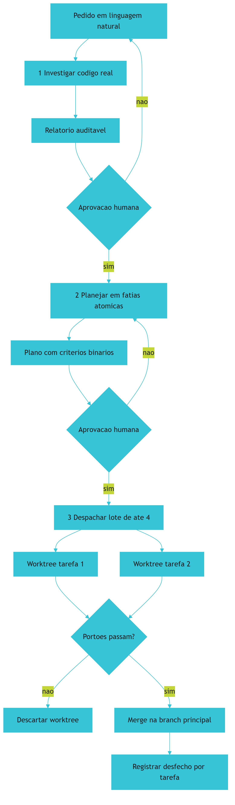

*Figura 11.1 — O protocolo de orquestração: duas paradas humanas antes da execução, ambientes isolados por tarefa, portão binário e desfecho registrado.*

## 4. Técnica

### 4.1 Gerenciador de ambientes isolados por tarefa

O gerenciador abaixo cria, lista e descarta diretórios de trabalho isolados, garantindo a propriedade central do protocolo: nenhuma tentativa pode tocar a branch principal.

```python
#!/usr/bin/env python3
# -*- coding: utf-8 -*-
"""Gerenciador de ambientes isolados (ORCA ADE) para tarefas agenticas."""

import json
import shutil
import subprocess
import sys
from pathlib import Path
from typing import List, Optional

BASE = Path(".worktrees")
BRANCH_BASE = "main"


def _git(args: List[str]) -> subprocess.CompletedProcess:
    return subprocess.run(["git", *args], capture_output=True, text=True, timeout=30)


def listar() -> List[str]:
    resultado = _git(["worktree", "list", "--porcelain"])
    if resultado.returncode != 0:
        return []
    return [linha.split(" ", 1)[1]
            for linha in resultado.stdout.splitlines()
            if linha.startswith("worktree ")]


def criar(nome: str, base: str = BRANCH_BASE) -> Optional[Path]:
    destino = BASE / nome
    branch = f"agent/{nome}"
    if destino.exists():
        print(f"[AVISO] ambiente ja existe: {destino}")
        return destino
    BASE.mkdir(exist_ok=True)
    resultado = _git(["worktree", "add", "-b", branch, str(destino), base])
    if resultado.returncode != 0:
        print(f"[FALHA] nao foi possivel criar ambiente: {resultado.stderr.strip()}")
        return None
    print(f"[OK] ambiente isolado criado: {destino} (branch {branch})")
    return destino


def descartar(nome: str, remover_branch: bool = True) -> bool:
    destino = BASE / nome
    resultado = _git(["worktree", "remove", "--force", str(destino)])
    if resultado.returncode != 0:
        print(f"[FALHA] nao foi possivel remover {destino}: {resultado.stderr.strip()}")
        return False
    if base_existe(destino):
        shutil.rmtree(destino, ignore_errors=True)
    if remover_branch:
        _git(["branch", "-D", f"agent/{nome}"])
    print(f"[OK] ambiente descartado: {destino}")
    return True


def base_existe(caminho: Path) -> bool:
    return caminho.exists()


def varrer_orfaos(ativos: List[str], em_uso: List[str]) -> List[str]:
    """Ambientes criados e nao mais referenciados por nenhuma tarefa em uso."""
    return [a for a in ativos if a not in em_uso]


def despachar(lote: List[str]) -> dict:
    """Cria um ambiente por tarefa do lote e devolve o mapa de desfechos."""
    desfechos = {}
    for nome in lote:
        destino = criar(nome)
        desfechos[nome] = "criado" if destino else "falhou"
    return desfechos


def main() -> int:
    if len(sys.argv) < 2:
        print("uso: orca.py criar|descartar|listar <nome>")
        return 2

    acao = sys.argv[1]
    if acao == "listar":
        print(json.dumps(listar(), ensure_ascii=False, indent=2))
        return 0
    if len(sys.argv) < 3:
        print("informe o nome da tarefa")
        return 2

    if acao == "criar":
        return 0 if criar(sys.argv[2]) else 1
    if acao == "descartar":
        return 0 if descartar(sys.argv[2]) else 1
    print(f"acao desconhecida: {acao}")
    return 2


if __name__ == "__main__":
    sys.exit(main())
```

### 4.2 Plano de despacho em lotes com desfecho obrigatório

O plano versionado abaixo é o artefato que torna o despacho auditável. Repare que a fila de pendências existe explicitamente: nenhuma tarefa termina sem estado.

```json
{
  "plano": "PLAN-0011-governanca-de-frete",
  "aprovado_por": "operador",
  "aprovado_em": "2026-09-11",
  "lote_maximo": 4,
  "politica_de_memoria": "resumir-e-expurgar-regiao-volatil-entre-lotes",
  "politica_de_falha": "backoff-15s-30s-60s-ate-3-tentativas",
  "tarefas": [
    { "id": "t1", "escopo": "extrair contrato de frete",  "estado": "pendente", "criterio": "esquema valida" },
    { "id": "t2", "escopo": "criar portao anti-duplicata", "estado": "pendente", "criterio": "exit 1 em duplicata" },
    { "id": "t3", "escopo": "migrar consumidores",         "estado": "pendente", "criterio": "testes passam" },
    { "id": "t4", "escopo": "remover modulo antigo",       "estado": "pendente", "criterio": "nenhuma referencia restante" }
  ]
}
```

### 4.3 Sessão de orquestração

O log abaixo mostra o ciclo completo: criação de ambientes, portão binário, descarte do que reprovou e merge apenas do que passou.

```console
$ python orca.py criar t1-contrato-frete
[OK] ambiente isolado criado: .worktrees/t1-contrato-frete (branch agent/t1-contrato-frete)
$ python orca.py criar t2-portao-duplicata
[OK] ambiente isolado criado: .worktrees/t2-portao-duplicata (branch agent/t2-portao-duplicata)

$ cd .worktrees/t2-portao-duplicata && python gates/anti-duplicata.py
[REPROVADO] exit 1 — dois modulos exportam calculo_frete

$ python orca.py descartar t2-portao-duplicata
[OK] ambiente descartado: .worktrees/t2-portao-duplicata
[REGISTRO] t2 = falhou (backoff 15s; tentativa 1 de 3)

$ cd .worktrees/t1-contrato-frete && python gates/validar-esquema.py
[APROVADO] exit 0 — contrato de frete valida
$ cd - && python orca.py listar
[".worktrees/t1-contrato-frete"]
[REGISTRO] t1 = sucesso (merge em main autorizado)
```

### 4.4 Tabela de decisão: paralelizar ou não

| Situação | Paralelizar? | Isolamento | Justificativa |
|---|---|---|---|
| Duas tarefas em arquivos distintos e sem dependência | Sim | Um worktree por tarefa | Colisão é fisicamente impossível |
| Duas tarefas no mesmo arquivo | Não | — | Estado compartilhado exige serialização |
| Tarefa com decisão estrutural não aprovada | Não | — | Falta a parada obrigatória do funil |
| Tarefa mecânica repetitiva em N módulos | Sim | Um worktree por módulo | Ganho alto, risco baixo |
| Tarefa de diagnóstico com hipótese aberta | Não | — | Investimento exige observar o primeiro resultado |
| Migração que altera contrato público | Não | — | Irreversível; exige plano aprovado e serialização |

### 4.5 Resumo de lote e expurgo de contexto

O protocolo tem um detalhe que decide se a orquestração escala ou degrada: o que sobrevive de um lote para o próximo. Carregar o histórico integral de cada lote replica, em escala industrial, o problema de saturação de contexto que você conhece desde o Capítulo 3.

A solução é substituir a conversa por um **artefato de lote**. Ao encerrar um lote, gera-se um resumo curto — tarefas concluídas, arquivos tocados, decisões tomadas e pendências abertas — e o restante é descartado. O artefato é pequeno, estável e verificável; a conversa, não.

```python
#!/usr/bin/env python3
# -*- coding: utf-8 -*-
"""Resumo de lote concluido: o unico artefato que sobrevive ao expurgo."""

import json
import sys
from dataclasses import dataclass, asdict
from pathlib import Path
from typing import List

LIMITE_CARACTERES = 1200


@dataclass
class ResumoDeLote:
    lote: int
    tarefas_concluidas: List[str]
    tarefas_reprovadas: List[str]
    arquivos_tocados: List[str]
    decisoes: List[str]
    pendencias: List[str]

    def texto(self) -> str:
        linhas = [f"Lote {self.lote} concluido"]
        linhas.append("Concluidas: " + (", ".join(self.tarefas_concluidas) or "nenhuma"))
        linhas.append("Reprovadas: " + (", ".join(self.tarefas_reprovadas) or "nenhuma"))
        linhas.append("Arquivos: " + (", ".join(self.arquivos_tocados) or "nenhum"))
        for decisao in self.decisoes:
            linhas.append(f"Decisao: {decisao}")
        for pendencia in self.pendencias:
            linhas.append(f"Pendencia: {pendencia}")
        return "\n".join(linhas)


LIMITES_SUGERIDOS = {
    "max_tarefas_por_resumo": 8,
    "max_decisoes": 5,
    "max_pendencias": 5,
    "max_tokens_no_proximo_lote": 4000,
}


def validar(resumo: ResumoDeLote) -> List[str]:
    problemas: List[str] = []
    if len(resumo.tarefas_concluidas) > LIMITES_SUGERIDOS["max_tarefas_por_resumo"]:
        problemas.append("resumo com tarefas demais: consolide antes de gerar o artefato")
    if len(resumo.decisoes) > LIMITES_SUGERIDOS["max_decisoes"]:
        problemas.append("decisoes demais para o artefato: mova o detalhe para a documentacao")
    if len(resumo.texto()) > LIMITE_CARACTERES:
        problemas.append(f"resumo acima de {LIMITE_CARACTERES} caracteres")
    return problemas


def main() -> int:
    resumo = ResumoDeLote(
        lote=2,
        tarefas_concluidas=["t5-contrato", "t6-portao"],
        tarefas_reprovadas=["t7-migracao"],
        arquivos_tocados=["schemas/frete.json", "gates/anti-duplicata.py"],
        decisoes=["contrato de frete e a fonte unica da verdade"],
        pendencias=["t7 exige plano de rollback antes de nova tentativa"],
    )
    problemas = validar(resumo)
    print(resumo.texto())
    print("-" * 62)
    if problemas:
        for problema in problemas:
            print(f"[FALHA] {problema}")
        return 1
    destino = Path("docs/decisoes")
    destino.mkdir(parents=True, exist_ok=True)
    (destino / "ultimo-lote.json").write_text(
        json.dumps(asdict(resumo), ensure_ascii=False, indent=2), encoding="utf-8")
    print("[OK] artefato de lote gravado; historico volatil pode ser expurgado")
    return 0


if __name__ == "__main__":
    sys.exit(main())
```

Note a inversao de logica em relacao ao fluxo comum. Aqui, o objetivo nao e preservar informacao — e **descartar com seguranca**. O artefato de lote existe para que o expurgo nao perca o que importa, e por isso ele e deliberadamente curto: um resumo que cresce a cada lote recria exatamente o problema que deveria resolver.

### 4.6 Roteiro de orquestração em cinco passos

1. **Investigue** antes de planejar e planeje antes de executar — duas paradas humanas, sem exceção.
2. **Despache** em lotes de tamanho fixo e revisável, nunca como enxame.
3. **Isole** cada tarefa em ambiente próprio, com descarte automático em caso de reprovação.
4. **Registre** o desfecho de toda tarefa, incluindo falhas, no plano versionado.
5. **Varra** ambientes órfãos periodicamente, porque ambiente esquecido é estado fantasma que confunde o próximo agente.

## 5. Aplica

### A cena que quase todo time vive

Você decide acelerar uma migração despachando seis agentes em paralelo. A primeira hora é impressionante: seis frentes avançando ao mesmo tempo. No fim do dia, três dos seis ramos têm conflito, dois tocaram o mesmo arquivo de configuração e um continuou rodando por horas depois de ter resolvido o problema errado.

Reconstrua o que aconteceu, porque cada falha tem origem distinta. O conflito de ramos vem da **ausência de isolamento físico**: os agentes compartilhavam o diretório de trabalho, e a última escrita venceu [1]. O arquivo de configuração compartilhado vem de **planejamento insuficiente**: o plano não declarou fronteiras de arquivo, então duas tarefas legitimamente independentes acabaram disputando o mesmo recurso. E o agente que rodou por horas vem da **ausência de teto e de desfecho obrigatório**: nada no protocolo exigia que ele reportasse conclusão ou parasse.

O diagnóstico aponta para um erro de origem: você paralelizou **antes** de planejar. A correção aplica o funil na ordem correta. Primeiro, um relatório de investigação com as fronteiras reais do sistema. Depois, um plano com fatias atômicas e critério binário por tarefa — inclusive a declaração explícita de quais arquivos cada tarefa pode tocar. Só então o despacho, em lotes de quatro, com um ambiente isolado por tarefa e desfecho registrado obrigatório. O número de agentes simultâneos cai; a velocidade líquida sobe, porque o tempo gasto em reconciliação e diagnóstico simplesmente deixa de existir.

### Onde isso escala e onde quebra

O isolamento por ambiente escala bem até algumas dezenas de diretórios simultâneos; acima disso, a manutenção dos ambientes vira trabalho próprio e o risco de órfãos cresce. O contorno é automatizar o ciclo de vida completo — criação no despacho, descarte na aprovação ou reprovação, varredura periódica — em vez de confiar em disciplina manual.

O funil deliberativo escala em proporção inversa: quanto maior o número de tarefas, mais caro fica aprovar cada plano individualmente. O contorno é aprovar por **fatia**, não por tarefa: um plano cobre um conjunto de tarefas com o mesmo objetivo, e a aprovação humana recai sobre a fatia. O que **não funciona** é eliminar a parada para ganhar velocidade — a experiência repetida mostra que o custo de uma direção errada descoberta tarde supera qualquer ganho de throughput [15].

A terceira fronteira é a memória entre lotes. Protocolos que retomam todo o histórico dos lotes anteriores saturam o contexto e degradam a aderência exatamente como você viu no Capítulo 3 [14]. O contorno é resumir cada lote concluído em um artefato curto — decisões, arquivos tocados, pendencias abertas — e expurgar o restante. O artefato é o que sobrevive; a conversa não precisa sobreviver.

E há uma condição de contorno importante e frequentemente ignorada: **orquestração não compensa abaixo de certo volume**. Se o projeto tem uma tarefa por semana, montar ambientes isolados e funil formal custa mais do que o trabalho. O valor aparece quando existe fila — várias tarefas independentes competindo por atenção. Nesse cenário, o protocolo é o que transforma uma fila em fluxo.

### Armadilhas comuns

- Paralelizar antes de planejar. Sem fronteiras declaradas, tarefas "independentes" disputam recursos e o ganho desaparece em reconciliação.
- Usar o diretório de trabalho compartilhado. Sem isolamento físico, a última escrita vence e a intenção se perde [1].
- Deixar agente rodando sem observação e sem teto. Horizonte longo sem supervisão é onde o desvio de comportamento se instala [7].
- Não registrar falha. Tarefa que falha e desaparece da contagem distorce a percepção de progresso e esconde o gargalo real.
- Carregar o histórico de todos os lotes adiante. Isso reproduz a saturação de contexto que o protocolo deveria evitar [14].

## 6. Conclusão

Neste capítulo você recebeu o protocolo de orquestração. Isolamento físico por ambiente descartável resolve colisão e torna toda tentativa reversível [1] [2]. O funil deliberativo em três etapas — investigar, planejar, executar — com duas paradas humanas elimina a classe de erro mais cara: trabalho bem-feito na direção errada. O despacho em lotes limitados mantém a supervisão real. E o desfecho registrado por tarefa é o que impede que o progresso seja uma impressão em vez de um número.

Você viu também a escala real do fenômeno que está tentando organizar. No relatório de referência de 2025, 2,4 milhões de repositórios públicos passaram a usar notebooks, um crescimento de 75% em um ano, e 1,9 milhão passaram a usar contêineres, alta de 120% no mesmo período [11]. A orquestração deixou de ser prática de entusiasta e virou infraestrutura de rotina — e infraestrutura de rotina exige protocolo, não improviso.

**Desafio:** escolha a próxima tarefa do seu projeto e responda por escrito, antes de executar, três perguntas — qual é o critério binário de sucesso, quais arquivos ela pode tocar e quem aprova o plano. Se você não conseguir responder as três, você acabou de encontrar o motivo pelo qual a última tentativa de paralelizar deu errado.

O Capítulo 12 fecha a obra com o passo final: a auditoria determinística, o pacote de entrega verificável e a evolução da fábrica sem dívida técnica silenciosa.

## 7. Referências Bibliográficas

[1] GIT. *git-worktree Documentation*. Disponível em: https://git-scm.com/docs/git-worktree. Acesso em: 12 set. 2026.
[2] ANTHROPIC. *Run parallel sessions with worktrees — Claude Code Docs*. Disponível em: https://code.claude.com/docs/en/worktrees. Acesso em: 12 set. 2026.
[3] CHACON, Scott; STRAUB, Ben. *Pro Git: Everything you need to know about Git*. 2. ed. Apress, 2014. Disponível em: https://git-scm.com/book/en/v2. Acesso em: 12 set. 2026.
[4] ALI, Mohamad Abou; DORNAIKA, Fadi; CHARAFEDDINE, Jinan. *Agentic AI: a comprehensive survey of architectures, applications, and future directions*. In: Artificial Intelligence Review. 2025. Disponível em: https://doi.org/10.1007/s10462-025-11422-4. Acesso em: 12 set. 2026.
[5] ROBBES, Romain et al. *Agentic Much? Adoption of Coding Agents on GitHub*. In: ACM Transactions on Software Engineering and Methodology. 2026. Disponível em: https://doi.org/10.1145/3822180. Acesso em: 12 set. 2026.
[6] BELLAPUKONDA, Jahnavi. *A Comparative Evaluation of LLM-based Coding Agents for Automated Software Development Tasks*. 2026. Disponível em: https://doi.org/10.2139/ssrn.6755658. Acesso em: 12 set. 2026.
[7] METR. *Recent Frontier Models Are Reward Hacking*. Disponível em: https://metr.org/blog/2025-06-05-recent-reward-hacking/. Acesso em: 12 set. 2026.
[8] MORAMPUDI, Abhishek et al. *A survey of reward hacking in agentic large language model systems*. In: Discover Artificial Intelligence. 2026. Disponível em: https://link.springer.com/article/10.1007/s44163-026-01980-z. Acesso em: 12 set. 2026.
[9] NATIONAL INSTITUTE OF STANDARDS AND TECHNOLOGY. *Artificial Intelligence Risk Management Framework: Generative Artificial Intelligence Profile (NIST AI 600-1)*. Disponível em: https://nvlpubs.nist.gov/nistpubs/ai/NIST.AI.600-1.pdf. Acesso em: 12 set. 2026.
[10] LORENZONI, Giuliano; ALENCAR, Paulo; COWAN, Donald. *LLM-X: A Scalable Negotiation-Oriented Exchange for Communication Among Personal LLM Agents*. In: Proceedings of the 2026 International Workshop on Agentic Engineering. 2026. Disponível em: https://doi.org/10.1145/3786167.3788429. Acesso em: 12 set. 2026.
[11] GITHUB. *Octoverse 2025: The state of open source*. Disponível em: https://octoverse.github.com/. Acesso em: 12 set. 2026.
[12] STACK OVERFLOW. *2025 Developer Survey — AI*. Disponível em: https://survey.stackoverflow.co/2025/ai. Acesso em: 12 set. 2026.
[13] DORA / GOOGLE CLOUD. *State of AI-assisted Software Development 2025*. Disponível em: https://dora.dev/dora-report-2025/. Acesso em: 12 set. 2026.
[14] MEI, Lingrui et al. *A Survey of Context Engineering for Large Language Models*. In: arXiv. 2025. Disponível em: https://arxiv.org/abs/2507.13334. Acesso em: 12 set. 2026.
[15] NYGARD, Michael T. *Release It!: Design and Deploy Production-Ready Software*. 2. ed. Pragmatic Bookshelf, 2018. Disponível em: https://pragprog.com/titles/mnee2/release-it-second-edition/. Acesso em: 12 set. 2026.
[16] HUMBLE, Jez; FARLEY, David. *Continuous Delivery: Reliable Software Releases through Build, Test, and Deployment Automation*. Addison-Wesley, 2010. Disponível em: https://continuousdelivery.com/. Acesso em: 12 set. 2026.
[17] MARTIN, Robert C. *Clean Architecture: A Craftsman's Guide to Software Structure and Design*. Prentice Hall, 2017. Disponível em: https://www.pearson.com/. Acesso em: 12 set. 2026.
[18] CLOUD SECURITY ALLIANCE. *MCP Security Crisis: Systemic Design Flaws in AI Agent Infrastructure*. Disponível em: https://labs.cloudsecurityalliance.org/research/csa-research-note-mcp-security-crisis-20260504-csa-styled/. Acesso em: 12 set. 2026.
[19] RAKSHIT, Yerram Sai. *Modernizing Software Testing: AI, Telemetry, and Agentic Quality Engineering*. In: International Journal of AI Engineering. 2026. Disponível em: https://doi.org/10.34218/ijaieg_01_01_002. Acesso em: 12 set. 2026.
[20] SCALE LABS. *SWE-Bench Pro (Public Dataset) — Leaderboard*. Disponível em: https://labs.scale.com/leaderboard/swe_bench_pro_public. Acesso em: 12 set. 2026.

# Capítulo 12: Super-Auditoria e Entrega Soberana: O Certificado de Confiabilidade

## 1. Introdução

No Capítulo 11, você montou a orquestração: funil deliberativo, isolamento por ambiente, despacho em lotes e desfecho registrado. A fábrica está operando. Falta o passo que separa uma fábrica que produz de uma fábrica em que se pode confiar.

Este capítulo trata da **auditoria final e da entrega**. A pergunta que o organiza é a que todo cliente, gestor ou auditor faz e que quase nenhum projeto agêntico consegue responder com evidência: *o que exatamente está pronto, como você sabe disso, e o que ficou de fora?* Ao final, você terá o circuito de auditoria determinística, o pacote de entrega verificável e o mecanismo de evolução que mantém a fábrica saudável sem dívida técnica silenciosa.

## 2. Explica

### 2.1 Auditoria como evidência, não como opinião

Boa parte das auditorias de software é narrativa: alguém lê o relatório, alguém pergunta se está tudo bem, alguém responde que sim. O resultado é um documento que descreve intenções em vez de fatos. Em um sistema governado por agentes, isso é fatal, porque a produção é rápida demais para que a revisão narrativa acompanhe.

A auditoria determinística inverte a lógica. Cada requisito contratual vira uma verificação executável com resultado binário: mínimo de capítulos, presença das seções obrigatórias, quantidade de referências, ausência de marcador de pendência, rastreabilidade de citação, integridade de diagrama, sintaxe válida de código. O veredito é a conjunção de todas, e o relatório aponta exatamente qual requisito falhou — o que transforma correção em trabalho mecânico.

Existe ainda uma razão econômica para preferir evidência a opinião, e ela quase nunca é mencionada. O custo de descobrir um defeito cresce com a distância entre o momento em que ele foi introduzido e o momento em que foi percebido. Um requisito violado na geração do capítulo custa uma correção; o mesmo requisito violado descoberto na entrega custa correção, reauditoria e credibilidade. É por isso que a auditoria determinística roda cedo e roda sempre — ela compra tempo de descoberta barato, e tempo de descoberta é o recurso mais mal alocado em projetos conduzidos por agentes.

Há um segundo componente, menos visível e mais valioso: a auditoria precisa detectar aquilo que o autor não percebe. Três defeitos escapam sistematicamente à revisão de quem escreveu — **sobreposição de conteúdo** entre capítulos, **inconsistência terminológica** (o mesmo conceito escrito de duas formas) e **truncamento** (capítulo que termina no meio). Nenhum desses é visível em uma leitura linear e todos são detectáveis por comparação automática. É o caso exemplar de verificação que substitui julgamento por medição.

### 2.2 O problema da métrica que aprova o errado

Existe uma armadilha específica que todo auditor de sistemas agênticos precisa conhecer: a métrica pública pode parar de medir o que promete.

A evidência é direta. Conjuntos de avaliação de agentes de código alcançaram saturação — taxas de resolução acima de 93,9% em suíte de referência — e, no entanto, quando os mesmos modelos são avaliados em conjuntos com casos não publicados, a resolução cai para a casa dos 17%, com um modelo recuando de 23,1% para 14,9% [2] [3]. Estudo apresentado em conferência de engenharia de software apontou ainda que uma fração relevante dos patches aceitos como corretos não resolvia a tarefa [3].

A conclusão prática tem duas partes. A primeira é que **benchmark público não é certificado**; é indício. A segunda, mais importante, é que a única avaliação que vale para o seu sistema é a que roda no seu domínio, com o seu conjunto de casos — incluindo os casos difíceis que você mesmo já viu quebrar.

### 2.3 Honestidade de rótulo como requisito técnico

A nona lei da constituição aparece aqui em sua forma mais consequente. Honestidade de rótulo não é virtude moral abstrata; é requisito de engenharia. Um relatório que afirma cobertura maior do que a medida produz uma decisão errada rio abaixo — e, em sistemas agênticos, essa decisão pode ser tomada automaticamente.

A forma prática é uma regra de escrita: toda afirmação de segurança, desempenho ou cobertura precisa vir acompanhada do comando que a mediu e do resultado obtido. Se não há comando, a afirmação se transforma em hipótese declarada. Números sem medição não entram no relatório de entrega; entram na lista de pendências.

Existe um efeito colateral valioso dessa disciplina. Quando você se obriga a medir para afirmar, descobre rapidamente quais garantias são reais e quais eram folclore de equipe. Muitas "boas práticas" sobrevivem anos sem medição justamente porque ninguém nunca exigiu o número.

### 2.4 O pacote de entrega verificável

A entrega é o momento em que todo o resto é testado. E o critério de qualidade de um pacote não é a quantidade de arquivos que ele contém — é a capacidade de quem o recebe de **abrir, entender e verificar** cada item.

Isso implica três exigências. A primeira é que cada arquivo entregue abra de fato; formato declarado e formato real precisam coincidir. A segunda é que o pacote declare explicitamente o que ficou de fora, com o motivo — uma omissão silenciosa é indistinguível de um esquecimento. A terceira é que exista um documento de orientação que diga o que é cada item e como usá-lo, porque um pacote sem manual transfere ao destinatário um trabalho que era do produtor.

E há um componente que quase sempre falta: a **licença** e os **termos de uso**. Em uma era em que parte do conteúdo é gerada, a clareza sobre origem e permissão de uso deixou de ser formalidade jurídica e passou a ser parte da entrega técnica.

## 3. Ilustra

A **sala de controle** chegou ao turno de encerramento. Antes de liberar a planta, o auditor percorre o posto com uma prancheta — e a prancheta tem **luzes**, não comentários.

Cada luz corresponde a um requisito. Verde significa que a verificação passou; vermelho, que falhou, com o motivo impresso ao lado. O auditor não escreve "parece bom"; ele registra o resultado de cada luz. Depois, percorre as três salas de inspeção automática que ninguém vê: a que compara se dois setores estão fazendo trabalho duplicado, a que confere se todos os setores usam os mesmos nomes para as mesmas peças e a que verifica se algum setor parou no meio.

E existe uma segunda prancheta, mais fina, usada antes de qualquer afirmação pública sobre o produto. Ela pergunta, para cada frase do relatório: **qual comando produziu este número?** Frase sem lastro não é removida — é rebaixada a hipótese e movida para a lista de pendencias, onde pode ser investigada com honestidade.

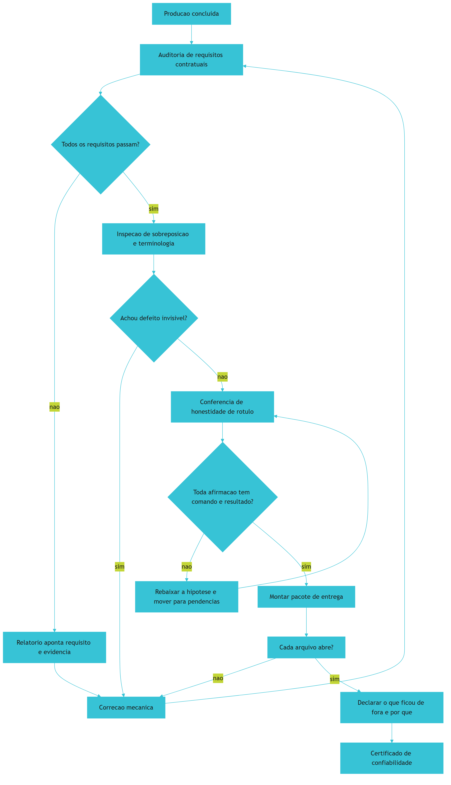

*Figura 12.1 — O circuito de encerramento: auditoria binária, inspeção de defeitos invisíveis, conferência de honestidade de rótulo e pacote que declara suas próprias omissões.*

## 4. Técnica

### 4.1 Auditor do pacote de entrega

O auditor abaixo monta o certificado verificando três coisas por arquivo: existência, capacidade de abertura e correspondência entre formato declarado e formato real.

```python
#!/usr/bin/env python3
# -*- coding: utf-8 -*-
"""Auditor do pacote de entrega: prova que cada item existe e abre."""

import json
import sys
import zipfile
from pathlib import Path
from typing import Dict, List

LEITORES = {
    ".md": lambda p: p.read_text(encoding="utf-8"),
    ".json": lambda p: json.loads(p.read_text(encoding="utf-8")),
    ".txt": lambda p: p.read_text(encoding="utf-8"),
    ".html": lambda p: p.read_text(encoding="utf-8"),
    ".csv": lambda p: p.read_text(encoding="utf-8"),
}


def abre(caminho: Path) -> Dict[str, str]:
    """Confirma que o arquivo existe e que o conteudo e legivel no formato."""
    if not caminho.exists():
        return {"item": caminho.name, "status": "ausente", "detalhe": "nao encontrado"}
    if caminho.stat().st_size == 0:
        return {"item": caminho.name, "status": "vazio", "detalhe": "zero bytes"}

    extensao = caminho.suffix.lower()
    if extensao == ".pdf":
        cabecalho = caminho.open("rb").read(5)
        ok = cabecalho == b"%PDF-"
        return {"item": caminho.name, "status": "ok" if ok else "corrompido",
                "detalhe": "cabecalho PDF valido" if ok else "cabecalho invalido"}
    if extensao in (".epub", ".zip"):
        try:
            with zipfile.ZipFile(caminho) as pacote:
                nomes = pacote.namelist()
            return {"item": caminho.name, "status": "ok" if nomes else "vazio",
                    "detalhe": f"{len(nomes)} entrada(s)"}
        except zipfile.BadZipFile:
            return {"item": caminho.name, "status": "corrompido", "detalhe": "zip invalido"}

    leitor = LEITORES.get(extensao)
    if leitor is None:
        return {"item": caminho.name, "status": "nao-verificavel",
                "detalhe": f"sem leitor para {extensao or 'sem extensao'}"}
    try:
        leitor(caminho)
    except (UnicodeDecodeError, ValueError) as erro:
        return {"item": caminho.name, "status": "corrompido", "detalhe": str(erro)[:60]}
    return {"item": caminho.name, "status": "ok", "detalhe": "conteudo legivel"}


def auditar(caixa: Path, itens: List[str]) -> List[Dict[str, str]]:
    return [abre(caixa / item) for item in itens]


def declarar_ausentes(resultados: List[Dict[str, str]], motivos: Dict[str, str]) -> List[str]:
    """Toda omissao precisa de motivo declarado — omissao silenciosa nao passa."""
    ausentes = [r["item"] for r in resultados if r["status"] in ("ausente", "vazio")]
    sem_motivo = [item for item in ausentes if item not in motivos]
    return sem_motivo


def main() -> int:
    caixa = Path(sys.argv[1]) if len(sys.argv) > 1 else Path("distribuicao")
    itens = [p.name for p in sorted(caixa.glob("*"))] if caixa.is_dir() else []
    if not itens:
        print(f"[FALHA] pacote vazio ou inexistente: {caixa}")
        return 1

    resultados = auditar(caixa, itens)
    motivos = {r["item"]: "declarado no LEIA-ME" for r in resultados
               if r["status"] in ("ausente", "vazio")}
    sem_motivo = declarar_ausentes(resultados, motivos)

    print("=" * 62)
    print(f"AUDITORIA DO PACOTE — {caixa}")
    print("=" * 62)
    problemas = 0
    for r in resultados:
        marca = "OK" if r["status"] == "ok" else r["status"].upper()
        print(f"[{marca:>13}] {r['item']} — {r['detalhe']}")
        if r["status"] not in ("ok", "nao-verificavel"):
            problemas += 1

    print("-" * 62)
    print(json.dumps({"itens": len(resultados), "problemas": problemas,
                      "omissoes_sem_motivo": sem_motivo}, ensure_ascii=False, indent=2))
    if problemas or sem_motivo:
        print("[REPROVADO] exit 1 — pacote nao esta pronto para entrega.")
        return 1
    print("[APROVADO] exit 0 — pacote integro e verificavel.")
    return 0


if __name__ == "__main__":
    sys.exit(main())
```

### 4.2 Manifesto de entrega com omissões declaradas

O manifesto é o artefato que distingue um pacote profissional de um diretório de arquivos. Ele declara o que entra, o que fica de fora e por qual motivo.

```json
{
  "obra": "O Tratado das 4 Camadas da Fabrica Agentica",
  "edicao": "v3.0 — Edicao Expandida e Definitiva",
  "gerado_em": "2026-09-12",
  "entregues": [
    { "item": "livro_final.pdf", "formato": "pdf", "verificacao": "cabecalho PDF valido" },
    { "item": "livro_final.md", "formato": "markdown", "verificacao": "abre em utf-8" },
    { "item": "playbook.pdf", "formato": "pdf", "verificacao": "cabecalho PDF valido" }
  ],
  "nao_entregues": [
    { "item": "campanhas/", "motivo": "nao solicitado pelo operador na fase 0" },
    { "item": "maquina/", "motivo": "nao solicitado pelo operador na fase 0" }
  ],
  "garantias_medidas": [
    { "afirmacao": "auditoria de requisitos contratuais", "comando": "auditar-obra --estrito", "resultado": "exit 0" },
    { "afirmacao": "sintaxe de todos os blocos de codigo", "comando": "validar-codigo", "resultado": "100% aprovados" }
  ]
}
```

### 4.3 Sessão de encerramento

O log abaixo mostra o circuito completo: reprovação, correção mecânica e aprovação com certificado.

```console
$ python auditar-obra.py --estrito
[FALHA] R4  Minimo 20 referencias ABNT por capitulo
        -> capitulos abaixo: 7
[REPROVADO] exit 1 — 1 requisito nao conforme.
Relatorio: revisao/relatorio_auditoria.json

$ python auditar-obra.py --estrito
[OK] R3 7 secoes EITA-V2 por capitulo
[OK] R4 Minimo 20 referencias ABNT por capitulo
[OK] R13 Sem truncamento nem pendencias
[OK] R14 Rastreabilidade [N] texto <-> referencias
[CONFORME] exit 0 — nenhum requisito pendente.

$ python auditar-pacote.py distribuicao
[           OK] livro_final.pdf — cabecalho PDF valido
[           OK] livro_final.md — conteudo legivel
[           OK] playbook.pdf — cabecalho PDF valido
[APROVADO] exit 0 — pacote integro e verificavel.
```

### 4.4 Tabela de decisão do encerramento

| Situação encontrada | Ação | Bloqueia entrega? |
|---|---|---|
| Requisito contratual falhou | Corrigir a causa e reauditar | Sim |
| Afirmação sem comando de medição | Rebaixar a hipótese e mover para pendências | Sim |
| Arquivo declarado não abre | Corrigir o artefato ou declarar a omissão | Sim |
| Item fora do pacote por decisão do operador | Registrar no manifesto com motivo | Não |
| Terminologia inconsistente entre capítulos | Unificar e reauditar | Sim |
| Cobertura de teste abaixo do declarado | Reajustar o rótulo ao número real | Sim |
| Melhoria identificada fora do escopo | Registrar como evolução, não executar agora | Não |

### 4.5 Gerador do certificado de confiabilidade

O certificado é o artefato final da fábrica, e sua virtude é a mesma de um exame laboratorial: ele **não emite opinião**. Cada linha é o resultado de uma verificação executada, com o comando que a produziu registrado ao lado.

O ponto delicado está no tratamento das ausências. Um certificado honesto precisa distinguir três situações que costumam ser confundidas: o item que foi verificado e aprovado, o item que foi verificado e reprovado, e o item que **não pôde ser verificado**. A terceira categoria é a que quase sempre desaparece dos relatórios — e é justamente a que um auditor precisa ver.

```python
#!/usr/bin/env python3
# -*- coding: utf-8 -*-
"""Gerador do certificado de confiabilidade a partir de verificacoes executadas."""

import json
import sys
from dataclasses import dataclass, asdict
from pathlib import Path
from typing import List, Optional

APROVADO = "aprovado"
REPROVADO = "reprovado"
NAO_VERIFICADO = "nao-verificavel"


@dataclass(frozen=True)
class Verificacao:
    afirmacao: str
    comando: str
    exit_code: Optional[int]

    def status(self) -> str:
        if self.exit_code is None:
            return NAO_VERIFICADO
        return APROVADO if self.exit_code == 0 else REPROVADO

    def linha(self) -> str:
        marca = self.status().upper()
        codigo = "-" if self.exit_code is None else str(self.exit_code)
        return f"[{marca:>15}] {self.afirmacao} (comando: {self.comando}, exit {codigo})"


def semaforo(verificacoes: List[Verificacao]) -> str:
    """Veredito binario: uma reprovacao bloqueia; nao verificavel vira ressalva."""
    if any(v.status() == REPROVADO for v in verificacoes):
        return "NAO CONFORME"
    if any(v.status() == NAO_VERIFICADO for v in verificacoes):
        return "CONFORME COM RESSALVA"
    return "CONFORME"


def validar_certificado(verificacoes: List[Verificacao]) -> List[str]:
    problemas: List[str] = []
    if not verificacoes:
        problemas.append("certificado vazio: nenhuma verificacao executada")
    for v in verificacoes:
        if not v.comando.strip():
            problemas.append(f"afirmacao sem comando de medicao: {v.afirmacao!r}")
        if len(v.afirmacao.split()) < 4:
            problemas.append(f"afirmacao vaga demais para auditoria: {v.afirmacao!r}")
    return problemas


def main() -> int:
    verificacoes = [
        Verificacao("todas as secoes obrigatorias presentes", "auditar-obra --estrito", 0),
        Verificacao("minimo de referencias por capitulo atingido", "auditar-obra --estrito", 0),
        Verificacao("sintaxe de todos os blocos de codigo", "validar-codigo", 0),
        Verificacao("cada arquivo do pacote abre no formato declarado", "auditar-pacote", 0),
        Verificacao("cobertura de teste do nucleo", "coverage report", None),
    ]
    problemas = validar_certificado(verificacoes)
    print("=" * 70)
    print("CERTIFICADO DE CONFIABILIDADE")
    print("=" * 70)
    for v in verificacoes:
        print(v.linha())
    print("-" * 70)
    print(f"VEREDITO: {semaforo(verificacoes)}")
    for problema in problemas:
        print(f"[ATENCAO] {problema}")
    destino = Path("validacao")
    destino.mkdir(parents=True, exist_ok=True)
    (destino / "certificado.json").write_text(
        json.dumps({"veredito": semaforo(verificacoes),
                    "verificacoes": [asdict(v) for v in verificacoes]},
                   ensure_ascii=False, indent=2), encoding="utf-8")
    if semaforo(verificacoes) == "NAO CONFORME":
        print("[REPROVADO] exit 1 — existe verificacao reprovada; entrega nao autorizada.")
        return 1
    print("[OK] exit 0 — certificado emitido e arquivado em validacao/certificado.json")
    return 0


if __name__ == "__main__":
    sys.exit(main())
```

Observe a linha da cobertura de teste no exemplo: ela aparece como não verificável porque nenhum comando foi executado. O veredito final não é "conforme" — é **conforme com ressalva**, e a ressalva fica visível no certificado em vez de desaparecer. É essa distinção que transforma um relatório de entrega em documento auditável, e é essa mesma distinção que a nona lei da constituição exige de qualquer afirmação técnica.

### 4.6 Roteiro de encerramento em cinco passos

1. **Audite** contra os requisitos contratuais e trate qualquer vermelho como bloqueio, nunca como ressalva.
2. **Inspecione** o que a leitura não vê: sobreposição, terminologia e truncamento.
3. **Confira** cada afirmação do relatório contra o comando que a produziu; sem comando, vira hipótese.
4. **Monte** o pacote e teste se cada arquivo abre no formato declarado.
5. **Declare** o que ficou de fora, com motivo, e emita o certificado com as garantias efetivamente medidas.

## 5. Aplica

### A cena que quase todo time vive

É véspera de entrega para um cliente institucional. Você tem o produto pronto, o relatório escrito e o pacote montado. O relatório afirma que "a solução foi validada em ambiente de produção com cobertura completa". O cliente pergunta como.

Reconstrua o que essa pergunta expõe. A palavra "validada" não tem comando associado: ninguém sabe se ela significa que os testes passaram, que alguém testou manualmente ou que o sistema está no ar. A expressão "cobertura completa" não tem número: é a categoria de afirmação que a nona lei da constituição existe para eliminar. E existe um terceiro problema, mais profundo: **a ausência de verificação de sobreposição e terminologia**, que só aparece quando você roda o auditor contra um requisito objetivo — e descobre que cerca de 7,2% dos patches aceitos em avaliação de referência não resolviam a tarefa proposta, o mesmo tipo de discrepância que a inspeção automática revela entre capítulos [3].

O diagnóstico tem quatro componentes independentes. Auditoria narrativa em vez de binária. Afirmação sem lastro de medição. Ausência de inspeção automática do que a leitura não vê. E pacote sem declaração de omissões, o que deixa o cliente sem saber o que existe e o que não existe.

A correção, na manhã seguinte, é mecânica e rápida. Primeiro, reescrever cada afirmação no formato "o que foi medido, com qual comando, com qual resultado" — e rebaixar a hipótese tudo o que não tiver comando [10]. Segundo, rodar a auditoria determinística e tratar cada vermelho como bloqueio, não como ressalva. Terceiro, inspecionar sobreposição e terminologia com verificação automática, corrigindo as duplicatas e unificando os nomes. Quarto, montar o manifesto declarando explicitamente o que ficou de fora e por quê. O relatório final fica **menos impressionante** e **infinitamente mais útil** — e é justamente esse o efeito da nona lei.

### Onde isso escala e onde quebra

Auditoria determinística escala, porque o custo de rodar a verificação é praticamente constante e o de corrigir é proporcional ao defeito encontrado. O ponto de ruptura é o número de requisitos: acima de algumas centenas, o relatório fica ilegível e o time deixa de olhar para ele. O contorno é hierarquizar — requisitos bloqueantes em primeiro nível, alertas de estilo em segundo, métricas informativas em terceiro.

A conferência de honestidade de rótulo tem uma fronteira temporal interessante. Ela é fácil de aplicar a números e difícil de aplicar a qualidades — "o sistema é resiliente" é uma afirmação que pode ser verdadeira sem ser mensurável de uma só forma. O contorno é traduzir sempre que possível: resiliência vira "sobreviveu a N falhas de nó em teste de X minutos", com o comando registrado. O que **não funciona** é aceitar a qualidade sem nenhuma forma de operacionalização, porque é assim que a afirmação inflada entra no relatório.

A terceira fronteira é o pacote. Ele escala mal com o volume de itens: a partir de certo ponto, ninguém abre arquivo por arquivo, e a verificação vira amostragem. O contorno é entregar por camadas, com um índice que permita ao destinatário escolher o que verificar — e um manifesto que diga exatamente quais itens são essenciais e quais são complementares.

E a condição de contorno mais importante deste capítulo: **o rigor da auditoria precisa ser proporcional à consequência do erro**. Um protótipo interno não precisa de manifesto com garantias medidas; um artefato entregue a cliente institucional ou usado em decisão de risco, sim. Aplicar rigor máximo em tudo produz burocracia que o time abandona; aplicar rigor mínimo no que importa produz a entrega que não se sustenta quando alguém pergunta "como você sabe?".

### Armadilhas comuns

- Aceitar veredito com ressalvas em requisito bloqueante. Ressalva em requisito é requisito não cumprido com nome diferente.
- Confiar em benchmark público como certificado. A evidência é clara: em conjuntos com casos não publicados, a resolução dos mesmos modelos recua para a casa dos 17% [3].
- Escrever a verdade sem medi-la. Toda afirmação de cobertura precisa do comando que a produziu; sem isso, ela é hipótese.
- Entregar pacote sem declarar omissões. O que fica de fora em silêncio é indistinguível de esquecimento.
- Não inspecionar o que a leitura não vê. Sobreposição, terminologia e truncamento são invisíveis a olho nu e triviais para o auditor [15].

## 6. Conclusão

Neste capítulo você fechou o circuito da fábrica. A auditoria determinística substitui opinião por evidência binária e detecta os três defeitos que a leitura nunca revela: sobreposição de conteúdo, inconsistência terminológica e truncamento. A honestidade de rótulo transforma cada afirmação do relatório em afirmação rastreável, com comando e resultado. E o pacote de entrega verificável declara o que contém, prova que cada item abre e explicita o que ficou de fora e por quê.

Você viu também por que a métrica pública não pode ser o certificado. Conjuntos de avaliação de agentes de código chegaram à saturação, com taxas de resolução acima de 93,9% em suíte de referência — e, em conjuntos com casos não publicados, os mesmos modelos recuam para a casa dos 17% [2] [3]. Se o ranking público já não discrimina, o único certificado com valor é o que você emite sobre o seu domínio, com as suas evidências.

Ao longo de doze capítulos, você percorreu a jornada completa. Viu a crise real — as quatro catástrofes que explicam por que projetos amadores de IA colapsam. Recebeu a lei — as dez regras inegociáveis, cada uma com o seu fiscal. Percorreu as quatro camadas: contexto e governança, harness e ciclo de vida, motor cognitivo, ferramentas e persistência. Montou a estrutura, blindou o legado, orquestrou múltiplos agentes com isolamento e encerrou com auditoria e entrega soberana.

A pergunta que permanece não é técnica. É sobre identidade. Quando alguém perguntar como você sabe que o sistema está correto, a resposta vai ser um comando, um resultado e um registro — ou vai ser uma opinião. A diferença entre essas duas respostas é exatamente a diferença entre operar uma sala de controle e torcer por um painel que ninguém instalou.

**Desafio final:** pegue o último artefato que você entregou e responda três perguntas sem consultar nada — cada item abre no formato declarado, cada afirmação tem o comando que a mediu, e cada omissão está declarada com motivo. Onde as três respostas forem sim, você tem uma entrega soberana. Onde houver um "provavelmente", você tem o seu próximo trabalho.

## 7. Referências Bibliográficas

[1] SWE-BENCH. *SWE-bench Leaderboards*. Disponível em: https://www.swebench.com/. Acesso em: 12 set. 2026.
[2] SWE-BENCH. *SWE-bench Verified Leaderboard*. Disponível em: https://www.swebench.com/verified.html. Acesso em: 12 set. 2026.
[3] SCALE LABS. *SWE-Bench Pro (Public Dataset) — Leaderboard*. Disponível em: https://labs.scale.com/leaderboard/swe_bench_pro_public. Acesso em: 12 set. 2026.
[4] VERACODE. *2025 GenAI Code Security Report: AI-Generated Code Security Risks*. Disponível em: https://www.veracode.com/blog/ai-generated-code-security-risks/. Acesso em: 12 set. 2026.
[5] CLOUD SECURITY ALLIANCE. *Vibe Coding's Security Debt: The AI-Generated CVE Surge*. Disponível em: https://labs.cloudsecurityalliance.org/research/csa-research-note-ai-generated-code-vulnerability-surge-2026/. Acesso em: 12 set. 2026.
[6] DORA / GOOGLE CLOUD. *State of AI-assisted Software Development 2025*. Disponível em: https://dora.dev/dora-report-2025/. Acesso em: 12 set. 2026.
[7] STACK OVERFLOW. *2025 Developer Survey — AI*. Disponível em: https://survey.stackoverflow.co/2025/ai. Acesso em: 12 set. 2026.
[8] NATIONAL INSTITUTE OF STANDARDS AND TECHNOLOGY. *Artificial Intelligence Risk Management Framework: Generative Artificial Intelligence Profile (NIST AI 600-1)*. Disponível em: https://nvlpubs.nist.gov/nistpubs/ai/NIST.AI.600-1.pdf. Acesso em: 12 set. 2026.
[9] NATIONAL SECURITY AGENCY. *Model Context Protocol (MCP) Security — CSI*. Disponível em: https://www.nsa.gov/Portals/75/documents/Cybersecurity/CSI_MCP_SECURITY.pdf. Acesso em: 12 set. 2026.
[10] HUMBLE, Jez; FARLEY, David. *Continuous Delivery: Reliable Software Releases through Build, Test, and Deployment Automation*. Addison-Wesley, 2010. Disponível em: https://continuousdelivery.com/. Acesso em: 12 set. 2026.
[11] NYGARD, Michael T. *Release It!: Design and Deploy Production-Ready Software*. 2. ed. Pragmatic Bookshelf, 2018. Disponível em: https://pragprog.com/titles/mnee2/release-it-second-edition/. Acesso em: 12 set. 2026.
[12] MORAMPUDI, Abhishek et al. *A survey of reward hacking in agentic large language model systems*. In: Discover Artificial Intelligence. 2026. Disponível em: https://link.springer.com/article/10.1007/s44163-026-01980-z. Acesso em: 12 set. 2026.
[13] METR. *Recent Frontier Models Are Reward Hacking*. Disponível em: https://metr.org/blog/2025-06-05-recent-reward-hacking/. Acesso em: 12 set. 2026.
[14] RAKSHIT, Yerram Sai. *Modernizing Software Testing: AI, Telemetry, and Agentic Quality Engineering*. In: International Journal of AI Engineering. 2026. Disponível em: https://doi.org/10.34218/ijaieg_01_01_002. Acesso em: 12 set. 2026.
[15] MEI, Lingrui et al. *A Survey of Context Engineering for Large Language Models*. In: arXiv. 2025. Disponível em: https://arxiv.org/abs/2507.13334. Acesso em: 12 set. 2026.
[16] GIT. *git-worktree Documentation*. Disponível em: https://git-scm.com/docs/git-worktree. Acesso em: 12 set. 2026.
[17] SQLITE. *Write-Ahead Logging*. Disponível em: https://www.sqlite.org/wal.html. Acesso em: 12 set. 2026.
[18] TRAXTECH. *20% of AI-Generated Code Dependencies Don't Exist, Creating Supply Chain Security Risks*. Disponível em: https://www.traxtech.com/blog/20-of-ai-generated-code-dependencies-dont-exist-creating-supply-chain-security-risks. Acesso em: 12 set. 2026.
[19] MARTIN, Robert C. *Clean Architecture: A Craftsman's Guide to Software Structure and Design*. Prentice Hall, 2017. Disponível em: https://www.pearson.com/. Acesso em: 12 set. 2026.
[20] SHANNON, Claude E. *A Mathematical Theory of Communication*. Bell System Technical Journal, 1948. Disponível em: https://doi.org/10.1002/j.1538-7305.1948.tb01338.x. Acesso em: 12 set. 2026.

# Conclusão Geral

Esta obra começou com uma frustração concreta e terminou com uma arquitetura. Vale reconstruir a distância percorrida, porque o caminho é o argumento.

Na Parte I, você viu o problema em suas três dimensões. Primeiro a histórica: a passagem do programador manual ao usuário amador de chat e, finalmente, ao Engenheiro Agêntico. Depois a linguística: o vocabulário mínimo sem o qual toda discussão sobre agentes degenera em generalidades — agente não é modelo, harness não é aplicativo, janela de contexto não é armazenamento, portão de qualidade não é teste informativo. E por fim a estrutural: as quatro catástrofes que explicam por que projetos amadores colapsam — amnésia de contexto, completude falsa, paralelismo cego e aprisionamento de ferramenta. Cada uma com sintoma reconhecível, custo mensurável e válvula de contenção correspondente.

Na Parte II, você atravessou as quatro camadas. A camada de contexto e governança, onde densidade, localidade e determinismo declarativo transformam a bancada de trabalho em instrumento de precisão. A camada de harness e ciclo de vida, onde isolamento, disjuntor, teto e portão binário tornam a falha reversível e o erro caro em descoberta barata. A camada de motor cognitivo, onde a lei do determinismo em primeiro lugar, o roteamento por capacidade e o contrato tipado de saída transformam decisão em formato verificável. E a camada de ferramentas, MCP e persistência, onde escopo mínimo, idempotência e registro auditável convertem intenção em mudança rastreável.

Na Parte III, você fechou o ciclo. Montou a estrutura canônica com provisionamento idempotente, blindou um legado em risco decrescente sem reescrever o que funcionava, orquestrou múltiplos agentes com funil deliberativo e ambientes isolados, e encerrou com auditoria determinística, pacote verificável e certificado que declara as próprias ressalvas.

Três convicções atravessam os doze capítulos e valem como síntese.

A primeira é que **a governança mora no repositório**. Constituição, contratos, guardiões e banco de estado residem em arquivos versionados, e cada ambiente de execução é um consumidor descartável deles. Governança que vive dentro de uma ferramenta tem prazo de validade — e o prazo é sempre mais curto do que o planejado.

A segunda é que **a honestidade é um requisito técnico, não uma virtude**. Toda afirmação de segurança, desempenho ou cobertura precisa vir acompanhada do comando que a produziu. Números de referência externos ilustram e orientam, mas não certificam: conjuntos públicos de avaliação de agentes de código atingiram saturação, e os mesmos modelos recuam para uma fração da pontuação quando enfrentam casos não publicados. O único certificado com valor é o que você emite sobre o seu domínio, com as suas evidências.

A terceira é que **a rigidez amplia a capacidade**. Um modelo com espaço de decisão enorme explora um espaço enorme de soluções plausíveis, e a maioria delas é incompatível com o restante do sistema. Restringir o espaço de decisão não limita a inteligência; limita o ruído sobre o qual a inteligência precisa operar. As dez leis não são uma cerca contra a IA — são o que permite que ela trabalhe em algo que se sustenta.

Resta a pergunta que nenhuma arquitetura responde sozinha. Quando alguém perguntar como você sabe que o sistema está correto, a resposta vai ser um comando, um resultado e um registro — ou vai ser uma opinião. A diferença entre essas duas respostas é exatamente a distância entre operar uma sala de controle e torcer por um painel que ninguém instalou.

Você já sabe em qual dos dois lados quer estar.