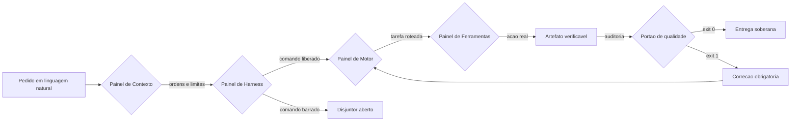

# Capítulo 1: O Contexto Real de Origem: Do Projeto Arsenal ao Ecossistema AIDD

## 1. Introdução

Se você já tentou construir um sistema de verdade conversando com uma IA, provavelmente conhece o roteiro: a primeira hora é mágica, a segunda é confusa e, ao final do dia, você tem três arquivos que "quase" funcionam, uma fatura de API que dói e nenhuma ideia clara de onde o projeto está. Este capítulo existe para te mostrar que esse roteiro não é culpa sua nem do modelo — é o resultado previsível de tentar governar um processo industrial com ferramentas de conversa. Ao final da leitura, você será capaz de nomear as quatro dores que destroem projetos de IA antes mesmo de o primeiro bug aparecer, e de reconhecer a diferença prática entre um usuário amador de chat e um Engenheiro Agêntico.

Este é o único capítulo em que olhamos para trás antes de olhar para frente. Vamos reconstruir a história real: como um conjunto de scripts defensivos — o Projeto Arsenal Open Source — evoluiu até se tornar o Ecossistema AIDD, a plataforma que sustenta toda a arquitetura de quatro camadas que você vai aprender no restante da obra.

## 2. Explica

### 2.1 A transição histórica: três papéis, três destinos

Existe uma linha do tempo na engenharia de software que muita gente ainda não percebeu que atravessou. Ela tem três estações, e cada uma delas produz um resultado radicalmente diferente para o mesmo pedido.

A primeira estação é a do **programador manual**. Ele conhece a linguagem, escreve sintaxe, depura, revisa e responde pelo resultado. O custo é alto em tempo humano, mas o controle é total. A segunda estação é a do **usuário amador de chat**: alguém que descobre que um modelo de linguagem consegue gerar código plausível e passa a pedir blocos de código, colar no editor e torcer. Essa fase parece produtiva por algumas semanas — e depois cobra o preço. É a fase que a literatura recente passou a chamar de *vibe coding*, e as próprias surveys de 2025 dedicam capítulos inteiros às suas armadilhas [5] [6].

A terceira estação é a do **Engenheiro Agêntico**. Ele não digita sintaxe; ele legisla. Define constituições, escreve contratos de dados, instrumenta verificações determinísticas e audita o que os agentes produziram. O modelo de linguagem deixa de ser um oráculo e passa a ser um operário — competente, incansável e absolutamente incapaz de julgar o próprio trabalho. Reconhecer essa assimetria é o primeiro ato de maturidade profissional, porque ela explica por que a adoção de IA nas equipes cresceu sem que a confiança na saída crescesse junto [1] [2].

### 2.2 As quatro dores que a fábrica precisa resolver

Quando um projeto de IA fracassa, o fracasso quase nunca é causado por falta de capacidade do modelo. Ele vem de quatro falhas estruturais que se combinam como um circuito de curto-circuito.

A primeira é a **amnésia de contexto**. A janela de atenção de um modelo não é um disco rígido; é uma mesa de trabalho pequena. Quando o histórico da conversa, logs redundantes e arquivos inteiros entram nessa mesa, a capacidade de resgatar instruções precisas cai de forma acentuada — o efeito conhecido como *lost in the middle* [13]. O agente passa a ignorar regras que você definiu dez minutos antes.

A segunda é a **ilusão funcional**. Sob pressão por volume, um agente sem governança escreve a casca das funções e preenche o interior com comentários de pendência e retornos fictícios. O código parece pronto, o teste manual passa, e a falha só aparece em produção — quando aparece caro [4].

A terceira é o **paralelismo cego**. Ao descobrir que pode disparar múltiplos agentes, o desenvolvedor instintivo dispara um enxame em segundo plano. Sem isolamento físico, dois agentes editam o mesmo arquivo em memórias separadas; sem checkpoint humano, um deles entra em repetição de erro e continua queimando orçamento [7].

A quarta é o **aprisionamento de ferramenta** (*vendor lock-in*). Quando a governança do projeto mora na convenção proprietária de um único aplicativo, trocar de aplicativo significa reescrever tudo. E, como as ferramentas de IA mudam de preço e de modelo a cada trimestre, esse acoplamento é o mais caro dos quatro [1].

### 2.3 Do Projeto Arsenal ao Ecossistema AIDD

O **Projeto Arsenal Open Source** nasceu como resposta defensiva às duas primeiras dores. Ele era, no início, uma coleção de scripts Python e regras de pré-commit cujo único propósito era impedir que código incompleto e segredos vazados entrassem no histórico do repositório. Funcionou — e escancarou o limite da abordagem.

Regras soltas protegem um arquivo; não protegem um processo. Faltava a estrutura que transformasse cada regra em um componente substituível, cada verificação em um portão binário e cada decisão em um registro auditável. E o mercado já tinha dado a dimensão do problema: em 2025, mais de 1,1 milhão de repositórios públicos declaravam dependência de kits de desenvolvimento com modelos de linguagem, um crescimento de 178% em doze meses, enquanto a confiança declarada na exatidão da saída da IA caía de 43% para 33% no mesmo período [3] [2]. Dessa lacuna nasceu o **Ecossistema AIDD** (*Artificial Intelligence-Driven Development*): uma plataforma de governança transversal a qualquer ambiente de execução de agentes, organizada em seis ferramentas especializadas coordenadas por um ponto de entrada único.

A **AIDD Forge** cuida do nascimento dos projetos: bootstrap, isolamento de micro-ambientes, fatiamento de fases e limpeza de contexto entre ciclos. A **AIDD Generator** é a fábrica autônoma, que percorre um pipeline de oito fases da ideia bruta em linguagem natural até a aplicação testada. A **AIDD Master** é a espinha dorsal dos sistemas modulares, aplicando arquitetura em camadas, fatias verticais desacopladas e persistência local. A **AIDD Enterprise** cobre missão crítica, com validação criptográfica de componentes e governança de confiança zero. A **AIDD Ops** atua como meta-orquestrador de infraestrutura, automatizando monitoramento, diagnóstico e provisionamento. E a **AIDD Bridge** extrai projetos criados em ambientes de baixo código, libertando bancos de dados e interfaces para servidores próprios.

Note o padrão: cada ferramenta resolve uma dobra específica do problema e nenhuma delas tenta resolver tudo. Essa disciplina de responsabilidade única é o que permite que o conjunto evolua sem quebrar — e é exatamente a mesma disciplina que você vai encontrar, capítulo a capítulo, nas quatro camadas.

### 2.4 A matriz de transposição universal

Existe um motivo pelo qual a governança agêntica precisa de arquivos e não de boas intenções. O conhecimento de um projeto tem de sobreviver à janela de contexto, à troca de modelo e à saída da pessoa que o escreveu. Para isso, o Ecossistema AIDD traduz o modelo de negócio em quatro pilares materializados em disco.

O primeiro é a **intenção estratégica**: especificações canônicas em Markdown, legíveis por humanos e por agentes, que declaram o que o sistema deve fazer e o que ele jamais deve fazer. O segundo são os **contratos de interface**: esquemas de dados e modelos tipados imutáveis que descrevem a forma exata de toda comunicação entre partes. O terceiro são os **guardiões de qualidade**: scripts de verificação com saída booleana, em que o código de saída zero significa aprovado e o código um significa bloqueio. O quarto são as **ações físicas**: ferramentas idempotentes que alteram o sistema de forma controlada e registram o que fizeram.

Sem esses quatro pilares, o projeto vive na cabeça de alguém. Com eles, o projeto vive no repositório — e sobrevive.

## 3. Ilustra

Imagine que você assume uma **sala de controle soberana**. Na sua frente há uma parede com quatro painéis: CONTEXTO, HARNESS, MOTOR e FERRAMENTAS. Cada painel tem uma função clara e nenhum deles tenta fazer o trabalho do outro. No painel CONTEXTO ficam as ordens permanentes da operação — o que pode e o que não pode. No painel HARNESS ficam os disjuntores: se um operário tentar um comando destrutivo, o circuito abre antes do dano. No painel MOTOR está o roteador que decide qual especialista resolve cada tarefa. No painel FERRAMENTAS estão as mãos da operação: os instrumentos que de fato tocam o mundo.

O erro clássico do usuário amador de chat é operar sem sala — pedir tudo a um único painel imaginário e rezar para que ele lembre das ordens. O Engenheiro Agêntico, ao contrário, sabe que a sala **é** o produto. Os agentes são turnos de operários que entram e saem; a sala permanece.



*Figura 1.1 — A sala de controle soberana: cada pedido atravessa contexto, disjuntor, roteador e ferramentas antes de virar entrega verificável.*

## 4. Técnica

### 4.1 Primeiro mandamento operacional: inventariar o ambiente

Antes de qualquer coisa, a sala de controle precisa saber com que instrumentos conta. Um agente que começa a trabalhar sem saber se o compilador, o formatador e o banco de estados existem vai descobrir isso no pior momento possível — no meio de uma entrega. A verificação de pré-voo é o primeiro artefato de um projeto AIDD, e ela roda antes de qualquer chamada de modelo.

```python
#!/usr/bin/env python3
# -*- coding: utf-8 -*-
"""Inventario do ambiente AIDD: verifica instrumentos antes de acionar agentes."""

import shutil
import sqlite3
import subprocess
import sys
from pathlib import Path

MIN_PYTHON = (3, 10)
ITENS_CANONICOS = ["AGENTS.md", "ecossistema.py", "gates"]


def checar_python() -> bool:
    ok = sys.version_info[:2] >= MIN_PYTHON
    marca = "OK" if ok else "FALHA"
    print(f"[{marca}] Python {sys.version.split()[0]} (minimo {MIN_PYTHON[0]}.{MIN_PYTHON[1]})")
    return ok


def checar_ferramenta(nome: str) -> bool:
    caminho = shutil.which(nome)
    if not caminho:
        print(f"[FALHA] ausente no PATH: {nome}")
        return False
    try:
        saida = subprocess.run([nome, "--version"], capture_output=True,
                               text=True, timeout=5)
        versao = (saida.stdout or nome).splitlines()[0].strip()[:40]
        print(f"[OK] {nome}: {versao}")
        return True
    except (OSError, subprocess.SubprocessError) as erro:
        print(f"[AVISO] {nome} presente em {caminho}, mas nao respondeu: {erro}")
        return True


def checar_banco_local() -> bool:
    try:
        conexao = sqlite3.connect(":memory:")
        modo = conexao.execute("PRAGMA journal_mode=WAL;").fetchone()[0]
        conexao.close()
        print(f"[OK] SQLite com journal {modo.upper()}")
        return True
    except sqlite3.Error as erro:
        print(f"[FALHA] motor SQLite indisponivel: {erro}")
        return False


def checar_governanca() -> bool:
    faltando = [item for item in ITENS_CANONICOS if not Path(item).exists()]
    if faltando:
        print(f"[AVISO] itens de governanca ausentes: {faltando}")
        return False
    print("[OK] governanca canonica presente na raiz")
    return True


def main() -> int:
    print("=" * 62)
    print("INVENTARIO DE AMBIENTE — SALA DE CONTROLE AIDD")
    print("=" * 62)
    resultados = [
        checar_python(),
        checar_ferramenta("git"),
        checar_ferramenta("pandoc"),
        checar_ferramenta("typst"),
        checar_banco_local(),
        checar_governanca(),
    ]
    print("-" * 62)
    if all(resultados):
        print("STATUS: APROVADO — sala de controle pronta para operar.")
        return 0
    print("STATUS: REPROVADO — corrija os itens acima antes de acionar agentes.")
    return 1


if __name__ == "__main__":
    sys.exit(main())
```

### 4.2 A matriz de transposição vira arquivo

O segundo artefato é a tradução da intenção para o formato que a esteira consome. Repare que a especificação declara explicitamente o que a obra **não** vai gerar — a escolha do operador fica registrada em disco, e nenhuma etapa posterior precisa adivinhar.

```json
{
  "tema": "O Tratado das 4 Camadas da Fabrica Agentica",
  "tipo_obra": "livro",
  "tamanho_obra": "G",
  "senioridade_obra": "iniciante",
  "min_referencias_por_capitulo": 20,
  "estilo_tecnica": "operacional",
  "gerar_playbook": true,
  "gerar_lead_magnets": false,
  "gerar_deck": false,
  "gerar_emails": false,
  "gerar_campanha": false,
  "gerar_maquina": false,
  "modo_producao": "obra-unica"
}
```

### 4.3 O contrato de interface da esteira

Os comandos de operação da plataforma seguem uma gramática fixa. Memorize a forma, porque ela se repete nos doze capítulos: `<prefixo>/<slug>` identifica a obra, e o prefixo de tipo indica onde ela vive dentro do repositório de saída.

```yaml
obra: livros/tratado-4-camadas-v2
fluxo:
  inventario: python scripts/parametros_obra.py livros/tratado-4-camadas-v2 --validar
  mineracao: python scripts/minerar-fontes-academicas.py "<tema>" --slug livros/tratado-4-camadas-v2
  indice: python scripts/indexar-dossie.py livros/tratado-4-camadas-v2 --indexar
  auditoria: python scripts/auditar-obra.py livros/tratado-4-camadas-v2 --estrito
  empacote: python scripts/empacotar-distribuicao.py livros/tratado-4-camadas-v2
```

### 4.4 Uma sessão de operação real

O trecho abaixo mostra o que acontece quando a verificação prévia encontra um ambiente incompleto. Note que a esteira **não** tenta adivinhar nem corrigir sozinha: ela para e devolve o diagnóstico explícito.

```console
$ python preflight_check.py
============================================================
INVENTARIO DE AMBIENTE — SALA DE CONTROLE AIDD
============================================================
[OK] Python 3.12.4 (minimo 3.10)
[OK] git: git version 2.45.2.windows.1
[FALHA] ausente no PATH: pandoc
[OK] typst: typst 0.11.1
[OK] SQLite com journal WAL
[OK] governanca canonica presente na raiz
------------------------------------------------------------
STATUS: REPROVADO — corrija os itens acima antes de acionar agentes.
$ winget install --id JohnMacFarlane.Pandoc --accept-package-agreements
$ python preflight_check.py
------------------------------------------------------------
STATUS: APROVADO — sala de controle pronta para operar.
```

### 4.5 Tabela de decisão do operador

A escolha de qual ferramenta da suíte acionar não é livre: ela é determinada pela natureza do trabalho. Compressão e extração são baratas e podem ser encadeadas; expansão custa geração e precisa de decisão consciente. Use a tabela abaixo como contrato.

| Situação observada | Ferramenta da suíte | Por quê |
|---|---|---|
| Projeto novo, sem estrutura de governança | AIDD Forge | Bootstrap e isolamento de contexto antes de qualquer código |
| Ideia em linguagem natural, sem especificação | AIDD Generator | Pipeline de oito fases cobre especificação, implementação e teste |
| Sistema modular de negócio, muitas entidades | AIDD Master | Fatias verticais desacopladas e persistência local previsível |
| Produto de missão crítica, auditoria exigida | AIDD Enterprise | Validação criptográfica de componentes e confiança zero |
| Infraestrutura que precisa se monitorar | AIDD Ops | Meta-orquestração de diagnóstico e provisionamento |
| Projeto preso em ambiente de baixo código | AIDD Bridge | Extração e transposição para servidor próprio |

### 4.6 Roteiro de implantação em cinco passos

1. **Inventarie** a estação com o script da seção anterior e trate cada `[FALHA]` antes de prosseguir, porque a esteira não é tolerante a instrumento ausente.
2. **Escreva** a especificação canônica na raiz do repositório, declarando as regras que os agentes não podem violar e os comandos que eles podem executar.
3. **Registre** a intenção da obra em arquivo de configuração, incluindo explicitamente o que **não** será gerado nesta rodada.
4. **Instrumente** os guardiões de qualidade como scripts com saída booleana, e instale-os no gancho de pré-commit do repositório.
5. **Audite** a esteira inteira antes de produzir: uma esteira que não sabe se auditar não está pronta para produzir.

## 5. Aplica

### A cena que quase todo time vive

Você recebe uma demanda razoável: "precisamos de um serviço interno de consulta a notas fiscais até sexta". Você abre o ambiente de agentes, descreve a demanda e recebe, em vinte minutos, uma estrutura de pastas, três classes e um endpoint que responde. Impressionado, você pede a continuação. No segundo dia, o agente começa a "esquecer" que o projeto usa um cliente HTTP com retentativa; no terceiro, ele cria uma segunda camada de acesso a dados com outra convenção de nomes. Na quinta à noite, você tem dois módulos que fazem a mesma coisa, nenhum teste automatizado e nenhuma ideia de qual dos dois está correto.

O diagnóstico é o clássico: você operou sem sala de controle. Não havia ordem permanente no painel CONTEXTO, então o agente preencheu a lacuna com a interpretação mais recente. Não havia contrato de interface no painel FERRAMENTAS, então cada iteração inventou a própria convenção. E não havia portão de qualidade, então nada nunca foi barrado — o erro se acumulou silenciosamente até virar arquitetura.

A correção não é "escrever prompts melhores". É inverter a ordem: primeiro a constituição, depois o contrato, depois os guardiões, e só então autorizar produção. Times que fazem essa inversão relatam o efeito que a pesquisa de 2025 descreve como **amplificação**: a IA acelera exatamente as capacidades que a organização já tem — inclusive a desorganização, se for isso que ela tem [1].

### Onde isso escala e onde quebra

A matriz de transposição escala bem em projetos de qualquer tamanho, porque o custo dela é proporcional ao número de regras, não ao número de linhas de código. Um serviço pequeno com dez regras claras é tão governável quanto um monólito com duzentas. O que **não** escala é a ausência de limites: quando a equipe ultrapassa algumas dezenas de regras sem hierarquia, a própria constituição vira ruído de contexto e o agente passa a ignorar as regras do meio do documento [13].

Aqui está o contorno prático: mantenha o núcleo normativo enxuto e mova o detalhe para os módulos que o utilizam. Se a sua raiz passa de algumas centenas de linhas de regras, você não tem governança — tem um documento que ninguém lê, nem você nem o modelo. Em ambientes com mais de um time, esse limite chega mais cedo, porque regras conflitantes de times diferentes competem pela mesma janela de contexto.

E existe uma condição de contorno ainda mais dura: **este capítulo não funciona para código descartável**. Se o artefato vai ser jogado fora em uma semana, montar constituição, contratos e guardiões custa mais do que o próprio artefato. Nesse caso, o caminho honesto é assumir o risco explicitamente — e não fingir que existe governança onde não há.

### Armadilhas comuns

- Tratar a verificação de ambiente como burocracia opcional. Ela é o que separa um erro barato de descoberta (antes de gerar código) de um erro caro (depois de compilar).
- Deixar a configuração de intenção em branco "para decidir depois". Decisão não registrada é decisão tomada por padrão, e o padrão raramente é o que você queria.
- Confundir volume de regras com qualidade de governança. A pesquisa sobre contexto é explícita: mais texto não significa mais aderência [12].
- Instalar os guardiões depois de já ter código em produção. Portão de qualidade retroativo é auditoria de dívida, não prevenção.

## 6. Conclusão

Neste capítulo você atravessou a linha do tempo que separa três papéis: o programador manual, o usuário amador de chat e o Engenheiro Agêntico. Viu que as quatro dores da engenharia agêntica — amnésia de contexto, ilusão funcional, paralelismo cego e aprisionamento de ferramenta — não são acidentes, e sim o resultado previsível de operar sem governança. E conheceu a origem concreta dessa resposta: o Projeto Arsenal Open Source, que evoluiu para o Ecossistema AIDD e suas seis ferramentas especializadas, sustentado pela matriz de transposição universal.

Como Engenheiro Agêntico, você já percebe que a pergunta "qual modelo usar?" é a menos importante das perguntas disponíveis. A pergunta que decide o resultado é: "onde mora a lei deste projeto?".

**Desafio:** pegue um projeto seu, real, e responda por escrito a três perguntas — quais são as cinco regras que os agentes não podem violar; quais são os três contratos de dados que não podem mudar sem aviso; e qual verificação determinística você roda antes de aceitar qualquer entrega. Se você não conseguir responder sem abrir o editor, você acabou de encontrar o seu primeiro trabalho de governança.

O Capítulo 2 faz o movimento oposto: em vez de construir, ele nomeia. Vamos montar o dicionário do iniciante — o vocabulário mínimo para que você leia o restante desta obra sem tropeçar em jargão.

## 7. Referências Bibliográficas

[1] DORA / GOOGLE CLOUD. *State of AI-assisted Software Development 2025*. Disponível em: https://dora.dev/dora-report-2025/. Acesso em: 12 set. 2026.
[2] STACK OVERFLOW. *2025 Developer Survey — AI*. Disponível em: https://survey.stackoverflow.co/2025/ai. Acesso em: 12 set. 2026.
[3] GITHUB. *Octoverse 2025: The state of open source*. Disponível em: https://octoverse.github.com/. Acesso em: 12 set. 2026.
[4] VERACODE. *2025 GenAI Code Security Report: AI-Generated Code Security Risks*. Disponível em: https://www.veracode.com/blog/ai-generated-code-security-risks/. Acesso em: 12 set. 2026.
[5] GE, Y. T. et al. *A Survey of Vibe Coding with Large Language Models*. In: arXiv. 2025. Disponível em: http://arxiv.org/abs/2510.12399. Acesso em: 12 set. 2026.
[6] RAY, Partha Pratim. *A Review on Vibe Coding: Fundamentals, State-of-the-art, Challenges and Future Directions*. 2025. Disponível em: https://doi.org/10.36227/techrxiv.174681482.27435614/v1. Acesso em: 12 set. 2026.
[7] ALI, Mohamad Abou; DORNAIKA, Fadi; CHARAFEDDINE, Jinan. *Agentic AI: a comprehensive survey of architectures, applications, and future directions*. In: Artificial Intelligence Review. 2025. Disponível em: https://doi.org/10.1007/s10462-025-11422-4. Acesso em: 12 set. 2026.
[8] ROBBES, Romain et al. *Agentic Much? Adoption of Coding Agents on GitHub*. In: ACM Transactions on Software Engineering and Methodology. 2026. Disponível em: https://doi.org/10.1145/3822180. Acesso em: 12 set. 2026.
[9] BELLAPUKONDA, Jahnavi. *A Comparative Evaluation of LLM-based Coding Agents for Automated Software Development Tasks*. 2026. Disponível em: https://doi.org/10.2139/ssrn.6755658. Acesso em: 12 set. 2026.
[10] SWE-BENCH. *SWE-bench Leaderboards*. Disponível em: https://www.swebench.com/. Acesso em: 12 set. 2026.
[11] SCALE LABS. *SWE-Bench Pro (Public Dataset) — Leaderboard*. Disponível em: https://labs.scale.com/leaderboard/swe_bench_pro_public. Acesso em: 12 set. 2026.
[12] MEI, Lingrui et al. *A Survey of Context Engineering for Large Language Models*. In: arXiv. 2025. Disponível em: https://arxiv.org/abs/2507.13334. Acesso em: 12 set. 2026.
[13] LIU, Nelson F. et al. *Lost in the Middle: How Language Models Use Long Contexts*. In: Transactions of the Association for Computational Linguistics. 2024. Disponível em: https://arxiv.org/abs/2307.03172. Acesso em: 12 set. 2026.
[14] SHANNON, Claude E. *A Mathematical Theory of Communication*. Bell System Technical Journal, 1948. Disponível em: https://doi.org/10.1002/j.1538-7305.1948.tb01338.x. Acesso em: 12 set. 2026.
[15] ANTHROPIC. *Model Context Protocol Specification (2025-06-18)*. Disponível em: https://modelcontextprotocol.io/specification/2025-06-18. Acesso em: 12 set. 2026.
[16] NATIONAL SECURITY AGENCY. *Model Context Protocol (MCP) Security — CSI*. Disponível em: https://www.nsa.gov/Portals/75/documents/Cybersecurity/CSI_MCP_SECURITY.pdf. Acesso em: 12 set. 2026.
[17] ANTHROPIC. *Prompt Caching — Claude Platform Docs*. Disponível em: https://platform.claude.com/docs/en/build-with-claude/prompt-caching. Acesso em: 12 set. 2026.
[18] GIT. *git-worktree Documentation*. Disponível em: https://git-scm.com/docs/git-worktree. Acesso em: 12 set. 2026.
[19] SQLITE. *Write-Ahead Logging*. Disponível em: https://www.sqlite.org/wal.html. Acesso em: 12 set. 2026.
[20] NATIONAL INSTITUTE OF STANDARDS AND TECHNOLOGY. *Artificial Intelligence Risk Management Framework: Generative Artificial Intelligence Profile (NIST AI 600-1)*. Disponível em: https://nvlpubs.nist.gov/nistpubs/ai/NIST.AI.600-1.pdf. Acesso em: 12 set. 2026.
