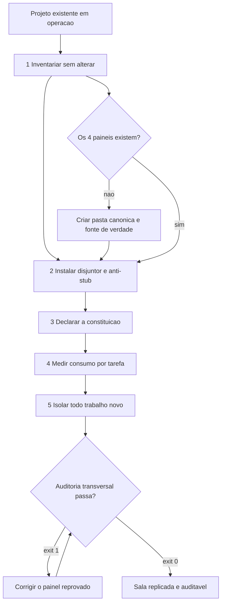

# Capítulo 10: Implementação e Réplica das 4 Camadas: O Manual de Montagem

## 1. Introdução

No Capítulo 9, você fechou o painel FERRAMENTAS e, com ele, a Parte II — você conhece as quatro camadas por dentro. A pergunta que resta é a mais pragmática de todas: **como materializar isso em um repositório, de forma repetível, sem depender de memória ou de heroísmo?**

A resposta deste capítulo é uma planta de montagem. Você vai aprender a estrutura canônica de diretórios, a separação entre fonte única de verdade e configuração de ambiente, o provisionamento idempotente e a estratégia de blindagem de projetos legados — que é o cenário em que a maioria das pessoas está. Ao final, você terá o roteiro completo para replicar a sala de controle em qualquer projeto.

## 2. Explica

### 2.1 A estrutura canônica e a razão de cada pasta

Toda estrutura de governança que funciona na prática tem a mesma forma, e a razão é sempre a mesma pergunta: quem pode editar isso, e quem apenas consome?

A raiz guarda a **constituição viva** — as leis e os comandos canônicos. Ela é curta, estável e lida em toda interação. Ao lado dela ficam os **pontos de entrada** de cada ambiente de execução: arquivos de uma linha que apenas apontam para a constituição, para que qualquer ferramenta leia o mesmo conjunto de regras. Isso é o que realiza a supremacia agnóstica na prática [3].

Existe então a pasta da **fonte única de verdade**. Ela contém as especificações, os componentes reutilizáveis, as definições de ferramentas e os ganchos de ciclo de vida. A regra é dura: ninguém edita configuração de ambiente à mão. Edita-se a fonte; sincroniza-se para os ambientes por script determinístico. Quando surge um ambiente novo, adiciona-se um adaptador de sincronização — o repositório permanece intocado.

A terceira pasta é a **memória estruturada**: protocolos, decisões arquiteturais e relatórios auditáveis. Ela existe porque decisão que não está em disco é decisão que será revista por acidente. E a quarta é a dos **guardiões**: os scripts de verificação binária, com o registro de dependências externas que torna cada dependência uma escolha explícita.

### 2.2 Provisionamento idempotente

Um script de montagem que rodar duas vezes produzir duplicata é um script que ninguém vai querer rodar. O requisito não é que ele funcione na primeira execução — é que ele seja seguro a partir da segunda.

A idempotência aqui tem três consequências práticas. A primeira é que a montagem se torna reexecutável depois de uma falha parcial, sem que o operador precise inspecionar o estado antes. A segunda é que a montagem pode virar parte do processo normal de atualização, e não um evento único e memorável. A terceira é que a diferença entre instalação limpa e reparo desaparece: o mesmo comando serve para os dois casos [2].

O detalhe que faz isso funcionar é a política de sobrescrita. Arquivos de governança que contêm decisões humanas — a constituição, as especificações — **nunca** são sobrescritos; se existem, são preservados. Arquivos gerados por sincronização **sempre** são reescritos, porque sua fonte é a pasta canônica e divergência local é bug, não personalização.

### 2.3 Blindagem de legado com risco decrescente

O cenário realista não é projeto novo — é projeto que já roda. E a tentação é reescrever, o que é quase sempre a decisão errada: você troca uma dívida conhecida por um risco desconhecido, e paga por isso com um cronograma inteiro.

A abordagem que funciona é incremental e de risco decrescente. Primeiro, **observar sem alterar**: montar o inventário de ambiente e rodar o verificador transversal das quatro camadas, apenas para saber onde você está. Segundo, **bloquear o pior**: instalar o disjuntor de comando e o portão anti-stub, que não exigem mudança de arquitetura e impedem dano imediato. Terceiro, **declarar o contexto**: escrever a constituição com as regras que já existem implicitamente no projeto. Quarto, **instrumentar a economia**: medir consumo por tarefa antes de otimizar qualquer coisa. Quinto, **isolar novas tarefas**: a partir daqui, todo trabalho novo nasce em diretório isolado.

Nenhuma dessas etapas exige reescrever código existente, e cada uma entrega valor isolado. É a diferença entre refatorar um sistema e **governá-lo** enquanto ele continua funcionando.

### 2.4 A auditoria transversal como critério de pronto

Uma montagem não está pronta quando os arquivos existem; está pronta quando a auditoria transversal passa. E o critério precisa ser binário, pela mesma razão que você viu nos capítulos anteriores: critério negociável é critério que será negociado.

A auditoria verifica presença de artefato e **capacidade operacional**. Não basta existir uma pasta de guardiões; é preciso que exista pelo menos um portão executável. Não basta haver política de contexto; é preciso que o motor de banco local responda com o modo de journal adequado. A diferença entre existir e operar é exatamente onde os projetos falham.

## 3. Ilustra

Montar a sua **sala de controle** é como instalar a instrumentação de uma planta industrial que já está operando. Você não desliga a fábrica para instalar os sensores.

O primeiro passo é o **levantamento**: você entra com prancheta e anota quais painéis existem, quais estão vazios e quais têm instrumentos que ninguém sabe operar. O segundo é **instalar os freios de emergência** — o disjuntor e o portão anti-stub — porque freio não exige que a máquina pare para ser instalado. O terceiro é **afixar o regulamento**: escrever, no quadro da sala, as regras que todo mundo já segue de cabeça mas ninguém nunca registrou. O quarto é **instalar o medidor**: sem saber quanto de energia cada setor consome, qualquer economia é palpite. E o quinto é **inaugurar a célula isolada**: a partir de agora, todo trabalho novo nasce em bancada própria.



*Figura 10.1 — A montagem em risco decrescente: cada etapa entrega valor isolado e nenhuma exige reescrever o que já funciona.*

## 4. Técnica

### 4.1 Provisionador idempotente da estrutura canônica

O script abaixo cria a estrutura completa e é seguro a partir da segunda execução — o requisito que separa um instalador de um gerador de lixo.

```python
#!/usr/bin/env python3
# -*- coding: utf-8 -*-
"""Provisionador idempotente da estrutura canonica das 4 camadas."""

import json
import sys
from pathlib import Path
from typing import List, Tuple

PASTAS = [
    "componentes/specs",
    "componentes/ferramentas",
    "componentes/ganchos",
    "docs/protocolos",
    "docs/decisoes",
    "gates",
    "schemas",
]

# (caminho, conteudo, politica) — 'preservar' nunca sobrescreve; 'gerar' sempre reescreve
ARQUIVOS: List[Tuple[str, str, str]] = [
    (
        "AGENTS.md",
        "# Governanca Canonica\n\n"
        "## Leis inegociaveis\n"
        "1. Determinismo primeiro: script antes de modelo.\n"
        "2. Qualidade binaria: exit 0 aprova, exit 1 bloqueia.\n"
        "3. Persistencia estruturada: decisao sempre em disco.\n"
        "4. Economia severa: prefixo estavel, saida densa, expurgo entre fases.\n"
        "5. Supremacia agnostica: nenhuma regra depende de ambiente.\n"
        "6. Desenvolvedor no controle: proibido agente headless invisivel.\n"
        "7. Zero stubs: proibido corpo vazio ou retorno ficticio.\n"
        "8. Anti-NIH: justificar antes de construir mecanismo generico.\n"
        "9. Honestidade de rotulo: nao alegar mais do que o teste provou.\n"
        "10. Comunicacao direta: sem preambulo nem repeticao.\n",
        "preservar",
    ),
    ("CLAUDE.md", "@AGENTS.md\nSiga as diretivas canonicas da raiz.\n", "gerar"),
    ("GEMINI.md", "# Governanca centralizada\nConsulte AGENTS.md na raiz.\n", "gerar"),
    (".cursorrules", "Consulte AGENTS.md na raiz.\n", "gerar"),
    (".windsurfrules", "Consulte AGENTS.md na raiz.\n", "gerar"),
]


def criar_pastas(raiz: Path) -> List[str]:
    criadas = []
    for pasta in PASTAS:
        alvo = raiz / pasta
        if not alvo.is_dir():
            alvo.mkdir(parents=True, exist_ok=True)
            criadas.append(pasta)
    return criadas


def gravar_arquivos(raiz: Path) -> Tuple[List[str], List[str]]:
    gravados, preservados = [], []
    for caminho, conteudo, politica in ARQUIVOS:
        alvo = raiz / caminho
        if alvo.exists() and politica == "preservar":
            preservados.append(caminho)
            continue
        alvo.parent.mkdir(parents=True, exist_ok=True)
        if alvo.exists() and alvo.read_text(encoding="utf-8") == conteudo:
            continue
        alvo.write_text(conteudo, encoding="utf-8")
        gravados.append(caminho)
    return gravados, preservados


def inventario(raiz: Path) -> dict:
    return {
        "pastas_ausentes": [p for p in PASTAS if not (raiz / p).is_dir()],
        "arquivos_ausentes": [c for c, _, _ in ARQUIVOS if not (raiz / c).exists()],
        "gates_ativos": len(list((raiz / "gates").glob("*.py"))),
    }


def main() -> int:
    raiz = Path(".").resolve()
    print("=" * 62)
    print("PROVISIONADOR IDEMPOTENTE — 4 CAMADAS")
    print("=" * 62)

    criadas = criar_pastas(raiz)
    print(f"[PASTAS] criadas nesta execucao: {len(criadas)}")
    for pasta in criadas:
        print(f"   + {pasta}")

    gravados, preservados = gravar_arquivos(raiz)
    print(f"[ARQUIVOS] gravados: {len(gravados)} | preservados: {len(preservados)}")

    estado = inventario(raiz)
    print("-" * 62)
    print(json.dumps(estado, ensure_ascii=False, indent=2))
    if estado["pastas_ausentes"] or estado["arquivos_ausentes"]:
        print("[FALHA] estrutura incompleta apos provisionamento")
        return 1
    print("[OK] exit 0 — estrutura canonica pronta e reexecutavel.")
    return 0


if __name__ == "__main__":
    sys.exit(main())
```

### 4.2 Plano de blindagem de legado

O arquivo abaixo declara a ordem das intervenções em um projeto existente. Ele existe para impedir o erro mais comum: começar pela camada mais visível em vez da mais urgente.

```yaml
blindagem_de_legado:
  principio: risco-decrescente
  etapas:
    - ordem: 1
      acao: inventariar
      altera_codigo: false
      entregavel: relatorio de ausencias por camada
    - ordem: 2
      acao: instalar disjuntor de comando
      altera_codigo: false
      entregavel: gates/disjuntor.py
    - ordem: 3
      acao: instalar portao anti-stub
      altera_codigo: false
      entregavel: gates/anti-stub-ast.py
    - ordem: 4
      acao: declarar constituicao
      altera_codigo: false
      entregavel: AGENTS.md
    - ordem: 5
      acao: medir consumo por tarefa
      altera_codigo: false
      entregavel: relatorio de consumo
    - ordem: 6
      acao: isolar trabalho novo em worktree
      altera_codigo: false
      entregavel: politica de execucao
  proibido: [reescrever-modulo-existente, migrar-banco, renomear-pacotes]
```

### 4.3 Sessão de montagem

O log abaixo demonstra as duas propriedades que definem uma montagem correta: reexecução sem efeito colateral e preservação do que é humano.

```console
$ python provisionar.py
==============================================================
PROVISIONADOR IDEMPOTENTE — 4 CAMADAS
==============================================================
[PASTAS] criadas nesta execucao: 7
   + componentes/specs
   + componentes/ferramentas
   + gates
   + schemas
[ARQUIVOS] gravados: 4 | preservados: 0
--------------------------------------------------------------
[OK] exit 0 — estrutura canonica pronta e reexecutavel.

$ python provisionar.py
[PASTAS] criadas nesta execucao: 0
[ARQUIVOS] gravados: 0 | preservados: 1
--------------------------------------------------------------
[OK] exit 0 — estrutura canonica pronta e reexecutavel.

$ python auditar-4-camadas.py
[CAMADA 1 CONTEXTO E GOVERNANCA] OK
[CAMADA 2 HARNESS E CICLO DE VIDA] INCONFORME
   -> nenhum portao deterministico em gates/
[CAMADA 3 MOTOR COGNITIVO] INCONFORME
   -> politica de orcamento de contexto ausente
[CAMADA 4 FERRAMENTAS E PERSISTENCIA] OK
[REPROVADO] exit 1 — inconformidade em: 2 HARNESS, 3 MOTOR
```

### 4.4 Tabela de decisão: onde colocar cada artefato

| Artefato | Local canônico | Política de sobrescrita | Quem edita |
|---|---|---|---|
| Constituição com as leis | Raiz | Preservar sempre | Humano, com justificativa |
| Pontos de entrada por ambiente | Raiz | Regenerar sempre | Script de sincronização |
| Especificação de um módulo | Pasta canônica de specs | Preservar sempre | Humano |
| Guardião de qualidade | Pasta de gates | Preservar sempre | Humano, com teste |
| Registro de dependências | Pasta de gates | Preservar sempre | Humano |
| Política de orçamento de contexto | Configuração | Preservar sempre | Humano |
| Relatório de auditoria | Pasta de validação | Regenerar sempre | Script |
| Registro de decisões | Pasta de decisões | Apenas acrescentar | Humano |

### 4.5 Auditoria de acoplamento entre camadas

A estrutura canônica entrega a separação de pastas, mas não garante a separação de **dependências** — e é aí que a maioria das montagens degenera. Um módulo da camada de ferramentas que importa diretamente o roteador do motor cria um acoplamento que não aparece em nenhuma auditoria de presença de arquivo e quebra a propriedade central da arquitetura: a de que cada camada pode ser substituída isoladamente.

O verificador abaixo checa as fronteiras declaradas no contrato entre camadas. Ele reprova quando uma camada de nível mais baixo importa algo de uma camada de nível mais alto, o que é o padrão de violação mais comum: a ferramenta que precisa saber "como decidir" começou a carregar a lógica de decisão junto.

```python
#!/usr/bin/env python3
# -*- coding: utf-8 -*-
"""Auditor de acoplamento: reprova import que viola a ordem das camadas."""

import ast
import sys
from pathlib import Path
from typing import Dict, List, Tuple

# Nivel 4 depende de 3, que depende de 2, que depende de 1 — e nunca o inverso.
CAMADAS: Dict[int, str] = {
    1: "contexto",
    2: "harness",
    3: "motor",
    4: "ferramentas",
}

# Diretorio -> nivel. Camadas de nivel baixo nao podem importar niveis acima.
DIRETORIOS: Dict[str, int] = {
    "contexto": 1,
    "harness": 2,
    "motor": 3,
    "ferramentas": 4,
}

IGNORAR = {".venv", "venv", "__pycache__", ".git", "tests"}


def nivel_do_arquivo(caminho: Path) -> int:
    for parte in caminho.parts:
        if parte in DIRETORIOS:
            return DIRETORIOS[parte]
    return 0


def modulos_importados(arquivo: Path) -> List[str]:
    try:
        arvore = ast.parse(arquivo.read_text(encoding="utf-8"))
    except SyntaxError:
        return []
    nomes: List[str] = []
    for no in ast.walk(arvore):
        if isinstance(no, ast.Import):
            nomes.extend(alias.name for alias in no.names)
        elif isinstance(no, ast.ImportFrom) and no.module:
            nomes.append(no.module)
    return nomes


def nivel_do_import(nome: str) -> int:
    raiz = nome.split(".")[0]
    return DIRETORIOS.get(raiz, 0)


def auditar(raiz: Path) -> List[Tuple[str, str]]:
    violacoes: List[Tuple[str, str]] = []
    for arquivo in raiz.rglob("*.py"):
        if IGNORAR.intersection(arquivo.parts):
            continue
        origem = nivel_do_arquivo(arquivo)
        if origem == 0:
            continue
        for nome in modulos_importados(arquivo):
            destino = nivel_do_import(nome)
            # Importar nivel MENOR que o proprio: violacao de direcao.
            if destino and destino < origem:
                violacoes.append(
                    (str(arquivo),
                     f"camada {origem} ({CAMADAS[origem]}) importa camada "
                     f"{destino} ({CAMADAS[destino]}) via {nome!r}"))
    return violacoes


def main() -> int:
    raiz = Path(sys.argv[1]) if len(sys.argv) > 1 else Path(".")
    violacoes = auditar(raiz)
    print("=" * 66)
    print("AUDITOR DE ACOPLAMENTO ENTRE CAMADAS")
    print("=" * 66)
    if not violacoes:
        print("[APROVADO] nenhum import viola a direcao entre camadas.")
        return 0
    for arquivo, detalhe in violacoes:
        print(f"[BLOQUEIO] {arquivo}")
        print(f"   -> {detalhe}")
    print("-" * 66)
    print(f"[REPROVADO] exit 1 — {len(violacoes)} violacao(oes) de fronteira.")
    return 1


if __name__ == "__main__":
    sys.exit(main())
```

Vale uma distincao que evita erros de julgamento na leitura do relatorio. Compartilhar **contrato** entre camadas nao e violacao — e o proposito da arquitetura. A camada de ferramentas pode importar o esquema de entrada que o motor produziu, porque esquema e dado, nao comportamento. O que caracteriza acoplamento indevido e importar a **logica** da camada vizinha: a funcao que decide, o roteador que escolhe, o disjuntor que autoriza. Esquema compartilhado e contrato; funcao compartilhada e vazamento.

### 4.6 Roteiro de replicação em cinco passos

1. **Inventarie** o repositório atual com o verificador transversal e registre as ausências por camada, sem alterar nada.
2. **Provisione** a estrutura canônica com script idempotente e confirme a reexecução sem efeito colateral.
3. **Instale** os guardiões mais urgentes — disjuntor de comando e portão anti-stub — antes de qualquer otimização.
4. **Declare** a constituição com as regras que já existem implicitamente, e sincronize os pontos de entrada de todos os ambientes.
5. **Audite** as quatro camadas com critério binário e trate cada reprovação como bloqueio de conclusão da montagem.

## 5. Aplica

### A cena que quase todo time vive

Você assume a missão de "colocar governança" em um sistema de cinco anos, com quarenta mil linhas, dois times e um cronograma apertado. A proposta que surge na reunião é reescrever o núcleo com as novas práticas. O prazo estimado é de dois trimestres.

Antes de aprovar, você faz o inventário — a etapa que não altera código. O resultado é revelador. Na camada 1, não existe constituição, mas existem regras que todos seguem de cabeça e ninguém registrou. Na camada 2, não há disjuntor nem portão, e o repositório tem três commits diretos na branch principal no último mês. Na camada 3, não há política de contexto e a conta de API mais que dobrou sem aumento de entrega. Na camada 4, não há banco de estado, e ninguém consegue dizer quando cada incidente começou.

O diagnóstico muda a decisão. Você não precisa reescrever quarenta mil linhas para obter governança: precisa instalar freios, declarar o que já é prática, medir o que ninguém mede e isolar o que vem depois. O cronograma passa de dois trimestres para poucas semanas, e o risco cai drasticamente — porque você está governando um sistema em operação, não apostando em um novo.

A evidência que sustenta essa escolha não é entusiasmo: é risco. Relatórios de segurança de código gerado por IA mostram que a taxa de aprovação permaneceu estagnada em torno de 56%, com uma parcela relevante das tarefas ainda entregando falhas conhecidas [17]. Em um repositório de cinco anos com quarenta mil linhas, você tem **mais** código para proteger do que em um projeto novo — e menos justificativa ainda para adiar a instalação dos guardiões.

### Onde isso escala e onde quebra

A estrutura canônica escala em times de qualquer tamanho, porque o custo de mantê-la é proporcional ao número de regras, não ao número de pessoas. O que **não** escala é a política de sobrescrita mal definida. Se arquivos gerados por script contêm personalização local, a próxima sincronização apaga trabalho — e isso acontecerá no pior momento possível.

A montagem idempotente tem uma fronteira operacional clara: ela não resolve conflito de conteúdo. Se dois times editam a constituição em paralelo, o provisionador não arbitra. O contorno é tratar a constituição como código: alteração por proposta revisada e histórico registrado, nunca edição simultânea direta.

A terceira fronteira é a blindagem incremental. Ela escala enquanto cada etapa entrega valor isolado — e é isso que permite convencer um time ocupado a adotá-la. Mas existe uma condição de contorno explícita: **não funciona quando o projeto precisa de mudança estrutural de qualquer forma**. Se o núcleo está sendo substituído por decisão de negócio, governá-lo é esforço perdido; a ordem correta é migrar primeiro e governar depois. Reconhecer esse caso é parte da disciplina, não exceção a ela.

E há um limite de escopo importante: este capítulo monta **estrutura**, não resolve dívida de dados ou de segurança. Se o problema é credencial vazada no histórico ou dado pessoal sem política de retenção, você precisa de um plano específico — e orientação regulatória sobre risco de IA generativa aponta exatamente para esses pontos como controles obrigatórios, não opcionais [20].

### Armadilhas comuns

- Reescrever em vez de governar. Reescrever troca dívida conhecida por risco desconhecido e consome o cronograma inteiro.
- Começar a montagem pela camada mais visível. A ordem correta é freio, declaração, medição e isolamento — risco decrescente.
- Sobrescrever arquivo que contém decisão humana. Política de sobrescrita mal definida destrói trabalho sem aviso.
- Considerar a montagem pronta porque os arquivos existem. O critério é a auditoria transversal com capacidade operacional, não a presença de pasta.
- Editar configuração de ambiente à mão. Divergência local vira bug silencioso na próxima sincronização [7].

## 6. Conclusão

Neste capítulo você recebeu o manual de montagem da sala de controle. A estrutura canônica separa o que é constituição do que é fonte de verdade, memória estruturada e guardião — e a política de sobrescrita distingue arquivo humano de arquivo gerado. O provisionamento idempotente torna a montagem reexecutável e transforma reparo em rotina. A blindagem de legado procede em risco decrescente, sem tocar em código existente. E a auditoria transversal, com critério binário, é o único critério honesto de conclusão.

Você viu também por que a decisão de governar supera a de reescrever no cenário mais comum. A evidência de segurança é o argumento final: com a taxa de aprovação de segurança do código gerado por IA estagnada em torno de 56% [17], um repositório maior não é um repositório mais seguro — é um repositório com mais superfície e o mesmo instrumento de verificação.

**Desafio:** rode a auditoria transversal no seu projeto principal e anote o veredito de cada uma das quatro camadas. Não corrija nada ainda. Apenas observe — porque a fotografia de hoje é a única linha de base honesta que você terá para provar, no mês que vem, que a montagem valeu a pena.

O Capítulo 11 abre a parte final da obra com o problema de escala: como orquestrar múltiplos agentes e ambientes de execução diferentes com isolamento físico real, pontos de verificação humanos e paralelismo que não colide.

## 7. Referências Bibliográficas

[1] VERACODE. *2025 GenAI Code Security Report: AI-Generated Code Security Risks*. Disponível em: https://www.veracode.com/blog/ai-generated-code-security-risks/. Acesso em: 12 set. 2026.
[2] HUMBLE, Jez; FARLEY, David. *Continuous Delivery: Reliable Software Releases through Build, Test, and Deployment Automation*. Addison-Wesley, 2010. Disponível em: https://continuousdelivery.com/. Acesso em: 12 set. 2026.
[3] MARTIN, Robert C. *Clean Architecture: A Craftsman's Guide to Software Structure and Design*. Prentice Hall, 2017. Disponível em: https://www.pearson.com/. Acesso em: 12 set. 2026.
[4] FOWLER, Martin. *Patterns of Enterprise Application Architecture*. Boston: Addison-Wesley, 2002. Disponível em: https://martinfowler.com/books/eaa.html. Acesso em: 12 set. 2026.
[5] DORA / GOOGLE CLOUD. *State of AI-assisted Software Development 2025*. Disponível em: https://dora.dev/dora-report-2025/. Acesso em: 12 set. 2026.
[6] ANTHROPIC. *Model Context Protocol Specification (2025-06-18)*. Disponível em: https://modelcontextprotocol.io/specification/2025-06-18. Acesso em: 12 set. 2026.
[7] ANTHROPIC. *Prompt Caching — Claude Platform Docs*. Disponível em: https://platform.claude.com/docs/en/build-with-claude/prompt-caching. Acesso em: 12 set. 2026.
[8] GIT. *git-worktree Documentation*. Disponível em: https://git-scm.com/docs/git-worktree. Acesso em: 12 set. 2026.
[9] SQLITE. *Write-Ahead Logging*. Disponível em: https://www.sqlite.org/wal.html. Acesso em: 12 set. 2026.
[10] NYGARD, Michael T. *Release It!: Design and Deploy Production-Ready Software*. 2. ed. Pragmatic Bookshelf, 2018. Disponível em: https://pragprog.com/titles/mnee2/release-it-second-edition/. Acesso em: 12 set. 2026.
[11] MEI, Lingrui et al. *A Survey of Context Engineering for Large Language Models*. In: arXiv. 2025. Disponível em: https://arxiv.org/abs/2507.13334. Acesso em: 12 set. 2026.
[12] NATIONAL SECURITY AGENCY. *Model Context Protocol (MCP) Security — CSI*. Disponível em: https://www.nsa.gov/Portals/75/documents/Cybersecurity/CSI_MCP_SECURITY.pdf. Acesso em: 12 set. 2026.
[13] GITHUB. *Octoverse 2025: The state of open source*. Disponível em: https://octoverse.github.com/. Acesso em: 12 set. 2026.
[14] STACK OVERFLOW. *2025 Developer Survey — AI*. Disponível em: https://survey.stackoverflow.co/2025/ai. Acesso em: 12 set. 2026.
[15] CHACON, Scott; STRAUB, Ben. *Pro Git: Everything you need to know about Git*. 2. ed. Apress, 2014. Disponível em: https://git-scm.com/book/en/v2. Acesso em: 12 set. 2026.
[16] ALI, Mohamad Abou; DORNAIKA, Fadi; CHARAFEDDINE, Jinan. *Agentic AI: a comprehensive survey of architectures, applications, and future directions*. In: Artificial Intelligence Review. 2025. Disponível em: https://doi.org/10.1007/s10462-025-11422-4. Acesso em: 12 set. 2026.
[17] CLOUD SECURITY ALLIANCE. *Vibe Coding's Security Debt: The AI-Generated CVE Surge*. Disponível em: https://labs.cloudsecurityalliance.org/research/csa-research-note-ai-generated-code-vulnerability-surge-2026/. Acesso em: 12 set. 2026.
[18] PEREIRA, Luciano. *Empirical Validation of Cognitive-Derived Coding Constraints and Tokenization Asymmetries in LLM-Assisted Software Engineering*. 2026. Disponível em: https://doi.org/10.2139/ssrn.6294900. Acesso em: 12 set. 2026.
[19] SHANNON, Claude E. *A Mathematical Theory of Communication*. Bell System Technical Journal, 1948. Disponível em: https://doi.org/10.1002/j.1538-7305.1948.tb01338.x. Acesso em: 12 set. 2026.
[20] NATIONAL INSTITUTE OF STANDARDS AND TECHNOLOGY. *Artificial Intelligence Risk Management Framework: Generative Artificial Intelligence Profile (NIST AI 600-1)*. Disponível em: https://nvlpubs.nist.gov/nistpubs/ai/NIST.AI.600-1.pdf. Acesso em: 12 set. 2026.
