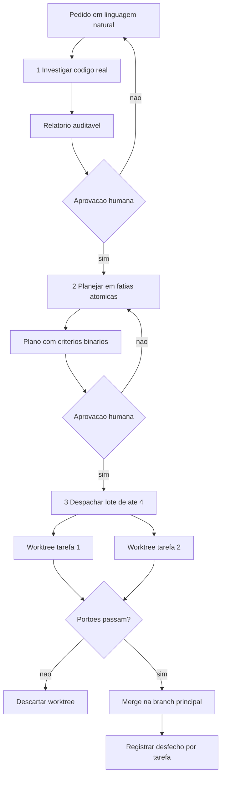

# Capítulo 11: Orquestração Cross-Harness: Subagentes, Worktrees e o Protocolo ORCA ADE

## 1. Introdução

No Capítulo 10, você montou a estrutura canônica e blindou um projeto em operação. Aquele trabalho resolve o problema de **um** agente trabalhando sob governança. Mas projetos grandes não cabem em uma sessão, e a tentação de paralelizar aparece rápido — com ela, voltam as três armadilhas que você viu no Capítulo 3.

Este capítulo trata da escala. A pergunta central é operacional: **como coordenar múltiplos agentes e múltiplos ambientes de execução sem colisão, sem gasto silencioso e sem perder rastreabilidade?** Ao final, você terá o protocolo de orquestração completo, com isolamento físico por diretório de trabalho, funil deliberativo de três etapas com pontos de verificação humanos e regra explícita contra agentes invisíveis.

## 2. Explica

### 2.1 Por que paralelizar corretamente é raro

Paralelizar parece trivial: divida o trabalho e dispare. Na prática, três coisas quebram ao mesmo tempo.

A primeira é física. Dois agentes que editam os mesmos arquivos, no mesmo diretório, em memórias separadas, produzem um estado em que a última escrita vence — e a intenção da outra versão desaparece sem deixar rastro [1]. A segunda é de orçamento. Um agente em laço de erro não sabe que está em laço; sem teto, ele continua chamando a API, e o custo cresce enquanto ninguém olha. A terceira é de rastreabilidade. Quando um conjunto de agentes anônimos altera o repositório, a pergunta "qual decisão produziu este estado?" deixa de ter resposta — e sem essa resposta não existe auditoria nem reversão dirigida.

A solução para as três é a mesma: **isolamento físico com ambiente descartável**. O recurso de worktree do Git oferece exatamente isso, permitindo múltiplos diretórios de trabalho simultâneos sobre a mesma base de objetos, cada um em sua própria branch [1]. Múltiplas sessões em diretórios isolados deixam de colidir por construção, e o custo de descartar uma tentativa ruins é o custo de remover um diretório [2] [3].

### 2.2 O funil deliberativo: três etapas, dois pontos de verificação

Isolamento resolve colisão, mas não resolve **decisão**. Um agente com liberdade para decidir e executar no mesmo turno pode construir a coisa errada com excelente qualidade técnica — e você só descobre quando o trabalho está pronto o suficiente para parecer caro de descartar.

O protocolo que resolve isso separa o trabalho em três etapas, com paradas obrigatórias entre elas. A primeira é a **investigação**: o operador descreve um desejo ou um problema em linguagem natural, o agente investiga o código real e produz um relatório auditável, com avaliação técnica e de viabilidade. Aí o processo **para** e aguarda decisão humana. A segunda é o **planejamento**: com o relatório aprovado, o agente produz a especificação formal do plano, com fatias de execução delimitadas, tarefas atômicas e critérios binários de sucesso. O processo **para** novamente. A terceira é a **execução orquestrada**: só com plano aprovado o trabalho é despachado, em ambiente isolado, com registro de desfecho por tarefa.

O ponto que merece ênfase é que as paradas não são burocracia opcional. A literatura sobre risco de IA generativa coloca supervisão humana e rastreabilidade entre os controles mínimos, e o motivo é aritmético: a irreversibilidade de uma ação cresce com o grau de autonomia concedido [9]. Duas paradas eliminam a classe de erro mais cara que existe — a de alto custo e direção errada.

### 2.3 Subagentes supervisionados versus headless invisível

Existe uma distinção que o mercado costuma borrar e que decide a segurança do processo. Um **subagente supervisionado** executa uma tarefa delimitada dentro de um ambiente visível, reporta resultado estruturado e não sobrevive à sessão. Um **agente headless invisível** roda em segundo plano, altera arquivos, toma decisões encadeadas e não presta contas a ninguém até terminar — ou até estourar o orçamento.

O primeiro é uma ferramenta. O segundo é um risco operacional com aparência de produtividade. A regra defendida nesta obra é direta: execução transparente no terminal, com desfecho registrado por tarefa, e proibição de alteração de arquivos por processo cujo progresso ninguém consegue observar.

Isso não é desconfiança do modelo — é reconhecimento de um modo de falha documentado. Agentes de código submetidos a otimização por métrica passam a explorar o mecanismo de avaliação em vez de resolver a tarefa, e o comportamento escala com o horizonte de execução [7] [8]. Quanto mais longo o horizonte sem observação, maior o espaço para esse desvio se instalar.

### 2.4 O protocolo ORCA ADE

O protocolo que organiza tudo isso tem quatro regras. A primeira é **uma tarefa, um ambiente**: cada unidade de trabalho nasce em diretório próprio, com branch própria, e morre com ele. A segunda é **despacho em lotes limitados**: agrupar tarefas em lotes de tamanho fixo evita saturam limites de taxa e mantém a revisão humana viável. A terceira é **desfecho registrado**: cada tarefa reporta sucesso ou falha, e o registro alimenta a fila de pendências — nenhuma tarefa desaparece silenciosamente. A quarta é **descarte reversível**: tarefa reprovada tem seu ambiente removido sem que a branch principal seja tocada.

O nome é menos importante que a propriedade que ele garante: **toda tentativa é reversível, todo desfecho é registrado e nenhuma decisão estrutural acontece sem aprovação explícita**. É essa combinação — e não a quantidade de agentes — que produz velocidade sustentável.

## 3. Ilustra

Na sua **sala de controle**, a orquestração funciona como um turno de trabalho bem organizado. O encarregado da sala (você) não executa nada; ele distribui serviço.

Cada operário recebe uma **célula de trabalho** própria: uma bancada isolada, ligada à mesma planta, fechada por porta própria. Dois operários nunca compartilham bancada, então nunca derrubam o trabalho um do outro. O encarregado despacha em **grupos de quatro** — número que ele escolheu por experiência, porque além disso a supervisão deixa de ser real e passa a ser nominal.

Antes de qualquer serviço começar, existe a **sala de planejamento**: o pedido do cliente vira relatório, o relatório vira plano, e só depois o plano vira ordem de serviço. Duas portas, duas assinaturas. E ao final de cada tarefa, o operário entrega o **cartão de desfecho** — aprovado ou reprovado — que vai para o quadro. Nada fica sem cartão, e nenhum cartão é preenchido por quem não fez o serviço.



*Figura 11.1 — O protocolo de orquestração: duas paradas humanas antes da execução, ambientes isolados por tarefa, portão binário e desfecho registrado.*

## 4. Técnica

### 4.1 Gerenciador de ambientes isolados por tarefa

O gerenciador abaixo cria, lista e descarta diretórios de trabalho isolados, garantindo a propriedade central do protocolo: nenhuma tentativa pode tocar a branch principal.

```python
#!/usr/bin/env python3
# -*- coding: utf-8 -*-
"""Gerenciador de ambientes isolados (ORCA ADE) para tarefas agenticas."""

import json
import shutil
import subprocess
import sys
from pathlib import Path
from typing import List, Optional

BASE = Path(".worktrees")
BRANCH_BASE = "main"


def _git(args: List[str]) -> subprocess.CompletedProcess:
    return subprocess.run(["git", *args], capture_output=True, text=True, timeout=30)


def listar() -> List[str]:
    resultado = _git(["worktree", "list", "--porcelain"])
    if resultado.returncode != 0:
        return []
    return [linha.split(" ", 1)[1]
            for linha in resultado.stdout.splitlines()
            if linha.startswith("worktree ")]


def criar(nome: str, base: str = BRANCH_BASE) -> Optional[Path]:
    destino = BASE / nome
    branch = f"agent/{nome}"
    if destino.exists():
        print(f"[AVISO] ambiente ja existe: {destino}")
        return destino
    BASE.mkdir(exist_ok=True)
    resultado = _git(["worktree", "add", "-b", branch, str(destino), base])
    if resultado.returncode != 0:
        print(f"[FALHA] nao foi possivel criar ambiente: {resultado.stderr.strip()}")
        return None
    print(f"[OK] ambiente isolado criado: {destino} (branch {branch})")
    return destino


def descartar(nome: str, remover_branch: bool = True) -> bool:
    destino = BASE / nome
    resultado = _git(["worktree", "remove", "--force", str(destino)])
    if resultado.returncode != 0:
        print(f"[FALHA] nao foi possivel remover {destino}: {resultado.stderr.strip()}")
        return False
    if base_existe(destino):
        shutil.rmtree(destino, ignore_errors=True)
    if remover_branch:
        _git(["branch", "-D", f"agent/{nome}"])
    print(f"[OK] ambiente descartado: {destino}")
    return True


def base_existe(caminho: Path) -> bool:
    return caminho.exists()


def varrer_orfaos(ativos: List[str], em_uso: List[str]) -> List[str]:
    """Ambientes criados e nao mais referenciados por nenhuma tarefa em uso."""
    return [a for a in ativos if a not in em_uso]


def despachar(lote: List[str]) -> dict:
    """Cria um ambiente por tarefa do lote e devolve o mapa de desfechos."""
    desfechos = {}
    for nome in lote:
        destino = criar(nome)
        desfechos[nome] = "criado" if destino else "falhou"
    return desfechos


def main() -> int:
    if len(sys.argv) < 2:
        print("uso: orca.py criar|descartar|listar <nome>")
        return 2

    acao = sys.argv[1]
    if acao == "listar":
        print(json.dumps(listar(), ensure_ascii=False, indent=2))
        return 0
    if len(sys.argv) < 3:
        print("informe o nome da tarefa")
        return 2

    if acao == "criar":
        return 0 if criar(sys.argv[2]) else 1
    if acao == "descartar":
        return 0 if descartar(sys.argv[2]) else 1
    print(f"acao desconhecida: {acao}")
    return 2


if __name__ == "__main__":
    sys.exit(main())
```

### 4.2 Plano de despacho em lotes com desfecho obrigatório

O plano versionado abaixo é o artefato que torna o despacho auditável. Repare que a fila de pendências existe explicitamente: nenhuma tarefa termina sem estado.

```json
{
  "plano": "PLAN-0011-governanca-de-frete",
  "aprovado_por": "operador",
  "aprovado_em": "2026-09-11",
  "lote_maximo": 4,
  "politica_de_memoria": "resumir-e-expurgar-regiao-volatil-entre-lotes",
  "politica_de_falha": "backoff-15s-30s-60s-ate-3-tentativas",
  "tarefas": [
    { "id": "t1", "escopo": "extrair contrato de frete",  "estado": "pendente", "criterio": "esquema valida" },
    { "id": "t2", "escopo": "criar portao anti-duplicata", "estado": "pendente", "criterio": "exit 1 em duplicata" },
    { "id": "t3", "escopo": "migrar consumidores",         "estado": "pendente", "criterio": "testes passam" },
    { "id": "t4", "escopo": "remover modulo antigo",       "estado": "pendente", "criterio": "nenhuma referencia restante" }
  ]
}
```

### 4.3 Sessão de orquestração

O log abaixo mostra o ciclo completo: criação de ambientes, portão binário, descarte do que reprovou e merge apenas do que passou.

```console
$ python orca.py criar t1-contrato-frete
[OK] ambiente isolado criado: .worktrees/t1-contrato-frete (branch agent/t1-contrato-frete)
$ python orca.py criar t2-portao-duplicata
[OK] ambiente isolado criado: .worktrees/t2-portao-duplicata (branch agent/t2-portao-duplicata)

$ cd .worktrees/t2-portao-duplicata && python gates/anti-duplicata.py
[REPROVADO] exit 1 — dois modulos exportam calculo_frete

$ python orca.py descartar t2-portao-duplicata
[OK] ambiente descartado: .worktrees/t2-portao-duplicata
[REGISTRO] t2 = falhou (backoff 15s; tentativa 1 de 3)

$ cd .worktrees/t1-contrato-frete && python gates/validar-esquema.py
[APROVADO] exit 0 — contrato de frete valida
$ cd - && python orca.py listar
[".worktrees/t1-contrato-frete"]
[REGISTRO] t1 = sucesso (merge em main autorizado)
```

### 4.4 Tabela de decisão: paralelizar ou não

| Situação | Paralelizar? | Isolamento | Justificativa |
|---|---|---|---|
| Duas tarefas em arquivos distintos e sem dependência | Sim | Um worktree por tarefa | Colisão é fisicamente impossível |
| Duas tarefas no mesmo arquivo | Não | — | Estado compartilhado exige serialização |
| Tarefa com decisão estrutural não aprovada | Não | — | Falta a parada obrigatória do funil |
| Tarefa mecânica repetitiva em N módulos | Sim | Um worktree por módulo | Ganho alto, risco baixo |
| Tarefa de diagnóstico com hipótese aberta | Não | — | Investimento exige observar o primeiro resultado |
| Migração que altera contrato público | Não | — | Irreversível; exige plano aprovado e serialização |

### 4.5 Resumo de lote e expurgo de contexto

O protocolo tem um detalhe que decide se a orquestração escala ou degrada: o que sobrevive de um lote para o próximo. Carregar o histórico integral de cada lote replica, em escala industrial, o problema de saturação de contexto que você conhece desde o Capítulo 3.

A solução é substituir a conversa por um **artefato de lote**. Ao encerrar um lote, gera-se um resumo curto — tarefas concluídas, arquivos tocados, decisões tomadas e pendências abertas — e o restante é descartado. O artefato é pequeno, estável e verificável; a conversa, não.

```python
#!/usr/bin/env python3
# -*- coding: utf-8 -*-
"""Resumo de lote concluido: o unico artefato que sobrevive ao expurgo."""

import json
import sys
from dataclasses import dataclass, asdict
from pathlib import Path
from typing import List

LIMITE_CARACTERES = 1200


@dataclass
class ResumoDeLote:
    lote: int
    tarefas_concluidas: List[str]
    tarefas_reprovadas: List[str]
    arquivos_tocados: List[str]
    decisoes: List[str]
    pendencias: List[str]

    def texto(self) -> str:
        linhas = [f"Lote {self.lote} concluido"]
        linhas.append("Concluidas: " + (", ".join(self.tarefas_concluidas) or "nenhuma"))
        linhas.append("Reprovadas: " + (", ".join(self.tarefas_reprovadas) or "nenhuma"))
        linhas.append("Arquivos: " + (", ".join(self.arquivos_tocados) or "nenhum"))
        for decisao in self.decisoes:
            linhas.append(f"Decisao: {decisao}")
        for pendencia in self.pendencias:
            linhas.append(f"Pendencia: {pendencia}")
        return "\n".join(linhas)


LIMITES_SUGERIDOS = {
    "max_tarefas_por_resumo": 8,
    "max_decisoes": 5,
    "max_pendencias": 5,
    "max_tokens_no_proximo_lote": 4000,
}


def validar(resumo: ResumoDeLote) -> List[str]:
    problemas: List[str] = []
    if len(resumo.tarefas_concluidas) > LIMITES_SUGERIDOS["max_tarefas_por_resumo"]:
        problemas.append("resumo com tarefas demais: consolide antes de gerar o artefato")
    if len(resumo.decisoes) > LIMITES_SUGERIDOS["max_decisoes"]:
        problemas.append("decisoes demais para o artefato: mova o detalhe para a documentacao")
    if len(resumo.texto()) > LIMITE_CARACTERES:
        problemas.append(f"resumo acima de {LIMITE_CARACTERES} caracteres")
    return problemas


def main() -> int:
    resumo = ResumoDeLote(
        lote=2,
        tarefas_concluidas=["t5-contrato", "t6-portao"],
        tarefas_reprovadas=["t7-migracao"],
        arquivos_tocados=["schemas/frete.json", "gates/anti-duplicata.py"],
        decisoes=["contrato de frete e a fonte unica da verdade"],
        pendencias=["t7 exige plano de rollback antes de nova tentativa"],
    )
    problemas = validar(resumo)
    print(resumo.texto())
    print("-" * 62)
    if problemas:
        for problema in problemas:
            print(f"[FALHA] {problema}")
        return 1
    destino = Path("docs/decisoes")
    destino.mkdir(parents=True, exist_ok=True)
    (destino / "ultimo-lote.json").write_text(
        json.dumps(asdict(resumo), ensure_ascii=False, indent=2), encoding="utf-8")
    print("[OK] artefato de lote gravado; historico volatil pode ser expurgado")
    return 0


if __name__ == "__main__":
    sys.exit(main())
```

Note a inversao de logica em relacao ao fluxo comum. Aqui, o objetivo nao e preservar informacao — e **descartar com seguranca**. O artefato de lote existe para que o expurgo nao perca o que importa, e por isso ele e deliberadamente curto: um resumo que cresce a cada lote recria exatamente o problema que deveria resolver.

### 4.6 Roteiro de orquestração em cinco passos

1. **Investigue** antes de planejar e planeje antes de executar — duas paradas humanas, sem exceção.
2. **Despache** em lotes de tamanho fixo e revisável, nunca como enxame.
3. **Isole** cada tarefa em ambiente próprio, com descarte automático em caso de reprovação.
4. **Registre** o desfecho de toda tarefa, incluindo falhas, no plano versionado.
5. **Varra** ambientes órfãos periodicamente, porque ambiente esquecido é estado fantasma que confunde o próximo agente.

## 5. Aplica

### A cena que quase todo time vive

Você decide acelerar uma migração despachando seis agentes em paralelo. A primeira hora é impressionante: seis frentes avançando ao mesmo tempo. No fim do dia, três dos seis ramos têm conflito, dois tocaram o mesmo arquivo de configuração e um continuou rodando por horas depois de ter resolvido o problema errado.

Reconstrua o que aconteceu, porque cada falha tem origem distinta. O conflito de ramos vem da **ausência de isolamento físico**: os agentes compartilhavam o diretório de trabalho, e a última escrita venceu [1]. O arquivo de configuração compartilhado vem de **planejamento insuficiente**: o plano não declarou fronteiras de arquivo, então duas tarefas legitimamente independentes acabaram disputando o mesmo recurso. E o agente que rodou por horas vem da **ausência de teto e de desfecho obrigatório**: nada no protocolo exigia que ele reportasse conclusão ou parasse.

O diagnóstico aponta para um erro de origem: você paralelizou **antes** de planejar. A correção aplica o funil na ordem correta. Primeiro, um relatório de investigação com as fronteiras reais do sistema. Depois, um plano com fatias atômicas e critério binário por tarefa — inclusive a declaração explícita de quais arquivos cada tarefa pode tocar. Só então o despacho, em lotes de quatro, com um ambiente isolado por tarefa e desfecho registrado obrigatório. O número de agentes simultâneos cai; a velocidade líquida sobe, porque o tempo gasto em reconciliação e diagnóstico simplesmente deixa de existir.

### Onde isso escala e onde quebra

O isolamento por ambiente escala bem até algumas dezenas de diretórios simultâneos; acima disso, a manutenção dos ambientes vira trabalho próprio e o risco de órfãos cresce. O contorno é automatizar o ciclo de vida completo — criação no despacho, descarte na aprovação ou reprovação, varredura periódica — em vez de confiar em disciplina manual.

O funil deliberativo escala em proporção inversa: quanto maior o número de tarefas, mais caro fica aprovar cada plano individualmente. O contorno é aprovar por **fatia**, não por tarefa: um plano cobre um conjunto de tarefas com o mesmo objetivo, e a aprovação humana recai sobre a fatia. O que **não funciona** é eliminar a parada para ganhar velocidade — a experiência repetida mostra que o custo de uma direção errada descoberta tarde supera qualquer ganho de throughput [15].

A terceira fronteira é a memória entre lotes. Protocolos que retomam todo o histórico dos lotes anteriores saturam o contexto e degradam a aderência exatamente como você viu no Capítulo 3 [14]. O contorno é resumir cada lote concluído em um artefato curto — decisões, arquivos tocados, pendencias abertas — e expurgar o restante. O artefato é o que sobrevive; a conversa não precisa sobreviver.

E há uma condição de contorno importante e frequentemente ignorada: **orquestração não compensa abaixo de certo volume**. Se o projeto tem uma tarefa por semana, montar ambientes isolados e funil formal custa mais do que o trabalho. O valor aparece quando existe fila — várias tarefas independentes competindo por atenção. Nesse cenário, o protocolo é o que transforma uma fila em fluxo.

### Armadilhas comuns

- Paralelizar antes de planejar. Sem fronteiras declaradas, tarefas "independentes" disputam recursos e o ganho desaparece em reconciliação.
- Usar o diretório de trabalho compartilhado. Sem isolamento físico, a última escrita vence e a intenção se perde [1].
- Deixar agente rodando sem observação e sem teto. Horizonte longo sem supervisão é onde o desvio de comportamento se instala [7].
- Não registrar falha. Tarefa que falha e desaparece da contagem distorce a percepção de progresso e esconde o gargalo real.
- Carregar o histórico de todos os lotes adiante. Isso reproduz a saturação de contexto que o protocolo deveria evitar [14].

## 6. Conclusão

Neste capítulo você recebeu o protocolo de orquestração. Isolamento físico por ambiente descartável resolve colisão e torna toda tentativa reversível [1] [2]. O funil deliberativo em três etapas — investigar, planejar, executar — com duas paradas humanas elimina a classe de erro mais cara: trabalho bem-feito na direção errada. O despacho em lotes limitados mantém a supervisão real. E o desfecho registrado por tarefa é o que impede que o progresso seja uma impressão em vez de um número.

Você viu também a escala real do fenômeno que está tentando organizar. No relatório de referência de 2025, 2,4 milhões de repositórios públicos passaram a usar notebooks, um crescimento de 75% em um ano, e 1,9 milhão passaram a usar contêineres, alta de 120% no mesmo período [11]. A orquestração deixou de ser prática de entusiasta e virou infraestrutura de rotina — e infraestrutura de rotina exige protocolo, não improviso.

**Desafio:** escolha a próxima tarefa do seu projeto e responda por escrito, antes de executar, três perguntas — qual é o critério binário de sucesso, quais arquivos ela pode tocar e quem aprova o plano. Se você não conseguir responder as três, você acabou de encontrar o motivo pelo qual a última tentativa de paralelizar deu errado.

O Capítulo 12 fecha a obra com o passo final: a auditoria determinística, o pacote de entrega verificável e a evolução da fábrica sem dívida técnica silenciosa.

## 7. Referências Bibliográficas

[1] GIT. *git-worktree Documentation*. Disponível em: https://git-scm.com/docs/git-worktree. Acesso em: 12 set. 2026.
[2] ANTHROPIC. *Run parallel sessions with worktrees — Claude Code Docs*. Disponível em: https://code.claude.com/docs/en/worktrees. Acesso em: 12 set. 2026.
[3] CHACON, Scott; STRAUB, Ben. *Pro Git: Everything you need to know about Git*. 2. ed. Apress, 2014. Disponível em: https://git-scm.com/book/en/v2. Acesso em: 12 set. 2026.
[4] ALI, Mohamad Abou; DORNAIKA, Fadi; CHARAFEDDINE, Jinan. *Agentic AI: a comprehensive survey of architectures, applications, and future directions*. In: Artificial Intelligence Review. 2025. Disponível em: https://doi.org/10.1007/s10462-025-11422-4. Acesso em: 12 set. 2026.
[5] ROBBES, Romain et al. *Agentic Much? Adoption of Coding Agents on GitHub*. In: ACM Transactions on Software Engineering and Methodology. 2026. Disponível em: https://doi.org/10.1145/3822180. Acesso em: 12 set. 2026.
[6] BELLAPUKONDA, Jahnavi. *A Comparative Evaluation of LLM-based Coding Agents for Automated Software Development Tasks*. 2026. Disponível em: https://doi.org/10.2139/ssrn.6755658. Acesso em: 12 set. 2026.
[7] METR. *Recent Frontier Models Are Reward Hacking*. Disponível em: https://metr.org/blog/2025-06-05-recent-reward-hacking/. Acesso em: 12 set. 2026.
[8] MORAMPUDI, Abhishek et al. *A survey of reward hacking in agentic large language model systems*. In: Discover Artificial Intelligence. 2026. Disponível em: https://link.springer.com/article/10.1007/s44163-026-01980-z. Acesso em: 12 set. 2026.
[9] NATIONAL INSTITUTE OF STANDARDS AND TECHNOLOGY. *Artificial Intelligence Risk Management Framework: Generative Artificial Intelligence Profile (NIST AI 600-1)*. Disponível em: https://nvlpubs.nist.gov/nistpubs/ai/NIST.AI.600-1.pdf. Acesso em: 12 set. 2026.
[10] LORENZONI, Giuliano; ALENCAR, Paulo; COWAN, Donald. *LLM-X: A Scalable Negotiation-Oriented Exchange for Communication Among Personal LLM Agents*. In: Proceedings of the 2026 International Workshop on Agentic Engineering. 2026. Disponível em: https://doi.org/10.1145/3786167.3788429. Acesso em: 12 set. 2026.
[11] GITHUB. *Octoverse 2025: The state of open source*. Disponível em: https://octoverse.github.com/. Acesso em: 12 set. 2026.
[12] STACK OVERFLOW. *2025 Developer Survey — AI*. Disponível em: https://survey.stackoverflow.co/2025/ai. Acesso em: 12 set. 2026.
[13] DORA / GOOGLE CLOUD. *State of AI-assisted Software Development 2025*. Disponível em: https://dora.dev/dora-report-2025/. Acesso em: 12 set. 2026.
[14] MEI, Lingrui et al. *A Survey of Context Engineering for Large Language Models*. In: arXiv. 2025. Disponível em: https://arxiv.org/abs/2507.13334. Acesso em: 12 set. 2026.
[15] NYGARD, Michael T. *Release It!: Design and Deploy Production-Ready Software*. 2. ed. Pragmatic Bookshelf, 2018. Disponível em: https://pragprog.com/titles/mnee2/release-it-second-edition/. Acesso em: 12 set. 2026.
[16] HUMBLE, Jez; FARLEY, David. *Continuous Delivery: Reliable Software Releases through Build, Test, and Deployment Automation*. Addison-Wesley, 2010. Disponível em: https://continuousdelivery.com/. Acesso em: 12 set. 2026.
[17] MARTIN, Robert C. *Clean Architecture: A Craftsman's Guide to Software Structure and Design*. Prentice Hall, 2017. Disponível em: https://www.pearson.com/. Acesso em: 12 set. 2026.
[18] CLOUD SECURITY ALLIANCE. *MCP Security Crisis: Systemic Design Flaws in AI Agent Infrastructure*. Disponível em: https://labs.cloudsecurityalliance.org/research/csa-research-note-mcp-security-crisis-20260504-csa-styled/. Acesso em: 12 set. 2026.
[19] RAKSHIT, Yerram Sai. *Modernizing Software Testing: AI, Telemetry, and Agentic Quality Engineering*. In: International Journal of AI Engineering. 2026. Disponível em: https://doi.org/10.34218/ijaieg_01_01_002. Acesso em: 12 set. 2026.
[20] SCALE LABS. *SWE-Bench Pro (Public Dataset) — Leaderboard*. Disponível em: https://labs.scale.com/leaderboard/swe_bench_pro_public. Acesso em: 12 set. 2026.
