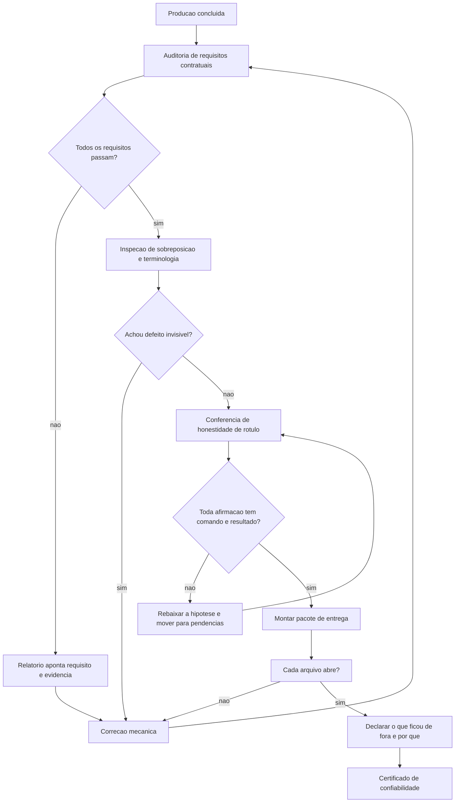

# Capítulo 12: Super-Auditoria e Entrega Soberana: O Certificado de Confiabilidade

## 1. Introdução

No Capítulo 11, você montou a orquestração: funil deliberativo, isolamento por ambiente, despacho em lotes e desfecho registrado. A fábrica está operando. Falta o passo que separa uma fábrica que produz de uma fábrica em que se pode confiar.

Este capítulo trata da **auditoria final e da entrega**. A pergunta que o organiza é a que todo cliente, gestor ou auditor faz e que quase nenhum projeto agêntico consegue responder com evidência: *o que exatamente está pronto, como você sabe disso, e o que ficou de fora?* Ao final, você terá o circuito de auditoria determinística, o pacote de entrega verificável e o mecanismo de evolução que mantém a fábrica saudável sem dívida técnica silenciosa.

## 2. Explica

### 2.1 Auditoria como evidência, não como opinião

Boa parte das auditorias de software é narrativa: alguém lê o relatório, alguém pergunta se está tudo bem, alguém responde que sim. O resultado é um documento que descreve intenções em vez de fatos. Em um sistema governado por agentes, isso é fatal, porque a produção é rápida demais para que a revisão narrativa acompanhe.

A auditoria determinística inverte a lógica. Cada requisito contratual vira uma verificação executável com resultado binário: mínimo de capítulos, presença das seções obrigatórias, quantidade de referências, ausência de marcador de pendência, rastreabilidade de citação, integridade de diagrama, sintaxe válida de código. O veredito é a conjunção de todas, e o relatório aponta exatamente qual requisito falhou — o que transforma correção em trabalho mecânico.

Existe ainda uma razão econômica para preferir evidência a opinião, e ela quase nunca é mencionada. O custo de descobrir um defeito cresce com a distância entre o momento em que ele foi introduzido e o momento em que foi percebido. Um requisito violado na geração do capítulo custa uma correção; o mesmo requisito violado descoberto na entrega custa correção, reauditoria e credibilidade. É por isso que a auditoria determinística roda cedo e roda sempre — ela compra tempo de descoberta barato, e tempo de descoberta é o recurso mais mal alocado em projetos conduzidos por agentes.

Há um segundo componente, menos visível e mais valioso: a auditoria precisa detectar aquilo que o autor não percebe. Três defeitos escapam sistematicamente à revisão de quem escreveu — **sobreposição de conteúdo** entre capítulos, **inconsistência terminológica** (o mesmo conceito escrito de duas formas) e **truncamento** (capítulo que termina no meio). Nenhum desses é visível em uma leitura linear e todos são detectáveis por comparação automática. É o caso exemplar de verificação que substitui julgamento por medição.

### 2.2 O problema da métrica que aprova o errado

Existe uma armadilha específica que todo auditor de sistemas agênticos precisa conhecer: a métrica pública pode parar de medir o que promete.

A evidência é direta. Conjuntos de avaliação de agentes de código alcançaram saturação — taxas de resolução acima de 93,9% em suíte de referência — e, no entanto, quando os mesmos modelos são avaliados em conjuntos com casos não publicados, a resolução cai para a casa dos 17%, com um modelo recuando de 23,1% para 14,9% [2] [3]. Estudo apresentado em conferência de engenharia de software apontou ainda que uma fração relevante dos patches aceitos como corretos não resolvia a tarefa [3].

A conclusão prática tem duas partes. A primeira é que **benchmark público não é certificado**; é indício. A segunda, mais importante, é que a única avaliação que vale para o seu sistema é a que roda no seu domínio, com o seu conjunto de casos — incluindo os casos difíceis que você mesmo já viu quebrar.

### 2.3 Honestidade de rótulo como requisito técnico

A nona lei da constituição aparece aqui em sua forma mais consequente. Honestidade de rótulo não é virtude moral abstrata; é requisito de engenharia. Um relatório que afirma cobertura maior do que a medida produz uma decisão errada rio abaixo — e, em sistemas agênticos, essa decisão pode ser tomada automaticamente.

A forma prática é uma regra de escrita: toda afirmação de segurança, desempenho ou cobertura precisa vir acompanhada do comando que a mediu e do resultado obtido. Se não há comando, a afirmação se transforma em hipótese declarada. Números sem medição não entram no relatório de entrega; entram na lista de pendências.

Existe um efeito colateral valioso dessa disciplina. Quando você se obriga a medir para afirmar, descobre rapidamente quais garantias são reais e quais eram folclore de equipe. Muitas "boas práticas" sobrevivem anos sem medição justamente porque ninguém nunca exigiu o número.

### 2.4 O pacote de entrega verificável

A entrega é o momento em que todo o resto é testado. E o critério de qualidade de um pacote não é a quantidade de arquivos que ele contém — é a capacidade de quem o recebe de **abrir, entender e verificar** cada item.

Isso implica três exigências. A primeira é que cada arquivo entregue abra de fato; formato declarado e formato real precisam coincidir. A segunda é que o pacote declare explicitamente o que ficou de fora, com o motivo — uma omissão silenciosa é indistinguível de um esquecimento. A terceira é que exista um documento de orientação que diga o que é cada item e como usá-lo, porque um pacote sem manual transfere ao destinatário um trabalho que era do produtor.

E há um componente que quase sempre falta: a **licença** e os **termos de uso**. Em uma era em que parte do conteúdo é gerada, a clareza sobre origem e permissão de uso deixou de ser formalidade jurídica e passou a ser parte da entrega técnica.

## 3. Ilustra

A **sala de controle** chegou ao turno de encerramento. Antes de liberar a planta, o auditor percorre o posto com uma prancheta — e a prancheta tem **luzes**, não comentários.

Cada luz corresponde a um requisito. Verde significa que a verificação passou; vermelho, que falhou, com o motivo impresso ao lado. O auditor não escreve "parece bom"; ele registra o resultado de cada luz. Depois, percorre as três salas de inspeção automática que ninguém vê: a que compara se dois setores estão fazendo trabalho duplicado, a que confere se todos os setores usam os mesmos nomes para as mesmas peças e a que verifica se algum setor parou no meio.

E existe uma segunda prancheta, mais fina, usada antes de qualquer afirmação pública sobre o produto. Ela pergunta, para cada frase do relatório: **qual comando produziu este número?** Frase sem lastro não é removida — é rebaixada a hipótese e movida para a lista de pendencias, onde pode ser investigada com honestidade.



*Figura 12.1 — O circuito de encerramento: auditoria binária, inspeção de defeitos invisíveis, conferência de honestidade de rótulo e pacote que declara suas próprias omissões.*

## 4. Técnica

### 4.1 Auditor do pacote de entrega

O auditor abaixo monta o certificado verificando três coisas por arquivo: existência, capacidade de abertura e correspondência entre formato declarado e formato real.

```python
#!/usr/bin/env python3
# -*- coding: utf-8 -*-
"""Auditor do pacote de entrega: prova que cada item existe e abre."""

import json
import sys
import zipfile
from pathlib import Path
from typing import Dict, List

LEITORES = {
    ".md": lambda p: p.read_text(encoding="utf-8"),
    ".json": lambda p: json.loads(p.read_text(encoding="utf-8")),
    ".txt": lambda p: p.read_text(encoding="utf-8"),
    ".html": lambda p: p.read_text(encoding="utf-8"),
    ".csv": lambda p: p.read_text(encoding="utf-8"),
}


def abre(caminho: Path) -> Dict[str, str]:
    """Confirma que o arquivo existe e que o conteudo e legivel no formato."""
    if not caminho.exists():
        return {"item": caminho.name, "status": "ausente", "detalhe": "nao encontrado"}
    if caminho.stat().st_size == 0:
        return {"item": caminho.name, "status": "vazio", "detalhe": "zero bytes"}

    extensao = caminho.suffix.lower()
    if extensao == ".pdf":
        cabecalho = caminho.open("rb").read(5)
        ok = cabecalho == b"%PDF-"
        return {"item": caminho.name, "status": "ok" if ok else "corrompido",
                "detalhe": "cabecalho PDF valido" if ok else "cabecalho invalido"}
    if extensao in (".epub", ".zip"):
        try:
            with zipfile.ZipFile(caminho) as pacote:
                nomes = pacote.namelist()
            return {"item": caminho.name, "status": "ok" if nomes else "vazio",
                    "detalhe": f"{len(nomes)} entrada(s)"}
        except zipfile.BadZipFile:
            return {"item": caminho.name, "status": "corrompido", "detalhe": "zip invalido"}

    leitor = LEITORES.get(extensao)
    if leitor is None:
        return {"item": caminho.name, "status": "nao-verificavel",
                "detalhe": f"sem leitor para {extensao or 'sem extensao'}"}
    try:
        leitor(caminho)
    except (UnicodeDecodeError, ValueError) as erro:
        return {"item": caminho.name, "status": "corrompido", "detalhe": str(erro)[:60]}
    return {"item": caminho.name, "status": "ok", "detalhe": "conteudo legivel"}


def auditar(caixa: Path, itens: List[str]) -> List[Dict[str, str]]:
    return [abre(caixa / item) for item in itens]


def declarar_ausentes(resultados: List[Dict[str, str]], motivos: Dict[str, str]) -> List[str]:
    """Toda omissao precisa de motivo declarado — omissao silenciosa nao passa."""
    ausentes = [r["item"] for r in resultados if r["status"] in ("ausente", "vazio")]
    sem_motivo = [item for item in ausentes if item not in motivos]
    return sem_motivo


def main() -> int:
    caixa = Path(sys.argv[1]) if len(sys.argv) > 1 else Path("distribuicao")
    itens = [p.name for p in sorted(caixa.glob("*"))] if caixa.is_dir() else []
    if not itens:
        print(f"[FALHA] pacote vazio ou inexistente: {caixa}")
        return 1

    resultados = auditar(caixa, itens)
    motivos = {r["item"]: "declarado no LEIA-ME" for r in resultados
               if r["status"] in ("ausente", "vazio")}
    sem_motivo = declarar_ausentes(resultados, motivos)

    print("=" * 62)
    print(f"AUDITORIA DO PACOTE — {caixa}")
    print("=" * 62)
    problemas = 0
    for r in resultados:
        marca = "OK" if r["status"] == "ok" else r["status"].upper()
        print(f"[{marca:>13}] {r['item']} — {r['detalhe']}")
        if r["status"] not in ("ok", "nao-verificavel"):
            problemas += 1

    print("-" * 62)
    print(json.dumps({"itens": len(resultados), "problemas": problemas,
                      "omissoes_sem_motivo": sem_motivo}, ensure_ascii=False, indent=2))
    if problemas or sem_motivo:
        print("[REPROVADO] exit 1 — pacote nao esta pronto para entrega.")
        return 1
    print("[APROVADO] exit 0 — pacote integro e verificavel.")
    return 0


if __name__ == "__main__":
    sys.exit(main())
```

### 4.2 Manifesto de entrega com omissões declaradas

O manifesto é o artefato que distingue um pacote profissional de um diretório de arquivos. Ele declara o que entra, o que fica de fora e por qual motivo.

```json
{
  "obra": "O Tratado das 4 Camadas da Fabrica Agentica",
  "edicao": "v3.0 — Edicao Expandida e Definitiva",
  "gerado_em": "2026-09-12",
  "entregues": [
    { "item": "livro_final.pdf", "formato": "pdf", "verificacao": "cabecalho PDF valido" },
    { "item": "livro_final.md", "formato": "markdown", "verificacao": "abre em utf-8" },
    { "item": "playbook.pdf", "formato": "pdf", "verificacao": "cabecalho PDF valido" }
  ],
  "nao_entregues": [
    { "item": "campanhas/", "motivo": "nao solicitado pelo operador na fase 0" },
    { "item": "maquina/", "motivo": "nao solicitado pelo operador na fase 0" }
  ],
  "garantias_medidas": [
    { "afirmacao": "auditoria de requisitos contratuais", "comando": "auditar-obra --estrito", "resultado": "exit 0" },
    { "afirmacao": "sintaxe de todos os blocos de codigo", "comando": "validar-codigo", "resultado": "100% aprovados" }
  ]
}
```

### 4.3 Sessão de encerramento

O log abaixo mostra o circuito completo: reprovação, correção mecânica e aprovação com certificado.

```console
$ python auditar-obra.py --estrito
[FALHA] R4  Minimo 20 referencias ABNT por capitulo
        -> capitulos abaixo: 7
[REPROVADO] exit 1 — 1 requisito nao conforme.
Relatorio: revisao/relatorio_auditoria.json

$ python auditar-obra.py --estrito
[OK] R3 7 secoes EITA-V2 por capitulo
[OK] R4 Minimo 20 referencias ABNT por capitulo
[OK] R13 Sem truncamento nem pendencias
[OK] R14 Rastreabilidade [N] texto <-> referencias
[CONFORME] exit 0 — nenhum requisito pendente.

$ python auditar-pacote.py distribuicao
[           OK] livro_final.pdf — cabecalho PDF valido
[           OK] livro_final.md — conteudo legivel
[           OK] playbook.pdf — cabecalho PDF valido
--------------------------------------------------------------
[APROVADO] exit 0 — pacote integro e verificavel.
```

### 4.4 Tabela de decisão do encerramento

| Situação encontrada | Ação | Bloqueia entrega? |
|---|---|---|
| Requisito contratual falhou | Corrigir a causa e reauditar | Sim |
| Afirmação sem comando de medição | Rebaixar a hipótese e mover para pendências | Sim |
| Arquivo declarado não abre | Corrigir o artefato ou declarar a omissão | Sim |
| Item fora do pacote por decisão do operador | Registrar no manifesto com motivo | Não |
| Terminologia inconsistente entre capítulos | Unificar e reauditar | Sim |
| Cobertura de teste abaixo do declarado | Reajustar o rótulo ao número real | Sim |
| Melhoria identificada fora do escopo | Registrar como evolução, não executar agora | Não |

### 4.5 Gerador do certificado de confiabilidade

O certificado é o artefato final da fábrica, e sua virtude é a mesma de um exame laboratorial: ele **não emite opinião**. Cada linha é o resultado de uma verificação executada, com o comando que a produziu registrado ao lado.

O ponto delicado está no tratamento das ausências. Um certificado honesto precisa distinguir três situações que costumam ser confundidas: o item que foi verificado e aprovado, o item que foi verificado e reprovado, e o item que **não pôde ser verificado**. A terceira categoria é a que quase sempre desaparece dos relatórios — e é justamente a que um auditor precisa ver.

```python
#!/usr/bin/env python3
# -*- coding: utf-8 -*-
"""Gerador do certificado de confiabilidade a partir de verificacoes executadas."""

import json
import sys
from dataclasses import dataclass, asdict
from pathlib import Path
from typing import List, Optional

APROVADO = "aprovado"
REPROVADO = "reprovado"
NAO_VERIFICADO = "nao-verificavel"


@dataclass(frozen=True)
class Verificacao:
    afirmacao: str
    comando: str
    exit_code: Optional[int]

    def status(self) -> str:
        if self.exit_code is None:
            return NAO_VERIFICADO
        return APROVADO if self.exit_code == 0 else REPROVADO

    def linha(self) -> str:
        marca = self.status().upper()
        codigo = "-" if self.exit_code is None else str(self.exit_code)
        return f"[{marca:>15}] {self.afirmacao} (comando: {self.comando}, exit {codigo})"


def semaforo(verificacoes: List[Verificacao]) -> str:
    """Veredito binario: uma reprovacao bloqueia; nao verificavel vira ressalva."""
    if any(v.status() == REPROVADO for v in verificacoes):
        return "NAO CONFORME"
    if any(v.status() == NAO_VERIFICADO for v in verificacoes):
        return "CONFORME COM RESSALVA"
    return "CONFORME"


def validar_certificado(verificacoes: List[Verificacao]) -> List[str]:
    problemas: List[str] = []
    if not verificacoes:
        problemas.append("certificado vazio: nenhuma verificacao executada")
    for v in verificacoes:
        if not v.comando.strip():
            problemas.append(f"afirmacao sem comando de medicao: {v.afirmacao!r}")
        if len(v.afirmacao.split()) < 4:
            problemas.append(f"afirmacao vaga demais para auditoria: {v.afirmacao!r}")
    return problemas


def main() -> int:
    verificacoes = [
        Verificacao("todas as secoes obrigatorias presentes", "auditar-obra --estrito", 0),
        Verificacao("minimo de referencias por capitulo atingido", "auditar-obra --estrito", 0),
        Verificacao("sintaxe de todos os blocos de codigo", "validar-codigo", 0),
        Verificacao("cada arquivo do pacote abre no formato declarado", "auditar-pacote", 0),
        Verificacao("cobertura de teste do nucleo", "coverage report", None),
    ]
    problemas = validar_certificado(verificacoes)
    print("=" * 70)
    print("CERTIFICADO DE CONFIABILIDADE")
    print("=" * 70)
    for v in verificacoes:
        print(v.linha())
    print("-" * 70)
    print(f"VEREDITO: {semaforo(verificacoes)}")
    for problema in problemas:
        print(f"[ATENCAO] {problema}")
    destino = Path("validacao")
    destino.mkdir(parents=True, exist_ok=True)
    (destino / "certificado.json").write_text(
        json.dumps({"veredito": semaforo(verificacoes),
                    "verificacoes": [asdict(v) for v in verificacoes]},
                   ensure_ascii=False, indent=2), encoding="utf-8")
    if semaforo(verificacoes) == "NAO CONFORME":
        print("[REPROVADO] exit 1 — existe verificacao reprovada; entrega nao autorizada.")
        return 1
    print("[OK] exit 0 — certificado emitido e arquivado em validacao/certificado.json")
    return 0


if __name__ == "__main__":
    sys.exit(main())
```

Observe a linha da cobertura de teste no exemplo: ela aparece como não verificável porque nenhum comando foi executado. O veredito final não é "conforme" — é **conforme com ressalva**, e a ressalva fica visível no certificado em vez de desaparecer. É essa distinção que transforma um relatório de entrega em documento auditável, e é essa mesma distinção que a nona lei da constituição exige de qualquer afirmação técnica.

### 4.6 Roteiro de encerramento em cinco passos

1. **Audite** contra os requisitos contratuais e trate qualquer vermelho como bloqueio, nunca como ressalva.
2. **Inspecione** o que a leitura não vê: sobreposição, terminologia e truncamento.
3. **Confira** cada afirmação do relatório contra o comando que a produziu; sem comando, vira hipótese.
4. **Monte** o pacote e teste se cada arquivo abre no formato declarado.
5. **Declare** o que ficou de fora, com motivo, e emita o certificado com as garantias efetivamente medidas.

## 5. Aplica

### A cena que quase todo time vive

É véspera de entrega para um cliente institucional. Você tem o produto pronto, o relatório escrito e o pacote montado. O relatório afirma que "a solução foi validada em ambiente de produção com cobertura completa". O cliente pergunta como.

Reconstrua o que essa pergunta expõe. A palavra "validada" não tem comando associado: ninguém sabe se ela significa que os testes passaram, que alguém testou manualmente ou que o sistema está no ar. A expressão "cobertura completa" não tem número: é a categoria de afirmação que a nona lei da constituição existe para eliminar. E existe um terceiro problema, mais profundo: **a ausência de verificação de sobreposição e terminologia**, que só aparece quando você roda o auditor contra um requisito objetivo — e descobre que cerca de 7,2% dos patches aceitos em avaliação de referência não resolviam a tarefa proposta, o mesmo tipo de discrepância que a inspeção automática revela entre capítulos [3].

O diagnóstico tem quatro componentes independentes. Auditoria narrativa em vez de binária. Afirmação sem lastro de medição. Ausência de inspeção automática do que a leitura não vê. E pacote sem declaração de omissões, o que deixa o cliente sem saber o que existe e o que não existe.

A correção, na manhã seguinte, é mecânica e rápida. Primeiro, reescrever cada afirmação no formato "o que foi medido, com qual comando, com qual resultado" — e rebaixar a hipótese tudo o que não tiver comando [10]. Segundo, rodar a auditoria determinística e tratar cada vermelho como bloqueio, não como ressalva. Terceiro, inspecionar sobreposição e terminologia com verificação automática, corrigindo as duplicatas e unificando os nomes. Quarto, montar o manifesto declarando explicitamente o que ficou de fora e por quê. O relatório final fica **menos impressionante** e **infinitamente mais útil** — e é justamente esse o efeito da nona lei.

### Onde isso escala e onde quebra

Auditoria determinística escala, porque o custo de rodar a verificação é praticamente constante e o de corrigir é proporcional ao defeito encontrado. O ponto de ruptura é o número de requisitos: acima de algumas centenas, o relatório fica ilegível e o time deixa de olhar para ele. O contorno é hierarquizar — requisitos bloqueantes em primeiro nível, alertas de estilo em segundo, métricas informativas em terceiro.

A conferência de honestidade de rótulo tem uma fronteira temporal interessante. Ela é fácil de aplicar a números e difícil de aplicar a qualidades — "o sistema é resiliente" é uma afirmação que pode ser verdadeira sem ser mensurável de uma só forma. O contorno é traduzir sempre que possível: resiliência vira "sobreviveu a N falhas de nó em teste de X minutos", com o comando registrado. O que **não funciona** é aceitar a qualidade sem nenhuma forma de operacionalização, porque é assim que a afirmação inflada entra no relatório.

A terceira fronteira é o pacote. Ele escala mal com o volume de itens: a partir de certo ponto, ninguém abre arquivo por arquivo, e a verificação vira amostragem. O contorno é entregar por camadas, com um índice que permita ao destinatário escolher o que verificar — e um manifesto que diga exatamente quais itens são essenciais e quais são complementares.

E a condição de contorno mais importante deste capítulo: **o rigor da auditoria precisa ser proporcional à consequência do erro**. Um protótipo interno não precisa de manifesto com garantias medidas; um artefato entregue a cliente institucional ou usado em decisão de risco, sim. Aplicar rigor máximo em tudo produz burocracia que o time abandona; aplicar rigor mínimo no que importa produz a entrega que não se sustenta quando alguém pergunta "como você sabe?".

### Armadilhas comuns

- Aceitar veredito com ressalvas em requisito bloqueante. Ressalva em requisito é requisito não cumprido com nome diferente.
- Confiar em benchmark público como certificado. A evidência é clara: em conjuntos com casos não publicados, a resolução dos mesmos modelos recua para a casa dos 17% [3].
- Escrever a verdade sem medi-la. Toda afirmação de cobertura precisa do comando que a produziu; sem isso, ela é hipótese.
- Entregar pacote sem declarar omissões. O que fica de fora em silêncio é indistinguível de esquecimento.
- Não inspecionar o que a leitura não vê. Sobreposição, terminologia e truncamento são invisíveis a olho nu e triviais para o auditor [15].

## 6. Conclusão

Neste capítulo você fechou o circuito da fábrica. A auditoria determinística substitui opinião por evidência binária e detecta os três defeitos que a leitura nunca revela: sobreposição de conteúdo, inconsistência terminológica e truncamento. A honestidade de rótulo transforma cada afirmação do relatório em afirmação rastreável, com comando e resultado. E o pacote de entrega verificável declara o que contém, prova que cada item abre e explicita o que ficou de fora e por quê.

Você viu também por que a métrica pública não pode ser o certificado. Conjuntos de avaliação de agentes de código chegaram à saturação, com taxas de resolução acima de 93,9% em suíte de referência — e, em conjuntos com casos não publicados, os mesmos modelos recuam para a casa dos 17% [2] [3]. Se o ranking público já não discrimina, o único certificado com valor é o que você emite sobre o seu domínio, com as suas evidências.

Ao longo de doze capítulos, você percorreu a jornada completa. Viu a crise real — as quatro catástrofes que explicam por que projetos amadores de IA colapsam. Recebeu a lei — as dez regras inegociáveis, cada uma com o seu fiscal. Percorreu as quatro camadas: contexto e governança, harness e ciclo de vida, motor cognitivo, ferramentas e persistência. Montou a estrutura, blindou o legado, orquestrou múltiplos agentes com isolamento e encerrou com auditoria e entrega soberana.

A pergunta que permanece não é técnica. É sobre identidade. Quando alguém perguntar como você sabe que o sistema está correto, a resposta vai ser um comando, um resultado e um registro — ou vai ser uma opinião. A diferença entre essas duas respostas é exatamente a diferença entre operar uma sala de controle e torcer por um painel que ninguém instalou.

**Desafio final:** pegue o último artefato que você entregou e responda três perguntas sem consultar nada — cada item abre no formato declarado, cada afirmação tem o comando que a mediu, e cada omissão está declarada com motivo. Onde as três respostas forem sim, você tem uma entrega soberana. Onde houver um "provavelmente", você tem o seu próximo trabalho.

## 7. Referências Bibliográficas

[1] SWE-BENCH. *SWE-bench Leaderboards*. Disponível em: https://www.swebench.com/. Acesso em: 12 set. 2026.
[2] SWE-BENCH. *SWE-bench Verified Leaderboard*. Disponível em: https://www.swebench.com/verified.html. Acesso em: 12 set. 2026.
[3] SCALE LABS. *SWE-Bench Pro (Public Dataset) — Leaderboard*. Disponível em: https://labs.scale.com/leaderboard/swe_bench_pro_public. Acesso em: 12 set. 2026.
[4] VERACODE. *2025 GenAI Code Security Report: AI-Generated Code Security Risks*. Disponível em: https://www.veracode.com/blog/ai-generated-code-security-risks/. Acesso em: 12 set. 2026.
[5] CLOUD SECURITY ALLIANCE. *Vibe Coding's Security Debt: The AI-Generated CVE Surge*. Disponível em: https://labs.cloudsecurityalliance.org/research/csa-research-note-ai-generated-code-vulnerability-surge-2026/. Acesso em: 12 set. 2026.
[6] DORA / GOOGLE CLOUD. *State of AI-assisted Software Development 2025*. Disponível em: https://dora.dev/dora-report-2025/. Acesso em: 12 set. 2026.
[7] STACK OVERFLOW. *2025 Developer Survey — AI*. Disponível em: https://survey.stackoverflow.co/2025/ai. Acesso em: 12 set. 2026.
[8] NATIONAL INSTITUTE OF STANDARDS AND TECHNOLOGY. *Artificial Intelligence Risk Management Framework: Generative Artificial Intelligence Profile (NIST AI 600-1)*. Disponível em: https://nvlpubs.nist.gov/nistpubs/ai/NIST.AI.600-1.pdf. Acesso em: 12 set. 2026.
[9] NATIONAL SECURITY AGENCY. *Model Context Protocol (MCP) Security — CSI*. Disponível em: https://www.nsa.gov/Portals/75/documents/Cybersecurity/CSI_MCP_SECURITY.pdf. Acesso em: 12 set. 2026.
[10] HUMBLE, Jez; FARLEY, David. *Continuous Delivery: Reliable Software Releases through Build, Test, and Deployment Automation*. Addison-Wesley, 2010. Disponível em: https://continuousdelivery.com/. Acesso em: 12 set. 2026.
[11] NYGARD, Michael T. *Release It!: Design and Deploy Production-Ready Software*. 2. ed. Pragmatic Bookshelf, 2018. Disponível em: https://pragprog.com/titles/mnee2/release-it-second-edition/. Acesso em: 12 set. 2026.
[12] MORAMPUDI, Abhishek et al. *A survey of reward hacking in agentic large language model systems*. In: Discover Artificial Intelligence. 2026. Disponível em: https://link.springer.com/article/10.1007/s44163-026-01980-z. Acesso em: 12 set. 2026.
[13] METR. *Recent Frontier Models Are Reward Hacking*. Disponível em: https://metr.org/blog/2025-06-05-recent-reward-hacking/. Acesso em: 12 set. 2026.
[14] RAKSHIT, Yerram Sai. *Modernizing Software Testing: AI, Telemetry, and Agentic Quality Engineering*. In: International Journal of AI Engineering. 2026. Disponível em: https://doi.org/10.34218/ijaieg_01_01_002. Acesso em: 12 set. 2026.
[15] MEI, Lingrui et al. *A Survey of Context Engineering for Large Language Models*. In: arXiv. 2025. Disponível em: https://arxiv.org/abs/2507.13334. Acesso em: 12 set. 2026.
[16] GIT. *git-worktree Documentation*. Disponível em: https://git-scm.com/docs/git-worktree. Acesso em: 12 set. 2026.
[17] SQLITE. *Write-Ahead Logging*. Disponível em: https://www.sqlite.org/wal.html. Acesso em: 12 set. 2026.
[18] TRAXTECH. *20% of AI-Generated Code Dependencies Don't Exist, Creating Supply Chain Security Risks*. Disponível em: https://www.traxtech.com/blog/20-of-ai-generated-code-dependencies-dont-exist-creating-supply-chain-security-risks. Acesso em: 12 set. 2026.
[19] MARTIN, Robert C. *Clean Architecture: A Craftsman's Guide to Software Structure and Design*. Prentice Hall, 2017. Disponível em: https://www.pearson.com/. Acesso em: 12 set. 2026.
[20] SHANNON, Claude E. *A Mathematical Theory of Communication*. Bell System Technical Journal, 1948. Disponível em: https://doi.org/10.1002/j.1538-7305.1948.tb01338.x. Acesso em: 12 set. 2026.
