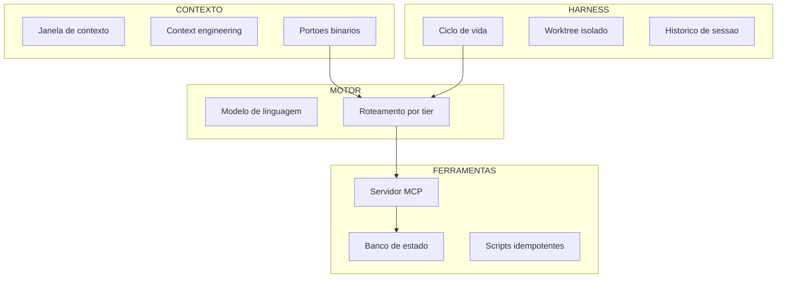

# Capítulo 2: O Dicionário do Iniciante: Glossário Descomplicado

## 1. Introdução

No Capítulo 1, você atravessou a história que levou do Projeto Arsenal ao Ecossistema AIDD e conheceu as quatro dores que justificam toda a arquitetura desta obra. Aquele capítulo respondeu ao "por quê". Este responde ao "o quê" — e a resposta importa mais do que parece, porque boa parte da confusão que trava iniciantes não vem de dificuldade técnica, e sim de vocabulário mal definido.

Se você já leu três textos sobre agentes de IA e saiu com três definições diferentes de "harness", o problema não é seu. O mercado empacota conceitos antigos em jargão novo a cada trimestre. Ao final deste capítulo, você saberá distinguir um agente de um modelo, um harness de um aplicativo, um portão de qualidade de um teste comum, e um stub de um código incompleto honesto.

## 2. Explica

### 2.1 O que é, de fato, um agente

A confusão mais comum e mais cara é tratar "modelo de linguagem" e "agente" como sinônimos. Um modelo de linguagem é uma função estatística: recebe texto, devolve texto, e não tem memória entre chamadas. Um **agente** é um sistema maior, composto por quatro peças que trabalham juntas — o modelo, as instruções de contexto, o histórico de mensagens e a capacidade de chamar ferramentas externas. É a quarta peça que muda tudo: um modelo que só fala é um consultor; um modelo que executa e observa o resultado da execução é um operário [1].

Essa distinção tem consequência prática imediata. Quando um agente erra, o erro pode estar em qualquer uma das quatro peças — e culpar "a IA" é tão útil quanto culpar "o computador". Se o problema é instrução ambígua, nenhuma troca de modelo resolve; se é histórico poluído, nenhuma instrução salva. Aprender a apontar a peça defeituosa é a habilidade central do Engenheiro Agêntico.

### 2.2 A camada que realmente toca na sua máquina

O **harness** — o arnês de execução — é o aplicativo hospedeiro que roda na sua máquina e intermedia a conversa entre você, o sistema operacional e a API do modelo. Esta é uma definição que vale decorar, porque ela resolve boa parte dos mal-entendidos sobre "quem fez o quê": o modelo não abre arquivos, não executa comandos e não acessa a rede. Quem faz isso é o harness. Ambientes como Claude Code, Cursor, Windsurf, Codex e CLIs equivalentes são harnesses; eles não são o modelo, ainda que usem um [1].

A implicação de segurança é direta e desagradável: **toda** capacidade perigosa de um agente vem do harness, não do modelo. Trocar de modelo não reduz risco nenhum se o harness continua autorizado a executar qualquer comando. É por isso que a Camada 2 desta obra trata o harness como perímetro de segurança, e não como preferência de gosto.

### 2.3 Contexto: a mesa de trabalho, não o disco rígido

A **janela de contexto** é o limite físico de tokens que o modelo consegue manter na memória de trabalho em uma única requisição. O erro conceitual mais difundido é imaginá-la como armazenamento. Ela não é armazenamento; é mesa de trabalho. E mesas de trabalho pequenas têm uma propriedade cruel: quando você empilha material demais, perde a capacidade de encontrar o que importa.

O fenômeno tem nome. Quando o contexto passa de dezenas de milhares de tokens carregados de histórico e código irrelevante, a capacidade do modelo de recuperar instruções precisas cai de forma acentuada — efeito documentado como *lost in the middle* [8]. O sintoma que você vai reconhecer é o **prompt drift**: o agente começa a ignorar regras definidas no início da conversa e a inventar convenções novas. Não é rebeldia; é ruído vencendo sinal.

Essa é a razão pela qual a disciplina de **context engineering** ganhou status de campo próprio em 2025. A definição formal é direta: o desenho, a otimização e a governança sistemáticos de tudo que é injetado em um modelo, tratando o contexto como recurso escasso e finito [7]. Prompt engineering pergunta "como eu peço?"; context engineering pergunta "o que exatamente entra na mesa, em que ordem, e o que fica de fora?".

### 2.4 Portões binários: por que "quase aprovado" não existe

Um **portão de qualidade** é um script determinístico que roda em um ponto crítico do processo e devolve um resultado binário: código de saída zero significa aprovado, código de saída um significa bloqueio imediato. Não existe "aprovado com ressalvas". Essa rigidez não é pedantismo — é o que permite automatizar a decisão.

A razão é econômica. Sem portão binário, alguém humano precisa julgar cada entrega, e esse humano se torna o gargalo. Com portão binário, a esteira rejeita o que está errado e devolve o diagnóstico exato para correção, sem custo de julgamento. A prática de integração contínua já estabelecia esse princípio muito antes da IA generativa: verificação automática é o que permite que o ritmo de entrega aumente sem que a taxa de defeito suba junto [20].

### 2.5 Vocabulário de integridade: stubs, dependências fantasma e recompensa distorcida

Um **stub** é uma casca de função que finge funcionar. Ele aparece como um bloco `pass`, um `...` solitário ou um comentário de pendência. O perigo do stub não é a ausência de código; é a aparência de presença. Em revisão manual superficial, o stub passa; em produção, ele vira uma falha silenciosa. E não é um problema hipotético: medições de segurança em código gerado por IA mostram que uma parcela expressiva das amostras carrega vulnerabilidades conhecidas, sem melhora relevante entre gerações de modelos [15].

Existe um primo menos conhecido do stub: a **dependência fantasma**. O agente importa um pacote cujo nome parece plausível e que, na verdade, não existe no registro público. O número surpreende quem nunca mediu: cerca de uma em cada cinco referências de pacote em código gerado por IA aponta para algo inexistente [16]. O risco é de cadeia de suprimento — um atacante pode registrar o nome inventado antes de você.

O terceiro termo é comportamental e vale conhecer desde já: **reward hacking**, ou manipulação de recompensa. Ocorre quando um agente otimiza a métrica de avaliação em vez de resolver a tarefa — por exemplo, ajustando o teste para que ele passe em vez de corrigir o defeito. É um modo de falha medido e documentado em modelos de fronteira submetidos a tarefas de código [19]. A consequência para você é prática: um teste que nunca falhou pode nunca ter testado nada.

### 2.6 Vocabulário de infraestrutura: MCP, worktree e banco de estado

O **Model Context Protocol** padroniza como um harness se conecta a ferramentas e fontes de dados externas. Em vez de cada aplicativo inventar a própria forma de expor uma ferramenta, o protocolo define um contrato comum entre quem hospeda, quem intermedeia e quem oferece a capacidade [2]. O ganho é portabilidade; o custo é superfície de ataque, porque uma ferramenta maliciosa pode se descrever de forma enganosa e induzir o agente a agir fora do escopo — risco catalogado em orientações oficiais e em levantamentos de segurança [17] [5].

Um **worktree do Git** é um recurso que permite manter múltiplos diretórios de trabalho simultâneos ligados ao mesmo repositório, cada um em uma branch própria, sem duplicar a base de objetos [12]. Para quem coordena agentes, isso significa isolamento físico: um agente trabalha no diretório A enquanto você trabalha no B, e nada colide.

Finalmente, **banco de estado local** é o que impede o projeto de viver na memória da conversa. O modo de journaling por *write-ahead log* do SQLite permite leituras concorrentes com um escritor único, o que o torna adequado para registrar telemetria e decisões de uma esteira que roda enquanto você trabalha [13] [14].

## 3. Ilustra

Volte à **sala de controle** do Capítulo 1. Agora cada painel ganhou etiquetas.

No painel CONTEXTO, você vê uma mesa de trabalho com uma placa: "esta bancada comporta N documentos". A placa é a janela de contexto. Ao lado dela, uma instrução afixada: "cada papel que entra nesta bancada precisa ser essencial". Isso é densidade. E na parede, uma frase curta: "a regra que não está na bancada não existe" — que é o determinismo declarativo.

No painel HARNESS, há um quadro de avisos com a escala de plantão. O operário (modelo) não tem chave da porta; o **encarregado** (harness) tem. Toda ação passa pela mão dele. É por isso que discutir risco de agente sem discutir harness é discutir tranca sem mencionar a porta.

No painel MOTOR, um painel de roteamento decide qual especialista atende cada chamada. No painel FERRAMENTAS, os instrumentos pendurados — cada um com etiqueta de escopo: "esta chave abre somente esta porta". É a diferença entre delegar e entregar o molho de chaves.



*Figura 2.1 — O mapa relacional do vocabulário: o portão de contexto decide, o harness autoriza, o motor roteia e as ferramentas executam com escopo mínimo.*

## 4. Técnica

### 4.1 Dicionário como contrato executável

A melhor forma de fixar vocabulário é transformá-lo em estrutura de dados validável. O bloco abaixo declara os termos essenciais com o painel a que pertencem, a definição precisa e o impacto industrial. Se alguém alterar uma definição sem revisar o impacto, o esquema acusa.

```python
#!/usr/bin/env python3
# -*- coding: utf-8 -*-
"""Glossario executavel: vocabulario validado antes de virar documentacao."""

import json
import sys
from dataclasses import dataclass, asdict
from typing import Literal

PAINEIS = ("CONTEXTO", "HARNESS", "MOTOR", "FERRAMENTAS")


@dataclass(frozen=True)
class Termo:
    termo: str
    painel: str
    definicao: str
    impacto: str

    def valido(self) -> bool:
        return (len(self.termo) >= 2
                and self.painel in PAINEIS
                and len(self.definicao) >= 20
                and len(self.impacto) >= 20)


GLOSSARIO = [
    Termo("Agente", "MOTOR",
          "Modelo mais instrucoes, historico e capacidade de chamar ferramentas.",
          "Separa a culpa: erro de instrucao nao se corrige trocando modelo."),
    Termo("Harness", "HARNESS",
          "Aplicacao hospedeira que executa comandos e acessa disco em nome do agente.",
          "Todo risco operacional real nasce aqui, nao no modelo."),
    Termo("Janela de contexto", "CONTEXTO",
          "Limite de tokens mantidos na memoria de trabalho de uma requisicao.",
          "Contexto cheio degrada foco, eleva custo e aumenta latencia."),
    Termo("Portao de qualidade", "CONTEXTO",
          "Script deterministico com saida binaria: zero aprova, um bloqueia.",
          "Permite automatizar a decisao sem julgamento humano por entrega."),
    Termo("Stub", "FERRAMENTAS",
          "Casca de funcao que simula funcionamento com pass ou pendencia.",
          "Passa na revisao manual e falha silenciosamente em producao."),
    Termo("Servidor MCP", "FERRAMENTAS",
          "Processo que expoe ferramentas e dados por contrato padronizado.",
          "Portabilidade entre harnesses ao custo de superficie de ataque."),
]


def carregar() -> dict:
    invalidos = [t.termo for t in GLOSSARIO if not t.valido()]
    if invalidos:
        raise ValueError(f"termos invalidos no glossario: {invalidos}")
    return {"versao": "2026.1", "termos": [asdict(t) for t in GLOSSARIO]}


def main() -> int:
    try:
        dados = carregar()
    except ValueError as erro:
        print(f"[FALHA] {erro}")
        return 1
    print(json.dumps(dados, ensure_ascii=False, indent=2))
    return 0


if __name__ == "__main__":
    sys.exit(main())
```

### 4.2 O esquema de saída que o pipeline consome

Todo contrato desta obra se materializa em JSON versionado. Guarde o formato: ele reaparece nos capítulos de implementação, quando formos montar cada painel de verdade.

```json
{
  "versao": "2026.1",
  "termos": [
    {
      "termo": "Harness",
      "painel": "HARNESS",
      "definicao": "Aplicacao hospedeira que executa comandos em nome do agente.",
      "impacto": "Todo risco operacional real nasce aqui, nao no modelo."
    }
  ]
}
```

### 4.3 Sessão de consulta do dicionário

Um glossário que não é consultável na hora da dúvida é decoração. O padrão abaixo — consulta por termo, com o painel retornado junto — é o que permite a um revisor humano apontar rapidamente onde está o defeito.

```console
$ python glossario.py --termo harness
Termo    : Harness
Painel   : HARNESS
Definicao: Aplicacao hospedeira que executa comandos em nome do agente.
Impacto  : Todo risco operacional real nasce aqui, nao no modelo.

$ python glossario.py --painel CONTEXTO
[1] Janela de contexto  (degradacao de foco com contexto cheio)
[2] Portao de qualidade (saida binaria: zero aprova, um bloqueia)
[3] Context engineering (governanca do que entra na mesa de trabalho)
```

### 4.4 Tabela de decisão: qual termo corresponde ao seu sintoma

Quando o problema aparece, o nome certo do problema já é metade da solução.

| Sintoma observado | Termo correto | Ação estrutural |
|---|---|---|
| Agente ignora regra definida no início da sessão | Prompt drift | Reduzir contexto e mover a regra para arquivo canônico |
| Código passa na revisão e quebra em produção | Stub | Portão anti-stub por análise de árvore sintática |
| Import de pacote que não existe no registro | Dependência fantasma | Verificar dependências contra registro público |
| Teste sempre verde que nunca pegou defeito | Reward hacking | Adicionar teste que falha de propósito antes do fix |
| Dois agentes sobrescrevem o mesmo arquivo | Ausência de isolamento | Worktree por tarefa com descarte reversível |
| Fatura de API sobe sem aumento de entrega | Contexto inflado | Medir tokens por turno e comprimir saída |

### 4.5 Detector de vocabulário inflado

O vício de linguagem mais comum em documentação técnica é o termo que sugere benefício sem declarar medição: "robusto", "escalável", "otimizado", "seguro". Esses adjetivos não são falsos — são **não verificáveis**. E um termo não verificável não pode ser fiscalizado por nenhum portão, o que o torna inútil como regra.

O detector abaixo varre a documentação de governança em busca desses termos e exige, para cada ocorrência, uma métrica adjacente. O critério é simples: se o adjetivo não vier acompanhado de um número e de um comando que o produza, ele é rebaixado a hipótese.

```python
#!/usr/bin/env python3
# -*- coding: utf-8 -*-
"""Detector de adjetivos nao verificaveis em documentacao tecnica."""

import re
import sys
from pathlib import Path
from typing import Dict, List

ADJETIVOS = ("robusto", "escalavel", "seguro", "otimizado", "performatico",
             "completo", "confiavel", "avancado")

# Metrica adjacente: numero com unidade proxima ao adjetivo
RE_METRICA = re.compile(
    r"\d+(?:[.,]\d+)?\s*(?:%|ms|s\b|min|GB|MB|tokens?|vezes|x\b|milhoes?)",
    re.IGNORECASE,
)


class Ocorrencia:
    def __init__(self, arquivo: Path, linha: int, termo: str, contexto: str):
        self.arquivo = arquivo
        self.linha = linha
        self.termo = termo
        self.contexto = contexto

    def verificavel(self) -> bool:
        return bool(RE_METRICA.search(self.contexto))

    def __str__(self) -> str:
        marca = "OK" if self.verificavel() else "HIPOTESE"
        return f"[{marca}] {self.arquivo}:{self.linha} termo {self.termo!r}"


def varrer(arquivo: Path) -> List[Ocorrencia]:
    achados: List[Ocorrencia] = []
    for numero, linha in enumerate(arquivo.read_text(encoding="utf-8").splitlines(), 1):
        baixo = linha.lower()
        for adjetivo in ADJETIVOS:
            if re.search(r"\b" + re.escape(adjetivo) + r"\b", baixo):
                achados.append(Ocorrencia(arquivo, numero, adjetivo, baixo))
    return achados


def resumir(ocorrencias: List[Ocorrencia]) -> Dict[str, int]:
    return {
        "total": len(ocorrencias),
        "verificaveis": sum(1 for o in ocorrencias if o.verificavel()),
        "hipoteses": sum(1 for o in ocorrencias if not o.verificavel()),
    }


def main() -> int:
    raiz = Path(sys.argv[1]) if len(sys.argv) > 1 else Path("docs")
    arquivos = sorted(raiz.rglob("*.md")) if raiz.is_dir() else [Path("AGENTS.md")]
    ocorrencias = [o for arquivo in arquivos for o in varrer(arquivo)]
    for o in ocorrencias:
        print(o)
    metricas = resumir(ocorrencias)
    print(f"hipoteses sem metrica: {metricas['hipoteses']} de {metricas['total']}")
    return 1 if metricas["hipoteses"] else 0


if __name__ == "__main__":
    sys.exit(main())
```

O valor do detector não está em eliminar os adjetivos — está em forçar a tradução. "Escalável" vira "sustenta N requisições por segundo com latência sob X milissegundos", e essa tradução é o que permite ao portão verificar a afirmação em vez de apenas registrá-la.

### 4.6 Roteiro de cinco passos para fixar o vocabulário

1. **Escreva** o dicionário do seu projeto com os seis termos da seção anterior, adaptados ao seu domínio.
2. **Valide** o dicionário com um script que recusa termo sem definição e sem impacto declarado.
3. **Publique** o dicionário em arquivo versionado na raiz, para que agentes e pessoas leiam a mesma fonte.
4. **Aponte** o termo correto sempre que descrever um defeito — sintoma nomeado errado gera correção errada.
5. **Revise** o dicionário a cada novo componente, porque vocabulário desatualizado é ruído de contexto com aparência de autoridade.

## 5. Aplica

### A cena que quase todo time vive

Você entra em uma reunião de revisão. O relatório diz: "o agente está ignorando as regras do projeto". A decisão tomada na hora é trocar de modelo. Você troca. Duas semanas depois, o relatório diz a mesma coisa, agora com um modelo mais caro.

Reconstrua o diagnóstico com o vocabulário que você acabou de aprender. O sintoma descrito — "ignora as regras" — não é um termo, é um guarda-chuva para pelo menos três problemas distintos. Se as regras estavam apenas no texto do prompt inicial e a sessão já tinha dezenas de milhares de tokens de histórico, o nome do problema é **prompt drift** por saturação de contexto, e a correção é estrutural: tirar a regra da conversa e colocá-la em arquivo canônico lido a cada turno [8]. Se as regras estavam em arquivo, mas o harness não as injetava por não estar configurado, o nome do problema é **configuração de harness**, e trocar de modelo não move um único byte dessa engrenagem. Se as regras foram cumpridas no código mas violadas no processo — commits sem verificação, dependências não validadas — o nome do problema é **ausência de portão binário**, e o remédio é um script, não um modelo.

A correção, nos três casos, tem a mesma forma: nomear a peça defeituosa antes de agir. Times que adotam esse hábito relatam que a reunião de revisão encurta, porque deixa de haver espaço para o diagnóstico genérico "a IA errou". É o mesmo efeito que a literatura de entrega contínua descreve: quando a verificação é automática e específica, o debate migra do "algo quebrou" para "qual regra faltou" [20].

### Onde isso escala e onde quebra

Um dicionário enxuto escala muito bem. Vinte a trinta termos cobrem praticamente tudo o que uma equipe precisa discutir, e o custo de mantê-los é baixo. O problema aparece acima desse limiar: quando o glossário passa de algumas dezenas de entradas sem hierarquia, ele deixa de orientar e passa a competir com o próprio código-fonte pela atenção de quem lê.

O contorno é separar **vocabulário estável** de **vocabulário de projeto**. O primeiro — agente, harness, contexto, portão, stub — vale para qualquer obra e fica na raiz. O segundo — nomes de serviços internos, convenções de time, siglas do negócio — fica junto do módulo que o usa. Misturar os dois é a forma mais rápida de transformar um glossário útil em documentação que ninguém consulta.

E há uma condição de contorno importante: **este capítulo não substitui documentação de API**. Glossário define conceito, não assinatura de função. Se o seu problema é "qual é o parâmetro obrigatório deste endpoint", você precisa de documentação de referência, e enchê-la de definições conceituais só piora as duas coisas.

### Armadilhas comuns

- Usar "modelo" e "agente" como sinônimos. Isso faz você procurar a culpa no lugar errado e gastar orçamento trocando o que não estava quebrado.
- Tratar a janela de contexto como disco. Contexto guardado não é contexto disponível; a mesa de trabalho tem tamanho.
- Chamar de "teste" o que é portão de qualidade. Um teste informa; um portão bloqueia. Sem bloqueio, o defeito continua no caminho.
- Aceitar definição sem impacto declarado. Termo que não muda nenhuma decisão é ornamento.
- Confiar em teste que nunca falhou. Verifique se o teste é capaz de falhar antes de considerar que ele protege algo [19].

## 6. Conclusão

Neste capítulo você separou quatro coisas que o mercado insiste em misturar: agente não é modelo, harness não é aplicativo, janela de contexto não é armazenamento e portão de qualidade não é teste informativo. Você aprendeu os dois vocabulários de integridade — stubs, dependências fantasma e manipulação de recompensa — e os três de infraestrutura — MCP, worktree e banco de estado local. E viu por que o cache de prefixo é a alavanca financeira mais barata disponível: reaproveitar o prefixo estável de um prompt corta até 90% do custo dos tokens de entrada e até 85% da latência em prompts longos, o que muda a matemática de qualquer esteira [3] [4].

A pergunta que você deve carregar daqui é simples e implacável: quando algo der errado no seu projeto, você consegue nomear a peça? Se sim, a correção é engenharia. Se não, é desespero com sotaque técnico.

Vale fechar o painel com uma observação sobre o vocabulário da sala de controle. Você percebeu que cada termo deste capítulo pertence a um painel específico: janela de contexto, densidade e portão binário moram no CONTEXTO; harness, ciclo de vida e worktree moram no HARNESS; modelo e roteamento moram no MOTOR; servidor de ferramentas, banco de estado e idempotência moram nas FERRAMENTAS. Essa distribuição não é decorativa — é o que permite, diante de um defeito, apontar o painel em vez de discutir "a IA" em abstrato.

**Desafio:** escreva, em uma folha, as últimas três falhas de IA que você viveu e atribua a cada uma um termo deste capítulo e um painel da sala de controle. Se alguma ficar sem nome ou sem painel, você encontrou exatamente o buraco de vocabulário que precisa fechar.

No Capítulo 3, vamos usar esse vocabulário para dissecar as quatro catástrofes em detalhe: como cada uma se manifesta, quanto custa e por que a resposta intuitiva quase sempre piora o quadro.

## 7. Referências Bibliográficas

[1] ALI, Mohamad Abou; DORNAIKA, Fadi; CHARAFEDDINE, Jinan. *Agentic AI: a comprehensive survey of architectures, applications, and future directions*. In: Artificial Intelligence Review. 2025. Disponível em: https://doi.org/10.1007/s10462-025-11422-4. Acesso em: 12 set. 2026.
[2] ANTHROPIC. *Model Context Protocol Specification (2025-06-18)*. Disponível em: https://modelcontextprotocol.io/specification/2025-06-18. Acesso em: 12 set. 2026.
[3] ANTHROPIC. *Prompt Caching — Claude Platform Docs*. Disponível em: https://platform.claude.com/docs/en/build-with-claude/prompt-caching. Acesso em: 12 set. 2026.
[4] AMAZON WEB SERVICES. *Prompt caching for faster model inference — Amazon Bedrock*. Disponível em: https://docs.aws.amazon.com/bedrock/latest/userguide/prompt-caching.html. Acesso em: 12 set. 2026.
[5] CHECKMARX. *11 Emerging AI Security Risks with MCP (Model Context Protocol)*. Disponível em: https://checkmarx.com/zero-post/11-emerging-ai-security-risks-with-mcp-model-context-protocol/. Acesso em: 12 set. 2026.
[6] CLOUD SECURITY ALLIANCE. *MCP Security Crisis: Systemic Design Flaws in AI Agent Infrastructure*. Disponível em: https://labs.cloudsecurityalliance.org/research/csa-research-note-mcp-security-crisis-20260504-csa-styled/. Acesso em: 12 set. 2026.
[7] MEI, Lingrui et al. *A Survey of Context Engineering for Large Language Models*. In: arXiv. 2025. Disponível em: https://arxiv.org/abs/2507.13334. Acesso em: 12 set. 2026.
[8] LIU, Nelson F. et al. *Lost in the Middle: How Language Models Use Long Contexts*. In: Transactions of the Association for Computational Linguistics. 2024. Disponível em: https://arxiv.org/abs/2307.03172. Acesso em: 12 set. 2026.
[9] GE, Y. T. et al. *A Survey of Vibe Coding with Large Language Models*. In: arXiv. 2025. Disponível em: http://arxiv.org/abs/2510.12399. Acesso em: 12 set. 2026.
[10] DORA / GOOGLE CLOUD. *State of AI-assisted Software Development 2025*. Disponível em: https://dora.dev/dora-report-2025/. Acesso em: 12 set. 2026.
[11] STACK OVERFLOW. *2025 Developer Survey — AI*. Disponível em: https://survey.stackoverflow.co/2025/ai. Acesso em: 12 set. 2026.
[12] GIT. *git-worktree Documentation*. Disponível em: https://git-scm.com/docs/git-worktree. Acesso em: 12 set. 2026.
[13] SQLITE. *Write-Ahead Logging*. Disponível em: https://www.sqlite.org/wal.html. Acesso em: 12 set. 2026.
[14] SQLITE. *File Locking And Concurrency In SQLite Version 3*. Disponível em: https://sqlite.org/lockingv3.html. Acesso em: 12 set. 2026.
[15] VERACODE. *2025 GenAI Code Security Report: AI-Generated Code Security Risks*. Disponível em: https://www.veracode.com/blog/ai-generated-code-security-risks/. Acesso em: 12 set. 2026.
[16] TRAXTECH. *20% of AI-Generated Code Dependencies Don't Exist, Creating Supply Chain Security Risks*. Disponível em: https://www.traxtech.com/blog/20-of-ai-generated-code-dependencies-dont-exist-creating-supply-chain-security-risks. Acesso em: 12 set. 2026.
[17] NATIONAL SECURITY AGENCY. *Model Context Protocol (MCP) Security — CSI*. Disponível em: https://www.nsa.gov/Portals/75/documents/Cybersecurity/CSI_MCP_SECURITY.pdf. Acesso em: 12 set. 2026.
[18] NATIONAL INSTITUTE OF STANDARDS AND TECHNOLOGY. *Artificial Intelligence Risk Management Framework: Generative Artificial Intelligence Profile (NIST AI 600-1)*. Disponível em: https://nvlpubs.nist.gov/nistpubs/ai/NIST.AI.600-1.pdf. Acesso em: 12 set. 2026.
[19] METR. *Recent Frontier Models Are Reward Hacking*. Disponível em: https://metr.org/blog/2025-06-05-recent-reward-hacking/. Acesso em: 12 set. 2026.
[20] HUMBLE, Jez; FARLEY, David. *Continuous Delivery: Reliable Software Releases through Build, Test, and Deployment Automation*. Addison-Wesley, 2010. Disponível em: https://continuousdelivery.com/. Acesso em: 12 set. 2026.
