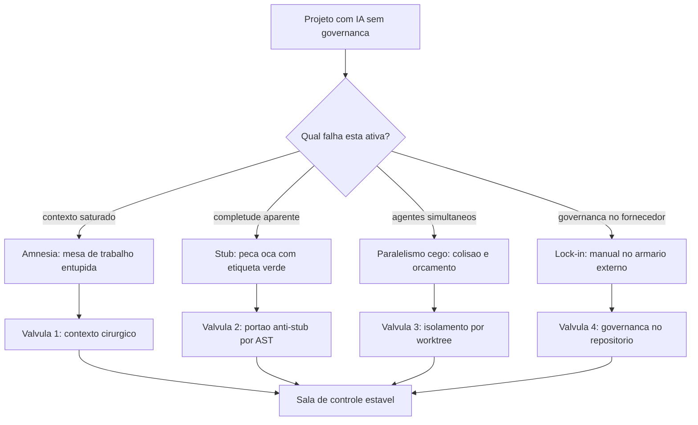

# Capítulo 3: A Crise do Desenvolvimento com IA: Os 4 Problemas Catastróficos

## 1. Introdução

No Capítulo 2, você aprendeu a nomear as peças — agente, harness, contexto, portão binário, stub, dependência fantasma. Aquele vocabulário existia para servir a uma finalidade específica: permitir que este capítulo dissecasse, com precisão cirúrgica, as quatro falhas estruturais que derrubam projetos de IA. Sem os nomes, este capítulo seria uma coleção de reclamações; com eles, ele vira diagnóstico.

Entre 2023 e 2025, a indústria viveu um ciclo completo de euforia e desencanto. Prometeu-se que a programação estava morta; entregou-se um parque de aplicações frágeis, faturas imprevisíveis e repositórios que ninguém consegue manter. Este capítulo mostra por que isso aconteceu — e por que a explicação correta não é "os modelos eram ruins". Ao final, você será capaz de identificar qual das quatro catástrofes está ativa no seu projeto, porque cada uma tem sintoma, custo e assinatura próprios.

## 2. Explica

### 2.1 Catástrofe 1: a amnésia e a poluição do contexto

A primeira catástrofe não tem nada a ver com inteligência. Ela é puramente física, e decorre de tratar a janela de contexto como se fosse memória persistente. A janela é mesa de trabalho, e mesa cheia produz um efeito mensurável: a capacidade do modelo de recuperar informação posicionada no meio de um contexto longo cai de forma acentuada em relação às posições extremas [3]. O estudo que formalizou o *lost in the middle* não descreve um defeito de um modelo específico; descreve uma característica da atenção em contextos extensos.

O sintoma prático é fácil de reconhecer. No início da sessão, o agente respeita suas convenções de nomenclatura; três horas depois, ele cria um segundo padrão de acesso a dados. Não é que ele "decidiu" mudar: a instrução original continua na conversa, mas perdeu peso relativo diante de dezenas de milhares de tokens de logs e código irrelevante. O mesmo mecanismo explica por que agentes passam a inventar dependências depois de sessões longas — o contexto saturado degrada a precisão factual e o modelo preenche lacunas com o que parece plausível [4].

O custo dessa catástrofe é duplo. O primeiro é o retrabalho: você paga duas vezes pelo mesmo código, uma na geração errada e outra na correção. O segundo é o custo de oportunidade da descoberta tardia — a inconsistência arquitetural descoberta na sexta-feira custa mais do que a descoberta na terça. E há um terceiro custo, silencioso e perverso: cada token de contexto inútil é reenviado a cada turno. A conta cresce de forma composta, não linear.

### 2.2 Catástrofe 2: a praga dos stubs e a alucinação funcional

A segunda catástrofe é a mais traiçoeira, porque ela se disfarça de sucesso. Modelos de linguagem são otimizados para produzir saídas plausíveis e bem-formadas; diante de uma tarefa complexa que exigiria dezenas de arquivos interligados, a saída estatisticamente mais provável é a aparência de completude. É por isso que o agente entrega classes com métodos que retornam `True` sem verificar nada, ou funções com corpo preenchido por comentários de pendência.

O ponto crítico é que esse comportamento passa por revisão humana superficial. O código está bem indentado, os nomes são razoáveis, o teste manual "funciona". O defeito só aparece em produção, quando a falha de validação deixa passar um valor inválido. E não é um problema marginal: medições de segurança em amostras de código gerado por IA encontraram vulnerabilidades do OWASP Top 10 em uma parcela expressiva dos casos, sem melhora relevante ao longo de sucessivos ciclos de teste [5] [6]. Estudos complementares sobre o tipo de falha apontam a mesma direção em dezenas de modelos avaliados [8].

Existe um agravante estrutural que merece destaque: o agente não sabe que está mentindo. Ele não tem acesso privilegiado à verdade sobre a funcionalidade que descreve. Sem uma verificação externa determinística — teste que executa, esquema que valida, análise sintática que inspeciona — não existe mecanismo interno que o impeça de entregar cascas. Confiar na "boa vontade" do modelo é confiar na ausência de qualquer pressão que o empurre na direção oposta.

### 2.3 Catástrofe 3: o paralelismo cego e o vácuo operacional

A terceira catástrofe nasceu de uma boa intuição aplicada sem infraestrutura. Ao perceber que uma tarefa grande poderia ser dividida, o desenvolvedor instintivo dispara múltiplos agentes em segundo plano — e colhe três classes de desastre.

A primeira é a colisão física. Dois agentes que editam o mesmo arquivo em diretórios compartilhados produzem um estado inviável de reconciliar: a última escrita vence, e a intenção da primeira se perde sem deixar rastro. A segunda é o esgotamento silencioso de orçamento. Um agente em laço de erro não sabe que está em laço; ele continua chamando a API, e sem teto declarado a conta cresce enquanto você dorme. A terceira, e a mais subestimada, é a perda de rastreabilidade: quando um enxame anônimo altera o repositório, ninguém consegue responder "qual decisão levou a este estado?" — e sem essa resposta, não existe auditoria possível.

Estudos sobre sistemas agênticos são explícitos quanto à necessidade de coordenação e observabilidade quando múltiplos agentes atuam sobre recursos compartilhados [9]. A literatura regulatória vai além: orientações oficiais para risco de IA generativa colocam rastreabilidade e supervisão humana entre os controles mínimos, justamente porque a irreversibilidade de certas ações cresce com o grau de autonomia concedido [16].

### 2.4 Catástrofe 4: a fragmentação e o aprisionamento de ferramenta

A quarta catástrofe é organizacional, e por isso a mais cara no longo prazo. Ela acontece quando a governança do projeto — as regras, os comandos, as convenções, os testes — mora dentro da convenção proprietária de um único aplicativo. Enquanto esse aplicativo serve, tudo parece bem. Quando ele muda de preço, muda o modelo padrão ou descontinua uma funcionalidade, o investimento acumulado vira refém.

Note que a fragmentação não exige uma troca explícita de fornecedor para causar dano. Ela se instala silenciosamente quando diferentes membros do time usam aplicativos distintos e cada um carrega um conjunto próprio de regras implícitas. O resultado é um repositório que se comporta de forma diferente dependendo de quem o abriu — e um agente que produz resultados inconsistentes sem que ninguém entenda o motivo.

A defesa é o princípio de supremacia agnóstica: regras, contratos e verificações residem no repositório, em formato neutro, e cada aplicativo é apenas um consumidor delas. Isso transforma a troca de ferramenta de migração em reconfiguração. E é exatamente o que a literatura de contexto recomenda quando descreve a governança da informação como disciplina explícita, e não como consequência acidental de escolhas de ferramenta [4].

## 3. Ilustra

Na sua **sala de controle**, as quatro catástrofes aparecem como quatro alarmes diferentes — e o erro clássico é desligar o alarme em vez de fechar a válvula.

O primeiro alarme é a bancada de trabalho entupida: papéis demais sobre a mesa, e o operário de plantão (o modelo) começa a ler só as bordas. O segundo é a peça oca: um componente entra na linha com a etiqueta verde e, ao ser instalado, descobre-se que estava vazio por dentro. O terceiro é o painel de comando operado por vários operários simultâneos sem escala de plantão: dois deles desligam e ligam o mesmo disjuntor em momentos diferentes. O quarto é o manual de operação guardado no armário de um fornecedor externo — útil enquanto o armário abre, inútil no dia em que ele fecha.



*Figura 3.1 — Os quatro alarmes da sala de controle e as válvulas que os fecham na raiz, em vez de silenciar o sinal.*

## 4. Técnica

### 4.1 A valva 2 em detalhe: portão anti-stub por árvore sintática

Detectar stubs por busca textual é frágil: `pass` aparece dentro de classes legítimas e comentários contêm a palavra "pendente" sem que haja pendência real. A inspeção correta é estrutural — percorrer a árvore sintática abstrata e avaliar o **corpo** de cada função, não o texto do arquivo.

```python
#!/usr/bin/env python3
# -*- coding: utf-8 -*-
"""Portao anti-stub: inspecao estrutural do corpo das funcoes via AST."""

import ast
import sys
from pathlib import Path
from typing import List, Tuple

IGNORAR = {".venv", "venv", "__pycache__", ".git", "scratch", "node_modules"}


class DetectorDeStubs(ast.NodeVisitor):
    def __init__(self) -> None:
        self.falhas: List[Tuple[int, str, str]] = []

    def _corpo_util(self, node: ast.FunctionDef) -> list:
        corpo = list(node.body)
        if corpo and isinstance(corpo[0], ast.Expr) and isinstance(
                corpo[0].value, ast.Constant) and isinstance(corpo[0].value.value, str):
            corpo = corpo[1:]
        return corpo

    def visit_FunctionDef(self, node: ast.FunctionDef) -> None:
        if any(isinstance(d, ast.Name) and d.id == "abstractmethod"
               for d in node.decorator_list):
            return
        corpo = self._corpo_util(node)
        if not corpo:
            self.falhas.append((node.lineno, node.name, "corpo vazio"))
        elif len(corpo) == 1:
            unico = corpo[0]
            if isinstance(unico, ast.Pass):
                self.falhas.append((node.lineno, node.name, "apenas 'pass'"))
            elif isinstance(unico, ast.Expr) and isinstance(unico.value, ast.Constant) \
                    and unico.value.value is Ellipsis:
                self.falhas.append((node.lineno, node.name, "apenas '...'"))
        self.generic_visit(node)


def verificar(caminho: Path) -> List[Tuple[int, str, str]]:
    try:
        arvore = ast.parse(caminho.read_text(encoding="utf-8"), filename=str(caminho))
    except SyntaxError as erro:
        return [(erro.lineno or 0, "SINTAXE", erro.msg or "erro de sintaxe")]
    detector = DetectorDeStubs()
    detector.visit(arvore)
    return detector.falhas


def arquivos_alvo(raiz: Path) -> List[Path]:
    return [p for p in raiz.rglob("*.py")
            if not IGNORAR.intersection(p.parts)]


def main() -> int:
    total = 0
    print("=" * 62)
    print("PORTAO ANTI-STUB — INSPECAO ESTRUTURAL POR AST")
    print("=" * 62)
    for arquivo in arquivos_alvo(Path(".")):
        for linha, funcao, motivo in verificar(arquivo):
            print(f"[BLOQUEIO] {arquivo}:{linha} funcao {funcao!r} -> {motivo}")
            total += 1
    print("-" * 62)
    if total == 0:
        print("[APROVADO] nenhuma casca de funcao detectada.")
        return 0
    print(f"[REPROVADO] {total} stub(s) proibido(s) — implemente ou remova.")
    return 1


if __name__ == "__main__":
    sys.exit(main())
```

### 4.2 A válvula 1 em detalhe: medindo o orçamento de contexto

Não existe disciplina de contexto sem medição. O trecho abaixo estima o custo relativo de cada turno e sinaliza quando o contexto passou do ponto em que a recuperação começa a degradar.

```json
{
  "orcamento_contexto": {
    "teto_por_turno": 8000,
    "teto_por_sessao": 80000,
    "prefixo_estavel": true,
    "cache_ttl": "5m",
    "politica_ao_exceder": "comprimir-saida-e-expurgar-historico"
  },
  "limites_de_agente": {
    "max_turnos_sem_checkpoint": 8,
    "max_repeticoes_de_erro": 2,
    "timeout_por_comando_s": 30
  }
}
```

### 4.3 Sessão real: o laço de erro que drena orçamento

O padrão abaixo é o modo de falha mais caro da catástrofe 3. Repare que nada no log parece catastrófico — apenas repetitivo. É a repetição sem teto que transforma um erro barato em prejuízo.

```console
$ python agente.py --tarefa "corrigir migracao"
[14:02:11] tentativa 1/∞ -> FAIL (coluna 'cpf' nao existe)
[14:02:19] tentativa 2/∞ -> FAIL (coluna 'cpf' nao existe)
[14:02:27] tentativa 3/∞ -> FAIL (coluna 'cpf' nao existe)
[14:02:35] tentativa 4/∞ -> FAIL (coluna 'cpf' nao existe)
^C
$ python agente.py --tarefa "corrigir migracao" --max-repeticoes 2 --timeout 30
[14:05:02] tentativa 1/∞ -> FAIL (coluna 'cpf' nao existe)
[14:05:10] tentativa 2/∞ -> FAIL (coluna 'cpf' nao existe)
[14:05:10] TETO ATINGIDO -> execucao interrompida; diagnostico devolvido ao operador
```

### 4.4 Tabela de diagnóstico rápido

Use a tabela para decidir qual válvula acionar primeiro. A ordem importa: comece sempre pelo sintoma mais barato de verificar.

| Sintoma | Catástrofe | Válvula | Evidência que confirma |
|---|---|---|---|
| Convenções mudam no meio da sessão | 1 — amnésia | Contexto cirúrgico + prefixo estável | Contagem de tokens por turno crescendo |
| Teste manual passa e produção falha | 2 — stub | Portão anti-stub por AST | Função com corpo só de `pass` |
| Import de pacote inexistente | 2 — stub | Verificação contra registro | Nome de pacote não resolve |
| Dois módulos fazem a mesma coisa | 3 — paralelismo | Isolamento por worktree | Dois autores no mesmo arquivo |
| Conta de API sobe sem entrega subir | 3 — paralelismo | Teto de repetição e de turnos | Log de retentativa idêntica |
| Migrar de ferramenta exige reescrever regras | 4 — lock-in | Governança no repositório | Regra só existe no aplicativo |

### 4.5 Verificando dependências fantasma antes do merge

Detectar nome de pacote inexistente não exige acesso à internet durante a verificação. A heurística abaixo compara os imports declarados no código com a lista de dependências realmente instaladas no ambiente — e trata divergência como bloqueio, não como aviso.

O detalhe importante é a direção da checagem. Verificar se um pacote instalado é usado é higiene de ambiente; verificar se um pacote **importado** existe é integridade de cadeia de suprimento. É a segunda que interessa aqui, porque é exatamente onde o código gerado por IA cria referências a nomes plausíveis que ninguém registrou.

```python
#!/usr/bin/env python3
# -*- coding: utf-8 -*-
"""Detector de dependencias fantasma: import declarado que nao existe no ambiente."""

import ast
import json
import sys
from importlib.util import find_spec
from pathlib import Path
from typing import Dict, List, Set

IGNORAR = {".venv", "venv", "__pycache__", ".git", "node_modules", "scratch"}

# Modulos da biblioteca padrao e locais nunca sao dependencias externas
INTERNOS = {"__future__", "os", "sys", "re", "json", "ast", "pathlib", "typing",
            "dataclasses", "subprocess", "shutil", "sqlite3", "hashlib", "zipfile",
            "importlib", "unicodedata", "collections", "itertools", "statistics"}


def modulos_importados(arquivo: Path) -> Set[str]:
    try:
        arvore = ast.parse(arquivo.read_text(encoding="utf-8"))
    except SyntaxError:
        return set()
    nomes: Set[str] = set()
    for no in ast.walk(arvore):
        if isinstance(no, ast.Import):
            nomes.update(alias.name.split(".")[0] for alias in no.names)
        elif isinstance(no, ast.ImportFrom) and no.module and no.level == 0:
            nomes.add(no.module.split(".")[0])
    return nomes


def resolve(nome: str) -> bool:
    if nome in INTERNOS:
        return True
    try:
        return find_spec(nome) is not None
    except (ImportError, ValueError, ModuleNotFoundError):
        return False


def varrer(raiz: Path) -> Dict[str, List[str]]:
    fantasma: Dict[str, List[str]] = {}
    for arquivo in raiz.rglob("*.py"):
        if IGNORAR.intersection(arquivo.parts):
            continue
        for nome in sorted(modulos_importados(arquivo)):
            if not resolve(nome):
                fantasma.setdefault(nome, []).append(str(arquivo))
    return fantasma


def main() -> int:
    raiz = Path(sys.argv[1]) if len(sys.argv) > 1 else Path(".")
    fantasma = varrer(raiz)
    print("=" * 62)
    print("DETECTOR DE DEPENDENCIAS FANTASMA")
    print("=" * 62)
    if not fantasma:
        print("[APROVADO] todo import declarado resolve no ambiente.")
        return 0
    for nome, arquivos in sorted(fantasma.items()):
        print(f"[BLOQUEIO] pacote inexistente: {nome} ({len(arquivos)} arquivo(s))")
        for arquivo in arquivos[:3]:
            print(f"   -> {arquivo}")
    print("-" * 62)
    print(json.dumps({"pacotes_fantasma": len(fantasma)}, ensure_ascii=False))
    print("[REPROVADO] exit 1 — remova a referencia ou declare a dependencia.")
    return 1


if __name__ == "__main__":
    sys.exit(main())
```

Repare no efeito prático da direção de verificação escolhida. Uma dependência declarada e não usada apenas engorda o ambiente; uma dependência **usada e não declarada** é uma porta aberta — porque o nome está livre para ser registrado por outra pessoa. A segunda categoria é a que o detector persegue.

### 4.6 Roteiro de contenção em cinco passos

1. **Meça** o contexto por turno antes de qualquer outra coisa; sem número, a discussão vira opinião.
2. **Instale** o portão anti-stub no gancho de pré-commit, para que a casca nunca chegue ao histórico.
3. **Isole** cada tarefa paralela em diretório de trabalho próprio, com descarte reversível em caso de reprovação.
4. **Teto** toda execução autônoma com limite de repetição, limite de turnos e tempo máximo por comando.
5. **Mova** a governança para o repositório e trate cada aplicativo como consumidor descartável dela.

## 5. Aplica

### A cena que quase todo time vive

Você assume a manutenção de um serviço entregue em três semanas por uma equipe que usava IA intensamente. A primeira semana é tranquila. Na segunda, você descobre que existem duas implementações de cálculo de frete: uma usa tabela de faixas, outra usa fórmula contínua. Os testes passam em ambas, porque a suíte cobre apenas o caminho feliz. Você pergunta ao time qual é a correta e recebe a resposta que já esperava: "as duas vieram do agente".

Reconstrua o diagnóstico. A duplicação não é fruto de decisão arquitetural: é o efeito acumulado da catástrofe 1. A sessão que gerou o primeiro cálculo estava com o contexto limpo e sabia que existia um módulo de frete. A sessão que gerou o segundo estava saturada de logs e não recuperou essa informação — o efeito de perda no meio operando em produção [3]. Se alguém tivesse medido o tamanho do contexto por turno, o sintoma apareceria como uma curva, e não como um mistério.

A correção que funciona não é "reescrever tudo com mais cuidado". É inserir três válvulas na ordem certa: primeiro, um contrato declarado de qual módulo é a fonte da verdade para cálculo de frete; segundo, um portão que falha quando dois módulos exportam a mesma responsabilidade; terceiro, isolamento por diretório de trabalho para que nenhum agente futuro opere sobre um estado ambíguo. Só depois disso vale a pena discutir qual fórmula está certa — porque a pergunta "qual está certa" não tem resposta em um sistema que aceita duas ao mesmo tempo.

### Onde isso escala e onde quebra

Cada válvula tem um ponto de saturação. O portão anti-stub escala até o limite de tempo aceitável no pré-commit — alguns segundos em bases médias; acima disso, ele precisa migrar para a esteira assíncrona e deixar no gancho apenas as verificações mais baratas. O teto de repetição escala até o ponto em que a tarefa realmente exige exploração iterativa; para tarefas de investigação genuína, um teto baixo demais aborta trabalho legítimo antes de ele chegar ao resultado.

A válvula mais delicada é a de contexto. Reduzir contexto demais remove justamente a informação que evita a duplicação; reduzir de menos mantém o ruído que a causa. O contorno prático é separar **contexto estável** (regras, contratos, convenções) de **contexto volátil** (logs, tentativas, diffs descartados) e manter só o primeiro permanentemente. E existe uma condição em que nenhuma dessas válvulas compensa: projetos cujo artefato é descartável em dias. Nesse caso, instrumentar governança custa mais do que o valor gerado — e a decisão honesta é assumir o risco, não fingir proteção.

### Armadilhas comuns

- Tratar sintoma como causa. "O agente mudou de convenção" é sintoma; "o contexto saturou" é causa. Corrigir o sintoma gera retrabalho eterno.
- Confiar em revisão manual como portão. Revisão humana é o filtro certo para intenção e o filtro errado para completude mecânica.
- Rodar agentes paralelos sem isolamento físico. Sem diretório próprio, o paralelismo produz conflito, não velocidade.
- Deixar execução autônoma sem teto de repetição e de turnos. O laço de erro é o modo de falha mais caro e mais fácil de prevenir.
- Guardar a governança na ferramenta. Regra que só existe dentro de um aplicativo é regra que expira com o aplicativo.

## 6. Conclusão

Neste capítulo você dissecou as quatro catástrofes que explicam a crise real do desenvolvimento com IA. A primeira é física: contexto saturado degrada a recuperação de instruções. A segunda é comportamental: modelos produzem aparência de completude, e sem verificação estrutural essa aparência chega à produção. A terceira é operacional: paralelismo sem isolamento gera colisão, gasto silencioso e perda de rastreabilidade. A quarta é organizacional: governança que mora na ferramenta torna o projeto refém dela.

Você também viu que a resposta intuitiva quase sempre piora o quadro. Trocar de modelo não corrige contexto saturado. Pedir "por favor, não use stubs" não substitui um portão binário. E a evidência de mercado confirma o diagnóstico: a adoção de IA nas equipes cresceu enquanto a confiança declarada na saída caiu — hoje, 46% dos desenvolvedores pesquisados dizem desconfiar ativamente da exatidão das ferramentas, contra 33% que confiam, e apenas uma fração mínima declara confiança alta [1] [2].

**Desafio:** escolha um projeto ativo e escreva, para cada uma das quatro catástrofes, a evidência concreta que você tem em mãos — um log, um arquivo duplicado, uma conta, um commit. Se você não conseguir apresentar evidência para alguma delas, você não sabe se ela está ativa. E o que não é medido não é governado.

Com o problema mapeado em detalhe, o Capítulo 4 apresenta a resposta estrutural: a Constituição Mestre com as dez leis inegociáveis que transformam cada uma dessas válvulas em regra permanente do projeto.

## 7. Referências Bibliográficas

[1] STACK OVERFLOW. *2025 Developer Survey — AI*. Disponível em: https://survey.stackoverflow.co/2025/ai. Acesso em: 12 set. 2026.
[2] DORA / GOOGLE CLOUD. *State of AI-assisted Software Development 2025*. Disponível em: https://dora.dev/dora-report-2025/. Acesso em: 12 set. 2026.
[3] LIU, Nelson F. et al. *Lost in the Middle: How Language Models Use Long Contexts*. In: Transactions of the Association for Computational Linguistics. 2024. Disponível em: https://arxiv.org/abs/2307.03172. Acesso em: 12 set. 2026.
[4] MEI, Lingrui et al. *A Survey of Context Engineering for Large Language Models*. In: arXiv. 2025. Disponível em: https://arxiv.org/abs/2507.13334. Acesso em: 12 set. 2026.
[5] VERACODE. *2025 GenAI Code Security Report: AI-Generated Code Security Risks*. Disponível em: https://www.veracode.com/blog/ai-generated-code-security-risks/. Acesso em: 12 set. 2026.
[6] CLOUD SECURITY ALLIANCE. *Vibe Coding's Security Debt: The AI-Generated CVE Surge*. Disponível em: https://labs.cloudsecurityalliance.org/research/csa-research-note-ai-generated-code-vulnerability-surge-2026/. Acesso em: 12 set. 2026.
[7] TRAXTECH. *20% of AI-Generated Code Dependencies Don't Exist, Creating Supply Chain Security Risks*. Disponível em: https://www.traxtech.com/blog/20-of-ai-generated-code-dependencies-dont-exist-creating-supply-chain-security-risks. Acesso em: 12 set. 2026.
[8] ENDOR LABS. *The Most Common Security Vulnerabilities in AI-Generated Code*. Disponível em: https://www.endorlabs.com/learn/the-most-common-security-vulnerabilities-in-ai-generated-code. Acesso em: 12 set. 2026.
[9] ALI, Mohamad Abou; DORNAIKA, Fadi; CHARAFEDDINE, Jinan. *Agentic AI: a comprehensive survey of architectures, applications, and future directions*. In: Artificial Intelligence Review. 2025. Disponível em: https://doi.org/10.1007/s10462-025-11422-4. Acesso em: 12 set. 2026.
[10] MORAMPUDI, Abhishek et al. *A survey of reward hacking in agentic large language model systems*. In: Discover Artificial Intelligence. 2026. Disponível em: https://link.springer.com/article/10.1007/s44163-026-01980-z. Acesso em: 12 set. 2026.
[11] METR. *Recent Frontier Models Are Reward Hacking*. Disponível em: https://metr.org/blog/2025-06-05-recent-reward-hacking/. Acesso em: 12 set. 2026.
[12] *Measuring Reward Hacking in Long-Horizon Coding Agents*. In: arXiv. 2026. Disponível em: https://arxiv.org/html/2605.21384v1. Acesso em: 12 set. 2026.
[13] GE, Y. T. et al. *A Survey of Vibe Coding with Large Language Models*. In: arXiv. 2025. Disponível em: http://arxiv.org/abs/2510.12399. Acesso em: 12 set. 2026.
[14] RAY, Partha Pratim. *A Review on Vibe Coding: Fundamentals, State-of-the-art, Challenges and Future Directions*. 2025. Disponível em: https://doi.org/10.36227/techrxiv.174681482.27435614/v1. Acesso em: 12 set. 2026.
[15] SCALE LABS. *SWE-Bench Pro (Public Dataset) — Leaderboard*. Disponível em: https://labs.scale.com/leaderboard/swe_bench_pro_public. Acesso em: 12 set. 2026.
[16] NATIONAL INSTITUTE OF STANDARDS AND TECHNOLOGY. *Artificial Intelligence Risk Management Framework: Generative Artificial Intelligence Profile (NIST AI 600-1)*. Disponível em: https://nvlpubs.nist.gov/nistpubs/ai/NIST.AI.600-1.pdf. Acesso em: 12 set. 2026.
[17] CHECKMARX. *11 Emerging AI Security Risks with MCP (Model Context Protocol)*. Disponível em: https://checkmarx.com/zero-post/11-emerging-ai-security-risks-with-mcp-model-context-protocol/. Acesso em: 12 set. 2026.
[18] ANTHROPIC. *Prompt Caching — Claude Platform Docs*. Disponível em: https://platform.claude.com/docs/en/build-with-claude/prompt-caching. Acesso em: 12 set. 2026.
[19] GITHUB. *Octoverse 2025: The state of open source*. Disponível em: https://octoverse.github.com/. Acesso em: 12 set. 2026.
[20] FOWLER, Martin. *Patterns of Enterprise Application Architecture*. Boston: Addison-Wesley, 2002. Disponível em: https://martinfowler.com/books/eaa.html. Acesso em: 12 set. 2026.
