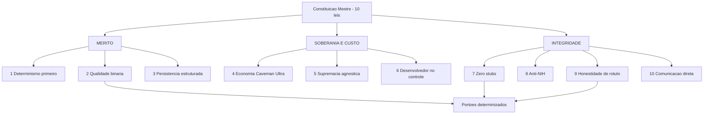

# Capítulo 4: A Constituição Mestre: As 10 Leis Inegociáveis

## 1. Introdução

No Capítulo 3, você viu as quatro catástrofes em detalhe: contexto saturado, completude falsa, paralelismo cego e aprisionamento de ferramenta. Ficou claro que cada uma tem uma válvula de correção — mas válvula aberta por decisão individual não é governança, é heroísmo. Este capítulo transforma heroísmo em lei.

A pergunta central aqui é prática: como garantir que a correção sobreviva à troca de sessão, à troca de modelo e à troca de pessoa? A resposta é uma constituição — um conjunto pequeno de regras inegociáveis, escritas no repositório e fiscalizadas por script. Ao final, você conhecerá as dez leis que sustentam toda a arquitetura desta obra e saberá qual catástrofe cada uma neutraliza.

## 2. Explica

### 2.1 Por que rigidez amplia capacidade

Existe uma intuição difundida de que liberdade produz criatividade. Em engenharia agêntica, a relação se inverte: a criatividade do agente é amplificada pela rigidez dos seus limites operacionais. Isso não é filosofia motivacional — é consequência de como a busca estatística funciona. Um modelo com espaço de decisão enorme explora um espaço enorme de soluções plausíveis, e a maioria delas é incompatível com o restante do sistema. Restringir o espaço de decisão não limita a inteligência; limita o ruído sobre o qual a inteligência precisa operar.

A analogia arquitetural é direta: normas de construção civil permitem que se construam arranha-céus. Sem norma, cada construtor reinventaria critérios de carga e nenhum prédio alto seria seguro o bastante para ser aprovado. Em software, a mesma lógica se aplica: a norma que torna um sistema grande sustentável não é a que sugere boas práticas, e sim a que **impede** a prática incompatível de entrar no histórico [17].

### 2.2 As leis de mérito: determinismo, binariedade e persistência

As três primeiras leis tratam do que significa "estar correto".

A **Lei 1 — Determinismo em Primeiro Lugar** estabelece que nenhum modelo probabilístico deve ser chamado para tarefas que um script determinístico resolve. Formatar data, validar esquema, renomear identificador, verificar se um campo existe: tudo isso é cálculo, não cognição. Usar o modelo aqui é caro e mais frágil, porque a mesma entrada pode produzir saídas diferentes. O modelo entra onde há ambiguidade genuína — síntese, interpretação, escolha entre alternativas plausíveis.

A **Lei 2 — Qualidade Binária** determina que toda verificação relevante devolve um resultado sem meio-termo: código de saída zero aprova, código de saída um bloqueia. Isso remove o julgamento humano do caminho crítico e, mais importante, remove a negociação. A prática da entrega contínua já demonstrava que verificação automática é o que permite ritmo sem aumento proporcional de defeito [4]. A novidade da engenharia agêntica é a escala: sem binariedade, um agente que gera dezenas de entregas por hora transforma qualquer humano em gargalo instantaneamente.

A **Lei 3 — Persistência Estruturada** exige que estado de sessão, decisões arquiteturais e histórico de mudanças vivam em arquivos auditáveis — banco local, registros estruturados ou documentação versionada. Nada que importe pode existir apenas na memória volátil da conversa. Isso decorre diretamente da catástrofe 1: se o contexto é mesa de trabalho, ele não é cofre. O banco local em modo de journaling por write-ahead log é a implementação típica, porque permite leitura concorrente enquanto a esteira escreve [9].

### 2.3 As leis de economia e soberania

As três leis seguintes tratam de custo e independência.

A **Lei 4 — Economia Extrema (Tríade Caveman Ultra)** ataca as três frentes do desperdício: raciocínio interno telegráfico, saída densa em português técnico e expurgo de contexto entre fases. A base teórica é antiga e sólida: entropia de informação mede a incerteza resolvida por símbolo transmitido, e símbolo que não resolve incerteza é desperdício [5]. A alavanca financeira é concreta — reaproveitar o prefixo estável de um prompt corta até 90% do custo dos tokens de entrada e até 85% da latência em prompts longos [7].

A **Lei 5 — Supremacia Agnóstica** determina que todo componente, regra e especificação seja independente de sistema operacional, de harness e de provedor de modelo. Governança que mora na ferramenta é governança com prazo de validade. Manter a fonte da verdade em formato neutro e sincronizá-la para cada ambiente converte migração em reconfiguração.

A **Lei 6 — Desenvolvedor no Controle** proíbe subagentes invisíveis que alterem arquivos em segundo plano sem supervisão. A execução é sequencial, transparente e com pontos de verificação. Note que a proibição não é tecnofobia: é reconhecimento de que a irreversibilidade de uma ação cresce com a autonomia concedida, e que rastreabilidade e supervisão humana figuram entre os controles mínimos recomendados para sistemas de IA generativa [2].

### 2.4 As leis de integridade

As quatro leis finais tratam de honestidade.

A **Lei 7 — Tolerância Zero a Stubs** proíbe implementações simuladas, blocos vazios, retornos fictícios e marcadores de pendência em código entregue. A justificativa tem número: amostras de código gerado por IA introduziram vulnerabilidades do OWASP Top 10 em cerca de 45% dos casos, taxa que não melhorou entre ciclos de teste [1]. A Lei 7 é a barreira que impede que essa taxa estatística chegue ao repositório.

A **Lei 8 — Princípio Anti-NIH** (*Not Invented Here*) exige justificativa escrita antes de construir um mecanismo novo e genérico. Se a biblioteca padrão ou uma ferramenta consolidada resolve, não invente. O custo de manutenção de código próprio é maior do que parece, e ele compete por atenção com o código que de fato diferencia o produto.

A **Lei 9 — Honestidade de Rótulo** proíbe alegar segurança, desempenho ou cobertura maiores do que os testes executados conseguem provar. É a lei que sustenta a credibilidade de todos os relatórios. Sem ela, o portão binário vira teatro: tudo passa, porque o critério foi ajustado até passar. A literatura sobre manipulação de recompensa mostra exatamente esse padrão em agentes de código, com modelos otimizando a métrica em vez da tarefa [13] [14].

A **Lei 10 — Comunicação Direta e Densa** elimina preâmbulo, saudação e reafirmação do pedido. A saída é organizada, tabelada e específica. A justificativa é tripla: reduz custo, reduz latência e reduz ruído de contexto para quem lê o resultado depois.

## 3. Ilustra

Na sua **sala de controle**, as dez leis estão afixadas na parede — e não são decoração, são o regulamento de operação. Cada painel tem suas leis: o CONTEXTO abriga densidade, persistência e honestidade de rótulo; o HARNESS abriga qualidade binária, soberania e desenvolvedor no controle; o MOTOR abriga determinismo e economia; as FERRAMENTAS abrigam a lei anti-stub e o princípio anti-NIH.

O detalhe que distingue uma constituição de um pôster motivacional é quem fiscaliza. Na sua sala, cada lei tem um **fiscal automático** — um script que roda sem que ninguém precise lembrar dele. Regra sem fiscal é sugestão; regra com fiscal é contrato.



*Figura 4.1 — As dez leis agrupadas por finalidade: mérito, soberania e integridade — e os portões que as fiscalizam mecanicamente.*

## 4. Técnica

### 4.1 A constituição como arquivo versionado

O primeiro artefato de qualquer projeto governado é o arquivo de regras na raiz. Ele é curto de propósito: leis que não cabem em uma leitura não são leis, são ruído.

```markdown
# Governança Canônica do Projeto

## Leis inegociáveis
1. Determinismo primeiro: resolve com script antes de chamar modelo.
2. Qualidade binária: exit 0 aprova; exit 1 bloqueia. Sem meio-termo.
3. Persistência estruturada: estado e decisões em arquivo auditável.
4. Economia severa: raciocínio telegráfico, saída densa, expurgo entre fases.
5. Supremacia agnóstica: nenhuma regra depende de harness ou fornecedor.
6. Desenvolvedor no controle: proibido agente headless invisível.
7. Zero stubs: proibido corpo vazio, retorno fictício ou pendência.
8. Anti-NIH: justificar por escrito antes de construir mecanismo genérico.
9. Honestidade de rótulo: não alegar mais do que o teste provou.
10. Comunicação direta: sem preâmbulo, sem saudação, sem repetição.
```

### 4.2 Leis 2 e 9 em código: o fiscal da constituição

Uma lei sem fiscal não existe. O script abaixo implementa a fiscalização das leis 3 e 9 — persistência estruturada e honestidade de rótulo — e demonstra o padrão de saída binária da lei 2.

```python
#!/usr/bin/env python3
# -*- coding: utf-8 -*-
"""Fiscal da constituicao: leis 3 (persistencia) e 9 (honestidade de rotulo)."""

import re
import sys
from pathlib import Path
from typing import List, Tuple

# Lei 9 — vocabulario que afirma mais do que qualquer teste pode provar
TERMOS_INFLADOS = (
    r"\b100%\s+seguro\b",
    r"\btotalmente\s+blindado\b",
    r"\bsem\s+qualquer\s+bug\b",
    r"\babsolutamente\s+(?:perfeito|seguro)\b",
)

# Lei 3 — diretorios cuja ausencia indica estado nao auditavel
DIRETORIOS_PERSISTENTES = ("docs", "gates", "componentes")

EXEMPLO_INFLADO = "Este modulo e 100% seguro em qualquer cenario de carga."


def auditar_honestidade(docs: List[Path]) -> Tuple[bool, List[str]]:
    violacoes: List[str] = []
    padroes = [re.compile(p, re.IGNORECASE) for p in TERMOS_INFLADOS]
    for doc in docs:
        texto = doc.read_text(encoding="utf-8", errors="ignore")
        for padrao in padroes:
            achado = padrao.search(texto)
            if achado:
                violacoes.append(f"{doc}: afirmacao inflada -> {achado.group(0)!r}")
    return (not violacoes), violacoes


def auditar_persistencia(raiz: Path) -> Tuple[bool, List[str]]:
    faltando = [d for d in DIRETORIOS_PERSISTENTES if not (raiz / d).is_dir()]
    return (not faltando), [f"diretorio persistente ausente: {d}" for d in faltando]


def verificar_rotulo_isolado(texto: str) -> bool:
    """Lei 9 aplicada a um unico trecho — usado antes de publicar relatorio."""
    return not any(re.search(p, texto, re.IGNORECASE) for p in TERMOS_INFLADOS)


def main() -> int:
    raiz = Path(".")
    print("=" * 62)
    print("FISCAL DA CONSTITUICAO — LEIS 2, 3 E 9")
    print("=" * 62)

    ok_persistencia, erros_p = auditar_persistencia(raiz)
    print(f"[LEI 3] {'OK' if ok_persistencia else 'BLOQUEIO'} persistencia estruturada")

    docs = list((raiz / "docs").rglob("*.md")) if (raiz / "docs").is_dir() else []
    ok_rotulo, erros_r = auditar_honestidade(docs)
    print(f"[LEI 9] {'OK' if ok_rotulo else 'BLOQUEIO'} honestidade de rotulo "
          f"({len(docs)} documento(s) auditado(s))")

    if not verificar_rotulo_isolado(EXEMPLO_INFLADO):
        print("[LEI 9] autoteste: detector reconhece afirmacao inflada")
    else:
        print("[LEI 9] FALHA no autoteste do detector")
        return 1

    for erro in erros_p + erros_r:
        print(f"  -> {erro}")

    print("-" * 62)
    if ok_persistencia and ok_rotulo:
        print("[APROVADO] exit 0 — constituicao respeitada.")
        return 0
    print("[REPROVADO] exit 1 — violacao constitucional detectada.")
    return 1


if __name__ == "__main__":
    sys.exit(main())
```

### 4.3 Os dez fiscais declarados em configuração

Repare que cada lei aponta para um fiscal concreto. Essa tabela de configuração é o que impede que a constituição vire lista de desejos: se uma lei não tem fiscal, ela está aberta por decisão explícita.

```yaml
constituicao:
  leis:
    - id: 1
      nome: Determinismo em primeiro lugar
      fiscal: revisao-humana-no-plano
    - id: 2
      nome: Qualidade binaria
      fiscal: gates/exit-code.sh
    - id: 3
      nome: Persistencia estruturada
      fiscal: gates/fiscal-constituicao.py
    - id: 4
      nome: Economia severa de tokens
      fiscal: gates/orcamento-contexto.py
    - id: 5
      nome: Supremacia agnostica
      fiscal: gates/checar-acoplamento.py
    - id: 6
      nome: Desenvolvedor no controle
      fiscal: gates/bloquear-headless.py
    - id: 7
      nome: Zero stubs
      fiscal: gates/anti-stub-ast.py
    - id: 8
      nome: Anti-NIH
      fiscal: revisao-humana-no-plano
    - id: 9
      nome: Honestidade de rotulo
      fiscal: gates/fiscal-constituicao.py
    - id: 10
      nome: Comunicacao direta
      fiscal: gates/ritmo-de-saida.py
```

### 4.4 Sessão de fiscalização em operação

O comportamento esperado de um fiscal é falar pouco e bloquear sem hesitar. O diálogo abaixo mostra o padrão completo: aprovação, bloqueio, diagnóstico e correção.

```console
$ python gates/fiscal-constituicao.py
==============================================================
FISCAL DA CONSTITUICAO — LEIS 2, 3 E 9
==============================================================
[LEI 3] OK persistencia estruturada
[LEI 9] BLOQUEIO honestidade de rotulo (12 documento(s) auditado(s))
  -> docs/relatorio-carga.md: afirmacao inflada -> '100% seguro'
--------------------------------------------------------------
[REPROVADO] exit 1 — violacao constitucional detectada.

$ sed -i 's/100% seguro/resiliente a falha de nos, ver secao 4/' docs/relatorio-carga.md
$ python gates/fiscal-constituicao.py
--------------------------------------------------------------
[APROVADO] exit 0 — constituicao respeitada.
```

### 4.5 Tabela de decisão: qual lei invocar primeiro

Quando o projeto quebra, a tentação é reescrever a constituição inteira. Quase sempre uma lei basta. Use a tabela para localizar a lei pelo sintoma.

| Sintoma | Lei aplicável | Primeira ação |
|---|---|---|
| Conta de API alta com pouca entrega | Lei 4 | Medir tokens por turno e fixar orçamento |
| Código aprovado quebra em produção | Lei 7 | Instalar portão anti-stub por AST |
| Comportamento muda conforme o aplicativo usado | Lei 5 | Mover regras para o repositório |
| Agente altera arquivo sem registro | Lei 6 | Exigir execução transparente e checkpoint |
| Relatório afirma cobertura não medida | Lei 9 | Rodar fiscal de honestidade de rótulo |
| Dependência própria substituindo biblioteca padrão | Lei 8 | Exigir justificativa escrita antes do merge |
| Mesma entrada produz saída diferente | Lei 1 | Trocar chamada de modelo por script determinístico |
| Sessão longa degrada aderência às regras | Lei 4 e Lei 3 | Expurgar contexto e persistir decisão em arquivo |

### 4.6 Roteiro de adoção da constituição em cinco passos

1. **Escreva** as dez leis em um único arquivo na raiz, com uma frase cada — sem parágrafos explicativos.
2. **Atribua** a cada lei um fiscal: script determinístico ou ponto de revisão humana explícito, nunca ambos nem nenhum.
3. **Instale** os fiscais automatizáveis no gancho de pré-commit, na ordem do mais rápido para o mais lento.
4. **Bloqueie** o merge quando qualquer fiscal retornar código diferente de zero; corrija a causa, nunca contorne o teste.
5. **Revise** a constituição a cada ciclo de entrega, mas trate cada alteração como mudança de lei — com justificativa registrada.

## 5. Aplica

### A cena que quase todo time vive

Você lidera a migração de um serviço crítico. Na véspera da entrega, o agente responsável por gerar a camada de acesso a dados entrega três arquivos que passam em todos os testes. Você aprova. Em produção, um campo opcional chega nulo e o serviço derruba. A investigação revela que a função de validação era um stub: retornava verdadeiro sem inspecionar nada.

Reconstrua o caminho do erro. O sintoma não foi "o agente errou"; o sintoma foi "não havia fiscal para a Lei 7". O teste que passou era o teste que o próprio agente escreveu — e um teste escrito por quem produziu o defeito mede aderência à expectativa, não correção [14]. A revisão humana, por sua vez, focou no que humano revisa bem: nome de variável, organização de arquivo, intenção geral. Ninguém inspeciona o corpo de trinta funções procurando por um `return True` no meio.

A correção, na semana seguinte, tem forma de lei e forma de script. Primeiro, a Lei 7 vira portão no pré-commit: nenhuma função com corpo vazio ou retorno constante passa. Segundo, a Lei 9 vira fiscal de relatório: o documento de entrega não pode afirmar cobertura sem apontar o comando que a mediu. Terceiro, a Lei 2 vira regra de esteira: um único fiscal vermelho interrompe o merge. Note que nenhuma das três ações envolveu trocar o modelo — porque o modelo não era o problema. O que faltava era a lei e o fiscal.

### Onde isso escala e onde quebra

Uma constituição curta escala. Dez leis cabem na cabeça de qualquer pessoa em um dia, e os fiscais rodam em segundos. O ponto de ruptura aparece em dois lugares distintos.

O primeiro é o número de leis. Acima de duas ou três dezenas, a constituição deixa de ser lida e passa a competir com o código pela atenção — e a pesquisa sobre contexto é clara quanto ao efeito de excesso de instrução simultânea [6]. O contorno é hierarquia: um núcleo de leis inegociáveis na raiz e regulamentos de módulo dentro de cada módulo.

O segundo ponto de ruptura é o custo dos fiscais no caminho crítico. Um fiscal que leva trinta segundos por commit transforma a experiência de desenvolvimento em espera, e a equipe encontra formas de contorná-lo. Nesse caso, o contorno correto não é desligar o fiscal, e sim movê-lo: verificações baratas no gancho de pré-commit, verificações caras na esteira assíncrona, com o resultado reportado como bloqueio de integração.

E existe a condição de contorno definitiva: **um projeto de vida curta não precisa de constituição**. Se o código será descartado antes que qualquer uma dessas catástrofes tenha tempo de se manifestar, o custo de escrever leis e fiscais supera o benefício. Assumir isso explicitamente é mais honesto do que manter uma constituição decorativa que ninguém cumpre — e a Lei 9, aplicada ao próprio processo, proíbe exatamente esse tipo de fingimento.

### Armadilhas comuns

- Escrever leis sem fiscais. Lei sem fiscal é sugestão, e sugestão não sobrevive à pressão de prazo.
- Confundir quantidade com cobertura. Vinte leis inúteis protegem menos do que sete leis fiscalizadas.
- Desligar o fiscal para liberar a entrega. Isso inverte a relação: o fiscal existe justamente para o momento em que a pressão para ignorá-lo é maior.
- Colocar fiscal caro no gancho rápido. O custo de espera produz evasão, e evasão produz portão desativado.
- Tratar a constituição como imutável. Ela precisa evoluir, mas toda alteração é mudança de lei e merece justificativa registrada [3].

## 6. Conclusão

Neste capítulo você conheceu as dez leis que sustentam a governança agêntica, agrupadas por finalidade. As leis de mérito — determinismo primeiro, qualidade binária e persistência estruturada — definem o que significa estar correto. As de soberania e custo — economia severa, supremacia agnóstica e desenvolvedor no controle — protegem orçamento e independência. As de integridade — zero stubs, anti-NIH, honestidade de rótulo e comunicação direta — protegem a verdade do relatório.

Você viu também o princípio que separa constituição de pôster: cada lei precisa de um fiscal, e cada fiscal precisa devolver saída binária. A evidência que abre este capítulo justifica a Lei 7 com número — cerca de 45% das amostras de código gerado por IA apresentaram vulnerabilidades do OWASP Top 10, sem melhora entre gerações [1]. Um portão binário é o que impede que essa estatística se converta em incidente no seu repositório.

**Desafio:** escreva as dez leis do seu projeto em uma folha e marque, ao lado de cada uma, o nome do fiscal. Se alguma ficar sem fiscal, você acabou de identificar a lei que será violada primeiro sob pressão de prazo.

Com a lei estabelecida, o Capítulo 5 abre a Parte II e apresenta o mapa completo das quatro camadas — a arquitetura que transforma essas dez regras em quatro painéis operacionais independentes e verificáveis.

## 7. Referências Bibliográficas

[1] VERACODE. *2025 GenAI Code Security Report: AI-Generated Code Security Risks*. Disponível em: https://www.veracode.com/blog/ai-generated-code-security-risks/. Acesso em: 12 set. 2026.
[2] NATIONAL INSTITUTE OF STANDARDS AND TECHNOLOGY. *Artificial Intelligence Risk Management Framework: Generative Artificial Intelligence Profile (NIST AI 600-1)*. Disponível em: https://nvlpubs.nist.gov/nistpubs/ai/NIST.AI.600-1.pdf. Acesso em: 12 set. 2026.
[3] DORA / GOOGLE CLOUD. *State of AI-assisted Software Development 2025*. Disponível em: https://dora.dev/dora-report-2025/. Acesso em: 12 set. 2026.
[4] HUMBLE, Jez; FARLEY, David. *Continuous Delivery: Reliable Software Releases through Build, Test, and Deployment Automation*. Addison-Wesley, 2010. Disponível em: https://continuousdelivery.com/. Acesso em: 12 set. 2026.
[5] SHANNON, Claude E. *A Mathematical Theory of Communication*. Bell System Technical Journal, 1948. Disponível em: https://doi.org/10.1002/j.1538-7305.1948.tb01338.x. Acesso em: 12 set. 2026.
[6] MEI, Lingrui et al. *A Survey of Context Engineering for Large Language Models*. In: arXiv. 2025. Disponível em: https://arxiv.org/abs/2507.13334. Acesso em: 12 set. 2026.
[7] ANTHROPIC. *Prompt Caching — Claude Platform Docs*. Disponível em: https://platform.claude.com/docs/en/build-with-claude/prompt-caching. Acesso em: 12 set. 2026.
[8] GIT. *git-worktree Documentation*. Disponível em: https://git-scm.com/docs/git-worktree. Acesso em: 12 set. 2026.
[9] SQLITE. *Write-Ahead Logging*. Disponível em: https://www.sqlite.org/wal.html. Acesso em: 12 set. 2026.
[10] STACK OVERFLOW. *2025 Developer Survey — AI*. Disponível em: https://survey.stackoverflow.co/2025/ai. Acesso em: 12 set. 2026.
[11] GITHUB. *Octoverse 2025: The state of open source*. Disponível em: https://octoverse.github.com/. Acesso em: 12 set. 2026.
[12] TRAXTECH. *20% of AI-Generated Code Dependencies Don't Exist, Creating Supply Chain Security Risks*. Disponível em: https://www.traxtech.com/blog/20-of-ai-generated-code-dependencies-dont-exist-creating-supply-chain-security-risks. Acesso em: 12 set. 2026.
[13] METR. *Recent Frontier Models Are Reward Hacking*. Disponível em: https://metr.org/blog/2025-06-05-recent-reward-hacking/. Acesso em: 12 set. 2026.
[14] MORAMPUDI, Abhishek et al. *A survey of reward hacking in agentic large language model systems*. In: Discover Artificial Intelligence. 2026. Disponível em: https://link.springer.com/article/10.1007/s44163-026-01980-z. Acesso em: 12 set. 2026.
[15] NATIONAL SECURITY AGENCY. *Model Context Protocol (MCP) Security — CSI*. Disponível em: https://www.nsa.gov/Portals/75/documents/Cybersecurity/CSI_MCP_SECURITY.pdf. Acesso em: 12 set. 2026.
[16] NYGARD, Michael T. *Release It!: Design and Deploy Production-Ready Software*. 2. ed. Pragmatic Bookshelf, 2018. Disponível em: https://pragprog.com/titles/mnee2/release-it-second-edition/. Acesso em: 12 set. 2026.
[17] MARTIN, Robert C. *Clean Architecture: A Craftsman's Guide to Software Structure and Design*. Prentice Hall, 2017. Disponível em: https://www.pearson.com/. Acesso em: 12 set. 2026.
[18] CHECKMARX. *11 Emerging AI Security Risks with MCP (Model Context Protocol)*. Disponível em: https://checkmarx.com/zero-post/11-emerging-ai-security-risks-with-mcp-model-context-protocol/. Acesso em: 12 set. 2026.
[19] ALI, Mohamad Abou; DORNAIKA, Fadi; CHARAFEDDINE, Jinan. *Agentic AI: a comprehensive survey of architectures, applications, and future directions*. In: Artificial Intelligence Review. 2025. Disponível em: https://doi.org/10.1007/s10462-025-11422-4. Acesso em: 12 set. 2026.
[20] CHACON, Scott; STRAUB, Ben. *Pro Git: Everything you need to know about Git*. 2. ed. Apress, 2014. Disponível em: https://git-scm.com/book/en/v2. Acesso em: 12 set. 2026.
