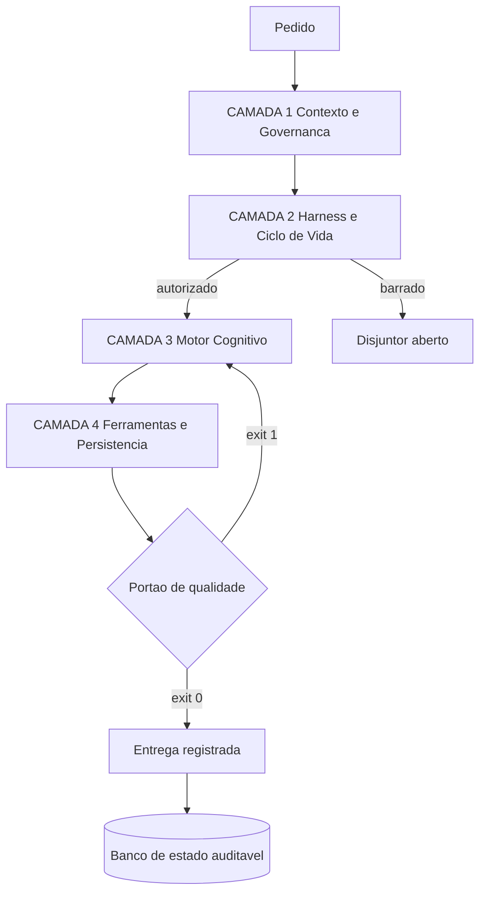

# Capítulo 5: Visão Geral das 4 Camadas: A Arquitetura Completa

## 1. Introdução

No Capítulo 4, você cravou as dez leis da constituição — mérito, soberania e integridade — e viu que lei sem fiscal não sobrevive à pressão de prazo. Aquele capítulo respondeu "o que precisa ser verdade". Este responde "onde cada verdade mora".

A resposta é uma arquitetura de quatro camadas soberanas, e o adjetivo não é retórico: cada camada tem fronteira própria, contrato bem definido e responsabilidade exclusiva. Ao final deste capítulo, você terá o mapa completo que será detalhado nos quatro capítulos seguintes, e saberá apontar qual camada está falhando a partir do sintoma que você observa.

## 2. Explica

### 2.1 Por que separar em camadas em vez de pedir mais cuidado

A tentação inicial é tratar governança como uma questão de atenção: escrever prompts melhores, revisar com mais calma, lembrar das regras. Essa abordagem falha pela mesma razão que arquiteturas monolíticas falham em sistemas grandes — ela põe toda a complexidade em um único ponto de decisão. E, no caso agêntico, esse ponto de decisão é exatamente o recurso mais escasso que existe: a janela de contexto.

A separação em camadas resolve isso distribuindo tipos distintos de complexidade para locais distintos. A camada de contexto cuida de **informação**. A camada de harness cuida de **segurança e ciclo de vida**. A camada de motor cuida de **decisão**. A camada de ferramentas cuida de **ação**. Quando cada uma faz apenas a sua parte, uma falha em uma delas tem sintoma reconhecível e correção localizada — em vez de virar uma investigação difusa sobre "o agente estar estranho".

Esse princípio é a transposição direta do que a arquitetura de software consolidou décadas atrás: separar responsabilidades é o que permite que sistemas grandes permaneçam compreensíveis [3]. A novidade é que, na engenharia agêntica, a separação também é o que torna o sistema **seguro**, porque cada capacidade perigosa fica confinada a uma camada auditável.

### 2.2 Camada 1 — Contexto e Governança: a informação

A primeira camada responde a uma pergunta só: **o que o agente sabe no momento em que decide?** Ela contém a constituição viva do projeto, o vocabulário controlado, as especificações canônicas e as regras de economia de contexto.

Três princípios a sustentam. O primeiro é densidade: cada token na mesa de trabalho precisa justificar sua presença, porque o custo de contexto é composto e cresce a cada turno. O segundo é localidade: a regra certa fica no lugar certo — núcleo enxuto na raiz, detalhe do módulo dentro do módulo —, o que evita que a constituição vire um documento que ninguém lê. O terceiro é determinismo declarativo: restrições são declaradas em contrato e validadas por script, nunca negociadas em conversa.

Essa camada é a única cuja falha **contamina todas as outras**. Se as regras não estão disponíveis ou estão enterradas em ruído, nenhuma camada seguinte consegue compensar: o agente executa corretamente aquilo que entendeu errado. Pesquisas sobre engenharia de contexto formalizaram exatamente essa percepção, tratando o desenho do que entra no modelo como disciplina própria, com otimização e governança sistemáticas [4].

### 2.3 Camada 2 — Harness e Ciclo de Vida: a segurança

A segunda camada responde a outra pergunta: **o que o agente tem autorização para fazer, e sob quais condições?** Ela contém o disjuntor de terminal, o isolamento por diretório de trabalho, os limites de tempo, o teto de repetição e os portões de pré-commit.

O ponto que merece ênfase é conceitual: toda capacidade perigosa vem desta camada, não do modelo. Um agente que não pode executar comando destrutivo não executará comando destrutivo, independentemente de quão criativo seja o modelo. É por isso que discutir segurança de IA sem discutir harness é discutir fechadura sem mencionar a porta.

A camada se apoia em três mecanismos. O isolamento de execução confina cada tarefa em um diretório de trabalho próprio — o recurso de worktree do Git permite múltiplos diretórios simultâneos sobre a mesma base de objetos, sem duplicar o repositório [6]. A interceptação de ciclo de vida inspeciona cada ação antes e depois da execução, com tempo máximo e registro de resultado. E o portão binário de pré-commit impede que código que viola a constituição entre no histórico [8].

### 2.4 Camada 3 — Motor Cognitivo: a decisão

A terceira camada responde: **qual inteligência resolve esta tarefa, e com qual formato de saída?** Ela contém o roteamento entre níveis de capacidade, os contratos tipados de saída e a política de economia.

A lei que governa esta camada é a Lei 1, determinismo em primeiro lugar: se um script, uma expressão regular ou uma análise sintática resolve, o modelo não é acionado. Isso não é economia de centavos; é economia de confiabilidade. Um modelo que responde diferente a cada execução transforma qualquer resultado em probabilidade.

Quando o modelo é de fato necessário, entram as duas ferramentas centrais. O roteamento por capacidade aloca tarefas mecânicas a modelos leves e tarefas de arquitetura a modelos de raciocínio profundo — sem essa distinção, ou você paga caro por tarefa trivial, ou entrega tarefa complexa a quem não sustenta. E o contrato tipado de saída força o retorno em formato verificável, o que elimina a etapa de interpretação de texto livre que costuma ser a mais frágil de qualquer pipeline.

### 2.5 Camada 4 — Ferramentas, MCP e Persistência: a ação

A quarta camada responde: **como a decisão se converte em mudança real no mundo, e onde isso fica registrado?** Ela contém os servidores de ferramentas, os scripts determinísticos idempotentes e o banco de estado auditável.

O protocolo de contexto padroniza como o harness se conecta a ferramentas externas, o que trouxe portabilidade — e também superfície de ataque, porque uma ferramenta maliciosa pode se descrever de forma enganosa e induzir o agente a agir fora do escopo pretendido [5] [14]. A resposta arquitetural é escopo mínimo: cada ferramenta recebe apenas as permissões necessárias, e a validação de saída não é opcional.

O segundo mecanismo é a idempotência. Uma ferramenta que roda duas vezes e produz o mesmo estado final pode ser repetida com segurança após uma falha — e essa propriedade é o que permite que a esteira se recupere sozinha sem intervenção dramática. O terceiro é a persistência: o banco de estado local em modo de journaling por write-ahead log registra decisões e telemetria com leitura concorrente, o que sustenta a Lei 3 [7].

## 3. Ilustra

Volte à **sala de controle soberana**. Você já a viu em três capítulos, mas agora conhece a planta baixa.

O painel CONTEXTO é a mesa de trabalho com seus documentos essenciais. O painel HARNESS é o quadro de disjuntores e a escala de plantão. O painel MOTOR é a mesa de roteamento que decide quem atende cada chamada. O painel FERRAMENTAS é o arsenal de instrumentos com etiqueta de escopo. Quatro painéis, quatro tipos de decisão, nenhuma sobreposição.

O detalhe que faz a sala funcionar é o **fluxo unidirecional**. O pedido entra pelo painel CONTEXTO, que o enquadra dentro das regras; segue para o HARNESS, que autoriza ou barra; o MOTOR decide quem executa e em que formato; as FERRAMENTAS executam e registram. Se o resultado não passa no portão de qualidade, ele volta ao MOTOR — nunca direto às FERRAMENTAS, porque repetir a ação sem rever a decisão é o laço de erro que drena orçamento.



*Figura 5.1 — A planta da sala de controle: cada camada recebe apenas o que lhe cabe, e o retorno após falha volta ao motor de decisão, nunca direto à execução.*

## 4. Técnica

### 4.1 Auditoria transversal das quatro camadas

A melhor forma de fixar a arquitetura é escrever o verificador que confirma que cada camada tem seus artefatos mínimos no lugar. O script abaixo percorre as quatro e devolve veredito binário — a Lei 2 aplicada à própria arquitetura.

```python
#!/usr/bin/env python3
# -*- coding: utf-8 -*-
"""Auditoria transversal das 4 camadas: confirma artefatos minimos por camada."""

import shutil
import sqlite3
import sys
from pathlib import Path
from typing import List, Tuple


def camada_1_contexto(raiz: Path) -> Tuple[bool, List[str]]:
    esperado = [
        ("AGENTS.md", "constituicao viva na raiz"),
        ("componentes", "fonte unica de verdade"),
        ("docs", "memoria estruturada auditavel"),
    ]
    faltando = [f"{desc} ({caminho})" for caminho, desc in esperado
                if not (raiz / caminho).exists()]
    return (not faltando), faltando


def camada_2_harness(raiz: Path) -> Tuple[bool, List[str]]:
    faltando: List[str] = []
    if not (raiz / ".git").exists():
        faltando.append("repositorio git ausente (sem isolamento por worktree)")
    elif not shutil.which("git"):
        faltando.append("cli git ausente no PATH")
    gates = list((raiz / "gates").glob("*.py")) if (raiz / "gates").is_dir() else []
    if not gates:
        faltando.append("nenhum portao deterministico em gates/")
    return (not faltando), faltando


def camada_3_motor(raiz: Path) -> Tuple[bool, List[str]]:
    faltando: List[str] = []
    politicas = (raiz / "config" / "orcamento_contexto.json")
    if not politicas.exists():
        faltando.append("politica de orcamento de contexto ausente")
    return (not faltando), faltando


def camada_4_ferramentas(raiz: Path) -> Tuple[bool, List[str]]:
    faltando: List[str] = []
    try:
        conexao = sqlite3.connect(":memory:")
        modo = conexao.execute("PRAGMA journal_mode=WAL;").fetchone()[0]
        conexao.close()
        if modo.lower() != "wal":
            faltando.append(f"banco local sem modo wal (obtido: {modo})")
    except sqlite3.Error as erro:
        faltando.append(f"motor de banco local indisponivel: {erro}")
    return (not faltando), faltando


CAMADAS = (
    ("1 CONTEXTO E GOVERNANCA", camada_1_contexto),
    ("2 HARNESS E CICLO DE VIDA", camada_2_harness),
    ("3 MOTOR COGNITIVO", camada_3_motor),
    ("4 FERRAMENTAS E PERSISTENCIA", camada_4_ferramentas),
)


def main() -> int:
    raiz = Path(".")
    print("=" * 64)
    print("AUDITORIA TRANSVERSAL DAS 4 CAMADAS DA FABRICA AGENTICA")
    print("=" * 64)
    resultados = []
    for titulo, verificador in CAMADAS:
        ok, problemas = verificador(raiz)
        resultados.append(ok)
        print(f"[CAMADA {titulo}] {'OK' if ok else 'INCONFORME'}")
        for problema in problemas:
            print(f"   -> {problema}")
    print("-" * 64)
    if all(resultados):
        print("[APROVADO] exit 0 — as 4 camadas estao operacionais.")
        return 0
    reprovadas = [t for (t, _), ok in zip(CAMADAS, resultados) if not ok]
    print(f"[REPROVADO] exit 1 — inconformidade em: {', '.join(reprovadas)}")
    return 1


if __name__ == "__main__":
    sys.exit(main())
```

### 4.2 O contrato entre camadas

Cada fronteira tem um contrato explícito. Escrever esse contrato em arquivo é o que impede que a separação de camadas degenere em acoplamento informal.

```yaml
camadas:
  1_contexto:
    entrada: pedido_em_linguagem_natural
    saida: pedido_enquadrado_nas_regras
    artefatos: [AGENTS.md, componentes/specs, docs/protocolos]
    lei_principal: 3
  2_harness:
    entrada: pedido_enquadrado_nas_regras
    saida: acao_autorizada_ou_bloqueada
    artefatos: [gates/, .git/hooks, settings.json]
    lei_principal: 2
  3_motor:
    entrada: acao_autorizada
    saida: decisao_em_formato_tipado
    artefatos: [config/orcamento_contexto.json, schemas/]
    lei_principal: 1
  4_ferramentas:
    entrada: decisao_em_formato_tipado
    saida: mudanca_reversivel_e_registrada
    artefatos: [mcp.json, scripts/, data/estado.db]
    lei_principal: 7
```

### 4.3 Sessão de operação das quatro camadas

O log abaixo ilustra o comportamento correto quando uma decisão é barrada pelo harness: a esteira devolve o controle ao motor, e não repete a ação.

```console
$ python esteira.py --tarefa "aplicar migracao v12"
[CAMADA 1] contexto carregado: 4.100 tokens (orçamento 8.000 por turno)
[CAMADA 2] inspecionando comando: psql -f migracao_v12.sql
[CAMADA 2] BLOQUEIO -> comando sem --single-transaction em base marcada como critica
[CAMADA 3] decisao revisada: reescrever comando em transacao unica
[CAMADA 2] inspecionando comando: psql --single-transaction -f migracao_v12.sql
[CAMADA 2] autorizado (timeout 60s)
[CAMADA 4] executando em worktree .worktrees/tarefa-12
[CAMADA 4] resultado registrado em data/estado.db (linha 8421)
[PORTAO] exit 0 -> entrega confirmada
```

### 4.4 Tabela de localização de falha

Use a tabela para descobrir em qual camada investir quando o resultado não é o esperado.

| Sintoma | Camada provável | Evidência que confirma |
|---|---|---|
| Agente ignora regra que você definiu | 1 — Contexto | Regra não está em arquivo canônico, só na conversa |
| Convenção muda entre sessões | 1 — Contexto | Núcleo normativo grande demais ou ambíguo |
| Comando destrutivo executado | 2 — Harness | Disjuntor ausente ou lista de bloqueio incompleta |
| Dois agentes corrompem o mesmo arquivo | 2 — Harness | Sem diretório de trabalho isolado por tarefa |
| Tarefa trivial consumindo modelo caro | 3 — Motor | Sem roteamento por nível de capacidade |
| Resposta em texto livre quebra o pipeline | 3 — Motor | Sem contrato tipado de saída |
| Ferramenta acessa mais do que precisa | 4 — Ferramentas | Permissões amplas e sem validação de saída |
| Estado do processo perdido entre execuções | 4 — Ferramentas | Sem banco de estado persistente |

### 4.5 Roteiro de implantação em cinco passos

1. **Monte** a camada 1 primeiro: sem contexto correto, qualquer verificação posterior mede a coisa errada.
2. **Instale** a camada 2 em seguida: disjuntor, teto de repetição, tempo máximo e portão binário de pré-commit.
3. **Configure** a camada 3 com política de orçamento de contexto e contrato tipado de saída antes de ligar qualquer automação.
4. **Instrumente** a camada 4 por último, com permissão mínima e registro de toda ação no banco de estado.
5. **Audite** as quatro em conjunto antes de considerar a esteira pronta — uma camada aprovada isoladamente não prova nada sobre o sistema.

## 5. Aplica

### A cena que quase todo time vive

Você é chamado para diagnosticar uma esteira que "funciona na máquina do dev e falha no servidor". O sintoma relatado é vago: às vezes passa, às vezes não. O time já tentou três vezes trocar o modelo e o comportamento melhorou por dois dias, depois voltou.

Mapeie o problema nas camadas. A primeira pista é a intermitência: comportamento que muda sem mudança de código raramente tem causa no modelo e quase sempre tem causa no ambiente. Você verifica a camada 1 e encontra o núcleo normativo com quase mil linhas, incluindo regras de três projetos diferentes. Verifica a camada 2 e encontra o disjuntor configurado apenas na máquina do desenvolvedor, não no servidor. Verifica a camada 4 e descobre que o registro de estado aponta para um arquivo local efêmero, apagado a cada novo contêiner.

O diagnóstico é claro e tem três causas independentes. A aderência irregular vem da camada 1: o núcleo normativo grande demais dilui as regras que importam no meio do ruído [4]. A diferença entre máquina e servidor vem da camada 2: governança que existe em um ambiente e não no outro não é governança, é coincidência. E a perda de estado entre execuções vem da camada 4: sem persistência durável, cada execução começa sem saber o que a anterior concluiu [7].

A correção segue a ordem das camadas: enxugar o núcleo normativo para o essencial; instalar o disjuntor e os portões como parte do repositório, versionados, para que todo ambiente os receba; e apontar o banco de estado para um volume persistente. Note que a ordem importa: se você começar pela camada 2, vai fiscalizar regras que serão reescritas no dia seguinte. A arquitetura de camadas não é apenas um mapa — é uma **ordem de trabalho**.

### Onde isso escala e onde quebra

A arquitetura de quatro camadas escala até o ponto em que a fiscalização deixa de caber no caminho crítico. Em times maiores, o portão de pré-commit vira gargalo se carregar todas as verificações; a solução é a divisão já mencionada — verificações baratas no commit, verificações profundas na esteira assíncrona.

Há uma segunda fronteira, mais sutil: o número de ferramentas da camada 4. Cada ferramenta nova amplia a superfície de ataque, e a orientação de segurança para esse tipo de integração é explícita quanto a escopo mínimo e validação de saída [14] [19]. Um arsenal de cinquenta ferramentas com permissões amplas é mais perigoso do que um arsenal de oito com escopo restrito. O contorno prático é tratar cada ferramenta como credencial: se não tem uso claro, revoga.

E existe a condição de contorno estrutural: **esta arquitetura não faz sentido para trabalho descartável**. Se o artefato dura dias, montar quatro camadas custa mais do que ele vale. A decisão honesta é declarar o escopo — e, quando o trabalho descartável começar a virar permanente, migrar antes que a dívida se acumule.

### Armadilhas comuns

- Começar pelas ferramentas porque é a parte visível. A ordem correta de montagem é contexto, harness, motor e ferramentas — nessa sequência.
- Tratar as camadas como hierarquia de importância. Nenhuma é mais importante; cada uma cobre um tipo de falha que as outras não cobrem.
- Configurar governança apenas no ambiente de desenvolvimento. Se o servidor não tem o mesmo disjuntor, o sistema não tem disjuntor.
- Fazer o retorno de falha voltar direto à execução. Repetir ação sem rever decisão é a assinatura do laço de erro que drena orçamento.
- Ampliar ferramentas sem ampliar auditoria. Cada ferramenta nova é uma credencial a mais — trate-a como tal [9].

## 6. Conclusão

Neste capítulo você recebeu o mapa da arquitetura completa. A camada 1 governa informação e responde o que o agente sabe; a camada 2 governa segurança e responde o que ele pode fazer; a camada 3 governa decisão e responde com qual inteligência e em qual formato; a camada 4 governa ação e responde como a decisão vira mudança registrada. Você também viu o princípio de operação — o fluxo unidirecional, com retorno de falha ao motor de decisão e nunca à execução.

E conheceu a evidência que dá contexto a esse desenho: a adoção de práticas de plataforma interna já alcança 90% dos times pesquisados no relatório de referência de entrega de software, o que mostra que a indústria já aceitou a ideia de tratar infraestrutura de trabalho como produto com contrato [1]. A arquitetura de quatro camadas é a aplicação dessa mesma lógica à engenharia agêntica.

**Desafio:** desenhe a sua sala de controle em uma folha, com os quatro painéis, e escreva ao lado de cada um o artefato concreto que já existe no seu projeto — arquivo, script, banco, política. Os painéis vazios são o seu roteiro de trabalho para as próximas quatro semanas.

Os próximos quatro capítulos abrem cada painel em detalhe. O Capítulo 6 começa pela camada 1 e pelos três princípios universais de contexto: densidade, localidade e determinismo declarativo.

## 7. Referências Bibliográficas

[1] DORA / GOOGLE CLOUD. *State of AI-assisted Software Development 2025*. Disponível em: https://dora.dev/dora-report-2025/. Acesso em: 12 set. 2026.
[2] ALI, Mohamad Abou; DORNAIKA, Fadi; CHARAFEDDINE, Jinan. *Agentic AI: a comprehensive survey of architectures, applications, and future directions*. In: Artificial Intelligence Review. 2025. Disponível em: https://doi.org/10.1007/s10462-025-11422-4. Acesso em: 12 set. 2026.
[3] MARTIN, Robert C. *Clean Architecture: A Craftsman's Guide to Software Structure and Design*. Prentice Hall, 2017. Disponível em: https://www.pearson.com/. Acesso em: 12 set. 2026.
[4] MEI, Lingrui et al. *A Survey of Context Engineering for Large Language Models*. In: arXiv. 2025. Disponível em: https://arxiv.org/abs/2507.13334. Acesso em: 12 set. 2026.
[5] ANTHROPIC. *Model Context Protocol Specification (2025-06-18)*. Disponível em: https://modelcontextprotocol.io/specification/2025-06-18. Acesso em: 12 set. 2026.
[6] GIT. *git-worktree Documentation*. Disponível em: https://git-scm.com/docs/git-worktree. Acesso em: 12 set. 2026.
[7] SQLITE. *Write-Ahead Logging*. Disponível em: https://www.sqlite.org/wal.html. Acesso em: 12 set. 2026.
[8] HUMBLE, Jez; FARLEY, David. *Continuous Delivery: Reliable Software Releases through Build, Test, and Deployment Automation*. Addison-Wesley, 2010. Disponível em: https://continuousdelivery.com/. Acesso em: 12 set. 2026.
[9] NYGARD, Michael T. *Release It!: Design and Deploy Production-Ready Software*. 2. ed. Pragmatic Bookshelf, 2018. Disponível em: https://pragprog.com/titles/mnee2/release-it-second-edition/. Acesso em: 12 set. 2026.
[10] FOWLER, Martin. *Patterns of Enterprise Application Architecture*. Boston: Addison-Wesley, 2002. Disponível em: https://martinfowler.com/books/eaa.html. Acesso em: 12 set. 2026.
[11] ANTHROPIC. *Prompt Caching — Claude Platform Docs*. Disponível em: https://platform.claude.com/docs/en/build-with-claude/prompt-caching. Acesso em: 12 set. 2026.
[12] SHANNON, Claude E. *A Mathematical Theory of Communication*. Bell System Technical Journal, 1948. Disponível em: https://doi.org/10.1002/j.1538-7305.1948.tb01338.x. Acesso em: 12 set. 2026.
[13] NATIONAL INSTITUTE OF STANDARDS AND TECHNOLOGY. *Artificial Intelligence Risk Management Framework: Generative Artificial Intelligence Profile (NIST AI 600-1)*. Disponível em: https://nvlpubs.nist.gov/nistpubs/ai/NIST.AI.600-1.pdf. Acesso em: 12 set. 2026.
[14] NATIONAL SECURITY AGENCY. *Model Context Protocol (MCP) Security — CSI*. Disponível em: https://www.nsa.gov/Portals/75/documents/Cybersecurity/CSI_MCP_SECURITY.pdf. Acesso em: 12 set. 2026.
[15] STACK OVERFLOW. *2025 Developer Survey — AI*. Disponível em: https://survey.stackoverflow.co/2025/ai. Acesso em: 12 set. 2026.
[16] GITHUB. *Octoverse 2025: The state of open source*. Disponível em: https://octoverse.github.com/. Acesso em: 12 set. 2026.
[17] LIU, Nelson F. et al. *Lost in the Middle: How Language Models Use Long Contexts*. In: Transactions of the Association for Computational Linguistics. 2024. Disponível em: https://arxiv.org/abs/2307.03172. Acesso em: 12 set. 2026.
[18] VERACODE. *2025 GenAI Code Security Report: AI-Generated Code Security Risks*. Disponível em: https://www.veracode.com/blog/ai-generated-code-security-risks/. Acesso em: 12 set. 2026.
[19] CLOUD SECURITY ALLIANCE. *MCP Security Crisis: Systemic Design Flaws in AI Agent Infrastructure*. Disponível em: https://labs.cloudsecurityalliance.org/research/csa-research-note-mcp-security-crisis-20260504-csa-styled/. Acesso em: 12 set. 2026.
[20] CHACON, Scott; STRAUB, Ben. *Pro Git: Everything you need to know about Git*. 2. ed. Apress, 2014. Disponível em: https://git-scm.com/book/en/v2. Acesso em: 12 set. 2026.
