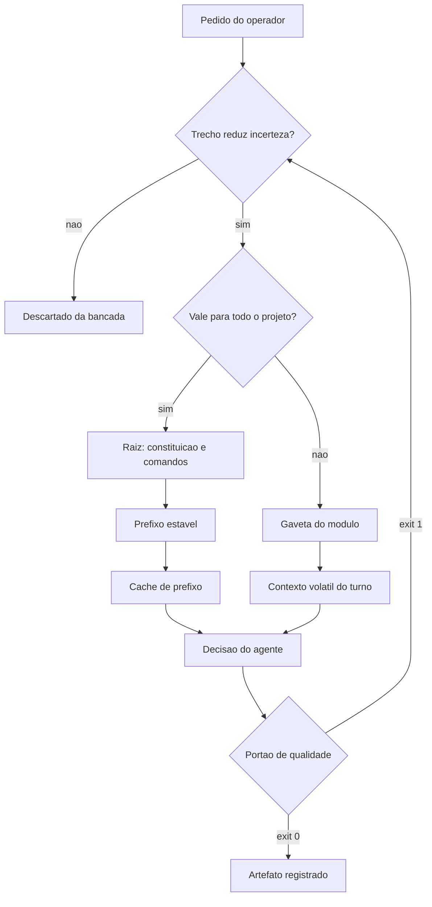

# Capítulo 6: Camada 1 — Contexto e Governança: Densidade, Localidade e Determinismo

## 1. Introdução

No Capítulo 5, você recebeu a planta da sala de controle e viu o painel CONTEXTO como o primeiro estágio de todo pedido. Este capítulo abre esse painel por dentro.

A pergunta que organiza tudo aqui é desconfortavelmente simples: **o que o agente sabe no exato momento em que decide?** Não o que você escreveu em algum documento, não o que você explicou três horas antes na conversa — o que efetivamente está na bancada de trabalho quando a decisão acontece. Ao final deste capítulo, você saberá aplicar os três princípios que governam essa resposta — densidade, localidade e determinismo declarativo — e terá em mãos a ferramenta que mede objetivamente a qualidade do seu contexto.

## 2. Explica

### 2.1 Princípio 1: densidade — a medida de Shannon aplicada à bancada

Claude Shannon definiu a informação como a redução de incerteza produzida por cada símbolo transmitido [1]. A definição tem uma consequência implacável para quem opera agentes: um token que não reduz incerteza não carrega informação — ele carrega custo. E o custo aparece de três formas simultâneas: dinheiro pago por token, latência adicionada ao tempo de resposta e ruído acumulado que degrada a atenção do modelo.

A consequência prática é uma política de admissão na bancada. Antes de qualquer texto entrar no contexto permanente de um projeto, pergunte: se este trecho desaparecesse, a decisão do agente mudaria? Se a resposta é não, ele não entra. Isso condena, por exemplo, saudações e preâmbulos, explicações de código que o próprio código já expressa, repetições de instruções anteriores e transcrições integrais de logs quando apenas a primeira linha de erro importa.

Note que densidade não é brevidade. Uma explicação longa que resolve ambiguidade genuína é densa; uma frase curta e vaga não é. O critério é sempre a incerteza resolvida, não o número de palavras.

### 2.2 Princípio 2: localidade — a regra no lugar certo

O erro mais comum na construção de governança é criar um documento único e gigantesco na raiz, contendo regras de todas as linguagens, todos os bancos e todas as áreas de negócio. O documento parece completo e é, na prática, inútil: quando tudo está no mesmo lugar com o mesmo peso, nada orienta.

A alternativa é **localidade de contexto**. A raiz guarda apenas o essencial — a constituição com as leis, os comandos canônicos e as convenções que valem para o projeto inteiro. O detalhe operacional mora junto do módulo que o utiliza: a convenção de acesso a dados fica no módulo de dados, o padrão de interface fica no módulo de interface.

Há duas razões para isso. A primeira é econômica: o agente carrega apenas o contexto do módulo em que está trabalhando, o que reduz tokens e aumenta foco. A segunda é de aderência: regras próximas do código que governam são lidas no momento em que importam. A pesquisa sobre engenharia de contexto formaliza essa percepção ao tratar a montagem do contexto como problema de recuperação seletiva, e não de acumulação [2].

### 2.3 Princípio 3: determinismo declarativo — proibição como contrato

Existe uma tentação quase irresistível de escrever pedidos enfáticos: "por favor, nunca gere stubs", "é fundamental que você não altere este arquivo". Modelos probabilísticos não respondem a ênfase da forma que esperamos. Sob pressão de contexto, o pedido enfático compete com dezenas de outros pedidos e perde.

O determinismo declarativo troca a súplica pela restrição estrutural. Em vez de pedir que o agente não gere stub, instala-se um portão que inspeciona a árvore sintática e bloqueia qualquer função com corpo vazio. Em vez de pedir que ele não altere um arquivo protegido, configura-se uma permissão que bloqueia a escrita na origem. A regra deixa de ser conselho e passa a ser condição de operação.

Isso muda a natureza da correção. Quando o agente viola uma restrição declarada, a esteira devolve o erro exato ao terminal, e a correção é mecânica — não exige reinterpretação de intenção. É a diferença entre um sistema que depende de boa vontade e um sistema que depende de física.

### 2.4 A alavanca financeira: prefixo estável e cache

Existe um detalhe de implementação que transforma os três princípios em economia real. Quando o prefixo de um prompt é estável — as mesmas regras, no mesmo formato, na mesma ordem, a cada chamada — o provedor pode reaproveitar o processamento desse trecho. O efeito é expressivo: a redução de custo de tokens de entrada chega a 90%, e a latência em prompts longos cai até 85% [4] [5].

Repare no que isso implica. Ordenar o contexto com o material mais estável no início — constituição, convenções, contratos — e o material volátil no fim não é apenas boa prática de leitura: é a decisão que habilita o cache. Um projeto que reordena suas regras a cada sessão paga preço cheio por cada token, sempre. E a economia não é apenas financeira: reduzir latência muda a experiência de desenvolvimento, e experiência melhor significa menos atalhos perigosos sob pressão.

Vale uma advertência de honestidade: o cache exige estabilidade real. Se o prefixo muda a cada chamada, o benefício desaparece por completo. Estabilidade de contexto é, portanto, uma decisão de arquitetura, não um recurso automático.

## 3. Ilustra

Na sua **sala de controle**, o painel CONTEXTO tem uma bancada de trabalho com uma placa: "esta bancada comporta o essencial". Ao lado dela, três compromissos afixados.

O primeiro é a **política de admissão**: cada papel que entra na bancada precisa justificar sua presença resolvendo uma incerteza real. O segundo é o **mapa de gavetas**: a bancada guarda as leis, e cada gaveta lateral guarda o regulamento do módulo correspondente — quem trabalha em dados abre a gaveta de dados, e ninguém é obrigado a carregar o regulamento inteiro da empresa. O terceiro é o **carimbo de contrato**: a regra que não passou pelo carimbo do fiscal não é regra, é lembrete.

E existe o detalhe que ninguém percebe até ver a conta: os documentos da bancada ficam **sempre na mesma ordem**. Essa monotonia aparente é o que permite ao sistema reaproveitar o trabalho de leitura a cada chamada, em vez de recomeçar do zero.



*Figura 6.1 — A bancada da Camada 1: admissão por incerteza resolvida, separação entre prefixo estável e contexto volátil, e retorno ao filtro quando o portão reprova.*

## 4. Técnica

### 4.1 Medindo densidade de contexto com evidência

Não existe disciplina de contexto sem medição. O analisador abaixo calcula o índice de densidade de um documento de governança penalizando termos prolixos, e devolve veredito binário — aplicando a Lei 2 ao próprio contexto.

```python
#!/usr/bin/env python3
# -*- coding: utf-8 -*-
"""Analisador de densidade de contexto para documentos de governanca."""

import re
import sys
from pathlib import Path
from typing import Dict

TERMOS_PROLIXOS = (
    "por favor", "gostaria", "poderia", "talvez", "se possivel",
    "espero que", "bom dia", "boa tarde", "atenciosamente", "obrigado",
)

LIMITE_APROVACAO = 80.0


def analisar(texto: str) -> Dict[str, float]:
    palavras = re.findall(r"\b\w+\b", texto.lower())
    total = len(palavras)
    if total == 0:
        return {"palavras": 0.0, "prolixos": 0.0, "densidade": 0.0}

    baixo = texto.lower()
    prolixos = sum(
        len(re.findall(r"\b" + re.escape(t) + r"\b", baixo))
        for t in TERMOS_PROLIXOS
    )
    penalidade = (prolixos * 12) / total
    densidade = max(0.0, min(100.0, 100.0 - penalidade * 100))
    return {"palavras": float(total), "prolixos": float(prolixos),
            "densidade": round(densidade, 2)}


def medir_blocos(texto: str) -> int:
    """Conta blocos separados por linha em branco — proxy de fragmentacao util."""
    return len([b for b in re.split(r"\n\s*\n", texto) if b.strip()])


def main() -> int:
    alvo = Path(sys.argv[1]) if len(sys.argv) > 1 else Path("AGENTS.md")
    if not alvo.exists():
        print(f"[FALHA] documento nao encontrado: {alvo}")
        return 1

    texto = alvo.read_text(encoding="utf-8")
    metricas = analisar(texto)
    print("=" * 60)
    print(f"DENSIDADE DE CONTEXTO — {alvo.name}")
    print("=" * 60)
    print(f"  palavras          : {int(metricas['palavras'])}")
    print(f"  termos prolixos   : {int(metricas['prolixos'])}")
    print(f"  blocos de conteudo: {medir_blocos(texto)}")
    print(f"  indice de densidade: {metricas['densidade']} / 100")
    print("-" * 60)
    if metricas["densidade"] >= LIMITE_APROVACAO:
        print(f"[APROVADO] exit 0 (limite {LIMITE_APROVACAO})")
        return 0
    print(f"[REPROVADO] exit 1 — abaixo do limite {LIMITE_APROVACAO}: "
          f"corte preambulo, saudacao e instrucao redundante.")
    return 1


if __name__ == "__main__":
    sys.exit(main())
```

### 4.2 Separando prefixo estável de contexto volátil

O contrato abaixo declara explicitamente o que pode e o que não pode mudar entre chamadas. Ele é o artefato que habilita o cache de prefixo e, ao mesmo tempo, documenta a política de admissão.

```json
{
  "prefixo_estavel": {
    "ordem_fixa": true,
    "conteudo": [
      "AGENTS.md (constituicao)",
      "docs/protocolos/convencoes.md",
      "schemas/contratos.json"
    ],
    "politica_de_mudanca": "somente-por-revisao-com-justificativa"
  },
  "contexto_volatil": {
    "conteudo": [
      "diff do turno atual",
      "saida do ultimo comando",
      "lista de pendencias abertas"
    ],
    "politica_de_expurgo": "descartar-entre-fases",
    "teto_por_turno_tokens": 8000
  },
  "proibido_no_contexto": [
    "logs integrais sem filtro",
    "transcricao de conversa anterior",
    "saudacoes e preambulos",
    "arquivo inteiro quando o diff basta"
  ]
}
```

### 4.3 Sessão real de diagnóstico de contexto

O log abaixo mostra o padrão que você deve reconhecer: densidade caindo ao longo da sessão, porque conteúdo volátil vazou para a região estável.

```console
$ python gates/densidade-contexto.py AGENTS.md
============================================================
DENSIDADE DE CONTEXTO — AGENTS.md
============================================================
  palavras          : 1840
  termos prolixos   : 14
  blocos de conteudo: 62
  indice de densidade: 90.87 / 100
------------------------------------------------------------
[APROVADO] exit 0 (limite 80.0)

$ python gates/densidade-contexto.py docs/protocolos/tudo-junto.md
  palavras          : 9120
  termos prolixos   : 96
  blocos de conteudo: 51
  indice de densidade: 87.37 / 100
  AVISO: 9120 palavras na bancada — mova o detalhe para as gavetas de modulo
------------------------------------------------------------
[APROVADO] exit 0 (limite 80.0)
```

### 4.4 Tabela de decisão: onde colocar cada tipo de regra

| Tipo de regra | Onde mora | Justificativa |
|---|---|---|
| Lei inegociável do projeto | Raiz, na constituição | Vale para todo pedido; entra no prefixo estável |
| Convenção de nomenclatura de código | Gaveta do módulo | Só importa para quem edita aquele módulo |
| Comando canônico de build | Raiz, junto da constituição | Estável e usado por qualquer tarefa |
| Credencial e token | Nunca no contexto; variável de ambiente | Risco de vazamento e de mudança constante |
| Log de execução do turno anterior | Contexto volátil, filtrado | Volátil por natureza; só a linha de erro importa |
| Especificação de um módulo | Gaveta do módulo | Longa e local; polui a raiz se promovida |
| Histórico de conversa antigo | Descartado após a fase | Não reduz incerteza; degrada atenção [3] |

### 4.5 Roteiro de cinco passos para a Camada 1

1. **Separe** o que é estável do que é volátil antes de escrever qualquer regra; essa divisão define onde cada coisa mora.
2. **Escreva** a constituição na raiz com no máximo algumas dezenas de linhas, uma frase por lei.
3. **Distribua** o detalhe operacional para as gavetas dos módulos, junto do código que elas governam.
4. **Congele** a ordem do prefixo estável e trate qualquer mudança nele como revisão formal, com justificativa.
5. **Meça** a densidade a cada ciclo e trate queda de índice como sinal de que conteúdo volátil está vazando para a região estável.

## 5. Aplica

### A cena que quase todo time vive

Você assume a liderança técnica de um serviço e decide organizar a governança de uma vez. Escreve um documento único com 900 linhas, contendo convenções de código em três linguagens, regras de banco, política de segurança, histórico de decisões e uma longa seção explicando por que cada regra existe. Você o coloca na raiz, satisfeito com a completude.

Uma semana depois, o agente começa a violar a regra de nomenclatura. Você aponta o documento. Ele responde que a regra está lá — na linha 431, entre a política de backup e a convenção de testes. Você vai verificar e descobre o problema real: a instrução existe, mas está cercada de tanto material sobre temas que não importam para aquela tarefa que perdeu peso relativo na decisão.

O diagnóstico tem dois componentes. O primeiro é de densidade: a bancada recebeu material que não reduz incerteza para a tarefa em curso. O segundo é de localidade: uma convenção de código de módulo foi promovida à raiz, onde compete com tudo o mais [2]. Havia ainda um terceiro componente silencioso — a ordem do documento mudava a cada edição, o que destruía qualquer reaproveitamento de prefixo e fazia cada chamada pagar preço integral [4].

A correção em três movimentos. Primeiro, separar: a raiz fica com as leis, os comandos canônicos e as convenções globais; cada módulo recebe seu próprio regulamento. Segundo, ordenar por estabilidade: o que menos muda vai para o início, o que muda a cada turno vai para o fim. Terceiro, transformar em contrato o que ainda era pedido: as regras que precisam ser asseguradas viram portões binários, e o texto explicativo sai do contexto e vai para a documentação de projeto, onde humano lê e agente não paga por token.

### Onde isso escala e onde quebra

Localidade escala muito bem até o ponto em que a hierarquia fica profunda demais. Com muitos níveis de gaveta, o agente passa a precisar saber **onde** procurar antes de procurar — e essa navegação consome contexto. O contorno é manter a profundidade baixa: raiz, módulo e, no máximo, submódulo.

Densidade tem um ponto de ruptura diferente e mais traiçoeiro. Comprimir demais remove contexto que evita erro de interpretação, e o custo aparece como retrabalho silencioso: o agente produz algo plausível e diferente do que você queria, e você só descobre ao revisar. O contorno é medir densidade **e** taxa de retrabalho juntas; densidade alta com retrabalho alto significa que você cortou contexto essencial, não ruído.

A terceira fronteira é o cache. Ele escala bem enquanto o prefixo é genuinamente estável. Projetos que mudam a constituição a cada sprint colhem pouco benefício. Nesse cenário, o caminho honesto é separar a parte que muda — que vira contexto volátil versionado — da parte que permanece, em vez de fingir estabilidade que não existe.

E existe a condição de contorno final: **este capítulo não otimiza projetos de um único turno**. Se a tarefa termina em uma sessão, montar infraestrutura de contexto estável é investimento sem retorno. O valor aparece na recorrência — na décima, na centésima chamada.

### Armadilhas comuns

- Confundir densidade com brevidade. Frase curta e vaga tem menos informação que parágrafo preciso.
- Promover detalhe de módulo para a raiz. Isso dilui as leis que valem para todos no meio de regras que valem para poucos.
- Reordenar a constituição a cada edição. Estabilidade de ordem é o que habilita a economia de prefixo.
- Manter pedido enfático onde caberia portão binário. "Por favor, não faça X" não sobrevive a contexto saturado [3].
- Guardar credencial no contexto. Regra de segurança que depende de o agente lembrar de não vazar não é regra de segurança.

## 6. Conclusão

Neste capítulo você abriu o painel CONTEXTO da sala de controle e conheceu seus três princípios. Densidade: cada trecho na bancada precisa reduzir incerteza real, medido pela lógica de informação de Shannon [1]. Localidade: a lei na raiz, o detalhe na gaveta do módulo, para que o agente carregue apenas o que governa o trabalho em curso [2]. Determinismo declarativo: restrição como contrato validado por script, nunca como pedido enfático em conversa.

Você viu também a alavanca financeira que recompensa a disciplina: manter o prefixo estável em ordem fixa permite redução de até 90% no custo dos tokens de entrada e de até 85% na latência de prompts longos [4] [5]. Contexto organizado não é apenas mais correto — é mais rápido e mais barato, e essa combinação é o que torna a disciplina sustentável no dia a dia.

**Desafio:** meça a densidade do seu documento de governança atual e conte quantas regras são realmente globais. Se menos de um terço delas valer para todo o projeto, você tem material de módulo morando na raiz — e acabou de encontrar o seu primeiro trabalho de reorganização.

O Capítulo 7 abre o painel HARNESS e trata da camada que responde à pergunta seguinte: o que o agente tem autorização para fazer, e sob quais condições.

## 7. Referências Bibliográficas

[1] SHANNON, Claude E. *A Mathematical Theory of Communication*. Bell System Technical Journal, 1948. Disponível em: https://doi.org/10.1002/j.1538-7305.1948.tb01338.x. Acesso em: 12 set. 2026.
[2] MEI, Lingrui et al. *A Survey of Context Engineering for Large Language Models*. In: arXiv. 2025. Disponível em: https://arxiv.org/abs/2507.13334. Acesso em: 12 set. 2026.
[3] LIU, Nelson F. et al. *Lost in the Middle: How Language Models Use Long Contexts*. In: Transactions of the Association for Computational Linguistics. 2024. Disponível em: https://arxiv.org/abs/2307.03172. Acesso em: 12 set. 2026.
[4] ANTHROPIC. *Prompt Caching — Claude Platform Docs*. Disponível em: https://platform.claude.com/docs/en/build-with-claude/prompt-caching. Acesso em: 12 set. 2026.
[5] AMAZON WEB SERVICES. *Prompt caching for faster model inference — Amazon Bedrock*. Disponível em: https://docs.aws.amazon.com/bedrock/latest/userguide/prompt-caching.html. Acesso em: 12 set. 2026.
[6] DORA / GOOGLE CLOUD. *State of AI-assisted Software Development 2025*. Disponível em: https://dora.dev/dora-report-2025/. Acesso em: 12 set. 2026.
[7] STACK OVERFLOW. *2025 Developer Survey — AI*. Disponível em: https://survey.stackoverflow.co/2025/ai. Acesso em: 12 set. 2026.
[8] GITHUB. *Octoverse 2025: The state of open source*. Disponível em: https://octoverse.github.com/. Acesso em: 12 set. 2026.
[9] MARTIN, Robert C. *Clean Architecture: A Craftsman's Guide to Software Structure and Design*. Prentice Hall, 2017. Disponível em: https://www.pearson.com/. Acesso em: 12 set. 2026.
[10] FOWLER, Martin. *Patterns of Enterprise Application Architecture*. Boston: Addison-Wesley, 2002. Disponível em: https://martinfowler.com/books/eaa.html. Acesso em: 12 set. 2026.
[11] GE, Y. T. et al. *A Survey of Vibe Coding with Large Language Models*. In: arXiv. 2025. Disponível em: http://arxiv.org/abs/2510.12399. Acesso em: 12 set. 2026.
[12] RAY, Partha Pratim. *A Review on Vibe Coding: Fundamentals, State-of-the-art, Challenges and Future Directions*. 2025. Disponível em: https://doi.org/10.36227/techrxiv.174681482.27435614/v1. Acesso em: 12 set. 2026.
[13] PEREIRA, Luciano. *Empirical Validation of Cognitive-Derived Coding Constraints and Tokenization Asymmetries in LLM-Assisted Software Engineering*. 2026. Disponível em: https://doi.org/10.2139/ssrn.6294900. Acesso em: 12 set. 2026.
[14] ZHANG, Qizheng et al. *Agentic Context Engineering: Evolving Contexts for Self-Improving Language Models*. In: arXiv. 2025. Disponível em: https://arxiv.org/abs/2510.04618. Acesso em: 12 set. 2026.
[15] ALI, Mohamad Abou; DORNAIKA, Fadi; CHARAFEDDINE, Jinan. *Agentic AI: a comprehensive survey of architectures, applications, and future directions*. In: Artificial Intelligence Review. 2025. Disponível em: https://doi.org/10.1007/s10462-025-11422-4. Acesso em: 12 set. 2026.
[16] NATIONAL INSTITUTE OF STANDARDS AND TECHNOLOGY. *Artificial Intelligence Risk Management Framework: Generative Artificial Intelligence Profile (NIST AI 600-1)*. Disponível em: https://nvlpubs.nist.gov/nistpubs/ai/NIST.AI.600-1.pdf. Acesso em: 12 set. 2026.
[17] VĂDUVA, A. et al. *Code2UML: Agentic LLMs with context engineering for scalable software visualization*. In: arXiv. 2026. Disponível em: https://www.semanticscholar.org/paper/792e745f4068bb0557ed2a4c6601812b3e3baf5e. Acesso em: 12 set. 2026.
[18] HADI, Muhammad Usman et al. *A Survey on Large Language Models: Applications, Challenges, Limitations, and Practical Usage*. 2023. Disponível em: https://doi.org/10.36227/techrxiv.23589741.v1. Acesso em: 12 set. 2026.
[19] HUMBLE, Jez; FARLEY, David. *Continuous Delivery: Reliable Software Releases through Build, Test, and Deployment Automation*. Addison-Wesley, 2010. Disponível em: https://continuousdelivery.com/. Acesso em: 12 set. 2026.
[20] NYGARD, Michael T. *Release It!: Design and Deploy Production-Ready Software*. 2. ed. Pragmatic Bookshelf, 2018. Disponível em: https://pragprog.com/titles/mnee2/release-it-second-edition/. Acesso em: 12 set. 2026.
