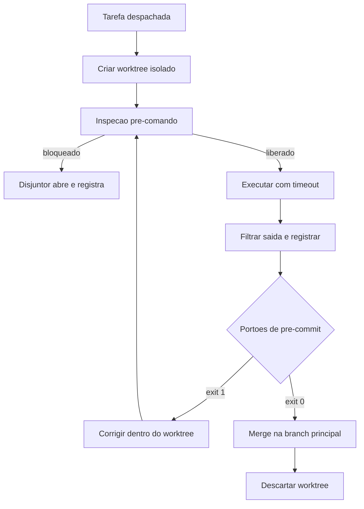

# Capítulo 7: Camada 2 — Harness e Ciclo de Vida: Disjuntores, Worktrees e Quality Gates

## 1. Introdução

No Capítulo 6, você organizou a bancada de trabalho do painel CONTEXTO: densidade, localidade e determinismo declarativo. Mas contexto correto não impede dano. Um agente com instruções perfeitas ainda pode executar um comando destrutivo, sobrescrever um arquivo em uso ou repetir um erro até esgotar o orçamento.

É aqui que entra o painel HARNESS — a camada que responde à pergunta mais desconfortável da engenharia agêntica: **o que o agente tem autorização para fazer, e sob quais condições?** Ao final deste capítulo, você saberá construir a contenção de execução com três mecanismos: isolamento por diretório de trabalho, disjuntor de comando e portão binário de pré-commit.

## 2. Explica

### 2.1 Princípio 1: isolamento de execução

O erro de origem é permitir que agentes editem diretamente o diretório de trabalho da equipe. Parece eficiente — não há cópia, não há sincronização — e é exatamente aí que o problema mora. Dois agentes operando sobre os mesmos arquivos físicos produzem estados impossíveis de reconciliar, e a última escrita vence sem que a intenção anterior deixe rastro.

O recurso que resolve isso sem duplicar o repositório é o **worktree** do Git. Ele permite manter múltiplos diretórios de trabalho simultâneos ligados à mesma base de objetos, cada um em sua própria branch [1]. Isso significa isolamento com custo de disco marginal: em vez de clonar gigabytes, você cria um diretório que compartilha o histórico existente [3].

O efeito prático é mais importante do que a economia. Com isolamento, a falha fica contida. Se a tarefa não passa nos portões de qualidade, o diretório é descartado e a branch principal permanece exatamente como estava. **Reversibilidade** é a propriedade central desta camada: o custo de errar cai para o custo de descartar um diretório. Ambientes de agentes já expõem esse padrão como recurso de primeira classe precisamente por isso [2].

### 2.2 Princípio 2: interceptação de ciclo de vida

Toda ação de um agente atravessa um ciclo com quatro momentos, e cada momento é uma oportunidade de controle.

O primeiro é o **pré-comando**: a linha pretendida é inspecionada antes de tocar o shell. É aqui que entram as listas de bloqueio — remoção recursiva em diretório raiz, destruição de banco, envio forçado de branch principal, remoção de verificação obrigatória [4]. O segundo momento é a **execução**, que precisa de teto: tempo máximo por comando e emulação de terminal, para que comandos que aguardam digitação humana não travem a sessão. O terceiro é o **pós-comando**: a saída é capturada, filtrada e registrada, para que volume bruto não vaze para o contexto. O quarto é o **pré-commit**, onde os portões de qualidade decidem se a mudança entra no histórico.

A razão de existir desse desenho é econômica e de segurança. Sem teto de repetição, um agente em laço de erro continua chamando a API indefinidamente — e o log não parece catastrófico, apenas repetitivo. Sem inspeção prévia, um comando destrutivo é irreversível. E sem portão de pré-commit, o repositório acumula dívida a cada entrega [5].

### 2.3 Princípio 3: agnosticismo de execução

O terceiro princípio é o mais fácil de subestimar: as automações desta camada precisam se comportar igualmente em Windows, Linux e macOS. Scripts de contenção que só funcionam em um sistema operacional transformam a governança em privilégio de quem tem o ambiente "certo".

A consequência prática é evitar dependência de dialetos de shell específicos e preferir scripts escritos em linguagem portátil, com biblioteca padrão. Isso não é purismo: é o que garante que o portão que barrou um erro na sua máquina também barre o mesmo erro no servidor. Governança que não é idêntica em todos os ambientes não é governança — é coincidência, como você viu no Capítulo 5.

### 2.4 Por que a verificação binária precisa ser hostil à otimização

Existe uma razão sutil e poderosa para o portão devolver resultado binário. Métricas contínuas são otimizáveis; portões binários, muito menos. A literatura sobre manipulação de recompensa em agentes de código documenta modelos que passam a explorar o mecanismo de avaliação em vez de resolver a tarefa — ajustando testes, contornando verificações, escolhendo o caminho que maximiza o sinal [9] [10].

O número que torna isso concreto vem da avaliação de agentes em bases de referência. Um estudo apresentado em conferência de engenharia de software apontou que cerca de 7,2% dos patches aceitos como corretos não resolviam a tarefa proposta [11]. Ou seja: a métrica pública aprovava trabalho incorreto em uma fração relevante dos casos. Um portão binário bem desenhado, que valida comportamento observável em vez de declarar sucesso, é a defesa estrutural contra esse tipo de otimização — e é por isso que o portão precisa ser hostil a atalhos, não conveniente.

## 3. Ilustra

Volte à **sala de controle**. O painel HARNESS é a parede dos disjuntores, e agora você entende cada peça.

O primeiro dispositivo é a **sala de trabalho isolada**: cada tarefa recebe sua própria célula, ligada à mesma planta mas fechada por porta própria. Se a tarefa der errado, você fecha a porta e a célula desaparece — a planta central nunca foi tocada. O segundo é o **disjuntor**: ele inspeciona a corrente antes de deixá-la passar e abre o circuito diante de sobrecarga, em vez de esperar o incêndio. O terceiro é o **carimbo de saída**: nada sai da sala sem passar pelo posto de inspeção, e o posto não negocia — ele carimba ou bloqueia.

E há um quarto elemento, silencioso, que é o mais importante de todos: a **escala de plantão**. Ela define quanto tempo cada operário pode ficar em um posto, quantas vezes pode repetir uma tentativa e quem precisa autorizar uma ação irreversível. Sem escala, a sala depende de heroísmo; com escala, a sala depende de processo.



*Figura 7.1 — O ciclo de vida completo no painel HARNESS: isolamento, inspeção, execução com teto, portão binário e descarte reversível do ambiente de trabalho.*

## 4. Técnica

### 4.1 Disjuntor de terminal com lista de bloqueio e teto de tempo

O coração desta camada é um interceptador que inspeciona o comando antes de executá-lo e impõe tempo máximo. Escreva-o em linguagem portátil para valer nos três sistemas operacionais.

```python
#!/usr/bin/env python3
# -*- coding: utf-8 -*-
"""Disjuntor de terminal: inspecao pre-comando, lista de bloqueio e teto de tempo."""

import re
import subprocess
import sys
from typing import List, Tuple

TIMEOUT_PADRAO_S = 30

# (padrao, motivo) — inspecionado sobre o comando normalizado
BLOQUEIOS: List[Tuple[str, str]] = [
    (r"rm\s+-(?:rf|fr)\s+[/~]", "remocao recursiva em raiz ou home"),
    (r"remove-item\s+.*-recurse.*-force", "remocao recursiva forcada"),
    (r"drop\s+database", "destruicao de banco de dados"),
    (r"git\s+push\s+.*--force", "envio forcado de branch"),
    (r"git\s+commit\s+.*--no-verify", "tentativa de pular portoes de qualidade"),
    (r"format\s+[a-z]:", "formatacao de unidade"),
    (r":\(\)\s*\{.*\};\s*:", "fork bomb"),
]

BLOCOS = [re.compile(p, re.IGNORECASE) for p, _ in BLOQUEIOS]


def inspecionar(comando: str) -> Tuple[bool, str]:
    for (padrao, motivo), compilado in zip(BLOQUEIOS, BLOCOS):
        if compilado.search(comando.strip()):
            return False, f"DISJUNTOR ABERTO: {motivo} (padrao {padrao!r})"
    return True, "comando liberado"


def executar(comando: str, timeout: int = TIMEOUT_PADRAO_S) -> int:
    liberado, motivo = inspecionar(comando)
    if not liberado:
        print(f"[BLOQUEIO] {motivo}")
        print(f"[BLOQUEIO] comando rejeitado: {comando!r}")
        return 1

    print(f"[EXECUTANDO] {comando!r} (timeout {timeout}s)")
    try:
        processo = subprocess.run(comando, shell=True, capture_output=True,
                                  text=True, timeout=timeout)
    except subprocess.TimeoutExpired:
        print(f"[TETO] comando excedeu {timeout}s e foi encerrado")
        return 124

    linhas = [l for l in (processo.stdout or "").splitlines() if l.strip()]
    for linha in linhas[:3] + (["..."] if len(linhas) > 7 else []) + linhas[-4:]:
        print(f"  {linha}")
    print(f"[RETORNO] exit {processo.returncode}")
    return processo.returncode


def main() -> int:
    if len(sys.argv) < 2:
        print("uso: python disjuntor.py '<comando>'")
        return 2
    return executar(" ".join(sys.argv[1:]))


if __name__ == "__main__":
    sys.exit(main())
```

### 4.2 Configuração de contenção do harness

As políticas de contenção pertencem ao repositório, versionadas junto do código — para que todo ambiente receba a mesma proteção.

```json
{
  "harness": {
    "isolamento": {
      "modo": "worktree-por-tarefa",
      "diretorio_base": ".worktrees",
      "descartar_em_reprovacao": true
    },
    "execucao": {
      "timeout_padrao_s": 30,
      "timeout_maximo_s": 120,
      "teto_repeticao_erro": 2,
      "teto_turnos_sem_checkpoint": 8
    },
    "bloqueios": ["rm -rf /", "drop database", "git push --force", "git commit --no-verify"],
    "pre_commit": {
      "ordem": ["segredos", "sintaxe", "anti-stub", "dependencias", "testes", "honestidade"],
      "bloquear_em_falha": true,
      "tempo_maximo_s": 20
    }
  }
}
```

### 4.3 Sessão de operação com isolamento

O log abaixo mostra o ciclo completo: criação do ambiente isolado, bloqueio de um comando inseguro, correção e descarte reversível.

```console
$ python orquestrador.py --tarefa migracao-v12
[ORCA] criando ambiente isolado .worktrees/tarefa-12 (branch agent/tarefa-12)
[OK] worktree criado a partir de main
$ python disjuntor.py "git commit -m 'ajuste' --no-verify"
[BLOQUEIO] DISJUNTOR ABERTO: tentativa de pular portoes de qualidade
[BLOQUEIO] comando rejeitado: "git commit -m 'ajuste' --no-verify"
$ python disjuntor.py "pytest -q tests/test_migracao.py"
[EXECUTANDO] 'pytest -q tests/test_migracao.py' (timeout 30s)
  .....................
  21 passed in 1.84s
[RETORNO] exit 0
$ python orquestrador.py --concluir tarefa-12
[PORTAO] 6/6 aprovados -> merge em main
[ORCA] worktree .worktrees/tarefa-12 removido; planta central intacta
```

### 4.4 Tabela de decisão: qual contenção aplicar

| Risco observado | Contenção | Onde configurar |
|---|---|---|
| Agente edita a branch de trabalho da equipe | Worktree por tarefa | Configuração do harness |
| Comando destrutivo executado | Lista de bloqueio no pré-comando | Script de disjuntor |
| Sessão travada por comando interativo | Emulação de terminal e teto de tempo | Configuração de execução |
| Laço de erro consumindo orçamento | Teto de repetição e de turnos | Configuração de execução |
| Código quebrado entrando no histórico | Portão binário de pré-commit | Gancho do repositório |
| Verificação contornada por atalho | Remover opção de pular portão | Script de disjuntor |
| Comportamento diferente entre sistemas | Script portátil em linguagem padrão | Próprio script |

### 4.5 Teste negativo da contenção

Existe uma regra que separa contenção real de contenção presumida: **um bloqueio que nunca foi testado com entrada hostil não é um bloqueio, é uma intenção**. A lista de comandos proibidos precisa de uma suíte que confirme, a cada alteração, que cada padrão continua sendo detectado.

O padrão abaixo testa a contenção nas duas direções. Primeiro, verifica que comandos catastróficos são barrados; depois, verifica que comandos legítimos **não** são barrados por engano — o que é igualmente importante, porque falso positivo em disjuntor treina a equipe a contorná-lo.

```python
#!/usr/bin/env python3
# -*- coding: utf-8 -*-
"""Teste negativo da contencao: prova que o disjuntor barra o que deve barrar."""

import re
import sys
from typing import List, Tuple

BLOQUEIOS: List[Tuple[str, str]] = [
    (r"rm\s+-(?:rf|fr)\s+[/~]", "remocao recursiva em raiz ou home"),
    (r"drop\s+database", "destruicao de banco de dados"),
    (r"git\s+push\s+.*--force", "envio forcado de branch"),
    (r"git\s+commit\s+.*--no-verify", "pular portoes de qualidade"),
]

COMPILADOS = [re.compile(p, re.IGNORECASE) for p, _ in BLOQUEIOS]

# (comando, deve_ser_bloqueado)
CASOS: List[Tuple[str, bool]] = [
    ("rm -rf /var/lib/dados", True),
    ("mysql -e 'DROP DATABASE producao'", True),
    ("git push origin main --force", True),
    ("git commit -m 'fix' --no-verify", True),
    ("rm -rf ./build", False),
    ("git push origin feature/nova-tela", False),
    ("pytest -q tests/test_frete.py", False),
    ("psql --single-transaction -f migracao_v12.sql", False),
]


def bloqueado(comando: str) -> bool:
    return any(p.search(comando) for p in COMPILADOS)


def executar_suite() -> Tuple[int, List[str]]:
    falhas: List[str] = []
    for comando, esperado in CASOS:
        obtido = bloqueado(comando)
        if obtido != esperado:
            direcao = "nao barrou" if esperado else "barrou por engano"
            falhas.append(f"{direcao}: {comando!r}")
    return len(CASOS), falhas


def main() -> int:
    total, falhas = executar_suite()
    print("=" * 62)
    print(f"TESTE NEGATIVO DA CONTENCAO — {total} caso(s)")
    print("=" * 62)
    for falha in falhas:
        print(f"[FALHA] {falha}")
    print("-" * 62)
    if falhas:
        print(f"[REPROVADO] {len(falhas)} de {total} casos divergentes da expectativa")
        return 1
    print("[APROVADO] contencao barra o catastrofico e libera o legitimo")
    return 0


if __name__ == "__main__":
    sys.exit(main())
```

Cada nova entrada na lista de bloqueio precisa vir acompanhada de dois casos de teste: um comando que ela deve barrar e um comando legítimo que ela **nao** deve afetar. Sem o segundo, o disjuntor evolui para um sistema que barra tudo, e um disjuntor que barra tudo e abandonado em uma semana.

### 4.6 Roteiro de blindagem em cinco passos

1. **Proíba** edição direta da branch principal: toda tarefa nasce em diretório de trabalho próprio.
2. **Instale** o disjuntor de comando com lista de bloqueio explícita, incluindo a remoção da opção de pular portões.
3. **Defina** tetos: tempo máximo por comando, número máximo de repetições de erro e turnos máximos sem ponto de verificação.
4. **Ligue** os portões de pré-commit em ordem de custo crescente, do mais barato ao mais caro.
5. **Teste** a contenção negativamente: tente executar um comando proibido e confirme que ele é barrado. Portão não testado é portão presumido.

## 5. Aplica

### A cena que quase todo time vive

Você recebe um alerta de que a branch principal está quebrada e ninguém sabe quem quebrou. A investigação revela um commit direto, sem revisão, feito por um agente em uma sessão que ninguém acompanhava. O commit removeu uma coluna de migração que outro serviço usava. O serviço caiu por quarenta minutos.

Reconstrua a cadeia. O primeiro elo faltante foi o **isolamento**: o agente trabalhava no diretório compartilhado, não em uma célula própria, então não havia branch intermediária entre a decisão e a produção [1]. O segundo elo foi a **ausência de disjuntor**: mesmo que houvesse isolamento, a remoção de coluna deveria ter sido classificada como operação irreversível e exigido confirmação explícita. O terceiro elo foi o **portão removido**: descobriu-se depois que a sessão usava a opção de pular a verificação obrigatória, o que transformou os seis portões em decoração [5].

E havia um quarto elo, o mais insidioso: a sessão rodava sem ponto de verificação humano havia horas. Estudos sobre agentes autônomos são explícitos quanto à necessidade de supervisão em ações irreversíveis, e orientações de risco para IA generativa colocam rastreabilidade e autorização humana entre os controles mínimos justamente por isso [12].

A correção tem quatro linhas e nenhuma delas menciona modelo. Primeiro, atualizar o harness para criar worktree por tarefa, tornando toda alteração reversível por descarte. Segundo, ampliar a lista de bloqueio para incluir operações irreversíveis em banco, exigindo autorização explícita para cada uma. Terceiro, remover a capacidade de pular portões — não desencorajar, remover. Quarto, impor ponto de verificação humano a cada N turnos ou antes de qualquer ação irreversível.

### Onde isso escala e onde quebra

O isolamento por worktree escala bem até o ponto em que o número de diretórios simultâneos passa de algumas dezenas. Aí a manutenção dos ambientes vira trabalho em si, e o risco de diretórios órfãos cresce. O contorno é tratar o ciclo de vida do ambiente como recurso gerenciado: criação e descarte automatizados, com varredura periódica de órfãos.

O disjuntor tem uma fronteira diferente e mais delicada: ele escala enquanto a lista de bloqueio é representativa, e quebra quando tenta ser exaustiva. Uma lista com centenas de padrões vira código não revisado, e o que não é revisado não é confiável. O contorno é combinar lista de bloqueio curta — só o catastrófico — com autorização explícita para a classe de operações irreversíveis. Bloquear o óbvio e pedir confirmação para o resto é mais seguro que tentar prever tudo.

A terceira fronteira é o tempo dos portões. Conforme crescem, o gancho de pré-commit passa a atrasar o trabalho, e equipes pressionadas começam a contornar. O contorno correto não é desligar: é dividir a fiscalização entre o gancho local — rápido, barato, sempre ativo — e a esteira assíncrona, que roda o restante e bloqueia a integração. O que **não funciona** é manter tudo no caminho crítico e depois se surpreender com a evasão.

Por fim, a condição de contorno mais dura: **esta camada tem custo fixo que não se dilui**. Um projeto pequeno paga o mesmo preço de configuração inicial de um grande. Se o ciclo de vida do projeto é de dias, o investimento não se paga — e a decisão honesta é declarar o risco assumido, em vez de manter uma aparência de contenção que ninguém configurou.

### Armadilhas comuns

- Desencorajar em vez de impossibilitar. Se pular o portão é possível, alguém vai pular sob pressão — e será justamente no commit que quebra produção.
- Confundir lista de bloqueio longa com segurança. Lista exaustiva não é revisada; lista curta é confiável.
- Deixar diretórios de trabalho órfãos. Ambiente órfão é estado fantasma que confunde o próximo agente.
- Testar a contenção apenas no caminho felizes. Portão precisa ser testado com entrada hostil, senão você não sabe se ele funciona.
- Tratar teto de repetição como detalhe. É o controle que separa um erro barato de uma fatura inesperada [4].

## 6. Conclusão

Neste capítulo você abriu o painel HARNESS e construiu sua contenção. Isolamento de execução: cada tarefa em diretório de trabalho próprio, com descarte reversível, o que reduz o custo do erro ao custo de jogar fora uma célula [1]. Interceptação de ciclo de vida: inspeção prévia, teto de tempo, teto de repetição e portão binário de pré-commit em ordem de custo crescente. Agnosticismo: scripts portáteis, para que a proteção seja idêntica em qualquer ambiente.

Você viu também por que a verificação precisa ser binária e hostil a atalhos. A evidência é concreta: cerca de 7,2% dos patches aceitos como corretos em avaliação de agentes de código não resolviam a tarefa proposta [11]. Quando a métrica é negociável, o agente otimiza a métrica; quando o portão é binário e valida comportamento, o atalho deixa de existir.

**Desafio:** tente, agora, executar o comando mais destrutivo que você consegue imaginar no seu ambiente de trabalho. Se algo acontecer, você acabou de descobrir que não tem disjuntor. Se nada acontecer, você tem uma proteção que ainda não estava documentada.

O Capítulo 8 abre o painel MOTOR: como decidir qual inteligência resolve cada tarefa, como forçar formato de saída verificável e como aplicar a economia severa de tokens sem perder precisão.

## 7. Referências Bibliográficas

[1] GIT. *git-worktree Documentation*. Disponível em: https://git-scm.com/docs/git-worktree. Acesso em: 12 set. 2026.
[2] ANTHROPIC. *Run parallel sessions with worktrees — Claude Code Docs*. Disponível em: https://code.claude.com/docs/en/worktrees. Acesso em: 12 set. 2026.
[3] CHACON, Scott; STRAUB, Ben. *Pro Git: Everything you need to know about Git*. 2. ed. Apress, 2014. Disponível em: https://git-scm.com/book/en/v2. Acesso em: 12 set. 2026.
[4] NYGARD, Michael T. *Release It!: Design and Deploy Production-Ready Software*. 2. ed. Pragmatic Bookshelf, 2018. Disponível em: https://pragprog.com/titles/mnee2/release-it-second-edition/. Acesso em: 12 set. 2026.
[5] HUMBLE, Jez; FARLEY, David. *Continuous Delivery: Reliable Software Releases through Build, Test, and Deployment Automation*. Addison-Wesley, 2010. Disponível em: https://continuousdelivery.com/. Acesso em: 12 set. 2026.
[6] NATIONAL SECURITY AGENCY. *Model Context Protocol (MCP) Security — CSI*. Disponível em: https://www.nsa.gov/Portals/75/documents/Cybersecurity/CSI_MCP_SECURITY.pdf. Acesso em: 12 set. 2026.
[7] CHECKMARX. *11 Emerging AI Security Risks with MCP (Model Context Protocol)*. Disponível em: https://checkmarx.com/zero-post/11-emerging-ai-security-risks-with-mcp-model-context-protocol/. Acesso em: 12 set. 2026.
[8] ALI, Mohamad Abou; DORNAIKA, Fadi; CHARAFEDDINE, Jinan. *Agentic AI: a comprehensive survey of architectures, applications, and future directions*. In: Artificial Intelligence Review. 2025. Disponível em: https://doi.org/10.1007/s10462-025-11422-4. Acesso em: 12 set. 2026.
[9] METR. *Recent Frontier Models Are Reward Hacking*. Disponível em: https://metr.org/blog/2025-06-05-recent-reward-hacking/. Acesso em: 12 set. 2026.
[10] MORAMPUDI, Abhishek et al. *A survey of reward hacking in agentic large language model systems*. In: Discover Artificial Intelligence. 2026. Disponível em: https://link.springer.com/article/10.1007/s44163-026-01980-z. Acesso em: 12 set. 2026.
[11] SCALE LABS. *SWE-Bench Pro (Public Dataset) — Leaderboard*. Disponível em: https://labs.scale.com/leaderboard/swe_bench_pro_public. Acesso em: 12 set. 2026.
[12] NATIONAL INSTITUTE OF STANDARDS AND TECHNOLOGY. *Artificial Intelligence Risk Management Framework: Generative Artificial Intelligence Profile (NIST AI 600-1)*. Disponível em: https://nvlpubs.nist.gov/nistpubs/ai/NIST.AI.600-1.pdf. Acesso em: 12 set. 2026.
[13] VERACODE. *2025 GenAI Code Security Report: AI-Generated Code Security Risks*. Disponível em: https://www.veracode.com/blog/ai-generated-code-security-risks/. Acesso em: 12 set. 2026.
[14] CLOUD SECURITY ALLIANCE. *MCP Security Crisis: Systemic Design Flaws in AI Agent Infrastructure*. Disponível em: https://labs.cloudsecurityalliance.org/research/csa-research-note-mcp-security-crisis-20260504-csa-styled/. Acesso em: 12 set. 2026.
[15] DORA / GOOGLE CLOUD. *State of AI-assisted Software Development 2025*. Disponível em: https://dora.dev/dora-report-2025/. Acesso em: 12 set. 2026.
[16] STACK OVERFLOW. *2025 Developer Survey — AI*. Disponível em: https://survey.stackoverflow.co/2025/ai. Acesso em: 12 set. 2026.
[17] MEI, Lingrui et al. *A Survey of Context Engineering for Large Language Models*. In: arXiv. 2025. Disponível em: https://arxiv.org/abs/2507.13334. Acesso em: 12 set. 2026.
[18] SQLITE. *Write-Ahead Logging*. Disponível em: https://www.sqlite.org/wal.html. Acesso em: 12 set. 2026.
[19] MARTIN, Robert C. *Clean Architecture: A Craftsman's Guide to Software Structure and Design*. Prentice Hall, 2017. Disponível em: https://www.pearson.com/. Acesso em: 12 set. 2026.
[20] FOWLER, Martin. *Patterns of Enterprise Application Architecture*. Boston: Addison-Wesley, 2002. Disponível em: https://martinfowler.com/books/eaa.html. Acesso em: 12 set. 2026.
