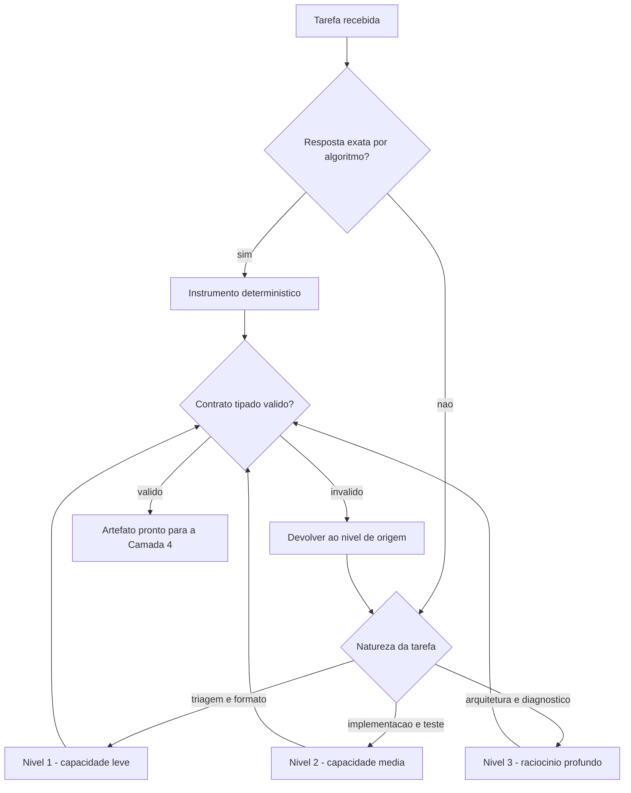

# Capítulo 8: Camada 3 — Motor Cognitivo: Roteamento, Contratos Tipados e Economia de Tokens

## 1. Introdução

No Capítulo 7, você blindou o painel HARNESS: disjuntor, isolamento por diretório de trabalho, teto de repetição e portão binário. O sistema agora não se machuca. Mas contenção não produz inteligência — ela apenas impede dano.

O painel MOTOR é onde a inteligência entra, e ele responde à pergunta mais impactante em custo de toda a arquitetura: **qual capacidade cognitiva resolve esta tarefa, e em qual formato a resposta precisa voltar?** Ao final deste capítulo, você saberá aplicar a lei do determinismo em primeiro lugar, montar um roteamento por níveis de capacidade, impor contratos tipados de saída e executar a economia severa de tokens sem sacrificar precisão.

## 2. Explica

### 2.1 Princípio 1: determinismo em primeiro lugar

A primeira decisão de qualquer pipeline agêntico deveria ser não usar o modelo. Parece contraintuitivo, mas é a regra que mais economiza dinheiro e confiabilidade simultaneamente. Formatar uma data, validar um esquema, renomear um identificador, verificar se um campo existe, contar ocorrências: tudo isso é cálculo, e cálculo tem resposta determinística.

Quando você usa o modelo para cálculo, você compra três problemas pelo preço de um. O primeiro é o custo: token gasto onde não havia ambiguidade. O segundo é a latência: uma operação de microssegundos vira uma chamada de rede de segundos. O terceiro, e mais grave, é a **não reprodutibilidade**: a mesma entrada pode produzir saídas diferentes, e um sistema que não é reprodutível não é auditável.

A fronteira é mais nítida do que parece. O modelo entra onde existe ambiguidade genuína — interpretar uma exigência escrita em linguagem natural, resumir um documento longo, escolher entre alternativas igualmente plausíveis, gerar um texto novo. O modelo não entra onde existe uma resposta correta verificável por algoritmo. Esse critério, aplicado com disciplina, costuma remover entre metade e dois terços das chamadas de um pipeline típico.

### 2.2 Princípio 2: roteamento por capacidade

Quando o modelo é de fato necessário, a segunda pergunta é qual. Existe uma tentação de padronizar no modelo mais capaz disponível — e ela é cara de duas formas. Cara em dinheiro, porque você paga preço de raciocínio profundo por tarefa mecânica. Cara em confiabilidade, porque modelos de fronteira às vezes sobreinterpretam instruções simples, produzindo variações em tarefas que deveriam ser repetíveis.

O roteamento por capacidade organiza o trabalho em três níveis. O primeiro atende triagem mecânica, classificação e formatação — tarefas em que a resposta correta é praticamente única. O segundo atende implementação, refatoração e escrita de testes — tarefas em que existe engenharia real, mas o espaço de solução é bem delimitado. O terceiro atende planejamento arquitetural, diagnóstico de problema ambíguo e auditoria de decisões — tarefas em que a qualidade do raciocínio domina o resultado.

A justificativa é de engenharia, não de marketing. Um modelo menor com contexto bem montado supera com frequência um modelo maior com contexto ruim, porque o gargalo raramente é a capacidade de raciocínio bruto — é a qualidade da informação disponível [7]. Roteamento correto, portanto, começa pela pergunta "o contexto está bom?" e só depois considera capacidade.

### 2.3 Princípio 3: contrato tipado de saída

Um pipeline que consome texto livre está construindo sobre areia. O passo mais frágil de qualquer automação é justamente a interpretação da saída do modelo: você precisa extrair um campo de um parágrafo, e a extração quebra na primeira vez que o modelo resolve ser criativo na formatação.

O contrato tipado elimina a interpretação. Em vez de pedir "liste os problemas encontrados", você declara um esquema com campos obrigatórios, tipos e limites. A saída é validada antes de ser consumida, e a violação do contrato é um erro tratável — não uma exceção silenciosa que aparece três etapas depois.

Há um ganho secundário e significativo: contrato tipado reduz o volume de saída. Um esquema bem desenhado força concisão, porque cada campo pedido tem que existir e cada campo não pedido não tem onde caber. Isso se conecta diretamente ao princípio seguinte.

### 2.4 Princípio 4: economia severa sem perda de precisão

A economia de tokens atua em três frentes, e é importante entender que nenhuma delas significa escrever pior. A primeira é o **raciocínio interno telegráfico**: o bloco de reflexão do modelo usa anotações densas em vez de prosa gramatical, porque ninguém além do próprio modelo lê aquele texto. A segunda é a **saída densa**: as respostas visíveis eliminam preâmbulo, reafirmação de pedido e explicação do que o diff já mostra. A terceira é o **expurgo entre fases**: quando uma etapa termina e é validada, seu contexto é descartado, e só o artefato consolidado segue adiante.

A base teórica das três é a mesma medida de informação que você viu no Capítulo 6: símbolo que não resolve incerteza é desperdício [9]. E a alavanca financeira é concreta — manter prefixo estável permite redução de até 90% no custo dos tokens de entrada e de até 85% na latência [5] [6].

Existe um limite que a pesquisa sobre contexto deixa claro e que vale sublinhar: comprimir não é sempre ganhar. Estudos empíricos sobre restrições de codificação derivadas de limites cognitivos mostram que instruções extremamente condensadas podem reduzir a aderência do modelo, porque removem o contexto que dava sentido à regra [10] [8]. A economia certa corta redundância, não significado.

## 3. Ilustra

Na **sala de controle**, o painel MOTOR é a mesa de roteamento — e ela tem três comportas, não uma.

A primeira comporta é a do **cálculo**: pedidos que têm resposta exata passam por aqui e são resolvidos por instrumento, sem acionar nenhum especialista. A segunda comporta distribui trabalho de engenharia para especialistas de plantão. A terceira reserva os casos ambíguos para o especialista sênior, que custa mais por hora e por isso é acionado com parcimônia.

E há um detalhe no painel que separa uma sala eficiente de uma sala caríssima: todos os pedidos que saem da mesa passam por um **formulário de resposta** — não aceitamos relatório em prosa livre. O formulário tem campos obrigatórios, e formulário incompleto é devolvido. Isso não é burocracia: é o que permite que a próxima estação processe o resultado sem precisar interpretá-lo.



*Figura 8.1 — A mesa de roteamento: resposta exata vai para instrumento determinístico; tarefas ambíguas sobem de nível; toda saída passa por contrato tipado antes de seguir.*

## 4. Técnica

### 4.1 O roteador: decidir antes de gastar

O roteador abaixo implementa a lei do determinismo em primeiro lugar. Ele tenta resolver por regra, e só escala para um nível de capacidade quando a regra não cobre o caso.

```python
#!/usr/bin/env python3
# -*- coding: utf-8 -*-
"""Roteador cognitivo: determinismo primeiro, capacidade sob demanda."""

import re
import sys
from dataclasses import dataclass
from typing import Callable, Optional

NIVEL_1 = "capacidade-leve"
NIVEL_2 = "capacidade-media"
NIVEL_3 = "raciocinio-profundo"

TETO_TOKENS_POR_NIVEL = {NIVEL_1: 800, NIVEL_2: 4000, NIVEL_3: 12000}


@dataclass(frozen=True)
class Decisao:
    nivel: str
    deterministico: bool
    motivo: str
    teto_tokens: int


def normalizar_slug(texto: str) -> Optional[str]:
    if not isinstance(texto, str) or not texto.strip():
        return None
    limpo = re.sub(r"[^a-zA-Z0-9\s-]", "", texto).strip().lower()
    return re.sub(r"[\s-]+", "-", limpo) or None


def contar_campos(dados: dict, obrigatorios: list) -> Optional[list]:
    if not isinstance(dados, dict):
        return None
    return [c for c in obrigatorios if c not in dados or dados[c] in (None, "")]


def decidir(tarefa: str) -> Decisao:
    t = tarefa.lower()
    if any(k in t for k in ("slug", "renomear", "normalizar", "formatar")):
        return Decisao(NIVEL_1, True, "transformacao textual com regra exata", 0)
    if any(k in t for k in ("validar contrato", "checar campos", "conferir esquema")):
        return Decisao(NIVEL_1, True, "validacao de esquema e deterministica", 0)
    if any(k in t for k in ("teste", "implementar", "refatorar", "corrigir")):
        return Decisao(NIVEL_2, False, "engenharia delimitada exige sintese", 4000)
    return Decisao(NIVEL_3, False, "problema aberto exige raciocinio profundo", 12000)


CHECAGENS: dict = {
    "normalizar_slug": normalizar_slug,
}


def executar_deterministico(tarefa: str) -> Optional[str]:
    if "slug" in tarefa.lower():
        resultado = CHECAGENS["normalizar_slug"]("Meu Capítulo: Introdução!")
        return resultado
    return None


def main() -> int:
    tarefa = " ".join(sys.argv[1:]) or "implementar teste do modulo de frete"
    decisao = decidir(tarefa)
    print(f"tarefa            : {tarefa}")
    print(f"nivel             : {decisao.nivel}")
    print(f"deterministico    : {decisao.deterministico}")
    print(f"motivo            : {decisao.motivo}")
    print(f"teto de tokens    : {decisao.teto_tokens}")
    if decisao.deterministico:
        print(f"resultado direto  : {executar_deterministico(tarefa)}")
    return 0


if __name__ == "__main__":
    sys.exit(main())
```

### 4.2 Contrato tipado de saída

O esquema é o artefato que substitui a interpretação de texto livre. Só avança para a camada de ferramentas o que valida contra ele.

```json
{
  "$schema": "https://json-schema.org/draft/2020-12/schema",
  "title": "ResultadoDeAnalise",
  "type": "object",
  "required": ["tarefa", "nivel", "achados", "confianca"],
  "additionalProperties": false,
  "properties": {
    "tarefa": { "type": "string", "minLength": 4 },
    "nivel": { "type": "string", "enum": ["capacidade-leve", "capacidade-media", "raciocinio-profundo"] },
    "achados": {
      "type": "array",
      "minItems": 1,
      "items": {
        "type": "object",
        "required": ["arquivo", "linha", "severidade"],
        "additionalProperties": false,
        "properties": {
          "arquivo": { "type": "string" },
          "linha": { "type": "integer", "minimum": 1 },
          "severidade": { "type": "string", "enum": ["baixa", "media", "alta"] }
        }
      }
    },
    "confianca": { "type": "number", "minimum": 0, "maximum": 1 }
  }
}
```

### 4.3 Sessão de operação do roteador

O log abaixo mostra o comportamento esperado: metade das tarefas nem chega ao modelo, porque tem resposta exata.

```console
$ python roteador.py "normalizar slug do capitulo"
tarefa            : normalizar slug do capitulo
nivel             : capacidade-leve
deterministico    : True
motivo            : transformacao textual com regra exata
teto de tokens    : 0
resultado direto  : meu-capitulo-introducao

$ python roteador.py "implementar teste do modulo de frete"
tarefa            : implementar teste do modulo de frete
nivel             : capacidade-media
deterministico    : False
motivo            : engenharia delimitada exige sintese
teto de tokens    : 4000
[CONTRATO] saida validada: 4 campos obrigatorios presentes
[CONSUMO] 1.uss 842 tokens de entrada (prefixo estavel reaproveitado)
```

### 4.4 Tabela de decisão: qual nível usar

| Tipo de tarefa | Nível | Determinístico? | Teto de tokens |
|---|---|---|---|
| Formatar nome, gerar slug, normalizar texto | Leve | Sim | 0 |
| Validar esquema, conferir campos obrigatórios | Leve | Sim | 0 |
| Classificar severidade por regra explícita | Leve | Sim | 0 |
| Escrever teste unitário a partir de contrato | Média | Não | 4.000 |
| Implementar função com especificação fechada | Média | Não | 4.000 |
| Refatorar módulo preservando comportamento | Média | Não | 4.000 |
| Diagnosticar falha intermitente | Profundo | Não | 12.000 |
| Planejar migração de arquitetura | Profundo | Não | 12.000 |
| Auditar decisão técnica com trade-offs | Profundo | Não | 12.000 |

### 4.5 Roteiro de cinco passos para o painel MOTOR

1. **Inventarie** as chamadas atuais do seu pipeline e classifique cada uma como cálculo ou ambiguidade genuína.
2. **Converta** para script tudo o que for cálculo; cada conversão é economia permanente de custo e de latência.
3. **Distribua** o restante em três níveis, com teto de tokens declarado por nível.
4. **Declare** um esquema de saída para cada chamada de modelo, com campos obrigatórios e tipos fechados.
5. **Meça** consumo por tarefa e trate desvio de teto como sinal de contexto inflado, não como necessidade de mais capacidade.

## 5. Aplica

### A cena que quase todo time vive

Você assume um pipeline de análise de código que consome, por execução, mais que o orçamento trimestral previsto. A investigação revela que cada arquivo passa pelo modelo mais caro disponível, com um prompt que pede um relatório em prosa e depois extrai os campos com expressão regular.

Reconstrua o desperdício, que é triplo. O primeiro é de determinismo: pelo menos metade das verificações feitas — conferir se o arquivo importa um módulo proibido, se o cabeçalho tem a licença, se o nome segue a convenção — tem resposta exata por análise sintática. Pagar modelo por isso é pagar por cálculo. O segundo é de roteamento: relatórios de arquivo — tarefa delimitada — sobem para o nível mais profundo sem necessidade. O terceiro é de formato: pedir prosa e extrair campo por expressão regular é construir um parser frágil sobre uma saída que poderia ser estruturada desde o início.

A correção segue a ordem dos princípios. Primeiro, converter toda verificação de regra em script determinístico. Segundo, rebaixar o que sobrou para o nível médio, reservando o nível profundo para diagnóstico de falha intercalada. Terceiro, substituir o pedido de relatório em prosa por um contrato tipado com os três campos que o pipeline realmente consome. Em pipelines assim, a economia observada costuma ser de ordem de magnitude — e o ganho de confiabilidade é ainda maior que o financeiro, porque a saída passa a ser validável antes de ser consumida.

### Onde isso escala e onde quebra

Roteamento por capacidade escala até o ponto em que a fronteira entre níveis fica ambígua. Se ninguém consegue dizer com segurança se uma tarefa é média ou profunda, o time padroniza no topo por precaução, e o roteamento deixa de existir na prática. O contorno é escrever o critério em forma de teste: tarefa com resposta verificável por contrato é média; tarefa cuja qualidade depende de julgamento é profunda.

Contrato tipado escala bem, mas tem uma fronteira importante: esquemas rígidos demais rejeitam respostas corretas. Se o esquema exige exatamente três campos e a situação real exige um quarto, o agente preenche o terceiro com conteúdo forçado — e você obtém conformidade sem precisão. O contorno é modelar o esquema a partir de casos reais, não de ideias bonitas.

A economia de tokens tem a fronteira mais delicada de todas, e ela não é óbvia. Comprimir demais degrada a aderência: estudos empíricos sobre restrições de codificação mostram que instruções excessivamente condensadas podem reduzir a precisão do modelo, porque retiram o contexto que dava sentido à regra [10]. E existe uma armadilha correlata: quando você comprime pedindo explicações mais curtas, o modelo pode começar a omitir as ressalvas que tornavam a resposta honesta. O contorno é medir três coisas juntas — custo, latência e taxa de retrabalho. Se a economia sobe e o retrabalho sobe junto, você não economizou: você adiou o custo.

E vale a condição de contorno estrutural: **este capítulo não compensa em pipelines de baixo volume**. Se o seu sistema faz vinte chamadas por dia, o custo de projetar três níveis e esquemas tipados supera o ganho. Nesse caso, a decisão honesta é padronizar em um nível e investir o esforço em contexto — que rende mais.

### Armadilhas comuns

- Usar modelo para cálculo. Cada verificação determinística convertida em script economiza duas vezes: custo e latência.
- Padronizar no modelo mais caro. Você paga raciocínio profundo por triagem mecânica e ainda ganha variação indesejada em tarefa que deveria ser repetível.
- Consumir texto livre no pipeline. Toda extração por expressão regular é dívida acumulada que quebra na primeira mudança de formatação.
- Comprimir contexto sem medir a consequência. Economia e retrabalho sobem juntos quando você corta significado em vez de redundância [10].
- Confiar em benchmark público como prova de capacidade real. A evidência é contundente: em base de avaliação com dados não vistos, o mesmo modelo que resolve a casa dos 23% numa suíte cai para cerca de 17,8% em outra, e outro caiu de 23,1% para 14,9% [3]. Benchmark mede o que ele mede — e não mede o seu domínio [1].

## 6. Conclusão

Neste capítulo você abriu o painel MOTOR e construiu sua mesa de roteamento. O primeiro princípio é não usar o modelo quando existe resposta exata — determinismo em primeiro lugar, pela economia tripla de custo, latência e reprodutibilidade. O segundo é rotear por capacidade em três níveis, reservando raciocínio profundo para o que realmente exige julgamento. O terceiro é impor contrato tipado de saída, eliminando a interpretação frágil de texto livre. O quarto é praticar economia severa sem cortar significado.

Você viu também por que confiar em número de referência isolado é perigoso. O mesmo modelo que atinge 23,1% em uma suíte de avaliação cai para 14,9% em outra com dados não vistos, e outro recua de 22,7% para 17,8% [3]. A capacidade real se mede no seu domínio, com o seu contexto — não no ranking público.

**Desafio:** conte quantas chamadas de modelo do seu pipeline têm resposta exata por algoritmo. Converta pelo menos uma delas em script determinístico e compare custo e latência antes e depois. O número que você obtiver é a sua economia recorrente, multiplicada por cada execução futura.

O Capítulo 9 abre o último painel: as FERRAMENTAS — servidores de contexto, idempotência, validação de saída e persistência de estado auditável.

## 7. Referências Bibliográficas

[1] SWE-BENCH. *SWE-bench Leaderboards*. Disponível em: https://www.swebench.com/. Acesso em: 12 set. 2026.
[2] SWE-BENCH. *SWE-bench Verified Leaderboard*. Disponível em: https://www.swebench.com/verified.html. Acesso em: 12 set. 2026.
[3] SCALE LABS. *SWE-Bench Pro (Public Dataset) — Leaderboard*. Disponível em: https://labs.scale.com/leaderboard/swe_bench_pro_public. Acesso em: 12 set. 2026.
[4] OPENAI. *Introducing SWE-bench Verified*. Disponível em: https://openai.com/index/introducing-swe-bench-verified/. Acesso em: 12 set. 2026.
[5] ANTHROPIC. *Prompt Caching — Claude Platform Docs*. Disponível em: https://platform.claude.com/docs/en/build-with-claude/prompt-caching. Acesso em: 12 set. 2026.
[6] AMAZON WEB SERVICES. *Prompt caching for faster model inference — Amazon Bedrock*. Disponível em: https://docs.aws.amazon.com/bedrock/latest/userguide/prompt-caching.html. Acesso em: 12 set. 2026.
[7] MEI, Lingrui et al. *A Survey of Context Engineering for Large Language Models*. In: arXiv. 2025. Disponível em: https://arxiv.org/abs/2507.13334. Acesso em: 12 set. 2026.
[8] ZHANG, Qizheng et al. *Agentic Context Engineering: Evolving Contexts for Self-Improving Language Models*. In: arXiv. 2025. Disponível em: https://arxiv.org/abs/2510.04618. Acesso em: 12 set. 2026.
[9] SHANNON, Claude E. *A Mathematical Theory of Communication*. Bell System Technical Journal, 1948. Disponível em: https://doi.org/10.1002/j.1538-7305.1948.tb01338.x. Acesso em: 12 set. 2026.
[10] PEREIRA, Luciano. *Empirical Validation of Cognitive-Derived Coding Constraints and Tokenization Asymmetries in LLM-Assisted Software Engineering*. 2026. Disponível em: https://doi.org/10.2139/ssrn.6294900. Acesso em: 12 set. 2026.
[11] HADI, Muhammad Usman et al. *A Survey on Large Language Models: Applications, Challenges, Limitations, and Practical Usage*. 2023. Disponível em: https://doi.org/10.36227/techrxiv.23589741.v1. Acesso em: 12 set. 2026.
[12] ALI, Mohamad Abou; DORNAIKA, Fadi; CHARAFEDDINE, Jinan. *Agentic AI: a comprehensive survey of architectures, applications, and future directions*. In: Artificial Intelligence Review. 2025. Disponível em: https://doi.org/10.1007/s10462-025-11422-4. Acesso em: 12 set. 2026.
[13] BELLAPUKONDA, Jahnavi. *A Comparative Evaluation of LLM-based Coding Agents for Automated Software Development Tasks*. 2026. Disponível em: https://doi.org/10.2139/ssrn.6755658. Acesso em: 12 set. 2026.
[14] METR. *Recent Frontier Models Are Reward Hacking*. Disponível em: https://metr.org/blog/2025-06-05-recent-reward-hacking/. Acesso em: 12 set. 2026.
[15] MORAMPUDI, Abhishek et al. *A survey of reward hacking in agentic large language model systems*. In: Discover Artificial Intelligence. 2026. Disponível em: https://link.springer.com/article/10.1007/s44163-026-01980-z. Acesso em: 12 set. 2026.
[16] ROBBES, Romain et al. *Agentic Much? Adoption of Coding Agents on GitHub*. In: ACM Transactions on Software Engineering and Methodology. 2026. Disponível em: https://doi.org/10.1145/3822180. Acesso em: 12 set. 2026.
[17] GE, Y. T. et al. *A Survey of Vibe Coding with Large Language Models*. In: arXiv. 2025. Disponível em: http://arxiv.org/abs/2510.12399. Acesso em: 12 set. 2026.
[18] DORA / GOOGLE CLOUD. *State of AI-assisted Software Development 2025*. Disponível em: https://dora.dev/dora-report-2025/. Acesso em: 12 set. 2026.
[19] STACK OVERFLOW. *2025 Developer Survey — AI*. Disponível em: https://survey.stackoverflow.co/2025/ai. Acesso em: 12 set. 2026.
[20] NATIONAL INSTITUTE OF STANDARDS AND TECHNOLOGY. *Artificial Intelligence Risk Management Framework: Generative Artificial Intelligence Profile (NIST AI 600-1)*. Disponível em: https://nvlpubs.nist.gov/nistpubs/ai/NIST.AI.600-1.pdf. Acesso em: 12 set. 2026.
