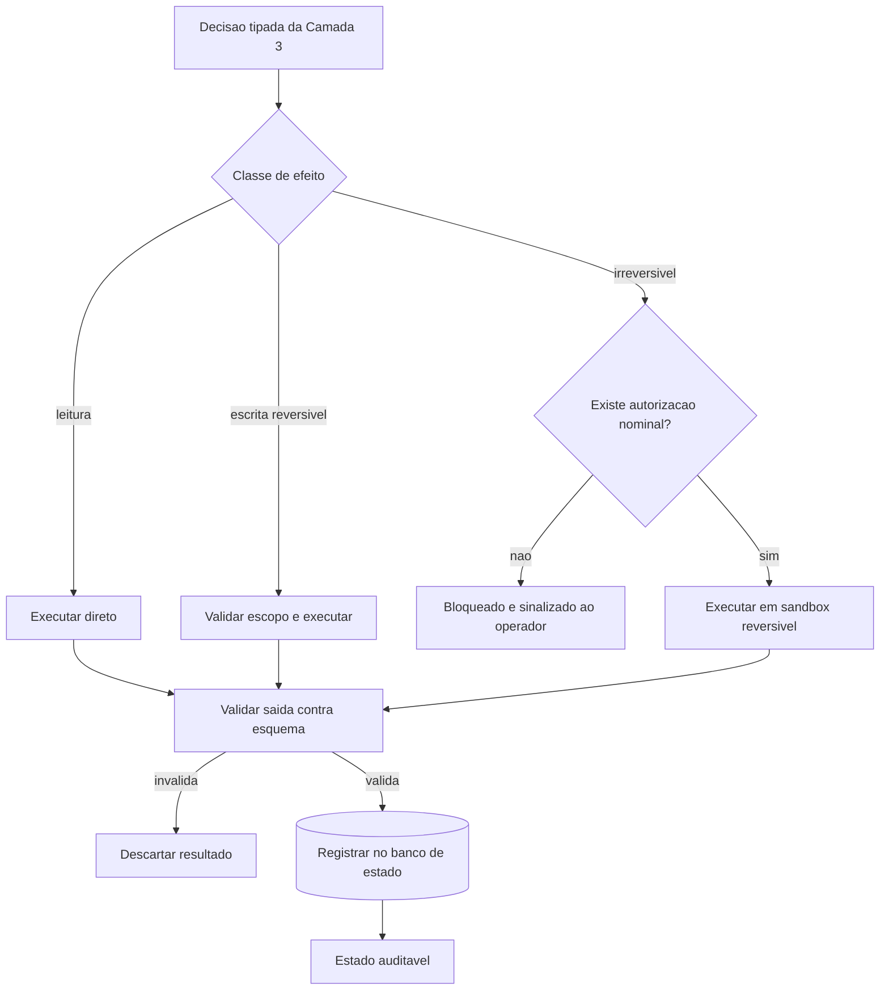

# Capítulo 9: Camada 4 — Ferramentas, MCP e Persistência: A Usina Determinística

## 1. Introdução

No Capítulo 8, o painel MOTOR decidiu qual capacidade resolve cada tarefa e em que formato a resposta precisa voltar. A decisão, até aqui, é intenção. Falta o braço que toca o mundo.

O painel FERRAMENTAS responde à pergunta final da arquitetura: **como a decisão se converte em mudança real, e onde isso fica registrado?** É a camada que separa um gerador de texto inofensivo de um sistema que altera bancos, arquivos e infraestrutura. Ao final deste capítulo, você saberá construir ferramentas com escopo mínimo, projetar idempotência para que a repetição seja segura e manter um banco de estado que torna toda a operação auditável.

## 2. Explica

### 2.1 O protocolo de ferramentas e sua superfície de ataque

O protocolo que padroniza a conexão entre ambiente hospedeiro e ferramentas externas resolveu um problema real: antes dele, cada aplicativo inventava sua própria forma de expor capacidades, e mudar de aplicativo significava reimplementar tudo [1]. Com contrato comum, uma ferramenta escrita uma vez serve a qualquer ambiente compatível.

O custo dessa portabilidade é superfície de ataque, e ela é maior do que a intuição sugere. A especificação não prevê defesas nativas contra três classes de risco bem documentadas: descrição enganosa de ferramenta — em que o texto que descreve a capacidade diz uma coisa e o código faz outra; troca de implementação depois da aprovação, conhecida como *rug pull*; e abuso de contexto entre servidores, em que dados de um servidor influenciam indevidamente a decisão sobre outro [2] [4].

Orientações oficiais de segurança para esse tipo de integração convergem em três recomendações: executar código não verificado apenas dentro de sandbox, conceder a cada ferramenta somente o escopo necessário e validar a saída antes de consumi-la [2]. Levantamentos de segurança complementam o quadro com um catálogo de riscos emergentes, que inclui manipulação de esquema e abuso de contexto entre agentes [3].

A conclusão arquitetural é simples e desconfortável: no painel FERRAMENTAS, **confiança não é um parâmetro**. Origens são verificadas, escopos são mínimos e saídas são validadas — sempre, mesmo quando a ferramenta é interna.

### 2.2 Idempotência: a propriedade que permite repetir com segurança

Uma ferramenta idempotente produz o mesmo estado final quando executada uma ou várias vezes com a mesma entrada. Parece detalhe acadêmico; é o que torna a recuperação de falha uma operação trivial.

Considere o contraste. Uma ferramenta que **incrementa** um contador quebra quando repetida após uma falha parcial: o número fica errado e ninguém sabe por quê. Uma ferramenta que **define** o contador para um valor calculado a partir da entrada é segura: rodar duas vezes produz o mesmo resultado. A diferença é de poucos caracteres no código e de horas no diagnóstico.

Idempotência é o que permite que a esteira se recupere sozinha. Quando uma etapa falha no meio, o operador — humano ou agente — pode reexecutar sem medo de duplicar efeito. Sem ela, toda falha exige inspeção manual do estado antes de tentar de novo, e é justamente nesse momento de pressão que erros são cometidos [15].

### 2.3 Persistência: o registro que torna a operação auditável

A terceira peça é o banco de estado. Sem ele, o processo é uma sucessão de decisões que ninguém consegue reconstruir depois. Com ele, cada ação tem registro com origem, resultado e horário — e a pergunta "por que o sistema chegou a este estado?" passa a ter resposta.

A escolha técnica comum é um banco relacional embarcado, e o motivo é operacional. O modo de journaling por *write-ahead log* permite leituras concorrentes com um único escritor, o que é exatamente o perfil de uma esteira: várias tarefas consultando estado enquanto uma registra resultado [7] [8]. Além disso, um arquivo local elimina a dependência de serviço externo para uma função que precisa estar disponível sempre — inclusive durante uma indisponibilidade de rede.

Vale registrar um alerta de escopo que você aplicará no Capítulo 12: o banco de estado guarda decisão e telemetria, não os dados sensíveis da aplicação. Retenção precisa ser declarada, e expurgo precisa ser planejado desde o início. Orientação regulatória sobre risco de IA generativa é explícita quanto à rastreabilidade de decisões, e rastreabilidade sem política de retenção vira acúmulo indefinido [14].

## 3. Ilustra

O painel FERRAMENTAS da sua **sala de controle** é o arsenal — e o detalhe que o torna seguro é que cada instrumento tem uma etiqueta de escopo.

Na parede, os instrumentos estão pendurados em ordem de risco. Os primeiros são os de **leitura**: consultar, listar, verificar. Esses são baratos e reversíveis, e por isso podem ser usados com frequência. Depois vêm os de **escrita reversível**: criar arquivo, gravar registro, atualizar campo. Esses exigem registro de ação. Por último, isolados em um armário com trava, os de **efeito irreversível**: apagar dados, publicar release, alterar permissão de produção. Nesse armário, cada retirada exige autorização nominal.

E existe o **livro de bordo**. Nada é retirado do arsenal sem ser anotado: quem pegou, quando, para quê e com que resultado. O livro de bordo é o que permite, meses depois, reconstruir por que o sistema está como está. Sem ele, você tem um sistema que funciona por razões desconhecidas — que é a definição operacional de risco.



*Figura 9.1 — A usina de ferramentas: classes de efeito determinam o nível de controle, toda saída passa por validação e todo resultado é registrado no banco de estado.*

## 4. Técnica

### 4.1 Ferramenta idempotente com escopo e validação de saída

O trecho abaixo demonstra o padrão completo exigido nesta camada: escopo declarado, operação idempotente, validação de esquema e registro no banco de estado.

```python
#!/usr/bin/env python3
# -*- coding: utf-8 -*-
"""Ferramenta idempotente de sincronizacao com escopo minimo e auditoria."""

import hashlib
import json
import sqlite3
import sys
from dataclasses import dataclass, asdict
from pathlib import Path
from typing import Optional

ESQUEMA_REGISTRO = {"origem", "destino", "hash", "status"}
BANCO = Path("data/estado.db")


@dataclass(frozen=True)
class Resultado:
    origem: str
    destino: str
    hash: str
    status: str


def escopo_permitido(destino: Path, raizes: list) -> bool:
    """Escopo minimo: a ferramenta so escreve dentro das raizes autorizadas."""
    try:
        resolvido = destino.resolve()
    except OSError:
        return False
    return any(resolvido.is_relative_to(Path(r).resolve()) for r in raizes)


def calcular_hash(conteudo: bytes) -> str:
    return hashlib.sha256(conteudo).hexdigest()[:16]


def sincronizar(origem: Path, destino: Path, raizes: list) -> Optional[Resultado]:
    if not origem.is_file():
        return None
    if not escopo_permitido(destino, raizes):
        raise PermissionError(f"destino fora do escopo autorizado: {destino}")

    dados = origem.read_bytes()
    digest = calcular_hash(dados)

    # Idempotencia: se o hash atual ja e o desejado, nada a fazer.
    if destino.exists() and calcular_hash(destino.read_bytes()) == digest:
        return Resultado(str(origem), str(destino), digest, "inalterado")

    destino.parent.mkdir(parents=True, exist_ok=True)
    destino.write_bytes(dados)
    return Resultado(str(origem), str(destino), digest, "sincronizado")


def validar_saida(registro: dict) -> bool:
    return set(registro.keys()) == ESQUEMA_REGISTRO and all(
        isinstance(v, str) and v for v in registro.values())


def registrar(registro: dict) -> None:
    if not validar_saida(registro):
        raise ValueError("saida fora do contrato: campos obrigatorios ausentes")
    BANCO.parent.mkdir(parents=True, exist_ok=True)
    conexao = sqlite3.connect(BANCO)
    conexao.execute("PRAGMA journal_mode=WAL;")
    conexao.execute(
        "CREATE TABLE IF NOT EXISTS acoes "
        "(id INTEGER PRIMARY KEY AUTOINCREMENT, origem TEXT, destino TEXT, "
        " hash TEXT, status TEXT, registrado_em TEXT DEFAULT CURRENT_TIMESTAMP)")
    conexao.execute(
        "INSERT INTO acoes (origem, destino, hash, status) VALUES (?, ?, ?, ?)",
        (registro["origem"], registro["destino"], registro["hash"], registro["status"]))
    conexao.commit()
    conexao.close()


def main() -> int:
    origem = Path(sys.argv[1]) if len(sys.argv) > 1 else Path("README.md")
    destino = Path(sys.argv[2]) if len(sys.argv) > 2 else Path("dist/README.md")
    raizes = ["dist"]
    try:
        resultado = sincronizar(origem, destino, raizes)
    except PermissionError as erro:
        print(f"[BLOQUEIO] {erro}")
        return 1
    if resultado is None:
        print(f"[FALHA] origem inexistente: {origem}")
        return 1
    registrar(asdict(resultado))
    print(json.dumps(asdict(resultado), ensure_ascii=False, indent=2))
    return 0


if __name__ == "__main__":
    sys.exit(main())
```

### 4.2 Declaração de ferramentas com permissão mínima

A configuração abaixo é o artefato que impede a ferramenta de receber mais poder do que precisa. Note que cada entrada declara explicitamente o que a ferramenta **não** pode fazer.

```json
{
  "servidores": [
    {
      "nome": "estado-interno",
      "transporte": "stdio",
      "escopo": {
        "leitura": ["data/", "config/"],
        "escrita": ["data/estado.db"],
        "proibido": ["..", "/etc", "variaveis-de-ambiente-sensiveis"]
      },
      "validacao_de_saida": "esquema-registro.json",
      "exige_autorizacao": false
    },
    {
      "nome": "publicacao",
      "transporte": "stdio",
      "escopo": {
        "leitura": ["dist/"],
        "escrita": ["dist/"],
        "proibido": ["producao", "secrets", ".."]
      },
      "validacao_de_saida": "esquema-publicacao.json",
      "exige_autorizacao": true,
      "motivo_autorizacao": "efeito irreversivel em ambiente publico"
    }
  ]
}
```

### 4.3 Sessão real de operação

O log abaixo mostra o comportamento correto em três situações: bloqueio fora de escopo, idempotência comprovada e registro auditável.

```console
$ python ferramenta.py README.md dist/README.md
{
  "origem": "README.md",
  "destino": "dist/README.md",
  "hash": "9f2c41ab77de0310",
  "status": "sincronizado"
}

$ python ferramenta.py README.md dist/README.md
{
  "origem": "README.md",
  "destino": "dist/README.md",
  "hash": "9f2c41ab77de0310",
  "status": "inalterado"
}

$ python ferramenta.py README.md producao/README.md
[BLOQUEIO] destino fora do escopo autorizado: producao/README.md

$ sqlite3 data/estado.db "SELECT id, status, registrado_em FROM acoes ORDER BY id DESC LIMIT 2;"
2|inalterado|2026-09-12 14:22:07
1|sincronizado|2026-09-12 14:21:51
```

### 4.4 Matriz de risco por classe de efeito

Use a matriz para decidir o nível de controle de cada ferramenta antes de autorizá-la.

| Classe de efeito | Exemplo | Reversível? | Escopo | Autorização |
|---|---|---|---|---|
| Leitura | Consultar arquivo, listar tabela | Sim | Diretório de projeto | Não |
| Escrita reversível | Gravar registro, criar arquivo | Sim | Diretório nomeado | Não |
| Alteração de estado local | Atualizar campo, remover item | Sim (com backup) | Banco local | Registro obrigatório |
| Chamada de rede externa | Consultar API pública | Não | Domínio declarado | Escopo mínimo |
| Escrita em produção | Publicar artefato | Não | Ambiente nomeado | Nominal, por tarefa |

### 4.5 Roteiro de cinco passos para a Camada 4

1. **Classifique** cada ferramenta por classe de efeito e aplique o nível de controle correspondente na matriz.
2. **Declare** escopo explícito, incluindo o que é proibido — permissão ampla é permissão que ninguém revisou.
3. **Projete** toda escrita para ser idempotente: definir estado, nunca incrementar às cegas.
4. **Valide** a saída de toda ferramenta contra esquema antes de consumi-la, mesmo quando a origem é interna.
5. **Registre** cada ação no banco de estado com origem, destino, hash e resultado, e declare política de retenção.

## 5. Aplica

### A cena que quase todo time vive

Você instala uma ferramenta de terceiro para automatizar a organização de tickets internos. A descrição dela é impecável: ler chamados, classificar por urgência, mover para a coluna correta. Ela funciona por três semanas.

Na quarta semana, surge um comportamento estranho: tickets que deveriam ir para urgência param em backlog, e surgem arquivos de configuração que ninguém escreveu. A investigação revela o desenho. A ferramenta havia sido atualizada silenciosamente duas semanas antes, e a nova versão alterava o formato de saída para incluir um caminho de arquivo — que o pipeline consumia sem validar. Como o esquema de validação não existia, o campo novo entrou no fluxo e passou a ser interpretado como destino de escrita.

Esse é o cenário que orientações oficiais de segurança descrevem como troca de implementação após aprovação, combinada com ausência de validação de saída [2] [4]. O diagnóstico tem três componentes independentes. Primeiro, **escopo amplo demais**: a ferramenta recebeu permissão de escrita em um diretório que não precisava. Segundo, **ausência de validação**: a saída foi consumida sem conferência contra esquema, então o campo inesperado passou. Terceiro, **trilha ausente**: sem banco de estado, a mudança de comportamento ficou invisível até virar sintoma visível ao usuário — e nesse ponto você já perdeu a referência de quando o desvio começou.

A correção segue a matriz. Restringir o escopo de escrita ao diretório estritamente necessário e declarar explicitamente o que é proibido. Instalar validação de saída com esquema fechado, rejeitando campo adicional. E registrar cada ação com origem, destino, hash e resultado, para que a próxima mudança de comportamento apareça como anomalia no registro — não como mistério três semanas depois.

### Onde isso escala e onde quebra

Cada ferramenta individual escala bem com escopo mínimo. O problema aparece no **conjunto**: com muitas ferramentas simultâneas, o número de combinações possíveis de interação cresce mais rápido do que a capacidade de auditoria humana. Levantamentos sobre sistemas agênticos chamam atenção para esse ponto — coordenação e observabilidade entre componentes é requisito, não refinamento [11] [12]. O contorno é reduzir a contagem: consolide ferramentas semelhantes e revogue as que não têm uso comprovado no último ciclo.

A idempotência escala até o limite em que a operação é naturalmente acumulativa. Nem tudo pode ser expresso como "definir estado": acumular contadores, emitir eventos e anexar a logs são operações inerentemente não idempotentes. Nesses casos, o contorno é introduzir uma chave de idempotência — um identificador único por operação que permite detectar repetição e ignorá-la. O que **não funciona** é deixar a operação acumulativa sem proteção e confiar que a falha não vai acontecer.

A terceira fronteira é a persistência. Um banco local resolve maravilhosamente bem um único nó e degrada quando múltiplos processos escrevem com alta frequência; o modo com journal permite um escritor por vez, deliberadamente [8]. O contorno é manter o banco de estado para decisão e telemetria — operações curtas e frequentes — e separar volume alto em armazenamento apropriado. Forçar um banco embarcado a absorver carga de aplicação é a forma mais rápida de transformar um bom componente em gargalo.

E vale a condição de contorno final: **esta camada é a mais perigosa de todas e a menos recompensada em protótipo**. Em fase exploratória, o valor de instrumentar escopo e auditoria é baixo, porque o artefato vai mudar inteiro em dois dias. Mas é exatamente essa fase que costuma virar produção por acidente. A decisão honesta é declarar o escopo do protótipo explicitamente e agendar a migração — antes que ele vire sistema crítico sem nenhuma das proteções desta camada.

### Armadilhas comuns

- Confiar em ferramenta pela descrição. A descrição é texto; o comportamento é código, e os dois podem divergir sem aviso [3].
- Consumir saída sem validar esquema. Campo inesperado quebra pipeline silenciosamente, e o sintoma aparece longe da causa.
- Conceder escopo de escrita amplo "por conveniência". Conveniência de hoje é incidente de amanhã.
- Escrever ferramenta não idempotente e recuperar falha manualmente. Toda recuperação manual é uma oportunidade de erro sob pressão.
- Tratar o banco de estado como banco de aplicação. Ele guarda decisão e telemetria, com retenção declarada — não dados de negócio [14].

## 6. Conclusão

Neste capítulo você abriu o painel FERRAMENTAS e construiu a usina determinística. O primeiro mecanismo é o contrato de ferramentas com escopo mínimo e validação de saída — porque a portabilidade do protocolo traz consigo risco de descrição enganosa, troca de implementação e abuso de contexto, e a resposta arquitetural a todos eles é desconfiança sistemática [1] [2]. O segundo é a idempotência: escrever para definir estado, e não para acumular efeito, é o que torna a recuperação de falha uma operação trivial. O terceiro é a persistência auditável em banco local com journaling, que permite leitura concorrente e registro durável de decisão [7].

Você viu também um número que justifica a validação obsessiva: cerca de 20% das referências de pacote em código gerado por IA apontam para algo que não existe no registro público [9]. Uma ferramenta que resolve dependências sem conferir contra o registro real constrói sobre nomes inventados — e nomes inventados são exatamente o que um atacante registraria antes de você.

**Desafio:** liste as ferramentas que o seu pipeline aciona hoje e classifique cada uma pela matriz de risco. Depois responda, para cada, uma pergunta única: se a descrição dessa ferramenta fosse mentira, você perceberia? Se a resposta for não, você acabou de encontrar a próxima validação a implementar.

O Capítulo 10 fecha a Parte II e abre a Parte III com o manual de montagem: como replicar as quatro camadas em um projeto novo e como blindar um projeto legado, sem reescrever o que já funciona.

## 7. Referências Bibliográficas

[1] ANTHROPIC. *Model Context Protocol Specification (2025-06-18)*. Disponível em: https://modelcontextprotocol.io/specification/2025-06-18. Acesso em: 12 set. 2026.
[2] NATIONAL SECURITY AGENCY. *Model Context Protocol (MCP) Security — CSI*. Disponível em: https://www.nsa.gov/Portals/75/documents/Cybersecurity/CSI_MCP_SECURITY.pdf. Acesso em: 12 set. 2026.
[3] CHECKMARX. *11 Emerging AI Security Risks with MCP (Model Context Protocol)*. Disponível em: https://checkmarx.com/zero-post/11-emerging-ai-security-risks-with-mcp-model-context-protocol/. Acesso em: 12 set. 2026.
[4] CLOUD SECURITY ALLIANCE. *MCP Security Crisis: Systemic Design Flaws in AI Agent Infrastructure*. Disponível em: https://labs.cloudsecurityalliance.org/research/csa-research-note-mcp-security-crisis-20260504-csa-styled/. Acesso em: 12 set. 2026.
[5] PRUDVI SAISARAN PONDURU. *AgentMesh-MCP: A Secure and Governed Framework for Agentic AI Systems Using LLM Agents and Model Context Protocol Servers*. In: International Journal of Scientific Research in Engineering and Management. 2026. Disponível em: https://doi.org/10.55041/ijsrem62689. Acesso em: 12 set. 2026.
[6] OKULA, Oghenekeno Hilkiah; NEERANJAN, Chitare. *A Design Science Approach for Agentic AI in Network Engineering: Autonomous Network Management Using AI Agents, LLMs and Model Context Protocol (MCP) Mechanisms*. 2026. Disponível em: https://doi.org/10.36227/techrxiv.176978431.15223796/v1. Acesso em: 12 set. 2026.
[7] SQLITE. *Write-Ahead Logging*. Disponível em: https://www.sqlite.org/wal.html. Acesso em: 12 set. 2026.
[8] SQLITE. *File Locking And Concurrency In SQLite Version 3*. Disponível em: https://sqlite.org/lockingv3.html. Acesso em: 12 set. 2026.
[9] TRAXTECH. *20% of AI-Generated Code Dependencies Don't Exist, Creating Supply Chain Security Risks*. Disponível em: https://www.traxtech.com/blog/20-of-ai-generated-code-dependencies-dont-exist-creating-supply-chain-security-risks. Acesso em: 12 set. 2026.
[10] VERACODE. *2025 GenAI Code Security Report: AI-Generated Code Security Risks*. Disponível em: https://www.veracode.com/blog/ai-generated-code-security-risks/. Acesso em: 12 set. 2026.
[11] ALI, Mohamad Abou; DORNAIKA, Fadi; CHARAFEDDINE, Jinan. *Agentic AI: a comprehensive survey of architectures, applications, and future directions*. In: Artificial Intelligence Review. 2025. Disponível em: https://doi.org/10.1007/s10462-025-11422-4. Acesso em: 12 set. 2026.
[12] LORENZONI, Giuliano; ALENCAR, Paulo; COWAN, Donald. *LLM-X: A Scalable Negotiation-Oriented Exchange for Communication Among Personal LLM Agents*. In: Proceedings of the 2026 International Workshop on Agentic Engineering. 2026. Disponível em: https://doi.org/10.1145/3786167.3788429. Acesso em: 12 set. 2026.
[13] RAKSHIT, Yerram Sai. *Modernizing Software Testing: AI, Telemetry, and Agentic Quality Engineering*. In: International Journal of AI Engineering. 2026. Disponível em: https://doi.org/10.34218/ijaieg_01_01_002. Acesso em: 12 set. 2026.
[14] NATIONAL INSTITUTE OF STANDARDS AND TECHNOLOGY. *Artificial Intelligence Risk Management Framework: Generative Artificial Intelligence Profile (NIST AI 600-1)*. Disponível em: https://nvlpubs.nist.gov/nistpubs/ai/NIST.AI.600-1.pdf. Acesso em: 12 set. 2026.
[15] NYGARD, Michael T. *Release It!: Design and Deploy Production-Ready Software*. 2. ed. Pragmatic Bookshelf, 2018. Disponível em: https://pragprog.com/titles/mnee2/release-it-second-edition/. Acesso em: 12 set. 2026.
[16] HUMBLE, Jez; FARLEY, David. *Continuous Delivery: Reliable Software Releases through Build, Test, and Deployment Automation*. Addison-Wesley, 2010. Disponível em: https://continuousdelivery.com/. Acesso em: 12 set. 2026.
[17] MEI, Lingrui et al. *A Survey of Context Engineering for Large Language Models*. In: arXiv. 2025. Disponível em: https://arxiv.org/abs/2507.13334. Acesso em: 12 set. 2026.
[18] ANTHROPIC. *Prompt Caching — Claude Platform Docs*. Disponível em: https://platform.claude.com/docs/en/build-with-claude/prompt-caching. Acesso em: 12 set. 2026.
[19] GIT. *git-worktree Documentation*. Disponível em: https://git-scm.com/docs/git-worktree. Acesso em: 12 set. 2026.
[20] MARTIN, Robert C. *Clean Architecture: A Craftsman's Guide to Software Structure and Design*. Prentice Hall, 2017. Disponível em: https://www.pearson.com/. Acesso em: 12 set. 2026.
