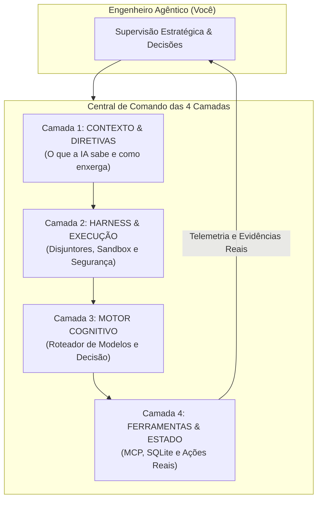

# Capítulo 1: O Contexto Real de Origem: O Projeto Arsenal Open Source

## 1. Introdução

Seja bem-vindo à nova era da criação de software. Se você nunca escreveu uma linha de código na vida, ou se já tentou aprender programação tradicional e se frustrou com a complexidade de sintaxes, compiladores e frameworks intermináveis, você está no lugar certo e no momento histórico exato [1].

O mundo do desenvolvimento mudou para sempre. Hoje, você não precisa ser um digitador manual de código para construir sistemas de software profissionais, robustos e escaláveis. Você pode se tornar um **Engenheiro Agêntico** — o comandante de uma verdadeira central de desenvolvimento autônoma, onde múltiplos agentes de Inteligência Artificial trabalham sob suas ordens, diretrizes e supervisão estratégica [1] [2].

Mas atenção: usar IA para programar não significa simplesmente abrir uma janela de chat, digitar um pedido vago e torcer para dar certo. Quem faz isso enfrenta rapidamente quatro dores terríveis: faturas de API astronômicas, agentes que sofrem de "amnésia" e esquecem o que fizeram dez minutos atrás, códigos que parecem funcionar mas escondem falhas críticas e a dependência cega de uma única ferramenta [3].

Este livro nasceu no campo de batalha real do **Projeto Arsenal Open Source** e da **Fábrica Agêntica de Livros (`proj_fabrica-de-livros`)** — um ecossistema industrial que desenvolveu mais de 49 compêndios, produziu dezenas de livros técnicos de forma 100% autônoma via comando `/criar-livro` e orquestrou centenas de agentes autônomos em produção simultânea [1]. O que você tem em mãos é o **Tratado das 4 Camadas**: a metodologia comprovada que transforma o caos das IAs em uma esteira de engenharia determinística, segura, altamente econômica e acessível para qualquer pessoa [1] [2].

## 2. Explica

### 2.1 A Transição Histórica: Do Programador Manual ao Engenheiro Agêntico

Durante mais de cinquenta anos, a programação tradicional funcionou sob o paradigma da digitação manual [4]. O desenvolvedor sentava diante de uma tela em branco e digitava caractere por caractere a sintaxe de linguagens como Python, JavaScript ou C++. O ser humano era o operário braçal da codificação.

Com o advento dos modelos de linguagem avançados (LLMs) e dos agentes de desenvolvimento autônomo (como Claude Code, Codex, Antigravity, OpenCode e MiMo Code), a unidade básica de trabalho deixou de ser o arquivo de código e passou a ser o **sistema de governança do agente** [2] [5]. 

O papel do profissional agora é o de **Engenheiro Agêntico**:
- Em vez de digitar funções, você define **Diretivas Claras e Contratos Formais** [1].
- Em vez de caçar bugs manualmente, você instala **Circuit Breakers (Disjuntores) e Testes Automatizados** [6].
- Em vez de escolher modelos caros para tarefas simples, você opera um **Roteador Cognitivo Inteligente** que economiza até 90% dos custos [7].
- Em vez de confiar em respostas mágicas, você conecta ferramentas padronizadas via **Protocolo MCP e Banco de Estado Persistente** [8].

### 2.2 O Projeto Arsenal e as 4 Dores Reais do Desenvolvimento com IA

No ecossistema do Projeto Arsenal, enfrentamos centenas de horas de testes práticos que revelaram os quatro maiores gargalos enfrentados por quem tenta desenvolver com IA sem método [1] [3]:

1. **A Fatura Explosiva (Custo Descontrolado)**: Enviar o código inteiro do projeto repetidamente a cada interação consome milhões de tokens e gera contas de centenas de dólares em poucos dias [3].
2. **A Amnésia Progressiva (Janela de Contexto Sobrecarregada)**: Conforme a conversa cresce, a IA entra no fenômeno científico conhecido como *Lost in the Middle*, esquecendo regras estabelecidas no início da sessão [5].
3. **A Alucinação de Sucesso (Validação Falsa)**: A IA responde entusiasticamente "Código implementado com sucesso!", mas o programa quebra ao ser executado porque faltou validação mecânica real [1].
4. **O Aprisionamento Tecnológico (Vendor Lock-in)**: Ficar dependente de um único provedor proprietário, ficando de mãos atadas quando a API sofre instabilidade ou reajuste de preço [7].

### 2.3 A Matriz de Transposição Universal

A solução encontrada no Projeto Arsenal não foi trocar de IA, mas sim criar uma **Matriz de Transposição Universal** baseada em quatro painéis operacionais invioláveis [1] [2]. Essa matriz funciona independentemente da linguagem de programação do projeto (seja Python, Node.js, Rust ou Go) e do modelo de IA utilizado (Claude, GPT, Gemini ou DeepSeek), permitindo que iniciantes construam software de padrão corporativo com controle absoluto [1].


### 2.4 O Projeto Prático Transversal da Obra: O Sistema HubCliente

Para que você não fique apenas na teoria abstrata, esta obra adota um **Fio Condutor Prático Único do início ao fim**: você construirá o **Sistema HubCliente** [1].

O cenário é o clássico pesadelo das empresas: hoje, o cadastro de clientes depende de planilhas Excel enviadas por e-mail, cheias de erros de digitação, CPFs duplicados e dados perdidos [1]. 

Ao longo dos capítulos deste livro, você atuará como o Engenheiro Agêntico que comandará as 4 Camadas para transformar essa planilha arcaica em um **Aplicativo Web Moderno, com validação inteligente de dados, banco SQLite ultrarrápido, proteção contra falhas e testes 100% automatizados** [1] [2].

## 3. Ilustra

Imagine que você foi nomeado o Comandante de uma moderna Central Espacial ou de uma Usina Automatizada. Você não precisa apertar manualmente cada válvula nem soldar cada placa de circuito [1].



Na sua Central de Comando, você opera quatro painéis mestres [1]:
- O **Painel de Contexto (Camada 1)** calibra a visão da IA com zero ruído.
- O **Painel de Segurança (Camada 2)** impede que comandos perigosos sejam executados.
- O **Painel Cognitivo (Camada 3)** seleciona a mente ideal para cada tarefa pelo menor custo.
- O **Painel de Ferramentas (Camada 4)** garante que as ações no mundo real sejam gravadas com integridade matemática.

## 4. Técnica

### 4.1 Estrutura de Diretórios de uma Estação Agêntica Profissional

Para colocar a metodologia em prática, todo projeto operado pelo Engenheiro Agêntico adota uma estrutura de pastas limpa e determinística [1]:

```text
meu-projeto-agentico/
├── .governance/              # Camada 1: Diretivas, Regras e Contexto
│   ├── CONSTITUTION.md       # As 18 Regras Sagradas invioláveis
│   └── skills/               # Habilidades carregadas sob demanda (Lazy Loading)
├── .harness/                 # Camada 2: Proteção, Hooks e Disjuntores
│   ├── settings.json         # Limites de turnos, timeouts e comandos bloqueados
│   └── hooks/                # Pre-commit e interceptores de ferramentas
├── .router/                  # Camada 3: Motor Cognitivo e Roteamento
│   └── models_config.json    # Matriz de 3 Tiers (Flash, Standard, Reasoning)
├── .tools/                   # Camada 4: Servidores MCP e Banco de Estado
│   ├── state_tracker.db      # SQLite para persistência de tarefas
│   └── mcp_servers/          # Protocolo Model Context Protocol
├── CLAUDE.md                 # Ponto de entrada invariante para agentes
└── README.md                 # Documentação executiva
```

### 4.2 Script de Verificação de Prontidão da Estação (Pre-Flight Check)

O script abaixo pode ser executado em qualquer terminal para validar se as quatro camadas da sua estação de trabalho estão ativas e seguras [1]:

```python
#!/usr/bin/env python3
# preflight_check.py — Validador de integridade da estação agêntica
import os
import sys
from pathlib import Path

def verificar_estacao():
    print("=== [PRE-FLIGHT CHECK] Verificando Central de Comando Agêntica ===")
    erros = []
    
    # 1. Checagem de Governança (Camada 1)
    if not Path("CLAUDE.md").exists() and not Path(".governance").exists():
        erros.append("[Camada 1] Ausência de arquivo de governança invariante (CLAUDE.md).")
    else:
        print("[OK] Camada 1 (Contexto & Diretivas): Ativa e Invariante.")
        
    # 2. Checagem de Harness e Git (Camada 2)
    if not Path(".git").exists():
        erros.append("[Camada 2] Repositório Git não inicializado para versionamento.")
    else:
        print("[OK] Camada 2 (Harness & Execução): Controle de versão ativo.")
        
    # 3. Resumo da Verificação
    if erros:
        print("
[FALHA] Alertas de Prontidão detectados:")
        for err in erros:
            print(f"  -> {err}")
        return False
        
    print("
[SUCESSO] Central de Comando 100% operacional para o Engenheiro Agêntico!")
    return True

if __name__ == "__main__":
    if not verificar_estacao():
        sys.exit(1)
```

## 5. Aplica

### Estudo de Caso: Construindo um Sistema Completo sem Conhecimento Prévio de Sintaxe

Pense no caso de Marina, uma analista de operações sem formação em ciência da computação que precisava criar um sistema interno para automatizar relatórios semanais de vendas [1]:

- **A Abordagem Tradicional (Tentativa Frustrada)**: Marina tentou aprender Python do zero. Gastou três semanas configurando ambientes virtuais, brigando com identações incorretas e copiando trechos soltos de fóruns que não conversavam entre si [1].
- **A Abordagem do Engenheiro Agêntico (Metodologia das 4 Camadas)**:
  1. Marina configurou a **Camada 1**, inserindo o arquivo de governança com as regras do negócio e o formato exato dos relatórios [1].
  2. Ativou a **Camada 2**, garantindo que o agente só pudesse mexer em uma pasta de testes isolada (*Sandbox*) e nunca apagasse arquivos sem autorização [6].
  3. Configurou a **Camada 3**, instruindo o roteador a usar o modelo rápido para organizar os dados e o modelo de raciocínio profundo apenas para desenhar as fórmulas matemáticas [7].
  4. Conectou a **Camada 4** com um servidor MCP para ler as planilhas e gravar o estado em SQLite [8].
- **O Resultado**: Em menos de quatro horas, o sistema estava operando em produção, com testes automatizados passando e documentação completa gerada pelos próprios agentes sob sua supervisão [1].

### Exercício
- [ ] Verifique se seu projeto possui um arquivo de governança invariante (CLAUDE.md ou equivalente — se não existir, crie um com 3 regras mínimas)
- [ ] Escreva uma lista das 4 dores que você já enfrentou ao usar IA para programar (custo, amnésia, alucinação, lock-in)
- [ ] Documente o seu fluxo atual de interação com agentes de IA e identifique ao menos 1 ponto onde a Metriz de Transposição Universal poderia ser aplicada
- [ ] Crie um esboço em papel ou Markdown de como sua Central de Comando seria organizada (4 camadas)

## 6. Fixa

### Exercício Prático 1: Auditoria de Postura Operacional
1. Analise o seu fluxo atual de interação com ferramentas de IA: você passa instruções como um usuário comum de chat ou fornece diretivas claras como um Engenheiro Agêntico?
2. Liste as três maiores dificuldades que você já enfrentou ao tentar gerar código ou soluções com agentes autônomos.

### Exercício Prático 2: Montando a Pasta de Governança
1. Crie uma pasta chamada `meu-primeiro-projeto-agentico`.
2. Dentro dela, crie o arquivo `CLAUDE.md` contendo as regras invioláveis de como o seu agente deve se comportar (ex: "Sempre responda em português, nunca altere o schema do banco sem aviso e execute os testes antes de concluir").

## 7. Conclusão

**Os 3 pontos que você dominou neste capítulo:**
1. O Projeto Arsenal Open Source é o campo de batalha real onde a metodologia das 4 Camadas foi forjada com mais de 49 compêndios e centenas de agentes em produção [1].
2. As 4 dores catastróficas — fatura explosiva, amnésia progressiva, alucinação de sucesso e aprisionamento tecnológico — são falhas estruturais que atingem 100% dos desenvolvedores sem governança [2].
3. A Matriz de Transposição Universal permite que a metodologia funcione independentemente da linguagem de programação ou modelo de IA utilizado.

**Desafio final:** Antes de avançar para o próximo capítulo, abra seu último projeto e tente responder: em qual das 4 camadas ele está mais vulnerável? Essa resposta será seu guia nos próximos 19 capítulos.

**No próximo capítulo**, você receberá o dicionário completo de termos essenciais do Engenheiro Agêntico — uma chave de tradução que eliminará a barreira do jargão técnico de uma vez por todas.

## 8. Referências Bibliográficas

[1] PROJETO ARSENAL. *Compêndio de Engenharia Agêntica e Arquitetura de 4 Camadas*. São Paulo: Fábrica Agêntica, 2026.

[2] ANTHROPIC. *Building Effective Agents: System Design and Best Practices*. São Francisco: Anthropic Research, 2024. Disponível em: https://www.anthropic.com/research/building-effective-agents.

[3] OPENAI. *Prompt Engineering and Context Optimization for Autonomous Agents*. São Francisco: OpenAI Documentation, 2025.

[4] BROOKS, Frederick P. *The Mythical Man-Month: Essays on Software Engineering*. Boston: Addison-Wesley, 1995.

[5] LIU, Nelson F. et al. *Lost in the Middle: How Language Models Use Long Contexts*. Transactions of the Association for Computational Linguistics, v. 12, p. 157-173, 2024.

[6] NYGARD, Michael T. *Release It!: Design and Deploy Production-Ready Software*. Raleigh: Pragmatic Bookshelf, 2018.

[7] DEEPSEEK AI. *DeepSeek-V3 Technical Report: Multi-Head Latent Attention and Cost-Effective Reasoning*. Pequim: DeepSeek, 2024.

[8] MODEL CONTEXT PROTOCOL. *MCP Specification & Architecture*. São Francisco: Model Context Protocol Open Source, 2024. Disponível em: https://modelcontextprotocol.io.
