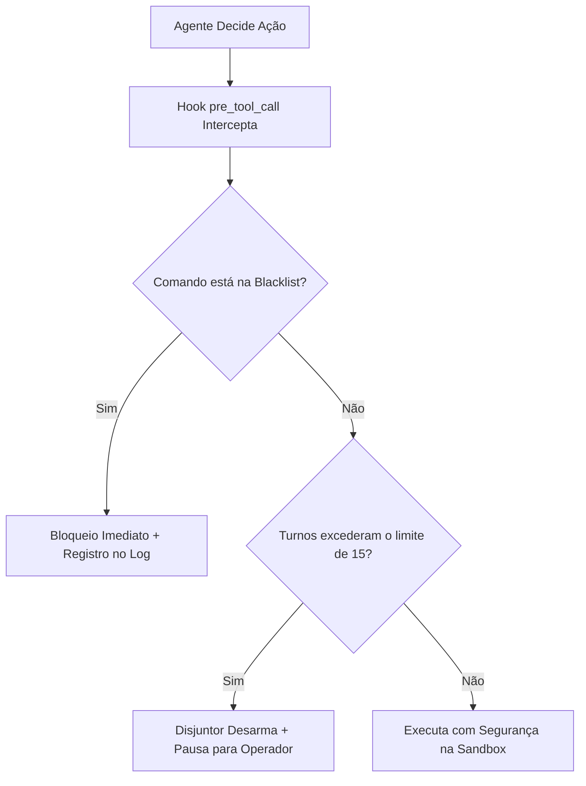

# Capítulo 10: Configuração Industrial: Circuit Breakers e Sandbox

## 1. Introdução

Você conheceu os três princípios da segurança agêntica no capítulo anterior [1]. Agora, vamos transformar esses conceitos em uma barreira prática e impenetrável dentro do seu computador [1].

Muitos iniciantes sentem receio de usar agentes autônomos que têm acesso ao terminal de comando: *"E se a IA rodar algo perigoso? E se ela quebrar o meu sistema operacional?"* [2].

Esse receio é perfeitamente legítimo para quem usa ferramentas sem configuração [2]. Mas quando você implementa as configurações industriais da Camada 2, o seu computador fica protegido por uma blindagem de software que não depende da "boa vontade" da IA [1] [3].

Neste capítulo, você aprenderá a configurar os **Circuit Breakers industriais**, o **isolamento de terminais (PTYs)** e a criar **Sandboxes Reversíveis** com scripts simples em Python que funcionam tanto no Windows quanto no Linux e macOS [1].

## 2. Explica

### 2.1 Como Funciona a Interceptação de Ferramentas (`pre_tool_call`)

Toda vez que um agente autônomo decide executar uma ação no seu computador (seja ler um arquivo, editar código ou rodar um comando no terminal), ele faz isso emitindo uma chamada de ferramenta (*Tool Call*) [2] [4].

O Harness da Camada 2 coloca um **guarda de trânsito digital** no meio desse caminho [1]:
1. O agente emite: *"Quero executar o comando X"*.
2. O hook `pre_tool_call` intercepta o pedido antes que ele chegue ao terminal [1].
3. O script analisa o comando:
   - Está na lista negra de comandos perigosos? -> **Bloqueia na hora e emite alerta** [3].
   - Já foram executados mais de 15 passos nesta mesma tarefa? -> **Desarma o disjuntor e pausa a execução** [1].
   - O comando é seguro (ex: `pytest` ou `npm run build`)? -> **Permite a execução normalmente** [1].

### 2.2 O Padrão de Sandbox Reversível com Git Worktrees

Para garantir que o código original nunca seja corrompido, a Central de Comando cria automaticamente uma **Sandbox em Worktree** para cada nova funcionalidade [1] [5]:

```text
seu-projeto/                          (Pasta Original / Branch Main)
└── .git/
worktrees/
├── task-auth-login/                  (Sandbox do Agente 1 - Isolada)
└── task-database-sqlite/             (Sandbox do Agente 2 - Isolada)
```

O agente trabalha exclusivamente dentro da sua pasta `worktrees/task-xxx/` [1]. Se tudo der certo, você faz a integração com um clique. Se algo der errado, você apaga a pasta da sandbox e a sua pasta original continua 100% perfeita [1] [5].


### 2.3 O Segredo do 0,01%: Ghost Worktrees e o Loop de Auto-Cura por AST

Nos ambientes de altíssima criticidade, o Engenheiro Agêntico implementa duas técnicas avançadas de segurança e recuperação [1] [6] [7]:

#### 1. Ghost Worktrees (Execução Fantasma em RAM)
Em vez de clonar pastas no disco rígido, o Harness cria um *Worktree Fantasma* diretamente na memória RAM (`tmpfs` ou pasta virtual temporária) [6]. A IA compila o código e executa os testes em velocidade de memória. Se o teste passar, a alteração é consolidada no Git principal; se falhar, o ambiente fantasma é destruído instantaneamente sem deixar nenhum rastro ou arquivo corrompido no disco [6].

#### 2. Loop de Auto-Cura por AST (AST Self-Healing Repair)
Quando um teste automatizado falha, 99% dos amadores colam todo o log de erro no chat. O Engenheiro Agêntico aplica a técnica de **Reparo Automatizado de Programas por AST** [7]:
- O Harness extrai a linha exata da falha no relatório do teste [7].
- Localiza o nó daquela função específica na Árvore Sintática Abstrata (AST) [7] [8].
- Injeta **apenas as 15 linhas daquela função defeituosa** no prompt do agente com a instrução de substituição cirúrgica [1] [7].
- O agente corrige o nó em segundos, sem tocar no restante do sistema [1] [7].

## 3. Ilustra

Veja o fluxo da blindagem de execução:



## 4. Técnica

### Implementação Prática do Interceptor de Segurança (`circuit_breaker.py`)

Veja o script real que você pode usar no seu projeto para interceptar e validar comandos antes da execução [1] [3]:

```python
#!/usr/bin/env python3
# circuit_breaker.py — Guardião de Comandos e Disjuntor da Camada 2
import sys
import re

COMMAND_BLACKLIST = [
    r"rm\s+-rf\s+[/~]",       # Tentativa de apagar raiz ou home
    r"mkfs",                  # Formatação de disco
    r"git\s+push\s+.*--force", # Commit forçado destrutivo
    r"drop\s+database",       # Deleção de banco
    r":\(\)\{ :\|:&\};:",     # Fork bomb
]

def validar_comando(comando: str, turnos_atuais: int, limite_turnos: int = 15) -> bool:
    # 1. Checagem do Disjuntor de Turnos
    if turnos_atuais > limite_turnos:
        print(f"[DISJUNTOR DESARMADO] Limite de {limite_turnos} turnos atingido. Pausando agente.")
        return False
        
    # 2. Checagem da Blacklist de Comandos
    for padrao in COMMAND_BLACKLIST:
        if re.search(padrao, comando, re.IGNORECASE):
            print(f"[COMANDO BLOQUEADO] Padrão proibido detectado: {padrao}")
            return False
            
    print(f"[HARNESS SEGURO] Comando autorizado para execução: {comando[:40]}...")
    return True

if __name__ == "__main__":
    cmd_teste = sys.argv[1] if len(sys.argv) > 1 else "npm test"
    if not validar_comando(cmd_teste, turnos_atuais=5):
        sys.exit(1)
    sys.exit(0)
```

## 5. Aplica

### O Teste de Estresse da Sandbox em Ação

Considere o caso de uma equipe testando uma atualização crítica de biblioteca que poderia quebrar todo o sistema [1]:
- **Sem Sandbox**: Atualizaram a biblioteca direto na pasta principal. O projeto inteiro parou de funcionar e a equipe perdeu dois dias desinstalando pacotes e corrigindo incompatibilidades [1].
- **Com Sandbox em Worktree da Camada 2**: Criaram o worktree `sandbox-update`. O agente testou a atualização, detectou que três componentes antigos quebravam, documentou o erro e a equipe simplesmente deletou a sandbox sem que nenhum usuário fosse afetado [1] [5].

### Exercício
- [ ] Execute o script `circuit_breaker.py` passando o comando `"rm -rf /"` e observe o bloqueio instantâneo com Exit Code 1
- [ ] Crie um Git Worktree manual com `git worktree add ../minha-sandbox -b teste-seguro` e comprove que é uma cópia isolada
- [ ] Configure o `.harness/settings.json` com os limites de turnos, timeout e blacklist adequados ao seu projeto
- [ ] Teste o loop de auto-cura por AST: force uma falha de teste e observe o agente corrigindo apenas a função defeituosa

## 6. Fixa

### Exercício Prático 1: Testando a Interceptação
1. Execute o script `circuit_breaker.py` passando como argumento o comando `"rm -rf /"`.
2. Observe como o disjuntor bloqueia o comando instantaneamente e devolve código de erro seguro (*Exit Code 1*).

### Exercício Prático 2: Criando sua Primeira Sandbox Manual
Abra o terminal e crie um worktree com o comando `git worktree add ../minha-sandbox -b teste-seguro`. Acesse a pasta e comprove que ela é uma cópia isolada e independente do seu projeto.

## 7. Conclusão

**Os 3 pontos que você dominou neste capítulo:**
1. O hook `pre_tool_call` intercepta toda ação do agente antes do terminal, bloqueando comandos da blacklist e desarmando o disjuntor quando os turnos excedem o limite.
2. As Sandboxes Reversíveis em Git Worktrees isolam cada funcionalidade, tornando qualquer falha descartável sem corromper o projeto original.
3. As técnicas avançadas de Ghost Worktrees (execução em RAM) e Auto-Cura por AST permitem reparo cirúrgico de funções defeituosas sem tocar no restante do sistema.

**Desafio final:** Configure o `circuit_breaker.py` completo no seu projeto e teste os 3 cenários: bloqueio de comando perigoso, desarme por excesso de turnos e execução segura em sandbox. Se qualquer um falhar, revise a configuração até o Exit Code correto.

**No próximo capítulo**, você vai conhecer o Guarda-Costas do Git — os 6 Gates de Pre-Commit que inspecionam o código em seis barreiras de proteção antes de cada commit.

## 8. Referências Bibliográficas

[1] PROJETO ARSENAL. *Configuração Industrial de Disjuntores e Sandboxes Reversíveis*. São Paulo: Fábrica Agêntica, 2026.

[2] ANTHROPIC. *Model Safety and Tool Call Interception Guidelines*. São Francisco: Anthropic Developer Guides, 2024.

[3] NYGARD, Michael T. *Release It!: Design and Deploy Production-Ready Software*. Raleigh: Pragmatic Bookshelf, 2018.

[4] MODEL CONTEXT PROTOCOL. *Security and Permissions Architecture*. Open Source Standard, 2024.

[5] CHACON, Scott; STRAUB, Ben. *Pro Git: Worktrees and Isolated Workflows*. 2. ed. Nova York: Apress, 2014.

[6] MCKUSICK, Marshall Kirk et al. *The Design and Implementation of the FreeBSD Operating System*. 2. ed. Boston: Addison-Wesley, 2014.
[7] WEIMER, Westley et al. *Automatically Finding Patches Using Genetic Programming*. IEEE Transactions on Software Engineering, v. 38, n. 4, p. 775-795, 2012.
[8] AHO, Alfred V. et al. *Compilers: Principles, Techniques, and Tools*. 2. ed. Boston: Addison-Wesley, 2006.
