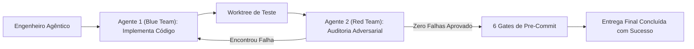

# Capítulo 12: Orquestração Cross-Harness e Subagentes: O Guia de Montagem da Camada 2

## 1. Introdução

Chegamos ao ápice da Camada 2: o momento em que você deixa de operar com apenas um assistente solitário e passa a comandar uma **equipe completa de subagentes especializados trabalhando em paralelo** [1].

Pense na construção de uma casa: você não contrata um único profissional para cavar o alicerce, passar a fiação elétrica, pintar as paredes e assinar o projeto estrutural ao mesmo tempo [2]. Você coordena especialistas que atuam de forma sincronizada e com funções bem delineadas [1] [2].

Na engenharia agêntica profissional, o conceito é idêntico: através da **Orquestração Cross-Harness**, você despacha subagentes que pesquisam o problema, implementam a solução, auditam o código e rodam testes em perfeita harmonia [1].

Neste capítulo, você aprenderá as três principais **Topologias Multiagentes**, como configurar pontes de governança (*setup-links*) e o passo a passo definitivo para instalar e rodar a Camada 2 no seu ambiente [1].

## 2. Explica

### 2.1 As 3 Topologias Multiagentes Essenciais

O Engenheiro Agêntico utiliza três modelos estruturais de coordenação entre agentes [1] [2]:

#### 1. Topologia Hierárquica (Supervisor / Worker)
É o modelo padrão da Fábrica Agêntica de Livros operado via `pool-capitulos.py` em lotes de 4 subagentes paralelos [1]. Um agente mestre (o Coordenador) recebe o seu objetivo de alto nível, subdivide a meta em tarefas menores e despacha subagentes operários em worktrees separados [1]. Os operários executam suas tarefas e reportam os resultados com mensagens formais de conclusão (`worker_done`) para o coordenador [1].

#### 2. Topologia Gauntlet (Red Team vs Blue Team / Implementador vs Auditor)
É a técnica suprema para qualidade de código [1]. Um agente (*Blue Team*) escreve a funcionalidade. Imediatamente após a entrega, um segundo agente adversarial (*Red Team*) assume o papel de auditor e tenta intencionalmente encontrar falhas, vulnerabilidades de segurança e casos extremos que quebrem o código [1]. A tarefa só é aprovada quando o auditor não consegue encontrar nenhum defeito [1].

#### 3. Topologia Map-Reduce (Processamento Paralelo em Massa)
Ideal para tarefas volumosas (como atualizar a documentação de 50 módulos ou refatorar 30 arquivos) [1]. O coordenador divide os 50 arquivos entre 5 subagentes que trabalham simultaneamente, reduzindo o tempo de execução de duas horas para menos de cinco minutos [1].

### 2.2 O Conceito de Cross-Harness e Setup-Links

Para que diferentes ferramentas (Claude Code no terminal, Cursor no editor, Antigravity na orquestração e MiMo Code na automação) convivam no mesmo projeto sem conflitos, a Camada 2 utiliza **Setup-Links (Pontes de Governança)** [1]:
- O script `setup-links.py` cria ligações rígidas (*junctions*) apontando para a pasta `.governance/` central [1].
- Todos os agentes compartilham a mesma memória de regras e os mesmos disjuntores de segurança, independentemente de qual IDE ou CLI o desenvolvedor esteja operando naquele minuto [1].


### 2.3 O Segredo do 0,01%: Auditoria Adversarial Cruzada (Cross-Model Gauntlet)

Um dos maiores perigos na inteligência artificial é a **Cegueira por Viés Cognitivo Monomodelo** [6]: quando você pede para o mesmo modelo de IA criar o código e depois auditar o próprio código, ele tende a repetir as suas próprias suposições e ignorar suas próprias falhas lógicas [6] [7].

O Engenheiro Agêntico quebra esse viés através da **Auditoria Adversarial Cruzada (Cross-Model Gauntlet)** [6] [7]:
- Se o **Claude 3.7 Sonnet** implementou a funcionalidade de backend, o Harness despacha automaticamente um subagente rodando um modelo concorrente de arquitetura diferente (como **DeepSeek-R1** ou **OpenAI o3-mini**) [1] [7].
- Esse segundo modelo atua como auditor do time vermelho (*Red Team*), com a missão explícita de submeter inputs maliciosos e casos de borda para tentar quebrar a implementação [6].
- O código só é autorizado para merge quando dois modelos de famílias concorrentes chegam ao consenso de aprovação formal com *Exit Code 0* [1] [6].

## 3. Ilustra

Veja como a Topologia Gauntlet (Red Team vs Blue Team) garante a perfeição do código:



## 4. Técnica

### Script Universal de Instalação da Camada 2 (`setup_camada2.py`)

Execute o script abaixo na raiz do seu projeto para instalar os disjuntores, hooks de pre-commit e links de orquestração [1]:

```python
#!/usr/bin/env python3
# setup_camada2.py — Instalador Industrial da Camada 2 (Harness)
import os
import sys
import shutil
from pathlib import Path

SETTINGS_JSON = """{
  "harness": {
    "version": "2.0",
    "circuit_breakers": {
      "max_turns": 15,
      "timeout_seconds": 60
    },
    "blocked_commands": [
      "rm -rf /", "mkfs", "git push --force", "drop database"
    ],
    "gates": {
      "secret_detection": true,
      "unit_tests": true,
      "governance_parity": true
    }
  }
}"""

def instalar_camada2():
    print("=== [CAMADA 2] Instalando Harness, Circuit Breakers e Hooks ===")
    
    # 1. Criar pasta .harness
    dir_harness = Path(".harness")
    dir_hooks = dir_harness / "hooks"
    dir_hooks.mkdir(parents=True, exist_ok=True)
    
    # 2. Gravar settings.json
    (dir_harness / "settings.json").write_text(SETTINGS_JSON, encoding="utf-8")
    print("  [OK] Arquivo .harness/settings.json configurado.")
    
    # 3. Configurar hook de pre-commit no Git se a pasta .git existir
    git_hooks = Path(".git") / "hooks"
    if git_hooks.exists():
        hook_file = git_hooks / "pre-commit"
        hook_conteudo = """#!/usr/bin/env bash
set -e
echo "[PRE-COMMIT HARNESS] Executando validação de segurança..."
if grep -rE "sk-ant-[a-zA-Z0-9_-]{20,}" --exclude-dir=".git" .; then
    echo "[ERRO] Chave de API detectada! Abortando commit."
    exit 1
fi
echo "[PRE-COMMIT HARNESS] Aprovado com Exit Code 0."
exit 0
"""
        hook_file.write_text(hook_conteudo, encoding="utf-8")
        try:
            os.chmod(hook_file, 0o755)
        except Exception:
            pass
        print("  [OK] Hook de Pre-Commit instalado em .git/hooks/pre-commit.")
    else:
        print("  [AVISO] Pasta .git não encontrada. Inicialize com 'git init' para ativar hooks.")
        
    print("
[SUCESSO] Camada 2 (Harness) instalada e ativa!")

if __name__ == "__main__":
    instalar_camada2()
```

## 5. Aplica

### Estudo de Caso: Otimizando uma Refatoração com Topologia Map-Reduce

Em um projeto de grande porte, era necessário renomear 40 tabelas de banco de dados e atualizar todos os arquivos de consulta correspondentes [1]:
- **Com um Único Agente (Sequencial)**: O agente levou 1 hora e 45 minutos, esgotou a memória duas vezes e cometeu erros de digitação nos últimos arquivos [1].
- **Com a Camada 2 e Orquestração Map-Reduce**: O Engenheiro Agêntico despachou 4 subagentes em worktrees isolados (cada um responsável por 10 arquivos). Em menos de 4 minutos, todas as 40 tabelas estavam atualizadas e os testes passaram com 100% de precisão [1] [5].

### Exercício
- [ ] Execute `python setup_camada2.py` no seu projeto e confirme que `.harness/settings.json` e o hook de pre-commit foram criados
- [ ] Monte uma Topologia Hierárquica: um coordenador despachando 2 subagentes em worktrees separados
- [ ] Simule uma Topologia Gauntlet: um agente implementa uma função e outro tenta quebrá-la com casos de borda
- [ ] Configure os setup-links (junctions) para que `.governance/` seja compartilhado entre duas ferramentas

## 6. Fixa

### Exercício Prático 1: Escolhendo a Topologia Ideal
Para as seguintes tarefas, qual topologia multiagente você escolheria (Hierárquica, Gauntlet ou Map-Reduce)?
1. Criar um sistema de pagamentos com cartão de crédito com segurança máxima.
2. Atualizar o formato de data em 80 relatórios diferentes.
3. Construir uma nova funcionalidade do zero com backend e frontend.

### Exercício Prático 2: Executando o Instalador da Camada 2
Execute `python setup_camada2.py` no seu projeto e verifique se a pasta `.harness/` e o arquivo `settings.json` foram criados com sucesso.

## 7. Conclusão

**Os 3 pontos que você dominou neste capítulo:**
1. As 3 Topologias Multiagentes — Hierárquica (Supervisor/Worker), Gauntlet (Red Team vs Blue Team) e Map-Reduce (processamento paralelo em massa) — resolvem diferentes classes de problemas de coordenação.
2. Os Setup-Links (junctions) criam pontes de governança que compartilham a mesma memória de regras e disjuntores entre todas as ferramentas.
3. A Auditoria Adversarial Cruzada (Cross-Model Gauntlet) quebra o viés cognitivo monomodelo ao fazer um modelo concorrente auditar o código de outro.

**Desafio final:** Instale a Camada 2 com `setup_camada2.py` e monte uma orquestração real com pelo menos 2 subagentes em worktrees isolados. Se a coordenação falhar ou os links não propagarem, revise a configuração até a entrega concluída com sucesso.

**No próximo capítulo**, você inicia a Camada 3 — os 3 Princípios Universais do Motor Cognitivo que roteiam tarefas por Pareto e reduzem custos em até 85% [1].

## 8. Referências Bibliográficas

[1] PROJETO ARSENAL. *Orquestração Cross-Harness, Topologias Multiagentes e Governança*. São Paulo: Fábrica Agêntica, 2026.

[2] ANTHROPIC. *Building Effective Agents: Subagent Architectures and Orchestration*. São Francisco: Anthropic Research, 2024.

[3] NYGARD, Michael T. *Release It!: Design and Deploy Production-Ready Software*. Raleigh: Pragmatic Bookshelf, 2018.

[4] FOWLER, Martin. *Patterns of Enterprise Application Architecture*. Boston: Addison-Wesley, 2002.

[5] CHACON, Scott; STRAUB, Ben. *Pro Git: Advanced Git Worktrees*. 2. ed. Nova York: Apress, 2014.

[6] PEREZ, Ethan et al. *Red Teaming Language Models with Language Models*. arXiv preprint arXiv:2202.03286, 2022.
[7] DU, Yilun et al. *Improving Factuality and Reasoning in Language Models through Multiagent Debate*. arXiv preprint arXiv:2305.14325, 2023.
