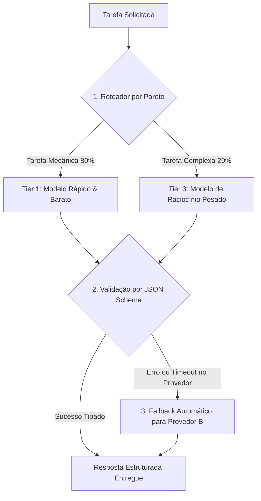

# Capítulo 13: Os 3 Princípios Universais do Motor Cognitivo (A Camada 3)

## 1. Introdução

Imagine que você é o proprietário de uma empresa de logística. Se um cliente pede para entregar um envelope de cartas na esquina, você manda uma motocicleta ágil e econômica, ou contrata uma carreta de dezoito rodas que consome litros de diesel por quilômetro? [1]

A resposta é óbvia: você usa o veículo proporcional à carga [1].

No entanto, no mundo do desenvolvimento com inteligência artificial, a imensa maioria dos iniciantes comete exatamente esse absurdo financeiro todos os dias: usam o modelo de raciocínio mais pesado e caro do planeta (como Claude 3.7 Sonnet Thinking ou OpenAI o1/o3-mini) para tarefas banais como formatar um arquivo JSON ou extrair uma lista de palavras [2] [3].

Para que a sua Central de Comando seja financeiramente sustentável e ultrarrápida, você precisa da **Camada 3 — MOTOR COGNITIVO & ROTEAMENTO** [1].

Neste capítulo, você aprenderá os três princípios científicos que regem a Camada 3: **Roteamento por Pareto (80/20)**, **Contratos Tipados (Structured Outputs)** e **Degradação Graciosa com Fallbacks Automáticos** [1] [4].

## 2. Explica

### 2.1 Princípio 1: Roteamento Semântico por Pareto (A Regra 80/20)

Vilfredo Pareto descobriu no século XIX que cerca de 80% dos efeitos decorrem de 20% das causas [5]. No desenvolvimento de software com IA, a regra se aplica com perfeição [1]:
- **80% das tarefas são mecânicas e simples**: formatação de código, leitura de logs, buscas de texto, renomeação de variáveis e criação de testes repetitivos [1].
- **Apenas 20% das tarefas exigem inteligência profunda**: decisões de arquitetura de banco de dados, design de segurança e resolução de bugs complexos [1].

O **Roteador Semântico** da Camada 3 analisa o pedido e encaminha automaticamente as 80% de tarefas mecânicas para modelos ultrarrápidos e quase gratuitos (Tier 1), reservando os modelos pesados (Tier 3) exclusivamente para os 20% de tarefas críticas [1] [6]. Isso gera uma economia imediata de até **85% na conta de IA** [1].

### 2.2 Princípio 2: Contratos Tipados em Structured Outputs (Zero Alucinação de Formato)

Quando você pede para uma IA comum: *"Me devolva uma lista de usuários em formato JSON"*, ela pode devolver o JSON com aspas erradas, com um texto de introdução antes do código ou com campos faltando [3].

O Engenheiro Agêntico elimina esse risco com **Structured Outputs (Contratos JSON Schema)** [3] [7]:
- Você entrega para a IA um formulário rígido (Schema) [3].
- O próprio motor do provedor de IA ajusta os pesos matemáticos da geração para garantir que 100% dos caracteres gerados sigam rigorosamente a estrutura esperada [3].
- A taxa de erro de formato cai literalmente para **zero** [1] [3].

### 2.3 Princípio 3: Degradação Graciosa e Fallbacks Automáticos (Zero Downtime)

Nenhum provedor de IA da internet possui 100% de disponibilidade o ano todo [1]. Servidores sofrem instabilidades, atingem limites de taxa (*Rate Limits*) ou entram em manutenção [2].

A Camada 3 implementa **Fallbacks Automáticos (Degradação Graciosa)** [1] [8]:
- Se a API principal (ex: Anthropic Claude) falhar ou der timeout de 10 segundos, o roteador redireciona a mesma solicitação instantaneamente para a API secundária (ex: DeepSeek ou OpenAI) [1].
- O seu sistema nunca trava e o seu trabalho nunca é interrompido por instabilidades de um único provedor [1] [8].


### 2.4 Projeto HubCliente na Camada 3: Roteando a Ingestão de Planilhas

No sistema **HubCliente**, a ingestão das planilhas antigas dos clientes é processada pelo Roteador Cognitivo [1]:
- O **Tier 1 (Flash)** lê as 1.000 linhas da planilha Excel e limpa os espaços em branco por centavos de real [1] [6].
- O **Tier 2 (Sonnet/Codex)** cria a tela do formulário web com botões e validações visuais [1].
- O **Tier 3 (Raciocínio Profundo)** projeta o algoritmo de validação criptográfica de CPF e a segurança das sessões em JSON Schema [1] [3].

## 3. Ilustra

Veja o fluxo inteligente de decisão do Motor Cognitivo:



## 4. Técnica

### Exemplo de Roteador Semântico Simples em Python (`semantic_router.py`)

Veja como é simples construir um roteador em Python que direciona tarefas por complexidade [1] [6]:

```python
#!/usr/bin/env python3
# semantic_router.py — Roteador Cognitivo da Camada 3
import sys

# Matriz de Tiers
TIER_1_FAST = "gemini-2.0-flash"      # Quase gratuito / Rápido
TIER_2_DEV  = "claude-3-7-sonnet"     # Desenvolvimento equilibrado
TIER_3_DEEP = "claude-3-7-thinking"   # Raciocínio arquitetural pesado

PALAVRAS_CHAVE_COMPLEXAS = ["arquitetura", "seguranca", "refatorar sistema", "algoritmo", "otimizar sql"]

def rotear_tarefa(descricao_tarefa: str) -> str:
    texto = descricao_tarefa.lower()
    
    # Tarefas Críticas (Tier 3)
    if any(p in texto for p in PALAVRAS_CHAVE_COMPLEXAS):
        print(f"[ROTEADOR C3] Tarefa Crítica detectada -> Roteando para TIER 3 ({TIER_3_DEEP})")
        return TIER_3_DEEP
        
    # Tarefas de Codificação Padrão (Tier 2)
    if any(p in texto for p in ["criar funcao", "escrever teste", "adicionar endpoint", "consertar"]):
        print(f"[ROTEADOR C3] Desenvolvimento Padrão -> Roteando para TIER 2 ({TIER_2_DEV})")
        return TIER_2_DEV
        
    # Tarefas Mecânicas (Tier 1)
    print(f"[ROTEADOR C3] Tarefa Mecânica Simples -> Roteando para TIER 1 ({TIER_1_FAST})")
    return TIER_1_FAST

if __name__ == "__main__":
    prompt = sys.argv[1] if len(sys.argv) > 1 else "Formatar o arquivo de logs"
    modelo_escolhido = rotear_tarefa(prompt)
    print(f"Modelo alocado: {modelo_escolhido}")
```

## 5. Aplica

### O Caso do Roteamento que Salvou uma Folha de Pagamento

Uma empresa utilizava Claude 3.7 Sonnet para analisar 10.000 currículos de candidatos a vagas de emprego [1]:
- **Sem Roteador**: Gastavam US$ 0.15 por currículo analisado. Para 10.000 currículos, a fatura atingiu US$ 1.500,00 [1].
- **Com a Camada 3 e Roteamento Semântico**:
  1. O **Tier 1 (Flash)** extraiu os nomes, telefones e cargos em formato JSON estruturado por US$ 0.002 por currículo [6] [7].
  2. Apenas os 500 candidatos qualificados foram enviados para o **Tier 3 (Raciocínio)** avaliar a aderência técnica [6].
- **O Resultado**: O custo total despencou de US$ 1.500,00 para US$ 38.00, com o mesmo nível de precisão [1].

### Exercício
- [ ] Execute `semantic_router.py` com as frases "Formatar o arquivo de logs", "criar funcao de login" e "desenhar arquitetura de seguranca" e observe a alocação de tiers
- [ ] Classifique 5 tarefas reais do seu dia a dia entre Tier 1, Tier 2 e Tier 3
- [ ] Defina um JSON Schema para uma resposta de API e teste que o modelo devolve exatamente a estrutura esperada
- [ ] Simule uma falha do provedor principal e verifique o fallback automático para o provedor secundário

## 6. Fixa

### Exercício Prático 1: Classificando Tarefas em Tiers
Classifique as seguintes tarefas entre Tier 1 (Rápido), Tier 2 (Dev) ou Tier 3 (Raciocínio Profundo):
1. Renomear 10 arquivos `.js` para `.ts`.
2. Desenhar a arquitetura de segurança de um banco de dados financeiro.
3. Criar uma tela de cadastro de usuário em React.

### Exercício Prático 2: Testando o Roteador
Execute o script `semantic_router.py` passando diferentes frases como argumento e observe a alocação automática de modelos.

## 7. Conclusão

**Os 3 pontos que você dominou neste capítulo:**
1. O Roteamento por Pareto (80/20) [5] encaminha as tarefas mecânicas para modelos rápidos e baratos, reservando os modelos pesados para os 20% de tarefas críticas — gerando economia de até 85% [6].
2. Os Contratos Tipados (Structured Outputs) com JSON Schema eliminam a alucinação de formato, garantindo respostas 100% aderentes à estrutura esperada [3].
3. A Degradação Graciosa com Fallbacks Automáticos garante zero downtime ao redirecionar a solicitação para um provedor secundário quando o principal falha.

**Desafio final:** Implemente o `semantic_router.py` no seu projeto e roteie pelo menos 10 tarefas reais. Meça o custo antes e depois; se a economia não for superior a 80%, revise as palavras-chave e os tiers.

**No próximo capítulo**, você vai dominar a Matriz de 3 Tiers de Modelos — como escolher exatamente qual modelo usar na prática e configurar a transição entre eles.

## 8. Referências Bibliográficas

[1] PROJETO ARSENAL. *Manual da Camada 3: Motor Cognitivo, Roteamento Semântico e Contratos Tipados*. São Paulo: Fábrica Agêntica, 2026.

[2] ANTHROPIC. *Claude 3.7 Sonnet and Hybrid Reasoning Architecture*. São Francisco: Anthropic Research, 2025.

[3] OPENAI. *Structured Outputs and JSON Schema Specification*. São Francisco: OpenAI Developer Guides, 2024.

[4] NYGARD, Michael T. *Release It!: Design and Deploy Production-Ready Software*. Raleigh: Pragmatic Bookshelf, 2018.

[5] PARETO, Vilfredo. *Cours d'Économie Politique*. Genebra: Droz, 1896.

[6] DEEPSEEK AI. *DeepSeek-V3 Technical Report: Architecture and Economics*. Pequim: DeepSeek, 2024.

[7] GOOGLE. *Gemini 2.0 Flash: Architecture, Latency and Efficiency Report*. Mountain View: Google DeepMind, 2024.

[8] FOWLER, Martin. *Circuit Breaker and Graceful Degradation Patterns*. martinfowler.com, 2014.
